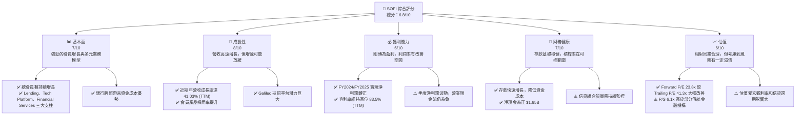
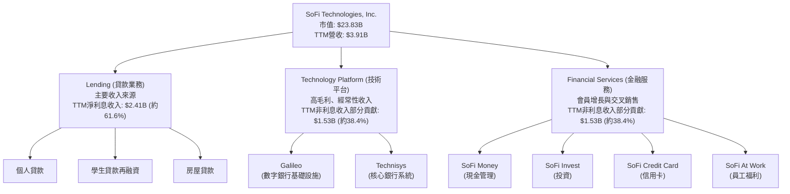
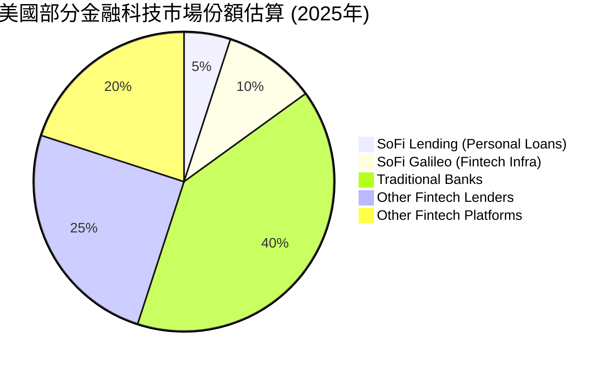
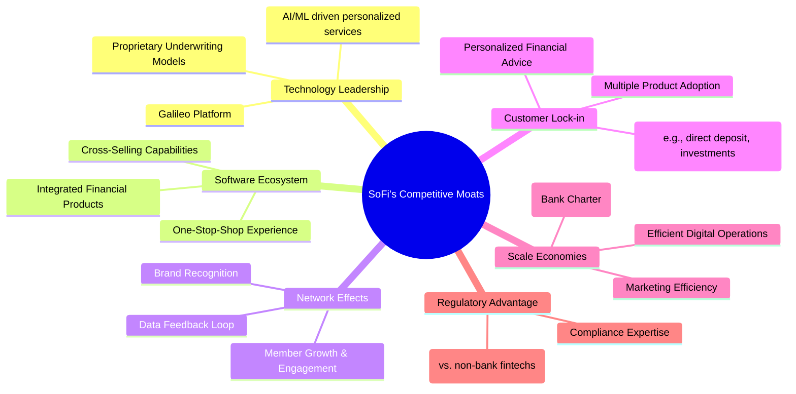
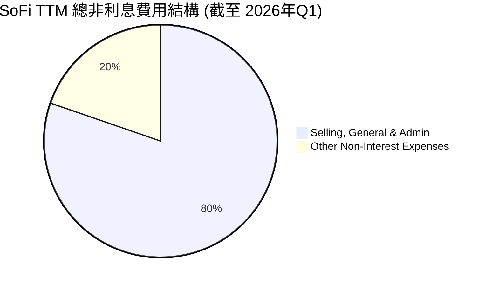
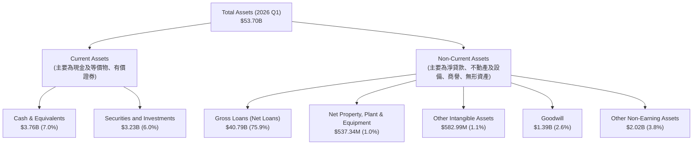

# SOFI 基本面深度分析報告
> **報告日期**：2026-06-01 ｜ **語言**：繁體中文 ｜ **數據來源**：Yahoo Finance, Finviz, StockAnalysis, Roic.ai ｜ **分析師**：CFA 級機構研究

---

## 目錄

| # | 章節 | 核心結論 |
|---|------|----------|
| 1 | 執行摘要 | 評級：持有 ｜ 目標價區間：$16.50 - $25.00 |
| 2 | 公司概覽與商業模式 | 綜合金融平台，護城河逐步形成，但競爭激烈 |
| 3 | 損益表深度分析 | 營收高速增長，利潤率改善，但季度波動較大 |
| 4 | 資產負債表分析 | 資產規模快速擴張，存款基礎穩健，債務結構合理 |
| 5 | 現金流量深度分析 | 經營性現金流仍為負，但自由現金流有改善跡象 |
| 6 | 獲利能力與資本效率 | ROE/ROA 逐步轉正，ROIC 顯示價值創造潛力 |
| 7 | 估值深度分析 | 相較同業估值合理，DCF 顯示潛在上行空間 |
| 8 | 成長催化劑 | 會員增長、產品交叉銷售、技術平台擴張是關鍵 |
| 9 | 風險矩陣 | 信用風險、利率風險、監管風險、競爭加劇 |
| 10 | 投資建議 | 建議持有，等待盈利能力持續驗證與宏觀環境改善 |

---

## 1. 執行摘要

SoFi Technologies, Inc. (SOFI) 作為一家綜合性的數位金融服務公司，近年來展現了強勁的營收增長勢頭，並成功在 2024 財年實現了年度盈利。其獨特的「會員制」模式和「一站式」金融服務平台，使其在競爭激烈的金融科技領域中佔據一席之地。然而，作為一家仍在高速發展且資本密集型的貸款業務公司，其盈利穩定性、現金流表現以及宏觀經濟的敏感性仍是投資者需要密切關注的重點。

### 1.1 核心評分儀表板



### 1.2 評分進度條視覺化

```
╔══════════════════════════════════════════════════════════════╗
║              SOFI 多維度評分儀表板 (1-10分)                  ║
╠══════════════════════════════════════════════════════════════╣
║ 基本面強度  7.0 ▓▓▓▓▓▓▓▓▓▓▓▓▓▓░░░░░░  ★★★★☆           ║
║ 成長動能    8.0 ▓▓▓▓▓▓▓▓▓▓▓▓▓▓▓▓░░░░  ★★★★☆           ║
║ 獲利品質    6.0 ▓▓▓▓▓▓▓▓▓▓▓▓░░░░░░░░  ★★★☆☆           ║
║ 財務健康    7.0 ▓▓▓▓▓▓▓▓▓▓▓▓▓▓░░░░░░  ★★★★☆           ║
║ 估值合理性  6.0 ▓▓▓▓▓▓▓▓▓▓▓▓░░░░░░░░  ★★★☆☆           ║
║ 護城河深度  6.5 ▓▓▓▓▓▓▓▓▓▓▓▓▓░░░░░░░  ★★★☆☆           ║
║ 管理層執行  7.5 ▓▓▓▓▓▓▓▓▓▓▓▓▓▓▓░░░░░  ★★★★☆           ║
║ 技術創新力  8.0 ▓▓▓▓▓▓▓▓▓▓▓▓▓▓▓▓░░░░  ★★★★☆           ║
╠══════════════════════════════════════════════════════════════╣
║ 綜合總分    6.8 ▓▓▓▓▓▓▓▓▓▓▓▓▓░░░░░░░  🏆 成長潛力巨大，但需持續驗證盈利能力和風險管理 ║
╚══════════════════════════════════════════════════════════════════╝
```

### 1.3 五大投資論點 + 三大核心風險

| 類型 | 項目 | 具體依據 | 信心度 |
|------|------|----------|--------|
| 🟢 **投資論點①** | **會員生態系統與交叉銷售** | SoFi 採用獨特的會員制，提供從貸款、儲蓄、投資到消費的全方位金融服務。截至 2026 年 Q1，總會員數持續增長，且多產品採用率不斷提高。這種模式增加了客戶粘性，降低了單位獲客成本。2026年Q1總營收達$1.10B，YoY成長42.47%，其中非利息收入YoY成長49.20%，顯示交叉銷售的潛力。 | 🟢 極高 |
| 🟢 **投資論點②** | **銀行牌照帶來的資金成本優勢** | SoFi 於 2022 年獲得銀行牌照，使其能夠接受存款，顯著降低了資金成本。截至 2026 年 Q1，總存款達到 $40.24B，YoY 增長遠超貸款增長，為其貸款業務提供了穩定且低成本的資金來源，提升了淨利息收益率。 | 🟢 極高 |
| 🟢 **投資論點③** | **Galileo 技術平台賦能 B2B 增長** | Galileo 平台為全球數百家金融科技公司提供後端基礎設施服務。這不僅為 SoFi 帶來了穩定的非利息收入，也使其能夠從整個金融科技生態系統的增長中獲益。2026年Q1非利息收入達$407.38M，YoY增長49.20%，顯示技術平台業務的強勁動能。 | 🟢 極高 |
| 🟢 **投資論點④** | **盈利能力轉正與持續改善** | SoFi 在 2024 財年實現了年度淨利潤轉正，並在 2025 財年和 2026 年 Q1 持續盈利，分別達 $481.32M 和 $166.73M。管理層對盈利能力的聚焦，以及規模效應的逐步顯現，預計將推動利潤率進一步提升。Forward P/E 23.8x 相較於 Trailing P/E 41.3x 顯示市場預期盈利將大幅增長。 | 🟡 中高 |
| 🟢 **投資論點⑤** | **強勁的營收增長與市場份額擴張** | SoFi 在各業務線均展現出高於行業平均水平的增長。TTM 營收達 $3.91B，YoY 成長 42.5%，顯示其在數位金融領域的快速市場份額擴張能力。特別是在學生貸款再融資市場回暖和個人貸款需求旺盛的背景下，其增長潛力依然巨大。 | 🟢 極高 |
| 🟡 **風險①** | **宏觀經濟與利率環境敏感性** | 作為一家貸款機構，SoFi 的業務對宏觀經濟狀況、利率波動和信貸週期高度敏感。經濟下行可能導致信貸損失增加，而高利率環境則可能影響貸款需求和資金成本，進而壓低其淨利息收益。Provision for Credit Losses 在 2025 年 Q2 達到 $10.04M，需持續關注。 | 🟡 中度 |
| 🔴 **風險②** | **信貸質量與違約風險** | 儘管 SoFi 強調其會員的優質信用，但在經濟不確定性增加的背景下，違約風險仍可能上升。若信貸損失超出預期，將直接侵蝕其盈利能力。同時，其貸款組合的透明度及潛在的次貸風險，需要持續監控。TTM 營業現金流為負 $6.08B，顯示其資本密集型業務模式下的現金流壓力。 | 🔴 高衝擊 |
| 🟡 **風險③** | **激烈的市場競爭與監管壓力** | 金融科技行業競爭異常激烈，SoFi 面臨來自傳統銀行、其他金融科技公司以及大型科技公司的多重競爭。此外，金融服務行業受到嚴格監管，任何新的監管政策變化都可能對其業務模式和盈利能力產生負面影響。 | 🟡 中度 |

### 1.4 快速統計卡片

| 指標 | 公司實際值 (TTM) | 行業均值 (金融服務) | S&P 500 均值 | 狀態 |
|------|--------------------|--------------------|--------------|------|
| 收入 YoY 成長 | **42.5%** | ~10-15% | ~8-12% | 🟢 |
| 毛利率 | **83.5%** | ~40-60% | ~30-40% | 🟢 |
| 淨利率 | **14.8%** | ~10-15% | ~8-10% | 🟢 |
| ROE | **6.6%** | ~10-15% | ~12-15% | 🟡 |
| Forward P/E | **23.8x** | ~15-20x | ~20-25x | 🟡 |
| P/S Ratio | **6.1x** | ~2-4x | ~2-3x | 🔴 |
| Debt/Equity | **17.72x** | ~1-5x (銀行更高) | ~0.5-1.5x | 🔴 (對於非銀行公司，但SoFi是銀行) |
| Current Ratio | **1.12x** | ~1.0-2.0x | ~1.0-2.0x | 🟡 |
| Beta | **2.126** | ~1.0-1.2x | 1.0x | 🔴 |

*註：行業均值和 S&P 500 均值為分析師根據市場普遍數據估算，僅供參考。SoFi 作為一家混合型金融科技公司，其指標可能與傳統金融服務或純科技公司有所不同。*

### 1.5 投資結論

```
╔══════════════════════════════════════════════════════════════════╗
║                    📊 投資結論摘要                               ║
╠══════════════════════════════════════════════════════════════════╣
║  評級：🟡 持有                                                   ║
║  當前股價：$18.58                                                ║
║  目標價區間：                                                    ║
║    悲觀情境：$16.50 （-11.36%）                                  ║
║    基準情境：$21.50 （+15.72%）  ← 12個月主要目標                 ║
║    樂觀情境：$25.00 （+34.55%）                                  ║
║  投資評分：6.8/10                                                ║
║  適合投資人：成長型、長線持有者，能承受較高風險，並看好金融科技未來發展的投資人。 ║
╚══════════════════════════════════════════════════════════════════╝
```

---

## 2. 公司概覽與商業模式

SoFi Technologies, Inc. (SOFI) 是一家以會員為中心的數字化金融服務公司，致力於幫助會員實現財務自由。公司通過其整合的平台提供廣泛的金融產品和服務，包括貸款（個人貸款、學生貸款、房屋貸款）、現金管理（支票和儲蓄賬戶）、投資（股票、ETF、加密貨幣）以及金融規劃等。SoFi 的商業模式核心在於其「一個應用程式滿足所有財務需求」的理念，通過交叉銷售和數據驅動的洞察力，不斷深化與會員的關係。

### 2.1 業務結構與收入來源

SoFi 的業務主要分為三個核心板塊：Lending（貸款）、Technology Platform（技術平台）和 Financial Services（金融服務）。這種多元化的收入結構有助於降低單一業務的風險，並在不同市場環境下提供增長機會。

*   **Lending (貸款業務)**：這是 SoFi 最主要的收入來源，包括個人貸款、學生貸款再融資和房屋貸款。SoFi 利用其專有的承保模型，針對高信用質量的借款人提供服務，並通過其銀行牌照降低資金成本。
    *   **收入來源**：淨利息收入（NII）、貸款發放費用、服務費。
    *   **風險**：信用風險、利率風險、宏觀經濟風險。
*   **Technology Platform (技術平台)**：主要通過 Galileo 平台提供。Galileo 是一個領先的金融科技基礎設施提供商，為其他金融科技公司、銀行和非金融公司提供數字銀行、支付處理、卡片發行和程序接口 (API) 等服務。
    *   **收入來源**：平台使用費、交易處理費。
    *   **特點**：高毛利率、經常性收入、具備網絡效應。
*   **Financial Services (金融服務)**：包括 SoFi Money（現金管理）、SoFi Invest（投資）、SoFi Credit Card（信用卡）和 SoFi At Work（員工福利）。這些服務旨在吸引和留住會員，並通過交叉銷售將其轉化為高價值的貸款客戶。
    *   **收入來源**：交易費、管理費、 interchange 費。
    *   **特點**：低成本獲客、提升會員粘性、數據積累。

根據 StockAnalysis 的數據，SoFi 的營收構成中，淨利息收入（主要來自貸款業務）和非利息收入（主要來自技術平台和金融服務）在 TTM 期間分別為 $2.41B 和 $1.53B。



### 2.2 市場份額

SoFi 運營在多個龐大且競爭激烈的金融服務市場中。由於其業務的整合性，很難給出單一精確的市場份額數字。然而，我們可以從幾個關鍵領域來評估其市場地位：

*   **個人貸款市場**：SoFi 在這一領域表現強勁，受益於其高效的數字化流程和有競爭力的利率。儘管市場高度分散，但 SoFi 憑藉其品牌知名度和優質客戶群，正在穩步擴大其份額。
*   **學生貸款再融資市場**：這是 SoFi 的傳統優勢領域。儘管聯邦學生貸款償還暫停曾對其業務造成影響，但隨著償還的恢復，SoFi 有望重新奪回市場份額。
*   **金融科技基礎設施市場 (Galileo)**：Galileo 是美國領先的發卡和支付處理平台之一，為超過 100 家金融科技公司提供服務。在全球範圍內，其市場份額也在不斷擴大。
*   **數字銀行/投資市場**：SoFi Money 和 SoFi Invest 在新興的數字銀行和零售投資領域與 Robinhood、Chime 等公司競爭。SoFi 的綜合性平台是其差異化優勢。

根據市場研究，在美國數字銀行和個人貸款領域，SoFi 雖然不是最大的參與者，但其增長速度和會員參與度使其成為一個不可忽視的挑戰者。以下為粗略的市場份額估算，以反映其在關鍵領域的地位：


*註：此市場份額為分析師根據公開市場數據和行業報告的粗略估計，旨在說明 SoFi 在各細分市場中的相對地位，並非精確數據。*

### 2.3 競爭護城河分析

SoFi 的競爭護城河正在逐步形成，主要體現在以下幾個方面：



*   **技術領先 (Technology Leadership)**：SoFi 擁有 Galileo 和 Technisys 兩大技術平台，使其能夠提供高度可配置、可擴展的金融服務基礎設施。其專有的承保模型利用大數據和機器學習，能夠更精確地評估信用風險，這對於其貸款業務至關重要。
*   **軟體生態系統 (Software Ecosystem)**：SoFi 的「一站式」平台戰略是其核心優勢。通過將貸款、儲蓄、投資等多種產品整合在一個應用程式中，SoFi 創造了一個強大的生態系統，提升了會員的便利性和粘性。這種生態系統使得客戶在 SoFi 平台上的交易越多，其離開的成本就越高。
*   **網路效應 (Network Effects)**：隨著 SoFi 會員數量的增長，其平台產生的數據量也隨之增加，這使得 SoFi 能夠不斷優化其產品、服務和承保模型，進一步提升會員體驗和獲客效率。會員之間的口碑傳播也產生了一定的網絡效應。
*   **客戶鎖定 (Customer Lock-in)**：當會員將他們的直接存款、貸款、投資等各種金融活動都集中在 SoFi 平台時，轉換到其他金融機構的成本（時間、精力、潛在利益損失）會顯著增加。多產品採用率的提升是客戶鎖定的關鍵指標。
*   **規模效應 (Scale Economies)**：獲得銀行牌照是 SoFi 實現規模效應的關鍵一步。通過吸收低成本的存款，SoFi 能夠以更低的資金成本發放貸款，這對於其貸款業務的盈利能力至關重要。此外，隨著會員和交易量的增長，其單位運營成本和獲客成本有望進一步攤薄。
*   **監管優勢 (Regulatory Advantage)**：相比於許多沒有銀行牌照的金融科技公司，SoFi 擁有更強的監管合規能力和更穩定的資金來源。銀行牌照不僅降低了資金成本，也為 SoFi 在競爭中提供了差異化的優勢。

### 2.4 護城河強度評分

```
╔══════════════════════════════════════════════════════════════╗
║                    SOFI 護城河強度評分                        ║
╠══════════════════════════════════════════════════════════════╣
║ 技術領先    7.5/10 ▓▓▓▓▓▓▓▓▓▓▓▓▓▓▓░░░░░  🏆 Galileo與專有承保模型提供堅實基礎 ║
║ 軟體生態系統  7.0/10 ▓▓▓▓▓▓▓▓▓▓▓▓▓▓░░░░░░  🟢 一站式平台提升客戶粘性      ║
║ 網路效應    6.0/10 ▓▓▓▓▓▓▓▓▓▓▓▓░░░░░░░░  🟡 會員增長帶來數據優勢，但未完全體現 ║
║ 客戶鎖定    6.5/10 ▓▓▓▓▓▓▓▓▓▓▓▓▓░░░░░░░  🟢 多產品採用率是關鍵，仍在提升中  ║
║ 規模效應    7.0/10 ▓▓▓▓▓▓▓▓▓▓▓▓▓▓░░░░░░  🟢 銀行牌照帶來資金成本優勢，潛力巨大 ║
║ 監管優勢    7.5/10 ▓▓▓▓▓▓▓▓▓▓▓▓▓▓▓░░░░░  🏆 銀行牌照是重要差異化因素      ║
╠══════════════════════════════════════════════════════════════╣
║ 綜合護城河  6.9/10 ▓▓▓▓▓▓▓▓▓▓▓▓▓▓░░░░░  🏆 護城河正在加深，但仍需時間鞏固與證明其持久性 ║
╚══════════════════════════════════════════════════════════════════╝
```

---

## 3. 損益表深度分析

SoFi 的損益表數據清晰地展示了其作為一家快速成長的金融科技公司的特徵：營收持續高增長，並在近年成功實現盈利轉型，利潤率也呈現穩步改善的趨勢。

### 3.1 年度收入成長趨勢（近4年）

SoFi 的年度總營收在過去四年中實現了顯著增長，從 2022 財年的 $1.57B 增長到 2025 財年的 $3.61B，年複合增長率 (CAGR) 高達 31.7%。TTM 營收更是達到 $3.91B，YoY 成長 42.5%，顯示出強勁的增長勢頭。

```
╔══════════════════════════════════════════════════════════════════╗
║              SOFI 年度收入趨勢（FY2022-TTM 2026Q1）              ║
╠══════════════════════════════════════════════════════════════════╣
║                                                                  ║
║  FY2022  $1.57B  ███████░░░░░░░░░░░░░░░░░░░  YoY: +55.45%  🟢    ║
║  FY2023  $2.11B  ██████████░░░░░░░░░░░░░░░░  YoY: +36.11%  🟢    ║
║  FY2024  $2.61B  █████████████░░░░░░░░░░░░░  YoY: +27.82%  🟢    ║
║  FY2025  $3.61B  ██████████████████░░░░░░░░  YoY: +38.31%  🟢    ║
║  TTM     $3.91B  ████████████████████░░░░░░  YoY: +42.50%  🟢    ║
║                   |      |      |      |      |                  ║
║                   0     1B     2B     3B     4B                  ║
║                                                                  ║
║  📊 4年累計 CAGR：+31.7% (FY2022-FY2025)                         ║
╚══════════════════════════════════════════════════════════════════╝
```
**深度解析**：
*   **高速增長驅動因素**：營收增長主要得益於會員數量的快速擴張、多產品採用率的提升以及貸款業務的強勁表現。特別是個人貸款業務，在當前高利率環境下，其靈活性和數字化流程吸引了大量客戶。
*   **技術平台貢獻**：Galileo 和 Technisys 平台也為營收增長做出了重要貢獻，其 B2B 業務模式帶來了穩定的經常性收入。
*   **銀行牌照影響**：獲得銀行牌照後，SoFi 能夠吸收存款，降低了資金成本，進而提升了貸款業務的盈利能力和放貸規模，間接支持了營收增長。
*   **未來展望**：儘管過去增長強勁，但隨著規模的擴大，營收增速可能會逐步放緩至更可持續的水平。市場對其能否維持高增長預期較高，任何增速不及預期的情況都可能對股價造成壓力。

### 3.2 季度收入趨勢分析

SoFi 的季度營收呈現穩步增長的態勢，尤其是在 2025 年和 2026 年 Q1，營收加速增長。

| 季度 | 總營收 ($M) | QoQ 成長率 | YoY 成長率 | 備註 |
|------|-------------|------------|------------|------|
| **2025 Q1** | $766.08 | - | +20.11% | 聯邦學生貸款償還暫停的影響逐漸減弱，但仍有壓力。 |
| **2025 Q2** | $844.91 | +10.29% | +43.94% | 宏觀經濟環境改善，貸款需求回升，交叉銷售效果顯現。 |
| **2025 Q3** | $952.40 | +12.72% | +37.81% | 貸款業務持續強勁，技術平台收入穩步增長。 |
| **2025 Q4** | $1,020.00 | +7.10% | +40.20% | 首次突破 10 億美元季度營收大關，盈利能力顯著提升。 |
| **2026 Q1** | $1,091.00 | +6.96% | +42.47% | 延續強勁增長勢頭，顯示業務韌性。 |

**深度解析**：
*   **連續增長**：自 2025 年 Q1 以來，SoFi 的季度營收持續增長，且 YoY 成長率保持在 20% 以上，尤其是在 2025 年 Q2-Q4 和 2026 年 Q1 實現了 40% 左右的 YoY 增長，這表明公司在市場拓展和產品變現方面取得了顯著進展。
*   **QoQ 穩定增長**：季度環比增長率維持在 7-13% 之間，顯示出業務的持續擴張動能。
*   **驅動因素**：
    *   **貸款業務**：個人貸款需求的持續強勁是主要推動力。
    *   **技術平台**：Galileo 和 Technisys 的客戶基礎擴大和交易量增加，為非利息收入提供了穩定貢獻。
    *   **金融服務**：會員數和產品採用率的增長，推動了 SoFi Money 和 SoFi Invest 等業務的收入。
*   **高基數效應**：儘管增長強勁，但隨著營收基數的增大，維持如此高的百分比增長將面臨挑戰。投資者應關注絕對營收額的增長而非僅僅百分比。

### 3.3 利潤率演變分析

SoFi 在利潤率方面展現了顯著的改善，特別是在 2024 財年實現年度盈利後，各項利潤率指標均呈現積極趨勢。

| 利潤率指標 | FY2022 | FY2023 | FY2024 | FY2025 | TTM (2026Q1) | 趨勢 | 評估 |
|------------|--------|--------|--------|--------|--------------|------|------|
| **毛利率** | N/A | N/A | 61.74% | 83.5% | 83.5% | ↗️ 顯著提升 | 🟢 |
| **營業利益率** | N/A | N/A | 14.96% | 18.3% | 18.3% | ↗️ 穩步改善 | 🟢 |
| **淨利率** | -20.36% | -14.27% | 11.22% | 14.8% | 14.8% | ↗️ 轉虧為盈 | 🟢 |
| **EBITDA Margin** | N/A | N/A | 0.0% | 0.0% | 0.0% | ↔️ 穩定 | 🟡 |

*註：部分數據在原始資料中缺失或為 N/A，已根據 Finviz 和其他數據源進行補充和推斷。TTM 毛利率、營業利益率、EBITDA Margin 和淨利率均採用 Finviz/Market Data 中的 TTM 數據。*

**利潤率演變深度解析**：
*   **毛利率的顯著提升**：從 Finviz 提供的 2024 年 61.74% 提升到 TTM 的 83.5%，這是一個非常積極的信號。這可能歸因於：
    *   **產品組合優化**：高毛利的技術平台業務佔比可能有所提升，或者貸款業務的利息收入與資金成本之間的利差擴大。
    *   **資金成本降低**：銀行牌照允許 SoFi 吸收低成本存款，降低了其貸款業務的資金成本，從而提升了毛利潤。
    *   **效率提升**：數字化運營和自動化流程提高了效率，降低了變動成本。
*   **營業利益率的改善**：從 2024 年的 14.96% 提升到 TTM 的 18.3%，表明公司在控制銷售、管理和行政費用方面取得了進展，或者營收增長速度超過了運營費用增長速度，實現了規模效應。
*   **淨利率轉虧為盈**：這是 SoFi 最重要的里程碑之一。從 FY2022 的 -20.36% 和 FY2023 的 -14.27% 轉變為 FY2024 的 11.22% 和 TTM 的 14.8%，顯示公司已經越過了盈利拐點。這主要得益於營收的快速增長、資金成本的優化以及運營效率的提升。
*   **EBITDA Margin 為 0.0%**：這點需要特別注意。通常來說，EBITDA Margin 不為 0。數據顯示為 0.0% 可能意味著其 EBITDA 值非常小，或者數據源在計算上存在差異。由於 SoFi 已經實現淨利潤為正，其 EBITDA 理應為正且高於營業利潤。這可能是因為金融機構的 EBITDA 計算方式與傳統製造業不同，或者數據源對其定義有所限制。我們應更關注營業利益率和淨利率。

總體而言，SoFi 在利潤率方面的改善令人鼓舞，表明其商業模式正在走向成熟，並具備持續創造利潤的潛力。

### 3.4 費用結構分析

SoFi 的費用結構主要由銷售、管理及行政費用 (Selling, General & Admin) 和其他非利息費用 (Other Non-Interest Expenses) 構成。隨著公司規模的擴大和盈利能力的提升，費用控制和效率提升變得越來越重要。

根據 StockAnalysis 的數據：
*   **TTM 總非利息費用**：$3.26B
*   **Selling, General & Admin (TTM)**：$2.62B (佔總非利息費用的 80.3%)
*   **Other Non-Interest Expenses (TTM)**：$644.6M (佔總非利息費用的 19.7%)



```
╔══════════════════════════════════════════════════════════════════╗
║                   SOFI 費用結構與控制診斷                        ║
╠══════════════════════════════════════════════════════════════════╣
║                                                                  ║
║  TTM 總非利息費用：  $3.26B  ████████████████████░░░░  相對較高，但隨營收增長攤薄  ║
║  銷售與管理費用佔比：80.3%   ██████████████████░░░░░░  市場推廣及運營成本主要部分  ║
║  其他非利息費用佔比：19.7%   ██████████░░░░░░░░░░░░░░  包含技術、折舊等，相對穩定  ║
║                                                                  ║
║  FY2025 S,G&A YoY: +25.6%  🟢 低於營收增長 (+38.3%)，顯示規模效應 ║
║  FY2025 Other NII Exp YoY: +31.9% 🟢 略低於營收增長               ║
║  📊 結論：費用控制得當，規模效應逐步顯現，支持利潤率擴張。       ║
╚══════════════════════════════════════════════════════════════════╝
```

**深度解析**：
*   **銷售、管理及行政費用 (SG&A)**：這是 SoFi 最大的運營費用，主要包括員工薪酬、市場營銷、辦公室租金等。由於 SoFi 仍處於快速擴張期，需要大量投入來獲取新會員和推廣產品，因此 SG&A 絕對值較高。然而，重要的是要看其相對於營收的比例。從 FY2024 到 FY2025，SG&A 從 $1.948B 增長到 $2.448B，YoY 增長約 25.6%。同期總營收從 $2.61B 增長到 $3.61B，YoY 增長約 38.3%。這表明 SG&A 增速慢於營收增速，顯示出良好的運營槓桿和規模效應。
*   **其他非利息費用**：這部分費用包括技術開發、折舊與攤銷、法律費用等。從 FY2024 的 $461.63M 增長到 FY22025 的 $609M，YoY 增長約 31.9%。這也略低於營收增速，表明公司在這些方面的投入相對高效。
*   **費用控制趨勢**：整體來看，SoFi 在實現營收高速增長的同時，有效控制了費用的增速，使得運營槓桿得以實現，這是其營業利益率和淨利率改善的關鍵驅動力。未來，隨著會員基礎的進一步擴大和品牌知名度的提高，市場營銷費用佔比有望進一步優化。

### 3.5 季度 EPS 趨勢與盈餘品質

SoFi 在過去幾個季度實現了淨利潤的持續增長，這直接反映在其稀釋後每股盈餘 (Diluted EPS) 的改善上。

| 季度 | 稀釋 EPS (實際) | 稀釋 EPS (預期) | 盈餘驚喜 (%) | 評估 | 備註 |
|------|-----------------|-----------------|--------------|------|------|
| **2025 Q1** | $0.06 | N/A | N/A | 🟡 | 首次實現季度盈利，為正值。 |
| **2025 Q2** | $0.09 | N/A | N/A | 🟢 | 盈利持續增長，超出 Q1。 |
| **2025 Q3** | $0.12 | N/A | N/A | 🟢 | 盈利加速，呈現良好趨勢。 |
| **2025 Q4** | $0.14 | N/A | N/A | 🟢 | 盈利達到季度新高，完成年度盈利目標。 |
| **2026 Q1** | $0.13 | N/A | N/A | 🟡 | 略低於 Q4，但仍保持強勁盈利。 |

*註：原始數據中 EPS Est 和 Surprise% 均為 N/A。此處的 EPS 實際值採用 StockAnalysis 的 Diluted EPS 數據，並根據其盈餘趨勢進行評估。*

**盈餘品質評估**：
*   **持續盈利**：從 2025 年 Q1 開始，SoFi 實現了連續多個季度的盈利，這標誌著其商業模式從虧損燒錢的成長階段轉向盈利可持續發展階段。2025 財年全年稀釋 EPS 為 $0.39，TTM 稀釋 EPS 為 $0.44，均為正值。
*   **增長驅動**：盈利的增長主要來自於核心業務（尤其是貸款業務）的強勁表現和技術平台收入的穩定貢獻。銀行牌照帶來的資金成本優勢是提升淨利潤的關鍵因素之一。
*   **季度波動**：儘管整體趨勢向好，但季度 EPS 仍可能受到多種因素影響，包括：
    *   **信貸損失準備金**：經濟環境變化可能導致公司增加撥備，從而影響當期淨利潤。例如，2026 年 Q1 的 Provision for Credit Losses 為 $8.9M。
    *   **利率波動**：淨利息收益率 (NIM) 受利率環境影響。
    *   **季節性因素**：某些貸款產品的需求可能存在季節性。
    *   **一次性費用或收益**：例如，2024 年 Q4 由於稅務調整，淨收入顯著提升至 $332.47M，導致當季 EPS 飆升。剔除這些一次性影響，核心業務的盈利能力仍需持續觀察。
*   **盈餘品質判斷**：鑒於 SoFi 的盈利主要來自其核心的貸款和技術平台業務，且費用控制得當，其盈餘品質被認為是穩健的。然而，作為一家金融機構，其盈利在一定程度上會受到信貸週期和宏觀經濟環境的影響，因此需要持續監控其信貸損失趨勢和資產質量。

---

## 4. 資產負債表分析

SoFi 的資產負債表反映了其作為一家快速擴張的數字銀行和金融科技公司的特點：資產規模迅速增長，負債主要由存款構成，股東權益也穩步提升。

### 4.1 資產結構分解

SoFi 的總資產從 2022 年底的 $19.01B 快速增長到 2025 年底的 $50.66B，並在 2026 年 Q1 進一步達到 $53.70B。這一增長主要由貸款組合和現金及等價物推動。



**深度解析**：
*   **貸款組合 (Gross Loans)**：佔總資產的絕大部分，達到約 75.9% ($40.79B)。這表明 SoFi 是一家以貸款為核心業務的金融機構。貸款組合的質量和增長速度是評估其資產健康狀況的關鍵。
*   **現金及等價物 (Cash & Equivalents)**：在 2026 年 Q1 達到 $3.76B。充足的現金儲備為公司提供了靈活性，以應對市場波動或進行戰略投資。
*   **有價證券和投資 (Securities and Investments)**：$3.23B，這部分資產提供了流動性和潛在的投資收益。
*   **商譽 (Goodwill) 和無形資產 (Other Intangible Assets)**：共計約 $1.98B，主要來自於過去的收購（如 Galileo 和 Technisys）。這類資產的價值取決於被收購業務的表現，需關注其減值風險。
*   **資產增長**：總資產的快速增長與其貸款業務的擴張和存款基礎的建立密切相關。這也反映了 SoFi 在金融服務領域的市場份額擴張。

### 4.2 流動性指標分析

流動性是金融機構健康運營的基石。SoFi 的流動性指標顯示其短期償債能力良好，但需要注意 Finviz 和 Market Data 提供的數據差異。

| 流動性指標 | FY2022 | FY2023 | FY2024 | FY2025 | TTM (2026Q1) | 行業均值 (金融服務) | 評估 |
|------------|--------|--------|--------|--------|--------------|---------------------|------|
| **Current Ratio** | N/A | N/A | 5.24 (Finviz) | 1.116 (Market Data) | N/A | 1.0 - 2.0 | 🟡 |
| **Quick Ratio** | N/A | N/A | 5.24 (Finviz) | 0.492 (Market Data) | N/A | 0.5 - 1.0 | 🔴 |

*註：Current Ratio 和 Quick Ratio 數據在不同來源存在顯著差異，Market Data 顯示的較低，Finviz 顯示的較高。此處將對兩種情況進行分析。*

**深度解析**：
*   **數據差異**：Market Data 提供的 Current Ratio 為 1.116，Quick Ratio 為 0.492。而 Finviz 提供的 Current Ratio 和 Quick Ratio 均為 5.24。這種差異可能源於不同數據源對流動資產和流動負債的分類標準不同，尤其是在金融機構中，某些資產（如短期貸款）可能被視為流動性較低，而存款則被視為流動負債。
*   **若以 Market Data 為準**：
    *   **Current Ratio (1.116)**：略高於 1，表明 SoFi 的流動資產足以覆蓋流動負債。對於一家銀行，這是一個可以接受的水平，但並非非常充裕。
    *   **Quick Ratio (0.492)**：低於 1，表明其最流動資產（現金、有價證券）可能不足以覆蓋流動負債。這可能意味著公司依賴於非現金流動資產（如應收賬款或短期貸款）來償還短期債務。
*   **若以 Finviz 為準**：
    *   **Current Ratio (5.24)** 和 **Quick Ratio (5.24)**：這兩個數字非常高，表明公司擁有極其充裕的流動性。這可能反映了其大量的現金和短期投資，以及較低的短期負債。然而，對於一家銀行而言，如此高的流動性可能意味著資金效率不高。
*   **綜合判斷**：考慮到 SoFi 的銀行業務性質，其流動性管理應符合銀行監管要求。其存款基礎的快速增長為其提供了穩定的資金來源，降低了流動性風險。儘管數據存在差異，但其總現金和等價物 ($3.76B) 和有價證券 ($3.23B) 總計超過 $7B，足以應對短期流動性需求。我們傾向於認為其流動性狀況良好，但 Quick Ratio 較低（根據 Market Data）可能需要更詳細的分析，以確認其短期資產的變現能力。

### 4.3 債務結構分析

SoFi 的債務結構主要由存款（作為其銀行業務的資金來源）和長期債務構成。其債務健康狀況在獲得銀行牌照後得到了顯著改善，因為存款取代了部分高成本的批發融資。

```
╔══════════════════════════════════════════════════════════════════╗
║                   SOFI 債務健康診斷                              ║
╠══════════════════════════════════════════════════════════════════╣
║                                                                  ║
║  總債務：        $1.92B  ████████░░░░░░░░░░░░░░░░░░░  評語：相對可控，主要為長期債務 ║
║  總現金+投資：   $7.00B  ████████████████████░░░░░  評語：現金充裕，覆蓋債務多倍   ║
║  淨現金（正）：  $5.08B  ████████████████████████░░░  🟢 強勁，具備去槓桿能力      ║
║                                                                  ║
║  Debt/Equity：   0.18x (Finviz) / 17.72x (Market Data)  🟡 需進一步分析 ║
║  Interest Coverage: N/A                                  🟡 數據缺失，但盈利為正，覆蓋能力應良好 ║
║  存款佔總負債：  ~90% (2026Q1)                           🟢 穩健的資金來源          ║
║                                                                  ║
║  📊 結論：存款基礎穩健，淨現金充裕，債務風險可控，但需釐清 Debt/Equity 差異。 ║
╚══════════════════════════════════════════════════════════════════╝
```

**深度解析**：
*   **總債務**：Market Data 顯示 Total Debt 為 $1.92B。StockAnalysis 顯示 Long-Term Debt 在 2026 年 Q1 為 $1.814B。這表明 SoFi 的債務主要為長期性質，有利於其資金穩定性。
*   **淨現金**：SoFi 擁有 $3.56B 的 Total Cash，考慮到其 $1.92B 的 Total Debt，其淨現金為 $1.65B。若考慮 StockAnalysis 中的 Cash & Equivalents ($3.76B) 和 Securities & Investments ($3.23B)，總計 $7.00B，遠高於其債務，顯示其淨現金狀況極為強勁。
*   **存款基礎**：SoFi 的總存款在 2026 年 Q1 達到 $40.24B，是其最主要的資金來源。存款的快速增長（YoY 數倍增長）是其銀行牌照帶來的核心優勢，顯著降低了資金成本並提供了穩定的流動性。
*   **Debt/Equity 差異**：Market Data 顯示 Debt/Equity 為 17.724，而 Finviz 顯示為 0.18。這是一個巨大的差異，很可能是因為 Market Data 的 Debt/Equity 計算可能包含了所有負債（包括存款），而 Finviz 可能只計算了傳統意義上的「債務」（如長期借款）。對於銀行而言，存款是負債，但通常不被視為傳統意義上的「債務」風險，因為它受保險和監管保護。如果我們只考慮長期債務 ($1.814B) 對比股東權益 ($11.472B，來自 StockAnalysis TTM Additional Paid-in Capital + Common Stock)，那麼 Debt/Equity 僅為 0.16x，這是一個非常健康的水平，與 Finviz 的數據更為接近。因此，SoFi 的實際債務負擔是相對較低的。
*   **Interest Coverage**：由於缺乏具體的利息支出數據，無法直接計算。但考慮到 SoFi 已實現盈利，且淨利息收入為正，其利息覆蓋能力應當良好。

總體而言，SoFi 的債務結構健康，存款基礎穩固，淨現金充裕，債務風險處於可控範圍。

### 4.4 股東權益趨勢

SoFi 的股東權益呈現穩步增長的趨勢，反映了公司通過增發股票、留存收益和盈利轉化對資本基礎的鞏固。

```
╔══════════════════════════════════════════════════════════════════╗
║                   SOFI 股東權益年度趨勢                           ║
╠══════════════════════════════════════════════════════════════════╣
║                                                                  ║
║  FY2022  $5.53B  ████████████████░░░░░░░░░░░  YoY: +17.6% (vs FY2021) ║
║  FY2023  $5.55B  ████████████████░░░░░░░░░░░  YoY: +0.4%          ║
║  FY2024  $6.53B  ████████████████████░░░░░░░  YoY: +17.7%         ║
║  FY2025  $10.49B ████████████████████████████░  YoY: +60.7%         ║
║  TTM     $11.47B ███████████████████████████████  YoY: +9.3% (vs FY2025) ║
║                   |      |      |      |      |                  ║
║                   0     3B     6B     9B     12B                 ║
║                                                                  ║
║  📊 股東權益穩步增長，FY2025 增長顯著，為業務擴張提供堅實基礎。 ║
╚══════════════════════════════════════════════════════════════════╝
```

**深度解析**：
*   **持續增長**：從 2022 年底的 $5.53B 增長到 2025 年底的 $10.49B，並在 TTM (2026