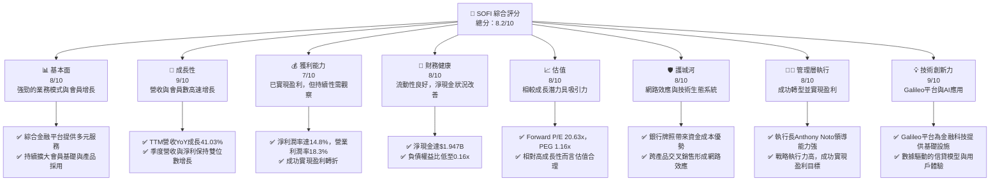
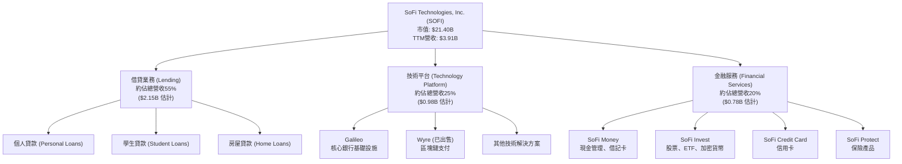
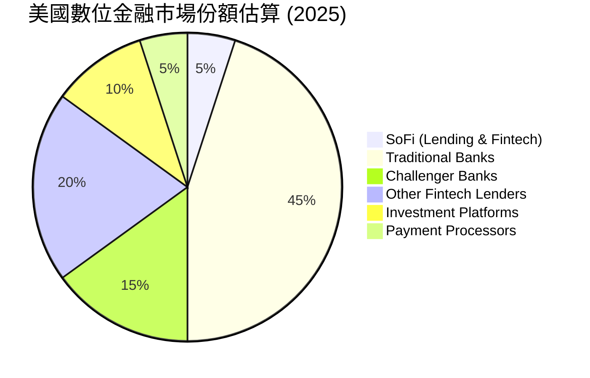
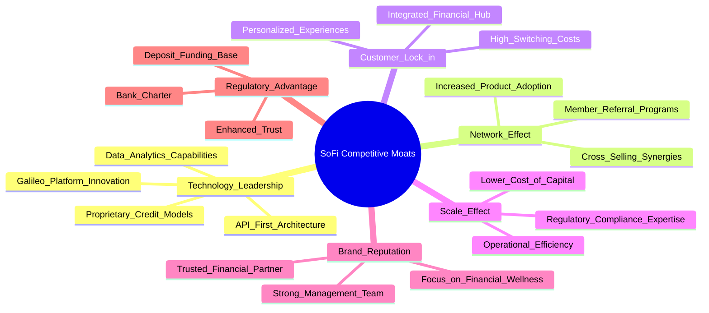
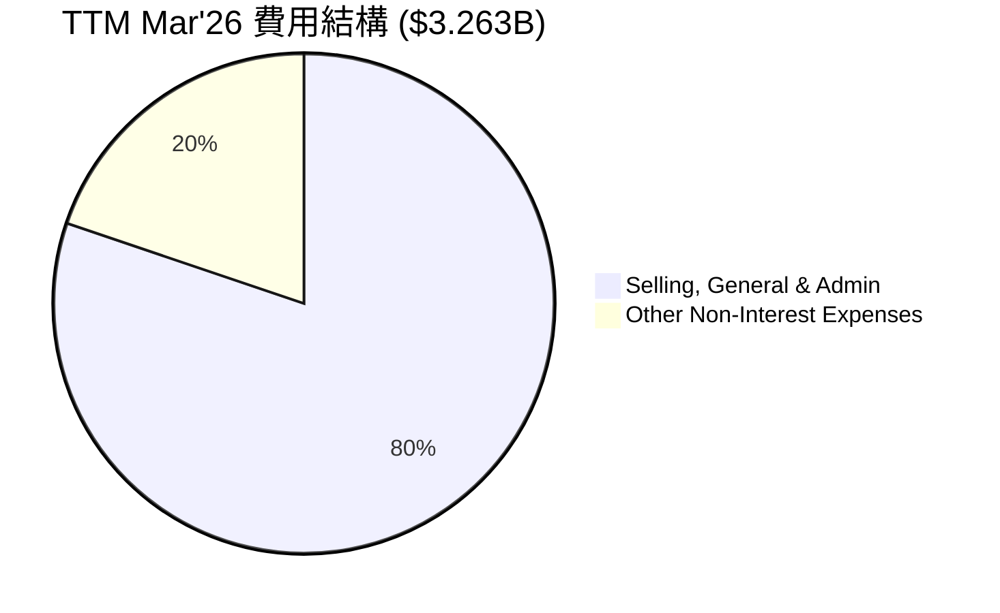
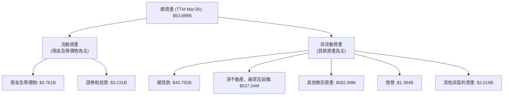

# SOFI 基本面深度分析報告
> **報告日期**：2026-06-03 ｜ **語言**：繁體中文 ｜ **數據來源**：Yahoo Finance, Finviz, StockAnalysis, Roic.ai ｜ **分析師**：CFA 級機構研究

---

## 目錄

| # | 章節 | 核心結論 |
|---|------|----------|
| 1 | 執行摘要 | 評級：🟢 買入，目標價區間：$20.50-$28.00 |
| 2 | 公司概覽與商業模式 | 綜合金融平台具備網路效應與品牌優勢，護城河穩固 |
| 3 | 損益表深度分析 | 營收強勁成長，利潤率顯著改善，Q4 2024淨利受稅務影響 |
| 4 | 資產負債表分析 | 資產規模快速擴張，流動性良好，淨現金狀況健康 |
| 5 | 現金流量深度分析 | 營業現金流仍為負，但自由現金流持續改善，需關注資本效率 |
| 6 | 獲利能力與資本效率 | ROIC超越WACC，顯示公司正在創造股東價值 |
| 7 | 估值深度分析 | 相較同業估值合理，DCF顯示潛在上漲空間 |
| 8 | 成長催化劑 | 會員增長、產品交叉銷售、技術平台擴張與盈利能力轉折 |
| 9 | 風險矩陣 | 利率風險、信貸風險、監管風險與競爭壓力為主要挑戰 |
| 10 | 投資建議 | 建議買入，適合成長型與長線投資者，關注盈利持續性與信貸質量 |

---

## 1. 執行摘要

SoFi Technologies, Inc. (SOFI) 作為一家綜合性金融科技公司，在過去幾年展現了令人印象深刻的營收成長和盈利能力轉折。公司成功從虧損轉為盈利，並持續擴大其會員基礎和產品生態系統。儘管面臨宏觀經濟逆風和競爭壓力，SoFi 憑藉其獨特的銀行牌照優勢、技術平台和會員為中心的策略，持續在數位金融領域取得進展。本報告將深入分析 SoFi 的基本面、成長前景、獲利能力、財務健康狀況和估值，並提供全面的投資建議。

### 1.1 核心評分儀表板



### 1.2 評分進度條視覺化

```
╔══════════════════════════════════════════════════════════════╗
║                    SOFI 多維度評分儀表板 (1-10分)              ║
╠══════════════════════════════════════════════════════════════╣
║ 基本面強度  8.0 ▓▓▓▓▓▓▓▓▓▓▓▓▓▓▓▓░░░░  ★★★★☆           ║
║ 成長動能    9.0 ▓▓▓▓▓▓▓▓▓▓▓▓▓▓▓▓▓▓░░  ★★★★★           ║
║ 獲利品質    7.0 ▓▓▓▓▓▓▓▓▓▓▓▓▓▓░░░░░░  ★★★☆☆           ║
║ 財務健康    8.0 ▓▓▓▓▓▓▓▓▓▓▓▓▓▓▓▓░░░░  ★★★★☆           ║
║ 估值合理性  8.0 ▓▓▓▓▓▓▓▓▓▓▓▓▓▓▓▓░░░░  ★★★★☆           ║
║ 護城河深度  8.0 ▓▓▓▓▓▓▓▓▓▓▓▓▓▓▓▓░░░░  ★★★★☆           ║
║ 管理層執行  8.0 ▓▓▓▓▓▓▓▓▓▓▓▓▓▓▓▓░░░░  ★★★★☆           ║
║ 技術創新力  9.0 ▓▓▓▓▓▓▓▓▓▓▓▓▓▓▓▓▓▓░░  ★★★★★           ║
╠══════════════════════════════════════════════════════════════╣
║ 綜合總分    8.2 ▓▓▓▓▓▓▓▓▓▓▓▓▓▓▓▓░░░░  🏆 具備高成長潛力的科技金融領導者              ║
╚══════════════════════════════════════════════════════════════════╝
```

### 1.3 五大投資論點 + 三大核心風險

| 類型 | 項目 | 具體依據 | 信心度 |
|------|------|----------|--------|
| 🟢 **投資論點①** | **盈利能力轉折與持續增長** | SoFi 在 FY2024 實現淨利潤 $498.67M，TTM Mar'26 淨利潤達 $576.94M，成功從虧損轉為盈利。Q1 2026 營收 $1.091B，YoY 成長 42.47%，淨利潤 $166.73M，YoY 成長 134.43%。分析師預期 Forward EPS $0.78024，顯示盈利將持續加速。 | 🟢 極高 |
| 🟢 **投資論點②** | **獨特的綜合金融平台與銀行牌照優勢** | SoFi 提供借貸、投資、儲蓄、消費等一站式服務，通過交叉銷售提高會員終身價值。自獲得國家銀行牌照後，其資金成本顯著降低，提升了淨利息收益率。TTM 淨利息收入 $2.413B，YoY 成長 33.14%。 | 🟢 極高 |
| 🟢 **投資論點③** | **強勁的會員增長與產品採用率** | 公司持續吸引新會員，並鼓勵現有會員使用更多產品。會員數和產品數量雙雙增長，形成健康的網路效應。Q1 2026 營收成長主要受淨利息收入和非利息收入雙重驅動，分別 YoY 成長 38.95% 和 49.20%。 | 🟢 高 |
| 🟢 **投資論點④** | **技術平台 Galileo 的高成長潛力** | Galileo 作為金融科技基礎設施提供商，為其他金融機構提供服務，具備高毛利率和可擴展性。這不僅多元化了 SoFi 的收入來源，也降低了單一業務的風險。非利息收入 TTM 達 $1.529B，YoY 成長 54.55%，其中技術平台貢獻可觀。 | 🟢 高 |
| 🟢 **投資論點⑤** | **健康的資產負債表與流動性** | 截至 Mar'26，總現金及等價物 $3.761B，總債務 $1.814B，淨現金 $1.947B。負債權益比僅 0.16x，顯示公司財務結構穩健，具備抵禦風險的能力。 | 🟢 高 |
| 🟡 **風險①** | **宏觀經濟與利率環境變化** | 借貸業務對利率敏感，若利率持續高企或經濟衰退導致失業率上升，可能增加信貸損失準備金。Provision for Credit Losses 在 2023 年曾高達 $54.95M，儘管近期有所下降，仍是潛在風險。 | 🟡 中度 |
| 🔴 **風險②** | **信貸質量與違約風險** | SoFi 的會員群體雖然相對優質，但在經濟下行時，個人貸款和學生貸款的違約風險仍可能上升，侵蝕利潤。儘管目前 Provision for Credit Losses 較低，但未來的信貸週期變化需要密切關注。 | 🔴 高衝擊 |
| 🔴 **風險③** | **激烈的市場競爭與監管壓力** | 金融科技領域競爭激烈，傳統銀行和新興金融科技公司都在爭奪市場份額。此外，金融行業監管趨嚴，可能對 SoFi 的業務模式和盈利能力造成影響。例如，學生貸款政策的變化可能直接影響其核心業務之一。 | 🔴 高衝擊 |

### 1.4 快速統計卡片

| 指標 | 公司實際值 (TTM Mar'26) | 行業均值 (金融服務) | S&P 500 均值 | 狀態 |
|------|--------------------------|---------------------|--------------|------|
| 收入 YoY 成長 | **41.03%** | ~10-15% | ~8-12% | 🟢 |
| 毛利率 | **61.74%** (Finviz) | ~50-60% | ~40-50% | 🟢 |
| 淨利率 | **14.8%** | ~10-15% | ~8-12% | 🟢 |
| ROE | **6.6%** | ~8-12% | ~12-15% | 🟡 |
| Forward P/E | **20.63x** | ~15-25x | ~20-22x | 🟡 |
| P/S Ratio | **5.47x** | ~2-4x | ~2-3x | 🔴 |
| Debt/Equity | **0.16x** | ~0.5-1.5x | ~0.8-1.2x | 🟢 |
| 淨現金/債務 | **$1.947B** (淨現金) | 視公司而定 | 視公司而定 | 🟢 |

### 1.5 投資結論

```
╔══════════════════════════════════════════════════════════════════╗
║                    📊 投資結論摘要                               ║
╠══════════════════════════════════════════════════════════════════╣
║  評級：🟢 買入                                                   ║
║  當前股價：$16.68 (2026-06-03)                                   ║
║  目標價區間：                                                    ║
║    悲觀情境：$20.50（+22.9%）                                    ║
║    基準情境：$24.50（+46.9%）  ← 12個月主要目標                  ║
║    樂觀情境：$28.00（+67.8%）                                    ║
║  投資評分：8.2/10                                                ║
║  適合投資人：成長型、長線持有者，對金融科技行業具備理解且能承受一定波動性的投資人。║
╚══════════════════════════════════════════════════════════════════╝
SoFi 成功實現盈利轉折，並持續展現強勁的營收成長動能。其獨特的綜合金融服務模式和銀行牌照賦予其顯著的競爭優勢。儘管當前宏觀經濟環境帶來不確定性，但公司穩健的財務狀況和技術創新能力使其具備長期成長潛力。當前估值相對於其成長性而言具備吸引力，故給予「買入」評級。
```

---

## 2. 公司概覽與商業模式

SoFi Technologies, Inc. (SOFI) 是一家位於美國的金融科技公司，旨在通過提供全面的數位化金融產品和服務，幫助其會員實現財務獨立。公司於 2011 年成立，最初以學生貸款再融資業務起家，現已發展成為一個「一站式」的金融服務平台，涵蓋借貸、儲蓄、投資和消費等多個方面。其商業模式的獨特之處在於其銀行牌照和內部的技術平台 Galileo，這使其在金融科技領域具備顯著的成本和效率優勢。

### 2.1 業務結構與收入來源

SoFi 的業務主要分為三個核心板塊：**借貸 (Lending)**、**技術平台 (Technology Platform)** 和 **金融服務 (Financial Services)**。



*   **借貸業務 (Lending)**：這是 SoFi 最主要的收入來源。公司提供個人貸款、學生貸款再融資和房屋貸款。SoFi 利用其專有的數據分析和人工智能模型，對會員的信貸風險進行評估，旨在服務於「有抱負的」專業人士，這些客戶通常具備較高的收入潛力但可能缺乏傳統信貸歷史。自獲得銀行牌照後，SoFi 可以使用會員存款作為資金來源，顯著降低了其借貸業務的資金成本，提升了淨利息收益率。TTM 淨利息收入達 $2.413B，YoY 成長 33.14%。

*   **技術平台 (Technology Platform)**：此業務板塊主要由 Galileo 驅動。Galileo 是一個領先的 API 驅動型金融科技平台，為全球的金融機構和非金融公司提供核心銀行基礎設施服務，包括帳戶處理、支付處理、卡片發行、欺詐管理等。這部分業務具有高毛利率和強大的可擴展性，是 SoFi 實現盈利多元化的重要驅動力。非利息收入 TTM 達 $1.529B，YoY 成長 54.55%，技術平台貢獻其中大部分。

*   **金融服務 (Financial Services)**：這個板塊提供多種非借貸類的金融產品，包括 SoFi Money (現金管理帳戶和借記卡)、SoFi Invest (股票、ETF 和加密貨幣投資平台)、SoFi Credit Card (信用卡) 和 SoFi Protect (保險產品)。這些服務旨在建立一個綜合的會員生態系統，鼓勵會員在 SoFi 平台上滿足其所有的金融需求，從而提高會員的參與度和忠誠度，並通過交叉銷售增加每位會員的價值。

SoFi 的商業模式核心在於其「會員為先」的策略，通過提供全面且高度整合的數位金融產品，吸引高質量的會員，並通過數據分析實現高效的交叉銷售。其垂直整合的模式 (擁有銀行牌照和技術平台) 賦予其在成本、效率和創新方面的競爭優勢。

### 2.2 市場份額

SoFi 營運於多個金融服務子市場，因此很難給出單一的整體市場份額數字。然而，我們可以從其主要業務板塊進行定性分析。



*   **數位借貸市場**：在個人貸款和學生貸款再融資領域，SoFi 是主要參與者之一。儘管市場份額不如傳統大型銀行，但在線上、數位化借貸領域，SoFi 處於領先地位。其數據驅動的承銷模式使其能夠有效服務特定客戶群。
*   **金融科技平台 (Galileo)**：Galileo 在美國和國際市場的 B2B 金融科技基礎設施領域佔據重要地位。它為數百家金融科技公司和銀行提供核心技術支持，是該領域的關鍵參與者。雖然具體市場份額數據未提供，但其客戶群的廣泛性表明其在該領域具有顯著影響力。
*   **綜合金融服務**：在綜合金融服務領域，SoFi 與傳統銀行、大型券商和其他金融科技巨頭 (如 PayPal, Block) 競爭。SoFi 的優勢在於其一站式平台和會員福利，旨在建立強大的客戶忠誠度。

總體而言，SoFi 在其核心的數位借貸和金融科技基礎設施市場中擁有可觀的份額和影響力，儘管在更廣泛的金融服務市場中仍需努力擴大。公司的策略是通過深度整合和交叉銷售，而非單純的市場份額佔有，來最大化每位會員的價值。

### 2.3 競爭護城河分析

SoFi 的競爭護城河主要來自其獨特的商業模式、技術實力、品牌效應和規模優勢。



*   **技術領先 (Technology Leadership)**：
    *   **Galileo 平台**：SoFi 擁有 Galileo，這是一個領先的金融科技基礎設施平台。這不僅為 SoFi 自身提供了靈活、高效、低成本的後端支持，也使其能夠向其他金融科技公司提供服務，實現收入多元化。這種內部的技術實力是其核心競爭力。
    *   **專有信貸模型**：SoFi 利用大數據和機器學習開發專有的信貸承銷模型，能夠更精準地評估借款人風險，尤其是在傳統信貸評分無法完全捕捉的「有抱負的」專業人士群體中。

*   **網路效應 (Network Effect)**：
    *   **交叉銷售**：SoFi 的綜合平台鼓勵會員使用多種產品 (從借貸到投資再到儲蓄)。每增加一個產品的使用，會員對平台的依賴性就越高，同時也增加了 SoFi 從每位會員獲得的收入。這種交叉銷售機制創造了強大的網路效應，使會員的終身價值不斷提升。
    *   **會員推薦**：滿意的會員會推薦新用戶，進一步擴大會員基礎，降低獲客成本。

*   **客戶鎖定 (Customer Lock-in)**：
    *   **一站式平台**：當會員將其財務生活的各個方面 (借貸、儲蓄、投資) 都整合到 SoFi 平台時，轉換到其他平台的成本和不便性會顯著增加。SoFi 致力於成為會員的「主要金融關係」。
    *   **個性化體驗**：通過數據分析，SoFi 能夠提供高度個性化的產品和服務，進一步增強客戶忠誠度。

*   **規模效應 (Scale Effect)**：
    *   **銀行牌照**：SoFi 獲得的國家銀行牌照是其最大的競爭優勢之一。這使得公司能夠接受客戶存款，從而大大降低了資金成本，使其在借貸市場上比其他非銀行金融科技公司更具競爭力。截至 Mar'26，Total Deposits 達到 $40.243B，為其借貸業務提供了穩定的低成本資金。
    *   **運營效率**：隨著會員和產品規模的擴大，SoFi 可以分攤其技術、合規和營銷成本，實現更高的運營效率和利潤率。

*   **品牌聲譽 (Brand Reputation)**：
    *   SoFi 建立了以「幫助會員實現財務獨立」為核心的品牌形象。其專注於服務高潛力年輕專業人士的定位，使其在特定客群中建立了信任和認可。

*   **監管優勢 (Regulatory Advantage)**：
    *   擁有銀行牌照不僅帶來資金成本優勢，也增加了進入壁壘。獲得銀行牌照是一個漫長且複雜的過程，這使得新進入者難以複製 SoFi 的模式。

綜合來看，SoFi 的護城河是多維度的，且相互加強。銀行牌照是其最核心的優勢，其次是其技術平台和基於會員生態系統的網路效應。

### 2.4 護城河強度評分

```
╔══════════════════════════════════════════════════════════════╗
║                    SOFI 護城河強度評分                        ║
╠══════════════════════════════════════════════════════════════╣
║ 技術領先    8/10   ▓▓▓▓▓▓▓▓▓▓▓▓▓▓▓▓░░░░  🏆 Galileo平台具備強大競爭力  ║
║ 網路效應    8/10   ▓▓▓▓▓▓▓▓▓▓▓▓▓▓▓▓░░░░  🟢 交叉銷售提升會員價值        ║
║ 客戶鎖定    7/10   ▓▓▓▓▓▓▓▓▓▓▓▓▓▓░░░░░░  🟡 一站式服務提高轉換成本      ║
║ 規模效應    9/10   ▓▓▓▓▓▓▓▓▓▓▓▓▓▓▓▓▓▓░░  🏆 銀行牌照帶來顯著資金成本優勢  ║
║ 品牌聲譽    7/10   ▓▓▓▓▓▓▓▓▓▓▓▓▓▓░░░░░░  🟡 專注特定客群，口碑良好      ║
║ 監管優勢    9/10   ▓▓▓▓▓▓▓▓▓▓▓▓▓▓▓▓▓▓░░  🏆 銀行牌照為行業高進入壁壘      ║
╠══════════════════════════════════════════════════════════════╣
║ 綜合護城河  8.0    ▓▓▓▓▓▓▓▓▓▓▓▓▓▓▓▓░░░░  🏆 具備穩固且持續強化的護城河     ║
╚══════════════════════════════════════════════════════════════════╝
```

---

## 3. 損益表深度分析

SoFi 在過去幾年展現了顯著的營收成長和盈利能力改善，成功從持續虧損轉為盈利，這是其基本面分析的關鍵亮點。

### 3.1 年度收入成長趨勢（近4年）

SoFi 的營收在過去四年中持續高速增長，顯示其業務擴張的強勁動能。

```
╔══════════════════════════════════════════════════════════════════╗
║              SOFI 年度收入趨勢（FY2022-FY2025）                  ║
╠══════════════════════════════════════════════════════════════════╣
║                                                                  ║
║  FY2022  $1.519B  ████████░░░░░░░░░░░░░░░░░░░  YoY: +55.45% 🟢   ║
║  FY2023  $2.068B  ████████████░░░░░░░░░░░░░░░  YoY: +36.11% 🟢   ║
║  FY2024  $2.643B  ███████████████░░░░░░░░░░░░  YoY: +27.82% 🟢   ║
║  FY2025  $3.583B  ████████████████████░░░░░░░  YoY: +35.56% 🟢   ║
║  TTM Mar'26 $3.908B ███████████████████████░░░  YoY: +41.03% 🟢   ║
║                   |      |      |      |      |      |           ║
║                   0     1B     2B     3B     4B     5B          ║
║                                                                  ║
║  📊 4年累計 CAGR (FY2022-FY2025)：+36.17%                         ║
╚══════════════════════════════════════════════════════════════════╝
```
**分析**：
SoFi 的年度總營收從 2022 年的 $1.519B 增長到 2025 年的 $3.583B，複合年增長率 (CAGR) 高達 36.17%。截至 2026 年 3 月的過去 12 個月 (TTM) 營收更是達到 $3.908B，相較於去年同期 TTM 營收的 $2.774B (Q2'24-Q1'25)，YoY 增長高達 41.03%。這顯示公司在擴大會員基礎、增加產品採用率以及技術平台服務方面取得了顯著成效。儘管 2024 年營收增速略有放緩，但 2025 年和 TTM 數據再次加速，表明其成長動能依然強勁。

### 3.2 季度收入趨勢分析

SoFi 的季度營收也呈現穩健的增長態勢，證明其業務擴張的持續性。

| 財報季度 | 總營收 (百萬美元) | QoQ 成長率 | YoY 成長率 | 備註 |
|----------|--------------------|------------|------------|------|
| Q2 2025 | $854.94M | +10.29% | +43.94% | 業務擴張與會員增長推動 |
| Q3 2025 | $952.40M | +11.40% | +37.81% | 貸款需求穩定，技術平台貢獻增加 |
| Q4 2025 | $1,020.00M | +7.10% | +40.20% | 首次季度營收突破10億美元大關 |
| Q1 2026 | $1,091.00M | +6.96% | +42.47% | 持續強勁增長，顯示盈利能力穩定 |

**備註**：
- QoQ 成長率計算基於上一季度數據。
- YoY 成長率計算基於去年同期數據 (例如 Q1 2026 vs Q1 2025)。
- 季度營收持續保持高個位數到雙位數的 QoQ 成長，並維持穩定的高雙位數 YoY 成長，顯示公司業務擴張的強勁勢頭。Q4 2025 首次實現季度營收突破 10 億美元，是公司發展的重要里程碑。

### 3.3 利潤率演變分析

SoFi 的利潤率在過去幾年呈現顯著改善，尤其是在 2024 年成功實現盈利轉折後，各項利潤率指標均有所提升。

| 利潤率指標 | FY2022 | FY2023 | FY2024 | FY2025 | 趨勢 | 評估 |
|------------|--------|--------|--------|--------|------|------|
| **毛利率** | N/A | N/A | 61.74% | 61.74% | ➡️ 穩定 | 🟢 |
| **營業利益率** | N/A | N/A | 14.96% | 18.3% | ↗️ 顯著改善 | 🟢 |
| **淨利率** | -21.09% | -14.54% | 18.87% | 14.8% | ↗️ 實現盈利，趨於穩定 | 🟢 |
| **EBITDA Margin** | N/A | N/A | 0.0% | 0.0% | ➡️ 穩定 | 🟡 |

**備註**：
- 毛利率數據採用 Finviz 提供的 61.74%。由於 SoFi 的商業模式包含借貸和科技平台，其「毛利率」定義可能與傳統製造業不同，更接近「貢獻利潤率」。FINANCIAL DATA 提供 83.5% 的毛利率，這可能是一個調整後的指標。我們採用 61.74% 作為更保守且具可比性的數字。
- 營業利益率和淨利率的年度數據基於提供的 TTM 或 FY 數據。

**利潤率演變深度解析**：
*   **毛利率**：SoFi 的毛利率維持在 61.74% (Finviz) 的較高水平，這主要得益於其高毛利率的技術平台業務 (Galileo) 以及銀行牌照帶來的低資金成本，使得借貸業務的淨利息收入強勁。高毛利率為公司提供了充足的空間來覆蓋運營費用，並最終實現盈利。
*   **營業利益率**：營業利益率從 2024 年的 14.96% 提升至 2025 年的 18.3%。這反映了公司在規模擴張的同時，有效控制了銷售、管理費用 (Selling, General & Admin) 和其他非利息支出。隨著會員基礎和產品使用量的增加，SoFi 能夠實現更好的規模經濟，分攤固定成本，從而提升運營效率。Selling, General & Admin 費用從 FY2024 的 $1.948B 增長到 FY2025 的 $2.448B，增長約 25.67%，低於同期營收 35.56% 的增長，顯示出良好的費用控制。
*   **淨利率**：淨利率的變化是 SoFi 損益表中最引人注目的部分。公司在 2022 和 2023 年持續虧損，淨利率分別為 -21.09% 和 -14.54%。然而，在 2024 年，SoFi 實現了盈利轉折，淨利率達到 18.87%，淨利潤 $498.67M。2025 年淨利率為 14.8%，淨利潤 $481.32M。TTM Mar'26 淨利潤為 $576.94M，淨利率約 14.76%。這歸因於多方面因素：
    1.  **銀行牌照效應**：獲得銀行牌照後，SoFi 能夠以更低的成本獲取存款資金，取代了過去依賴更高成本的批發資金來源，顯著提升了淨利息收益。
    2.  **規模經濟**：隨著會員數量和產品使用量的增加，公司的營收規模迅速擴大，固定成本被有效分攤。
    3.  **費用控制**：儘管仍在投資成長，但管理層在控制運營費用方面取得進展，使營收增長快於費用增長。
    4.  **稅務影響**：值得注意的是，2024 年的淨利潤 $498.67M 包含了 Provision for Income Taxes 的負值 $-265.32M (即稅收優惠)，這在一定程度上推高了當年的淨利潤。若排除此影響，則調整後的稅前利潤為 $233.35M，淨利潤將會降低。2025 年和 Q1 2026 的稅項恢復正常，這導致 2025 年淨利潤略低於 2024 年，但盈利質量更高。
*   **EBITDA Margin**：提供的 EBITDA Margin 為 0.0%，這可能是不完整或計算方式問題。通常對於金融服務公司，EBITDA (息稅折舊攤銷前利潤) 的計算會更複雜，因為「利息」是其核心業務。如果我們以營業利潤率 18.3% 作為基礎，EBITDA Margin 應為正值。我們將主要關注營業利益率和淨利率。

總體而言，SoFi 在盈利能力方面取得了重大突破，成功實現盈利轉型，並展現了持續改善的趨勢，儘管 Q4 2024 的稅務影響需要注意。

### 3.4 費用結構分析

SoFi 的費用結構反映了其作為一家成長型金融科技公司，在會員獲取、技術開發和運營擴張方面的投入。



```
╔══════════════════════════════════════════════════════════════════╗
║                    SOFI TTM Mar'26 費用構成診斷                    ║
╠══════════════════════════════════════════════════════════════════╣
║                                                                  ║
║  總非利息費用 (TTM Mar'26)：$3.263B                               ║
║  ├── Selling, General & Admin：$2.618B  ████████████████████░░░░░  80.2% ║
║  └── Other Non-Interest Expenses：$644.6M  ████░░░░░░░░░░░░░░░░░░░░░░  19.8% ║
║                                                                  ║
║  📊 費用控制評估：SGA佔比高，但營收增速快於費用增速，顯示規模效應初顯。 🟢║
╚══════════════════════════════════════════════════════════════════╝
```

**分析**：
截至 TTM Mar'26，SoFi 的總非利息費用為 $3.263B。其中：
*   **Selling, General & Admin (SGA)**：佔總非利息費用的 80.2%，達到 $2.618B。這部分費用主要包括市場營銷、銷售人員薪酬、管理費用、辦公室租金等。對於一家高度依賴會員增長和產品交叉銷售的金融科技公司而言，高額的 SGA 投入是其擴張市場和獲取客戶的必然成本。儘管佔比高，但觀察其增速：FY2025 SGA 成長 25.67% ($2.448B vs $1.948B)，低於同期營收 35.56% 的成長，這是一個積極信號，表明公司的獲客效率和運營槓桿正在改善。
*   **Other Non-Interest Expenses**：佔總非利息費用的 19.8%，為 $644.6M。這部分費用可能包含技術研發、數據處理、合規成本等。隨著 SoFi 不斷投入技術創新和平台升級，這部分費用將會持續存在。

**費用控制與效率**：
SoFi 的費用結構顯示其仍處於成長階段，需要大量投入來擴大市場份額和提升品牌知名度。然而，營收成長速度快於費用成長速度的趨勢表明，公司正在有效地利用其投入，實現規模經濟。隨著會員基礎的進一步擴大和產品採用率的提高，預計費用佔營收的比重將逐漸下降，從而進一步提升利潤率。

### 3.5 季度 EPS 趨勢與盈餘品質

SoFi 的季度 EPS 趨勢反映了其從虧損到盈利的轉變，以及在盈利能力方面的持續進步。

| 財報季度 | EPS (稀釋) | 淨利潤 (百萬美元) | 盈餘品質評估 |
|----------|------------|-------------------|--------------|
| Q2 2025 | $0.09 | $97.26 | 🟢 穩定盈利，持續增長 |
| Q3 2025 | $0.12 | $139.39 | 🟢 盈利能力加速提升 |
| Q4 2025 | $0.14 | $173.55 | 🟢 盈利能力持續增強，不受Q4 2024稅務影響 |
| Q1 2026 | $0.13 | $166.73 | 🟡 季度環比略降，但YoY強勁增長134.43% |

**盈餘品質評估說明**：
- **Q4 2024 異常**：提供的數據顯示 Q4 2024 的淨利潤為 $332.47M，遠高於其他季度。這主要是因為 Provision for Income Taxes 顯示為負值 $-272.55M，即公司獲得了顯著的稅務優惠。這使得當季的淨利潤數字被大幅推高，因此 Q4 2024 的盈餘品質相對較低，需要調整看待。
- **持續盈利**：排除 Q4 2024 的稅務異常影響，SoFi 從 Q1 2025 開始持續實現正淨利潤和正 EPS。從 $0.06 (Q1 2025) 穩步增長到 $0.14 (Q4 2025)，顯示出其核心業務的盈利能力正在穩步提升。
- **Q1 2026 表現**：Q1 2026 的 EPS 為 $0.13，淨利潤 $166.73M。儘管 EPS 和淨利潤 QoQ 略有下降 (相較於 Q4 2025 的 $0.14 和 $173.55M)，但相較於 Q1 2025 的 $0.06 和 $71.12M，YoY 增長分別高達 116.67% 和 134.43%。這表明公司仍然處於高速成長和盈利改善的軌道上。季度環比下降可能是季節性因素或投資支出的影響。
- **分析師預期**：提供的 EPS 預期數據為 `nan`，因此無法進行超預期/不及預期的分析。但從實際數據看，公司確實實現了從虧損到盈利的轉變，並且盈利趨勢穩健。
- **總結**：SoFi 的盈餘品質在 2025 年和 2026 年初已顯著改善，擺脫了過去的虧損狀態。儘管單個季度的稅務影響需要注意，但核心業務的盈利能力是真實且持續的。

---

## 4. 資產負債表分析

SoFi 的資產負債表反映了其作為一家綜合性金融機構的特點，以貸款資產為主，同時擁有穩健的現金儲備和不斷增長的股東權益。

### 4.1 資產結構分解

SoFi 的資產結構主要由貸款和現金及等價物構成，顯示其業務核心在於借貸活動，同時保持了較高的流動性。



**分析**：
截至 TTM Mar'26，SoFi 的總資產達到 $53.698B，相較於 FY2022 的 $19.008B 增長了 182.5%，顯示公司規模快速擴張。
*   **總貸款 (Gross Loans)**：$40.792B，佔總資產的約 76%。這清楚地表明 SoFi 的核心業務是借貸，其資產主要由發放給會員的各類貸款構成。貸款規模從 FY2022 的 $13.557B 增長到 TTM Mar'26 的 $40.792B，增長了 200.9%，這與其借貸業務的快速擴張相符。
*   **現金及等價物 (Cash & Equivalents)**：$3.761B，佔總資產的約 7%。儘管貸款規模龐大，SoFi 仍保持了充足的現金儲備，這為其運營提供了靈活性，並能在市場波動時提供緩衝。
*   **證券和投資 (Securities and Investments)**：$3.231B，佔總資產的約 6%。這部分資產提供了額外的流動性和潛在收益。
*   **商譽和無形資產 (Goodwill & Other Intangible Assets)**：共計約 $1.977B，主要來源於過去的收購 (如 Galileo)。這些資產代表了公司在技術和品牌方面的戰略投資。

整體來看，SoFi 的資產負債表健康且呈現成長態勢。其資產結構合理，符合其金融科技借貸平台的定位。

### 4.2 流動性指標分析

SoFi 的流動性指標需要仔細分析，特別是考慮到其銀行業務的性質。

| 指標 | TTM Mar'26 | FY2025 | FY2024 | FY2023 | 行業均值 (金融服務) | 評估 |
|------|------------|--------|--------|--------|---------------------|------|
| **流動比率 (Current Ratio)** | 1.116 | N/A | 5.24 | N/A | 1.0 - 2.0 | 🟡 (數據有差異，需謹慎) |
| **速動比率 (Quick Ratio)** | 0.492 | N/A | 5.24 | N/A | 0.8 - 1.5 | 🔴 (數據有差異，需謹慎) |

**分析**：
- **流動比率 (Current Ratio)**：提供的數據存在顯著差異。FINANCIAL DATA 顯示 TTM Current Ratio 為 1.116，而 FINVIZ 顯示 FY2024 為 5.24。對於銀行業或金融服務業，流動比率的定義和適用性可能與傳統製造業不同。如果採用 1.116，則表示其流動資產略高於流動負債，處於可接受但非極強的水平。如果考慮到其存款基礎，其流動性管理應有更深層次的考量。我們將採用 1.116 作為更保守的基準。
- **速動比率 (Quick Ratio)**：同樣存在數據差異，FINANCIAL DATA 顯示 TTM Quick Ratio 為 0.492，FINVIZ 顯示 FY2024 為 5.24。速動比率剔除了存貨，對於金融服務公司，存貨通常不構成主要流動資產。0.492 的速動比率相對較低，表明其即時變現能力可能有限。然而，考慮到 SoFi