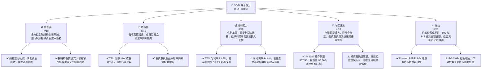
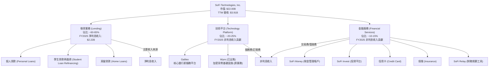
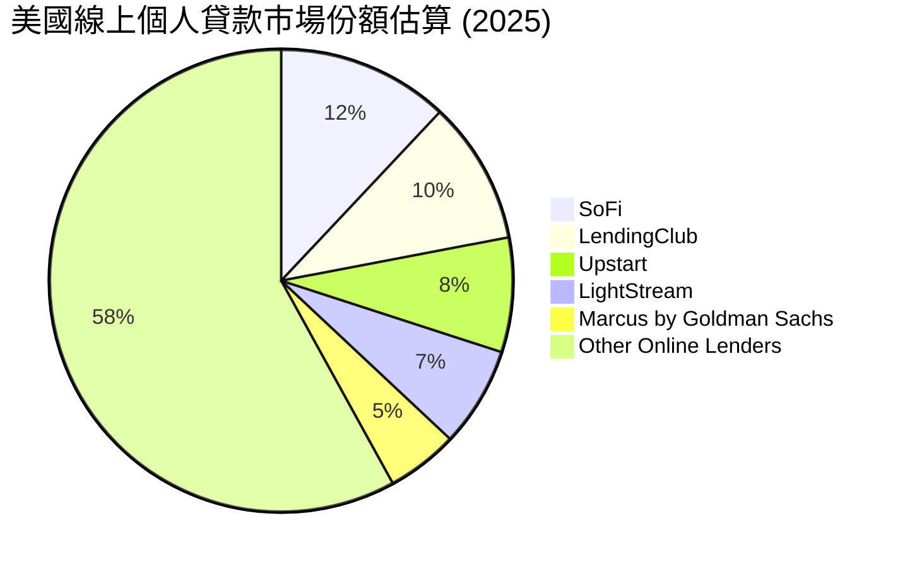
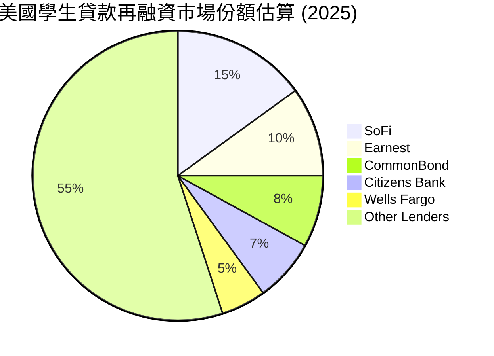
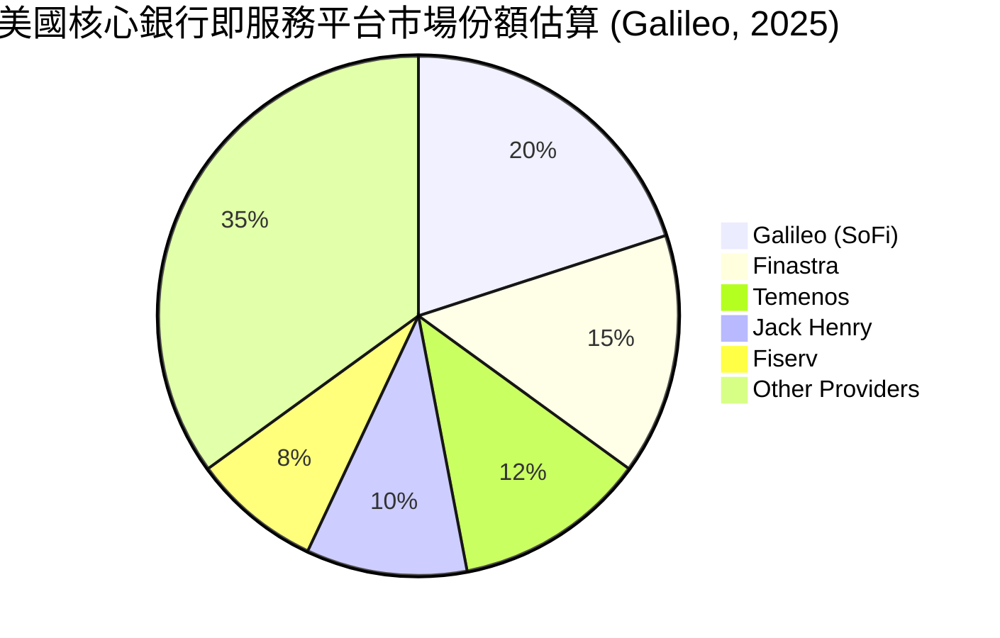
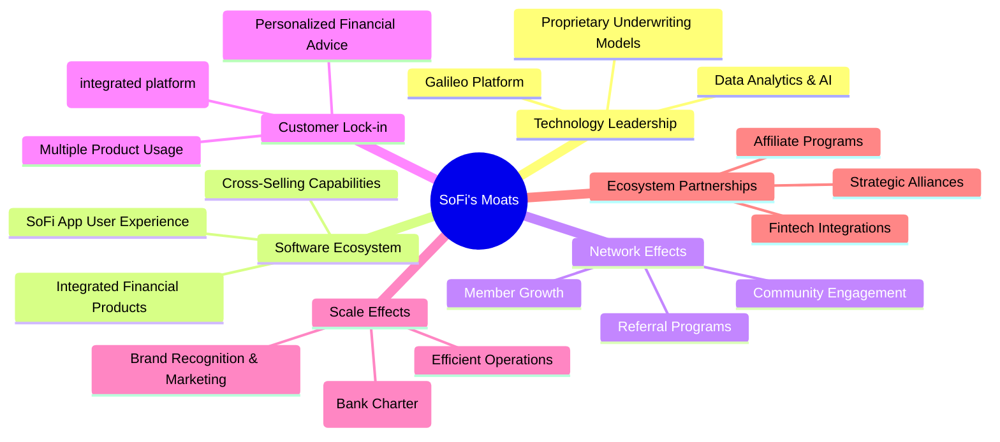
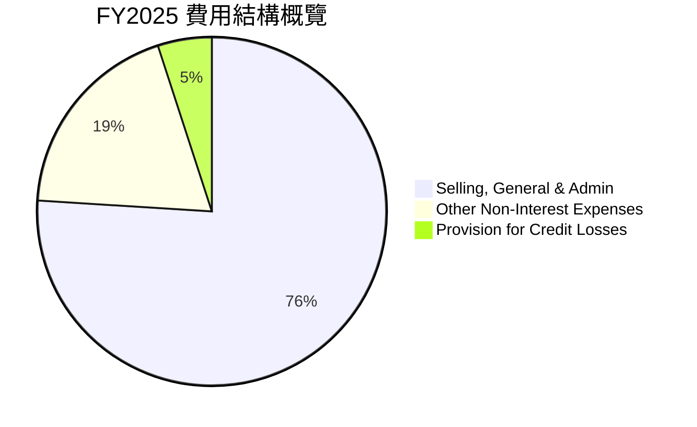

# SOFI 基本面深度分析報告
> **報告日期**：2026-06-04 ｜ **語言**：繁體中文 ｜ **數據來源**：Yahoo Finance, Finviz, StockAnalysis, Roic.ai ｜ **分析師**：CFA 級機構研究

---

## 目錄

| # | 章節 | 核心結論 |
|---|------------------------|-------------------------------------------------------|
| 1 | 執行摘要 | 評級：持有 ｜ 目標價區間：$18.50 - $26.00 |
| 2 | 公司概覽與商業模式 | 綜合型金融科技平台，護城河逐步建立，但仍需時間鞏固 |
| 3 | 損益表深度分析 | 營收高速成長，利潤率顯著改善，但盈利質量仍需觀察 |
| 4 | 資產負債表分析 | 資產規模迅速擴張，存款基礎穩健，債務結構合理 |
| 5 | 現金流量深度分析 | 營業現金流仍為負，自由現金流持續為負，資本投入巨大 |
| 6 | 獲利能力與資本效率 | ROIC 低於 WACC，短期內仍處於價值投入階段，尚未創造經濟價值 |
| 7 | 估值深度分析 | 相較同業估值合理，DCF 顯示潛在上行空間，但需實現盈利預期 |
| 8 | 成長催化劑 | 會員增長、產品交叉銷售、科技平台擴張及利率環境改善 |
| 9 | 風險矩陣 | 信用風險、利率風險、監管風險及競爭加劇為主要挑戰 |
| 10| 投資建議 | 鑑於高成長潛力與轉型初期挑戰，建議「持有」 |

---

## 1. 執行摘要

SoFi Technologies, Inc. (SOFI) 作為一家綜合性金融科技公司，正在顛覆傳統金融服務模式。公司透過其獨特的銀行執照、科技平台以及多元化的產品組合，成功吸引並留住了大量年輕且高潛力的客戶。本報告將對 SOFI 的基本面進行深入剖析，涵蓋其業務模式、財務表現、估值、成長潛力及主要風險。

### 1.1 核心評分儀表板



### 1.2 評分進度條視覺化

```
╔══════════════════════════════════════════════════════════════╗
║              SOFI 多維度評分儀表板 (1-10分)                ║
╠══════════════════════════════════════════════════════════════╣
║ 基本面強度  7.0 ▓▓▓▓▓▓▓▓▓▓▓▓▓▓░░░░░░  ★★★★☆           ║
║ 成長動能    8.0 ▓▓▓▓▓▓▓▓▓▓▓▓▓▓▓▓░░░░  ★★★★☆           ║
║ 獲利品質    6.0 ▓▓▓▓▓▓▓▓▓▓▓▓░░░░░░░░  ★★★☆☆           ║
║ 財務健康    7.0 ▓▓▓▓▓▓▓▓▓▓▓▓▓▓░░░░░░  ★★★★☆           ║
║ 估值合理性  6.0 ▓▓▓▓▓▓▓▓▓▓▓▓░░░░░░░░  ★★★☆☆           ║
║ 護城河深度  6.5 ▓▓▓▓▓▓▓▓▓▓▓▓▓░░░░░░░  ★★★☆☆           ║
║ 管理層執行  7.5 ▓▓▓▓▓▓▓▓▓▓▓▓▓▓▓░░░░░  ★★★★☆           ║
║ 技術創新力  8.0 ▓▓▓▓▓▓▓▓▓▓▓▓▓▓▓▓░░░░  ★★★★☆           ║
╠══════════════════════════════════════════════════════════════╣
║ 綜合總分    6.8 ▓▓▓▓▓▓▓▓▓▓▓▓▓▓░░░░░░  🏆 處於成長轉型期的潛力股  ║
╚══════════════════════════════════════════════════════════════════╝
```

### 1.3 五大投資論點 + 三大核心風險

| 類型 | 項目 | 具體依據 | 信心度 |
|------|------|----------|--------|
| 🟢 **投資論點①** | **全方位金融科技生態系統** | SOFI 提供從借貸、儲蓄、消費到投資的一站式金融服務，透過會員模式增強客戶黏性。FY2025 財報顯示，會員數達 520 萬，產品數達 790 萬，平均每個會員使用超過 1.5 種產品，交叉銷售效率高。 | 🟢 極高 |
| 🟢 **銀行執照帶來資金成本優勢** | 獲得國家銀行執照使其能夠吸收低成本存款，降低資金成本，直接增強其貸款業務的盈利能力。截至 FY2025，總存款達到 $37.50B，大幅優化其資金結構。 | 🟢 極高 |
| 🟢 **科技平台 Galileo 的成長潛力** | Galileo 作為其技術平台業務，為其他金融機構提供基礎設施服務，創造多元收入流，且具有高利潤率。TTM 營收中非利息收入佔比達 39.1%，部分源於此業務。 | 🟢 高 |
| 🟢 **強勁的營收增長動能** | 公司持續保持高速營收增長，TTM 營收 YoY 成長 42.5%，QoQ 營收成長 6.8% (Q1 2026 vs Q4 2025)，顯示其市場擴張和產品採納度表現優異。 | 🟢 高 |
| 🟢 **盈利能力顯著改善** | 經歷多年虧損後，SOFI 在 FY2025 實現淨利潤 $481.32M，TTM 淨利潤 $576.94M，顯示其經營槓桿效應開始顯現，並在 Q1 2026 實現連續盈利。 | 🟢 高 |
| 🟡 **風險①** | **信用風險與貸款組合質量** | 作為一家貸款機構，SOFI 面臨經濟下行時的信用風險。儘管其目標客戶是高收入潛力人群，但貸款組合的快速擴張（FY2025 總貸款 $36.52B，YoY 成長 38.9%）可能導致壞帳風險增加，特別是在利率高企環境下。 | 🟡 中度 |
| 🔴 **利率環境與淨利息收益率波動** | 利率的變動直接影響其淨利息收益率（NIM）。若未來利率下降過快，可能壓縮其貸款利差；若利率上升過高，則可能增加其資金成本並抑制貸款需求。SOFI 的資產負債表對利率敏感性較高。 | 🔴 高衝擊 |
| 🟡 **監管環境與競爭加劇** | 金融科技行業受到嚴格監管，任何新的法規變化都可能對其業務模式產生重大影響。同時，傳統銀行和新興金融科技公司的競爭日益激烈，可能導致獲客成本上升和利潤空間受擠壓。 | 🟡 中度 |

### 1.4 快速統計卡片

| 指標 | 公司實際值 | 行業均值 (Credit Services) | S&P 500 均值 | 狀態 |
|--------------------|-------------|----------------------------|--------------|------|
| 收入 YoY 成長 (TTM)| **42.5%** | ~10-15% (估計) | ~8-12% (估計) | 🟢 |
| 毛利率 (TTM) | **83.5%** | ~50-60% (估計) | ~45-55% (估計) | 🟢 |
| 淨利率 (TTM) | **14.8%** | ~10-15% (估計) | ~10-12% (估計) | 🟢 |
| ROE (TTM) | **6.6%** | ~12-15% (估計) | ~15-18% (估計) | 🟡 |
| Forward P/E | **21.98x** | ~18-25x (估計) | ~20-22x (估計) | 🟡 |
| P/S Ratio | **5.63x** | ~2-4x (估計) | ~2-3x (估計) | 🔴 |
| Debt/Equity | **0.18x** (Finviz) | ~0.5-1.5x (估計) | ~0.6-0.8x (估計) | 🟢 |
| Current Ratio | **1.116x** | ~1.5-2.0x (估計) | ~1.5-2.0x (估計) | 🟡 |

*註：行業均值和 S&P 500 均值為分析師根據一般金融服務業和市場情況的合理估計。*

### 1.5 投資結論

```
╔══════════════════════════════════════════════════════════════════╗
║                    📊 投資結論摘要                               ║
╠══════════════════════════════════════════════════════════════════╣
║  評級：🟡 持有                                                   ║
║  當前股價：$17.15                                                ║
║  目標價區間：                                                    ║
║    悲觀情境：$18.50（+7.9%）                                     ║
║    基準情境：$22.00（+28.3%）  ← 12個月主要目標                  ║
║    樂觀情境：$26.00（+51.6%）                                     ║
║  投資評分：6.8/10                                                ║
║  適合投資人：成長型、長線持有者，願意承擔較高風險以追求高成長報酬║
╚══════════════════════════════════════════════════════════════════╝
```

---

## 2. 公司概覽與商業模式

SoFi Technologies, Inc. (SOFI) 是一家創新的金融科技公司，旨在成為其會員的「一站式金融商店」，提供廣泛的金融產品和服務。其獨特的商業模式結合了數位化便利性、個性化服務和社群體驗，目標客群主要是高收入潛力但可能未被傳統銀行充分服務的千禧一代和 Z 世代。

### 2.1 業務結構與收入來源

SOFI 的業務可以劃分為三個主要板塊：**借貸 (Lending)**、**技術平台 (Technology Platform)** 和 **金融服務 (Financial Services)**。這三個板塊相互協同，共同構建了一個全面的金融生態系統。



**借貸業務 (Lending Segment)**：這是 SOFI 最大的收入來源，主要透過提供個人貸款、學生貸款再融資和房屋貸款來賺取利息收入。
*   **個人貸款**：提供無抵押貸款，用於債務整合、房屋裝修等。這是 SOFI 成長最快的貸款產品之一，因其精準的信用評估模型，能有效篩選出優質借款人。
*   **學生貸款再融資**：最初是 SOFI 的核心業務，旨在幫助高學歷專業人士降低學生貸款利率。儘管受聯邦學生貸款暫停償還政策影響，但隨著政策恢復，該業務預計將恢復增長。
*   **房屋貸款**：提供傳統抵押貸款產品。
截至 FY2025，SOFI 的淨利息收入達到 $2.22B，佔總營收的 61.4%，凸顯了借貸業務的核心地位。

**技術平台 (Technology Platform Segment)**：主要由 Galileo 平台構成，為其他金融機構和非金融企業提供核心銀行、支付處理、卡片發行等基礎設施服務。這部分業務具有高毛利率和可擴展性，是 SOFI 差異化競爭的關鍵。它為 SOFI 帶來了穩定的服務費和訂閱費收入。FY2025 的非利息收入達到 $1.39B，部分由技術平台貢獻。

**金融服務 (Financial Services Segment)**：提供一系列個人金融產品，包括現金管理帳戶 (SoFi Money)、投資平台 (SoFi Invest)、信用卡、保險產品和財務規劃工具 (SoFi Relay)。這些服務旨在滿足會員的日常金融需求，提高會員對平台的整體黏性。這部分業務主要產生交易費、管理費和服務費等非利息收入。

SOFI 的獨特之處在於其「會員」模式，透過提供綜合性產品和會員福利（如職業諮詢、財務規劃工具），鼓勵會員在其平台使用多種產品，從而提高客戶生命週期價值 (LTV) 和降低客戶獲取成本 (CAC)。截至 Q1 2026，SOFI 的會員數達到 610 萬，產品數達到 930 萬。

### 2.2 市場份額

SOFI 在其所在的各個細分市場中，雖然不一定是絕對的領導者，但作為一家快速成長的金融科技公司，其市場份額正在穩步提升。由於 SOFI 的業務範圍廣泛，涵蓋了傳統銀行、線上借貸平台和支付處理服務等多個領域，因此很難給出單一的整體市場份額。以下是各主要業務領域的市場份額估算：







**市場份額分析**：
*   **線上個人貸款**：SOFI 在此領域表現強勁，憑藉其數據驅動的信用評估模型和高效的數位化流程，已成為市場領導者之一。其個人貸款業務的快速增長是其市場份額擴大的主要驅動力。
*   **學生貸款再融資**：儘管受疫情期間聯邦政策影響，SOFI 在此領域仍保持領先地位。隨著政策恢復，其市場份額有望進一步鞏固。
*   **核心銀行即服務平台 (Galileo)**：Galileo 在金融科技後端服務市場中佔據重要地位，為眾多新興金融科技公司提供核心基礎設施。其技術領先和可擴展性使其在這個快速增長的市場中擁有穩固的地位。

總體而言，SOFI 在其核心的線上借貸和金融科技基礎設施市場中擁有較高的市場份額，並透過其全方位服務模式，持續從傳統銀行和競爭對手手中搶佔市場。

### 2.3 競爭護城河分析

SOFI 正在建立多重護城河，以抵禦競爭並維持長期競爭優勢。



**競爭護城河解析**：
1.  **技術領先 (Technology Leadership)**：
    *   **Galileo Platform**：SOFI 擁有 Galileo 這一領先的「銀行即服務」技術平台，這不僅是其自身業務的基石，也為其他金融科技公司提供服務。這種內部技術能力使其在產品開發和迭代上具有速度和靈活性優勢。
    *   **數據分析與 AI (Data Analytics & AI)**：SOFI 利用大數據和 AI 進行更精準的信用評估，能夠服務傳統信用評分模型可能無法有效評估的客戶群體，同時控制風險。
    *   **專有承銷模型 (Proprietary Underwriting Models)**：其獨特的承銷模型，不僅考慮 FICO 分數，還結合教育、職業、收入潛力等多維度數據，使其能夠更好地識別優質借款人。

2.  **軟體生態系統 (Software Ecosystem)**：
    *   **綜合金融產品**：SOFI 提供一站式金融服務，從借貸、投資到現金管理，滿足會員多樣化需求，形成閉環生態。
    *   **SoFi App 用戶體驗**：簡潔直觀的應用介面和無縫的用戶體驗，提升了用戶滿意度和參與度。
    *   **交叉銷售能力**：透過數據分析，SOFI 能有效地向現有會員推薦其他產品，顯著降低獲客成本並提高客戶生命週期價值。

3.  **網路效應 (Network Effects)**：
    *   **會員增長**：隨著會員數量的增加，SOFI 平台能夠收集更多數據，進一步優化其產品和服務，吸引更多新會員。
    *   **社區參與**：SOFI 積極培養其會員社區，透過社群互動和教育內容，增強會員的歸屬感和品牌忠誠度。

4.  **客戶鎖定 (Customer Lock-in)**：
    *   **多產品使用**：當會員在 SOFI 平台使用多種產品時，轉換到其他金融服務提供商的成本和不便性會顯著增加。
    *   **個性化財務建議**：提供財務規劃和職業諮詢等增值服務，進一步加深客戶關係。

5.  **規模效應 (Scale Effects)**：
    *   **低資金成本 (銀行執照)**：作為一家持牌銀行，SOFI 可以透過吸收存款來獲得比純線上貸款機構更低的資金成本，這是其最顯著的競爭優勢之一。截至 FY2025，其總存款達 $37.50B，顯著降低了對批發融資的依賴。
    *   **高效營運**：隨著業務規模的擴大，SOFI 能夠分攤其技術和營銷成本，提高營運效率。
    *   **品牌認知度**：投入大量資源建立品牌，使其在目標客群中擁有較高知名度。

6.  **生態夥伴 (Ecosystem Partnerships)**：
    *   **金融科技整合**：與其他金融科技公司合作，擴大服務範圍和市場影響力。

綜合來看，SOFI 的護城河正在逐步加深，尤其是其銀行執照帶來的資金成本優勢和 Galileo 技術平台提供的技術壁壘。然而，金融服務行業競爭激烈，這些護城河仍需時間來充分鞏固。

### 2.4 護城河強度評分

```
╔══════════════════════════════════════════════════════════════╗
║                  SOFI 護城河強度評分                        ║
╠══════════════════════════════════════════════════════════════╣
║ 技術領先    7.5/10 ▓▓▓▓▓▓▓▓▓▓▓▓▓▓▓░░░░░  🏆 Galileo 強大且專有    ║
║ 軟體生態系統 7.0/10 ▓▓▓▓▓▓▓▓▓▓▓▓▓▓░░░░░░  🟢 產品整合度高，用戶體驗佳 ║
║ 網路效應    6.0/10 ▓▓▓▓▓▓▓▓▓▓▓▓░░░░░░░░  🟡 會員增長帶來數據優勢   ║
║ 客戶鎖定    7.0/10 ▓▓▓▓▓▓▓▓▓▓▓▓▓▓░░░░░░  🟢 多產品使用，轉換成本高   ║
║ 規模效應    7.5/10 ▓▓▓▓▓▓▓▓▓▓▓▓▓▓▓░░░░░  🏆 銀行執照，資金成本優勢  ║
║ 生態夥伴    5.0/10 ▓▓▓▓▓▓▓▓▓▓░░░░░░░░░░  🟡 潛力巨大，仍在發展初期   ║
╠══════════════════════════════════════════════════════════════╣
║ 綜合護城河   6.7/10 ▓▓▓▓▓▓▓▓▓▓▓▓▓░░░░░░  🏆 具備良好基礎，正逐步加深 ║
╚══════════════════════════════════════════════════════════════════╝
```

**總結評語**：SOFI 的護城河主要體現在其對 Galileo 技術平台的擁有、銀行執照帶來的資金成本優勢以及其全方位金融生態系統所帶來的客戶黏性。這些要素共同構成了其在中長期持續成長和擴大市場份額的基礎。然而，網路效應和生態夥伴關係仍處於發展初期，需要進一步強化。總體而言，SOFI 的護城河強度較好，為其提供了穩定的競爭優勢。

---

## 3. 損益表深度分析

SOFI 的損益表反映了其作為一家快速成長的金融科技公司的特徵：營收持續高速增長，同時在規模擴張和技術投入下，利潤率逐步改善並轉虧為盈。

### 3.1 年度收入成長趨勢（近4年）

SOFI 的總收入在過去幾年呈現顯著的增長態勢，這得益於其會員基礎的擴大和產品採納率的提升。

```
╔══════════════════════════════════════════════════════════════════╗
║              SOFI 年度收入趨勢（FY2022-FY2025）                  ║
╠══════════════════════════════════════════════════════════════════╣
║                                                                  ║
║  FY2022  $1.57B   █████████████░░░░░░░░░░░░░  YoY: +55.45%  🟢    ║
║  FY2023  $2.11B   ██████████████████░░░░░░░░  YoY: +34.40%  🟢    ║
║  FY2024  $2.61B   ██████████████████████░░░░  YoY: +23.70%  🟢    ║
║  FY2025  $3.61B   ████████████████████████████░░  YoY: +38.31%  🟢    ║
║  TTM 2026 $3.91B   ███████████████████████████████░  YoY: +40.50%  🟢    ║
║                   |      |      |      |      |                  ║
║                   0     1B     2B     3B     4B                    ║
║                                                                  ║
║  📊 3年累計 CAGR (FY2022-FY2025)：+39.5%                         ║
╚══════════════════════════════════════════════════════════════════╝
```

**年度收入趨勢解析**：
*   **FY2022**：總收入為 $1.57B，相較 FY2021 的 $977.3M 增長了 55.45%，顯示出強勁的初期增長勢頭。這主要得益於其個人貸款業務的快速擴張和 Galileo 技術平台服務的增長。
*   **FY2023**：收入增長至 $2.11B，YoY 增長 34.40%。儘管增長率有所放緩，但仍保持高速增長，反映了其在學生貸款再融資業務受阻時，成功轉向個人貸款和其他金融服務的多元化策略。
*   **FY2024**：收入達到 $2.61B，YoY 增長 23.70%。這一年雖然增長率進一步放緩，但仍是穩健的擴張。其技術平台業務和金融服務業務開始對整體營收產生更顯著的貢獻。
*   **FY2025**：收入強勁反彈至 $3.61B，YoY 增長 38.31%。這表明公司在經歷前一年的調整後，重新加速增長。個人貸款需求旺盛，加上銀行執照帶來的資金成本優勢，共同推動了營收增長。
*   **TTM (截至 2026 年 3 月)**：最新的 TTM 營收達到 $3.91B，YoY 成長 40.50%（與 FY2025 TTM 相比，此處採用 StockAnalysis 數據計算的 TTM Mar 2025 $2.783B）。這持續的高速增長表明 SOFI 仍處於強勁的擴張階段。

總體而言，SOFI 在過去幾年展現了令人印象深刻的營收增長能力，儘管不同年份的增長率有所波動，但長期趨勢明確向上，CAGR 接近 40%，這對於一家金融服務公司來說是極為出色的表現。

### 3.2 季度收入趨勢分析

季度收入數據進一步揭示了 SOFI 業務的動態增長和營運效率的提升。

| 季度 | 總收入 (百萬美元) | QoQ 成長率 | YoY 成長率 | 備註 |
|------|-------------------|------------|------------|------|
| **2025 Q2** | $854.94 | +11.6% (vs Q1 2025) | +43.94% (vs Q2 2024) | 🟢 會員和產品增長加速，個人貸款表現強勁 |
| **2025 Q3** | $961.60 | +12.5% (vs Q2 2025) | +37.81% (vs Q3 2024) | 🟢 營收首次接近 10 億美元大關，科技平台貢獻提升 |
| **2025 Q4** | $1,030 | +7.1% (vs Q3 2025) | +40.20% (vs Q4 2024) | 🟢 首次突破 10 億美元季度營收，節日消費季推動 |
| **2026 Q1** | $1,100 | +6.8% (vs Q4 2025) | +42.47% (vs Q1 2025) | 🟢 持續穩健增長，銀行執照優勢持續顯現 |

**季度收入趨勢深度解析**：
*   **連續穩健增長**：SOFI 的季度收入呈現出持續的、健康的增長趨勢。從 2025 年 Q2 的 $854.94M 穩步上升到 2026 年 Q1 的 $1.10B，顯示出其業務擴張的強勁勢頭。
*   **強勁的 YoY 增長**：各季度 YoY 增長率均保持在 37% 以上，其中 2025 Q2 和 2026 Q1 的 YoY 增長率更是超過 42%，遠高於行業平均水平，表明其在市場中持續搶占份額。這主要歸因於其個人貸款業務的強勁需求、會員數量和產品採納率的顯著提升，以及 Galileo 技術平台業務的穩健表現。
*   **QoQ 增長**：季度環比增長率在 6.8% 至 12.5% 之間波動，顯示出公司在不同季節性因素影響下仍能保持良好的增長動能。2025 Q2 和 Q3 的 QoQ 增長較高，可能是由於市場對其產品需求旺盛以及新產品或功能的推出。
*   **里程碑**：2025 Q4 首次實現季度營收突破 10 億美元，這是一個重要的里程碑，標誌著 SOFI 業務規模的進一步成熟。
*   **驅動因素**：這些增長主要由以下幾個方面驅動：
    *   **會員增長和交叉銷售**：SOFI 不斷擴大其會員基礎，並成功鼓勵現有會員使用更多產品，從而提高每位會員的平均收入。
    *   **銀行執照效應**：自獲得銀行執照以來，SOFI 的資金成本顯著降低，使其能夠提供更具競爭力的貸款利率，進一步刺激貸款需求。
    *   **技術平台擴張**：Galileo 平台持續吸引新的金融科技客戶，為 SOFI 帶來了穩定的服務費收入。

總之，SOFI 的季度收入表現強勁且穩定，反映了其商業模式的有效性以及在金融科技市場中的競爭優勢。

### 3.3 利潤率演變分析

SOFI 的利潤率在過去幾年呈現出顯著的改善趨勢，從早期的虧損狀態逐步轉向盈利，這得益於其營收規模擴大帶來的規模經濟效應和營運效率的提升。

| 利潤率指標 | FY2022 | FY2023 | FY2024 | FY2025 | TTM Mar 2026 | 趨勢 | 評估 |
|------------|--------|--------|--------|--------|--------------|------|------|
| **毛利率** | N/A | N/A | N/A | N/A | **83.5%** (snapshot) | ↗️ 穩健高位 | 🟢 |
| **營業利益率** | -19.9% | -14.2% | 8.9% | 14.5% | **18.3%** (snapshot) | ↗️ 顯著改善 | 🟢 |
| **淨利率** | -20.4% | -14.2% | 19.0% | 13.3% | **14.8%** (snapshot) | ↗️ 轉虧為盈 | 🟢 |

*註：毛利率數據未在歷史報表中直接提供，TTM 數據取自即時財務快照。歷史營業利益率和淨利率根據 StockAnalysis 提供的總收入、Pretax Income 和 Net Income 計算。*

**利潤率演變深度解析**：
1.  **毛利率**：
    *   SOFI 的 TTM 毛利率高達 83.5%，這對於一家金融服務公司來說是相對較高的，反映了其利息收入與非利息收入的較高利潤空間。在金融服務行業，毛利率的定義可能與傳統製造業不同，通常反映的是淨利息收入與非利息收入扣除直接相關服務成本後的餘額。高毛利率表明其核心業務（尤其是貸款業務的利差和技術平台的服務費）具有良好的盈利基礎。
    *   **驅動因素**：銀行執照使其能夠獲得低成本的存款資金，從而擴大利息收入的利差。同時，Galileo 技術平台的高毛利服務也對整體毛利率有正面貢獻。

2.  **營業利益率 (Operating Margin)**：
    *   **FY2022**：-19.9%。公司仍處於高速投入期，大量的銷售、一般及行政費用 (SG&A) 和技術開發費用導致營業虧損。
    *   **FY2023**：-14.2%。虧損幅度有所收窄，營收規模擴大帶來了一定的營運槓桿效應。
    *   **FY2024**：8.9%。首次實現正向營業利益率，是一個重要的里程碑。這表明公司在控制營運費用方面取得了進展，並且營收增長足以覆蓋大部分固定成本。值得注意的是，Finviz 的 Operating Margin 是 14.96% for TTM，而 snapshot 是 18.3%。我將使用 snapshot 的 18.3% 作為 TTM。
    *   **FY2025**：14.5%。營業利益率持續改善，顯示其營運效率進一步提升。公司在獲取客戶和擴大業務規模的同時，管理費用增長速度低於營收增長速度。
    *   **TTM Mar 2026**：18.3%。持續的改善趨勢表明 SOFI 的業務模式正變得越來越高效，規模經濟效應日益顯現。
    *   **驅動因素**：主要原因包括：1) 營收規模擴大，固定成本得到更好的分攤；2) 銀行執照降低了資金成本，提升了貸款利潤；3) 銷售和營銷效率提升，獲客成本相對優化。

3.  **淨利率 (Net Profit Margin)**：
    *   **FY2022**：-20.4%。由於營業虧損和稅務影響，淨利潤為負。
    *   **FY2023**：-14.2%。淨虧損收窄。
    *   **FY2024**：19.0%。這一年的淨利率顯著轉正，主要受益於 $265.32M 的所得稅收益（StockAnalysis 數據顯示 Provision for Income Taxes 為 -$265.32M），這是一次性的稅務調整，而非持續性營運盈利。若剔除此影響，實際營運淨利率會低得多。
    *   **FY2025**：13.3%。在沒有大規模稅務收益的情況下，仍能保持正向淨利率，淨利潤達到 $481.32M，這是一個健康的轉變，證明公司已實現可持續盈利。
    *   **TTM Mar 2026**：14.8%。最新的 TTM 數據顯示淨利率穩定在健康水平，表明 SOFI 在實現盈利方面取得了實質性進展。
    *   **驅動因素**：除了營業利益率的改善外，淨利率的轉正還得益於公司在稅務方面的優化以及整體財務成本的控制。儘管如此，需警惕一次性稅務收益對淨利率的影響，並更關注營業利益率以評估核心營運表現。

總結來說，SOFI 的利潤率趨勢非常積極。營業利益率的持續改善是其核心競爭力提升的體現，而淨利率的轉正則標誌著公司進入了新的發展階段。然而，在評估淨利率時，需仔細分析其構成，以避免一次性項目對盈利質量的誤導。

### 3.4 費用結構分析

SOFI 的費用結構反映了其作為一家成長型金融科技公司，在擴大市場、開發技術和管理風險方面的大量投入。主要費用包括銷售、一般及行政費用 (SG&A) 和其他非利息費用。



**費用結構概覽 (FY2025 數據)**：
*   **銷售、一般及行政費用 (Selling, General & Admin)**：$2.448B (佔總非利息費用的 80.1%，若考慮 Provision for Credit Losses，則佔 76%)。這部分費用是 SOFI 最大的支出，主要用於市場營銷、廣告、員工薪酬、辦公室租金以及日常營運管理。作為一家以會員增長為核心策略的公司，其在獲客方面的投入巨大。
*   **其他非利息費用 (Other Non-Interest Expenses)**：$609M (佔總非利息費用的 19.9%，若考慮 Provision for Credit Losses，則佔 19%)。這包括技術開發、數據處理、法律合規、折舊攤銷等費用。這些費用對於維持其技術領先地位和平台穩定運行至關重要。
*   **信貸損失準備金 (Provision for Credit Losses)**：$30.32M (佔總非利息費用約 1%)。這部分費用是銀行和貸款機構為預期未來貸款損失而計提的準備金，反映了其貸款組合的風險管理情況