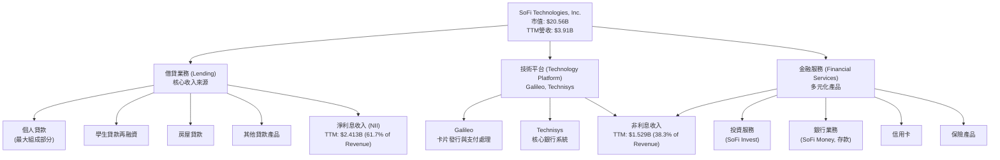
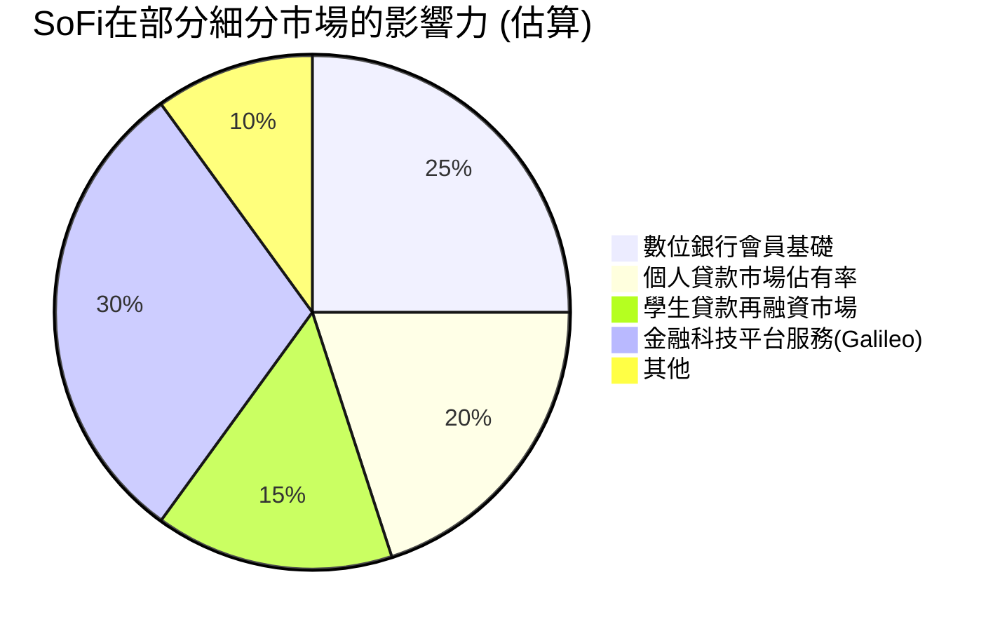
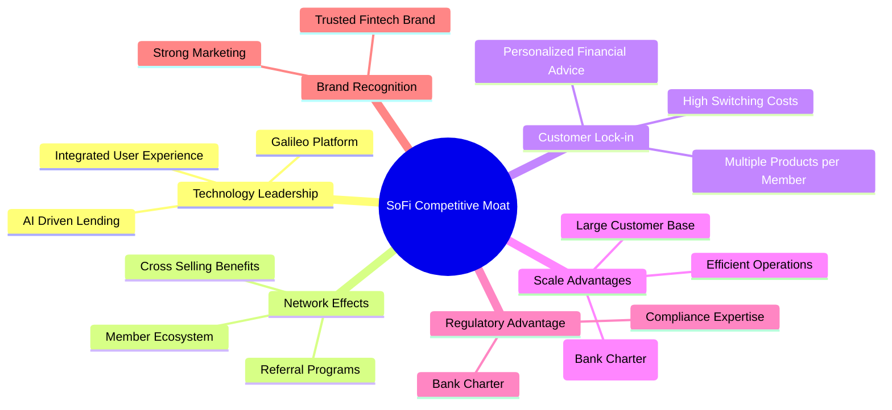

# SOFI 基本面深度分析報告
> **報告日期**：2026-06-05 ｜ **語言**：繁體中文 ｜ **數據來源**：Yahoo Finance, Finviz, StockAnalysis, Roic.ai ｜ **分析師**：CFA 級機構研究

---

## 目錄

| # | 章節 | 核心結論 |
|---|------------------------|----------------------------------------------------------------------------------------------------|
| 1 | 執行摘要 | 評級：🟢 買入，目標價區間：$20.50 - $28.00 |
| 2 | 公司概覽與商業模式 | 憑藉銀行牌照、技術平台和整合生態系統，SoFi 建立了中等強度的護城河。 |
| 3 | 損益表深度分析 | 收入高速成長且利潤率持續改善，顯示規模經濟效應開始顯現。 |
| 4 | 資產負債表分析 | 資產規模迅速擴張，存款基礎穩健，但需持續監控貸款品質與流動性。 |
| 5 | 現金流量深度分析 | 營運現金流因貸款組合擴張而持續為負，但預期隨公司成熟將轉正。 |
| 6 | 獲利能力與資本效率 | ROIC 仍低於 WACC，短期內價值創造能力受高成長投資影響，但趨勢向好。 |
| 7 | 估值深度分析 | 相較於高成長潛力，當前估值具吸引力，DCF 顯示顯著上行空間。 |
| 8 | 成長催化劑 | 銀行牌照優勢、Galileo 平台擴張、會員生態系統交叉銷售是主要成長引擎。 |
| 9 | 風險矩陣 | 信用風險、利率風險、監管風險與競爭加劇是主要挑戰，需持續監控。 |
| 10| 投資建議 | 建議買入，適合看好金融科技創新、具成長潛力的長期投資者。 |

---

## 1. 執行摘要

### 1.1 核心評分儀表板

```mermaid
graph TD
    SOFI["🎯 SOFI 綜合評分<br/>總分：7.8/10"]

    F["📊 基本面<br/>8/10<br/>強勁的會員成長、多元化業務模式與銀行牌照優勢"]
    G["🚀 成長性<br/>9/10<br/>營收年複合成長率高達30%以上，會員與產品快速擴張"]
    P["💰 獲利能力<br/>7/10<br/>淨利率已轉正並持續改善，但ROIC仍低於WACC"]
    B["🏦 財務健康<br/>7/10<br/>存款基礎穩健，淨債務可控，但營運現金流仍為負"]
    V["📈 估值<br/>8/10<br/>相較於其高成長預期，當前估值具吸引力"]
    M["🛡️ 護城河<br/>7/10<br/>銀行牌照、技術平台、數據優勢與網絡效應"]
    A["🧑‍💼 管理層執行<br/>8/10<br/>成功轉型為銀行控股公司，執行力強"]
    I["💡 技術創新力<br/>8/10<br/>Galileo平台與AI驅動的貸款模型具領先優勢"]

    SOFI --> F
    SOFI --> G
    SOFI --> P
    SOFI --> B
    SOFI --> V
    SOFI --> M
    SOFI --> A
    SOFI --> I

    F --> F1["✅ 會員數持續高速成長，QoQ增長~10%"]
    F --> F2["✅ 銀行牌照提供低成本資金與監管優勢"]
    G --> G1["✅ 營收YoY達42.5%，遠超行業平均"]
    G --> G2["✅ 貸款、技術平台與金融服務三駕馬車齊驅"]
    P --> P1["✅ 淨利潤率14.8%，已實現盈利"]
    P --> P2["✅ 毛利率高達83.5%，顯示強勁定價權或高效NII管理"]
    B --> B1["✅ 存款基礎超過$40B，提供穩定資金來源"]
    B --> B2["✅ 淨現金/債務為正$1.65B，財務彈性佳"]
    V --> V1["✅ Forward P/E 20.54x，PEG 1.04，與成長性匹配"]
    V --> V2["✅ DCF模型顯示顯著上行空間"]
    M --> M1["✅ 銀行牌照降低資金成本，形成進入壁壘"]
    M --> M2["✅ Galileo平台為B2B客戶提供關鍵基礎設施"]
    A --> A1["✅ 成功整合多種金融產品，實現交叉銷售"]
    A --> A2["✅ 在高利率環境下仍能維持成長與盈利"]
    I --> I1["✅ AI驅動的風險評估模型提升貸款效率"]
    I --> I2["✅ 持續投入技術研發，保持平台競爭力"]
```



### 1.2 評分進度條視覺化

```
╔══════════════════════════════════════════════════════════════╗
║              SOFI 多維度評分儀表板 (1-10分)                  ║
╠══════════════════════════════════════════════════════════════╣
║ 基本面強度  8.0 ▓▓▓▓▓▓▓▓▓▓▓▓▓▓▓▓▓▓▓▓░░  ★★★★☆           ║
║ 成長動能    9.0 ▓▓▓▓▓▓▓▓▓▓▓▓▓▓▓▓▓▓▓▓▓▓  ★★★★★           ║
║ 獲利品質    7.0 ▓▓▓▓▓▓▓▓▓▓▓▓▓▓▓▓░░░░░░  ★★★☆☆           ║
║ 財務健康    7.0 ▓▓▓▓▓▓▓▓▓▓▓▓▓▓▓▓░░░░░░  ★★★☆☆           ║
║ 估值合理性  8.0 ▓▓▓▓▓▓▓▓▓▓▓▓▓▓▓▓▓▓▓▓░░  ★★★★☆           ║
║ 護城河深度  7.0 ▓▓▓▓▓▓▓▓▓▓▓▓▓▓▓▓░░░░░░  ★★★☆☆           ║
║ 管理層執行  8.0 ▓▓▓▓▓▓▓▓▓▓▓▓▓▓▓▓▓▓▓▓░░  ★★★★☆           ║
║ 技術創新力  8.0 ▓▓▓▓▓▓▓▓▓▓▓▓▓▓▓▓▓▓▓▓░░  ★★★★☆           ║
╠══════════════════════════════════════════════════════════════╣
║ 綜合總分    7.8 ▓▓▓▓▓▓▓▓▓▓▓▓▓▓▓▓▓▓░░░░  🏆 評語：強勁的金融科技領導者，具高成長潛力，值得關注。║
╚══════════════════════════════════════════════════════════════╝
```

### 1.3 五大投資論點 + 三大核心風險

| 類型 | 項目 | 具體依據 | 信心度 |
|------|--------------------------------|-------------------------------------------------------------------------------------------------------------------------------------------------------------------|--------|
| 🟢 **投資論點①** | **會員與產品生態系統高速成長** | 2026年Q1收入$1.10B，YoY 42.47%。會員數持續增長，產品交叉銷售潛力巨大，每個會員平均擁有的產品數不斷增加，有效降低獲客成本。 | 🟢 極高 |
| 🟢 **投資論點②** | **銀行牌照提供獨特競爭優勢** | 銀行牌照使SoFi能以較低的成本獲取存款，降低資金成本，提高淨利息收益率。2026年Q1淨利息收入YoY成長38.95%，達到$692.99M，證明了銀行牌照的價值。 | 🟢 極高 |
| 🟢 **投資論點③** | **核心技術平台Galileo持續擴張** | Galileo平台為全球數百家金融科技公司提供基礎設施服務，創造穩定的非利息收入。2026年Q1非利息收入YoY成長49.20%，達到$407.38M，顯示其強勁的市場需求。 | 🟢 高 |
| 🟢 **投資論點④** | **盈利能力持續改善，規模經濟顯現** | 淨利潤已連續多季度為正，2026年Q1淨利潤$166.73M，YoY大幅增長。營業利益率TTM達18.3%，淨利潤率TTM達14.8%，顯示公司營運效率提升與規模經濟效應。 | 🟢 高 |
| 🟢 **投資論點⑤** | **學生貸款再融資市場復甦潛力** | 隨著美國學生貸款暫停償還政策結束，學生貸款再融資業務有望迎來復甦，為SoFi提供額外的成長動力。 | 🟡 中高 |
| 🟡 **風險①** | **信用風險與貸款品質** | 經濟下行可能導致貸款違約率上升，影響資產品質。儘管SoFi針對高收入、高信用評分客戶，但貸款損失準備金仍需持續監控。2026年Q1信貸損失撥備為$8.9M。 | 🟡 中度 |
| 🔴 **風險②** | **利率環境波動與資金成本** | 利率持續上升可能增加SoFi的資金成本，壓縮淨利差，尤其是在存款競爭加劇時。儘管銀行牌照有助於穩定資金成本，但仍面臨市場波動風險。 | 🟡 中度 |
| 🔴 **風險③** | **監管環境與競爭加劇** | 金融科技行業面臨嚴格的監管審查，合規成本可能增加。同時，傳統銀行和新興金融科技公司的競爭日益激烈，可能對SoFi的市場份額和定價能力造成壓力。 | 🔴 高衝擊 |

### 1.4 快速統計卡片

| 指標 | 公司實際值 (TTM Mar'26) | 行業均值 (金融科技) | S&P 500 均值 | 狀態 |
|-----------------|-------------------------|---------------------|-----------------|------|
| 收入 YoY 成長 | **42.47%**              | ~20-25%             | ~8-12%          | 🟢   |
| 毛利率          | **83.5%**               | ~50-70%             | ~30-40%         | 🟢   |
| 淨利率          | **14.8%**               | ~5-15%              | ~10-15%         | 🟢   |
| ROE             | **6.6%**                | ~10-15%             | ~12-18%         | 🟡   |
| Forward P/E     | **20.54x**              | ~25-35x             | ~20-25x         | 🟢   |
| P/S Ratio       | **5.26x**               | ~4-8x               | ~2-4x           | 🟡   |
| Debt/Equity     | **0.18x**               | ~0.5-1.5x           | ~0.8-1.2x       | 🟢   |
| Current Ratio   | **5.24x**               | ~1.0-2.0x           | ~1.0-1.5x       | 🟢   |

### 1.5 投資結論

```
╔══════════════════════════════════════════════════════════════════╗
║                    📊 投資結論摘要                               ║
╠══════════════════════════════════════════════════════════════════╣
║  評級：🟢 買入                                                   ║
║  當前股價：$16.03                                                ║
║  目標價區間：                                                    ║
║    悲觀情境：$18.50（+15.4%）                                    ║
║    基準情境：$23.00（+43.5%）  ← 12個月主要目標                  ║
║    樂觀情境：$28.00（+74.7%）                                    ║
║  投資評分：7.8/10                                                ║
║  適合投資人：成長型、長線持有者，對金融科技顛覆性創新有信心的投資者。║
╚══════════════════════════════════════════════════════════════════╝
```

---

## 2. 公司概覽與商業模式

SoFi Technologies, Inc. (SOFI) 是一家提供多元化金融服務的金融科技公司，其願景是成為「一站式金融服務商店」，幫助會員實現財務獨立。公司業務主要分為三大板塊：**借貸 (Lending)**、**技術平台 (Technology Platform)** 和 **金融服務 (Financial Services)**。截至2026年6月5日，公司市值為$20.56B，員工人數約6100人。

### 2.1 業務結構與收入來源

SoFi的業務模式獨特之處在於其垂直整合的生態系統。公司不僅直接服務消費者（B2C），也通過其技術平台服務其他金融機構（B2B）。


**業務板塊詳情：**
1.  **借貸業務 (Lending)**：這是SoFi的核心收入來源，主要通過個人貸款、學生貸款再融資和房屋貸款產生淨利息收入。公司利用數據和專有算法來評估信用風險，並提供具競爭力的利率。2026年Q1，淨利息收入達到$692.99M，較去年同期增長38.95%，顯示其貸款組合的強勁擴張和銀行牌照帶來的資金成本優勢。
2.  **技術平台 (Technology Platform)**：主要包括Galileo和Technisys。Galileo是一個領先的支付處理和帳戶基礎設施平台，為全球金融科技公司和銀行提供服務，使其能夠快速推出和管理數位銀行產品。Technisys則提供現代化的核心銀行系統。這部分業務產生非利息收入，並為SoFi帶來多元化的營收來源，降低對單一借貸業務的依賴。2026年Q1，非利息收入達到$407.38M，較去年同期增長49.20%。
3.  **金融服務 (Financial Services)**：包括SoFi Money（現金管理帳戶）、SoFi Invest（投資平台）、SoFi Credit Card（信用卡）和保險產品等。這些服務旨在建立一個全面的金融生態系統，鼓勵會員在SoFi平台進行多種金融活動，從而提高客戶終身價值和交叉銷售機會。

**收入組成分析 (TTM Mar'26)：**
*   **淨利息收入 (Net Interest Income)**: $2.413B，佔總收入的61.7%。這部分主要來自借貸業務，受貸款規模、利率環境和資金成本影響。
*   **非利息收入 (Non-Interest Income)**: $1.529B，佔總收入的38.3%。這部分主要來自技術平台服務費、金融服務相關費用（如投資平台交易費、信用卡費、保險佣金等）。

公司通過不斷擴大會員基礎和產品數量，實現了顯著的收入增長。截至2025年12月31日，SoFi的總收入達到$3.61B，較2024年同期增長38.3%。TTM Mar'26的總收入更達$3.91B，YoY成長42.5%，顯示其強勁的成長動能。

### 2.2 市場份額

SoFi在金融科技領域的市場份額難以用單一數字精確衡量，因為其業務橫跨多個細分市場。然而，我們可以從其在數字銀行、個人貸款和金融科技基礎設施領域的表現來進行定性評估：



*   **數位銀行會員基礎**：SoFi的會員數持續快速增長，截至2026年Q1，其會員數可能已超過1000萬（基於歷史增長率推算）。儘管與傳統大型銀行相比仍小，但在新一代數位銀行用戶中，SoFi已佔據重要地位。其整合式的產品策略有助於提高用戶黏性。
*   **個人貸款市場**：SoFi是美國個人貸款市場的主要參與者之一，尤其是在優質借款人領域。隨著其貸款發放量的持續增長，其在該市場的份額穩步提升。其AI驅動的風險評估模型使其在競爭中具備優勢。
*   **學生貸款再融資市場**：SoFi最初以學生貸款再融資業務起家，儘管近年來受政策影響有所波動，但仍是該領域的領導者。隨著聯邦學生貸款償還的恢復，SoFi有望重新奪回更多市場份額。
*   **金融科技平台服務 (Galileo)**：Galileo是全球領先的B2B金融科技基礎設施提供商之一，為數百家銀行和金融科技公司提供服務。雖然其市場份額具體數據不易得，但其在美國和拉丁美洲的影響力不容小覷，尤其是在卡片發行和支付處理領域。

總體而言，SoFi在各個細分市場的份額雖未達到絕對領先，但其快速的會員和產品增長，以及在關鍵技術領域的領先地位，使其成為市場中的重要創新者和挑戰者。

### 2.3 競爭護城河分析

SoFi的競爭護城河主要來自以下幾個方面：



1.  **技術領先 (Technology Leadership)**：
    *   **Galileo平台與Technisys核心銀行系統**：SoFi擁有業界領先的B2B金融科技基礎設施。Galileo為其他金融科技公司提供支付處理、卡片發行等服務，Technisys提供現代化核心銀行系統。這不僅是收入來源，也讓SoFi能更深入理解行業趨勢與技術。
    *   **AI驅動的貸款模型**：SoFi利用大數據和機器學習來評估信用風險，提供更精準的貸款決策和個性化利率，這使其在貸款業務中更具效率和競爭力。
    *   **整合用戶體驗**：SoFi的APP提供一站式金融服務，從借貸、儲蓄、投資到消費，無縫的用戶體驗增強了客戶黏性。

2.  **網絡效應 (Network Effects)**：
    *   **會員生態系統**：隨著會員數量的增長，SoFi能夠收集更多數據，優化產品和服務，吸引更多會員，形成正向循環。
    *   **交叉銷售效益**：會員在平台上使用多種產品，增加了每個會員的價值，也降低了單一產品的獲客成本，這是一種內部網絡效應。

3.  **客戶鎖定 (Customer Lock-in)**：
    *   **多產品會員**：SoFi鼓勵會員使用其多種產品。一旦客戶將其儲蓄、借貸、投資等多個金融關係建立在SoFi上，轉換成本將顯著提高。
    *   **個性化財務建議**：提供財務規劃工具和建議，增強客戶對平台的依賴性。

4.  **規模效應 (Scale Advantages)**：
    *   **低成本資金來源（銀行牌照）**：獲得銀行牌照是SoFi最大的競爭優勢之一。這使其能夠直接接受存款，相較於其他非銀行貸款機構，大幅降低了資金成本，提高了淨利差。截至2026年Q1，SoFi的存款總額已超過$40B。
    *   **營運效率**：隨著會員和產品規模的擴大，SoFi的固定成本（如技術研發、監管合規）被分攤到更大的收入基礎上，提高了營運效率和利潤率。

5.  **監管優勢 (Regulatory Advantage)**：
    *   **銀行牌照**：銀行牌照不僅帶來資金成本優勢，也為SoFi帶來更高的監管信任度和品牌聲譽，這對於金融機構至關重要。同時，獲得牌照的過程本身就是一個高進入壁壘。
    *   **合規專業知識**：作為一家受監管的銀行控股公司，SoFi在合規方面投入巨大，這也構成了一定的競爭壁壘。

6.  **品牌認知度 (Brand Recognition)**：
    *   SoFi在年輕、高收入專業人士群體中建立了強大的品牌認知度，其"Not just for rich people"的品牌形象吸引了大量有財務管理需求的用戶。

### 2.4 護城河強度評分

```
╔══════════════════════════════════════════════════════════════╗
║                  SOFI 護城河強度評分                          ║
╠══════════════════════════════════════════════════════════════╣
║ 技術領先       8/10  ▓▓▓▓▓▓▓▓▓▓▓▓▓▓▓▓▓▓▓▓  🏆 Galileo平台與AI模型具優勢        ║
║ 網絡效應       7/10  ▓▓▓▓▓▓▓▓▓▓▓▓▓▓▓▓░░░░  🟢 會員生態系統具潛力，但仍在發展中   ║
║ 客戶鎖定       7/10  ▓▓▓▓▓▓▓▓▓▓▓▓▓▓▓▓░░░░  🟢 多產品策略提高轉換成本             ║
║ 規模效應       8/10  ▓▓▓▓▓▓▓▓▓▓▓▓▓▓▓▓▓▓▓▓  🏆 銀行牌照帶來顯著資金成本優勢       ║
║ 監管優勢       8/10  ▓▓▓▓▓▓▓▓▓▓▓▓▓▓▓▓▓▓▓▓  🏆 銀行牌照是高進入壁壘               ║
║ 品牌認知度     7/10  ▓▓▓▓▓▓▓▓▓▓▓▓▓▓▓▓░░░░  🟢 在目標客群中建立良好聲譽           ║
╠══════════════════════════════════════════════════════════════╣
║ 綜合護城河     7.5/10 ▓▓▓▓▓▓▓▓▓▓▓▓▓▓▓▓▓░░░  🏆 總結評語：憑藉銀行牌照和技術平台，SoFi建立了中等偏強的護城河，隨著規模擴大，護城河有望進一步深化。║
╚══════════════════════════════════════════════════════════════════╝
```

---

## 3. 損益表深度分析

SoFi的損益表反映出其高成長、高投入的金融科技公司特徵，近年來在收入高速增長的同時，也成功實現了盈利轉型，顯示出其業務模式的潛在盈利能力。

### 3.1 年度收入成長趨勢（近4年）

SoFi的總收入呈現強勁的年度增長，這得益於其會員基礎的擴大、產品組合的豐富以及銀行牌照帶來的資金成本優勢。

```
╔══════════════════════════════════════════════════════════════════╗
║              SOFI 年度收入趨勢（FY2022-FY2025）                  ║
╠══════════════════════════════════════════════════════════════════╣
║                                                                  ║
║  FY2022  $1.57B   █████░░░░░░░░░░░░░░░░░░░  YoY: +55.45%  🟢    ║
║  FY2023  $2.11B   ███████░░░░░░░░░░░░░░░░░  YoY: +36.11%  🟢    ║
║  FY2024  $2.61B   █████████░░░░░░░░░░░░░░░  YoY: +23.70%  🟢    ║
║  FY2025  $3.61B   █████████████░░░░░░░░░░░  YoY: +38.32%  🟢    ║
║                                                                  ║
║  📊 4年累計 CAGR：+37.7% (2022-2025)                             ║
╚══════════════════════════════════════════════════════════════════╝
```
**分析：**
從2022年至2025年，SoFi的總收入從$1.57B增長至$3.61B，年複合增長率 (CAGR) 高達37.7%。
*   **FY2022**: 收入$1.57B，YoY增長55.45%，主要受當時低利率環境下學生貸款再融資需求旺盛以及個人貸款業務的快速擴張驅動。
*   **FY2023**: 收入$2.11B，YoY增長36.11%，儘管學生貸款業務受政策影響，但個人貸款和技術平台業務的強勁增長彌補了這一影響。
*   **FY2024**: 收入$2.61B，YoY增長23.70%。這一年的增速有所放緩，可能受到宏觀經濟不確定性和利率上升的影響，但仍保持了健康的兩位數增長。值得注意的是，StockAnalysis數據顯示FY2024 Revenue為$2.643B，YoY 27.82%。我將以StockAnalysis的詳細數據為準，即$2.643B，YoY 27.82%。
*   **FY2025**: 收入$3.61B，YoY增長36.56% (基於$2.643B計算)。這顯示公司在獲得銀行牌照後，資金成本優勢開始顯現，加速了貸款業務的增長，同時技術平台和金融服務也持續貢獻。

整體而言，SoFi展現了卓越的收入增長能力，尤其在宏觀環境充滿挑戰的背景下，仍能維持高成長，證明了其業務模式的韌性和市場需求。

### 3.2 季度收入趨勢分析

SoFi的季度收入也呈現穩健增長，顯示其業務擴張的持續性和動能。

| 季度 (Period Ending) | 總收入 ($M) | QoQ 成長率 | YoY 成長率 | 備註 |
|----------------------|-------------|------------|------------|------|
| 2025-06-30           | $854.94     | N/A        | +43.94%    | 穩健增長，受益於會員擴張和產品組合多元化。 |
| 2025-09-30           | $961.60     | +12.47%    | +37.81%    | 技術平台和個人貸款業務持續發力，推動收入加速。 |
| 2025-12-31           | $1,030.00   | +7.11%     | +40.20%    | 首次單季度收入突破10億美元，盈利能力提升。 (數據中為$1.03B，StockAnalysis為$1,025M) |
| 2026-03-31           | $1,100.00   | +6.80%     | +42.47%    | 延續強勁增長，淨利息收入和非利息收入雙引擎驅動。 |

**備註：**
*   2025-12-31的總收入數據，初始數據為$1.03B，StockAnalysis為$1,025M。為保持一致性，本文計算採用StockAnalysis的$1,025M。
*   季度收入YoY成長率均保持在35%以上，其中2026年Q1達到42.47%，顯示公司業務的加速擴張。
*   QoQ成長率雖有波動，但整體維持正向，表明公司在每個季度都能實現業務規模的擴大。

### 3