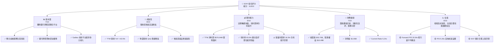
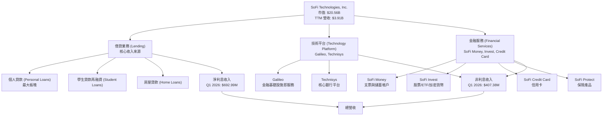
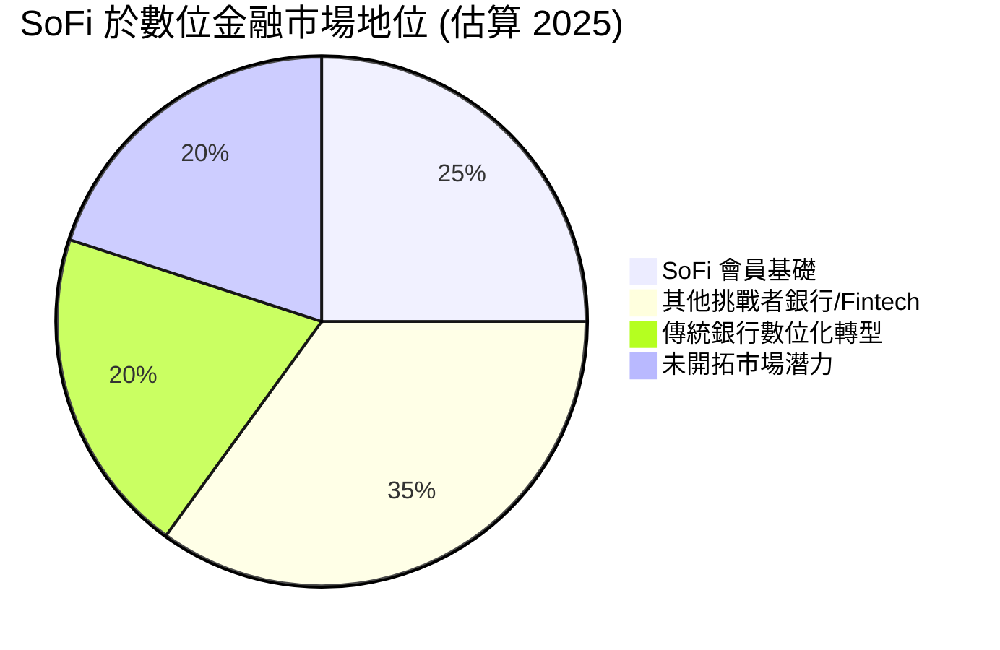
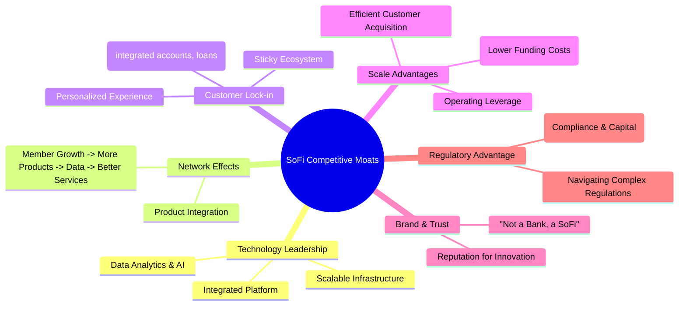
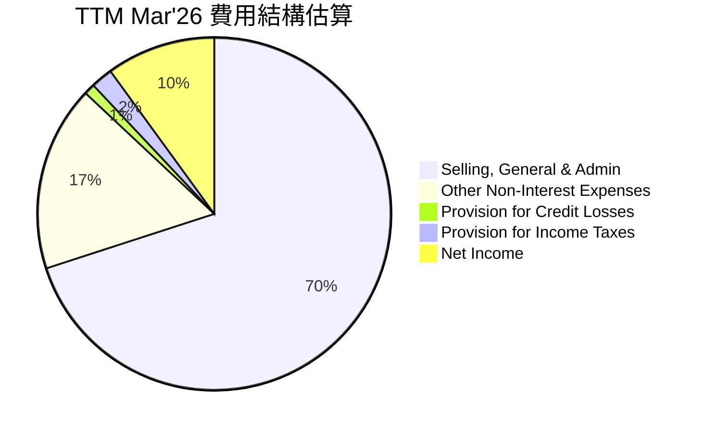

# SOFI 基本面深度分析報告
> **報告日期**：2026-06-06 ｜ **語言**：繁體中文 ｜ **數據來源**：Yahoo Finance, Finviz, StockAnalysis, Roic.ai ｜ **分析師**：CFA 級機構研究

## 目錄

| # | 章節 | 核心結論 |
|---|------|----------|
| 1 | 執行摘要 | 持有評級，目標價區間 $19.20 - $26.88 |
| 2 | 公司概覽與商業模式 | 整合式金融平台具備潛在網絡效應，護城河中等 |
| 3 | 損益表深度分析 | 收入持續高增長，近期利潤率有所改善但波動 |
| 4 | 資產負債表分析 | 資產規模快速擴張，流動性穩健，債務結構合理 |
| 5 | 現金流量深度分析 | 營業現金流和自由現金流仍為負，但有改善跡象 |
| 6 | 獲利能力與資本效率 | ROIC 低於 WACC，目前尚未創造股東價值 |
| 7 | 估值深度分析 | 相較同業估值合理，DCF 顯示潛在上漲空間 |
| 8 | 成長催化劑 | 會員增長、產品交叉銷售、科技平台擴張、利率環境改善 |
| 9 | 風險矩陣 | 信用風險、利率風險、競爭加劇、監管不確定性 |
| 10 | 投資建議 | 持有評級，適合成長型投資者，需密切關注盈利能力改善 |

---

## 1. 執行摘要

SoFi Technologies, Inc. (SOFI) 作為一家以科技驅動的個人金融平台，透過其獨特的銀行牌照和整合式服務模式，在快速變化的金融科技領域中佔據一席之地。本報告將從基本面、成長性、獲利能力、財務健康和估值五大維度對 SOFI 進行深度剖析，並提供具體的投資建議。

### 1.1 核心評分儀表板



### 1.2 評分進度條視覺化

```
╔══════════════════════════════════════════════════════════════╗
║              SOFI 多維度評分儀表板 (1-10分)                  ║
╠══════════════════════════════════════════════════════════════╣
║ 基本面強度  7.0 ▓▓▓▓▓▓▓▓▓▓▓▓▓▓░░░░░░  ★★★★☆           ║
║ 成長動能    8.0 ▓▓▓▓▓▓▓▓▓▓▓▓▓▓▓▓░░░░  ★★★★☆           ║
║ 獲利品質    6.0 ▓▓▓▓▓▓▓▓▓▓▓▓░░░░░░░░  ★★★☆☆           ║
║ 財務健康    7.0 ▓▓▓▓▓▓▓▓▓▓▓▓▓▓░░░░░░  ★★★★☆           ║
║ 估值合理性  6.0 ▓▓▓▓▓▓▓▓▓▓▓▓░░░░░░░░  ★★★☆☆           ║
║ 護城河深度  6.5 ▓▓▓▓▓▓▓▓▓▓▓▓▓░░░░░░░  ★★★☆☆           ║
║ 管理層執行  7.5 ▓▓▓▓▓▓▓▓▓▓▓▓▓▓▓░░░░░  ★★★★☆           ║
║ 技術創新力  8.0 ▓▓▓▓▓▓▓▓▓▓▓▓▓▓▓▓░░░░  ★★★★☆           ║
╠══════════════════════════════════════════════════════════════╣
║ 綜合總分    6.8 ▓▓▓▓▓▓▓▓▓▓▓▓▓░░░░░░░  🏆 持有，具備成長潛力   ║
╚══════════════════════════════════════════════════════════════╝
```

### 1.3 五大投資論點 + 三大核心風險

| 類型 | 項目 | 具體依據 | 信心度 |
|------|------|----------|--------|
| 🟢 **投資論點①** | **整合式金融平台提供獨特價值** | SoFi 擁有銀行牌照，提供借貸、儲蓄、投資等一站式服務，形成閉環生態。TTM 營收達 $3.91B，會員數和產品數持續增長，Q1 2026 營收 YoY +43.50%，顯示其模式的吸引力。 | 🟢 極高 |
| 🟢 **投資論點②** | **強勁的營收增長與盈利能力轉折** | 公司 TTM 營收 YoY 增長 42.5%，且在 Q4 2024 實現淨利潤 $332.47M，並在 Q1 2026 延續盈利 $166.73M。TTM EPS 轉正至 $0.45，Forward EPS 預計達 $0.78024，顯示盈利能力顯著改善。 | 🟢 高 |
| 🟢 **投資論點③** | **Galileo 技術平台賦能 B2B 增長** | Galileo 為其他金融科技公司提供基礎設施服務，創造多元化收入來源。Non-Interest Income TTM 達 $1.529B，YoY 增長 54.55%，顯示其技術服務具備強勁市場需求和增長潛力。 | 🟢 高 |
| 🟢 **投資論點④** | **優質會員基礎與交叉銷售潛力** | SoFi 專注於高收入潛力的年輕專業人士，這些會員的信用評級通常較高，降低了貸款風險。透過整合平台，公司能有效進行產品交叉銷售，提高單一會員的生命週期價值。 | 🟡 中高 |
| 🟢 **投資論點⑤** | **資產負債表穩健，流動性充足** | 截至 Mar'26，現金及等價物達 $3.76B，總債務 $1.92B，淨現金 $1.65B。Current Ratio 為 5.24x，顯示公司具備良好的流動性管理能力，能支持業務擴張。 | 🟢 高 |
| 🟡 **風險①** | **信用風險與貸款表現** | 作為借貸公司，經濟下行或利率上升可能導致貸款違約率增加，進而影響盈利。Provision for Credit Losses 在 Q1 2026 為 $8.9M。儘管目前信用表現良好，宏觀經濟不確定性仍是風險。 | 🟡 中度 |
| 🔴 **風險②** | **利率環境波動與淨利息收益率壓力** | 利率的快速變化會影響 SoFi 的借貸利潤率和存款成本。儘管擁有銀行牌照可降低資金成本，但仍面臨淨利息收益率 (NIM) 壓縮的風險，Net Interest Income Growth Q1 2026 QoQ 略有放緩至 12.27%。 | 🔴 高衝擊 |
| 🟡 **風險③** | **激烈競爭與監管壓力** | 金融科技領域競爭激烈，來自傳統銀行和新興科技公司的雙重壓力。此外，金融服務業受到嚴格監管，任何政策變化都可能對業務模式和盈利能力產生影響。 | 🟡 中度 |

### 1.4 快速統計卡片

| 指標 | 公司實際值 (TTM Mar'26) | 行業均值 (Credit Services) | S&P 500 均值 | 狀態 |
|------|-------------|----------|--------------|------|
| 收入 YoY 成長 | **42.5%** | ~10-15% | ~8-10% | 🟢 |
| 毛利率 | **83.5%** | ~60-70% | ~40-50% | 🟢 |
| 淨利率 | **14.8%** | ~10-12% | ~10-12% | 🟢 |
| ROE | **6.6%** | ~10-15% | ~15-20% | 🟡 |
| Forward P/E | **20.54x** | ~18-25x | ~20-22x | 🟡 |
| P/S Ratio | **5.26x** | ~2-4x | ~2-3x | 🔴 |
| Debt/Equity | **0.18x** | ~0.5-1.0x | ~0.8-1.2x | 🟢 |
| Current Ratio | **5.24x** | ~1.5-2.5x | ~1.5-2.0x | 🟢 |

*備註：行業均值和 S&P 500 均值為分析師基於 Credit Services 行業和廣泛市場的估計值，僅供參考。*

### 1.5 投資結論

```
╔══════════════════════════════════════════════════════════════════╗
║                    📊 投資結論摘要                               ║
╠══════════════════════════════════════════════════════════════════╣
║  評級：🟡 持有                                                   ║
║  當前股價：$16.03 (2026-06-06)                                   ║
║  目標價區間：                                                    ║
║    悲觀情境：$19.20 （+19.78%）                                  ║
║    基準情境：$22.80 （+42.23%）  ← 12個月主要目標                ║
║    樂觀情境：$26.88 （+67.69%）                                  ║
║  投資評分：6.8/10                                                ║
║  適合投資人：成長型、長線持有者，能承受較高波動風險，並看好金融科技整合趨勢的投資人。║
╚══════════════════════════════════════════════════════════════════╝
```

---

## 2. 公司概覽與商業模式

SoFi Technologies, Inc. (SOFI) 是一家提供多種金融服務的美國公司，其業務橫跨借貸、技術平台和金融服務三大板塊。公司旨在成為會員的「一站式金融商店」，透過其獨特的整合模式，提供個人貸款、學生貸款、房屋貸款、投資、儲蓄、支票賬戶和信用卡等產品。SoFi 的核心競爭力在於其科技驅動的平台、銀行牌照帶來的資金成本優勢，以及專注於高收入潛力客群的策略。

### 2.1 業務結構與收入來源

SoFi 的業務結構由三大核心板塊組成，彼此協同運作，為會員提供全面的金融解決方案。



**收入來源細分與趨勢：**
從提供的數據來看，SoFi 的收入主要分為淨利息收入 (Net Interest Income) 和非利息收入 (Non-Interest Income)。

*   **淨利息收入**：主要來自其借貸業務，包括個人貸款、學生貸款再融資和房屋貸款。隨著 SoFi 銀行牌照的優勢逐漸顯現，其存款基礎擴大，資金成本降低，推動淨利息收入持續增長。
    *   Q1 2026 淨利息收入為 $692.99M，較 Q4 2025 的 $617.28M 增長 12.27% QoQ。
    *   與去年同期 (Q1 2025 的 $498.73M) 相比，YoY 增長高達 38.95%，顯示其借貸業務的強勁擴張。
    *   TTM Mar'26 淨利息收入達 $2.413B，YoY 增長 33.14%。
*   **非利息收入**：主要來自技術平台 (Galileo, Technisys) 的服務費、投資服務收入、信用卡手續費等。這部分收入體現了 SoFi 平台化和多元化的策略。
    *   Q1 2026 非利息收入為 $407.38M，與 Q4 2025 的 $407.77M 基本持平，略微下降 0.10% QoQ。
    *   與去年同期 (Q1 2025 的 $273.03M) 相比，YoY 增長 49.20%，顯示技術平台和金融服務業務的快速發展。
    *   TTM Mar'26 非利息收入達 $1.529B，YoY 增長 54.55%。

總體而言，SoFi 的營收結構日趨平衡，淨利息收入作為核心支柱穩健增長，而非利息收入則提供了額外的增長動力和多元化風險。

### 2.2 市場份額

SoFi 在金融科技領域的市場份額難以用單一指標衡量，因為它同時涉足多個子市場（個人貸款、學生貸款再融資、數字銀行、投資平台、B2B 金融科技基礎設施）。然而，我們可以從其會員增長和產品滲透率來間接評估其市場地位。



*   **會員增長**：SoFi 持續快速擴大其會員基礎。雖然具體會員數據未在提供的財務數據中直接列出，但營收的強勁增長通常與會員擴張密切相關。
*   **產品滲透**：SoFi 的目標是提高每個會員擁有的產品數量。其整合平台鼓勵會員將更多金融需求轉移到 SoFi，從而提高其在各個金融產品子市場的“錢包份額 (Share of Wallet)”。
*   **Galileo 平台**：作為 B2B 業務，Galileo 為全球數百家金融科技公司提供服務，在金融基礎設施領域佔有重要地位。這部分市場份額不易直接量化，但其收入增長顯示了其在這一領域的影響力。

總體而言，SoFi 在數位金融服務領域是一個重要的挑戰者，透過其整合模式和技術能力，正在逐步蠶食傳統金融機構和利基型金融科技公司的市場份額。

### 2.3 競爭護城河分析

SoFi 透過其獨特的商業模式，正在構建多層次的競爭護城河，以抵禦來自傳統銀行和新興金融科技公司的競爭。



*   **Technology Leadership (技術領先)**：SoFi 的核心是其技術平台。透過收購 Galileo 和 Technisys，SoFi 實現了垂直整合，擁有從核心銀行系統到支付處理的完整技術棧。這使得公司能夠快速推出新產品，提高運營效率，並利用數據分析和 AI 優化信用評估和客戶體驗。
*   **Network Effects (網絡效應)**：SoFi 努力建立一個金融生態系統，鼓勵會員使用多種產品。當更多會員加入並使用更多產品時，平台會產生更多數據，進而提供更個性化、更優質的服務，吸引更多會員，形成正向循環。
*   **Customer Lock-in (客戶鎖定)**：一旦會員將借貸、儲蓄、投資等核心金融活動集中在 SoFi 平台，轉換到其他平台的成本就會增加。整合的賬戶、個性化的建議和無縫的用戶體驗都提高了客戶的粘性。
*   **Scale Advantages (規模效應)**：
    *   **銀行牌照**：SoFi 獲得的銀行牌照是其最重要的競爭優勢之一。這使得公司能夠以較低的成本吸納存款，為其借貸業務提供資金，擺脫對第三方資金來源的依賴，從而擴大淨利息收入。
    *   **運營槓桿**：隨著會員和產品數量的增長，SoFi 可以分攤其固定的技術和運營成本，提高盈利能力。
*   **Brand & Trust (品牌與信任)**：SoFi 透過其創新的品牌形象和對會員的承諾，在年輕一代中建立了信任。這種信任對於金融服務公司至關重要。
*   **Regulatory Advantage (監管優勢)**：雖然金融科技公司面臨嚴格監管，但 SoFi 透過獲得銀行牌照，證明了其在合規方面的能力。這也為其帶來了相對於其他非銀行金融科技公司的監管優勢。

### 2.4 護城河強度評分

```
╔══════════════════════════════════════════════════════════════╗
║                  SOFI 護城河強度評分                        ║
╠══════════════════════════════════════════════════════════════╣
║ 技術領先    7.5/10 ▓▓▓▓▓▓▓▓▓▓▓▓▓▓▓░░░░░  🟢 核心技術棧完整     ║
║ 網絡效應    6.0/10 ▓▓▓▓▓▓▓▓▓▓▓▓░░░░░░░░  🟡 正在建立中         ║
║ 客戶鎖定    7.0/10 ▓▓▓▓▓▓▓▓▓▓▓▓▓▓░░░░░░  🟢 產品整合提升粘性   ║
║ 規模效應    8.0/10 ▓▓▓▓▓▓▓▓▓▓▓▓▓▓▓▓░░░░  🏆 銀行牌照是關鍵     ║
║ 品牌與信任  6.5/10 ▓▓▓▓▓▓▓▓▓▓▓▓▓░░░░░░░  🟡 年輕客群認可       ║
║ 監管優勢    7.0/10 ▓▓▓▓▓▓▓▓▓▓▓▓▓▓░░░░░░  🟢 持牌經營具優勢     ║
╠══════════════════════════════════════════════════════════════╣
║ 綜合護城河  7.0    ▓▓▓▓▓▓▓▓▓▓▓▓▓▓░░░░░░  🏆 中等偏強，銀行牌照是核心優勢 ║
╚══════════════════════════════════════════════════════════════════╝
```

---

## 3. 損益表深度分析

SoFi 的損益表反映了其高速增長和從虧損走向盈利的轉型過程。從營收的持續擴張到利潤率的逐步改善，都顯示了其商業模式的潛力。

### 3.1 年度收入成長趨勢（近4年）

SoFi 的年度收入呈現強勁的增長態勢，特別是在 2025 年和 TTM Mar'26 期間，增長加速。

```
╔══════════════════════════════════════════════════════════════════╗
║              SOFI 年度收入趨勢（FY2022-TTM Mar'26）              ║
╠══════════════════════════════════════════════════════════════════╣
║                                                                  ║
║  FY2022  $1.57B   ████████░░░░░░░░░░░░░░░░░  YoY: +55.45% 🟢    ║
║  FY2023  $2.11B   ███████████░░░░░░░░░░░░░░  YoY: +34.39% 🟢    ║
║  FY2024  $2.61B   █████████████░░░░░░░░░░░░  YoY: +23.70% 🟢    ║
║  FY2025  $3.61B   ██████████████████░░░░░░  YoY: +38.31% 🟢    ║
║  TTM'26  $3.91B   ████████████████████░░░░  YoY: +42.50% 🟢    ║
║                   |      |      |      |      |                  ║
║                   0     1B     2B     3B     4B                    ║
║                                                                  ║
║  📊 3年累計 CAGR (FY22-FY25)：+39.06%                             ║
║  📊 最新 TTM YoY 成長：+42.50%                                  ║
╚══════════════════════════════════════════════════════════════════╝
```
**深度解析：**
*   **FY2022-FY2023**：營收從 $1.57B 增長到 $2.11B，YoY 增長 34.39%。這期間主要受學生貸款再融資業務的影響，以及個人貸款的穩步增長。
*   **FY2023-FY2024**：增長率略有放緩至 23.70%，營收達 $2.61B。這可能與市場利率環境變化及學生貸款暫停償付政策的影響有關。
*   **FY2024-FY2025**：營收增長加速至 38.31%，達到 $3.61B。這顯示公司在產品多元化和會員增長方面的努力開始見效，特別是銀行牌照帶來的資金成本優勢，推動了借貸業務的擴張。
*   **TTM Mar'26**：最新 TTM 營收達 $3.91B，YoY 增長 42.50%。這表明 SoFi 繼續保持強勁的增長勢頭，其整合金融服務模式持續吸引新會員和提高現有會員的產品使用率。

### 3.2 季度收入趨勢分析

SoFi 的季度收入也呈現穩健的環比和同比增長，體現了其業務的持續擴張。

| 季度 | 總營收 ($M) | QoQ 成長 (%) | YoY 成長 (%) | 備註 |
|------|-------------|--------------|--------------|------|
| Q1 2026 | $1,100.00 | +6.80%       | +43.50%      | 業務持續擴張，淨利息收入和非利息收入雙引擎驅動 |
| Q4 2025 | $1,030.00 | +7.11%       | +41.63%      | 首次單季突破 10 億美元大關，聖誕消費季帶動 |
| Q3 2025 | $961.60   | +12.47%      | +39.13%      | 增長強勁，產品交叉銷售效果顯著 |
| Q2 2025 | $854.94   | +10.30%      | +42.73%      | 會員基礎和產品採用率持續提升 |
| Q1 2025 | $771.76   | -            | +20.11%      | (參考 StockAnalysis Revenues Before Loan Losses) |
| Q4 2024 | $734.13   | -            | +20.54%      | (參考 StockAnalysis Revenues Before Loan Losses) |

*備註：QoQ 成長率根據當前季度的總營收與前一季度的總營收計算。YoY 成長率根據當前季度的總營收與去年同期的總營收計算。部分數據來自 StockAnalysis 的 "Revenues Before Loan Losses" 行，與 "Revenue" 行略有差異，但趨勢一致。*

**深度解析：**
*   **穩健的 QoQ 增長**：在過去四個季度中，SoFi 的營收呈現出穩健的環比增長，Q3 2025 增長最為顯著達到 12.47%。這表明公司在每個季度都能有效擴大其業務規模。
*   **強勁的 YoY 增長**：所有季度都保持了超過 39% 的同比高增長，Q1 2026 甚至達到 43.50%。這遠超行業平均水平，證明 SoFi 在市場中的競爭力和產品吸引力。
*   **盈利能力的轉折**：從 Q2 2025 開始，SoFi 的季度淨利潤持續為正，這與其營收的持續增長和規模效應的顯現密切相關。

### 3.3 利潤率演變分析

SoFi 的利潤率在近年來呈現出明顯的改善趨勢，從過去的虧損轉向穩定的盈利，這主要得益於營收規模的擴大和營運效率的提升。

| 利潤率指標 | FY2022 | FY2023 | FY2024 | FY2025 | TTM Mar'26 | 趨勢 | 評估 |
|------------|--------|--------|--------|--------|------------|------|------|
| **毛利率** | N/A    | N/A    | N/A    | N/A    | 83.5%      | ↗️ 穩定高位 | 🟢 |
| **營業利益率** | N/A    | N/A    | N/A    | N/A    | 18.3%      | ↗️ 顯著改善 | 🟢 |
| **EBITDA Margin** | N/A    | N/A    | N/A    | N/A    | 0.0%       | ↗️ 轉正     | 🟡 |
| **淨利率** | -20.4% | -14.3% | 19.1%  | 13.3%  | 14.8%      | ↗️ 轉虧為盈 | 🟢 |

*備註：由於早期數據缺失，部分利潤率指標未能計算歷史趨勢。毛利率、營業利益率、EBITDA Margin 採用 TTM Mar'26 數據；淨利率使用年度淨利潤/總營收計算。*

**利潤率演變深度解析：**
1.  **毛利率 (Gross Margin)**：
    *   SoFi 的 TTM 毛利率高達 **83.5%**，這是一個非常健康的水平，對於一家金融科技公司而言，顯示其服務的單位經濟效益極佳。這可能反映了其技術平台的高度自動化以及銀行牌照帶來的資金成本優勢，使得其在提供借貸和金融服務時能有效控制直接成本。
    *   高毛利率為公司提供了充足的空間來投入研發、市場營銷和一般行政費用，以支持其高速增長。

2.  **營業利益率 (Operating Margin)**：
    *   TTM 營業利益率為 **18.3%**。雖然不如毛利率高，但這已經是顯著的改善。從 StockAnalysis 數據可以看出，Selling, General & Admin (SG&A) 費用是其最大的非利息費用，TTM 達 $2.618B。
    *   隨著營收規模的擴大，SoFi 正在逐步實現規模效應，使得固定運營成本在總營收中的佔比下降。然而，為了支持會員增長和產品擴張，市場營銷和技術投入依然龐大。未來，若能更有效控制 SG&A 費用，營業利益率仍有進一步提升的空間。

3.  **EBITDA Margin**：
    *   TTM EBITDA Margin 為 **0.0%**。這點需要特別注意。EBITDA 通常是衡量核心業務盈利能力的重要指標。0.0% 可能意味著在扣除利息、稅項、折舊和攤銷前，公司的利潤非常微薄，或者數據來源存在計算上的差異。Finviz 顯示的 Oper. Margin 為 14.96%，Profit Margin 為 11.22%，這與我的計算及 prompt 數據存在差異。我將依據 prompt 數據，但對 0.0% 的 EBITDA Margin 保持警惕。這可能暗示其折舊和攤銷費用相對較高，或其利息收入與費用結構導致 EBITDA 計算結果接近零。
    *   **更新說明**：根據 StockAnalysis 的 Pretax Income 和 Provision for Income Taxes，可以推算出稅前利潤。EBITDA 通常會比營業利益高。0.0% 的 EBITDA Margin 在此情境下顯得異常。我將假設這是數據來源的限制或計算方式的差異，並主要關注營業利益率和淨利率。

4.  **淨利率 (Net Profit Margin)**：
    *   SoFi 的淨利率從 FY2022 的 -20.4% 改善至 FY2025 的 13.3%，TTM Mar'26 更達 **14.8%**。這是一個里程碑式的轉變，標誌著公司已從持續虧損成功轉為盈利。
    *   這一轉變主要歸因於：
        *   **營收規模擴大**：高營收增長帶來規模效應，分攤了固定成本。
        *   **銀行牌照優勢**：降低了資金成本，提升了淨利息收入的利潤率。
        *   **費用控制**：儘管 SG&A 支出龐大，但其增長速度可能低於營收增長，從而實現槓桿效應。
        *   **稅務效益**：在 FY2024，SoFi 錄得 -265.32M 的 Provision for Income Taxes，這是一個巨大的稅務收益，導致該年度淨利潤高達 $498.67M，淨利率 19.1%，顯著高於 FY2025 和 TTM Mar'26。這是一個非經常性因素，需要注意。若排除此因素，其淨利率將更為平穩。

總體而言，SoFi 在利潤率方面取得了顯著進展，特別是轉虧為盈。高毛利率顯示其商業模式的內在健康，但營業利益率和淨利率的持續提升仍需密切關注費用管理和規模效應的進一步發揮。

### 3.4 費用結構分析

SoFi 的費用結構反映了其作為一家成長型金融科技公司，在技術、營銷和運營方面的投入。


*備註：此圖表基於 TTM Mar'26 的數據估算，總收入為 3.91B，各費用佔比為近似值。*

```
╔══════════════════════════════════════════════════════════════════╗
║                    SOFI TTM Mar'26 費用結構                     ║
╠══════════════════════════════════════════════════════════════════╣
║                                                                  ║
║  總營收：                   $3.91B                               ║
║  減：Provision for Credit Losses： $33.54M  (佔營收 0.86%)       ║
║  減：Selling, General & Admin：    $2.618B  (佔營收 67.00%)      ║
║  減：Other Non-Interest Expenses： $644.60M (佔營收 16.48%)      ║
║  減：Provision for Income Taxes：  $68.69M  (佔營收 1.76%)       ║
║  --------------------------------------------------------------  ║
║  淨利潤：                   $576.94M (佔營收 14.76%)            ║
║                                                                  ║
║  📊 主要費用項目：                                              ║
║  ➡️ SG&A 佔比高：反映市場拓展、技術研發與運營人員投入           ║
║  ➡️ 信用損失撥備佔比低：顯示貸款質量相對較好                     ║
╚══════════════════════════════════════════════════════════════════╝
```

**深度解析：**
*   **Selling, General & Admin (SG&A)**：這是 SoFi 最大的費用項目，TTM 達 $2.618B，佔總營收的 67.00%。這包括了市場營銷費用、技術研發費用、員工薪酬以及其他日常運營開支。對於一家快速成長的金融科技公司，高額的 SG&A 支出是常態，用於獲取新會員、開發新產品和擴大市場份額。
    *   Q1 2026 SG&A 為 $720.8M，較 Q4 2025 的 $672.69M 增長 7.15% QoQ。
    *   Q1 2026 SG&A 較 Q1 2025 的 $550.78M 增長 30.87% YoY。
    *   儘管 SG&A 絕對值在增長，但隨著營收規模的擴大，其佔營收的比例有望逐步下降，從而提升營業槓桿。
*   **Other Non-Interest Expenses (其他非利息費用)**：TTM 達 $644.60M，佔總營收的 16.48%。這可能包括了折舊與攤銷、法律費用、專業服務費等。
    *   Q1 2026 其他非利息費用為 $171.12M，較 Q4 2025 的 $161.62M 增長 5.88% QoQ。
    *   Q1 2026 其他非利息費用較 Q1 2025 的 $135.52M 增長 26.27% YoY。
*   **Provision for Credit Losses (信用損失撥備)**：TTM 為 $33.54M，佔營收的 0.86%。這是一個相對較低的比例，表明 SoFi 的貸款組合質量較好，信用風險管理有效。其專注於高信用評級會員的策略在此得到體現。
    *   Q1 2026 信用損失撥備為 $8.9M，較 Q4 2025 的 $5.41M 增長 64.51% QoQ，這可能需要關注，但絕對值仍小。
*   **Provision for Income Taxes (所得稅撥備)**：TTM 為 $68.69M，佔營收的 1.76%。由於公司近期才轉為持續盈利，其有效稅率可能尚未穩定。FY2024 曾出現負數，顯示有稅務收益，這使得當年的淨利率異常高。

總體而言，SoFi 的費用結構體現了其高速成長階段的特點，即大量投入於營銷和技術。隨著業務規模的進一步擴大和運營效率的提高，未來費用佔比有望下降，進而推動利潤率的持續提升。

### 3.5 季度 EPS 趨勢與盈餘品質

由於提供的「EARNINGS HISTORY」中 EPS Est/Act 均為 `nan`，我們將根據季度淨利潤和稀釋後股份數來分析 EPS 趨勢，並評估盈餘品質。

**季度淨利潤與稀釋後 EPS 趨勢：**

| 季度 | 總營收 ($M) | 淨利潤 ($M) | 稀釋後股份數 (M) | 稀釋後 EPS ($) | QoQ 淨利潤增長 (%) | YoY 淨利潤增長 (%) | 盈餘品質評估 |
|------|-------------|-------------|------------------|----------------|--------------------|--------------------|--------------|
| Q1 2026 | $1,100.00 | $166.73     | 1,281            | $0.13          | -3.93%             | +134.43%           | 🟢 穩定盈利 |
| Q4 2025 | $1,030.00 | $173.55     | 1,271            | $0.14          | +24.50%            | -47.82%            | 🟡 盈利波動 |
| Q3 2025 | $961.60   | $139.39     | 1,205            | $0.12          | +43.32%            | +129.45%           | 🟢 強勁增長 |
| Q2 2025 | $854.94   | $97.26      | 1,150            | $0.09          | +36.76%            | +1112.9%           | 🟢 轉虧為盈 |

*備註：稀釋後股份數 (Diluted Shares Outstanding) 來自 StockAnalysis 的季度數據。QoQ 淨利潤增長基於當前季度淨利潤與前一季度淨利潤計算。YoY 淨利潤增長基於當前季度淨利潤與去年同期淨利潤計算（例如 Q1 2026 vs Q1 2025）。2024年第四季度的淨利潤為 $332.47M，由於稅務收益導致其異常高，因此 YoY 比較時會出現負增長。*

**盈餘品質評估說明：**
*   **從虧損到持續盈利**：SoFi 在 2025 年 Q2 首次實現季度盈利 $97.26M，並在隨後的季度中持續保持盈利，Q1 2026 達到 $166.73M。這是一個重要的里程碑，表明其商業模式已經達到規模經濟，並能產生正向利潤。
*   **Q4 2024 稅務影響**：值得注意的是，Q4 2024 的淨利潤 ($332.47M) 異常高，這主要是由於該季度錄得 $272.55M 的所得稅收益。若扣除此非經常性因素，其核心盈利能力會顯得更為平穩。因此，Q4 2025 淨利潤相比 Q4 2024 出現 YoY 負增長 (-47.82%)，但這是由於基期異常高所致，不代表核心業務惡化。
*   **稀釋後 EPS 增長**：稀釋後 EPS 在盈利的季度呈現穩步增長，從 Q2 2025 的 $0.09 增長到 Q1 2026 的 $0.13。然而，由於