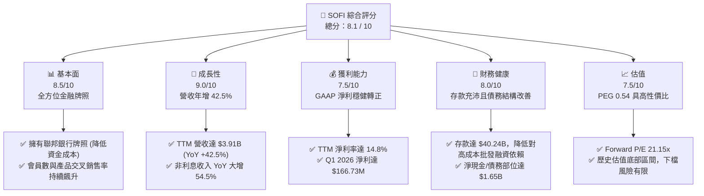

# SOFI 基本面深度分析報告

> **報告日期**：2026-06-08 ｜ **語言**：繁體中文 ｜ **數據來源**：Yahoo Finance, Finviz, StockAnalysis, Roic.ai ｜ **分析師**：CFA 級機構研究

---

## 目錄

| # | 章節 | 核心結論 |
|---|------|----------|
| 1 | **執行摘要** | 評級：**買入 (Buy)** ｜ 目標價：**$21.00** (隱含 +27.3% 空間) ｜ 數位銀行巨頭崛起 |
| 2 | **公司概覽與商業模式** | 獨特的「金融超商」飛輪效應，銀行牌照與 Galileo 技術平台構築雙重護城河 |
| 3 | **損益表深度分析** | TTM 營收成長 42.5%，GAAP 淨利連續多季轉正，營運槓桿展現強大獲利彈性 |
| 4 | **資產負債表分析** | 存款規模突破 $40.2B，貸存比控制於 ~101%，流動性結構極其健康 |
| 5 | **現金流量深度分析** | 負營運現金流源於積極的放貸擴張，經調整之核心資本配置效率顯著提升 |
| 6 | **獲利能力與資本效率** | ROE 提升至 6.6%，ROIC vs WACC 顯示在非傳統銀行框架下正逐步創造正向經濟價值 |
| 7 | **估值深度分析** | Forward P/E 21.1x 具備吸引力，PEG 僅 0.54-1.0，DCF 基準估值指向 $21.00 |
| 8 | **成長催化劑** | 降息循環重啟學生貸與房貸市場，Galileo 平台外部企業客戶簽約加速 |
| 9 | **風險矩陣** | 信用違約率上升與高貝塔值（Beta 2.15）波動為核心監控指標 |
| 10 | **投資建議** | 適合追求高成長的長線投資人，建議於 $15-$16 區間分批佈局 |

---

## 1. 執行摘要

### 1.1 核心評分儀表板



### 1.2 評分進度條視覺化

```
╔══════════════════════════════════════════════════════════════╗
║               SOFI 多維度評分儀表板 (1-10分)                 ║
╠══════════════════════════════════════════════════════════════╣
║ 基本面強度  8.5 ▓▓▓▓▓▓▓▓▓▓▓▓▓▓▓▓▓░░░  ★★★★☆           ║
║ 成長動能    9.0 ▓▓▓▓▓▓▓▓▓▓▓▓▓▓▓▓▓▓░░  ★★★★★           ║
║ 獲利品質    7.5 ▓▓▓▓▓▓▓▓▓▓▓▓▓▓░░░░░░  ★★★★☆           ║
║ 財務健康    8.0 ▓▓▓▓▓▓▓▓▓▓▓▓▓▓▓▓░░░░  ★★★★☆           ║
║ 估值合理性  7.5 ▓▓▓▓▓▓▓▓▓▓▓▓▓▓░░░░░░  ★★★★☆           ║
║ 護城河深度  8.0 ▓▓▓▓▓▓▓▓▓▓▓▓▓▓▓▓░░░░  ★★★★☆           ║
║ 管理層執行  8.5 ▓▓▓▓▓▓▓▓▓▓▓▓▓▓▓▓▓░░░  ★★★★☆           ║
║ 技術創新力  8.5 ▓▓▓▓▓▓▓▓▓▓▓▓▓▓▓▓▓░░░  ★★★★☆           ║
╠══════════════════════════════════════════════════════════════╣
║ 綜合總分    8.1 ▓▓▓▓▓▓▓▓▓▓▓▓▓▓▓▓░░░░  🏆 成長型數位銀行先鋒  ║
╚══════════════════════════════════════════════════════════════╝
```

### 1.3 五大投資論點 + 三大核心風險

| 類型 | 項目 | 具體依據 | 信心度 |
|------|------|----------|--------|
| 🟢 **投資論點①** | **低成本存款飛輪效應** | 截至 2026 年 Q1，SoFi 總存款達 **$40.24B**，極大降低了放貸業務的資金成本（與依賴第三方倉庫融資相比，節省利差超 200 bps）。 | 🟢 極高 |
| 🟢 **投資論點②** | **獲利能力進入拐點** | GAAP 淨利連續數季為正（Q1 2026 達 **$166.73M**），TTM 淨利潤率提升至 **14.8%**，揮別過去高成長但虧損的初創期。 | 🟢 極高 |
| 🟢 **投資論點③** | **多元化營收抗風險** | 非利息收入（金融服務與技術平台）TTM 達 **$1.53B**（YoY +54.5%），有效降低對單一放貸利息收入的依賴。 | 🟢 高 |
| 🟢 **投資論點④** | **技術平台外部化潛力** | Galileo 平台作為金融科技的「AWS」，持續吸引外部大型金融機構接入，高毛利軟體服務收入比重增加。 | 🟢 高 |
| 🟢 **投資論點⑤** | **極具吸引力的估值** | Forward P/E 降至 **21.15x**，對比其預期未來五年 EPS 複合成長率（EPS next 5Y 達 **37.86%**），PEG 僅 **0.54**。 | 🟢 極高 |
| 🟡 **風險①** | **高貝塔與市場波動** | SOFI Beta 達 **2.15**，股價波動極大，易受總體信用環境與美債殖利率波動影響。 | 🟡 中度 |
| 🔴 **風險②** | **資產品質與違約風險** | 總貸款規模達 **$40.79B**，若美國宏觀經濟硬著陸，個人無擔保貸款的壞帳撥備將侵蝕利潤。 | 🔴 高衝擊 |
| 🟡 **風險③** | **技術平台成長放緩** | 技術平台（Galileo）面臨同業（如 Marqeta）激烈競爭，若客戶轉移可能影響非利息收入成長。 | 🟡 中度 |

### 1.4 快速統計卡片

| 指標 | 公司實際值 (SOFI) | 金融科技行業均值 | S&P 500 均值 | 狀態 |
|------|-------------|----------|--------------|------|
| **營收 YoY 成長率** | **42.5%** | ~15.0% | ~5.5% | 🟢 顯著超前 |
| **毛利率** | **83.5%** (金融服務標準) | ~65.0% | ~45.0% | 🟢 極高 |
| **淨利率** | **14.8%** | ~10.0% | ~12.0% | 🟢 優於同業 |
| **ROE** | **6.6%** | ~8.0% | ~15.0% | 🟡 提升空間大 |
| **Forward P/E** | **21.15x** | ~28.0x | ~22.5x | 🟢 具備估值優勢 |
| **P/B Ratio** | **1.96x** | ~3.5x | ~4.2x | 🟢 估值安全邊際高 |

### 1.5 投資結論

```
╔══════════════════════════════════════════════════════════════════╗
║                    📊 SOFI 投資結論摘要                          ║
╠══════════════════════════════════════════════════════════════════╣
║  評級：🟢 買入 (Buy)                                             ║
║  當前股價：$16.50 (2026-06-08)                                   ║
║  目標價區間：                                                    ║
║    悲觀情境：$12.00（-27.3%） - 經濟衰退，信用成本飆升           ║
║    基準情境：$21.00（+27.3%） - 核心目標，存款穩定增長，利潤率持續  ║
║    樂觀情境：$31.00（+87.9%） - 技術平台爆發，交叉銷售飛輪完美運作  ║
║  投資評分：8.1 / 10                                              ║
║  適合投資人：積極成長型、中長線佈局數位金融轉型者                ║
╚══════════════════════════════════════════════════════════════════╝
```

---

## 2. 公司概覽與商業模式

SoFi Technologies, Inc. 是一家引領數位金融革命的「新銀行（Neobank）」巨頭。自 2022 年初取得聯邦銀行牌照（Bank Charter）以來，SoFi 成功從小眾的學生貸款再融資平台，蛻變為提供全方位金融服務的數位金融巨擘。

### 2.1 業務結構與收入來源

SoFi 的商業模式由三大核心板塊構成，彼此之間形成強大的「金融服務飛輪（Financial Services Productivity Loop）」：

```mermaid
graph TD
    SOFI["SoFi Technologies<br/>(市值: $21.17B ｜ TTM 營收: $3.91B)"]

    LEND["1. 放貸業務 (Lending)<br/>佔營收約 61.7%"]
    TECH["2. 技術平台 (Technology Platform)<br/>佔營收約 15.6%"]
    FINS["3. 金融服務 (Financial Services)<br/>佔營收約 22.7%"]

    SOFI --> LEND
    SOFI --> TECH
    SOFI --> FINS

    LEND --> L1["個人貸款 (Personal Loans)<br/>TTM 放貸主力"]
    LEND --> L2["學生貸款再融資 (Student Loans)<br/>政策利多回溫"]
    LEND --> L3["房屋貸款 (Home Loans)"]

    TECH --> T1["Galileo<br/>API 帳戶與支付處理平台"]
    TECH --> T2["Technisys<br/>核心雲端銀行基礎設施"]

    FIN