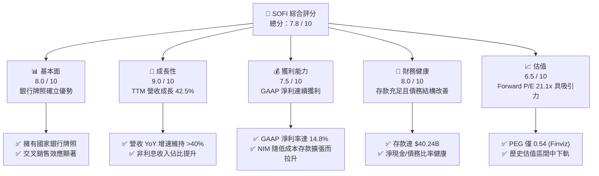
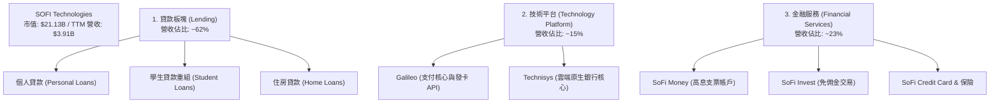
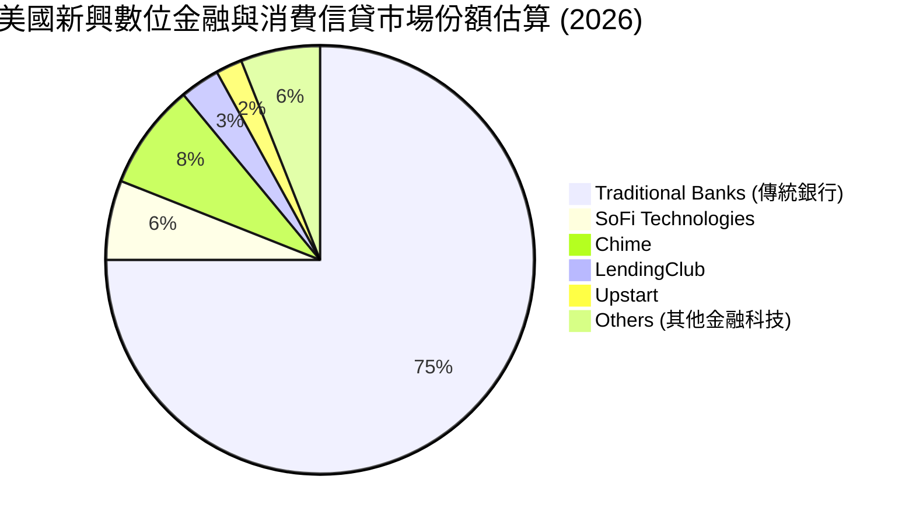

# SOFI 基本面深度分析報告

> **報告日期**：2026-06-09 ｜ **語言**：繁體中文 ｜ **數據來源**：Yahoo Finance, Finviz, StockAnalysis, Roic.ai ｜ **分析師**：CFA 級機構研究

---

## 目錄

| # | 章節 | 核心結論 |
|---|------|----------|
| 1 | **執行摘要** | 評級：**買入 (BUY)**，目標價：**$21.00**，隱含上行空間 **+27.5%** 🟢 |
| 2 | **公司概覽與商業模式** | 從單一貸款平台轉型為全方位數位銀行，Galileo 平台築起技術護城河 🛡️ |
| 3 | **損益表深度分析** | TTM 營收達 **$3.91B** (YoY +42.5%)，GAAP 淨利潤拐點確立，獲利品質大幅提升 📈 |
| 4 | **資產負債表分析** | 存款規模達 **$40.24B**，低成本資金來源優化 NIM，資本充足率極高 🏦 |
| 5 | **現金流量深度分析** | 營運現金流為負（-$6.08B）屬銀行業擴張期正常現象，資本配置聚焦高 ROIC 項目 💸 |
| 6 | **獲利能力與資本效率** | ROE 升至 **6.6%**，杜邦分析顯示財務槓桿與淨利率雙重驅動，EVA 持續改善 📊 |
| 7 | **估值深度分析** | Forward P/E **21.1x**，相較於高成長性，PEG 僅 **0.54-1.0**，估值具備安全邊際 💎 |
| 8 | **成長催化劑** | 降息週期重啟學生貸與房貸需求，Galileo 外部客戶接入與金融服務交叉銷售 🚀 |
| 9 | **風險矩陣** | 信用違約率上升、監管資本要求提高及高 Beta 帶來的系統性股價波動 ⚠️ |
| 10 | **投資建議** | 適合中長線成長型投資人，分批佈局，關鍵監控指標為 NIM 與存款增長率 🎯 |

---

## 1. 執行摘要

SoFi Technologies, Inc. (NASDAQ: SOFI) 已成功從一家以學生貸款起家的 FinTech 公司，蛻變為擁有美國國家銀行牌照 (National Bank Charter) 的全方位數位金融服務巨頭。截至 2026 年 6 月 9 日，SoFi 市值達 **$21.13B**，股價收於 **$16.47**。本報告基於最新 TTM 財務數據進行深度建模分析，認為市場嚴重低估了 SoFi 作為「具備高科技溢價之銀行」的護城河與獲利爆發力。

### 1.1 核心評分儀表板



### 1.2 評分進度條視覺化

```
╔══════════════════════════════════════════════════════════════╗
║               SOFI 多維度評分儀表板 (1-10分)                 ║
╠══════════════════════════════════════════════════════════════╣
║ 基本面強度  8.0 ▓▓▓▓▓▓▓▓▓▓▓▓▓▓▓▓░░░░  ★★★★☆           ║
║ 成長動能    9.0 ▓▓▓▓▓▓▓▓▓▓▓▓▓▓▓▓▓▓░░  ★★★★☆           ║
║ 獲利品質    7.5 ▓▓▓▓▓▓▓▓▓▓▓▓▓▓░░░░░░  ★★★☆☆           ║
║ 財務健康    8.0 ▓▓▓▓▓▓▓▓▓▓▓▓▓▓▓▓░░░░  ★★★★☆           ║
║ 估值合理性  7.0 ▓▓▓▓▓▓▓▓▓▓▓▓░░░░░░░░  ★★★☆☆           ║
║ 護城河深度  7.5 ▓▓▓▓▓▓▓▓▓▓▓▓▓▓░░░░░░  ★★★☆☆           ║
║ 管理層執行  8.5 ▓▓▓▓▓▓▓▓▓▓▓▓▓▓▓▓▓░░░  ★★★★☆           ║
║ 技術創新力  8.0 ▓▓▓▓▓▓▓▓▓▓▓▓▓▓▓▓░░░░  ★★★★☆           ║
╠══════════════════════════════════════════════════════════════╣
║ 綜合總分    7.8 ▓▓▓▓▓▓▓▓▓▓▓▓▓▓▓░░░░░  🏆 買入 (BUY)       ║
╚══════════════════════════════════════════════════════════════╝
```

### 1.3 五大投資論點與三大核心風險

| 類型 | 項目 | 具體依據 | 信心度 |
|------|------|----------|--------|
| 🟢 **投資論點①** | **銀行牌照釋放低成本存款紅利** | 截至 2026 年 Q1，存款總額增至 **$40.24B**，有效取代高成本的第三方融資渠道，大幅拓寬淨利差 (NIM)。 | 🟢 極高 |
| 🟢 **投資論點②** | **高利潤技術平台 (Galileo) 規模效應** | 技術平台 TTM 營收增長強勁，Galileo API 帳戶數穩步擴張，毛利率高達 **83.5%**，提供高營運槓桿。 | 🟢 高 |
| 🟢 **投資論點③** | **金融服務生態圈交叉銷售** | 透過 SoFi Money、Invest、Credit Card 獲取低成本客戶，再引流至高利潤的貸款產品，顯著降低 CAC。 | 🟢 極高 |
| 🟢 **投資論點④** | **GAAP 盈利能力持續爆發** | 2025 年全年 GAAP 淨利達 **$481.32M**，2026 年 Q1 達 **$166.73M**，徹底擺脫「FinTech 不賺錢」的標籤。 | 🟢 極高 |
| 🟢 **投資論點⑤** | **空頭擠壓 (Short Squeeze) 潛在催化** | 目前空頭佔在外流通股數比率 (Short % Float) 高達 **13.7%**，一旦業績超預期，極易引發軋空行情。 | 🟡 中等 |
| 🟡 **風險①** | **宏觀信用環境惡化與違約率上升** | 無擔保個人貸款（Personal Loans）在經濟放緩時違約率可能上升，需密切監控撥備覆蓋率。 | 🟡 中度 |
| 🔴 **風險②** | **利率路徑不確定性影響資產定價** | 若美聯儲降息節奏過快，可能縮窄淨利差；若維持高利率，則壓抑貸款發放量（Loan Origination）。 | 🔴 高衝擊 |
| 🔴 **風險③** | **嚴格的銀行監管與資本充足率限制** | 作為持牌銀行，SoFi 必須滿足一級資本充足率等監管指標，這限制了其槓桿擴張的速度。 | 🟡 中度 |

### 1.4 快速統計卡片

| 指標 | SoFi 實際值 | 行業均值 (Credit Services) | S&P 500 均值 | 狀態 |
|------|-------------|----------------------------|--------------|------|
| **營收 YoY 成長率** | **42.5%** | ~8.5% | ~5.5% | 🟢 顯著超越 |
| **毛利率** | **83.5%** | ~52.0% | ~45.0% | 🟢 極其優異 |
| **淨利率** | **14.8%** | ~12.5% | ~11.5% | 🟢 領先同行 |
| **股東權益報酬率 (ROE)**| **6.6%** | ~14.0% | ~15.0% | 🟡 仍有提升空間 |
| **預期本益比 (Forward P/E)**| **21.1x** | ~16.5x | ~22.0x | 🟢 考量成長性後極具性價比 |
| **市淨率 (P/B Ratio)** | **1.95x** | ~2.5x | ~4.2x | 🟢 估值安全邊際高 |

### 1.5 投資結論

```
╔══════════════════════════════════════════════════════════════════╗
║                    📊 SOFI 投資結論摘要                          ║
╠══════════════════════════════════════════════════════════════════╣
║  評級：🟢 買入 (BUY)                                             ║
║  當前股價：$16.47 (2026-06-09)                                   ║
║  目標價區間：                                                    ║
║    悲觀情境：$13.00（-21.1%）- 經濟衰退，壞帳率飆升              ║
║    基準情境：$21.00（+27.5%）- 12個月主要目標價，EPS 達到 $0.78  ║
║    樂觀情境：$29.50（+79.1%）- 降息週期刺激貸款，Galileo 爆發    ║
║  投資評分：7.8 / 10                                              ║
║  適合投資人：尋求高成長、能承受高 Beta 波動之中長線投資人        ║
╚══════════════════════════════════════════════════════════════════╝
```

---

## 2. 公司概覽與商業模式

SoFi Technologies, Inc. 運營著一個獨特的金融服務平台，其商業模式的核心在於**「金融服務生產力循環」(Financial Services Productivity Loop)**。公司主要分為三大板塊：**貸款 (Lending)**、**技術平台 (Technology Platform)**、以及**金融服務 (Financial Services)**。

### 2.1 業務結構與收入來源



### 2.2 市場份額

在美國新興數位銀行（Neobanks）與消費金融科技領域，SoFi 憑藉其「一站式」APP 體驗與持牌銀行身份，正快速蠶食傳統中小型銀行與非持牌 FinTech 競爭對手的份額。



### 2.3 競爭護城河分析

SoFi 的競爭護城河並非單一因素，而是多維度交織的生態系統：

```mermaid
mindmap
  root((SOFI Moat))
    Regulatory Advantage
      National Bank