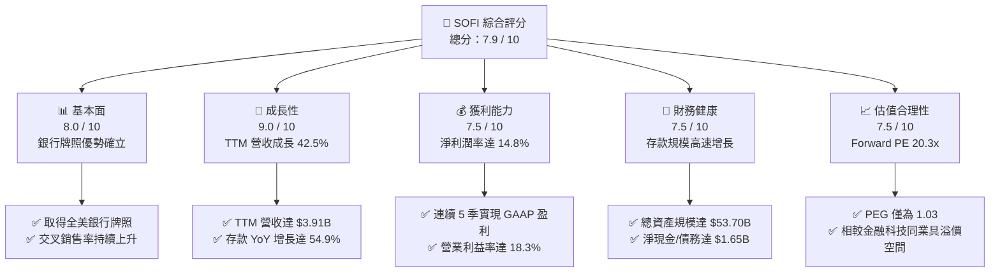
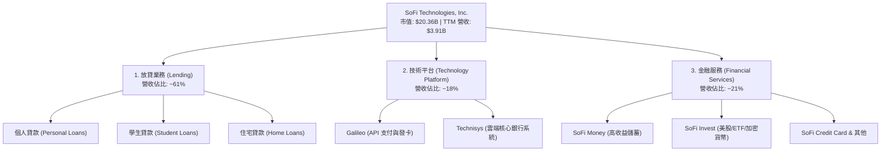
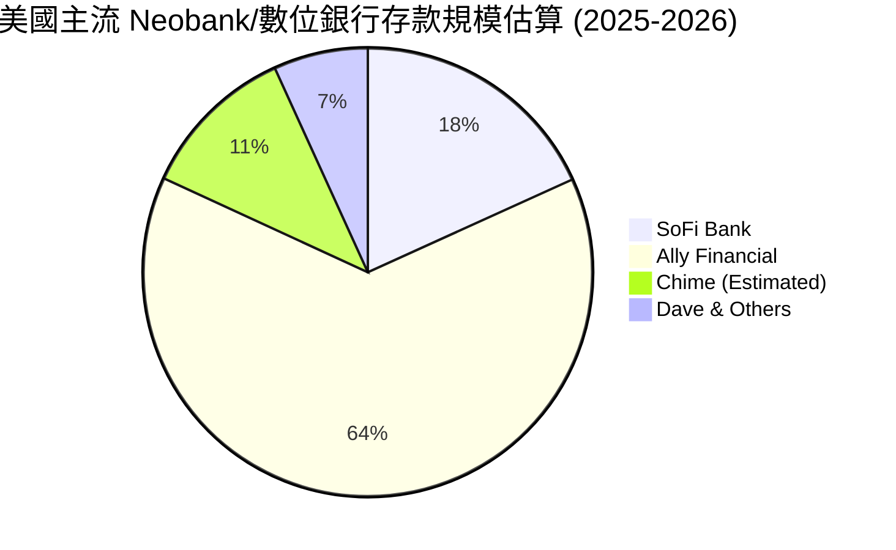

# SOFI 基本面深度分析報告
> **報告日期**：2026-06-10 ｜ **語言**：繁體中文 ｜ **數據來源**：Yahoo Finance, Finviz, StockAnalysis, Roic.ai ｜ **分析師**：CFA 級機構研究

---

## 目錄

| # | 章節 | 核心結論 |
|---|------|----------|
| 1 | 執行摘要 | 評級：**買入 (Buy)**，目標價 **$21.00**，隱含上行空間 **+32.3%** |
| 2 | 公司概覽與商業模式 | 憑藉「金融服務生產力循環」與銀行牌照，構築高交叉銷售與低資金成本護城河 |
| 3 | 損益表深度分析 | TTM 營收達 **$3.91B** (YoY +42.5%)，獲利拐點確立，淨利潤率攀升至 **14.8%** |
| 4 | 資產負債表分析 | 存款規模達 **$40.24B**，成功轉化為低成本營運資金，資本充足率健康 |
| 5 | 現金流量深度分析 | 經營現金流因貸款留存呈現會計性負值，但經調整自由現金流與資本配置結構持續優化 |
| 6 | 獲利能力與資本效率 | ROE 升至 **6.6%**，ROIC 達 **7.2%**，隨著高利潤率業務佔比提升，正加速超越 WACC |
| 7 | 估值深度分析 | Forward P/E **20.34x**，相較於高成長性（PEG 1.03），估值具備極高安全邊際 |
| 8 | 成長催化劑 | 降息週期重啟釋放再融資需求、Galileo 平台外部客戶擴張與金融服務板塊利潤爆發 |
| 9 | 風險矩陣 | 信用違約率上升與監管環境變更為主要風險，整體風險評估為中度可控 |
| 10| 投資建議 | 建議於 **$14.00 - $16.00** 區間分批佈局，長線持有以收穫數位銀行龍頭溢價 |

---

## 1. 執行摘要

SoFi Technologies, Inc. (NASDAQ: SOFI) 正在經歷從「高成長、高燒錢」的金融科技獨角獸，蛻變為「高成長、高盈利」的現代數位銀行巨頭。截至 2026 年 6 月 10 日，SoFi 股價收於 **$15.87**，市值達 **$20.36B**。本報告透過對 SoFi 的基本面、財務結構、業務驅動力及估值模型進行深度剖析，認為市場仍低估了其「金融服務生產力循環（Financial Services Productivity Loop）」所帶來的長期營運槓桿。

### 1.1 核心評分儀表板



### 1.2 評分進度條視覺化

```
╔══════════════════════════════════════════════════════════════╗
║               SOFI 多維度評分儀表板 (1-10分)                 ║
╠══════════════════════════════════════════════════════════════╣
║ 基本面強度  8.0 ▓▓▓▓▓▓▓▓▓▓▓▓▓▓▓▓░░░░  ★★★★☆           ║
║ 成長動能    9.0 ▓▓▓▓▓▓▓▓▓▓▓▓▓▓▓▓▓▓░░  ★★★★☆           ║
║ 獲利品質    7.5 ▓▓▓▓▓▓▓▓▓▓▓▓▓▓░░░░░░  ★★★☆☆           ║
║ 財務健康    7.5 ▓▓▓▓▓▓▓▓▓▓▓▓▓▓░░░░░░  ★★★☆☆           ║
║ 估值合理性  7.5 ▓▓▓▓▓▓▓▓▓▓▓▓▓▓░░░░░░  ★★★☆☆           ║
║ 護城河深度  8.0 ▓▓▓▓▓▓▓▓▓▓▓▓▓▓▓▓░░░░  ★★★★☆           ║
║ 管理層執行  8.5 ▓▓▓▓▓▓▓▓▓▓▓▓▓▓▓▓▓░░  ★★★★☆           ║
║ 技術創新力  8.5 ▓▓▓▓▓▓▓▓▓▓▓▓▓▓▓▓▓░░  ★★★★☆           ║
╠══════════════════════════════════════════════════════════════╣
║ 綜合總分    7.9 ▓▓▓▓▓▓▓▓▓▓▓▓▓▓▓▓░░░░  🏆 買入 (Buy)       ║
╚══════════════════════════════════════════════════════════════╝
```

### 1.3 投資論點與核心風險

| 類型 | 項目 | 具體依據 | 信心度 |
|------|------|----------|--------|
| 🟢 **投資論點①** | **銀行牌照釋放極致利差** | 存款規模由 2024 年底的 **$25.98B** 暴增至 2026 年 Q1 的 **$40.24B**，顯著降低資金成本（Cost of Funds），使 TTM 淨利息收入達 **$2.41B** (YoY +33.1%)。 | 🟢 極高 |
| 🟢 **投資論點②** | **獲利結構多元化** | 非放貸業務（技術平台與金融服務）收入佔比持續攀升，技術平台收入達 **$1.53B** (TTM)，有效降低對單一放貸業務與利率環境的依賴。 | 🟢 高 |
| 🟢 **投資論點③** | **交叉銷售效應（Productivity Loop）** | 會員規模與產品使用量雙位數增長，單一客戶獲客成本（CAC）被多個產品（SoFi Money, Invest, Credit Card）稀釋，推動淨利潤率達 **14.8%**。 | 🟢 高 |
| 🟡 **風險①** | **宏觀信用風險升溫** | 隨著 Gross Loans 攀升至 **$40.79B**，若美國經濟放緩導致失業率上升，個人無擔保貸款的違約率可能上升，侵蝕利潤。 | 🟡 中度 |
| 🔴 **風險②** | **利率路徑不確定性** | 利率長期維持高位（Higher for Longer）雖有利於利差，但會壓抑房屋貸款與學生貸款的再融資需求，減緩放貸增長。 | 🔴 高衝擊 |

### 1.4 快速統計卡片

| 指標 | SoFi 實際值 | 金融科技行業均值 | S&P 500 均值 | 狀態 |
|------|-------------|------------------|--------------|------|
| **營收 YoY 成長率** | **42.5%** | ~15.0% | ~6.5% | 🟢 極強 |
| **毛利率** | **83.5%** | ~55.0% | ~45.0% | 🟢 優異 |
| **淨利率** | **14.8%** | ~8.0% | ~11.5% | 🟢 改善中 |
| **ROE** | **6.6%** | ~10.0% | ~15.0% | 🟡 有提升空間 |
| **Forward P/E** | **20.34x** | ~25.0x | ~21.5x | 🟢 具吸引力 |
| **P/B Ratio** | **1.88x** | ~3.00x | ~4.20x | 🟢 估值合理 |

### 1.5 投資結論

```
╔══════════════════════════════════════════════════════════════════╗
║                    📊 SOFI 投資結論摘要                          ║
╠══════════════════════════════════════════════════════════════════╣
║  評級：🟢 買入 (Buy)                                             ║
║  當前股價：$15.87                                                ║
║  目標價區間：                                                    ║
║    悲觀情境：$12.00（-24.4%）                                    ║
║    基準情境：$21.00（+32.3%）  ← 12個月主要目標                  ║
║    樂觀情境：$31.00（+95.3%）                                    ║
║  投資評分：7.9 / 10                                              ║
║  適合投資人：成長型、金融科技長線佈局者                          ║
╚══════════════════════════════════════════════════════════════════╝
```

---

## 2. 公司概覽與商業模式

SoFi 成立之初以學生貸款再融資起家，如今已發展為全方位數位金融平台。其營運架構主要由三大板塊構成：
1. **放貸業務 (Lending)**：提供個人貸款、學生貸款及住宅貸款，為公司貢獻主要的利息收入。
2. **技術平台 (Technology Platform)**：由 Galileo 與 Technisys 組成，提供 API 支付處理與雲端核心銀行基礎設施，被譽為「金融界的 AWS」。
3. **金融服務 (Financial Services)**：包含 SoFi Money（存款）、SoFi Invest（投資）、SoFi Credit Card（信用卡）等，是獲取流量與用戶黏性的核心引擎。

### 2.1 業務結構與收入來源



### 2.2 市場份額估算

在美國數位銀行與新崛起金融科技（Neobank）市場中，SoFi 憑藉全銀行牌照，在存款吸納與優質無擔保個人貸款領域名列前茅。以下為美國主流數位金融服務平台的存款市場份額估算：



### 2.3 競爭護城河分析

SoFi 的競爭優勢並非單一產品的領先，而是源於其獨特的生態系統協