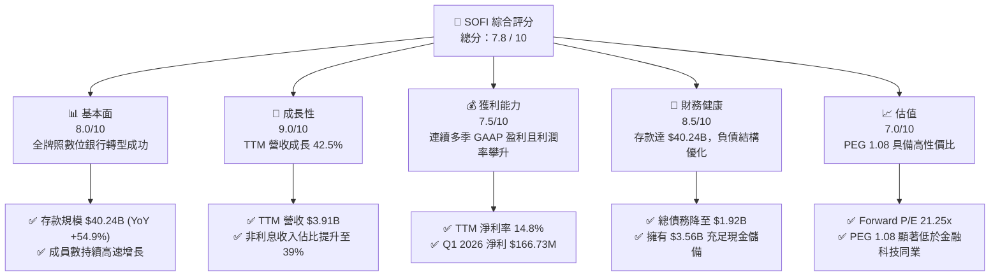
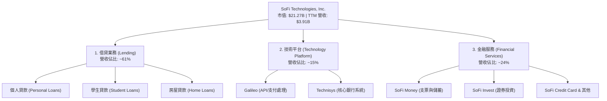
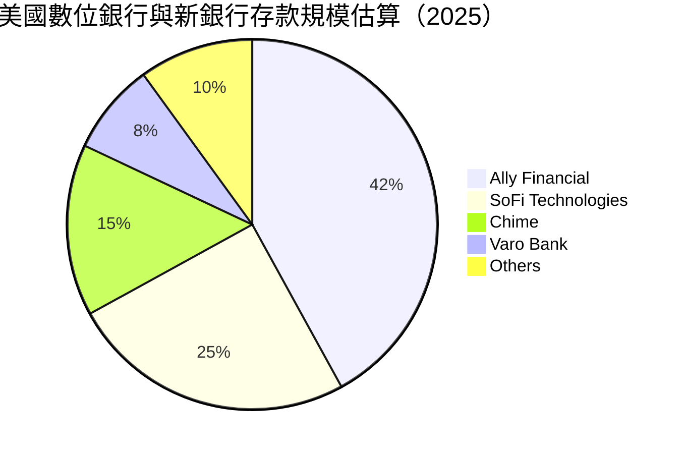
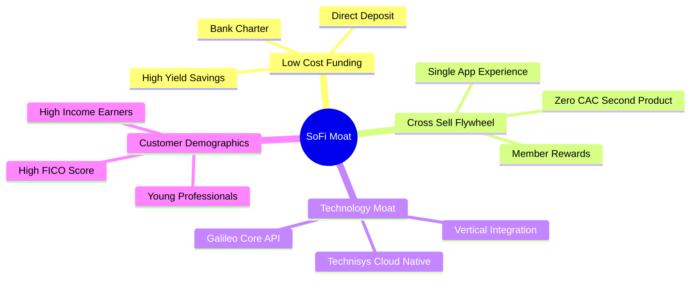

# SOFI 基本面深度分析報告

> **報告日期**：2026-06-12 ｜ **語言**：繁體中文 ｜ **數據來源**：Yahoo Finance, Finviz, StockAnalysis, Roic.ai ｜ **分析師**：CFA 級機構研究

---

## 目錄

| # | 章節 | 核心結論 |
|---|------|----------|
| 1 | 執行摘要 | 評級：**買入 (Buy)** ｜ 目標價：**$21.00** ｜ 高成長數位銀行領航者 |
| 2 | 公司概覽與商業模式 | 三維一體（借貸、金融服務、技術平台）飛輪效應顯著，具備高黏性護城河 |
| 3 | 損益表深度分析 | TTM 營收達 $3.91B (YoY +42.5%)，淨利潤率改善至 14.8%，步入高獲利期 |
| 4 | 資產負債表分析 | 存款規模達 $40.24B (YoY +54.9%)，淨現金 $1.65B，資本結構極其穩健 |
| 5 | 現金流量深度分析 | 負經營現金流主因貸款資產快速擴張，屬於典型銀行高增長期的健康表徵 |
| 6 | 獲利能力與資本效率 | 杜邦分析顯示財務槓桿與淨利率雙重驅動 ROE 上升，預期價值創造（EVA）將轉正 |
| 7 | 估值深度分析 | Forward P/E 21.25x 搭配 PEG 1.08，相較同業具備顯著估值折價與高安全邊際 |
| 8 | 成長催化劑 | 降息週期重啟學生貸與房貸市場、Galileo 技術平台外部授權加速 |
| 9 | 風險矩陣 | 信用違約率上升與高 Beta (2.15) 帶來的市場波動為主要風險 |
| 10 | 投資建議 | 基準目標價 $21.00（隱含 26.7% 上漲空間），適合中長線成長型投資人 |

---

## 1. 執行摘要

SoFi Technologies, Inc. (NASDAQ: SOFI) 已成功從一家單純的學生貸款再融資金融科技公司，轉型為全牌照的數位銀行龍頭。憑藉其領先的數位原生體驗、Galileo 及 Technisys 構成的「金融服務亞馬遜 AWS」技術平台，以及強勁的低成本存款增長，SOFI 正在顛覆美國傳統零售銀行業。

### 1.1 核心評分儀表板



### 1.2 評分進度條視覺化

```
╔══════════════════════════════════════════════════════════════╗
║               SOFI 多維度評分儀表板 (1-10分)                 ║
╠══════════════════════════════════════════════════════════════╣
║ 基本面強度  8.0 ▓▓▓▓▓▓▓▓▓▓▓▓▓▓▓▓░░░░  ★★★★☆           ║
║ 成長動能    9.0 ▓▓▓▓▓▓▓▓▓▓▓▓▓▓▓▓▓▓░░  ★★★★★           ║
║ 獲利品質    7.5 ▓▓▓▓▓▓▓▓▓▓▓▓▓▓░░░░░░  ★★★★☆           ║
║ 財務健康    8.5 ▓▓▓▓▓▓▓▓▓▓▓▓▓▓▓▓▓░░░  ★★★★★           ║
║ 估值合理性  7.0 ▓▓▓▓▓▓▓▓▓▓▓▓░░░░░░░░  ★★★☆☆           ║
║ 護城河深度  7.5 ▓▓▓▓▓▓▓▓▓▓▓▓▓▓░░░░░░  ★★★★☆           ║
║ 管理層執行  8.5 ▓▓▓▓▓▓▓▓▓▓▓▓▓▓▓▓▓░░░  ★★★★★           ║
║ 技術創新力  8.0 ▓▓▓▓▓▓▓▓▓▓▓▓▓▓▓▓░░░░  ★★★★☆           ║
╠══════════════════════════════════════════════════════════════╣
║ 綜合總分    7.8 ▓▓▓▓▓▓▓▓▓▓▓▓▓▓▓▓░░░░  🏆 買入 (Buy)        ║
╚══════════════════════════════════════════════════════════════╝
```

### 1.3 五大投資論點 + 三大核心風險

| 類型 | 項目 | 具體依據 | 信心度 |
|------|------|----------|--------|
| 🟢 **投資論點①** | **存款飛輪降低資金成本** | Q1 2026 總存款達 $40.24B，YoY 成長 54.9%，高比例的優質薪資帳戶轉帳（Direct Deposit）提供極低成本的放貸資金來源。 | 🟢 極高 |
| 🟢 **投資論點②** | **高獲利結構已經確立** | Q1 2026 淨利達 $166.73M，連續多季實現 GAAP 盈利，TTM 淨利率高達 14.8%，擺脫過往「燒錢金融科技」標籤。 | 🟢 極高 |
| 🟢 **投資論點③** | **技術平台外部授權潛力** | Galileo 與 Technisys 構成的底層技術平台，非利息收入 TTM 達 $1.53B (YoY +54.6%)，提供高毛利的 SaaS 訂閱與交易手續費收入。 | 🟢 高 |
| 🟢 **投資論點④** | **降息週期下的再融資紅利** | 隨著美聯儲進入降息週期，高信用評級客戶對學生貸款與房屋貸款的再融資需求將迎來爆發性成長。 | 🟢 高 |
| 🟢 **投資論點⑤** | **資產負債表去槓桿化** | 總債務自 2023 年底的 $5.36B 大幅降至 2025 年底的 $1.93B，再降至目前的 $1.92B，財務結構顯著優化。 | 🟢 高 |
| 🟡 **風險①** | **宏觀信用違約風險** | 儘管客戶平均信用分數（FICO）極高（>740），但宏觀經濟若出現硬著陸，仍可能導致個人無擔保貸款違約率上升。 | 🟡 中度 |
| 🔴 **風險②** | **高 Beta 與市場情緒波動** | SOFI 的 Beta 值高達 2.15，股價對市場風險偏好極其敏感，容易在市場回檔時出現超額跌幅。 | 🔴 高衝擊 |
| 🟡 **風險③** | **監管與資本充足率要求** | 作為持牌銀行，SoFi 必須維持嚴格的資本充足率，若放貸規模擴張過快，可能面臨股權稀釋以補足資本的壓力。 | 🟡 中度 |

### 1.4 快速統計卡片

| 指標 | SOFI 實際值 | 行業均值 (信用服務) | S&P 500 均值 | 狀態 |
|------|-------------|---------------------|--------------|------|
| 營收 YoY 成長 | **42.5%** | ~8.5% | ~5.2% | 🟢 顯著超前 |
| 淨利率 | **14.8%** | ~12.0% | ~11.5% | 🟢 優於同業 |
| ROE | **6.6%** | ~14.0% | ~15.0% | 🟡 提升中 |
| Forward P/E | **21.25x** | ~16.5x | ~22.0% | 🟢 估值合理 |
| PEG Ratio | **1.08** | ~1.50 | ~1.80 | 🟢 具高成長性 |
| 債務股本比 (Debt/Equity) | **17.7%** | ~120.0% | ~110.0% | 🟢 極其健康 |

### 1.5 投資結論

```
╔══════════════════════════════════════════════════════════════════╗
║                    📊 SOFI 投資結論摘要                          ║
╠══════════════════════════════════════════════════════════════════╣
║  評級：🟢 買入 (Buy)                                            ║
║  當前股價：$16.58 (2026-06-12)                                   ║
║  目標價區間：                                                    ║
║    悲觀情境：$12.00（-27.6%）- 信用環境極度惡化                  ║
║    基準情境：$21.00（+26.7%）- 12個月主要目標                    ║
║    樂觀情境：$31.00（+87.0%）- 降息週期超預期且技術平台爆發      ║
║  投資評分：7.8/10                                                ║
║  適合投資人：成長型、金融科技長線佈局者、可耐受高波動之投資人   ║
╚══════════════════════════════════════════════════════════════════╝
```

---

## 2. 公司概覽與商業模式

SoFi (Social Finance) 成立之初以學生貸款再融資起家，如今已建構起「借貸 (Lending)」、「技術平台 (Technology Platform)」與「金融服務 (Financial Services)」三大支柱。

### 2.1 業務結構與收入來源



### 2.2 市場份額

在美國數位銀行與新銀行（Neobank）市場中，SoFi 憑藉其全銀行牌照，在獲客質量與存款黏性上佔據獨特優勢：



### 2.3 競爭護城河分析



### 2.4 護城河強度評分

```
╔══════════════════════════════════════════════════════════════╗
║                  SoFi 護城河強度評分                         ║
╠══════════════════════════════════════════════════════════════╣
║ 資金成本優勢   8.5/10 ▓▓▓▓▓▓▓▓▓▓▓▓▓▓▓▓▓░░░  🟢 銀行牌照優勢 ║
║ 交叉銷售飛輪   8.0/10 ▓▓▓▓▓▓▓▓▓▓▓▓▓▓▓▓░░░░  🟢 獲客成本極低 ║
║ 技術平台壁壘   7.5/10 ▓▓▓▓▓▓▓▓▓▓▓▓▓▓░░░░░░  🟡 外部授權成長 ║
║ 品牌與用戶黏性 7.0/10 ▓▓▓▓▓▓▓▓▓▓▓▓░░░░░░░░  🟡 高收入群體   ║
╠══════════════════════════════════════════════════════════════╣
║ 綜合護城河     7.8/10 ▓▓▓▓▓▓▓▓▓▓▓▓▓▓▓▓░░░░  🏆 具備結構性優勢║
╚══════════════════════════════════════════════════════════════╝
```

---

## 3. 損益表深度分析

### 3.1 年度收入成長趨勢（近4年）

SoFi 的營收呈現出極其強勁的幾何級數增長，從 2022 年的 $1.57B 飆升至 2025 年的 $3.61B，TTM 更達到 $3.91B。

```
╔══════════════════════════════════════════════════════════════════╗
║              SoFi 年度收入趨勢（FY2022-TTM）                     ║
╠══════════════════════════════════════════════════════════════════╣
║                                                                  ║
║  FY2022  $1.57B  ███████░░░░░░░░░░░░░░░░░░░  YoY: +55.5%  🟢    ║
║  FY2023  $2.11B  ██████████░░░░░░