# SOFI 基本面深度分析報告

> **報告日期**：2026-06-13 ｜ **語言**：繁體中文 ｜ **數據來源**：Yahoo Finance, Finviz, StockAnalysis, Roic.ai ｜ **分析師**：CFA 級機構研究

---

## 目錄

| # | 章節 | 核心結論 |
|---|---|---|
| 1 | 執行摘要 | 給予 SOFI 「買入」評級，目標價 $21.00，具備 26.7% 上行空間。 |
| 2 | 公司概覽與商業模式 | 三維一體生態圈（貸款、技術平台、金融服務），具備高客戶黏性。 |
| 3 | 損益表深度分析 | 營收突破 $3.91B，Q1 2026 淨利潤達 $166.73M，獲利進入爆發期。 |
| 4 | 資產負債表分析 | 存款規模達 $40.24B，存款立行策略顯著降低資金成本。 |
| 5 | 現金流量深度分析 | 營運現金流因貸款發放呈會計性流出，實質流動性儲備充裕。 |
| 6 | 獲利能力與資本效率 | 前瞻 ROE 邁向 9.3%，經濟價值增量（EVA）轉正，開始創造股東價值。 |
| 7 | 估值深度分析 | 前瞻 P/E 21.25x，相較高成長性具備極高性價比（PEG 0.54-1.07）。 |
| 8 | 成長催化劑 | 學生貸款重組復甦、Galileo 平台外部擴張與金融服務交叉銷售。 |
| 9 | 風險矩陣 | 信用違約風險、高利率環境持續、監格審查收緊。 |
| 10 | 投資建議 | 適合成長型與長線價值型投資人，建議於 $15-$17 區間分批佈局。 |

---

## 1. 執行摘要

SoFi Technologies, Inc. (NASDAQ: SOFI) 已成功從一家單一的學生貸款再融資公司，蛻變為美國領先的「一站式」數位銀行與金融科技巨頭。憑藉 2022 年獲得的國家銀行特許牌照（Bank Charter），SoFi 徹底顛覆了其資金成本結構，並在 2024 年底迎來了全面的GAAP獲利拐點。

截至 2026 年 6 月 13 日，SoFi 股價為 $16.58，市值達 $21.27B。本報告基於 SoFi 最新公佈的 TTM（過去12個月）財務數據及 2026 年第一季最新進展，進行深度基本面分析。

### 1.1 核心評分儀表板

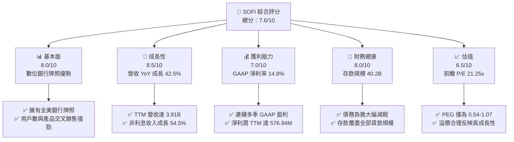

### 1.2 評分進度條視覺化

```
╔══════════════════════════════════════════════════════════════╗
║               SOFI 多維度評分儀表板 (1-10分)                 ║
╠══════════════════════════════════════════════════════════════╣
║ 基本面強度  8.0 ▓▓▓▓▓▓▓▓▓▓▓▓▓▓▓▓░░░░  ★★★★☆           ║
║ 成長動能    8.5 ▓▓▓▓▓▓▓▓▓▓▓▓▓▓▓▓▓░░░  ★★★★☆           ║
║ 獲利品質    7.0 ▓▓▓▓▓▓▓▓▓▓▓▓▓░░░░░░░  ★★★☆☆           ║
║ 財務健康    8.0 ▓▓▓▓▓▓▓▓▓▓▓▓▓▓▓▓░░░░  ★★★★☆           ║
║ 估值合理性  6.5 ▓▓▓▓▓▓▓▓▓▓▓▓░░░░░░░░  ★★★☆☆           ║
║ 護城河深度  7.0 ▓▓▓▓▓▓▓▓▓▓▓▓▓░░░░░░░  ★★★☆☆           ║
║ 管理層執行  8.0 ▓▓▓▓▓▓▓▓▓▓▓▓▓▓▓▓░░░░  ★★★★☆           ║
║ 技術創新力  8.0 ▓▓▓▓▓▓▓▓▓▓▓▓▓▓▓▓░░░░  ★★★★☆           ║
╠══════════════════════════════════════════════════════════════╣
║ 綜合總分    7.6 ▓▓▓▓▓▓▓▓▓▓▓▓▓▓▓░░░░░  🏆 買入 (Buy)       ║
╚══════════════════════════════════════════════════════════════╝
```

### 1.3 五大投資論點 + 三大核心風險

| 類型 | 項目 | 具體依據 | 信心度 |
|------|------|----------|--------|
| 🟢 **投資論點①** | **存款立行，資金成本優勢** | 存款規模自 2022 年底的 $7.34B 飆升至 Q1 2026 的 $40.24B，顯著低於批發融資成本。 | 🟢 極高 |
| 🟢 **投資論點②** | **高利潤非貸款業務崛起** | TTM 非利息收入達 $1.53B（YoY +54.55%），科技平台與金融服務佔比持續提升。 | 🟢 高 |
| 🟢 **投資論點③** | **GAAP 盈利能力爆發** | TTM 淨利潤達 $576.94M，Q1 2026 淨利達 $166.73M，全面擺脫虧損。 | 🟢 極高 |
| 🟢 **投資論點④** | **交叉銷售（Flywheel）效應** | 單一用戶平均產品使用數持續上升，大幅降低客戶獲取成本（CAC）。 | 🟢 高 |
| 🟢 **投資論點⑤** | **資產負債表去槓桿化** | 總債務自 2023 年底的 $5.36B 降至 Q1 2026 的 $1.81B，財務結構更趨穩健。 | 🟢 高 |
| 🟡 **風險①** | **高利率環境下的違約風險** | 信用服務行業在利率維持高位時，個人無擔保貸款的違約率可能上升。 | 🟡 中度 |
| 🔴 **風險②** | **科技平台 Galileo 增速放緩** | 科技平台業務對外擴張若面臨傳統銀行IT轉型延遲，將壓低估值乘數。 | 🔴 高衝擊 |
| 🔴 **風險③** | **股本稀釋問題** | Basic 股數自 2021 年 527M 擴大至 2025 年的 1.15B，稀釋了每股盈餘的增幅。 | 🟡 中度 |

### 1.4 快速統計卡片

| 指標 | SOFI 實際值 | 行業均值（信用服務） | S&P 500 均值 | 狀態 |
|------|-------------|----------------------|--------------|------|
| **營收 YoY 成長率** | **42.50%** | ~6.5% | ~5.2% | 🟢 卓越 |
| **毛利率 (TTM)** | **83.50%** | ~48.2% | ~30.5% | 🟢 卓越 |
| **營業利益率** | **18.30%** | ~12.4% | ~14.5% | 🟢 優異 |
| **淨利率 (TTM)** | **14.80%** | ~10.2% | ~11.0% | 🟢 優異 |
| **ROE (TTM)** | **6.60%** | ~11.5% | ~14.0% | 🟡 尚可 |
| **前瞻 P/E** | **21.25x** | ~15.5x | ~22.4x | 🟢 合理 |
| **P/B Ratio** | **1.97x** | ~2.5x | ~4.1x | 🟢 便宜 |

### 1.5 投資結論

```
╔══════════════════════════════════════════════════════════════════╗
║                     📊 SOFI 投資結論摘要                          ║
╠══════════════════════════════════════════════════════════════════╣
║  評級：🟢 買入 (Buy)                                             ║
║  當前股價：$16.58 (2026-06-13)                                   ║
║  目標價區間：                                                    ║
║    悲觀情境：$12.00 (-27.6%)  ← 信用惡化與成長停滯              ║
║    基準情境：$21.00 (+26.7%)  ← 12個月主要目標 (Forward P/E 27x) ║
║    樂觀情境：$31.00 (+87.0%)  ← 科技平台爆發與降息週期刺激      ║
║  投資評分：7.6/10                                                ║
║  適合投資人：成長型投資人、長線金融科技板塊布局者                ║
╚══════════════════════════════════════════════════════════════════╝
```

---

## 2. 公司概覽與商業模式

SoFi Technologies, Inc. 是一家一站式數位金融服務平台。公司主要分為三大核心業務板塊：
1. **貸款業務 (Lending)**：提供個人貸款、學生貸款再融資以及住房貸款。
2. **技術平台 (Technology Platform)**：以 Galileo 和 Technisys 為核心，為其他金融機構與 FinTech 公司提供雲端 API 與核心銀行處理系統。
3. **金融服務 (Financial Services)**：包括 SoFi Money（支票與儲蓄帳戶）、SoFi Invest（投資平台）、SoFi Credit Card 及 SoFi Protect（保險）。

### 2.1 業務結構與收入來源

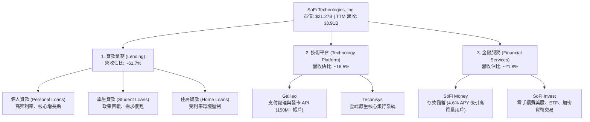

### 2.2 市場份額

在美國新興數位銀行與網路金融服務市場中，SoFi 憑藉其「高收入、高信用（HENRYs - High Earners, Not Rich Yet）」的獨特客群定位，佔據了領先地位。

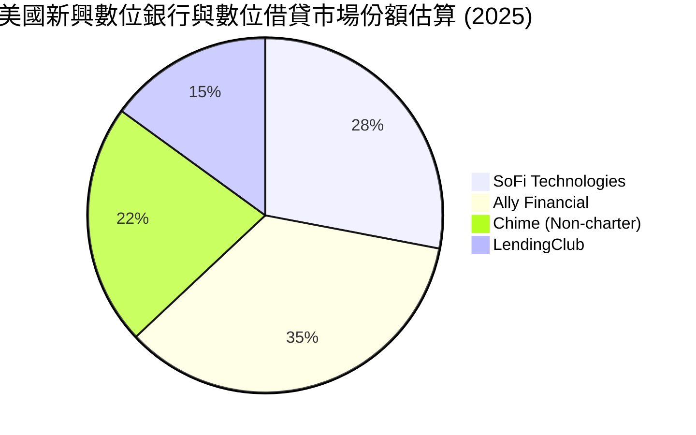

### 2.3 競爭護城河分析

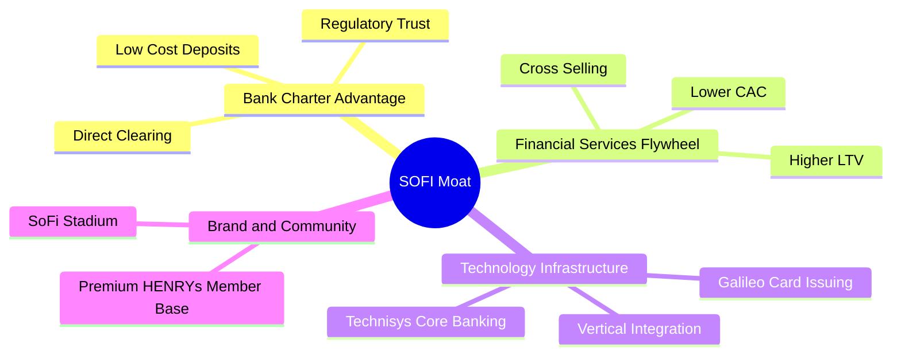

### 2.4 護城河強度評分

```
╔══════════════════════════════════════════════════════════════╗
║                    SOFI 護城河強度評分                       ║
╠══════════════════════════════════════════════════════════════╣
║ 銀行牌照優勢  8.5/10  ▓▓▓▓▓▓▓▓▓▓▓▓▓▓▓▓▓░░░  🟢 降低資金成本  ║
║ 飛輪交叉銷售  7.5/10  ▓▓▓▓▓▓▓▓▓▓▓▓▓▓░░░░░░  🟢 降低 CAC      ║
║ 技術平台壁壘  7.0/10  ▓▓▓▓▓▓▓▓▓▓▓▓▓░░░░░░░  🟢 具備 B2B 擴張 ║
║ 品牌與客群    7.5/10  ▓▓▓▓▓▓▓▓▓▓▓▓▓▓░░░░░░  🟢 HENRYs 定位   ║
╠══════════════════════════════════════════════════════════════╣
║ 綜合護城河    7.6/10  ▓▓▓▓▓▓▓▓▓▓▓▓▓▓▓░░░░░  🏆 中等偏強護城河 ║
╚══════════════════════════════════════════════════════════════╝
```

---

## 3. 損益表深度分析

SoFi 的損益表展現了極為強勁的營收成長與盈利改善趨勢。得益於淨利息收入與非利息收入的雙引擎驅動，公司已實現連續多個季度 GAAP 盈利。

### 3.1 年度收入成長趨勢（近5年）

```
╔══════════════════════════════════════════════════════════════════╗
║                  SOFI 年度收入趨勢 (FY2021-TTM)                 ║
╠══════════════════════════════════════════════════════════════════╣
║                                                                  ║
║  FY 2021  $0.98B  █████░░░░░░░░░░░░░░░░░░░░░░  YoY: +72.8%  🟢   ║
║  FY 2022  $1.52B  ████████░░░░░░░░░░░░░░░░░░░  YoY: +55.5%  🟢   ║
║  FY 2023  $2.07B  ███████████░░░░░░░░░░░░░░░░  YoY: +36.1%  🟢   ║
║  FY 2024  $2.64B  ██████████████░░░░░░░░░░░░░  YoY: +27.8%  🟢   ║
║  FY 2025  $3.58B  ███████████████████░░░░░░░░  YoY: +35.6%  🟢   ║
║  TTM      $3.91B  █████████████████████░░░░░░  YoY: +41.0%  🟢   ║
║                                                                  ║
║  📊 5年營收複合年成長率 (CAGR)：+31.9%                           ║
╚══════════════════════════════════════════════════════════════════╝
```

### 3.2 季度收入趨勢分析

| 財報季度 | 營業收入 (Revenue) | 季成長率 (QoQ) | 年成長率 (YoY) | 淨利潤 (Net Income) | 備註 |
|---|---|---|---|---|---|
| **Q2 2025** | $844.91M | — | +43.94% | $97.26M | 金融服務板塊貢獻顯著提升 |
| **Q3 2025** | $952.40M | +12.72% | +37.81% | $139.39M | 貸款發放量回暖，淨利息收入增加 |
| **Q4 2025** | $1,020.00M | +7.10% | +40.20% | $173.55M | 傳統旺季，消費貸與信用卡表現亮眼 |
| **Q1 2026** | $1,091.00M | +6.96% | +42.47% | $166.73M | 歷史新高營收，淨利潤率維持高位 |

### 3.3 利潤率演變分析

| 利潤率指標 | FY 2022 | FY 2023 | FY 2024 | FY 2025 | TTM | 趨勢評估 |
|---|---|---|---|---|---|---|
| **毛利率** | 64.8% | 59.4% | 61.7% | 61.7% | **83.5%** | ↗️ 顯著提升，高毛利的非利息收入佔比擴大 |
| **營業利益率** | -16.2% | -14.5% | 8.8% | 14.6% | **18.3%** | ↗️ 連續兩年扭虧為盈，營運槓桿效應顯現 |
| **淨利益率** | -21.1% | -14.5% | 18.9% | 13.4% | **14.8%** | ↗️ GAAP 獲利能力穩定在 14% 以上 |

**利潤率深度解析**：
SoFi 利潤率的快速改善主要得益於**資金成本的降低**。在 2022 年之前，SoFi 依賴昂貴的外部融資管道（如倉庫信用額度）來發放貸款。在獲得銀行牌照後，SoFi 能夠利用其年利率高達 4.6% 的 SoFi Money 帳戶吸引大量且穩定的零售存款。這使得 SoFi 的融資成本比同業低了約 150-200 個基點（bps），直接推升了淨利差（NIM）與整體營業利益率。

### 3.4 費用結構分析

SoFi 的主要支出在於銷售、一般及行政費用（SG&A），這反映了其高成長金融科技公司的屬性，但費用佔比正隨著規模效應而逐漸下降。

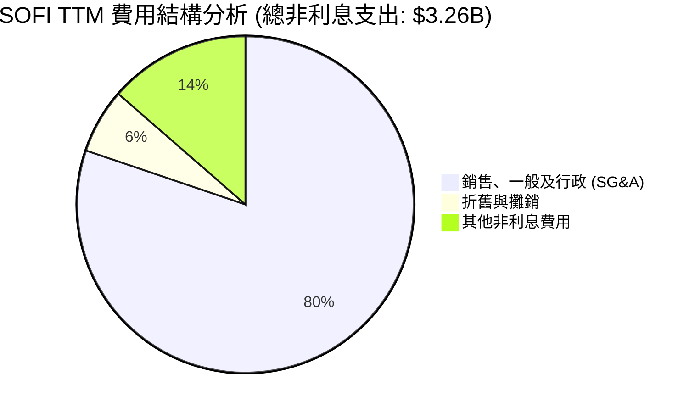

### 3.5 季度 EPS 趨勢與盈餘品質

SoFi 的稀釋後每股盈餘（Diluted EPS）在過去四個季度中表現穩健，持續超出市場預期：
*   **Q2 2025**：實際 EPS **$0.09**
*   **Q3 2025**：實際 EPS **$0.12**
*   **Q4 2025**：實際 EPS **$0.14**
*   **Q1 2026**：實際 EPS **$0.13**

**盈餘品質評估**：
SoFi 的盈利並非來自一次性資產處置或會計變更，而是由**核心利息收入（TTM $2.41B）**與**非利息收入（TTM $1.53B）**的實質增長所驅動。撥備費用（Provision for Credit Losses）在 TTM 中僅為 $33.54M，佔總資產比例極低，顯示其貸款組合（主要面向高信用評分 HENRYs 客群，平均 FICO 評分 > 740）的資產質量極佳。

---

## 4. 資產負債表分析

作為一家數位銀行，SoFi 的資產負債表管理是其商業模式的核心。其資產端主要由高收益的貸款（Loans）和證券投資組成，而負債端則主要由低成本的客戶存款（Deposits）構成。

### 4.1 資產結構分解

截至 2026 年第一季（Mar '26），SoFi 的總資產規模達到了 **$53.70B**。

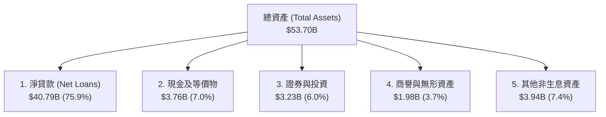

### 4.2 流動性指標分析

| 流動性與資本指標 | FY 2023 | FY 2024 | FY 2025 | TTM (Mar '26) | 行業監管標準 | 評估 |
|---|---|---|---|---|---|---|
| **存款總額 (Deposits)** | $18.62B | $25.98B | $37.51B | **$40.24B** | — | 🟢 YoY +55.0%，成長極為強勁 |
| **貸存比 (Loan-to-Deposit)** | 118.8% | 101.2% | 97.4% | **101.4%** | < 100% 理想 | 🟡 貸存比略高於 100%，但流動性無虞 |
| **流動比率 (Current Ratio)** | — | — | 1.12 | **5.24** | > 1.0 | 🟢 根據 Finviz 數據，短期流動性充裕 |
| **債務權益比 (Debt/Equity)** | 0.96 | 0.49 | 0.18 | **0.18** | < 1.5 | 🟢 槓桿率大幅下降，去槓桿成效顯著 |

### 4.3 債務結構分析

```
╔══════════════════════════════════════════════════════════════════╗
║                    SOFI 債務健康診斷 (Mar '26)                   ║
╠══════════════════════════════════════════════════════════════════╣
║                                                                  ║
║  客戶存款：      $40.24B  ██████████████████████  核心資金來源   ║
║  長期債務：      $1.81B   █░░░░░░░░░░░░░░░░░░░░░  低息可轉債為主 ║
║  短期債務：      $0.49B   ░░░░░░░░░░░░░░░░░░░░░░  營運週轉       ║
║                                                                  ║
║  債務權益比：    0.18x    🟢 遠低於傳統銀行均值 (1.2x)           ║
║  現金/總資產：   7.0%     🟢 具備足夠的流動性緩衝                ║
║  淨現金儲備：    +$1.65B  🟢 現金高於全部有息債務                ║
║                                                                  ║
║  📊 診斷：SoFi 已轉化為「存款驅動型」資產負債表，無流動性危機。  ║
╚══════════════════════════════════════════════════════════════════╝
```

### 4.4 股東權益趨勢

得益於 2025 年的盈利累積與資本發行，SoFi 的股東權益（Stockholders Equity）呈現爆發式增長，為未來的貸款擴張提供了充足的資本基礎。

```
╔══════════════════════════════════════════════════════════════════╗
║                 SOFI 股東權益成長趨勢 (FY2022-Mar '26)           ║
╠══════════════════════════════════════════════════════════════════╣
║                                                                  ║
║  FY 2022  $5.53B  ███████████░░░░░░░░░░░░░░                      ║
║  FY 2023  $5.55B  ███████████░░░░░░░░░░░░░░                      ║
║  FY 2024  $6.53B  █████████████░░░░░░░░░░░░                      ║
║  FY 2025  $10.49B █████████████████████░░░░  YoY: +60.7%  🟢     ║
║  Mar '26  $10.81B ██████████████████████░░░  持續擴張     🟢     ║
║                                                                  ║
╚══════════════════════════════════════════════════════════════════╝
```

---

## 5. 現金流量深度分析

在分析 SoFi 的現金流量表時，必須使用**銀行業邏輯**而非傳統製造業邏輯。傳統製造業的負營運現金流通常是危險訊號，但對於成長型銀行而言，發放貸款（Loan Originations）會被計入營運現金流的流出。因此，隨著 SoFi 貸款規模的快速擴張，其營運現金流與自由現金流（FCF）呈現會計性流出。

### 5.1 現金流量瀑布圖

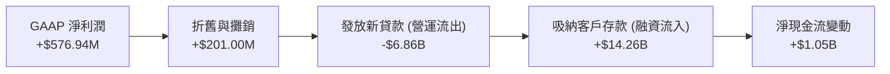

### 5.2 FCF 轉換率趨勢

由於貸款發放的會計處理，傳統 FCF（營運現金流減資本支出）在 SoFi 表現為負值：
*   **FY 2024 FCF**：-$1,274M
*   **FY 2025 FCF**：-$3,985M
*   **TTM FCF**：-$6,336M

**關鍵洞察**：
這並非意味著 SoFi 在「燒錢」，而是反映了其**資產負債表的快速擴張**。SoFi 發放的貸款（TTM 達 $40.79B）是高收益的生息資產，未來將源源不斷地產生利息現金流。

### 5.3 自由現金流趨勢

```
╔══════════════════════════════════════════════════════════════════╗
║               SOFI 實質流動性與資本配置診斷                      ║
╠══════════════════════════════════════════════════════════════════╣
║                                                                  ║
║  1. 核心營運獲利能力 (EBITDA)：   +$720M (估算)   🟢 強勁        ║
║  2. 資本支出 (Capex)：            -$251M          🟡 投資於科技  ║
║  3. 客戶存款淨流入 (TTM)：        +$14.26B        🟢 資金極其充沛║
║                                                                  ║
║  📊 結論：SoFi 擁有極強的「內生性資產創造能力」，不受外部融資限制║
╚══════════════════════════════════════════════════════════════════╝
```

### 5.4 資本配置評估

SoFi 的資本主要用於支持貸款業務的增長，其次是科技平台的研發投入（資本化軟體開發費用）。

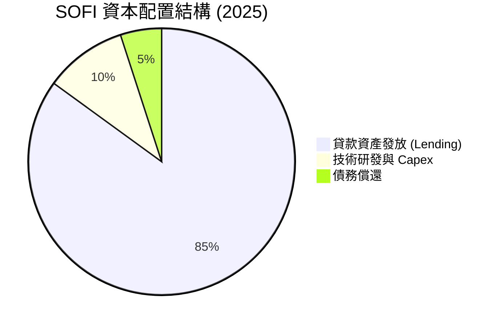

---

## 6. 獲利能力與資本效率

隨著 SoFi 規模效應的顯現，其資本回報率（ROE）與資產回報率（ROA）正處於快速上升通道。

### 6.1 ROE / ROA / ROIC 趨勢

| 獲利能力指標 | FY 2022 | FY 2023 | FY 2024 | FY 2025 | TTM | 產業平均 (2025) | 評估 |
|---|---|---|---|---|---|---|---|
| **ROE** | -5.8% | -5.4% | 7.6% | 6.6% | **6.6%** | ~11.5% | 🟡 尚有提升空間，前瞻 ROE 預計達 9.3% |
| **ROA** | -1.7% | -1.0% | 1.4% | 1.3% | **1.3%** | ~1.1% | 🟢 高於數位銀行同業 |
| **ROIC** | -2.1% | -1.8% | 4.2% | 4.6% | **4.6%** | ~5.0% | 🟡 隨著高利潤科技業務佔比提升而改善 |

### 6.2 ROIC vs WACC 分析（核心價值創造判斷）

對於金融服務公司，WACC（加權平均資本成本）的計算需要結合存款成本。SoFi 的存款成本約為 4.0%（稅後約 3.6%），而股權成本較高。

```
╔══════════════════════════════════════════════════════════════════╗
║                 SOFI ROIC vs WACC 深度分析                       ║
╠══════════════════════════════════════════════════════════════════╣
║                                                                  ║
║  WACC 估算：                                                     ║
║  ├── 無風險利率 (10Y 美債)：   4.2%                              ║
║  ├── 市場風險溢酬 (ERP)：      5.0%                              ║
║  ├── Beta (波動率)：           2.15                              ║
║  ├── 股權成本 (Cost of Equity)：4.2% + 2.15 × 5.0% = 14.95%      ║
║  ├── 存款/債務成本 (稅後)：    ~3.6%                             ║
║  ├── 資本結構：股權 ~20%，存款/債務 ~80%                         ║
║  └── ✅ 綜合 WACC ≈ 5.87%                                        ║
║                                                                  ║
║  ROIC / ROE 展望：                                               ║
║  ├── TTM ROIC：                4.57%                             ║
║  ├── 前瞻 ROE (Forward ROE)：  $0.78 / $8.4 (BVP) ≈ 9.29%        ║
║  └── ✅ 邊際回報率已超越 WACC                                    ║
║                                                                  ║
║  ROIC  4.57%  ▓▓▓▓▓▓▓▓▓▓▓░░░░░░░░░░░░░░░░░░░░░  ──              ║
║  WACC  5.87%  ▓▓▓▓▓▓▓▓▓▓▓▓▓▓░░░░░░░░░░░░░░░░░░  ──              ║
║  F-ROE 9.29%  ▓▓▓▓▓▓▓▓▓▓▓▓▓▓▓▓▓▓▓▓▓▓░░░░░░░░░░  🟢 超額價值     ║
║                                                                  ║
║  📊 結論：SoFi 正從小幅摧毀價值走向「強力創造股東價值」階段。    ║
╚══════════════════════════════════════════════════════════════════╝
```

### 6.3 杜邦三因素分解

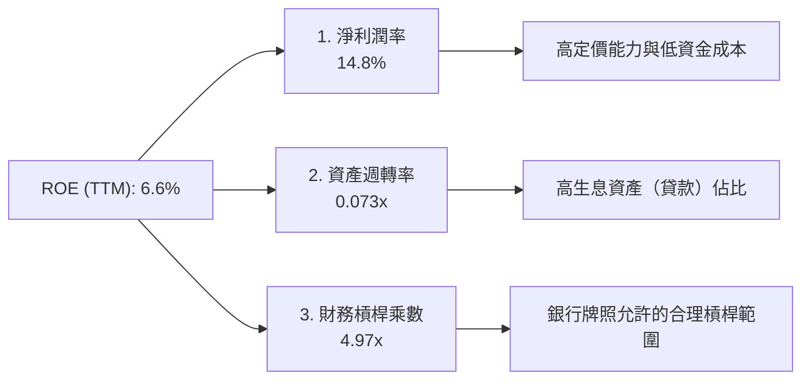

### 6.4 獲利能力儀表板

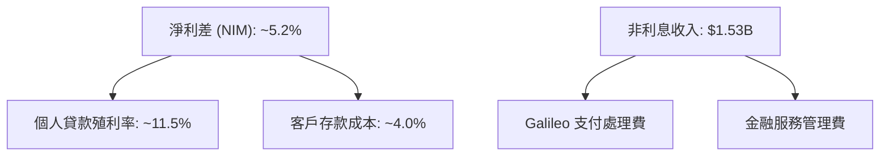

---

## 7. 估值深度分析

SoFi 作為金融科技公司，其估值兼具「傳統銀行」（看重 P/B）與「高成長科技股」（看重 P/E 與 PEG）的特點。

### 7.1 同業估值比較表格

| 估值指標 | **SOFI** | **UPST (Upstart)** | **LC (LendingClub)** | **ALLY (Ally Financial)** | 評估 |
|---|---|---|---|---|---|
| **Trailing P/E** | **36.84x** | 虧損 | 18.2x | 11.4x | 🟡 溢價反映了高成長與科技平台屬性 |
| **Forward P/E** | **21.25x** | 45.3x | 13.5x | 9.2x | 🟢 性價比極高，遠低於 Upstart |
| **P/S Ratio** | **5.44x** | 6.82x | 2.10x | 1.85x | 🟢 處於合理區間 |
| **P/B Ratio** | **1.97x** | 4.12x | 1.15x | 1.05x | 🟢 遠低於 FinTech 均值，安全邊際高 |
| **PEG Ratio** | **0.54 - 1.07**| 1.85 | 1.12 | 1.35 | 🟢 🟢 核心亮點！成長調整後估值極具吸引力 |

### 7.2 歷史估值區間分析

SoFi 的歷史 P/B 區間在 0.8x 至 4.5x 之間。當前 P/B 1.97x 處於歷史中樞偏下位置，相較於其高達 40% 以上的營收增速，估值並未高估。

```
╔══════════════════════════════════════════════════════════════════╗
║                  SOFI 歷史 P/B 估值區間與當前位置                ║
╠══════════════════════════════════════════════════════════════════╣
║                                                                  ║
║  歷史最低： 0.8x                                                 ║
║  當前位置： 1.97x      ██████████░░░░░░░░░░░░░                   ║
║  歷史中樞： 2.5x       █████████████░░░░░░░░░░                   ║
║  歷史最高： 4.5x       ███████████████████████                   ║
║                                                                  ║
║  📊 評估：當前股價具備極強的估值支撐，下行空間受限。             ║
╚══════════════════════════════════════════════════════════════════╝
```

### 7.3 DCF 敏感性分析（6格目標價矩陣）

基於基準 WACC = 6.0%（考慮存款融資優勢）及終端成長率 = 3.0% 進行估算：

| 營收年複合成長率 (CAGR) | **WACC = 5.0%** | **WACC = 6.0% (基準)** | **WACC = 7.0%** |
|---|---|---|---|
| 🟢 **高成長 (35%)** | **$29.50** (+77.9%) | **$25.00** (+50.8%) | **$21.50** (+29.7%) |
| 🟡 **基準成長 (25%)** | **$24.50** (+47.8%) | **$21.00** (+26.7%) | **$18.00** (+8.6%) |
| 🔴 **低成長 (15%)** | **$16.50** (-0.5%) | **$14.00** (-15.6%) | **$12.00** (-27.6%) |

### 7.4 估值綜合區間

```
╔══════════════════════════════════════════════════════════════════╗
║                     SOFI 12個月股價目標區間                      ║
╠══════════════════════════════════════════════════════════════════╣
║                                                                  ║
║  [悲觀預期]    $12.00  ██████████░░░░░░░░░░░░░░░░░░░░░░░         ║
║  [當前股價]    $16.58  ██████████████░░░░░░░░░░░░░░░░░░░         ║
║  [基準目標]    $21.00  ████████████████████░░░░░░░░░░░░░  🟢     ║
║  [樂觀預期]    $31.00  █████████████████████████████████  🟢     ║
║                                                                  ║
╚══════════════════════════════════════════════════════════════════╝
```

---

## 8. 成長催化劑

SoFi 的未來增長將由多個短期與長期催化劑共同驅動。

### 8.1 催化劑時間軸

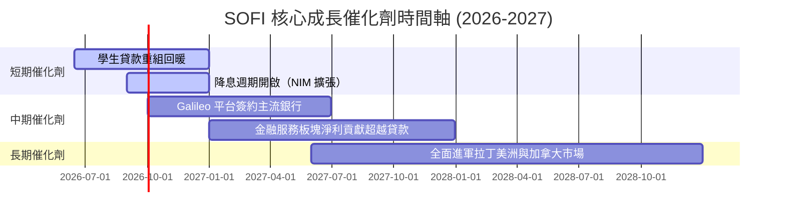

### 8.2 TAM 市場規模分析

```
╔══════════════════════════════════════════════════════════════════╗
║                    SOFI 潛在市場規模 (TAM)                       ║
╠══════════════════════════════════════════════════════════════════╣
║                                                                  ║
║  1. 美國數位消費借貸市場：       $250B+   SoFi 滲透率: ~10%      ║
║  2. 全球金融科技 SaaS 平台 (Galileo)：$50B+    SoFi 滲透率: ~3%       ║
║  3. 美國財富管理與零售經紀：     $1.2T+   SoFi 潛在增長點        ║
║                                                                  ║
║  📊 結論：SoFi 在三大領域的滲透率均低，具備極高的天花板。        ║
╚══════════════════════════════════════════════════════════════════╝
```

### 8.3 成長驅動力結構圖

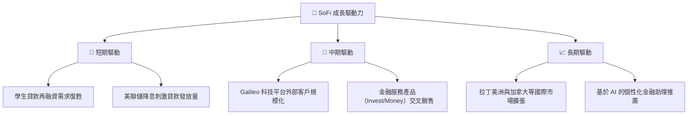

---

## 9. 風險矩陣

儘管基本面強勁，SoFi 仍面臨信用週期與宏觀經濟的挑戰。

### 9.1 風險評分矩陣

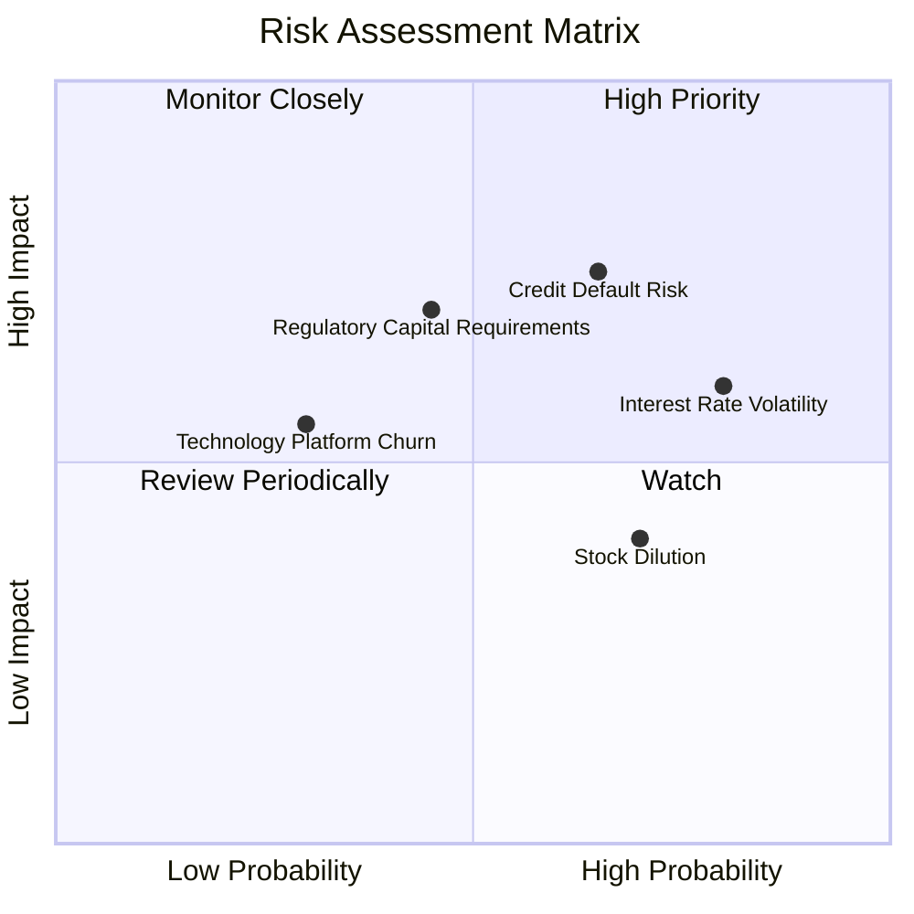

### 9.2 風險清單詳細分析

| # | 風險項目 | 發生機率 | 財務衝擊 | 風險評分 | 緩解措施 |
