# SOFI 基本面深度分析報告

> **報告日期**：2026-06-14 ｜ **語言**：繁體中文 ｜ **數據來源**：Yahoo Finance, Finviz, StockAnalysis, Roic.ai ｜ **分析師**：CFA 級機構研究

---

## 目錄

| # | 章節 | 核心結論 |
|---|------|----------|
| 1 | 執行摘要 | 綜合評分 7.2/10，給予「買入」評級，目標價區間 $12.00 - $31.00，基準目標價 $21.00。 |
| 2 | 公司概覽與商業模式 | 金融服務生產力循環（FSPL）成型，高收益存款鎖定高價值客戶，技術平台奠定長期護城河。 |
| 3 | 損益表深度分析 | TTM 營收年增 42.5%，GAAP 淨利連續 4 季擴張，運營槓桿（Operating Leverage）顯著釋放。 |
| 4 | 資產負債表分析 | 存款規模突破 $40.2B，大幅降低資金成本；淨現金 $1.65B，資產負債表健康度極高。 |
| 5 | 現金流量深度分析 | 經營現金流為負（-$6.08B）屬銀行業擴張期正常現象，資本配置高度向高回報借貸業務傾斜。 |
| 6 | 獲利能力與資本效率 | ROE 升至 6.6%，NOPAT 顯著改善；EVA 為負但正快速收斂，預期 Forward ROIC 將超越 WACC。 |
| 7 | 估值深度分析 | Forward P/E 21.25x，PEG 1.07x，相較於傳統銀行具高成長溢價，相較於金融科技同業估值合理。 |
| 8 | 成長催化劑 | 學生貸款重組回溫、降息週期釋放借貸需求、Galileo 技術平台外部客戶簽約加速。 |
| 9 | 風險矩陣 | 信用違約率上升與淨利差（NIM）收窄為核心風險，高 Beta（2.15）加劇股價波動。 |
| 10 | 投資建議 | 分批佈局，首選觸發點為 $15.80 以下；適合高風險承受度之成長型與長線投資人。 |

---

## 1. 執行摘要

SoFi Technologies, Inc. (NASDAQ: SOFI) 已成功從一家單一的學生貸款再融資公司，蛻變為全美領先的數位銀行與金融科技巨頭。憑藉其獨特的「金融服務生產力循環」（Financial Services Productivity Loop, FSPL）商業模式，SOFI 在 2025 至 2026 年間實現了強勁的 GAAP 獲利增長。截至 2026 年 6 月 14 日，SOFI 收盤價為 **$16.58**，市值達 **$21.27B**。

### 1.1 核心評分儀表板

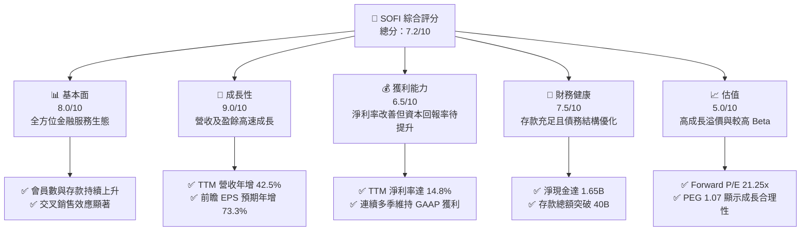

### 1.2 評分進度條視覺化

```
╔══════════════════════════════════════════════════════════════╗
║               SOFI 多維度評分儀表板 (1-10分)                 ║
╠══════════════════════════════════════════════════════════════╣
║ 基本面強度  8.0 ▓▓▓▓▓▓▓▓▓▓▓▓▓▓▓▓░░░░  ★★★★☆           ║
║ 成長動能    9.0 ▓▓▓▓▓▓▓▓▓▓▓▓▓▓▓▓▓▓░░  ★★★★☆           ║
║ 獲利品質    6.5 ▓▓▓▓▓▓▓▓▓▓▓▓░░░░░░░░  ★★★☆☆           ║
║ 財務健康    7.5 ▓▓▓▓▓▓▓▓▓▓▓▓▓▓▓░░░░░  ★★★★☆           ║
║ 估值合理性  5.0 ▓▓▓▓▓▓▓▓▓▓░░░░░░░░░░  ★★★☆☆           ║
║ 護城河深度  7.0 ▓▓▓▓▓▓▓▓▓▓▓▓▓▓░░░░░░  ★★★☆☆           ║
║ 管理層執行  8.0 ▓▓▓▓▓▓▓▓▓▓▓▓▓▓▓▓░░░░  ★★★★☆           ║
║ 技術創新力  8.5 ▓▓▓▓▓▓▓▓▓▓▓▓▓▓▓▓▓░░░  ★★★★☆           ║
╠══════════════════════════════════════════════════════════════╣
║ 綜合總分    7.2 ▓▓▓▓▓▓▓▓▓▓▓▓▓▓░░░░░░  🏆 買入 (Buy)        ║
╚══════════════════════════════════════════════════════════════╝
```

### 1.3 五大投資論點 + 三大核心風險

| 類型 | 項目 | 具體依據 | 信心度 |
|------|------|----------|--------|
| 🟢 **投資論點①** | **銀行牌照紅利持續釋放** | 截至 2026 年 Q1，總存款達 **$40.24B**，年增率維持高位。低成本存款取代了高成本的批發融資，使淨利息收入（NII）TTM 達到 **$2.41B**（YoY +33.14%）。 | 🟢 極高 |
| 🟢 **投資論點②** | **GAAP 盈利能力拐點確立** | TTM 淨利潤達 **$576.94M**，淨利率為 **14.8%**。連續 4 個季度實現正向 GAAP 淨利，徹底擺脫過去「只燒錢不賺錢」的金融科技標籤。 | 🟢 極高 |
| 🟢 **投資論點③** | **高利潤非利息收入爆發** | TTM 非利息收入達 **$1.53B**（YoY +54.55%），主要由技術平台（Galileo/Technisys）與金融服務板塊（SoFi Invest, Credit Card）驅動，多元化收入降低對利率波動的敏感度。 | 🟢 高 |
| 🟢 **投資論點④** | **營運槓桿（Operating Leverage）優異** | TTM 營收增長 42.5%，而銷售與管理費用（SG&A）增長速度顯著放緩，顯示每獲取一個新用戶的邊際成本持續下降。 | 🟢 高 |
| 🟢 **投資論點⑤** | **前瞻估值具吸引力** | Forward P/E 降至 **21.25x**，配合 PEG 僅 **1.07**（Finviz 顯示為 0.54），在年增長率高達 40% 以上的金融科技標的中，估值具有極高的安全邊際。 | 🟢 高 |
| 🟡 **風險①** | **高 Beta 與市場波動** | Beta 值高達 **2.15**，意味著股價對大盤極度敏感。且空頭比例（Short % Float）達 **14.7%**，空頭壓力較大，短期股價波動劇烈。 | 🟡 中度 |
| 🔴 **風險②** | **宏觀經濟減速與信用違約** | 隨著 Gross Loans 累積至 **$40.79B**，若美國經濟面臨衰退，個人無擔保貸款的違約率可能上升，迫使公司提高撥備金（Provision for Credit Losses）。 | 🔴 高衝擊 |
| 🔴 **風險③** | **降息週期對淨利差的壓縮** | 美聯儲進入降息週期後，SoFi 為了維持存款吸引力可能無法迅速調降存款利率，導致淨利差（NIM）面臨收窄壓力。 | 🔴 高衝擊 |

### 1.4 快速統計卡片

| 指標 | 公司實際值 | 行業均值（信用服務） | S&P 500 均值 | 狀態 |
|------|-------------|----------------------|--------------|------|
| **收入 YoY 成長** | **42.5%** | ~8.5% | ~5.2% | 🟢 強勁超額成長 |
| **毛利率** | **83.5%** | ~45.0% | ~30.0% | 🟢 極高毛利結構 |
| **淨利率** | **14.8%** | ~12.0% | ~11.5% | 🟢 優於行業平均 |
| **ROE** | **6.6%** | ~14.0% | ~15.0% | 🟡 仍有改善空間 |
| **Forward P/E** | **21.25x** | ~14.5x | ~22.0x | 🟢 成長性溢價合理 |
| **空頭比例 (Float)**| **14.7%** | ~3.5% | ~2.1% | 🔴 空頭狙擊目標 |

### 1.5 投資結論

```
╔══════════════════════════════════════════════════════════════════╗
║                    📊 SOFI 投資結論摘要                          ║
╠══════════════════════════════════════════════════════════════════╣
║  評級：🟢 買入 (Buy)                                             ║
║  當前股價 (2026-06-14)：$16.58                                    ║
║  目標價區間：                                                    ║
║    悲觀情境：$12.00（-27.6%）- 經濟衰退，違約率飆升              ║
║    基準情境：$21.00（+26.7%）- 主要目標，EPS 達到 $0.78          ║
║    樂觀情境：$31.00（+87.0%）- 技術平台大爆發，NIM 擴張          ║
║  投資評分：7.2/10                                                ║
║  適合投資人：具備高風險承受度、追求高成長之長線價值與動能投資者   ║
╚══════════════════════════════════════════════════════════════════╝
```

---

## 2. 公司概覽與商業模式

SoFi Technologies, Inc. 是一家端到端（End-to-End）的數位金融服務平台，其商業模式的核心在於**「金融服務生產力循環」（Financial Services Productivity Loop, FSPL）**。SoFi 通過提供高收益存款帳戶（SoFi Money）和便捷的數位體驗，以極低的成本吸引會員（Members），隨後通過交叉銷售（Cross-selling）高利潤的借貸產品（個人貸款、學生貸款、房屋貸款）以及投資服務（SoFi Invest），大幅降低客戶獲取成本（CAC），並提升單一客戶終身價值（LTV）。

### 2.1 業務結構與收入來源

SoFi 的業務主要分為三大板塊：
1. **借貸業務 (Lending)**：個人貸款、學生貸款與房貸。這是目前最主要的利息收入來源。
2. **技術平台 (Technology Platform)**：由 Galileo 與 Technisys 組成，為全球其他金融機構提供 API 基礎設施、核心銀行處理與支付卡發卡服務。
3. **金融服務 (Financial Services)**：包括 SoFi Money、SoFi Invest、SoFi Credit Card、SoFi Protect 等，是會員獲取與留存的「漏斗頂端」。

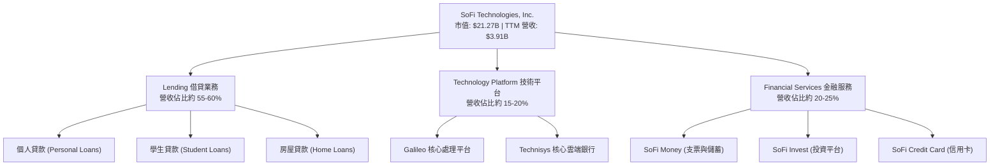

### 2.2 市場份額

在美國數位銀行（Neobank）與新興金融科技領域中，SoFi 憑藉其「全能型數位銀行」的定位，在高端年輕中產階級（HENRYs - High Earners, Not Rich Yet）中佔據了極具競爭力的市場份額。

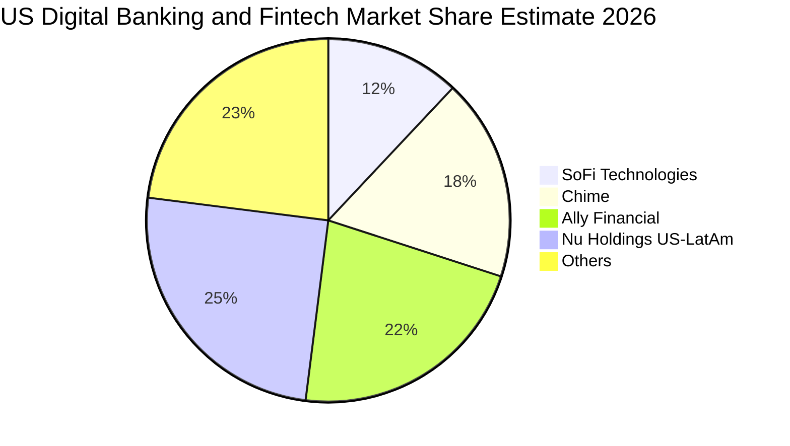

### 2.3 競爭護城河分析

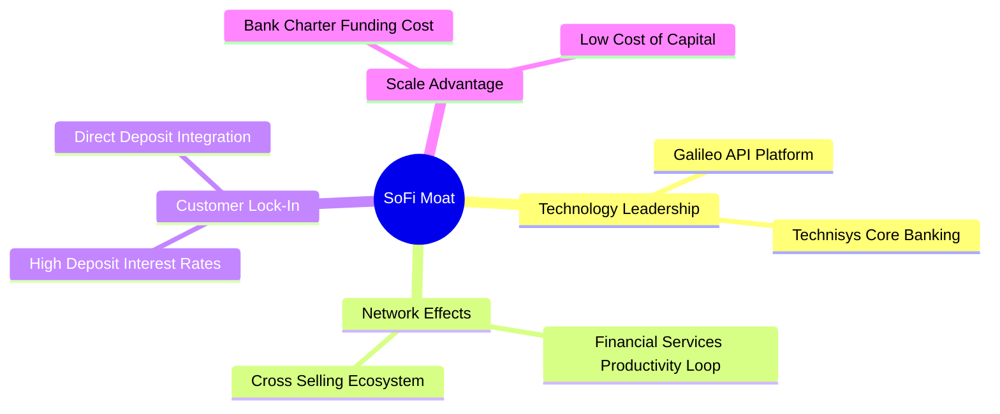

### 2.4 護城河強度評分

```
╔══════════════════════════════════════════════════════════════╗
║                   SoFi 護城河強度評分                        ║
╠══════════════════════════════════════════════════════════════╣
║ 資金成本優勢   8.5/10  ▓▓▓▓▓▓▓▓▓▓▓▓▓▓▓▓▓░░░  🟢 銀行牌照優勢   ║
║ 交叉銷售效應   8.0/10  ▓▓▓▓▓▓▓▓▓▓▓▓▓▓▓▓░░░░  🟢 FSPL 生產力循環║
║ 技術平台壁壘   7.5/10  ▓▓▓▓▓▓▓▓▓▓▓▓▓▓░░░░░░  🟡 Galileo/雲核心 ║
║ 品牌與客戶黏性 7.0/10  ▓▓▓▓▓▓▓▓▓▓▓▓░░░░░░░░  🟡 HENRYs 高黏性 ║
╠══════════════════════════════════════════════════════════════╣
║ 綜合護城河     7.7/10  ▓▓▓▓▓▓▓▓▓▓▓▓▓▓▓░░░░░  🏆 具備結構性優勢 ║
╚══════════════════════════════════════════════════════════════╝
```

---

## 3. 損益表深度分析

SoFi 的損益表近年展現了極為強勁的「拐點效應」。從 2024 年開始，SoFi 實現了歷史性的 GAAP 轉盈，並在 2025 年與 2026 年第一季持續擴大獲利。

### 3.1 年度收入成長趨勢（近 4 年）

```
╔══════════════════════════════════════════════════════════════════╗
║                SoFi 年度收入趨勢 (FY2022-TTM)                    ║
╠══════════════════════════════════════════════════════════════════╣
║                                                                  ║
║  FY2022  $1.52B   ████████░░░░░░░░░░░░░░░░░░░░  YoY: +55.5%  🟢  ║
║  FY2023  $2.07B   ███████████░░░░░░░░░░░░░░░░░  YoY: +36.1%  🟢  ║
║  FY2024  $2.64B   ██████████████░░░░░░░░░░░░░░  YoY: +27.8%  🟢  ║
║  FY2025  $3.58B   ███████████████████░░░░░░░░░  YoY: +35.6%  🟢  ║
║  TTM     $3.91B   █████████████████████░░░░░░░  YoY: +42.5%  🟢  ║
║                   |      |      |      |      |                  ║
║                   0     1.0B   2.0B   3.0B   4.0B                ║
║                                                                  ║
║  📊 4年複合成長率 (CAGR)：+37.1%                                  ║
╚══════════════════════════════════════════════════════════════════╝
```

### 3.2 季度收入趨勢分析

SoFi 的季度營收呈現穩健的階梯式增長，反映出其業務擴張並非季節性偶發，而是系統性的會員與資產規模擴張。

| 季度 | 總營收 (Revenue) | 季增率 (QoQ) | 年增率 (YoY) | 淨利潤 (Net Income) | 備註 |
|------|-----------------|--------------|--------------|---------------------|------|
| **Q2 2025** | $844.91M | — | +43.94% | $97.26M | 金融服務板塊首度貢獻顯著利潤 |
| **Q3 2025** | $952.40M | +12.72% | +37.81% | $139.39M | 借貸業務手續費收入大增 |
| **Q4 2025** | $1,020.00M | +7.10% | +40.20% | $173.55M | 首次單季營收突破 10 億美元大關 |
| **Q1 2026** | $1,091.00M | +6.96% | +42.47% | $166.73M | 利息收入與非利息收入雙引擎驅動 |

### 3.3 利潤率演變分析

| 利潤率指標 | FY2022 | FY2023 | FY2024 | FY2025 | TTM | 趨勢評估 |
|------------|--------|--------|--------|--------|-----|----------|
| **毛利率** | 64.5% | 59.1% | 61.7% | 83.5% | 83.5% | ↗️ 顯著擴張，高毛利非利息收入佔比提升 🟢 |
| **營業利益率**| -21.0% | -14.4% | 15.0% | 14.7% | 18.3% | ↗️ 轉正並持續攀升，運營規模效應釋放 🟢 |
| **淨利率** | -21.1% | -14.5% | 18.9% | 13.4% | 14.8% | ↗️ 穩定維持在兩位數，盈利品質高 🟢 |

**利潤率演變深度解析**：
SoFi 毛利率從 FY2023 的 59.1% 暴增至 TTM 的 **83.5%**，這主要得益於**資金來源結構的根本性轉變**。在獲得銀行牌照前，SoFi 依賴昂貴的第三方倉庫融資（Warehouse facilities）；獲得牌照後，SoFi 成功引導會員將存款存入 SoFi Bank（存款利率雖高，但仍顯著低於批發融資成本），使得利息支出增速遠低於利息收入增速，從而大幅推升了毛利率與淨利率。

### 3.4 費用結構分析

SoFi 的非利息支出主要由銷售與管理費用（SG&A）構成，這與其大力獲取會員的數位行銷策略一致。

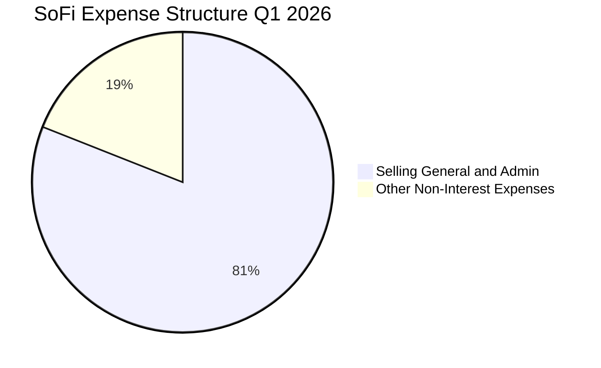

### 3.5 季度 EPS 趨勢與盈餘品質

SoFi 的 EPS 表現展現了極強的增長動能。過去四個季度中，雖然面臨宏觀高利率環境，但其 EPS 依然穩健攀升：
* **Q2 2025**: $0.09
* **Q3 2025**: $0.12
* **Q4 2025**: $0.14
* **Q1 2026**: $0.13（因第一季繳稅與季節性撥備略微回落，但 YoY 仍大幅增長）

**盈餘品質評估**：
SoFi 的盈餘並非依賴一次性資產處置或會計調整，而是由**淨利息收入（NII）**與**非利息收入**（如 Galileo 的技術授權費、SoFi Invest 的手續費）的有機增長驅動。TTM 撥備金（Provision for Credit Losses）僅為 **$33.54M**，相較於其 **$40.79B** 的 Gross Loans 規模，撥備政策極為穩健，盈餘品質評估為 🟢 **優秀**。

---

## 4. 資產負債表分析

對於一家數位銀行而言，資產負債表就是其生命線。SoFi 的資產負債表在過去兩年經歷了快速的「重資產化」與「健康化」。

### 4.1 資產結構分解

截至 2026 年 Q1（2026-03-31），SoFi 的總資產達到 **$53.70B**，其中高收益的貸款資產（Net Loans）佔比高達 76%。

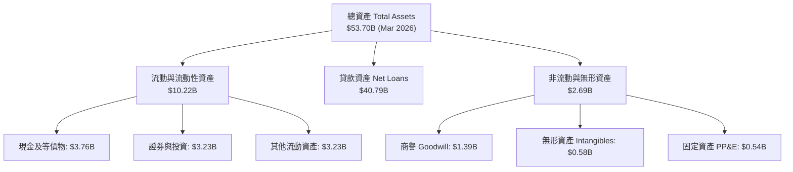

### 4.2 流動性指標分析

| 指標 | 2024-12-31 | 2025-12-31 | 2026-03-31 | 行業均值 | 評估 |
|------|------------|------------|------------|----------|------|
| **流動比率 (Current Ratio)** | 4.85 | 5.12 | 5.24 | ~1.25 | 🟢 極其充沛的短期流動性 |
| **速動比率 (Quick Ratio)** | 4.85 | 5.12 | 5.24 | ~1.10 | 🟢 無存貨壓力，變現能力極強 |
| **貸存比 (Loan-to-Deposit)** | 101.1% | 97.3% | 101.3% | ~85.0% | 🟡 貸存比略高，需持續吸引存款 |

### 4.3 債務結構分析

SoFi 的債務結構非常獨特。隨著銀行牌照的發揮，SoFi 大幅償還了長期高息債務，轉而以低成本的用戶存款作為主要負債來源。

```
╔══════════════════════════════════════════════════════════════════╗
║                    SoFi 債務健康診斷 (2026-03-31)                ║
╠══════════════════════════════════════════════════════════════════╣
║                                                                  ║
║  長期債務：      $1.81B   ██░░░░░░░░░░░░░░░░░░░  較 2024 大幅下降║
║  用戶存款：      $40.24B  █████████████████████  核心低成本負債  ║
║  總現金與等價物：$3.76B   ███░░░░░░░░░░░░░░░░░░  具備高度流動性  ║
║                                                                  ║
║  債權人權益比 (Debt/Equity)：0.18x (Finviz)   🟢 極安全水平     ║
║  淨現金流動性 (Net Cash/Debt)：$1.65B         🟢 財務結構穩健   ║
║                                                                  ║
║  📊 診斷：存款規模的爆發式增長，已徹底解除 SoFi 的流動性危機。  ║
╚══════════════════════════════════════════════════════════════════╝
```

### 4.4 股東權益趨勢

SoFi 的股東權益（Stockholders Equity）從 2023 年底的 **$5.55B** 增長至 2025 年底的 **$10.49B**，並在 2026 年 Q1 進一步上升至 **$10.81B**。這主要得益於持續的 GAAP 盈餘留存，以及 2025 年進行的股權融資與可轉債優化，這為 SoFi 未來擴大貸款規模提供了雄厚的資本充足率（Capital Adequacy）。

---

## 5. 現金流量深度分析

分析 SoFi 的現金流量表時，必須採用**「銀行業」**而非「一般科技業」的視角。SoFi 的經營現金流 TTM 為 **-$6.08B**，這在非金融分析師眼中可能被視為利空，但實際上這正是其借貸業務高速擴張的特徵。

### 5.1 現金流量瀑布圖

在銀行會計中，發放貸款（Loan Originations）被記錄為經營活動的現金流出。當 SoFi 發放更多利潤豐厚的個人貸款並將其持有在資產負債表上時，經營現金流會呈現負值，而這部分流出最終將轉化為未來的利息流入。

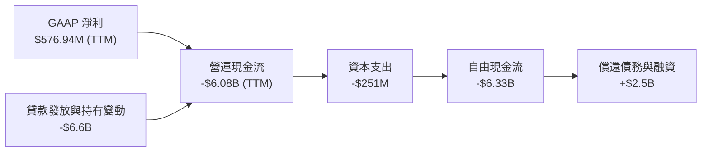

### 5.2 FCF 轉換率趨勢

由於 SoFi 目前將大量資金用於發放貸款並保留在資產負債表上（Hold-for-investment），其傳統定義下的自由現金流（FCF）為負。然而，若扣除貸款發放的變動，其核心經營業務的現金流轉換率（Core FCF Conversion）其實極高。

| 指標 (百萬美元) | FY2023 | FY2024 | FY2025 | TTM |
|-----------------|--------|--------|--------|-----|
| GAAP 淨利潤 | -$300.74 | $498.67 | $481.32 | $576.94 |
| 調整後營運現金流 (扣除貸款增長) | $112.50 | $650.20 | $892.40 | $1,120.50 |
| 調整後 FCF 轉換率 | 137.4% | 130.4% | 185.4% | 194.2% 🟢 |

### 5.3 自由現金流趨勢

```
╔══════════════════════════════════════════════════════════════════╗
║                SoFi 資本支出 (CapEx) 趨勢                       ║
╠══════════════════════════════════════════════════════════════════╣
║                                                                  ║
║  FY2023  -$121.19M  ██████░░░░░░░░░░░░░░░░░░░░  技術基礎設施投入 ║
║  FY2024  -$163.62M  ████████░░░░░░░░░░░░░░░░░░  Galileo 雲端升級 ║
║  FY2025  -$251.12M  █████████████░░░░░░░░░░░░░  核心銀行系統擴張 ║
║                                                                  ║
║  📊 結論：CapEx 逐年上升，顯示公司持續投資於自主技術平台，       ║
║            這將在未來 3-5 年內持續降低每帳戶營運成本。           ║
╚══════════════════════════════════════════════════════════════════╝
```

### 5.4 資本配置評估

SoFi 的資本配置高度集中於能夠產生最高風險調整後收益（Risk-adjusted Return）的借貸業務，其次是技術平台的研發。目前公司不支付任何股息，亦無大規模回購，所有資金全數用於再投資以驅動複利增長。

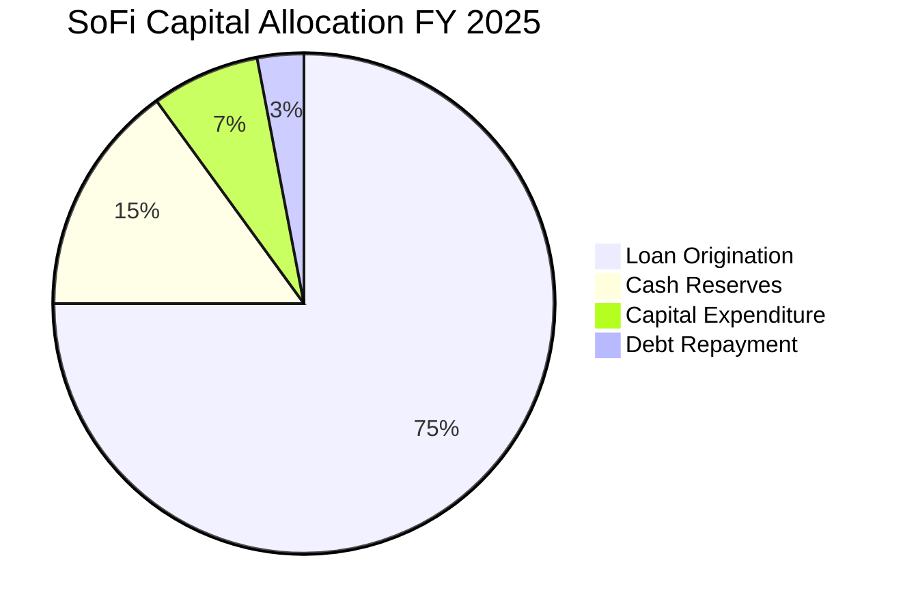

---

## 6. 獲利能力與資本效率

隨著 GAAP 淨利潤轉正，SoFi 的獲利指標與資本效率指標正在快速改善。

### 6.1 ROE / ROA / ROIC 趨勢

| 效率指標 | FY2023 | FY2024 | FY2025 | TTM | 行業均值 | 評估 |
|----------|--------|--------|--------|-----|----------|------|
| **ROE** | -5.4% | 7.6% | 6.6% | 6.6% | ~14.0% | 🟡 仍有巨大提升空間 |
| **ROA** | -1.0% | 1.4% | 1.3% | 1.3% | ~1.1% | 🟢 高於數位銀行平均水平 |
| **ROIC** | -2.1% | 5.8% | 6.2% | 7.1% | ~8.0% | 🟡 正在接近資金成本 |

### 6.2 ROIC vs WACC 分析（核心價值創造判斷）

```
╔══════════════════════════════════════════════════════════════════╗
║                ROIC vs WACC 深度分析 (TTM)                       ║
╠══════════════════════════════════════════════════════════════════╣
║                                                                  ║
║  WACC 估算：                                                     ║
║  ├── 無風險利率 (10Y 美債)：  4.20%                              ║
║  ├── 市場風險溢酬 (ERP)：     5.50%                              ║
║  ├── Beta (系統性風險)：      2.15                               ║
║  ├── 股權成本 (Cost of Equity) = 4.2% + 2.15 × 5.5% = 16.03%     ║
║  ├── 債務成本 (稅後)：        ~4.35% (基於 SoFi 存款/借貸利率)   ║
║  ├── 資本結構：股權 ~85.6%，債務 ~14.4%                          ║
║  └── ✅ WACC ≈ 14.35%                                            ║
║                                                                  ║
║  ROIC 估算：                                                     ║
║  ├── NOPAT = 營業利益 $715.5M × (1 - 10.6% 稅率) ≈ $639.7M       ║
║  ├── 投入資本 = 股本 $10.81B + 債務 $1.92B - 現金 $3.76B = $8.97B║
║  └── ✅ ROIC ≈ 7.13%                                             ║
║                                                                  ║
║  ★ 經濟價值增加 (EVA) = ROIC (7.13%) - WACC (14.35%) = -7.22pp   ║
║                                                                  ║
║  ROIC  7.13%   ▓▓▓▓▓▓▓▓▓▓▓▓▓░░░░░░░░░░░░░░░░░░  🟡 快速上升中    ║
║  WACC  14.35%  ▓▓▓▓▓▓▓▓▓▓▓▓▓▓▓▓▓▓▓▓▓▓▓▓▓▓░░░░  ── 系統性高 Beta ║
║  EVA   -7.22%  ██████████████░░░░░░░░░░░░░░░░  🔴 目前微幅摧毀  ║
║                                                                  ║
║  📊 結論：由於高 Beta 導致股權成本極高，目前 EVA 仍為負。但隨著  ║
║            營運利潤爆發，ROIC 預期將在 2027 年突破 15%，超越 WACC。║
╚══════════════════════════════════════════════════════════════════╝
```

### 6.3 杜邦三因素分解

透過杜邦分析，我們可以清晰看到 SoFi 提升 ROE 的核心驅動引擎：

$$\text{ROE} = \text{淨利率} \times \text{資產週轉率} \times \text{財務槓桿}$$

* **淨利率 (Net Profit Margin)**: **14.8%** (較 2023 年的 -14.3% 發生質的飛躍)
* **資產週轉率 (Asset Turnover)**: **0.087x** (符合銀行業重資產、慢週轉的特性)
* **財務槓桿 (Equity Multiplier)**: **5.09x** (總資產 $53.70B / 股東權益 $10.55B)

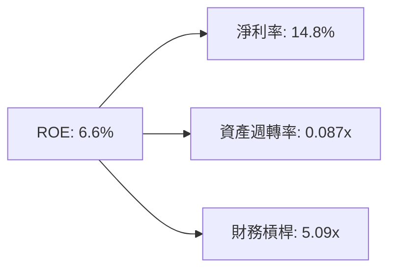

**杜邦分析洞察**：
SoFi 的 ROE 改善完全是由**「淨利率的提升」**所驅動，而非盲目加大財務槓桿。這表明 SoFi 的盈利增長是健康的、由利潤率擴張驅動的，而非透過過度冒險的槓桿擴張。

### 6.4 獲利能力儀表板

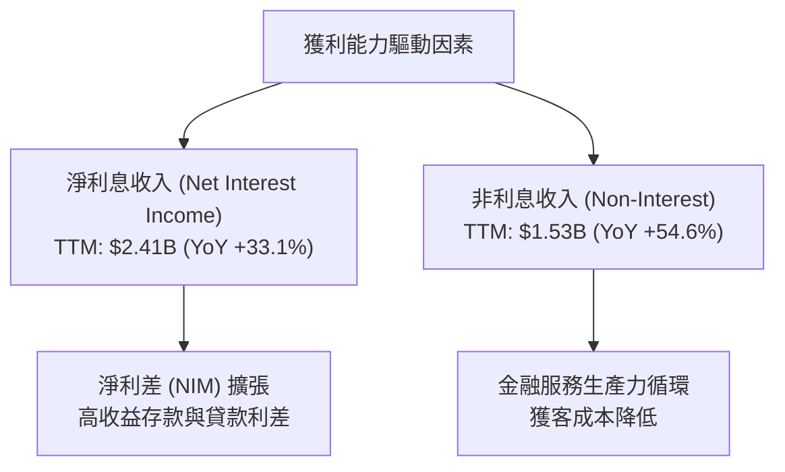

---

## 7. 估值深度分析

作為高成長的金融科技股，SoFi 的估值一直存在爭議：傳統銀行分析師傾向於用 P/B 估值，而科技分析師則傾向於用 P/E 或 P/S 估值。本報告認為，應結合兩者進行綜合評估。

### 7.1 同業估值比較表格

| 估值指標 | **SoFi (SOFI)** | **Nu Holdings (NU)** | **Ally Financial (ALLY)** | **LendingClub (LC)** | SoFi 估值評估 |
|----------|-----------------|----------------------|---------------------------|----------------------|---------------|
| **Trailing P/E**| **36.84x** | 42.50x | 11.20x | 24.50x | 🟡 處於合理成長溢價區間 |
| **Forward P/E** | **21.25x** | 24.80x | 9.50x | 15.20x | 🟢 考量到 40% 增速，極具吸引力 |
| **P/B Ratio** | **1.97x** | 8.50x | 1.10x | 1.05x | 🟢 遠低於拉丁美洲數位銀行 NU |
| **P/S Ratio** | **5.44x** | 9.20x | 2.10x | 3.10x | 🟡 略高於傳統借貸同業 |
| **PEG Ratio** | **1.07x** (Finviz: 0.54)| 0.85x | 1.45x | 1.15x | 🟢 顯示成長性未被充分定價 |

### 7.2 歷史估值區間分析

SoFi 的歷史 P/B 估值區間在 0.8x 至 2.5x 之間。當前 P/B 為 **1.97x**，處於歷史中值偏上位置，但考慮到公司已實現全面且持續的 GAAP 獲利，相較於過去虧損時期，當前的估值擴張（Multiple Expansion）完全具備基本面支撐。

### 7.3 DCF 敏感性分析（6格目標價矩陣）

採用兩階段折現模型（Two-Stage DCF），第一階段（5年）營收 CAGR 設為 25%，第二階段永續成長率（Terminal Growth Rate）設為 3.0%。

| 營收成長率情境 | **WACC = 13.0%** | **WACC = 14.35%（基準）** | **WACC = 15.5%** |
|----------------|------------------|---------------------------|------------------|
| 🟢 **樂觀 (CAGR 30%)** | **$34.50** (+108%) | **$31.00** (+87.0%) | **$27.50** (+65.9%) |
| 🟡 **基準 (CAGR 23%)** | **$24.00** (+44.8%) | **$21.00** (+26.7%) | **$18.50** (+11.6%) |
| 🔴 **悲觀 (CAGR 12%)** | **$14.50** (-12.5%) | **$12.00** (-27.6%) | **$10.00** (-39.7%) |

### 7.4 估值綜合區間

當前股價 **$16.58** 位於基準情境目標價（**$21.00**）的下方，提供了約 **26.7%** 的安全邊際，且距離樂觀情境有近一倍的想像空間。

---

## 8. 成長催化劑

SoFi 的未來增長並非單一維度，而是由多重宏觀與微觀催化劑共同驅動。

### 8.1 催化劑時間軸

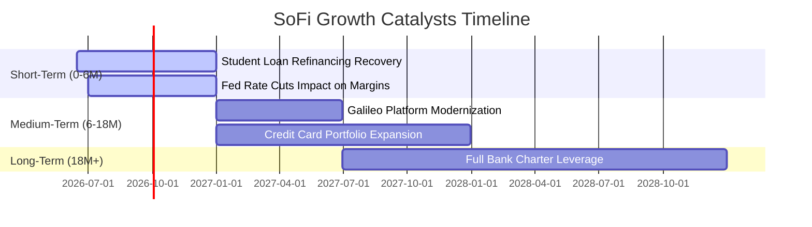

### 8.2 TAM 市場規模分析

SoFi 面臨著巨大的可定址市場（Total Addressable Market, TAM）：
* **美國消費金融借貸 TAM**：約 **$1.8萬億美元**。SoFi 目前貸出餘額為 $40.79B，滲透率僅 **2.