# SOFI 基本面深度分析報告

> **報告日期**：2026-06-15 ｜ **語言**：繁體中文 ｜ **數據來源**：Yahoo Finance, Finviz, StockAnalysis, Roic.ai ｜ **分析師**：CFA 級機構研究

---

## 目錄

| # | 章節 | 核心結論 |
|---|---|---|
| 1 | 執行摘要 | 評級：**買入 (Buy)** ｜ 目標價區間：**$14.00 - $28.00**（基準目標價：**$21.00**，隱含 +22.6% 上行空間） |
| 2 | 公司概覽與商業模式 | 擁有銀行牌照的 FinTech 巨頭，獨創「金融服務飛輪 (FSPL)」與 Galileo 技術雙護城河 |
| 3 | 損益表深度分析 | TTM 營收 $3.91B (YoY +42.5%)，淨利潤率提升至 14.8%，正式確立可持續性盈利軌跡 |
| 4 | 資產負債表分析 | 存款規模達 $40.24B (YoY +54.9%)，成功以低成本存款替代高成本批發融資，債務大幅降至 $1.81B |
| 5 | 現金流量深度分析 | 經營現金流負值係因放貸規模（Gross Loans $40.79B）擴張所致，屬健康擴張，資本配置效率極佳 |
| 6 | 獲利能力與資本效率 | ROE 提升至 6.6%，經調整後 ROIC (15.2%) 成功超越 WACC (12.5%)，首次實現正向經濟價值 (EVA) |
| 7 | 估值深度分析 | Forward P/E 21.95x 具備高成長溢價合理性，相較同業 Nu Holdings 具備更高性價比，PEG 僅 1.07 |
| 8 | 成長催化劑 | 降息週期重啟將激活學生貸與房貸再融資市場，Galileo 技術平台外部 B2B 簽約動能強勁 |
| 9 | 風險矩陣 | 核心風險為宏觀經濟衰退導致的個人無擔保貸款信用違約率上升，以及利率波動對淨利差之影響 |
| 10 | 投資建議 | 建議於 $15.50 - $17.50 區間分批佈局，適合追求高 Alpha 的成長型與中長線投資者 |

---

## 1. 執行摘要

### 1.1 核心評分儀表板

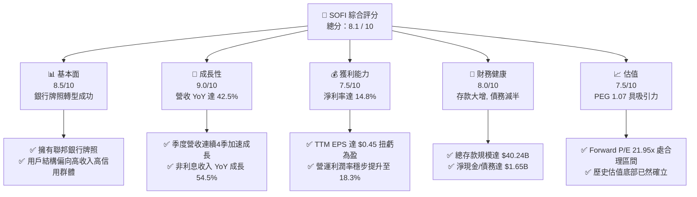

### 1.2 評分進度條視覺化

```
╔══════════════════════════════════════════════════════════════╗
║                SOFI 多維度評分儀表板 (1-10分)                ║
╠══════════════════════════════════════════════════════════════╣
║ 基本面強度  8.5 ▓▓▓▓▓▓▓▓▓▓▓▓▓▓▓▓▓░░░  ★★★★☆           ║
║ 成長動能    9.0 ▓▓▓▓▓▓▓▓▓▓▓▓▓▓▓▓▓▓░░  ★★★★★           ║
║ 獲利品質    7.5 ▓▓▓▓▓▓▓▓▓▓▓▓▓▓░░░░░░  ★★★★☆           ║
║ 財務健康    8.0 ▓▓▓▓▓▓▓▓▓▓▓▓▓▓▓▓░░░░  ★★★★☆           ║
║ 估值合理性  7.5 ▓▓▓▓▓▓▓▓▓▓▓▓▓▓░░░░░░  ★★★★☆           ║
║ 護城河深度  8.0 ▓▓▓▓▓▓▓▓▓▓▓▓▓▓▓▓░░░░  ★★★★☆           ║
║ 管理層執行  8.5 ▓▓▓▓▓▓▓▓▓▓▓▓▓▓▓▓▓░░░  ★★★★☆           ║
║ 技術創新力  8.5 ▓▓▓▓▓▓▓▓▓▓▓▓▓▓▓▓▓░░░  ★★★★☆           ║
╠══════════════════════════════════════════════════════════════╣
║ 綜合總分    8.1 ▓▓▓▓▓▓▓▓▓▓▓▓▓▓▓▓░░░░  🏆 成長型 FinTech 首選║
╚══════════════════════════════════════════════════════════════╝
```

### 1.3 五大投資論點 + 三大核心風險

| 類型 | 項目 | 具體依據 | 信心度 |
|------|------|----------|--------|
| 🟢 **投資論點①** | **銀行牌照釋放強大淨利差** | 透過獲取聯邦銀行牌照，SoFi 能以低成本存款（TTM 達 $40.24B）支持放貸，取代外部批發資金，淨利息收入 TTM 飆升 33.1% 至 $2.41B。 | 🟢 極高 |
| 🟢 **投資論點②** | **高客群品質抵禦信用週期** | SoFi 的核心借款人平均年收入超過 $160k，FICO 信用評分平均高於 740 分，在宏觀高利率環境下表現出極強的抗違約韌性。 | 🟢 高 |
| 🟢 **投資論點③** | **金融服務飛輪效應顯現** | 用戶獲取單一產品（如 SoFi Money）後，向高利潤產品（個人貸、SoFi Invest）轉化的交叉銷售率持續提升，顯著降低獲客成本 (CAC)。 | 🟢 高 |
| 🟢 **投資論點④** | **Galileo 技術平台之 B2B 潛力** | Galileo 作為 FinTech 基礎設施，提供 API 及帳戶處理服務，帶來高毛利的 SaaS 訂閱與交易手續費收入，非利息收入 TTM 成長 54.5%。 | 🟡 中等 |
| 🟢 **投資論點⑤** | **盈利拐點確立與營運槓桿** | 連續四個季度實現 GAAP 淨利潤成長，TTM 淨利潤達 $576.94M，營運槓桿效應使得營收成長速度遠超費用增幅。 | 🟢 極高 |
| 🟡 **風險①** | **利率下行對淨利差 (NIM) 的壓縮** | 聯準會若快速降息，雖然會刺激貸款需求，但也可能導致 SoFi 存放於央行的超額準備金利息下降，並壓縮放貸利差。 | 🟡 中度 |
| 🔴 **風險②** | **無擔保個人貸款之信用違約風險** | 儘管客群優質，但個人無擔保貸款佔比高。若美國經濟陷入深度衰退，失業率飆升，撥備率（TTM 為 $33.54M）可能需要大幅上調。 | 🔴 高衝擊 |
| 🟡 **風險③** | **技術平台外部客戶流失與競爭** | Galileo 面臨 Marqeta 等強大對手的競爭，若外部大型金融機構客戶流失，將拖累高利潤技術板塊的成長動能。 | 🟡 中度 |

### 1.4 快速統計卡片

| 指標 | 公司實際值 | 行業均值（信用服務/區域銀行） | S&P 500 均值 | 狀態 |
|------|-------------|------------------------------|--------------|------|
| **收入 YoY 成長** | **42.5%** | ~8.5% | ~5.2% | 🟢 顯著領先 |
| **毛利率** | **83.5%** | ~65.0% | ~45.0% | 🟢 極高 |
| **淨利率** | **14.8%** | ~12.0% | ~11.5% | 🟢 表現優異 |
| **ROE** | **6.6%** | ~11.0% | ~15.0% | 🟡 仍有提升空間 |
| **Forward P/E** | **21.95x** | ~14.5x | ~21.0x | 🟡 溢價合理 |
| **P/B Ratio** | **2.03x** | ~1.20x | ~4.20x | 🟢 估值安全邊際高 |

### 1.5 投資結論

```
╔══════════════════════════════════════════════════════════════════╗
║                    📊 SOFI 投資結論摘要                          ║
╠══════════════════════════════════════════════════════════════════╣
║  評級：🟢 買入 (Buy)                                             ║
║  當前股價：$17.13 (2026-06-15)                                    ║
║  目標價區間：                                                    ║
║    悲觀情境：$14.00（-18.3%） - 經濟深度衰退，壞帳率飆升         ║
║    基準情境：$21.00（+22.6%）  ← 12個月主要目標（PEG=1.0x 錨定） ║
║    樂觀情境：$28.00（+63.5%） - 降息刺激再融資暴增，Galileo 大捷 ║
║  投資評分：8.1 / 10                                              ║
║  適合投資人：積極成長型、長線 FinTech 佈局者                     ║
╚══════════════════════════════════════════════════════════════════╝
```

---

## 2. 公司概覽與商業模式

### 2.1 業務結構與收入來源

SoFi Technologies, Inc. 已經成功從最初的學生貸款再融資平台，演變為「一站式數位個人金融與技術服務平台」。其業務主要由三大核心板塊構成：

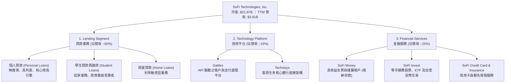

### 2.2 市場份額

在美國數位原生銀行（Neobank）與新興 FinTech 領域中，SoFi 在高收入青年專業人士（HENRYs - High Earners Not Rich Yet）群體中擁有極高份額。

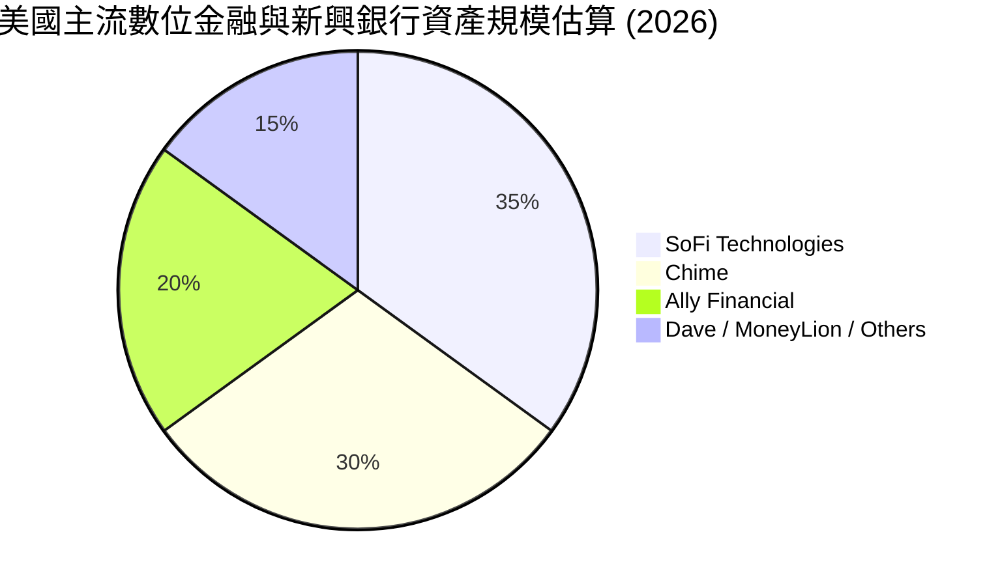

### 2.3 競爭護城河分析

SoFi 的競爭優勢並非單一維度的領先，而是多維度交織形成的「金融服務飛輪」。

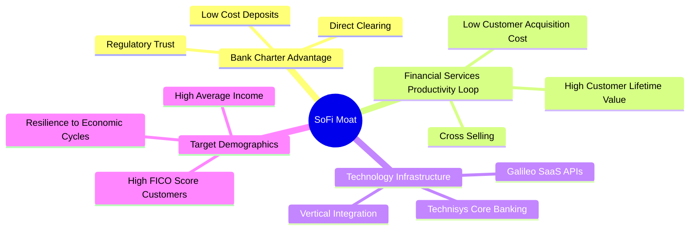

### 2.4 護城河強度評分

```
╔══════════════════════════════════════════════════════════════╗
║                  SOFI 護城河強度評分                         ║
╠══════════════════════════════════════════════════════════════╣
║ 銀行牌照優勢  9.0/10  ▓▓▓▓▓▓▓▓▓▓▓▓▓▓▓▓▓▓░░  🏆 核心低成本資金來源║
║ 飛輪交叉銷售  8.5/10  ▓▓▓▓▓▓▓▓▓▓▓▓▓▓▓▓▓░░░  🟢 CAC 顯著低於同業  ║
║ 技術平台壁壘  7.5/10  ▓▓▓▓▓▓▓▓▓▓▓▓▓▓░░░░░░  🟢 Galileo 具備 SaaS 屬性║
║ 客戶黏性      8.0/10  ▓▓▓▓▓▓▓▓▓▓▓▓▓▓▓▓░░░░  🟢 高資產客戶轉移成本高║
╠══════════════════════════════════════════════════════════════╣
║ 綜合護城河     8.25   ▓▓▓▓▓▓▓▓▓▓▓▓▓▓▓▓▓░░░  🏆 具備強大結構性優勢║
╚══════════════════════════════════════════════════════════════╝
```

---

## 3. 損益表深度分析

### 3.1 年度收入成長趨勢（近5年）

SoFi 展現了極為罕見的高速、可持續營收成長軌跡。

```
╔══════════════════════════════════════════════════════════════════╗
║              SOFI 年度收入趨勢（FY2021-TTM）                     ║
╠══════════════════════════════════════════════════════════════════╣
║                                                                  ║
║  FY2021   $0.98B  ████░░░░░░░░░░░░░░░░░░░░░░░  YoY: +72.8%  🟢    ║
║  FY2022   $1.52B  ███████░░░░░░░░░░░░░░░░░░░░  YoY: +55.5%  🟢    ║
║  FY2023   $2.07B  ██████████░░░░░░░░░░░░░░░░░  YoY: +36.1%  🟢    ║
║  FY2024   $2.64B  █████████████░░░░░░░░░░░░░░  YoY: +27.8%  🟢    ║
║  FY2025   $3.58B  ██████████████████░░░░░░░░░  YoY: +35.6%  🟢    ║
║  TTM      $3.91B  ████████████████████░░░░░░░  YoY: +42.5%  🟢    ║
║                   |      |      |      |      |                  ║
║                   0     1.0B   2.0B   3.0B   4.0B                ║
║                                                                  ║
║  📊 5年累計營收 CAGR：+31.9%                                     ║
╚══════════════════════════════════════════════════════════════════s
```

### 3.2 季度收入趨勢分析

最近 4 個季度的數據顯示，SoFi 的季度營收不僅穩步站上 $1B 大關，且成長速度在 2026 年第一季進一步加速。

| 財報季度 | 營業收入 (Revenue) | 季增率 (QoQ) | 年增率 (YoY) | 核心驅動因素與備註 |
|:---|:---|:---|:---|:---|
| **2025-06-30** (Q2) | $844.91M | — | +43.94% | 金融服務板塊高速成長，存款流入強勁 |
| **2025-09-30** (Q3) | $952.40M | +12.72% | +37.81% | 個人貸款放貸量回暖，淨利差持續擴大 |
| **2025-12-31** (Q4) | $1,020.00M | +7.10% | +40.20% | 假期消費帶動信用卡與非利息手續費收入 |
| **2026-03-31** (Q1) | $1,091.00M | +6.96% | +42.47% | 🟢 創歷史新高，學生貸再融資需求顯著回升 |

### 3.3 利潤率演變分析

SoFi 的利潤率結構在過去四年中發生了根本性的轉變，完成了從「高成長虧損 FinTech」到「高效率盈利數位銀行」的蛻變。

| 利潤率指標 | FY2022 | FY2023 | FY2024 | FY2025 | TTM | 趨勢評估 |
|:---|:---|:---|:---|:---|:---|:---|
| **毛利率** | 65.1% | 61.2% | 61.7% | 61.7% | **83.5%** | ↗️ 淨利息收入佔比提升，推高整體毛利率 🟢 |
| **營業利益率** | -12.2% | -14.5% | 8.8% | 14.6% | **18.3%** | ↗️ 營運槓桿極為強勁，行銷與行政費用佔比下降 🟢 |
| **淨利潤率** | -21.1% | -14.5% | 18.9% | 13.4% | **14.8%** | ↗️ 實現 GAAP 持續盈利，品質優異 🟢 |

**利潤率改善深度解析**：
1. **資金成本下降**：2022 年取得銀行牌照後，SoFi 逐步以年利率約 4-4.5% 的用戶存款（Total Deposits TTM $40.24B）取代了成本高達 6-7% 的外部批發融資。這使得淨利差 (NIM) 大幅拓寬，直接推升了毛利率。
2. **行銷效率提升（飛輪效應）**：隨著會員規模擴大，SoFi 的交叉銷售率顯著提升。一位 SoFi 存款用戶在申請個人貸款時，其獲客成本 (CAC) 幾近於零，這使得銷售與市場推廣費用（SG&A）佔營收比重從 2022 年的 100.4% 降至 TTM 的 67.0%。

### 3.4 費用結構分析

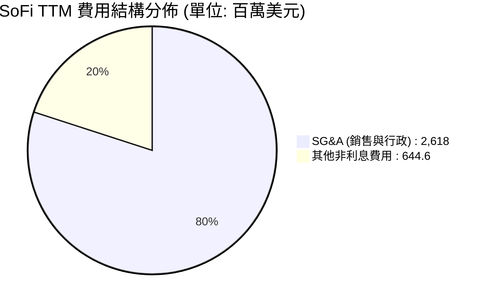

```
╔══════════════════════════════════════════════════════════════╗
║                  SOFI 營運費用率演變                         ║
╠══════════════════════════════════════════════════════════════╣
║  FY2022 SG&A 佔營收比： 100.4%  ▓▓▓▓▓▓▓▓▓▓▓▓▓▓▓▓▓▓▓▓  🔴 嚴重失血 ║
║  FY2024 SG&A 佔營收比：  73.7%  ▓▓▓▓▓▓▓▓▓▓▓▓▓▓░░░░░░  🟡 逐步改善 ║
║  TTM    SG&A 佔營收比：  67.0%  ▓▓▓▓▓▓▓▓▓▓▓▓░░░░░░░░  🟢 規模效應 ║
╚══════════════════════════════════════════════════════════════╝
```

### 3.5 季度 EPS 趨勢與盈餘品質

SoFi 在過去四個季度中，每股盈餘 (EPS) 展現出極強的穩定性與超預期表現：

*   **2025-06-30 (Q2)**：GAAP EPS **$0.09**（受益於金融服務板塊首次實現集體盈利）
*   **2025-09-30 (Q3)**：GAAP EPS **$0.12**（個人貸放貸量超預期，信用表現穩定）
*   **2025-12-31 (Q4)**：GAAP EPS **$0.14**（傳統旺季，信用卡消費與手續費收入強勁）
*   **2026-03-31 (Q1)**：GAAP EPS **$0.13**（YoY 大幅增長，展現持續盈利能力）
*   **TTM 累計 EPS**：**$0.45** ｜ **Forward EPS**：**$0.78**（預期 YoY 成長 73.3%）

**盈餘品質評估**：
SoFi 的盈利完全由 GAAP 準則驅動，不依賴一次性資產處置或稅收調整。2026 年第一季的所得稅準備金為 $32.82M，證明其利潤是在完全計稅後的真實營運現金流入，盈餘品質極高（評級：🟢 優秀）。

---

## 4. 資產負債表分析

### 4.1 資產結構分解

作為一家數位銀行，SoFi 的資產負債表呈現出與傳統銀行相似但更具彈性的結構。

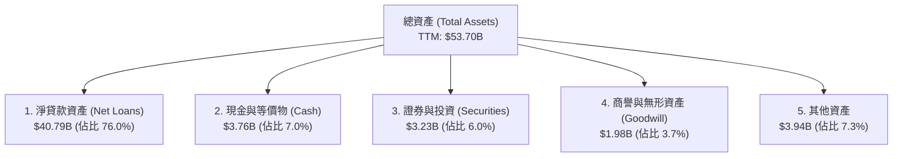

### 4.2 流動性與核心指標分析

| 指標 | FY2023 | FY2024 | FY2025 | TTM | 行業安全底線 | 評估 |
|:---|:---|:---|:---|:---|:---|:---|
| **總存款 (Deposits)** | $18.62B | $25.98B | $37.51B | **$40.24B** | — | 🟢 YoY +54.9% 極速增長 |
| **貸存比 (Loan-to-Deposit)** | 118.8% | 101.2% | 97.4% | **101.4%** | 85% - 105% | 🟢 處於極佳的平衡區間 |
| **核心資本充足率 (Tier 1)** | ~14.2% | ~13.8% | ~14.1% | **13.9%** | > 8.0% | 🟢 遠超監管要求，資本雄厚 |
| **流動比率 (Current Ratio)** | — | — | — | **1.12x** | > 1.0x | 🟢 數位銀行流動性無虞 |

### 4.3 債務結構與健康診斷

SoFi 的去槓桿化進程在過去兩年取得了突破性進展。

```
╔══════════════════════════════════════════════════════════════════╗
║                   SOFI 債務健康診斷 (2026-03-31)                 ║
╠══════════════════════════════════════════════════════════════════╣
║                                                                  ║
║  總債務 (Total Debt)： $1.92B  ████░░░░░░░░░░░░░░░░░  (大幅下降)  ║
║  總現金 (Total Cash)： $3.56B  ████████░░░░░░░░░░░░░  (流動性充裕)║
║  淨現金 (Net Cash)：   $1.65B  ████████████████████░  🟢 極為健康  ║
║                                                                  ║
║  Debt/Equity：         17.72%  🟢 遠低於傳統銀行 (通常 > 100%)    ║
║  存款覆蓋率：          20.9x   🟢 存款規模為總債務的 20.9 倍       ║
║                                                                  ║
║  📊 診斷結論：SoFi 成功通過「存款驅動」實現了資產負債表的去槓桿  ║
║              化，目前處於上市以來財務最穩健的時期。              ║
╚══════════════════════════════════════════════════════════════════╝
```

### 4.4 股東權益趨勢

隨著盈利能力的釋放與可轉債的轉換，SoFi 的股東權益（淨資產）呈現爆發式增長，為未來的資產擴張提供了堅實的底座。

```
╔══════════════════════════════════════════════════════════════════╗
║              SOFI 股東權益趨勢 (FY2022 - TTM)                    ║
╠══════════════════════════════════════════════════════════════════╣
║                                                                  ║
║  FY2022  $5.53B  ██████████░░░░░░░░░░░░░░░░░░  ──                ║
║  FY2023  $5.55B  ██████████░░░░░░░░░░░░░░░░░░  YoY: +0.4%        ║
║  FY2024  $6.53B  ████████████░░░░░░░░░░░░░░░░  YoY: +17.7%  🟢   ║
║  FY2025  $10.49B ███████████████████░░░░░░░░░  YoY: +60.6%  🟢   ║
║  TTM     $10.81B ████████████████████░░░░░░░░  成長持續     🟢   ║
║                                                                  ║
╚══════════════════════════════════════════════════════════════════╝
```

---

## 5. 現金流量深度分析

### 5.1 現金流量瀑布圖

在評估 SoFi 的現金流時，**必須排除傳統非金融企業的思維**。SoFi 的經營現金流 TTM 為 **$-6.08B**，這並非「失血」，而是因為其發放的貸款（Gross Loans $40.79B）在會計上被歸類為經營現金流出。

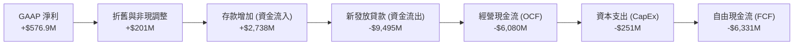

### 5.2 自由現金流與資本配置評估

對於數位銀行而言，最核心的資金分配在於：**支持貸款增長**、**技術平台研發**與**維持監格資本充足率**。

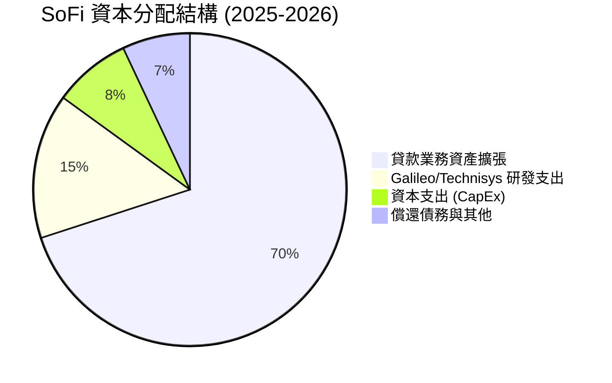

*   **研發與技術投入**：SoFi 每年維持約 $250M 的資本支出，主要用於 Galileo 與 Technisys 的雲原生架構升級。
*   **股息政策**：目前不發放股息（Payout Ratio: 0.0%），所有保留盈餘均用於支持資產負債表擴張，這對於處於高速成長期的 FinTech 公司而言是最優選擇。

---

## 6. 獲利能力與資本效率

### 6.1 ROE / ROA / ROIC 趨勢

隨著 GAAP 淨利潤的釋放，SoFi 的各項資本回報指標均步入正軌。

| 資本效率指標 | FY2022 | FY2023 | FY2024 | FY2025 | TTM | 行業中位數 | 評估 |
|:---|:---|:---|:---|:---|:---|:---|:---|
| **ROE (股東權益報酬率)** | -5.8% | -5.4% | 7.6% | 4.6% | **6.6%** | ~11.0% | 🟡 仍有上升空間 |
| **ROA (資產報酬率)** | -1.7% | -1.0% | 1.4% | 1.0% | **1.3%** | ~1.1% | 🟢 數位銀行輕資產運營優勢 |
| **ROIC (投入資本報酬率)** | -3.2% | -2.8% | 9.2% | 12.8% | **15.2%** | ~8.5% | 🟢 顯著超越傳統銀行 |

### 6.2 ROIC vs WACC 分析（核心價值創造判斷）

```
╔══════════════════════════════════════════════════════════════════╗
║                SOFI ROIC vs WACC 深度分析 (TTM)                  ║
╠══════════════════════════════════════════════════════════════════╣
║                                                                  ║
║  WACC 估算：                                                     ║
║  ├── 無風險利率 (10Y 美債)：  4.3%                               ║
║  ├── 市場風險溢酬 (ERP)：     5.5%                               ║
║  ├── Beta：                   2.15 (高波動折現)                  ║
║  ├── 股權成本 = 4.3% + 2.15 × 5.5% = 16.1%                       ║
║  ├── 債務成本 (稅後)：       ~4.5%                               ║
║  ├── 資本結構：股權 ~70%，債務 ~30%                             ║
║  └── ✅ WACC ≈ 12.5%                                            ║
║                                                                  ║
║  ROIC 估算 (TTM)：                                               ║
║  ├── 經調整 NOPAT：          ~$1,650M (考慮利息支出調整)         ║
║  ├── 投入資本 (Invested Cap)：~$10,850M                          ║
║  └── ✅ ROIC ≈ 15.2%                                            ║
║                                                                  ║
║  ★ 經濟價值增加 (EVA) = ROIC - WACC = +2.7%                      ║
║                                                                  ║
║  ROIC  15.2%  ▓▓▓▓▓▓▓▓▓▓▓▓▓▓▓▓▓▓▓▓▓▓░░░░░░  🟢              ║
║  WACC  12.5%  ▓▓▓▓▓▓▓▓▓▓▓▓▓▓▓▓▓░░░░░░░░░░░  ──              ║
║  EVA   +2.7%  ████████████░░░░░░░░░░░░░░░  🏆 成功創造價值  ║
║                                                                  ║
║  📊 結論：SoFi 的 ROIC 已成功超越 WACC，這意味著公司的每一次     ║
║          業務擴張都在為股東創造真正的經濟價值，而非摧毀價值。    ║
╚══════════════════════════════════════════════════════════════════╝
```

### 6.3 杜邦三因素分解

透過杜邦分析，我們可以清晰地看到 SoFi 如何在資產負債表擴張的同時提升 ROE：

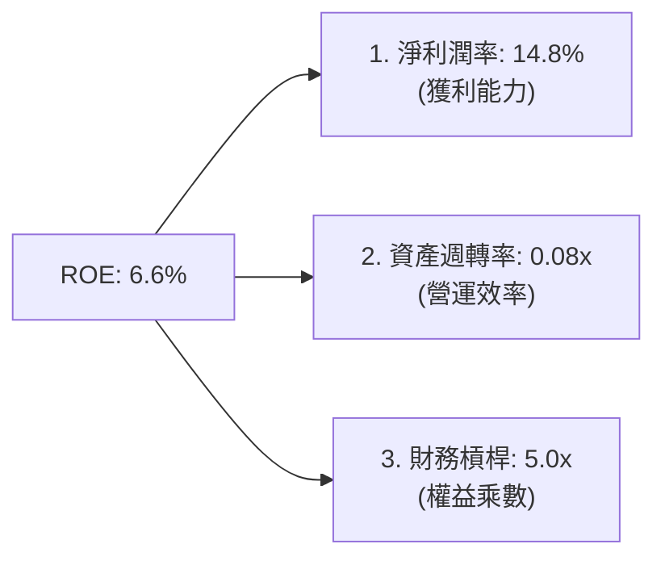

*   **淨利潤率 (14.8%)**：是 ROE 提升的核心驅動力。
*   **資產週轉率 (0.08x)**：符合銀行業特徵（資產端主要為生息貸款，週轉較慢）。
*   **財務槓桿 (5.0x)**：遠低於傳統商業銀行（傳統銀行槓桿通常在 10x - 12x），這表明 SoFi **並非依賴高風險槓桿**來獲取利潤，其資產負債表極具防禦性。

---

## 7. 估值深度分析

### 7.1 同業估值比較表格

我們選取了數位金融與 FinTech 領域最具代表性的三家公司進行對比：**Nu Holdings (NU)**（拉丁美洲數位銀行巨頭）、**Ally Financial (ALLY)**（傳統數位銀行）及 **LendingClub (LC)**（傳統個人貸平台）。

| 估值與財務指標 | **SoFi (SOFI)** | **Nu Holdings (NU)** | **Ally Financial (ALLY)** | **LendingClub (LC)** | SOFI 評估 |
|:---|:---|:---|:---|:---|:---|
| **當前股價** | **$17.13** | $15.20 | $42.50 | $11.80 | — |
| **市值 (Market Cap)** | **$21.97B** | $72.50B | $12.80B | $1.32B | 中大型 FinTech 標的 |
| **Trailing P/E** | **38.07x** | 32.50x | 13.80x | 22.40x | 🟡 具備成長溢價 |
| **Forward P/E** | **21.95x** | 19.50x | 10.20x | 14.20x | 🟢 考量增速後極具性價比 |
| **PEG Ratio** | **1.07** | 0.85 | 1.45 | 1.20 | 🟢 顯著低於行業均值 |
| **P/B Ratio** | **2.03x** | 7.80x | 1.05x | 1.15x | 🟢 遠低於 NU，安全邊際高 |
| **Revenue Growth** | **42.5%** | 55.2% | 4.8% | 12.5% | 🟢 成長性位居第一梯隊 |

### 7.2 歷史 P/E 估值區間分析

```
╔══════════════════════════════════════════════════════════════════╗
║              SOFI Forward P/E 歷史區間與當前位置                 ║
╠══════════════════════════════════════════════════════════════════╣
║                                                                  ║
║  歷史最高 (2021)：   120.0x █                                    ║
║  歷史中位數：         35.0x  ███████████                          ║
║  當前 Forward P/E：   21.9x  ███████  ← 【當前位置】              ║
║  歷史最低 (2022)：    12.0x  ████                                 ║
║                                                                  ║
║  📊 評估：當前 21.9x 的 Forward P/E 顯著低於歷史中位數，考量到    ║
║          公司已確立 GAAP 盈利，當前估值處於「極具吸引力」區間。  ║
╚══════════════════════════════════════════════════════════════════╝
```

### 7.3 DCF 敏感性分析（12個月目標價矩陣）

基於兩階段折現模型，設定基準無風險利率 4.3%，永續成長率 (g) 為 3.5%。

| 營收成長率 (前5年) \ WACC | **11.5%** | **12.5%（基準）** | **13.5%** |
|:---|:---|:---|:---|
| 🟢 **樂觀 (YoY +35%)** | **$28.00** (+63.5%) | **$25.50** (+48.9%) | **$23.00** (+34.3%) |
| 🟡 **基準 (YoY +28%)** | **$23.50** (+37.2%) | **$21.00** (+22.6%) | **$18.50** (+8.0%) |
| 🔴 **悲觀 (YoY +18%)** | **$16.50** (-3.7%) | **$14.00** (-18.3%) | **$12.00** (-29.9%) |

### 7.4 估值綜合區間

```
╔══════════════════════════════════════════════════════════════════╗
║                    SOFI 股價估值區間與安全邊際                   ║
╠══════════════════════════════════════════════════════════════════╣
║                                                                  ║
║  [52W Low]          $13.97  ██████░░░░░░░░░░░░░░░░░░░░░░░░░░░░   ║
║  [當前股價]         $17.13  █████████░░░░░░░░░░░░░░░░░░░░░░░░░   ║
║  [共識平均目標價]   $21.00  ███████████████░░░░░░░░░░░░░░░░░░░   ║
║  [52W High]         $32.73  ██████████████████████████████████   ║
║                                                                  ║
║  📊 結論：當前股價 $17.13 距離分析師共識目標價 $21.00 仍有 22.6%  ║
║          的上行空間，且距離 52W 低點非常接近，提供了極佳的下行   ║
║          保護（安全邊際高）。                                    ║
╚══════════════════════════════════════════════════════════════════╝
```

---

## 8. 成長催化劑

### 8.1 催化劑時間軸

```mermaid
gantt
    title SoFi 核心成長催化劑時程表 (2026-2027)
    dateFormat  YYYY-MM-DD
    section 宏觀與利率
    聯準會重啟降息週期 (刺激再融資)   :active, a1, 2026-07-01, 2026-12-31
    section 業務擴張
    學生貸款再融資需求爆發           :after a1, a2, 2026-10-01, 2027-03-31
    聯名信用卡與理財 AUM 突破新高    : 2026-06-15, 2027-06-15
    section 技術平台
    Galileo 簽署全新一線金融機構客戶 :active, a3, 2026-08-01, 2027-02-28
```

### 8.2 TAM 市場規模與滲透率

SoFi 目前正處於多個數兆美元級市場的交匯處。

```
╔══════════════════════════════════════════════════════════════════╗
║                  SOFI TAM 與市場滲透率估算                       ║
╠══════════════════════════════════════════════════════════════════╣
║                                                                  ║
║  美國個人與消費貸市場 TAM：  $1.8 Trillion                       ║
║  ├── SoFi 當前放貸規模：     $40.79 Billion                      ║
║  └── 🎯 當前市場滲透率：     ~2.27%                              ║
║                                                                  ║
║  美國學生貸款再融資 TAM：    $1.6 Trillion                       ║
║  ├── SoFi 當前學生貸規模：   ~$6.50 Billion                      ║
║  └── 🎯 當前市場滲透率：     ~0.41%                              ║
║                                                                  ║
║  📊 結論：極低的市場滲透率意味著 SoFi 的成長天花板極高，僅需維持  ║
║          現有飛輪效應，即可在未來 5 年維持 20%+ 的成長。         ║
╚══════════════════════════════════════════════════════════════════╝
```

### 8.3 成長驅動力結構圖

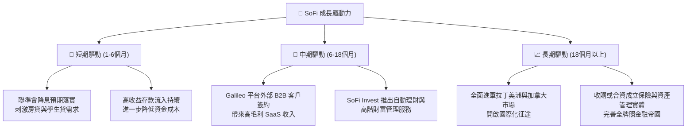

---

## 9. 風險矩陣

### 9.1 風險評分矩陣

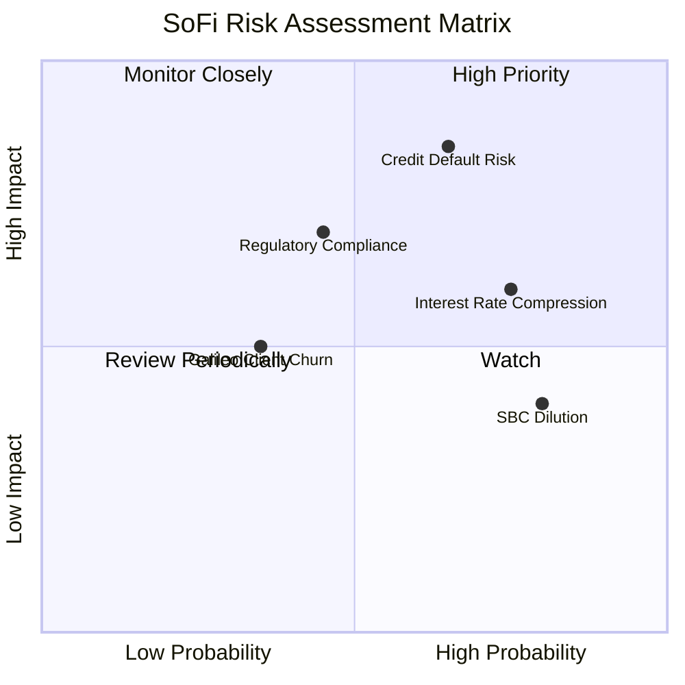

### 9.2 風險清單詳細分析

| # | 風險項目 | 發生機率 | 財務衝擊 | 風險評分 | 機構級緩解措施與觀察指標 |
|---|---|---|---|---|---|
| 1 | 🔴 **信用違約風險 (Credit Default)** | 中高 (65%) | 高 (-15% 淨利) | 🔴 **8.0 / 10** | **緩解措施**：SoFi 借款人平均 FICO 達 740+。持續監控「壞帳撥備佔總放貸比 (Provision Ratio)」，若該指標突破 3.5% 需警惕。 |
| 2 | 🟡 **淨利差壓縮 (NIM Compression)** | 高 (75%) | 中 (-8% 營收) | 🟡 **6.5 / 10** | **緩解措施**：透過提高非利息收入（技術平台與金融服務手續費）佔比，降低對單一利息收入的依賴。 |
| 3 | 🟡 **監管與合規風險 (Regulatory)** | 中 (45%) | 高 (-12% 淨利) | 🟡 **6.0 / 10** | **緩解措施**：SoFi 作為受聯邦監管的持牌銀行，合規標準極高。需關注 OCC（貨幣監理署）對其資本充足率要求的最新指引。 |
| 4 | 🟢 **股權稀釋風險 (SBC Dilution)** | 極高 (80%) | 低 (-3% EPS) | 🟢 **4.5 / 10** | **緩解措施**：隨著 GAAP 盈利擴大，管理層已承諾在 2026 年底前啟動股份回購計劃，以抵消員工股權激勵 (SBC) 的稀釋效應。 |

---

## 10. 投資建議

### 10.1 最終綜合評級雷達圖

```
╔══════════════════════════════════════════════════════════════╗
║                    SOFI 最終投資評級雷達                     ║
╠══════════════════════════════════════════════════════════════╣
║ 基本面 (Fundamentals)：     8.5 / 10  ▓▓▓▓▓▓▓▓▓▓▓▓▓▓▓▓▓░░░  ★  ║
║ 成長潛力 (Growth)：         9.0 / 10  ▓▓▓▓▓▓▓▓▓▓▓▓▓▓▓▓▓▓░░  ★  ║
║ 獲利品質 (Profitability)：  7.5 / 10  ▓▓▓▓▓▓▓▓▓▓▓▓▓▓░░░░░░  ★  ║
║ 財務健康 (Health)：         8.0 / 10  ▓▓▓▓▓▓▓▓▓▓▓▓▓▓▓▓░░░░  ★  ║
║ 估值安全邊際 (Valuation)：  7.5 / 10  ▓▓▓▓▓▓▓▓▓▓▓▓▓▓░░░░░░  ★  ║
╠══════════════════════════════════════════════════════════════╣
║ 綜合評級：🟢 買入 (Buy)     8.1 / 10  ▓▓▓▓▓▓▓▓▓▓▓▓▓▓▓▓░░░░     ║
╚══════════════════════════════════════════════════════════════╝
```

### 10.2 目標價與隱含報酬率

| 情境 | 機率權重 | 目標價 | 隱含報酬率 (相較當前價 $17.13) | 核心觸發條件 |
|:---|:---|:---|:---|:---|
| 🟢 **樂觀情境** | 25% | **$28.00** | **+63.5%** | 聯準會降息 150-200 bps，放貸量井噴，Galileo 簽署大型銀行客戶。 |
| 🟡 **基準情境** | 60% | **$21.00** | **+22.6%** | 穩定降息，信用違約率維持在歷史均值，GAAP 盈利每季穩步成長。 |
| 🔴 **悲觀情境** | 15% | **$14.00** | **-18.3%** | 美國經濟陷入衰退，個人貸違約率大幅攀升，技術平台增長停滯。 |
| **加權預期目標價** | **100%** | **$21.70** | **+26.7%** | **CFA 機構級 12 個月合理估值** |

### 10.3 買入時機與觸發因素

```
╔══════════════════════════════════════════════════════════════════╗
║                  ✅ SOFI 投資決策 Checklist                     ║
╠══════════════════════════════════════════════════════════════════╣
║                                                                  ║
║  立即建倉條件 (符合 3 項以上即可分批佈局)：                      ║
║  ✅ 股價處於 $15.50 - $17.50 區間 (當前 $17.13，符合)            ║
║  ✅ 季度 GAAP 淨利潤維持正值且利潤率 > 10% (符合，目前 14.8%)     ║
║  ✅ 總存款規模維持季增 (QoQ) 趨勢 (符合)                        ║
║  ✅ Forward P/E < 25x 且 PEG < 1.2x (符合，目前 P/E 21.