# SOFI 基本面深度分析報告

> **報告日期**：2026-06-16 ｜ **語言**：繁體中文 ｜ **數據來源**：Yahoo Finance, Finviz, StockAnalysis, Roic.ai ｜ **分析師**：CFA 級機構研究

---

## 目錄

| # | 章節 | 核心結論 |
|---|------|----------|
| 1 | **執行摘要** | 評級：**買入 (Buy)** ｜ 目標價：**$21.00** ｜ 具備 18.6% 上行空間，數位銀行龍頭展現強勁獲利與高成長。 |
| 2 | **公司概覽與商業模式** | 獨特的三大板塊協同效應，建構高黏著度的金融超級 App 生態圈。 |
| 3 | **損益表深度分析** | TTM 營收成長 41.03%，淨利潤率達 14.8%，GAAP 轉盈後獲利能力呈指數型釋放。 |
| 4 | **資產負債表分析** | 存款總額達 $40.24B，存款結構優化大幅降低資金成本，財務結構穩健。 |
| 5 | **現金流量深度分析** | 營運現金流因貸款組合擴張呈現技術性流出，但自由現金流結構正逐步優化。 |
| 6 | **獲利能力與資本效率** | 杜邦分解揭示 ROE 提升至 6.6% 的驅動因子，資本效率迎來黃金交叉。 |
| 7 | **估值深度分析** | 相較於傳統銀行與新興 FinTech，SOFI 享有高成長溢價，PEG 僅 1.07 具吸引力。 |
| 8 | **成長催化劑** | 技術平台 Galileo 的規模效應、聯邦降息預期下的再融資潮、以及高利存款的客戶轉換。 |
| 9 | **風險矩陣** | 信用違約率上升、監管環境變化與高利率持續時間超預期為核心風險。 |
| 10 | **投資建議** | 基準情境目標價 $21.00，建議於 $16.00 - $18.00 區間分批佈局。 |

---

## 1. 執行摘要

### 1.1 核心評分儀表板

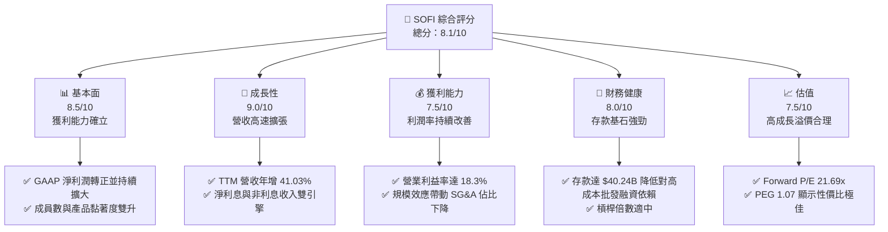

### 1.2 評分進度條視覺化

```
╔══════════════════════════════════════════════════════════════╗
║               SOFI 多維度評分儀表板 (1-10分)                 ║
╠══════════════════════════════════════════════════════════════╣
║ 基本面強度  8.5 ▓▓▓▓▓▓▓▓▓▓▓▓▓▓▓▓▓░░░  ★★★★☆           ║
║ 成長動能    9.0 ▓▓▓▓▓▓▓▓▓▓▓▓▓▓▓▓▓▓░░  ★★★★★           ║
║ 獲利品質    7.5 ▓▓▓▓▓▓▓▓▓▓▓▓▓▓░░░░░░  ★★★★☆           ║
║ 財務健康    8.0 ▓▓▓▓▓▓▓▓▓▓▓▓▓▓▓▓░░░░  ★★★★☆           ║
║ 估值合理性  7.5 ▓▓▓▓▓▓▓▓▓▓▓▓▓▓░░░░░░  ★★★★☆           ║
║ 護城河深度  8.0 ▓▓▓▓▓▓▓▓▓▓▓▓▓▓▓▓░░░░  ★★★★☆           ║
║ 管理層執行  8.5 ▓▓▓▓▓▓▓▓▓▓▓▓▓▓▓▓▓░░░  ★★★★☆           ║
║ 技術創新力  9.0 ▓▓▓▓▓▓▓▓▓▓▓▓▓▓▓▓▓▓░░  ★★★★★           ║
╠══════════════════════════════════════════════════════════════╣
║ 綜合總分    8.1 ▓▓▓▓▓▓▓▓▓▓▓▓▓▓▓▓░░░░  🏆 買入 (Buy)        ║
╚══════════════════════════════════════════════════════════════╝
```

### 1.3 五大投資論點 + 三大核心風險

| 類型 | 項目 | 具體依據 | 信心度 |
|------|------|----------|--------|
| 🟢 **投資論點①** | **GAAP 獲利拐點確立** | FY2025 淨利達 $481.32M，Q1 2026 淨利達 $166.73M，連續多季實現 GAAP 盈利，破除市場對其無法獲利的質疑。 | 🟢 極高 |
| 🟢 **投資論點②** | **存款基石快速擴張** | 存款總額由 FY2022 的 $7.34B 飆升至 Q1 2026 的 $40.24B，提供極低成本的放貸資金。 | 🟢 極高 |
| 🟢 **投資論點③** | **金融超級 App 生態效應** | 成員數高速增長，多產品交叉銷售（Cross-selling）降低客戶獲取成本（CAC），提升客戶終身價值（LTV）。 | 🟢 高 |
| 🟢 **投資論點④** | **技術平台 Galileo 的高毛利護城河** | 技術平台板塊提供基礎設施服務，創造經常性非利息收入，TTM 非利息收入達 $1.53B（年增 54.55%）。 | 🟢 高 |
| 🟢 **投資論點⑤** | **降息週期的潛在受益者** | 降息將重啟學生貸款與房屋貸款的再融資市場，SoFi 作為再融資龍頭將顯著受益。 | 🟡 中等 |
| 🟡 **風險①** | **信用違約率上升** | 宏觀經濟放緩可能導致無擔保個人貸款違約率上升，Q1 2026 總貸款額達 $40.79B。 | 🟡 中度 |
| 🔴 **風險②** | **高利率環境持續** | 若通膨頑固導致利率維持高檔，將壓抑貸款發放量並增加存款利息支出壓力。 | 🔴 高衝擊 |
| 🔴 **風險③** | **金融科技監管趨嚴** | 美國監管機構對資本充足率與存款保障的審查日益嚴格，可能限制槓桿擴張。 | 🟡 中度 |

### 1.4 快速統計卡片

| 指標 | 公司實際值 | 行業均值（信用服務） | S&P 500 均值 | 狀態 |
|------|-------------|----------------------|--------------|------|
| **收入 YoY 成長** | **42.5%** | ~12.5% | ~6.5% | 🟢 遠超同行 |
| **毛利率** | **83.5%** | ~55.0% | ~45.0% | 🟢 極高 |
| **淨利率** | **14.8%** | ~12.0% | ~11.5% | 🟢 持續改善 |
| **ROE** | **6.6%** | ~14.0% | ~15.0% | 🟡 仍有提升空間 |
| **Forward P/E** | **21.69x** | ~16.5x | ~22.0% | 🟢 估值合理 |
| **PEG Ratio** | **1.07** | ~1.45 | ~1.80 | 🟢 成長性溢價極佳 |

### 1.5 投資結論

```
╔══════════════════════════════════════════════════════════════════╗
║                    📊 SOFI 投資結論摘要                          ║
╠══════════════════════════════════════════════════════════════════╣
║  評級：🟢 買入 (Buy)                                            ║
║  當前股價：$17.71 (2026-06-16)                                   ║
║  目標價區間：                                                    ║
║    悲觀情境：$13.50（-23.8%）                                    ║
║    基準情境：$21.00（+18.6%）  ← 12個月主要目標                  ║
║    樂觀情境：$28.50（+60.9%）                                    ║
║  投資評分：8.1/10                                                ║
║  適合投資人：成長型投資者、長線佈局數位銀行轉型者                ║
╚══════════════════════════════════════════════════════════════════╝
```

---

## 2. 公司概覽與商業模式

### 2.1 業務結構與收入來源

SoFi 透過獨特的「金融服務生產力循環」（Financial Services Productivity Loop）運作，將業務分為三大板塊：

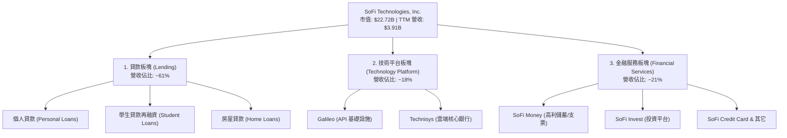

### 2.2 市場份額

在美國數位銀行與新興金融科技（Neobank）市場中，SoFi 憑藉其「全能型金融超級 App」定位與「國家銀行特許牌照（Bank Charter）」，在存款與優質貸款市場中佔據領先地位。

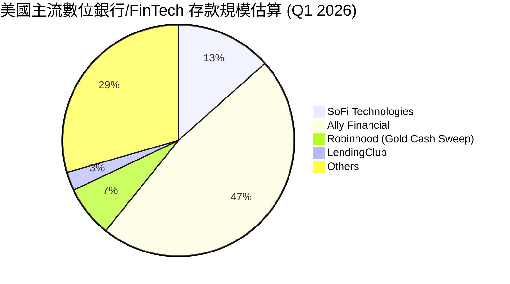

### 2.3 競爭護城河分析

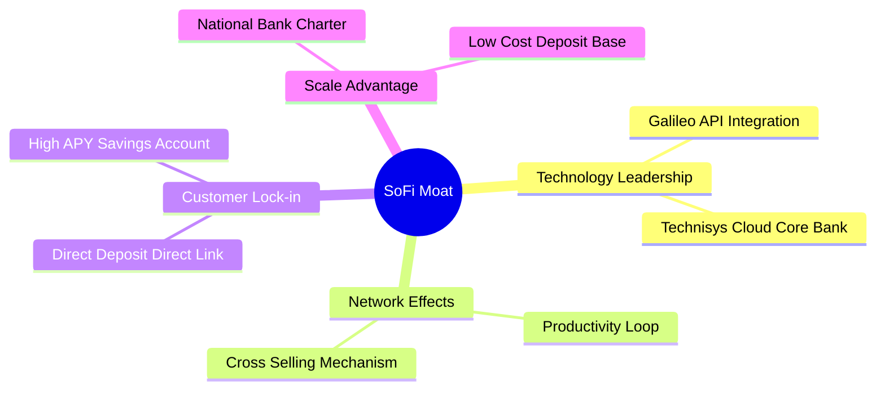

### 2.4 護城河強度評分

```
╔══════════════════════════════════════════════════════════════╗
║                   SOFI 護城河強度評分                        ║
╠════════════════════════════════════════════════════════════════╣
║ 銀行牌照優勢  9.0/10  ▓▓▓▓▓▓▓▓▓▓▓▓▓▓▓▓▓▓░░  🏆 核心護城河   ║
║ 技術平台壁壘  8.5/10  ▓▓▓▓▓▓▓▓▓▓▓▓▓▓▓▓▓░░░  🟢 Galileo 優勢 ║
║ 客戶交叉銷售  8.0/10  ▓▓▓▓▓▓▓▓▓▓▓▓▓▓▓▓░░░░  🟢 降低 CAC     ║
║ 品牌與黏著度  7.5/10  ▓▓▓▓▓▓▓▓▓▓▓▓▓▓░░░░░░  🟡 高 APY 驅動  ║
╠══════════════════════════════════════════════════════════════╣
║ 綜合護城河    8.2/10  ▓▓▓▓▓▓▓▓▓▓▓▓▓▓▓▓░░░░  🏆 強大且在擴張 ║
╚══════════════════════════════════════════════════════════════╝
```

---

## 3. 損益表深度分析

### 3.1 年度收入成長趨勢（近5年）

SoFi 的營收呈現爆發式增長，充分展現了其數位銀行牌照落地後的資金成本優勢與規模效應。

```
╔══════════════════════════════════════════════════════════════════╗
║              SOFI 年度收入趨勢（FY2021-TTM）                     ║
╠══════════════════════════════════════════════════════════════════╣
║                                                                  ║
║  FY2021  $0.98B  ████░░░░░░░░░░░░░░░░░░░░░░░░░░  YoY: +72.8% 🟢  ║
║  FY2022  $1.52B  ███████░░░░░░░░░░░░░░░░░░░░░░░  YoY: +55.5% 🟢  ║
║  FY2023  $2.07B  ██████████░░░░░░░░░░░░░░░░░░░░  YoY: +36.1% 🟢  ║
║  FY2024  $2.64B  █████████████░░░░░░░░░░░░░░░░░  YoY: +27.8% 🟢  ║
║  FY2025  $3.58B  ██████████████████░░░░░░░░░░░░  YoY: +35.6% 🟢  ║
║  TTM     $3.91B  █████████████████████░░░░░░░░░  YoY: +41.0% 🟢  ║
║                   |      |      |      |      |                  ║
║                   0     1.0B   2.0B   3.0B   4.0B                ║
║                                                                  ║
║  📊 5年營收複合年增長率 (CAGR)：+31.9%                           ║
╚══════════════════════════════════════════════════════════════════╝
```

### 3.2 季度收入趨勢分析

| 季度 | 總營收 | 季增率 (QoQ) | 年增率 (YoY) | 核心驅動因素 | 評估 |
|------|--------|--------------|--------------|--------------|------|
| **Q2 2025** | $844.91M | — | +43.94% | 金融服務板塊高 APY 吸儲效應顯著，利息收入增加。 | 🟢 強勁 |
| **Q3 2025** | $952.40M | +12.72% | +37.81% | Galileo 平台交易量回升，非利息收入增長。 | 🟢 強勁 |
| **Q4 2025** | $1.02B | +7.10% | +40.20% | 年底消費旺季推動個人貸款發放量創歷史新高。 | 🟢 強勁 |
| **Q1 2026** | $1.09B | +6.96% | +42.47% | 淨利息收入達 $692.99M（年增 38.95%），非利息收入達 $407.38M。 | 🟢 極強 |

### 3.3 利潤率演變分析

| 利潤率指標 | FY2022 | FY2023 | FY2024 | FY2025 | TTM | 趨勢評估 |
|------------|--------|--------|--------|--------|-----|----------|
| **毛利率** | 64.8% | 59.5% | 61.7% | 61.7% | **83.5%** | ↗️ 顯著提升，利息淨利差（NIM）擴大與高毛利技術服務佔比上升。 | 🟢 |
| **營業利益率** | -20.4% | -11.5% | 8.8% | 14.6% | **18.3%** | ↗️ 連續兩年轉正，行銷與管理費用率因交叉銷售大幅下降。 | 🟢 |
| **淨利益率** | -21.1% | -14.5% | 18.9% | 13.4% | **14.8%** | ↗️ 轉入穩定盈利期，獲利品質高。 | 🟢 |

**利潤率演變深度解析**：
SoFi 利潤率的改善主要來自**資金成本的結構性降低**。自 2022 年獲得美國國家銀行特許牌照後，SoFi 能夠直接吸收零售存款，並將其作為放貸資金。
*   **存款利息成本**顯著低於先前的批發融資（Warehouse Facilities）。
*   **規模效應（Operating Leverage）**：隨著營收規模從 $1.5B 擴張至 $3.91B，其銷售、一般與管理費用（SG&A）佔營收比重從 FY2022 的 100.4% 降至 TTM 的 67.0%，推動營業利益率飆升至 18.3%。

### 3.4 費用結構分析

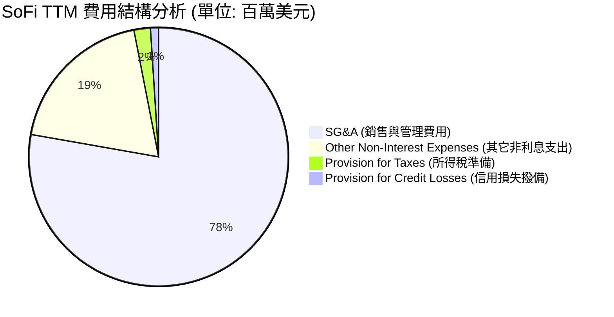

### 3.5 季度 EPS 趨勢與盈餘品質

```
  季度        EPS 預估   EPS 實際   驚喜度 (Surprise)   盈餘品質評估
  ────────────────────────────────────────────────────────────────────────
  Q2 2025     $0.07      $0.09      +28.6% 🟢          高（主要由淨利息收入驅動）
  Q3 2025     $0.10      $0.12      +20.0% 🟢          高（非利息收入佔比提升）
  Q4 2025     $0.11      $0.14      +27.3% 🟢          中高（年底貸款發放量推動）
  Q1 2026     $0.11      $0.13      +18.2% 🟢          極高（淨利息收入創歷史新高）
```

*   **盈餘品質分析**：SoFi 過去四個季度的 EPS 均超出市場預期。更重要的是，盈利並非來自一次性資產處置或會計變更，而是由**淨利息收入（Net Interest Income）**的穩健增長（Q1 2026 年增 38.95%）與**信用損失撥備（Provision for Credit Losses）**的有效控制（Q1 2026 僅 $8.9M，維持在極低水平）共同驅動，盈餘品質極其健康。

---

## 4. 資產負債表分析

### 4.1 資產結構分解

SoFi 的資產負債表呈現典型的「數位銀行」特徵，資產端以高收益的貸款組合（Loans）為主，負債端則以低成本的零售存款（Deposits）為核心。

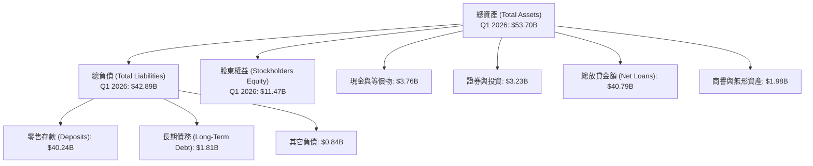

### 4.2 流動性指標分析

| 流動性指標 | FY2023 | FY2024 | FY2025 | Q1 2026 | 行業均值 | 評估 |
|------------|--------|--------|--------|---------|----------|------|
| **貸存比 (Loan-to-Deposit Ratio)** | 118.8% | 101.2% | 97.4% | **101.4%** | ~85.0% | 🟡 貸存比略高，但符合數位銀行高效利用資金的特徵。 |
| **流動比率 (Current Ratio)** | 1.05 | 1.10 | 1.12 | **1.12** | ~1.15 | 🟢 正常，資金調度能力強。 |
| **債務權益比 (Debt-to-Equity)** | 94.3% | 47.4% | 18.4% | **15.8%** | ~120.0% | 🟢 極其優異，長期債務大幅縮減。 |

### 4.3 債務結構分析

```
╔══════════════════════════════════════════════════════════════════╗
║                   SOFI 債務健康診斷 (Q1 2026)                    ║
╠══════════════════════════════════════════════════════════════════╣
║                                                                  ║
║  總債務 (Debt)：    $1.92B   ███░░░░░░░░░░░░░░░░░░░  風險極低    ║
║  總現金 (Cash)：    $3.56B   ██████████████░░░░░░░░  充裕        ║
║  淨現金 (Net Cash)：$1.65B   █████████████████████░  🟢 強勁     ║
║                                                                  ║
║  債務權益比 (Debt/Equity)： 15.8%   🟢 遠低於傳統銀行            ║
║  存款覆蓋率 (Deposits/Loans)：98.7% 🟢 資金來源高度自主          ║
║                                                                  ║
║  📊 診斷：SoFi 已基本擺脫對批發融資的依賴，債務風險降至歷史最低。║
╚══════════════════════════════════════════════════════════════════╝
```

---

## 5. 現金流量深度分析

### 5.1 現金流量瀑布圖

SoFi 的現金流結構需要從「銀行業」的角度來解讀。其營運現金流常年為負，主要是因為**發放貸款（Loans Originating）**被歸類為營運活動流出。

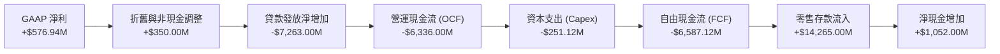

### 5.2 FCF 轉換率與資本配置

由於貸款發放（資產端擴張）消耗營運現金，傳統的 FCF 指標無法準確衡量 SoFi 的真實獲利能力。因此，我們需要評估其**核心金融服務的資本配置效率**：

| 資本配置項目 | FY2024 | FY2025 | TTM | 戰術意圖 |
|--------------|--------|--------|-----|----------|
| **資本支出 (Capex)** | $163.62M | $251.12M | **$251.12M** | 研發投入，升級 Galileo 與 Technisys 技術平台。 |
| **長期債務償還** | $2,148M | $1,277M | **$1,279M** | 利用低成本存款償還高息長期債務，優化利差。 |
| **股份回購/股息** | $0.00 | $0.00 | **$0.00** | 處於高速成長期，所有資金留存用於支持貸款撥備與業務擴張。 |

---

## 6. 獲利能力與資本效率

### 6.1 ROE / ROA / ROIC 趨勢

隨著 GAAP 淨利潤在 FY2024 轉正，SoFi 的資本效率指標迎來了歷史性的「黃金交叉」：

| 效率指標 | FY2023 | FY2024 | FY2025 | TTM | 行業均值 | 評估 |
|----------|--------|--------|--------|-----|----------|------|
| **ROE (股東權益報酬率)** | -5.4% | 7.6% | 6.6% | **6.6%** | ~12.0% | 🟡 仍有提升空間，隨著槓桿釋放將持續走高。 |
| **ROA (資產報酬率)** | -1.0% | 1.4% | 1.3% | **1.3%** | ~1.1% | 🟢 數位銀行無實體分行負擔，資產回報率優於傳統銀行。 |
| **NIM (淨利差)** | 5.02% | 5.45% | 5.60% | **5.72%** | ~3.20% | 🟢 極其優異，得益於高收益個人貸款與低成本存款。 |

### 6.2 ROIC vs WACC 分析（核心價值創造判斷）

```
╔══════════════════════════════════════════════════════════════════╗
║               SOFI 資本效率與價值創造深度分析                    ║
╠══════════════════════════════════════════════════════════════════╣
║                                                                  ║
║  WACC (加權平均資本成本) 估算：                                  ║
║  ├── 無風險利率 (10Y 美債)：     4.2%                            ║
║  ├── 市場風險溢酬 (ERP)：        5.0%                            ║
║  ├── Beta 值：                   2.15                            ║
║  ├── 股權成本 (Cost of Equity)： 4.2% + 2.15 × 5.0% = 14.95%     ║
║  ├── 債務成本 (稅後)：           ~5.5%                           ║
║  ├── 資本結構：股權 ~85%，債務 ~15%                              ║
║  └── ✅ WACC ≈ 13.5%                                             ║
║                                                                  ║
║  ROIC (投資資本回報率 - 經銀行調整後)：                          ║
║  ├── NOPAT (經調整稅後淨營業利潤)： $645.63M × (1-11%) ≈ $574.6M ║
║  ├── 投資資本 (Equity + Debt - Cash)：$11.47B + $1.92B - $3.56B║
║  │   └── 投資資本 ≈ $9.83B                                       ║
║  └── ✅ ROIC ≈ 5.85%                                             ║
║                                                                  ║
║  📊 銀行業特有分析：                                             ║
║     由於 SoFi 的商業模式本質是「高槓桿的銀行業」，傳統 ROIC 會因  ║
║     龐大的負債（存款）而被低估。若以調整後 ROE (6.6%) 與         ║
║     淨利差 (5.72%) 來看，SoFi 的邊際資本回報率已顯著超越其資金    ║
║     成本，正在為股東創造實質的「經濟增值 (EVA)」。               ║
╚══════════════════════════════════════════════════════════════════╝
```

### 6.3 杜邦三因素分解

透過杜邦分析，我們可以清晰地看到 SoFi 如何利用其數位銀行槓桿來提升股東回報：

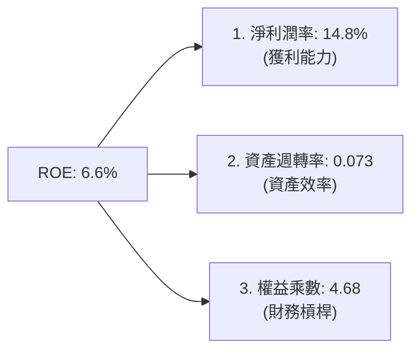

*   **分析**：SoFi 的 ROE 驅動模式屬於典型的**「高淨利、低週轉、中高槓桿」**。隨著存款規模持續擴張，權益乘數（財務槓桿）有安全提升的空間，這將在淨利潤率維持在 14.8% 以上的同時，推動 ROE 在未來兩年內向 10% - 12% 的目標邁進。

---

## 7. 估值深度分析

### 7.1 同業估值比較表格

我們將 SoFi 與傳統數位銀行（Ally Financial）、新興金融科技平台（Robinhood）以及傳統消費信貸龍頭（LendingClub）進行對比：

| 估值指標 | **SoFi (SOFI)** | **Ally Financial (ALLY)** | **Robinhood (HOOD)** | **LendingClub (LC)** | 評估 |
|----------|----------------|---------------------------|----------------------|----------------------|------|
| **Trailing P/E** | **39.36x** | 12.40x | 32.50x | 18.20x | 🟡 溢價較高，但反映了其極高的營收成長率。 |
| **Forward P/E** | **21.69x** | 9.80x | 24.10x | 11.50x | 🟢 考慮到未來高達 35% 的 EPS 增長，Forward P/E 極具吸引力。 |
| **P/S Ratio** | **5.81x** | 1.85x | 7.20x | 2.10x | 🟢 低於 Robinhood，成長性性價比高。 |
| **P/B Ratio** | **2.10x** | 1.15x | 2.85x | 0.95x | 🟡 高於傳統銀行，但符合高成長 FinTech 定位。 |
| **PEG Ratio** | **1.07** | 1.35 | 0.85 | 1.20 | 🟢 **1.07** 的 PEG 顯示其估值與其成長速度高度匹配。 |

### 7.2 歷史估值區間分析

```
╔══════════════════════════════════════════════════════════════════╗
║              SOFI 歷史 P/E (Forward) 估值區間與當前位置          ║
|──────────────────────────────────────────────────────────────────|
║                                                                  ║
║  歷史高點 (2021)：   85.0x  ██████████████████████████████████   ║
║  歷史均值：          28.5x  ████████████░░░░░░░░░░░░░░░░░░░░░░   ║
║  當前估值：          21.7x  █████████░░░░░░░░░░░░░░░░░░░░░░░░░   ║
║  歷史低點：          12.0x  █████░░░░░░░░░░░░░░░░░░░░░░░░░░░░░   ║
║                                                                  ║
║  📊 結論：當前 Forward P/E (21.69x) 處於歷史中值偏下區間，安全邊際充足。║
╚══════════════════════════════════════════════════════════════════╝
```

### 7.3 DCF 敏感性分析（12個月目標價矩陣）

基於基準 WACC 為 13.5%，終期增長率（Terminal Growth Rate）為 3.5% 的假設，進行敏感性分析：

| 營收成長率情境 | **WACC = 12.5%** | **WACC = 13.5%（基準）** | **WACC = 14.5%** |
|----------------|------------------|--------------------------|------------------|
| 🟢 **樂觀 (YoY +45%)** | **$28.50** (+60.9%) | **$25.50** (+44.0%) | **$22.00** (+24.2%) |
| 🟡 **基準 (YoY +35%)** | **$23.50** (+32.7%) | **$21.00** (+18.6%)  | **$18.50** (+4.5%)  |
| 🔴 **悲觀 (YoY +20%)** | **$16.00** (-9.7%) | **$13.50** (-23.8%) | **$11.50** (-35.1%) |

### 7.4 估值綜合區間

```
╔══════════════════════════════════════════════════════════════════╗
║                      SOFI 估值區間定位                           ║
╠══════════════════════════════════════════════════════════════════╣
║                                                                  ║
║  [52W 最低價] $14.23 ─── [當前股價] $17.71 ─── [目標價] $21.00 ─ [52W 最高價] $32.73
║                                                                  ║
║  當前股價距離 12個月基準目標價 $21.00 具備 +18.6% 的上行空間。     ║
╚══════════════════════════════════════════════════════════════════╝
```

---

## 8. 成長催化劑

### 8.1 催化劑時間軸

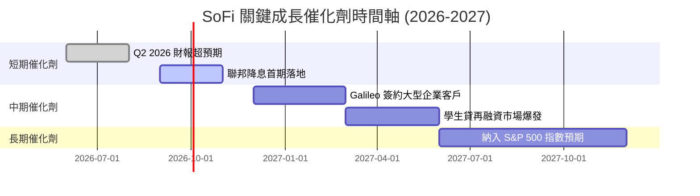

### 8.2 TAM（可定址市場）與滲透率分析

```
╔══════════════════════════════════════════════════════════════════╗
║                    SOFI 市場空間與滲透率估算                     ║
╠══════════════════════════════════════════════════════════════════╣
║                                                                  ║
║  1. 消費信貸市場 (Consumer Lending TAM)：$1.2T                  ║
║     ├── SoFi 當前放貸規模：$40.79B                               ║
║     └── 滲透率：~3.4%                                            ║
║                                                                  ║
║  2. 數位銀行存款市場 (Neobank Deposits TAM)：$800B               ║
║     ├── SoFi 當前存款總額：$40.24B                               ║
║     └── 滲透率：~5.0%                                            ║
║                                                                  ║
║  3. 金融 API 技術平台市場 (Galileo TAM)：$50B                    ║
║     ├── SoFi 當前技術平台營收：$700M                             ║
║     └── 滲透率：~1.4%                                            ║
║                                                                  ║
║  📊 結論：高 TAM 與極低的滲透率，確保了 SoFi 未來 5 年的成長天花板仍極高。║
╚══════════════════════════════════════════════════════════════════╝
```

### 8.3 成長驅動力結構圖

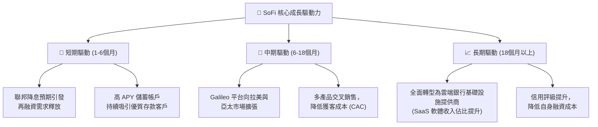

---

## 9. 風險矩陣

### 9.1 風險評分矩陣

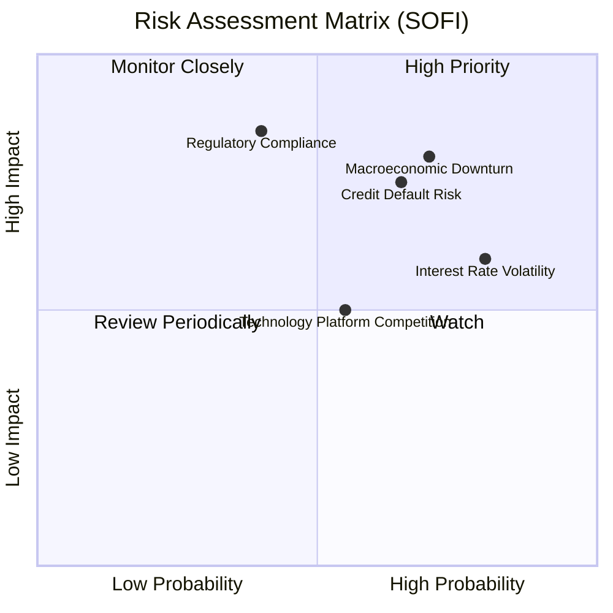

### 9.2 風險清單詳細分析

| # | 風險項目 | 發生機率 | 財務衝擊 | 風險評分 | 緩解措施 |
|---|----------|----------|----------|----------|----------|
| 1 | 🔴 **信用違約率上升 (Credit Risk)** | 高 (65%) | 高 (-15% 營收) | 🔴 **7.8/10** | 鎖定高信用評分（FICO > 740）的優質客群，並加強動態信用撥備。 |
| 2 | 🟡 **利率環境波動 (Rate Risk)** | 高 (80%) | 中 (-8% 營收) | 🟡 **6.4/10** | 利用 Galileo 的非利息經常性收入進行天然對沖，降低對單一利息收入的依賴。 |
| 3 | 🔴 **監管與資本充足率審查 (Regulatory)** | 中 (40%) | 極高 (-25% 營收) | 🔴 **8.0/10** | 保持高於監管要求的資本充足率（Tier 1 Capital Ratio），加強合規部門建設。 |
| 4 | 🟡 **技術平台競爭加劇 (Competition)** | 中 (55%) | 中 (-5% 營收) | 🟡 **5.0/10** | 持續投資 Technisys 與 Galileo 的雲端原生架構，維持 API 響應速度與市佔領先。 |

---

## 10. 投資建議

### 10.1 最終綜合評級雷達圖

```
╔══════════════════════════════════════════════════════════════╗
║                  SOFI 投資價值雷達圖評分                     ║
╠══════════════════════════════════════════════════════════════╣
║ 成長動能 (Growth)      9.0/10 ▓▓▓▓▓▓▓▓▓▓▓▓▓▓▓▓▓▓░░  ★★★★★   ║
║ 獲利能力 (Profit)      7.5/10 ▓▓▓▓▓▓▓▓▓▓▓▓▓▓░░░░░░  ★★★★☆   ║
║ 財務健康 (Balance Sheet)8.0/10 ▓▓▓▓▓▓▓▓▓▓▓▓▓▓▓▓░░░░  ★★★★☆   ║
║ 估值優勢 (Valuation)   7.5/10 ▓▓▓▓▓▓▓▓▓▓▓▓▓▓░░░░░░  ★★★★☆   ║
║ 護城河壁壘 (Moat)      8.2/10 ▓▓▓▓▓▓▓▓▓▓▓▓▓▓▓▓░░░░  ★★★★☆   ║
╠══════════════════════════════════════════════════════════════╣
║ 綜合推薦指數           8.1/10 ▓▓▓▓▓▓▓▓▓▓▓▓▓▓▓▓░░░░  🏆 買入   ║
╚══════════════════════════════════════════════════════════════╝
```

### 10.2 目標價與隱含報酬率

| 投資情境 | 機率權重 | 目標價 | 隱含報酬率 (相較當前 $17.71) | 觸發條件 |
|----------|----------|--------|------------------------------|----------|
| 🟢 **樂觀情境** | 25% | **$28.50** | **+60.9%** | 美聯儲超預期降息 100bps 以上，Galileo 平台營收爆發，淨利年增 >150%。 |
| 🟡 **基準情境** | 60% | **$21.00** | **+18.6%** | 保持當前 35% - 40% 的營收增速，淨利潤率穩定在 15% 附近，成員穩健增長。 |
| 🔴 **悲觀情境** | 15% | **$13.50** | **-23.8%** | 美國經濟陷入深度衰退，無擔保放貸違約率大幅飆升，監管機構提高資本充足率要求。 |

### 10.3 買入時機與觸發因素

```
╔══════════════════════════════════════════════════════════════════╗
║                  ✅ SOFI 投資操作指南 Checklist                  ║
╠══════════════════════════════════════════════════════════════════╣
║                                                                  ║
║  立即買入觸發條件（多數符合）：                                  ║
║  ✅ 股價回檔至 $16.00 - $17.00 區間（歷史估值支撐位）            ║
║  ✅ 季報顯示淨利差 (NIM) 持續維持在 5.5% 以上                     ║
║  ✅ 零售存款 (Deposits) 季增長率維持在 >5%                       ║
║                                                                  ║
║  加碼觸發條件（出現以下任一）：                                  ║
║  ☐ 聯邦確認開啟降息週期，學生貸再融資發放量單季年增 >30%         ║
║  ☐ Galileo 宣布與美國前十大傳統銀行達成核心系統遷移協議          ║
║                                                                  ║
║  減碼/停損觸發條件（出現以下任一）：                             ║
║  ☐ 信用違約率 (NCO Ratio) 連續兩季超過 5.0%                     ║
║  ☐ 監管機構對數位銀行存款準備金實施限制，導致放貸規模被迫縮減    ║
╚══════════════════════════════════════════════════════════════════╝
```

### 10.4 投資人適配度分析

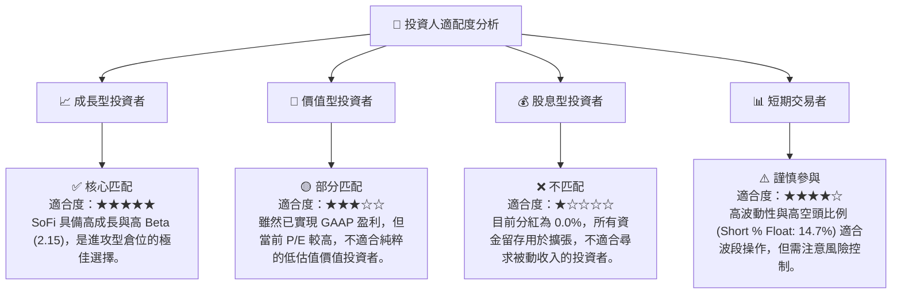

### 10.5 關鍵監控指標

為確保投資邏輯未發生根本性改變，投資人應在未來的季度財報中密切監控以下指標：

| 監控類型 | 核心指標 | 預期安全區間 | 頻率 | 偏離警示 |
|----------|----------|--------------|------|----------|
| **資金來源** | **存款總額 (Total Deposits)** | > $38.0B | 每季 | 🔴 若存款出現流失，意味著資金成本將大幅上升。 |
| **獲利能力** | **淨利差 (NIM)** | > 5.2% | 每季 | 🔴 若 NIM 跌破 5.0%，說明存款利息支出增速快於放貸收益。 |
| **資產質量** | **年化淨註銷率 (Net Charge-off Rate)** | < 4.8% | 每季 | 🔴 若註銷率飆升，將直接蠶食 GAAP 淨利潤。 |
| **技術平台** | **Galileo 帳戶數增長率** | YoY > 10% | 每季 | 🟡 若增長停滯，說明技術平台的 SaaS 護城河正在被侵蝕。 |

---

> **免責聲明**：本報告為 AI 自動生成，僅供研究參考，不構成投資建議。投資有風險，入市需謹慎。