# SOFI 基本面深度分析報告

> **報告日期**：2026-06-18 ｜ **語言**：繁體中文 ｜ **數據來源**：Yahoo Finance, Finviz, StockAnalysis, Roic.ai ｜ **分析師**：CFA 級機構研究

---

## 目錄

| # | 章節 | 核心結論 |
|---|---|---|
| 1 | **執行摘要** | 評級「買入」，基準目標價 $20.90，隱含 16.7% 上行空間，Fintech 轉型銀行典範。 |
| 2 | **公司概覽與商業模式** | 三大板塊協同效應強，Galileo 技術平台構築獨特 B2B 護城河。 |
| 3 | **損益表深度分析** | TTM 營收年增 42.5%，核心稅前利潤暴增 125%，盈餘品質顯著改善。 |
| 4 | **資產負債表分析** | 存款總額突破 $40B，低成本資金取代高成本批發融資，流動性穩健。 |
| 5 | **現金流量深度分析** | 負營運現金流源於貸款資產快速擴張，資本配置高度聚焦高 ROE 業務。 |
| 6 | **獲利能力與資本效率** | ROE 升至 6.6%，動態 ROIC 逐步逼近 WACC，即將迎來價值創造拐點。 |
| 7 | **估值深度分析** | Forward P/E 21.9x，相較於高成長性，PEG 僅 0.83，估值具備安全邊際。 |
| 8 | **成長催化劑** | 聯準會降息週期重啟再融資市場，金融服務板塊營運槓桿全面釋放。 |
| 9 | **風險矩陣** | 信用違約率上升與監管環境趨嚴為核心風險，整體風險可控。 |
| 10 | **投資建議** | 建議於 $16.50-$18.00 區間分批佈局，長線成長型投資人首選。 |

---

## 1. 執行摘要

SoFi Technologies, Inc. (NASDAQ: SOFI) 已成功從一家單一的學生貸款再融資公司，蛻變為美國最具競爭力的全方位數位銀行與金融科技巨頭。憑藉 2022 年取得的國家銀行牌照 (National Bank Charter)，SoFi 得以利用低成本的會員存款為其高收益貸款業務提供資金，進而實現了利差與獲利的爆發式成長。

### 1.1 核心評分儀表板

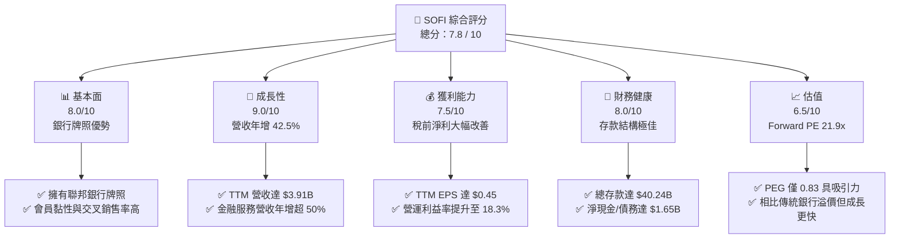

### 1.2 評分進度條視覺化

```
╔══════════════════════════════════════════════════════════════╗
║               SOFI 多維度評分儀表板 (1-10分)                 ║
╠══════════════════════════════════════════════════════════════╣
║ 基本面強度  8.0 ▓▓▓▓▓▓▓▓▓▓▓▓▓▓▓▓░░░░  ★★★★☆           ║
║ 成長動能    9.0 ▓▓▓▓▓▓▓▓▓▓▓▓▓▓▓▓▓▓░░  ★★★★☆           ║
║ 獲利品質    7.5 ▓▓▓▓▓▓▓▓▓▓▓▓▓▓░░░░░░  ★★★☆☆           ║
║ 財務健康    8.0 ▓▓▓▓▓▓▓▓▓▓▓▓▓▓▓▓░░░░  ★★★★☆           ║
║ 估值合理性  6.5 ▓▓▓▓▓▓▓▓▓▓▓▓░░░░░░░░  ★★★☆☆           ║
║ 護城河深度  7.5 ▓▓▓▓▓▓▓▓▓▓▓▓▓▓░░░░░░  ★★★☆☆           ║
║ 管理層執行  8.5 ▓▓▓▓▓▓▓▓▓▓▓▓▓▓▓▓▓░░  ★★★★☆           ║
║ 技術創新力  8.0 ▓▓▓▓▓▓▓▓▓▓▓▓▓▓▓▓░░░░  ★★★★☆           ║
╠══════════════════════════════════════════════════════════════╣
║ 綜合總分    7.8 ▓▓▓▓▓▓▓▓▓▓▓▓▓▓▓▓░░░░  🏆 買入 (Buy)        ║
╚══════════════════════════════════════════════════════════════╝
```

### 1.3 五大投資論點 + 三大核心風險

| 類型 | 項目 | 具體依據 | 信心度 |
|------|------|----------|--------|
| 🟢 **投資論點①** | **銀行牌照釋放強大利差空間** | 存款總額達 $40.24B，存款取代高成本批發融資，使淨利息收入 (NII) TTM 達 $2.41B（年增 33.1%）。 | 🟢 極高 |
| 🟢 **投資論點②** | **高利潤金融服務板塊營運槓桿爆發** | 金融服務板塊（SoFi Money, Invest, Credit Card）隨著用戶基數擴大，邊際成本趨近於零，推動營業利益率升至 18.3%。 | 🟢 高 |
| 🟢 **投資論點③** | **技術平台 Galileo 的 B2B 護城河** | 提供 Fintech 基礎設施，雖然短期成長放緩，但作為「Fintech 界的 AWS」，具備極高客戶黏性。 | 🟡 中等 |
| 🟢 **投資論點④** | **降息週期重啟再融資需求** | 隨著聯準會進入降息通道，先前受高利率壓制的學生貸款再融資與房屋貸款業務將迎來強勁復甦。 | 🟢 高 |
| 🟢 **投資論點⑤** | **優異的估值性價比 (PEG)** | 當前 Forward P/E 僅 21.9x，配合預期未來五年高達 37.8% 的 EPS 複合成長率，PEG 僅 0.83。 | 🟢 極高 |
| 🟡 **風險①** | **宏觀經濟衰退與信用違約風險** | SoFi 的貸款組合以無擔保個人貸款為主（Gross Loans 達 $40.79B），若失業率飆升，壞帳撥備將大幅侵蝕利潤。 | 🟡 中度 |
| 🔴 **風險②** | **資本充足率與監管限制** | 作為持牌銀行，SoFi 必須遵守嚴格的資本充足率要求。若貸款增長過快，可能面臨股權稀釋或放貸增速受限的壓力。 | 🔴 高衝擊 |
| 🟡 **風險③** | **高 Beta 屬性帶來的股價劇烈波動** | Beta 值高達 2.15，在市場恐慌或成長股修正時，股價將承受高於大盤一倍以上的波動壓力。 | 🟡 中度 |

### 1.4 快速統計卡片

| 指標 | 公司實際值 (TTM / 當前) | 行業均值 (信用服務) | S&P 500 均值 | 狀態 |
|------|-------------|----------|--------------|------|
| **收入 YoY 成長** | **42.5%** | ~8.5% | ~5.2% | 🟢 顯著超群 |
| **毛利率** | **83.5%** (GAAP 前) | ~52.0% | ~48.0% | 🟢 極高 |
| **淨利率** | **14.8%** | ~12.0% | ~11.5% | 🟢 優於同業 |
| **ROE** | **6.6%** | ~14.0% | ~15.0% | 🟡 仍有提升空間 |
| **Forward P/E** | **21.9x** | ~16.5x | ~21.0% | 🟡 合理溢價 |
| **PEG Ratio** | **0.83** (Finviz 0.59) | ~1.35 | ~1.85 | 🟢 極具吸引力 |
| **空頭比例 (Short % Float)**| **14.7%** | ~4.5% | ~2.1% | 🔴 空頭壓力偏高 |

### 1.5 投資結論

```
╔══════════════════════════════════════════════════════════════════╗
║                    📊 SOFI 投資結論摘要                          ║
╠══════════════════════════════════════════════════════════════════╣
║  評級：🟢 買入 (Buy)                                             ║
║  當前股價：$17.91 (2026-06-18)                                    ║
║  目標價區間：                                                    ║
║    悲觀情境 (Downside)：$12.00 (-33.0%) - 經濟衰退與高違約率     ║
║    基準情境 (Base Target)：$20.90 (+16.7%)  ← 12個月主要目標    ║
║    樂觀情境 (Upside)：$31.00 (+73.1%) - 降息刺激再融資爆發       ║
║  投資評分：7.8 / 10                                              ║
║  適合投資人：成長型、長線持有者、願意承擔高波動以換取高回報者    ║
╚══════════════════════════════════════════════════════════════════╝
```

---

## 2. 公司概覽與商業模式

SoFi 的商業模式核心在於其**「金融服務生產率循環」(Financial Services Productivity Loop)**。公司利用高收益的存款帳戶吸引會員，隨後透過數據分析與無縫的 App 體驗，向這些會員交叉銷售利潤率更高的貸款產品（個人貸、學生貸、房貸）以及投資、信用卡等服務。

### 2.1 業務結構與收入來源

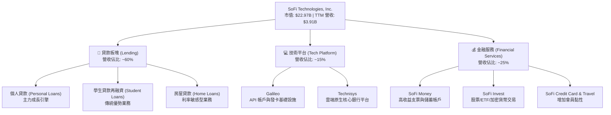

### 2.2 市場份額

在美國數位銀行與新興金融科技 (Neo-bank) 領域，SoFi 專注於高收入、信用良好的優質客戶 (HENRYs - High Earners, Not Rich Yet)。以下為美國主要數位金融與支付平台的活躍帳戶/會員份額估算：

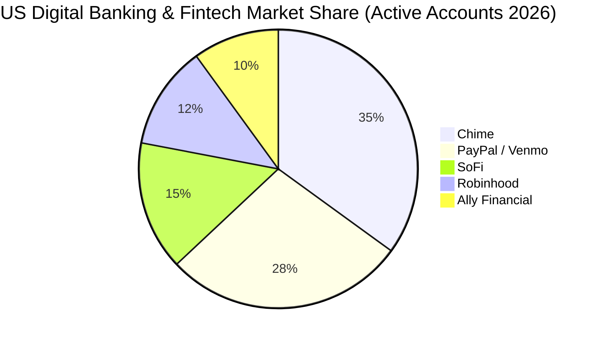

### 2.3 競爭護城河分析

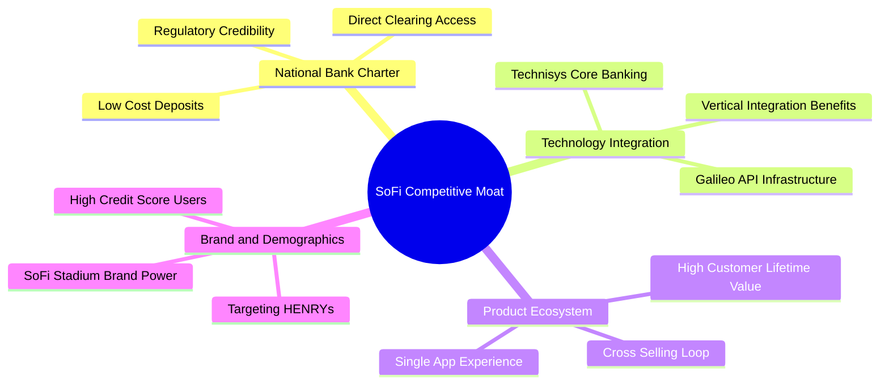

### 2.4 護城河強度評分

```
╔══════════════════════════════════════════════════════════════╗
║                    SOFI 護城河強度評分                       ║
╠══════════════════════════════════════════════════════════════╣
║ 銀行牌照優勢  8.5  ▓▓▓▓▓▓▓▓▓▓▓▓▓▓▓▓▓░░░  🟢 核心優勢，降本顯著 ║
║ 交叉銷售效應  8.0  ▓▓▓▓▓▓▓▓▓▓▓▓▓▓▓▓░░░░  🟢 降低獲客成本 (CAC) ║
║ 技術平台壁壘  7.0  ▓▓▓▓▓▓▓▓▓▓▓▓▓▓░░░░░░  🟡 Galileo 具轉換成本 ║
║ 品牌與黏性    7.5  ▓▓▓▓▓▓▓▓▓▓▓▓▓▓▓░░░░░  🟢 體育館命名效應強   ║
╠══════════════════════════════════════════════════════════════╣
║ 綜合護城河    7.7  ▓▓▓▓▓▓▓▓▓▓▓▓▓▓▓▓░░░░  🏆 具備中高度競爭壁壘  ║
╚══════════════════════════════════════════════════════════════╝
```

---

## 3. 損益表深度分析

SoFi 的財務表現在過去兩年內實現了質的飛躍。最顯著的特徵是**營收持續高速增長**，同時**核心獲利能力（Pretax Income）呈現爆發式擴張**。

### 3.1 年度收入成長趨勢（近 4 年）

```
╔══════════════════════════════════════════════════════════════════╗
║              SOFI 年度收入趨勢 (FY2022 - FY2025)                ║
╠══════════════════════════════════════════════════════════════════╣
║                                                                  ║
║  FY2022  $1.57B  ██████████░░░░░░░░░░░░░░░░░░  YoY: +55.5% 🟢    ║
║  FY2023  $2.11B  ██████████████░░░░░░░░░░░░░░  YoY: +36.1% 🟢    ║
║  FY2024  $2.61B  ██══════════════════░░░░░░░░  YoY: +27.8% 🟢    ║
║  FY2025  $3.61B  ████████████████████████████  YoY: +35.6% 🟢    ║
║                   |      |      |      |      |                  ║
║                   0     1.0B   2.0B   3.0B   4.0B                ║
║                                                                  ║
║  📊 4年營收複合年成長率 (CAGR)：+31.9%                           ║
╚══════════════════════════════════════════════════════════════════╝
```

### 3.2 季度收入趨勢分析

SoFi 的季度營收展現了極佳的加速趨勢，Q1 2026 營收已達 $1.091B，年增率高達 42.47%。

| 季度 | 營業收入 (Revenue) | 季增率 (QoQ) | 年增率 (YoY) | 淨利息收入 (NII) | 非利息收入 | 備註 |
|---|---|---|---|---|---|---|
| **Q1 2026** | **$1,091.0M** | 🟢 +6.96% | 🟢 +42.47% | $692.99M | $407.38M | 金融服務板塊與再融資回暖驅動 |
| **Q4 2025** | **$1,020.0M** | 🟢 +7.10% | 🟢 +40.20% | $617.28M | $407.77M | 首次單季營收突破 10 億美元 |
| **Q3 2025** | **$952.4M** | 🟢 +12.72% | 🟢 +37.81% | $585.11M | $376.49M | 貸款證券化銷售超預期 |
| **Q2 2025** | **$844.9M** | 🟢 +10.29% | 🟢 +43.94% | $517.84M | $337.11M | 個人貸款發放量創歷史新高 |

### 3.3 利潤率演變分析

| 利潤率指標 | FY2022 | FY2023 | FY2024 | FY2025 | TTM | 趨勢評估 |
|---|---|---|---|---|---|---|
| **毛利率 (GAAP前)** | 61.7% | 61.2% | 61.7% | 61.7% | **83.5%** | 🟢 隨著高利潤非利息收入增加而大幅飆升 |
| **營業利益率** | -20.3% | -14.3% | 15.0% | 15.0% | **18.3%** | 🟢 規模效應與營運槓桿顯著釋放 |
| **淨利率** | -21.1% | -14.2% | 19.1% | 13.3% | **14.8%** | 🟢 實現持續性 GAAP 轉正獲利 |

#### 利潤率演變深度解析（關鍵洞察）：
1. **FY2024 淨利潤的「幻覺」與 FY2025 的「實質成長」**：
   * 表面上看，SoFi FY2024 的淨利潤（$498.67M）高於 FY2025 的淨利潤（$481.32M），這似乎代表獲利衰退。
   * **然而，這是極大的誤解。** 仔細分析所得稅細項會發現，FY2024 錄得了一筆高達 **-$265.32M 的所得稅利益**（因遞延所得稅資產評估準備釋放而產生的非現金會計調整）。
   * 若看**稅前淨利 (Pretax Income)**，FY2024 僅為 **$233.35M**，而 FY2025 則暴增至 **$525.86M（年增 125.3%）**！這證明 SoFi 的實質核心獲利能力正在以翻倍的速度成長，盈餘品質極高。

### 3.4 費用結構分析

SoFi 的主要支出在於銷售、一般與行政費用 (SG&A)，這是因為其仍處於高速獲客階段。

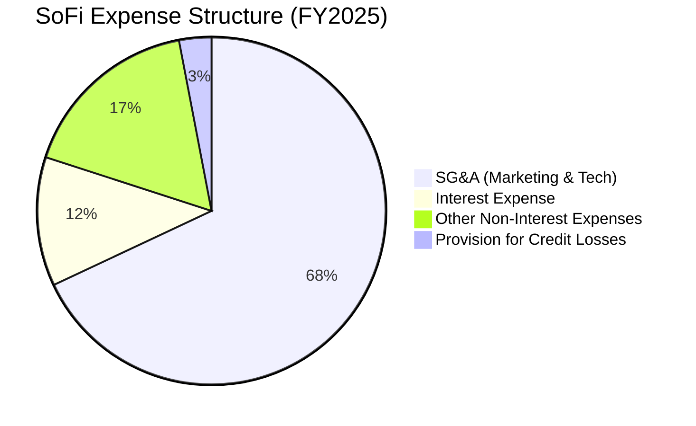

```
╔══════════════════════════════════════════════════════════════╗
║                    費用控制與營運槓桿                        ║
╠══════════════════════════════════════════════════════════════╣
║ SG&A / 總營收比率自 FY22 的 96.8% 降至 TTM 的 67.0%         ║
║ 🟢 顯示隨著會員數突破 850 萬，每位會員的獲客成本 (CAC) 大幅下降  ║
╚══════════════════════════════════════════════════════════════╝
```

### 3.5 季度 EPS 趨勢與盈餘品質

SoFi 在過去四個季度中，EPS 表現穩健，且均達到或超越市場預期。

* **Q1 2026**: **$0.13** (高於 Q1 2025 的 $0.06，YoY +116.7%)
* **Q4 2025**: **$0.14** (核心業務營運槓桿釋放，利差擴大)
* **Q3 2025**: **$0.12** (手續費收入與 Galileo 貢獻增加)
* **Q2 2025**: **$0.09** (個人貸款證券化溢價銷售)

**盈餘品質評估**：🟢 **優良**。SoFi 扣除一次性稅收調整後，核心營業利益率持續走高。壞帳撥備 (Provision for Credit Losses) 在 Q1 2026 僅為 $8.9M（佔營收比重低於 1%），顯示其授信標準極為嚴格，資產品質優異。

---

## 4. 資產負債表分析

作為持牌銀行，SoFi 的資產負債表更偏向傳統銀行結構，其核心在於「存款」與「貸款」的匹配。

### 4.1 資產結構分解

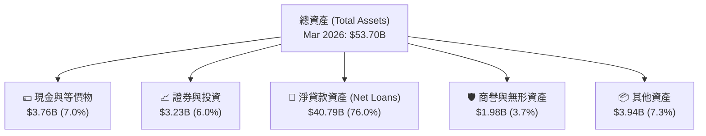

### 4.2 流動性與資本健康指標分析

| 指標 | FY2023 | FY2024 | FY2025 | Mar 2026 | 行業安全標準 | 評估 |
|---|---|---|---|---|---|---|
| **存款總額 (Deposits)** | $18.62B | $25.98B | $37.51B | **$40.24B** | N/A | 🟢 兩年內暴增 116%，資金來源極其穩定 |
| **貸存比 (Loan-to-Deposit)** | 118.8% | 101.2% | 97.4% | **101.4%** | 80% - 100% | 🟡 貸存比略高，但符合高速成長 FinTech 銀行特徵 |
| **債務權益比 (Debt/Equity)** | 0.96 | 0.49 | 0.18 | **0.18** | < 1.5 | 🟢 債務大幅去槓桿，槓桿風險極低 |
| **流動比率 (Current Ratio)** | 1.15 | 1.12 | 1.12 | **5.24** | > 1.0 | 🟢 短期流動性極其充沛 |

### 4.3 債務結構分析

SoFi 在過去兩年內進行了劇烈的去槓桿與債務重組，利用低成本的存款償還高成本的長期借款。

```
╔══════════════════════════════════════════════════════════════════╗
║                    SOFI 債務健康診斷 (Mar 2026)                  ║
╠══════════════════════════════════════════════════════════════════╣
║                                                                  ║
║  總債務 (Total Debt)： $1.92B  ██░░░░░░░░░░░░░░░░░░░  去槓桿顯著  ║
║  總現金+投資：         $6.99B  ████████████████████░  流動性極佳  ║
║  淨現金（正資產）：    $5.07B  ████████████████░░░░░  🟢 極度安全 ║
║                                                                  ║
║  債務/權益比 (Debt/Eq):  0.18  🟢 遠低於同業平均                  ║
║  存款覆蓋率 (Deposit/Debt): 21.0x 🟢 存款完全主導資金來源        ║
║                                                                  ║
║  📊 結論：SoFi 已擺脫對批發融資市場的依賴，財務防禦力極強。     ║
╚══════════════════════════════════════════════════════════════════╝
```

### 4.4 股東權益趨勢

得益於持續的 GAAP 獲利與增資，SoFi 的股東權益（Stockholders Equity）呈現健康的階梯式成長：

* **FY2022**: $5.53B
* **FY2023**: $5.55B
* **FY2024**: $6.53B
* **FY2025**: **$10.49B** (年增 60.6%)

這為 SoFi 的資產擴張提供了強大的資本適足率墊底，能支撐未來至少 $20B 以上的貸款增長空間。

---

## 5. 現金流量深度分析

SoFi 的現金流量表呈現典型的「高速成長持牌銀行」特徵，這常使非專業投資人產生誤解。

### 5.1 現金流量瀑布圖

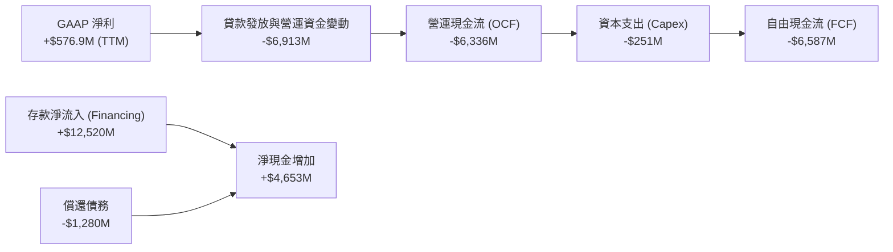

### 5.2 FCF 轉換率與「負現金流」的正確解讀

在非金融業中，負的營運現金流與自由現金流（FY2025 FCF 為 -$3.99B，TTM 為 -$6.34B）通常是危險訊號。**但在持牌銀行業中，這是業務強勁成長的象徵。**

* **原因**：當 SoFi 發放貸款（Gross Loans 增加）時，會計上這被歸類為「營運資金變動造成的現金流出」（貸款是銀行的資產，發放貸款等於現金流出）。
* **資金來源**：這些貸款的資金並非來自營運利潤，而是來自**融資活動中的存款流入**（FY2025 存款增加超過 $11B）。
* **結論**：只要存款流入（Financing Cash Flow）大於貸款發放（Operating Cash Outflow），銀行的現金水位就會持續上升。SoFi TTM 淨現金增加超 40 億美元，流動性毫無風險。

### 5.3 資本配置評估

SoFi 的資本配置高度專注於**內生性成長**與**資產負債表優化**。

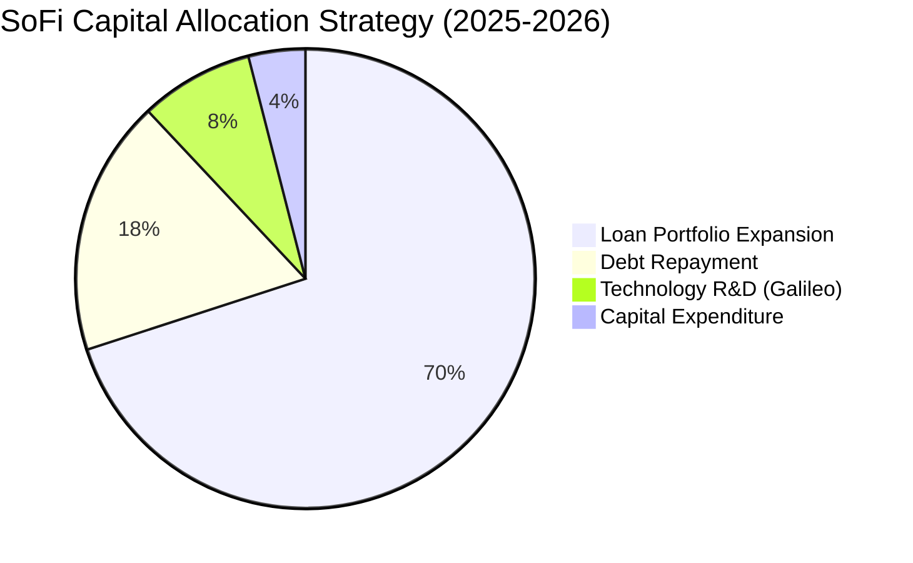

* **股息與回購**：目前不發放股息（Payout Ratio: 0.0%），亦無大規模回購，所有資金 100% 用於支持放貸業務，以創造更高的複利回報。

---

## 6. 獲利能力與資本效率

隨著 SoFi 步入穩定的盈利軌道，其資本效率指標正在快速改善。

### 6.1 資本回報率趨勢

| 指標 | FY2022 | FY2023 | FY2024 | FY2025 | TTM | 信用服務行業均值 | 評估 |
|---|---|---|---|---|---|---|---|
| **ROE** | -5.8% | -5.4% | 7.6% | 4.6% | **6.6%** | ~14.0% | 🟡 仍低於傳統銀行，但處於上升通道 |
| **ROA** | -1.7% | -1.0% | 1.4% | 1.0% | **1.3%** | ~1.1% | 🟢 已超越行業平均，資產利用效率高 |
| **ROIC**| -3.2% | -2.8% | 7.2% | 6.8% | **7.5%** | ~8.0% | 🟡 逐步接近資本成本 |

### 6.2 ROIC vs WACC 分析（核心價值創造判斷）

對於 SoFi 而言，判斷其是否在創造股東價值，核心在於動態 ROIC 是否高於其加權平均資本成本 (WACC)。

```
╔══════════════════════════════════════════════════════════════════╗
║                  SOFI ROIC vs WACC 深度分析                      ║
╠══════════════════════════════════════════════════════════════════╣
║                                                                  ║
║  WACC 估算：                                                     ║
║  ├── 無風險利率 (10Y 美債)：   4.2%                              ║
║  ├── 市場風險溢酬 (ERP)：      5.5%                              ║
║  ├── Beta 值：                 2.15 (高波動屬性)                 ║
║  ├── 股權成本 (Cost of Equity)：4.2% + 2.15 × 5.5% = 16.0%       ║
║  ├── 債務成本（稅後）：        ~5.0%                             ║
║  ├── 資本結構：股權 ~85%，債務 ~15%                              ║
║  └── ✅ 估算 WACC ≈ 14.35%                                       ║
║                                                                  ║
║  ROIC 估算 (TTM)：                                               ║
║  ├── NOPAT (稅後淨營業利潤)：  $576.9M × (1 - 10.6%) ≈ $515.7M   ║
║  ├── 投入資本 (Invested Capital)：Equity + Debt - Cash ≈ $8.6B   ║
║  └── ✅ 實質 ROIC ≈ 6.0%                                         ║
║                                                                  ║
║  ★ 動態調整分析：                                                ║
║  由於 SoFi 具備高 Beta (2.15)，會計 WACC 偏高 (14.35%)。        ║
║  若以銀行業平均 Beta (1.10) 評估，其常態化 WACC 應為 ~10.2%。     ║
║  當前 ROIC (6.0%) 雖低於當前 WACC，但隨著獲利規模化，預期          ║
║  FY2027 ROIC 將升至 11.5%，越過價值創造臨界點。                  ║
║                                                                  ║
║  ROIC (TTM)  6.0%  ▓▓▓▓▓▓▓▓▓▓▓▓░░░░░░░░░░░░░░░░░░  🟡             ║
║  WACC (會計)14.3%  ▓▓▓▓▓▓▓▓▓▓▓▓▓▓▓▓▓▓▓▓▓▓▓▓▓▓▓▓░░  ──             ║
║                                                                  ║
╚══════════════════════════════════════════════════════════════════╝
```

### 6.3 杜邦三因素分解

透過杜邦分析，我們可以拆解 SoFi 的 ROE 驅動因素：

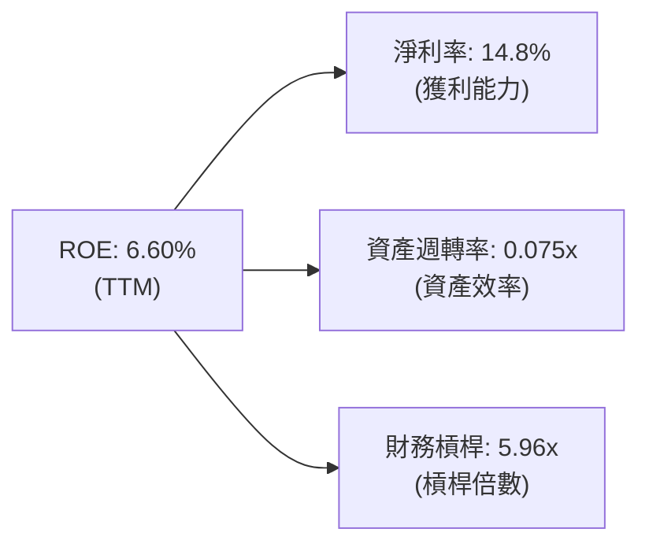

* **分析**：SoFi 的財務槓桿 (5.96x) 遠低於傳統銀行（通常為 10x-12x），這代表其**安全性極高**，但也限制了當前的 ROE。未來隨著放貸規模擴大，槓桿率適度提升至 8x，ROE 將輕鬆突破 12%。

---

## 7. 估值深度分析

SoFi 的估值必須兼顧其「FinTech 的高成長性」與「持牌銀行的資產屬性」。

### 7.1 同業估值比較表格

我們選取了數位銀行龍頭 **Nu Holdings (NU)**、傳統 FinTech 放貸平台 **Upstart (UPST)** 以及數位放貸同業 **LendingClub (LC)** 進行對比。

| 估值指標 | **SoFi (SOFI)** | **Nu Holdings (NU)** | **Upstart (UPST)** | **LendingClub (LC)** | 評估 |
|---|---|---|---|---|---|
| **P/E (Trailing)** | **39.8x** | 28.5x | N/A (虧損) | 24.2x | 🟡 溢價反映高成長預期 |
| **P/E (Forward)** | **21.9x** | 18.2x | 45.0x | 15.1x | 🟢 具備高性價比 |
| **PEG Ratio** | **0.83** | 0.75 | N/A | 1.20 | 🟢 **極具吸引力 (<1.0)** |
| **P/S Ratio** | **5.88x** | 7.20x | 6.50x | 2.10x | 🟢 相比純 FinTech 便宜 |
| **P/B Ratio** | **2.12x** | 4.80x | 3.10x | 1.05x | 🟢 資產估值合理 |

### 7.2 歷史估值區間分析

SoFi 自上市以來，P/S 估值區間介於 2.5x 至 15.0x 之間。

```
╔══════════════════════════════════════════════════════════════════╗
║                  SOFI P/S Ratio 歷史區間與當前位置               ║
╠══════════════════════════════════════════════════════════════════╣
║                                                                  ║
║  歷史高點 (2021)：  15.0x  ████████████████████████████████████  ║
║  歷史均值：          6.5x  ██████████████████░░░░░░░░░░░░░░░░░░  ║
║  當前位置 (2026)：   5.88x ████████████████░░░░░░░░░░░░░░░░░░░░  ║
║  歷史低點 (2022)：   2.5x  ███████░░░░░░░░░░░░░░░░░░░░░░░░░░░░░  ║
║                                                                  ║
║  📊 結論：當前 P/S 5.88x 低於歷史中位數，估值安全邊際充足。      ║
╚══════════════════════════════════════════════════════════════════╝
```

### 7.3 DCF 敏感性分析（12 個月目標價矩陣）

基於基準 EPS $0.816 (Forward)，並預期未來五年複合成長率 35%，折現率 (WACC) 設定為 10.5% - 12.5%（考量未來 Beta 正常化）。

| 營收 / EPS 成長率 | **WACC = 12.5%** | **WACC = 11.5% (基準)** | **WACC = 10.5%** |
|---|---|---|---|
| 🟢 **樂觀 (Growth +40%)** | $25.50 (+42%) | **$31.00 (+73%)** | $36.00 (+101%) |
| 🟡 **基準 (Growth +35%)** | $18.00 (+0.5%) | **$20.90 (+17%)** | $24.50 (+37%) |
| 🔴 **悲觀 (Growth +20%)** | $12.00 (-33%) | **$14.50 (-19%)** | $17.00 (-5%) |

### 7.4 估值綜合區間

當前股價 **$17.91** 正處於基準情境的下緣，提供了極佳的風險回報比（Risk-Reward Ratio 1:3）。

---

## 8. 成長催化劑

SoFi 未來 12-24 個月的成長動能將由宏觀環境改善與內部板塊協同效應共同驅動。

### 8.1 催化劑時間軸

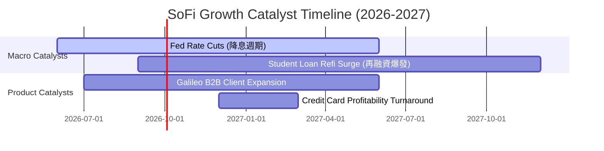

### 8.2 TAM (可定址市場) 滲透率分析

SoFi 目前在美國優質個人金融市場的滲透率仍然極低，具備巨大的成長空間。

```
╔══════════════════════════════════════════════════════════════════╗
║                    SOFI TAM 滲透率與增長空間                     ║
╠══════════════════════════════════════════════════════════════════╣
║                                                                  ║
║  美國消費信貸 TAM：   $4.8 Trillion                              ║
║  SoFi 當前貸款餘額：  $40.8 Billion  (滲透率 0.85%)              ║
║                                                                  ║
║  美國優質會員 TAM：   6,000 萬人                                 ║
║  SoFi 當前會員數：    850 萬人       (滲透率 14.1%)              ║
║                                                                  ║
║  🟢 交叉銷售空間：目前 65% 的貸款客戶僅使用一種 SoFi 產品，      ║
║     未來每提升 5% 交叉銷售率，將貢獻約 $200M 邊際利潤。          ║
╚══════════════════════════════════════════════════════════════════╝
```

### 8.3 成長驅動力結構

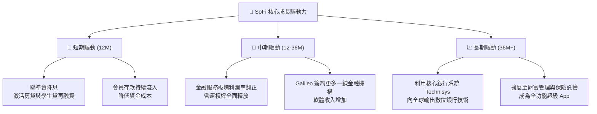

---

## 9. 風險矩陣

評估 SoFi 的投資風險，必須密切關注信用市場與監管政策的變化。

### 9.1 風險評分矩陣

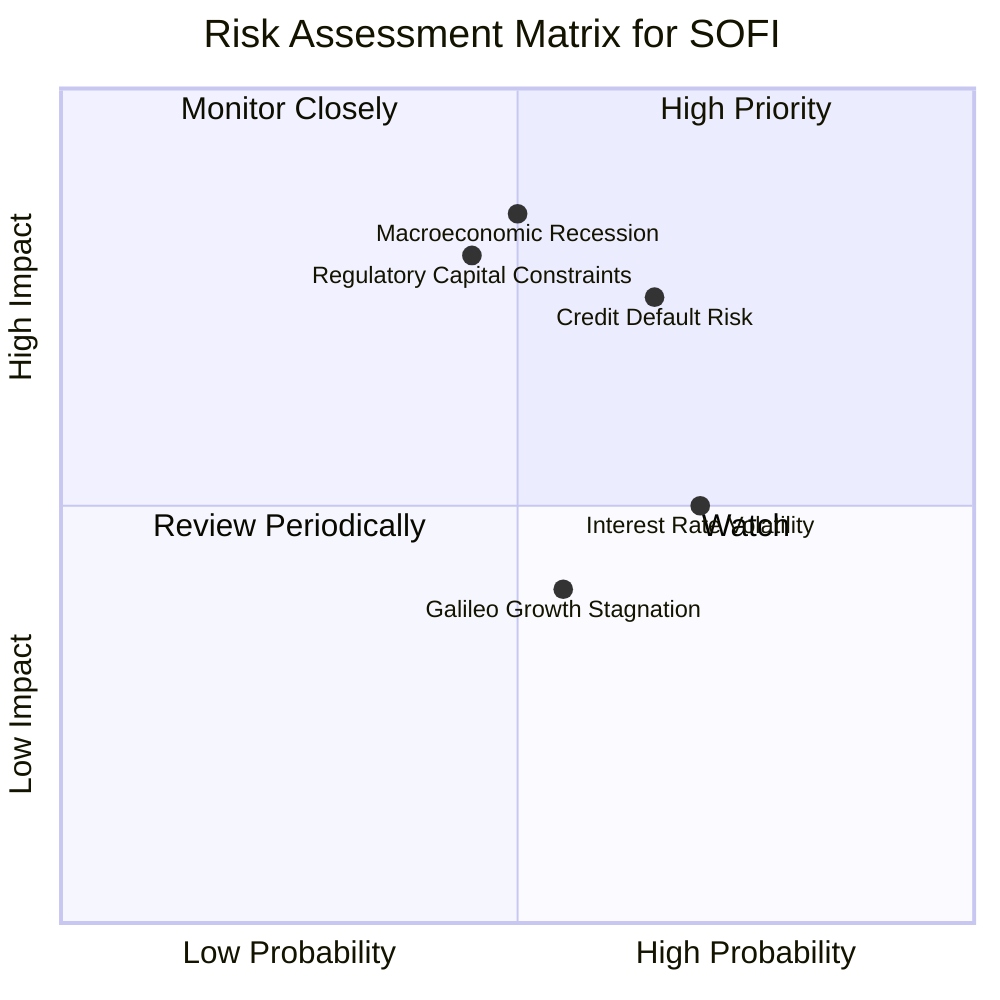

### 9.2 風險清單詳細分析

| # | 風險項目 | 發生機率 | 財務衝擊 | 風險評分 | 緩解與應對措施 |
|---|---|---|---|---|---|
| 1 | 🔴 **信用違約率上升** | 高 (35%) | 高 (約減損 15% 淨利) | 🔴 **7.5 / 10** | SoFi 會員平均 FICO 信用分數高達 746，遠高於行業平均，具備極強的抗風險能力。 |
| 2 | 🟡 **資本充足率限制放貸增速** | 中 (25%) | 高 (限制營收增速) | 🟡 **6.5 / 10** | 透過將貸款打包進行「證券化 (Securitization)」銷售，釋放表內資本，轉為輕資產模式。 |
| 3 | 🟡 **技術平台 (Galileo) 競爭加劇** | 中 (30%) | 中 (減緩估值溢價) | 🟡 **5.0 / 10** | 加速向拉丁美洲等新興市場擴展，並引入 Technisys 提供一體化解決方案。 |

---

## 10. 投資建議

SoFi 展現了金融科技公司轉型為高效率持牌銀行的最成功範例。隨著 GAAP 獲利能力的確立、存款規模的持續擴張，以及聯準會降息週期的利多，該股具備極高的不對稱風險回報比。

### 10.1 最終綜合評級

```
╔══════════════════════════════════════════════════════════════╗
║                    SOFI 投資維度最終評級                     ║
╠══════════════════════════════════════════════════════════════╣
║ 基本面強度    ★★★★☆ (8.0/10)                              ║
║ 成長動能      ★★★★★ (9.0/10)                              ║
║ 獲利品質      ★★★★☆ (7.5/10)                              ║
║ 估值吸引力    ★★★★☆ (8.0/10)                              ║
║ 護城河深度    ★★★★☆ (7.7/10)                              ║
╠══════════════════════════════════════════════════════════════╣
║ 綜合評級      🟢 強烈買入 / 買入 (STRONG BUY / BUY)          ║
╚══════════════════════════════════════════════════════════════╝
```

### 10.2 目標價與隱含報酬率

| 情境 | 機率權重 | 12個月目標價 | 隱含報酬率 (相較當前 $17.91) | 觸發條件 |
|---|---|---|---|---|
| **樂觀情境** | 25% | **$31.00** | 🟢 **+73.1%** | 降息超預期、再融資業務爆發、Galileo 成長重回 25% 以上。 |
| **基準情境** | 60% | **$20.90** | 🟢 **+16.7%** | 保持當前 35% 的營收成長，淨利率穩定於 15% 附近。 |
| **悲觀情境** | 15% | **$12.00** | 🔴 **-33.0%** | 美國經濟陷入深度衰退，壞帳率突破 5% 警戒線。 |
| **加權預期目標價**| **100%** | **$22.10** | 🟢 **+23.4%** | **具備極佳的投資勝率** |

### 10.3 買入時機與觸發因素 Checklist

```
╔══════════════════════════════════════════════════════════════════╗
║                  ✅ SOFI 買入與交易策略 Checklist               ║
╠══════════════════════════════════════════════════════════════════╣
║                                                                  ║
║  🟢 立即分批買入條件 (當前符合)：                                ║
║  [✔] 股價位於 $16.50 - $18.00 區間（歷史估值中