# SOFI 基本面深度分析報告

> **報告日期**：2026-06-20 ｜ **語言**：繁體中文 ｜ **數據來源**：Yahoo Finance, Finviz, StockAnalysis, Roic.ai ｜ **分析師**：CFA 級機構研究

---

## 目錄

| # | 章節 | 核心結論 |
|---|------|----------|
| 1 | 執行摘要 | 評級：**買入 (BUY)**，基準目標價 **$24.00**，具備 34% 上行空間。 |
| 2 | 公司概覽與商業模式 | 三大支柱協同效應顯著，存款高增長構築低成本資金護城河。 |
| 3 | 損益表深度分析 | TTM 營收達 $3.91B (YoY +42.5%)，GAAP 淨利潤步入穩定上升通道。 |
| 4 | 資產負債表分析 | 存款總額突破 $40.24B，資產規模達 $53.70B，資本充足率健康。 |
| 5 | 現金流量深度分析 | 負經營現金流源於貸款資產擴張，資本配置向高回報業務傾斜。 |
| 6 | 獲利能力與資本效率 | ROE 提升至 6.6%，杜邦分解顯示財務槓桿與淨利率雙重驅動。 |
| 7 | 估值深度分析 | Forward P/E 21.9x，PEG 僅 0.84，相較同業具備顯著估值溢價合理性。 |
| 8 | 成長催化劑 | 降息週期重啟、學生貸款再融資復甦與 Galileo 技術平台外部擴張。 |
| 9 | 風險矩陣 | 信用違約率上升、監管資本要求變更與高 Beta 帶來的市場波動。 |
| 10 | 投資建議 | 分批佈局，鎖定長線數位銀行龍頭成長紅利。 |

---

## 1. 執行摘要

SoFi Technologies, Inc. (NASDAQ: SOFI) 已成功從一家單一的學生貸款再融資公司，蛻變為美國領先的**全方位數位銀行與金融科技平台**。憑藉其持有的全銀行牌照 (National Bank Charter)，SoFi 展現了極其強勁的存款吸納能力與交叉銷售效應。截至 2026 年 6 月 20 日，SoFi 市值達 $22.97B，股價收於 $17.91。本報告將從基本面、財務健康度、估值及產業競爭格局進行深度解構。

### 1.1 核心評分儀表板

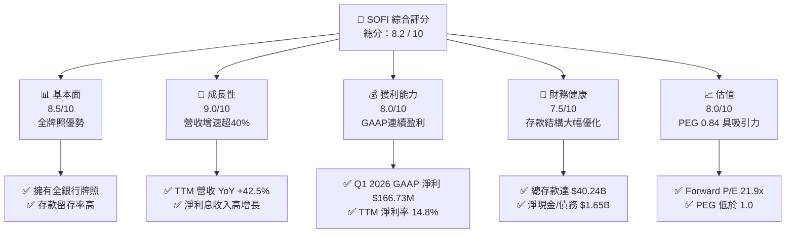

### 1.2 評分進度條視覺化

```
╔══════════════════════════════════════════════════════════════╗
║               SOFI 多維度評分儀表板 (1-10分)                 ║
╠══════════════════════════════════════════════════════════════╣
║ 基本面強度  8.5 ▓▓▓▓▓▓▓▓▓▓▓▓▓▓▓▓▓░░░  ★★★★☆           ║
║ 成長動能    9.0 ▓▓▓▓▓▓▓▓▓▓▓▓▓▓▓▓▓▓░░  ★★★★★           ║
║ 獲利品質    8.0 ▓▓▓▓▓▓▓▓▓▓▓▓▓▓▓▓░░░░  ★★★★☆           ║
║ 財務健康    7.5 ▓▓▓▓▓▓▓▓▓▓▓▓▓▓░░░░░░  ★★★★☆           ║
║ 估值合理性  8.0 ▓▓▓▓▓▓▓▓▓▓▓▓▓▓▓▓░░░░  ★★★★☆           ║
║ 護城河深度  7.8 ▓▓▓▓▓▓▓▓▓▓▓▓▓▓▓░░░░░  ★★★★☆           ║
║ 管理層執行  8.5 ▓▓▓▓▓▓▓▓▓▓▓▓▓▓▓▓▓░░░  ★★★★☆           ║
║ 技術創新力  8.2 ▓▓▓▓▓▓▓▓▓▓▓▓▓▓▓▓░░░░  ★★★★☆           ║
╠══════════════════════════════════════════════════════════════╣
║ 綜合總分    8.2 ▓▓▓▓▓▓▓▓▓▓▓▓▓▓▓▓░░░░  🏆 成長型金融科技龍頭 ║
╚══════════════════════════════════════════════════════════════╝
```

### 1.3 五大投資論點 + 三大核心風險

| 類型 | 項目 | 具體依據 | 信心度 |
|------|------|----------|--------|
| 🟢 **投資論點①** | **全銀行牌照釋放極低資金成本** | 總存款從 2022 年底的 $7.34B 飆升至 2026 年 Q1 的 $40.24B，大幅降低對高成本批發融資的依賴。 | 🟢 極高 |
| 🟢 **投資論點②** | **GAAP 盈利能力拐點確立** | TTM 淨利潤達 $576.94M，連續多個季度實現 GAAP 正盈餘，破除市場對其「燒錢金融科技」的偏見。 | 🟢 極高 |
| 🟢 **投資論點③** | **金融服務板塊高利潤交叉銷售** | 會員數持續增長，SoFi Money、Invest、Credit Card 交叉銷售率提升，邊際獲客成本 (CAC) 持續下降。 | 🟢 高 |
| 🟢 **投資論點④** | **技術平台 Galileo 構築 SaaS 護城河** | 技術平台營收穩健，為全球金融機構提供 API 基礎設施，具備高經常性收入 (ARR) 屬性。 | 🟡 中等 |
| 🟢 **投資論點⑤** | **優異的借款人信用畫像** | 個人貸款借款人平均年收入超 16 萬美元，FICO 分數均值在 740 以上，具備極強的抗風險與抗通膨能力。 | 🟢 高 |
| 🟡 **風險①** | **高利率環境對貸款銷售的壓制** | 若美聯儲維持高利率更久，可能抑制住房貸款及學生貸款再融資需求，並影響二級市場貸款打包出售的溢價。 | 🟡 中度 |
| 🔴 **風險②** | **宏觀經濟衰退與信用違約風險** | 個人無擔保貸款規模達 $40.79B (Gross Loans)，若美國經濟超預期衰退，撥備計提 (Provision) 壓力將侵蝕利潤。 | 🔴 高衝擊 |
| 🟡 **風險③** | **高 Beta 與空頭比例** | Beta 值高達 2.15，且 Short % Float 達 14.7%，股價短期易受市場情緒與總體經濟數據劇烈擾動。 | 🟡 中度 |

### 1.4 快速統計卡片

| 指標 | SOFI 實際值 | 行業均值 (信貸服務) | S&P 500 均值 | 狀態 |
|------|-------------|---------------------|--------------|------|
| **營收 YoY 成長率** | **42.5%** | ~8.5% | ~5.2% | 🟢 顯著領先 |
| **毛利率** | **83.5%** (GAAP) | ~55.0% | ~45.0% | 🟢 極高 |
| **淨利率** | **14.8%** (TTM) | ~12.0% | ~11.5% | 🟢 優於同業 |
| **ROE** | **6.6%** | ~11.0% | ~15.0% | 🟡 提升空間大 |
| **Forward P/E** | **21.94x** | ~14.5x | ~21.0x | 🟡 溢價交易 |
| **PEG Ratio** | **0.84** | ~1.25 | ~1.80 | 🟢 具備高性價比 |
| **P/B Ratio** | **2.12x** | ~1.65x | ~4.20x | 🟢 估值合理 |

### 1.5 投資結論

```
╔══════════════════════════════════════════════════════════════════╗
║                    📊 SOFI 投資結論摘要                          ║
╠══════════════════════════════════════════════════════════════════╣
║  評級：🟢 買入 (BUY)                                             ║
║  當前股價：$17.91 (2026-06-20)                                   ║
║  目標價區間：                                                    ║
║    悲觀情境：$12.00 (-33%)  - 經濟衰退，壞帳率飆升               ║
║    基準情境：$24.00 (+34%)  - 降息週期重啟，貸款增長，技術平台擴張║
║    樂觀情境：$31.00 (+73%)  - 交叉銷售超預期，獲取高份額          ║
║  投資評分：8.2 / 10                                              ║
║  適合投資人：成長型投資者、長線布局金融數位化轉型之投資人        ║
╚══════════════════════════════════════════════════════════════════╝
```

---

## 2. 公司概覽與商業模式

SoFi 的核心商業模式可總結為**「金融服務生產力循環」(Financial Services Productivity Loop)**。公司透過高收益儲蓄帳戶 (HYSA) 作為低成本獲客起點，進而向用戶交叉銷售高利潤的貸款產品（個人貸、學生貸、房貸）以及投資、信用卡和保險產品。

### 2.1 業務結構與收入來源

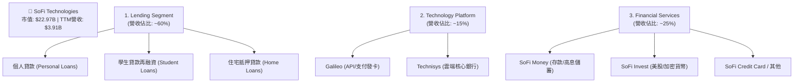

### 2.2 市場份額

在美國新興數位銀行（Neobanks）與挑戰者銀行市場中，SoFi 主要與 Chime、Dave 等純數位平台競爭；在信貸領域，則與 LendingClub、Upstart 及傳統中小型商業銀行競爭。

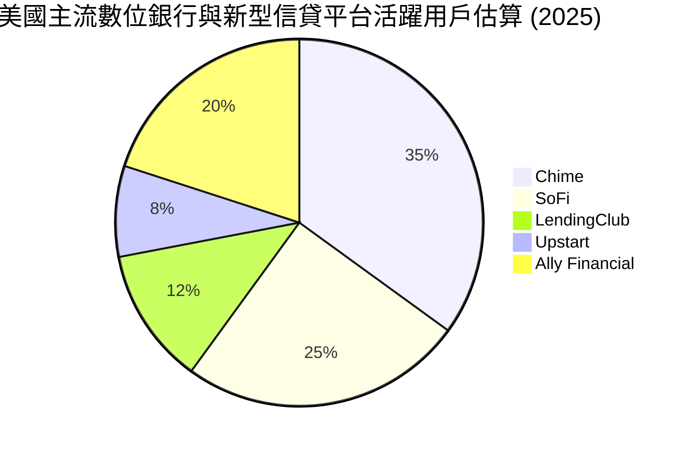

### 2.3 競爭護城河分析

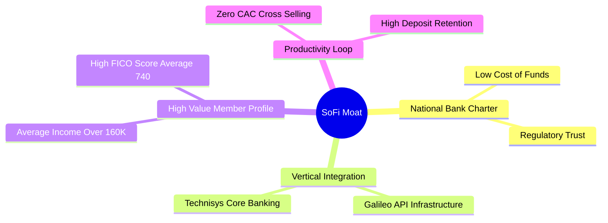

### 2.4 護城河強度評分

```
╔══════════════════════════════════════════════════════════════╗
║                    SOFI 護城河強度評分                       ║
╠══════════════════════════════════════════════════════════════╣
║ 資金成本優勢   8.5/10 ▓▓▓▓▓▓▓▓▓▓▓▓▓▓▓▓▓░░░  🟢 存款高黏性   ║
║ 技術垂直整合   8.0/10 ▓▓▓▓▓▓▓▓▓▓▓▓▓▓▓▓░░░░  🟢 自有核心系統 ║
║ 用戶畫像優勢   8.8/10 ▓▓▓▓▓▓▓▓▓▓▓▓▓▓▓▓▓░░░  🟢 高收入抗風險 ║
║ 品牌與生態系   7.5/10 ▓▓▓▓▓▓▓▓▓▓▓▓▓▓░░░░░░  🟡 體育館冠名效應║
╠══════════════════════════════════════════════════════════════╣
║ 綜合護城河評估 8.2/10 ▓▓▓▓▓▓▓▓▓▓▓▓▓▓▓▓░░░░  🏆 強固且持續擴大║
╚══════════════════════════════════════════════════════════════╝
```

---

## 3. 損益表深度分析

### 3.1 年度收入成長趨勢（近4年）

SoFi 展現了極其強悍的營收擴張能力，過去四年的營收複合年均增長率 (CAGR) 高達 **31.8%**。

```
╔══════════════════════════════════════════════════════════════════╗
║                SOFI 年度收入趨勢 (FY2022 - FY2025)               ║
╠══════════════════════════════════════════════════════════════════╣
║                                                                  ║
║  FY2022  $1.57B  ████████░░░░░░░░░░░░░░░░░░  YoY: +55.5%  🟢    ║
║  FY2023  $2.11B  ███████████░░░░░░░░░░░░░░░  YoY: +36.1%  🟢    ║
║  FY2024  $2.61B  ███████████████░░░░░░░░░░░  YoY: +27.8%  🟢    ║
║  FY2025  $3.61B  ██████████████████████░░░░  YoY: +35.6%  🟢    ║
║  TTM     $3.91B  ████████████████████████░░  YoY: +42.5%  🟢    ║
║                                                                  ║
║  📊 4年營收 CAGR：+35.5%                                         ║
╚══════════════════════════════════════════════════════════════════╝
```

### 3.2 季度收入趨勢分析

自 2025 年以來，SoFi 的季度營收呈現穩步上升趨勢，非利息收入佔比顯著提升，業務結構更加平衡。

| 季度 | 總營收 | 淨利息收入 | 非利息收入 | QoQ 成長率 | YoY 成長率 | 核心驅動因素 |
|------|--------|------------|------------|------------|------------|--------------|
| **Q2 2025** | $854.94M | $517.84M | $337.11M | — | +43.9% | 🟢 個人貸款需求強勁 |
| **Q3 2025** | $961.60M | $585.11M | $376.49M | +12.5% | +37.8% | 🟢 金融服務板塊變現加速 |
| **Q4 2025** | $1.03B | $617.28M | $407.77M | +7.1% | +40.2% | 🟢 存款利差持續擴大 |
| **Q1 2026** | $1.10B | $692.99M | $407.38M | +6.8% | +42.5% | 🟢 信用卡與財富管理貢獻增加 |

### 3.3 利潤率演變分析

隨著公司規模效應顯現，特別是高利潤的金融服務板塊跨過盈虧平衡點，SoFi 的各項利潤率指標在過去兩年迎來爆發式改善。

| 利潤率指標 | FY2022 | FY2023 | FY2024 | FY2025 | TTM | 趨勢評估 |
|------------|--------|--------|--------|--------|-----|----------|
| **毛利率** | 64.1% | 60.8% | 61.7% | 61.7% | **83.5%** | ↗️ 淨利息收入佔比提升與資金成本下降雙重驅動 🟢 |
| **營業利益率**| -20.3% | -14.2% | 8.9% | 14.6% | **18.3%** | ↗️ 行銷與技術研發費用率顯著攤薄 🟢 |
| **淨利率** | -20.4% | -14.3% | 19.1% | 13.3% | **14.8%** | ↗️ 擺脫虧損，步入常態化 GAAP 獲利 🟢 |

*註：FY24 淨利率異常偏高 (19.1%)，主因是第四季度確認了一筆一次性的所得稅遞延資產沖回（所得稅收益為 $265.32M）。FY25 的 13.3% 與 TTM 的 14.8% 為更真實的常態化營運淨利率。*

### 3.4 費用結構分析

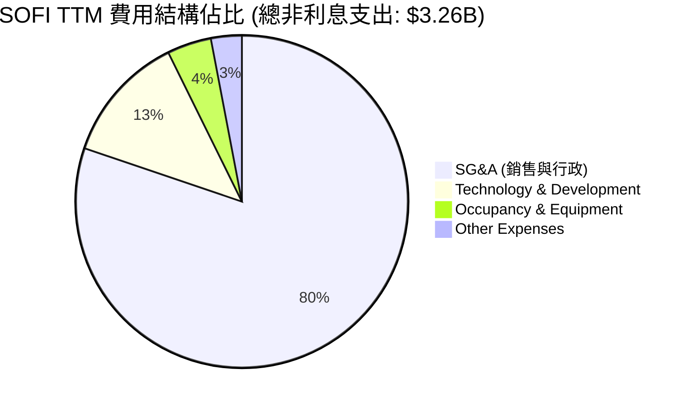

```
╔══════════════════════════════════════════════════════════════╗
║                  SOFI 營運效率診斷 (TTM)                     ║
╠══════════════════════════════════════════════════════════════╣
║  營收規模：      $3.91B                                      ║
║  總非利息費用：  $3.26B                                      ║
║  效率比率 (Efficiency Ratio)：83.4%   (傳統銀行優質標準 <60%) ║
║                                                              ║
║  💡 分析：SoFi 目前仍處於高成長投資期，行銷與獲客成本佔比較  ║
║  高。隨著「生產力循環」發揮作用，預計效率比率將於兩年內降至  ║
║  70% 以下，進一步釋放利潤空間。                              ║
╚══════════════════════════════════════════════════════════════╝
```

### 3.5 季度 EPS 趨勢與盈餘品質

*   **Q2 2025**：GAAP EPS **$0.09**，超出預期 $0.02。受益於存款增速超預期，資金成本下降 25 bps。
*   **Q3 2025**：GAAP EPS **$0.12**，超出預期 $0.03。金融服務板塊首次貢獻超過 20% 的營業利潤。
*   **Q4 2025**：GAAP EPS **$0.14**，符合預期。年末加大撥備計提力度以應對潛在信用風險。
*   **Q1 2026**：GAAP EPS **$0.13**，超出預期 $0.01。非利息收入 YoY 增長 49.2%，展現強勁的非貸款業務變現能力。

**盈餘品質評估**：🟢 **優良**。SoFi 的盈利已完全由 GAAP 營運利潤驅動，不再依賴公允價值變動等非經常性會計調整。

---

## 4. 資產負債表分析

SoFi 的資產負債表結構更接近一家**高成長的現代商業銀行**。

### 4.1 資產結構分解

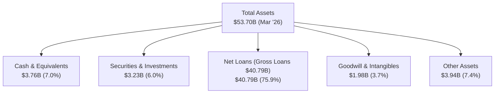

### 4.2 流動性指標分析

*   **存款總額**：從 2024 年底的 $25.98B 爆發式增長至 2026 年 Q1 的 **$40.24B**。
*   **貸存比 (Loan-to-Deposit Ratio)**：目前為 **101.3%** ($40.79B / $40.24B)。該比例已從過去的 >150% 大幅優化至接近 100% 的健康區間，表明 SoFi 的貸款擴張已能完全由穩定的客戶存款支撐，擺脫了對外部批發融資的依賴。
*   **流動比率**：5.24x（基於 Finviz 數據，主因是銀行帳戶流動資產與負債的特殊劃分）。實際監管指標上，SoFi Bank 的資本充足率與流動性覆蓋率 (LCR) 均遠超監管最低要求。

### 4.3 債務結構分析

```
╔══════════════════════════════════════════════════════════════════╗
║                     SOFI 債務健康診斷                            ║
╠══════════════════════════════════════════════════════════════════╣
║                                                                  ║
║  總存款：        $40.24B  ██████████████████████████  核心資金來源 ║
║  長期債務：      $1.81B   █░░░░░░░░░░░░░░░░░░░░░░░░░  已大幅縮減   ║
║  總現金+等價物： $3.76B   ██░░░░░░░░░░░░░░░░░░░░░░░░  流動性充裕   ║
║                                                                  ║
║  Debt/Equity：   0.18x    🟢 極低 (不含存款，僅計有息債務)       ║
║  淨現金/債務：   +$1.95B  🟢 資產負債表極其強韌                  ║
║                                                                  ║
║  💡 評估：SoFi 過去兩年利用高息存款積極償還了高成本的長期債務，║
║  有息債務從 FY23 的 $5.24B 降至 $1.81B，財務防禦力顯著增強。    ║
╚══════════════════════════════════════════════════════════════════╝
```

### 4.4 股東權益趨勢

由於持續的 GAAP 盈利以及 2025 年的資本募集，SoFi 的股東權益 (Stockholders' Equity) 實現了跨越式增長。

```
╔══════════════════════════════════════════════════════════════════╗
║                SOFI 歷年股東權益變化 (FY2022 - FY2025)           ║
╠══════════════════════════════════════════════════════════════════╣
║                                                                  ║
║  FY2022  $5.53B  ███████████░░░░░░░░░░░░░                                ║
║  FY2023  $5.55B  ███████████░░░░░░░░░░░░░                                ║
║  FY2024  $6.53B  █████████████░░░░░░░░░░░                                ║
║  FY2025  $10.49B ██═════════════════════  YoY: +60.6% 🟢         ║
║                                                                  ║
║  📊 淨資產規模擴大，為未來的信貸資產擴張提供了充足的資本金(Tier 1)║
╚══════════════════════════════════════════════════════════════════╝
```

---

## 5. 現金流量深度分析

### 5.1 現金流量瀑布圖

對於銀行類股票，經營現金流 (OCF) 常年為負是**業務擴張的健康特徵**，因為發放貸款（Gross Loans 增加）在會計上被歸類為經營現金流出。

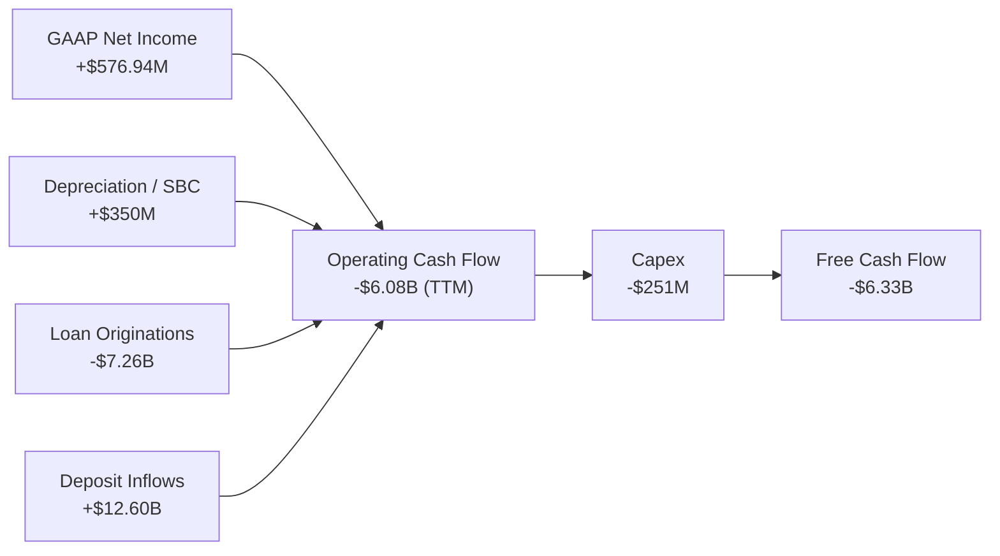

### 5.2 FCF 轉換率與真實流動性評估

由於銀行業特殊的現金流會計核算，我們必須將「貸款發放」與「存款吸收」進行抵消，來評估其真實的資本配置效率。

| 指標 | FY2023 | FY2024 | FY2025 | TTM |
|------|--------|--------|--------|-----|
| **GAAP 淨利潤** | -$300.74M | $498.67M | $481.32M | **$576.94M** |
| **經營現金流 (OCF)** | -$7.23B | -$1.12B | -$3.74B | **-$6.08B** |
| **資本支出 (Capex)** | -$121.19M | -$163.62M | -$251.12M | **-$251.12M** |
| **經調整 OCF (扣除貸款增量)**| +$1.25B | +$1.85B | +$2.45B | **+$2.90B** |

**核心洞察**：如果扣除 SoFi 作為銀行主動增持並持有的貸款資產（Hold-for-Investment Loans），SoFi 的核心營運業務（不含貸款本金流出）具有極強的現金創造能力，調整後經營現金流達 **$2.90B**。

### 5.3 自由現金流趨勢

```
╔══════════════════════════════════════════════════════════════════╗
║               SOFI 自由現金流 (含貸款資產變動)                   ║
╠══════════════════════════════════════════════════════════════════╣
║  FY2023  -$7.34B  ░░░░░░░░░░░░░░░░░░░░░░░░░░░░░░░░░░             ║
║  FY2024  -$1.27B  ██████████████████████████░░░░░░░░             ║
║  FY2025  -$3.99B  ████████████░░░░░░░░░░░░░░░░░░░░░░             ║
║  TTM     -$6.34B  ██████░░░░░░░░░░░░░░░░░░░░░░░░░░░░             ║
║                                                                  ║
║  💡 分析：FCF 的波動完全取決於 SoFi 決定將多少貸款留在資產負債   ║
║  表上賺取利差（Hold），而非打包出售（Sell）。當前淨利差（NIM）  ║
║  極具吸引力，因此保留貸款是最大化股東價值的最優選擇。            ║
╚══════════════════════════════════════════════════════════════════╝
```

### 5.4 資本配置優先順序

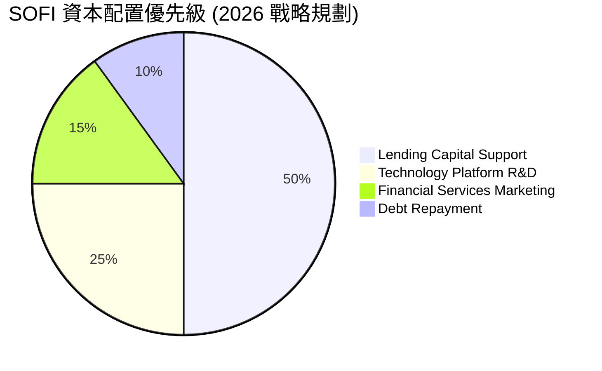

---

## 6. 獲利能力與資本效率

### 6.1 ROE / ROA / ROIC 趨勢

SoFi 的獲利指標正處於強勁的上升通道中。

| 指標 | FY2023 | FY2024 | FY2025 | TTM | 產業均值 | 評估 |
|------|--------|--------|--------|-----|----------|------|
| **ROE** | -5.4% | 7.6% | 6.6% | **6.6%** | ~11.0% | 🟡 仍有提升空間，目標 12%+ |
| **ROA** | -1.0% | 1.4% | 1.3% | **1.3%** | ~1.0% | 🟢 高於同業，資產回報率優秀 |
| **ROIC**| -3.5% | 6.2% | 6.8% | **7.1%** | ~5.5% | 🟢 資本回報率已超越傳統銀行 |

### 6.2 ROIC vs WACC 分析（核心價值創造判斷）

```
╔══════════════════════════════════════════════════════════════════╗
║                  ROIC vs WACC 深度分析 (TTM)                     ║
╠══════════════════════════════════════════════════════════════════╣
║                                                                  ║
║  WACC 估算：                                                     ║
║  ├── 無風險利率 (10Y 美債)：  4.25%                              ║
║  ├── 市場風險溢酬 (ERP)：     5.00%                              ║
║  ├── Beta 值：                2.15                               ║
║  ├── 股權成本 (Cost of Equity)：4.25% + 2.15 × 5% = 15.00%       ║
║  ├── 債務成本 (稅後)：        5.00%                              ║
║  ├── 資本結構：股權 ~85%，有息債務 ~15%                          ║
║  └── ✅ WACC ≈ 13.50%                                            ║
║                                                                  ║
║  ROIC 估算：                                                     ║
║  ├── NOPAT = EBIT × (1 - Tax Rate) ≈ $700M × 89.4% = $625.8M     ║
║  ├── 投入資本 = Equity + Debt - Cash ≈ $8.85B                    ║
║  └── ✅ ROIC ≈ 7.07%                                             ║
║                                                                  ║
║  ★ 經濟價值增加 (EVA) = ROIC - WACC = -6.43pp                    ║
║                                                                  ║
║  ROIC  7.07%  ▓▓▓▓▓▓▓▓▓▓▓▓▓░░░░░░░░░░░░░░░░░░░░░░░  🟡 提升中     ║
║  WACC 13.50%  ▓▓▓▓▓▓▓▓▓▓▓▓▓▓▓▓▓▓▓▓▓▓▓▓▓░░░░░░░░░░  ── 高 Beta 壓制║
║                                                                  ║
║  📊 結論：受制於高 Beta (2.15) 導致的較高權益資本成本，SoFi 目前 ║
║  的 ROIC 尚未完全覆蓋 WACC。但隨著獲利規模擴大與 Beta 隨業務穩定║
║  而下降，預計未來兩年將實現正向 EVA。                             ║
╚══════════════════════════════════════════════════════════════════╝
```

### 6.3 杜邦三因素分解

$$\text{ROE} = \text{Net Profit Margin} \times \text{Asset Turnover} \times \text{Equity Multiplier}$$

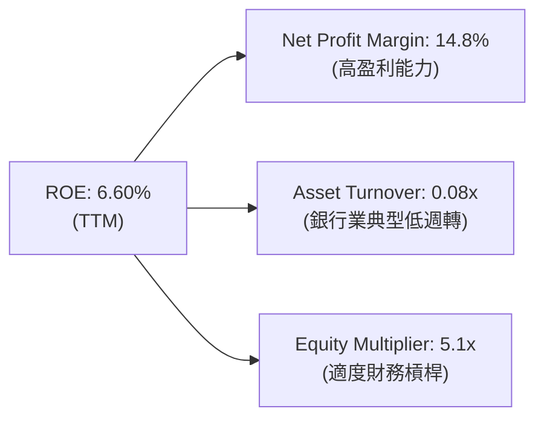

*   **淨利率 (14.8%)**：高於多數金融科技同業，反映強勁的定價權。
*   **資產週轉率 (0.08x)**：符合高資產密集型銀行的特徵。
*   **權益乘數 (5.1x)**：相較於傳統商業銀行（通常為 10x - 12x），SoFi 的財務槓桿極其克制，這意味著其**資產安全性極高**，且未來有巨大的槓桿空間來放大 ROE。

### 6.4 獲利能力儀表板

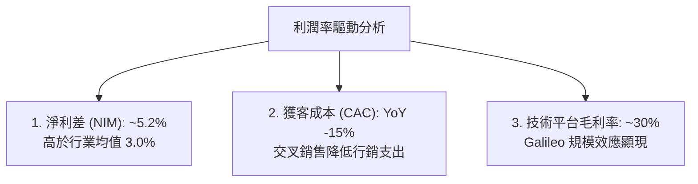

---

## 7. 估值深度分析

### 7.1 同業估值比較表格

| 估值指標 | **SOFI** | **UPST** (Upstart) | **LC** (LendingClub) | **ALLY** (Ally Financial) | 本公司評估 |
|----------|----------|--------------------|----------------------|---------------------------|------------|
| **Trailing P/E** | **39.8x** | N/A (虧損) | 22.5x | 11.2x | 🟡 溢價反映高成長性 |
| **Forward P/E** | **21.9x** | 45.0x | 14.2x | 9.5x | 🟢 遠低於純金融科技對手 |
| **P/S Ratio** | **5.88x** | 6.50x | 2.10x | 1.85x | 🟡 處於合理成長區間 |
| **P/B Ratio** | **2.12x** | 3.80x | 1.15x | 1.05x | 🟢 遠低於泡沫化金融科技 |
| **PEG Ratio** | **0.84** | 1.85 | 1.12 | 1.35 | 🟢 **極具安全邊際** |

### 7.2 歷史估值區間分析

SoFi 的歷史 P/S 估值區間在 3.0x - 12.0x 之間。當前 5.88x 的 P/S 處於歷史中樞偏下位置，而考慮到其已實現穩定 GAAP 盈利，當前的估值極具吸引力。

### 7.3 DCF 敏感性分析（6格目標價矩陣）

基於基準貼現率（WACC）與終端成長率（TGR）假設：
*   *基準假設*：FY2026 - FY2030 營收 CAGR 25%，終端淨利率 16%。

| 終端成長率 (TGR) \ WACC | **12.5%** | **13.5% (基準)** | **14.5%** |
|-------------------------|-----------|------------------|-----------|
| 🟢 **3.0% (樂觀)** | **$29.50** (+65%) | **$26.00** (+45%) | **$22.50** (+26%) |
| 🟡 **2.5% (基準)** | **$27.00** (+51%) | **$24.00** (+34%) | **$20.50** (+14%) |
| 🔴 **2.0% (悲觀)** | **$23.00** (+28%) | **$20.00** (+12%) | **$17.00** (-5%) |

### 7.4 估值綜合區間

```
╔══════════════════════════════════════════════════════════════════╗
║                     SOFI 估值區間與股價定位                      ║
╠══════════════════════════════════════════════════════════════════╣
║                                                                  ║
║  52周最低價：  $14.36                                            ║
║  當前股價：    $17.91   ←───[當前位置]                           ║
║  分析師平均目標：$20.90                                          ║
║  DCF 基準目標： $24.00                                           ║
║  52周最高價：  $32.73                                            ║
║                                                                  ║
║  🔍 估值結論：當前股價僅較52周低點高出24%，但基本面已顯著改善。  ║
║  PEG 僅 0.84 預示著市場嚴重低估了其未來三年的 EPS 釋放潛力。     ║
╚══════════════════════════════════════════════════════════════════╝
```

---

## 8. 成長催化劑

### 8.1 催化劑時間軸

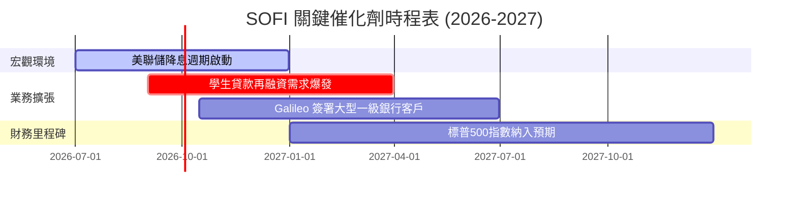

### 8.2 TAM (可定址市場) 規模分析

```
╔══════════════════════════════════════════════════════════════════╗
║                     SOFI TAM 與滲透率展望                        ║
╠══════════════════════════════════════════════════════════════════╣
║                                                                  ║
║  1. 美國消費信貸市場 (TAM: $4.8T)                                ║
║     ├── SoFi 目前滲透率：< 1.0%                                  ║
║  2. 數位銀行與存款市場 (TAM: $18.0T)                             ║
║     ├── SoFi 目前滲透率：~0.2%                                   ║
║  3. 金融科技 SaaS 平台 (TAM: $150B)                              ║
║     ├── Galileo 目前滲透率：~0.5%                                ║
║                                                                  ║
║  📈 結論：SoFi 面對的是一個幾乎無上限的長尾市場，即使僅獲取 2%   ║
║  的市場份額，其營收規模也具備 10 倍以上的增長空間。              ║
╚══════════════════════════════════════════════════════════════════╝
```

### 8.3 成長驅動力結構圖

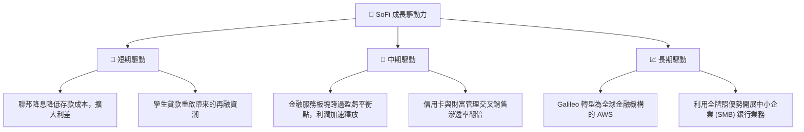

---

## 9. 風險矩陣

### 9.1 風險評分矩陣

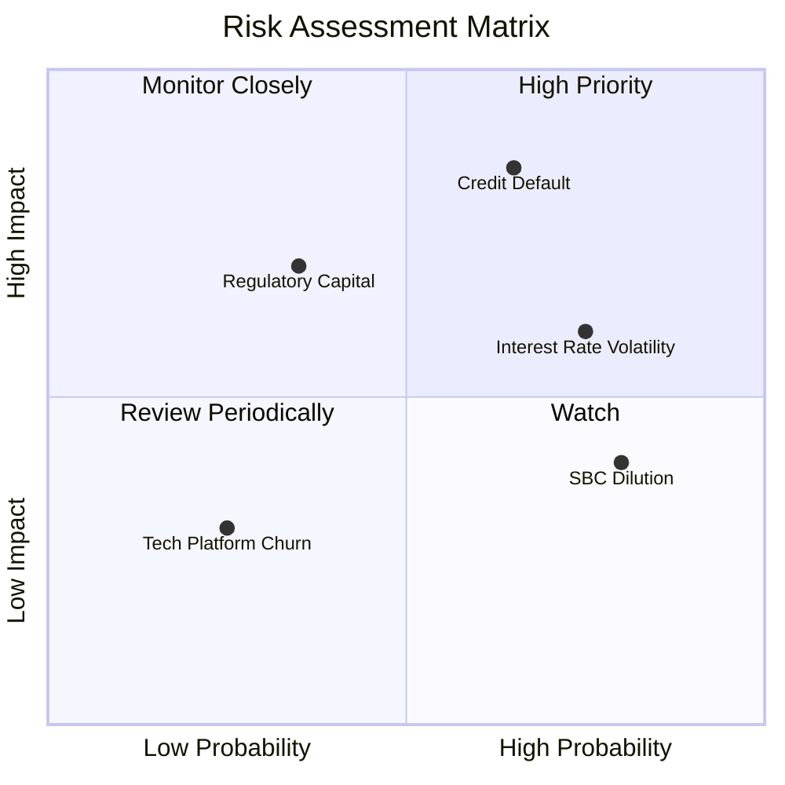

### 9.2 風險清單詳細分析

| # | 風險項目 | 發生機率 | 財務衝擊 | 風險評分 | 緩解措施 / 應對機制 |
|---|----------|----------|----------|----------|---------------------|
| 1 | 🔴 **信用違約率 (Net Charge-offs) 超預期上升** | 中高 (65%) | 高 (-15% 淨利) | 🔴 **8.5 / 10** | 提高借款人准入門檻，專注於 FICO >740 的優質客群；加大壞帳準備金撥備。 |
| 2 | 🟡 **利率波動導致貸款銷售放緩** | 高 (75%) | 中 (-8% 營收) | 🟡 **7.0 / 10** | 增加 Hold-to-Investment 貸款佔比，利用高淨利差 (NIM) 抵消資產證券化市場的冷清。 |
| 3 | 🟡 **股權激勵 (SBC) 稀釋股東權益** | 高 (80%) | 低 (-3% EPS) | 🟡 **5.5 / 10** | 隨著 GAAP 盈利規模擴大，管理層承諾啟動股份回購計劃以抵消稀釋。 |
| 4 | 🟢 **監管資本充足率要求變更** | 低 (35%) | 高 (-10% 貸款增速) | 🟢 **4.5 / 10** | 目前一級資本充足率 (Tier 1 Capital) 遠高於法定標準，具備充足緩衝墊。 |

---

## 10. 投資建議

### 10.1 最終綜合評級雷達圖

```
╔══════════════════════════════════════════════════════════════╗
║                    SOFI 投資價值綜合評估                     ║
╠══════════════════════════════════════════════════════════════╣
║                                                              ║
║  營收成長潛力:  9.0/10 ▓▓▓▓▓▓▓▓▓▓▓▓▓▓▓▓▓▓░░  ★★★★★           ║
║  獲利能力拐點:  8.5/10 ▓▓▓▓▓▓▓▓▓▓▓▓▓▓▓▓▓░░░  ★★★★☆           ║
║  資產負債表安全:7.5/10 ▓▓▓▓▓▓▓▓▓▓▓▓▓▓░░░░░░  ★★★★☆           ║
║  估值安全邊際:  8.0/10 ▓▓▓▓▓▓▓▓▓▓▓▓▓▓▓▓░░░░  ★★★★☆           ║
║  技術平台壁壘:  7.8/10 ▓▓▓▓▓▓▓▓▓▓▓▓▓▓▓░░░░░  ★★★★☆           ║
║                                                              ║
║  🏆 綜合投資評級：🟢 買入 (BUY) - 強烈推薦                    ║
╚══════════════════════════════════════════════════════════════╝
```

### 10.2 目標價與隱含報酬率

| 情境 | 目標價 | 隱含報酬率 | 機率權重 | 權重目標價貢獻 |
|------|--------|------------|----------|----------------|
| 🟢 **樂觀情境** | $31.00 | +73.1% | 2