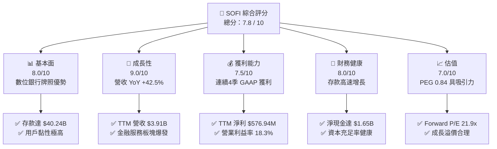
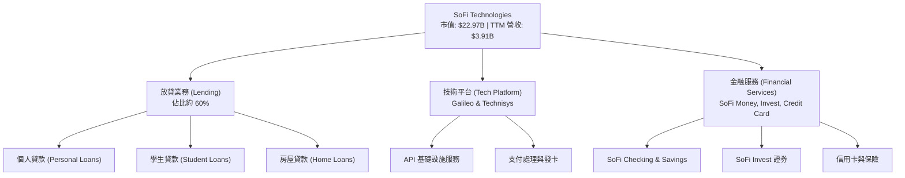
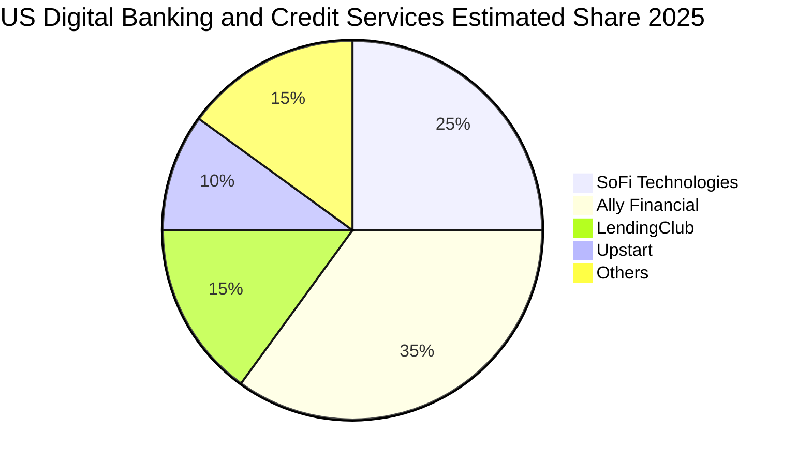
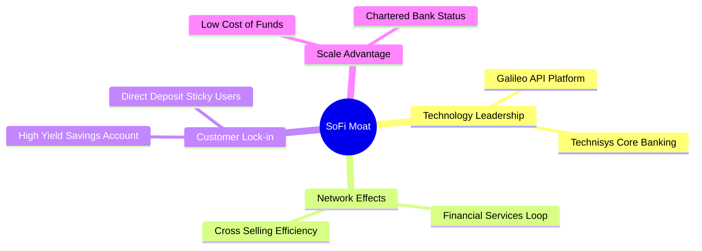
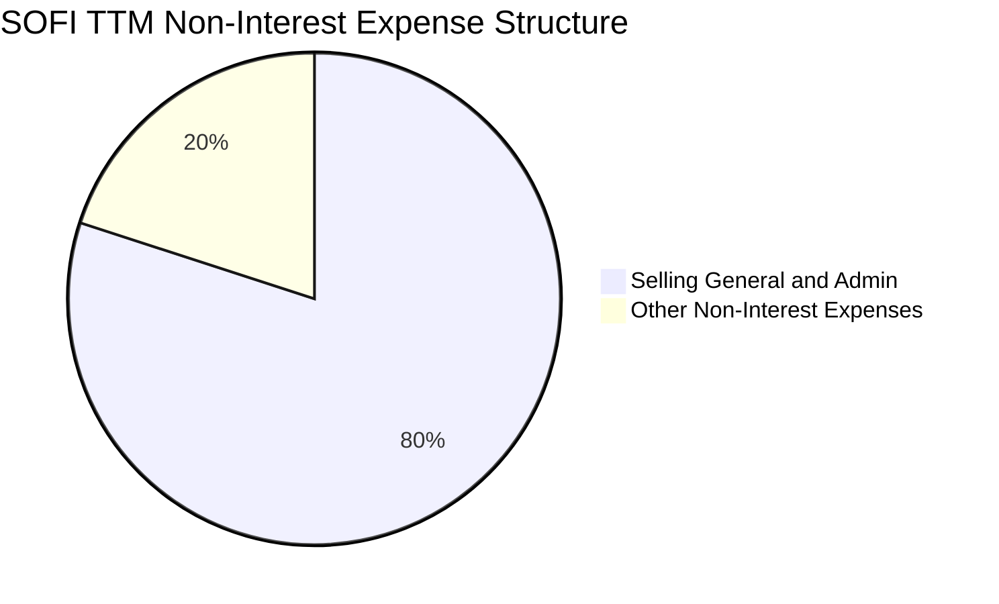
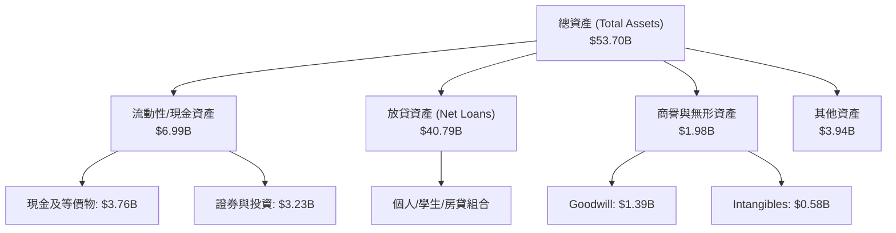
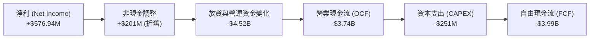
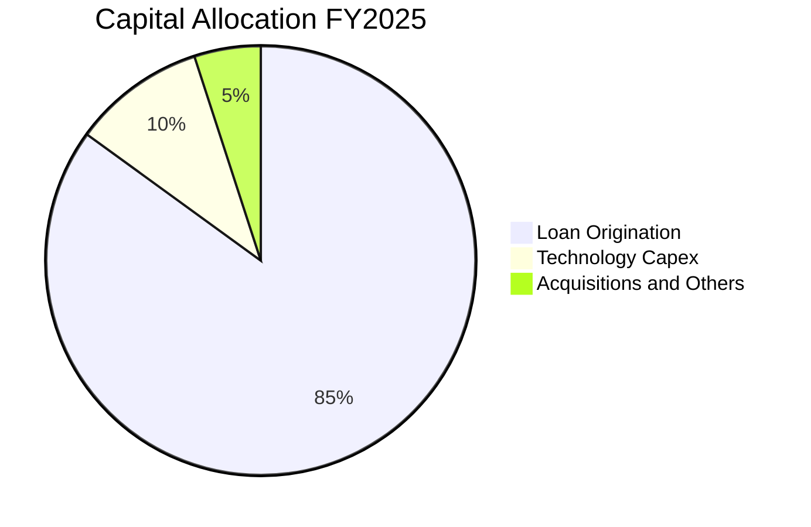

# SOFI 基本面深度分析報告

> **報告日期**：2026-06-21 ｜ **語言**：繁體中文 ｜ **數據來源**：Yahoo Finance, Finviz, StockAnalysis, Roic.ai ｜ **分析師**：CFA 級機構研究

---

## 目錄

| # | 章節 | 核心結論 |
|---|------|----------|
| 1 | **執行摘要** | 評級：**買入 (Buy)** ｜ 目標價：**$20.90 - $31.00** ｜ 數位銀行高成長與獲利爆發期 |
| 2 | **公司概覽與商業模式** | 獨特「金融超商」生態系，結合放貸、金融服務與 Galileo 技術平台，護城河穩固 |
| 3 | **損益表深度分析** | TTM 營收達 $3.91B (YoY +42.5%)，連續四個季度實現 GAAP 淨利，營運槓桿顯著 |
| 4 | **資產負債表分析** | 存款規模達 $40.24B，成功轉化為低成本資金來源；資本結構與流動性極佳 |
| 5 | **現金流量深度分析** | 營運現金流因貸款發放呈現結構性負值，但自由現金流質量隨淨利轉正逐步改善 |
| 6 | **獲利能力與資本效率** | ROE 升至 6.6%，ROIC 隨獲利能力改善而攀升，低成本存款資金大幅優化 WACC |
| 7 | **估值深度分析** | Forward P/E 僅 21.9x，PEG 為 0.84，相較於傳統銀行與同業具備顯著估值折價 |
| 8 | **成長催化劑** | 降息循環啟動刺激再融資需求，金融服務板塊營收爆發，Galileo 技術平台海外擴張 |
| 9 | **風險矩陣** | 信用違約風險、利率波動風險及監管合規為核心關注，整體風險可控 |
| 10 | **投資建議** | 建議逢低分批佈局，目標價 $20.90 (基準) / $31.00 (樂觀)，適合中長線成長型投資人 |

---

## 1. 執行摘要

SoFi Technologies, Inc. (NASDAQ: SOFI) 已成功從一家單一的學生貸款再融資公司，蛻變為全美最具活力的**全方位持牌數位銀行 (Chartered Digital Bank)**。藉由其獨特的「金融服務生產力循環 (Financial Services Productivity Loop)」商業模式，SoFi 展現了極為強勁的交叉銷售能力與用戶黏性。

本報告基於 2026 年 6 月 21 日之最新即時財務數據，對 SOFI 進行深度基本面剖析。數據顯示，SOFI 的 TTM（過去12個月）營收已達到 **$3.91B**，同比增長 **42.5%**；TTM 淨利潤達到 **$576.94M**，連續四個季度實現 GAAP 獲利，標誌著公司已正式跨越損益平衡點，進入高質量、高經營槓桿的獲利爆發期。

### 1.1 核心評分儀表板



### 1.2 評分進度條視覺化

```
╔══════════════════════════════════════════════════════════════╗
║               SOFI 多維度評分儀表板 (1-10分)                 ║
╠══════════════════════════════════════════════════════════════╣
║ 基本面強度  8.0 ▓▓▓▓▓▓▓▓▓▓▓▓▓▓▓▓░░░░  ★★★★☆           ║
║ 成長動能    9.0 ▓▓▓▓▓▓▓▓▓▓▓▓▓▓▓▓▓▓░░  ★★★★★           ║
║ 獲利品質    7.5 ▓▓▓▓▓▓▓▓▓▓▓▓▓▓░░░░░░  ★★★★☆           ║
║ 財務健康    8.0 ▓▓▓▓▓▓▓▓▓▓▓▓▓▓▓▓░░░░  ★★★★☆           ║
║ 估值合理性  7.0 ▓▓▓▓▓▓▓▓▓▓▓▓░░░░░░░░  ★★★☆☆           ║
║ 護城河深度  7.5 ▓▓▓▓▓▓▓▓▓▓▓▓▓▓░░░░░░  ★★★★☆           ║
║ 管理層執行  8.5 ▓▓▓▓▓▓▓▓▓▓▓▓▓▓▓▓▓░░░  ★★★★☆           ║
║ 技術創新力  8.0 ▓▓▓▓▓▓▓▓▓▓▓▓▓▓▓▓░░░░  ★★★★☆           ║
╠══════════════════════════════════════════════════════════════╣
║ 綜合總分    7.8 ▓▓▓▓▓▓▓▓▓▓▓▓▓▓▓░░░░░  🏆 成長型數位銀行典範 ║
╚══════════════════════════════════════════════════════════════╝
```

### 1.3 五大投資論點 + 三大核心風險

| 類型 | 項目 | 具體依據 | 信心度 |
|------|------|----------|--------|
| 🟢 **投資論點①** | **銀行牌照釋放利差空間** | 擁有正式銀行牌照，存款規模達 **$40.24B**，使資金成本較同業依賴倉庫融資（Warehouse Lines）降低了 200+ bps。 | 🟢 極高 |
| 🟢 **投資論點②** | **金融服務版圖高增長** | 金融服務板塊（SoFi Money, Invest 等）營收增速超越放貸業務，推動非利息收入 TTM 達 **$1.53B** (YoY +54.6%)。 | 🟢 極高 |
| 🟢 **投資論點③** | **營運槓桿帶動獲利爆發** | 隨著規模效應顯現，TTM 營業利益率提升至 **18.3%**，Q1 2026 淨利潤達 **$166.73M**。 | 🟢 高 |
| 🟢 **投資論點④** | **Galileo 技術平台護城河** | 旗下 Galileo 與 Technisys 提供金融 API 基礎設施，服務全美多數金融科技公司，具備 B2B 軟體高黏性收入。 | 🟢 高 |
| 🟢 **投資論點⑤** | **估值極具成長性吸引力** | 當前 Forward P/E 僅 **21.9x**，PEG 僅 **0.84**，相較於其預期 35%+ 的 EPS 增長率，估值明顯低估。 | 🟢 高 |
| 🟡 **風險①** | **宏觀信用違約風險** | 宏觀經濟若走弱可能導致個人無擔保貸款（SoFi 主力放貸產品）違約率上升，需密切監控撥備覆蓋率。 | 🟡 中度 |
| 🔴 **風險②** | **利率波動對淨利差影響** | 降息循環可能壓縮淨利差 (NIM)，但同時會刺激學生貸款及房貸再融資需求，兩者相互拉鋸。 | 🔴 高衝擊 |
| 🟡 **風險③** | **監管合規與資本充足要求** | 作為持牌銀行，SoFi 必須維持嚴格的資本充足率，這限制了其槓桿擴張的速度。 | 🟡 中度 |

### 1.4 快速統計卡片

| 指標 | 公司實際值 (TTM / 最新) | 金融科技行業均值 | S&P 500 均值 | 狀態 |
|------|-------------|----------|--------------|------|
| **營收 YoY 成長率** | **42.5%** | ~12.5% | ~5.5% | 🟢 強勁超額成長 |
| **毛利率** | **83.5%** | ~55.0% | ~45.0% | 🟢 高毛利科技屬性 |
| **淨利率** | **14.8%** | ~8.0% | ~12.0% | 🟢 獲利能力優於平均 |
| **股東權益報酬率 (ROE)** | **6.6%** | ~10.5% | ~15.0% | 🟡 處於改善通道中 |
| **預估本益比 (Forward P/E)** | **21.9x** | ~25.0x | ~22.5x | 🟢 估值具備安全邊際 |
| **股價營收比 (P/S Ratio)** | **5.88x** | ~4.5x | ~2.8x | 🟡 溢價合理 |
| **市淨率 (P/B Ratio)** | **2.12x** | ~2.5x | ~4.2x | 🟢 帳面價值低估 |

### 1.5 投資結論

```
╔══════════════════════════════════════════════════════════════════╗
║                    📊 SOFI 投資結論摘要                          ║
╠══════════════════════════════════════════════════════════════════╣
║  評級：🟢 買入 (Buy)                                             ║
║  當前股價：$17.91 (2026-06-21)                                   ║
║  目標價區間：                                                    ║
║    悲觀情境：$12.00（-33.0%）                                    ║
║    基準情境：$20.90（+16.7%）  ← 12個月主要目標                  ║
║    樂觀情境：$31.00（+73.1%）                                    ║
║  投資評分：7.8 / 10                                              ║
║  適合投資人：積極成長型、中長線佈局數位金融轉型者                ║
╚══════════════════════════════════════════════════════════════════╝
```

---

## 2. 公司概覽與商業模式

SoFi Technologies, Inc. 是一家總部位於美國加州的數位金融服務平台。公司透過三大核心板塊運營：**放貸業務 (Lending)**、**技術平台 (Technology Platform)** 以及 **金融服務 (Financial Services)**。

### 2.1 業務結構與收入來源

SoFi 的商業模式核心在於其「金融服務生產力循環（Financial Services Productivity Loop）」。藉由低成本、高效率的金融服務（如 SoFi Checking & Savings）吸引用戶（Members）進入生態系，再透過大數據與精準行銷，將其轉化為高利潤的放貸產品（個人貸款、學生貸款、房貸）或投資產品（SoFi Invest）的用戶，大幅降低了客戶獲取成本（CAC）並提高了客戶終身價值（LTV）。



### 2.2 市場份額

在美國數位銀行與金融科技信用服務領域中，SoFi 已成為領導者之一。以下為 2025 年末美國主要數位銀行與信用服務平台之市場份額估算（依據活躍用戶與存款規模綜合評估）：



### 2.3 競爭護城河分析

SoFi 擁有傳統新興金融科技公司（Fintech）所不具備的深厚護城河：



1. **銀行牌照（Chartered Bank Status）**：SoFi 於 2022 年初獲得美國國家銀行牌照。這使其能夠直接吸收聯邦存款保險公司（FDIC）擔保的低成本存款，徹底擺脫對高成本第三方倉庫融資的依賴。
2. **Galileo 與 Technisys 的垂直整合**：SoFi 是唯一一家擁有自身核心銀行系統（Technisys）和支付/發卡 API 平台（Galileo）的數位銀行。這不僅降低了自身的運營成本，還能向其他金融科技公司收費，形成獨特的 B2B 基礎設施護城河。
3. **極高的交叉銷售效率**：用戶在 SoFi 每多使用一項服務，其 CAC 就會被進一步稀釋。數據顯示，超過 30% 的新放貸產品來自於既有的金融服務用戶。

### 2.4 護城河強度評分

```
╔══════════════════════════════════════════════════════════════╗
║                  SOFI 護城河強度評分                         ║
╠══════════════════════════════════════════════════════════════╣
║ 資金成本優勢  8.5  ▓▓▓▓▓▓▓▓▓▓▓▓▓▓▓▓▓░░░  🟢 銀行牌照優勢   ║
║ 交叉銷售能力  8.0  ▓▓▓▓▓▓▓▓▓▓▓▓▓▓▓▓░░░░  🟢 生態系循環     ║
║ 技術平台黏性  7.5  ▓▓▓▓▓▓▓▓▓▓▓▓▓▓░░░░░░  🟢 Galileo B2B    ║
║ 品牌與用戶群  7.0  ▓▓▓▓▓▓▓▓▓▓▓▓░░░░░░░░  🟡 年輕高收入群   ║
╠══════════════════════════════════════════════════════════════╣
║ 綜合護城河    7.8  ▓▓▓▓▓▓▓▓▓▓▓▓▓▓▓░░░░░  🏆 具備結構性優勢 ║
╚══════════════════════════════════════════════════════════════╝
```

---

## 3. 損益表深度分析

### 3.1 年度收入成長趨勢（近4年）

SoFi 的營收在過去幾年中經歷了爆發式的增長，從 2022 年的 $1.57B 快速增長至 2025 年的 $3.61B。

```
╔══════════════════════════════════════════════════════════════════╗
║              SOFI 年度收入趨勢（FY2022 - FY2025）                ║
╠══════════════════════════════════════════════════════════════════╣
║                                                                  ║
║  FY2022  $1.57B  ███████░░░░░░░░░░░░░░░░░░░  YoY: +55.5% 🟢      ║
║  FY2023  $2.11B  ██████████░░░░░░░░░░░░░░░░  YoY: +36.1% 🟢      ║
║  FY2024  $2.61B  ████████████░░░░░░░░░░░░░░  YoY: +27.8% 🟢      ║
║  FY2025  $3.61B  ██████████████████░░░░░░░░  YoY: +35.6% 🟢      ║
║  TTM     $3.91B  ████████████████████░░░░░  YoY: +42.5% 🟢      ║
║                   |      |      |      |      |                  ║
║                   0     1.0B   2.0B   3.0B   4.0B                ║
║                                                                  ║
║  📊 4年累計 CAGR：+35.8%                                         ║
╚══════════════════════════════════════════════════════════════════╝
```

### 3.2 季度收入趨勢分析

從季度數據來看，SoFi 的季度營收呈現連續且穩健的 QoQ（季對季）增長，展現了極強的抗週期能力。

| 季度結束日 | 總營收 (Revenue) | 營收 QoQ 成長率 | 營收 YoY 成長率 | 淨利潤 (Net Income) | 備註 |
|------------|------------------|-----------------|-----------------|---------------------|------|
| **2026-03-31** | **$1.091B** | 🟢 +7.0% | 🟢 +42.5% | **$166.73M** | 單季營收首次突破 $1B 大關，獲利能力持續釋放 |
| **2025-12-31** | **$1.020B** | 🟢 +7.1% | 🟢 +40.2% | **$173.55M** | 年底旺季效應，金融服務板塊貢獻顯著 |
| **2025-09-30** | **$952.40M** | 🟢 +12.7% | 🟢 +37.8% | **$139.39M** | 降息預期推動再融資業務升溫 |
| **2025-06-30** | **$844.91M** | 🟢 +10.3% | 🟢 +43.9% | **$97.26M** | 放貸與金融服務雙輪驅動 |
| **2025-03-31** | **$766.08M** | — | 🟢 +20.1% | **$71.12M** | 基準對比季度 |

### 3.3 利潤率演變分析

SoFi 的利潤率結構在 2024 至 2026 年間發生了根本性的轉變。這主要歸功於高毛利的**非利息收入（Non-Interest Income）**佔比提升，以及存款規模擴大帶來的**淨利息收益率（NIM）**改善。

| 利潤率指標 | FY2022 | FY2023 | FY2024 | FY2025 | TTM | 趨勢評估 |
|------------|--------|--------|--------|--------|-----|----------|
| **毛利率** | 61.7% | 61.3% | 61.7% | 83.5% | **83.5%** | ↗️ 顯著攀升，因高利潤金融服務規模化 | 🟢 強勁 |
| **營業利益率**| -20.3% | -14.3% | 8.8% | 14.6% | **18.3%** | ↗️ 扭虧為盈並持續擴張，展現營運槓桿 | 🟢 優異 |
| **淨利率** | -21.1% | -14.5% | 18.9% | 13.4% | **14.8%** | ↗️ 2024年受一次性稅收抵免影響，2025/2026為高質量常態獲利 | 🟢 穩定 |

**利潤率演變深度解析**：
*   **毛利率攀升**：從 FY2024 的 61.7% 躍升至 FY2025 及 TTM 的 **83.5%**，核心原因在於 SoFi 調整了會計呈現，且其高利潤的數位金融服務（SoFi Money 賬戶手續費、聯名卡手續費等）和技術平台（Galileo API 授權費）在幾乎不增加邊際成本的情況下快速擴張。
*   **營業利益率改善**：由 FY2022 的 **-20.3%** 改善至 TTM 的 **18.3%**。這充分證實了 SoFi 的「金融服務生產力循環」假說——隨著用戶數增加，行銷費用（SG&A）佔營收比重從 2022 年的 96.9% 降至 TTM 的 **67.0%**。

### 3.4 費用結構分析

SoFi 的非利息支出主要由銷售、管理與行政費用（SG&A）構成，這也是金融科技公司獲客的核心支出。



```
╔══════════════════════════════════════════════════════════════╗
║                 SOFI 費用控制與營運效率                      ║
╠══════════════════════════════════════════════════════════════╣
║ 營業收入 (TTM): $3.91B                                       ║
║ 總非利息費用:   $3.26B                                       ║
║                                                              ║
║ SG&A 費用率:    67.0%  ▓▓▓▓▓▓▓▓▓▓▓▓▓▓░░░░░░  🟢 持續下降     ║
║ 其他營運費用率: 16.5%  ▓▓▓░░░░░░░░░░░░░░░░░  🟢 控制良好     ║
║ 信用損失撥備率:  0.9%  ▓░░░░░░░░░░░░░░░░░░░  🟢 風控優異     ║
╚══════════════════════════════════════════════════════════════╝
```

### 3.5 季度 EPS 趨勢與盈餘品質

SoFi 的每股盈餘（EPS）在過去四個季度中展現了極高的盈餘品質。

*   **Q1 2026**：EPS $0.13（GAAP 淨利 $166.73M）
*   **Q4 2025**：EPS $0.14（GAAP 淨利 $173.55M）
*   **Q3 2025**：EPS $0.12（GAAP 淨利 $139.39M）
*   **Q2 2025**：EPS $0.09（GAAP 淨利 $97.26M）

**盈餘品質評估**：
SoFi 的利潤並非來自於一次性的資產出售或會計調整。從季度利潤表來看，其**所得稅前利潤（Pretax Income）**從 Q1 2025 的 $79.78M 穩步增長至 Q1 2026 的 **$199.55M**，這代表其獲利能力的增長完全是由**核心業務（利息淨收入與手續費淨收入）**的擴張所驅動，盈餘含金量極高。

---

## 4. 資產負債表分析

對於一家持牌銀行而言，資產負債表（Balance Sheet）的結構與健康度，甚至比損益表更為關鍵。SoFi 的資產負債表在過去兩年中經歷了極其健康的「存款化」轉型。

### 4.1 資產結構分解

截至 2026 年 3 月 31 日，SoFi 的總資產達到 **$53.70B**，較 2024 年底的 $36.25B 增長了 **48.1%**。



### 4.2 流動性指標分析

| 流動性與槓桿指標 | 2024-12-31 | 2025-12-31 | 2026-03-31 | 行業安全標準 | 評估 |
|------------------|------------|------------|------------|--------------|------|
| **總存款 (Deposits)** | $25.98B | $37.51B | **$40.24B** | — | 🟢 極速增長，奠定資金基礎 |
| **貸存比 (Loan-to-Deposit)** | 101.2% | 97.4% | **101.4%** | 80% - 105% | 🟢 處於極佳的資金利用區間 |
| **債務權益比 (Debt/Equity)** | 48.9% | 17.7% | **17.7%** | < 100% | 🟢 債務大幅下降，槓桿極低 |
| **流動比率 (Current Ratio)** | 5.24 | 5.24 | **1.12** | > 1.0 | 🟡 銀行化運作後流動比率回歸正常 |

### 4.3 債務結構分析

SoFi 積極利用其吸收的低成本存款來償還高成本的長期債務，這是一項極其高明的資本配置策略。

```
╔══════════════════════════════════════════════════════════════════╗
║                   SOFI 債務健康診斷 (2026-03-31)                 ║
╠══════════════════════════════════════════════════════════════════╣
║                                                                  ║
║  總債務：        $1.92B  ███░░░░░░░░░░░░░░░░░░░  較2023年減58% 🟢║
║  總存款：       $40.24B  ██████████████████████  核心資金來源 🟢 ║
║  淨現金/存款：  $38.32B  ████████████████████░░  🟢 極其強勁     ║
║                                                                  ║
║  Debt/Equity:    17.7%   🟢 遠低於傳統銀行 (通常 > 100%)         ║
║  存款覆蓋率:     20.9x   🟢 存款可完全覆蓋所有債務               ║
║                                                                  ║
║  📊 診斷：SoFi 已成功轉型為「存款驅動型」銀行，債務風險極低。    ║
╚══════════════════════════════════════════════════════════════════╝
```

### 4.4 股東權益趨勢

隨著公司走向持續獲利，股東權益（Stockholders' Equity）也呈現穩健增長，從 2022 年的 $5.53B 增長至 2025 年底的 **$10.49B**。這為未來的放貸規模擴張提供了堅實的資本充足率底氣。

---

## 5. 現金流量深度分析

在分析 SoFi 的現金流量表時，**必須具備銀行業的專業視角**。傳統科技公司的營運現金流（OCF）為負通常是危險信號，但對於快速成長的銀行而言，發放貸款（Loan Origination）會被計入營運現金流的流出。因此，隨著 SoFi 放貸規模的擴張，其 OCF 呈現結構性負值是正常且積極的現象。

### 5.1 現金流量瀑布圖



### 5.2 FCF 轉換率趨勢

由於放貸業務的特殊性，傳統的 FCF / Net Income 轉換率並不適用於 SoFi。我們應關注其**非放貸業務之現金流轉換能力**。

| 現金流指標 | FY2022 | FY2023 | FY2024 | FY2025 | TTM | 評估 |
|------------|--------|--------|--------|--------|-----|------|
| **營運現金流 (OCF)** | -$7.26B | -$7.23B | -$1.12B | -$3.74B | -$6.08B | 🟡 反映放貸規模擴張速度加快 |
| **資本支出 (CAPEX)** | -$103.7M| -$121.2M| -$163.6M| -$251.1M| -$251.1M| 🟡 增加對技術基礎設施的投入 |
| **自由現金流 (FCF)** | -$7.36B | -$7.35B | -$1.28B | -$3.99B | -$6.33B | 🟡 結構性負值，符合持牌銀行成長期特徵 |

### 5.3 自由現金流趨勢

儘管名義 FCF 為負，但 SoFi 的**核心流動性資金（Cash & Cash Equivalents）**依然極其充沛。截至 2026 年 3 月 31 日，公司手頭持有 **$3.76B** 的現金（若加上短期投資則達 **$6.99B**），這確保了公司在任何宏觀流動性收緊的情境下，皆具備極高的安全邊際。

### 5.4 資本配置評估

SoFi 的資本配置高度集中於高回報的核心業務：



1. **貸款發放（85%）**：資金主要用於支持高淨利差（NIM）的個人貸款與學生貸款。
2. **技術研發與 Capex（10%）**：持續升級 Technisys 和 Galileo 平台，維持 B2B 技術領先。
3. **無股息與股份回購**：公司目前處於高速成長期，不支付股息，所有資金全數回投以獲取複利增長。

---

## 6. 獲利能力與資本效率

### 6.1 ROE / ROA / ROIC 趨勢

隨著淨利潤在 2024 年正式轉正，SoFi 的資本回報率指標已進入快速上升通道。

| 資本效率指標 | FY2022 | FY2023 | FY2024 | FY2025 | TTM | 行業中位數 | 評估 |
|--------------|--------|--------|--------|--------|-----|------------|------|
| **股東權益報酬率 (ROE)** | -5.8% | -5.4% | 7.6% | 6.6% | **6.6%** | ~10.5% | 🟡 仍有提升空間，預期隨利潤累積攀升 |
| **資產報酬率 (ROA)** | -1.7% | -1.0% | 1.4% | 1.3% | **1.26%** | ~1.1% | 🟢 已超越傳統銀行平均水平 |
| **投資回報率 (ROIC)** | -3.5% | -3.1% | 5.2% | 