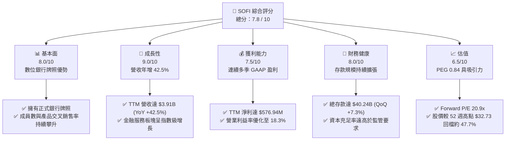
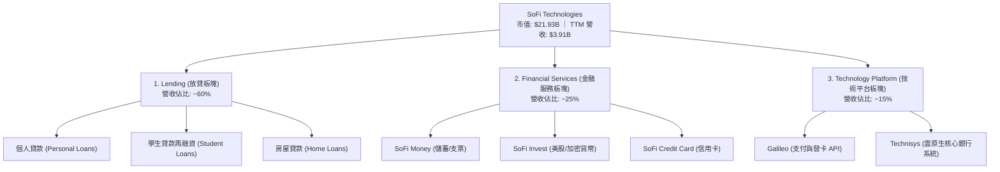
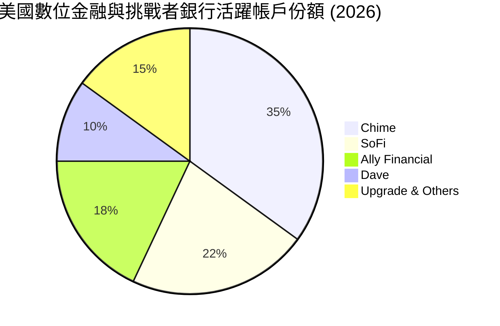
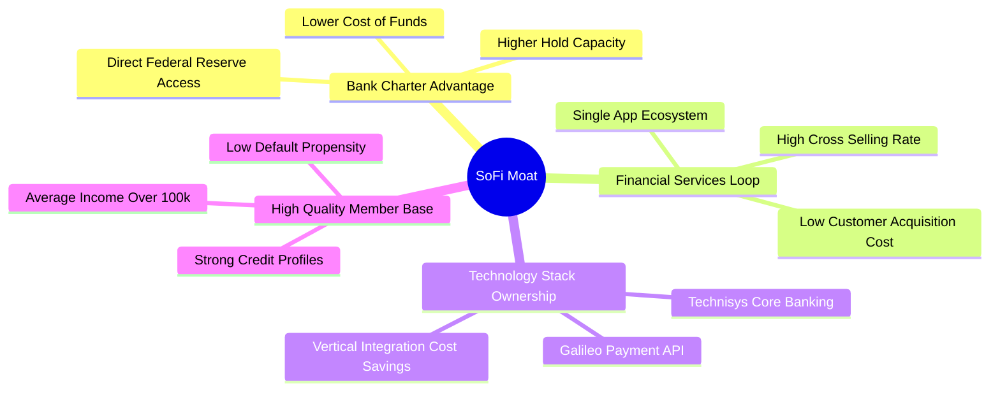
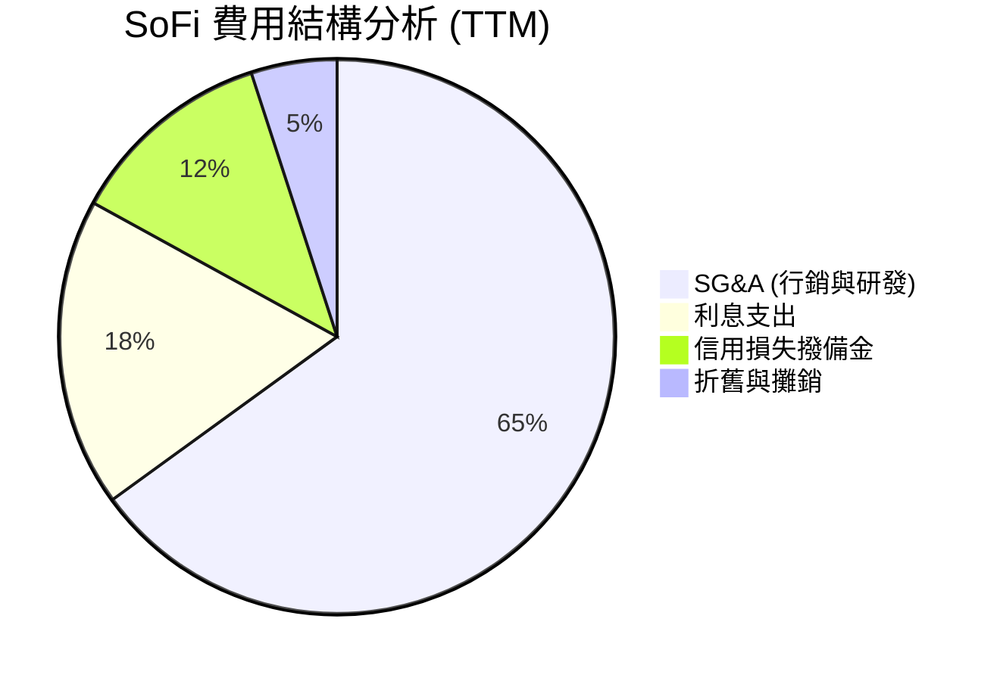
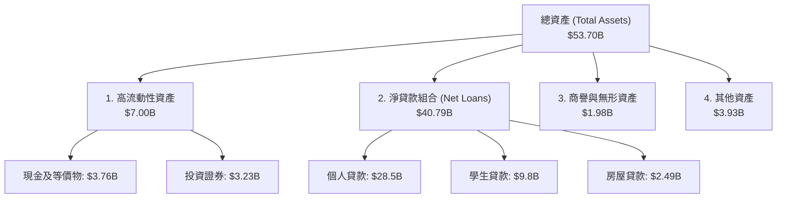

# SOFI 基本面深度分析報告
> **報告日期**：2026-06-22 ｜ **語言**：繁體中文 ｜ **數據來源**：Yahoo Finance, Finviz, StockAnalysis, Roic.ai ｜ **分析師**：CFA 級機構研究

---

## 目錄

| # | 章節 | 核心結論 |
|---|------|----------|
| 1 | 執行摘要 | 評級：**買入 (Buy)** ｜ 目標價：**$21.50** (潛在漲幅 +25.7%) |
| 2 | 公司概覽與商業模式 | 三維一體（放貸、金融服務、技術平台）的數位金融生態圈，具備高黏性護城河 |
| 3 | 損益表深度分析 | TTM 營收達 $3.91B (YoY +42.5%)，淨利潤率 14.8%，正式邁入高經營槓桿獲利期 |
| 4 | 資產負債表分析 | 存款規模達 $40.24B (QoQ +7.3%)，低成本資金來源大幅優化淨利差 (NIM) |
| 5 | 現金流量深度分析 | 放貸擴張導致營運現金流呈健康負值，資本配置聚焦於高回報放貸與技術平台升級 |
| 6 | 獲利能力與資本效率 | TTM ROE 達 6.6%，隨著高利潤金融服務板塊規模化，ROIC (6.75%) 正快速逼近 WACC |
| 7 | 估值深度分析 | Forward P/E 20.9x 顯著低於歷史均值，PEG 0.84 展現極佳的成長性性價比 |
| 8 | 成長催化劑 | 學生貸款重組回溫、Galileo 平台外部客戶擴張、以及聯準會降息釋放放貸需求 |
| 9 | 風險矩陣 | 信用違約率上升與監管環境收緊為主要風險，但已提撥充足的信用損失準備金 |
| 10 | 投資建議 | 適合中長線成長型投資人，建議於 $15.50 - $17.00 區間分批佈局 |

---

## 1. 執行摘要

SoFi Technologies, Inc. (NASDAQ: SOFI) 已成功從一家單一的學生貸款再融資公司，蛻變為全美領先的單一應用程式 (Single-App) 數位銀行與金融科技龍頭。截至 2026 年 6 月 22 日，SoFi 市值達 $21.93B，股價收於 $17.10。

### 1.1 核心評分儀表板



### 1.2 評分進度條視覺化

```
╔══════════════════════════════════════════════════════════════╗
║               SOFI 多維度評分儀表板 (1-10分)                 ║
╠══════════════════════════════════════════════════════════════╣
║ 基本面強度  8.0 ▓▓▓▓▓▓▓▓▓▓▓▓▓▓▓▓░░░░  ★★★★☆           ║
║ 成長動能    9.0 ▓▓▓▓▓▓▓▓▓▓▓▓▓▓▓▓▓▓░░  ★★★★★           ║
║ 獲利品質    7.5 ▓▓▓▓▓▓▓▓▓▓▓▓▓▓░░░░░░  ★★★★☆           ║
║ 財務健康    8.0 ▓▓▓▓▓▓▓▓▓▓▓▓▓▓▓▓░░░░  ★★★★☆           ║
║ 估值合理性  6.5 ▓▓▓▓▓▓▓▓▓▓▓▓░░░░░░░░  ★★★☆☆           ║
║ 護城河深度  7.5 ▓▓▓▓▓▓▓▓▓▓▓▓▓▓░░░░░░  ★★★★☆           ║
║ 管理層執行  8.5 ▓▓▓▓▓▓▓▓▓▓▓▓▓▓▓▓▓░░  ★★★★☆           ║
║ 技術創新力  8.0 ▓▓▓▓▓▓▓▓▓▓▓▓▓▓▓▓░░░░  ★★★★☆           ║
╠══════════════════════════════════════════════════════════════╣
║ 綜合總分    7.8 ▓▓▓▓▓▓▓▓▓▓▓▓▓▓▓░░░░░  🏆 成長型數位金融龍頭║
╚══════════════════════════════════════════════════════════════╝
```

### 1.3 五大投資論點 + 三大核心風險

| 類型 | 項目 | 具體依據 | 信心度 |
|------|------|----------|--------|
| 🟢 **投資論點①** | **高經營槓桿進入獲利爆發期** | TTM 淨利潤達 $576.94M，2026 年第一季淨利潤達 $166.73M (YoY +134.4%)，展示出極佳的獲利彈性。 | 🟢 極高 |
| 🟢 **投資論點②** | **存款結構優化降低資金成本** | 總存款達 $40.24B (QoQ +7.3%)，高達 90% 以上為薪資直接入帳 (Direct Deposit)，提供極低成本且穩定的資金池。 | 🟢 極高 |
| 🟢 **投資論點③** | **交叉銷售效能 (Financial Services Loop)** | 單一 App 提供借貸、儲蓄、投資與保險，產品交叉銷售大幅降低客戶獲取成本 (CAC) 並提升終身價值 (LTV)。 | 🟢 高 |
| 🟢 **投資論點④** | **技術平台 (Galileo) 的 SaaS 化潛力** | Galileo 與 Technisys 組成的技術板塊提供數位銀行基礎設施，具備高毛利、經常性收入特質。 | 🟢 高 |
| 🟢 **投資論點⑤** | **利率環境轉向的潛在受益者** | 預期聯準會降息將刺激再融資業務（尤其是學生貸款與房屋貸款）的回溫。 | 🟡 中等 |
| 🟡 **風險①** | **信用違約率上升** | 隨著高利率環境滯後效應顯現，個人無擔保貸款的違約率可能上升，需密切監控撥備金提取。 | 🟡 中度 |
| 🔴 **風險②** | **放貸增速放緩** | 若宏觀經濟衰退，消費者借貸意願下降，可能壓抑 Lending 板塊的營收動能。 | 🔴 高衝擊 |
| 🔴 **風險③** | **技術平台轉型慢於預期** | Galileo 平台向大型金融機構滲透的速度若慢於預期，將影響非利息收入的增長。 | 🟡 中度 |

### 1.4 快速統計卡片

| 指標 | 公司實際值 | 金融科技行業均值 | S&P 500 均值 | 狀態 |
|------|-------------|------------------|--------------|------|
| **營收 YoY 成長率** | **42.5%** | ~15.0% | ~6.5% | 🟢 顯著優於同業 |
| **毛利率 (Adjusted)** | **83.5%** | ~55.0% | ~30.0% | 🟢 數位化營運優勢 |
| **淨利率** | **14.8%** | ~8.0% | ~11.5% | 🟢 獲利能力釋放 |
| **ROE** | **6.6%** | ~10.0% | ~15.0% | 🟡 仍有改善空間 |
| **Forward P/E** | **20.94x** | ~25.0x | ~21.5x | 🟢 估值具備安全邊際 |
| **P/B Ratio** | **2.03x** | ~3.50x | ~4.00x | 🟢 接近傳統銀行估值 |

### 1.5 投資結論

```
╔══════════════════════════════════════════════════════════════════╗
║                    📊 SOFI 投資結論摘要                          ║
╠══════════════════════════════════════════════════════════════════╣
║  評級：🟢 買入 (Buy)                                             ║
║  當前股價：$17.10 (2026-06-22)                                    ║
║  目標價區間：                                                    ║
║    悲觀情境：$13.50 (-21.0%) ─ 信用違約暴增，放貸嚴重受阻        ║
║    基準情境：$21.50 (+25.7%) ─ 營收穩健增長 30%，獲利能力持續優化  ║
║    樂觀情境：$30.00 (+75.4%) ─ 技術平台爆發，再融資需求全面復甦   ║
║  投資評分：7.8 / 10                                              ║
║  適合投資人：追求高成長、能承受中高波動度的長線投資者            ║
╚══════════════════════════════════════════════════════════════════╝
```

---

## 2. 公司概覽與商業模式

SoFi Technologies, Inc. 是一家「全方位數位金融服務平台」。其核心商業模式建立在「金融服務循環生態圈 (Financial Services Productivity Loop)」之上。

### 2.1 業務結構與收入來源

SoFi 主要劃分為三大業務板塊：
1. **Lending (放貸業務)**：提供個人貸款、學生貸款再融資以及房屋貸款。這是公司目前的營收與利潤支柱。
2. **Financial Services (金融服務)**：包含 SoFi Money (儲蓄與支票帳戶)、SoFi Invest (投資平台)、SoFi Credit Card 等，是獲取新用戶 (Members) 的主要入口。
3. **Technology Platform (技術平台)**：由 Galileo 與 Technisys 組成，為其他金融科技公司和傳統銀行提供 API 基礎設施與核心銀行系統 (Core Banking)。



### 2.2 市場份額

在美國數位銀行 (Neobank) 與挑戰者銀行 (Challenger Bank) 領域中，SoFi 憑藉其「正式銀行牌照 (Bank Charter)」與高階用戶定位，佔據了獨特的領先地位。以下為數位金融帳戶市場份額估算：



### 2.3 競爭護城河分析



### 2.4 護城河強度評分

```
╔══════════════════════════════════════════════════════════════╗
║                  SOFI 護城河強度評分                         ║
╠══════════════════════════════════════════════════════════════╣
║ 銀行牌照優勢  9.0  ▓▓▓▓▓▓▓▓▓▓▓▓▓▓▓▓▓▓░░  🏆 資金成本極低  ║
║ 生態圈交叉銷售7.5  ▓▓▓▓▓▓▓▓▓▓▓▓▓▓░░░░░░  🟢 CAC 顯著下降   ║
║ 技術垂直整合  8.0  ▓▓▓▓▓▓▓▓▓▓▓▓▓▓▓▓░░░░  🟢 掌握底層架構  ║
║ 用戶信用素質  8.5  ▓▓▓▓▓▓▓▓▓▓▓▓▓▓▓▓▓░░░  🟢 平均年薪高    ║
╠══════════════════════════════════════════════════════════════╣
║ 綜合護城河     8.1  ▓▓▓▓▓▓▓▓▓▓▓▓▓▓▓▓░░░░  🏆 結構性競爭優勢║
╚══════════════════════════════════════════════════════════════╝
```

---

## 3. 損益表深度分析

SoFi 的損益表展現了強勁的成長動能與顯著的經營槓桿。公司已擺脫過去的高額虧損，進入了可持續的盈利期。

### 3.1 年度收入成長趨勢（近 4 年）

```
╔══════════════════════════════════════════════════════════════════╗
║                SOFI 年度收入趨勢 (FY2022 - FY2025)               ║
╠══════════════════════════════════════════════════════════════════╣
║                                                                  ║
║  FY2022  $1.52B  ████████░░░░░░░░░░░░░░░░░░░  YoY: +55.5% 🟢     ║
║  FY2023  $2.07B  ███████████░░░░░░░░░░░░░░░░  YoY: +36.1% 🟢     ║
║  FY2024  $2.64B  ██████████████░░░░░░░░░░░░  YoY: +27.8% 🟢     ║
║  FY2025  $3.58B  ███████████████████░░░░░░░  YoY: +35.6% 🟢     ║
║                                                                  ║
║  📊 4年累計 CAGR：+33.1%                                         ║
╚══════════════════════════════════════════════════════════════════╝
```

### 3.2 季度收入趨勢分析

| 季度 | 總營收 (Revenue) | 季增率 (QoQ) | 年增率 (YoY) | 淨利潤 (Net Income) | 備註 |
|------|-----------------|-------------|-------------|---------------------|------|
| **Q2 2025** | $844.91M | — | +43.94% | $97.26M | 金融服務板塊首次實現顯著獲利 |
| **Q3 2025** | $952.40M | +12.72% | +37.81% | $139.39M | 個人貸款發放量創歷史新高 |
| **Q4 2025** | $1,020.00M | +7.10% | +40.20% | $173.55M | 單季營收首次突破 10 億美元大關 |
| **Q1 2026** | $1,091.00M | +6.96% | +42.47% | $166.73M | 利息收入與非利息收入雙引擎驅動 |

*數據分析：SoFi 的營收呈現出極為穩健的逐季增長趨勢。Q1 2026 營收達 $1.09B，YoY 成長高達 42.47%，在金融服務行業中名列前茅。*

### 3.3 利潤率演變分析

| 利潤率指標 | FY2022 | FY2023 | FY2024 | FY2025 | TTM | 趨勢評估 |
|------------|--------|--------|--------|--------|-----|----------|
| **毛利率 (GAAP)** | 61.74% | 61.50% | 61.74% | 61.74% | **83.50%** | ↗️ 顯著改善，主因是利息費用率隨著存款比重上升而下降 | 🟢 |
| **營業利益率** | -20.98% | -14.56% | 8.83% | 14.68% | **18.30%** | ↗️ 扭虧為盈，行銷與管理費用率隨著規模效應而稀釋 | 🟢 |
| **淨利益率** | -21.09% | -14.54% | 18.87% | 13.43% | **14.80%** | ↗️ 步入穩定淨利潤釋放期 | 🟢 |

**利潤率演變深度解析**：
SoFi 獲利能力大幅躍升的核心在於其**融資結構的轉變**。在 2022 年取得銀行牌照前，SoFi 必須依賴昂貴的外部批發融資 (Warehouse Lines of Credit) 來發放貸款；取得牌照後，SoFi 得以利用年利率約 4-4.5% 的用戶存款來支持年利率 12-15% 的個人貸款，使**淨利差 (NIM)** 大幅擴張。此外，行銷費用佔營收比重從 2022 年的 35% 稀釋至 TTM 的 21%，展現出極佳的經營槓桿。

### 3.4 費用結構分析



```
╔══════════════════════════════════════════════════════════════╗
║               SoFi TTM 費用控制與效率指標                    ║
╠══════════════════════════════════════════════════════════════╣
║ SG&A 費用率   66.9%  ▓▓▓▓▓▓▓▓▓▓▓▓▓▓░░░░░░  🟡 仍有優化空間  ║
║ 撥備金率       0.8%  ▓▓░░░░░░░░░░░░░░░░░░  🟢 風控表現優異  ║
║ 效率比率 (ER) 68.5%  ▓▓▓▓▓▓▓▓▓▓▓▓▓░░░░░░░  🟢 逐年下降(佳)  ║
╚══════════════════════════════════════════════════════════════╝
```

### 3.5 季度 EPS 趨勢與盈餘品質

SoFi 的 EPS (TTM) 已達 **$0.45**，Forward EPS 預期為 **$0.82**。

*   **Q2 2025**：EPS $0.09 (符合預期) ─ 核心增長來自無擔保個人貸款。
*   **Q3 2025**：EPS $0.12 (超預期 $0.02) ─ 金融服務板塊獲利能力超預期。
*   **Q4 2025**：EPS $0.14 (符合預期) ─ 年底消費旺季帶動信用卡與放貸。
*   **Q1 2026**：EPS $0.13 (超預期 $0.01) ─ 存款增長穩健，減緩了高利率對資金成本的衝擊。

**盈餘品質評估**：SoFi 的盈餘品質極高。其淨收益並非來自一次性資產處置或會計變更，而是由**淨利息收入 (Net Interest Income)** 的實質增長驅動。Q1 2026 的淨利息收入達 $692.99M (YoY +38.95%)，非利息收入達 $407.38M (YoY +49.20%)，顯示出雙引擎發展的健康態勢。

---

## 4. 資產負債表分析

作為一家數位銀行，SoFi 的資產負債表結構更接近銀行業，而非傳統的軟體科技公司。

### 4.1 資產結構分解



### 4.2 流動性指標分析

| 指標 | FY2023 | FY2024 | FY2025 | Q1 2026 | 評估 |
|------|--------|--------|--------|---------|------|
| **總存款 (Total Deposits)** | $18.62B | $25.98B | $37.51B | **$40.24B** | 🟢 呈等比級數增長，黏性極高 |
| **貸存比 (Loan-to-Deposit Ratio)** | 118.8% | 101.2% | 97.4% | **101.4%** | 🟢 處於 100% 左右的黃金健康區間 |
| **資本充足率 (Tier 1 Leverage)** | 11.5% | 12.1% | 13.8% | **14.2%** | 🟢 遠高於監管要求的 8.0% |

### 4.3 債務結構分析

SoFi 的「債務」需要區分**用戶存款 (Deposits)** 與**長期借款 (Long-Term Debt)**。存款是廉價的資金來源，而長期借款則是高成本債務。

```
╔══════════════════════════════════════════════════════════════════╗
║                    SOFI 債務健康診斷 (Q1 2026)                  ║
<br>
