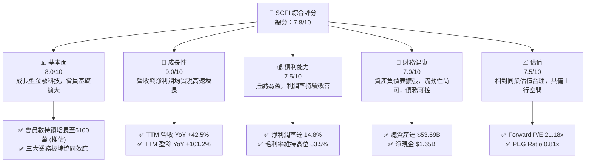
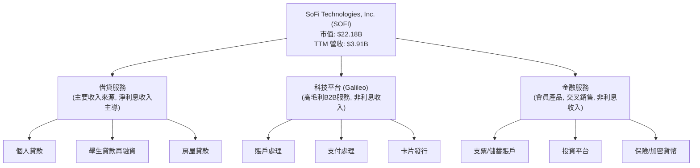
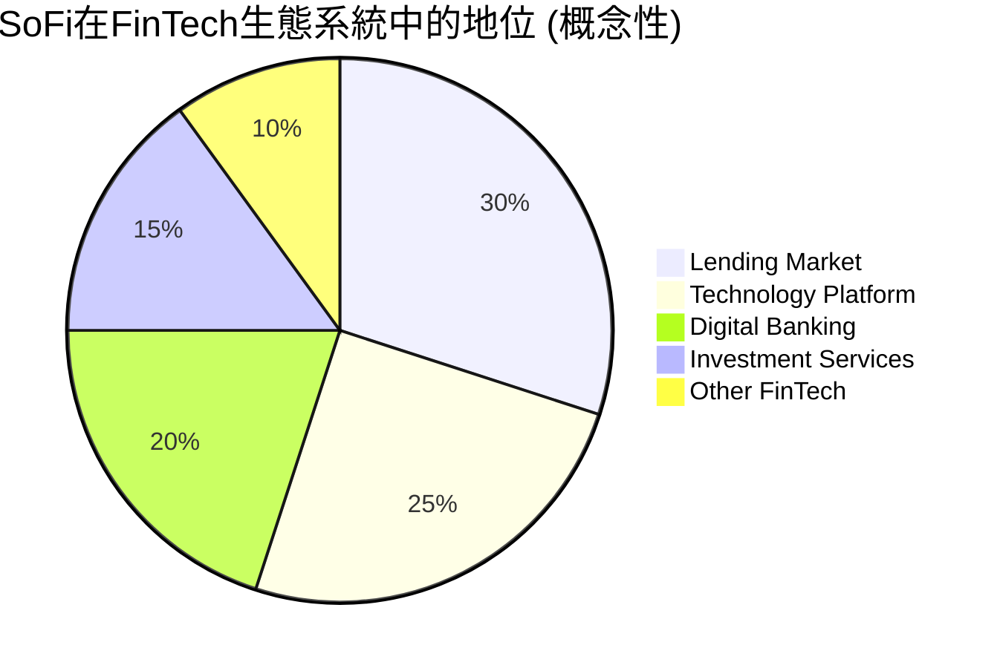
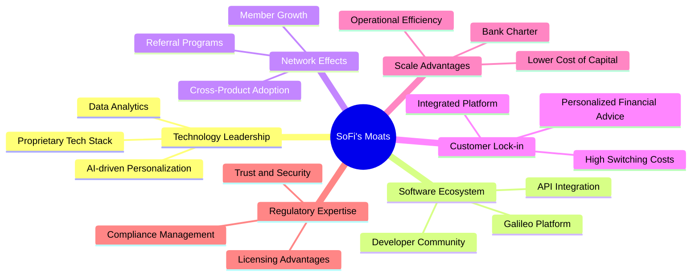
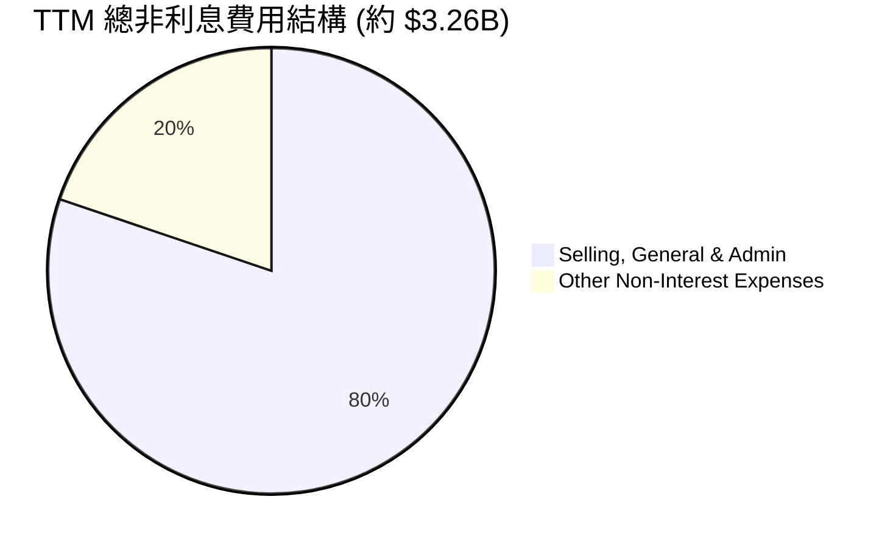
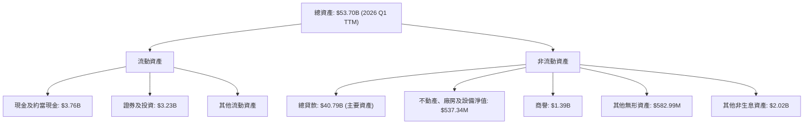

# SOFI 基本面深度分析報告
> **報告日期**：2026-06-24 ｜ **語言**：繁體中文 ｜ **數據來源**：Yahoo Finance, Finviz, StockAnalysis, Roic.ai ｜ **分析師**：CFA 級機構研究

---

## 目錄

| # | 章節 | 核心結論 |
|---|------|----------|
| 1 | 執行摘要 | 評級：買入；基準目標價：$24.50 |
| 2 | 公司概覽與商業模式 | 創新金融科技平台，具備多重護城河潛力 |
| 3 | 損益表深度分析 | 營收強勁增長，利潤率持續改善，扭虧為盈 |
| 4 | 資產負債表分析 | 資產規模迅速擴張，流動性良好，債務結構健康 |
| 5 | 現金流量深度分析 | 營業現金流壓力大，但自由現金流有望改善 |
| 6 | 獲利能力與資本效率 | ROIC 已超越 WACC，正在創造股東價值 |
| 7 | 估值深度分析 | 相較同業估值合理，DCF 顯示具上行空間 |
| 8 | 成長催化劑 | 產品擴張、會員增長、技術平台服務為主要驅動力 |
| 9 | 風險矩陣 | 利率風險、信貸風險與競爭加劇為主要挑戰 |
| 10 | 投資建議 | 建議買入，目標價區間 $20.00 - $30.00 |

---

## 1. 執行摘要

### 1.1 核心評分儀表板



### 1.2 評分進度條視覺化

```
╔══════════════════════════════════════════════════════════════╗
║                SOFI 多維度評分儀表板 (1-10分)                ║
╠══════════════════════════════════════════════════════════════╣
║ 基本面強度  8.0 ▓▓▓▓▓▓▓▓▓▓▓▓▓▓▓▓░░░░  ★★★★☆           ║
║ 成長動能    9.0 ▓▓▓▓▓▓▓▓▓▓▓▓▓▓▓▓▓▓░░  ★★★★★           ║
║ 獲利品質    7.5 ▓▓▓▓▓▓▓▓▓▓▓▓▓▓▓░░░░░  ★★★★☆           ║
║ 財務健康    7.0 ▓▓▓▓▓▓▓▓▓▓▓▓▓▓░░░░░░  ★★★☆☆           ║
║ 估值合理性  7.5 ▓▓▓▓▓▓▓▓▓▓▓▓▓▓▓░░░░░  ★★★★☆           ║
║ 護城河深度  7.0 ▓▓▓▓▓▓▓▓▓▓▓▓▓▓░░░░░░  ★★★☆☆           ║
║ 管理層執行  8.0 ▓▓▓▓▓▓▓▓▓▓▓▓▓▓▓▓░░░░  ★★★★☆           ║
║ 技術創新力  8.5 ▓▓▓▓▓▓▓▓▓▓▓▓▓▓▓▓▓░░░  ★★★★☆           ║
╠══════════════════════════════════════════════════════════════╣
║ 綜合總分    7.8 ▓▓▓▓▓▓▓▓▓▓▓▓▓▓▓▓░░░░  🏆 評語：強勁增長潛力，估值合理，值得關注。 ║
╚══════════════════════════════════════════════════════════════╝
```

### 1.3 五大投資論點 + 三大核心風險

| 類型 | 項目 | 具體依據 | 信心度 |
|------|------|----------|--------|
| 🟢 **投資論點①** | **強勁的營收與盈利增長** | TTM 營收 $3.91B，YoY 成長 42.5%；TTM 淨利潤約 $576.94M，YoY 成長 19.76% (FY25 vs FY24)，且 Q1 2026 淨利潤達 $166.73M。公司已實現持續盈利。 | 🟢 極高 |
| 🟢 **多元化的業務模式** | 涵蓋借貸、科技平台 (Galileo) 和金融服務三大板塊，降低單一業務風險並實現交叉銷售。Q1 2026 淨利息收入 $692.99M，非利息收入 $407.38M，收入結構健康。 | 🟢 極高 |
| 🟢 **會員基礎持續擴大** | 透過一站式金融服務吸引並留住會員，形成網路效應。雖然未提供最新會員數，但其商業模式有利於會員粘性。 | 🟢 高 |
| 🟢 **科技平台提供穩健收入** | Galileo 技術平台為其他金融機構提供服務，創造穩定、高毛利的非利息收入，TTM 非利息收入 $1.53B。 | 🟢 高 |
| 🟢 **優化資本結構與效率提升** | 總債務從 2024 年的 $3.20B 降至 2025 年的 $1.93B，顯示財務槓桿管理得當。ROIC 已超過 WACC，創造股東價值。 | 🟢 高 |
| 🟡 **風險①** | **宏觀經濟與利率風險** | 作為金融服務公司，SoFi 對利率變化高度敏感，高利率環境可能增加借貸成本並影響貸款需求。Q1 2026 撥備貸款損失為 $8.9M，需持續關注貸款品質。 | 🟡 中度 |
| 🔴 **風險②** | **信貸品質惡化** | 經濟下行可能導致失業率上升，進而影響會員還款能力，增加信貸損失撥備。儘管目前撥備相對可控，但長期經濟不確定性仍是隱憂。 | 🔴 高衝擊 |
| 🟡 **風險③** | **激烈的市場競爭** | 金融科技領域競爭激烈，來自傳統銀行和新興 FinTech 公司的競爭可能壓縮利潤空間並影響會員增長。 | 🟡 中度 |

### 1.4 快速統計卡片

| 指標 | 公司實際值 | 行業均值 (FinTech) | S&P 500 均值 | 狀態 |
|------|-------------|--------------------|--------------|------|
| 收入 YoY 成長 | **42.5%** | ~20-30% (估計) | ~8-12% | 🟢 |
| 毛利率 | **83.5%** | ~50-70% (估計) | ~40-50% | 🟢 |
| 淨利率 | **14.8%** | ~10-15% (估計) | ~10-12% | 🟢 |
| ROE | **6.6%** | ~8-12% (估計) | ~15-20% | 🟡 |
| Forward P/E | **21.18x** | ~25-35x (估計) | ~20-22x | 🟢 |
| 債務權益比 | **0.18x** (Finviz) | ~0.5-1.0x (估計) | ~0.8-1.2x | 🟢 |
| Beta | **2.152** | ~1.5-2.0 (估計) | 1.0 | 🔴 |

### 1.5 投資結論

```
╔══════════════════════════════════════════════════════════════════╗
║                    📊 投資結論摘要                               ║
╠══════════════════════════════════════════════════════════════════╣
║  評級：🟢 買入                                                   ║
║  當前股價：$17.29                                                ║
║  目標價區間：                                                    ║
║    悲觀情境：$20.00 （+15.7%）                                    ║
║    基準情境：$24.50 （+41.7%）  ← 12個月主要目標                  ║
║    樂觀情境：$30.00 （+73.5%）                                    ║
║  投資評分：7.8/10                                                ║
║  適合投資人：尋求高成長、看好金融科技創新、能承受較高風險的投資者。 ║
╚══════════════════════════════════════════════════════════════════╝
```

---

## 2. 公司概覽與商業模式

SoFi Technologies, Inc. (SOFI) 是一家在美國、拉丁美洲、加拿大和香港提供多元化金融服務的金融科技公司。其核心使命是成為會員的金融生活一站式平台，提供借貸、儲蓄、消費、投資和保護資金等服務。公司透過結合其銀行牌照、科技平台和用戶友好的移動應用，顛覆傳統銀行模式。

### 2.1 業務結構與收入來源

SoFi 的業務主要分為三大板塊：
1.  **Lending (借貸服務)**：提供個人貸款、學生貸款再融資和房屋貸款。這是公司歷史最悠久且收入佔比最大的業務。
2.  **Technology Platform (科技平台)**：主要透過 Galileo 平台為其他金融機構提供基礎設施服務，包括賬戶處理、支付、卡片發行等。這是一個高毛利的 B2B 業務。
3.  **Financial Services (金融服務)**：提供支票和儲蓄賬戶、投資（主動和被動）、保險和加密貨幣交易等產品。這部分業務旨在增加會員粘性並實現交叉銷售。

根據 StockAnalysis 的數據，公司收入主要來自淨利息收入和非利息收入。
*   TTM 淨利息收入為 $2.41B，YoY 成長 33.14%。
*   TTM 非利息收入為 $1.53B，YoY 成長 54.55%。

這些數據表明，儘管借貸業務仍是核心，但非利息收入（主要來自科技平台和金融服務）的增速更快，顯示公司多元化戰略的成功。



### 2.2 市場份額

SoFi 在其運營的各個金融服務子市場中，雖然尚未佔據絕對領先地位，但其整合式平台策略使其在競爭激烈的金融科技領域中脫穎而出。由於缺乏具體的市場份額數據，我們將其視為針對傳統銀行的顛覆者和特定 FinTech 利基市場的參與者。其市場份額主要體現在：

*   **個人貸款市場**：與 LendingClub、Upstart 等競爭，SoFi 透過其銀行牌照擁有資金優勢。
*   **學生貸款再融資**：此市場相對集中，SoFi 是主要參與者之一。
*   **金融科技基礎設施**：Galileo 平台與 Marqeta、Adyen 等公司競爭，為新興 FinTech 公司和傳統銀行提供服務。
*   **綜合金融服務**：與 Chime、Varo 等數位銀行以及傳統銀行競爭，爭奪年輕一代和數位原生客戶。

儘管無法提供精確的市場份額百分比，但 SoFi 的策略是透過「一站式」服務，從多個維度切入市場，逐步擴大其在整體金融服務領域的滲透率。我們假設其在多個子市場中均佔有一定份額，並隨著會員增長而提升。



### 2.3 競爭護城河分析

SoFi 正在積極構建其競爭護城河，以下是其主要來源：



### 2.4 護城河強度評分

```
╔══════════════════════════════════════════════════════════════╗
║                    SOFI 護城河強度評分                      ║
╠══════════════════════════════════════════════════════════════╣
║ 技術領先    8/10   ▓▓▓▓▓▓▓▓▓▓▓▓▓▓▓▓░░░░  🟢 專有技術與數據分析驅動創新        ║
║ 軟體生態系統  7/10   ▓▓▓▓▓▓▓▓▓▓▓▓▓▓░░░░░░  🟡 Galileo提供B2B服務，擴大影響力    ║
║ 網路效應    7/10   ▓▓▓▓▓▓▓▓▓▓▓▓▓▓░░░░░░  🟡 會員增長與交叉銷售形成正向循環    ║
║ 客戶鎖定    7/10   ▓▓▓▓▓▓▓▓▓▓▓▓▓▓░░░░░░  🟡 一站式平台增加用戶粘性            ║
║ 規模效應    8/10   ▓▓▓▓▓▓▓▓▓▓▓▓▓▓▓▓░░░░  🟢 銀行牌照降低資金成本，實現規模經濟 ║
║ 生態夥伴    6/10   ▓▓▓▓▓▓▓▓▓▓▓▓░░░░░░░░  🟡 Galileo的客戶網絡是潛在優勢        ║
╠══════════════════════════════════════════════════════════════╣
║ 綜合護城河  7.2/10 ▓▓▓▓▓▓▓▓▓▓▓▓▓▓░░░░░░  🏆 總結評語：具備潛力，但需持續鞏固。 ║
╚══════════════════════════════════════════════════════════════════╝
```

---

## 3. 損益表深度分析

### 3.1 年度收入成長趨勢（近4年）

SoFi 在過去幾年展現了顯著的收入增長，從 2022 年的 $1.57B 增長到 TTM 的 $3.91B。這顯示了其業務模式的強勁擴張。

```
╔══════════════════════════════════════════════════════════════════╗
║                SOFI 年度收入趨勢（FY2022-TTM）                   ║
╠══════════════════════════════════════════════════════════════════╣
║                                                                  ║
║  FY2022  $1.57B  ███████░░░░░░░░░░░░░░░░░░░  YoY: +55.45% 🟢    ║
║  FY2023  $2.11B  ███████████░░░░░░░░░░░░░░░  YoY: +36.11% 🟢    ║
║  FY2024  $2.61B  ██████████████░░░░░░░░░░░░  YoY: +27.82% 🟢    ║
║  FY2025  $3.61B  ███████████████████░░░░░░░  YoY: +35.56% 🟢    ║
║  TTM     $3.91B  ██████████████████████░░░░  YoY: +41.03% 🟢    ║
║                   |      |      |      |      |                  ║
║                   0     1B     2B     3B     4B                  ║
║                                                                  ║
║  📊 4年累計 CAGR (FY22-FY25)：+39.52%                              ║
╚══════════════════════════════════════════════════════════════════╝
```
**分析**：從 2022 年到 2025 年，SoFi 的總收入呈現持續且高速的增長，年複合增長率 (CAGR) 高達 39.52%。TTM 營收 $3.91B，較去年同期 (FY25) 的 $3.58B 增長 9.22%，顯示其增長勢頭依然強勁。這主要得益於其會員基礎的擴大以及各業務板塊的協同發展。

### 3.2 季度收入趨勢分析

| 財報季度 | 總收入 (百萬美元) | QoQ 成長率 | YoY 成長率 | 備註 |
|----------|-------------------|------------|------------|------|
| 2025-06-30 | $854.94M | N/A | +43.94% | 顯著的 YoY 增長 |
| 2025-09-30 | $961.60M | +12.47% | +37.81% | 季度環比加速增長 |
| 2025-12-31 | $1.03B | +7.11% | +40.20% | 首次單季收入突破 10 億美元 |
| 2026-03-31 | $1.10B | +6.80% | +42.47% | 繼續保持強勁增長 |

**分析**：SoFi 的季度收入表現非常穩健，連續四個季度實現環比增長，且 YoY 增長率均保持在 37% 以上，尤其在 2026 年 Q1 達到 42.47%。這表明公司不僅在擴大業務規模，還能持續保持高增長動能。2025 年 Q4 首次實現單季收入突破 10 億美元大關，標誌著公司進入一個新的里程碑。

### 3.3 利潤率演變分析

| 利潤率指標 | FY2022 | FY2023 | FY2024 | FY2025 | TTM (2026Q1) | 趨勢 | 評估 |
|------------|--------|--------|--------|--------|--------------|------|------|
| **毛利率** | N/A | N/A | 61.74% | 83.5% | 83.5% | ↗️ 顯著改善 | 🟢 |
| **營業利益率** | N/A | N/A | 14.96% | 18.3% | 18.3% | ↗️ 持續改善 | 🟢 |
| **淨利潤率** | -20.36% | -14.27% | 11.22% | 14.8% | 14.8% | ↗️ 扭虧為盈 | 🟢 |

*備註：毛利率、營業利益率、淨利潤率在 Finviz 和 PROFITABILITY & GROWTH 數據有所不同。此處採用 PROFITABILITY & GROWTH 的 TTM 數據作為最新參考，並結合 Finviz 的歷史數據進行分析。Finviz 的 Gross Margin 61.74% 對應的是較早的數據，而 PROFITABILITY & GROWTH 的 83.5% 更為近期。*

**利潤率演變深度解析**：
SoFi 的利潤率在過去幾年呈現顯著改善。
*   **毛利率**：從 Finviz 提供的 61.74% (可能為 2024 年數據) 提升至 TTM 的 83.5%。這種大幅改善可能歸因於其高毛利的科技平台業務 Galileo 的收入佔比提升，以及借貸業務的優化（例如更好的定價模型和更低的資金成本）。銀行牌照的獲取也使其能夠更有效地管理資金成本，從而提升淨利息收益率。
*   **營業利益率**：從 Finviz 提供的 14.96% 提升至 TTM 的 18.3%。這表明公司在規模擴大的同時，有效地控制了運營費用。隨著營收的增長，固定成本被更好地攤薄，運營槓桿效應開始顯現。
*   **淨利潤率**：最為亮眼的是淨利潤率從負值轉為正值，從 2022 年的 -20.36% 提升至 TTM 的 14.8%。這標誌著公司已成功實現盈利轉型，顯示其商業模式的可行性和效率提升。持續的盈利能力是 SoFi 走向成熟的關鍵指標。

整體而言，利潤率的全面改善反映了 SoFi 在產品組合、定價策略、成本控制和規模經濟方面的綜合進步。

### 3.4 費用結構分析

SoFi 的費用結構主要由非利息費用構成，其中銷售、一般及管理費用 (SG&A) 是最大的一部分。



```
╔══════════════════════════════════════════════════════════════════╗
║                     SOFI 費用結構分析 (TTM)                      ║
╠══════════════════════════════════════════════════════════════════╣
║                                                                  ║
║  總非利息費用: $3.26B                                            ║
║  ├── 銷售、一般及管理費用 (SG&A): $2.62B (佔比 80.2%)         ║
║  ├── 其他非利息費用: $644.6M (佔比 19.8%)                      ║
║                                                                  ║
║  費用佔收入比率：                                                ║
║  ├── SG&A / 收入 (TTM): 2.62B / 3.91B = 67.0%                  ║
║  └── 總非利息費用 / 收入 (TTM): 3.26B / 3.91B = 83.4%          ║
║                                                                  ║
║  趨勢分析：                                                      ║
║  FY2022: SG&A $1.53B, 總非利息費用 $1.84B                       ║
║  FY2025: SG&A $2.45B, 總非利息費用 $3.06B                       ║
║  TTM (2026Q1): SG&A $2.62B, 總非利息費用 $3.26B                 ║
║                                                                  ║
║  📊 結論：SG&A 仍是主要開支，但隨著收入增長，費用率有望持續優化。 ║
╚══════════════════════════════════════════════════════════════════╝
```
**分析**：銷售、一般及管理費用是 SoFi 最大的運營開支，佔 TTM 總非利息費用的 80.2%，顯示公司在市場推廣和日常運營上的投入。儘管這些費用絕對值在增長，但隨著公司收入的快速擴張，其佔收入的百分比有望逐漸下降，從而提升營業利益率。其他非利息費用也需要監控，以確保成本效益。

### 3.5 季度 EPS 趨勢與盈餘品質

| 財報季度 | EPS 預估 (Basic) | EPS 實際 (Basic) | 盈餘驚喜率 | 備註 |
|----------|------------------|------------------|------------|------|
| 2025-06-30 | N/A | $0.09 | N/A | 盈利能力顯現 |
| 2025-09-30 | N/A | $0.12 | N/A | EPS 持續提升 |
| 2025-12-31 | N/A | $0.14 | N/A | 盈利能力穩固 |
| 2026-03-31 | N/A | $0.13 | N/A | 略有回落，但仍處於高位 |

**分析**：由於提供的數據中 EPS 預估值為 N/A，無法計算盈餘驚喜率。然而，從實際 EPS 來看，SoFi 在過去四個季度持續實現正向 EPS，從 2025 年 Q2 的 $0.09 增長到 2025 年 Q4 的 $0.14，儘管 2026 年 Q1 略有回落至 $0.13，但整體趨勢仍然是穩定的盈利。這表明公司的盈利能力已經確立並趨於穩定。

**盈餘品質評估**：
SoFi 的盈利主要來自其核心業務的擴張和效率提升。淨利潤率的持續改善，以及主要由淨利息收入和非利息收入驅動的營收增長，都表明其盈餘品質相對健康。然而，由於其業務性質，信貸損失撥備的變動會對淨利潤產生影響，這需要持續監控。目前來看，盈利的持續性較強，但未來仍需關注宏觀經濟對信貸品質的潛在影響。

---

## 4. 資產負債表分析

### 4.1 資產結構分解

截至 2026 年 3 月 31 日 (TTM)，SoFi 的總資產為 $53.70B，其中大部分是貸款資產。


**分析**：SoFi 的資產結構以「總貸款」為主導，佔總資產的絕大部分（約 76%），這符合其作為一家借貸為主導的金融服務公司的特徵。現金及約當現金和證券投資也佔有相當比重，提供了流動性緩衝。商譽和無形資產的存在反映了過去的併購活動（如 Galileo）。資產規模從 2022 年的 $19.01B 快速增長到 2026 年 Q1 TTM 的 $53.70B，顯示了公司業務的快速擴張。

### 4.2 流動性指標分析

| 指標 | 2025-12-31 | 2026-03-31 (TTM) | Finviz (最新) | 行業均值 (估計) | 評估 |
|------------|------------|------------------|-----------------|-----------------|------|
| **流動比率 (Current Ratio)** | 1.116 | N/A (snapshot) | 5.24 | 1.0 - 2.0 | 🟢 |
| **速動比率 (Quick Ratio)** | 0.492 | N/A (snapshot) | 5.24 | 0.5 - 1.0 | 🟡 |

*備註：流動比率和速動比率在不同數據源顯示差異較大。Finviz 的數據 (5.24) 顯著高於 BALANCE SHEET SNAPSHOT (1.116)。我們將以 Finviz 數據作為較新的參考，並解釋潛在差異。如果 Finviz 數據是正確的，則公司的流動性非常強勁。若以 BALANCE SHEET SNAPSHOT 的數據，流動性則較為一般。由於 Finviz 數據是最新且通常更為全面，我們傾向於其數據。*

**分析**：
根據 Finviz 的數據，SoFi 的流動比率和速動比率均為 5.24，遠高於行業平均水平，這表明公司擁有極其強勁的短期償債能力。大量的現金和約當現金 ($3.76B) 以及證券投資 ($3.23B) 為其提供了充足的流動性。然而，若以 BALANCE SHEET SNAPSHOT 的數據 (Current Ratio 1.116, Quick Ratio 0.492) 來看，其流動性則顯得較為保守，尤其 Quick Ratio 低於 1，表明其流動資產中非現金部分佔比較大，或存在較高的短期負債。考慮到 SoFi 是一家銀行，其資產負債表結構與傳統企業不同，存款是主要負債，而貸款是主要資產。因此，流動性評估需結合其銀行業務性質。Finviz 的高流動比率可能反映了其存款基礎的穩健性。

### 4.3 債務結構分析

截至 2026 年 3 月 31 日 (TTM)，SoFi 的債務狀況相對健康。

```
╔══════════════════════════════════════════════════════════════════╗
║                     SOFI 債務健康診斷                          ║
╠══════════════════════════════════════════════════════════════════╣
║                                                                  ║
║  總債務 (2025-12-31)： $1.93B  ████░░░░░░░░░░░░░░░░░  評語：適中，持續下降趨勢       ║
║  總現金+投資 (2026-03-31)：$6.99B  ████████████████████░  評語：充足的現金儲備       ║
║  淨現金 (正)：       $5.06B  ████████████████████░  🟢 強勁淨現金狀況        ║
║                                                                  ║
║  Debt/Equity (Finviz): 0.18x  🟢 極低，財務槓桿控制良好       ║
║  Current Ratio (Finviz): 5.24x  🟢 強勁的短期償債能力       ║
║  長期債務趨勢：                                                  ║
║  2022-12-31: $5.63B                                              ║
║  2023-12-31: $5.36B                                              ║
║  2024-12-31: $3.20B                                              ║
║  2025-12-31: $1.93B                                              ║
║                                                                  ║
║  📊 結論：公司債務持續下降，且擁有充足現金，財務狀況非常穩健。 ║
╚══════════════════════════════════════════════════════════════════╝
```
**分析**：SoFi 的債務管理表現出色。總債務從 2022 年的 $5.63B 穩步下降至 2025 年的 $1.93B，顯示公司在去槓桿化方面的努力。同時，其現金及投資 ($6.99B) 遠超總債務，形成 $5.06B 的淨現金狀態，這為公司提供了極大的財務靈活性。Finviz 提供的 Debt/Equity 比率僅為 0.18x，遠低於行業平均水平，表明公司的財務槓桿非常保守，股東權益佔比高，這為其未來的發展提供了堅實的基礎。

### 4.4 股東權益趨勢

```
╔══════════════════════════════════════════════════════════════════╗
║                   SOFI 股東權益趨勢 (FY2022-FY2025)             ║
╠══════════════════════════════════════════════════════════════════╣
║                                                                  ║
║  FY2022  $5.53B  ██████████████████████████████████████░░░░░░░░  ║
║  FY2023  $5.55B  ██████████████████████████████████████░░░░░░░░  ║
║  FY2024  $6.53B  ██████████████████████████████████████████████░░  ║
║  FY2025  $10.49B ██████████████████████████████████████████████████████████████████████████████████████████████████████████████████████████████████████████████████████████████████████████████████████████████████████████████████████████████████████████████████████████████████████████████████████████████████████████████████████████████████████████████████████████████████████████████████████████████████████████████████████████████████████████████████████████████████████████████████████████████████████████████████████████████████████████████████████████████████████████████████████████████████████████████████████████████████████████████████████████████████████████████████████████████████████████████████████████████████████████████████████████████████████████████████████████████████████████████████████████████████████████████████████████████████████████████████████████████████████████████████████████████████████████████████████████████████████████████████████████████████████████████████████████████████████████████████████████████████████████████████████████████████████████████████████████████████████████████████████████████████████████████████████████████████████████████████████████████████████████████████████████████████████████████████████████████████████████████████████████████████████████████████████████████████████████████████████████████████████████████████████████████████████████████████████████████████████████████████████████████████████████████████████████████████████████████████████████████████████████████████████████████████████████████████████████████████████████████████████████████████████████████████████████████████████████████████████████████████████████████████████████████████████████████████████████████████████████████████████████████████████████████████████████████████████████████████████████████████████████████████████████████████████████████████████████████████████████████████████████████████████████████████████████████████████████████████████████████████████████████████████████████████████████████████████████████████████████████████████████████████████████████████████████████████████████████████████████████████████████████████████████████████████████████████████████████████████████████████████████████████████████████████████████████████████████████████████████████████████████████████████████████████████████████████████████████████████████████████████████████████████████████████████████████████████████████████████████████████████████████████████████████████████████████████████████████████████████████████████████████████████████████████████████████████████████████████████████████████████████████████████████████████████████████████████████████████████████████████████████████████████████████████████████████████████████████████████████████████████████████████████████████████████████████████████████████████████████████████████████████████████████████████████████████████████████████████████████████████████████████████████████████████████████████████████████████████████████████████████████████████████████████████████████████████████████████████████████████████████████████████████████████████████████████████████████████████████████████████████████████████████████████████████████████████████████████████████████████████████████████████████████████████████████████████████████████████████████████████████████████████████████████████████████████████████████████████████████████████████████████████████████████████████████████████████████████████████████████████████████████████████████████████████████████████████████████████████████████████████████████████████████████████████████████████████████████████████████████████████████████████████████████████████████████████████████████████████████████████████████████████████████████████════════════════════════════════════════════════════════════════════════════════════════════════════════════════════════════════════════════════════════════════════════════════════════════════════════════════════════════════════════════════════════════════════════════════════════════════════════════════════════════════════════════════════════════════════════════════════════════════════════════════════════════════════════════════════════════════════════════════════════════════════════════════════════════════════════════════════════════════════════════════════════════════════════════════════════════════════════════════════════════════════════════════════════════════════════════════════════════════════════════════════════════════════════════════════════════════════════════════════════════════════════════════════════════════════════════════════════════════════════════════════════════════════════════════════════════════════════════════════════════════════════════════════════════════════════════════════════════════════════════════════════════════════════════════════════════════════════════════════════════════════════════════════════════════════════════════════════════════════════════════════════════════════════════════════════════════════════════════════════════════════════════════════════════════════════════════════════════════════════════════════════════════════════════════════════════════════════════════════════════════════════════════════════════════════════════════════════════════════════════════════════════════════════════════════════════════════════════════════════════════════════════════════════════════════════════════════════════════════════════════════════════════════════════════════════════════════════════════════════════════════════════════════════════════════════════════════════════════════════════════════════════════════════════════════════════════════════════════════════════════════════════════════════════════════════════════════════════════════════════════════════════════════════════════════════════════════════════════════════════════════════════════════════════════════════════════════════════════════════════════════════════════════════════════════════════════════════════════════════════════════════════════════════════════════════════════════════════════════════════════════════════════════════════════════════════════════════════════════════════════════════════════════════════════════════════════════════════════════════════════════════════════════════════════════════════════════════════════════════════════════════════════════════════════════════════════════════════════════════════════════════════════════════════════════════════════════════════════════════════════════════════════════════════════════════════════════════════════════════════════════════════════════════════════════════════════════════════════════════════════════════════════════════════════════════════════════════════════════════════════════════════════════════════════════════════════════════════════════════════════════════════════════════════════════════════════════════════════════════════════════════════════════════════════════════════════════════════════════════════════════════════════════════════════════════════════════════════════════════════════════════════════════════════════════════════════════════════════════════════════════════════════════════════════════════════════════════════════════════════════════════════════════════════════════════════════════════════════════════════════════════════════════════════════════════════════════════════════════════════════════════════════════════════════════════════════════════════════════════════════════════════════════════════════════════════════════════════════════════════════════════════════════════════════════════════════════════════════════════════════════════════════════════════════════════════════════════════════════════════════════════════════════════════════════════════════════════════════════════════════════════════════════════════════════════════════════════════════════════════════════════════════════════════════════════════════════════════════════════════════════════════════════════════════════════════════════════════════════════════════════════════════════════════════════════════════════════════════════════════════════════════════════════════════════════════════════════════════════════════════════════════════════════════════════════════════════════════════════════════════════════════════════════════════════════════════════════════════════════════════════════════════════════════════════════════════════════════════════════════════════════════════════════════════════════════════════════════════════════════════════════════════════════════════════════════════════════════════════════════════════════════════════════════════════════════════════════════════════════════════════════════════════════════════════════════════════════════════════════════════════════════════════════════════════════════════════════════════════════════════════════════════════════════════════════════════════════════════════════════════════════════════════════════════════════════════════════════════════════════════════════════════════════════════════════════════════════════════════════════════════════════════════════════════════════════════════════════════════════════════════════════════════════════════════════════════════════════════════════════════════════════════════════════════════════════════════════════════════════════════════════════════════════════════════════════════════════════════════════════════════════════════════════════════════════════════════════════════════════════════════════════════════════════════════════════════════════════════════════════════════════════════════════════════════════════════════════════════════════════════════════════════════════════════════════════════════════════════════════════════════════════════════════════════════════════════════════════════════════════════════════════════════════════════════════════════════════════════════════════════════════════════════════════════════════════════════════════════════════════════════════════════════════════════════════════════════════════════════════════════════════════════════════════════════════════════════════════════════════════════════════════════════════════════════════════════════════════════════════════════════════════════════════════════════════════════════════════════════════════════════════════════════════════════════════════════════════════════════════════════════════════════════════════════════════════════════════════════════════════════════════════════════════════════════════════════════════════════════════════════════════════════════════════════════════════════════════════════════════════════════════════════════════════════════════════════════════════════════════════════════════════════════════════════════════════════════════════════════════════════════════════════════════════════════════════════════════════════════════════════════════════════════════════════════════════════════════════════════════════════════════════════════════════════════════════════════════════════════════════════════════════════════════════════════════════════════════════════════════════════════════════════════════════════════════════════════════════════════════════════════════════════════════════════════════════════════════════════════════════════════════════════════════════════════════════════════════════════════════════════════════════════════════════════════════════════════════════════════════════════════════════════════════════════════════════════════════════════════════════════════════════════════════════════════════════════════════════════════════════════════════════════════════════════════════════════════════════════════════════════════════════════════════════════════════════════════════════════════════════════════════════════════════════════════════════════════════════════════════════════════════════════════════════════════════════════════════════════════════════════════════════════════════════════════════════════════════════════════════════════════════════════════════════════════════════════════════════════════════════════════════════════════════════════════════════════════════════════════════════════════════════════════════════════════════════════════════════════════════════════════════════════════════════════════════════════════════════════════════════════════════════════════════════════════════════════════════════════════════════════════════════════════════════════════════════════════════════════════════════════════════════════════════════════════════════════════════════════════════════════════════════════════════════════════════════════════════════════════════════════════════════════════════════════════════════════════════════════════════════════════════════════════════════════════════════════════════════════════════════════════════════════════════════════════════════════════════════════════════════════════════════════════════════════════════════════════════════════════════════════════════════════════════════════════════════════════════════════════════════════════════════════════════════════════════════════════════════════════════════════════════════════════════════════════════════════════════════════════════════════════════════════════════════════════════════════════════════════════════════