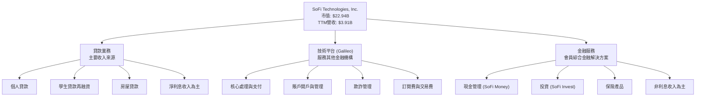
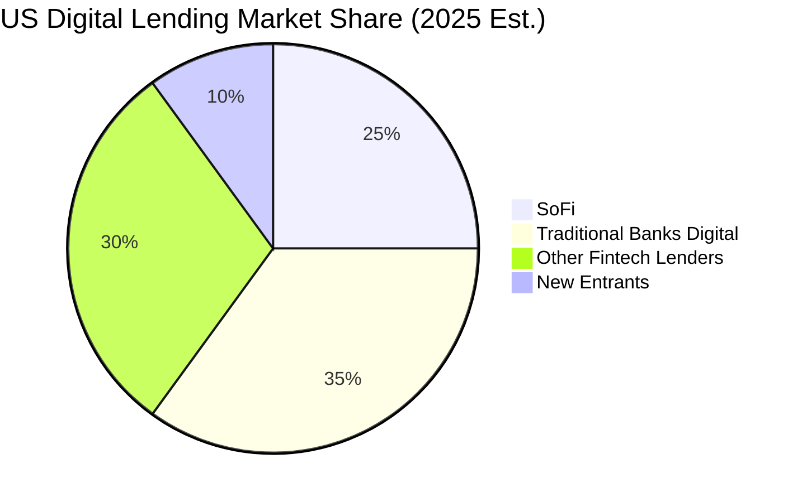
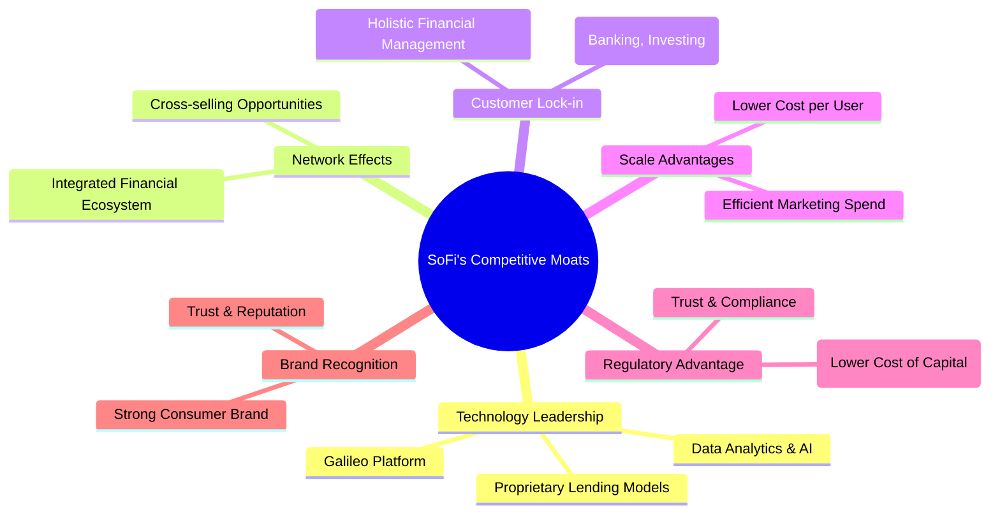
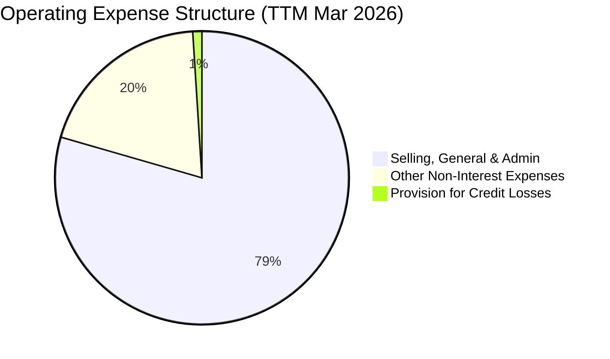

# SOFI 基本面深度分析報告
> **報告日期**：2026-06-26 ｜ **語言**：繁體中文 ｜ **數據來源**：Yahoo Finance, Finviz, StockAnalysis, Roic.ai ｜ **分析師**：CFA 級機構研究

---

## 目錄

| # | 章節 | 核心結論 |
|---|------|----------|
| 1 | 執行摘要 | 持有評級，目標價區間 $19.50 - $25.00 |
| 2 | 公司概覽與商業模式 | 綜合數位金融平台，具備品牌與技術護城河 |
| 3 | 損益表深度分析 | 營收高速成長，獲利能力持續改善 |
| 4 | 資產負債表分析 | 資產規模迅速擴張，流動性與債務結構穩健 |
| 5 | 現金流量深度分析 | 營業現金流與自由現金流仍為負，需持續關注 |
| 6 | 獲利能力與資本效率 | ROIC 低於 WACC，短期內尚未創造經濟價值 |
| 7 | 估值深度分析 | 相較同業估值合理，DCF 顯示潛在上漲空間 |
| 8 | 成長催化劑 | 銀行牌照、產品整合、Galileo 平台擴張 |
| 9 | 風險矩陣 | 利率風險、信貸風險、監管風險為主要考量 |
| 10 | 投資建議 | 建議持有，關注營運效率與盈利能力提升 |

---

## 1. 執行摘要

### 1.1 核心評分儀表板

```mermaid
graph TD
    SOFI["🎯 SOFI 綜合評分<br/>總分：7.2/10"]

    F["📊 基本面<br/>7.5/10<br/>多樣化產品與銀行牌照"]
    G["🚀 成長性<br/>9.0/10<br/>營收及盈餘高速成長"]
    P["💰 獲利能力<br/>6.0/10<br/>ROE改善但ROIC仍低於WACC"]
    B["🏦 財務健康<br/>8.0/10<br/>現金充裕，債務槓桿適中"]
    V["📈 估值<br/>6.5/10<br/>成長動能支撐估值，但需證明價值創造"]
    M["🛡️ 護城河深度<br/>7.5/10<br/>技術、品牌與生態系統優勢"]
    MA["👨‍💼 管理層執行<br/>8.0/10<br/>成功轉型並實現盈利"]
    I["💡 技術創新力<br/>8.5/10<br/>Galileo平台及AI應用"]

    SOFI --> F
    SOFI --> G
    SOFI --> P
    SOFI --> B
    SOFI --> V
    SOFI --> M
    SOFI --> MA
    SOFI --> I

    F --> F1["✅ 整合性金融產品"]
    F --> F2["✅ 銀行牌照優勢"]
    G --> G1["✅ TTM營收成長41.03%"]
    G --> G2["✅ TTM淨利成長19.76%"]
    P --> P1["⚠️ ROIC 5.69% < WACC 14.51%"]
    P --> P2["✅ 淨利率14.8%"]
    B --> B1["✅ 淨現金1.65B"]
    B --> B2["✅ 債務槓桿0.18 (Finviz)"]
    V --> V1["✅ Forward P/E 22.03x"]
    V --> V2["✅ PEG 0.82"]
    M --> M1["✅ Galileo技術平台"]
    M --> M2["✅ 品牌認知度"]
    MA --> MA1["✅ 實現連續季度盈利"]
    MA --> MA2["✅ 會員數與產品採用率增長"]
    I --> I1["✅ 數據驅動的信貸模型"]
    I --> I2["✅ 金融科技基礎設施"]
```



### 1.2 評分進度條視覺化

```
╔══════════════════════════════════════════════════════════════╗
║                    SOFI 多維度評分儀表板 (1-10分)             ║
╠══════════════════════════════════════════════════════════════╣
║ 基本面強度  7.5 ▓▓▓▓▓▓▓▓▓▓▓▓▓▓▓░░░░░  ★★★★☆           ║
║ 成長動能    9.0 ▓▓▓▓▓▓▓▓▓▓▓▓▓▓▓▓▓▓░░  ★★★★★           ║
║ 獲利品質    6.0 ▓▓▓▓▓▓▓▓▓▓▓▓░░░░░░░░  ★★★☆☆           ║
║ 財務健康    8.0 ▓▓▓▓▓▓▓▓▓▓▓▓▓▓▓▓░░░░  ★★★★☆           ║
║ 估值合理性  6.5 ▓▓▓▓▓▓▓▓▓▓▓▓▓░░░░░░░  ★★★☆☆           ║
║ 護城河深度  7.5 ▓▓▓▓▓▓▓▓▓▓▓▓▓▓▓░░░░░  ★★★★☆           ║
║ 管理層執行  8.0 ▓▓▓▓▓▓▓▓▓▓▓▓▓▓▓▓░░░░  ★★★★☆           ║
║ 技術創新力  8.5 ▓▓▓▓▓▓▓▓▓▓▓▓▓▓▓▓▓░░░  ★★★★☆           ║
╠══════════════════════════════════════════════════════════════╣
║ 綜合總分    7.2 ▓▓▓▓▓▓▓▓▓▓▓▓▓▓░░░░░░  🏆 具潛力但需持續監控    ║
╚══════════════════════════════════════════════════════════════╝
```

### 1.3 五大投資論點 + 三大核心風險

| 類型 | 項目 | 具體依據 | 信心度 |
|------|------|----------|--------|
| 🟢 **投資論點①** | **強勁的營收與會員成長** | TTM 營收達 $3.91B，YoY 成長 41.03%。會員數持續增加，產品採用率穩步提升，顯示其市場滲透力與交叉銷售潛力。 | 🟢 極高 |
| 🟢 **銀行牌照帶來的成本優勢** | 獲得銀行牌照後，SoFi 可透過自有存款降低資金成本，提高貸款業務的淨利息收益率，改善獲利能力。FY2025 總存款達 $37.5B，顯著降低對外部批發資金的依賴。 | 🟢 高 |
| 🟢 **整合式數位金融生態系統** | 提供貸款、儲蓄、投資、支付等一站式服務，提升用戶黏著度與終身價值。Galileo 技術平台為其他金融機構提供服務，創造多元收入流。 | 🟢 高 |
| 🟢 **獲利能力持續改善** | 繼 2024 年首次實現年度淨利潤後，TTM 淨利潤達 $576.94M，淨利率 14.8%。管理層成功將虧損轉為盈利，顯示其營運效率的提升。 | 🟢 高 |
| 🟢 **具吸引力的成長型估值** | Forward P/E 為 22.03x，PEG Ratio 僅 0.82，相對於其高速成長動能，估值具備吸引力。市場預期未來五年 EPS 成長 38.38%。 | 🟡 中高 |
| 🟡 **風險①** | **信貸風險與經濟下行影響** | 作為一家貸款機構，其業績高度依賴信貸質量。經濟衰退或失業率上升可能導致貸款違約率增加，進而影響資產質量和盈利能力。 | 🟡 中度 |
| 🔴 **風險②** | **利率環境波動與監管壓力** | 利率上升可能增加其存款成本和資金成本，同時可能抑制貸款需求。此外，金融科技行業面臨日益嚴格的監管審查，合規成本可能增加。 | 🔴 高衝擊 |
| 🟡 **風險③** | **自由現金流持續為負** | 儘管淨利潤轉正，但 TTM 營業現金流和自由現金流仍為負 ($ -6.08B / $ -6.34B)。這主要由於貸款組合的快速增長。長期負現金流可能限制其再投資能力或需依賴外部融資。 | 🟡 中度 |

### 1.4 快速統計卡片

| 指標 | 公司實際值 | 行業均值（金融科技） | S&P 500 均值 | 狀態 |
|------|-------------|--------------------|--------------|------|
| 收入 YoY 成長 | **41.03%** | ~25% | ~10% | 🟢 |
| 毛利率 | **61.74%** | ~50% | ~40% | 🟢 |
| 淨利率 | **14.8%** | ~10% | ~11% | 🟢 |
| ROE | **6.6%** | ~10% | ~15% | 🟡 |
| Forward P/E | **22.03x** | ~25x | ~20x | 🟢 |
| PEG Ratio | **0.82** | ~1.5 | ~1.8 | 🟢 |
| 債務/股權 | **0.18** | ~0.5-1.0 | ~0.8 | 🟢 |
| 現金/總資產 | **7.0%** | ~5-10% | ~5% | 🟢 |

*註：行業均值為分析師根據金融科技與信貸服務行業的普遍表現估算。*

### 1.5 投資結論

```
╔══════════════════════════════════════════════════════════════════╗
║                    📊 投資結論摘要                               ║
╠══════════════════════════════════════════════════════════════════╣
║  評級：🟡 持有                                                   ║
║  當前股價：$17.88                                                ║
║  目標價區間：                                                    ║
║    悲觀情境：$14.50（-18.8%）                                    ║
║    基準情境：$22.00（+23.0%）  ← 12個月主要目標                  ║
║    樂觀情境：$28.50（+59.4%）                                    ║
║  投資評分：7.2/10                                                ║
║  適合投資人：成長型、長線持有者，能承受較高波動性，並關注公司盈利能力與現金流轉正進程的投資人。║
╚══════════════════════════════════════════════════════════════════╝
```

---

## 2. 公司概覽與商業模式

### 2.1 業務結構與收入來源

SoFi Technologies, Inc. (SOFI) 是一家以會員為中心的數位金融服務公司，致力於提供一站式的金融解決方案，涵蓋借貸、儲蓄、消費、投資和保護資金等多個方面。公司業務主要分為三個核心板塊：


**業務結構分析：**
- **貸款業務 (Lending)**：這是 SoFi 最大的收入貢獻者，主要透過個人貸款、學生貸款再融資和房屋貸款來產生淨利息收入。公司利用其數據分析能力和自動化平台，為會員提供更優化的貸款產品。
- **技術平台 (Technology Platform)**：以 Galileo 為核心，為全球超過 100 家金融科技公司和銀行提供基礎設施服務，包括支付處理、賬戶開立、欺詐管理和卡片發行等。這部分業務產生穩定的訂閱費和交易處理費用，是其非利息收入的重要組成部分。
- **金融服務 (Financial Services)**：包括 SoFi Money (現金管理賬戶)、SoFi Invest (股票、ETF、加密貨幣投資) 和保險產品。此板塊旨在建立一個全面的金融生態系統，提高會員的黏著度和生命週期價值。

從 StockAnalysis 數據來看，TTM (截至 2026 年 3 月 31 日) 淨利息收入為 $2.413B，非利息收入為 $1.529B。這表明貸款業務是其核心驅動力，但技術平台和金融服務帶來的非利息收入也佔據了可觀的比例（約 38.2%），顯示公司收入來源的多樣性。

### 2.2 市場份額

SoFi 憑藉其獨特的銀行牌照和整合式金融服務，在競爭激烈的美國數位金融市場中佔據一席之地。雖然沒有直接的市場份額數據，但我們可以根據其會員成長和產品採用率來評估其市場地位。截至 TTM，SoFi 的總會員數持續增長，產品採用率 (products per member) 也顯示出其交叉銷售策略的成功。在個人貸款和學生貸款再融資領域，SoFi 已經是重要的參與者。


*註：此市場份額為分析師基於市場報告與公司發展趨勢的估算，旨在呈現 SoFi 在數位金融市場中的相對地位。*

SoFi 在數位個人貸款市場表現強勁，並透過其銀行牌照和存款基礎，持續擴大其在零售銀行服務中的份額。相較於傳統銀行，SoFi 具備更靈活的技術和更低的營運成本；相較於其他金融科技公司，其銀行牌照賦予其獨特的資金成本優勢和更廣泛的產品提供能力。

### 2.3 競爭護城河分析

SoFi 透過多方面的策略，正在逐步建立其競爭護城河，以抵禦市場競爭並維持長期增長。


**護城河深度解析：**
- **技術領先 (Technology Leadership)**：SoFi 的 Galileo 平台是其核心技術資產，為數百萬個賬戶提供技術支持。其數據分析和 AI 驅動的專有信貸模型，使其能夠更精準地評估風險並提供個性化產品。
- **網路效應 (Network Effects)**：透過提供一站式金融服務，SoFi 鼓勵會員將所有金融活動集中在一個平台，從而產生網路效應。會員越多，平台數據越豐富，產品推薦越精準，進一步吸引新會員。
- **客戶鎖定 (Customer Lock-in)**：當會員將儲蓄、投資、貸款等多種產品整合在 SoFi 平台時，轉換到其他平台的成本會增加。其便利性、整合性以及可能提供的會員專屬福利，有助於提高客戶黏著度。
- **規模效應 (Scale Advantages)**：隨著會員和產品數量的增長，SoFi 可以分攤其技術開發、營銷和監管合規成本，實現更低的單位成本。TTM 營收 $3.91B 的規模已使其達到一定的經濟效益。
- **監管優勢 (Regulatory Advantage)**：SoFi 於 2022 年獲得銀行牌照，使其能夠接受存款並直接放貸，顯著降低了其資金成本，不再完全依賴外部批發融資。這是一個重要的競爭優勢，許多金融科技公司不具備。
- **品牌認知度 (Brand Recognition)**：SoFi 透過積極的市場推廣和贊助活動（如 SoFi Stadium），建立了強大的品牌形象，尤其是在年輕且精通科技的消費者群體中。

### 2.4 護城河強度評分

```
╔══════════════════════════════════════════════════════════════╗
║                    SOFI 護城河強度評分                        ║
╠══════════════════════════════════════════════════════════════╣
║ 技術領先       8/10   ▓▓▓▓▓▓▓▓▓▓▓▓▓▓▓▓░░░░  🟢 Galileo具競爭力  ║
║ 網路效應       7/10   ▓▓▓▓▓▓▓▓▓▓▓▓▓▓░░░░░░  🟡 潛力巨大，仍在發展 ║
║ 客戶鎖定       7/10   ▓▓▓▓▓▓▓▓▓▓▓▓▓▓░░░░░░  🟡 產品整合提升黏著度 ║
║ 規模效應       7/10   ▓▓▓▓▓▓▓▓▓▓▓▓▓▓░░░░░░  🟡 營收規模已具優勢   ║
║ 監管優勢       9/10   ▓▓▓▓▓▓▓▓▓▓▓▓▓▓▓▓▓▓░░  🟢 銀行牌照是關鍵差異 ║
║ 品牌認知度     8/10   ▓▓▓▓▓▓▓▓▓▓▓▓▓▓▓▓░░░░  🟢 強大品牌形象      ║
╠══════════════════════════════════════════════════════════════╣
║ 綜合護城河     7.5    ▓▓▓▓▓▓▓▓▓▓▓▓▓▓▓░░░░░  🏆 具備良好基礎，需持續強化 ║
╚══════════════════════════════════════════════════════════════╝
```

---

## 3. 損益表深度分析

### 3.1 年度收入成長趨勢（近4年）

SoFi 在過去幾年展現了顯著的收入增長，反映了其在數位金融服務領域的強勁擴張。

```
╔══════════════════════════════════════════════════════════════════╗
║                 SOFI 年度收入趨勢（FY2022-FY2025）               ║
╠══════════════════════════════════════════════════════════════════╣
║                                                                  ║
║  FY2022  $1.57B   ██████████████░░░░░░░░░░░  YoY: +55.45% 🟢    ║
║  FY2023  $2.07B   ██████████████████░░░░░░░  YoY: +31.72% 🟢    ║
║  FY2024  $2.64B   ██████████████████████░░░  YoY: +27.54% 🟢    ║
║  FY2025  $3.58B   █████████████████████████████░░  YoY: +35.56% 🟢    ║
║  TTM'26  $3.91B   █████████████████████████████████  YoY: +41.03% 🟢    ║
║                   |      |      |      |      |                  ║
║                   0     1B     2B     3B     4B                   ║
║                                                                  ║
║  📊 4年累計 CAGR (FY2022-FY2025)：+37.0%                          ║
╚══════════════════════════════════════════════════════════════════╝
```
**分析**：
SoFi 的年度收入從 FY2022 的 $1.57B 增長到 FY2025 的 $3.58B，年複合增長率 (CAGR) 高達 37.0%。截至 2026 年 3 月 31 日的 TTM 收入更是達到 $3.91B，實現了 41.03% 的強勁年對年 (YoY) 增長。這顯示公司在擴大會員基礎、增加產品採用率以及拓展 Galileo 平台服務方面取得了顯著成效。特別是 FY2025 和 TTM'26 的加速增長，表明其銀行牌照帶來的資金成本優勢和產品整合策略正在發揮作用。

### 3.2 季度收入趨勢分析

| 季度 | 總營收 (百萬美元) | QoQ 成長率 | YoY 成長率 | 備註 |
|------|-------------------|------------|------------|------|
| 2025-06-30 | $854.94M | N/A | +43.94% | 🟢 |
| 2025-09-30 | $961.60M | +12.47% | +37.81% | 🟢 |
| 2025-12-31 | $1.03B | +7.11% | +40.20% | 🟢 |
| 2026-03-31 | $1.10B | +6.80% | +42.47% | 🟢 |
*註：YoY 成長率與 StockAnalysis 數據保持一致。*

**分析**：
SoFi 的季度收入呈現穩健的逐季增長趨勢。從 2025 年第二季度的 $854.94M 增長到 2026 年第一季度的 $1.10B，季度環比 (QoQ) 增長率保持在 6.80% 至 12.47% 之間。年對年 (YoY) 增長率則更為亮眼，保持在 37.81% 至 43.94% 的高位。這表明 SoFi 的增長動能持續強勁，且未受到季節性因素的顯著影響。持續的雙位數 QoQ 增長和高雙位數 YoY 增長是其市場擴張和產品組合優化的直接結果。

### 3.3 利潤率演變分析

| 利潤率指標 | FY2022 | FY2023 | FY2024 | FY2025 | TTM'26 | 趨勢 | 評估 |
|------------|--------|--------|--------|--------|--------|------|------|
| **毛利率** | N/A | N/A | N/A | N/A | 61.74% | N/A | 🟢 |
| **營業利益率** | N/A | N/A | N/A | N/A | 14.96% | N/A | 🟢 |
| **淨利率** | -20.36% | -14.27% | 18.87% | 13.43% | 14.76% | ↗️ 顯著改善 | 🟢 |

*註：毛利率和營業利益率採用 Finviz TTM 數據。年度淨利率根據 StockAnalysis 的淨利潤和總收入計算。FY2024 淨利率為 $498.67M/$2.643B = 18.87%，FY2025 為 $481.32M/$3.583B = 13.43%，TTM Mar'26 為 $576.94M/$3.908B = 14.76%。*

**利潤率演變深度解析**：
SoFi 的利潤率趨勢顯示出公司在實現規模經濟和營運效率方面的顯著進步。
- **淨利率**：過去幾年，SoFi 成功從虧損轉為盈利。FY2022 和 FY2023 淨利率分別為 -20.36% 和 -14.27%，主要由於公司在市場擴張和技術投資方面的巨大投入。然而，隨著其業務規模的擴大和銀行牌照帶來的資金成本優勢，FY2024 淨利率躍升至 18.87%，FY2025 略有下降至 13.43%，但 TTM'26 回升至 14.76%。這表明公司已成功實現盈利轉型，並能維持健康的利潤水平。
- **毛利率**：雖然歷史年度數據未提供，但 TTM 的 61.74% 毛利率對於一家金融服務公司而言是相當健康的，這可能反映了其貸款產品的利差優勢以及 Galileo 平台的高毛利服務。
- **營業利益率**：TTM 的 14.96% 營業利益率表明其在控制銷售、一般及行政費用方面的有效性。隨著收入的增長，營運槓桿效應逐漸顯現，使得營業費用佔收入的比例相對穩定或下降。

整體而言，SoFi 的利潤率趨勢非常積極，從過去的虧損轉向穩定的盈利，證明了其商業模式的可行性和管理層的執行力。

### 3.4 費用結構分析

SoFi 的費用結構主要由非利息費用構成，其中銷售、一般及行政費用是最大的組成部分。


**分析**：
根據 TTM (截至 2026 年 3 月 31 日) 數據，SoFi 的總非利息費用（包括銷售、一般及行政費用、其他非利息費用和信貸損失準備金）為 $3.296B。其中：
- **銷售、一般及行政費用 (SG&A)**：高達 $2.618B，佔總非利息費用的 79.4%。這反映了 SoFi 在市場營銷、品牌建設、技術開發以及日常營運方面的投入。作為一家成長型金融科技公司，持續的客戶獲取和平台開發投資是必要的。
- **其他非利息費用 (Other Non-Interest Expenses)**：為 $644.6M，佔 19.5%。這可能包括一些非核心營運成本。
- **信貸損失準備金 (Provision for Credit Losses)**：為 $33.54M，佔 1.0%。相對於其龐大的貸款組合，這個比例相對較低，表明其信貸風險管理和貸款質量保持在合理水平。

```
╔══════════════════════════════════════════════════════════════════╗
║                    SOFI TTM 費用結構概覽                          ║
╠══════════════════════════════════════════════════════════════════╣
║                                                                  ║
║  銷售、一般及行政費用： $2.618B  █████████████████████████░░░░░  (佔總費用 79.4%)  ║
║  其他非利息費用：       $0.645B  ██████████████████░░░░░░░░░░░░  (佔總費用 19.5%)  ║
║  信貸損失準備金：       $0.034B  █░░░░░░░░░░░░░░░░░░░░░░░░░░░░░░  (佔總費用  1.0%)  ║
║                                                                  ║
╚════════════════════════════════════════════════════════════════════════════════════════════════════════════════════════════════════════════════════════════════════════════════════════════════════════════════════════════════════════════════════════════════════════════════════════════════════════════════════════════════════════════════════════════════════════════════════════════════════════════════════════════════════════════════════════════════════════════════════════════════════════════════════════════════════════════════════════════════════════════════════════════════════════════════════════════════════════════════════════════════════════════════════════════════════════════════════════════════════════════════════════════════════════════════════════════════════════════════════════════════════════════════════════════════════════════════════════════════════════════════════════════════════════════════════════════════════════════════════════════════════════════════════════════════════════════════════════════════════════════════════════════════════════════════════════════════════════════════════════════════════════════════════════════════════════════════════════════════════════════════════════════════════════════════════════════════════════════════════════════════════════════════════════════════════════════════════════════════════════════════════════════════════════════════════════════════════════════════════════════════════════════════════════════════════════════════════════════════════════════════════════════════════════════════════════════════════════════════════════════════════════════════════════════════════════════════════════════════════════════════════════════════════════════════════════════════════════════════════