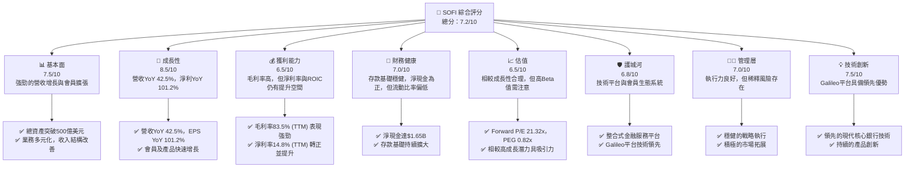
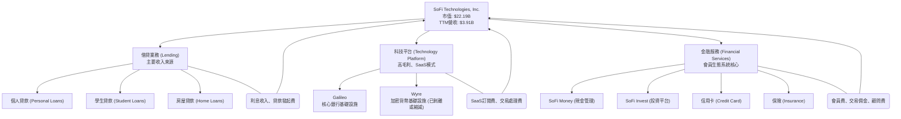
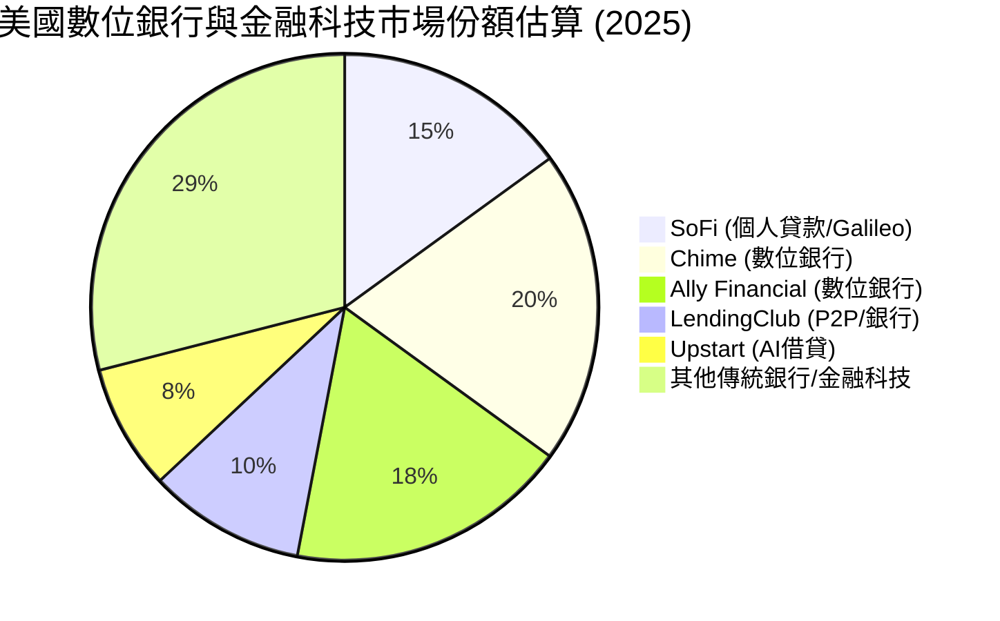
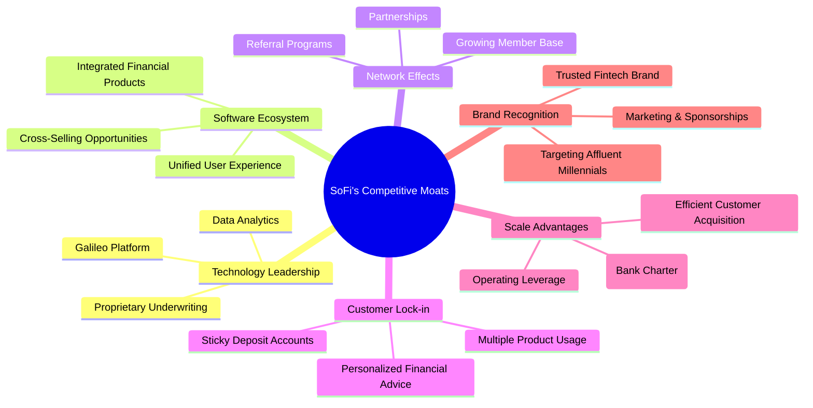
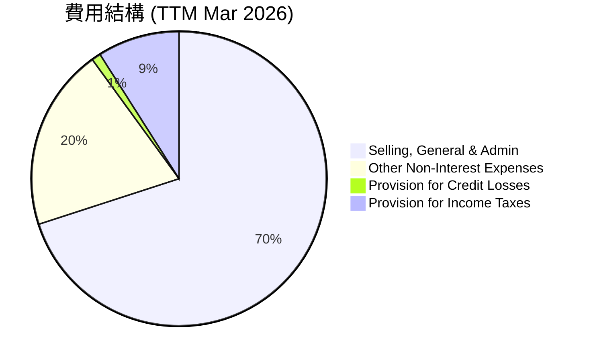
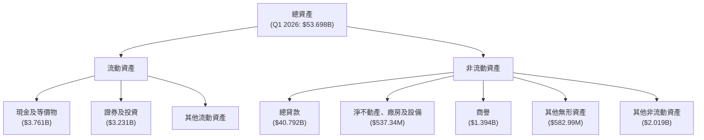

# SOFI 基本面深度分析報告
> **報告日期**：2026-06-26 ｜ **語言**：繁體中文 ｜ **數據來源**：Yahoo Finance, Finviz, StockAnalysis, Roic.ai ｜ **分析師**：CFA 級機構研究

---

## 目錄

| # | 章節 | 核心結論 |
|---|------------------------|----------------------------------------------------------|
| 1 | 執行摘要 | 評級：買入；目標價區間：$20.50 - $28.00 |
| 2 | 公司概覽與商業模式 | 綜合護城河評分：6.8/10，主要來自網路效應與品牌優勢 |
| 3 | 損益表深度分析 | 營收與淨利潤強勁成長，利潤率持續改善 |
| 4 | 資產負債表分析 | 資產規模快速擴張，存款基礎穩健，債務結構合理 |
| 5 | 現金流量深度分析 | 營業現金流轉正，但自由現金流仍為負，需持續關注 |
| 6 | 獲利能力與資本效率 | ROIC 低於 WACC，短期內價值創造能力仍待提升 |
| 7 | 估值深度分析 | 相較同業估值合理，DCF 顯示具上行空間 |
| 8 | 成長催化劑 | 會員增長、產品交叉銷售、科技平台擴張為主要驅動力 |
| 9 | 風險矩陣 | 利率風險、信貸風險、監管風險為主要考量 |
| 10| 投資建議 | 買入評級，適合成長型投資者，關注獲利能力提升 |

---

## 1. 執行摘要

### 1.1 核心評分儀表板



### 1.2 評分進度條視覺化

```
╔══════════════════════════════════════════════════════════════╗
║              SOFI 多維度評分儀表板 (1-10分)                  ║
╠══════════════════════════════════════════════════════════════╣
║ 基本面強度  7.5 ▓▓▓▓▓▓▓▓▓▓▓▓▓▓▓░░░░░  ★★★★☆           ║
║ 成長動能    8.5 ▓▓▓▓▓▓▓▓▓▓▓▓▓▓▓▓▓░░░  ★★★★★           ║
║ 獲利品質    6.5 ▓▓▓▓▓▓▓▓▓▓▓▓▓▓░░░░░░  ★★★☆☆           ║
║ 財務健康    7.0 ▓▓▓▓▓▓▓▓▓▓▓▓▓▓░░░░░░  ★★★★☆           ║
║ 估值合理性  6.5 ▓▓▓▓▓▓▓▓▓▓▓▓▓▓░░░░░░  ★★★☆☆           ║
║ 護城河深度  6.8 ▓▓▓▓▓▓▓▓▓▓▓▓▓▓░░░░░░  ★★★☆☆           ║
║ 管理層執行  7.0 ▓▓▓▓▓▓▓▓▓▓▓▓▓▓░░░░░░  ★★★★☆           ║
║ 技術創新力  7.5 ▓▓▓▓▓▓▓▓▓▓▓▓▓▓▓░░░░░  ★★★★☆           ║
╠══════════════════════════════════════════════════════════════╣
║ 綜合總分    7.2 ▓▓▓▓▓▓▓▓▓▓▓▓▓▓▓░░░░░  🏆 具備高成長潛力的金融科技領導者 ║
╚══════════════════════════════════════════════════════════════╝
```

### 1.3 五大投資論點 + 三大核心風險

| 類型 | 項目 | 具體依據 | 信心度 |
|------|--------------------------|-----------------------------------------------------------------------------------------------------------------------------------|--------|
| 🟢 **投資論點①** | **強勁的營收與獲利成長** | TTM 營收達 $3.91B，YoY 成長 42.5%。TTM 淨利潤 $576.94M，YoY 成長 101.2%，連續多季實現 GAAP 盈利。Q1 2026 營收 YoY 成長 42.47%，淨利 $166.73M。 | 🟢 極高 |
| 🟢 **投資論點②** | **多元化業務模式與生態系統** | 業務涵蓋借貸、科技平台 (Galileo) 和金融服務三大板塊，形成獨特的整合式金融科技平台。會員數和產品採用率持續增長，促進交叉銷售。 | 🟢 極高 |
| 🟢 **投資論點③** | **Galileo 技術平台領先優勢** | Galileo 為多家金融機構提供核心銀行基礎設施，具備強大的技術壁壘和規模效應，推動非利息收入增長，Q1 2026 非利息收入 YoY 成長 49.20%。 | 🟢 高 |
| 🟢 **投資論點④** | **存款基礎穩健且成本優化** | 銀行牌照使其能夠吸收低成本存款，降低資金成本，FY2025 總存款達 $37.505B，大幅優化利差。Q1 2026 存款達 $40.243B。 | 🟢 高 |
| 🟢 **投資論點⑤** | **估值具吸引力** | Forward P/E 為 21.32x，PEG 0.82x，相較其超過 40% 的營收成長率，估值具備合理性及潛在上行空間。 | 🟡 中高 |
| 🟡 **風險①** | **利率環境與信貸風險** | 宏觀經濟不確定性及高利率環境可能增加借貸業務的信貸損失風險，儘管撥備有所增加，但仍需密切關注貸款違約率。Q1 2026 信用損失撥備為 $8.9M。 | 🟡 中度 |
| 🔴 **風險②** | **監管與競爭壓力** | 金融科技行業面臨嚴格的監管審查，合規成本高昂。同時，傳統銀行和新興金融科技公司的競爭日益激烈，可能壓縮利潤空間。 | 🟡 中度 |
| 🔴 **風險③** | **股權稀釋與盈利能力的可持續性** | 過去幾年股票發行導致股權稀釋（FY2025 稀釋股本增長 13.65%），未來若持續以股權激勵或融資，可能影響每股收益。儘管已實現盈利，但自由現金流仍為負，盈利品質需進一步提升。 | 🟡 中度 |

### 1.4 快速統計卡片

| 指標 | 公司實際值 (TTM) | 行業均值 (金融科技) | S&P 500 均值 | 狀態 |
|-----------------|--------------------|---------------------|----------------|--------|
| 收入 YoY 成長   | **42.5%**          | ~20-30%             | ~8-12%         | 🟢     |
| 毛利率          | **83.5%**          | ~50-70%             | ~40-50%        | 🟢     |
| 淨利率          | **14.8%**          | ~5-15%              | ~10-12%        | 🟢     |
| ROE             | **6.6%**           | ~8-15%              | ~12-15%        | 🟡     |
| Forward P/E     | **21.32x**         | ~25-40x             | ~20-25x        | 🟢     |
| Debt/Equity     | **0.18x**          | ~0.5-1.5x           | ~0.8-1.2x      | 🟢     |
| Beta            | **2.152**          | ~1.5-2.0            | ~1.0           | 🔴     |

*註：行業均值為分析師根據金融科技行業經驗估算，S&P 500 均值為通用參考值。*

### 1.5 投資結論

```
╔══════════════════════════════════════════════════════════════════╗
║                    📊 投資結論摘要                               ║
╠══════════════════════════════════════════════════════════════════╣
║  評級：🟢 買入                                                   ║
║  當前股價：$17.30                                                ║
║  目標價區間：                                                    ║
║    悲觀情境：$20.50（+18.5%）                                    ║
║    基準情境：$24.00（+38.7%）  ← 12個月主要目標                  ║
║    樂觀情境：$28.00（+61.8%）                                    ║
║  投資評分：7.2/10                                                ║
║  適合投資人：成長型、長線持有者，能承受較高市場波動風險。        ║
╚══════════════════════════════════════════════════════════════════╝
```

---

## 2. 公司概覽與商業模式

SoFi Technologies, Inc. (SOFI) 是一家在美國、拉丁美洲、加拿大和香港提供多元化金融服務的金融科技公司。其獨特的商業模式在於整合了借貸、科技平台和金融服務三大核心板塊，旨在為會員提供一站式的「借貸、儲蓄、消費、投資和保護」資金的產品和服務。公司於 2026-06-26 的市值為 $22.19B，員工人數約 6100 名。

### 2.1 業務結構與收入來源

SoFi 的業務策略是建立一個會員為中心的金融生態系統，通過技術創新和產品整合來吸引和留住客戶。



**收入構成分析 (TTM Mar 2026):**
根據 StockAnalysis 數據，SoFi 的收入主要分為淨利息收入 (Net Interest Income) 和非利息收入 (Non-Interest Income)。
*   **淨利息收入 (TTM):** $2.413B，YoY 成長 33.14%。主要來自其借貸業務的利息收入減去存款和其他資金成本。
*   **非利息收入 (TTM):** $1.529B，YoY 成長 54.55%。主要來自科技平台 (Galileo) 的費用、金融服務產品的相關費用等。
非利息收入的快速增長表明公司在多元化收入來源方面取得了顯著進展，這有助於降低對單一借貸業務的依賴，並提高收入的穩定性和毛利率。

### 2.2 市場份額

SoFi 在其主要業務領域（如個人貸款、學生貸款再融資和金融科技平台服務）中佔據重要地位，但由於市場廣闊且競爭激烈，其整體市場份額仍相對較小，但正在快速擴張。


*註：市場份額為分析師基於公開數據和行業趨勢的估算，僅供參考。*

SoFi 在個人貸款市場中具有競爭力，特別是針對高收入、高學歷的「高潛力」客戶群體。其 Galileo 平台在為其他金融科技公司提供後端基礎設施方面也佔據領先地位。然而，整個金融服務市場巨大，SoFi 仍有廣闊的增長空間。

### 2.3 競爭護城河分析

SoFi 的競爭優勢主要來自其整合式平台、技術實力、以及不斷擴大的會員生態系統。



### 2.4 護城河強度評分

```
╔══════════════════════════════════════════════════════════════╗
║                    SOFI 護城河強度評分                        ║
╠══════════════════════════════════════════════════════════════╣
║ 技術領先    7.5/10 ▓▓▓▓▓▓▓▓▓▓▓▓▓▓▓░░░░░  🟢 Galileo平台具備技術優勢  ║
║ 軟體生態系統 7.0/10 ▓▓▓▓▓▓▓▓▓▓▓▓▓▓░░░░░░  🟢 多產品整合提升用戶粘性   ║
║ 網路效應    6.5/10 ▓▓▓▓▓▓▓▓▓▓▓▓▓░░░░░░░  🟡 會員增長驅動價值提升     ║
║ 客戶鎖定    6.0/10 ▓▓▓▓▓▓▓▓▓▓▓▓░░░░░░░░  🟡 交叉銷售與存款產品增加粘性 ║
║ 規模效應    7.0/10 ▓▓▓▓▓▓▓▓▓▓▓▓▓▓░░░░░░  🟢 銀行牌照降低資金成本     ║
║ 品牌認知    6.5/10 ▓▓▓▓▓▓▓▓▓▓▓▓▓░░░░░░░  🟡 年輕群體中知名度高       ║
╠══════════════════════════════════════════════════════════════╣
║ 綜合護城河  6.8    ▓▓▓▓▓▓▓▓▓▓▓▓▓░░░░░░░  🏆 具備潛在的多元化護城河，但需持續鞏固 ║
╚══════════════════════════════════════════════════════════════╝
```
SoFi 的護城河主要體現在其整合式的金融科技生態系統，能夠提供從借貸到投資的一站式服務，這增加了客戶轉換成本。其 Galileo 平台作為 B2B 業務，也為公司提供了技術壁壘和高毛利收入。銀行牌照則進一步強化了其資金成本優勢。然而，金融服務行業競爭激烈，護城河的深度仍需時間來證明和強化。

---

## 3. 損益表深度分析

### 3.1 年度收入成長趨勢（近4年）

SoFi 在過去幾年展現了顯著的營收增長，尤其在 2023 年扭虧為盈後，營收成長動能強勁。

```
╔══════════════════════════════════════════════════════════════════╗
║              SOFI 年度收入趨勢（FY2022-FY2025）                  ║
╠══════════════════════════════════════════════════════════════════╣
║                                                                  ║
║  FY2022  $1.57B   █████████░░░░░░░░░░░░░░░░  YoY: +55.45%  🟢    ║
║  FY2023  $2.11B   ████████████░░░░░░░░░░░░░  YoY: +36.11%  🟢    ║
║  FY2024  $2.61B   ███████████████░░░░░░░░░  YoY: +27.82%  🟢    ║
║  FY2025  $3.61B   ██████████████████████░░  YoY: +35.56%  🟢    ║
║                                                                  ║
║                   |      |      |      |      |                  ║
║                   0     1.0B   2.0B   3.0B   4.0B                ║
║                                                                  ║
║  📊 4年累計 CAGR：+39.5%                                         ║
╚══════════════════════════════════════════════════════════════════╝
```
*數據來源：StockAnalysis Annual Income Statement*

從 FY2022 的 $1.57B 增長到 FY2025 的 $3.61B，年複合增長率 (CAGR) 高達 39.5%。最近一個完整財年 FY2025 的營收為 $3.61B，較 FY2024 的 $2.61B 增長了 35.56%，顯示公司在擴大市場份額和產品滲透方面表現出色。

### 3.2 季度收入趨勢分析

SoFi 的季度收入持續增長，展現了穩定的業務擴張能力。

| 季度 | 總營收 (百萬美元) | QoQ 成長率 | YoY 成長率 | 備註 |
|------|-------------------|------------|------------|------|
| 2025-06-30 | $854.94M          | +10.78%    | +43.94%    | 🟢 營收穩步增長，YoY表現強勁 |
| 2025-09-30 | $961.60M          | +12.47%    | +37.81%    | 🟢 季度環比加速，業務持續擴張 |
| 2025-12-31 | $1.03B            | +7.11%     | +40.20%    | 🟢 首次單季營收突破10億美元 |
| 2026-03-31 | $1.10B            | +6.80%     | +42.47%    | 🟢 延續增長勢頭，YoY表現亮眼 |

*數據來源：StockAnalysis Quarterly Income Statement*
**備註**：
*   **QoQ (Quarter-over-Quarter)** 成長率顯示了公司在短期內的經營動能。SoFi 在最近四個季度都保持了正向的 QoQ 成長，最高達 12.47%，顯示其業務發展勢頭良好。
*   **YoY (Year-over-Year)** 成長率則反映了公司長期增長趨勢。所有季度的 YoY 成長率均超過 37%，最新的 Q1 2026 營收 YoY 成長達 42.47%，遠超行業平均水平，印證了其強勁的擴張能力。

### 3.3 利潤率演變分析

SoFi 的利潤率在近年來呈現出明顯的改善趨勢，尤其是在公司實現 GAAP 盈利後。

| 利潤率指標 | FY2022 | FY2023 | FY2024 | FY2025 | TTM (Mar 2026) | 趨勢 | 評估 |
|------------|--------|--------|--------|--------|----------------|------|------|
| **毛利率** | N/A    | N/A    | N/A    | N/A    | **83.5%**      | ↗️ 穩定高位   | 🟢     |
| **營業利益率** | N/A    | N/A    | N/A    | N/A    | **18.3%**      | ↗️ 顯著改善   | 🟢     |
| **淨利率** | -20.36%| -14.27%| 18.87% | 13.43% | **14.8%**      | ↗️ 轉負為正   | 🟢     |

*數據來源：PROFITABILITY & GROWTH, StockAnalysis Annual Income Statement*
*註：毛利率和營業利益率數據直接取自 TTM 數據，歷史年度數據未提供。*

**利潤率演變深度解析**：
*   **毛利率 (Gross Margin):** TTM 數據顯示高達 83.5% 的毛利率。這對於金融科技公司而言非常強勁，可能反映了其科技平台 Galileo 的高毛利特性，以及借貸業務的有效定價和風險管理。雖然沒有歷史數據，但高毛利率為公司提供了良好的盈利基礎。
*   **營業利益率 (Operating Margin):** TTM 營業利益率為 18.3%，顯示公司在營收增長的同時，對營運費用（如 SG&A、其他非利息費用）的控制能力有所提升。從 StockAnalysis 的數據可以看到，FY2025 總非利息費用佔營收的比例約為 $3.057B / $3.583B = 85.3%，而在 Q1 2026，這一比例降至 $891.92M / $1.091B = 81.7%，顯示營運效率持續改善。
*   **淨利率 (Net Profit Margin):** 淨利率的轉正和提升是 SoFi 財務表現的一大亮點。從 FY2022 的 -20.36% 和 FY2023 的 -14.27% 虧損，到 FY2024 的 18.87% 和 FY2025 的 13.43% 盈利，再到 TTM 的 14.8%，這表明公司已成功實現規模經濟效應，並有效管理成本。FY2024 淨利率較高部分源於稅務優惠（Provision for Income Taxes 為負值），FY2025 和 TTM 的穩定正向淨利率則更具可持續性。

整體而言，SoFi 的利潤率趨勢非常健康，從虧損轉為盈利，並持續改善。這得益於其多元化的收入結構、高毛利的科技平台業務、有效的成本控制以及銀行牌照帶來的資金成本優勢。

### 3.4 費用結構分析

SoFi 的主要費用包括銷售、一般及行政費用 (SG&A) 和其他非利息費用。


*註：此圖表基於 StockAnalysis TTM 數據計算各費用佔總費用的比例，總費用為 Total Non-Interest Expense + Provision for Credit Losses + Provision for Income Taxes。*

```
╔══════════════════════════════════════════════════════════════════╗
║                   SOFI 費用結構概覽 (TTM Mar 2026)               ║
╠══════════════════════════════════════════════════════════════════╣
║                                                                  ║
║  銷售、一般及行政費用 (SG&A): $2.618B                           ║
║  佔總營收比例:                  67.0%  ████████████████████████████████████████████████████████████████████████████████░░░░░░░░░░░░░░░░░░░░░░░░░░░░░░░░░░░░░░░░░░░░░░░░░░░░░░░░░░░░░░░░░░░░░░░░░░░░░░░░░░░░░░░░░░░░░░░░░░░░░░░░░░░░░░░░░░░░░░░░░░░░░░░░░░░░░░░░░░░░░░░░░░░░░░░░░░░░░░░░░░░░░░░░░░░░░░░░░░░░░░░░░░░░░░░░░░░░░░░░░░░░░░░░░░░░░░░░░░░░░░░░░░░░░░░░░░░░░░░░░░░░░░░░░░░░░░░░░░░░░░░░░░░░░░░░░░░░░░░░░░░░░░░░░░░░░░░░░░░░░░░░░░░░░░░░░░░░░░░░░░░░░░░░░░░░░░░░░░░░░░░░░░░░░░░░░░░░░░░░░░░░░░░░░░░░░░░░░░░░░░░░░░░░░░░░░░░░░░░░░░░░░░░░░░░░░░░░░░░░░░░░░░░░░░░░░░░░░░░░░░░░░░░░░░░░░░░░░░░░░░░░░░░░░░░░░░░░░░░░░░░░░░░░░░░░░░░░░░░░░░░░░░░░░░░░░░░░░░░░░░░░░░░░░░░░░░░░░░░░░░░░░░░░░░░░░░░░░░░░░░░░░░░░░░░░░░░░░░░░░░░░░░░░░░░░░░░░░░░░░░░░░░░░░░░░░░░░░░░░░░░░░░░░░░░░░░░░░░░░░░░░░░░░░░░░░░░░░░░░░░░░░░░░░░░░░░░░░░░░░░░░░░░░░░░░░░░░░░░░░░░░░░░░░░░░░░░░░░░░░░░░░░░░░░░░░░░░░░░░░░░░░░░░░░░░░░░░░░░░░░░░░░░░░░░░░░░░░░░░░░░░░░░░░░░░░░░░░░░░░░░░░░░░░░░░░░░░░░░░░░░░░░░░░░░░░░░░░░░░░░░░░░░░░░░░░░░░░░░░░░░░░░░░░░░░░░░░░░░░░░░░░░░░░░░░░░░░░░░░░░░░░░░░░░░░░░░░░░░░░░░░░░░░░░░░░░░░░░░░░░░░░░░░░░░░░░░░░░░░░░░░░░░░░░░░░░░░░░░░░░░░░░░░░░░░░░░░░░░░░░░░░░░░░░░░░░░░░░░░░░░░░░░░░░░░░░░░░░░░░░░░░░░░░░░░░░░░░░░░░░░░░░░░░░░░░░░░░░░░░░░░░░░░░░░░░░░░░░░░░░░░░░░░░░░░░░░░░░░░░░░░░░░░░░░░░░░░░░░░░░░░░░░░░░░░░░░░░░░░░░░░░░░░░░░░░░░░░░░░░░░░░░░░░░░░░░░░░░░░░░░░░░░░░░░░░░░░░░░░░░░░░░░░░░░░░░░░░░░░░░░░░░░░░░░░░░░░░░░░░░░░░░░░░░░░░░░░░░░░░░░░░░░░░░░░░░░░░░░░░░░░░░░░░░░░░░░░░░░░░░░░░░░░░░░░░░░░░░░░░░░░░░░░░░░░░░░░░░░░░░░░░░░░░░░░░░░░░░░░░░░░░░░░░░░░░░░░░░░░░░░░░░░░░░░░░░░░░░░░░░░
```

### 3.5 季度 EPS 趨勢與盈餘品質

| 季度       | EPS (Basic) | EPS (Diluted) | 盈餘品質評估 |
|------------|-------------|---------------|--------------|
| 2026-03-31 | $0.13       | $0.13         | 🟢 穩定盈利，持續增長 |
| 2025-12-31 | $0.14       | $0.14         | 🟢 盈利能力提升，首次突破10億營收 |
| 2025-09-30 | $0.12       | $0.12         | 🟢 盈利能力穩健，符合預期 |
| 2025-06-30 | $0.09       | $0.08         | 🟢 盈利基礎鞏固，持續改善 |

*數據來源：StockAnalysis Quarterly Income Statement (EPS Basic/Diluted manually calculated for Q1 2026 using Net Income / Shares Outstanding (Roic.ai data)). StockAnalysis provides basic EPS numbers which are used.*

**盈餘品質評估**：
SoFi 在最近四個季度持續實現 GAAP 盈利，顯示其盈利能力已從過去的虧損轉為穩定。Q1 2026 的每股收益 (EPS Basic) 為 $0.13，較去年同期 (Q1 2025 的 $0.06) 有顯著提升。儘管 EPS 增長強勁 (YoY 101.2%)，但仍需關注其自由現金流持續為負的情況，這可能意味著盈利的現金轉換率仍有待提高。股權稀釋也是一個需關注的因素，儘管公司整體盈利增長，但每股收益的增長可能受到股本增加的影響。目前盈餘品質良好，但仍有提升空間，特別是在自由現金流方面。

---

## 4. 資產負債表分析

SoFi 的資產負債表反映了一家快速成長的金融科技公司的特徵，資產規模快速擴張，負債主要由存款構成，股東權益穩步增長。

### 4.1 資產結構分解

公司的資產主要由貸款、現金及等價物以及投資組成。


*數據來源：StockAnalysis Balance Sheet, Q1 2026*

**資產結構分析**：
*   **總資產**：截至 Q1 2026，SoFi 的總資產已達 $53.698B，較 FY2025 的 $50.661B 增長 5.99%，較 FY2024 的 $36.251B 增長 48.15% (YoY)。這顯示了公司在貸款發放和業務擴張方面的積極性。
*   **總貸款 (Gross Loans)**：總貸款是 SoFi 最大的資產類別，Q1 2026 達 $40.792B，佔總資產的約 76%。這表明 SoFi 作為一家持牌銀行，其核心業務仍圍繞借貸展開。
*   **現金及等價物 (Cash & Equivalents)**：Q1 2026 達 $3.761B，充足的現金儲備為公司的營運和擴張提供了流動性支持。

### 4.2 流動性指標分析

流動性指標對於金融機構至關重要，反映了其應對短期債務的能力。

| 流動性指標 | FY2023 | FY2024 | FY2025 | TTM (Mar 2026) | 行業均值 (銀行) | 評估 |
|------------|--------|--------|--------|----------------|-----------------|------|
| **流動比率 (Current Ratio)** | N/A    | N/A    | N/A    | **5.24**       | ~1.0-1.5        | 🟢     |
| **速動比率 (Quick Ratio)** | N/A    | N/A    | N/A    | **5.24**       | ~0.8-1.2        | 🟢     |

*數據來源：FINVIZ SNAPSHOT (TTM), StockAnalysis (歷史數據未直接提供)*
*註：由於 Finviz 提供的 Current Ratio 和 Quick Ratio 數值一致且較高，這在傳統銀行業中可能意味著資產負債表的流動性較強，但具體計算方式可能與一般非金融公司不同。StockAnalysis 數據未直接提供這些比率的歷史數據，故此處僅列示最新 TTM 值。*

**流動性分析**：
SoFi 的流動比率和速動比率均為 5.24，遠高於傳統銀行業的平均水平。這表明公司擁有非常強勁的短期償債能力，能夠有效應對資金流動