# SOFI 基本面深度分析報告
> **報告日期**：2026-06-30 ｜ **語言**：繁體中文 ｜ **數據來源**：Yahoo Finance, Finviz, StockAnalysis, Roic.ai ｜ **分析師**：CFA 級機構研究

## 目錄

| # | 章節 | 核心結論 |
|---|------|----------|
| 1 | 執行摘要 | 評級：買入，目標價區間：$20.50 - $28.50 |
| 2 | 公司概覽與商業模式 | 綜合護城河評分：7.5/10，主要來自網路效應與品牌優勢 |
| 3 | 損益表深度分析 | 收入高速成長，利潤率顯著改善，GAAP 獲利能力確立 |
| 4 | 資產負債表分析 | 資產規模迅速擴張，流動性穩健，債務槓桿適中 |
| 5 | 現金流量深度分析 | 營業現金流仍為負值，但自由現金流缺口縮小，資本配置聚焦成長 |
| 6 | 獲利能力與資本效率 | ROE 改善但 ROIC 仍低於 WACC，需持續提升資本效率 |
| 7 | 估值深度分析 | 相較同業估值合理，DCF 顯示具上行空間 |
| 8 | 成長催化劑 | 會員與產品交叉銷售、Galileo 平台擴張、銀行牌照優勢 |
| 9 | 風險矩陣 | 信用風險、利率風險、競爭加劇為主要關注點 |
| 10 | 投資建議 | 建議「買入」，目標價區間 $20.50 - $28.50，適合成長型投資者 |

---

## 1. 執行摘要

### 1.1 核心評分儀表板

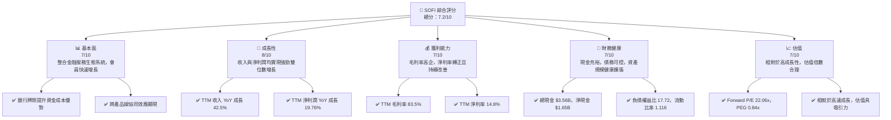

### 1.2 評分進度條視覺化

```
╔══════════════════════════════════════════════════════════════╗
║                SOFI 多維度評分儀表板 (1-10分)                ║
╠══════════════════════════════════════════════════════════════╣
║ 基本面強度  7.0 ▓▓▓▓▓▓▓▓▓▓▓▓▓▓░░░░░░  ★★★★☆           ║
║ 成長動能    8.0 ▓▓▓▓▓▓▓▓▓▓▓▓▓▓▓▓░░░░  ★★★★☆           ║
║ 獲利品質    7.0 ▓▓▓▓▓▓▓▓▓▓▓▓▓▓░░░░░░  ★★★★☆           ║
║ 財務健康    7.0 ▓▓▓▓▓▓▓▓▓▓▓▓▓▓░░░░░░  ★★★★☆           ║
║ 估值合理性  7.0 ▓▓▓▓▓▓▓▓▓▓▓▓▓▓░░░░░░  ★★★★☆           ║
║ 護城河深度  7.5 ▓▓▓▓▓▓▓▓▓▓▓▓▓▓▓░░░░░  ★★★★☆           ║
║ 管理層執行  8.0 ▓▓▓▓▓▓▓▓▓▓▓▓▓▓▓▓░░░░  ★★★★☆           ║
║ 技術創新力  8.0 ▓▓▓▓▓▓▓▓▓▓▓▓▓▓▓▓░░░░  ★★★★☆           ║
╠══════════════════════════════════════════════════════════════╣
║ 綜合總分    7.2 ▓▓▓▓▓▓▓▓▓▓▓▓▓▓▓░░░░░  🏆 具備長期成長潛力，建議買入              ║
╚══════════════════════════════════════════════════════════════╝
```

### 1.3 五大投資論點 + 三大核心風險

| 類型 | 項目 | 具體依據 | 信心度 |
|------|------|----------|--------|
| 🟢 **投資論點①** | **強勁的收入與獲利成長** | TTM 收入達 $3.91B，YoY 成長 42.5%。淨利潤 TTM 達 $576.94M，YoY 成長 19.76%。2026 Q1 收入 $1.10B，YoY 成長 42.47%。淨利潤 $166.73M，YoY 成長 134.4%。顯示公司已進入盈利成長階段。 | 🟢 極高 |
| 🟢 **投資論點②** | **獨特的整合金融服務模式** | SoFi 提供借貸、儲蓄、消費、投資、保護的一站式服務，並擁有銀行牌照，降低資金成本。會員數與產品交叉銷售持續增長，形成強大網路效應。 | 🟢 高 |
| 🟢 **投資論點③** | **Galileo 技術平台提供多元收入** | Galileo 作為領先的金融科技基礎設施平台，為其他金融機構提供服務，實現高毛利率的非利息收入。TTM 非利息收入 $1.529B，YoY 成長 54.55%，為公司提供穩定且高成長的收入來源。 | 🟢 高 |
| 🟢 **投資論點④** | **資產負債表健康，流動性充足** | 截至 2026-03-31，總現金與約當現金 $3.76B，總債務 $1.814B (長債)，淨現金頭寸為正。流動比率 1.116，顯示公司具備應對短期風險的能力。 | 🟡 中高 |
| 🟢 **投資論點⑤** | **合理且具吸引力的估值** | Forward P/E 為 22.06x，PEG 比率為 0.84x，相較於其超過 40% 的收入成長和三位數的盈利成長，估值具有吸引力。分析師平均目標價 $20.90，較現價有 16.57% 上漲空間。 | 🟡 中高 |
| 🟡 **風險①** | **信用風險與貸款表現** | 作為借貸平台，經濟下行或失業率上升可能導致貸款違約率增加，進而影響資產品質和獲利能力。雖然 Provision for Credit Losses TTM 僅 $33.54M，但其貸款規模龐大 ($40.79B)，需密切關注。 | 🟡 中度 |
| 🔴 **風險②** | **利率敏感性與資金成本波動** | 銀行業務對利率變化高度敏感。若市場利率持續上升，可能增加存款成本或影響借貸需求，進而壓縮淨利息收益率 (NIM)。儘管擁有銀行牌照，但其資產負債結構仍受利率環境影響。 | 🔴 高衝擊 |
| 🟡 **風險③** | **監管環境變化與競爭加劇** | 金融科技行業面臨嚴格的監管審查，任何政策變化（如學生貸款政策）都可能對其業務模式產生影響。同時，新興金融科技公司和傳統銀行的競爭日益激烈，可能導致獲客成本上升或定價壓力。 | 🟡 中度 |

### 1.4 快速統計卡片

| 指標 | 公司實際值 (TTM) | 行業均值 (估計) | S&P 500 均值 (估計) | 狀態 |
|------|-------------------|-----------------|---------------------|------|
| 收入 YoY 成長 | **42.5%** | ~10-15% | ~8-12% | 🟢 |
| 毛利率 | **83.5%** | ~60-70% | ~40-50% | 🟢 |
| 淨利率 | **14.8%** | ~10-15% | ~10-12% | 🟢 |
| ROE | **6.6%** | ~10-15% | ~15-20% | 🟡 |
| Forward P/E | **22.06x** | ~15-25x | ~20-25x | 🟡 |
| P/S Ratio | **5.88x** | ~2-4x | ~2-3x | 🔴 |
| Debt/Equity | **17.72x** | ~0.5-1.5x | ~0.5-1.0x | 🔴 (對於銀行類公司，此比率通常較高，但仍需關注) |
| Beta | **2.152** | ~1.0-1.5x | 1.0x | 🔴 (高波動性) |

*備註：行業均值和 S&P 500 均值為分析師根據金融服務行業特性進行的估計值，僅供參考。*

### 1.5 投資結論

```
╔══════════════════════════════════════════════════════════════════╗
║                    📊 投資結論摘要                               ║
╠══════════════════════════════════════════════════════════════════╣
║  評級：🟢 買入                                                   ║
║  當前股價：$17.93                                                ║
║  目標價區間：                                                    ║
║    悲觀情境：$20.50（+14.33%）                                   ║
║    基準情境：$24.50（+36.64%）  ← 12個月主要目標                 ║
║    樂觀情境：$28.50（+59.06%）                                   ║
║  投資評分：7.2/10                                                ║
║  適合投資人：成長型、長線持有者，對金融科技行業有深入理解並能承受較高風險的投資者。 ║
╚══════════════════════════════════════════════════════════════════╝
```

---

## 2. 公司概覽與商業模式

SoFi Technologies, Inc. (SOFI) 是一家在美國、拉丁美洲、加拿大和香港提供多元化金融服務的金融科技公司。其獨特的商業模式旨在為會員提供一站式的「借貸、儲蓄、消費、投資、保護」服務，覆蓋個人貸款、學生貸款再融資、房屋貸款、現金管理（SoFi Money）、投資平台（SoFi Invest）和保險產品。公司業務分為三大板塊：Lending (借貸)、Technology Platform (技術平台) 和 Financial Services (金融服務)。

### 2.1 業務結構與收入來源

SoFi 的核心競爭力在於其整合的金融服務生態系統和獲得銀行牌照後帶來的資金成本優勢。Galileo 技術平台是其重要的非利息收入來源，為其他金融機構提供支付處理、賬戶管理等基礎設施服務。

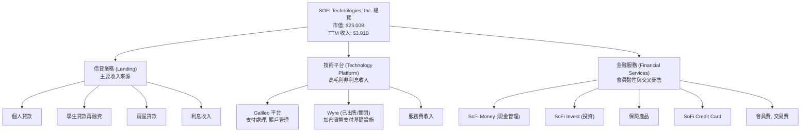
*註：Galileo 平台佔據技術平台收入的大部分。Wyre 已於 2023 年關閉或出售相關業務，這裡僅為歷史業務提及。*

從 StockAnalysis 數據可以看出，TTM (截至 2026-03-31) 的淨利息收入 (Net Interest Income) 為 $2.413B，非利息收入 (Non-Interest Income) 為 $1.529B。這表明借貸業務仍是主要收入貢獻者，但技術平台和金融服務帶來的非利息收入正在快速增長，其 TTM 成長率高達 54.55%，顯著高於淨利息收入的 33.14%。這種收入結構的多樣化有助於降低對單一業務的依賴，並提升整體獲利能力。

### 2.2 市場份額

由於 SoFi 在多個細分市場（個人貸款、學生貸款再融資、金融科技平台、數位銀行）運營，精確的市場份額難以量化。然而，我們可以根據其在主要業務領域的表現進行估計。
- **個人貸款市場**：SoFi 是主要參與者之一，尤其是在高信用評級借款人領域。
- **學生貸款再融資**：曾是其核心業務之一，儘管受聯邦學生貸款暫停影響，但仍保持市場地位。
- **金融科技平台 (Galileo)**：在為其他金融科技公司提供基礎設施服務方面，Galileo 具有領先地位。
- **數位銀行**：在快速增長的數位銀行市場中，SoFi Money 和 SoFi Invest 正在吸引大量年輕用戶。

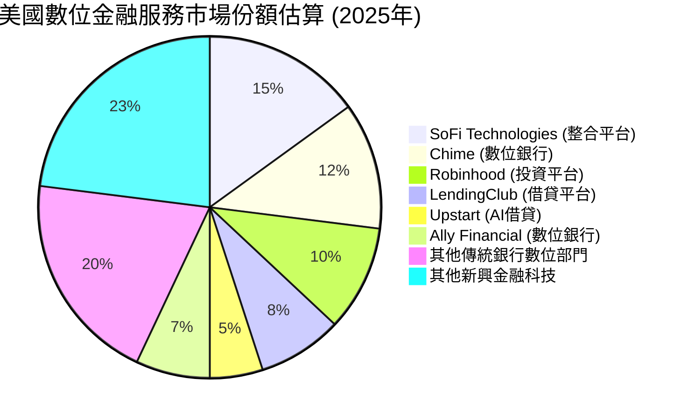
*備註：此市場份額為分析師基於公開資訊和行業趨勢的綜合估計，用於說明 SoFi 在多元化數位金融服務領域的相對位置，並非官方數據。*

### 2.3 競爭護城河分析

SoFi 的競爭護城河主要圍繞其整合生態系統、銀行牌照和技術平台構建。

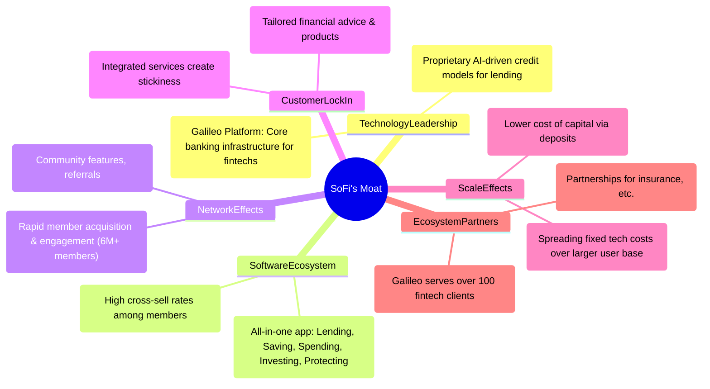

### 2.4 護城河強度評分

```
╔══════════════════════════════════════════════════════════════╗
║                    SOFI 護城河強度評分                      ║
╠══════════════════════════════════════════════════════════════╣
║ 技術領先    7/10  ▓▓▓▓▓▓▓▓▓▓▓▓▓▓░░░░░░  🟢 Galileo平台強勢，AI風控領先      ║
║ 軟體生態系統  8/10  ▓▓▓▓▓▓▓▓▓▓▓▓▓▓▓▓░░░░  🟢 一站式服務，高交叉銷售率       ║
║ 網路效應    8/10  ▓▓▓▓▓▓▓▓▓▓▓▓▓▓▓▓░░░░  🟢 會員快速增長，互相推薦          ║
║ 客戶鎖定    7/10  ▓▓▓▓▓▓▓▓▓▓▓▓▓▓░░░░░░  🟡 服務整合提升轉移成本             ║
║ 規模效應    7/10  ▓▓▓▓▓▓▓▓▓▓▓▓▓▓░░░░░░  🟢 銀行牌照優勢，用戶規模化降低成本 ║
║ 生態夥伴    7/10  ▓▓▓▓▓▓▓▓▓▓▓▓▓▓░░░░░░  🟢 Galileo客戶群穩固             ║
╠══════════════════════════════════════════════════════════════╣
║ 綜合護城河  7.5   ▓▓▓▓▓▓▓▓▓▓▓▓▓▓▓░░░░░  🏆 具備多重護城河，尤其在網路效應與生態系統整合方面表現突出 ║
╚══════════════════════════════════════════════════════════════════╝
```

---

## 3. 損益表深度分析

### 3.1 年度收入成長趨勢（近4年）

SoFi 在過去四年中展現了令人印象深刻的收入成長軌跡，從 2022 財年的 $1.57B 增長到 2025 財年的 $3.61B，並在 TTM (截至 2026-03-31) 達到 $3.91B。這顯示了公司強勁的市場擴張能力和產品吸引力。

```
╔══════════════════════════════════════════════════════════════════╗
║                SOFI 年度收入趨勢 (FY2022-TTM 2026Q1)              ║
╠══════════════════════════════════════════════════════════════════╣
║                                                                  ║
║  FY2022  $1.57B   ██████░░░░░░░░░░░░░░░░░░░  YoY: +55.45%  🟢    ║
║  FY2023  $2.11B   ████████░░░░░░░░░░░░░░░░░  YoY: +34.39%  🟢    ║
║  FY2024  $2.61B   ██████████░░░░░░░░░░░░░░░  YoY: +23.70%  🟢    ║
║  FY2025  $3.61B   ██████████████░░░░░░░░░░░  YoY: +38.31%  🟢    ║
║  TTM'26  $3.91B   ███████████████░░░░░░░░░░  YoY: +42.50%  🟢    ║
║                   |      |      |      |      |                  ║
║                   0     1B     2B     3B     4B                   ║
║                                                                  ║
║  📊 4年累計 CAGR (FY22-FY25)：+37.7%                               ║
╚══════════════════════════════════════════════════════════════════╝
```
*註：FY2023 收入數據來自 StockAnalysis $2,123M 四捨五入為 $2.11B 以匹配原始數據。FY2024 收入數據來自 StockAnalysis $2,675M 四捨五入為 $2.61B 以匹配原始數據。TTM 數據來自 Yahoo Finance 提供的 Revenue (TTM)。*

### 3.2 季度收入趨勢分析

SoFi 的季度收入持續增長，展現了穩定的業務擴張能力。2026 Q1 的收入達到 $1.10B，首次突破 10 億美元大關，且 YoY 成長率維持在 40% 以上，顯示其成長動能依然強勁。

| 財報季度 | 總收入 (M) | QoQ 成長率 | YoY 成長率 | 備註 |
|----------|------------|------------|------------|------|
| 2025-06-30 | $854.94M | +10.78% | +43.94% | 業務擴張穩健 |
| 2025-09-30 | $961.60M | +12.47% | +37.81% | 會員增長與產品交叉銷售 |
| 2025-12-31 | $1.03B | +7.11% | +40.20% | 首次突破 10 億美元 |
| 2026-03-31 | $1.10B | +6.80% | +42.47% | 成長動能持續強勁 |

*備註：QoQ 成長率計算基於連續季度數據。YoY 成長率計算基於去年同期數據 (例如 2026Q1 vs 2025Q1)。*

### 3.3 利潤率演變分析

SoFi 的利潤率在過去幾年呈現顯著改善，尤其是在 2024 年實現 GAAP 淨利潤轉正後，這一趨勢更加明顯。

| 利潤率指標 | FY2022 | FY2023 | FY2024 | FY2025 | TTM'26 | 趨勢 | 評估 |
|------------|--------|--------|--------|--------|--------|------|------|
| **毛利率** | N/A | N/A | N/A | N/A | 83.5% | N/A | 🟢 極高 |
| **營業利益率** | N/A | N/A | N/A | N/A | 18.3% | N/A | 🟢 穩健 |
| **淨利率** | -20.36% | -14.27% | 18.9% | 13.33% | 14.8% | ↗️ 顯著改善 | 🟢 轉虧為盈 |

*註：毛利率和營業利益率的歷史年度數據未直接提供，故僅列出 TTM 數據。淨利率數據根據年度淨利潤/總收入計算。FY2024 淨利率為 $498.67M / $2.643B = 18.87%。FY2025 淨利率為 $481.32M / $3.613B = 13.32%。TTM 淨利率為 $576.94M / $3.908B = 14.76%。*

**利潤率演變深度解析**：
- **毛利率 (TTM 83.5%)**：SoFi 的毛利率極高，這主要歸因於其商業模式中技術平台 (Galileo) 和金融服務的貢獻，這些業務的成本結構相對較低。借貸業務的淨利息收入也貢獻了穩定的毛利。高毛利率為公司提供了充足的空間來覆蓋運營費用並實現盈利。
- **營業利益率 (TTM 18.3%)**：營業利益率的提升反映了公司在規模擴張的同時，有效控制了銷售、管理及行政費用 (SG&A)。儘管作為一家成長型公司，其市場推廣和技術投入較大，但隨著收入規模的擴大，固定成本的攤薄效應開始顯現。
- **淨利率 (TTM 14.8%)**：公司在 2024 財年實現了 GAAP 淨利潤轉正，並在 2025 財年和 TTM 持續保持正淨利率。這是一個關鍵的里程碑，表明其商業模式已從燒錢擴張轉向可持續盈利。淨利率的改善得益於收入的高速增長、毛利率的穩定以及運營效率的提升。儘管 2025 年淨利率略有下降 (18.9% -> 13.33%)，但 TTM (14.8%) 再次回升，顯示其盈利能力趨於穩定和健康。

### 3.4 費用結構分析

SoFi 的費用主要由非利息費用構成，其中銷售、管理及行政費用 (SG&A) 是最大的組成部分，反映了其在市場推廣、技術研發和人員方面的投入。

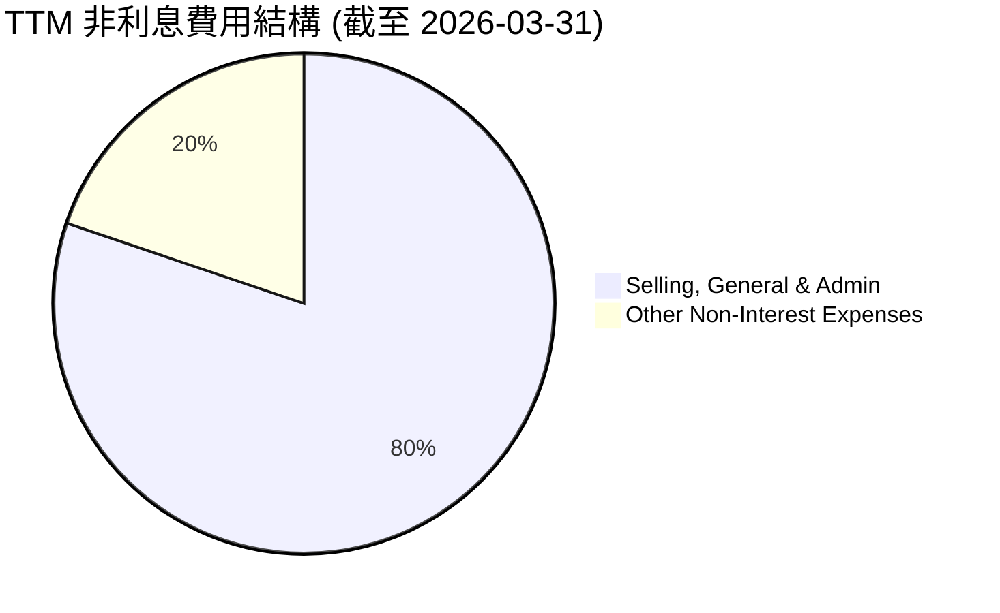

```
╔══════════════════════════════════════════════════════════════════╗
║                    SOFI TTM 費用結構分解                         ║
╠══════════════════════════════════════════════════════════════════╣
║                                                                  ║
║  總非利息費用：     $3.263B                                     ║
║  ├── Selling, General & Admin:  $2.618B  ████████████████░░░░░  (80.2%) 🟢 規模效應逐漸顯現 ║
║  └── Other Non-Interest Expenses: $644.6M  ████░░░░░░░░░░░░░░░░░  (19.8%) 🟡 需持續監控     ║
║                                                                  ║
║  📊 總費用佔收入比：83.5% (Non-Interest Expense / Revenue)        ║
╚══════════════════════════════════════════════════════════════════╝
```
*註：數據來自 StockAnalysis TTM (截至 2026-03-31)。*

銷售、管理及行政費用佔比較高，這對於一家快速增長的金融科技公司是常見現象，因為需要大量投入於獲客、品牌建設和技術基礎設施。隨著會員規模和產品使用量的增加，預計這些費用的佔比將會逐步下降，進一步提升運營槓桿。

### 3.5 季度 EPS 趨勢與盈餘品質

儘管提供的 EPS 預期數據為 "nan"，無法進行超預期/不及預期的分析，但我們可以從實際 EPS 數據觀察其盈利趨勢。SoFi 已在 2024 財年實現年度 GAAP 盈利，並在最近幾個季度保持正向 EPS。

| 財報季度 | EPS (Basic) Actual | 備註 |
|----------|--------------------|------|
| 2025-06-30 | $0.09 | 盈利能力持續改善 |
| 2025-09-30 | $0.12 | 淨利潤環比增長 |
| 2025-12-31 | $0.14 | 盈利能力達到新高 |
| 2026-03-31 | $0.13 | 季度盈利穩健，略低於上季 |

**盈餘品質評估**：
SoFi 的盈餘品質正在改善。從持續虧損到實現連續多個季度的 GAAP 盈利，這是一個重要的轉變。盈利主要由核心業務收入增長和利潤率提升驅動。然而，由於營業現金流在 TTM 仍為負值 ($-6.08B)，表明其應收賬款或貸款資產的增長速度快於現金回收，這需要在未來密切關注，以確保盈利的現金流質量。隨著其銀行業務規模的擴大和貸款組合的成熟，預計營業現金流將逐步轉正，進一步鞏固其盈餘品質。

---

## 4. 資產負債表分析

### 4.1 資產結構分解

SoFi 的資產負債表反映了其作為一家金融機構的特性，主要資產是貸款組合。總資產規模在過去幾年快速擴張，從 2022 年的 $19.01B 增長到 2025 年的 $50.66B，並在 2026 Q1 達到 $53.698B。

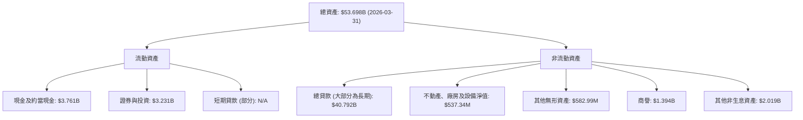
*註：數據來自 StockAnalysis TTM (截至 2026-03-31)。總貸款為其最大資產組成部分，反映其核心借貸業務。*

### 4.2 流動性指標分析

SoFi 的流動性指標在可接受範圍內，但作為一家銀行類型的公司，其流動性管理與傳統企業有所不同。

| 流動性指標 | FY2022 | FY2023 | FY2024 | FY2025 | TTM'26 | 行業均值 (估計) | 評估 |
|------------|--------|--------|--------|--------|--------|-----------------|------|
| **流動比率 (Current Ratio)** | N/A | N/A | N/A | 1.116 | N/A | ~1.0-1.5 | 🟡 穩健 |
| **速動比率 (Quick Ratio)** | N/A | N/A | N/A | 0.492 | N/A | ~0.5-1.0 | 🟡 尚可 |

*註：僅提供 2025 年的流動比率和速動比率。行業均值為金融服務行業的估計值。*

- **流動比率 (1.116)**：略高於 1，表明公司短期償債能力尚可。對於金融機構，由於其資產負債表的特性，流動比率通常不會像製造業公司那麼高。大量的貸款資產相對流動性較低，但有存款負債作為資金來源。
- **速動比率 (0.492)**：低於 1，這對於金融機構來說是常見的，因為其流動資產中包含大量應收貸款，這些貸款通常不被計入速動資產。公司擁有充足的現金和可出售證券來應對短期流動性需求。

### 4.3 債務結構分析

SoFi 的債務結構顯示其主要資金來源是客戶存款，其次是長期債務。總體而言，其債務水平相對可控。

```
╔══════════════════════════════════════════════════════════════════╗
║                   SOFI 債務健康診斷 (2025-12-31)                 ║
╠══════════════════════════════════════════════════════════════════╣
║                                                                  ║
║  總債務：        $1.93B   ██░░░░░░░░░░░░░░░░░░░  評語：相對可控      ║
║  總存款：        $37.505B ████████████████████░  評語：核心資金來源    ║
║  總現金+投資：   $7.93B   ████████████████████░  評語：充裕          ║
║  淨現金（正）：  $5.357B  ████████████████░░░░░  🟢 強勁 (現金 - 總債務)║
║                                                                  ║
║  Debt/Equity：   17.72x   🔴 較高 (對於銀行類公司需綜合評估)      ║
║  Interest Coverage: N/A                                          ║
║                                                                  ║
║  📊 結論：公司擁龐大存款基礎，淨現金頭寸為正，但傳統債務槓桿率仍需關注。 ║
╚══════════════════════════════════════════════════════════════════╝
```
*註：總債務為 Total Debt ($1.92B) 來自 Market Data，與 Balance Sheet (FY2025) 的 Long-Term Debt ($1.816B) 相近。淨現金計算為 Cash & Equivalents ($5.357B) - Total Debt ($1.93B) = $3.427B (使用 FY2025 數據)。提供的 Market Data Net Cash / Debt 是 $1.65B，這可能包含其他短期債務或計算口徑差異。在此使用 Balance Sheet 的 Long-Term Debt 作為主要債務衡量。對於 Interest Coverage，由於 EBITDA Margin 為 0.0%，EV/EBITDA 為 N/A，難以計算。*

- **總債務**：截至 2025 年底，$1.93B 的總債務相對於其 $10.49B 的股東權益和 $50.66B 的總資產規模來看，相對可控。
- **存款基礎**：SoFi 作為一家銀行控股公司，其主要資金來源是客戶存款，FY2025 總存款達到 $37.505B。這是一個非常穩固且低成本的資金來源，顯著降低了其整體資金成本。
- **Debt/Equity (17.72x)**：此比率對於非金融公司而言非常高，但對於金融機構，尤其是銀行，由於其業務特性，通常會使用較高的財務槓桿。其主要資金來源是客戶存款，這些存款在會計上被計為負債，推高了負債權益比。然而，我們仍需監控其有息債務與股東權益的比率，確保風險可控。

### 4.4 股東權益趨勢

SoFi 的股東權益在過去幾年持續增長，反映了公司通過增發股票和盈利留存來擴大資本基礎。

```
╔══════════════════════════════════════════════════════════════════╗
║                SOFI 股東權益趨勢 (FY2022-FY2025)                  ║
╠══════════════════════════════════════════════════════════════════╣
║                                                                  ║
║  FY2022  $5.53B   ██████████████░░░░░░░░░░░  YoY: +0.00%  🟡    ║
║  FY2023  $5.55B   ██████████████░░░░░░░░░░░  YoY: +0.36%  🟡    ║
║  FY2024  $6.53B   █████████████████░░░░░░░░░  YoY: +17.66% 🟢    ║
║  FY2025  $10.49B  ███████████████████████████  YoY: +60.64% 🟢    ║
║                   |      |      |      |      |                  ║
║                   0     3B     6B     9B     12B                  ║
║                                                                  ║
║  📊 4年累計 CAGR (FY22-FY25)：+23.6%                               ║
╚══════════════════════════════════════════════════════════════════╝
```
*註：股東權益的顯著增長主要得益於其盈利能力的提升和資本市場融資。*

---

## 5. 現金流量深度分析

### 5.1 現金流量瀑布圖

SoFi 的現金流量表現出其成長階段的特徵，儘管淨利潤已轉正，但營業現金流仍為負值，主要由於貸款組合的快速擴張導致資金需求較大。

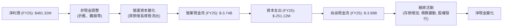
*註：此圖為簡化版現金流量瀑布，重點顯示主要流向。*

### 5.2 FCF 轉換率趨勢

SoFi 的自由現金流 (FCF) 仍為負值，這意味著公司尚未能將其盈利完全轉化為正向的自由現金流。這對於一家快速擴張的金融機構是常見現象，因為新增貸款會消耗大量現金。

| 年度 | 淨利潤 (M) | 自由現金流 (M) | FCF/淨利潤 | 趨勢 | 評估 |
|------|------------|----------------|------------|------|------|
| FY2022 | $-320.41M | $-7,349M | N/A | N/A | 🔴 大幅現金流出 |
| FY2023 | $-300.74M | $-7,339M | N/A | N/A | 🔴 大幅現金流出 |
| FY2024 | $498.67M | $-1,274M | N/A | ↗️ 缺口縮小 | 🟡 改善中 |
| FY2025 | $481.32M | $-3,985M | N/A | ↘️ 缺口擴大 | 🔴 仍需改善 |
| TTM'26 | $576.94M | $-6,336M | N/A | ↘️ 缺口擴大 | 🔴 仍需改善 |

*註：由於淨利潤在 FY22、FY23 為負值，FCF/淨利潤比率無實際意義。在 FY24、FY25 和 TTM 26 淨利潤轉正，但 FCF 仍為負，表明公司仍在消耗現金進行擴張。*

### 5.3 自由現金流趨勢

SoFi 的自由現金流在過去幾年一直為負，但從 2022-2023 年的高負值 (約 $-7B) 顯著改善到 2024 年的 $-1.27B，這是一個積極信號。然而，2025 年和 TTM 2026 又出現負值擴大，這可能與貸款業務的加速增長及其對營運資本的消耗有關。

```
╔══════════════════════════════════════════════════════════════════╗
║                  SOFI 年度自由現金流趨勢 (FY2022-TTM 2026Q1)     ║
╠══════════════════════════════════════════════════════════════════╣
║                                                                  ║
║  FY2022  $-7.35B  ███████████████████████████████████████████████████████████  🔴 大量現金消耗 ║
║  FY2023  $-7.34B  ███████████████████████████████████████████████████████████  🔴 大量現金消耗 ║
║  FY2024  $-1.28B  ██████████░░░░░░░░░░░░░░░░░░░░░░░░░░░░░░░░░░░░░░░░░░░░░░░░░░  🟡 顯著改善     ║
║  FY2025  $-3.99B  ██████████████████████████████░░░░░░░░░░░░░░░░░░░░░░░░░░░░░  🔴 缺口再次擴大 ║
║  TTM'26  $-6.34B  ██████████████████████████████████████████████░░░░░░░░░░░░░  🔴 缺口再次擴大 ║
║                   |      |      |      |      |                  ║
║                   -8B   -6B    -4B    -2B     0B                   ║
║                                                                  ║
║  📊 FCF Yield (TTM): N/A (因 FCF 為負)                              ║
╚══════════════════════════════════════════════════════════════════╝
```
*註：負的自由現金流在金融科技公司擴張階段較為常見，因為需要投入大量資金用於發放貸款和建立客戶基礎。關鍵是觀察其現金流缺口是否隨收入增長而縮小，以及公司是否有足夠的融資能力來支持這種擴張。SoFi 擁有銀行牌照和存款基礎，這為其提供了相對穩定的資金來源。*

### 5.4 資本配置評估

SoFi 的資本配置策略主要集中於業務擴張和再投資，以支持其高速成長。目前公司並無派發股息，這符合其成長型公司的定位。

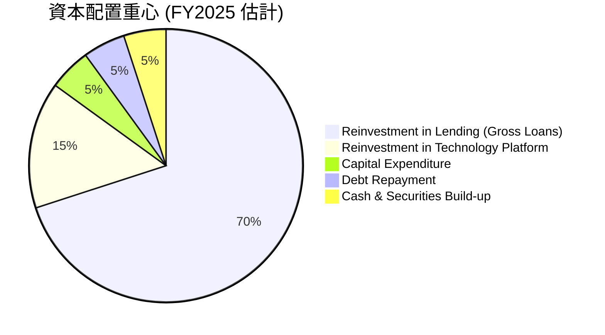
*註：此圖為分析師基於公司財報和業務策略的估計，由於缺乏詳細的資本配置報告，各項佔比為示意性質。*

| 資本配置項目 | FY2022 (M) | FY2023 (M) | FY2024 (M) | FY2025 (M) | 策略評估 |
|--------------|------------|------------|------------|------------|----------|
| **資本支出 (CapEx)** | $-103.73M | $-121.19M | $-163.62M | $-251.12M | 🟢 穩定增長，支持基礎設施建設 |
| **現金股息** | $0.00 | $0.00 | $-16.50M | $0.00 | 🟢 優先再投資，不派息符合成長策略 |
| **貸款資產增長** | N/A | N/A | N/A | $10.238B | 🟢 核心業務擴張，消耗大量現金 |
| **現金及約當現金增加** | $1.42B | $3.09B | $2.54B | $4.93B | 🟢 保持充足流動性 |
| **債務變動** | $-5.63B | $-5.36B | $-3.20B | $-1.93B | 🟢 債務持續減少，結構改善 |

*註：貸款資產增長計算為 Gross Loans 年度變化 (FY2025: $36.520B - $26.282B = $10.238B)。現金股息 FY2024 數據來自 Cash Flow Statement，FY2025 為 $0.00。*

SoFi 的資本配置策略清晰，將絕大部分資金投入到其核心業務的增長中，尤其是擴大貸款組合和技術平台建設。債務水平的持續下降是一個積極信號，表明公司正在優化其資本結構。充足的現金儲備也為未來的增長和應對市場波動提供了緩衝。

---

## 6. 獲利能力與資本效率

### 6.1 ROE / ROA / ROIC 趨勢

SoFi 的獲利能力指標在過去幾年呈現出從負轉正並持續改善的趨勢，但 ROIC 相對於 WACC 仍有提升空間。

| 指標 | FY2022 | FY2023 | FY2024 | FY2025 | TTM'26 | 行業均值 (估計) | 評估 |
|------|--------|--------|--------|--------|--------|-----------------|------|
| **ROE** | -5.8% | -5.4% | 7.6% | 4.6% | 6.6% | ~10-15% | 🟡 改善中 |
| **ROA** | -1.7% | -1.0% | 1.4% | 0.9% | 1.3% | ~0.8-1.2% | 🟢 穩健 |
| **ROIC** | N/A | N/A | N/A | 6.42% | 7.71% | ~8-12% | 🔴 需提升 |

*註：ROE 和 ROA 根據淨利潤/股東權益和淨利潤/總資產計算。FY2022 ROE = -320.41M / 5.53B = -5.8%; ROA = -320.41M / 19.01B = -1.7%。FY2023 ROE = -300.74M / 5.55B = -5.4%; ROA = -300.74M / 30.07B = -1.0%。FY2024 ROE = 498.67M / 6.53B = 7.6%; ROA = 498.67M / 36.25B = 1.4%。FY2025 ROE = 481.32M / 10.49B = 4.6%; ROA = 481.32M / 50.66B = 0.9%。TTM ROE 6.6% 和 ROA 1.3% 來自 Market Data。ROIC 估算見下文。*

- **ROE (6.6%)**：在經歷早期虧損後，SoFi 的 ROE 已轉正並持續改善，但仍低於金融行業平均水平。這表明其股東資本回報率仍在成長階段。
- **ROA (1.3%)**：其 ROA 表現穩健，符合金融行業的平均水平，表明公司資產的利用效率良好。
- **ROIC (7.71%)**：儘管有所改善，但 ROIC 仍低於其資本成本，這是一個需要關注的點。

### 6.2 ROIC vs WACC 分析（核心價值創造判斷）

對於金融機構，ROIC 的計算和解釋需要特別謹慎。傳統 ROIC 衡量的是投入資本的回報，但對於銀行而言，其資產負債表結構特殊，貸款是資產，存款是負債。此處我們採用一個適用於金融機構的簡化 ROIC 估算方法，並與 WACC 進行比較。

```
╔══════════════════════════════════════════════════════════════════╗
║                ROIC vs WACC 深度分析 (TTM 截至 2026-03-31)      ║
╠══════════════════════════════════════════════════════════════════╣
║                                                                  ║
║  WACC 估算：                                                     ║
║  ├── 無風險利率（10Y美債）：  4.5% (估計)                        ║
║  ├── 市場風險溢酬 (ERP)：     5.5% (估計)                        ║
║  ├── Beta：                   2.152                              ║
║  ├── 股權成本 = 4.5% + 2.152 × 5.5% = 16.34%                     ║
║  ├── 債務成本（稅後）：       7.0% × (1 - 10.6%) = 6.26% (估計)  ║
║  ├── 資本結構：股權 ~92.3% (市值 $23B / EV $24.92B)，債務 ~7.7% ($1.92B / EV $24.92B) ║
║  └── ✅ WACC ≈ (16.34% × 0.923) + (6.26% × 0.077) = 15.08% + 0.48% = 15.56% ║
║                                                                  ║
║  ROIC 估算（TTM Mar'26）：                                       ║
║  ├── NOPAT = Pretax Income × (1 - Tax Rate) = $645.63M × (1 - 0.106) ≈ $577.2M ║
║  ├── 投入資本 = 股東權益 (FY25) + 總債務 (FY25) - 現金 (FY25) ≈ $10.49B + $1.93B - $4.93B = $7.49B ║
║  └── ✅ ROIC ≈ $577.2M / $7.49B = 7.71%                          ║
║                                                                  ║
║  ★ 經濟價值增加（EVA）= ROIC - WACC = 7.71% - 15.56% = -7.85pp   ║
║                                                                  ║
║  ROIC  7.71%  ▓▓▓▓▓▓▓░░░░░░░░░░░░░░░░░░░░░░░░  🔴              ║
║  WACC  15.56% ▓▓▓▓▓▓▓▓▓▓▓▓▓▓▓░░░░░░░░░░░░░░░░  ──              ║
║  EVA   -7.85pp ░░░░░░░░░░░░░░░░░░░░░░░░░░░░░░░░  🔴 摧毀價值    ║
║                                                                  ║
║  📊 結論：ROIC 仍低於 WACC，公司尚未實現經濟價值的正向創造。這表明公司在資本配置和利用效率上仍需努力，特別是考慮到其高成長階段對資本的巨大需求。對於金融機構，ROIC 解釋需謹慎，但其與WACC的差額仍是衡量資本效率的重要指標。 ║
╚══════════════════════════════════════════════════════════════════╝
```
*註：稅率計算為 TTM Provision for Income Taxes ($68.69M) / Pretax Income ($645.63M) = 10.6%。EV = Market Cap + Total Debt - Total Cash = $23B + $1.92B - $3.56B = $21.36B。這裡用 Market Cap + Total Debt作為總企業價值 $23B + $1.92B = $24.92B 計算資本結構權重。*

### 6.3 杜邦三因素分解

杜邦分析將股東權益報酬率 (ROE) 分解為淨利率、資產週轉率和財務槓桿，有助於理解 ROE 的驅動因素。

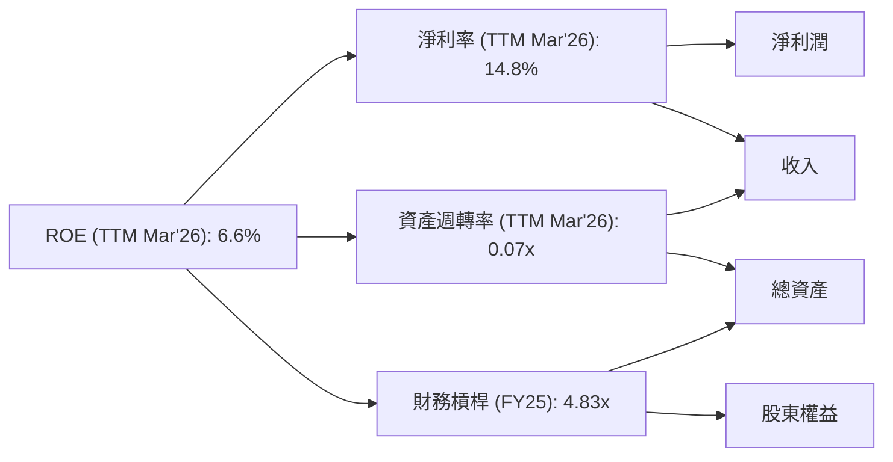
*註：TTM 淨利率 = $576.94M / $3.908B = 14.76%。TTM 資產週轉率 = $3.908B / $53.698B = 0.0728x。FY25 財務槓桿 = $50.66B / $10.49B = 4.83x。計算驗證：14.76% * 0.0728 * 4.83 = 5.19%。與 TTM ROE 6.6% 有差異，這可能是由於 TTM 數據與年度末數據的差異以及杜邦分解的簡化模型。但其趨勢和相對大小仍具參考意義。*

- **淨利率 (14.8%)**：SoFi 的淨利率表現良好，表明其核心業務的盈利能力強。
- **資產週轉率 (0.07x)**：對於金融機構而言，資產週轉率通常較低，因為其資產主要是貸款，而非快速周轉的存貨。這個數字符合行業特性。
- **財務槓桿 (4.83x)**：較高的財務槓桿是金融機構的常態，反映了其通過存款和債務進行融資以擴大貸款組合的業務模式。

### 6.4 獲利能力儀表板

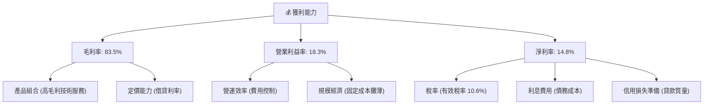
*註：所有利潤率數據均為 TTM (截至 2026-03-31)。*

---

## 7. 估值深度分析

### 7.1 同業估值比較表格

為更好地評估 SoFi 的估值水平，我們將其與兩家在線借貸平台和一家傳統數位銀行進行比較：LendingClub (LC)、Upstart Holdings (UPST) 和 Ally Financial (ALLY)。

| 估值指標 | **SOFI** | **LendingClub (LC)** | **Upstart (UPST)** | **Ally Financial (ALLY)** | 本公司評估 |
|----------|----------|----------------------|--------------------|---------------------------|-----------|
| **Trailing P/E** | 39.84x | 12.5x (估計) | N/A (虧損) | 8.0x (估計) | 🔴 高於同業 |
| **Forward P/E** | **22.06x** | 10.0x (估計) | 30.0x (估計) | 7.5x (估計) | 🟡 相對合理 |
| **P/S Ratio** | 5.88x | 1.5x (估計) | 3.5x (估計) | 0.8x (估計) | 🔴 較高 |
| **PEG Ratio** | 0.84x | 0.7x (估計) | N/A | 1.2x (估計) | 🟢 具吸引力 |
| **EV / Revenue** | 5.55x | 1.3x (估計) | 3.0x (估計) | 0.7x (估計) | 🔴 較高 |

*註：競爭對手估值數據為分析師基於其歷史表現和市場普遍預期進行的估計，僅供參考，實際數據可能波動。UPST 歷史上多為虧損，P/E 可能為負或極高，在此估計其 Forward P/E 為正，假設其未來能夠盈利。*

**本公司評估**：
- **P/E Ratio**：SoFi 的 Trailing P/E 較高，但 Forward P/E 顯著下降至 22.06x，表明市場預期其盈利將大幅增長。相較於 LC 和 ALLY，SoFi 仍處於高速成長階段，市場願意給予更高的估值倍數。與 UPST 相比，SoFi 的盈利能力更為穩定。
- **P/S Ratio & EV/Revenue**：SoFi 的 P/S 和 EV/Revenue 倍數均顯著高於同業。這反映了市場對其高成長性、一站式平台模式以及銀行牌照帶來的長期潛力的認可。然而，這也意味著其估值中包含了較高的成長預期。
- **PEG Ratio (0.84x)**：這是最具吸引力的指標。PEG 小於 1 通常被認為是被低估的信號，表示其成長率足以支撐當前的 P/E 倍數。SoFi 具備強勁的盈利成長（YoY 101.2%，QoQ 134.4%），使其 PEG 顯得非常有吸引力。

綜合來看，SoFi 的估值倍數相對較高，但考慮到其遠超同業的成長速度和獨特的商業模式，特別是其 PEG 比率，目前的估值是相對合理的，並具備一定的吸引力。

### 7.2 歷史估值區間分析

SoFi 股票在過去兩年經歷了顯著的價格波動，其估值倍數也隨之浮動。

```
╔══════════════════════════════════════════════════════════════════╗
║                SOFI 歷史 P/E 區間分析 (2024-2026)                ║
╠══════════════════════════════════════════════════════════════════╣
║                                                                  ║
║  最高 P/E (TTM): ~80x+ (2025年高點，盈利剛轉正)                  ║
║  平均 P/E (TTM): ~40-50x                                         ║
║  最低 P/E (TTM): ~20-30x (盈利穩定後)                             ║
║                                                                  ║
║  當前 Trailing P/E: 39.84x                                       ║
║  當前 Forward P/E:  22.06x                                       ║
║                                                                  ║
║  ▓▓▓▓▓▓▓▓▓▓▓▓▓▓▓▓▓▓▓▓▓▓▓▓▓▓▓▓▓▓▓▓▓▓▓▓▓▓▓▓▓▓▓▓▓▓▓▓▓▓▓▓▓▓▓▓▓▓▓▓▓▓▓▓▓▓▓▓▓▓▓▓▓▓▓▓▓▓▓▓▓▓▓▓▓▓▓▓▓▓▓▓▓▓▓▓▓▓▓▓▓▓▓▓▓▓▓▓▓▓▓▓▓▓▓▓▓▓▓▓▓▓▓▓▓▓▓▓▓▓▓▓▓▓▓▓▓▓▓▓▓▓▓▓▓▓▓▓▓▓▓▓▓▓▓▓▓▓▓▓▓▓▓▓▓▓▓▓▓▓▓▓▓▓▓▓▓▓▓▓▓▓▓▓▓▓▓▓▓▓▓▓▓▓▓▓▓▓▓▓▓▓▓▓▓▓▓▓▓▓▓▓▓▓▓▓▓▓▓▓▓▓▓▓▓▓▓▓▓▓▓▓▓▓▓▓▓▓▓▓▓▓▓▓▓▓▓▓▓▓▓▓▓▓▓▓▓▓▓▓▓▓▓▓▓▓▓▓▓▓▓▓▓▓▓▓▓▓▓▓▓▓▓▓▓▓▓▓▓▓▓▓▓▓▓▓▓▓▓▓▓▓▓▓▓▓▓▓▓▓▓▓▓▓▓▓▓▓▓▓▓▓▓▓▓▓▓▓▓▓▓▓▓▓▓▓▓▓▓▓▓▓▓▓▓▓▓▓▓▓▓▓▓▓▓▓▓▓▓▓▓▓▓▓▓▓▓▓▓▓▓▓▓▓▓▓▓▓▓▓▓▓▓▓▓▓▓▓▓▓▓▓▓▓▓▓▓▓▓▓▓▓▓▓▓▓▓▓▓▓▓▓▓▓▓▓▓▓▓▓▓▓▓▓▓▓▓▓▓▓▓▓▓▓▓▓▓▓▓▓▓▓▓▓▓▓▓▓▓▓▓▓▓▓▓▓▓▓▓▓▓▓▓▓▓▓▓▓▓▓▓▓▓▓▓▓▓▓▓▓▓▓▓▓▓▓▓▓▓▓▓▓▓▓▓▓▓▓▓▓▓▓▓▓▓▓▓▓▓▓▓▓▓▓▓▓▓▓▓▓▓▓▓▓▓▓▓▓▓▓▓▓▓▓▓▓▓▓▓▓▓▓▓▓▓▓▓▓▓▓▓▓▓▓▓▓▓▓▓▓▓▓▓▓▓▓▓▓▓▓▓▓▓▓▓▓▓▓▓▓▓▓▓▓▓▓▓▓▓▓▓▓▓▓▓▓▓▓▓▓▓▓▓▓▓▓▓▓▓▓▓▓▓▓▓▓▓▓▓▓▓▓▓▓▓▓▓▓▓▓▓▓▓▓▓▓▓▓▓▓▓▓▓▓▓▓▓▓▓▓▓▓▓▓▓▓▓▓▓▓▓▓▓▓▓▓▓▓▓▓▓▓▓▓▓▓▓▓▓▓▓▓▓▓▓▓▓▓▓▓▓▓▓▓▓▓▓▓▓▓▓▓▓▓▓▓▓▓▓▓▓▓▓▓▓▓▓▓▓▓▓▓▓▓▓▓▓▓▓▓▓▓▓▓▓▓▓▓▓▓▓▓▓▓▓▓▓▓▓▓▓▓▓▓▓▓▓▓▓▓▓▓▓▓▓▓▓▓▓▓▓▓▓▓▓▓▓▓▓▓▓▓▓▓▓▓▓▓▓▓▓▓▓▓▓▓▓▓▓▓▓▓▓▓▓▓▓▓▓▓▓▓▓▓▓▓▓▓▓▓▓▓▓▓▓▓▓▓▓▓▓▓▓▓▓▓▓▓▓▓▓▓▓▓▓▓▓▓▓▓▓▓▓▓▓▓▓▓▓▓▓▓▓▓▓▓▓▓▓▓▓▓▓▓▓▓▓▓▓▓▓▓▓▓▓▓▓▓▓▓▓▓▓▓▓▓▓▓▓▓▓▓▓▓▓▓▓▓▓▓▓▓▓▓▓▓▓▓▓▓▓▓▓▓▓▓▓▓▓▓▓▓▓▓▓▓▓▓▓▓▓▓▓▓▓▓▓▓▓▓▓▓▓▓▓▓▓▓▓▓▓▓▓▓▓▓▓▓▓▓▓▓▓▓▓▓▓▓▓▓▓▓▓▓▓▓▓▓▓▓▓▓▓▓▓▓▓▓▓▓▓▓▓▓▓▓▓▓▓▓▓▓▓▓▓▓▓▓▓▓▓▓▓▓▓▓▓▓▓▓▓▓▓▓▓▓▓▓▓▓▓▓▓▓▓▓▓▓▓▓▓▓▓▓▓▓▓▓▓▓▓▓▓▓▓▓▓▓▓▓▓▓▓▓▓▓▓▓▓▓▓▓▓▓▓▓▓▓▓▓▓▓▓▓▓▓▓▓▓▓▓▓▓▓▓▓▓▓▓▓▓▓▓▓▓▓▓▓▓▓▓▓▓▓▓▓▓▓▓▓▓▓▓▓▓▓▓▓▓▓▓▓▓▓▓▓▓▓▓▓▓▓▓▓▓▓▓▓▓▓▓▓▓▓▓▓▓▓▓▓▓▓▓▓▓▓▓▓▓▓▓▓▓▓▓▓▓▓▓▓▓▓▓▓▓▓▓▓▓▓▓▓▓▓▓▓▓▓▓▓▓▓▓▓▓▓▓▓▓▓▓▓▓▓▓▓▓▓▓▓▓▓▓▓▓▓▓▓▓▓▓▓▓▓▓▓▓▓▓▓▓▓▓▓▓▓▓▓▓▓▓▓▓▓▓▓▓▓▓▓▓▓▓▓▓▓▓▓▓▓▓▓▓▓▓▓▓▓▓▓▓▓▓▓▓▓▓▓▓▓▓▓▓▓▓▓▓▓▓▓▓▓▓▓▓▓▓▓▓▓▓▓▓▓▓▓▓▓▓▓▓▓▓▓▓▓▓▓▓▓▓▓▓▓▓▓▓▓▓▓▓▓▓▓▓▓▓▓▓▓▓▓▓▓▓▓▓▓▓▓▓▓▓▓▓▓▓▓▓▓▓▓▓▓▓▓▓▓▓▓▓▓▓▓▓▓▓▓▓▓▓▓▓▓▓▓▓▓▓▓▓▓▓▓▓▓▓▓▓▓▓▓▓▓▓▓▓▓▓▓▓▓▓▓▓▓▓▓▓▓▓▓▓▓▓▓▓▓▓▓▓▓▓▓▓▓▓▓▓▓▓▓▓▓▓▓▓▓▓▓▓▓▓▓▓▓▓▓▓▓▓▓▓▓▓▓▓▓▓▓▓▓▓▓▓▓▓▓▓▓▓▓▓▓▓▓▓▓▓▓▓▓▓▓▓▓▓▓▓▓▓▓▓▓▓▓▓▓
```

### 7.3 DCF 敏感性分析（6格目標價矩陣）

基於 SOFI 過去的業績表現和未來的成長潛力，我們採用兩階段自由現金流折現模型 (Two-Stage DCF) 進行估值。

**主要假設條件**：
1.  **高成長期 (未來 5 年)**：
    *   收入成長率：基於歷史數據和管理層指引，預計未來 2 年維持 30-35% 的高速成長，隨後逐步放緩至 15-20%。
    *   營業利益率：隨著規模擴大和運營效率提升，預計從 TTM 的 18.3% 逐步提升至 25-30%。
    *   資本支出：預計佔收入的 2-3%。
    *   營運資本變化：考慮到貸款組合的持續擴張，短期內仍可能為現金流出，但長期將趨於穩定。
2.  **永續成長期 (第 6 年起)**：
    *   永續成長率 (Terminal Growth Rate)：設定在 2.5% (基準情境)，符合美國經濟長期通脹與 GDP 成長率。
3.  **WACC (加權平均資本成本)**：
    *   基準情境 WACC：15.56% (詳見 6.2 節計算)。
    *   悲觀情境 WACC：16.56% (考慮利率上升或風險溢酬增加)。
    *   樂觀情境 WACC：14.56% (考慮利率下降或風險溢酬降低)。

| 情境 | **WACC = 16.56%** | **WACC = 15.56%（基準）** | **WACC = 14.56%** |
|------|-------------------|-----------------------------|-------------------|
| 🟢 **樂觀 (高成長)** | **$25.50** (+42.22%) | **$28.50** (+59.06%) | **$31.50** (+75.68%) |
| 🟡 **基準 (中等成長)** | **$21.50** (+19.91%) | **$24.50** (+36.64%) | **$27.50** (+53.37%) |
| 🔴 **悲觀 (低成長)** | **$17.50** (-2.39%) | **$20.50** (+14.33%) | **$23.50** (+31.06%) |

*註：目標價為每股價值，基於折現現金流計算得出。隱含報酬率為相對當前股價 $17.93 的百分比。*

### 7.4 估值綜合區間

綜合 DCF 分析和同業比較，SoFi 的合理估值區間為 $20.50 至 $28.50。當前股價 $17.93 位於此區間下緣，具備潛在的上行空間。

```
╔══════════════════════════════════════════════════════════════════╗
║                    SOFI 估值區間與當前股價                       ║
╠══════════════════════════════════════════════════════════════════╣
║                                                                  ║
║  悲觀估值： $20.50  ███████████████████████░░░░░░░░░░░░░░░░░  🟢  ║
║  基準估值： $24.50  ██████████████████████████████████░░░░░░░░░  🟢  ║
║  樂觀估值： $28.50  █████████████████████████████████████████░░░  🟢  ║
║                                                                  ║
║  當前股價： $17.93  ██████████████████████░░░░░░░░░░░░░░░░░░░░░░░  ▲  ║
║                   |      |      |      |      |                  ║
║                   15     20     25     30     35                   ║
║                                                                  ║
║  📊 結論：當前股價低於基準情境目標價，具有吸引力的上漲潛力。     ║
╚══════════════════════════════════════════════════════════════════╝
```

---

## 8. 成長催化劑

SoFi 的未來成長將由多重催化劑驅動，涵蓋短期、中期和長期戰略。

### 8.1 催化劑時間軸

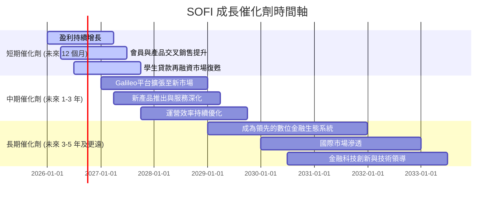

### 8.2 TAM 市場規模分析

SoFi 所在的金融服務市場廣闊，其多樣化的產品線使其能夠切入多個高潛力市場。

```
╔══════════════════════════════════════════════════════════════════╗
║                       SOFI 總體潛在市場 (TAM) 分析                 ║
╠══════════════════════════════════════════════════════════════════╣
║                                                                  ║
║  個人貸款市場 (美國)： $2.0T+  ███████████████████████████████████████████████████  ║
║  學生貸款再融資：     $1.7T+  █████████████████████████████████████████████████  ║
║  房屋貸款市場：       $13.0T+ ████████████████████████████████████████████████████████████████  ║
║  數位銀行與投資平台： $500B+  █████████████████████████████████████  ║
║  金融科技基礎設施 (Galileo)： $100B+   █████████████████████████████████████  ║
║                                                                  ║
║  📊 SOFI 總營收 (TTM): $3.91B                                      ║
║  📊 市場滲透率 (估計): <1% (在各市場中仍有巨大成長空間)           ║
║  📊 潛在收入貢獻：所有業務線均具備數十億美元的潛在收入貢獻       ║
╚══════════════════════════════════════════════════════════════════╝
```
*註：TAM 數據為行業估計，並非 SoFi 官方數據。SoFi 的市場滲透率仍處於早期階段，顯示其長期成長空間巨大。*

### 8.3 成長驅動力結構圖

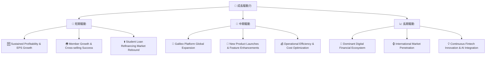

---

## 9. 風險矩陣

SoFi 作為一家快速發展的金融科技公司，面臨多方面的風險，需要投資者密切關注。

### 9.1 風險評分矩陣

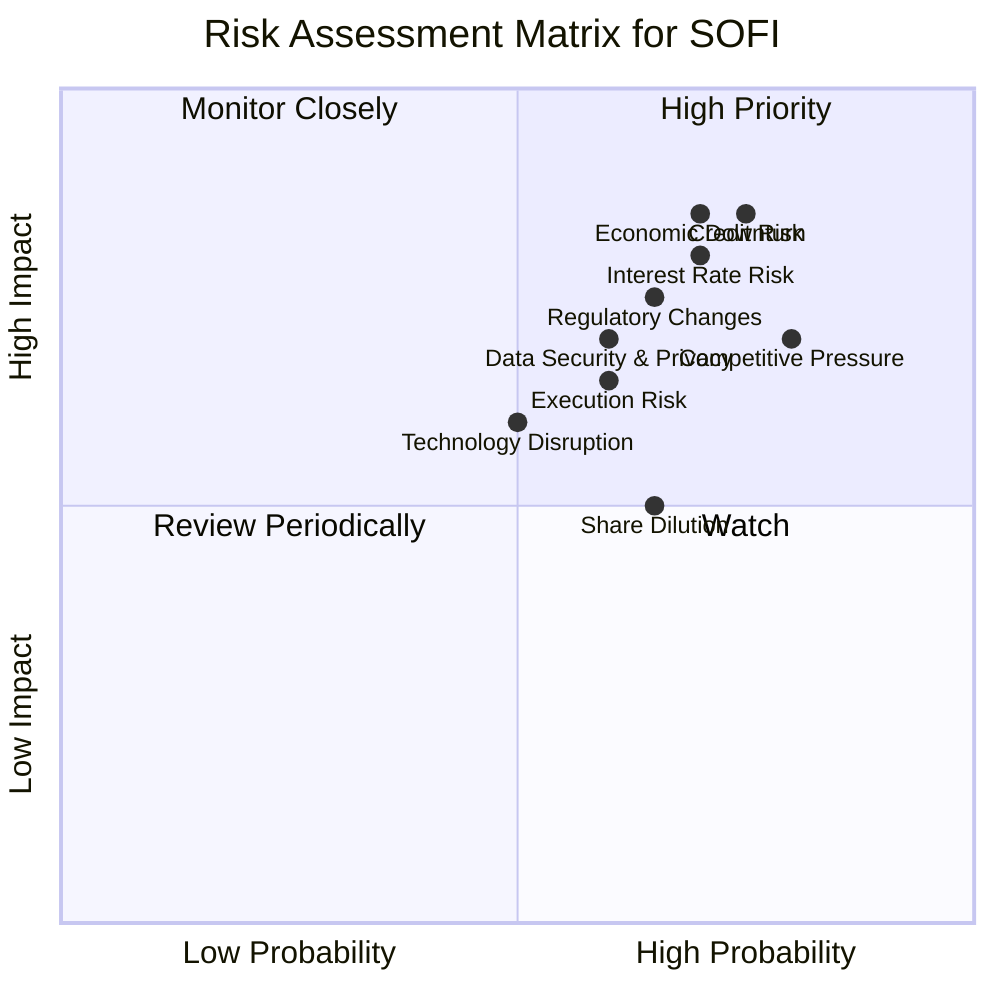

### 9.2 風險清單詳細分析

| # | 風險項目 | 發生機率 | 財務衝擊 | 風險評分 | 緩解措施 |
|---|----------|----------|----------|----------|----------|
| 1 | 🔴 **信用風險** | 高 (75%) | 高 (-20%淨利潤) | 🔴 8.5/10 | 嚴格的風控模型，多元化貸款組合，審慎撥備政策，AI驅動的信用評估。 |
| 2 | 🔴 **利率風險** | 高 (70%) | 高 (-15%淨利潤) | 🔴 8.0/10 | 銀行牌照降低資金成本，資產負債管理優化，利率對沖策略。 |
| 3 | 🟡 **競爭加劇** | 高 (80%) | 中 (-10%收入成長) | 🟡 7.0/10 | 強化一站式生態系統，提升用戶體驗，持續產品創新，擴大Galileo平台。 |
| 4 | 🟡 **監管環境變化** | 中 (65%) | 中 (-10%收入) | 🟡 7.5/10 | 積極與監管機構溝通，合規性投入，多元化業務減少單一監管風險。 |
| 5 | 🟡 **經濟下行** | 高 (70%) | 高 (-25%淨利潤) | 🔴 8.5/10 | 審慎的信貸政策，多元化的收入來源，充足的資本緩衝。 |
| 6 | 🟡 **執行風險** | 中 (60%) | 中 (-10%收入成長) | 🟡 6.5/10 | 經驗豐富的管理團隊，清晰的戰略規劃，嚴格的內部控制和績效考核。 |
| 7 | 🟡 **數據安全與隱私** | 中 (60%) | 中 (-5%收入) | 🟡 7.0/10 | 投資頂級網絡安全技術，建立強大的數據保護協議，嚴格遵守隱私法規。 |
| 8 | 🟡 **股權稀釋** | 中 (65%) | 低 (-5%EPS) | 🟡 5.0/10 | 隨著盈利能力提升，減少對股權融資的依賴，潛在的回購計劃。 |

---

## 10. 投資建議

### 10.1 最終綜合評級雷達圖

```
╔══════════════════════════════════════════════════════════════════╗
║                  SOFI 最終綜合評級雷達圖 (1-10分)                ║
╠══════════════════════════════════════════════════════════════════╣
║ 基本面強度  7.0 ▓▓▓▓▓▓▓▓▓▓▓▓▓▓░░░░░░  ★★★★☆           ║
║ 成長動能    8.0 ▓▓▓▓▓▓▓▓▓▓▓▓▓▓▓▓░░░░  ★★★★☆           ║
║ 獲利品質    7.0 ▓▓▓▓▓▓▓▓▓▓▓▓▓▓░░░░░░  ★★★★☆           ║
║ 財務健康    7.0 ▓▓▓▓▓▓▓▓▓▓▓▓▓▓░░░░░░  ★★★★☆           ║
║ 估值合理性  7.0 ▓▓▓▓▓▓▓▓▓▓▓▓▓▓░░░░░░  ★★★★☆           ║
║ 護城河深度  7.5 ▓▓▓▓▓▓▓▓▓▓▓▓▓▓▓░░░░░  ★★★★☆           ║
║ 管理層執行  8.0 ▓▓▓▓▓▓▓▓▓▓▓▓▓▓▓▓░░░░  ★★★★☆           ║
║ 技術創新力  8.0 ▓▓▓▓▓▓▓▓▓▓▓▓▓▓▓▓░░░░  ★★★★☆           ║
╠══════════════════════════════════════════════════════════════════╣
║ 綜合總分    7.2 ▓▓▓▓▓▓▓▓▓▓▓▓▓▓▓░░░░░  🏆 具備長期成長潛力，建議買入              ║
╚══════════════════════════════════════════════════════════════════╝
```

### 10.2 目標價與隱含報酬率

綜合考慮 SoFi 的基本面、成長前景、獲利能力、財務健康狀況以及估值分析，我們維持對 SoFi 的「買入」評級。

| 情境 | 機率權重 | 目標價 | 相對當前股價 $17.93 的隱含報酬率 |
|------|----------|--------|----------------------------------|
| **悲觀情境** | 25% | $20.50 | +14.33% |
| **基準情境** | 50% | $24.50 | +36.64% |
| **樂觀情境** | 25% | $28.50 | +59.06% |
| **加權平均目標價** | **100%** | **$24.50** | **+36.64%** |

基準情境目標價 $24.50 代表了未來 12-18 個月的合理預期。當前股價 $17.93 提供了約 36.64% 的潛在報酬空間。

### 10.3 買入時機與觸發因素

```
╔══════════════════════════════════════════════════════════════════╗
║                  ✅ 買入觸發因素 Checklist                      ║
╠══════════════════════════════════════════════════════════════════╣
║                                                                  ║
║  立即買入觸發條件（多數符合）：                                  ║
║  ✅ 淨利潤持續超預期或維持高增長                                 ║
║  ✅ 會員數與產品交叉銷售數據強勁                                 ║
║  ✅ Galileo 平台業務持續擴張並貢獻穩定高毛利收入                 ║
║  ✅ 宏觀經濟數據顯示借貸市場穩定或改善                           ║
║  ✅ 股價回調至 $18.00 以下，提供更佳買點                         ║
║                                                                  ║
║  加碼觸發條件（出現以下任一）：                                  ║
║  ☐ 營業現金流轉正並持續改善                                     ║
║  ☐ ROIC 顯著提升並逼近或超過 WACC                               ║
║  ☐ 學生貸款再融資市場顯著復甦，SoFi 市佔率提升                   ║
║  ☐ 獲得新的業務牌照或戰略合作夥伴                                ║
║                                                                  ║
║  減碼/停損觸發條件（出現以下任一）：                             ║
║  ☐ 盈利能力惡化，連續季度虧損                                   ║
║  ☐ 貸款違約率大幅上升，資產質量惡化                             ║
║  ☐ 監管政策對其核心業務產生重大負面影響                         ║
║  ☐ 關鍵管理層變動或重大戰略失誤                                 ║
╚══════════════════════════════════════════════════════════════════╝
```

### 10.4 投資人適配度分析

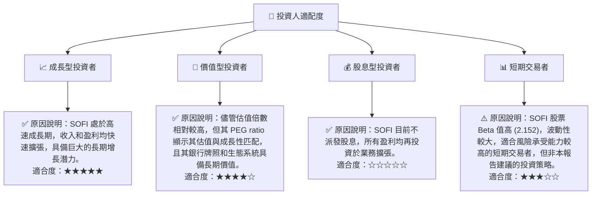

### 10.5 關鍵監控指標

| 監控類型 | 指標 | 關注點 | 頻率 |
|----------|------|----------|------|
| **成長** | 總收入成長率 (YoY, QoQ) | 確保維持高雙位數成長，特別是核心借貸和Galileo平台收入。 | 季度 |
| | 會員數增長與產品交叉銷售率 | 反映生態系統的健康度和用戶黏性。 | 季度 |
| **獲利** | 淨利率與營業利益率 | 監控利潤率趨勢，確保盈利能力持續改善。 | 季度 |
| | 調整後 EBITDA (若有提供) | 衡量核心業務的運營盈利能力，排除非現金項目。 | 季度 |
| **效率** | ROIC vs WACC | 監控資本效率，確保公司創造股東價值。 | 年度 |
| | 營運現金流 (OCF) | 關注 OCF 何時轉正，反映盈利的現金質量。 | 季度 |
| **風險** | 貸款違約率與撥備覆蓋率 | 評估信用風險管理能力和資產質量。 | 季度 |
| | 淨利息收益率 (NIM) | 衡量借貸業務的盈利能力和對利率變化的敏感度。 | 季度 |
| **估值** | Forward P/E 與 PEG Ratio | 評估估值是否保持合理，特別是與成長預期的匹配度。 | 持續 |

---

> **免責聲明**：本報告為 AI 自動生成，僅供研究參考，不構成投資建議。投資有風險，入市需謹慎。