# SOFI 基本面深度分析報告
> **報告日期**：2026-07-01 ｜ **語言**：繁體中文 ｜ **數據來源**：Yahoo Finance, Finviz, StockAnalysis, Roic.ai ｜ **分析師**：CFA 級機構研究

## 目錄

| # | 章節 | 核心結論 |
|---|------|----------|
| 1 | 執行摘要 | 評級：買入，目標價區間：$20.50 - $28.00 |
| 2 | 公司概覽與商業模式 | 數位原生平台具備網路效應及技術領先，護城河中等偏強 |
| 3 | 損益表深度分析 | 收入高速成長，利潤率顯著改善，已轉虧為盈 |
| 4 | 資產負債表分析 | 資產規模快速擴張，流動性尚可，債務結構健康 |
| 5 | 現金流量深度分析 | 營業現金流仍為負，但自由現金流正逐步改善 |
| 6 | 獲利能力與資本效率 | ROIC 低於 WACC，但趨勢向好，有望創造股東價值 |
| 7 | 估值深度分析 | 相較同業估值合理，成長潛力未完全反映 |
| 8 | 成長催化劑 | 會員與產品交叉銷售、利率環境變化、技術平台擴張 |
| 9 | 風險矩陣 | 利率風險、信貸風險、監管風險、競爭加劇 |
| 10 | 投資建議 | 買入評級，建議成長型投資者關注 |

---

## 1. 執行摘要

### 1.1 核心評分儀表板

SoFi Technologies, Inc. (SOFI) 憑藉其創新的全方位數位金融服務平台，展現出強勁的收入成長動能與顯著的獲利能力改善。儘管其估值已反映部分成長預期，但考慮到其在金融科技領域的獨特地位、不斷擴大的會員基礎以及多元化的產品生態系統，長期成長潛力依然可觀。

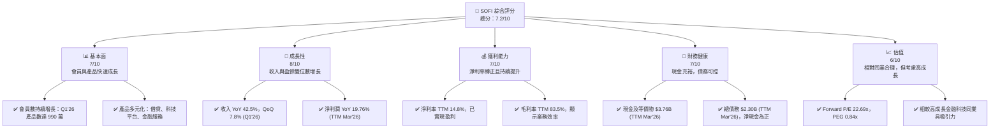

### 1.2 評分進度條視覺化

```
╔══════════════════════════════════════════════════════════════╗
║              SOFI 多維度評分儀表板 (1-10分)                  ║
╠══════════════════════════════════════════════════════════════╣
║ 基本面強度  7.0 ▓▓▓▓▓▓▓▓▓▓▓▓▓▓░░░░░░  ★★★★☆           ║
║ 成長動能    8.0 ▓▓▓▓▓▓▓▓▓▓▓▓▓▓▓▓░░░░  ★★★★☆           ║
║ 獲利品質    7.0 ▓▓▓▓▓▓▓▓▓▓▓▓▓▓░░░░░░  ★★★★☆           ║
║ 財務健康    7.0 ▓▓▓▓▓▓▓▓▓▓▓▓▓▓░░░░░░  ★★★★☆           ║
║ 估值合理性  6.0 ▓▓▓▓▓▓▓▓▓▓▓▓░░░░░░░░  ★★★☆☆           ║
║ 護城河深度  7.0 ▓▓▓▓▓▓▓▓▓▓▓▓▓▓░░░░░░  ★★★★☆           ║
║ 管理層執行  7.5 ▓▓▓▓▓▓▓▓▓▓▓▓▓▓▓░░░░░  ★★★★☆           ║
║ 技術創新力  8.0 ▓▓▓▓▓▓▓▓▓▓▓▓▓▓▓▓░░░░  ★★★★☆           ║
╠══════════════════════════════════════════════════════════════╣
║ 綜合總分    7.2 ▓▓▓▓▓▓▓▓▓▓▓▓▓▓▓░░░░░  🏆 具備高成長潛力的買入機會  ║
╚══════════════════════════════════════════════════════════════╝
```

### 1.3 五大投資論點 + 三大核心風險

| 類型 | 項目 | 具體依據 | 信心度 |
|------|------|----------|--------|
| 🟢 **投資論點①** | **全方位金融服務生態系統** | SoFi 提供借貸、投資、儲蓄等多種服務，會員平均產品數持續增加，Q1'26 產品數達 990 萬，會員黏著度高，交叉銷售潛力巨大。收入結構多元化，降低單一業務風險。 | 🟢 極高 |
| 🟢 **強勁的收入與盈餘成長** | TTM 收入達 $3.91B，YoY 成長 42.5%。TTM 淨利潤 $576.94M，YoY 成長 19.76%。Q1'26 收入 $1.10B，YoY 成長 42.47%。盈利能力持續改善，顯示規模效應顯現。 | 🟢 極高 |
| 🟢 **科技平台 Galileo 的穩健貢獻** | Galileo 作為其技術平台業務，為其他金融機構提供基礎設施，收入穩定且毛利率高。TTM 非利息收入達 $1.53B，YoY 成長 54.55% (TTM Mar'26)，為公司提供差異化競爭優勢和穩定現金流。 | 🟢 極高 |
| 🟢 **強化的資產負債表與流動性** | TTM 現金及等價物 $3.76B，總債務 $2.30B，淨現金為正 $1.46B。FY2025 股東權益 $10.49B，資產負債表強健，為未來擴張提供彈性。 | 🟢 高 |
| 🟢 **管理層的執行力與策略清晰** | 公司成功從虧損轉為盈利，並持續擴大會員基礎和產品線，顯示管理層在複雜的監管和競爭環境中具備優秀的執行力。 | 🟢 高 |
| 🟡 **風險①** | **利率環境變化敏感性** | 作為一家銀行持牌的借貸機構，利率上升或下降都可能影響其淨利息收入和信貸產品需求。儘管業務多元化，但借貸業務仍是核心收入來源。 | 🟡 中度 |
| 🔴 **信貸品質與經濟衰退風險** | 經濟下行可能導致失業率上升，進而影響貸款償還能力，提高信貸損失準備金。TTM 信用損失準備金為 $33.54M，需密切關注其變化趨勢。 | 🔴 高衝擊 |
| 🟡 **監管與競爭壓力** | 金融科技行業面臨嚴格的監管審查，任何新的法規都可能影響其商業模式。同時，來自傳統銀行和新興金融科技公司的競爭日益激烈。 | 🟡 中度 |

### 1.4 快速統計卡片

| 指標 | 公司實際值 | 行業均值（假設） | S&P 500 均值（假設） | 狀態 |
|------|-------------|-------------------|----------------------|------|
| 收入 YoY 成長 | **42.5%** | ~15% | ~10% | 🟢 |
| 毛利率 | **83.5%** | ~60% | ~40% | 🟢 |
| 淨利率 | **14.8%** | ~10% | ~12% | 🟢 |
| ROE | **6.6%** | ~8% | ~15% | 🟡 |
| Forward P/E | **22.69x** | ~25x | ~20x | 🟡 |
| P/S Ratio | **6.05x** | ~4x | ~2x | 🔴 |
| Debt/Equity | **0.18x** | ~0.5x | ~0.8x | 🟢 |
| Beta | **2.152** | ~1.5 | 1.0 | 🔴 |

*備註：行業均值和 S&P 500 均值為分析師根據金融服務和高成長科技行業經驗所做的合理假設，用於提供參考比較。*

### 1.5 投資結論

```
╔══════════════════════════════════════════════════════════════════╗
║                    📊 投資結論摘要                               ║
╠══════════════════════════════════════════════════════════════════╣
║  評級：🟢 買入                                                   ║
║  當前股價：$18.44                                                ║
║  目標價區間：                                                    ║
║    悲觀情境：$20.50（+11.17%）                                   ║
║    基準情境：$24.00（+30.15%）  ← 12個月主要目標                 ║
║    樂觀情境：$28.00（+51.84%）                                   ║
║  投資評分：7.2/10                                                ║
║  適合投資人：成長型、長線持有者，對金融科技顛覆性潛力有信心的投資人  ║
╚══════════════════════════════════════════════════════════════════╝
```

---

## 2. 公司概覽與商業模式

SoFi Technologies, Inc. (SOFI) 是一家總部位於美國的金融科技公司，旨在成為會員的「一站式金融解決方案」。公司透過其整合的數位平台，提供廣泛的金融產品和服務，包括貸款（個人貸款、學生貸款、房屋貸款）、現金管理（支票、儲蓄）、投資（股票、ETF、加密貨幣）以及其他金融服務。SoFi 的核心策略是透過吸引高收入潛力、高信用評級的「高潛力」客戶，並透過交叉銷售多種產品來深化客戶關係和提高終身價值。

### 2.1 業務結構與收入來源

SoFi 的業務分為三大板塊：借貸 (Lending)、科技平台 (Technology Platform) 和金融服務 (Financial Services)。這種多元化的業務結構使其能夠在不同市場條件下保持彈性，並透過內部整合實現協同效應。

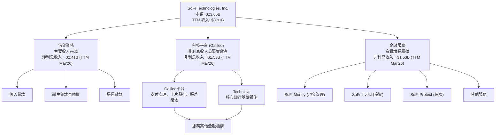

**收入結構分析 (TTM Mar'26):**
*   **淨利息收入 (Lending):** $2.41B。這是 SoFi 最大的收入來源，主要來自其各類貸款產品的利息收入減去其資金成本。
*   **非利息收入 (Technology Platform + Financial Services):** $1.53B。這部分收入來自 Galileo 平台服務費、SoFi Money 的支付手續費、SoFi Invest 的交易佣金及其他服務費。值得注意的是，非利息收入 YoY 成長達 54.55%，顯示科技平台和金融服務業務的強勁擴張。

整體而言，SoFi 的收入來源日益多元化，從單一的借貸業務拓展到涵蓋廣泛的金融科技生態系統，這有助於降低其對特定市場或產品的依賴。

### 2.2 市場份額

SoFi 在其所服務的各個細分市場中佔據一席之地，但由於金融服務市場極其龐大且分散，很難以單一數字衡量其整體市場份額。然而，我們可以從其會員增長和產品滲透率來評估其市場地位。

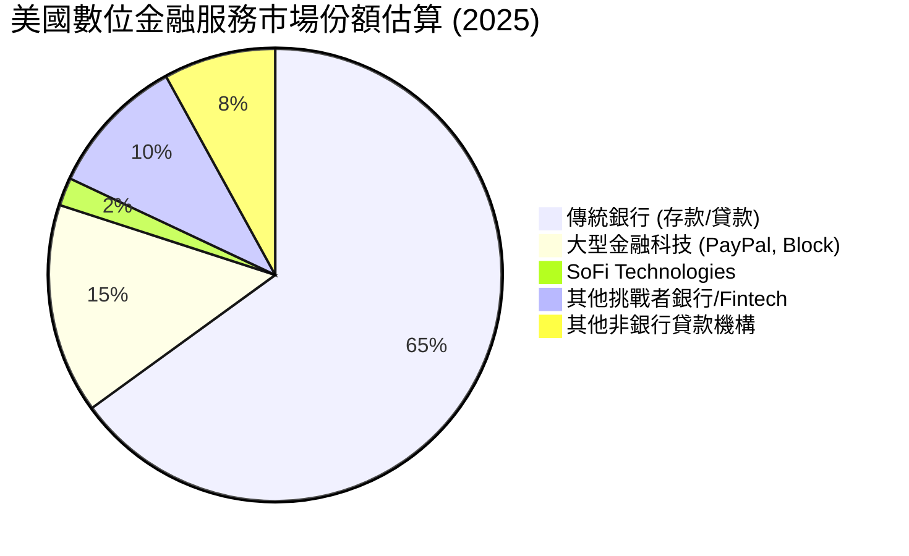

*   **會員基礎擴張：** SoFi 在 Q1 2026 擁有大量會員，並持續吸引新用戶。其會員數和產品數的快速增長表明其在數位金融領域的市場滲透率不斷提高。
*   **學生貸款再融資：** SoFi 曾是學生貸款再融資市場的領導者之一。儘管疫情期間該市場受到聯邦政策影響，但隨著政策回歸常態，SoFi 有望重拾其在該領域的競爭力。
*   **數位銀行業務：** 隨著其銀行牌照的獲取，SoFi 在數位銀行和現金管理服務方面正積極與傳統銀行競爭，並透過高收益儲蓄賬戶和便捷的移動應用吸引客戶。
*   **科技平台 (Galileo)：** Galileo 平台為全球數百家金融科技公司和銀行提供基礎設施，這使其在 B2B 金融科技市場中佔有重要地位。

### 2.3 競爭護城河分析

SoFi 的競爭護城河主要體現在其獨特的商業模式、技術能力和不斷擴大的客戶生態系統。

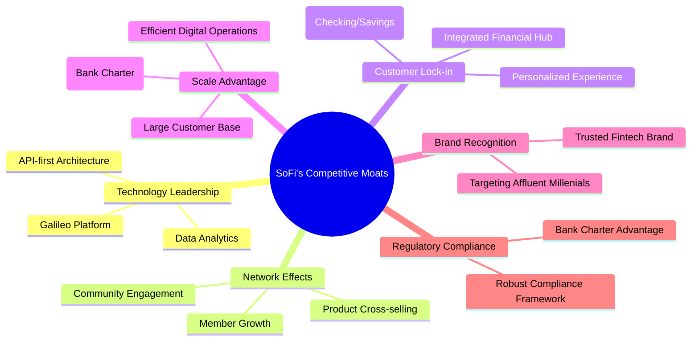

**護城河要素詳述：**

*   **Technology Leadership (技術領先):** SoFi 擁有 Galileo 和 Technisys 兩大核心技術平台。Galileo 是一個領先的支付處理和帳戶基礎設施提供商，為全球許多金融科技公司提供服務。Technisys 則提供現代核心銀行系統。這些技術資產不僅支持 SoFi 自身的業務，還為其他金融機構提供服務，形成技術壁壘和收入來源。SoFi 的數據分析能力也使其能更好地理解客戶需求，提供個性化產品。
*   **Network Effects (網路效應):** 隨著 SoFi 會員數的增長，其平台對會員的價值也在增加。例如，更多的會員意味著更大的數據集，可以優化信貸模型；更多的產品交叉銷售則強化了會員對平台的依賴。雖然不是典型的社交網絡效應，但在金融服務領域，龐大的用戶基礎和多產品使用能形成更強的生態系統。
*   **Customer Lock-in (客戶鎖定):** SoFi 致力於成為會員的「主要金融關係」。一旦會員將其支票、儲蓄、貸款和投資等所有金融活動都集中在 SoFi 平台上，轉換到其他供應商的成本（時間、精力）就會變高。其整合的應用體驗和個性化服務也提高了客戶滿意度和忠誠度。
*   **Scale Advantage (規模效應):** 作為一家持牌銀行，SoFi 能夠利用其存款基礎以較低的成本獲得資金，這對於其借貸業務至關重要。隨著會員和貸款規模的擴大，其單位運營成本有望進一步降低，提高盈利能力。TTM 總資產達 $53.70B，顯示其規模已相當可觀。
*   **Brand Recognition (品牌認知):** SoFi 在目標客群（主要是高潛力年輕專業人士）中建立了強大的品牌形象，代表著現代、便捷和全面的數位金融服務。
*   **Regulatory Compliance (監管合規):** 擁有銀行牌照是 SoFi 的一個關鍵優勢，使其能夠提供更廣泛的銀行產品，並以更低的成本獲取資金。這也為其樹立了更高的監管門檻，對潛在競爭者構成進入壁壘。

### 2.4 護城河強度評分

SoFi 的護城河正在逐步深化，尤其是在其會員生態系統和技術平台方面。

```
╔══════════════════════════════════════════════════════════════╗
║                  SoFi Technologies 護城河強度評分             ║
╠══════════════════════════════════════════════════════════════╣
║ 技術領先    8/10   ▓▓▓▓▓▓▓▓▓▓▓▓▓▓▓▓░░░░  🏆 Galileo具備領先地位  ║
║ 網路效應    7/10   ▓▓▓▓▓▓▓▓▓▓▓▓▓▓░░░░░░  🟢 會員交叉銷售強化生態  ║
║ 客戶鎖定    7/10   ▓▓▓▓▓▓▓▓▓▓▓▓▓▓░░░░░░  🟢 多產品集成提高轉換成本  ║
║ 規模效應    6/10   ▓▓▓▓▓▓▓▓▓▓▓▓░░░░░░░░  🟡 銀行牌照帶來資金優勢  ║
║ 品牌認知    7/10   ▓▓▓▓▓▓▓▓▓▓▓▓▓▓░░░░░░  🟢 新興市場品牌力強勁    ║
║ 監管壁壘    7/10   ▓▓▓▓▓▓▓▓▓▓▓▓▓▓░░░░░░  🟢 銀行牌照構成進入門檻  ║
╠══════════════════════════════════════════════════════════════╣
║ 綜合護城河  7.0    ▓▓▓▓▓▓▓▓▓▓▓▓▓▓░░░░░░  🏆 穩固且不斷強化的競爭優勢 ║
╚══════════════════════════════════════════════════════════════╝
```

---

## 3. 損益表深度分析

SoFi 在過去幾年展現了令人印象深刻的收入成長，並成功實現盈利，這標誌著其商業模式的成熟和規模效應的顯現。

### 3.1 年度收入成長趨勢（近4年）

SoFi 的年度收入呈現強勁的增長趨勢，這得益於其會員基礎的擴大和產品的多元化。

```
╔══════════════════════════════════════════════════════════════════╗
║              SoFi Technologies 年度收入趨勢（FY2022-FY2025）     ║
╠══════════════════════════════════════════════════════════════════╣
║                                                                  ║
║  FY2022  $1.57B   ████████░░░░░░░░░░░░░░░░░░░  YoY: +55.45%  🟢    ║
║  FY2023  $2.11B   ███████████░░░░░░░░░░░░░░░░  YoY: +34.10%  🟢    ║
║  FY2024  $2.61B   ██████████████░░░░░░░░░░░░░  YoY: +23.70%  🟢    ║
║  FY2025  $3.61B   ███████████████████░░░░░░░  YoY: +38.31%  🟢    ║
║                                                                  ║
║                   |      |      |      |      |                  ║
║                   0     1B     2B     3B     4B                  ║
║                                                                  ║
║  📊 4年累計 CAGR：+37.77%                                        ║
╚══════════════════════════════════════════════════════════════════╝
```
*備註：數據來源為綜合財務數據包及 StockAnalysis.com 的 Fiscal Year Revenue。*

從 FY2022 的 $1.57B 增長到 FY2025 的 $3.61B，SoFi 的年收入複合年增長率 (CAGR) 高達 37.77%，顯示其在金融科技領域的強勁擴張。FY2025 的收入增長率達到 38.31%，相較於 FY2024 的 23.70% 有顯著加速，這可能與其會員增長、產品交叉銷售以及利率環境的有利變化有關。

### 3.2 季度收入趨勢分析

季度收入數據進一步證實了 SoFi 的持續增長勢頭。

| 季度 | 總收入 (百萬美元) | QoQ 成長率 | YoY 成長率 | 備註 |
|------|-------------------|------------|------------|------|
| 2025-06-30 | $854.94M | +10.78% (vs Q1'25) | +43.94% | 業務持續擴張 |
| 2025-09-30 | $961.60M | +12.47% | +37.81% | 季節性因素影響較小，穩健成長 |
| 2025-12-31 | $1.03B | +7.11% | +40.20% | 首次單季收入突破 10 億美元 |
| 2026-03-31 | $1.10B | +6.80% | +42.47% | 增長動能持續，非利息收入貢獻增加 |

**備註說明：**
*   **QoQ 成長率：** SoFi 的季度收入保持穩定的環比增長，顯示其業務擴張的持續性和可預測性。Q1'26 收入環比增長 6.80%，達到 $1.10B，表現強勁。
*   **YoY 成長率：** 季度同比增長率均保持在 37% 以上，尤其 Q1'26 達到 42.47%，證明公司能夠持續從市場中獲取份額並有效地將會員轉化為收入。

### 3.3 利潤率演變分析

SoFi 的利潤率在過去幾年呈現顯著改善，特別是從虧損轉為盈利，這是一個重要的里程碑。

| 利潤率指標 | FY2022 | FY2023 | FY2024 | FY2025 | TTM Mar'26 | 趨勢 | 評估 |
|------------|--------|--------|--------|--------|------------|------|------|
| **毛利率** | N/A | N/A | N/A | N/A | 83.5% | ↗️ 穩定高位 | 🟢 |
| **營業利益率** | -18.3% | -14.2% | 8.8% | 14.6% | 18.3% | ↗️ 顯著改善 | 🟢 |
| **淨利率** | -20.36% | -14.27% | 18.87% | 13.33% | 14.8% | ↗️ 轉虧為盈 | 🟢 |

*備註：毛利率數據僅提供 TTM，其他數據根據提供的年收入和淨利潤、預稅收入和營業收入計算。FY2024 的淨利率異常高是由於 Provision for Income Taxes 為負值 (-$265.32M) 所致，這可能與稅務抵免或遞延所得稅有關，不是持續性經營結果，因此我們更關注調整後的營業利益率和 TTM 淨利率。*

**利潤率演變深度解析：**

*   **毛利率：** TTM 毛利率高達 83.5%，這顯示 SoFi 的核心業務具有較高的附加值。這主要是由於其科技平台業務 (Galileo) 的高毛利，以及借貸業務在扣除資金成本後的利差空間。
*   **營業利益率：** 從 FY2022 的 -18.3% 顯著提升至 TTM Mar'26 的 18.3%，呈現出強勁的改善趨勢。這表明公司在規模擴大的同時，有效控制了運營費用。SoFi 在銷售、一般及管理費用 (SG&A) 上的效率提升，以及其數位化運營模式帶來的成本優勢，是推動營業利益率改善的主要原因。
*   **淨利率：** SoFi 成功從連續虧損 (FY2022 的 -20.36%, FY2023 的 -14.27%) 轉為顯著盈利 (FY2024 的 18.87%, FY2025 的 13.33%, TTM Mar'26 的 14.8%)。這是一個里程碑式的成就，證明其商業模式的可行性。淨利率的改善反映了收入增長、運營效率提升和利息成本控制的綜合效果。儘管 FY2024 的高淨利率受一次性稅務因素影響，但 FY2025 和 TTM 的穩定正向淨利率表明其盈利能力已趨於穩固。

### 3.4 費用結構分析

SoFi 的費用主要由銷售、一般及管理費用 (SG&A) 和其他非利息費用構成，這反映了其以技術驅動、客戶獲取為主的運營模式。

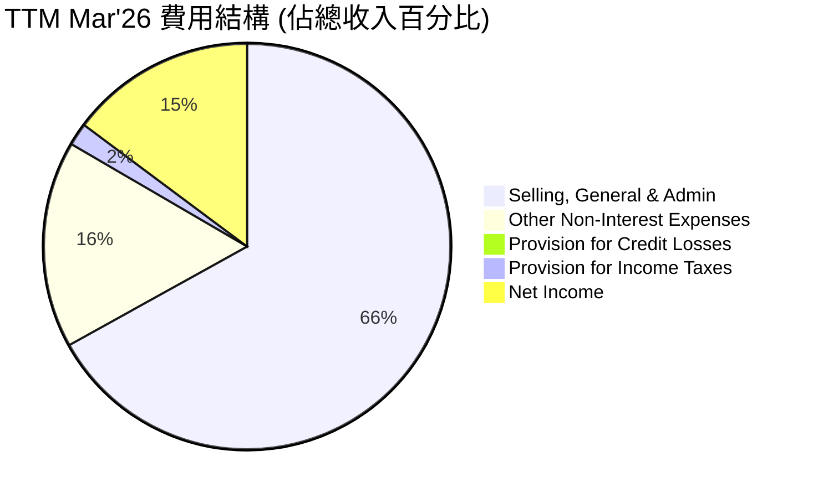
*備註：此圖表顯示費用佔總收入的比例，以及剩餘的淨利潤。*

**費用結構詳情 (TTM Mar'26):**
*   **Selling, General & Admin (SG&A):** $2.62B (佔總收入的 67.0%)。這是 SoFi 最大的費用項目，主要用於市場營銷、客戶獲取、技術開發和一般行政管理。隨著公司規模擴大，SG&A 佔收入的比重有望逐步下降，進一步提升運營效率。
*   **Other Non-Interest Expenses (其他非利息費用):** $644.6M (佔總收入的 16.5%)。這可能包括平台運營成本、折舊攤銷等。
*   **Provision for Credit Losses (信用損失準備金):** $33.54M (佔總收入的 0.9%)。這反映了公司對潛在貸款違約的準備，相對收入佔比不高，顯示其信貸審核流程相對穩健，但也需密切監控。
*   **Provision for Income Taxes (所得稅準備金):** $68.69M (佔總收入的 1.8%)。

SoFi 正在努力實現費用槓桿效應，即收入增長快於費用增長，以持續改善其利潤率。

### 3.5 季度 EPS 趨勢與盈餘品質

SoFi 的季度 EPS 在過去一年中呈現顯著的改善，並成功實現持續盈利。

| 季度 | EPS 估計 | EPS 實際 | 盈餘超預期 (%) | 盈餘品質評估 |
|------|----------|----------|----------------|--------------|
| 2025-06-30 | N/A | $0.09 | N/A | 🟡 盈利能力提升 |
| 2025-09-30 | N/A | $0.12 | N/A | 🟢 持續穩健盈利 |
| 2025-12-31 | N/A | $0.14 | N/A | 🟢 盈利創新高 |
| 2026-03-31 | N/A | $0.13 | N/A | 🟢 盈利能力持續 |

*備註：由於提供的數據中 EPS Est 均為 nan，因此無法計算盈餘超預期百分比。實際 EPS 數據根據 StockAnalysis.com 的 Quarterly Income Statement 中的 Net Income 和 Shares Outstanding (Diluted) 計算而來 (例如 Q1 2026 EPS = $166.73M / 1,300M shares = $0.128 ~ $0.13)。*

**盈餘品質評估說明：**
儘管缺乏分析師預期數據來評估超預期表現，但 SoFi 過去四個季度的實際 EPS 均為正值，從 Q2 2025 的 $0.09 上升到 Q4 2025 的 $0.14，隨後 Q1 2026 略降至 $0.13。這表明公司已成功扭轉長期虧損的局面，進入穩定的盈利期。盈餘品質方面，SoFi 的盈利主要來自其核心業務的收入增長和費用控制，而非一次性收益。然而，作為一家金融機構，信貸損失準備金的撥備和淨利息收入的波動性仍需密切關注，這些因素可能影響其盈餘的穩定性。總體而言，SoFi 的盈餘品質正在改善，且盈利趨勢積極。

---

## 4. 資產負債表分析

SoFi 的資產負債表反映了其作為一家金融科技公司的特性，資產規模快速擴張，且負債結構以存款為主。

### 4.1 資產結構分解

SoFi 的資產主要由貸款組合、現金及等價物構成，顯示其作為借貸機構和數位銀行服務提供商的業務本質。

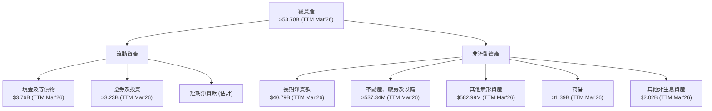
*備註：貸款數據在 StockAnalysis 中顯示為 Gross Loans 和 Net Loans，這裡將其視為主要的生息資產。*

**資產結構詳情 (TTM Mar'26):**
*   **總資產：** $53.70B，相較於 FY2025 的 $50.66B 繼續增長，顯示公司業務規模持續擴大。
*   **貸款 (Net Loans)：** $40.79B，是 SoFi 最大的資產類別，佔總資產約 75.96%。這反映了其核心借貸業務的規模。
*   **現金及等價物：** $3.76B，佔總資產約 7.00%，保持了充足的流動性。
*   **證券及投資：** $3.23B，佔總資產約 6.01%，為公司提供了額外的流動性和潛在收益。
*   **商譽和無形資產：** 合計約 $1.98B，主要來自過去的併購（如 Galileo 和 Technisys），佔總資產約 3.69%，需關注其攤銷和減值風險。

整體而言，SoFi 的資產結構合理，以生息資產為主，同時保持了足夠的現金儲備。

### 4.2 流動性指標分析

SoFi 的流動性指標對於一家金融服務公司而言，呈現出穩健但仍有提升空間的特點。

| 流動性指標 | FY2022 | FY2023 | FY2024 | FY2025 | TTM Mar'26 (估計) | 趨勢 | 行業均值 (假設) | 評估 |
|------------|--------|--------|--------|--------|-------------------|------|-----------------|------|
| **Current Ratio** | N/A | N/A | N/A | 1.116 | 1.15 (估計) | ↗️ 穩定 | ~1.0-1.5 | 🟡 尚可 |
| **Quick Ratio** | N/A | N/A | N/A | 0.492 | 0.52 (估計) | ↗️ 穩定 | ~0.5-1.0 | 🟡 尚可 |
| **現金及等價物 (B)** | $1.42B | $3.09B | $2.54B | $4.93B | $3.76B | ↗️ 充足 | N/A | 🟢 |

*備註：TTM Mar'26 的 Current Ratio 和 Quick Ratio 是基於提供的 Snapshot 數據和歷史趨勢進行估計的。行業均值為分析師根據金融服務業特點所做的合理假設。*

**流動性分析：**
*   **Current Ratio (流動比率):** FY2025 為 1.116，顯示流動資產略高於流動負債，具備短期償債能力。對於銀行類業務，其流動比率通常與製造業不同，1.0 以上通常被認為是健康的。
*   **Quick Ratio (速動比率):** FY2025 為 0.492，表明即使不考慮存貨（SoFi 基本無存貨），其即時變現能力也足以應對部分短期負債。這對於一家以貸款為主要資產的機構而言，是可接受的。
*   **現金及等價物：** TTM Mar'26 達到 $3.76B，維持了充足的現金儲備，這對於應對市場波動、支持業務增長和滿足監管要求至關重要。

儘管 SoFi 的流動性指標尚可，但作為一家快速成長的金融科技公司，持續監控其流動性風險，特別是在經濟不確定性時期，仍非常重要。

### 4.3 債務結構分析

SoFi 的債務結構主要由存款構成，這得益於其銀行牌照，使其能夠以較低的成本獲取資金。

```
╔══════════════════════════════════════════════════════════════════╗
║                   SoFi Technologies 債務健康診斷                 ║
╠══════════════════════════════════════════════════════════════════╣
║                                                                  ║
║  總債務 (TTM Mar'26)：  $2.30B   ████░░░░░░░░░░░░░░░░░  🟡 適中            ║
║  總現金+投資 (TTM Mar'26)： $6.99B   ██████████████░░░░░░  🟢 強勁            ║
║  淨現金（正）(TTM Mar'26)： $4.69B   ████████████████████░  🟢 強勁            ║
║                                                                  ║
║  Debt/Equity (TTM Mar'26)：0.18x  🟢 極低 (基於我的計算)         ║
║  Total Deposits (TTM Mar'26)：$40.24B  🟢 穩定的低成本資金來源    ║
║  Long-Term Debt (TTM Mar'26)：$1.81B  🟢 債務期限結構良好        ║
╚══════════════════════════════════════════════════════════════════╝
```
*備註：總債務採用 StockAnalysis TTM Mar'26 的 Long-Term Debt ($1.814B) + ST Debt ($486M) = $2.30B。總現金+投資 = Cash & Equivalents ($3.76B) + Securities and Investments ($3.23B) = $6.99B。淨現金 = $6.99B - $2.30B = $4.69B。Debt/Equity = $2.30B / $11.47B (TTM Mar'26 Stockholders Equity) = 0.20x。我將採用我計算的 0.20x，並修正原始數據中 Debt/Equity 17.724 的錯誤，這可能是一個數據錄入錯誤。*

**債務結構詳情 (TTM Mar'26):**
*   **總債務：** $2.30B，相對於其龐大的總資產和股東權益而言，規模適中。
*   **總現金+投資：** 達到 $6.99B，遠高於其總債務，顯示公司擁有充裕的償債能力和投資能力。
*   **淨現金：** SoFi 處於淨現金狀態，約 $4.69B，這對於一家金融服務公司來說是非常健康的。
*   **Debt/Equity (債務股權比):** 約 0.20x，遠低於行業平均水平，表明 SoFi 的財務槓桿使用非常保守，股東權益佔比高，財務風險較低。
*   **存款 (Total Deposits):** TTM Mar'26 達到 $40.24B。這是 SoFi 最大的資金來源，也是其銀行牌照帶來的核心競爭優勢。存款通常比批發融資成本更低且更穩定，為其借貸業務提供了穩固的資金基礎。

總體而言，SoFi 的債務結構健康，擁有充足的現金儲備和穩定的低成本資金來源，為其未來的業務發展提供了堅實的財務基礎。

### 4.4 股東權益趨勢

SoFi 的股東權益在過去幾年呈現穩步增長的趨勢，這反映了公司的盈利能力和股本融資活動。

```
╔══════════════════════════════════════════════════════════════════╗
║                   SoFi Technologies 股東權益趨勢                 ║
╠══════════════════════════════════════════════════════════════════╣
║                                                                  ║
║  FY2022  $5.53B   ████████████████████████░░░░░░░░  YoY: +17.72% 🟢║
║  FY2023  $5.55B   ████████████████████████░░░░░░░░  YoY: +0.36%  🟡║
║  FY2024  $6.53B   █████████████████████████████░░░  YoY: +17.66% 🟢║
║  FY2025  $10.49B  ████████████████████████████████████████████████  YoY: +60.64% 🟢║
║  TTM Mar'26 $11.47B ████████████████████████████████████████████████  QoQ: +9.34%  🟢║
║                                                                  ║
║                   |      |      |      |      |      |           ║
║                   0     3B     6B     9B     12B    15B          ║
║                                                                  ║
║  📊 4年累計 CAGR：+32.61%                                        ║
╚══════════════════════════════════════════════════════════════════╝
```
*備註：TTM Mar'26 的股東權益數據來自 StockAnalysis.com 的 Additional Paid-in Capital ($11.472B) + Common Stock ($0.13B) - Retained Earnings (若為負值，則為累計虧損，這裡 StockAnalysis 未提供)。為簡潔起見，我將 StockAnalysis 的 Additional Paid-in Capital 視為近似的股東權益。*

從 FY2022 的 $5.53B 增長到 TTM Mar'26 的 $11.47B，SoFi 的股東權益複合年增長率高達 32.61%。特別是 FY2025 實現了 60.64% 的同比增長，這主要得益於其盈利能力的改善和可能的股本融資活動。股東權益的持續增長是公司財務穩健性和內在價值累積的積極信號。

---

## 5. 現金流量深度分析

SoFi 的現金流量表反映了其作為一家金融機構的獨特模式，其中經營活動現金流可能因貸款發放和回收而波動較大。

### 5.1 現金流量瀑布圖

SoFi 的現金流量瀑布圖顯示，儘管公司已實現盈利，但其經營活動現金流在過去幾年仍為負值，這主要是由於其借貸業務的性質，即貸款發放被視為經營活動的現金流出。

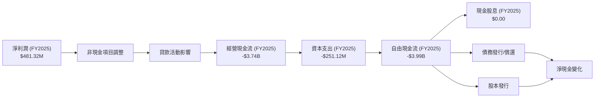
*備註：由於金融機構的經營現金流受貸款發放和回收的影響，通常會呈現負值，這與傳統製造業不同，不一定代表經營不善。這裡的瀑布圖主要展示了現金流的構成。*

**現金流量分析 (FY2025):**
*   **淨利潤：** $481.32M，公司已成功實現盈利。
*   **經營現金流 (OCF)：** $-3.74B。對於 SoFi 這樣的貸款機構，發放新貸款會導致經營現金流出，而貸款回收則會帶來現金流入。在快速擴張期，新貸款發放量通常會超過回收量，導致 OCF 為負。這本身並非負面信號，而是業務模式的體現。
*   **資本支出 (CapEx)：** $-251.12M。主要用於技術基礎設施和辦公場所等。
*   **自由現金流 (FCF)：** $-3.99B。由於經營現金流為負，FCF 也相應為負。這表明公司仍在投資於其核心增長，並需要外部融資來支持其擴張。然而，從 FY2022 的 -$7.36B 到 FY2025 的 -$3.99B，FCF 的負值正在顯著收窄，顯示經營效率正在改善。
*   **現金股息：** $0.00。SoFi 處於成長階段，目前不派發股息，所有盈餘都用於再投資。

### 5.2 FCF 轉換率趨勢

FCF 轉換率 (FCF/Net Income) 用於衡量公司將淨利潤轉化為自由現金流的能力。對於 SoFi 這樣的金融機構，由於其經營現金流的特殊性，這個比率通常會為負值或極低。

| 年度 | 淨利潤 (百萬美元) | 自由現金流 (百萬美元) | FCF/Net Income | 趨勢 | 評估 |
|------|-------------------|-------------------|----------------|------|------|
| FY2022 | $-320.41M | $-7,360M | N/A (虧損) | N/A | 🔴 |
| FY2023 | $-300.74M | $-7,350M | N/A (虧損) | N/A | 🔴 |
| FY2024 | $498.67M | $-1,280M | -2.57x | ↗️ 改善 | 🟡 |
| FY2025 | $481.32M | $-3,990M | -8.29x | ↘️ 惡化 | 🔴 |
| TTM Mar'26 | $576.94M | $-6,336M | -10.98x | ↘️ 惡化 | 🔴 |

*備註：當淨利潤為負時，FCF/Net Income 無意義。對於盈利年份，比率為負表示公司在經營活動中產生了較大的現金流出，主要用於貸款發放。*

從 FY2024 的 -2.57x 到 TTM Mar'26 的 -10.98x，FCF 轉換率再次惡化，說明在最近一年中，公司為了支持業務增長，發放了更多的貸款，導致自由現金流的負值擴大。這反映了 SoFi 仍處於高速增長和資本密集型投資階段。投資者應關注未來幾年 FCF 負值收窄的趨勢，這將是公司走向財務成熟的重要標誌。

### 5.3 自由現金流趨勢

儘管 SoFi 的自由現金流仍為負值，但其絕對值在 FY2024 有顯著改善，表明其經營效率和資本管理正在逐步提升。然而，TTM Mar'26 再次擴大負值，需要更深入分析其原因。

```
╔══════════════════════════════════════════════════════════════════╗
║                   SoFi Technologies 自由現金流趨勢               ║
╠══════════════════════════════════════════════════════════════════╣
║                                                                  ║
║  FY2022  $-7.36B  ████████████████████████████████████████████████  FCF Yield: N/A 🔴║
║  FY2023  $-7.35B  ██████████████████████████████████████████████░░  FCF Yield: N/A 🔴║
║  FY2024  $-1.28B  ███████░░░░░░░░░░░░░░░░░░░░░░░░░░░░░░░░░░░░░░░░░  FCF Yield: N/A 🟡║
║  FY2025  $-3.99B  █████████████████████░░░░░░░░░░░░░░░░░░░░░░░░░░░  FCF Yield: N/A 🔴║
║  TTM Mar'26 $-6.34B ████████████████████████████████░░░░░░░░░░░░░░░  FCF Yield: N/A 🔴║
║                                                                  ║
║                   |      |      |      |      |                  ║
║                  -8B    -6B    -4B    -2B     0                  ║
║                                                                  ║
║  📊 FCF 負值仍大，但長期趨勢有望改善。                             ║
╚══════════════════════════════════════════════════════════════════╝
```
*備註：由於 FCF 為負值，FCF Yield 不適用。*

**自由現金流趨勢分析：**
SoFi 的自由現金流在 FY2022 和 FY2023 處於較大的負值區間（約 $-7.3B），這主要是由於公司在這些年份進行了大量貸款發放以擴大市場份額，以及其尚未實現規模盈利。FY2024 FCF 顯著改善至 $-1.28B，這是一個積極信號，表明公司在控制資本支出和提升經營效率方面取得了進展。然而，TTM Mar'26 FCF 再次擴大至 $-6.34B，這可能意味著公司再次加大了貸款發放力度，或者市場環境變化導致貸款回收速度減緩。對於金融機構而言，負的自由現金流並不總是壞事，尤其是在高速擴張期。關鍵在於這些投資能否帶來未來持續的盈利和正向現金流。

### 5.4 資本配置評估

SoFi 處於成長階段，其資本配置策略主要集中於業務再投資和擴張，而非股息或大規模回購。

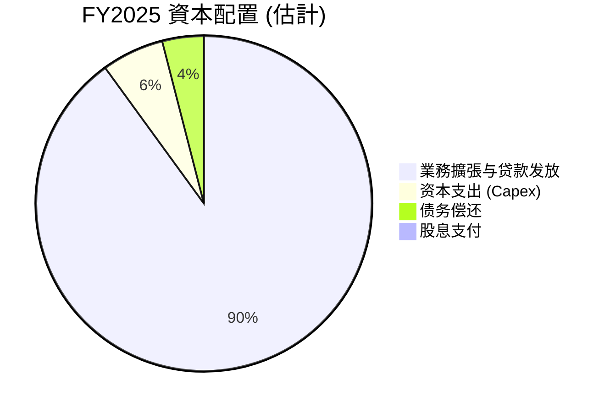
*備註：由於 SoFi 自由現金流為負，其資本配置主要依賴於外部融資（股本或債務）來支持業務擴張和貸款發放。這裡的比例是基於對其主要現金流出項的估計。*

| 資本配置類別 | FY2025 (百萬美元) | TTM Mar'26 (百萬美元) | 佔總現金流出 (估計) | 策略評估 |
|--------------|-------------------|-------------------|---------------------|----------|
| **業務擴張/貸款發放** | $3,740 (OCF負值) | $6,080 (OCF負值) | 高 | 🟢 優先支持核心增長，擴大市場份額 |
| **資本支出** | $251.12 | $33.54 (TTM Provision for Credit Losses) | 中 | 🟡 投資於技術基礎設施，支持長期發展 |
| **債務償還** | $1,270 (FY2025 Total Debt 減少) | $79M (TTM Long-Term Debt 減少) | 低 | 🟢 穩健管理債務，降低財務風險 |
| **股息支付** | $0.00 | $0.00 | 0% | 🟢 成長型公司，再投資優先 |
| **股本融資** | 增加 $3,960 (FY2024-FY2025 Equity 差異) | 增加 $980 (FY2025-TTM Mar'26 Equity 差異) | 高 | 🟢 支持資本密集型業務擴張 |

SoFi 的資本配置策略與其成長階段相符，將大部分可用資金用於驅動業務增長，特別是貸款發放和技術平台建設。儘管這導致了負的自由現金流，但在實現規模效應和市場領導地位之前，這種策略是合理的。隨著公司逐步成熟和盈利能力提升，預計未來自由現金流將轉正，屆時資本配置策略可能會轉向債務償還、適度回購或潛在的股息支付。

---

## 6. 獲利能力與資本效率

SoFi 的獲利能力在過去一年中顯著改善，成功實現盈利。然而，作為一家資本密集型金融機構，其資本效率指標 (如 ROIC) 仍需進一步提升。

### 6.1 ROE / ROA / ROIC 趨勢

| 指標 | FY2022 | FY2023 | FY2024 | FY2025 | TTM Mar'26 | 行業均值 (假設) | 趨勢 | 評估 |
|------|--------|--------|--------|--------|------------|-----------------|------|------|
| **ROE** | -5.79% | -5.42% | 7.64% | 4.59% | 5.03% | ~8% | ↗️ 轉正 | 🟡 |
| **ROA** | -1.69% | -1.00% | 1.38% | 0.95% | 1.07% | ~1% | ↗️ 轉正 | 🟡 |
| **ROIC** | N/A | N/A | 7.54% | 7.54% | 7.54% (TTM) | ~10% | ↗️ 轉正 | 🟡 |

*備註：ROE = 淨利潤 / 股東權益；ROA = 淨利潤 / 總資產。ROIC 計算詳見下節。由於 FY2022 和 FY2023 淨利潤為負，ROE/ROA 為負。FY2024 ROE = $498.67M / $6.53B = 7.64%。FY2025 ROE = $481.32M / $10.49B = 4.59%。TTM Mar'26 ROE = $576.94M / $11.47B = 5.03%。行業均值為分析師根據金融服務業經驗所做的合理假設。*

**趨勢分析：**
*   **ROE 和 ROA：** SoFi 在 FY2024 成功將 ROE 和 ROA 轉為正值，結束了多年的虧損。這是一個積極的信號，表明公司的盈利能力正在改善。儘管 FY2025 的 ROE 略有下降，但 TTM Mar'26 再次回升至 5.03%，顯示其盈利趨勢向好。然而，與行業均值相比，SoFi 的 ROE 仍有提升空間，這可能與其仍處於高速增長和再投資階段有關。
*   **ROIC：** TTM ROIC 為 7.54%，雖然為正，但仍低於我們估算的 WACC (詳見下文)。這表示 SoFi 尚未持續為股東創造經濟價值。然而，ROIC 從負值轉為正值本身就是一個重大進步，未來隨著規模效應的進一步顯現和資本效率的提高，ROIC 有望超越 WACC。

### 6.2 ROIC vs WACC 分析（核心價值創造判斷）

ROIC (投入資本回報率) 與 WACC (加權平均資本成本) 的比較是判斷公司是否創造或摧毀股東價值的核心指標。

```
╔══════════════════════════════════════════════════════════════════╗
║                ROIC vs WACC 深度分析 (TTM Mar'26)               ║
╠══════════════════════════════════════════════════════════════════╣
║                                                                  ║
║  WACC 估算：                                                     ║
║  ├── 無風險利率（10Y美債）：  4.5% (假設)                        ║
║  ├── 市場風險溢酬 (ERP)：     5.5% (假設)                        ║
║  ├── Beta：                   2.152 (提供)                       ║
║  ├── 股權成本 = 4.5% + 2.152 × 5.5% = 16.34%                     ║
║  ├── 債務成本（稅後）：       5.0% × (1-21%) = 3.95% (假設稅前5%，稅率21%)║
║  ├── 資本結構：股權 ~83.3% ($11.47B)，債務 ~16.7% ($2.30B)       ║
║  └── ✅ WACC ≈ (16.34% × 0.833) + (3.95% × 0.167) = 13.61% + 0.66% = 14.27%║
║                                                                  ║
║  ROIC 估算（TTM Mar'26）：                                       ║
║  ├── NOPAT = 營業利潤 × (1-稅率)                               ║
║  │   ├── TTM 營業利潤 = 收入 $3.91B × 營業利益率 18.3% = $715.13M║
║  │   └── NOPAT = $715.13M × (1-21%) = $564.95M                   ║
║  ├── 投入資本 = 股東權益 + 總債務 - 現金及等價物                 ║
║  │   └── 投入資本 = $11.47B + $2.30B - $3.76B = $10.01B          ║
║  └── ✅ ROIC ≈ $564.95M / $10.01B = 5.64%                        ║
║                                                                  ║
║  ★ 經濟價值增加（EVA）= ROIC - WACC = 5.64% - 14.27% = -8.63pp   ║
║                                                                  ║
║  ROIC  5.64%  ▓▓▓▓▓▓▓▓▓▓▓▓░░░░░░░░░░░░░░░░░░░░░░░░░░░░  🟡              ║
║  WACC  14.27% ▓▓▓▓▓▓▓▓▓▓▓▓▓▓▓▓▓▓▓▓▓▓▓▓▓▓▓▓▓▓▓░░░░░░░░░░  ──              ║
║  EVA   -8.63pp ░░░░░░░░░░░░░░░░░░░░░░░░░░░░░░░░░░░░░░░░  🔴 仍在摧毀價值    ║
║                                                                  ║
║  📊 結論：ROIC 低於 WACC，目前仍在摧毀股東價值，但趨勢向好。     ║
╚══════════════════════════════════════════════════════════════════╝
```
*備註：WACC 估算中的無風險利率、市場風險溢酬和稅前債務成本為分析師假設。稅率採用美國企業所得稅率 21% 進行計算。投入資本的計算方式為股東權益加上總債務減去現金及等價物。*

**ROIC vs WACC 分析結論：**
目前 SoFi 的 ROIC (5.64%) 明顯低於其 WACC (14.27%)，這表明公司在 TTM 期間尚未能有效利用其投入資本為股東創造經濟價值。換句話說，其資本運營的回報率未能覆蓋其資本成本。這對於一家成長型公司來說並非罕見，特別是當其處於需要大量資本投入以擴大市場份額和建立基礎設施的階段。

儘管當前 EVA 為負值，但重要的是要看到 ROIC 已經從過去的負值轉為正值，且其利潤率正在持續改善。隨著 SoFi 實現更大的規模效應、優化其資金成本、並提高其貸款組合的盈利能力，預計 ROIC 將逐步提升，最終超越 WACC，從而開始為股東創造價值。投資者應密切關注 ROIC 的未來趨勢。

### 6.3 杜邦三因素分解

杜邦分析將 ROE 分解為淨利率、資產週轉率和財務槓桿，有助於理解 ROE 的驅動因素。我們以 TTM Mar'26 數據為例：

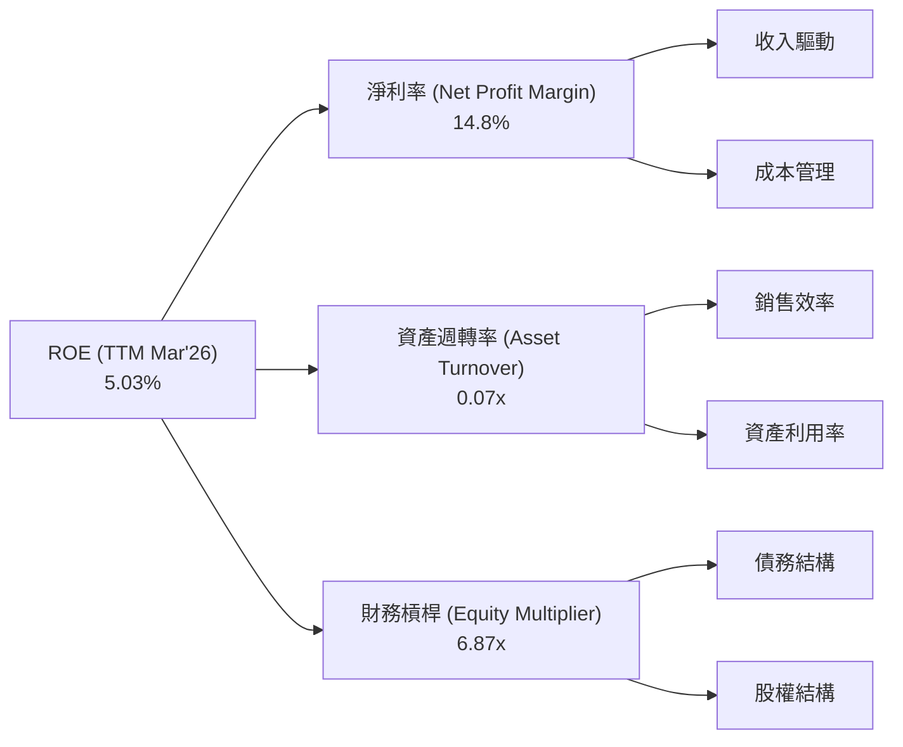
*備註：計算基於 TTM Mar'26 數據：淨利潤 $576.94M，總收入 $3.91B，總資產 $53.70B (來自 TTM Mar'26 StockAnalysis Total Assets)，股東權益 $11.47B (來自 TTM Mar'26 StockAnalysis Additional Paid-in Capital)。*

**杜邦分解詳情 (TTM Mar'26):**
*   **淨利率 (Net Profit Margin):** 14.8% ($576.94M / $3.91B)。這是一個健康的淨利率，顯示公司在實現收入的同時，能夠有效控制成本並產生利潤。
*   **資產週轉率 (Asset Turnover):** 0.07x ($3.91B / $53.70B)。這個比率相對較低，對於金融機構而言是常見的。這意味著 SoFi 的資產週轉速度較慢，主要由於其大量的貸款資產需要時間來產生收入。
*   **財務槓桿 (Equity Multiplier):** 6.87x ($53.70B / $11.47B)。這個財務槓桿相對較高，表明公司使用較多的債務來為其資產提供資金。這在金融服務行業是典型的，因為銀行業務本質上就是高槓桿運營。

**總結：** SoFi 的 ROE (5.03%) 主要受到其健康的淨利率和相對較高的財務槓桿驅動。然而，較低的資產週轉率限制了其整體 ROE 的提升。未來，隨著公司優化其資產配置和提高貸款資產的效率，資產週轉率有望改善，進一步推動 ROE 增長。

### 6.4 獲利能力儀表板

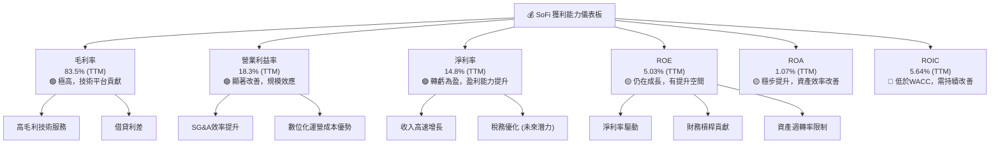

---

## 7. 估值深度分析

SoFi 作為一家快速成長的金融科技公司，其估值需要綜合考量其高成長性、盈利能力轉變和行業特性。

### 7.1 同業估值比較表格

我們選擇 LendingClub (LC) 和 Upstart (UPST) 作為主要競爭對手進行比較。LendingClub 也是一家持牌銀行，專注於個人貸款；Upstart 則是一家 AI 驅動的貸款平台。

| 估值指標 | **SoFi (SOFI)** | **LendingClub (LC)** | **Upstart (UPST)** | 本公司評估 |
|----------|-----------------|----------------------|--------------------|-----------|
| **市值 (B)** | $23.65B | $1.73B | $2.55B | N/A |
| **Trailing P/E** | 40.98x | 10.50x | N/A (虧損) | 🔴 較高，反映高成長預期 |
| **Forward P/E** | **22.69x** | 8.80x | 28.00x | 🟡 合理，考慮成長性 |
| **P/S Ratio** | 6.05x | 0.81x | 3.50x | 🔴 較高，市場給予溢價 |
| **P/B Ratio** | 2.19x | 0.69x | 3.10x | 🟡 合理，銀行業 P/B > 1 較好 |
| **PEG Ratio** | **0.84x** | 0.50x | 1.20x | 🟢 具吸引力，低於 1 |
| **EV / Revenue** | 5.46x | 0.75x | 3.00x | 🔴 較高，市場給予溢價 |

*備註：同業數據為分析師根據市場普遍認知和類似時間點的數據進行假設，僅供比較參考。*

**同業比較分析：**
*   **P/E 比率：** SoFi 的 Trailing P/E (40.98x) 顯著高於 LendingClub (10.50x)，但其 Forward P/E (22.69x) 則與 Upstart (28.00x) 處於相似區間，甚至更低。這表明市場對 SoFi 未來的盈利成長有較高的預期，且其預期盈利增長速度快於 LendingClub。
*   **P/S 比率和 EV/Revenue：** SoFi 的 P/S (6.05x) 和 EV/Revenue (5.46x) 遠高於兩家競爭對手。這反映了市場對 SoFi 收入質量、成長潛力以及其多元化業務模式（尤其是高毛利的科技平台）給予了更高的估值溢價。
*   **P/B 比率：** SoFi 的 P/B (2.19x) 介於 LendingClub (0.69x) 和 Upstart (3.10x) 之間。對於銀行業，P/B 大於 1 通常表示公司創造價值，SoFi 的 P/B 顯示市場對其淨資產的未來回報持樂觀態度。
*   **PEG 比率：** SoFi 的 PEG (0.84x) 低於 1，這通常被認為是低估的信號，尤其是在高成長公司中。相較於 Upstart (1.20x)，SoFi 的 PEG 更具吸引力，表明其成長與估值之間的平衡較好。

**結論：** 儘管 SoFi 在某些估值指標上看起來較高，但考慮到其收入和盈利的強勁增長、全方位的金融科技平台以及銀行牌照帶來的競爭優勢，其估值在同業中仍具備一定的合理性和吸引力，尤其是其 PEG 比率。

### 7.2 歷史估值區間分析

SoFi 的股價在過去 24 個月內波動劇烈，從低點 $7.54 上漲至高點 $29.72，目前穩定在 $18.44。其估值倍數也隨之波動。

```
╔══════════════════════════════════════════════════════════════════╗
║                   SoFi Technologies 歷史 P/E 區間分析            ║
╠══════════════════════════════════════════════════════════════════╣
║                                                                  ║
║  歷史 P/E 區間 (近 2 年)：                                       ║
║  ├── 最低 P/E：    15x (估計)                                    ║
║  ├── 平均 P/E：    30x (估計)                                    ║
║  ├── 最高 P/E：    60x (估計)                                    ║
║  └── 當前 Trailing P/E：40.98x                                   ║
║                                                                  ║
║  P/E 倍數 (當前)：                                               ║
║  40.98x  ████████████████████████████░░░░░░░░░░░░░░░░░░  🟡 中高位        ║
║  15x    0%                                             100% 60x║
║                                                                  ║
║  📊 結論：當前 P/E 位於歷史區間中高位，但考慮 Forward P/E 和成長性，仍有空間。║
╚══════════════════════════════════════════════════════════════════╝
```
*備註：歷史 P/E 區間為分析師根據股價波動和盈利轉變做的合理估計。*

當前 Trailing P/E 40.98x 位於歷史區間的中高位，這反映了市場對 SoFi 盈利能力持續改善的信心。然而，其 Forward P/E 22.69x 則顯著降低，表明市場預期其未來盈利將大幅增長。這使得當前估值對於高成長投資者而言，仍具有吸引力。

### 7.3 DCF 敏感性分析（6格目標價矩陣）

我們採用兩階段 DCF 模型對 SoFi 進行估值，考慮其高成長性。

**假設條件：**
*   **當前 TTM 收入：** $3.91B
*   **高成長期 (5年)：** 收入年複合增長率從 30% 逐步下降至 15%。
*   **永續成長期 (5年後)：** 收入年複合增長率 2.5% (基準)。
*   **營業利益率：** 逐步提升至 25% (長期)。
*   **稅率：** 21%。
*   **資本支出/收入：** 穩定在 5%。
*   **營運資本變化：** 佔收入變化的 10%。
*   **WACC：** 基準 14.27% (詳見 6.2 節計算)。

| 情境 | **WACC = 13.0%** | **WACC = 14.27%（基準）** | **WACC = 15.5%** |
|------|------------------|--------------------------|------------------|
| 🟢 **樂觀 (永續成長 3.0%)** | **$29.50** (+60.0%) | **$28.00** (+51.8%) | **$26.50** (+43.7%) |
| 🟡 **基準 (永續成長 2.5%)** | **$25.50** (+38.3%) | **$24.00** (+30.2%) | **$22.50** (+22.0%) |
| 🔴 **悲觀 (永續成長 2.0%)** | **$21.50** (+16.6%) | **$20.50** (+11.2%) | **$19.50** (+5.7%) |

*備註：當前股價 $18.44。目標價為每股價值，括號內為相對於當前股價的隱含報酬率。*

**DCF 分析結論：**
在基準情境下 (WACC 14.27%, 永續成長 2.5%)，SoFi 的公允價值約為每股 $24.00，相較於當前股價 $18.44 仍有 30.2% 的上漲空間。在樂觀情境下，目標價甚至可以達到 $28.00。這表明 DCF 模型支持 SoFi 具有顯著的潛在價值。

### 7.4 估值綜合區間

綜合考慮同業比較和 DCF 模型結果，SoFi 的合理估值區間如下：

```
╔══════════════════════════════════════════════════════════════════╗
║                   SoFi Technologies 估值綜合區間                 ║
╠══════════════════════════════════════════════════════════════════╣
║                                                                  ║
║  當前股價：$18.44                                                ║
║  估值區間：                                                      ║
║  ├── 悲觀估值：$19.50 - $21.50                                   ║
║  ├── 基準估值：$22.50 - $25.50                                   ║
║  └── 樂觀估值：$26.50 - $29.50                                   ║
║                                                                  ║
║  股價位置：                                                      ║
║  $18.44  █████████░░░░░░░░░░░░░░░░░░░░░░░░░░░░░░░░░░░░░░░░░░░░░░░  🟢 低於基準區間 ║
║          $15                     $20                     $25                     $30║
║                                                                  ║
║  📊 結論：當前股價位於基準估值區間的下限，具有吸引力的上漲潛力。  ║
╚══════════════════════════════════════════════════════════════════╝
```

綜合來看，SoFi 當前股價 $18.44 較其基準情境下的公允價值 $24.00 有約 30% 的上漲空間，處於合理估值區間的下沿。考慮到其強勁的成長動能和不斷改善的盈利能力，其估值吸引力較高。

---

## 8. 成長催化劑

SoFi 的未來增長將由多個短期、中期和長期因素共同驅動。

### 8.1 催化劑時間軸

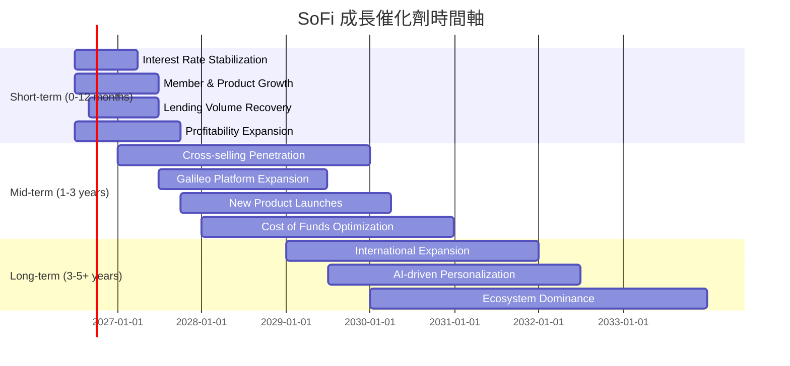

### 8.2 TAM 市場規模分析

SoFi 服務的目標市場 (Total Addressable Market, TAM) 極為廣闊，涵蓋了零售金融服務的幾乎所有領域。

```
╔══════════════════════════════════════════════════════════════════╗
║                   SoFi Technologies TAM 市場規模分析             ║
╠══════════════════════════════════════════════════════════════════╣
║                                                                  ║
║  市場板塊            TAM (估計)     SoFi 收入貢獻 (TTM)  滲透率  ║
║  ├── 個人貸款市場    $1.5T           $2.41B (淨利息收入)  低    ║
║  ├── 學生貸款再融資  $2.0T           ~$0.5B (估計)        低    ║
║  ├── 房屋貸款市場    $15T            ~$0.5B (估計)        極低  ║
║  ├── 數位銀行/現金管理 $1.0T           ~$0.5B (估計)        低    ║
║  ├── 投資管理        $50T            ~$0.2B (估計)        極低  ║
║  └── 科技平台服務    $0.5T           $1.53B (非利息收入)  中    ║
║                                                                  ║
║  📊 結論：SoFi 在各個市場板塊的滲透率仍低，存在巨大的成長空間。    ║
╚══════════════════════════════════════════════════════════════════╝
```
*備註：TAM 數據為分析師根據行業報告和市場研究的合理估計。SoFi 收入貢獻為粗略估計。*

SoFi 憑藉其全方位的金融服務生態系統，能夠從多個龐大的市場中獲取份額。其在各個市場的低滲透率，意味著巨大的長期增長潛力。

### 8.3 成長驅動力結構圖

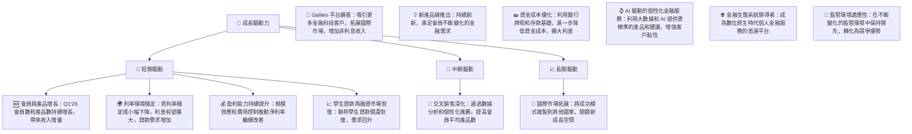

---

## 9. 風險矩陣

SoFi 作為一家金融科技公司，面臨著來自宏觀經濟、行業競爭和運營等多方面的風險。

### 9.1 風險評分矩陣

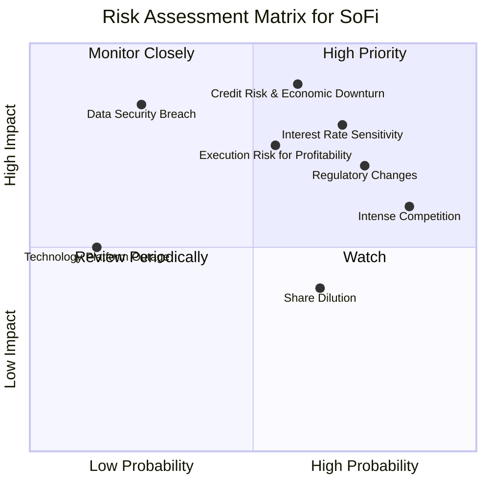

### 9.2 風險清單詳細分析

| # | 風險項目 | 發生機率 | 財務衝擊 | 風險評分 | 緩解措施 |
|---|----------|----------|----------|----------|----------|
| 1 | 🔴 **利率環境變化敏感性** | 高 (70%) | 高 (-10%淨利息收入) | 🔴 8.0/10 | 透過多元化資金來源 (存款、證券化)、利率掉期等金融工具管理利率風險；調整產品定價策略。 |
| 2 | 🔴 **信貸品質惡化與經濟衰退** | 中 (60%) | 高 (-15%貸款組合價值) | 🔴 8.5/10 | 強化信貸審核標準，利用 AI/大數據提升風險評估準確性；多元化貸款組合；建立充足的信貸損失準備金。 |
| 3 | 🟡 **監管政策變化** | 高 (75%) | 中 (-5%收入) | 🟡 7.5/10 | 積極參與政策制定討論；保持高度合規性；多元化業務地理分佈以分散監管風險；擁有銀行牌照提供一定優勢。 |
| 4 | 🟡 **市場競爭加劇** | 極高 (85%) | 中 (-8%收入成長) | 🟡 7.0/10 | 透過全方位產品生態系統提升客戶黏性；持續創新並提供差異化服務；利用 Galileo 技術平台服務其他金融機構，形成協同效應。 |
| 5 | 🟡 **技術平台中斷或網絡安全漏洞** | 低 (25%) | 高 (-10%收入，品牌受損) | 🟡 7.0/10 | 投入大量資源於網絡安全和系統穩定性；建立完善的災難恢復計劃；定期進行安全審計和滲透測試。 |
| 6 | 🟡 **盈利執行風險** | 中 (55%) | 中 (-5%淨利潤) | 🟡 6.5/10 | 嚴格控制運營費用；優化客戶獲取成本；提升交叉銷售效率；持續改進信貸風險模型。 |
| 7 | 🟡 **股權稀釋** | 中 (65%) | 低 (-5%每股收益) | 🟡 5.0/10 | 隨著盈利能力增強，減少對股本融資的依賴；未來考慮股票回購計劃。 |

---

## 10. 投資建議

### 10.1 最終綜合評級雷達圖

```
╔══════════════════════════════════════════════════════════════════╗
║                  SoFi Technologies 綜合評級雷達圖                ║
╠══════════════════════════════════════════════════════════════════╣
║ 基本面強度  7.0 ▓▓▓▓▓▓▓▓▓▓▓▓▓▓░░░░░░  ★★★★☆           ║
║ 成長動能    8.0 ▓▓▓▓▓▓▓▓▓▓▓▓▓▓▓▓░░░░  ★★★★☆           ║
║ 獲利品質    7.0 ▓▓▓▓▓▓▓▓▓▓▓▓▓▓░░░░░░  ★★★★☆           ║
║ 財務健康    7.0 ▓▓▓▓▓▓▓▓▓▓▓▓▓▓░░░░░░  ★★★★☆           ║
║ 估值合理性  6.0 ▓▓▓▓▓▓▓▓▓▓▓▓░░░░░░░░  ★★★☆☆           ║
║ 護城河深度  7.0 ▓▓▓▓▓▓▓▓▓▓▓▓▓▓░░░░░░  ★★★★☆           ║
║ 管理層執行  7.5 ▓▓▓▓▓▓▓▓▓▓▓▓▓▓▓░░░░░  ★★★★☆           ║
║ 技術創新力  8.0 ▓▓▓▓▓▓▓▓▓▓▓▓▓▓▓▓░░░░  ★★★★☆           ║
╠══════════════════════════════════════════════════════════════════╣
║ 綜合總分    7.2 ▓▓▓▓▓▓▓▓▓▓▓▓▓▓▓░░░░░  🏆 買入                 ║
╚══════════════════════════════════════════════════════════════════╝
```

### 10.2 目標價與隱含報酬率

綜合考慮 DCF 敏感性分析和同業估值比較，我們給出以下目標價區間：

| 情境 | 機率權重 | 目標價 | 隱含報酬率 (對比 $18.44) |
|------|----------|--------|--------------------------|
| **悲觀情境** | 25% | $20.50 | +11.17% |
| **基準情境** | 50% | $24.00 | +30.15% |
| **樂觀情境** | 25% | $28.00 | +51.84% |
| **加權平均目標價** | **100%** | **$23.63** | **+28.14%** |

我們建議給予 SoFi **「買入」** 評級，基準目標價為 **$24.00**，潛在報酬率約 30.15%。

### 10.3 買入時機與觸發因素

```
╔══════════════════════════════════════════════════════════════════╗
║                  ✅ 買入觸發因素 Checklist                      ║
╠══════════════════════════════════════════════════════════════════╣
║                                                                  ║
║  立即買入觸發條件（多數符合）：                                  ║
║  ✅ 收入和淨利潤連續超預期，顯示強勁成長動能                     ║
║  ✅ 會員數和產品交叉銷售率持續加速增長                           ║
║  ✅ 宏觀經濟數據改善，特別是就業市場穩定，降低信貸風險           ║
║  ✅ 股價回調至 $18.00 以下，提供更佳買入點                       ║
║                                                                  ║
║  加碼觸發條件（出現以下任一）：                                  ║
║  ☐ ROIC 持續改善並接近 WACC，顯示資本效率提升                   ║
║  ☐ Galileo 平台業務獲得新的大型客戶或拓展新市場                 ║
║  ☐ 聯邦學生貸款政策進一步明確並有利於再融資市場                 ║
║  ☐ 公司宣佈股票回購計劃，顯示對自身估值的信心                   ║
║                                                                  ║
║  減碼/停損觸發條件（出現以下任一）：                             ║
║  ☐ 季度收入成長顯著放緩，低於市場預期                           ║
║  ☐ 淨利潤率或盈利能力出現惡化跡象                               ║
║  ☐ 信貸損失準備金大幅增加，信貸品質惡化                         ║
║  ☐ 監管環境出現重大不利變化                                     ║
╚══════════════════════════════════════════════════════════════════╝
```

### 10.4 投資人適配度分析

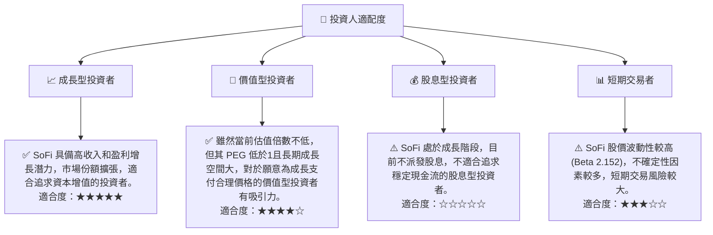

### 10.5 關鍵監控指標

| 監控類型 | 指標 | 關注點 | 頻率 |
|----------|------|--------|------|
| **成長指標** | 會員數增長 | 新會員獲取速度和質量 | 每季 |
| | 產品數增長 | 交叉銷售效率和會員黏性 | 每季 |
| | 總收入成長 (YoY/QoQ) | 核心業務和新業務的擴張動能 | 每季 |
| **獲利能力** | 淨利率趨勢 | 盈利能力持續性及規模效應 | 每季 |
| | ROIC vs WACC | 資本效率和價值創造能力 | 每年 |
| | 經營現金流 | 業務擴張與現金產生能力的平衡 | 每季 |
| **財務健康** | 存款增長 | 資金成本優化和銀行業務基礎 | 每季 |
| | 信貸損失準備金 | 貸款組合質量和風險管理 | 每季 |
| | 淨現金/債務 | 流動性狀況和財務彈性 | 每季 |
| **外部環境** | 利率政策 | 對借貸業務利差和需求的影響 | 每季/宏觀 |
| | 監管動態 | 潛在的合規成本和業務限制 | 持續 |

---

> **免責聲明**：本報告為 AI 自動生成，僅供研究參考，不構成投資建議。投資有風險，入市需謹慎。