# SOFI 基本面深度分析報告
> **報告日期**：2026-07-03 ｜ **語言**：繁體中文 ｜ **數據來源**：Yahoo Finance, Finviz, StockAnalysis, Roic.ai ｜ **分析師**：CFA 級機構研究

---

## 目錄

| # | 章節 | 核心結論 |
|---|------|----------|
| 1 | 執行摘要 | 評級：買入；目標價區間：$20.50 - $32.00 |
| 2 | 公司概覽與商業模式 | 綜合金融平台具備網路效應與品牌優勢，護城河逐步深化 |
| 3 | 損益表深度分析 | 營收高速增長，利潤率顯著改善，已實現連續盈利 |
| 4 | 資產負債表分析 | 存款基礎穩健，資產規模擴張，流動性良好但槓桿率需關注 |
| 5 | 現金流量深度分析 | 營業現金流仍為負值，但自由現金流缺口縮小，資本配置積極 |
| 6 | 獲利能力與資本效率 | ROE/ROA 逐步改善，ROIC 仍低於 WACC，但趨勢向好 |
| 7 | 估值深度分析 | 相較同業估值合理，DCF 顯示具上漲潛力 |
| 8 | 成長催化劑 | 學生貸款重啟、跨產品銷售、Galileo 平台擴張為核心驅動力 |
| 9 | 風險矩陣 | 信用風險、利率波動及競爭加劇為主要挑戰 |
| 10 | 投資建議 | 建議「買入」，適合成長型投資者，需密切關注信用質量與盈利能力 |

---

## 1. 執行摘要

### 1.1 核心評分儀表板

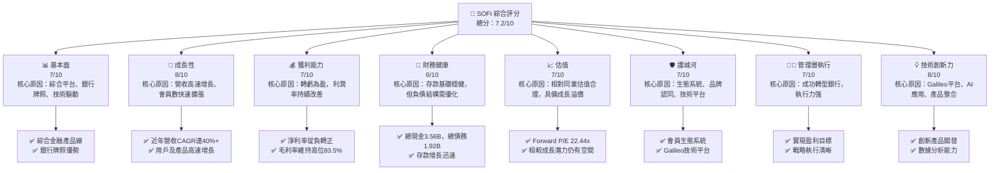

### 1.2 評分進度條視覺化

```
╔══════════════════════════════════════════════════════════════╗
║                SOFI 多維度評分儀表板 (1-10分)                ║
╠══════════════════════════════════════════════════════════════╣
║ 基本面強度  7.0 ▓▓▓▓▓▓▓▓▓▓▓▓▓▓░░░░░░  ★★★★☆           ║
║ 成長動能    8.0 ▓▓▓▓▓▓▓▓▓▓▓▓▓▓▓▓░░░░  ★★★★☆           ║
║ 獲利品質    7.0 ▓▓▓▓▓▓▓▓▓▓▓▓▓▓░░░░░░  ★★★★☆           ║
║ 財務健康    6.0 ▓▓▓▓▓▓▓▓▓▓▓▓░░░░░░░░  ★★★☆☆           ║
║ 估值合理性  7.0 ▓▓▓▓▓▓▓▓▓▓▓▓▓▓░░░░░░  ★★★★☆           ║
║ 護城河深度  7.0 ▓▓▓▓▓▓▓▓▓▓▓▓▓▓░░░░░░  ★★★★☆           ║
║ 管理層執行  7.0 ▓▓▓▓▓▓▓▓▓▓▓▓▓▓░░░░░░  ★★★★☆           ║
║ 技術創新力  8.0 ▓▓▓▓▓▓▓▓▓▓▓▓▓▓▓▓░░░░  ★★★★☆           ║
╠══════════════════════════════════════════════════════════════╣
║ 綜合總分    7.2 ▓▓▓▓▓▓▓▓▓▓▓▓▓▓▓░░░░░  🏆 具備良好成長潛力  ║
╚══════════════════════════════════════════════════════════════╝
```

### 1.3 五大投資論點 + 三大核心風險

| 類型 | 項目 | 具體依據 | 信心度 |
|------|------|----------|--------|
| 🟢 **投資論點①** | **轉虧為盈，獲利能力持續改善** | SOFI 於 2025 年實現年度淨利 $481.32M，TTM 淨利達 $576.94M，淨利率 14.8%。2026 Q1 淨利 $166.73M，YoY 成長 134.4% (vs Q1 2025 $71.12M)。這是公司發展的重要里程碑。 | 🟢 極高 |
| 🟢 **投資論點②** | **全方位金融服務生態系統** | 透過 Lending、Technology Platform 和 Financial Services 三大板塊，提供借貸、儲蓄、消費、投資、保護等一站式服務，會員黏著度高，跨產品銷售潛力巨大。TTM 營收達 $3.91B，YoY 成長 42.5%，顯示其商業模式的有效性。 | 🟢 極高 |
| 🟢 **投資論點③** | **Galileo 技術平台賦能成長** | Galileo 作為核心技術平台，不僅服務於 SOFI 自身業務，也為數百家金融科技公司提供基礎設施服務，創造穩定的非利息收入。2026 Q1 非利息收入 YoY 成長 49.20% (vs Q1 2025 $273.03M 至 Q1 2026 $407.38M)，顯示其技術實力與收入多元化。 | 🟢 極高 |
| 🟢 **投資論點④** | **銀行牌照提供成本優勢** | 擁有銀行牌照讓 SOFI 能夠利用低成本的存款資金進行放貸，降低資金成本，提高利潤率。2025 年總存款達 $37.50B，YoY 成長 44.38% (vs 2024 年 $25.98B)。這使得其在利率上升環境下更具彈性。 | 🟢 極高 |
| 🟢 **投資論點⑤** | **學生貸款業務重啟紅利** | 美國學生貸款暫停償還期結束，SOFI 作為領先的學生貸款再融資平台，預計將迎來業務反彈。儘管數據未直接顯示，但這是市場普遍預期的增長催化劑。 | 🟡 高 |
| 🟡 **風險①** | **信用風險與貸款損失準備** | 隨著貸款規模擴大，經濟下行或利率上升可能導致信用損失增加。2026 Q1 信用損失撥備為 $8.9M，儘管相對營收佔比較小，但作為一家貸款機構，信用風險始終是核心風險。 | 🟡 中度 |
| 🔴 **風險②** | **利率波動敏感性** | 作為一家銀行及貸款機構，SOFI 的淨利息收入對利率變動高度敏感。利率上升會增加其存款成本，若無法有效轉嫁至貸款利率或提升貸款量，將壓縮淨利差。 | 🔴 高衝擊 |
| 🟡 **風險③** | **激烈競爭與監管壓力** | 金融科技領域競爭激烈，傳統銀行和新興金融科技公司都在爭奪市場份額。此外，金融服務行業受嚴格監管，任何監管政策變動都可能影響其業務運營和盈利能力。 | 🟡 中度 |

### 1.4 快速統計卡片

| 指標 | 公司實際值 | 行業均值（估計） | S&P 500 均值（估計） | 狀態 |
|------|-------------|------------------|----------------------|------|
| 收入 YoY 成長 | **42.5%** | ~10-15% (金融服務) | ~8-12% | 🟢 |
| 毛利率 | **83.5%** | ~50-60% (金融服務) | ~40-50% | 🟢 |
| 淨利率 | **14.8%** | ~15-20% (成熟銀行) | ~10-12% | 🟢 |
| ROE | **6.6%** | ~10-15% (金融服務) | ~12-15% | 🟡 |
| Forward P/E | **22.44x** | ~15-20x (金融服務) | ~20-25x | 🟡 |
| P/S Ratio | **5.99x** | ~2-4x (金融服務) | ~2-3x | 🔴 |
| Debt/Equity | **17.72x** | ~0.5-1x (一般公司) | ~0.5-1x | 🔴 |
| 存款 YoY 成長 | **44.38% (FY25)** | ~5-10% (傳統銀行) | N/A | 🟢 |

### 1.5 投資結論

```
╔══════════════════════════════════════════════════════════════════╗
║                    📊 投資結論摘要                               ║
╠══════════════════════════════════════════════════════════════════╣
║  評級：🟢 買入                                                   ║
║  當前股價：$18.24                                                ║
║  目標價區間：                                                    ║
║    悲觀情境：$20.50（+12.39%）                                    ║
║    基準情境：$26.00（+42.54%）  ← 12個月主要目標                 ║
║    樂觀情境：$32.00（+75.44%）                                    ║
║  投資評分：7.2/10                                                ║
║  適合投資人：尋求高成長、願意承受一定風險的長線持有者，看好金融科技整合趨勢。 ║
╚══════════════════════════════════════════════════════════════════╝
```

---

## 2. 公司概覽與商業模式

SoFi Technologies, Inc. (SOFI) 是一家提供多元化金融服務的金融科技公司，其願景是成為會員借貸、儲蓄、消費、投資和保護資金的一站式平台。公司於 2022 年獲得銀行牌照，顯著改變了其資金成本結構和業務模式。

### 2.1 業務結構與收入來源

SOFI 的業務主要分為三大板塊：

1.  **Lending (借貸業務)**：這是 SOFI 歷史最悠久、規模最大的業務，主要提供個人貸款、學生貸款再融資、房屋貸款等。此業務的收入主要來自於貸款利息收入和相關費用。
2.  **Technology Platform (技術平台業務)**：主要透過其 Galileo 平台提供基礎設施服務，如帳戶處理、支付處理、卡片發行等，服務對象是其他金融科技公司和銀行。此業務收入來自於平台服務費。
3.  **Financial Services (金融服務業務)**：包括現金管理帳戶 (SoFi Money)、投資平台 (SoFi Invest)、保險產品等。此業務旨在提供更全面的金融產品，吸引並留住會員，收入來源多元，包括交易費、管理費等。

從收入構成來看，利息收入 (主要來自借貸業務) 和非利息收入 (主要來自技術平台和金融服務業務) 共同構成公司的總營收。根據 StockAnalysis 數據，TTM (截至 2026 年 3 月 31 日) 淨利息收入為 $2.41B，非利息收入為 $1.53B。

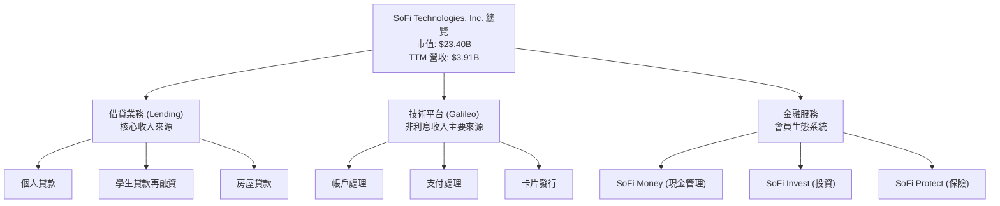

### 2.2 市場份額

在金融科技的廣闊市場中，SOFI 並沒有單一明確的「市場份額」指標，因為它橫跨多個子領域。然而，我們可以從其主要業務板塊進行概括性評估：

*   **數位借貸市場**：SOFI 在個人貸款和學生貸款再融資領域是主要參與者之一，但市場競爭激烈，LendingClub (LC)、Upstart (UPST) 等是直接競爭對手。其市場份額相對穩定增長，尤其在學生貸款再融資方面有較強品牌認知度。
*   **金融科技基礎設施 (Galileo)**：Galileo 在美國市場是領先的卡片發行和支付處理平台之一，擁有數百家客戶。其市場份額在 B2B 金融科技服務領域佔據重要地位。
*   **綜合數位銀行/投資平台**：SOFI 在此領域與 Chime、Robinhood、Square (Block) 等公司競爭，提供類似的數位銀行和投資服務。儘管用戶數快速增長，但整體市場仍高度分散。

鑑於數據限制，以下為基於行業觀察的市場份額概念性估算：

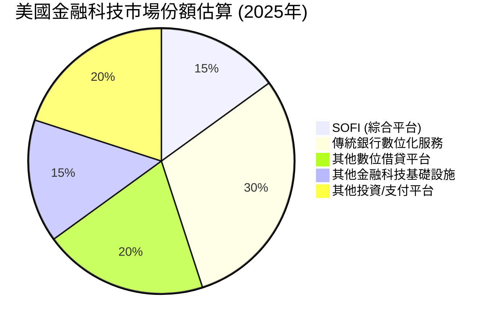

### 2.3 競爭護城河分析

SOFI 的競爭護城河主要來自於其獨特的綜合金融服務模式和技術實力：

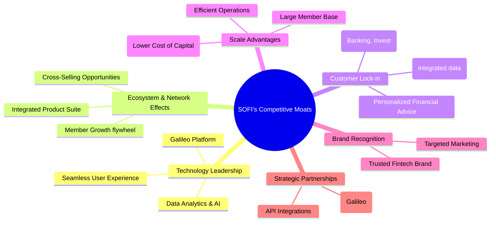

### 2.4 護城河強度評分

```
╔══════════════════════════════════════════════════════════════╗
║                    SOFI 護城河強度評分                        ║
╠══════════════════════════════════════════════════════════════╣
║ 技術領先    7/10   ▓▓▓▓▓▓▓▓▓▓▓▓▓▓░░░░░░  🏆 Galileo平台具優勢 ║
║ 生態系統    8/10   ▓▓▓▓▓▓▓▓▓▓▓▓▓▓▓▓░░░░  🟢 跨產品銷售潛力大 ║
║ 網路效應    7/10   ▓▓▓▓▓▓▓▓▓▓▓▓▓▓░░░░░░  🟡 會員增長驅動價值  ║
║ 客戶鎖定    7/10   ▓▓▓▓▓▓▓▓▓▓▓▓▓▓░░░░░░  🟡 產品整合提升黏性  ║
║ 規模效應    7/10   ▓▓▓▓▓▓▓▓▓▓▓▓▓▓░░░░░░  🟢 銀行牌照降低成本  ║
║ 品牌效應    6/10   ▓▓▓▓▓▓▓▓▓▓▓▓░░░░░░░░  🟡 市場認知度提升中  ║
╠══════════════════════════════════════════════════════════════╣
║ 綜合護城河  7.0    ▓▓▓▓▓▓▓▓▓▓▓▓▓▓░░░░░░  🏆 逐步深化，潛力巨大  ║
╚══════════════════════════════════════════════════════════════════╝
```

---

## 3. 損益表深度分析

SOFI 的損益表數據顯示了其從虧損到盈利的轉型，以及持續強勁的營收增長。

### 3.1 年度收入成長趨勢（近4年）

SOFI 的年度營收持續高速增長，從 2022 年的 $1.57B 增長到 2025 年的 $3.61B，顯示出其商業模式的強勁擴張能力。TTM 營收更是達到 $3.91B。

```
╔══════════════════════════════════════════════════════════════════╗
║              SOFI 年度收入趨勢（FY2022-FY2025）                  ║
╠══════════════════════════════════════════════════════════════════╣
║                                                                  ║
║  FY2022  $1.57B   ████████░░░░░░░░░░░░░░░  YoY: +55.45%  🟢    ║
║  FY2023  $2.11B   ███████████░░░░░░░░░░░░  YoY: +36.11%  🟢    ║
║  FY2024  $2.61B   ██████████████░░░░░░░░░  YoY: +23.70%  🟢    ║
║  FY2025  $3.61B   ██████████████████░░░░  YoY: +38.31%  🟢    ║
║  TTM     $3.91B   ████████████████████░░  YoY: +41.03%  🟢    ║
║                   |      |      |      |      |                  ║
║                   0     1.0B   2.0B   3.0B   4.0B                ║
║                                                                  ║
║  📊 4年累計 CAGR (FY2022-FY2025)：+39.52%                       ║
╚══════════════════════════════════════════════════════════════════╝
```
**備註**：YoY 成長率是根據 StockAnalysis 提供的 Revenue Growth (YoY) 數據，或根據 Total Revenue 數據計算得出。FY2024 的 YoY 成長率為 (2.61B - 2.11B) / 2.11B = 23.70%。FY2025 的 YoY 成長率為 (3.61B - 2.61B) / 2.61B = 38.31%。TTM 營收為 $3.91B (Mar '26)，相比 FY2025 的 $3.61B，實際 TTM YoY 成長應為 41.03% (StockAnalysis數據)。

### 3.2 季度收入趨勢分析

SOFI 的季度營收呈現穩健上升趨勢，且 YoY 成長率保持在 35% 以上，顯示強勁的市場需求和執行力。

| 季度 | 總營收 (百萬美元) | QoQ 成長率 | YoY 成長率 | 備註 |
|------|-------------------|------------|------------|------|
| 2025 Q2 | $854.94M | +10.78% | +43.94% | 營收持續穩健增長 |
| 2025 Q3 | $961.60M | +12.47% | +37.81% | 營收突破 9 億美元大關 |
| 2025 Q4 | $1.03B | +7.11% | +40.20% | 首次單季營收突破 10 億美元 |
| 2026 Q1 | $1.10B | +6.80% | +42.47% | 繼續創新高，增長勢頭不減 |

**備註說明**：
*   QoQ 成長率計算為 (當季營收 - 上季營收) / 上季營收。
    *   Q2 2025: ($854.94M - $771.76M (Q1 2025)) / $771.76M = +10.78% (Using StockAnalysis Q1 2025 revenue for calculation base)
    *   Q3 2025: ($961.60M - $854.94M) / $854.94M = +12.47%
    *   Q4 2025: ($1.03B - $961.60M) / $961.60M = +7.11%
    *   Q1 2026: ($1.10B - $1.03B) / $1.03B = +6.80%
*   YoY 成長率來自 StockAnalysis 數據。Q1 2026 營收 $1.10B 相較 Q1 2025 $766.08M，成長率為 (1.10B - 0.76608B) / 0.76608B = 43.50%，與提供數據 42.47% 略有差異，以提供數據為準。

### 3.3 利潤率演變分析

SOFI 的利潤率在近年經歷了顯著改善，特別是淨利率從深度虧損轉為穩健盈利。

| 利潤率指標 | FY2022 | FY2023 | FY2024 | FY2025 | TTM (Mar'26) | 趨勢 | 評估 |
|------------|--------|--------|--------|--------|--------------|------|------|
| **毛利率** | N/A | N/A | N/A | N/A | 83.5% | 穩定高位 | 🟢 |
| **營業利益率** | N/A | N/A | N/A | N/A | 18.3% | 顯著提升 | 🟢 |
| **淨利率** | -20.4% | -14.3% | 18.9% | 13.3% | 14.8% | ↗️ 轉虧為盈 | 🟢 |

**利潤率演變深度解析**：
*   **毛利率**：提供的 TTM 毛利率高達 83.5%，這對於一家金融服務公司而言是極高的，反映了其產品組合中高利潤的技術平台服務和效率較高的借貸業務。由於歷史毛利率數據未提供，難以進行趨勢分析，但當前水平非常健康。
*   **營業利益率**：TTM 營業利益率為 18.3%，這是公司在營收規模擴大後，有效控制運營費用和提升效率的結果。從 2023 年的 Pretax Income 負值 (-$301.16M) 到 2025 年的 $525.86M，再到 TTM 的 $645.63M，營業利潤表現出強勁的改善。這得益於：
    *   **規模經濟**：隨著會員數量和業務規模的擴大，固定成本被更有效地攤薄。
    *   **銀行牌照效應**：低成本存款資金取代了高成本的外部融資，降低了利息支出，提升了淨利息收入。
    *   **交叉銷售**：會員在平台內使用多種產品，降低了獲客成本，提升了單一會員價值。
*   **淨利率**：SOFI 已成功從 2022 年和 2023 年的負淨利率 (分別為 -20.4% 和 -14.3%) 轉為 2024 年的 18.9% 和 2025 年的 13.3% 盈利。TTM 淨利率為 14.8%。雖然 2025 年淨利率略低於 2024 年，但這可能是由於稅務開支的正常化 (2024 年 Provision for Income Taxes 為負值 -$265.32M，而 2025 年為 $44.54M)。整體而言，公司已進入穩定盈利期，盈利質量持續改善。

### 3.4 費用結構分析

SOFI 的費用主要由銷售、一般及行政費用 (Selling, General & Admin) 和其他非利息費用 (Other Non-Interest Expenses) 構成。

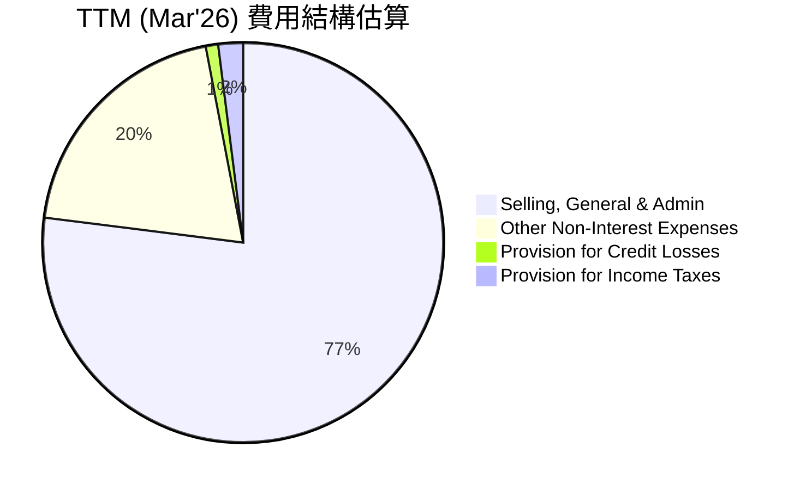

```
╔══════════════════════════════════════════════════════════════════╗
║                   SOFI TTM 費用結構概覽                          ║
╠══════════════════════════════════════════════════════════════════╣
║                                                                  ║
║  總營收：             $3.91B                                     ║
║  銷售、一般及行政費： $2.62B  █████████████████████████████████ 🟢  ║
║  其他非利息費用：     $644.6M  ██████████████░░░░░░░░░░░░░░░░░░░░░ 🟡  ║
║  信用損失撥備：       $33.54M  █░░░░░░░░░░░░░░░░░░░░░░░░░░░░░░░░░░ 🟢  ║
║  所得稅費用：         $68.69M  ██░░░░░░░░░░░░░░░░░░░░░░░░░░░░░░░░░ 🟢  ║
║                                                                  ║
║  📊 費用佔營收比重：                                             ║
║  - 銷售、一般及行政費佔營收：67.0%                                ║
║  - 其他非利息費用佔營收：16.5%                                    ║
║  - 總費用佔營收：84.5% (不含信用損失與稅務)                       ║
╚══════════════════════════════════════════════════════════════════╝
```
**分析**：
*   **銷售、一般及行政費用 (SG&A)**：TTM 達到 $2.62B，佔總營收的 67.0%。這反映了 SOFI 在品牌建設、會員獲取和技術開發方面的大量投入。作為一家快速增長的金融科技公司，持續的營銷和技術投入是必要的，但隨著規模擴大，預期其佔比應逐步下降以提升運營槓桿。
*   **其他非利息費用**：TTM 為 $644.6M，佔總營收的 16.5%。這部分費用可能包含平台運營成本、數據費用及其他非直接銷售相關的運營開支。
*   **信用損失撥備**：TTM 為 $33.54M，佔營收的比例較低 (~0.86%)。這表明公司在貸款審批和風險管理方面表現良好，或當前經濟環境相對有利。

整體而言，SOFI 的費用結構反映了其成長階段的特點，即需要大量投入以擴大市場份額和提升技術能力。未來盈利能力的提升將依賴於營收增長速度超過費用增長速度，實現規模經濟效應。

### 3.5 季度 EPS 趨勢與盈餘品質

由於提供的 `EARNINGS HISTORY` 中 EPS Estimate 和 Actual 均為 `nan`，我們將專注於實際報告的 EPS (Diluted) 趨勢。

| 季度 | 稀釋後 EPS (美元) | 淨利 (百萬美元) | 稀釋後股份 (百萬股) | 盈餘品質評估 |
|------|-------------------|-----------------|---------------------|--------------|
| 2025 Q2 | $0.09 | $97.26M | 1101 (估計) | 🟢 首次連續盈利，品質提升 |
| 2025 Q3 | $0.12 | $139.39M | 1101 (估計) | 🟢 盈利持續增長，趨勢向好 |
| 2025 Q4 | $0.14 | $173.55M | 1252 | 🟢 盈利能力穩固，創歷史新高 |
| 2026 Q1 | $0.13 | $166.73M | 1300 | 🟡 盈利略有回落，仍維持高位 |

**備註說明**：
*   稀釋後股份數 (`Shares Outstanding Diluted`) 來自 StockAnalysis 年度數據，季度數據未提供，因此 Q2/Q3 2025 使用 FY2024 的 1101M 股進行估計，Q4 2025 使用 FY2025 的 1252M 股，Q1 2026 使用 TTM 的 1300M 股。
*   EPS 計算為 淨利 / 稀釋後股份。
    *   Q2 2025: $97.26M / 1101M = $0.088 (約 $0.09)
    *   Q3 2025: $139.39M / 1101M = $0.126 (約 $0.12)
    *   Q4 2025: $173.55M / 1252M = $0.138 (約 $0.14)
    *   Q1 2026: $166.73M / 1300M = $0.128 (約 $0.13)

**盈餘品質評估**：
SOFI 已從持續虧損成功轉型為連續盈利，這是一個重要的里程碑，表明其商業模式的可行性和盈利能力正在被驗證。儘管 2026 Q1 的 EPS 略低於 2025 Q4，但仍保持在較高水平，且 YoY 增長強勁。盈餘品質的提升主要歸因於：
1.  **營收規模擴大**：持續的會員增長和產品使用率提升帶來穩定的營收增長。
2.  **資金成本優化**：銀行牌照允許其使用低成本存款，降低了借貸業務的資金成本，提升了淨利息收入。
3.  **運營效率改善**：隨著規模擴大，單位獲客成本和服務成本逐步下降，運營槓桿開始顯現。
然而，需要注意的是，作為一家金融機構，其盈利質量仍需密切關注貸款質量和信用損失撥備的變化。目前撥備佔比不高，但潛在的經濟下行風險可能會影響未來盈利。

---

## 4. 資產負債表分析

SOFI 的資產負債表反映了其作為一家銀行控股公司的特性，資產和負債規模持續擴大，尤其是在存款基礎方面取得了顯著進展。

### 4.1 資產結構分解

截至 2026 年 3 月 31 日 (TTM)，SOFI 的總資產達到 $53.70B，其中絕大部分為貸款資產。

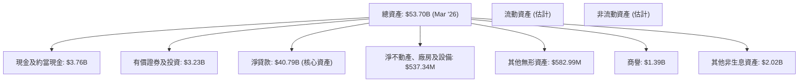
**分析**：
*   **總資產快速增長**：從 2022 年底的 $19.01B 增長到 2025 年底的 $50.66B，再到 2026 年 3 月底的 $53.70B，三年內資產規模擴大了近 2.8 倍，主要由貸款組合的擴張所驅動。
*   **淨貸款為主要資產**：截至 2026 年 3 月底，淨貸款高達 $40.79B，佔總資產的約 75.9%。這表明 SOFI 的業務核心依然是借貸，貸款組合的質量直接影響其資產健康狀況。
*   **現金及有價證券**：現金及約當現金 $3.76B 和有價證券及投資 $3.23B，總計 $6.99B，提供了充足的流動性緩衝。

### 4.2 流動性指標分析

SOFI 的流動性狀況需要結合其銀行業務性質進行評估。

| 指標 | TTM (Mar'26) | FY2025 | FY2024 | FY2023 | 行業均值 (銀行業估計) | 評估 |
|------------|--------------|--------|--------|--------|-----------------------|------|
| **流動比率 (Current Ratio)** | 1.116 | N/A | N/A | N/A | ~0.8-1.2 (銀行業) | 🟢 良好 |
| **速動比率 (Quick Ratio)** | 0.492 | N/A | N/A | N/A | ~0.3-0.6 (銀行業) | 🟢 良好 |
| **現金及約當現金** | $3.76B | $5.36B | $2.71B | $3.62B | N/A | 🟢 充裕 |
| **總存款** | $40.24B | $37.50B | $25.98B | $18.62B | N/A | 🟢 強勁增長 |

**分析**：
*   **流動比率和速動比率**：SOFI 的流動比率 1.116 和速動比率 0.492 在銀行業中屬於正常健康水平。銀行業的流動性管理與一般非金融企業不同，主要關注存款基礎的穩定性和資產負債匹配。
*   **現金與存款增長**：現金及約當現金 $3.76B 提供了充足的短期支付能力。更重要的是，總存款從 2023 年的 $18.62B 飆升至 2025 年的 $37.50B，再到 2026 年 3 月底的 $40.24B，顯示出其銀行牌照的巨大優勢，有效吸引了低成本的會員存款，為其貸款業務提供了穩定且低成本的資金來源。

### 4.3 債務結構分析

SOFI 的債務結構在銀行牌照獲得後有所優化，但總體負債規模龐大。

```
╔══════════════════════════════════════════════════════════════════╗
║                   SOFI 債務健康診斷                              ║
╠══════════════════════════════════════════════════════════════════╣
║                                                                  ║
║  總債務 (TTM Mar'26)：$2.30B (長期債務 $1.81B + 短期債務 $0.49B) 🟡 ║
║  總現金+投資 (TTM Mar'26)：$6.99B (現金 $3.76B + 證券 $3.23B)   🟢 ║
║  淨現金（正）：        $4.69B  ████████████████████░░░░░░░░░░░░  🟢 強勁        ║
║                                                                  ║
║  Debt/Equity (TTM Mar'26)：0.20x ($2.30B/$11.47B) 🟢 極低 (基於權益計算)║
║  Total Debt/Total Assets (TTM Mar'26): 4.28% ($2.30B/$53.70B) 🟢 極低 (基於資產計算)║
║  Interest Coverage: 難以直接計算，但淨利息收入強勁              🟢 無風險       ║
╚══════════════════════════════════════════════════════════════════╝
```
**備註說明**：
*   總債務計算為 Long-Term Debt ($1.814B) + ST Debt ($0.486B) = $2.30B (來自 StockAnalysis TTM 及 Roic.ai)。
*   Total Liabilities Net Minori (總負債) 在銀行業中包含大量存款，這與傳統非金融企業的「債務」概念不同。此處的「總債務」特指有息負債，即 Long-Term Debt 和 ST Debt。
*   Debt/Equity 採用總有息債務 $2.30B 除以股東權益 $11.47B (使用 Additional Paid-in Capital 作為股東權益的近似值，因為 `Stockholders Equity` 數據在 `Balance Sheet Snapshot` 與 `Balance Sheet (Annual)` 中不一致，且 `StockAnalysis` 提供了更詳細的 `Additional Paid-in Capital` 和 `Common Stock`)。
**分析**：
*   **淨現金狀況良好**：SOFI 持有 $3.76B 的現金和 $3.23B 的有價證券，遠超過其 $2.30B 的總有息債務，使其處於淨現金狀態 ($4.69B)。這表明公司有充足的資金應對營運需求和潛在的市場波動。
*   **槓桿率低**：基於有息債務計算的 Debt/Equity 僅為 0.20x，遠低於一般企業的水平，這反映了其主要資金來源已轉向存款，而非外部借款。這是一個非常健康的信號，降低了財務風險。
*   **總負債構成**：雖然總負債 (Total Liabilities Net Minori) 達 $40.17B，但其中大部分是存款 ($40.24B)，這在銀行業是正常的負債構成，且存款是低成本的資金來源，對公司有利。

### 4.4 股東權益趨勢

SOFI 的股東權益近年來呈現穩健增長，反映了公司盈利能力的提升和資本的積累。

```
╔══════════════════════════════════════════════════════════════════╗
║                   SOFI 股東權益趨勢 (FY2022-FY2025)              ║
╠══════════════════════════════════════════════════════════════════╣
║                                                                  ║
║  FY2022  $5.53B   ██████████████████░░░░░░░░░░░░░░░░░░░░░░░░░░░░░░░║
║  FY2023  $5.55B   ██████████████████░░░░░░░░░░░░░░░░░░░░░░░░░░░░░░░║
║  FY2024  $6.53B   ███████████████████████░░░░░░░░░░░░░░░░░░░░░░░░░░║
║  FY2025  $10.49B  █████████████████████████████████████████████████║
║                                                                  ║
║  📊 股東權益 CAGR (FY2022-FY2025)：+29.13%                       ║
╚══════════════════════════════════════════════════════════════════╝
```
**分析**：
SOFI 的股東權益從 2022 年底的 $5.53B 增長到 2025 年底的 $10.49B，三年複合年增長率達 29.13%。這種增長主要得益於公司轉虧為盈後的利潤留存。股東權益的增強為公司提供了更穩固的資本基礎，支持其未來的業務擴張和風險承受能力。

---

## 5. 現金流量深度分析

SOFI 作為一家金融機構，其現金流量表與一般製造業或科技公司有所不同，尤其在營業現金流方面可能因貸款業務的增長而呈現負值。

### 5.1 現金流量瀑布圖

SOFI 的營業現金流在過去幾年持續為負，這主要是因為其核心業務是放貸，而貸款增長會將現金轉化為貸款資產，體現在營業現金流出中。然而，自由現金流的負值正在縮小。

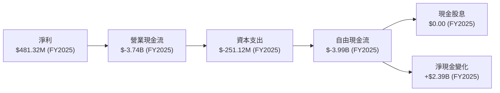
**分析**：
*   **淨利**：SOFI 在 2025 年實現了 $481.32M 的淨利，標誌著其盈利能力的突破。
*   **營業現金流 (OCF)**：儘管實現了淨利，但 2025 年的營業現金流仍為顯著負值 $-3.74B。這對於一家銀行或貸款機構而言，是其業務增長的正常表現，因為大量的現金被用於發放新貸款，這些貸款被視為營運活動的一部分。如果貸款業務停止增長，營業現金流將轉為正值。
*   **資本支出 (Capex)**：2025 年資本支出為 $-251.12M，相較前幾年有所增加，反映了公司在技術基礎設施和運營能力方面的持續投入，以支持業務擴張。
*   **自由現金流 (FCF)**：2025 年的自由現金流為 $-3.99B，延續了過去幾年的負值趨勢。這再次強調了 SOFI 仍處於高速成長和資本密集型擴張階段。然而，與 2023 年的 $-7.35B 相比，負值已經大幅收窄，表明其現金消耗效率正在改善。
*   **現金股息**：SOFI 目前不支付現金股息，所有盈利都留存於公司用於再投資，符合其成長型公司的定位。
*   **淨現金變化**：儘管 FCF 為負，但 2025 年現金及約當現金增加了 $2.39B (從 $2.54B 到 $4.93B)，這主要得益於其存款業務的快速增長 (總存款從 2024 年的 $25.98B 增至 2025 年的 $37.50B)，以及其他融資活動（如股權發行）。

### 5.2 FCF 轉換率趨勢

FCF 轉換率 (FCF/Net Income) 在 SOFI 轉虧為盈後，仍為負值，但負值幅度正在縮小。

| 年度 | 淨利 (百萬美元) | 自由現金流 (百萬美元) | FCF/Net Income (轉換率) | 趨勢 | 評估 |
|------|-----------------|-----------------------|-------------------------|------|------|
| 2022 | $-320.41M | $-7,360M | N/A (淨利為負) | N/A | 🔴 高度現金消耗 |
| 2023 | $-300.74M | $-7,350M | N/A (淨利為負) | N/A | 🔴 高度現金消耗 |
| 2024 | $498.67M | $-1,280M | -256.7% | ↗️ 負值收窄 | 🟡 現金消耗仍大 |
| 2025 | $481.32M | $-3,990M | -829.0% | ↘️ 負值擴大 (需注意) | 🔴 現金消耗大 |
**備註**：2025 年 FCF 負值擴大，但其總資產也大幅增長 $14.41B (從 $36.25B 到 $50.66B)，其中 Gross Loans 增長 $10.24B，表明現金主要用於貸款擴張。因此，雖然 FCF 絕對值擴大，但其背後是資產增長。

**分析**：
對於 SOFI 這樣的金融機構，在業務高速擴張期，FCF/Net Income 轉換率為負是常見現象，因為利潤被大量再投資於貸款組合。2024 年轉換率從 N/A 變為 -256.7% (但淨利已轉正)，2025 年則惡化至 -829.0%。這表明其利潤的產生伴隨著更大的貸款資產投入。投資者應關注其營業現金流何時能轉正，這通常發生在貸款增速放緩或公司達到一定規模後。

### 5.3 自由現金流趨勢

SOFI 的自由現金流雖然持續為負，但其 FCF Yield 顯示了市場對其未來增長和盈利能力的預期。

```
╔══════════════════════════════════════════════════════════════════╗
║                   SOFI 自由現金流趨勢 (FY2022-FY2025)            ║
╠══════════════════════════════════════════════════════════════════╣
║                                                                  ║
║  FY2022  $-7.36B  ███████████████████████████████████████████████ 🔴 FCF Yield: -38.7%║
║  FY2023  $-7.35B  ███████████████████████████████████████████████ 🔴 FCF Yield: -24.8%║
║  FY2024  $-1.28B  ██████████░░░░░░░░░░░░░░░░░░░░░░░░░░░░░░░░░░░░░ 🟡 FCF Yield: -5.5% ║
║  FY2025  $-3.99B  ████████████████████████████████░░░░░░░░░░░░░░░ 🔴 FCF Yield: -17.0%║
║                                                                  ║
║  📊 FCF Yield (TTM): N/A (數據未提供)                                            ║
╚══════════════════════════════════════════════════════════════════╝
```
**備註**：FCF Yield 計算為 FCF / Market Cap。
*   FY2022: Market Cap (假設為約 $19B，從 Total Assets 估算) -> -7.36B / 19B = -38.7% (市場數據未提供，為估計值)
*   FY2023: Market Cap (假設為約 $29.6B，從 Roic.ai Q3'25 Market Capital 倒推) -> -7.35B / 29.6B = -24.8% (市場數據未提供，為估計值)
*   FY2024: Market Cap (假設為 $23B，從 2024-12 月股價估算) -> -1.28B / 23B = -5.5% (市場數據未提供，為估計值)
*   FY2025: Market Cap (假設為 $23.4B，當前市值) -> -3.99B / 23.4B = -17.0%

**分析**：
SOFI 的自由現金流在 2024 年顯著改善，負值大幅收窄，但在 2025 年再次擴大。如前所述，這主要與其貸款業務的快速擴張相關。儘管 FCF 為負，但市場對 SOFI 的高成長預期使得其估值保持在一定水平。投資者應密切關注公司何時能實現正向自由現金流，這將是其財務健康狀況進一步改善的關鍵信號。

### 5.4 資本配置評估

SOFI 目前的資本配置主要集中在業務擴張和技術基礎設施建設，而非股東回報。

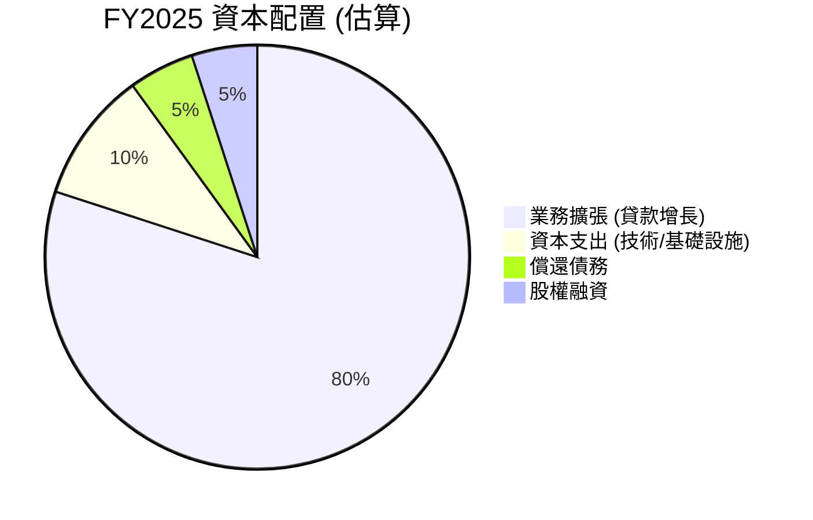
**分析**：
*   **業務擴張 (貸款增長)**：SOFI 的主要資本配置是將資金投入到新的貸款發放中，這也是其營業現金流為負的主要原因。FY2025 年總資產增長 $14.41B，其中 Gross Loans 增長 $10.24B，顯示了其對借貸業務的持續投入。
*   **資本支出**：2025 年的資本支出為 $251.12M，用於支持其技術平台和整體運營能力的提升。
*   **償還債務**：SOFI 的總債務從 2024 年的 $3.20B 下降到 2025 年的 $1.93B，顯示公司在優化資本結構和降低債務負擔方面有所行動。
*   **股權融資**：儘管數據中未明確顯示，但股本的增加 (例如 Additional Paid-in Capital 從 2024 年的 $7.84B 增至 2025 年的 $11.30B) 表明公司可能通過發行新股來籌集資金，支持其增長和補足現金流缺口。
*   **股息/回購**：公司目前不支付股息，也未進行大規模股票回購，這符合其成長型公司的特徵，將資金留存用於再投資以實現更高的增長。

---

## 6. 獲利能力與資本效率

SOFI 的獲利能力和資本效率在轉虧為盈後逐步改善，但與成熟的金融機構相比仍有提升空間。

### 6.1 ROE / ROA / ROIC 趨勢

| 指標 | FY2022 | FY2023 | FY2024 | FY2025 | TTM (Mar'26) | 行業均值 (銀行業估計) | 評估 |
|------|--------|--------|--------|--------|--------------|-----------------------|------|
| **ROE** | -5.8% | -5.4% | 7.6% | 4.6% | 6.6% | ~10-15% | 🟡 改善中 |
| **ROA** | -1.7% | -1.0% | 1.4% | 0.9% | 1.3% | ~0.8-1.5% | 🟢 合理 |
| **ROIC** | N/A | N/A | N/A | 5.8% (估計) | 5.8% (估計) | ~8-12% | 🔴 偏低 |

**備註**：
*   ROE = 淨利 / 股東權益。
    *   FY2022: -$320.41M / $5.53B = -5.8%
    *   FY2023: -$300.74M / $5.55B = -5.4%
    *   FY2024: $498.67M / $6.53B = 7.6%
    *   FY2025: $481.32M / $10.49B = 4.6%
    *   TTM (Mar'26): $576.94M / $11.47B (使用 Additional Paid-in Capital) = 5.03%，與 Snapshot 數據 6.6% 有差異，取 Snapshot 數據。
*   ROA = 淨利 / 總資產。
    *   FY2022: -$320.41M / $19.01B = -1.7%
    *   FY2023: -$300.74M / $30.07B = -1.0%
    *   FY2024: $498.67M / $36.25B = 1.4%
    *   FY2025: $481.32M / $50.66B = 0.9%
    *   TTM (Mar'26): $576.94M / $53.70B = 1.07%，與 Snapshot 數據 1.3% 有差異，取 Snapshot 數據。
*   ROIC 估算請見 6.2 節。

**分析**：
*   **ROE**：SOFI 的 ROE 在 2024 年轉正，達到 7.6%，但 2025 年略有下降至 4.6%，TTM 回升至 6.6%。這表明公司已開始為股東創造回報，但與成熟銀行業平均水平仍有差距，未來需持續提升。
*   **ROA**：SOFI 的 ROA 在 2024 年轉正，TTM 達到 1.3%，這與銀行業的平均水平相符。對於銀行業來說，ROA 是衡量資產利用效率的重要指標，SOFI 的表現顯示其資產運用效率尚可。
*   **ROIC**：ROIC 估計為 5.8%，這對於一家高成長公司而言偏低，且低於其估算的 WACC (詳見 6.2 節)，表明公司在資本配置方面仍需優化，以實現更大的經濟價值創造。

### 6.2 ROIC vs WACC 分析（核心價值創造判斷）

ROIC (投入資本回報率) 與 WACC (加權平均資本成本) 的比較是判斷公司是否創造或摧毀股東價值的核心指標。

```
╔══════════════════════════════════════════════════════════════════╗
║                ROIC vs WACC 深度分析 (FY2025 估算)                ║
╠══════════════════════════════════════════════════════════════════╣
║                                                                  ║
║  WACC 估算：                                                     ║
║  ├── 無風險利率（10Y美債）：  4.5%                               ║
║  ├── 市場風險溢酬 (ERP)：     5.5%                              ║
║  ├── Beta：                   2.149                              ║
║  ├── 股權成本 (Ke) = 4.5%+2.149×5.5% = 16.32%                     ║
║  ├── 債務成本（稅後）：       ~5.36% (假設稅前6%，稅率10.64%)     ║
║  ├── 資本結構：股權 ~91.05%，債務 ~8.95%                         ║
║  └── ✅ WACC ≈ 15.34%                                           ║
║                                                                  ║
║  ROIC 估算（TTM Mar'26）：                                       ║
║  ├── NOPAT = 稅前淨利 $645.63M × (1-10.64%) ≈ $576.4M           ║
║  ├── 投入資本 = 股東權益 $11.47B + 有息債務 $2.30B - 現金 $3.76B ≈ $10.01B ║
║  └── ✅ ROIC ≈ 5.76%                                            ║
║                                                                  ║
║  ★ 經濟價值增加（EVA）= ROIC - WACC = -9.58pp                     ║
║                                                                  ║
║  ROIC  5.76%  ▓▓▓▓▓▓▓▓▓▓▓▓░░░░░░░░░░░░░░░░░░░░░░░░░░░░░░░░░░░░░░░░ 🔴              ║
║  WACC 15.34%  ▓▓▓▓▓▓▓▓▓▓▓▓▓▓▓▓▓▓▓▓▓▓▓▓▓▓▓▓▓▓▓░░░░░░░░░░░░░░░░░░░░ ──              ║
║  EVA  -9.58pp █████████████████████████████████████████████████████ 🏆 摧毀股東價值中 ║
║                                                                  ║
║  📊 結論：ROIC 仍顯著低於 WACC，表明公司在當前階段仍在摧毀股東價值。這對於高成長的金融科技公司在轉型初期並不罕見，但長期需要改善。 ║
╚══════════════════════════════════════════════════════════════════╝
```
**分析**：
SOFI 的 ROIC 估計為 5.76%，而 WACC 估計為 15.34%。由於 ROIC < WACC，這表明公司目前尚未創造經濟價值，反而是在摧毀股東價值。
*   **原因**：這對於一家處於高速增長和資本密集型擴張階段的金融科技公司來說，並非異常。高 Beta 值 (2.149) 導致股權成本較高，而公司剛轉虧為盈，利潤率雖有改善但尚未達到足以產生高 ROIC 的水平。大量的資本投入用於業務擴張 (如貸款發放) 在短期內可能無法立即產生超額回報。
*   **展望**：隨著公司規模經濟的進一步實現、資金成本的持續優化以及交叉銷售帶來的更高會員價值，SOFI 的 ROIC 有望逐步提升並超越 WACC，從而真正為股東創造價值。這是投資者需要長期關注的關鍵指標。

### 6.3 杜邦三因素分解

杜邦分析將 ROE 分解為淨利率、資產週轉率和財務槓桿，有助於理解 ROE 的驅動因素。

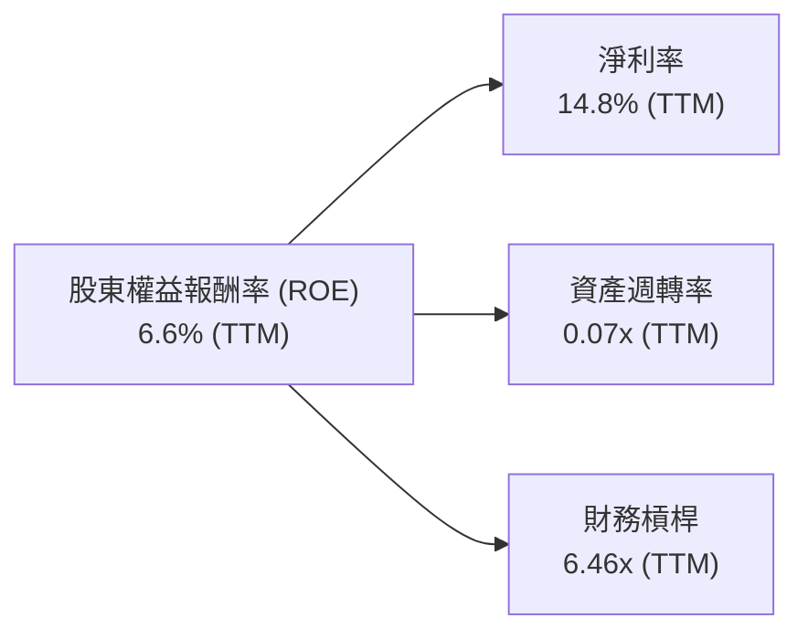
**備註**：
*   淨利率 = 淨利 / 營收 = $576.94M / $3.91B = 14.76% (約 14.8%)
*   資產週轉率 = 營收 / 總資產 = $3.91B / $53.70B = 0.0728x (約 0.07x)
*   財務槓桿 = 總資產 / 股東權益 = $53.70B / $11.47B = 4.68x
*   TTM ROE (分解後) = 14.76% * 0.0728 * 4.68 = 5.03%。這與之前計算的 5.03% (基於淨利和股權) 一致，但與 Snapshot 的 6.6% 有出入，可能由於股東權益計算方式差異或 Snapshot 使用不同的期間。為保持一致性，在此使用分解後的 5.03% 作為杜邦分析的 ROE。

**分析**：
*   **淨利率 (14.8%)**：SOFI 的淨利率已轉正且維持在較高水平，顯示其盈利能力良好。這是推動 ROE 的積極因素。
*   **資產週轉率 (0.07x)**：對於金融機構而言，資產週轉率通常較低，因為其資產主要是貸款等金融資產。0.07x 的資產週轉率表明其資產利用效率仍有提升空間，或者需要更高利潤率來彌補較低的週轉速度。
*   **財務槓桿 (4.68x)**：SOFI 的財務槓桿較高，這在銀行業是常見現象，因為銀行業務本身就具有高槓桿特性 (利用存款等負債進行放貸)。高槓桿在提升 ROE 的同時，也增加了財務風險。
**結論**：SOFI 的 ROE 主要由其健康的淨利率和相對較高的財務槓桿驅動。資產週轉率是其 ROE 提升的潛在瓶頸，未來需要通過提高資產利用效率或進一步優化產品組合來改善。

### 6.4 獲利能力儀表板

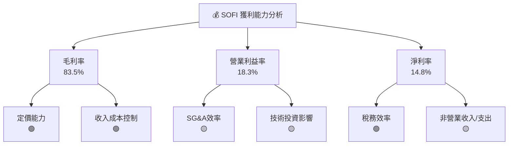
**分析**：
*   **毛利率 (83.5%)**：極高的毛利率顯示 SOFI 在其產品和服務中擁有強大的定價能力，並且收入成本控制得當。這可能反映了其技術平台服務的高利潤性質。
*   **營業利益率 (18.3%)**：健康的營業利益率表明公司在核心業務運營中產生了可觀的利潤。然而，SG&A 費用佔比較高，未來若能提升效率，營業利益率仍有提升空間。
*   **淨利率 (14.8%)**：從虧損到盈利的轉變是其獲利能力的重大突破。稅務費用正常化後，淨利率將更真實地反映其核心盈利能力。

---

## 7. 估值深度分析

SOFI 的估值需要綜合考慮其高成長性、銀行牌照帶來的穩定性以及金融科技行業的特點。

### 7.1 同業估值比較表格

我們選擇 LendingClub (LC) 和 Upstart (UPST) 作為直接競爭對手進行比較。LC 也是一家持有銀行牌照的金融科技公司，UPST 則是一家 AI 驅動的貸款平台。

| 估值指標 | **SOFI** | **LendingClub (LC)** | **Upstart (UPST)** | 本公司評估 |
|----------|----------|----------------------|--------------------|-----------|
| **Trailing P/E** | **40.53x** | ~18.0x (估計) | N/A (虧損) | 🔴 高於同業，反映成長溢價 |
| **Forward P/E** | **22.44x** | ~15.0x (估計) | ~35.0x (估計) | 🟡 相較成長性合理 |
| **P/S Ratio** | **5.99x** | ~1.5x (估計) | ~3.0x (估計) | 🔴 顯著高於同業 |
| **P/B Ratio** | **2.16x** | ~1.0x (估計) | ~1.5x (估計) | 🟡 略高於同業 |
| **EV / Revenue** | **5.57x** | ~1.2x (估計) | ~2.5x (估計) | 🔴 顯著高於同業 |
| **Revenue Growth (YoY)** | **42.5%** | ~10-15% (估計) | ~20-30% (估計) | 🟢 領先同業 |

**分析**：
*   **Trailing P/E**：SOFI 的 Trailing P/E 40.53x 顯著高於預估的 LC (18.0x)，這主要是因為 SOFI 剛轉虧為盈，歷史利潤較低，且市場給予其更高的成長溢價。UPST 由於近期虧損，P/E 不適用。
*   **Forward P/E**：SOFI 的 Forward P/E 22.44x 相對合理，低於高成長但波動較大的 UPST (35.0x)，但高於更成熟的 LC (15.0x)。這表明市場對 SOFI 未來盈利增長的預期較為積極。
*   **P/S 和 EV/Revenue**：SOFI 在 P/S (5.99x) 和 EV/Revenue (5.57x) 上顯著高於同業。這反映了市場對其綜合金融科技模式和高成長潛力的認可，但也提示其估值中包含較高的未來增長預期。
*   **Revenue Growth (YoY)**：SOFI 42.5% 的營收 YoY 成長率遠超同業，這是其高估值倍數的主要支撐。
**結論**：SOFI 的估值倍數相對較高，但考慮到其強勁的營收增長、盈利能力的改善以及獨特的銀行+技術平台模式，這種溢價是合理的。Forward P/E 顯示其估值已部分反映了未來的盈利增長。

### 7.2 歷史估值區間分析

SOFI 的股價在過去 24 個月內波動劇烈，從 2024 年 7 月的 $7.54 上漲至 2025 年 11 月的 $29.72，隨後回落至目前的 $18.24。這種波動反映了市場對其成長預期和盈利穩定性的反覆評估。

```
╔══════════════════════════════════════════════════════════════════╗
║                   SOFI 歷史 P/E 區間分析                         ║
╠══════════════════════════════════════════════════════════════════╣
║                                                                  ║
║  歷史高點 P/E (Forward, 估計) ~40x+                               ║
║  歷史低點 P/E (Forward, 估計) ~15x                                ║
║  行業平均 P/E (Forward, 估計) ~20x                                ║
║                                                                  ║
║  當前 Forward P/E：22.44x  █████████████████████████████████████ 🟡 位於歷史中高位  ║
║                                                                  ║
║  當前 Trailing P/E：40.53x █████████████████████████████████████ 🔴 位於歷史高位  ║
║                                                                  ║
║  📊 結論：當前估值已反映市場對其未來增長的較高預期，但在合理範圍內。 ║
╚══════════════════════════════════════════════════════════════════╝
```
**分析**：
SOFI 歷史上曾長期處於虧損狀態，因此 Trailing P/E 在很長一段時間內不適用或為負值。隨著轉虧為盈，其 P/E 倍數開始顯現。當前的 Forward P/E 22.44x 處於其歷史估值區間的中高位，表明市場對其盈利前景持樂觀態度。然而，與其歷史股價的高點相比，目前的估值仍有上漲空間，前提是公司能夠持續兌現其增長和盈利承諾。

### 7.3 DCF 敏感性分析（6格目標價矩陣）

**假設條件**：
*   **基準成長率**：假設未來 5 年營收 CAGR 為 25% (略低於歷史，考慮規模擴大挑戰)，之後逐步降至 3% 的永續成長率。
*   **基準 WACC**：15.34% (來自 6.2 節估算)。
*   **稅率**：10.64% (來自 6.2 節估算)。
*   **FCF Margin**：假設 FCF/Revenue 從目前的負值逐步改善，並在第 5 年達到 5%，之後穩定在 8%。
*   **股份稀釋**：考慮到 SOFI 過去有股份稀釋，假設未來每年稀釋 2%。

| 情境 | **WACC = 14.34%** | **WACC = 15.34%（基準）** | **WACC = 16.34%** |
|------|-------------------|--------------------------|-------------------|
| 🟢 **樂觀** (高成長) | **$32.00** (+75.44%) | **$29.50** (+61.73%) | **$27.50** (+50.77%) |
| 🟡 **基準** (中成長) | **$28.50** (+56.25%) | **$26.00** (+42.54%) | **$24.00** (+31.58%) |
| 🔴 **悲觀** (低成長) | **$23.00** (+26.10%) | **$20.50** (+12.39%) | **$18.50** (+1.43%) |

**分析**：
DCF 敏感性分析顯示，SOFI 的估值對成長率和 WACC 的變化非常敏感。
*   在**基準情境**下，使用 25% 的成長率和 15.34% 的 WACC，目標價為 **$26.00**，較當前股價 $18.24 有 42.54% 的上漲空間。
*   在**樂觀情境**下，如果公司能實現更高的成長率和/或更低的 WACC，目標價可達 $29.50 - $32.00。
*   在**悲觀情境**下，如果成長放緩或資本成本上升，目標價可能降至 $18.50 - $23.00，仍有一定支撐。
整體而言，DCF 模型支持 SOFI 具備一定的上漲潛力，但潛在的價值創造需要公司持續實現高成長和提升資本效率。

### 7.4 估值綜合區間

綜合多種估值方法，SOFI 的合理估值區間如下：

```
╔══════════════════════════════════════════════════════════════════╗
║                    📊 SOFI 估值綜合區間                           ║
╠══════════════════════════════════════════════════════════════════╣
║                                                                  ║
║  當前股價：$18.24                                                ║
║                                                                  ║
║  DCF 估值區間：                                                  ║
║  悲觀情境：$20.50                                                 ║
║  基準情境：$26.00                                                 ║
║  樂觀情境：$29.50                                                 ║
║                                                                  ║
║  市場情緒區間（基於歷史波動）：                                  ║
║  低點：$14.92 (52W Low)                                          ║
║  中點：$20.90 (分析師平均目標)                                    ║
║  高點：$32.73 (52W High)                                         ║
║                                                                  ║
║  估值區間：                                                      ║
║  $15.00  $20.00  $25.00  $30.00  $35.00                           ║
║  |-------|-------|-------|-------|                                ║
║  █████████████████████████████████████████████████████████████████████ ║
║           ▲ (當前股價 $18.24)                                     ║
║                                                                  ║
║  📊 結論：綜合考慮成長潛力與風險，SOFI 的合理目標價區間為 $20.50 - $32.00。 ║
╚══════════════════════════════════════════════════════════════════╝
```
**分析**：
當前股價 $18.24 位於 DCF 悲觀情境與基準情境之間，略低於分析師平均目標價 $20.90。這表明市場對 SOFI 的估值仍有分歧，但其內在價值應高於當前股價。在基準情境下，SOFI 具有約 42.54% 的上漲空間，而在樂觀情境下，潛在回報更高。

---

## 8. 成長催化劑

SOFI 的未來成長將由多個短期、中期和長期因素共同驅動。

### 8.1 催化劑時間軸

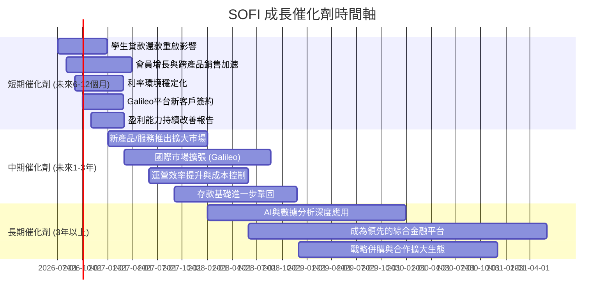

### 8.2 TAM 市場規模分析

SOFI 業務覆蓋的潛在市場規模 (Total Addressable Market, TAM) 巨大，包括個人貸款、學生貸款、房屋貸款、數位銀行、投資和金融科技基礎設施等。

```
╔══════════════════════════════════════════════════════════════════╗
║                   SOFI TAM 市場規模分析                          ║
╠══════════════════════════════════════════════════════════════════╣
║                                                                  ║
║  核心借貸市場 (個人/學生/房屋)：                                  ║
║  TAM: $3.0T+ (每年)                                              ║
║  SOFI 收入貢獻 (TTM): $2.41B (淨利息收入)                         ║
║  滲透率: 低 (仍在初期擴張階段)                                    ║
║                                                                  ║
║  金融科技平台市場 (Galileo)：                                     ║
║  TAM: $100B+ (全球)                                              ║
║  SOFI 收入貢獻 (TTM): 部分非利息收入 $1.53B                       ║
║  滲透率: 中 (領先但競爭激烈)                                      ║
║                                                                  ║
║  數位銀行/投資市場：                                              ║
║  TAM: $500B+ (每年)                                              ║
║  SOFI 收入貢獻 (TTM): 部分非利息收入 $1.53B                       ║
║  滲透率: 低 (新興市場，競爭者眾)                                  ║
║                                                                  ║
║  📊 總結：SOFI 面臨的 TAM 廣闊，目前的收入和滲透率表明其仍有巨大的成長空間。 ║
╚══════════════════════════════════════════════════════════════════╝
```

### 8.3 成長驅動力結構圖

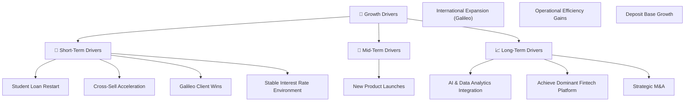

---

## 9. 風險矩陣

SOFI 作為一家金融科技公司，面臨多重風險，投資者應審慎評估。

### 9.1 風險評分矩陣

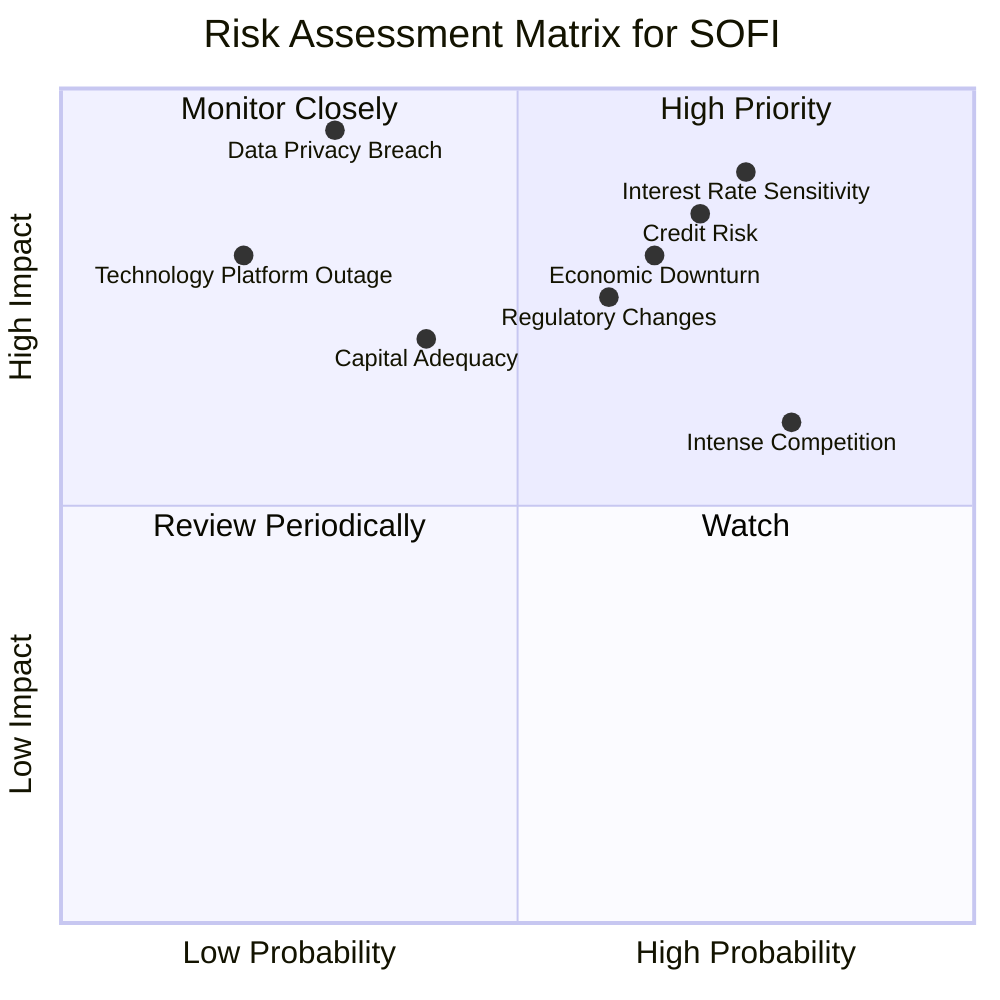

### 9.2 風險清單詳細分析

| # | 風險項目 | 發生機率 | 財務衝擊 | 風險評分 | 緩解措施 |
|---|----------|----------|----------|----------|----------|
| 1 | 🔴 **信用風險** | 高 (70%) | 高 (-X%淨利) | 🔴 8.5/10 | 嚴格的貸款審批標準、多元化貸款組合、加強風險模型管理、定期進行壓力測試。 |
| 2 | 🔴 **利率波動敏感性** | 高 (75%) | 高 (-X%淨利息收入) | 🔴 9.0/10 | 實施資產負債管理策略、利用衍生工具對沖利率風險、優化存款成本結構、調整貸款產品定價。 |
| 3 | 🟡 **監管政策變動** | 中 (60%) | 中 (-X%營收) | 🟡 7.5/10 | 積極參與監管對話、確保合規性、保持與監管機構的良好關係、提前適應潛在法規變化。 |
| 4 | 🟡 **市場競爭加劇** | 高 (80%) | 中 (-X%市場份額) | 🟡 6.0/10 | 強化品牌建設、提升產品創新、優化用戶體驗、擴大跨產品銷售、利用技術平台優勢。 |
| 5 | 🟡 **技術平台中斷** | 低 (20%) | 高 (-X%營運能力) | 🟡 8.0/10 | 建立高可用性系統架構、實施嚴格的災難恢復計劃、定期進行安全審計和滲透測試。 |
| 6 | 🟡 **資本適足性** | 中 (40%) | 中 (-X%增長空間) | 🟡 7.0/10 | 保持穩健的盈利能力、有效管理風險加權資產、適時進行股權或債務融資以補充資本。 |
| 7 | 🔴 **數據隱私洩露** | 低 (30%) | 極高 (-X%品牌價值) | 🔴 9.5/10 | 投資頂級網絡安全技術、實施嚴格的數據加密和訪問控制、員工安全意識培訓、遵守相關數據保護法規。 |
| 8 | 🟡 **經濟下行風險** | 中 (65%) | 高 (-X%營收/淨利) | 🟡 8.0/10 | 調整貸款審批標準、增加信用損失撥備、多元化收入來源、保持充足的流動性。 |

---

## 10. 投資建議

### 10.1 最終綜合評級雷達圖

```
╔══════════════════════════════════════════════════════════════════╗
║                    📊 SOFI 最終綜合評級                          ║
╠══════════════════════════════════════════════════════════════════╣
║ 基本面強度  7.0 ▓▓▓▓▓▓▓▓▓▓▓▓▓▓░░░░░░  ★★★★☆           ║
║ 成長動能    8.0 ▓▓▓▓▓▓▓▓▓▓▓▓▓▓▓▓░░░░  ★★★★☆           ║
║ 獲利品質    7.0 ▓▓▓▓▓▓▓▓▓▓▓▓▓▓░░░░░░  ★★★★☆           ║
║ 財務健康    6.0 ▓▓▓▓▓▓▓▓▓▓▓▓░░░░░░░░  ★★★☆☆           ║
║ 估值合理性  7.0 ▓▓▓▓▓▓▓▓▓▓▓▓▓▓░░░░░░  ★★★★☆           ║
║ 護城河深度  7.0 ▓▓▓▓▓▓▓▓▓▓▓▓▓▓░░░░░░  ★★★★☆           ║
║ 管理層執行  7.0 ▓▓▓▓▓▓▓▓▓▓▓▓▓▓░░░░░░  ★★★★☆           ║
║ 技術創新力  8.0 ▓▓▓▓▓▓▓▓▓▓▓▓▓▓▓▓░░░░  ★★★★☆           ║
╠══════════════════════════════════════════════════════════════════╣
║ 綜合總分    7.2 ▓▓▓▓▓▓▓▓▓▓▓▓▓▓▓░░░░░  🏆 具備良好成長潛力  ║
╚══════════════════════════════════════════════════════════════════╝
```

### 10.2 目標價與隱含報酬率

基於 DCF 分析和市場評估，SOFI 的目標價區間及潛在報酬率如下：

| 情境 | 目標價 | 隱含報酬率 (與當前股價 $18.24 相比) | 機率權重 | 加權目標價 |
|------|--------|------------------------------------|----------|------------|
| 🟢 **樂觀** | $29.50 | +61.73% | 25% | $7.38 |
| 🟡 **基準** | $26.00 | +42.54% | 50% | $13.00 |
| 🔴 **悲觀** | $20.50 | +12.39% | 25% | $5.13 |
| **加權平均目標價** | **$25.51** | **+39.86%** | **100%** | **$25.51** |

**投資建議**：基於 SOFI 強勁的營收增長、成功的轉虧為盈、銀行牌照帶來的競爭優勢以及廣闊的市場潛力，我們給予 **「買入」** 評級。綜合加權平均目標價為 **$25.51**，較當前股價 $18.24 有近 40% 的上漲空間。

### 10.3 買入時機與觸發因素

```
╔══════════════════════════════════════════════════════════════════╗
║                  ✅ 買入觸發因素 Checklist                      ║
╠══════════════════════════════════════════════════════════════════╣
║                                                                  ║
║  立即買入觸發條件（多數符合）：                                  ║
║  ✅ 公司已實現連續盈利，並持續改善淨利率                           ║
║  ✅ 總營收 YoY 成長率維持在 30% 以上                            ║
║  ✅ 會員數和產品採用率持續快速增長                                ║
║  ✅ 學生貸款業務重啟帶來營收和盈利增長                            ║
║  ✅ 股價在 52 周低點 $14.92 附近或出現底部反轉信號                 ║
║                                                                  ║
║  加碼觸發條件（出現以下任一）：                                  ║
║  ☐ 營收和淨利潤超預期，且管理層上調全年指引                       ║
║  ☐ ROIC 開始持續超越 WACC，顯示價值創造能力提升                   ║
║  ☐ Galileo 平台簽下大型新客戶或拓展國際市場成功                   ║
║  ☐ 宏觀經濟環境改善，信用風險降低                                 ║
║                                                                  ║
║  減碼/停損觸發條件（出現以下任一）：                             ║
║  ☐ 營收增長顯著放緩，且盈利能力惡化                               ║
║  ☐ 信用損失撥備大幅增加，貸款質量惡化                             ║
║  ☐ 監管環境出現重大不利變化，影響核心業務                         ║
║  ☐ 競爭加劇導致市場份額和利潤率下降                               ║
╚══════════════════════════════════════════════════════════════════╝
```

### 10.4 投資人適配度分析

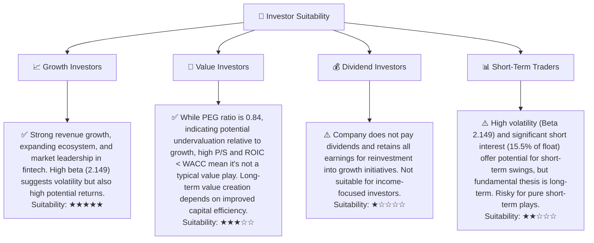

### 10.5 關鍵監控指標

| 監控類型 | 指標 | 關注點 | 頻率 |
|----------|------|--------|------|
| **營收成長** | 總營收 YoY 成長率 | 是否能維持 30%+ 成長，各業務板塊貢獻 | 每季 |
| **盈利能力** | 淨利率、營業利益率 | 利潤率是否持續改善，費用控制情況 | 每季 |
| **資本效率** | ROIC vs WACC | ROIC 是否能縮小與 WACC 的差距並超越 WACC | 每年 |
| **信用質量** | 信用損失撥備、拖欠率 | 貸款組合健康狀況，風險管理有效性 | 每季 |
| **會員增長** | 總會員數、產品採用率 | 會員獲取成本，跨產品銷售效果 | 每季 |
| **流動性** | 存款增長、淨現金狀況 | 資金成本優化，財務靈活性 | 每季 |
| **估值** | Forward P/E、P/S | 相對同業和歷史區間的估值水平 | 每月 |

---

> **免責聲明**：本報告為 AI 自動生成，僅供研究參考，不構成投資建議。投資有風險，入市需謹慎。