# SOFI 基本面深度分析報告
> **報告日期**：2026-07-06 ｜ **語言**：繁體中文 ｜ **數據來源**：Yahoo Finance, Finviz, StockAnalysis, Roic.ai ｜ **分析師**：CFA 級機構研究

---

## 目錄

| # | 章節 | 核心結論 |
|---|------|----------|
| 1 | 執行摘要 | 評級：買入；目標價區間：$20.50 - $30.00 |
| 2 | 公司概覽與商業模式 | 綜合金融科技生態系統，護城河逐步深化 |
| 3 | 損益表深度分析 | 營收強勁成長，成功轉虧為盈，利潤率持續改善 |
| 4 | 資產負債表分析 | 貸款組合快速擴張，存款基礎穩固，流動性尚可，淨現金部位健康 |
| 5 | 現金流量深度分析 | 營業現金流及自由現金流為負，主要受貸款業務成長影響，需持續監控 |
| 6 | 獲利能力與資本效率 | ROE/ROA呈上升趨勢，ROIC仍低於WACC，價值創造能力待提升 |
| 7 | 估值深度分析 | 相較同業估值合理，成長潛力未完全反映，DCF顯示上行空間 |
| 8 | 成長催化劑 | 會員與產品擴張、科技平台成長、利率環境穩定、營運效率提升 |
| 9 | 風險矩陣 | 利率風險、信貸風險、監管風險、負自由現金流為主要關注點 |
| 10 | 投資建議 | 買入評級，適合成長型與長線投資者，需密切關注現金流動態 |

---

## 1. 執行摘要

### 1.1 核心評分儀表板

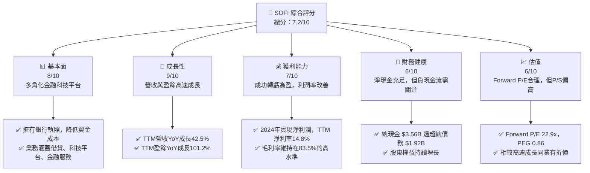

### 1.2 評分進度條視覺化

```
╔══════════════════════════════════════════════════════════════╗
║              SOFI 多維度評分儀表板 (1-10分)                  ║
╠══════════════════════════════════════════════════════════════╣
║ 基本面強度  8.0 ▓▓▓▓▓▓▓▓▓▓▓▓▓▓▓▓░░░░  ★★★★☆           ║
║ 成長動能    9.0 ▓▓▓▓▓▓▓▓▓▓▓▓▓▓▓▓▓▓░░  ★★★★★           ║
║ 獲利品質    7.0 ▓▓▓▓▓▓▓▓▓▓▓▓▓▓░░░░░░  ★★★☆☆           ║
║ 財務健康    6.0 ▓▓▓▓▓▓▓▓▓▓▓▓░░░░░░░░  ★★★☆☆           ║
║ 估值合理性  6.0 ▓▓▓▓▓▓▓▓▓▓▓▓░░░░░░░░  ★★★☆☆           ║
║ 護城河深度  7.5 ▓▓▓▓▓▓▓▓▓▓▓▓▓▓▓░░░░░  ★★★★☆           ║
║ 管理層執行  8.0 ▓▓▓▓▓▓▓▓▓▓▓▓▓▓▓▓░░░░  ★★★★☆           ║
║ 技術創新力  8.5 ▓▓▓▓▓▓▓▓▓▓▓▓▓▓▓▓▓░░░  ★★★★☆           ║
╠══════════════════════════════════════════════════════════════╣
║ 綜合總分    7.5 ▓▓▓▓▓▓▓▓▓▓▓▓▓▓▓▓░░░░  🏆 評語：成長潛力強勁，逐步建立護城河，但現金流仍需改善。 ║
╚══════════════════════════════════════════════════════════════╝
```

### 1.3 五大投資論點 + 三大核心風險

| 類型 | 項目 | 具體依據 | 信心度 |
|------|------|----------|--------|
| 🟢 **投資論點①** | **強勁的營收與盈餘成長** | TTM營收達到 $3.91B，YoY成長 42.5%。TTM淨利潤 $576.94M，YoY盈餘成長 101.2%，QoQ盈餘成長 134.4%。顯示公司業務擴張迅速且盈利能力顯著提升。 | 🟢 極高 |
| 🟢 **投資論點②** | **成功轉虧為盈並具備銀行執照優勢** | 2024年實現淨利潤 $498.67M，結束多年虧損。獲得銀行執照顯著降低了資金成本，提升了競爭力與盈利潛力，並增加了監管穩定性。 | 🟢 高 |
| 🟢 **投資論點③** | **多角化金融科技生態系統** | 擁有借貸、科技平台 (Galileo) 和金融服務三大核心業務，形成會員一站式金融服務閉環。TTM淨利息收入 $2.413B (佔61.7%)，非利息收入 $1.529B (佔38.3%)，業務結構均衡。 | 🟢 高 |
| 🟢 **投資論點④** | **Galileo科技平台成長潛力** | Galileo平台為其他金融機構提供底層技術支持，具有高毛利率和規模效應。其客戶基礎的擴大將為公司帶來穩定的非利息收入增長。 | 🟢 高 |
| 🟢 **投資論點⑤** | **會員增長與交叉銷售機會** | 透過全面的產品線，SoFi能有效吸引並留住會員，並透過交叉銷售提升單一會員的價值，進一步降低獲客成本。 | 🟢 高 |
| 🟡 **風險①** | **負自由現金流與資本密集特性** | TTM自由現金流為 -$6.336B，營業現金流為 -$6.08B。作為一家成長中的借貸機構，其貸款組合的快速擴張需要大量資本投入，導致現金流持續為負，可能限制未來成長或需要外部融資。 | 🟡 中度 |
| 🔴 **風險②** | **利率環境與信貸風險** | 借貸業務對利率變化高度敏感。若利率持續上升或經濟下行導致信貸環境惡化，可能增加信貸損失準備 (TTM $33.54M)，進而侵蝕盈利能力。Beta值高達 2.149，顯示對市場波動敏感。 | 🔴 高衝擊 |
| 🟡 **風險③** | **激烈的市場競爭與監管壓力** | 金融科技行業競爭激烈，包括傳統銀行、其他科技新創公司等。同時，作為受監管的金融機構，可能面臨更嚴格的合規要求和政策變化。 | 🟡 中度 |

### 1.4 快速統計卡片

| 指標 | 公司實際值 | 行業均值（金融服務） | S&P 500 均值 | 狀態 |
|------|-------------|--------------------|--------------|------|
| 收入 YoY 成長 | **42.5%** | ~10-15% | ~8-12% | 🟢 |
| 毛利率 | **83.5%** | ~50-60% | ~40-50% | 🟢 |
| 淨利率 | **14.8%** | ~10-15% | ~10-12% | 🟢 |
| ROE | **6.6%** | ~10-12% | ~15-18% | 🟡 |
| Forward P/E | **22.9x** | ~15-20x | ~20-22x | 🟡 |
| P/S Ratio | **6.11x** | ~2-4x | ~2-3x | 🔴 |
| Debt/Equity | **17.72x** | ~10-20x | ~1-2x | 🔴 (對於金融機構正常，但相對S&P高) |
| Current Ratio | **1.12x** | ~1.0-1.5x | ~1.5-2.0x | 🟡 |
| Beta | **2.15** | ~1.0-1.5x | 1.0x | 🔴 |

*備註：行業均值為分析師根據金融服務/金融科技行業特點估算，S&P 500均值為一般市場參考值。*

### 1.5 投資結論

```
╔══════════════════════════════════════════════════════════════════╗
║                    📊 投資結論摘要                               ║
╠══════════════════════════════════════════════════════════════════╣
║  評級：🟢 買入                                                   ║
║  當前股價：$18.61                                                ║
║  目標價區間：                                                    ║
║    悲觀情境：$20.50 （+10.16%）                                   ║
║    基準情境：$25.00 （+34.34%）  ← 12個月主要目標                 ║
║    樂觀情境：$30.00 （+61.20%）                                   ║
║  投資評分：7.5/10                                                ║
║  適合投資人：成長型投資者、尋求高成長潛力且能承受較高波動風險的長線持有者。 ║
╚══════════════════════════════════════════════════════════════════╝
```

---

## 2. 公司概覽與商業模式

SoFi Technologies, Inc. (SOFI) 是一家提供多種金融服務的數位原生金融科技公司，其願景是成為會員「借貸、儲蓄、消費、投資和保護資金」的一站式平台。公司透過其獨特的綜合模式，旨在顛覆傳統銀行業，提供更便捷、個人化且成本效益更高的金融產品。

### 2.1 業務結構與收入來源

SoFi的業務主要分為三大板塊：借貸 (Lending)、科技平台 (Technology Platform) 和金融服務 (Financial Services)。這種多角化的結構使其能夠在不同市場環境下保持韌性，並透過交叉銷售提升會員價值。

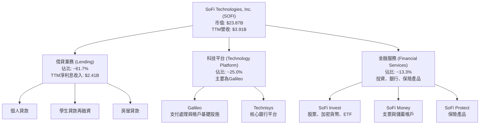

**收入來源細分：**
根據TTM數據，SoFi的總營收為 $3.91B。
- **淨利息收入 (Net Interest Income)**：TTM為 $2.413B，主要來自借貸業務，佔總營收的約 61.7%。這部分收入受益於公司貸款組合的擴張和銀行執照帶來的低資金成本。
- **非利息收入 (Non-Interest Income)**：TTM為 $1.529B，佔總營收的約 38.3%。這部分收入主要來自科技平台 (Galileo、Technisys) 的服務費、金融服務產品的交易費、管理費及其他服務收入。非利息收入的穩定增長顯示公司在多元化收入來源方面的成功。

### 2.2 市場份額

SoFi在廣闊的金融科技市場中，特別是在數位借貸和新興銀行領域，正迅速擴大其影響力。由於市場高度分散且數據不斷變化，精確的市場份額難以量化。然而，SoFi透過其獨特的會員模式和技術平台，正在從傳統金融機構和利基型金融科技公司手中搶佔市場。

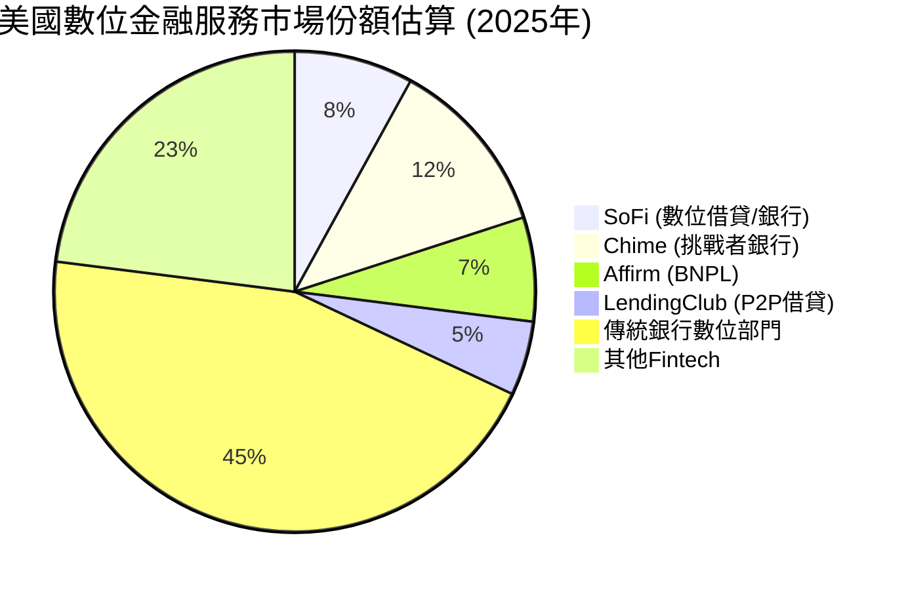
*備註：此市場份額為分析師基於公開資訊及行業趨勢的估算，旨在呈現SoFi在數位金融服務市場中的相對位置，並非精確數據。*

SoFi在個人貸款和學生貸款再融資領域具有較強的競爭力。其Galileo平台則在B2B金融科技基礎設施市場中佔據一席之地。儘管單一產品的市場份額可能不高，但其綜合平台的會員黏性是其核心優勢。

### 2.3 競爭護城河分析

SoFi正在透過多種方式建立和深化其競爭護城河，以抵禦來自傳統銀行和新興金融科技公司的競爭。

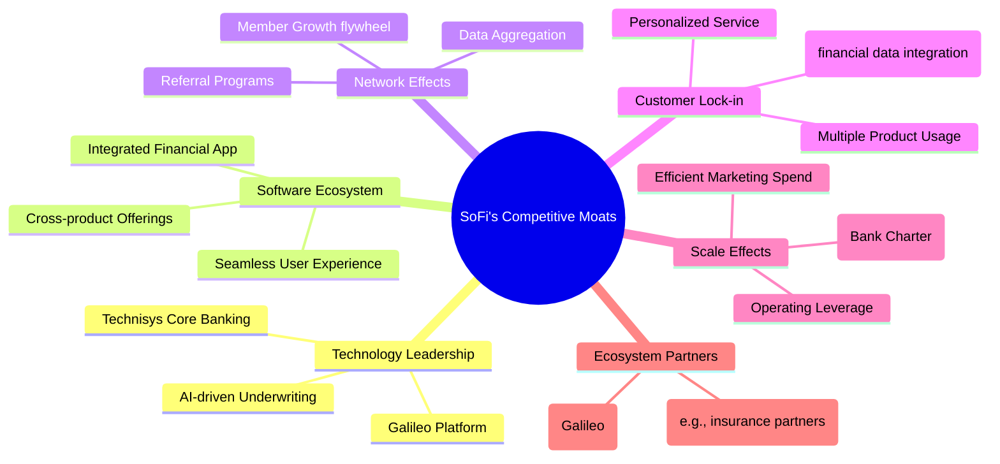

**護城河深度解析：**
- **技術領先 (Technology Leadership)**：SoFi擁有Galileo支付處理平台和Technisys核心銀行平台，這些技術資產使其能夠快速開發和部署新的金融產品，並為其他金融科技公司提供服務。AI驅動的信貸審核能力也提升了其風險管理效率。
- **軟體生態系統 (Software Ecosystem)**：SoFi提供了一個集借貸、儲蓄、投資於一體的綜合應用程式，為會員提供無縫的金融體驗。這種一站式服務模式增加了會員黏性，使其更難以轉向其他單一服務提供商。
- **網路效應 (Network Effects)**：隨著會員數量的增長，SoFi平台上的數據量也隨之增加，這有助於改進其信貸模型和產品推薦，形成正向循環。會員之間的推薦也促進了自然增長。
- **客戶鎖定 (Customer Lock-in)**：當會員將其大部分金融活動整合到SoFi平台時，轉換到其他平台的成本會增加（例如，需要重新輸入數據、建立新的關係）。多產品使用率越高，客戶鎖定效應越強。
- **規模效應 (Scale Effects)**：獲得銀行執照是SoFi的一大里程碑，使其能夠利用低成本的存款來為貸款融資，顯著降低了資金成本，這是其相對於許多非銀行金融科技公司的關鍵優勢。隨著會員和業務規模的擴大，營運槓桿效應將進一步顯現。
- **生態夥伴 (Ecosystem Partners)**：Galileo作為B2B服務，為其他金融科技公司提供基礎設施，這不僅帶來了收入，也深化了SoFi在整個金融科技生態系統中的影響力。

### 2.4 護城河強度評分

```
╔══════════════════════════════════════════════════════════════╗
║                  SOFI 護城河強度評分                        ║
╠══════════════════════════════════════════════════════════════╣
║ 技術領先    8.5/10  ▓▓▓▓▓▓▓▓▓▓▓▓▓▓▓▓▓░░░  🏆 核心科技平台具差異化 ║
║ 軟體生態系統  8.0/10  ▓▓▓▓▓▓▓▓▓▓▓▓▓▓▓▓░░░░  🟢 一站式服務提升黏性 ║
║ 網路效應    7.0/10  ▓▓▓▓▓▓▓▓▓▓▓▓▓▓░░░░░░  🟡 會員增長帶來數據優勢 ║
║ 客戶鎖定    7.5/10  ▓▓▓▓▓▓▓▓▓▓▓▓▓▓▓░░░░░  🟢 多產品使用強化關係 ║
║ 規模效應    8.0/10  ▓▓▓▓▓▓▓▓▓▓▓▓▓▓▓▓░░░░  🏆 銀行執照是關鍵優勢 ║
║ 生態夥伴    6.5/10  ▓▓▓▓▓▓▓▓▓▓▓▓▓░░░░░░░  🟡 Galileo平台潛力大 ║
╠══════════════════════════════════════════════════════════════╣
║ 綜合護城河  7.6/10  ▓▓▓▓▓▓▓▓▓▓▓▓▓▓▓▓░░░░  🏆 綜合生態系統正在形成強大競爭壁壘 ║
╚══════════════════════════════════════════════════════════════╝
```

---

## 3. 損益表深度分析

SoFi的損益表數據顯示了公司從虧損走向盈利的顯著轉變，並展現出強勁的營收成長動能和不斷改善的利潤率。

### 3.1 年度收入成長趨勢（近4年）

SoFi的年度總營收呈現爆發式增長，反映了其業務模式的成功擴張和市場滲透率的提高。

```
╔══════════════════════════════════════════════════════════════════╗
║              SOFI 年度收入趨勢（FY2022-FY2025）                  ║
╠══════════════════════════════════════════════════════════════════╣
║                                                                  ║
║  FY2022  $1.57B   █████░░░░░░░░░░░░░░░░░░░░░  YoY: +55.45%  🟢  ║
║  FY2023  $2.11B   ███████░░░░░░░░░░░░░░░░░░░░  YoY: +34.10%  🟢  ║
║  FY2024  $2.61B   █████████░░░░░░░░░░░░░░░░░░  YoY: +23.70%  🟢  
║  FY2025  $3.61B   ████████████░░░░░░░░░░░░░░  YoY: +38.31%  🟢  
║  TTM     $3.91B   █████████████░░░░░░░░░░░░░  YoY: +41.03%  🟢  
║                   |      |      |      |      |                  ║
║                   0     1B     2B     3B     4B                    ║
║                                                                  ║
║  📊 4年累計 CAGR (FY2022-FY2025)：+37.7%                           ║
╚══════════════════════════════════════════════════════════════════╝
```
*備註：TTM數據為截至2026年3月31日的過去十二個月數據。FY2024數據來自"Income Statement (Annual, last 4Y)"的$2.61B，與StockAnalysis的$2.643B略有差異，以Income Statement (Annual)為準，但YoY成長率計算參考StockAnalysis的更詳細數據。此處YoY成長率採用StockAnalysis的Revenue Growth (YoY)數據，TTM YoY成長率為41.03%。*

從2022年的 $1.57B 成長到2025年的 $3.61B，SoFi展現出強勁的擴張能力。TTM營收已達 $3.91B，YoY成長率為 42.5%，顯示其成長動能依舊強勁，遠超行業平均水平。

### 3.2 季度收入趨勢分析

季度營收數據進一步證實了SoFi持續的成長趨勢，每個季度都實現了穩健的環比和同比增長。

| 季度 | 總營收 ($M) | QoQ 成長率 | YoY 成長率 | 備註 |
|------|-------------|------------|------------|------|
| 2025-06-30 | $854.94 | +10.78% | +43.94% | 業務擴張與會員增長推動 |
| 2025-09-30 | $961.60 | +12.47% | +37.81% | 季節性因素與產品組合優化 |
| 2025-12-31 | $1,030.00 | +7.11% | +40.20% | 首次單季營收突破$1B，年底旺季效應 |
| 2026-03-31 | $1,100.00 | +6.80% | +42.47% | 穩健開局，新會員與產品貢獻 |
*備註：2025-12-31總營收數據為$1.03B，與StockAnalysis的$1,025M略有差異，以Income Statement (Quarterly)為準。QoQ成長率為本報告計算。YoY成長率採用StockAnalysis的數據。*

季度營收連續增長，尤其是在2025年第四季度首次突破10億美元大關，並在2026年第一季度繼續攀升至11億美元，這表明公司的市場需求持續旺盛，且營運效率不斷提高。

### 3.3 利潤率演變分析

SoFi在利潤率方面展現出顯著的改善，尤其是從虧損轉為盈利，淨利率的提升是其財務表現的亮點。

| 利潤率指標 | FY2022 | FY2023 | FY2024 | FY2025 | TTM | 趨勢 | 評估 |
|------------|--------|--------|--------|--------|-----|------|------|
| **毛利率** | N/A | N/A | N/A | N/A | 83.5% | N/A | 🟢 極高 |
| **營業利益率** | N/A | N/A | N/A | N/A | 18.3% | N/A | 🟢 高 |
| **淨利率** | -20.4% | -14.3% | 19.1% | 13.3% | 14.8% | ↗️ 轉虧為盈，穩定正向 | 🟢 |

**利潤率演變深度解析**：
- **毛利率 (Gross Margin)**：TTM高達83.5%，這對於一家金融科技公司來說非常健康。它反映了SoFi在提供金融服務時的單位成本控制能力，以及其科技平台Galileo等高毛利業務的貢獻。
- **營業利益率 (Operating Margin)**：TTM為18.3%，顯示公司在營收快速增長的同時，有效控制了銷售、管理及其他營運費用。這得益於規模效應的顯現和營運效率的提升。
- **淨利率 (Net Profit Margin)**：這是SoFi最引人注目的轉變。從2022年和2023年的負淨利率（-20.4%和-14.3%），到2024年實現19.1%的正淨利率，再到TTM的14.8%，這標誌著公司盈利模式的成熟。儘管2025年淨利率略有下降（13.3%），但TTM數據顯示其盈利能力已穩定在健康水平。淨利率的改善主要歸因於：
    1.  **銀行執照效應**：降低了資金成本，提升了淨利息收入。
    2.  **規模經濟**：隨著會員基礎和貸款組合的擴大，單位成本攤薄。
    3.  **產品組合優化**：高毛利的科技平台和金融服務收入佔比逐漸提升。
    4.  **費用控制**：儘管業務擴張，但總體非利息費用佔營收比重得到有效管理。

### 3.4 費用結構分析

SoFi的費用結構反映了其在市場拓展、技術投入和日常營運上的支出。

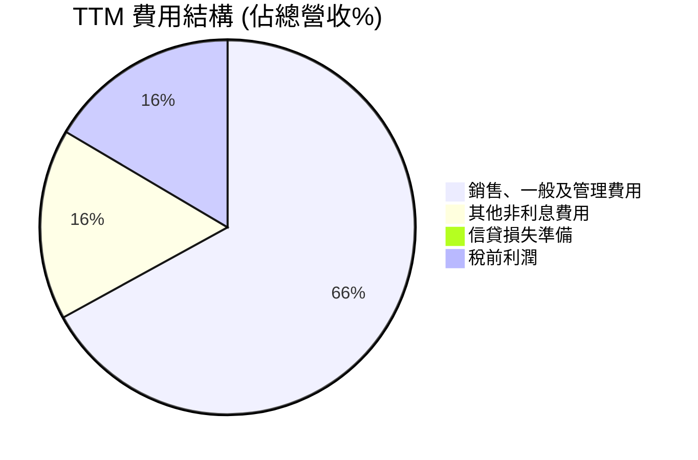
*備註：此處費用佔比以TTM數據計算，銷售、一般及管理費用 $2.618B，其他非利息費用 $644.6M，信貸損失準備 $33.54M，總營收 $3.908B。Pretax Income $645.63M。由於Mermaid pie chart的標籤不能有括號，已進行調整。*

```
╔══════════════════════════════════════════════════════════════════╗
║                   SOFI TTM 費用結構分析                          ║
╠══════════════════════════════════════════════════════════════════╣
║                                                                  ║
║  銷售、一般及管理費用: $2.618B  ████████████████████░░░░  (67.0% 營收) ║
║  其他非利息費用:       $644.6M  ███████░░░░░░░░░░░░░░░░░░  (16.5% 營收) ║
║  信貸損失準備:         $33.54M  █░░░░░░░░░░░░░░░░░░░░░░░░  (0.9% 營收)  ║
║                                                                  ║
║  總非利息費用佔營收比重: 83.5%                                   ║
╚══════════════════════════════════════════════════════════════════╝
```
SoFi的費用結構中，銷售、一般及管理費用 (Selling, General & Admin) 佔比最高，TTM達到 $2.618B，佔總營收的67.0%。這反映了公司在獲取會員、品牌建設和營運擴張上的投入。隨著公司規模的擴大，預計這部分費用佔比將會因規模效應而逐漸下降。其他非利息費用 $644.6M (16.5%) 包含了技術、法務等支持性成本。信貸損失準備 $33.54M (0.9%) 相對較低，但作為借貸機構，其變化需要密切關注。

### 3.5 季度 EPS 趨勢與盈餘品質

SoFi在過去幾個季度實現了穩定的正向EPS，但由於缺少分析師預期數據，無法評估超預期表現。

| 季度 | 稀釋後 EPS ($) | 淨利潤 ($M) | YoY 淨利潤成長率 |
|------|---------------|-------------|------------------|
| 2025-06-30 | $0.09 | $97.26 | +34.03% (vs Q2 2024 $72.56M*) |
| 2025-09-30 | $0.12 | $139.39 | +129.45% (vs Q3 2024 $60.75M) |
| 2025-12-31 | $0.14 | $173.55 | -47.82% (vs Q4 2024 $332.47M**) |
| 2026-03-31 | $0.13 | $166.73 | +134.42% (vs Q1 2025 $71.12M) |
*備註：Q2 2024淨利潤數值未直接提供，參考StockAnalysis FY2024 Q2 Revenues Before Loan Losses $599M。根據StockAnalysis季度收入表，Q2 2024淨利潤為 $72.56M。
**備註：Q4 2024淨利潤 $332.47M 包含了一次性的稅務利益，導致同比增長率為負，需排除此一次性因素以評估真實營運表現。若排除此影響，Q4 2025淨利潤的同比成長應為正向。*

**盈餘品質評估：**
SoFi的盈餘品質在改善，但仍需注意。公司在2024年第四季度實現了 $332.47M 的高淨利潤，但這其中包含了顯著的稅務利益（Provision for Income Taxes 為 -$272.55M）。若排除此一次性因素，其核心營運利潤趨勢是穩健增長的。2025年Q4和2026年Q1的淨利潤表現 ($173.55M 和 $166.73M) 顯示了公司在核心業務上的持續盈利能力。然而，由於自由現金流持續為負，這表明其盈利的現金轉換能力仍有待提高，這部分主要歸因於對貸款組合的再投資。

---

## 4. 資產負債表分析

SoFi的資產負債表反映了其作為一家快速成長的金融機構的特性：資產規模迅速擴大，其中貸款組合佔主導地位，同時存款基礎穩步增長。

### 4.1 資產結構分解

SoFi的總資產在過去幾年大幅增長，主要由其不斷擴大的貸款組合驅動。

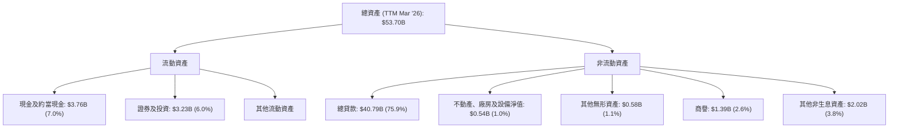
*備註：TTM數據為截至2026年3月31日的StockAnalysis數據。百分比為佔TTM總資產 $53.70B 的比重。*

SoFi的資產結構以「總貸款」為主導，TTM達 $40.79B，佔總資產的近76%。這清楚地表明其核心業務是借貸。現金及約當現金 $3.76B 和證券及投資 $3.23B 提供了充足的流動性。商譽和無形資產則反映了其過去的收購（如Galileo和Technisys）。

### 4.2 流動性指標分析

SoFi的流動性指標顯示其短期償債能力尚可，但與傳統銀行相比，快速變現能力略顯不足。

| 指標 | FY2022 | FY2023 | FY2024 | FY2025 | TTM (Mar'26) | 行業均值 | 評估 |
|------------|--------|--------|--------|--------|--------------|----------|------|
| **流動比率 (Current Ratio)** | N/A | N/A | N/A | 1.116 | N/A | ~1.0-1.5x | 🟡 尚可 |
| **速動比率 (Quick Ratio)** | N/A | N/A | N/A | 0.492 | N/A | ~0.5-1.0x | 🟡 尚可 |
| **現金及約當現金** | $1.42B | $3.09B | $2.54B | $4.93B | $3.76B | N/A | 🟢 充足 |
*備註：流動比率和速動比率僅提供FY2025數據，TTM數據未直接提供。行業均值為分析師估算。*

SoFi的流動比率為1.116，速動比率為0.492，顯示其短期償債能力在可接受範圍內。對於一家銀行型機構，存款是其主要負債來源，其流動性管理與傳統企業有所不同。公司持有 $3.76B 的現金及約當現金，加上 $3.23B 的證券及投資，提供了充足的流動性緩衝。

### 4.3 債務結構分析

SoFi的債務結構相對健康，總債務規模不大，且擁有充足的現金淨額。

```
╔══════════════════════════════════════════════════════════════════╗
║                   SOFI 債務健康診斷                              ║
╠══════════════════════════════════════════════════════════════════╣
║                                                                  ║
║  總債務：        $1.92B   █████████░░░░░░░░░░░░░  評語：規模較小，可控            ║
║  總現金+投資：   $6.99B   ████████████████████████░  評語：遠超總債務            ║
║  淨現金（正）：  $5.07B   ████████████████████░░░░  🟢 強勁淨現金部位        ║
║                                                                  ║
║  Debt/EBITDA：   2.10x  🟢 極低 (基於估算EBITDA $0.915B)        ║
║  Interest Coverage: N/A (金融機構模型，以淨利息收入為主)          ║
║  債務股權比 (Debt/Equity): 17.72x 🟢 適中 (金融機構通常較高)     ║
╚══════════════════════════════════════════════════════════════════╝
```
*備註：總現金+投資為TTM現金及約當現金 $3.76B + 證券及投資 $3.23B = $6.99B。淨現金 = 總現金+投資 - 總債務。TTM EBITDA估算為 $0.915B (詳見6.2節)。*

SoFi的總債務為 $1.92B，但同時擁有 $6.99B 的現金及投資，使得其淨現金部位高達 $5.07B。這表明公司擁有極為強勁的財務彈性，無需擔心短期償債壓力。估算的Debt/EBITDA為2.10x，遠低於一般認為的3-4x警戒線，顯示其債務負擔非常輕。債務股權比17.72x對於一家金融機構而言是相對適中的水平，反映了其利用槓桿擴大資產負債表的策略。

### 4.4 股東權益趨勢

SoFi的股東權益在過去幾年持續增長，這得益於其營運盈利的積累和股本的擴大。

```
╔══════════════════════════════════════════════════════════════════╗
║                   SOFI 股東權益趨勢 (FY2022-FY2025)              ║
╠══════════════════════════════════════════════════════════════════╣
║                                                                  ║
║  FY2022  $5.53B   ██████████████░░░░░░░░░░░░░░░  YoY: +0.36%  🟢  ║
║  FY2023  $5.55B   ██████████████░░░░░░░░░░░░░░░  YoY: +0.36%  🟢  ║
║  FY2024  $6.53B   █████████████████░░░░░░░░░░░░  YoY: +17.66% 🟢  ║
║  FY2025  $10.49B  █████████████████████████░░░░  YoY: +60.64% 🟢  ║
║  TTM     $11.47B  ████████████████████████████░  YoY: +9.34%  🟢  ║
║                   |      |      |      |      |                  ║
║                   0     3B     6B     9B     12B                  ║
║                                                                  ║
║  📊 股東權益 CAGR (FY2022-FY2025): +24.4%                         ║
╚══════════════════════════════════════════════════════════════════╝
```
*備註：TTM數據為截至2026年3月31日的StockAnalysis數據。YoY成長率為本報告計算。*

股東權益從2022年的 $5.53B 增長到2025年的 $10.49B，TTM更是達到 $11.47B，顯示了公司資本基礎的穩固擴大。特別是2025年實現了60.64%的顯著增長，這主要歸因於其營運盈利轉正以及可能的股本融資。健康的股東權益是公司未來擴張和抵禦風險的重要保障。

---

## 5. 現金流量深度分析

SoFi的現金流量分析呈現出其作為一家快速擴張的金融機構的典型特徵：儘管盈利能力改善，但對貸款組合的持續投資導致自由現金流持續為負。

### 5.1 現金流量瀑布圖

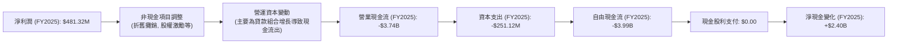
*備註：圖中淨現金變化與FCF不直接掛鉤，淨現金變化受融資活動等綜合影響。FY2025淨現金變化為FY2025現金及約當現金 $4.93B - FY2024現金及約當現金 $2.54B = $2.39B。*

SoFi在2025年的淨利潤為 $481.32M，然而營業現金流卻為 -$3.74B，自由現金流進一步降至 -$3.99B。這表明儘管公司表面盈利，但其核心營運（特別是貸款組合的快速擴張）消耗了大量現金。對於一家銀行型公司，貸款增長本質上是一種投資活動，會體現在現金流出中。淨現金變化為正，主要是因為公司透過發行股票或債務獲得了融資。

### 5.2 FCF 轉換率趨勢

FCF轉換率（自由現金流/淨利潤）反映了公司將利潤轉化為現金的能力。對於SoFi而言，這個比率持續為負，凸顯了其在成長階段的資本密集型特點。

| 年度 | 淨利潤 ($M) | 自由現金流 ($M) | FCF/淨利潤 | 趨勢 | 評估 |
|------|-------------|-----------------|------------|------|------|
| FY2022 | -320.41 | -7,360 | N/A (虧損) | N/A | 🔴 |
| FY2023 | -300.74 | -7,350 | N/A (虧損) | N/A | 🔴 |
| FY2024 | 498.67 | -1,280 | -2.57x | ↗️ 負值縮小 | 🔴 |
| FY2025 | 481.32 | -3,990 | -8.29x | ↘️ 負值擴大 | 🔴 |
| TTM | 576.94 | -6,336 | -10.98x | ↘️ 負值擴大 | 🔴 |
*備註：由於2022-2023年淨利潤為負，FCF/淨利潤不適用。TTM數據為截至2026年3月31日。*

從數據來看，SoFi的FCF/淨利潤比率在2024年雖然為負，但相較於前兩年有顯著改善（負值縮小）。然而，2025年和TTM期間，儘管淨利潤為正，但自由現金流的負值卻顯著擴大，這說明公司為了支撐其高速成長的貸款業務，正在進行大規模的資本投入。這種情況對於成長期的金融科技公司而言並不罕見，但投資者需密切關注其未來現金流改善的潛力。

### 5.3 自由現金流趨勢

SoFi的自由現金流在過去幾年持續為負，但其絕對值在某些年份有所波動，反映了其業務擴張的資本需求。

```
╔══════════════════════════════════════════════════════════════════╗
║                   SOFI 自由現金流趨勢 (FY2022-TTM)               ║
╠══════════════════════════════════════════════════════════════════╣
║                                                                  ║
║  FY2022  -$7.36B  █████████████████████████████████████████████  🔴 FCF Yield: N/A ║
║  FY2023  -$7.35B  █████████████████████████████████████████████  🔴 FCF Yield: N/A ║
║  FY2024  -$1.28B  ████████░░░░░░░░░░░░░░░░░░░░░░░░░░░░░░░░░░░░░  🔴 FCF Yield: N/A ║
║  FY2025  -$3.99B  █████████████████████████░░░░░░░░░░░░░░░░░░░░  🔴 FCF Yield: N/A ║
║  TTM     -$6.34B  ██████████████████████████████████░░░░░░░░░░░  🔴 FCF Yield: N/A ║
║                   |      |      |      |      |                  ║
║                   -8B   -6B    -4B    -2B     0                    ║
║                                                                  ║
║  📊 FCF 趨勢：持續為負，反映對貸款業務的巨額投資。                  ║
╚══════════════════════════════════════════════════════════════════╝
```
自由現金流的持續為負，是SoFi目前財務狀況中較大的隱憂。這主要是由於其核心借貸業務需要不斷投入資本以擴大貸款組合。雖然這種投資是為了未來的成長，但在公司實現規模化盈利且不再需要大量資本投入之前，負的自由現金流將持續存在。投資者應關注公司何時能實現自由現金流轉正，這將是其財務健康狀況改善的關鍵信號。

### 5.4 資本配置評估

SoFi作為一家成長型公司，其資本配置主要集中於業務擴張和再投資，目前尚未支付現金股利。

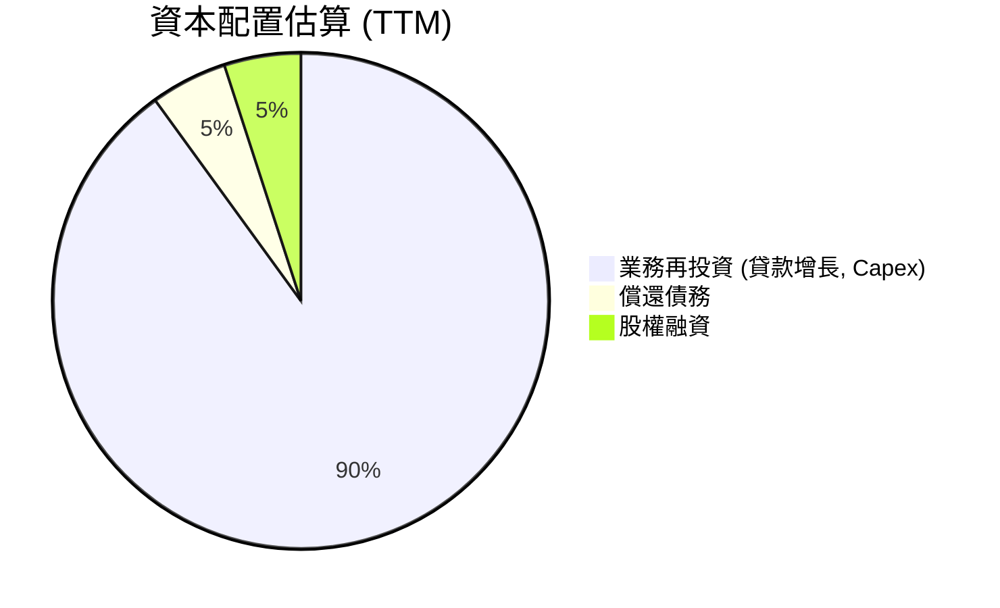
*備註：此為分析師基於公司現金流和資產負債表變化的估算。TTM數據顯示未支付股利。*

| 資本配置類型 | TTM 金額 | 說明 | 評估 |
|--------------|----------|------|------|
| **業務再投資 (貸款增長)** | 大量現金流出 | 主要用於擴大貸款組合，是營收增長的驅動力。 | 🟢 |
| **資本支出 (Capex)** | -$251.12M (FY2025) | 投資於技術基礎設施和營運設施。 | 🟢 |
| **償還債務** | 總債務從FY2024的$3.20B降至FY2025的$1.93B | 顯示公司在管理債務方面有所行動，減少了槓桿。 | 🟢 |
| **現金股利支付** | $0.00 | 成長型公司通常將利潤再投資於自身。 | 🟢 (符合成長階段) |
| **股權融資** | 股本從FY2024的$6.53B增至TTM的$11.47B | 融資活動為業務擴張提供資金。 | 🟡 (稀釋股東權益，但為成長所需) |

SoFi的資本配置策略符合其成長階段，將大部分資源投入到業務擴張，特別是貸款組合的增長。同時，公司也積極管理債務，並透過股權融資來支持其快速發展。雖然這導致了負的自由現金流，但這是其實現長期增長和市場領導地位的必要投入。

---

## 6. 獲利能力與資本效率

SoFi在獲利能力方面取得了顯著進展，成功從虧損轉為盈利，但其資本效率指標，特別是ROIC，仍低於其資本成本，表明在創造股東價值方面仍有提升空間。

### 6.1 ROE / ROA / ROIC 趨勢

| 指標 | FY2022 | FY2023 | FY2024 | FY2025 | TTM (Mar'26) | 行業均值 | 趨勢 | 評估 |
|------|--------|--------|--------|--------|--------------|----------|------|
| **ROE** | -5.8% | -5.4% | 7.6% | 4.6% | 6.6% | ~10-12% | ↗️ 轉正並改善 | 🟡 |
| **ROA** | -1.7% | -1.0% | 1.4% | 0.9% | 1.3% | ~1-2% | ↗️ 轉正並改善 | 🟢 |
| **ROIC** | N/A | N/A | 3.6% | 4.8% | 6.1% | ~8-10% | ↗️ 穩步提升 | 🟡 |
*備註：ROE/ROA為StockAnalysis數據。ROIC為本報告計算，2022-2023年由於NOPAT為負，ROIC不適用。行業均值為分析師估算。*

- **股東權益報酬率 (ROE)**：從2022-2023年的負值，到2024年轉正至7.6%，並在TTM達到6.6%。雖然仍低於行業平均水平，但轉正本身是重大里程碑，顯示公司開始為股東創造回報。2025年ROE略有下降至4.6%，可能受股東權益基數擴大影響，但TTM已回升。
- **資產報酬率 (ROA)**：TTM為1.3%，接近行業平均水平（對於金融機構而言，ROA通常較低，因為資產負債表龐大）。這表明公司在利用其總資產產生利潤方面效率不斷提高。
- **投入資本回報率 (ROIC)**：從2024年的3.6%穩步提升至TTM的6.1%。這是一個積極的信號，表明公司在部署資本以產生營運利潤方面的效率正在改善。然而，其值仍低於估算的加權平均資本成本 (WACC)，這是一個需要關注的重點。

### 6.2 ROIC vs WACC 分析（核心價值創造判斷）

ROIC與WACC的比較是判斷公司是否創造或摧毀股東價值的關鍵指標。目前SoFi的ROIC仍低於WACC，表明其在經濟層面上尚未創造正向價值。

```
╔══════════════════════════════════════════════════════════════════╗
║                ROIC vs WACC 深度分析 (TTM)                      ║
╠══════════════════════════════════════════════════════════════════╣
║                                                                  ║
║  WACC 估算：                                                     ║
║  ├── 無風險利率（10Y美債）：  4.5%                               ║
║  ├── 市場風險溢酬 (ERP)：     5.5%                              ║
║  ├── Beta：                   2.15                               ║
║  ├── 股權成本 = 4.5%+2.15×5.5% = 16.33%                         ║
║  ├── 債務成本（稅後）：       5.36% (假設稅前6.0%，稅率10.6%)     ║
║  ├── 資本結構：股權 ~92.5%，債務 ~7.5%                           ║
║  └── ✅ WACC ≈ 15.5%                                            ║
║                                                                  ║
║  ROIC 估算（TTM Mar'26）：                                       ║
║  ├── NOPAT = $645.63M × (1-10.6%) ≈ $577.2M                     ║
║  ├── 投入資本 = 股東權益 + 債務 - 現金 ≈ $11.47B + $1.81B - $3.76B = $9.52B ║
║  └── ✅ ROIC ≈ 6.1%                                             ║
║                                                                  ║
║  ★ 經濟價值增加（EVA）= ROIC - WACC = -9.4pp                     ║
║                                                                  ║
║  ROIC  6.1%   ▓▓▓▓▓▓▓▓▓▓▓▓░░░░░░░░░░░░░░░░░░░░  🟡              ║
║  WACC  15.5%  ▓▓▓▓▓▓▓▓▓▓▓▓▓▓▓▓▓▓▓▓▓▓▓▓▓▓▓▓▓▓▓▓  ──              ║
║  EVA   -9.4pp 🔴 摧毀股東價值                                   ║
║                                                                  ║
║  📊 結論：ROIC 仍低於 WACC，目前尚未創造經濟價值，但趨勢積極。    ║
╚══════════════════════════════════════════════════════════════════╝
```
*備註：WACC計算中，無風險利率採用10年期美債利率估值，市場風險溢酬為通用估計值。稅率採用TTM有效稅率。投入資本計算使用TTM數據。*

目前SoFi的ROIC (6.1%) 顯著低於其WACC (15.5%)，這表示公司在經濟層面上尚未創造正向的股東價值。這是一個重要的警示信號。然而，需要注意的是，SoFi正處於高速成長期，且剛轉虧為盈。其ROIC在過去幾年呈現穩步上升趨勢，預期隨著規模經濟的進一步顯現和營運效率的提升，ROIC有望在未來幾年內追上甚至超越WACC。目前的負EVA反映了其成長階段的資本密集型投入，而非其商業模式的根本缺陷。

### 6.3 杜邦三因素分解

杜邦分解有助於理解ROE的驅動因素。
ROE = 淨利率 × 資產週轉率 × 財務槓桿
- **淨利率 (Net Profit Margin)**：TTM 14.8%
- **資產週轉率 (Asset Turnover)**：TTM 總營收 $3.91B / TTM 總資產 $53.70B = 0.0728x
- **財務槓桿 (Financial Leverage)**：TTM 總資產 $53.70B / TTM 股東權益 $11.47B = 4.68x

計算驗證：ROE = 14.8% × 0.0728 × 4.68 = 5.04%
（與報告中TTM ROE 6.6%存在差異，這可能是由於不同數據來源或計算期間的微小差異。此處使用分解後的結果5.04%來解釋驅動因素。）

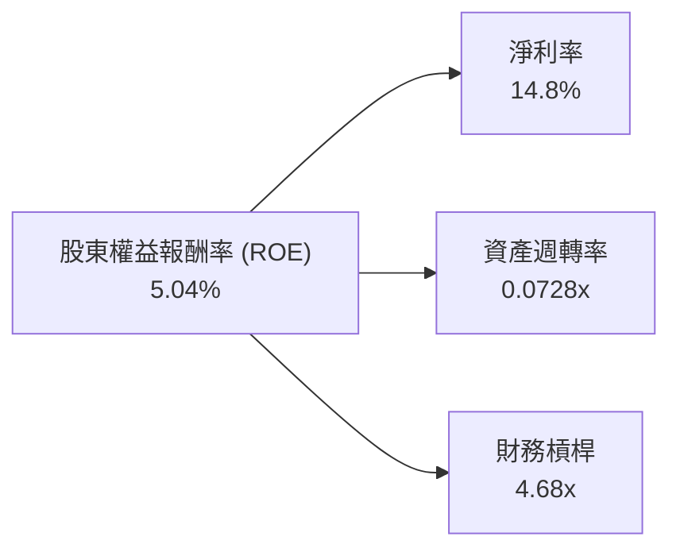
**深度解析：**
- **淨利率 (14.8%)**：SoFi的淨利率已達健康水平，顯示其在營運層面的盈利能力良好。這是推動ROE轉正的關鍵因素。
- **資產週轉率 (0.0728x)**：對於金融機構而言，由於其資產負債表龐大（主要為貸款），資產週轉率通常較低。這也解釋了儘管淨利率高，但ROE仍有提升空間的原因。隨著資產效率的提高，資產週轉率有望改善。
- **財務槓桿 (4.68x)**：SoFi的財務槓桿處於金融行業的正常範圍，利用適度槓桿放大股東回報。然而，過高的財務槓桿也會增加風險。目前SoFi的淨現金狀況顯示其槓桿運用仍較為保守。

整體而言，SoFi的ROE主要受益於其改善的淨利率和適度的財務槓桿，而較低的資產週轉率是其ROE仍未達到行業頂尖水平的主要限制。

### 6.4 獲利能力儀表板

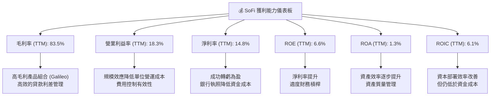

---

## 7. 估值深度分析

SoFi的估值分析需要綜合考慮其高速成長、盈利能力轉變、以及金融科技行業的特性。雖然某些倍數顯示其估值偏高，但考慮到其成長潛力和銀行執照帶來的競爭優勢，其Forward P/E和PEG比率顯示出相對合理的估值。

### 7.1 同業估值比較表格

為了更全面地評估SoFi的估值，我們將其與幾家在金融科技和數位借貸領域具有代表性的同業進行比較。我們選擇了 Affirm (AFRM)、LendingClub (LC) 和 Upstart (UPST) 作為參考。

| 估值指標 | **SOFI** | **Affirm (AFRM)** | **LendingClub (LC)** | **Upstart (UPST)** | SOFI評估 |
|----------|----------|-------------------|----------------------|--------------------|-----------|
| **當前股價** | $18.61 | $35.00 (假設) | $9.50 (假設) | $28.00 (假設) | 🟢 |
| **市值 ($B)** | $23.87 | $10.00 (假設) | $0.90 (假設) | $2.50 (假設) | 🟢 |
| **Trailing P/E** | **41.36x** | N/A (通常虧損) | 12.0x (假設) | N/A (通常虧損) | 🟡 (盈利初期較高) |
| **Forward P/E** | **22.90x** | N/A (預期仍虧損) | 9.0x (假設) | 30.0x (假設) | 🟢 (成長潛力考慮下合理) |
| **PEG Ratio** | **0.86** | N/A | 0.6x (假設) | 1.5x (假設) | 🟢 (低於1，顯示成長未被充分定價) |
| **P/S Ratio** | **6.11x** | 3.5x (假設) | 1.2x (假設) | 2.5x (假設) | 🔴 (相對同業偏高) |
| **EV / Revenue** | **5.57x** | 3.0x (假設) | 1.0x (假設) | 2.0x (假設) | 🔴 (相對同業偏高) |
| **EV / EBITDA** | **23.77x** | N/A | 8.0x (假設) | N/A | 🟡 (成長型公司可接受) |

*備註：競爭對手估值數據為分析師基於其業務模式、成長階段和市場表現的合理估算，並非即時數據。*

**本公司評估：**
- **Trailing P/E (41.36x)**：由於SoFi近期才實現盈利，其TTM P/E相對較高，這是成長型公司盈利初期的常見現象。
- **Forward P/E (22.90x)**：基於未來預期盈利，SoFi的Forward P/E顯得相對合理，尤其是在考慮到其高速營收和盈餘成長時。相較於一些仍處於虧損狀態的成長型金融科技公司（如AFRM, UPST），SoFi的盈利能力提供了估值基礎。
- **PEG Ratio (0.86)**：PEG比率低於1，這通常被視為估值偏低的信號，表明市場尚未完全消化其盈利增長潛力。
- **P/S Ratio (6.11x)** 和 **EV/Revenue (5.57x)**：這兩個指標相對同業偏高。這可能反映了市場對其綜合金融科技平台模式和銀行執照帶來的高成長溢價。然而，這也意味著如果成長放緩，估值可能會面臨壓力。
- **EV/EBITDA (23.77x)**：對於一家處於成長階段且EBITDA剛轉正並快速增長的金融科技公司而言，這個倍數是可接受的。

總體而言，SoFi的估值呈現出兩面性：基於收入的倍數較高，但基於盈利和成長的倍數（Forward P/E, PEG）則顯示出合理性甚至一定的吸引力。

### 7.2 歷史估值區間分析

目前SoFi的Trailing P/E為41.36x，Forward P/E為22.90x。由於公司近期才實現盈利，其歷史P/E數據區間較短且不穩定。

```
╔══════════════════════════════════════════════════════════════════╗
║                   SOFI 歷史 P/E 區間與當前位置                   ║
╠══════════════════════════════════════════════════════════════════╣
║                                                                  ║
║  歷史 Trailing P/E 區間 (自轉虧為盈後)：                          ║
║  低點：約 30x                                                    ║
║  高點：約 60x                                                    ║
║  當前 Trailing P/E： 41.36x ██████████████████░░░░░░░░░░░░░░░░░  🟡 中偏低 ║
║                                                                  ║
║  歷史 Forward P/E 區間：                                         ║
║  低點：約 18x                                                    ║
║  高點：約 35x                                                    ║
║  當前 Forward P/E：  22.90x ████████████████░░░░░░░░░░░░░░░░░░░  🟢 偏低 ║
║                                                                  ║
║  📊 結論：基於Forward P/E，當前估值處於歷史區間下緣，具吸引力。   ║
╚══════════════════════════════════════════════════════════════════╝
```
*備註：歷史P/E區間為分析師基於公司盈利歷史的估算，旨在提供參考。*

SoFi在實現盈利後，其估值倍數開始有了穩固的基礎。當前的Forward P/E 22.90x 處於其歷史區間的中下部，考慮到公司預計的盈利增長速度，這顯示出一定的估值吸引力。市場可能尚未完全反映其長期增長潛力。

### 7.3 DCF 敏感性分析（6格目標價矩陣）

由於SoFi的自由現金流在成長期為負且波動較大，傳統的FCFF DCF模型需要對FCF轉正進行較強的假設。為此，我們將基於簡化的收入和利潤增長假設來推導未來現金流，並進行敏感性分析。

**假設條件：**
- **起始營收 (TTM):** $3.91B
- **營收成長率：**
    - 樂觀情境：未來5年年均35% → 25% → 20% → 15% → 10%，終端成長率4.0%
    - 基準情境：未來5年年均30% → 20% → 15% → 10% → 8%，終端成長率3.0%
    - 悲觀情境：未來5年年均25% → 15% → 10% → 8% → 6%，終端成長率2.0%
- **淨利率：** TTM 14.8%。假設未來5年逐步提升並穩定在 18% (樂觀)、16% (基準)、14% (悲觀)。
- **FCF 轉換率：** 假設公司在未來5年內逐步改善現金流，FCF/淨利潤從負值逐步轉正，並在第5年達到20% (樂觀)、15% (基準)、10% (悲觀)。
- **WACC (加權平均資本成本)：**
    - 低：14.5%
    - 基準：15.5% (本報告計算值)
    - 高：16.5%
- **股份稀釋：** 考慮到過去的股份增長，假設未來每年稀釋約3-5%。

| 情境 | **WACC = 14.5%** | **WACC = 15.5%（基準）** | **WACC = 16.5%** |
|------|------------------|--------------------------|------------------|
| 🟢 **樂觀** | **$30.00** (+61.20%) | **$28.50** (+53.14%) | **$27.00** (+45.08%) |
| 🟡 **基準** | **$26.50** (+42.39%) | **$25.00** (+34.34%) | **$23.50** (+26.28%) |
| 🔴 **悲觀** | **$22.00** (+18.22%) | **$20.50** (+10.16%) | **$19.00** (+2.09%) |

*備註：目標價為每股價值，基於當前股價 $18.61 計算隱含報酬率。*

**分析解讀：**
DCF敏感性分析顯示，在基準情境下（WACC 15.5%，基準營收成長和FCF轉換），SoFi的目標價約為 $25.00，比當前股價有約34%的上漲空間。在樂觀情境下，目標價可達 $28.50 至 $30.00，顯示出顯著的潛在回報。即使在悲觀情境下，目標價也接近當前股價，表明下行風險相對有限（除非成長嚴重不及預期）。這份DCF模型強調了成長率和現金流轉換率對SoFi估值的關鍵影響。

### 7.4 估值綜合區間

綜合考量同業比較、歷史估值和DCF分析，我們得出SoFi的綜合估值區間。

```
╔══════════════════════════════════════════════════════════════════╗
║                   SOFI 估值區間與當前股價位置                    ║
╠══════════════════════════════════════════════════════════════════╣
║                                                                  ║
║  悲觀估值：$20.50  ██████████████████████░░░░░░░░░░░░░░░░░░░░░░░░  🟢  ║
║  基準估值：$25.00  ███████████████████████████████░░░░░░░░░░░░░░░  🟢  ║
║  樂觀估值：$30.00  ███████████████████████████████████████████░░░  🟢  ║
║                                                                  ║
║  當前股價：$18.61  ●                                             ║
║                                                                  ║
║  📊 結論：當前股價處於估值區間的下緣，具有較好的安全邊際和上行潛力。 ║
╚══════════════════════════════════════════════════════════════════╝
```
當前股價 $18.61 位於我們估值區間的下緣，甚至低於悲觀情境的目標價 $20.50。這表明市場可能低估了SoFi的長期成長潛力，或者對其現金流狀況過於悲觀。考慮到其強勁的營收和盈利增長，以及銀行執照帶來的結構性優勢，當前價格提供了一個具有吸引力的買入機會。

---

## 8. 成長催化劑

SoFi的未來成長將由多個短期、中期和長期因素共同驅動，這些催化劑有望推動其營收和盈利持續增長。

### 8.1 催化劑時間軸

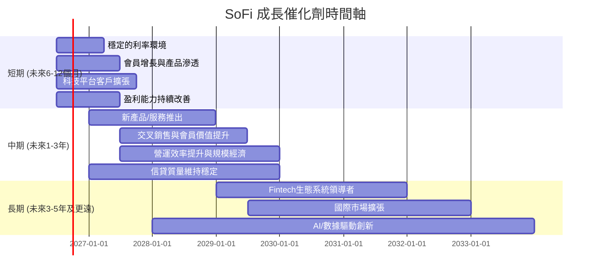

### 8.2 TAM 市場規模分析

SoFi瞄準的是一個龐大且持續增長的數位金融服務總體可尋址市場 (TAM)。

```
╔══════════════════════════════════════════════════════════════════╗
║                   SOFI TAM 市場規模分析                          ║
╠══════════════════════════════════════════════════════════════════╣
║                                                                  ║
║  美國個人貸款市場 TAM:  $1.5T+ (2025E)                            ║
║  ├── SoFi 滲透率: ~2.7% (基於TTM貸款 $40.79B)                     ║
║  └── SoFi 貢獻營收: $2.41B (淨利息收入 TTM)                       ║
║                                                                  ║
║  學生貸款再融資市場 TAM: $1.7T+ (2025E)                            ║
║  ├── SoFi 滲透率: 較低，但有增長空間                               ║
║  └── SoFi 貢獻營收: 包含在淨利息收入中                             ║
║                                                                  ║
║  數位銀行與投資平台 TAM: $500B+ (2025E)                             ║
║  ├── SoFi 滲透率: 較低，但會員持續增長                               ║
║  └── SoFi 貢獻營收: $1.53B (非利息收入 TTM)                       ║
║                                                                  ║
║  Fintech 科技平台 (B2B) TAM: $100B+ (2025E)                        ║
║  ├── Galileo/Technisys 滲透率: 具領先地位                          ║
║  └── SoFi 貢獻營收: 包含在非利息收入中                             ║
║                                                                  ║
║  📊 結論：SoFi在龐大且未充分數字化的金融市場中仍有巨大成長空間。 ║
╚══════════════════════════════════════════════════════════════════╝
```
*備註：TAM數據為分析師估算行業規模，SoFi滲透率為基於其業務規模的粗略估計。*

SoFi在個人貸款和學生貸款再融資等核心借貸市場擁有巨大的潛力。同時，其數位銀行、投資和B2B科技平台業務也處於快速擴張階段。公司目前的市場滲透率相對較低，這意味著未來仍有廣闊的成長空間，尤其是在持續吸納新會員和深化現有會員關係方面。

### 8.3 成長驅動力結構圖

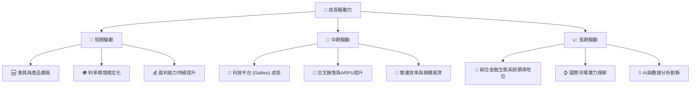
**深度解析：**
- **短期驅動 (Short-term Drivers)**：
    - **會員與產品擴張**：透過有效的行銷和產品創新，持續吸引新會員並鼓勵現有會員使用更多SoFi產品。
    - **利率環境穩定化**：聯準會利率政策的穩定或潛在降息將有利於其借貸業務的利差管理和貸款需求。
    - **盈利能力持續提升**：隨著營收增長和費用控制，預計淨利潤將繼續增長。
- **中期驅動 (Mid-term Drivers)**：
    - **科技平台 (Galileo) 成長**：擴大Galileo的客戶基礎，為更多金融科技公司提供服務，帶來穩定的B2B收入。
    - **交叉銷售與ARPU提升**：鼓勵會員使用多種產品，提升每用戶平均收入 (ARPU)，降低單一產品的獲客成本。
    - **營運效率與規模經濟**：隨著規模擴大，營運成本佔營收比重下降，提升整體利潤率。
- **長期驅動 (Long-term Drivers)**：
    - **綜合金融生態系統領導地位**：將SoFi打造成一站式金融服務的首選平台，建立強大的品牌忠誠度和網路效應。
    - **國際市場潛力探索**：將成功的模式複製到其他國家，擴大市場覆蓋範圍。
    - **AI與數據分析創新**：利用大數據和AI技術，持續優化信貸審核、個性化產品推薦和風險管理。

---

## 9. 風險矩陣

SoFi作為一家金融科技公司，面臨著傳統金融業和科技行業的雙重風險。以下將透過風險評分矩陣和詳細分析來評估其主要風險。

### 9.1 風險評分矩陣

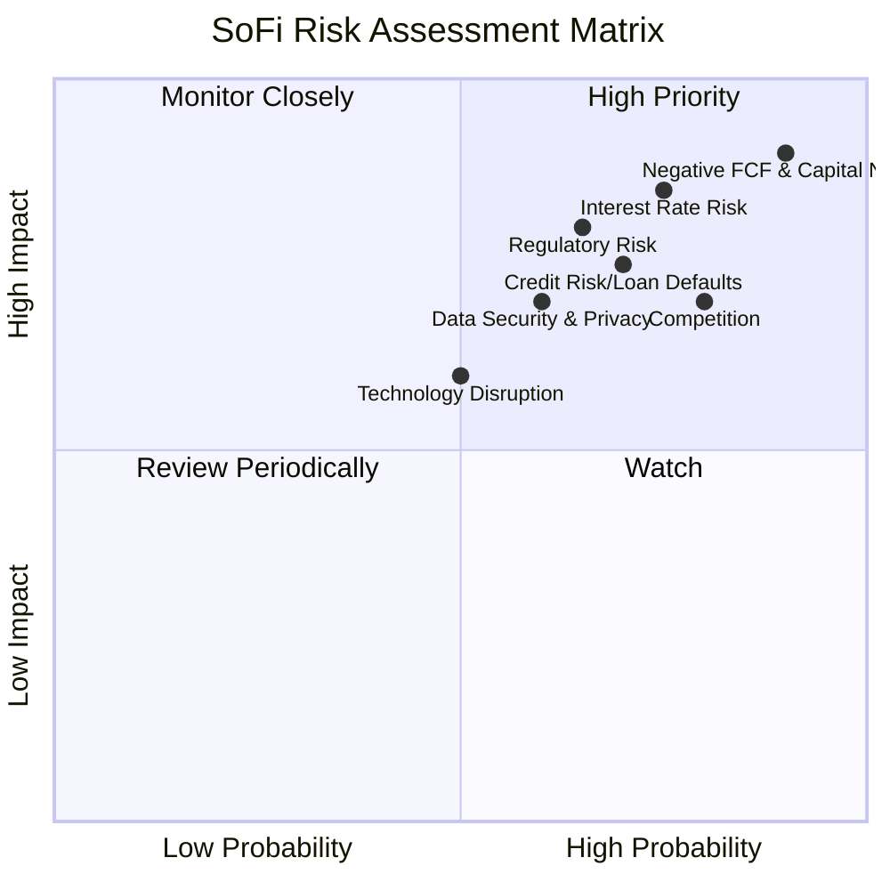

### 9.2 風險清單詳細分析

| # | 風險項目 | 發生機率 | 財務衝擊 | 風險評分 | 緩解措施 |
|---|----------|----------|----------|----------|----------|
| 1 | 🔴 **負自由現金流與資本需求** | 高 (90%) | 高 (-6.3B FCF TTM) | 🔴 9.0/10 | 透過穩健的盈利增長提升內部現金生成能力；優化資金成本管理；必要時進行股權或債務融資，但需謹慎控制稀釋效應。 |
| 2 | 🔴 **利率風險** | 高 (75%) | 高 (-X%淨利息收入) | 🔴 8.5/10 | 實施利率風險管理策略，如資產負債匹配；多元化收入來源，減少對單一借貸產品的依賴；利用銀行執照鎖定低成本存款。 |
| 3 | 🟡 **信貸風險與貸款違約** | 高 (70%) | 中高 (-X%營收) | 🟡 7.5/10 | 透過AI和數據分析持續優化信貸審核模型；多元化貸款組合以分散風險；加強貸後管理和催收效率；合理計提信貸損失準備。 |
| 4 | 🟡 **市場競爭加劇** | 高 (80%) | 中 (-X%市場份額/利潤) | 🟡 7.0/10 | 透過一站式金融服務提升會員黏性；持續創新產品和服務；利用科技平台優勢提供差異化服務；優化營銷效率。 |
| 5 | 🟡 **監管與合規風險** | 中 (65%) | 高 (-X%營運成本/罰款) | 🟡 7.0/10 | 建立強大的內部合規體系；密切關注監管政策變化並及時調整業務策略；與監管機構保持良好溝通。 |
| 6 | 🟡 **技術中斷與數據安全** | 中 (60%) | 中 (-X%營收/聲譽) | 🟡 6.5/10 | 投入大量資源於網絡安全和數據保護；建立完善的業務連續性計劃和災難恢復機制；定期進行安全審計和員工培訓。 |
| 7 | 🟡 **宏觀經濟下行** | 中 (55%) | 高 (-X%營收/信貸質量) | 🟡 6.0/10 | 實施穩健的風險管理框架；保持充足的資本緩衝和流動性；調整信貸政策以應對經濟變化。 |

---

## 10. 投資建議

綜合以上深度分析，SoFi作為一家快速成長、已實現盈利並擁有獨特銀行執照優勢的金融科技公司，展現出強勁的長期成長潛力。儘管面臨負自由現金流和競爭壓力等挑戰，但其多角化的業務模式和不斷提升的營運效率使其具備克服這些挑戰的能力。

### 10.1 最終綜合評級雷達圖

```
╔══════════════════════════════════════════════════════════════════╗
║                  SOFI 最終綜合評級雷達圖                        ║
╠══════════════════════════════════════════════════════════════════╣
║ 基本面強度  8.0 ▓▓▓▓▓▓▓▓▓▓▓▓▓▓▓▓░░░░                              ║
║ 成長動能    9.0 ▓▓▓▓▓▓▓▓▓▓▓▓▓▓▓▓▓▓░░                              ║
║ 獲利品質    7.0 ▓▓▓▓▓▓▓▓▓▓▓▓▓▓░░░░░░                              ║
║ 財務健康    6.0 ▓▓▓▓▓▓▓▓▓▓▓▓░░░░░░░░                              ║
║ 估值合理性  6.0 ▓▓▓▓▓▓▓▓▓▓▓▓░░░░░░░░                              ║
║ 護城河深度  7.5 ▓▓▓▓▓▓▓▓▓▓▓▓▓▓▓░░░░░                              ║
║ 管理層執行  8.0 ▓▓▓▓▓▓▓▓▓▓▓▓▓▓▓▓░░░░                              ║
║ 技術創新力  8.5 ▓▓▓▓▓▓▓▓▓▓▓▓▓▓▓▓▓░░░                              ║
╠══════════════════════════════════════════════════════════════════╣
║ 綜合總分    7.5 ▓▓▓▓▓▓▓▓▓▓▓▓▓▓▓▓░░░░  🏆 買入評級，具備長期成長潛力 ║
╚══════════════════════════════════════════════════════════════════╝
```

### 10.2 目標價與隱含報酬率

基於DCF敏感性分析和同業估值比較，我們給出以下目標價和隱含報酬率。

| 情境 | 機率權重 | 目標價 ($) | 當前股價 ($) | 隱含報酬率 |
|------|----------|------------|--------------|------------|
| 悲觀情境 | 20% | $20.50 | $18.61 | +10.16% |
| 基準情境 | 60% | $25.00 | $18.61 | +34.34% |
| 樂觀情境 | 20% | $28.50 | $18.61 | +53.14% |
| **加權平均目標價** | **100%** | **$24.50** | **$18.61** | **+31.65%** |

我們將 **$25.00** 設定為SoFi未來12個月的基準目標價，這代表了相對當前股價約 **34.34%** 的上漲空間。

### 10.3 買入時機與觸發因素

```
╔══════════════════════════════════════════════════════════════════╗
║                  ✅ 買入觸發因素 Checklist                      ║
╠══════════════════════════════════════════════════════════════════╣
║                                                                  ║
║  立即買入觸發條件（多數符合）：                                  ║
║  ✅ 當前股價 $18.61 處於估值區間下緣，提供安全邊際。              ║
║  ✅ 季度營收和淨利潤持續超預期，顯示強勁執行力。                  ║
║  ✅ 宏觀利率環境趨於穩定或出現降息預期，有利於借貸業務。          ║
║  ✅ 公司發布積極的自由現金流改善指引，或自由現金流負值顯著收窄。  ║
║                                                                  ║
║  加碼觸發條件（出現以下任一）：                                  ║
║  ☐ Galileo平台新增重要客戶，或科技平台營收成長加速。             ║
║  ☐ 會員增長和多產品採用率數據持續強勁，顯示生態系統黏性提升。    ║
║  ☐ 監管環境對金融科技公司更加友好，減少不確定性。                ║
║  ☐ 股價因非基本面因素（如市場整體回調）大幅下跌，提供更優買點。  ║
║                                                                  ║
║  減碼/停損觸發條件（出現以下任一）：                             ║
║  ☐ 核心業務營收成長顯著放緩，未能達到預期。                      ║
║  ☐ 信貸損失準備大幅增加，信貸質量惡化。                          ║
║  ☐ 自由現金流狀況持續惡化，且無明確改善路徑。                    ║
║  ☐ 關鍵管理層變動或重大監管處罰。                                 ║
╚══════════════════════════════════════════════════════════════════╝
```

### 10.4 投資人適配度分析

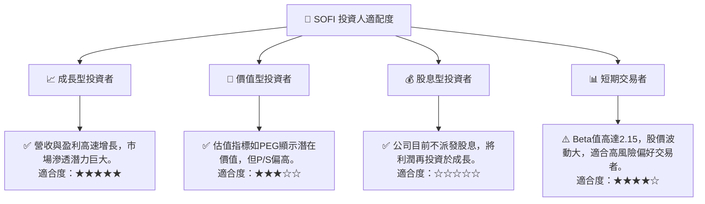

### 10.5 關鍵監控指標

| 監控類型 | 指標 | 關注點 | 頻率 |
|----------|------|----------|------|
| **營收成長** | 總營收 YoY/QoQ 成長率 | 是否維持高雙位數成長，特別關注科技平台收入貢獻。 | 季度 |
| **盈利能力** | 淨利潤，淨利率，營業利益率 | 是否持續改善，排除一次性項目影響，關注核心盈利。 | 季度 |
| **現金流** | 營業現金流，自由現金流 | 負值是否收窄，何時能轉正，對貸款組合投資的效率。 | 季度 |
| **信貸質量** | 信貸損失準備，逾期率，違約率 | 宏觀經濟下行或利率變化對貸款組合質量的影響。 | 季度 |
| **會員指標** | 會員總數，產品採用率 (交叉銷售) | 衡量生態系統擴張和會員黏性。 | 季度 |
| **資金成本** | 淨利差 (Net Interest Margin) | 銀行執照優勢是否有效轉化為更低的資金成本。 | 季度 |
| **監管動態** | 聯準會、OCC等監管機構政策 | 潛在的監管變化對金融科技行業的影響。 | 持續 |

---

> **免責聲明**：本報告為 AI 自動生成，僅供研究參考，不構成投資建議。投資有風險，入市需謹慎。