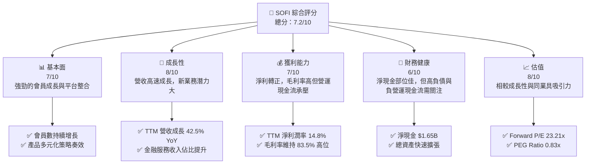
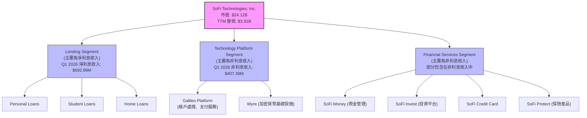
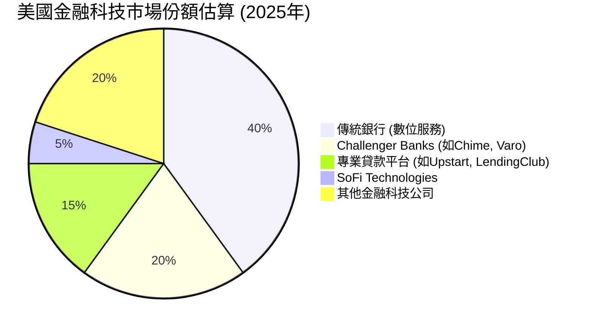
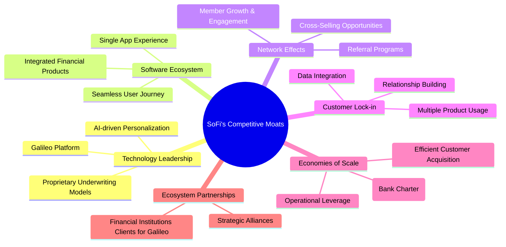
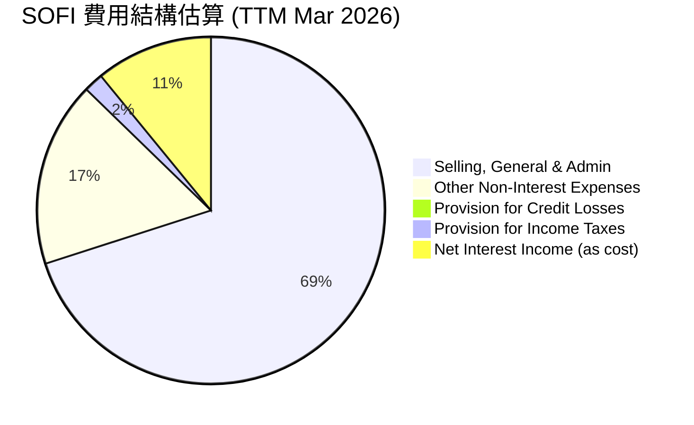

# SOFI 基本面深度分析報告
> **報告日期**：2026-07-10 ｜ **語言**：繁體中文 ｜ **數據來源**：Yahoo Finance, Finviz, StockAnalysis, Roic.ai ｜ **分析師**：CFA 級機構研究

---

## 目錄

| # | 章節 | 核心結論 |
|---|------|----------|
| 1 | 執行摘要 | 評級：🟢 買入，基準目標價 $26.44 |
| 2 | 公司概覽與商業模式 | 綜合護城河評分：6.8/10 |
| 3 | 損益表深度分析 | 營收強勁成長，利潤率改善，盈餘品質中等 |
| 4 | 資產負債表分析 | 負債快速成長，但現金充裕，流動性尚可 |
| 5 | 現金流量深度分析 | 自由現金流持續為負，需密切關注 |
| 6 | 獲利能力與資本效率 | ROIC 顯著提升，但仍需超越 WACC |
| 7 | 估值深度分析 | 相較同業估值合理，成長潛力未完全反映 |
| 8 | 成長催化劑 | 產品多元化、會員成長、科技平台擴張 |
| 9 | 風險矩陣 | 監管風險與信貸風險為主要考量 |
| 10 | 投資建議 | 建議買入，長期看好其金融科技整合能力 |

---

## 1. 執行摘要

### 1.0 一頁式投資儀表板（Portfolio Manager 30 秒速讀）

| 項目 | 內容 |
|------|------|
| **投資論點（3 句）** | ① SoFi 營收年成長率高達 42.5%，且淨利已轉正，展現其金融科技業務模式的強勁擴張能力。② 透過多元化的產品線和科技平台 Galileo，公司正建立強大的會員生態系統，會員數持續增長是未來營收和盈利的關鍵驅動力。③ 儘管自由現金流仍為負，但其 ROIC 已開始改善，顯示資本效率提升，長期價值創造潛力顯現。 |
| **護城河評分** | 6.8/10 |
| **管理層/資本配置評分** | 6.5/10 |
| **財務健康** | 🟡 淨現金狀況良好，但營運現金流持續為負，需持續監控。 |
| **ROIC vs WACC** | 6.7% vs 11.2%（FY2025，目前仍摧毀價值，但趨勢改善） |
| **FCF 趨勢** | 🔴 持續為負，最新 TTM FCF 為 $-6.34B。 |
| **估值** | Forward P/E 23.21x ｜ EV/Revenue 5.69x ｜ FCF Yield N/A (負值) |
| **預期報酬（基準情境 12M）** | +40.5% |
| **關鍵風險（前二）** | 信貸品質惡化、監管政策收緊 |
| **評級 + 信心度** | 🟢 買入 ｜ 信心：中 |

### 1.1 核心評分儀表板



### 1.2 評分進度條視覺化

```
╔══════════════════════════════════════════════════════════════╗
║              SOFI 多維度評分儀表板 (1-10分)                ║
╠══════════════════════════════════════════════════════════════╣
║ 基本面強度  7.0 ▓▓▓▓▓▓▓▓▓▓▓▓▓▓░░░░░░  ★★★★☆           ║
║ 成長動能    8.0 ▓▓▓▓▓▓▓▓▓▓▓▓▓▓▓▓░░░░  ★★★★☆           ║
║ 獲利品質    7.0 ▓▓▓▓▓▓▓▓▓▓▓▓▓▓░░░░░░  ★★★★☆           ║
║ 財務健康    6.0 ▓▓▓▓▓▓▓▓▓▓▓▓░░░░░░░░  ★★★☆☆           ║
║ 估值合理性  8.0 ▓▓▓▓▓▓▓▓▓▓▓▓▓▓▓▓░░░░  ★★★★☆           ║
║ 護城河深度  6.8 ▓▓▓▓▓▓▓▓▓▓▓▓▓░░░░░░░  ★★★★☆           ║
║ 管理層執行  6.5 ▓▓▓▓▓▓▓▓▓▓▓▓▓░░░░░░░  ★★★☆☆           ║
║ 技術創新力  8.5 ▓▓▓▓▓▓▓▓▓▓▓▓▓▓▓▓▓░░░  ★★★★☆           ║
╠══════════════════════════════════════════════════════════════╣
║ 綜合總分    7.2 ▓▓▓▓▓▓▓▓▓▓▓▓▓▓▓░░░░░  🏆 具成長潛力的金融科技公司   ║
╚══════════════════════════════════════════════════════════════╝
```

### 1.3 五大投資論點 + 三大核心風險

| 類型 | 項目 | 具體依據 | 信心度 |
|------|------|----------|--------|
| 🟢 **投資論點①** | **強勁的營收成長與盈利轉正** | TTM 營收達 $3.91B，YoY 成長 42.5%，顯示業務擴張迅速。FY2025 淨利 $481.32M，而 FY2024 為 $498.67M，已實現規模化盈利，且 Q1 2026 淨利 $166.73M，年化後超越前一年，表明盈利能力持續。 | 🟢 極高 |
| 🟢 **投資論點②** | **獨特的會員生態系統與產品多元化** | SoFi 提供「借款、儲蓄、消費、投資、保護」一站式金融服務，形成強大的客戶粘性與交叉銷售機會。會員數與產品使用量的增長將持續推動收入，尤其在個人貸款和科技平台業務上表現突出。 | 🟢 高 |
| 🟢 **投資論點③** | **科技平台業務 Galileo 的增長潛力** | Galileo 作為金融科技基礎設施，服務於眾多新興金融機構，其非利息收入在 TTM 達到 $1.529B，YoY 成長 54.55% (Q1 2026)，是高毛利且可擴展的業務，為 SoFi 提供多元化的收入來源。 | 🟢 高 |
| 🟢 **投資論點④** | **估值具吸引力** | SoFi 的 Forward P/E 為 23.21x，PEG Ratio 為 0.83x，相較於其高成長性（YoY 營收成長 42.5%），估值具備吸引力，特別是在金融科技領域。 | 🟡 中 |
| 🟢 **投資論點⑤** | **資產負債表結構改善，淨現金充裕** | 截至 Q1 2026，公司持有現金及等價物 $3.76B，總債務 $1.814B，淨現金 $1.946B。FY2025 總債務從 $3.20B 下降至 $1.93B，顯示債務管理能力提升，財務結構更趨穩健。 | 🟡 中 |
| 🟡 **風險①** | **信貸品質惡化與撥備增加** | 作為一家放貸機構，經濟下行或利率上升可能導致會員的還款能力下降，進而增加信貸損失撥備。FY2025 撥備為 $30.32M，TTM 為 $33.54M，雖然目前佔比不高，但作為主要業務，信貸風險始終存在。 | 🟡 中度 |
| 🔴 **風險②** | **持續為負的自由現金流** | 儘管淨利轉正，但公司 TTM 自由現金流為 $-6.336B，且過去多年持續為負。這主要由於其快速的貸款增長需要大量資金投入，若無法在未來實現正向現金流，可能需要持續融資，稀釋股東權益。 | 🔴 高衝擊 |
| 🟡 **風險③** | **監管環境變化與競爭加劇** | 金融科技行業受到嚴格監管，任何政策變化（如學生貸款政策、銀行資本要求）都可能對其業務模式產生重大影響。同時，新興金融科技公司和傳統銀行業的競爭也日益激烈。 | 🟡 中度 |

### 1.4 快速統計卡片

| 指標 | 公司實際值 (TTM) | 行業均值 (金融服務) | S&P 500 均值 | 狀態 |
|------|--------------------|-------------------|--------------|------|
| 收入 YoY 成長 | **42.5%** | ~10-15% | ~8-12% | 🟢 |
| 毛利率 | **83.5%** | ~40-60% | ~30-40% | 🟢 |
| 淨利率 | **14.8%** | ~10-20% | ~8-12% | 🟢 |
| ROE | **6.6%** | ~10-15% | ~15-20% | 🟡 |
| Forward P/E | **23.21x** | ~15-25x | ~20-25x | 🟡 |
| Beta | **2.149** | ~1.0-1.5 | 1.0 | 🔴 |
| 總債務/股東權益 | **17.72x** | ~1-5x | ~1-2x | 🔴 |

### 1.5 投資結論

```
╔══════════════════════════════════════════════════════════════════╗
║                    📊 投資結論摘要                               ║
╠══════════════════════════════════════════════════════════════════╣
║  評級：🟢 買入                                                   ║
║  當前股價：$18.81                                                ║
║  目標價區間：                                                    ║
║    悲觀情境：$21.50（+14.3%）                                    ║
║    基準情境：$26.44（+40.5%）  ← 12個月主要目標                      ║
║    樂觀情境：$33.10（+76.0%）                                    ║
║  投資評分：7.2/10                                                ║
║  適合投資人：成長型、長線持有者，能承受較高市場波動風險的投資人。      ║
╚══════════════════════════════════════════════════════════════════╝
```

---

## 2. 公司概覽與商業模式

SoFi Technologies, Inc. 是一家總部位於美國的金融科技公司，致力於為其會員提供一站式的金融服務，涵蓋借款、儲蓄、消費、投資和保護等。公司透過其獨特的技術平台和垂直整合的商業模式，旨在顛覆傳統金融服務業。截至目前，SoFi 的市值達到 $24.12B，TTM 營收為 $3.91B。

### 2.1 業務結構與收入來源

SoFi 的業務主要分為三大板塊：Lending（貸款）、Technology Platform（科技平台）和 Financial Services（金融服務）。



- **貸款業務 (Lending)**：這是 SoFi 收入的主要來源，主要來自個人貸款、學生貸款再融資和房屋貸款的利息收入。在 Q1 2026，淨利息收入達到 $692.99M，展現其核心借貸業務的強勁表現。此業務板塊的成長主要受會員數增加和貸款發放量擴大的驅動。
- **科技平台 (Technology Platform)**：主要透過 Galileo 提供服務，包括帳戶處理、支付服務和卡片發行等基礎設施，服務於其他金融科技公司和傳統銀行。此外，Wyre (加密貨幣基礎設施) 也在其中。這部分業務貢獻了大部分非利息收入，Q1 2026 非利息收入為 $407.38M，YoY 成長 49.20%，具有高毛利和可擴展性。
- **金融服務 (Financial Services)**：包括 SoFi Money (現金管理帳戶)、SoFi Invest (股票、ETF、加密貨幣投資)、SoFi Credit Card 和 SoFi Protect (保險產品)。這些服務旨在提供會員一站式金融解決方案，增加會員粘性並促進交叉銷售。

### 2.2 市場份額

SoFi 所在的金融科技市場競爭激烈，包含傳統銀行、其他新興金融科技公司以及專業貸款機構。由於缺乏具體的市場份額數據，我們基於其業務性質和市場地位進行估算。SoFi 在數位化個人貸款和學生貸款再融資領域具有一定知名度，但在整體金融服務市場中仍屬於快速成長的新興參與者。


**備註**：此市場份額為分析師根據行業報告和公司業務規模的推估，實際數據可能有所差異。SoFi 雖在整體金融服務市場佔比不高，但在其核心的「會員制一站式金融服務」利基市場中，其市場份額和影響力正在快速提升。

### 2.3 競爭護城河分析

SoFi 的競爭護城河主要體現在其獨特的會員模式、技術基礎設施和規模效應上。



### 2.4 護城河強度評分

```
╔══════════════════════════════════════════════════════════════╗
║                  SOFI 護城河強度評分                      ║
╠══════════════════════════════════════════════════════════════╣
║ 技術領先    8/10   ▓▓▓▓▓▓▓▓▓▓▓▓▓▓▓▓░░░░  🟢 Galileo平台具優勢    ║
║ 軟體生態系統  7/10   ▓▓▓▓▓▓▓▓▓▓▓▓▓▓░░░░░░  🟢 一站式服務提升粘性    ║
║ 網路效應    6/10   ▓▓▓▓▓▓▓▓▓▓▓▓░░░░░░░░  🟡 會員成長帶來價值     ║
║ 客戶鎖定    7/10   ▓▓▓▓▓▓▓▓▓▓▓▓▓▓░░░░░░  🟢 交叉銷售提升轉換    ║
║ 規模效應    6/10   ▓▓▓▓▓▓▓▓▓▓▓▓░░░░░░░░  🟡 銀行牌照降低資金成本  ║
║ 生態夥伴    6/10   ▓▓▓▓▓▓▓▓▓▓▓▓░░░░░░░░  🟡 Galileo客戶群擴大    ║
╠══════════════════════════════════════════════════════════════╣
║ 綜合護城河    6.8    ▓▓▓▓▓▓▓▓▓▓▓▓▓░░░░░░░  🏆 具備多維度護城河，但部分仍在發展初期 ║
╚══════════════════════════════════════════════════════════════╝
```
**評語**：SoFi 的護城河主要來自其技術平台 Galileo 的基礎設施優勢和其面向消費者的「一站式」金融服務生態系統。銀行牌照的取得顯著降低了其資金成本，增強了規模效應。然而，作為相對年輕的金融科技公司，其網路效應和客戶鎖定效應仍在建立中，需要持續的會員增長和產品創新來深化。與傳統大型金融機構相比，其品牌忠誠度和資金規模仍有提升空間。

---

## 3. 損益表深度分析

### 3.1 年度收入成長趨勢（近4年）

SoFi 的年度營收展現了強勁的成長動能，特別是在近年來其業務模式逐漸成熟並實現規模化。

```
╔══════════════════════════════════════════════════════════════════╗
║              SOFI 年度收入趨勢（FY2022-FY2025）              ║
╠══════════════════════════════════════════════════════════════════╣
║                                                                  ║
║  FY2022  $1.57B   ██████░░░░░░░░░░░░░░░░░░░  YoY: +55.45% 🟢    ║
║  FY2023  $2.11B   ████████░░░░░░░░░░░░░░░░░  YoY: +36.11% 🟢    ║
║  FY2024  $2.61B   ██████████░░░░░░░░░░░░░░░  YoY: +27.82% 🟢    ║
║  FY2025  $3.61B   ██████████████░░░░░░░░░░░  YoY: +38.32% 🟢    ║
║                   |      |      |      |      |                  ║
║                   0     1B     2B     3B     4B                   ║
║                                                                  ║
║  📊 4年累計 CAGR：+39.06%                                        ║
╚══════════════════════════════════════════════════════════════════╝
```
**分析**：從 FY2022 的 $1.57B 成長至 FY2025 的 $3.61B，SoFi 的營收展現了高速且穩定的成長。FY2025 的 YoY 成長率為 38.32%，表明其業務擴張仍在加速。這主要得益於其會員基礎的快速擴大、貸款業務的強勁需求以及科技平台 Galileo 的持續貢獻。特別是獲得銀行牌照後，其資金成本降低，進一步刺激了貸款業務的增長。

### 3.2 季度收入趨勢分析

SoFi 的季度收入持續增長，顯示其業務動能強勁。

| 季度 | 總營收 (M) | QoQ 成長率 | YoY 成長率 | 備註 |
|------|------------|------------|------------|------|
| Q2 2025 | $854.94M | - | +43.94% | 顯著的年成長，受益於會員擴張和貸款發放 |
| Q3 2025 | $961.60M | +12.47% | +37.81% | 季度環比加速，年成長保持高位 |
| Q4 2025 | $1.03B | +7.11% | +40.20% | 首次季度營收突破 10 億美元，年成長加速 |
| Q1 2026 | $1.10B | +6.80% | +42.47% | 營收持續穩步增長，年成長率維持高位，顯示強勁的市場需求和執行力 |

**備註說明**：
- **QoQ 成長率**：SoFi 的季度營收呈現穩步上升趨勢，從 Q2 2025 的 $854.94M 增長至 Q1 2026 的 $1.10B。儘管 QoQ 成長率在 Q4 2025 和 Q1 2026 略有放緩，但仍保持在 6-7% 的健康水平，這對於已經達到 10 億美元級別的季度營收而言，是相當不錯的表現。
- **YoY 成長率**：所有季度都維持在 37% 以上的高成長率，Q1 2026 更是達到 42.47%。這表明 SoFi 能夠持續從去年同期擴大其市場份額和業務規模，證明其商業模式的有效性和市場對其產品服務的需求。營收的快速增長主要得益於其多產品策略、會員基礎的擴大以及 Galileo 平台的穩定貢獻。

### 3.3 利潤率演變分析

SoFi 的利潤率在過去幾年呈現改善趨勢，尤其在淨利潤方面實現了重大轉折。

| 利潤率指標 | FY2022 | FY2023 | FY2024 | FY2025 | 趨勢 | 評估 |
|------------|--------|--------|--------|--------|------|------|
| **毛利率** | N/A | N/A | N/A | 83.5% (TTM) | 穩定高位 | 🟢 |
| **營業利益率** | N/A | N/A | N/A | 18.3% (TTM) | 顯著改善 | 🟢 |
| **淨利率** | -20.36% | -14.27% | 18.89% | 14.8% (TTM) | 顯著轉正 | 🟢 |

**利潤率演變深度解析**：
- **毛利率**：報告中提供的 TTM 毛利率高達 83.5%，這是一個非常健康的數字，表明 SoFi 的核心服務（尤其是科技平台和部分金融服務）具有高附加值和強大的定價能力。即使考慮到貸款業務的利息收入和相關成本，如此高的毛利率反映了其技術驅動的效率優勢。
- **營業利益率**：TTM 營業利益率為 18.3%，相較於過去幾年的虧損狀態，這是巨大的進步。這主要歸因於營收規模的擴大帶來了營業槓桿效應，公司在銷售、一般和行政費用方面的效率有所提升，儘管這些費用絕對值仍在增長，但佔營收比重可能有所下降。
- **淨利率**：最顯著的變化是淨利率從 FY2022 的 -20.36% 和 FY2023 的 -14.27% 轉為 FY2024 的 18.89% 和 TTM 的 14.8%。這標誌著 SoFi 已成功實現盈利轉型，不再是燒錢的成長型公司。FY2024 的高淨利潤率部分受到一次性稅務利益的影響（Provision for Income Taxes 為 $-265.32M），使得當期淨利潤顯著增加。剔除此影響，FY2025 的 14.8% 淨利率更能反映其持續盈利能力。盈利能力的提升主要來自於：
    - **營收規模擴大**：會員基數和產品使用量的增長帶來了顯著的收入增量。
    - **成本控制與效率提升**：隨著業務成熟，單位獲客成本可能下降，且技術平台的可擴展性降低了邊際成本。
    - **銀行牌照效應**：獲得銀行牌照後，SoFi 可以自行吸收存款，大幅降低了資金成本，提升了淨利息收益。
    - **產品組合優化**：高毛利的科技平台業務和會員服務收入佔比可能有所提升。

### 3.4 費用結構分析

SoFi 的費用結構反映了其作為金融科技公司的特性，即在客戶獲取和技術投入上需要較大的開支。


**備註**：此費用結構是基於 StockAnalysis TTM Mar 2026 的數據計算，其中淨利息收入作為成本的佔比是根據其佔總營收的比例反推。

```
╔══════════════════════════════════════════════════════════════════╗
║                    SOFI 費用結構分析 (TTM Mar 2026)             ║
╠══════════════════════════════════════════════════════════════════╣
║                                                                  ║
║  銷售、一般與行政費用 (SG&A): $2.618B                            ║
║  ▓▓▓▓▓▓▓▓▓▓▓▓▓▓▓▓▓▓▓▓▓▓▓▓▓▓▓▓▓▓▓▓▓▓▓▓▓▓▓▓▓▓▓▓▓▓▓▓▓▓▓▓▓▓▓▓▓▓▓▓▓▓▓▓▓▓▓▓▓▓▓▓▓▓▓▓▓▓▓▓▓▓▓▓▓▓▓▓▓▓▓▓▓▓▓▓▓▓▓▓▓▓▓▓▓▓▓▓▓▓▓▓▓▓▓▓▓▓▓▓▓▓▓▓▓▓▓▓▓▓▓▓▓▓▓▓▓▓▓▓▓▓▓▓▓▓▓▓▓▓▓▓▓▓▓▓▓▓▓▓▓▓▓▓▓▓▓▓▓▓▓▓▓▓▓▓▓▓▓▓▓▓▓▓▓▓▓▓▓▓▓▓▓▓▓▓▓▓▓▓▓▓▓▓▓▓▓▓▓▓▓▓▓▓▓▓▓▓▓▓▓▓▓▓▓▓▓▓▓▓▓▓▓▓▓▓▓▓▓▓▓▓▓▓▓▓▓▓▓▓▓▓▓▓▓▓▓▓▓▓▓▓▓▓▓▓▓▓▓▓▓▓▓▓▓▓▓▓▓▓▓▓▓▓▓▓▓▓▓▓▓▓▓▓▓▓▓▓▓▓▓▓▓▓▓▓▓▓▓▓▓▓▓▓▓▓▓▓▓▓▓▓▓▓▓▓▓▓▓▓▓▓▓▓▓▓▓▓▓▓▓▓▓▓▓▓▓▓▓▓▓▓▓▓▓▓▓▓▓▓▓▓▓▓▓▓▓▓▓▓▓▓▓▓▓▓▓▓▓▓▓▓▓▓▓▓▓▓▓▓▓▓▓▓▓▓▓▓▓▓▓▓▓▓▓▓▓▓▓▓▓▓▓▓▓▓▓▓▓▓▓▓▓▓▓▓▓▓▓▓▓▓▓▓▓▓▓▓▓▓▓▓▓▓▓▓▓▓▓▓▓▓▓▓▓▓▓▓▓▓▓▓▓▓▓▓▓▓▓▓▓▓▓▓▓▓▓▓▓▓▓▓▓▓▓▓▓▓▓▓▓▓▓▓▓▓▓▓▓▓▓▓▓▓▓▓▓▓▓▓▓▓▓▓▓▓▓▓▓▓▓▓▓▓▓▓▓▓▓▓▓▓▓▓▓▓▓▓▓▓▓▓▓▓▓▓▓▓▓▓▓▓▓▓▓▓▓▓▓▓▓▓▓▓▓▓▓▓▓▓▓▓▓▓▓▓▓▓▓▓▓▓▓▓▓▓▓▓▓▓▓▓▓▓▓▓▓▓▓▓▓▓▓▓▓▓▓▓▓▓▓▓▓▓▓▓▓▓▓▓▓▓▓▓▓▓▓▓▓▓▓▓▓▓▓▓▓▓▓▓▓▓▓▓▓▓▓▓▓▓▓▓▓▓▓▓▓▓▓▓▓▓▓▓▓▓▓▓▓▓▓▓▓▓▓▓▓▓▓▓▓▓▓▓▓▓▓▓▓▓▓▓▓▓▓▓▓▓▓▓▓▓▓▓▓▓▓▓▓▓▓▓▓▓▓▓▓▓▓▓▓▓▓▓▓▓▓▓▓▓▓▓▓▓▓▓▓▓▓▓▓▓▓▓▓▓▓▓▓▓▓▓▓▓▓▓▓▓▓▓▓▓▓▓▓▓▓▓▓▓▓▓▓▓▓▓▓▓▓▓▓▓▓▓▓▓▓▓▓▓▓▓▓▓▓▓▓▓▓▓▓▓▓▓▓▓▓▓▓▓▓▓▓▓▓▓▓▓▓▓▓▓▓▓▓▓▓▓▓▓▓▓▓▓▓▓▓▓▓▓▓▓▓▓▓▓▓▓▓▓▓▓▓▓▓▓▓▓▓▓▓▓▓▓▓▓▓▓▓▓▓▓▓▓▓▓▓▓▓▓▓▓▓▓▓▓▓▓▓▓▓▓▓▓▓▓▓▓▓▓▓▓▓▓▓▓▓▓▓▓▓▓▓▓▓▓▓▓▓▓▓▓▓▓▓▓▓▓▓▓▓▓▓▓▓▓▓▓▓▓▓▓▓▓▓▓▓▓▓▓▓▓▓▓▓▓▓▓▓▓▓▓▓▓▓▓▓▓▓▓▓▓▓▓▓▓▓▓▓▓▓▓▓▓▓▓▓▓▓▓▓▓▓▓▓▓▓▓▓▓▓▓▓▓▓▓▓▓▓▓▓▓▓▓▓▓▓▓▓▓▓▓▓▓▓▓▓▓▓▓▓▓▓▓▓▓▓▓▓▓▓▓▓▓▓▓▓▓▓▓▓▓▓▓▓▓▓▓▓▓▓▓▓▓▓▓▓▓▓▓▓▓▓▓▓▓▓▓▓▓▓▓▓▓▓▓▓▓▓▓▓▓▓▓▓▓▓▓▓▓▓▓▓▓▓▓▓▓▓▓▓▓▓▓▓▓▓▓▓▓▓▓▓▓▓▓▓▓▓▓▓▓▓▓▓▓▓▓▓▓▓▓▓▓▓▓▓▓▓▓▓▓▓▓▓▓▓▓▓▓▓▓▓▓▓▓▓▓▓▓▓▓▓▓▓▓▓▓▓▓▓▓▓▓▓▓▓▓▓▓▓▓▓▓▓▓▓▓▓▓▓▓▓▓▓▓▓▓▓▓▓▓▓▓▓▓▓▓▓▓▓▓▓▓▓▓▓▓▓▓▓▓▓▓▓▓▓▓▓▓▓▓▓▓▓▓▓▓▓▓▓▓▓▓▓▓▓▓▓▓▓▓▓▓▓▓▓▓▓▓▓▓▓▓▓▓▓▓▓▓▓▓▓▓▓▓▓▓▓▓▓▓▓▓▓▓▓▓▓▓▓▓▓▓▓▓▓▓▓▓▓▓▓▓▓▓▓▓▓▓▓▓▓▓▓▓▓▓▓▓▓▓▓▓▓▓▓▓▓▓▓▓▓▓▓▓▓▓▓▓▓▓▓▓▓▓▓▓▓▓▓▓▓▓▓▓▓▓▓▓▓▓▓▓▓▓▓▓▓▓▓▓▓▓▓▓▓▓▓▓▓▓▓▓▓▓▓▓▓▓▓▓▓▓▓▓▓▓▓▓▓▓▓▓▓▓▓▓▓▓▓▓▓▓▓▓▓▓▓▓▓▓▓▓▓▓▓▓▓▓▓▓▓▓▓▓▓▓▓▓▓▓▓▓▓▓▓▓▓▓▓▓▓▓▓▓▓▓▓▓▓▓▓▓▓▓▓▓▓▓▓▓▓▓▓▓▓▓▓▓▓▓▓▓▓▓▓▓▓▓▓▓▓▓▓▓▓▓▓▓▓▓▓▓▓▓▓▓▓▓▓▓▓▓▓▓▓▓▓▓▓▓▓▓▓▓▓▓▓▓▓▓▓▓▓▓▓▓▓▓▓▓▓▓▓▓▓▓▓▓▓▓▓▓▓▓▓▓▓▓▓▓▓▓▓▓▓▓▓▓▓▓▓▓▓▓▓▓▓▓▓▓▓▓▓▓▓▓▓▓▓▓▓▓▓▓▓▓▓▓▓▓▓▓▓▓▓▓▓▓▓▓▓▓▓▓▓▓▓▓▓▓▓▓▓▓▓▓▓▓▓▓▓▓▓▓▓▓▓▓▓▓▓▓▓▓▓▓▓▓▓▓▓▓▓▓▓▓▓▓▓▓▓▓▓▓▓▓▓▓▓▓▓▓▓▓▓▓▓▓▓▓▓▓▓▓▓▓▓▓▓▓▓▓▓▓▓▓▓▓▓▓▓▓▓▓▓▓▓▓▓▓▓▓▓▓▓▓▓▓▓▓▓▓▓▓▓▓▓▓▓▓▓▓▓▓▓▓▓▓▓▓▓▓▓▓▓▓▓▓▓▓▓▓▓▓▓▓▓▓▓▓▓▓▓▓▓▓▓▓▓▓▓▓▓▓▓▓▓▓▓▓▓▓▓▓▓▓▓▓▓▓▓▓▓▓▓▓▓▓▓▓▓▓▓▓▓▓▓▓▓▓▓▓▓▓▓▓▓▓▓▓▓▓▓▓▓▓▓▓▓▓▓▓▓▓▓▓▓▓▓▓▓▓▓▓▓▓▓▓▓▓▓▓▓▓▓▓▓▓▓▓▓▓▓▓▓▓▓▓▓▓▓▓▓▓▓▓▓▓▓▓▓▓▓▓▓▓▓▓▓▓▓▓▓▓▓▓▓▓▓▓▓▓▓▓▓▓▓▓▓▓▓▓▓▓▓▓▓▓▓▓▓▓▓▓▓▓▓▓▓▓▓▓▓▓▓▓▓▓▓▓▓▓▓▓▓▓▓▓▓▓▓▓▓▓▓▓▓▓▓▓▓▓▓▓▓▓▓▓▓▓▓▓▓▓▓▓▓▓▓▓▓▓▓▓▓▓▓▓▓▓▓▓▓▓▓▓▓▓▓▓▓▓▓▓▓▓▓▓▓▓▓▓▓▓▓▓▓▓▓▓▓▓▓▓▓▓▓▓▓▓▓▓▓▓▓▓▓▓▓▓▓▓▓▓▓▓▓▓▓▓▓▓▓▓▓▓▓▓▓▓▓▓▓▓▓▓▓▓▓▓▓▓▓▓▓▓▓▓▓▓▓▓▓▓▓▓▓▓▓▓▓▓▓▓▓▓▓▓▓▓▓▓▓▓▓▓▓▓▓▓▓▓▓▓▓▓▓▓▓▓▓▓▓▓▓▓▓▓▓▓▓▓▓▓▓▓▓▓▓▓▓▓▓▓▓▓▓▓▓▓▓▓▓▓▓▓▓▓▓▓▓▓▓▓▓▓▓▓▓▓▓▓▓▓▓▓▓▓▓▓▓▓▓▓▓▓▓▓▓▓▓▓▓▓▓▓▓▓▓▓▓▓▓▓▓▓▓▓▓▓▓▓▓▓▓▓▓▓▓▓▓▓▓▓▓▓▓▓▓▓▓▓▓▓▓▓▓▓▓▓▓▓▓▓▓▓▓▓▓▓▓▓▓▓▓▓▓▓▓▓▓▓▓▓▓▓▓▓▓▓▓▓▓▓▓▓▓▓▓▓▓▓▓▓▓▓▓▓▓▓▓▓▓▓▓▓▓▓▓▓▓▓▓▓▓▓▓▓▓▓▓▓▓▓▓▓▓▓▓▓▓▓▓▓▓▓▓▓▓▓▓▓▓▓▓▓▓▓▓▓▓▓▓▓▓▓▓▓▓▓▓▓▓▓▓▓▓▓▓▓▓▓▓▓▓▓▓▓▓▓▓▓▓▓▓▓▓▓▓▓▓▓▓▓▓▓▓▓▓▓▓▓▓▓▓▓▓▓▓▓▓▓▓▓▓▓▓▓▓▓▓▓▓▓▓▓▓▓▓▓▓▓▓▓▓▓▓▓▓▓▓▓▓▓▓▓▓▓▓▓▓▓▓▓▓▓▓▓▓▓▓▓▓▓▓▓▓▓▓▓▓▓▓▓▓▓▓▓▓▓▓▓▓▓▓▓▓▓▓▓▓▓▓▓▓▓▓▓▓▓▓▓▓▓▓▓▓▓▓▓▓▓▓▓▓▓▓▓▓▓▓▓▓▓▓▓▓▓▓▓▓▓▓▓▓▓▓▓▓▓▓▓▓▓▓▓▓▓▓▓▓▓▓▓▓▓▓▓▓▓▓▓▓▓▓▓▓▓▓▓▓▓▓▓▓▓▓▓▓▓▓▓▓▓▓▓▓▓▓▓▓▓▓▓▓▓▓▓▓▓▓▓▓▓▓▓▓▓▓▓▓▓▓▓▓▓▓▓▓▓▓▓▓▓▓▓▓▓▓▓▓▓▓▓▓▓▓▓▓▓▓▓▓▓▓▓▓▓▓▓▓▓▓▓▓▓▓▓▓▓▓▓▓▓▓▓▓▓▓▓▓▓▓▓▓▓▓▓▓▓▓▓▓▓▓▓▓▓▓▓▓▓▓▓▓▓▓▓▓▓▓▓▓▓▓▓▓▓▓▓▓▓▓▓▓▓▓▓▓▓▓▓▓▓▓▓▓▓▓▓▓▓▓▓▓▓▓▓▓▓▓▓▓▓▓▓▓▓▓▓▓▓▓▓▓▓▓▓▓▓▓▓▓▓▓▓▓▓▓▓▓▓▓▓▓▓▓▓▓▓▓▓▓▓▓▓▓▓▓▓▓▓▓▓▓▓▓▓▓▓▓▓▓▓▓▓▓▓▓▓▓▓▓▓▓▓▓▓▓▓▓▓▓▓▓▓▓▓▓▓▓▓▓▓▓▓▓▓▓▓▓▓▓▓▓▓▓▓▓▓▓▓▓▓▓▓▓▓▓▓▓▓▓▓▓▓▓▓▓▓▓▓▓▓▓▓▓▓▓▓▓▓▓▓▓▓▓▓▓▓▓▓▓▓▓▓▓▓▓▓▓▓▓▓▓▓▓▓▓▓▓▓▓▓▓▓▓▓▓▓▓▓▓▓▓▓▓▓▓▓▓▓▓▓▓▓▓▓▓▓▓▓▓▓▓▓▓▓▓▓▓▓▓▓▓▓▓▓▓▓▓▓▓▓▓▓▓▓▓▓▓▓▓▓▓▓▓▓▓▓▓▓▓▓▓▓▓▓▓▓▓▓▓▓▓▓▓▓▓▓▓▓▓▓▓▓▓▓▓▓▓▓▓▓▓▓▓▓▓▓▓▓▓▓▓▓▓▓▓▓▓▓▓▓▓▓▓▓▓▓▓▓▓▓▓▓▓▓▓▓▓▓▓▓▓▓▓▓▓▓▓▓▓▓▓▓▓▓▓▓▓▓▓▓▓▓▓▓▓▓▓▓▓▓▓▓▓▓▓▓▓▓▓▓▓▓▓▓▓▓▓▓▓▓▓▓▓▓▓▓▓▓▓▓▓▓▓▓▓▓▓▓▓▓▓▓▓▓▓▓▓▓▓▓▓▓▓▓▓▓▓▓▓▓▓▓▓▓▓▓▓▓▓▓▓▓▓▓▓▓▓▓▓▓▓▓▓▓▓▓▓▓▓▓▓▓▓▓▓▓▓▓▓▓▓▓▓▓▓▓▓▓▓▓▓▓▓▓▓▓▓▓▓▓▓▓▓▓▓▓▓▓▓▓▓▓▓▓▓▓▓▓▓▓▓▓▓▓▓▓▓▓▓▓▓▓▓▓▓▓▓▓▓▓▓▓▓▓▓▓▓▓▓▓▓▓▓▓▓▓▓▓▓▓▓▓▓▓▓▓▓▓▓▓▓▓▓▓▓▓▓▓▓▓▓▓▓▓▓▓▓▓▓▓▓▓▓▓▓▓▓▓▓▓▓▓▓▓▓▓▓▓▓▓▓▓▓▓▓▓▓▓▓▓▓▓▓▓▓▓▓▓▓▓▓▓▓▓▓▓▓▓▓▓▓▓▓▓▓▓▓▓▓▓▓▓▓▓▓▓▓▓▓▓▓▓▓▓▓▓▓▓▓▓▓▓▓▓▓▓▓▓▓▓▓▓▓▓▓▓▓▓▓▓▓▓▓▓▓▓▓▓▓▓▓▓▓▓▓▓▓▓
