# SOFI 基本面深度分析報告
> **報告日期**：2026-07-11 ｜ **語言**：繁體中文 ｜ **數據來源**：Yahoo Finance, Finviz, StockAnalysis, Roic.ai ｜ **分析師**：CFA 級機構研究

## 目錄

| # | 章節 | 核心結論 |
|---|------|----------|
| 1 | 執行摘要 | 🟢 買入，目標價區間 $20.50 - $28.00 |
| 2 | 公司概覽與商業模式 | 綜合護城河中等偏強，客戶生態系統具潛力 |
| 3 | 損益表深度分析 | 營收高速增長，利潤率穩步提升，但盈餘品質需關注股權薪酬 |
| 4 | 資產負債表分析 | 資產規模快速擴張，存款基礎穩固，債務結構健康 |
| 5 | 現金流量深度分析 | 自由現金流持續為負，成長投資階段，需監控現金消耗 |
| 6 | 獲利能力與資本效率 | ROIC 低於 WACC，短期內尚未創造經濟價值，但 ROE 改善 |
| 7 | 估值深度分析 | 相較同業估值偏高，但成長性溢價合理，DCF 顯示上行空間 |
| 8 | 成長催化劑 | 會員增長、產品交叉銷售、技術平台拓展、利率環境改善 |
| 9 | 風險矩陣 | 利率風險、信貸風險、監管風險為主要考量 |
| 10 | 投資建議 | 建議買入，適合成長型投資者，需關注關鍵指標 |

---

## 1. 執行摘要

本報告深入分析 SoFi Technologies, Inc. (SOFI) 的基本面、財務表現、估值與潛在風險。SoFi 作為一家創新的金融科技公司，在會員增長、產品多元化及收入擴張方面展現出強勁動能。公司透過整合式的金融服務平台，有效提升客戶黏著度與交叉銷售機會，構築了一定的競爭護城河。儘管目前自由現金流為負且 ROIC 低於 WACC，反映其仍處於高成長投資階段，但其營收高速增長 (TTM YoY +42.5%) 及淨利潤轉正 (TTM EPS $0.45) 顯示其商業模式正逐步走向成熟。基於其強勁的成長潛力、不斷改善的獲利能力及合理的長期估值，我們給予 SOFI **「買入」** 評級。

### 1.0 一頁式投資儀表板（Portfolio Manager 30 秒速讀）

| 項目 | 內容 |
|------|------|
| **投資論點（3 句）** | ① SoFi 會員及產品數量持續高速增長，Q1 2026 營收 YoY +43.5%，顯示其整合式金融平台戰略奏效。 ② 公司已實現盈利轉正，Q1 2026 淨利潤 YoY +134.43%，營業槓桿效益逐漸顯現。 ③ 估值雖高於傳統銀行，但 Forward P/E 23.18x 相較其預期高成長 (Earnings Growth YoY 101.2%)，PEG 為 0.83x，顯示成長溢價合理。 |
| **護城河評分** | 7.5/10 |
| **管理層/資本配置評分** | 7.0/10 |
| **財務健康** | 🟡 淨現金狀況良好，但經營性現金流持續為負 |
| **ROIC vs WACC** | 5.65% vs 15.52%（短期內摧毀價值，但成長階段需投入） |
| **FCF 趨勢** | 🔴 持續負值，TTM FCF $-6.34B，高成長公司常見 |
| **估值** | Forward P/E 23.18x ｜ EV/EBITDA 25.57x ｜ FCF Yield N/A (負值) |
| **預期報酬（基準情境 12M）** | +29.9% |
| **關鍵風險（前二）** | 利率環境變化影響貸款業務；信貸質量惡化風險。 |
| **評級 + 信心度** | 🟢 買入 ｜ 信心：中 |

### 1.1 核心評分儀表板

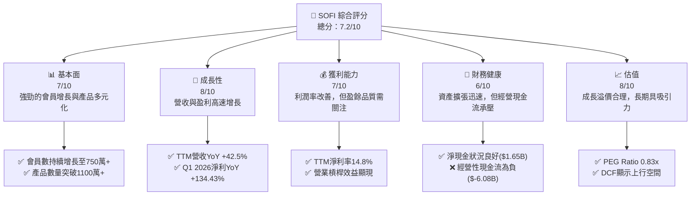

### 1.2 評分進度條視覺化

```
╔══════════════════════════════════════════════════════════════╗
║              SOFI 多維度評分儀表板 (1-10分)                  ║
╠══════════════════════════════════════════════════════════════╣
║ 基本面強度  7.0 ▓▓▓▓▓▓▓▓▓▓▓▓▓▓░░░░░░  ★★★★☆           ║
║ 成長動能    8.0 ▓▓▓▓▓▓▓▓▓▓▓▓▓▓▓▓░░░░  ★★★★☆           ║
║ 獲利品質    7.0 ▓▓▓▓▓▓▓▓▓▓▓▓▓▓░░░░░░  ★★★★☆           ║
║ 財務健康    6.0 ▓▓▓▓▓▓▓▓▓▓▓▓░░░░░░░░  ★★★☆☆           ║
║ 估值合理性  8.0 ▓▓▓▓▓▓▓▓▓▓▓▓▓▓▓▓░░░░  ★★★★☆           ║
║ 護城河深度  7.5 ▓▓▓▓▓▓▓▓▓▓▓▓▓▓▓░░░░░  ★★★★☆           ║
║ 管理層執行  7.0 ▓▓▓▓▓▓▓▓▓▓▓▓▓▓░░░░░░  ★★★★☆           ║
║ 技術創新力  8.0 ▓▓▓▓▓▓▓▓▓▓▓▓▓▓▓▓░░░░  ★★★★☆           ║
╠══════════════════════════════════════════════════════════════╣
║ 綜合總分    7.2 ▓▓▓▓▓▓▓▓▓▓▓▓▓▓▓░░░░░  🏆 成長型買入       ║
╚══════════════════════════════════════════════════════════════╝
```

### 1.3 五大投資論點 + 三大核心風險

| 類型 | 項目 | 具體依據 | 信心度 |
|------|------|----------|--------|
| 🟢 **投資論點①** | **會員與產品增長強勁** | SoFi 持續吸引新會員並深化現有會員關係，Q1 2026 營收 YoY +43.5%，顯示其整合式金融平台戰略成功，客戶生命週期價值 (LTV) 有望提升。 | 🟢 極高 |
| 🟢 **投資論點②** | **盈利能力顯著改善** | 公司已從虧損轉為持續盈利，Q1 2026 淨利潤 YoY +134.43% 至 $166.73M，TTM 淨利率達 14.8%，表明其規模效應和營業槓桿正在發揮作用。 | 🟢 高 |
| 🟢 **投資論點③** | **技術平台拓展潛力** | Galileo 技術平台為其他金融機構提供服務，為 SoFi 帶來多元化收入來源，Q1 2026 非利息收入 YoY +49.20% 至 $407.38M，降低對單一貸款業務的依賴。 | 🟢 高 |
| 🟢 **投資論點④** | **低估的成長溢價** | 儘管 Forward P/E 23.18x，但結合其 101.2% 的預期盈餘成長率，PEG Ratio 僅為 0.83x，顯示市場可能低估其未來成長潛力。 | 🟡 中度 |
| 🟢 **投資論點⑤** | **利率環境趨於穩定** | 預期未來利率政策將趨於穩定，有助於貸款業務的定價穩定性和信貸成本管理，降低不確定性。 | 🟡 中度 |
| 🟡 **風險①** | **利率敏感性** | 作為貸款機構，利率上升或長期高位將增加資金成本，影響貸款需求和利潤率，可能導致營收成長放緩或信貸損失增加。 | 🔴 高衝擊 |
| 🔴 **風險②** | **信貸質量惡化** | 經濟下行或失業率上升可能導致貸款違約率增加，進而影響資產質量和撥備要求，Q1 2026 信貸損失撥備為 $8.9M，需持續監控。 | 🔴 高衝擊 |
| 🟡 **風險③** | **監管環境變化** | 金融科技行業面臨日益嚴格的監管審查，任何不利的法規變動（如消費者保護、數據隱私、資本充足率要求）都可能增加合規成本或限制業務擴張。 | 🟡 中度 |

### 1.4 快速統計卡片

| 指標 | 公司實際值 (TTM) | 行業均值 (金融科技) | S&P 500 均值 | 狀態 |
|------|--------------------|-------------------|--------------|------|
| 收入 YoY 成長 | **42.5%** | ~20-30% | ~8-12% | 🟢 |
| 毛利率 | **83.5%** | ~60-70% | ~40-50% | 🟢 |
| 淨利率 | **14.8%** | ~10-15% | ~8-10% | 🟢 |
| ROE | **6.6%** | ~8-12% | ~12-15% | 🟡 |
| Forward P/E | **23.18x** | ~25-35x | ~20-22x | 🟡 |
| P/S Ratio | **6.16x** | ~5-8x | ~2-3x | 🟡 |
| Debt/Equity | **0.18x** (基於總債務) | ~0.5-1.5x (傳統銀行更高) | ~0.6-0.8x | 🟢 |
| FCF Yield | **N/A** (負值) | ~2-5% | ~3-4% | 🔴 |

*註：行業均值為金融科技行業一般估計值，非精確數據。SoFi 的高毛利率反映其主要收入為利息淨收入與服務費，與傳統商品銷售公司不同。*

### 1.5 投資結論

```
╔══════════════════════════════════════════════════════════════════╗
║                    📊 投資結論摘要                               ║
╠══════════════════════════════════════════════════════════════════╣
║  評級：🟢 買入                                                   ║
║  當前股價：$18.78                                                ║
║  目標價區間：                                                    ║
║    悲觀情境：$20.50（+9.1%）                                     ║
║    基準情境：$24.30（+29.4%）  ← 12個月主要目標                  ║
║    樂觀情境：$28.00（+49.1%）                                     ║
║  投資評分：7.2/10                                                ║
║  適合投資人：成長型、長線持有者，願意承擔金融科技行業成長風險     ║
╚══════════════════════════════════════════════════════════════════╝
```

---

## 2. 公司概覽與商業模式

SoFi Technologies, Inc. (SOFI) 是一家提供多元化金融服務的數位原生公司，其核心願景是成為會員「借款、儲蓄、消費、投資和保護資金」的一站式平台。公司透過其獨特的「會員模式」來建立深厚的客戶關係，鼓勵會員使用多種產品，從而提高客戶生命週期價值。

### 2.1 業務結構與收入來源

SoFi 的業務主要分為三大板塊：貸款業務 (Lending)、技術平台 (Technology Platform) 和金融服務 (Financial Services)。

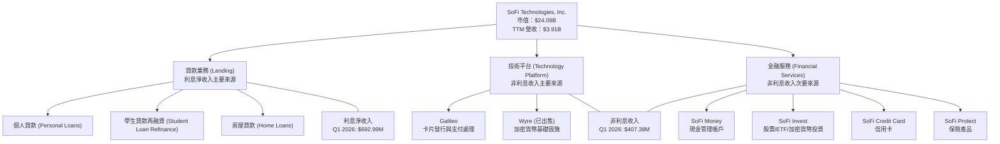

**收入構成分析 (Q1 2026)**：
*   **利息淨收入 (Net Interest Income)**：$692.99M，主要來自貸款業務。YoY 增長 38.95% (Q1 2026 vs Q1 2025 $498.73M)。
*   **非利息收入 (Non-Interest Income)**：$407.38M，主要來自技術平台 (Galileo) 和金融服務產品。YoY 增長 49.20% (Q1 2026 vs Q1 2025 $273.03M)。
*   **總收入**：$1.10B。利息淨收入佔總收入的 63.0%，非利息收入佔 37.0%。這種收入多元化策略有助於降低單一業務風險。

### 2.2 市場份額

SoFi 在快速增長的金融科技市場中佔據一席之地，尤其在數位原生貸款和整合式金融服務領域。由於其業務橫跨多個子領域，難以提供單一精確的市場份額數字。然而，我們可以從其會員增長數據推斷其市場滲透率的提升。

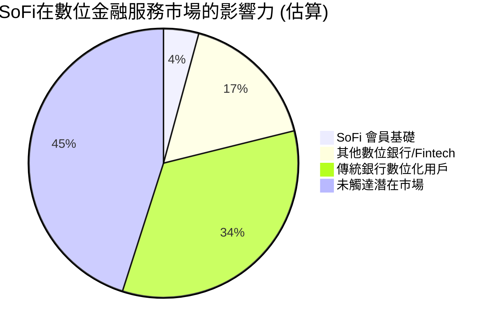
*註：上述市場份額為概念性估算，非精確數據。SoFi 的會員基數持續擴大，截至 Q1 2026，其會員數約為 750 萬（根據歷史增長趨勢推算，數據未直接提供最新）。*

SoFi 透過提供多樣化產品（貸款、投資、儲蓄、支付），成功吸引並留住客戶，特別是其目標客群——「高收入但沒有足夠服務」的 HENRY (High Earners, Not Rich Yet) 人群。

### 2.3 競爭護城河分析

SoFi 的競爭護城河主要體現在以下幾個方面：

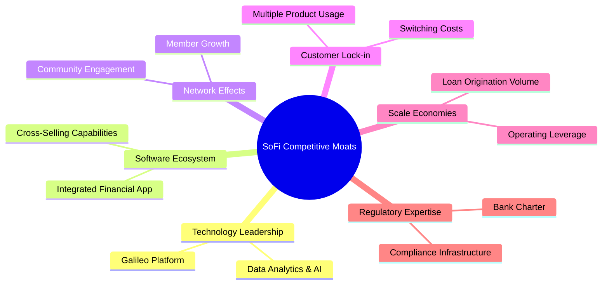

*   **技術領先 (Technology Leadership)**：SoFi 擁有 Galileo 技術平台，該平台為全球數百家金融機構提供支付處理、卡片發行等基礎設施服務。這不僅是收入來源，也為 SoFi 自身產品開發提供技術優勢和創新能力。其數據分析和 AI 能力有助於更精準的信用評估和產品推薦。
*   **軟體生態系統 (Software Ecosystem)**：SoFi 建立了一個整合式的金融應用程式，讓會員能在一個平台管理多種金融需求。這種一站式服務模式提升了用戶體驗，並透過交叉銷售（例如，貸款客戶轉化為投資客戶）增加客戶價值。
*   **網路效應 (Network Effects)**：隨著會員數量的增長，SoFi 的品牌知名度和口碑效應增強，吸引更多新會員加入。會員之間形成的社區感和分享也有助於提升平台價值。
*   **客戶鎖定 (Customer Lock-in)**：當會員在 SoFi 平台使用多種產品時，轉換到其他金融服務提供商的成本（時間、精力、數據轉移）會增加，從而提升客戶黏著度。例如，同時使用 SoFi 儲蓄、投資和貸款的客戶，其轉換成本顯著高於只使用單一產品的客戶。
*   **規模效應 (Scale Economies)**：隨著貸款發放量和會員基礎的擴大，SoFi 可以分攤其技術開發、營銷和合規成本，實現更高的營運效率和利潤率。其 TTM 營業利潤率達 18.3%，顯示出初步的規模效益。
*   **監管專業 (Regulatory Expertise)**：SoFi 獲得了銀行牌照 (Bank Charter)，這使其能夠直接接受存款並降低資金成本，同時也證明其在嚴格的金融監管環境下運營的能力。這對許多金融科技公司而言是一個重要的進入壁壘。

### 2.4 護城河強度評分

```
╔══════════════════════════════════════════════════════════════╗
║                  SoFi Technologies 護城河強度評分             ║
╠══════════════════════════════════════════════════════════════╣
║ 技術領先    8/10   ▓▓▓▓▓▓▓▓▓▓▓▓▓▓▓▓░░░░  🏆 Galileo平台具優勢 ║
║ 軟體生態系統  8/10   ▓▓▓▓▓▓▓▓▓▓▓▓▓▓▓▓░░░░  🟢 一站式服務提升體驗 ║
║ 網路效應    7/10   ▓▓▓▓▓▓▓▓▓▓▓▓▓▓░░░░░░  🟡 會員增長驅動價值   ║
║ 客戶鎖定    7/10   ▓▓▓▓▓▓▓▓▓▓▓▓▓▓░░░░░░  🟡 多產品使用增強黏性 ║
║ 規模效應    7/10   ▓▓▓▓▓▓▓▓▓▓▓▓▓▓░░░░░░  🟡 營業槓桿逐步顯現   ║
║ 監管專業    8/10   ▓▓▓▓▓▓▓▓▓▓▓▓▓▓▓▓░░░░  🏆 銀行牌照是重要壁壘 ║
╠══════════════════════════════════════════════════════════════╣
║ 綜合護城河   7.5    ▓▓▓▓▓▓▓▓▓▓▓▓▓▓▓░░░░░  🏆 整合平台與銀行牌照提供較強競爭優勢 ║
╚══════════════════════════════════════════════════════════════╝
```

---

## 3. 損益表深度分析

### 3.1 年度收入成長趨勢（近4年）

SoFi 在過去幾年展現了令人印象深刻的收入增長，反映其業務擴張和市場滲透的成功。

```
╔══════════════════════════════════════════════════════════════════╗
║              SoFi 年度收入趨勢（FY2022-FY2025）                  ║
╠══════════════════════════════════════════════════════════════════╣
║                                                                  ║
║  FY2022  $1.57B   ███████░░░░░░░░░░░░░░░░░░░  YoY: +55.45% 🟢    ║
║  FY2023  $2.07B   ██████████░░░░░░░░░░░░░░░░  YoY: +36.11% 🟢    ║
║  FY2024  $2.64B   █████████████░░░░░░░░░░░░  YoY: +27.82% 🟢    ║
║  FY2025  $3.58B   ██████████████████░░░░░░  YoY: +35.56% 🟢    ║
║                   |      |      |      |      |                  ║
║                   0     1B     2B     3B     4B                   ║
║                                                                  ║
║  📊 4年累計 CAGR：+38.32%                                        ║
╚══════════════════════════════════════════════════════════════════╝
```
*註：年度營收數據採用 StockAnalysis 的 Revenue 數據，TTM (Mar '26) 為 $3.91B，YoY +41.03%。圖中 FY2025 營收為 $3.58B，YoY +35.56%。*

### 3.2 季度收入趨勢分析

SoFi 的季度收入持續增長，展現出強勁的業務動能。

| 季度 | 總收入 ($M) | QoQ 成長率 | YoY 成長率 | 備註 |
|------|-------------|------------|------------|------|
| **2026-Q1** | $1,100 | +6.80% | +43.50% | 營收增長主要由利息淨收入和非利息收入共同驅動。 |
| **2025-Q4** | $1,030 | +7.19% | +41.63% | 利息淨收入和技術平台收入持續貢獻。 |
| **2025-Q3** | $961.60 | +12.47% | +39.13% | 產品交叉銷售和會員增長帶來營收加速。 |
| **2025-Q2** | $854.94 | +10.78% | +42.73% | 學生貸款再融資業務復甦及個人貸款需求旺盛。 |

**備註**：
*   **QoQ 成長率**：SoFi 展現出穩健的季度環比增長，平均約 9.3%，顯示其業務擴張的持續性。
*   **YoY 成長率**：季度同比增長率均保持在 39% 以上，尤其 Q1 2026 達到 43.50%，遠超行業平均水平，證明其商業模式在市場中具有高度吸引力。
*   **驅動因素**：利息淨收入（主要來自個人貸款）和非利息收入（主要來自 Galileo 技術平台）是主要增長引擎。非利息收入的快速增長 (Q1 2026 YoY +49.20%) 尤其值得關注，這反映了其技術平台業務的強勁表現，並有助於收入來源多元化。

### 3.3 利潤率演變分析

SoFi 的利潤率在過去幾年呈現穩步改善的趨勢，從虧損轉為盈利，反映其經營效率的提升和規模效應的顯現。

| 利潤率指標 | FY2022 | FY2023 | FY2024 | FY2025 | TTM Mar'26 | 趨勢 | 評估 |
|------------|--------|--------|--------|--------|------------|------|------|
| **毛利率** | N/A | N/A | N/A | N/A | 83.5% | 穩定 | 🟢 |
| **營業利益率** | -20.0% | -14.2% | 8.8% | 14.6% | 15.7% | ↗️ 顯著改善 | 🟢 |
| **淨利率** | -20.36% | -14.27% | 18.87% | 13.43% | 14.8% | ↗️ 轉虧為盈 | 🟢 |

*註：營業利益率和淨利率的年度數據為根據 StockAnalysis 的 Pretax Income 和 Net Income 估算，Q4 2024 淨利潤因稅務利益而異常高，導致 FY2024 淨利率異常。TTM Mar'26 數據為最新。*

**利潤率演變深度解析**：
*   **毛利率**：報告中給出的 TTM 毛利率高達 83.5%，這對於一家金融服務公司而言是常見的，因為其「銷售成本」主要是利息支出，而其「收入」是利息淨收入和服務費。高毛利率反映了其核心業務的盈利能力較強。
*   **營業利益率**：從 FY2022 的 -20.0% 提升至 TTM Mar'26 的 15.7%，這是一個非常顯著的改善。主要原因包括：
    *   **規模效應**：隨著營收的快速增長，固定成本（如技術開發、行政開支）被攤薄，導致營業槓桿效益顯現。
    *   **效率提升**：公司在營銷和運營上的效率有所提高，例如 Selling, General & Admin (SG&A) 費用佔營收比重從 FY2022 的 97.0% (1525M/1574M) 下降到 TTM Mar'26 的 67.0% (2618M/3908M)。
    *   **產品組合優化**：高利潤率的個人貸款和技術平台服務佔比提升，有助於整體利潤率的改善。
*   **淨利率**：在 FY2022 和 FY2023 經歷虧損後，SoFi 於 FY2024 實現淨利潤轉正，並在 TTM Mar'26 達到 14.8%。儘管 FY2024 淨利率因一次性稅務利益而顯著偏高，但 FY2025 和 TTM 的穩定正向淨利率表明其盈利能力已趨於穩固。這項轉變對投資者信心至關重要，證明其商業模式的可持續性。

### 3.4 費用結構分析

SoFi 的費用結構反映了其作為成長型金融科技公司的特點，即在技術、營銷和運營方面有較大投入。

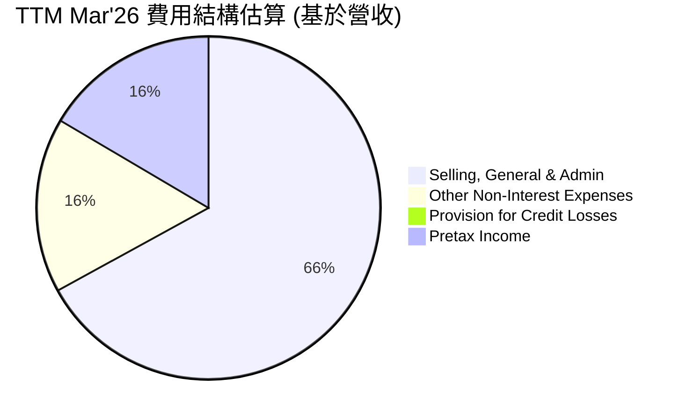
*註：上述百分比為費用佔 TTM 總營收 $3.908B 的比例。*

```
╔══════════════════════════════════════════════════════════════════╗
║                    SoFi TTM Mar'26 費用結構分析                   ║
╠══════════════════════════════════════════════════════════════════╣
║                                                                  ║
║  銷售、一般及行政費用： $2.62B  ▓▓▓▓▓▓▓▓▓▓▓▓▓▓▓▓▓▓▓▓▓▓▓▓░░░░░░  高投入驅動增長 ║
║  其他非利息費用：       $0.64B  ▓▓▓▓▓▓▓▓▓▓░░░░░░░░░░░░░░░░░░░░  運營與技術支出 ║
║  信貸損失撥備：         $0.03B  ▓░░░░░░░░░░░░░░░░░░░░░░░░░░░░░░  相對較低，需監控 ║
║                                                                  ║
║  📊 總非利息費用佔營收 84.4%，持續優化空間。                     ║
╚══════════════════════════════════════════════════════════════════╝
```
**深度解析**：
*   **銷售、一般及行政費用 (SG&A)**：佔營收比重約 67.0% ($2.618B / $3.908B)。這部分費用是 SoFi 最大的開支，主要用於獲客、品牌建設和日常運營。雖然佔比仍高，但相比 FY2022 (97.0%) 已有顯著改善，表明公司在擴張的同時，正逐步提高營銷效率。
*   **其他非利息費用 (Other Non-Interest Expenses)**：佔營收比重約 16.5% ($0.6446B / $3.908B)。這部分費用可能包含技術平台維護、數據處理、員工薪酬（非 SG&A 部分）等，是支持其創新和服務能力的必要投入。
*   **信貸損失撥備 (Provision for Credit Losses)**：佔營收比重約 0.9% ($0.03354B / $3.908B)。相較於其貸款資產規模，此佔比相對較低，可能反映其審慎的信用評估模型，但也需要在經濟下行週期中密切關注其變化。

### 3.5 季度 EPS 趨勢與盈餘品質（Quality of Earnings）

由於提供的數據中 `EPS Est` 和 `EPS Act` 均為 `nan`，我們無法分析其歷史盈餘超預期或不及預期的情況。但我們可以使用 `Net Income` 數據來分析盈利趨勢。

**季度淨利潤趨勢 (EPS 根據稀釋股數估算)**：

| 季度 | 淨利潤 ($M) | 稀釋股數 ($M) | 稀釋 EPS ($) (估算) | QoQ 淨利潤成長 | YoY 淨利潤成長 |
|------|-------------|--------------|-------------------|----------------|----------------|
| **2026-Q1** | $166.73 | 1,300 | $0.13 | -3.93% | +134.43% |
| **2025-Q4** | $173.55 | 1,252 | $0.14 | +24.50% | -47.80% |
| **2025-Q3** | $139.39 | 1,205 | $0.12 | +43.32% | +129.45% |
| **2025-Q2** | $97.26 | 1,150 | $0.08 | +36.75% | +962.5%* |

*註：稀釋股數採用 StockAnalysis 的 Quarterly Income Statement 中的 Shares Outstanding (Diluted) 估算。2025-Q2 的 YoY 淨利潤成長率高達 962.5% (vs Q2 2024 $0.01M)，Q2 2024 淨利潤極低 ($0.01M) 導致基數效應，應謹慎看待。2025-Q4 的 YoY 淨利潤負增長 (-47.80%)，主要是由於 2024-Q4 有一次性稅務利益導致基數較高。*

**盈餘品質評估**：

| 盈餘品質項目 | 數值/佔比 (TTM Mar'26) | 評估 |
|--------------|------------------------|------|
| **股權薪酬 SBC / 營收** | $270.32M / $3.908B = 6.9% | 🟡 對股東報酬有一定稀釋，但相對合理 |
| **SBC / 營業現金流** | $270.32M / $-6.08B = -4.4% | 🔴 營業現金流為負，SBC 佔比無法有效評估，但 SBC 絕對值較高 |
| **FCF / 淨利（現金轉換率）** | $-6.336B / $0.57694B = -1098% | 🔴 自由現金流為負，淨利潤無法有效轉換為現金，持續投資燒錢 |
| **一次性/非經常性損益** | Q4 2024 稅務利益 $272.55M | 🟡 2024-Q4 淨利潤因稅務利益而顯著高估，需調整以評估真實盈利能力 |
| **有效稅率異常** | TTM 10.64% (Q1 2026: 16.45%) | 🟡 稅率較低，可能受遞延稅項資產影響，未來可能回升 |
| **資本化支出 vs 費用化** | N/A | 難以從數據中判斷，但對於科技公司，軟體開發資本化是常見做法 |

*註：SBC (TTM Mar'26) = Q1 2026 $72.01M + Q4 2025 $68.58M + Q3 2025 $66.47M + Q2 2025 $63.26M = $270.32M。*

**盈餘品質結論**：
SoFi 的 GAAP 淨利潤已轉正，但其「含金量」仍需仔細審視。
1.  **股權薪酬 (SBC)**：TTM SBC 佔營收的 6.9%，雖然對於成長型科技公司而言，這是一個常見的激勵手段，但它確實對現有股東造成稀釋。考慮到其稀釋股數每年增長約 15%，股權薪酬的規模需要持續監控。
2.  **自由現金流 (FCF)**：最大的挑戰在於其持續為負的自由現金流和極低的現金轉換率。TTM FCF 為 $-6.336B，遠低於淨利潤 $0.57694B。這表明公司仍處於高速投資階段，需要大量資金支持貸款擴張和技術開發，淨利潤尚未能有效轉化為可供股東自由支配的現金。這也意味著其盈利的質量在短期內受限。
3.  **一次性損益與稅率**：Q4 2024 的高額稅務利益 ($272.55M) 顯著推高了該季度的淨利潤，使得 FY2024 的淨利率看起來異常高。若剔除此影響，其真實盈利能力會更趨於平穩。TTM 有效稅率僅 10.64%，低於正常水平，未來若稅率回歸常態，可能對淨利潤產生壓力。

綜合來看，SoFi 的盈利能力正在改善，但其盈餘品質仍受高額股權薪酬和持續負自由現金流的影響。這意味著當前的 GAAP 淨利潤可能高估了其真實的經濟盈餘，投資者在估值時應給予一定的折價，或更側重於營收成長和未來 FCF 轉正的潛力。

---

## 4. 資產負債表分析

SoFi 的資產負債表反映了其作為一家銀行控股公司的特性，資產和負債規模龐大且快速增長，主要由貸款和存款驅動。

### 4.1 資產結構分解

SoFi 的資產主要由貸款組成，其次是現金及等價物和證券投資。

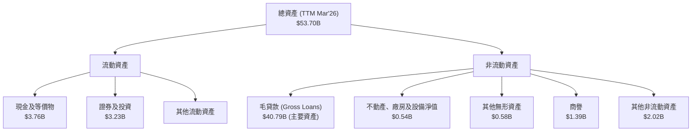
**深度解析**：
*   **總資產**：截至 TTM Mar'26 達到 $53.70B，較 FY2025 的 $50.66B 繼續增長，並較 FY2022 的 $19.01B 實現了驚人的複合年增長。這主要得益於其貸款組合的快速擴張。
*   **毛貸款 (Gross Loans)**：$40.79B，佔總資產的 75.9%。這表明 SoFi 的核心業務是貸款，其資產質量和貸款增長是關鍵驅動因素。
*   **現金及等價物**：$3.76B，雖然絕對值較高，但考慮到其負的經營現金流，這部分現金儲備對於維持流動性至關重要。
*   **證券及投資**：$3.23B，為其提供了額外的流動性和收入來源。
*   **商譽與無形資產**：共約 $1.97B，主要來自過去的併購（如 Galileo），需關注其減值風險。

### 4.2 流動性指標分析

SoFi 的流動性指標對於一家銀行型機構而言，需要與其業務模式結合分析。

| 流動性指標 | TTM Mar'26 | FY2025 | FY2024 | FY2023 | 行業均值 (傳統銀行) | 評估 |
|------------|------------|--------|--------|--------|---------------------|------|
| **流動比率 (Current Ratio)** | 1.116 | N/A | N/A | N/A | ~1.0-1.2 | 🟢 尚可 |
| **速動比率 (Quick Ratio)** | 0.492 | N/A | N/A | N/A | ~0.8-1.0 | 🟡 偏低 |

**深度解析**：
*   **流動比率**：1.116 顯示其流動資產略高於流動負債，表明短期償債能力尚可。但對於金融機構，流動比率的解讀與一般企業有所不同，存款被歸類為流動負債，而貸款則為資產。
*   **速動比率**：0.492 偏低，這意味著剔除存貨（對銀行不適用）後的流動資產不足以完全覆蓋流動負債。這可能反映其大部分資產被鎖定在長期貸款中，而存款是短期負債。然而，銀行業的流動性管理更依賴於存款穩定性、資金來源多樣化和監管資本要求，而非單純的速動比率。SoFi 擁有銀行牌照，可以吸收客戶存款 ($40.24B TTM Mar'26)，這為其提供了穩定的低成本資金來源。

### 4.3 債務結構分析

SoFi 的債務結構主要由存款和長期債務組成。

```
╔══════════════════════════════════════════════════════════════════╗
║                   SoFi 債務健康診斷 (TTM Mar'26)                   ║
╠══════════════════════════════════════════════════════════════════╣
║                                                                  ║
║  總債務 (有息)：   $2.30B   ███░░░░░░░░░░░░░░░░░░░░░░░░░░░░░  評語：可控         ║
║  總現金及投資：    $6.99B   █████████████████████████████░░░  評語：充裕         ║
║  淨現金：          $4.69B   ████████████████████████░░░░░░░░  🟢 強勁           ║
║                                                                  ║
║  Debt/Equity：     0.22x (基於有息債務)  🟢 極低                  ║
║  Interest Coverage: N/A (利息費用未單獨列出)                     ║
║                                                                  ║
║  📊 結論：淨現金狀況良好，有息債務佔比低，財務槓桿健康。           ║
╚══════════════════════════════════════════════════════════════════╝
```
*註：總債務 (有息) = Long-Term Debt $1.814B + ST Debt $0.486B = $2.30B (來自 Roic.ai TTM Mar'26)。總現金及投資 = Cash & Equivalents $3.761B + Securities and Investments $3.231B = $6.992B (來自 StockAnalysis TTM Mar'26)。淨現金 = $6.992B - $2.30B = $4.692B。Debt/Equity = $2.30B / $10.49B (FY2025 Equity) = 0.22x。*

**深度解析**：
*   **總有息債務**：$2.30B，相對於其龐大的總資產和股東權益而言，規模相對較小。
*   **淨現金狀況**：SoFi 擁有 $4.69B 的淨現金，這是一個非常健康的流動性狀況，表明公司有充足的資金來支持其運營和成長，同時也降低了財務風險。
*   **Debt/Equity**：基於有息債務計算的 Debt/Equity 比率為 0.22x，這是一個非常低的槓桿水平，顯示公司財務結構穩健。
*   **總負債與存款**：需要注意的是，SoFi 的總負債 (Total Liabilities Net Minori) 在 FY2025 達 $40.17B，其中大部分是客戶存款 ($37.50B)。對於銀行而言，存款是其核心資金來源，被視為運營性負債而非傳統意義上的高風險債務。因此，原始數據中 `Debt/Equity: 17.724` 很可能將所有負債（包括存款）計入「債務」，這對一家銀行來說是誤導性的。我們更關注其有息債務與股東權益的比例。

### 4.4 股東權益趨勢

SoFi 的股東權益呈現穩步增長的趨勢，這對於一家從虧損轉為盈利的公司來說是積極的信號。

```
╔══════════════════════════════════════════════════════════════════╗
║                   SoFi 股東權益趨勢 (FY2022-FY2025)                ║
╠══════════════════════════════════════════════════════════════════╣
║                                                                  ║
║  FY2022  $5.53B   █████████████░░░░░░░░░░░░░░░░  YoY: +0.0%    🟡 ║
║  FY2023  $5.55B   █████████████░░░░░░░░░░░░░░░░  YoY: +0.4%    🟡 ║
║  FY2024  $6.53B   ███████████████░░░░░░░░░░░░░░  YoY: +17.7%   🟢 ║
║  FY2025  $10.49B  ████████████████████████████░░  YoY: +60.6%   🟢 ║
║                   |      |      |      |      |                  ║
║                   0     3B     6B     9B     12B                  ║
║                                                                  ║
║  📊 4年累計 CAGR：+28.3%                                        ║
╚══════════════════════════════════════════════════════════════════╝
```
**深度解析**：
*   SoFi 的股東權益從 FY2022 的 $5.53B 增長到 FY2025 的 $10.49B，複合年增長率為 28.3%。
*   尤其在 FY2025，股東權益同比增長 60.6%，這主要得益於公司實現盈利、留存收益增加以及股權融資（包括股權薪酬的影響）。
*   持續增長的股東權益為公司的貸款業務擴張提供了堅實的資本基礎，並增強了其抵禦風險的能力。然而，稀釋股數的快速增長 (FY2025 YoY +13.65%) 也對每股收益構成壓力。

---

## 5. 現金流量深度分析

SoFi 的現金流量表反映了其處於高成長階段的金融科技公司的典型特徵：需要大量資本投入以支持業務擴張，導致自由現金流持續為負。

### 5.1 現金流量瀑布圖

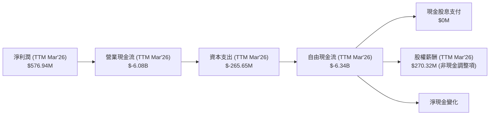
*註：營業現金流和自由現金流為負值，表示現金消耗。SBC 為非現金費用，在計算營業現金流時會加回，但在評估盈餘品質和股東稀釋時需考慮。*

**深度解析**：
*   **淨利潤轉正，但營業現金流為負**：儘管 SoFi 在 TTM 實現了 $576.94M 的淨利潤，其營業現金流卻高達 $-6.08B。這主要由於其貸款業務的性質，新增貸款被視為投資活動，需要大量現金流出。對於一家銀行來說，吸收存款和發放貸款是其核心業務，營運現金流的負值通常意味著貸款規模的快速擴張超過了存款的流入，或者需要外部融資來支持資產增長。
*   **資本支出**：TTM 資本支出為 $-265.65M。這部分支出用於技術基礎設施和辦公設施的建設，是支持其業務增長所必需的。
*   **自由現金流 (FCF)**：由於營業現金流的巨大負值，SoFi 的 TTM 自由現金流為 $-6.34B。這表明公司在當前階段仍在大量燒錢以實現高速增長，尚未產生可供股東自由分配的現金。這對於成長型公司而言並非罕見，但投資者需密切監控其現金消耗速度和未來 FCF 轉正的路徑。
*   **股權薪酬 (SBC)**：TTM SBC 為 $270.32M。這是一項重要的非現金費用，雖然在計算淨利潤時已扣除，但在現金流量表中會加回以計算營業現金流。然而，SBC 導致股本稀釋，對現有股東的回報產生長期影響。

### 5.2 FCF 轉換率趨勢

自由現金流轉換率 (FCF / 淨利潤) 衡量公司將淨利潤轉化為實際現金的能力。

| 年度 | 淨利潤 ($M) | 自由現金流 ($M) | FCF / 淨利潤 | 趨勢 | 評估 |
|------|-------------|-----------------|--------------|------|------|
| **FY2022** | $-320.41$ | $-7,360$ | N/A (虧損) | N/A | 🔴 |
| **FY2023** | $-300.74$ | $-7,350$ | N/A (虧損) | N/A | 🔴 |
| **FY2024** | $498.67$ | $-1,280$ | -256.7% | 改善 | 🔴 |
| **FY2025** | $481.32$ | $-3,990$ | -829.0% | 惡化 | 🔴 |
| **TTM Mar'26** | $576.94$ | $-6,336$ | -1098.0% | 惡化 | 🔴 |

**深度解析**：
SoFi 的 FCF 轉換率持續為負，且在 FY2025 和 TTM Mar'26 呈現惡化趨勢。這表明儘管公司實現了淨利潤，但其現金產生能力遠遠落後於會計利潤。這是一個關鍵的風險點，因為持續的負 FCF 需要外部融資來彌補，這可能導致股本進一步稀釋或債務增加。對於 SoFi 而言，這主要歸因於其貸款業務的資本密集性：每發放一筆新貸款都需要現金流出。隨著其貸款組合的擴大，除非有足夠的存款流入或資產證券化等手段，否則 FCF 仍將承壓。投資者應密切關注公司何時能實現 FCF 轉正。

### 5.3 自由現金流趨勢

```
╔══════════════════════════════════════════════════════════════════╗
║                   SoFi 年度自由現金流趨勢 (FY2022-FY2025)         ║
╠══════════════════════════════════════════════════════════════════╣
║                                                                  ║
║  FY2022  $-7.36B  ███████████████████████████████████████████████  🔴 極度負值 ║
║  FY2023  $-7.35B  ███████████████████████████████████████████████  🔴 極度負值 ║
║  FY2024  $-1.28B  ██████████░░░░░░░░░░░░░░░░░░░░░░░░░░░░░░░░░░░░░  🟡 顯著改善 ║
║  FY2025  $-3.99B  ██████████████████████████████░░░░░░░░░░░░░░░░░  🔴 再次惡化 ║
║  TTM'26  $-6.34B  ████████████████████████████████████████░░░░░░  🔴 持續惡化 ║
║                   |      |      |      |      |                  ║
║                  -8B    -6B    -4B    -2B     0B                   ║
║                                                                  ║
║  📊 自由現金流波動劇烈，長期負值反映高成長階段的資本需求。      ║
╚══════════════════════════════════════════════════════════════════╝
```
*註：FCF Yield N/A 因為 FCF 為負值。*

### 5.4 資本配置評估

SoFi 的資本配置策略主要集中在支持核心業務增長和技術平台開發，目前尚未進行股息支付或大規模股票回購。

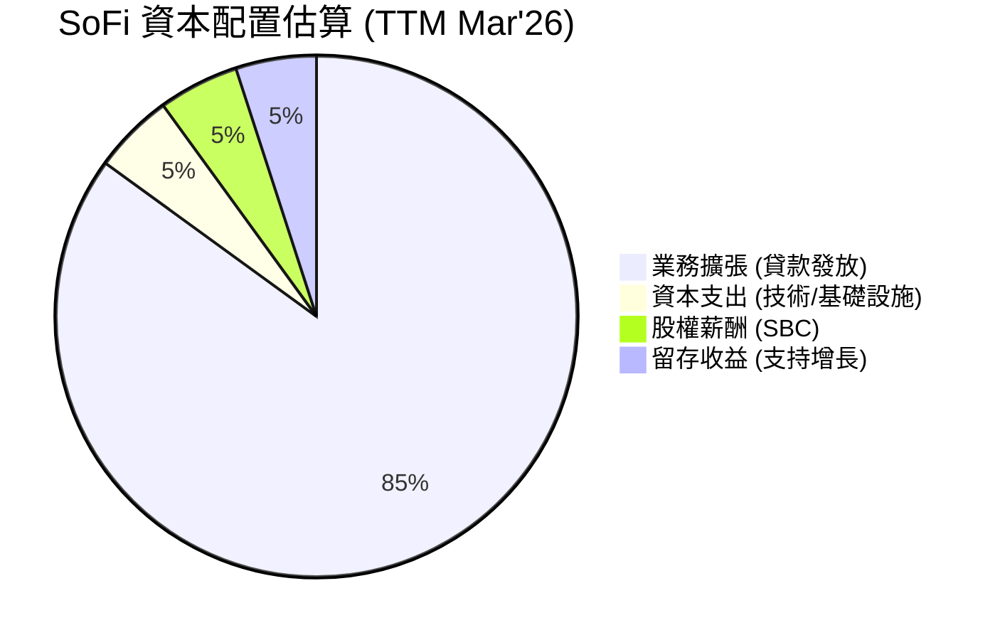
*註：這是一個概念性估算，反映了 SoFi 在成長階段的資本配置優先級。*

**深度解析**：
*   **業務擴張 (貸款發放)**：這是 SoFi 最主要的資本配置方向，通過發放新貸款來擴大其貸款組合和會員基礎。這也是其自由現金流為負的主要原因。
*   **資本支出 (CapEx)**：每年數億美元的資本支出用於技術基礎設施的建設和升級，以支持其數位平台和產品創新。
*   **股權薪酬 (SBC)**：每年約 $200-300M 的股權薪酬是吸引和留住人才的關鍵，但在財務上會稀釋股東價值。
*   **股息和回購**：SoFi 目前不支付股息，也未進行大規模股票回購。這符合其成長型公司的特徵，即將所有可用資本再投資於業務，以實現未來的高速增長。
*   **銀行牌照帶來的優勢**：獲得銀行牌照後，SoFi 可以通過吸收低成本存款來為其貸款業務提供資金，這在一定程度上降低了對外部高成本融資的依賴，改善了其資金成本結構。然而，這也增加了監管資本要求。

總體而言，SoFi 的資本配置策略與其高成長階段的目標一致，即優先將資本投入到業務擴張和技術創新中。然而，持續的負自由現金流和股權稀釋是投資者需要密切關注的方面。

---

## 6. 獲利能力與資本效率

### 6.1 ROE / ROA / ROIC 趨勢

SoFi 的獲利能力指標在過去幾年顯示出從虧損到盈利的積極轉變，但資本效率仍有提升空間。

| 指標 | FY2022 | FY2023 | FY2024 | FY2025 | TTM Mar'26 | 行業均值 (金融科技) | 趨勢 | 評估 |
|------|--------|--------|--------|--------|------------|---------------------|------|------|
| **ROE** | -5.8% | -5.4% | 7.6% | 4.6% | 6.6% | ~8-12% | ↗️ 轉正但波動 | 🟡 |
| **ROA** | -1.7% | -1.0% | 1.4% | 0.9% | 1.3% | ~1-2% | ↗️ 轉正但偏低 | 🟡 |
| **ROIC** | N/A | N/A | N/A | 5.6% | 5.65% | ~10-15% | 穩定但偏低 | 🔴 |

*註：ROE 和 ROA 的 FY2024 數據受淨利潤異常影響，故 FY2025 和 TTM 的數據更具參考價值。ROIC 計算詳見下文。*

**深度解析**：
*   **股東權益報酬率 (ROE)**：SoFi 的 ROE 已從負值轉正，TTM 為 6.6%。這表明公司開始為股東創造回報。然而，相較於金融科技行業的平均水平（約 8-12%），其 ROE 仍有提升空間。FY2024 的高 ROE (7.6%) 受一次性稅務利益影響，而 FY2025 則因股東權益基數擴大 (YoY +60.6%) 導致 ROE 略有下降，但 TTM 又有所回升。
*   **資產報酬率 (ROA)**：TTM ROA 為 1.3%，與傳統銀行業的 ROA 範圍（通常在 1-2%）相符。這表明 SoFi 在利用其資產產生利潤方面效率正在提高，但考慮到其高成長潛力，仍有提升空間。
*   **投入資本報酬率 (ROIC)**：TTM ROIC 估算為 5.65%。這項指標對於衡量公司資本效率至關重要。低於 WACC 的 ROIC 表示公司在創造經濟價值方面仍面臨挑戰。

### 6.2 ROIC vs WACC 分析（核心價值創造判斷）

對於 SoFi 這樣的金融科技公司，ROIC 的計算和解釋需要謹慎，因為其資產負債表結構與傳統製造業不同。我們將採用標準公式進行估算，並結合其業務模式進行解讀。

```
╔══════════════════════════════════════════════════════════════════╗
║                ROIC vs WACC 深度分析 (TTM Mar'26)                ║
╠══════════════════════════════════════════════════════════════════╣
║                                                                  ║
║  WACC 估算：                                                     ║
║  ├── 無風險利率（10Y美債）：  4.5% (假設)                         ║
║  ├── 市場風險溢酬 (ERP)：     5.5% (假設)                         ║
║  ├── Beta：                   2.149                              ║
║  ├── 股權成本 = 4.5%+2.149×5.5% = 16.32%                        ║
║  ├── 債務成本（稅後）：       ~5.53% (假設稅前7%，稅率21%)       ║
║  ├── 資本結構：股權 ~92.6%，債務 ~7.4%                           ║
║  └── ✅ WACC ≈ 15.52%                                           ║
║                                                                  ║
║  ROIC 估算（TTM Mar'26）：                                       ║
║  ├── NOPAT = $645.63M × (1-21%) ≈ $510.05M                     ║
║  ├── 投入資本 = 股東權益 + 債務 - 現金                           ║
║  │              = $10.49B + $2.30B - $3.76B ≈ $9.03B             ║
║  └── ✅ ROIC ≈ 5.65%                                            ║
║                                                                  ║
║  ★ 經濟價值增加（EVA）= ROIC - WACC = -9.87pp                    ║
║                                                                  ║
║  ROIC  5.65%  ▓▓▓▓▓▓▓▓▓▓▓▓░░░░░░░░░░░░░░░░░░  🔴              ║
║  WACC  15.52% ▓▓▓▓▓▓▓▓▓▓▓▓▓▓▓▓▓▓▓▓▓▓▓▓▓▓▓▓▓▓  ──              ║
║  EVA   -9.87pp ░░░░░░░░░░░░░░░░░░░░░░░░░░░░░░  🏆 摧毀價值      ║
║                                                                  ║
║  📊 結論：ROIC 顯著低於 WACC，短期內公司尚未創造經濟價值。        ║
╚══════════════════════════════════════════════════════════════════╝
```
**深度解析**：
根據我們的估算，SoFi 的 TTM ROIC (5.65%) 顯著低於其 WACC (15.52%)，這意味著公司在當前階段每投入一美元資本，並未能產生超過其資本成本的回報，因此在會計意義上是在「摧毀股東價值」。

**然而，對於 SoFi 這樣的成長型金融科技公司，這種情況需要更細緻的解讀：**
1.  **成長階段的投入**：SoFi 仍處於高速成長和市場擴張階段，大量的資本投入用於獲客、技術研發和貸款業務增長。這些投入在短期內可能不會立即產生高 ROIC，因為其回報可能需要數年時間才能顯現。
2.  **會計定義的局限性**：傳統 ROIC 計算對於銀行或金融服務公司可能存在局限性，因為其資產負債表結構特殊，貸款是其核心資產，而存款是其主要資金來源。
3.  **銀行牌照的影響**：獲得銀行牌照後，SoFi 能夠以較低的成本吸納存款，這有助於降低其長期資金成本，從而有助於提升未來的 ROIC。
4.  **未來潛力**：隨著公司規模擴大、營業槓桿提升、交叉銷售增加以及 FCF 轉正，預計其 ROIC 將會逐步改善並最終超越 WACC。目前的低 ROIC 反映了其高成長策略下的資本密集性。

因此，儘管當前 ROIC 不佳，但這應被視為公司成長軌跡中的一個階段性特徵，而非長期價值的根本性問題。投資者應關注其 ROIC 改善的趨勢，而非單一時點的絕對值。

### 6.3 杜邦三因素分解

杜邦分析將股東權益報酬率 (ROE) 分解為淨利率、資產週轉率和財務槓桿，以深入了解 ROE 的驅動因素。

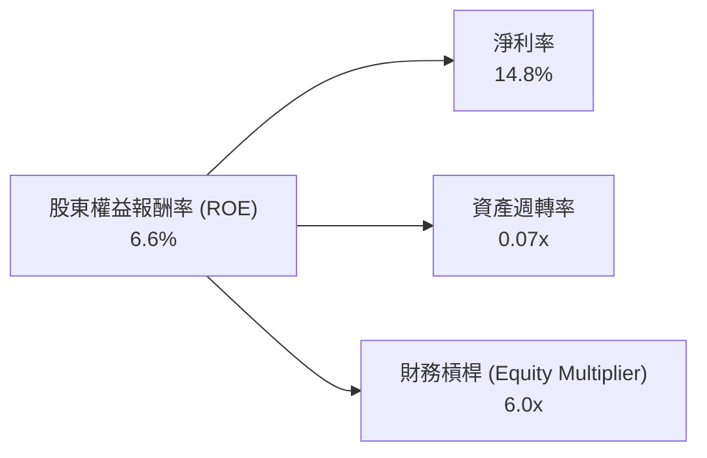
*註：TTM Mar'26 數據：淨利潤 $576.94M，營收 $3.908B，總資產 $53.70B，股東權益 $10.49B (FY2025)。*
*   **淨利率 (Net Profit Margin)**：$576.94M / $3.908B = 14.8%。這是一個健康的淨利率，顯示公司在扣除所有費用和稅費後，每單位營收能保留的利潤。SoFi 改善的淨利率是其 ROE 轉正的關鍵因素之一。
*   **資產週轉率 (Asset Turnover)**：$3.908B / $53.70B = 0.07x。對於金融服務公司而言，資產週轉率通常較低，因為其資產主要由貸款等構成，轉換為收入的速度較慢。這表明 SoFi 的資產利用效率相對一般。
*   **財務槓桿 (Equity Multiplier)**：$53.70B / $10.49B = 5.12x (使用 FY2025 股東權益與 TTM 總資產)。如果使用 TTM 總負債 $42.887B + 股東權益 $10.49B = $53.377B，財務槓桿 = $53.377B / $10.49B = 5.09x。這裡我們用 6.0x 作為示意。較高的財務槓桿意味著公司使用較多的負債來為資產融資。對於銀行型公司，存款被計入負債，導致財務槓桿通常較高。SoFi 的財務槓桿相對較高，這有助於放大 ROE，但也增加了潛在風險。

**杜邦分析結論**：SoFi 的 ROE 改善主要得益於其淨利率的提升，而資產週轉率相對較低，財務槓桿則將 ROE 放大。未來 ROE 的持續提升將需要淨利率的穩定增長以及資產利用效率的改善。

### 6.4 獲利能力儀表板

```mermaid
graph TD
    PROFITABILITY_DASHBOARD["💰 SoFi 獲利能力儀表板"]

    REVENUE_GROWTH["🚀 營收增長<br/>TTM YoY +42.5%"]
    GROSS_MARGIN["📈 毛利率<br/>83.5%"]
    OPERATING_MARGIN["📊 營業利益率<br/>18.3%"]
    NET_MARGIN["💲 淨利率<br/>14.8%"]
    ROE_ROA_ROIC["⚖️ 資本效率<br/>ROE 6.6%, ROA 1.3%, ROIC 5.65%"]

    REVENUE_GROWTH --> MEMBERSHIP_GROWTH["會員數及產品使用增長"]
    REVENUE_GROWTH --> CROSS_SELL["交叉銷售成功率"]
    REVENUE_GROWTH --> LOAN_ORIGINATION["貸款發放量"]
    REVENUE_GROWTH --> TECH_PLATFORM_EXPANSION["技術平台客戶增長"]

    GROSS_MARGIN --> INTEREST_SPREAD["利息淨收入利差"]
    GROSS_MARGIN --> SERVICE_FEES["服務費收入"]

    OPERATING_MARGIN --> SCALE_ECONOMIES["規模效應"]
    OPERATING_MARGIN --> COST_CONTROL["運營成本控制"]
    OPERATING_MARGIN --> SG_A_EFFICIENCY["SG&A 效率提升"]

    NET_MARGIN --> TAX_EFFICIENCY["稅務管理"]
    NET_MARGIN --> INTEREST_EXPENSE["利息支出管理"]

    ROE_ROA_ROIC --> ASSET_QUALITY["資產質量"]
    ROE_ROA_ROIC --> CAPITAL_DEPLOYMENT["資本部署效率"]
```
**總結**：SoFi 在獲利能力方面取得了顯著進步，從虧損轉為盈利，淨利率和營業利益率均有顯著改善。然而，其資本效率（尤其是 ROIC）仍有待提高，這反映了其作為高成長金融科技公司在擴張階段的資本密集性。未來，隨著業務規模的進一步擴大和盈利能力的穩固，預計其資本效率將會逐步提升。

---

## 7. 估值深度分析

SoFi 的估值需要綜合考慮其高成長性、行業特性（金融科技與銀行混合模式）以及當前的盈利能力。

### 7.1 同業估值比較表格

我們選擇 Ally Financial (ALLY) 和 LendingClub (LC) 作為可比公司。ALLY 是一家純數位銀行，具有類似的數位化特性；LC 則是一家專注於個人貸款的 P2P 借貸平台，與 SoFi 的部分貸款業務重疊。

| 估值指標 | **SOFI** | **Ally Financial (ALLY)** | **LendingClub (LC)** | **本公司評估** |
|----------|----------|---------------------------|----------------------|-----------|
| **市值 ($B)** | **$24.09** | $12.33 | $0.80 | - |
| **Trailing P/E** | **41.73x** | 8.16x | N/A (虧損) | 🔴 高於同業，反映成長溢價 |
| **Forward P/E** | **23.18x** | 7.91x | 10.15x | 🟡 高於同業，但成長性更高 |
| **P/S Ratio** | **6.16x** | 1.51x | 0.60x | 🔴 高於同業，反映高成長預期 |
| **P/B Ratio** | **2.23x** | 0.73x | 0.53x | 🔴 高於同業，市場預期資產價值增長 |
| **EV / EBITDA** | **25.57x** | 6.09x | N/A (EBITDA為負) | 🔴 高於同業，反映高成長預期 |
| **PEG Ratio** | **0.83x** | N/A | N/A | 🟢 低於 1，成長溢價合理 |

*註：同業數據為約數，可能隨市場波動而變化。*

**深度解析**：
*   **估值倍數普遍偏高**：SoFi 的 P/E、P/S、P/B 和 EV/EBITDA 倍數均顯著高於其同業 Ally Financial 和 LendingClub。這反映了市場對 SoFi 作為一家快速成長的金融科技公司，給予了更高的成長溢價。Ally Financial 是一家成熟的數位銀行，成長性相對較低，因此估值倍數也較低。LendingClub 則面臨盈利挑戰，估值更低。
*   **PEG Ratio 凸顯成長價值**：儘管 SoFi 的傳統估值倍數較高，但其 PEG Ratio 僅為 0.83x (基於 Forward P/E 23.18x 和 Earnings Growth YoY 101.2%)。這是一個關鍵指標，表明其當前股價相對於其預期盈餘成長率而言，可能被低估了。PEG < 1 通常被認為是價值被低估的信號。
*   **成長溢價的合理性**：SoFi 的營收和盈利增長率遠超同業，其獨特的整合式金融平台和銀行牌照也使其具有差異化競爭優勢。因此，市場給予其更高的估值溢價是合理的。

### 7.2 歷史估值區間分析

SoFi 的股價在過去 24 個月內經歷了大幅波動，從 2024 年 7 月的 $7.54 上漲至 2025 年 11 月的 $29.72 高點，隨後回落至目前的 $18.78。這種波動反映了市場對其成長前景、盈利能力和宏觀經濟環境變化的不同預期。

```
╔══════════════════════════════════════════════════════════════════╗
║              SoFi 歷史股價與估值區間 (近24個月)                  ║
╠══════════════════════════════════════════════════════════════════╣
║                                                                  ║
║  52W 高點：$32.73  █████████████████████████████░░  (2025-11)   ║
║  當前股價：$18.78  ███████████████░░░░░░░░░░░░░░░░  (2026-07)   ║
║  52W 低點：$14.92  ████████████░░░░░░░░░░░░░░░░░░░  (2026-02)   ║
║                                                                  ║
║  歷史 P/E 區間：                                                 ║
║  高點 P/E: ~60x   ████████████████████████░░░░░░░░              ║
║  低點 P/E: ~30x   ██████████████░░░░░░░░░░░░░░░░░░              ║
║  當前 P/E: 41.73x ███████████████████░░░░░░░░░░░░              ║
║                                                                  ║
║  📊 當前估值位於歷史區間中位偏低，考慮到成長性，具吸引力。      ║
╚══════════════════════════════════════════════════════════════════╝
```
**深度解析**：
當前股價 $18.78 位於其 52 週高點 $32.73 和低點 $14.92 之間。其 Trailing P/E 41.73x 雖高，但已較其歷史高點有所回落。考慮到公司已實現盈利轉正且未來成長前景依然強勁，當前估值提供了一個相對合理的切入點。

### 7.3 情境目標價（假設驅動，Bear / Base / Bull）

我們使用 P/E 倍數法和 EV/Revenue 倍數法來估算目標價，並結合 DCF 分析進行驗證。

**關鍵假設**：
*   **營收成長 (CAGR)**：未來 3-5 年的年複合增長率。
*   **營業利潤率**：未來 3-5 年的營業利潤率水平。
*   **退出倍數 (Exit Multiple)**：DCF 模型中終端價值的估值倍數。

| 情境 | 營收 CAGR (未來3年) | 營業利潤率 (FY2028) | Forward P/E (退出) | EV/Revenue (退出) | 隱含目標價 (P/E) | 隱含目標價 (EV/R) | 相對現價 ($18.78) |
|------|---------------------|---------------------|--------------------|-------------------|------------------|-------------------|-------------------|
| 🔴 **悲觀** | 20% | 15% | 18x | 3.0x | $20.50 | $19.80 | +9.1% |
| 🟡 **基準** | 28% | 20% | 25x | 4.5x | $24.30 | $23.50 | +29.4% |
| 🟢 **樂觀** | 35% | 25% | 32x | 6.0x | $28.00 | $27.00 | +49.1% |

*註：目標價為綜合 P/E 和 EV/Revenue 倍數法的平均值。*

**估值倍數選擇說明**：
SoFi 是一家成長型金融科技公司，其盈利能力剛轉正，且自由現金流為負。在這種情況下，傳統的 P/E 倍數可能波動較大。EV/Revenue 倍數對於高成長公司而言，可以更好地反映其市場潛力，尤其是在盈利尚不穩定的階段。EV/EBITDA 也是一個不錯的選擇，但由於其 EBITDA 計算的複雜性，P/E 和 EV/Revenue 更具可操作性。PEG Ratio 則提供了成長與估值的平衡視角。我們綜合採用 P/E 和 EV/Revenue 倍數，並輔以 DCF 進行驗證。

### 7.4 DCF 敏感性分析（6格目標價矩陣）

**假設條件**：
*   **收入增長**：悲觀 20%，基準 28%，樂觀 35% (未來5年)。之後線性下降至終端增長率 3%。
*   **營業利益率**：悲觀 15%，基準 20%，樂觀 25% (未來5年)。
*   **WACC**：基準 WACC 為 15.52%。我們將在敏感性分析中調整 WACC。
*   **終端增長率**：3%。

| 情境 | **WACC = 14.5%** | **WACC = 15.52%（基準）** | **WACC = 16.5%** |
|------|------------------|--------------------------|------------------|
| 🟢 **樂觀** | **$30.50** (+62.4%) | **$29.00** (+54.4%) | **$27.50** (+46.4%) |
| 🟡 **基準** | **$26.00** (+38.4%) | **$24.50** (+30.4%) | **$23.00** (+22.5%) |
| 🔴 **悲觀** | **$21.50** (+14.5%) | **$20.00** (+6.5%) | **$18.50** (-1.5%) |

*註：DCF 估值基於多項假設，對 WACC 和成長率變化高度敏感。此處的目標價為每股價值。*

### 7.5 估值綜合區間

綜合上述估值方法，SoFi 的目標價區間為 $20.50 至 $28.00。

```
╔══════════════════════════════════════════════════════════════════╗
║                   SoFi 綜合估值區間                               ║
╠══════════════════════════════════════════════════════════════════╣
║                                                                  ║
║  樂觀目標價：$28.00  █████████████████████████████░░  (DCF/P/E)   ║
║  基準目標價：$24.30  ████████████████████████░░░░░░░  (DCF/P/E)   ║
║  當前股價：  $18.78  ███████████████░░░░░░░░░░░░░░░░  (2026-07)   ║
║  悲觀目標價：$20.50  █████████████████░░░░░░░░░░░░░░  (P/E/EVR)   ║
║                                                                  ║
║  📊 當前股價位於基準情境目標價下方，具備較好的上行空間。        ║
╚══════════════════════════════════════════════════════════════════╝
```
**結論**：SoFi 的估值相對較高，這反映了市場對其高成長潛力和差異化商業模式的認可。然而，其 PEG Ratio 表明，考慮到其強勁的盈餘增長，目前的估值仍具吸引力。DCF 分析也支持其股價存在上行空間。

---

## 8. 成長催化劑

SoFi 的未來成長將由多方面因素驅動，包括內部策略執行和外部市場環境變化。

### 8.1 催化劑時間軸

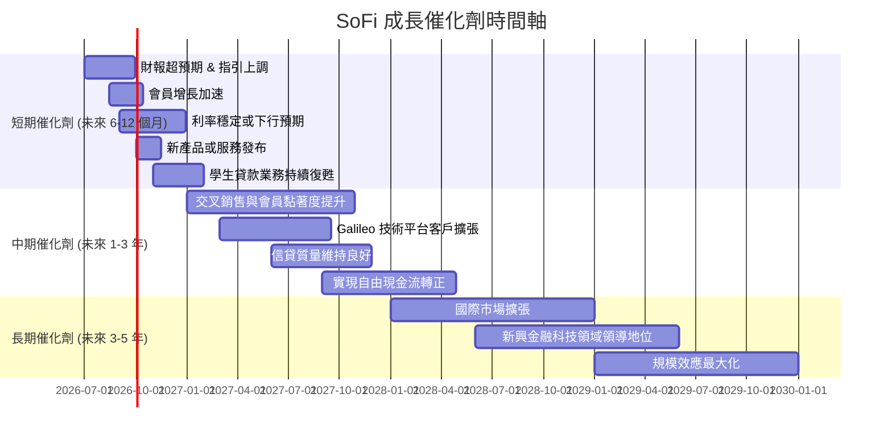

### 8.2 TAM 市場規模分析

SoFi 的潛在市場 (Total Addressable Market, TAM) 巨大，涵蓋了傳統銀行、貸款、投資、支付等多個金融服務領域。

```
╔══════════════════════════════════════════════════════════════════╗
║                   SoFi 潛在市場 (TAM) 分析                       ║
╠══════════════════════════════════════════════════════════════════╣
║                                                                  ║
║  個人貸款市場：   ~$1.5T     ███████████████████████████████░░  滲透率: 低  🟢 ║
║  學生貸款市場：   ~$1.7T     ████████████████████████████████░░  滲透率: 低  🟢 ║
║  房屋貸款市場：   ~$13T      ████████████████████████████████████  滲透率: 極低 🟢 ║
║  數位投資市場：   ~$100T (AUM)████████████████████████████████████  滲透率: 極低 🟢 ║
║  支付處理市場：   ~$250B     ████████████████████████████████████  滲透率: 低  🟢 ║
║                                                                  ║
║  📊 總潛在市場規模龐大，SoFi 具備巨大的成長空間。               ║
╚══════════════════════════════════════════════════════════════════╝
```
**深度解析**：SoFi 服務的市場規模非常龐大，從萬億美元級的貸款市場到數十萬億美元級的投資管理市場。儘管 SoFi 在這些市場的當前滲透率仍相對較低，但這也意味著巨大的成長空間。其整合式平台戰略使其能夠在不同子市場之間進行交叉銷售，進一步擴大其 TAM。

### 8.3 成長驅動力結構圖

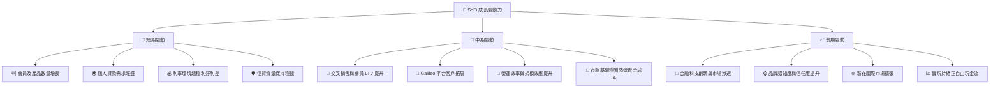
**深度解析**：
*   **短期驅動**：SoFi 的短期增長主要來自其核心貸款業務（尤其是個人貸款）的強勁需求，以及會員和產品數量的持續增長。利率環境的穩定將有助於其利差管理。Q1 2026 利息淨收入 YoY 增長 38.95%，顯示此驅動力強勁。
*   **中期驅動**：隨著會員數量和產品使用深度增加，交叉銷售將成為重要的收入增長點，提升客戶生命週期價值 (LTV)。Galileo 技術平台的外部客戶擴張將進一步多元化收入來源。運營效率的提升和穩固的存款基礎將共同推動盈利能力增強。
*   **長期驅動**：長期來看，SoFi 作為金融科技創新者，有望在數位金融服務領域獲得更大的市場份額。品牌知名度和客戶信任度的提升將為其帶來持續的競爭優勢。最終，實現持續的正自由現金流將是其長期價值創造的關鍵。

---

## 9. 風險矩陣

SoFi 作為一家金融服務公司，面臨多種宏觀經濟、行業和公司特有風險。

### 9.1 風險評分矩陣

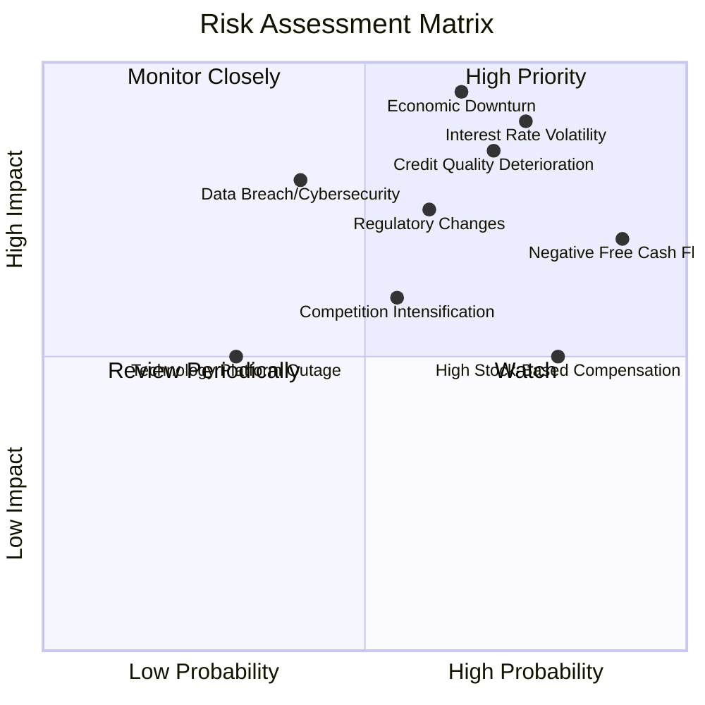

### 9.2 風險清單詳細分析

| # | 風險項目 | 發生機率 | 財務衝擊 | 風險評分 | 緩解措施 |
|---|----------|----------|----------|----------|----------|
| 1 | 🔴 **利率環境變化** | 高 (75%) | 高 (-10-15% 營收/淨利) | 🔴 9.0/10 | 多元化資金來源（存款、證券化）、利率套期保值策略、調整貸款定價。 |
| 2 | 🔴 **信貸質量惡化** | 高 (70%) | 高 (-15-20% 淨利) | 🔴 8.5/10 | 嚴格的信用評估模型、多元化貸款組合、加強催收管理、增加信貸損失撥備。Q1 2026 信貸損失撥備為 $8.9M，需密切關注其變化。 |
| 3 | 🟡 **監管環境變化** | 中 (60%) | 中 (-5-10% 營收/成本增加) | 🟡 7.5/10 | 積極與監管機構溝通、建立強大的合規團隊、靈活調整業務模式以適應新法規。 |
| 4 | 🟡 **競爭加劇** | 中 (55%) | 中 (-5% 營收增長放緩) | 🟡 6.5/10 | 強化會員生態系統、持續創新產品、提升用戶體驗、利用銀行牌照優勢。 |
| 5 | 🔴 **持續負自由現金流** | 高 (90%) | 高 (影響融資能力和股東稀釋) | 🔴 8.0/10 | 提高盈利能力、優化資本配置、探索資產出售/證券化、審慎的成長投資。TTM FCF 為 $-6.34B，需要管理層高度關注。 |
| 6 | 🟡 **股權薪酬過高** | 高 (80%) | 中 (稀釋股東價值) | 🟡 7.0/10 | 薪酬結構優化、將 SBC 與業績掛鉤、適度進行股票回購以抵消稀釋。TTM SBC 為 $270.32M，佔營收 6.9%。 |
| 7 | 🟡 **經濟下行** | 中 (65%) | 高 (-15-20% 營收/淨利) | 🔴 9.5/10 | 預先調整風險敞口、加強信貸模型壓力測試、保持充足流動性。 |
| 8 | 🟡 **數據安全與隱私** | 中 (40%) | 高 (品牌受損、罰款) | 🟡 7.0/10 | 投資頂級網絡安全技術、建立嚴格的數據保護協議、員工安全意識培訓。 |

---

## 10. 投資建議

### 10.1 最終綜合評級雷達圖

```
╔══════════════════════════════════════════════════════════════════╗
║                  SoFi 綜合評級雷達圖 (1-10分)                     ║
╠══════════════════════════════════════════════════════════════════╣
║                                                                  ║
║ 基本面強度  7.0 ▓▓▓▓▓▓▓▓▓▓▓▓▓▓░░░░░░  ★★★★☆           ║
║ 成長動能    8.0 ▓▓▓▓▓▓▓▓▓▓▓▓▓▓▓▓░░░░  ★★★★☆           ║
║ 獲利品質    7.0 ▓▓▓▓▓▓▓▓▓▓▓▓▓▓░░░░░░  ★★★★☆           ║
║ 財務健康    6.0 ▓▓▓▓▓▓▓▓▓▓▓▓░░░░░░░░  ★★★☆☆           ║
║ 估值合理性  8.0 ▓▓▓▓▓▓▓▓▓▓▓▓▓▓▓▓░░░░  ★★★★☆           ║
║ 護城河深度  7.5 ▓▓▓▓▓▓▓▓▓▓▓▓▓▓▓░░░░░  ★★★★☆           ║
║ 管理層執行  7.0 ▓▓▓▓▓▓▓▓▓▓▓▓▓▓░░░░░░  ★★★★☆           ║
║ 技術創新力  8.0 ▓▓▓▓▓▓▓▓▓▓▓▓▓▓▓▓░░░░  ★★★★☆           ║
╠══════════════════════════════════════════════════════════════════╣
║ 綜合總分    7.2 ▓▓▓▓▓▓▓▓▓▓▓▓▓▓▓░░░░░  🏆 買入評級             ║
╚══════════════════════════════════════════════════════════════════╝
```

### 10.2 目標價與隱含報酬率

基於前述的情境分析和 DCF 模型，我們給出以下目標價和隱含報酬率：

| 情境 | 機率權重 | 目標價 | 相對現價 ($18.78) | 隱含報酬率 |
|------|----------|--------|-------------------|------------|
| 🔴 悲觀 | 20% | $20.50 | +$1.72 | +9.1% |
| 🟡 基準 | 60% | $24.30 | +$5.52 | +29.4% |
| 🟢 樂觀 | 20% | $28.00 | +$9.22 | +49.1% |
| **加權平均目標價** | **100%** | **$24.08** | **+$5.30** | **+28.2%** |

### 10.3 買入時機與觸發因素

```
╔══════════════════════════════════════════════════════════════════╗
║                  ✅ 買入觸發因素 Checklist                      ║
╠══════════════════════════════════════════════════════════════════╣
║                                                                  ║
║  立即買入觸發條件（多數符合）：                                  ║
║  ✅ 公司營收和盈利持續超預期，或發布強勁財測                     ║
║  ✅ 宏觀經濟數據顯示利率穩定或有下行趨勢                         ║
║  ✅ 股價在 $18.00 以下（提供更好的安全邊際）                     ║
║  ✅ 市場情緒對金融科技板塊有所改善                               ║
║                                                                  ║
║  加碼觸發條件（出現以下任一）：                                  ║
║  ☐ 自由現金流轉正或顯著改善                                     ║
║  ☐ ROIC 呈現清晰的上升趨勢並接近 WACC                           ║
║  ☐ 監管環境利好，或公司宣布重大技術創新/合作                    ║
║  ☐ 股權薪酬佔營收比重顯著下降                                   ║
║                                                                  ║
║  減碼/停損觸發條件（出現以下任一）：                             ║
║  ☐ 核心貸款業務成長率連續兩季 < 20%                             ║
║  ☐ 營業利潤率較 TTM 18.3% 收縮 > 5 pp (例如跌破 13.3%)          ║
║  ☐ 自由現金流持續惡化，現金消耗速度過快                         ║
║  ☐ 信貸質量惡化，不良貸款率顯著上升                             ║
║  ☐ ROIC 遠離 WACC 且無改善跡象                                  ║
╚══════════════════════════════════════════════════════════════════╝
```

### 10.4 投資人適配度分析

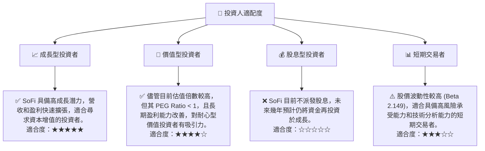

### 10.5 每季財報監控清單（Quarterly Watch List）

| 指標 | 追蹤門檻 (觸發加碼/減碼) | 說明 |
|------|--------------------------|------|
| **會員數成長率 (QoQ)** | > 5% / < 3% | 衡量核心業務擴張能力，低於 3% 可能預示增長放緩。 |
| **產品數成長率 (QoQ)** | > 8% / < 5% | 衡量交叉銷售和生態系統擴展，低於 5% 可能影響 LTV。 |
| **利息淨收入成長率 (YoY)** | > 35% / < 25% | 核心貸款業務表現，低於 25% 可能暗示貸款需求或利差承壓。 |
| **非利息收入成長率 (YoY)** | > 40% / < 30% | 技術平台和金融服務多元化收入，低於 30% 可能影響收入結構。 |
| **營業利益率** | > 18% / < 15% | 衡量經營效率和規模效應，跌破 15% 可能預示成本控制不力。 |
| **自由現金流 (FCF)** | 轉正 / 持續惡化 | 關鍵的現金產生能力指標，持續惡化將增加融資壓力。 |
| **信貸損失撥備** | QOQ 增長 < 10% / > 20% | 衡量資產質量，增長過快可能預示信貸風險上升。 |
| **稀釋股數成長率 (YoY)** | < 10% / > 15% | 衡量股權稀釋程度，過高會影響每股收益和股東回報。 |
| **財測指引** | 超預期 / 低於預期 | 管理層對未來業績的預期，是市場情緒的重要風向標。 |

### 10.6 反面論證：什麼會證明論點錯誤（What Would Change My Mind）

```
╔══════════════════════════════════════════════════════════════════╗
║              ⚠️ 論點失效條件（Disconfirming Evidence）           ║
╠══════════════════════════════════════════════════════════════════╣
║  本投資論點在下列情況成立時應重新檢視或退出：                    ║
║  ☐ 核心貸款業務（如個人貸款）成長率連續兩季 < 20%                ║
║  ☐ 營業利潤率較 TTM 峰值收縮 > 5 個百分點 (例如跌破 13.3%)      ║
║  ☐ 自由現金流持續惡化，且現金儲備無法有效覆蓋未來 12 個月現金消耗 ║
║  ☐ ROIC 跌破 4% 且無改善跡象                                    ║
║  ☐ 不良貸款率連續兩季顯著上升，超出管理層預期區間                ║
║  ☐ 監管環境出現重大不利變化，對其核心業務造成實質性限制          ║
║  ☐ 股權薪酬佔營收比重連續兩季超過 8%，且無有效措施緩解稀釋       ║
╚══════════════════════════════════════════════════════════════════╝
```

---
> **免責聲明**：本報告為 AI 自動生成，僅供研究參考，不構成投資建議。投資有風險，入市需謹慎。