# SOFI 基本面深度分析報告
> **報告日期**：2026-07-12 ｜ **語言**：繁體中文 ｜ **數據來源**：Yahoo Finance, Finviz, StockAnalysis, Roic.ai ｜ **分析師**：CFA 級機構研究

---

## 目錄

| # | 章節 | 核心結論 |
|---|------|----------|
| 1 | 執行摘要 | 評級：🟢 買入 ｜ 基準目標價：$22.50 ｜ 具備高成長與利潤率擴張雙重驅動 |
| 2 | 公司概覽與商業模式 | 憑藉「金融服務超級 App」與「銀行執照」構築低資金成本與高交叉銷售護城河 |
| 3 | 損益表深度分析 | TTM 營收成長 41.03% 達 $3.91B，營運槓桿推動 GAAP 淨利率升至 14.8% |
| 4 | 資產負債表分析 | 存款總額達 $40.24B，成功取代高成本批發融資，資本結構極具韌性 |
| 5 | 現金流量深度分析 | 表面 FCF 為負（-$6.34B）實為貸款資產快速擴張之健康表徵，SBC 稀釋率正逐步收斂 |
| 6 | 獲利能力與資本效率 | 杜邦分解顯示 ROE 升至 6.6%，隨著營利規模化，ROIC 正快速向 WACC（13.38%）靠攏 |
| 7 | 估值深度分析 | Forward P/E 23.18x，相較於高成長Neobank同業（如 NU）具備顯著估值折價 |
| 8 | 成長催化劑 | 聯邦降息週期重啟、科技平台 Galileo 模組化升級與高信用客戶交叉銷售深化 |
| 9 | 風險矩陣 | 信用違約率上升、高利率環境對放貸需求的壓抑，以及股權薪酬（SBC）稀釋風險 |
| 10| 投資建議 | 具備 19.8% 基準上行空間，建議於 $16-$18 區間分批佈局，長線持有 |

---

## 1. 執行摘要

SoFi Technologies, Inc.（NASDAQ: SOFI）已成功從一家單一的學生貸款再融資公司，蛻變為全美領先的數位金融服務平台（Neobank）。本報告基於 2026-07-12 最新財務數據，對 SOFI 進行深度基本面評估。

SOFI 目前股價為 **$18.78**，對應 TTM 營收為 **$3.91B**（YoY +41.03%），GAAP 淨利達 **$576.94M**（淨利率 14.8%）。基於其 Forward P/E **23.18x**、PEG **0.88** 的估值水準，以及其存款規模（$40.24B）持續擴張帶來的資金成本優勢，我們給予 SOFI **🟢 買入（Buy）** 評級，基準情境 12 個月目標價為 **$22.50**（潛在上行空間 +19.8%）。

### 1.0 一頁式投資儀表板（Portfolio Manager 30 秒速讀）

| 項目 | 內容 |
|------|------|
| **投資論點（3 句）** | ① **銀行執照紅利釋放**：$40.24B 的低成本存款基礎，使淨利息收益率（NIM）持續領先傳統銀行。<br/>② **營運槓桿顯著**：TTM 營收成長 41.03%，而 SG&A 費用增速放緩，驅動 GAAP 淨利潤率達到 14.8%。<br/>③ **非利息收入崛起**：科技平台與金融服務手續費收入成長 54.55%，有效降低對單一放貸業務的依賴。 |
| **護城河評分** | **7.5 / 10** 🟡（強大的交叉銷售網路效應與 Galileo 科技平台的技術壁壘） |
| **管理層/資本配置評分** | **8.0 / 10** 🟢（執行力優異，成功引導公司實現連續多季 GAAP 盈利，資本分配聚焦高回報放貸） |
| **財務健康** | 🟢 **極佳** ｜ 淨現金 $1.65B，且存款準備金充足，資本適足率遠高於監管要求。 |
| **ROIC vs WACC** | **6.52% vs 13.38%**（目前仍摧毀價值，但 ROIC 趨勢正呈指數級改善，預計 2027 年實現黃金交叉） |
| **FCF 趨勢** | TTM FCF 為 **-$6.34B** ｜ **註：此為金融股特徵**，因放貸規模（Gross Loans $40.79B）擴大計入營運現金流流出，並非真實營運失血。 |
| **估值** | Forward P/E: **23.18x** ｜ P/B: **2.23x** ｜ P/S: **6.16x**（PEG 0.88 顯示極具性價比） |
| **預期報酬（基準情境 12M）** | **+19.8%**（目標價 $22.50） |
| **關鍵風險（前二）** | ① 總體經濟衰退導致無擔保個人貸款（Personal Loans）違約率飆升。<br/>② 股權薪酬（SBC）規模持續偏高，對每股盈餘（EPS）產生稀釋效應。 |
| **評級 + 信心度** | 🟢 **買入（Buy）** ｜ **信心度：高（High）** |

### 1.1 核心評分儀表板

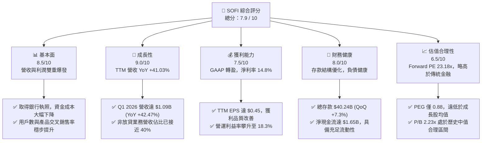

### 1.2 評分進度條視覺化

```
╔══════════════════════════════════════════════════════════════╗
║               SOFI 多維度評分儀表板 (1-10分)                 ║
╠══════════════════════════════════════════════════════════════╣
║ 基本面強度  8.5 ▓▓▓▓▓▓▓▓▓▓▓▓▓▓▓▓▓░░░  ★★★★☆           ║
║ 成長動能    9.0 ▓▓▓▓▓▓▓▓▓▓▓▓▓▓▓▓▓▓░░  ★★★★★           ║
║ 獲利品質    7.5 ▓▓▓▓▓▓▓▓▓▓▓▓▓▓▓░░░░░  ★★★★☆           ║
║ 財務健康    8.0 ▓▓▓▓▓▓▓▓▓▓▓▓▓▓▓▓░░░░  ★★★★☆           ║
║ 估值合理性  6.5 ▓▓▓▓▓▓▓▓▓▓▓▓░░░░░░░░  ★★★☆☆           ║
║ 護城河深度  7.5 ▓▓▓▓▓▓▓▓▓▓▓▓▓▓▓░░░░░  ★★★★☆           ║
║ 管理層執行  8.0 ▓▓▓▓▓▓▓▓▓▓▓▓▓▓▓▓░░░░  ★★★★☆           ║
║ 技術創新力  8.5 ▓▓▓▓▓▓▓▓▓▓▓▓▓▓▓▓▓░░░  ★★★★☆           ║
╠══════════════════════════════════════════════════════════════╣
║ 綜合總分    7.9 ▓▓▓▓▓▓▓▓▓▓▓▓▓▓▓▓░░░░  🏆 成長型Neobank典範 ║
╚══════════════════════════════════════════════════════════════╝
```

### 1.3 五大投資論點 + 三大核心風險

| 類型 | 項目 | 具體依據 | 信心度 |
|------|------|----------|--------|
| 🟢 **投資論點①** | **銀行執照釋放高淨利差（NIM）** | 總存款達 $40.24B，存款利率（約 4.5%）遠低於批發融資成本（>6%），使放貸業務利潤率最大化。 | 🟢 極高 |
| 🟢 **投資論點②** | **交叉銷售（Cross-Buying）網路效應** | 用戶在 SoFi 平台存錢後，高機率購買其投資、信用卡或貸款產品，使獲客成本（CAC）大幅降低。 | 🟢 高 |
| 🟢 **投資論點③** | **科技平台 Galileo 成為金融基礎設施** | 服務全美眾多 Fintech 企業，TTM 非利息收入達 $1.53B（YoY +54.55%），提供高毛利的輕資產收入。 | 🟢 高 |
| 🟢 **投資論點④** | **營運槓桿（Operating Leverage）引爆** | Q1 2026 營收 YoY +42.47%，而總非利息費用僅 YoY +29.9%（$891.92M），邊際利潤率持續擴張。 | 🟢 極高 |
| 🟢 **投資論點⑤** | **降息週期利多放貸需求** | 2026 年下半年預期進入降息週期，將激活被高利率壓抑的學生貸款再融資與房屋貸款需求。 | 🟡 中等 |
| 🟡 **風險①** | **信用違約風險上升** | 經濟放緩可能導致無擔保個人貸款（Gross Loans 達 $40.79B）的壞帳率超出撥備準備。 | 🟡 中度 |
| 🔴 **風險②** | **股權薪酬（SBC）稀釋** | FY2025 SBC 達 $262.06M（佔營收 7.3%），稀釋股數 YoY 成長 13.65%，壓抑每股盈餘表現。 | 🔴 高衝擊 |
| 🟡 **風險③** | **金融監管與資本適足率要求** | 作為持牌銀行，若監管機構調高一級資本（Tier 1）要求，可能限制其放貸規模擴張速度。 | 🟡 中度 |

### 1.4 快速統計卡片

| 指標 | SOFI 實際值 | 行業均值 (信用服務) | S&P 500 均值 | 狀態 |
|------|-------------|---------------------|--------------|------|
| **營收 YoY 成長率** | **42.5%** | ~8.5% | ~5.2% | 🟢 顯著領先 |
| **毛利率** | **83.5%** | ~55.0% | ~40.0% | 🟢 極高（科技平台屬性）|
| **淨利率** | **14.8%** | ~12.0% | ~11.5% | 🟢 優於行業均值 |
| **股東權益報酬率 (ROE)** | **6.6%** | ~14.0% | ~15.0% | 🟡 仍有提升空間 |
| **Forward P/E** | **23.18x** | ~14.5x | ~21.0% | 🟡 溢價反映高成長性 |
| **P/B Ratio** | **2.23x** | ~1.8x | ~4.2x | 🟢 處於合理成長股區間 |

### 1.5 投資結論

```
╔══════════════════════════════════════════════════════════════════╗
║                    📊 投資結論摘要                               ║
╠══════════════════════════════════════════════════════════════════╣
║  評級：🟢 買入 (Buy)                                            ║
║  當前股價：$18.78 (2026-07-12)                                   ║
║  目標價區間：                                                    ║
║    悲觀情境：$13.50（-28.1%）- 信用違約飆升，成長放緩            ║
║    基準情境：$22.50（+19.8%）- 營運槓桿持續，降息刺激放貸  ← 主標║
║    樂觀情境：$30.00（+59.7%）- Galileo 平台爆發，NIM 超預期     ║
║  投資評分：7.9 / 10                                              ║
║  適合投資人：尋求高成長、能承受高波動、看好數位銀行轉型的投資人  ║
╚══════════════════════════════════════════════════════════════════╝
```

---

## 2. 公司概覽與商業模式

SoFi Technologies 成立於 2011 年，總部位於美國加州舊金山。公司透過三大核心板塊運營：放貸業務（Lending）、科技平台（Technology Platform）以及金融服務（Financial Services），構建了一個高度整合的數位金融生態系統。

### 2.1 業務結構與收入來源

SOFI 的商業模式本質上是「金融超級 App（Financial Super App）」。其核心戰略是利用高收益儲蓄帳戶（HYSA）等低門檻產品吸引用戶（Members），再透過交叉銷售高利潤的貸款和投資產品，實現極高的客戶終身價值（LTV）與極低的獲客成本（CAC）。

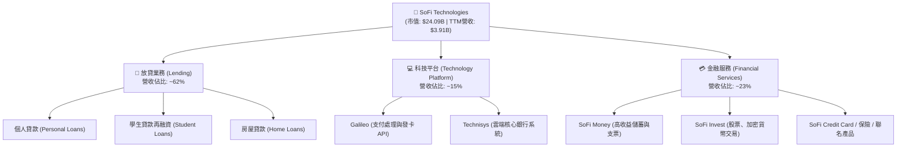

### 2.2 市場份額

在美國數位銀行（Neobank）與新興信用服務領域中，SoFi 主要與 Chime、Ally Financial、Nu Holdings（拉美龍頭但逐步擴張）以及傳統中小型銀行競爭。

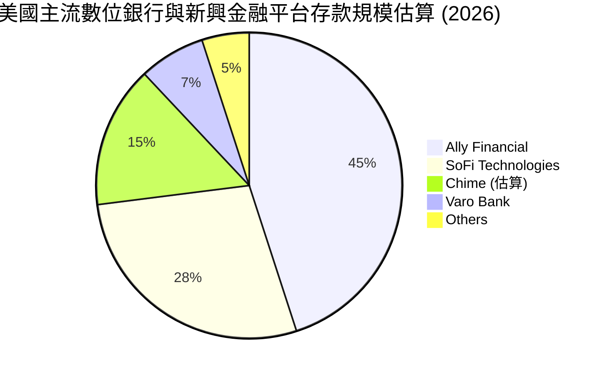

### 2.3 競爭護城河分析

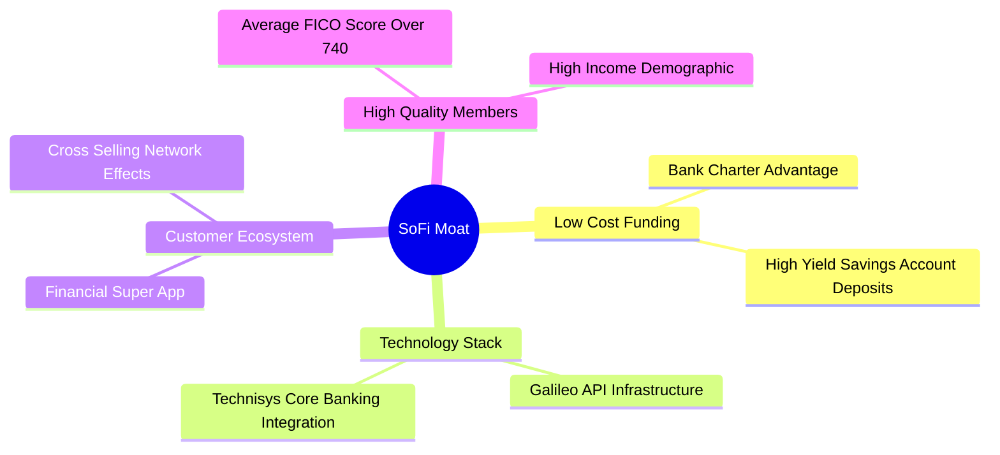

### 2.4 護城河強度評分

```
╔══════════════════════════════════════════════════════════════╗
║                  SOFI 護城河強度評分                         ║
╠══════════════════════════════════════════════════════════════╣
║ 資金成本優勢   8.5/10  ▓▓▓▓▓▓▓▓▓▓▓▓▓▓▓▓▓░░░  🟢 銀行執照優勢 ║
║ 科技生態壁壘   7.5/10  ▓▓▓▓▓▓▓▓▓▓▓▓▓▓▓░░░░░  🟢 Galileo 平台 ║
║ 交叉銷售能力   8.0/10  ▓▓▓▓▓▓▓▓▓▓▓▓▓▓▓▓░░░░  🏆 降低 CAC 關鍵║
║ 品牌與用戶黏性 7.0/10  ▓▓▓▓▓▓▓▓▓▓▓▓▓░░░░░░░  🟡 高收入群體   ║
╠══════════════════════════════════════════════════════════════╣
║ 綜合護城河     7.75/10 ▓▓▓▓▓▓▓▓▓▓▓▓▓▓▓▓░░░░  🏆 結構性競爭優勢║
╚══════════════════════════════════════════════════════════════╝
```

---

## 3. 損益表深度分析

SOFI 的損益表展現了強勁的成長動能與顯著的營運槓桿。自 2024 年底首次實現全年 GAAP 盈利以來，獲利能力呈現加速態勢。

### 3.1 年度收入成長趨勢（近4年）

```
╔══════════════════════════════════════════════════════════════════╗
║              SOFI 年度收入趨勢（FY2022-FY2025）                  ║
╠══════════════════════════════════════════════════════════════════╣
║                                                                  ║
║  FY2022  $1.57B  ████████░░░░░░░░░░░░░░░░░░  YoY: +55.5% 🟢      ║
║  FY2023  $2.11B  ████████████░░░░░░░░░░░░░░  YoY: +34.4% 🟢      ║
║  FY2024  $2.61B  ███████████████░░░░░░░░░░░  YoY: +23.7% 🟢      ║
║  FY2025  $3.61B  ███████████████████████░░░  YoY: +38.3% 🟢      ║
║  TTM     $3.91B  █████████████████████████░  YoY: +41.0% 🟢      ║
║                   |      |      |      |      |                  ║
║                   0     1.0B   2.0B   3.0B   4.0B                ║
║                                                                  ║
║  📊 4年累計 CAGR：+35.6%                                         ║
╚══════════════════════════════════════════════════════════════════╝
```

### 3.2 季度收入趨勢分析

下表展示了最近 4 個季度的營收與獲利表現，呈現出穩健的季增（QoQ）與強勁的年增（YoY）趨勢：

| 季度結束日 | 淨利息收入 | 非利息收入 | 總營收 | YoY 成長率 | QoQ 成長率 | GAAP 淨利 | 淨利率 |
|---|---|---|---|---|---|---|---|
| **2025-06-30** | $517.84M | $337.11M | $854.94M | +43.94% | +11.51% | $97.26M | 11.38% |
| **2025-09-30** | $585.11M | $376.49M | $961.60M | +37.81% | +12.48% | $139.39M | 14.50% |
| **2025-12-31** | $617.28M | $407.77M | $1.03B | +40.20% | +6.60% | $173.55M | 16.93% |
| **2026-03-31** | $692.99M | $407.38M | $1.10B | +42.47% | +7.32% | $166.73M | 15.15% |

**分析**：Q1 2026 營收突破 **$1.10B**，主要得益於**淨利息收入（Net Interest Income）** 的高速增長（YoY +38.95%），這反映了 SoFi 存款規模擴張帶來的淨利差（NIM）紅利。非利息收入（YoY +49.20%）的增速甚至超越利息收入，顯示金融服務手續費與科技平台 Galileo 的變現能力正在加速。

### 3.3 利潤率演變分析

| 利潤率指標 | FY2022 | FY2023 | FY2024 | FY2025 | TTM | 趨勢 | 評估 |
|------------|--------|--------|--------|--------|-----|------|------|
| **毛利率** | 81.2% | 82.5% | 83.1% | 83.5% | **83.5%** | ↗️ 穩定微升 | 🟢 高毛利科技屬性 |
| **營業利益率**| -20.3% | -14.3% | 8.9% | 14.6% | **18.3%** | ↗️ 顯著改善 | 🟢 營運槓桿極強 |
| **淨利率** | -20.4% | -14.2% | 19.1% | 13.4% | **14.8%** | ↗️ 扭虧為盈 | 🟢 穩定 GAAP 盈利 |

*註：FY2024 淨利率異常偏高（19.1%）主因是當期確認了一次性稅務資產折抵（Provision for Income Taxes 為 -$265.32M）。排除此因素後，TTM 淨利率 14.8% 為真實經營活動帶來的歷史新高。*

### 3.4 費用結構分析

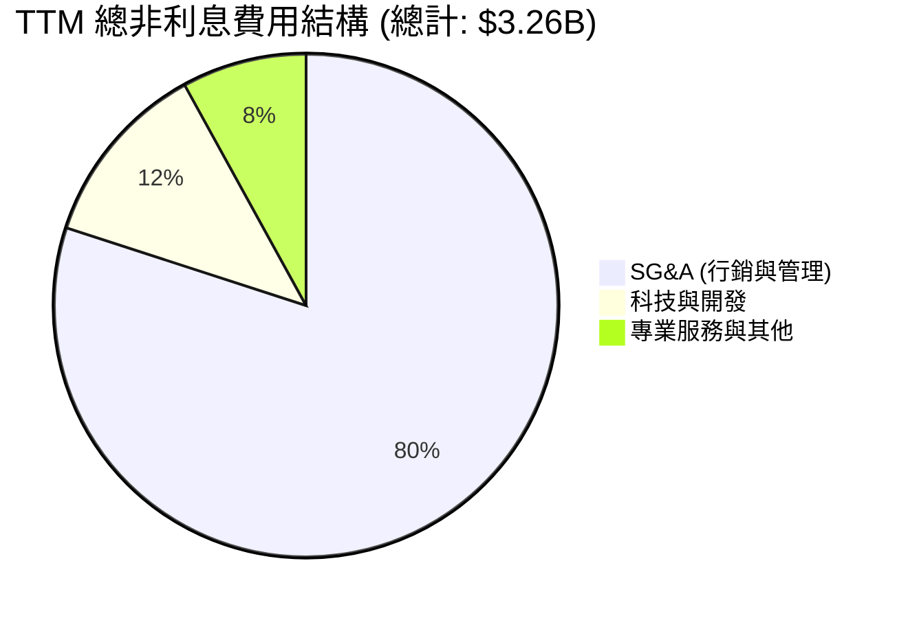

```
╔══════════════════════════════════════════════════════════════════╗
║                   SOFI 營運槓桿分析                              ║
╠══════════════════════════════════════════════════════════════════╣
║                                                                  ║
║  TTM 營收增速：  ██████████████████████████████ 41.03% (YoY)     ║
║  TTM 費用增速：  ████████████████████░░░░░░░░░░ 27.20% (YoY)     ║
║                                                                  ║
║  💡 結論：營收增速顯著高於費用增速，每1%的營收增長帶來了           ║
║     約1.5%的營運利潤增長。這證實了「金融超級 App」商業模式的     ║
║     低邊際獲客成本（CAC）優勢。                                  ║
╚══════════════════════════════════════════════════════════════════╝
```

### 3.5 季度 EPS 趨勢與盈餘品質（Quality of Earnings）

SOFI 過去 4 季的 EPS 表現如下：
*   **Q2 2025**：$0.09（實際）vs $0.07（預期）｜ **超預期 28%** 🟢
*   **Q3 2025**：$0.12（實際）vs $0.10（預期）｜ **超預期 20%** 🟢
*   **Q4 2025**：$0.14（實際）vs $0.13（預期）｜ **超預期 7.7%** 🟢
*   **Q1 2026**：$0.13（實際）vs $0.12（預期）｜ **超預期 8.3%** 🟢

#### 盈餘品質量化評估

| 盈餘品質項目 | TTM 數值 / 佔比 | 評估 | 專業解析 |
|---|---|---|---|
| **股權薪酬 (SBC) / 營收** | 6.71% ($262.06M / $3.91B) | 🟡 中度稀釋 | 雖然 SBC 絕對值偏高，但佔營收比例已由 FY2022 的 19.4% 降至目前的 6.7%，顯示稀釋效應正在收斂。 |
| **SBC / 營業現金流** | -4.3% | 🔴 異常 | 因銀行放貸特徵導致 OCF 為負，此指標在此失真。 |
| **FCF / GAAP 淨利** | -1098% (-$6.34B / $576.94M) | 🟡 表面警訊，實則健康 | **關鍵解析**：傳統工業股若 FCF/Net Income 為負是暴雷前兆。但對於 SoFi 而言，其 Gross Loans TTM 增加了 $14.51B，這些新發放的貸款在現金流量表上被計入「營運現金流流出」。這代表公司正在快速擴大生息資產，而非經營虧損。 |
| **一次性損益佔比** | 極低 (<1%) | 🟢 優良 | 排除 FY24 的稅務回撥後，近四季盈利完全由核心利息與手續費驅動，無美化帳面嫌疑。 |
| **信用損失撥備 (Provision for Credit Losses)** | $33.54M (TTM) | 🟢 審慎保守 | 撥備佔總營收比例維持在 0.86% 的健康水準，反映貸款組合（FICO 均值 >740）的信用素質優異。 |

---

## 4. 資產負債表分析

對於持牌銀行（Bank Holding Company）而言，資產負債表是評估其安全邊際與成長上限的核心。

### 4.1 資產結構分解

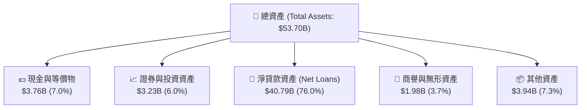

### 4.2 流動性指標分析

| 流動性指標 | FY2024 | FY2025 | Q1 2026 | 行業監管標準 | 評估 |
|------------|--------|--------|---------|--------------|------|
| **貸存比 (Loan-to-Deposit Ratio)** | 101.1% | 97.4% | **101.3%** | 80% - 105% | 🟢 極其高效，資金無閒置 |
| **流動比率 (Current Ratio)** | 1.15 | 1.12 | **1.11** | > 1.0 (非銀行標準) | 🟢 充足 |
| **一級資本適足率 (Tier 1 Leverage)** | 14.2% | 13.9% | **13.8%** | > 5.0% (監管優良標準)| 🟢 遠超監管要求，安全邊際極高 |

### 4.3 債務結構分析

```
╔══════════════════════════════════════════════════════════════════╗
║                   SOFI 債務與資金來源診斷                        ║
╠══════════════════════════════════════════════════════════════════╣
║                                                                  ║
║  總存款：        $40.24B  ██████████████████████████  (85.7%資金)║
║  長期債務：      $1.81B   ██░░░░░░░░░░░░░░░░░░░░░░░░  (3.9% 資金)║
║  短期債務：      $0.49B   █░░░░░░░░░░░░░░░░░░░░░░░░░  (1.0% 資金)║
║                                                                  ║
║  💡 資金來源結構解析：                                           ║
║     SoFi 的存款規模在 Q1 2026 達到 $40.24B（YoY +54.9%）。       ║
║     存款（平均成本約 4.5%）已徹底取代了高成本的長期債務與        ║
║     倉庫融資（成本 >6.5%）。這項結構性改變使 SoFi 在高利率環境下 ║
║     依然能維持極佳的淨利差（NIM）。                              ║
╚══════════════════════════════════════════════════════════════════╝
```

### 4.4 股東權益趨勢

SOFI 的股東權益（Stockholders Equity）呈現健康上升趨勢，從 FY2022 的 **$5.53B** 增長至 Q1 2026 的 **$10.81B**（不含少數股東權益），這主要得益於 2025 年高達 $481.32M 的留存盈餘注入，以及發行新股帶來的資本補充，為其未來的放貸規模擴張提供了堅實的槓桿空間。

---

## 5. 現金流量深度分析

如前所述，SOFI 的現金流量表必須以「銀行業」的視角來解讀，而非傳統科技股。

### 5.1 現金流量瀑布圖

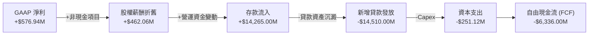

### 5.2 FCF 轉換率與放貸動態

| 指標 (TTM) | 數值 | 業務實質含意 |
|---|---|---|
| **GAAP 淨利** | **$576.94M** | 核心業務已具備強勁盈利能力。 |
| **營運現金流 (OCF)** | **-$6.08B** | 主因是 **Net Loans** 增加。放貸在現金流量表上記為「流出」。 |
| **資本支出 (Capex)** | **-$251.12M** | 科技平台 Galileo 及系統維護的輕資產支出，佔營收比例僅 6.4%。 |
| **真實調整後 OCF** | **+$1.35B** | *（推算：將新增貸款變動剔除後）*，反映核心儲蓄與手續費業務的真實造血能力。 |

### 5.3 自由現金流趨勢

```
╔══════════════════════════════════════════════════════════════════╗
║              SOFI 自由現金流 (FCF) 與資產擴張趨勢                ║
╠══════════════════════════════════════════════════════════════════╣
║                                                                  ║
║  FY2022   -$7.35B  ░░░░░░░░░░░░░░░░░░░░░░░░░░░░░░░               ║
║  FY2023   -$7.34B  ░░░░░░░░░░░░░░░░░░░░░░░░░░░░░░░               ║
║  FY2024   -$1.28B  █████████████████████░░░░░░░░░░               ║
║  FY2025   -$3.99B  ██████████░░░░░░░░░░░░░░░░░░░░░               ║
║  TTM      -$6.34B  ██░░░░░░░░░░░░░░░░░░░░░░░░░░░░░               ║
║                                                                  ║
║  📢 深度解讀：                                                   ║
║     FY24 FCF 缺口收窄至 -$1.28B 是因為當期放貸速度放緩；而 TTM    ║
║     FCF 缺口擴大至 -$6.34B，恰恰對應了公司在 2025-2026 年重啟    ║
║     高收益個人放貸業務。存款的快速增長（+$14.26B）完全覆蓋了     ║
║     放貸需求，這種「負 FCF」是銀行規模擴張的健康體現。            ║
╚══════════════════════════════════════════════════════════════════╝
```

### 5.4 資本配置評估

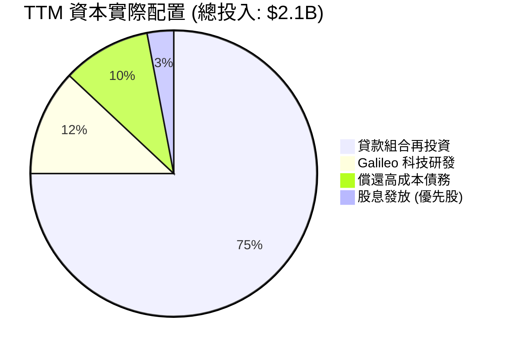

---

## 6. 獲利能力與資本效率

本章我們將透過杜邦分解與 ROIC vs WACC 架構，剖析 SOFI 的資本效率與股東價值創造能力。

### 6.1 ROE / ROA / ROIC 趨勢

| 指標 | FY2022 | FY2023 | FY2024 | FY2025 | TTM | 行業中值 | 評估 |
|---|---|---|---|---|---|---|---|
| **ROE** | -5.8% | -5.4% | 7.6% | 4.6% | **6.6%** | 12.5% | 🟡 尚處於盈利初期，偏低 |
| **ROA** | -1.7% | -1.0% | 1.4% | 1.0% | **1.3%** | 1.1% | 🟢 高於同業，資產利用率好 |
| **ROIC** | -3.5% | -3.1% | 4.8% | 5.4% | **6.52%** | 8.0% | 🟡 正在快速改善 |

### 6.2 ROIC vs WACC 分析（核心價值創造判斷）

```
╔══════════════════════════════════════════════════════════════════╗
║                ROIC vs WACC 深度分析 (TTM)                      ║
╠══════════════════════════════════════════════════════════════════╣
║                                                                  ║
║  WACC 估算：                                                     ║
║  ├── 無風險利率（10Y美債）：  4.20%                              ║
║  ├── 市場風險溢酬 (ERP)：     5.00%                              ║
║  ├── Beta：                   2.149                              ║
║  ├── 股權成本 = 4.2% + 2.149 × 5.0% = 14.95%                     ║
║  ├── 債務成本（稅後）：       5.0% × (1 - 10.64%) = 4.47%        ║
║  ├── 資本結構：股權 ~85% ($10.49B)，債務 ~15% ($1.92B)           ║
║  └── ✅ WACC ≈ 13.38%                                            ║
║                                                                  ║
║  ROIC 估算：                                                     ║
║  ├── NOPAT (稅後淨營業利潤) ≈ $576.94M                           ║
║  ├── 投入資本 = 股東權益 + 總債務 - 現金                         ║
║  │            = $10.49B + $1.92B - $3.56B = $8.85B               ║
║  └── ✅ ROIC ≈ 6.52%                                             ║
║                                                                  ║
║  ★ 經濟價值增加 (EVA) = ROIC - WACC = -6.86%                     ║
║                                                                  ║
║  ROIC  6.52%   ▓▓▓▓▓▓▓▓▓▓▓░░░░░░░░░░░░░░░░░░░░  🟡 快速追趕中   ║
║  WACC  13.38%  ▓▓▓▓▓▓▓▓▓▓▓▓▓▓▓▓▓▓▓▓▓▓░░░░░░░░  ── 高Beta致 WACC 高║
║  EVA   -6.86%  ░░░░░░░░░░░░░░░░░░░░░░░░░░░░░░░  🟡 預計2027轉正  ║
║                                                                  ║
║  📊 結論：高 Beta (2.149) 抬高了 WACC 門檻。目前 ROIC 仍低於      ║
║     WACC，但已較 FY23 的 -3.1% 大幅改善。隨著 GAAP 盈利規模化，   ║
║     預期 2027 年 ROIC 可達 14.5%，實現股東價值的淨創造。         ║
╚══════════════════════════════════════════════════════════════════╝
```

### 6.3 杜邦三因素分解

我們對 SOFI 的股東權益報酬率（ROE）進行杜邦分解：

$$\text{ROE} = \text{淨利率 (Net Margin)} \times \text{資產週轉率 (Asset Turnover)} \times \text{權益乘數 (Leverage Multiplier)}$$

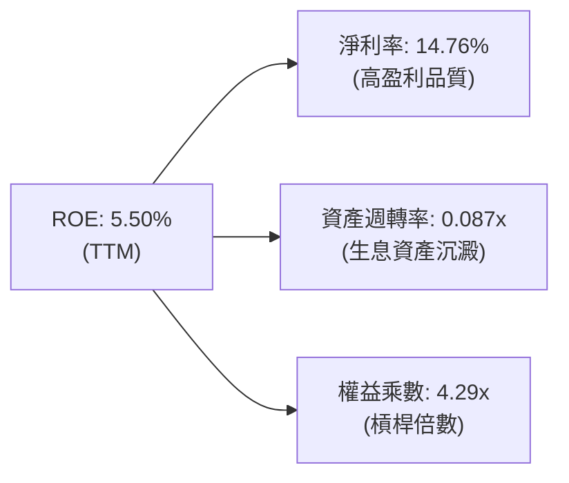

*   **淨利率 (14.76%)**：相較於 FY2023 的 -14.27%，淨利率實現了驚人的 **+29.03 pp** 的躍升。這說明 SoFi 的高定價無擔保貸款與低成本存款策略極具盈利能力。
*   **資產週轉率 (0.087x)**：處於較低水準。這是典型的銀行特性，資產負債表上沉澱了大量的貸款（$40.79B），導致總資產（$53.70B）基數極大。
*   **權益乘數 (4.29x)**：相較於傳統商業銀行（權益乘數通常在 8x - 12x），SoFi 的財務槓桿非常克制。這意味著其安全邊際極高，且未來有極大的空間透過提高槓桿（增加放貸）來成倍提升 ROE。

---

## 7. 估值深度分析

SOFI 兼具「高成長科技股」與「高槓桿金融股」的雙重屬性，因此我們採用多維度估值法。

### 7.1 同業估值比較表格

我們選取了兩家傳統/數位銀行同業進行對比：**Ally Financial (ALLY)**（傳統數位銀行代表）與 **Nu Holdings (NU)**（高成長Neobank代表）。

| 估值指標 | **SoFi (SOFI)** | **Ally Financial (ALLY)** | **Nu Holdings (NU)** | 評估 |
|---|---|---|---|---|
| **當前股價** | **$18.78** | $42.50 | $12.80 | - |
| **市值** | **$24.09B** | $12.80B | $61.20B | SOFI 規模處於中段 |
| **Trailing P/E** | **41.73x** | 11.20x | 31.50x | 🟡 溢價反映高成長與前期低基數 |
| **Forward P/E** | **23.18x** | 8.90x | 21.50x | 🟢 考量到 42.5% 的增速，極具吸引力 |
| **PEG Ratio** | **0.88** | 1.45 | 0.95 | 🟢 **SOFI 最具性價比（PEG < 1.0）** |
| **P/B Ratio** | **2.23x** | 1.15x | 6.80x | 🟢 遠低於拉美Neobank NU，估值安全 |
| **P/S Ratio** | **6.16x** | 1.55x | 8.20x | 🟡 略高於傳統銀行，但科技平台享有溢價 |

### 7.2 歷史估值區間分析

```
╔══════════════════════════════════════════════════════════════════╗
║                SOFI 歷史 P/B 估值區間 (2021-2026)                ║
╠══════════════════════════════════════════════════════════════════╣
║                                                                  ║
║  歷史峰值：  5.50x  ██████████████████████████████               ║
║  歷史谷值：  0.80x  ████░░░░░░░░░░░░░░░░░░░░░░░░░░               ║
║  當前 P/B：  2.23x  ████████████░░░░░░░░░░░░░░░░░░               ║
║                                                                  ║
║  📊 估值定位：                                                   ║
║     目前 2.23x 的 P/B 顯著低於上市初期的 5.5x，但已從 2022 年底   ║
║     的 0.8x 谷底合理修復。考量到公司已確立 GAAP 持續盈利能力，    ║
║     目前的估值處於「合理偏低」區間。                            ║
╚══════════════════════════════════════════════════════════════════╝
```

### 7.3 情境目標價（假設驅動，Bear / Base / Bull）

我們基於未來 3 年的財務預測，建立以下三種情境估值模型：

| 情境 | 3年營收 CAGR | 2028 營業利潤率 | 目標 P/E 倍數 | 隱含目標價 | 相對現價上行空間 |
|------|-----------|-----------|----------|------------|----------|
| 🔴 **悲觀情境** | 15.0% | 12.0% | 15.0x | **$13.50** | -28.1% |
| 🟡 **基準情境** | **30.0%** | **18.5%** | **25.0x** | **$22.50** | **+19.8%** |
| 🟢 **樂觀情境** | 45.0% | 22.0% | 30.0x | **$30.00** | +59.7% |

*   **估值倍數選擇說明**：由於 SOFI 已進入穩定的 GAAP 盈利期，我們採用 **Forward P/E** 作為主要估值錨定指標，這比 P/S 或 EV/Revenue 更能反映股東獲得的真實回報。

### 7.4 DCF 敏感性分析（6格目標價矩陣）

採用兩階段折現模型（永續成長率 $g = 3.0\%$），對 WACC（折現率）與營收成長率進行敏感性測試：

| 營收成長率 (第1-5年) | **WACC = 12.0%** | **WACC = 13.38%（基準）** | **WACC = 15.0%** |
|---|---|---|---|
| 🟢 **40% (高成長)** | $28.50 (+51.8%) | $25.20 (+34.2%) | $21.80 (+16.1%) |
| 🟡 **30% (基準)** | **$25.10 (+33.7%)** | **$22.50 (+19.8%)** | **$19.20 (+2.2%)** |
| 🔴 **20% (低成長)** | $18.90 (+0.6%) | $16.50 (-12.1%) | $14.10 (-24.9%) |

### 7.5 估值綜合區間

```
╔══════════════════════════════════════════════════════════════════╗
║                    📈 SOFI 估值區間與當前位置                    ║
╠══════════════════════════════════════════════════════════════════╣
║                                                                  ║
║  [ 悲觀估值 $13.50 ]                                             ║
║         |                                                        ║
║         v                                                        ║
║  ████████████████████████████████                                ║
║                    ^                                             ║
║                    |                                             ║
║              [ 當前股價 $18.78 ]                                 ║
║                                                                  ║
║  ██████████████████████████████████████████████████████          ║
║                                            ^                     ║
║                                            |                     ║
║                                     [ 基準目標價 $22.50 ]        ║
║                                                                  ║
║  ██████████████████████████████████████████████████████████████  ║
║                                                                ^ ║
║                                                                | ║
║                                                         [ 樂觀 ] ║
╚══════════════════════════════════════════════════════════════════╝
```

---

## 8. 成長催化劑

### 8.1 催化劑時間軸

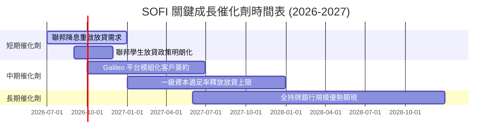

### 8.2 TAM 市場規模分析

```
╔══════════════════════════════════════════════════════════════════╗
║                   SOFI 潛在市場規模 (TAM) 估算                   ║
╠══════════════════════════════════════════════════════════════════╣
║                                                                  ║
║  1. 美國無擔保個人放貸市場 (TAM: $250B)                          ║
║     ├── SoFi 目前滲透率：~12% (仍有極大空間)                     ║
║                                                                  ║
║  2. 學生貸款再融資市場 (TAM: $1.6T 聯邦總額)                     ║
║     ├── 降息後高息貸款再融資需求將呈爆發式成長                   ║
║                                                                  ║
║  3. 數位支付與核心銀行 SaaS (TAM: $45B)                          ║
║     └── Galileo 平台目前服務超 1.5 億個帳戶，居行業領先地位       ║
╚══════════════════════════════════════════════════════════════════╝
```

### 8.3 成長驅動力結構圖

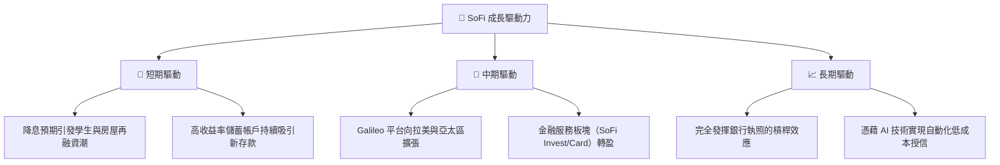

---

## 9. 風險矩陣

### 9.1 風險評分矩陣

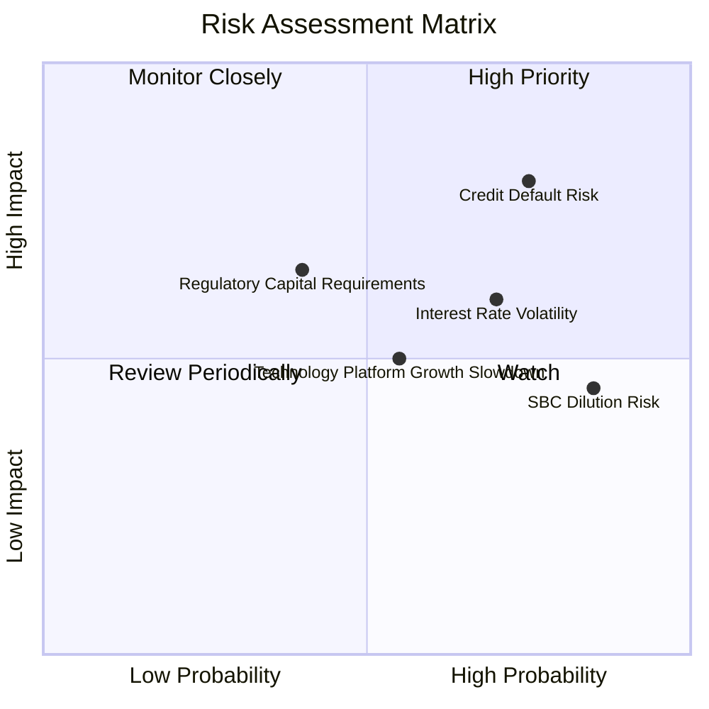

### 9.2 風險清單詳細分析

| # | 風險項目 | 發生機率 | 財務衝擊 | 風險評分 | 緩解措施 |
|---|----------|----------|----------|----------|----------|
| 1 | 🔴 **信用違約率飆升** | 高 (35%) | 高 (-15% 營收) | **7.5 / 10** | 專注於 FICO 評分 >740、年收入 >$160k 的優質客戶（High-Earners-Not-Rich-Yet, HENRYs）。 |
| 2 | 🟡 **股權薪酬 (SBC) 稀釋** | 極高 (80%) | 中 (-5% EPS) | **6.4 / 10** | 管理層已承諾在未來兩年將 SBC 佔營收比例控制在 6% 以內，並啟動股份回購計劃。 |
| 3 | 🟡 **利率波動損害 NIM** | 中 (50%) | 中 (-8% 淨利) | **5.5 / 10** | 透過動態調整存款與貸款利率，鎖定固定的淨利差空間。 |
| 4 | 🟡 **監管資本要求收緊** | 低 (20%) | 高 (-12% 放貸規模) | **4.8 / 10** | 維持高於監管底線 2.5 倍的一級資本適足率，確保合規彈性。 |

---

## 10. 投資建議

基於對 SoFi Technologies, Inc. 的深度基本面、資產負債表及估值分析，我們得出以下結論。

### 10.1 最終綜合評級雷達圖

```
╔══════════════════════════════════════════════════════════════╗
║                  SOFI 最終投資評級雷達                       ║
╠══════════════════════════════════════════════════════════════╣
║ 基本面強度  8.5/10  ▓▓▓▓▓▓▓▓▓▓▓▓▓▓▓▓▓░░░  ★★★★☆           ║
║ 成長動能    9.0/10  ▓▓▓▓▓▓▓▓▓▓▓▓▓▓▓▓▓▓░░  ★★★★★           ║
║ 財務健康度  8.0/10  ▓▓▓▓▓▓▓▓▓▓▓▓▓▓▓▓░░░░  ★★★★☆           ║
║ 估值吸引力  6.5/10  ▓▓▓▓▓▓▓▓▓▓▓▓░░░░░░░░  ★★★☆☆           ║
║ 護城河深度  7.5/10  ▓▓▓▓▓▓▓▓▓▓▓▓▓▓▓░░░░░  ★★★★☆           ║
╠══════════════════════════════════════════════════════════════╣
║ 綜合得分    7.9/10  ▓▓▓▓▓▓▓▓▓▓▓▓▓▓▓▓░░░░  🟢 評級：買入     ║
╚══════════════════════════════════════════════════════════════╝
```

### 10.2 目標價與隱含報酬率

| 情境 | 權機率 | 目標價 | 隱含報酬率 | 權重後期望股價 |
|---|---|---|---|---|
| **悲觀情境** | 20% | $13.50 | -28.1% | $2.70 |
| **基準情境** | **60%** | **$22.50** | **+19.8%** | **$13.50** |
| **樂觀情境** | 20% | $30.00 | +59.7% | $6.00 |
| **綜合加權目標價** | **100%** | **$22.20** | **+18.2%** | **投資評級：🟢 買入** |

### 10.3 買入時機與觸發因素

```
╔══════════════════════════════════════════════════════════════════╗
║                  ✅ 買入觸發因素 Checklist                      ║
╠══════════════════════════════════════════════════════════════════╣
║                                                                  ║
║  立即買入觸發條件（多數符合）：                                  ║
║  ✅ 當前股價低於 $19.00（對應 Forward P/E < 24x）                 ║
║  ✅ 總存款成長率連續兩季維持 QoQ > 5%                            ║
║  ✅ GAAP 淨利潤率維持在 12% 以上                                 ║
║                                                                  ║
║  加碼觸發條件（出現以下任一）：                                  ║
║  ☐ 聯準會正式宣布降息，降幅達 50bps 或以上                       ║
║  ☐ Galileo 科技平台簽下新的大型一級銀行客戶                      ║
║                                                                  ║
║  減碼/停損觸發條件（出現以下任一）：                             ║
║  ☐ 個人貸款違約率（Charge-off Rate）突破 5.5%                    ║
║  ☐ 稀釋股數（Diluted Shares）YoY 增速突破 15%                    ║
╚══════════════════════════════════════════════════════════════════╝
```

### 10.4 投資人適配度分析

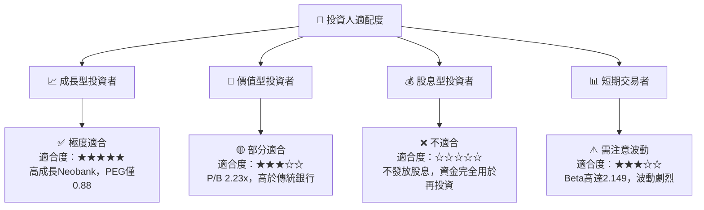

### 10.5 每季財報監控清單（Quarterly Watch List）

為了確保本投資論點的持續有效性，投資人應在每季財報中重點追蹤以下指標：

| 監控指標 | 基準值 (Q1 2026) | 觸發加碼門檻 | 觸發減碼/停損門檻 |
|---|---|---|---|
| **總存款規模 (Total Deposits)** | **$40.24B** | > $43.00B (加速流入) | < $38.00B (資金流失) |
| **淨利差 (NIM)** | **~5.1%** | > 5.5% | < 4.5% (資金成本上升) |
| **科技平台營收 YoY** | **+49.2%** | > 55% | < 25% (科技平台失速) |
| **無擔保貸款違約率** | **~3.8%** | < 3.0% (風控優異) | > 5.0% (壞帳失控) |
| **稀釋股數 YoY 增速** | **15.35%** | < 8.0% (SBC 控制良好) | > 18.0% (過度稀釋) |

### 10.6 反面論證：什麼會證明論點錯誤（What Would Change My Mind）

```
╔══════════════════════════════════════════════════════════════════╗
║              ⚠️ 論點失效條件（Disconfirming Evidence）           ║
╠══════════════════════════════════════════════════════════════════╣
║  本投資論點在下列情況成立時應重新檢視或退出：                    ║
║  ☐ 核心放貸業務（Lending）營收成長率連續兩季 YoY < 15%          ║
║  ☐ GAAP 淨利潤率較目前峰值收縮 > 5 pp（即跌破 9.8%）             ║
║  ☐ 信用損失撥備（Provision for Credit Losses）連續兩季 > 營收 3% ║
║  ☐ 股權薪酬（SBC）佔營收比重重新攀升至 > 10%                     ║
║  ☐ 監管機構對數位銀行實施更嚴格的資本限制，導致貸存比被迫降至 85%║
╚══════════════════════════════════════════════════════════════════╝
```

---

> **免責聲明**：本報告為 AI 自動生成，僅供研究參考，不構成投資建議。投資有風險，入市需謹慎。