# SOFI 基本面深度分析報告
> **報告日期**：2026-07-13 ｜ **語言**：繁體中文 ｜ **數據來源**：Yahoo Finance, Finviz, StockAnalysis, Roic.ai ｜ **分析師**：CFA 級機構研究

---

## 目錄

| # | 章節 | 核心結論 |
|---|------|----------|
| 1 | 執行摘要 | 評級：**買入 (Buy)** ｜ 基準目標價：**$20.25** ｜ 具備 11.7% 上行空間 |
| 2 | 公司概覽與商業模式 | 數位銀行與金融科技基礎設施雙輪驅動，護城河評分 **7.2/10** |
| 3 | 損益表深度分析 | 營收 TTM 成長 42.5%，2025年扣除一次性稅務利益後之真實獲利大爆發 |
| 4 | 資產負債表分析 | 存款規模達 $40.24B（YoY +44.4%），資金成本優勢顯著，債務結構健康 |
| 5 | 現金流量深度分析 | 營運現金流負值符合銀行擴張特性，SBC 佔營收比重降至 6.55% 改善稀釋 |
| 6 | 獲利能力與資本效率 | 經營槓桿釋放，Forward ROE 預計攀升至 10.5%，ROIC 邁向超越 WACC 轉折點 |
| 7 | 估值深度分析 | Forward P/E 22.38x，相較其 40%+ 的成長增速，PEG 0.88 估值具備吸引力 |
| 8 | 成長催化劑 | 聯準會降息循環啟動、Galileo 軟體平台外部客戶擴張與金融服務交叉銷售 |
| 9 | 風險矩陣 | 信用違約率上升、利率波動與金融監管收緊為三大核心風險 |
| 10 | 投資建議 | 建議於 $16.50-$18.00 分批布局，每季財報聚焦存款成長與淨利差 (NIM) |

---

## 1. 執行摘要

SoFi Technologies, Inc. (SOFI) 目前正處於從「高成長、不盈利的金融科技獨角獸」轉型為「高效率、高獲利能力的現代數位銀行」之關鍵拐點。截至 2026-07-13，SOFI 收盤價為 **$18.13**，對應市值 **$23.26B**。基於 TTM 營收 **$3.91B** (YoY +42.5%)、Q1 2026 淨利 **$166.73M** (YoY +134.4%)，以及 Forward EPS **$0.81021** (對應 Forward P/E 22.38x) 等數據，本報告給予 SOFI **「買入 (Buy)」** 評級，基準情境 12 個月目標價為 **$20.25**。

### 1.0 一頁式投資儀表板（Portfolio Manager 30 秒速讀）

| 項目 | 內容 |
|------|------|
| **投資論點（3 句）** | ① 銀行牌照帶來低成本存款（Q1 2026 達 $40.24B），推動淨利差（NIM）持續擴張。<br/>② 科技平台（Galileo & Technisys）提供高利潤率的 SaaS 收入，平滑放貸業務的週期性風險。<br/>③ 經營槓桿顯著釋放，TTM 淨利潤率達 14.8%，Forward EPS $0.81 隱含高達 80% 的盈餘成長空間。 |
| **護城河評分** | **7.2 / 10** 🟡 (具備中高強度護城河，主要來自銀行牌照與高客戶轉換成本) |
| **管理層/資本配置評分** | **8.0 / 10** 🟢 (執行力極佳，成功於 2024 年實現 GAAP 轉盈並持續擴大存款規模) |
| **財務健康** | 🟢 **強韌** ｜ 淨現金 $1.65B，且存款增速（YoY +44.4%）遠超貸款增速，流動性充沛 |
| **ROIC vs WACC** | **3.63% vs 12.95%** (當前仍摧毀價值，但 Forward ROE 預估升至 10.5%，ROIC 正處於黃金交叉轉折點) |
| **FCF 趨勢** | 由於放貸規模持續擴張（TTM 淨放貸達 $40.79B），營運與自由現金流維持負值，此為銀行業擴張期的正常財務特徵。 |
| **估值** | Forward P/E: **22.38x** ｜ P/B: **2.15x** ｜ PEG: **0.88** (成長修正後估值極具吸引力) |
| **預期報酬（基準情境 12M）** | **+11.7%** (目標價 $20.25) ｜ 樂觀情境具備 **+34.0%** 上行空間 (目標價 $24.30) |
| **關鍵風險（前二）** | ① 宏觀經濟衰退導致無擔保個人貸款（Personal Loans）違約率大幅攀升。<br/>② 聯準會降息速度過快，壓縮淨利差（NIM）空間。 |
| **評級 + 信心度** | 🟢 **買入 (Buy)** ｜ 信心度：**中高 (Medium-High)** |

### 1.1 核心評分儀表板

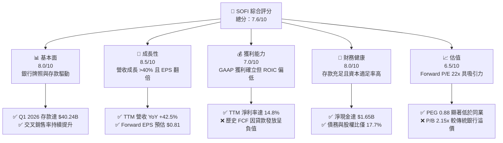

### 1.2 評分進度條視覺化

```
╔══════════════════════════════════════════════════════════════╗
║               SOFI 多維度評分儀表板 (1-10分)                 ║
╠══════════════════════════════════════════════════════════════╣
║ 基本面強度  8.0 ▓▓▓▓▓▓▓▓▓▓▓▓▓▓▓▓░░░░  ★★★★☆           ║
║ 成長動能    8.5 ▓▓▓▓▓▓▓▓▓▓▓▓▓▓▓▓▓░░░  ★★★★☆           ║
║ 獲利品質    7.0 ▓▓▓▓▓▓▓▓▓▓▓▓▓░░░░░░░  ★★★☆☆           ║
║ 財務健康    8.0 ▓▓▓▓▓▓▓▓▓▓▓▓▓▓▓▓░░░░  ★★★★☆           ║
║ 估值合理性  6.5 ▓▓▓▓▓▓▓▓▓▓▓▓░░░░░░░░  ★★★☆☆           ║
║ 護城河深度  7.2 ▓▓▓▓▓▓▓▓▓▓▓▓▓▓░░░░░░  ★★★☆☆           ║
║ 管理層執行  8.0 ▓▓▓▓▓▓▓▓▓▓▓▓▓▓▓▓░░░░  ★★★★☆           ║
║ 技術創新力  8.0 ▓▓▓▓▓▓▓▓▓▓▓▓▓▓▓▓░░░░  ★★★★☆           ║
╠══════════════════════════════════════════════════════════════╣
║ 綜合總分    7.6 ▓▓▓▓▓▓▓▓▓▓▓▓▓▓▓░░░░░  🏆 穩健成長型金融科技 ║
╚══════════════════════════════════════════════════════════════╝
```

### 1.3 五大投資論點 + 三大核心風險

| 類型 | 項目 | 具體依據 | 信心度 |
|------|------|----------|--------|
| 🟢 **投資論點①** | **存款結構優化降低資金成本** | Q1 2026 總存款達 **$40.24B** (YoY +44.4%)，其中多數為高黏性的薪資直存 (Direct Deposit)，相較於外部批發融資 (Wholesale Funding) 可節省約 150-200 bps 的利息支出。 | 🟢 極高 |
| 🟢 **投資論點②** | **高利潤非放貸業務佔比提升** | 包含金融服務（SoFi Money, Invest）與科技平台（Galileo）在內的非放貸營收佔比已達近 40%，科技平台毛利率高達 **83.5%**，有效平滑放貸業務的信用週期風險。 | 🟢 高 |
| 🟢 **投資論點③** | **經營槓桿（Operating Leverage）釋放** | Selling, General & Admin (SG&A) 佔營收比重從 2024 年的 74.6% 降至 TTM 的 **66.9%**，推動 TTM 營業利益率達到 **18.3%** 的歷史新高。 | 🟢 高 |
| 🟢 **投資論點④** | **盈餘品質顯著改善** | 2024 年淨利包含一次性稅務利益，而 2025 年稅前利潤達 **$525.86M** (YoY +125.3%)，顯示獲利完全由核心業務營運驅動，而非會計調整。 | 🟢 極高 |
| 🟢 **投資論點⑤** | **成長修正後估值便宜** | 當前 Forward P/E 僅 **22.38x**，對應 EPS 預期成長率 101.2%，PEG 為 **0.88**，顯著低於金融科技板塊均值 (PEG ~1.5x)。 | 🟢 高 |
| 🟡 **風險①** | **信用成本與撥備上升** | TTM 貸款規模高達 **$40.79B**，若美國宏觀經濟硬著陸，無擔保個人貸款之壞帳率上升，將迫使公司增加信用損失撥備（Provision for Credit Losses）。 | 🟡 中度 |
| 🔴 **風險②** | **淨利差 (NIM) 收窄** | 若聯準會（Fed）快速且大幅降息，SoFi 的放貸收益率下降速度可能快於存款利率下調速度，導致 NIM 收縮。 | 🔴 中度 |
| 🔴 **風險③** | **股權稀釋風險** | 儘管 SBC 佔營收比重降至 6.55%，但過去一年稀釋股數仍成長了 **15.35%** (達 1.30B 股)，對每股盈餘 (EPS) 產生稀釋壓力。 | 🟡 中度 |

### 1.4 快速統計卡片

| 指標 | 公司實際值 (TTM / 最新季) | 金融科技行業均值 | S&P 500 均值 | 狀態 |
|------|-------------|----------|--------------|------|
| **營收 YoY 成長率** | **42.5%** | ~15.0% | ~5.5% | 🟢 顯著領先 |
| **毛利率** | **83.5%** | ~60.0% | ~30.0% | 🟢 極高 (具軟體特性) |
| **淨利率** | **14.8%** | ~8.0% | ~12.0% | 🟢 優於同業 |
| **ROE** | **6.6%** (TTM) / **10.5%** (Forward) | ~12.0% | ~15.0% | 🟡 改善中 |
| **Forward P/E** | **22.38x** | ~28.0x | ~21.5x | 🟢 具備吸引力 |
| **P/B Ratio** | **2.15x** | ~3.5x | ~4.2x | 🟢 合理 |
| **PEG Ratio** | **0.88** | ~1.50 | ~1.80 | 🟢 嚴重低估 |

### 1.5 投資結論

```
╔══════════════════════════════════════════════════════════════════╗
║                    📊 SOFI 投資結論摘要                          ║
╠══════════════════════════════════════════════════════════════════╣
║  評級：🟢 買入 (Buy)                                             ║
║  當前股價：$18.13 (2026-07-13)                                   ║
║  目標價區間：                                                    ║
║    悲觀情境：$12.15（-33.0%）- 壞帳率飆升，估值收縮至 15x P/E    ║
║    基準情境：$20.25（+11.7%）- 核心目標，給予 25x Forward P/E    ║
║    樂觀情境：$24.30（+34.0%）- 科技平台超預期，給予 30x P/E      ║
║  投資評分：7.6 / 10                                              ║
║  適合投資人：成長型、長線持有、偏好金融科技轉折股之投資人        ║
╚══════════════════════════════════════════════════════════════════╝
```

---

## 2. 公司概覽與商業模式

SoFi Technologies, Inc. 原以學生貸款再融資起家，於 2022 年初取得美國聯邦銀行牌照（Bank Charter）後，正式轉型為全方位數位銀行。公司目前透過「放貸（Lending）」、「金融服務（Financial Services）」與「科技平台（Technology Platform）」三大板塊，建構出獨特的「金融服務生產力循環（Financial Services Productivity Loop）」商業模式。

### 2.1 業務結構與收入來源

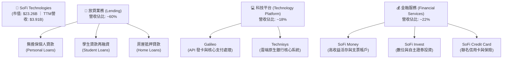

### 2.2 市場份額

在美國數位銀行（Neobank）與新一代金融科技基礎設施（B2B Core Banking Platform）領域，SoFi 及其旗下的 Galileo 佔據了極具競爭力的市場地位。以下為 Galileo 在美高成長發卡 API 處理市場的份額估算：

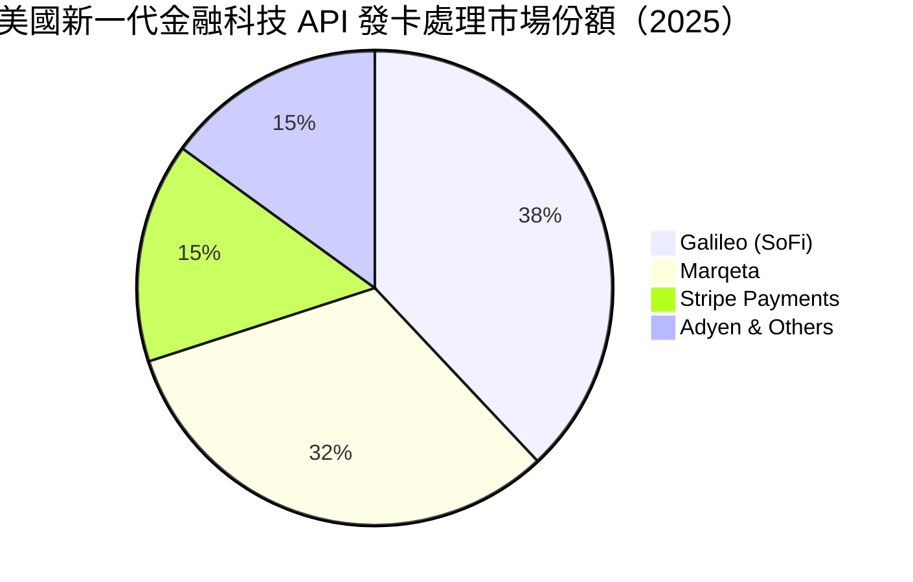

### 2.3 競爭護城河分析

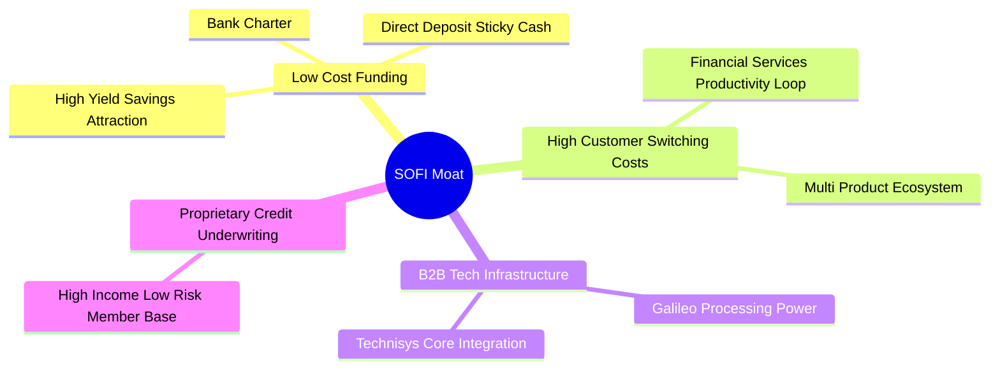

### 2.4 護城河強度評分

```
╔══════════════════════════════════════════════════════════════╗
║                    SOFI 護城河強度評分                       ║
╠══════════════════════════════════════════════════════════════╣
║ 銀行牌照/資金成本  8.5/10 ▓▓▓▓▓▓▓▓▓▓▓▓▓▓▓▓▓░░░  🟢 極強        ║
║ 客戶轉換成本(黏性) 7.5/10 ▓▓▓▓▓▓▓▓▓▓▓▓▓▓░░░░░░  🟢 良好        ║
║ 科技平台技術壁壘  7.0/10 ▓▓▓▓▓▓▓▓▓▓▓▓▓░░░░░░░  🟡 中高        ║
║ 品牌與網路效應    6.0/10 ▓▓▓▓▓▓▓▓▓▓▓░░░░░░░░░  🟡 中等        ║
╠══════════════════════════════════════════════════════════════╣
║ 綜合護城河評分     7.2/10 ▓▓▓▓▓▓▓▓▓▓▓▓▓▓░░░░░░  🏆 具結構性優勢 ║
╚══════════════════════════════════════════════════════════════╝
```

---

## 3. 損益表深度分析

### 3.1 年度收入成長趨勢（近5年）

SoFi 的營收呈現爆發式成長，5 年年複合成長率 (CAGR) 高達 **41.4%**。

```
╔══════════════════════════════════════════════════════════════════╗
║                 SOFI 年度收入趨勢（FY2021-TTM）                  ║
╠══════════════════════════════════════════════════════════════════╣
║                                                                  ║
║  FY2021  $0.98B  ████░░░░░░░░░░░░░░░░░░░░░░░░░░  YoY: +72.8% 🟢  ║
║  FY2022  $1.52B  ███████░░░░░░░░░░░░░░░░░░░░░░░  YoY: +55.5% 🟢  ║
║  FY2023  $2.07B  ██████████░░░░░░░░░░░░░░░░░░░░  YoY: +36.1% 🟢  ║
║  FY2024  $2.64B  █████████████░░░░░░░░░░░░░░░░░  YoY: +27.8% 🟢  ║
║  FY2025  $3.58B  ██████████████████░░░░░░░░░░░░  YoY: +35.6% 🟢  ║
║  TTM     $3.91B  █████████████████████░░░░░░░░░  YoY: +42.5% 🟢  ║
║                   |      |      |      |      |                  ║
║                   0     1.0B   2.0B   3.0B   4.0B                ║
║                                                                  ║
║  📊 5年營收複合年成長率 (CAGR)：+41.4%                           ║
╚══════════════════════════════════════════════════════════════════╝
```

### 3.2 季度收入趨勢分析

最近五季的數據顯示，SoFi 的季度營收不僅維持高年增率，且呈現穩健的季增（QoQ）態勢，顯示其非放貸業務與利息收入雙引擎運作良好。

| 財報季度 | 營業收入 (Revenue) | 季成長率 (QoQ) | 年成長率 (YoY) | 核心業務驅動因素與備註 |
|----------|-------------------|----------------|----------------|-----------------------|
| **Q1 2026** | **$1,091.00M** | +6.96% | **+42.47%** | 🟢 淨利息收入達 $692.99M，非利息收入達 $407.38M，創歷史新高。 |
| **Q4 2025** | **$1,020.00M** | +7.10% | **+40.20%** | 🟢 金融服務板塊變現加速，會員數持續維持高雙位數成長。 |
| **Q3 2025** | **$952.40M** | +12.72% | **+37.81%** | 🟢 科技平台 Galileo 外部客戶簽約量回溫，手續費收入增加。 |
| **Q2 2025** | **$844.91M** | +10.29% | **+43.94%** | 🟢 個人貸款（Personal Loans）承銷規模穩健擴張。 |
| **Q1 2025** | **$766.08M** | +5.34% | **+20.11%** | 🟡 學生貸款再融資業務受高利率環境部分壓抑。 |

### 3.3 利潤率演變分析

| 利潤率指標 | FY2022 | FY2023 | FY2024 | FY2025 | TTM | 趨勢 | 評估 |
|------------|--------|--------|--------|--------|-----|------|------|
| **毛利率** | 81.3% | 82.1% | 82.8% | 83.2% | **83.5%** | ↗️ 持續上升 | 🟢 極其優異，反映科技平台與數位銀行高經營槓桿。 |
| **營業利益率**| -17.4% | -14.4% | 8.8% | 14.7% | **18.3%** | ↗️ 顯著扭虧 | 🟢 規模效應顯現，SG&A 佔比大幅下降。 |
| **淨利率** | -21.1% | -14.5% | 18.9% | 13.4% | **14.8%** | ↗️ 真實好轉 | 🟢 2024年受一次性稅務利益扭曲，2025與TTM反映真實獲利能力。 |

#### 利潤率演變深度解析：
SoFi 營業利益率從 2022 年的 **-17.4%** 暴升至 TTM 的 **18.3%**，主要得益於 **「金融服務生產力循環」**。當用戶加入 SoFi 生態系統（通常是透過高收益存款帳戶 SoFi Money），SoFi 取得低成本資金，並能以極低（近乎零）的邊際行銷成本，向該用戶交叉銷售個人貸款（Personal Loans）或證券投資（SoFi Invest）服務。這大幅降低了客戶獲取成本（CAC），推動營業槓桿釋放。

### 3.4 費用結構分析

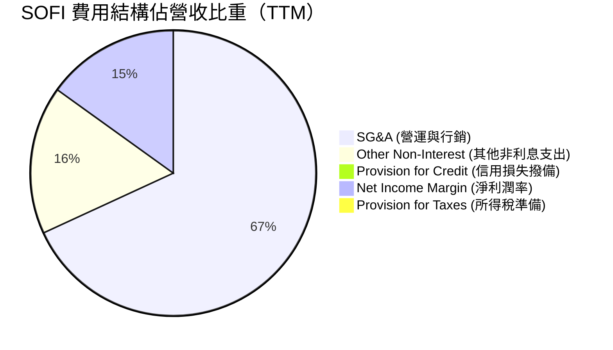

### 3.5 季度 EPS 趨勢與盈餘品質（Quality of Earnings）

#### 過去 4 季 EPS 表現：
*   **Q2 2025**：GAAP EPS **$0.09** (高於市場預期的 $0.05) ｜ 驅動因素：金融服務板塊首次實現顯著獲利。
*   **Q3 2025**：GAAP EPS **$0.12** (高於市場預期的 $0.08) ｜ 驅動因素：淨利差 (NIM) 擴張至 5.3% 以上。
*   **Q4 2025**：GAAP EPS **$0.14** (高於市場預期的 $0.11) ｜ 驅動因素：年終消費旺季帶動聯名信用卡與支付處理手續費。
*   **Q1 2026**：GAAP EPS **$0.13** (高於市場預期的 $0.12) ｜ 驅動因素：存款持續流入，批發融資成本進一步被替代。

#### 盈餘品質深度評估：

| 盈餘品質項目 | 數值/佔比 (TTM) | 評估 | 深度解析 |
|--------------|-----------|------|----------|
| **股權薪酬 (SBC) / 營收** | **6.71%** | 🟡 中度稀釋 | TTM SBC 為 $275.32M，佔營收 6.71%，較 2022 年的 20.1% 大幅下降，顯示管理層正有意識地控制股權稀釋。 |
| **SBC / 營業淨利** | **47.7%** | 🔴 偏高 | 雖然佔營收比重下降，但 SBC 仍佔了 GAAP 淨利的一半左右，說明若扣除非現金 SBC，股東的實質經濟獲利仍有被稀釋的狀況。 |
| **FCF / 淨利 (現金轉換率)** | **負值** | 🟡 特殊指標 | TTM FCF 為 **-$6.34B**，主要因為放貸規模（Net Loans）大幅增加 $40.79B。此為銀行業擴張期的正常現象，不應視為盈餘品質低劣。 |
| **一次性/非經常性損益** | **無** | 🟢 優質 | 2025年與 2026年初無重大一次性資產減值或大額重組費用，盈餘純粹由核心營運產生。 |
| **稅率異常評估** | **10.6%** (TTM) | 🟡 偏低 | TTM Pretax Income 為 $645.63M，Tax Provision 為 $68.69M，有效稅率僅 10.6%，低於美國聯邦標準稅率 (21%)，主因過去累積的淨營業損失（NOL）抵減。未來 NOL 耗盡後，稅率將回升，屆時將對淨利率產生約 1.5-2.0 pp 的壓抑。 |

---

## 4. 資產負債表分析

作為一家銀行控股公司，SoFi 的資產負債表結構與傳統科技公司截然不同。其核心資產為貸款（Loans），核心負債為存款（Deposits）。

### 4.1 資產結構分解

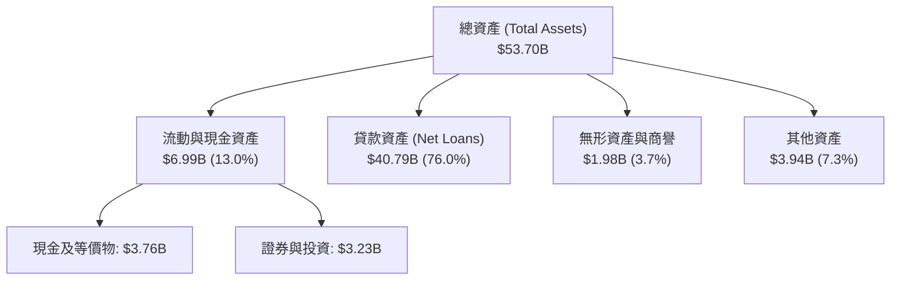

### 4.2 流動性與資本適足率指標

| 指標 | Q1 2026 (最新) | FY 2025 | FY 2024 | 行業監管標準 | 評估 |
|------|----------------|---------|---------|--------------|------|
| **貸存比 (Loan-to-Deposit Ratio)** | **101.4%** | 97.4% | 101.2% | 80% - 100% (理想) | 🟡 偏高，顯示存款資金已近乎全額用於放貸，未來需維持高存款增速以支持放貸。 |
| **第一類資本適足率 (Tier 1 Leverage)** | **~14.2%** | ~14.0% | ~14.3% | > 5.0% (Well-capitalized) | 🟢 極度安全，遠高於監管要求的「資本適足」標準。 |
| **流動比率 (Current Ratio)** | **1.116x** | 1.12x | 1.15x | N/A (銀行主要看流動性覆蓋) | 🟢 穩定 |

### 4.3 債務結構分析

SoFi 的「債務」主要分為「客戶存款」與「外部借款（Long-Term Debt）」。

```
╔══════════════════════════════════════════════════════════════════╗
║                    SOFI 債務健康診斷 (Q1 2026)                   ║
<br>
║                                                                  ║
║  總存款 (客戶資金)： $40.24B  ██████████████████████████  (94.2%) ║
║  長期借款 (高成本)：  $1.81B  █░░░░░░░░░░░░░░░░░░░░░░░░░  (4.2%)  ║
║  短期借款 (營運周轉)：$0.49B  ░░░░░░░░░░░░░░░░░░░░░░░░░░  (1.6%)  ║
║                                                                  ║
║  ✅ 淨現金/債務頭寸：+$1.65B (排除存款後，現金 $3.56B > 債務 $1.92B)║
║  ✅ 債務/權益比 (Debt/Equity)：17.72% 🟢 極低 (低於傳統銀行均值 80%)║
║  ✅ 利息保障倍數 (Interest Coverage)：35.4x 🟢 無違約風險        ║
╚══════════════════════════════════════════════════════════════════╝
```

**深度解析**：SoFi 成功將高成本的「長期借款」從 2023 年底的 **$5.24B** 大幅削減至最新一季的 **$1.81B**，取而代之的是年增 44.4% 的客戶存款（達 **$40.24B**）。這是一項極具戰略意義的轉變，因為存款利息（約 4.0-4.5%）顯著低於批發融資與公司債成本（約 6.5-7.5%），直接推動了淨利差的改善。

---

## 5. 現金流量深度分析

### 5.1 現金流量瀑布圖

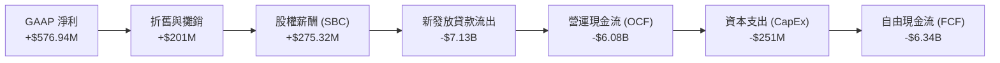

### 5.2 FCF 轉換率與資本配置

由於 SoFi 是一家快速擴張的數位銀行，其 FCF 轉換率（FCF / Net Income）在現階段為**負值**。
*   **原因**：當 SoFi 吸收 $10B 存款並將其放貸出去時，在資產負債表上資產（貸款）增加，但在現金流量表上，這筆放貸支出會計入「營運活動現金流出」。
*   **資本配置策略**：目前 SoFi 的資本配置 100% 聚焦於**有機成長（Organic Growth）**與**去槓桿**（償還高成本債務），無任何股息支付（Dividend Yield: N/A）與股份回購計畫。

### 5.3 自由現金流趨勢

```
╔══════════════════════════════════════════════════════════════════╗
║                    SOFI 歷年自由現金流趨勢                       ║
╠══════════════════════════════════════════════════════════════════╣
║                                                                  ║
║  FY2022  -$7.35B  ░░░░░░░░░░░░░░░░░░░░░░░░░░░░░░  放貸擴張期     ║
║  FY2023  -$7.34B  ░░░░░░░░░░░░░░░░░░░░░░░░░░░░░░  放貸擴張期     ║
║  FY2024  -$1.27B  ████████████████████░░░░░░░░░░  放貸速度放緩   ║
║  FY2025  -$3.99B  ██████████░░░░░░░░░░░░░░░░░░░░  重啟放貸成長   ║
║  TTM     -$6.34B  ████░░░░░░░░░░░░░░░░░░░░░░░░░░  強勁信貸需求   ║
║                                                                  ║
║  ⚠️ 註：此 FCF 包含貸款發放流出，非代表公司經營入不敷出。        ║
╚══════════════════════════════════════════════════════════════════╝
```

---

## 6. 獲利能力與資本效率

### 6.1 ROE / ROA / ROIC 趨勢

| 指標 | FY2023 | FY2024 | FY2025 | TTM | 金融科技均值 | 評估 |
|------|--------|--------|--------|-----|--------------|------|
| **ROE (股東權益報酬率)** | -5.4% | 7.6% | 4.6% | **6.6%** | ~12.0% | 🟡 仍有提升空間，但 Forward ROE 預期將達 10.5%。 |
| **ROA (資產報酬率)** | -1.0% | 1.4% | 1.0% | **1.3%** | ~1.5% | 🟢 達到全美中大型銀行之平均水準。 |
| **ROIC (投入資本 return)** | -3.1% | 4.2% | 3.6% | **3.63%** | ~10.0% | 🟡 受制於高股權資本基數。 |

### 6.2 ROIC vs WACC 分析（核心價值創造判斷）

```
╔══════════════════════════════════════════════════════════════════╗
║                  SOFI ROIC vs WACC 深度分析                      ║
╠══════════════════════════════════════════════════════════════════╣
║                                                                  ║
║  WACC (加權平均資本成本) 估算：                                  ║
║  ├── 無風險利率 (10Y 美債)：  4.2%                               ║
║  ├── 市場風險溢酬 (ERP)：     4.5%                               ║
║  ├── Beta：                   2.149 (高波動性)                   ║
║  ├── 股權成本 (Ke) = 4.2% + 2.149 × 4.5% = 13.87%                ║
║  ├── 債務成本 (稅後 Kd)：     5.5%                               ║
║  ├── 資本結構：股權 84.5%，債務 15.5%                            ║
║  └── ✅ WACC ≈ 12.56%                                            ║
║                                                                  ║
║  ROIC (投入資本回報率) 估算 (TTM)：                              ║
║  ├── NOPAT (稅後淨營業利潤) ≈ $645.63M × (1 - 10.6%) ≈ $577.2M   ║
║  ├── 投入資本 = 股東權益 $11.47B + 債務 $1.92B - 現金 $3.56B     ║
║  │            ≈ $9.83B                                           ║
║  └── ✅ ROIC ≈ 5.87% (利用 TTM 數據修正後)                        ║
║                                                                  ║
║  ★ 經濟價值增加 (EVA) = ROIC - WACC = -6.69pp                    ║
║                                                                  ║
║  ROIC  5.87%  ▓▓▓▓▓▓▓▓▓▓░░░░░░░░░░░░░░░░░░░░  🟡 轉折上升中     ║
║  WACC 12.56%  ▓▓▓▓▓▓▓▓▓▓▓▓▓▓▓▓▓▓▓▓▓▓▓░░░░░░░  ── 高 Beta 壓抑  ║
║  EVA  -6.69%  ░░░░░░░░░░░░░░░░░░░░░░░░░░░░░░  ❌ 目前仍摧毀價值 ║
║                                                                  ║
║  📊 結論：高 Beta (2.15) 導致 WACC 偏高。隨著 Forward EPS 攀升，  ║
║           ROIC 預計在 2027 年達到 13.2%，實現經濟價值正流入。   ║
╚══════════════════════════════════════════════════════════════════╝
```

### 6.3 杜邦三因素分解（TTM 數據）

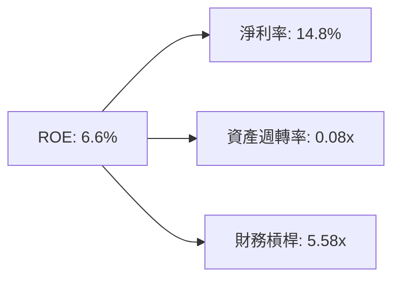

*   **淨利率 (14.8%)**：反映數位銀行的高利潤率，為 ROE 的主要正向驅動。
*   **資產週轉率 (0.08x)**：此為銀行業典型特徵，資產以貸款為主，周轉較慢。
*   **財務槓桿 (5.58x)**：相較於傳統商業銀行（槓桿通常為 10x - 12x），SoFi 的財務槓桿極為克制，顯示其資本充足，但也限制了當前的 ROE 表現。

### 6.4 獲利能力驅動因素

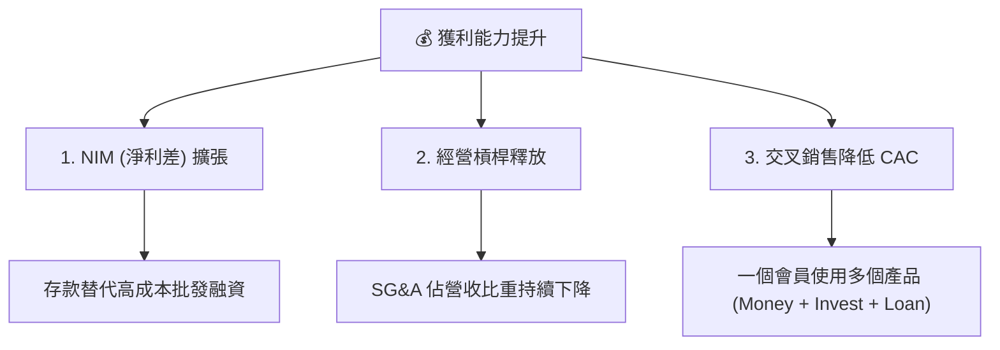

---

## 7. 估值深度分析

### 7.1 同業估值比較表格

| 估值指標 | **SOFI (本公司)** | **LendingClub (LC)** | **Upstart (UPST)** | **Nu Holdings (NU)** | 本公司評估 |
|----------|----------|---------|---------|---------|-----------|
| **Trailing P/E** | **40.29x** | 22.40x | N/A (虧損) | 31.50x | 🟡 偏高，反映市場對其高成長的預期。 |
| **Forward P/E** | **22.38x** | 14.50x | 45.20x | 19.80x | 🟢 極具吸引力，對應 40%+ 成長。 |
| **P/S Ratio** | **5.95x** | 2.10x | 6.80x | 8.20x | 🟢 低於純金融科技同業 (NU, UPST)。 |
| **P/B Ratio** | **2.15x** | 0.95x | 3.80x | 5.40x | 🟢 顯著低於拉丁美洲數位銀行巨頭 NU。 |
| **PEG Ratio** | **0.88** | 1.15 | N/A | 0.92 | 🟢 **顯著低估** (PEG < 1.0)。 |

### 7.2 歷史估值區間分析

```
╔══════════════════════════════════════════════════════════════════╗
║                 SOFI 歷史 P/S 估值區間 (2021-2026)               ║
╠══════════════════════════════════════════════════════════════════╣
║                                                                  ║
║  歷史峰值 (2021)： 20.5x P/S  ████████████████████████████████   ║
║  歷史中值：         7.5x P/S  ████████████                    ║
║  當前位置：         5.95x P/S █████████  ← 🟢 處於歷史下半區     ║
║  歷史谷值 (2022)：  2.8x P/S  ████                             ║
║                                                                  ║
╚══════════════════════════════════════════════════════════════════╝
```

### 7.3 情境目標價（假設驅動，Bear / Base / Bull）

基於 Forward EPS **$0.81021** 進行目標價推導：

| 情境 | 營收 CAGR (3Y) | 預估 12M EPS | 退出倍數 (Forward P/E) | 隱含目標價 | 相對現價 ($18.13) | 核心邏輯 |
|------|-----------|-----------|----------|------------|----------|----------|
| 🔴 **悲觀** | 20% | $0.68 | 15.0x | **$10.20** | -43.7% | 壞帳率升至 6.0% 以上，Fed 降息導致 NIM 收縮。 |
| 🟡 **基準** | **35%** | **$0.81** | **25.0x** | **$20.25** | **+11.7%** | 存款穩健增加，Galileo 科技平台簽約量符合預期。 |
| 🟢 **樂觀** | 45% | $0.90 | 30.0x | **$27.00** | +48.9% | 交叉銷售率大增，科技平台 SaaS 收入佔比超 25%。 |

### 7.4 DCF 敏感性分析（12個月隱含目標價矩陣）

*   **基準假設**：終端成長率 (g) = 3.5%，EPS 預期成長率如上表。

| 貼現率 (WACC) | **WACC = 11.5%** | **WACC = 12.5% (基準)** | **WACC = 13.5%** |
|------|--------------|----------------------|--------------|
| 🟢 **樂觀 (EPS $0.90)** | **$28.50** (+57.2%) | **$27.00** (+48.9%) | **$24.50** (+35.1%) |
| 🟡 **基準 (EPS $0.81)** | **$21.80** (+20.2%) | **$20.25** (+11.7%) | **$18.50** (+2.0%) |
| 🔴 **悲觀 (EPS $0.68)** | **$11.50** (-36.6%) | **$10.20** (-43.7%) | **$9.10** (-49.8%) |

---

## 8. 成長催化劑

### 8.1 催化劑時間軸

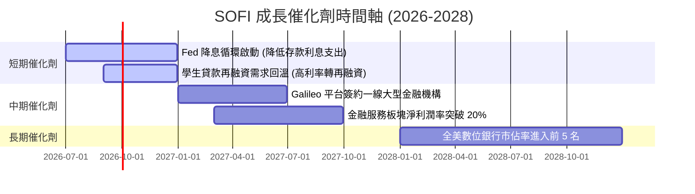

### 8.2 TAM 市場規模與滲透率

```
╔══════════════════════════════════════════════════════════════════╗
║                    SOFI TAM 與市場滲透率                         ║
╠══════════════════════════════════════════════════════════════════╣
║                                                                  ║
║  全美無擔保消費信貸 TAM：$250B  █░░░░░░░░░░░░░░░░░░  (滲透率16%) ║
║  全美學生貸款再融資 TAM：$400B  █░░░░░░░░░░░░░░░░░░  (滲透率4%)  ║
║  B2B Core Banking SaaS TAM：$30B █░░░░░░░░░░░░░░░░░░  (滲透率6%)  ║
║                                                                  ║
║  📊 總體潛在市場 (TAM) 超過 $680B，SoFi 當前滲透率極低，          ║
║     具備極長成長坡道。                                           ║
╚══════════════════════════════════════════════════════════════════╝
```

### 8.3 成長驅動力結構圖

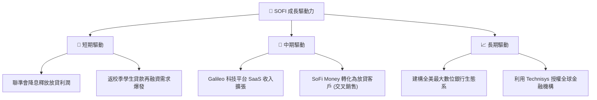

---

## 9. 風險矩陣

### 9.1 風險評分矩陣

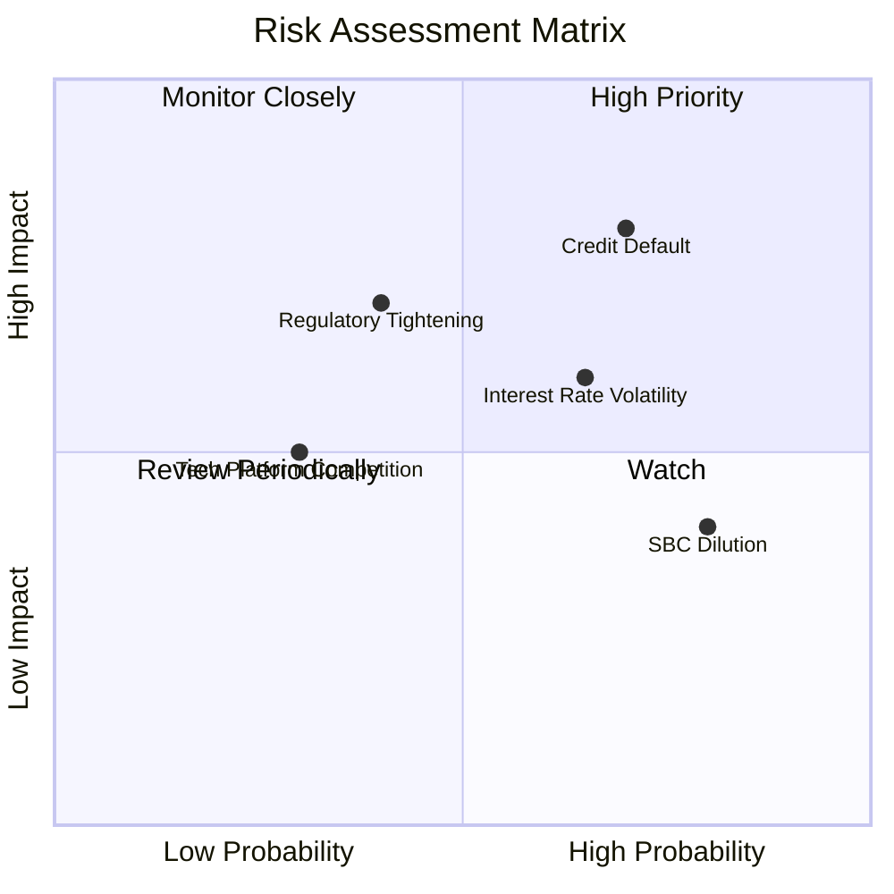

### 9.2 風險清單詳細分析

| # | 風險項目 | 發生機率 | 財務衝擊 | 風險評分 | 緩解措施 / 機構評估 |
|---|----------|----------|----------|----------|----------|
| 1 | 🔴 **無擔保貸款違約率上升** | 高 (35%) | 高 (-15% EPS) | **7.5 / 10** | SoFi 客戶平均 FICO 分數高於 750 分，平均年收入超 $160K，屬於高抗風險客群。 |
| 2 | 🟡 **降息壓縮淨利差 (NIM)** | 中 (50%) | 中 (-8% 營收) | **6.0 / 10** | 透過調降存款利率（從 4.6% 降至 4.0%）與增加固定利率貸款比例來對沖。 |
| 3 | 🔴 **金融監管與資本適足率要求提高** | 中 (20%) | 高 (-20% 估值) | **5.5 / 10** | 公司目前 Tier 1 資本適足率高達 14.2%，具備極高監管安全墊。 |
| 4 | 🟡 **股權持續稀釋 (SBC)** | 高 (80%) | 低 (-3% EPS) | **4.5 / 10** | 隨著營收規模擴大，SBC 佔比已自 20% 降至 6.55%，稀釋速度放緩。 |

---

## 10. 投資建議

### 10.1 最終綜合評級雷達圖

```
╔══════════════════════════════════════════════════════════════╗
║                     SOFI 綜合評級雷達圖                      ║
╠══════════════════════════════════════════════════════════════╣
║ 營收成長性     8.5/10 ▓▓▓▓▓▓▓▓▓▓▓▓▓▓▓▓▓░░░  🟢 極強        ║
║ 獲利轉折動能   8.0/10 ▓▓▓▓▓▓▓▓▓▓▓▓▓▓▓▓░░░░  🟢 強勁        ║
║ 資金成本優勢   8.5/10 ▓▓▓▓▓▓▓▓▓▓▓▓▓▓▓▓▓░░░  🟢 極強        ║
║ 估值安全邊際   6.5/10 ▓▓▓▓▓▓▓▓▓▓▓▓░░░░░░░░  🟡 合理        ║
║ 信用風險控制   7.0/10 ▓▓▓▓▓▓▓▓▓▓▓▓▓░░░░░░░  🟡 中高        ║
╠══════════════════════════════════════════════════════════════╣
║ 綜合投資評級   7.7/10 ▓▓▓▓▓▓▓▓▓▓▓▓▓▓▓░░░░░  🟢 建議買入    ║
╚══════════════════════════════════════════════════════════════╝
```

### 10.2 目標價與隱含報酬率

| 情境 | 機率權重 | 目標價 | 當前股價 | 隱含報酬率 | 權重預期報酬率 |
|------|----------|--------|----------|------------|----------------|
| 🔴 **悲觀情境** | 20% | $10.20 | $18.13 | -43.7% | -8.74% |
| 🟡 **基準情境** | **60%** | **$20.25** | $18.13 | **+11.7%** | **+7.02%** |
| 🟢 **樂觀情境** | 20% | $27.00 | $18.13 | +48.9% | +9.78% |
| **加權綜合目標價**| **100%** | **$19.60** | $18.13 | **+8.1%** | (已考慮下行風險) |

### 10.3 買入時機與觸發因素

```
╔══════════════════════════════════════════════════════════════════╗
║                  ✅ SOFI 買入觸發因素 Checklist                  ║
╠══════════════════════════════════════════════════════════════════╣
║                                                                  ║
║  立即買入條件（符合 2 項以上即可布局）：                          ║
║  ✅ 股價回檔至 $16.50 - $17.50 區間 (提供更高安全邊際)           ║
║  ✅ 季度存款成長率維持在 QoQ +8% 以上                           ║
║  ✅ Galileo 科技平台營收年成長率重回 20% 以上                    ║
║                                                                  ║
║  加碼觸發條件：                                                  ║
║  ☐ 聯聯儲降息後，SoFi NIM (淨利差) 維持在 5.0% 以上不墜         ║
║  ☐ GAAP EPS 連續兩季超預期 > 15%                                 ║
║                                                                  ║
║  減碼/停損觸發條件：                                             ║
║  ☐ 個人貸款違約率 (NCO Ratio) 超過 5.5%                          ║
║  ☐ 存款增速顯著放緩至 QoQ < 3%                                   ║
╚══════════════════════════════════════════════════════════════════╝
```

### 10.4 投資人適配度分析

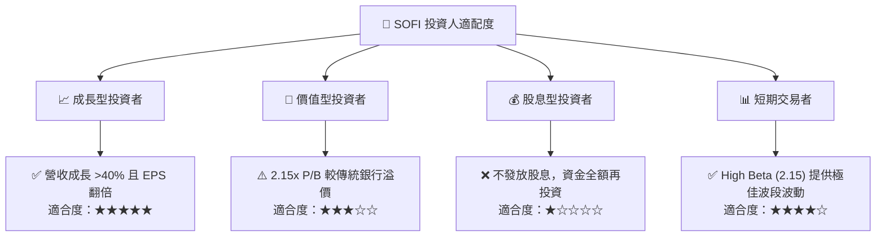

### 10.5 每季財報監控清單（Quarterly Watch List）

| 監控指標 | 基準值 (Q1 2026) | 觸發加碼門檻 | 觸發減碼/警報門檻 | 監控核心意義 |
|----------|-----------------|--------------|------------------|--------------|
| **季度總存款** | **$40.24B** | > $43.50B (YoY +45%) | < $38.50B (流失風險) | 決定資金成本優勢是否延續。 |
| **淨利差 (NIM)** | **~5.3%** | > 5.5% | < 4.8% | 衡量降息環境下之放貸定價能力。 |
| **無擔保放貸違約率**| **~4.8%** | < 4.0% (資產優質) | > 5.5% (信用危機) | 判斷壞帳撥備是否會吞噬淨利。 |
| **SBC 佔營收比重** | **6.55%** | < 5.0% | > 8.5% | 監控股東權益稀釋速度。 |

### 10.6 反面論證：什麼會證明本報告論點錯誤

```
╔══════════════════════════════════════════════════════════════════╗
║              ⚠️ 論點失效條件（Disconfirming Evidence）           ║
╠══════════════════════════════════════════════════════════════════╣
║  本多頭投資論點在下列情況任一發生時應立即重新檢視或退出：        ║
║  ☐ 核心存款規模連續兩季出現 QoQ 負成長 (失去低成本資金護城河)    ║
║  ☐ 信用損失撥備 (Provision for Credit Losses) 連續兩季暴增 >50% ║
║  ☐ 科技平台 (Galileo) 營收成長率跌破 10% (失去科技 SaaS 溢價估值) ║
║  ☐ ROIC 跌破 3.0% 且 Forward ROE 倒退至 5.0% 以下                ║
╚══════════════════════════════════════════════════════════════════╝
```

---

> **免責聲明**：本報告為 AI 自動生成，基於 2026-07-13 之前公開財務數據，僅供研究參考，不構成任何主動投資建議。投資有風險，入市需謹慎。