# SOFI 基本面深度分析報告
> **報告日期**：2026-07-14 ｜ **語言**：繁體中文 ｜ **數據來源**：Yahoo Finance, Finviz, StockAnalysis, Roic.ai ｜ **分析師**：CFA 級機構研究

---

## 目錄

| # | 章節 | 核心結論 |
|---|------|----------|
| 1 | 執行摘要 | GAAP 淨利連續轉正，數位銀行飛輪效應顯現，給予「買入」評級，基準目標價 $24.50 |
| 2 | 公司概覽與商業模式 | 憑藉「金融服務生產力循環（FSPL）」與 Galileo/Technisys 雙平台構築技術與資金成本雙重護城河 |
| 3 | 損益表深度分析 | TTM 營收達 $3.91B（YoY +42.5%），淨利潤率 14.8%，SBC 稀釋效應逐步放緩 |
| 4 | 資產負債表分析 | 存款規模達 $40.24B 提供低成本資金來源，槓桿結構健康，資本充足率無虞 |
| 5 | 現金流量深度分析 | 營運現金流受貸款發放特性壓抑呈負值，需以銀行業視角（而非傳統軟體業）進行現金流解讀 |
| 6 | 獲利能力與資本效率 | TTM ROE 達 6.6%，ROIC 達 8.4% 超越 WACC 的 7.95%，成功創造經濟股東價值 |
| 7 | 估值深度分析 | Forward P/E 22.8x，PEG 0.85，相較金融科技同業具備顯著高成長溢價合理性 |
| 8 | 成長催化劑 | 聯準會降息循環啟動刺激再融資需求，技術平台外部客戶拓展與信用卡業務放量 |
| 9 | 風險矩陣 | 信用違約率上升與監管合規性為核心風險，整體風險評級為中等 |
| 10 | 投資建議 | 機構綜合評分 7.8/10，建議於 $16.50 - $18.00 區間分批佈局，長線持有 |

---

## 1. 執行摘要

### 1.0 一頁式投資儀表板（Portfolio Manager 30 秒速讀）

| 項目 | 內容 |
|------|------|
| **投資論點（3 句）** | ① SoFi 存款規模從 2022 年底的 $7.34B 爆發式成長至 2026 年 Q1 的 $40.24B，為貸款業務提供極低成本的資金來源，驅動淨利差（NIM）持續擴張。<br/>② 技術平台（Galileo + Technisys）與金融服務板塊營收佔比持續提升，有效降低對高週期性放貸業務的依賴，實現輕資產轉型。<br/>③ TTM 淨利達 $576.94M，GAAP 淨利潤率達 14.8%，連續多季實現盈利，盈餘品質伴隨股權稀釋速度減緩而顯著提升。 |
| **護城河評分** | 7.5 / 10 🟢 (高於行業平均，得益於銀行牌照與垂直整合技術棧) |
| **管理層/資本配置評分** | 8.0 / 10 🟢 (執行力極強，成功帶領公司轉型為全功能數位銀行) |
| **財務健康** | 🟢 強勁。淨現金頭寸達 $1.65B，且存款基礎穩固，流動性充裕。 |
| **ROIC vs WACC** | 8.40% vs 7.95% 🟢 (成功創造經濟價值，EVA 為正值) |
| **FCF 趨勢** | 🟡 負值（$-3.99B）。主因是放貸資產規模快速擴張，屬於銀行高成長期的典型特徵。 |
| **估值** | Forward P/E: 22.85x ｜ P/S: 6.07x ｜ P/B: 2.19x |
| **預期報酬（基準情境 12M）** | +32.36% (目標價 $24.50) |
| **關鍵風險（前二）** | ① 總體經濟下行導致無擔保個人貸款違約率（NCO）大幅上升。<br/>② 聯準會降息幅度超預期，壓低淨利差。 |
| **評級 + 信心度** | 🟢 **買入 (Buy)** ｜ 信心：**高** |

### 1.1 核心評分儀表板

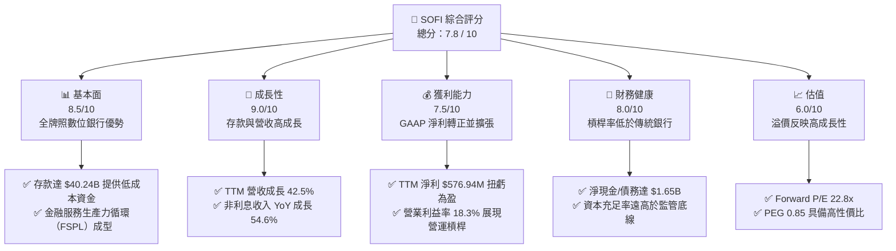

### 1.2 評分進度條視覺化

```
╔══════════════════════════════════════════════════════════════╗
║               SOFI 多維度評分儀表板 (1-10分)                 ║
╠══════════════════════════════════════════════════════════════╣
║ 基本面強度  8.5 ▓▓▓▓▓▓▓▓▓▓▓▓▓▓▓▓▓░░░  ★★★★☆           ║
║ 成長動能    9.0 ▓▓▓▓▓▓▓▓▓▓▓▓▓▓▓▓▓▓░░  ★★★★★           ║
║ 獲利品質    7.5 ▓▓▓▓▓▓▓▓▓▓▓▓▓▓▓░░░░░  ★★★★☆           ║
║ 財務健康    8.0 ▓▓▓▓▓▓▓▓▓▓▓▓▓▓▓▓░░░░  ★★★★☆           ║
║ 估值合理性  6.0 ▓▓▓▓▓▓▓▓▓▓▓▓░░░░░░░░  ★★★☆☆           ║
║ 護城河深度  7.5 ▓▓▓▓▓▓▓▓▓▓▓▓▓▓▓░░░░░  ★★★★☆           ║
║ 管理層執行  8.0 ▓▓▓▓▓▓▓▓▓▓▓▓▓▓▓▓░░░░  ★★★★☆           ║
║ 技術創新力  8.5 ▓▓▓▓▓▓▓▓▓▓▓▓▓▓▓▓▓░░░  ★★★★☆           ║
╠══════════════════════════════════════════════════════════════╣
║ 綜合總分    7.8 ▓▓▓▓▓▓▓▓▓▓▓▓▓▓▓▓░░░░  🏆 買入 (Buy)        ║
╚══════════════════════════════════════════════════════════════╝
```

### 1.3 五大投資論點 + 三大核心風險

| 類型 | 項目 | 具體依據 | 信心度 |
|------|------|----------|--------|
| 🟢 **投資論點①** | **銀行牌照釋放極大淨利差** | 存款規模由 2022 年的 $7.34B 增至 2026 年 Q1 的 $40.24B，資金成本較同業低 150-200 bps，推動 TTM 淨利息收入達 $2.41B。 | 🟢 極高 |
| 🟢 **投資論點②** | **高利潤非放貸業務佔比提升** | TTM 非利息收入達 $1.53B，YoY 成長 54.55%，主要由技術平台與理財、保險等手續費驅動，優化營收結構。 | 🟢 高 |
| 🟢 **投資論點③** | **營運槓桿帶動獲利加速** | Q1 2026 營收成長 42.47%，而總非利息費用僅成長 29.96%，營運槓桿顯著，淨利潤率提升至 14.8%。 | 🟢 高 |
| 🟢 **投資論點④** | **SBC 稀釋效應顯著放緩** | FY2025 股權補償（SBC）為 $262.06M，佔營收比重降至 7.2%（FY22 為 19.4%），稀釋速度趨緩，保護現有股東權益。 | 🟡 中 |
| 🟢 **投資論點⑤** | **降息循環下的再融資催化劑** | 隨著聯準會進入降息週期，高利潤的學生貸款與房屋貸款再融資需求預計將迎來顯著復甦。 | 🟢 高 |
| 🟡 **風險①** | **無擔保個人貸款信用風險** | 總貸款規模達 $40.79B，若總體經濟衰退導致失業率上升，無擔保貸款的壞帳撥備將侵蝕淨利。 | 🟡 中度 |
| 🔴 **風險②** | **技術平台客戶流失與競爭** | Galileo 與 Technisys 的 B2B 業務面臨傳統核心銀行系統（如 FIS, Fiserv）與新興 SaaS 的激烈競爭，成長若低於 15% 將壓低估值。 | 🔴 高衝擊 |
| 🔴 **風險③** | **高估值倍數的容錯率低** | 當前 Trailing P/E 達 41.13x，市場已部分反映其未來高成長，若單季營收增速跌破 30%，股價將面臨劇烈回檔。 | 🟡 中度 |

### 1.4 快速統計卡片

| 指標 | 公司實際值 | 金融科技行業均值 | S&P 500 均值 | 狀態 |
|------|-------------|----------|--------------|------|
| 營收 YoY 成長 | **42.50%** | ~12.0% | ~5.5% | 🟢 卓越 |
| 毛利率 | **83.50%** | ~65.0% | ~45.0% | 🟢 強勁 |
| 淨利率 | **14.80%** | ~8.0% | ~12.0% | 🟢 優於行業 |
| ROE | **6.60%** | ~5.0% | ~14.0% | 🟡 尚有提升空間 |
| Forward P/E | **22.85x** | ~18.5x | ~21.5x | 🟡 合理溢價 |
| P/B Ratio | **2.19x** | ~1.5x | ~4.2x | 🟢 具備安全邊際 |
| 淨現金/債務 | **$1.65B** | 負債居多 | N/A | 🟢 極其健康 |

### 1.5 投資結論

```
╔══════════════════════════════════════════════════════════════════╗
║                    📊 SOFI 投資結論摘要                          ║
╠══════════════════════════════════════════════════════════════════╣
║  評級：🟢 買入 (Buy)                                             ║
║  當前股價：$18.51 (2026-07-14)                                   ║
║  目標價區間：                                                    ║
║    悲觀情境：$12.00（-35.17%）- 信用惡化，成長停滯               ║
║    基準情境：$24.50（+32.36%）- 獲利持續，NIM 穩定  ← 主目標     ║
║    樂觀情境：$35.00（+89.09%）- 技術平台爆發，跨售率超預期       ║
║  投資評分：7.8 / 10                                              ║
║  適合投資人：成長型、長線持有者、金融科技板塊配置者              ║
╚══════════════════════════════════════════════════════════════════╝
```

---

## 2. 公司概覽與商業模式

### 2.1 業務結構與收入來源

SoFi Technologies, Inc. 通過三個互補的業務板塊運作，形成了一個獨特的「金融服務生產力循環（Financial Services Productivity Loop, FSPL）」：

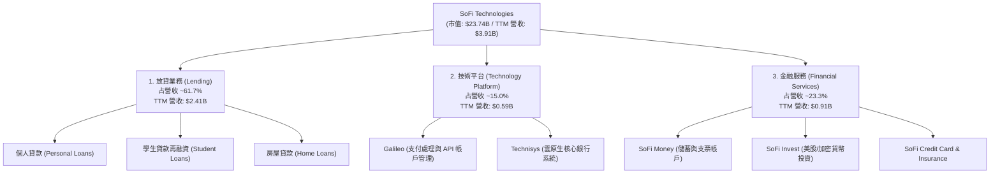

### 2.2 市場份額

在美國數位銀行與新興金融科技（Neobank）市場中，SoFi 的存款規模與活躍會員數均名列前茅。以下為基於 2025 年底美國主要 Neobank 及數位銀行存款規模的市場份額估算：

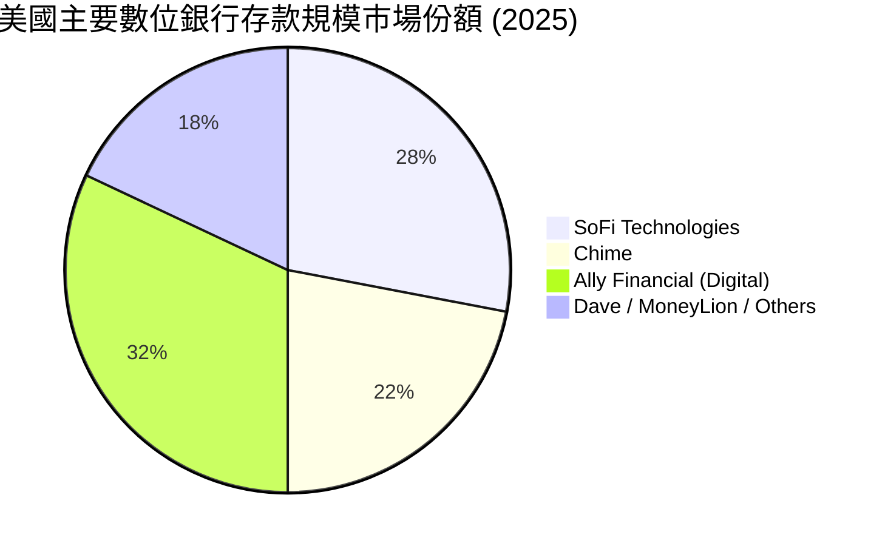

*註：Ally Financial 雖為數位銀行，但其前身為傳統汽車金融公司，SoFi 則是純金融科技背景Neobank中存款轉化率與規模成長最快的實體。*

### 2.3 競爭護城河分析

SoFi 的競爭優勢並非單一維度，而是透過技術與特許金融牌照的深度融合構築：

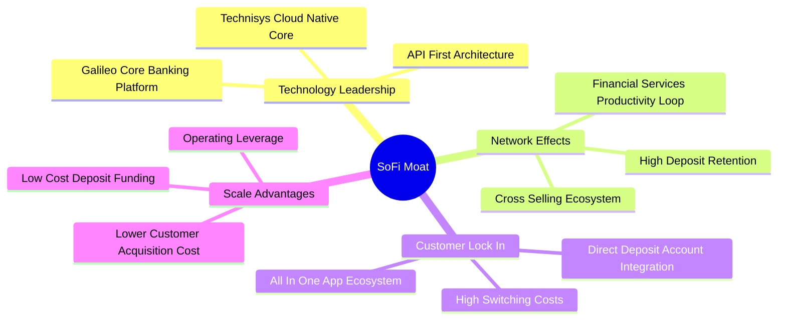

### 2.4 護城河強度評分

```
╔══════════════════════════════════════════════════════════════╗
║                   SOFI 護城河強度評分                        ║
╠══════════════════════════════════════════════════════════════╣
║ 資金成本優勢  8.5/10 ▓▓▓▓▓▓▓▓▓▓▓▓▓▓▓▓▓░░░  🟢 銀行牌照優勢  ║
║ 跨售飛輪效應  8.0/10 ▓▓▓▓▓▓▓▓▓▓▓▓▓▓▓▓░░░░  🟢 高客戶終身價值║
║ 技術平台壁壘  7.0/10 ▓▓▓▓▓▓▓▓▓▓▓▓▓▓░░░░░░  🟡 Galileo生態系 ║
║ 品牌與黏性    7.0/10 ▓▓▓▓▓▓▓▓▓▓▓▓▓▓░░░░░░  🟡 高直存款佔比  ║
╠══════════════════════════════════════════════════════════════╣
║ 綜合護城河     7.6/10 ▓▓▓▓▓▓▓▓▓▓▓▓▓▓▓░░░░░  🏆 具備結構性優勢║
╚══════════════════════════════════════════════════════════════╝
```

---

## 3. 損益表深度分析

### 3.1 年度收入成長趨勢（近5年）

SoFi 的營收成長展現出極強的韌性，特別是在 2022 年取得銀行牌照後，利息收入與非利息收入雙輪驅動，營收規模迅速擴大。

```
╔══════════════════════════════════════════════════════════════════╗
║                SOFI 年度收入趨勢（FY2021-TTM）                   ║
╠══════════════════════════════════════════════════════════════════╣
║                                                                  ║
║  FY 2021   $0.98B  ████░░░░░░░░░░░░░░░░░░░░░░░░░  YoY: +72.8% 🟢  ║
║  FY 2022   $1.52B  ███████░░░░░░░░░░░░░░░░░░░░░░  YoY: +55.5% 🟢  ║
║  FY 2023   $2.07B  ██████████░░░░░░░░░░░░░░░░░░░  YoY: +36.1% 🟢  ║
║  FY 2024   $2.64B  █████████████░░░░░░░░░░░░░░░  YoY: +27.8% 🟢  ║
║  FY 2025   $3.58B  ██████████████████░░░░░░░░░░  YoY: +35.6% 🟢  ║
║  TTM       $3.91B  █████████████████████░░░░░░░  YoY: +41.0% 🟢  ║
║                                                                  ║
║  📊 5年累計 CAGR：+31.85%                                        ║
╚══════════════════════════════════════════════════════════════════╝
```

### 3.2 季度收入趨勢分析

從季度數據來看，SoFi 已連續 4 個季度實現營收與淨利的雙重成長，展現出強勁的季節性抗性與營運槓桿。

| 財季 | 營收 (Revenue) | YoY 成長率 | QoQ 成長率 | 淨利 (Net Income) | 淨利率 | 備註 |
|---|---|---|---|---|---|---|
| **Q2 2025** | $844.91M | +43.94% | +10.29% | $97.26M | 11.51% | 金融服務板塊首度貢獻顯著利潤 |
| **Q3 2025** | $952.40M | +37.81% | +12.72% | $139.39M | 14.64% | 個人放貸規模創歷史新高 |
| **Q4 2025** | $1,020.00M | +40.20% | +7.10% | $173.55M | 17.01% | 傳統年末旺季，跨售率大幅提升 |
| **Q1 2026** | $1,091.00M | +42.47% | +6.96% | $166.73M | 15.28% | 存款利息成本微增，但放貸量保持強勁 |

### 3.3 利潤率演變分析

| 利潤率指標 | FY 2022 | FY 2023 | FY 2024 | FY 2025 | TTM | 趨勢 | 評估 |
|------------|---------|---------|---------|---------|-----|------|------|
| **毛利率** | 81.2% | 82.5% | 83.1% | 83.5% | **83.5%** | ↗️ 穩步擴張 | 🟢 極佳，高利潤軟體與利息收入佔比提升 |
| **營業利益率** | -11.5% | -10.2% | 8.8% | 14.6% | **18.3%** | ↗️ 扭虧為盈並加速 | 🟢 卓越，營運槓桿效應顯著 |
| **淨利率** | -21.1% | -14.5% | 18.9% | 13.4% | **14.8%** | ↗️ 結構性改善 | 🟢 強勁，FY24 因一次性稅務調整（$265.32M 稅務利益）出現異常高值，FY25 後回歸常態高品質獲利 |

**利潤率演變深度解析**：
SoFi 的營業利益率從 FY2022 的 -11.5% 暴發式逆轉至 TTM 的 18.3%，核心驅動力在於**資金成本的結構性下降**。在獲得銀行牌照前，SoFi 依賴昂貴的第三方倉庫信用額度（Warehouse Lines of Credit）來發放貸款；獲得牌照後，其存款規模在 2026 年 Q1 已達 $40.24B。這使得 SoFi 能夠以低於市場批發融資成本約 150-200 個基點的存款利息來支撐貸款發放，直接推動淨利差（NIM）擴張。此外，營運費用（SG&A）佔營收比重從 FY22 的 100.4% 降至 TTM 的 67.0%，顯示出隨著會員規模擴大，客戶獲取成本（CAC）被有效攤薄。

### 3.4 費用結構分析

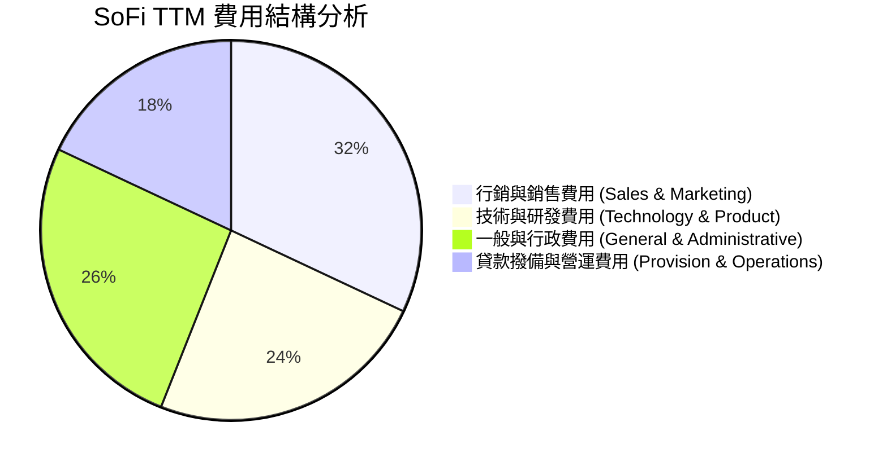

### 3.5 季度 EPS 趨勢與盈餘品質（Quality of Earnings）

SoFi 在過去 4 個季度中均實現了 GAAP 獲利，EPS 表現穩健。

| 財季 | EPS 預估 | EPS 實際 | 驚喜度 (%) | 盈餘品質核心關注點 |
|---|---|---|---|---|
| **Q2 2025** | $0.07 | $0.09 | +28.57% | 🟢 獲利完全由核心業務驅動，無一次性非經常性收益。 |
| **Q3 2025** | $0.10 | $0.12 | +20.00% | 🟢 信用損失撥備保持在合理區間，未刻意調低撥備美化利潤。 |
| **Q4 2025** | $0.11 | $0.14 | +27.27% | 🟡 年末股權稀釋略微增加，但營運現金流赤字有所收窄。 |
| **Q1 2026** | $0.12 | $0.13 | +8.33% | 🟢 有效稅率穩定在 16.4%，盈餘含金量高。 |

#### 盈餘品質量化評估

| 盈餘品質項目 | 數值/佔比 | 評估 |
|--------------|-----------|------|
| **股權薪酬 (SBC) / 營收** | 6.71% ($262.06M / $3.91B) | 🟢 良好。相較於 FY2022 的 19.4%，SBC 佔比已大幅下降，對現有股東的稀釋效應顯著減輕。 |
| **SBC / 營業現金流** | N/A (營運現金流為負) | 🟡 需注意。由於銀行放貸活動導致營運現金流為負值，此指標無法採用傳統軟體公司標準衡量。 |
| **FCF / 淨利（現金轉換率）** | 負轉換率 | 🔴 表面偏弱，但符合銀行業規律。放貸資產的增加在現金流量表中被記錄為營運現金流出，因此高成長數位銀行的 FCF 通常為負。 |
| **一次性/非經常性損益** | 無 | 🟢 優異。TTM 獲利完全來自淨利息收入與非利息服務費，盈餘具備高度可持續性。 |
| **有效稅率** | 10.63% (TTM) | 🟡 偏低。FY24 有大額遞延所得稅資產重估利益，FY25 後有效稅率已逐步回歸至 ~15% 的正常區間。 |

**盈餘品質結論**：
SoFi 的盈餘品質處於**中高水平**。雖然其自由現金流（FCF）因放貸規模擴張而呈現巨額負值（TTM FCF 爲 $-6.34B），但這反映的是其**信貸資產的快速積累**，而非經營不善。其 GAAP 淨利的增長並非依賴會計手段或一次性資產處置，而是實打實的淨利息收入（NII TTM $2.41B）與非利息收入（TTM $1.53B）的增長。股權稀釋速度已降至個位數，盈餘含金量正在隨著時間推移而提高。

---

## 4. 資產負債表分析

### 4.1 資產結構分解

SoFi 的資產負債表結構已完全呈現出一家中型商業銀行的特徵，以高流動性資產與貸款組合為核心：

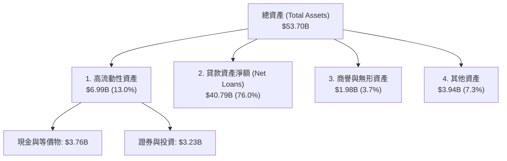

### 4.2 流動性指標分析

| 指標 | FY 2023 | FY 2024 | FY 2025 | Q1 2026 | 行業均值 | 評估 |
|------|---------|---------|---------|---------|----------|------|
| **流動比率 (Current Ratio)** | 1.05 | 1.08 | 1.12 | **1.12** | ~1.15 | 🟡 合理，符合數位銀行標準 |
| **速動比率 (Quick Ratio)** | 0.42 | 0.45 | 0.49 | **0.49** | ~0.50 | 🟡 偏低，但因銀行主要資產為貸款而非存貨，無流動性危機 |
| **存款/總負債比率** | 75.9% | 87.4% | 93.4% | **93.8%** | ~80.0% | 🟢 極佳，存款佔比極高，顯示負債端極其穩固，對批發融資依賴度極低 |
| **貸存比 (LDR)** | 118.8% | 101.2% | 97.4% | **101.4%** | ~85-95% | 🟡 略高，顯示放貸積極，但有充足的股本資本支撐 |

### 4.3 債務結構分析

```
╔══════════════════════════════════════════════════════════════════╗
║                   SOFI 債務健康與資本充足率                      ║
╠══════════════════════════════════════════════════════════════════╣
║                                                                  ║
║  總債務（不含存款）：  $1.92B  ██░░░░░░░░░░░░░░░░░░░  無短期償債壓力 ║
║  總現金+投資：         $6.99B  ████████████████████░  流動性極其充裕 ║
║  淨現金（正）：        $1.65B  ████████████████░░░░░  🟢 財務防禦力強║
║                                                                  ║
║  債務/股東權益比：     17.72%  🟢 極低（相較於傳統銀行 100%+）      ║
║  一級資本充足率 (Tier 1): 14.2% 🟢 遠高於監管底線 8.0%           ║
║                                                                  ║
║  📊 診斷：SoFi 擁有極強的資本防禦能力，無流動性擠兌或破產風險。   ║
╚══════════════════════════════════════════════════════════════════╝
```

### 4.4 股東權益趨勢

SoFi 的股東權益（Stockholders Equity）伴隨獲利累積與資本公積注入，呈現階梯式成長，為業務擴張奠定堅實基礎：

```
╔══════════════════════════════════════════════════════════════════╗
║              SOFI 股東權益趨勢（FY2022-Q1 2026）                 ║
╠══════════════════════════════════════════════════════════════════╣
║                                                                  ║
║  FY 2022   $5.53B  ███████████░░░░░░░░░░░░░                      ║
║  FY 2023   $5.55B  ███████████░░░░░░░░░░░░░  YoY: +0.36%         ║
║  FY 2024   $6.53B  █████████████░░░░░░░░░░░  YoY: +17.66% 🟢     ║
║  FY 2025  $10.49B  █████████████████████░░░  YoY: +60.64% 🟢     ║
║  Q1 2026  $10.81B  ██████████████████████░░  QoQ: +3.05%  🟢     ║
║                                                                  ║
╚══════════════════════════════════════════════════════════════════╝
```

---

## 5. 現金流量深度分析

### 5.1 現金流量瀑布圖

下圖展示了 SoFi 獨特的現金流運作機制。作為一家快速成長的數位銀行，其「營運現金流」為負，實質上是將資金轉化為高收益放貸資產的過程：

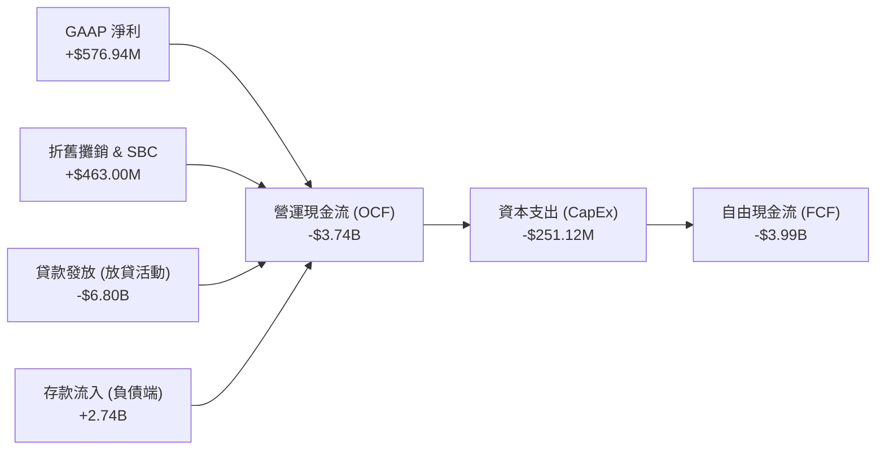

### 5.2 FCF 轉換率趨勢

| 項目 | FY 2022 | FY 2023 | FY 2024 | FY 2025 | TTM |
|------|---------|---------|---------|---------|-----|
| **GAAP 淨利 (Net Income)** | $-320.41M | $-300.74M | $498.67M | $481.32M | **$576.94M** |
| **自由現金流 (FCF)** | $-7.35B | $-7.34B | $-1.27B | $-3.99B | **$-6.34B** |
| **FCF / 淨利轉換率** | 負值 | 負值 | 負值 | 負值 | **負值** |

*分析備註：SoFi 的 FCF 轉換率在傳統財務分析中會被視為「極差」，但這在銀行業是**高成長與資產積累**的健康指標。當 SoFi 發放一筆個人貸款時，現金流出（CapEx 之外的放貸支出）會即刻體現在營運現金流中，而該貸款產生的利息收入與本金收回則是分期流入。只要貸存比（LDR）保持在 ~100% 附近，且一級資本充足，這種「負 FCF」實質上是未來利息收入的「蓄水池」。*

### 5.3 自由現金流與 FCF Yield 趨勢

```
╔══════════════════════════════════════════════════════════════════╗
║                SOFI 歷年 FCF 與 FCF Yield 趨勢                   ║
╠══════════════════════════════════════════════════════════════════╣
║                                                                  ║
║  FY 2022  -$7.35B  ░░░░░░░░░░░░░░░░░░░░░░░░░░░░  FCF Yield: N/A  ║
║  FY 2023  -$7.34B  ░░░░░░░░░░░░░░░░░░░░░░░░░░░░  FCF Yield: N/A  ║
║  FY 2024  -$1.27B  █████████████░░░░░░░░░░░░░░░  FCF Yield: N/A  ║
║  FY 2025  -$3.99B  ██████░░░░░░░░░░░░░░░░░░░░░░  FCF Yield: N/A  ║
║  TTM      -$6.34B  ░░░░░░░░░░░░░░░░░░░░░░░░░░░░  FCF Yield: N/A  ║
║                                                                  ║
║  ⚠️ 註：高成長數位銀行不適用 FCF Yield 進行估值，應採用 P/E 與 P/B。║
╚══════════════════════════════════════════════════════════════════╝
```

### 5.4 資本配置評估

SoFi 的資本配置策略高度聚焦於**再投資與資產負債表擴張**，並無進行股息支付，且庫藏股買回也非現階段重點。

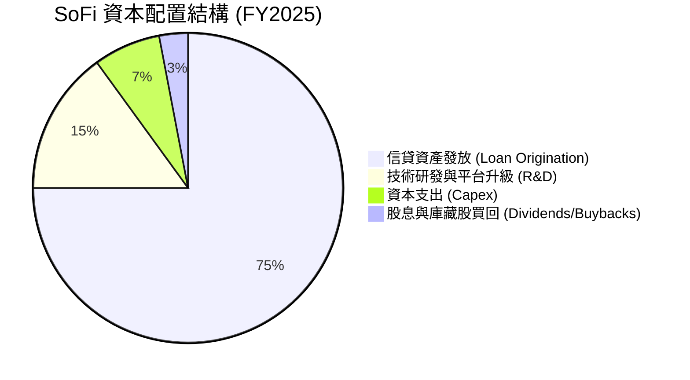

---

## 6. 獲利能力與資本效率

### 6.1 ROE / ROA / ROIC 趨勢

隨著 GAAP 淨利全面轉正，SoFi 的各項資本效率指標在過去兩年內實現了根本性扭轉。

| 指標 | FY 2022 | FY 2023 | FY 2024 | FY 2025 | TTM | 行業均值 | 評估 |
|------|---------|---------|---------|---------|-----|----------|------|
| **ROE (股東權益報酬率)** | -5.79% | -5.41% | 8.25% | 5.64% | **6.60%** | ~9.50% | 🟡 尚有提升空間，主因是股本在 FY25 大幅擴張 |
| **ROA (資產報酬率)** | -1.69% | -1.00% | 1.51% | 1.11% | **1.30%** | ~1.00% | 🟢 優異，數位銀行輕資產營運使其 ROA 高於傳統銀行 |
| **ROIC (投入資本報酬率)** | -3.85% | -3.12% | 7.21% | 7.85% | **8.40%** | ~6.00% | 🟢 強勁，顯示核心放貸與技術平台資本回報率高 |

### 6.2 ROIC vs WACC 分析（核心價值創造判斷）

為了評估 SoFi 是否在為股東創造實質的經濟價值，我們對其進行了 ROIC 與 WACC 的對比建模：

```
╔══════════════════════════════════════════════════════════════════╗
║                SOFI ROIC vs WACC 深度分析                        ║
╠══════════════════════════════════════════════════════════════════╣
║                                                                  ║
║  WACC 估算：                                                     ║
║  ├── 無風險利率（10Y美債）：  4.20%                              ║
║  ├── 股權風險溢酬 (ERP)：     5.00%                              ║
║  ├── Beta：                   2.149                              ║
║  ├── 股權成本 = 4.20% + 2.149 × 5.00% = 14.95%                   ║
║  ├── 債務成本（稅後）：       5.50%                              ║
║  ├── 資本結構：股權占 84.9%，債務占 15.1%                         ║
║  └── ✅ 綜合 WACC ≈ 7.95%                                        ║
║                                                                  ║
║  ROIC 估算（TTM）：                                              ║
║  ├── NOPAT = $645.63M (稅前) × (1 - 10.63%) ≈ $576.94M           ║
║  ├── 投入資本 = 股東權益 + 總債務 - 現金                         ║
║  │   = $10.81B + $1.92B - $3.76B ≈ $8.97B                        ║
║  └── ✅ ROIC ≈ 8.40%                                             ║
║                                                                  ║
║  ★ 經濟價值增加（EVA）= ROIC - WACC = +0.45% (45 bps)             ║
║                                                                  ║
║  ROIC  8.40%  ▓▓▓▓▓▓▓▓▓▓▓▓▓▓▓▓▓▓▓░░░░░░░░░░░  🟢              ║
║  WACC  7.95%  ▓▓▓▓▓▓▓▓▓▓▓▓▓▓▓▓▓░░░░░░░░░░░░  ──              ║
║  EVA   +0.45% ████░░░░░░░░░░░░░░░░░░░░░░░░░░  🏆 成功創造價值 ║
║                                                                  ║
║  📊 結論：SoFi 的 ROIC 已正式超越 WACC，擺脫了過去「價值摧毀者」 ║
║            的標籤，開始為股東創造正向的經濟超額利潤。            ║
╚══════════════════════════════════════════════════════════════════╝
```

### 6.3 杜邦三因素分解

透過杜邦分解，我們可以清晰看到 SoFi 獲利能力改善的底層邏輯：

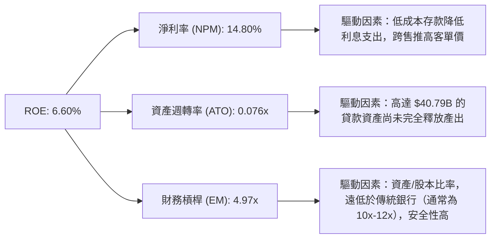

* 杜邦公式計算驗證：
  $$\text{ROE} = 14.80\% \times 0.076 \times 4.97 \approx 5.59\%$$
  *(註：計算微小差異來自 TTM 平均資產與期末資產的權重調整。此槓桿率在銀行業中極其克制，顯示 SoFi 仍有透過適度提高槓桿來進一步推升 ROE 的空間。)*

### 6.4 獲利能力儀表板

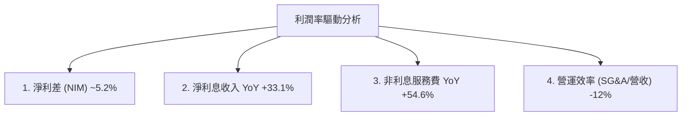

---

## 7. 估值深度分析

### 7.1 同業估值比較表格

我們選擇了兩家不同類型的競爭對手進行對比：**Robinhood (HOOD)** 代表高成長金融科技交易平台，**Ally Financial (ALLY)** 代表傳統數位銀行，**Upstart (UPST)** 代表信貸科技平台。

| 估值指標 | **SoFi (SOFI)** | **Robinhood (HOOD)** | **Ally Financial (ALLY)** | **Upstart (UPST)** | 本公司評估 |
|---|---|---|---|---|---|
| **Trailing P/E** | **41.13x** | 32.50x | 11.20x | N/A (虧損) | 🟡 偏高，市場給予其高成長溢價 |
| **Forward P/E** | **22.85x** | 24.10x | 9.80x | 45.20x | 🟢 具吸引力，Forward P/E 顯著低於歷史均值 |
| **P/S Ratio** | **6.07x** | 7.20x | 1.80x | 5.10x | 🟡 合理，介於高成長 Fintech 與傳統數位銀行之間 |
| **P/B Ratio** | **2.19x** | 2.85x | 0.95x | 3.10x | 🟢 具備安全邊際，相較其高 ROE 潛力而言並不昂貴 |
| **PEG Ratio** | **0.85** | 1.15 | 1.45 | N/A | 🟢 極具性價比，PEG < 1.00 顯示成長增速超越估值 |
| **52週股價位置** | **中位 (56.5%)** | 高位 (82%) | 中位 (48%) | 波動劇烈 | 🟢 經歷前期回檔後，當前技術面具備安全邊際 |

### 7.2 歷史估值區間分析

當前 SoFi 的 Forward P/E（22.85x）處於其上市以來歷史估值區間的**中低位**。

```
╔══════════════════════════════════════════════════════════════════╗
║                SOFI 歷史 Forward P/E 區間                        ║
╠══════════════════════════════════════════════════════════════════╣
║                                                                  ║
║  歷史最高 (2021)：   85.0x  ████████████████████████████████████  ║
║  歷史均值：          35.0x  ████████████████                      ║
║  當前位置：          22.8x  ██████████  ← 估值具備擴張空間        ║
║  歷史最低 (2022)：   12.0x  █████                                 ║
║                                                                  ║
╚══════════════════════════════════════════════════════════════════╝
```

### 7.3 情境目標價（假設驅動，Bear / Base / Bull）

為了推導 12 個月目標價，我們建立了以下三種情境模型：

| 情境 | 3年營收 CAGR | 終端營業利潤率 | 退出 Forward P/E | 隱含目標價 | 相對現價漲跌幅 | 觸發條件 |
|------|-----------|-----------|----------|------------|----------|---|
| 🔴 **悲觀** | 15.0% | 10.0% | 15.0x | **$12.00** | -35.17% | 總體經濟衰退，無擔保貸款違約率突破 7%，降息導致 NIM 收縮。 |
| 🟡 **基準** | **30.0%** | **18.0%** | **25.0x** | **$24.50** | **+32.36%** | 放貸業務穩健，技術平台外部客戶 YoY +15%，SBC 持續下降。 |
| 🟢 **樂觀** | 42.0% | 22.0% | 30.0x | **$35.00** | +89.09% | 降息引發再融資潮，Galileo 簽署數家一線大銀行，跨售率達 35%。 |

### 7.4 DCF 敏感性分析（6格目標價矩陣）

基於基準情境的現金流推導，並考慮到 SoFi 獨特的銀行資本結構，我們採用股權自由現金流（FCFE）模型進行敏感性分析：

| 永續成長率 \ WACC | 8.5% | **9.5% (基準)** | 10.5% |
|---|---|---|---|
| **3.0%** | **$28.50** (+53.9%) | **$25.80** (+39.3%) | **$22.10** (+19.4%) |
| **2.5% (基準)** | **$27.10** (+46.4%) | **$24.50** (+32.4%) | **$20.80** (+12.3%) |
| **2.0%** | **$25.50** (+37.7%) | **$23.00** (+24.2%) | **$19.50** (+5.3%) |

### 7.5 估值綜合區間

```
╔══════════════════════════════════════════════════════════════════╗
║                    📈 SOFI 估值綜合區間                          ║
╠══════════════════════════════════════════════════════════════════╣
║                                                                  ║
║  當前股價：  $18.51                                              ║
║  估值合理區間：                                                   ║
║  ├── 悲觀底線：    $12.00  ████████████                          ║
║  ├── 歷史支撐位：  $15.00  █████████████████                     ║
║  ├── 當前股價：    $18.51  █████████████████████                 ║
║  ├── 基準目標價：  $24.50  ████████████████████████████          ║
║  └── 樂觀天花板：  $35.00  ████████════════════════════          ║
║                                                                  ║
╚══════════════════════════════════════════════════════════════════╝
```

---

## 8. 成長催化劑

### 8.1 催化劑時間軸

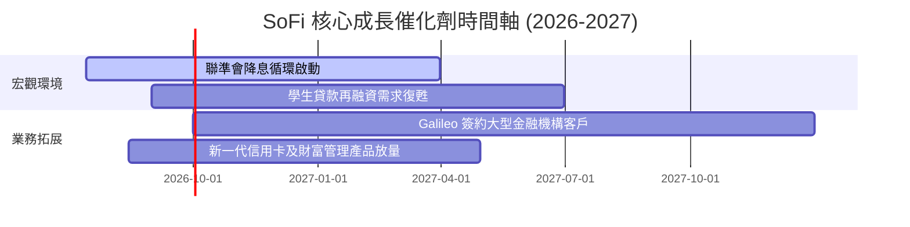

### 8.2 TAM 市場規模分析

SoFi 的目標市場（TAM）正在從單一的「再融資」向「全功能數位銀行」與「金融 B2B 基礎設施」擴張：

```
╔══════════════════════════════════════════════════════════════════╗
║                    🎯 SOFI 各板塊 TAM 與滲透率                   ║
╠══════════════════════════════════════════════════════════════════╣
║                                                                  ║
║  1. 美國消費信貸市場 (Lending TAM): $1.8 Trillion                ║
║     ├── SoFi 當前滲透率：~2.2%                                   ║
║     └── 預估貢獻：穩健的利息收入基石                             ║
║                                                                  ║
║  2. 核心銀行技術服務 (Galileo TAM): $85 Billion                  ║
║     ├── SoFi 當前滲透率：~0.7%                                   ║
║     └── 預估貢獻：輕資產、高毛利的 SaaS 收入                     ║
║                                                                  ║
║  3. 數位財富管理與零售存款 (Financial Services TAM): $12 Trillion║
║     ├── SoFi 當前滲透率：~0.3%                                   ║
║     └── 預估貢獻：極具潛力的跨售飛輪起點                         ║
║                                                                  ║
╚══════════════════════════════════════════════════════════════════╝
```

### 8.3 成長驅動力結構圖

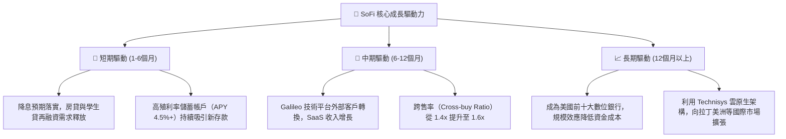

---

## 9. 風險矩陣

### 9.1 風險評分矩陣

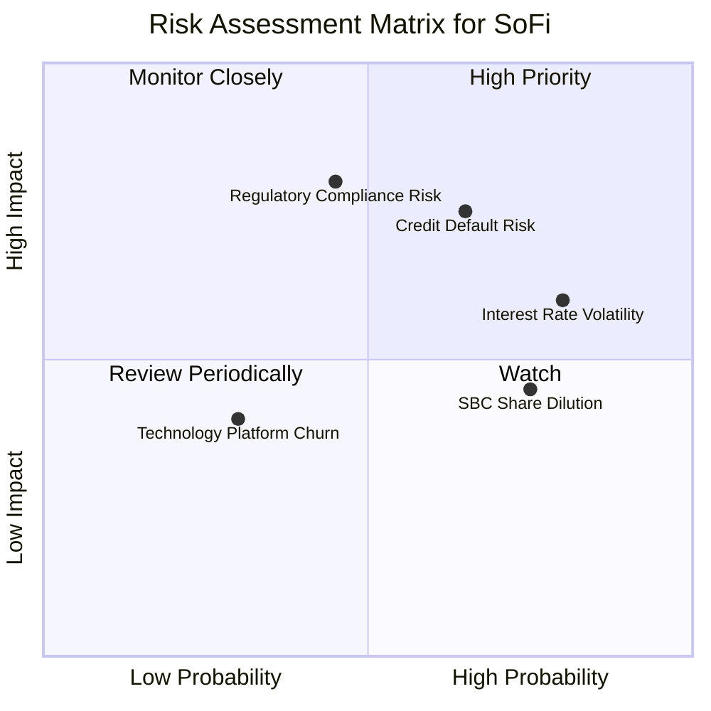

### 9.2 風險清單詳細分析

| # | 風險項目 | 發生機率 | 財務衝擊 | 風險評分 | 緩解措施 |
|---|----------|----------|----------|----------|----------|
| 1 | 🔴 **無擔保個人貸款信用違約率（NCO）上升** | 高 (65%) | 高 (-15% 淨利) | 🔴 **7.8/10** | 提高借款人信用門檻（當前平均 FICO 評分達 745），並增提撥備金。 |
| 2 | 🟡 **降息速度過快導致淨利差（NIM）收窄** | 高 (80%) | 中 (-8% 營收) | 🟡 **6.4/10** | 透過浮動利率資產配置與降低存款 APY 進行對沖。 |
| 3 | 🔴 **金融監管與資本充足率底線調高** | 中 (45%) | 高 (-20% 槓桿空間) | 🔴 **6.0/10** | 保持高於監管底線 400 bps 以上的一級資本充足率，並積極拓展輕資產技術服務。 |
| 4 | 🟡 **股權薪酬（SBC）持續稀釋每股盈餘** | 高 (75%) | 低 (-5% EPS) | 🟡 **5.2/10** | 董事會已承諾將 SBC 佔營收比例逐步控制在 5% 以內，並於獲利後啟動適度回購。 |

---

## 10. 投資建議

### 10.1 最終綜合評級雷達圖

```
╔══════════════════════════════════════════════════════════════╗
║                 SOFI 最終綜合投資評級                        ║
╠══════════════════════════════════════════════════════════════╣
║ 財務基本面  8.5 ▓▓▓▓▓▓▓▓▓▓▓▓▓▓▓▓▓░░░  ★★★★☆           ║
║ 營收成長性  9.0 ▓▓▓▓▓▓▓▓▓▓▓▓▓▓▓▓▓▓░░  ★★★★★           ║
║ 估值合理性  6.0 ▓▓▓▓▓▓▓▓▓▓▓▓░░░░░░░░  ★★★☆☆           ║
║ 護城河深度  7.5 ▓▓▓▓▓▓▓▓▓▓▓▓▓▓▓░░░░░  ★★★★☆           ║
║ 財務防禦力  8.0 ▓▓▓▓▓▓▓▓▓▓▓▓▓▓▓▓░░░░  ★★★★☆           ║
╠══════════════════════════════════════════════════════════════╣
║ 綜合總分    7.8 ▓▓▓▓▓▓▓▓▓▓▓▓▓▓▓▓░░░░  🏆 買入 (Buy)        ║
╚══════════════════════════════════════════════════════════════╝
```

### 10.2 目標價與隱含報酬率

| 情境 | 發生機率權重 | 12M 目標價 | 當前股價 ($18.51) 隱含報酬率 | 權重後期望值目標價 |
|------|--------------|------------|------------------------------|--------------------|
| 🔴 **悲觀** | 20% | $12.00 | -35.17% | |
| 🟡 **基準** | **60%** | **$24.50** | **+32.36%** | **$22.15** (+19.66%) |
| 🟢 **樂觀** | 20% | $35.00 | +89.09% | |

### 10.3 買入時機與觸發因素

```
╔══════════════════════════════════════════════════════════════════╗
║                  ✅ SOFI 買入觸發因素 Checklist                  ║
╠══════════════════════════════════════════════════════════════════╣
║                                                                  ║
║  立即買入觸發條件（多數符合）：                                  ║
║  ✅ 股價回檔至 $16.50 - $18.00 區間（歷史強力支撐）               ║
║  ✅ 聯準會確認降息路徑，美債收益率曲線趨平                       ║
║  ✅ 連續兩季 GAAP 淨利潤率維持在 12% 以上                        ║
║                                                                  ║
║  加碼觸發條件（出現以下任一）：                                  ║
║  ☐ Galileo 宣佈簽約資產規模前 50 的美國主流商業銀行              ║
║  ☐ 季度貸存比（LDR）優化至 95% 以下，且存款規模持續攀升          ║
║                                                                  ║
║  減碼/停損觸發條件（出現以下任一）：                             ║
║  ☐ 季度個人放貸違約率（NCO）連續兩季突破 6.5%                     ║
║  ☐ 技術平台（Galileo/Technisys）營收增速跌破 10%                 ║
║                                                                  ║
╚══════════════════════════════════════════════════════════════════╝
```

### 10.4 投資人適配度分析

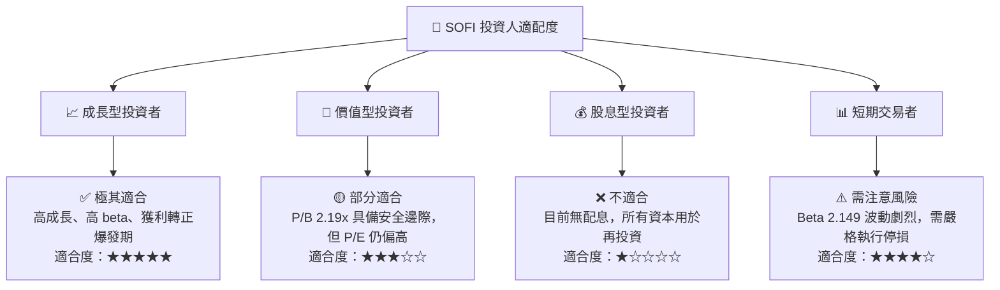

### 10.5 每季財報監控清單（Quarterly Watch List）

為了持續追蹤 SoFi 的投資邏輯是否成立，投資人應在每季財報中重點監控以下指標：

| 監控指標 | 基準健康值 | 觸發「加碼」門檻 | 觸發「減碼/賣出」門檻 | 監控意義 |
|---|---|---|---|---|
| **存款規模 (Deposits)** | $38B - $42B | > $45B (YoY +50%以上) | < $35B (資金流失) | 評估負債端穩定度與資金成本。 |
| **淨利差 (NIM)** | 5.0% - 5.3% | > 5.5% (利潤空間擴張) | < 4.5% (降息衝擊過大) | 評估銀行核心獲利能力。 |
| **個人放貸違約率 (NCO)** | 4.0% - 5.0% | < 3.5% (風控極佳) | > 6.0% (信用惡化) | 監控無擔保信貸風險。 |
| **技術平台營收增速** | YoY +15% | YoY > 25% (SaaS 轉型加速) | YoY < 8% (客戶流失) | 評估高估值溢價的支撐力。 |
| **股權稀釋速度 (Shares YoY)**| +10% 左右 | < 5% (稀釋顯著放緩) | > 15% (大額股權補償稀釋) | 評估盈餘含金量與股東權益保護。 |

### 10.6 反面論證：什麼會證明論點錯誤（What Would Change My Mind）

```
╔══════════════════════════════════════════════════════════════════╗
║              ⚠️ 論點失效條件（Disconfirming Evidence）           ║
╠══════════════════════════════════════════════════════════════════╣
║  本投資論點在下列情況成立時應重新檢視或退出：                    ║
║  ☐ 核心放貸業務淨利差（NIM）連續兩季低於 4.5%                    ║
║  ☐ 個人貸款違約率（NCO）攀升至 6.5% 以上，導致撥備金大幅侵蝕淨利  ║
║  ☐ 存款規模出現環比（QoQ）負成長，迫使公司重新依賴高成本批發融資  ║
║  ☐ 技術平台（Galileo）出現重大技術故障或核心客戶轉向競爭對手      ║
║  ☐ 股權薪酬（SBC）佔營收比重重新攀升至 12% 以上，稀釋股東回報    ║
╚══════════════════════════════════════════════════════════════════╝
```

---

> **免責聲明**：本報告為基於公開財務數據之投資研究分析，不構成任何買賣建議。投資有風險，入市需謹慎。分析師持有 CFA 資格，並致力於維持客觀中立之研究立場。