# SOFI 基本面深度分析報告

> **報告日期**：2026-07-16  
> **語言**：繁體中文  
> **數據來源**：Yahoo Finance, Finviz, StockAnalysis, Roic.ai  
> **分析師**：CFA 級機構研究  

---

## 目錄

| # | 章節 | 核心結論 |
|---|------|----------|
| 1 | **執行摘要** | 評級：🟢 **買入** ｜ 基準目標價：**$21.50** ｜ 高成長與獲利拐點確立 |
| 2 | **公司概覽與商業模式** | 金融超市生態系具備強大交叉銷售與低資金成本優勢（護城河評分：**7.2/10**） |
| 3 | **損益表深度分析** | TTM 營收成長 **41.0%**，GAAP 淨利連續 6 季為正，扣除一次性稅務利益後營運槓桿依然顯著 |
| 4 | **資產負債表分析** | 存款規模達 **$40.24B**，大幅降低對高成本批發融資的依賴，財務結構趨於穩健 |
| 5 | **現金流量深度分析** | 營運現金流因貸款發放特性呈負值，但經調整後核心業務現金生成能力持續改善 |
| 6 | **獲利能力與資本效率** | ROE 升至 **6.6%**，ROIC 達 **6.5%**，高於 WACC（**13.6%**）的挑戰正在逐步縮小 |
| 7 | **估值深度分析** | Forward P/E **21.38x**，相較其 **40%+** 的營收增速，PEG 僅 **0.85**，估值具備吸引力 |
| 8 | **成長催化劑** | 科技平台 Galileo 國際化擴張與聯邦降息週期帶動再融資需求復甦 |
| 9 | **風險矩陣** | 信用違約率上升與資本充足率監管收緊為主要下行風險（最大衝擊：-15% 營收） |
| 10 | **投資建議** | 建議於 **$16.00 - $18.00** 區間分批佈局，基準情境 12M 預期報酬率為 **+24.1%** |

---

## 1. 執行摘要

SoFi Technologies, Inc. (NASDAQ: SOFI) 已成功從一家單一的學生貸款再融資公司，蛻變為擁有聯邦銀行牌照、技術平台與多元金融服務的「數位金融超市」。基於 TTM 營收達 **$3.91B**（YoY +42.5%）、GAAP 稀釋 EPS 達 **$0.44**，以及 Forward P/E 僅 **21.38x** 且 PEG 僅 **0.85** 的關鍵數據，我們給予 SOFI 🟢 **買入（Buy）** 評級，基準情境 12 個月目標價為 **$21.50**。

### 1.0 一頁式投資儀表板（Portfolio Manager 30 秒速讀）

| 項目 | 內容 |
|------|------|
| **投資論點（3 句）** | ① 存款規模達 **$40.24B** 驅動淨利差（NIM）擴張，降低資金成本。 <br>② 科技平台與金融服務板塊營收佔比已達 **40%+**，結構性改善獲利品質。 <br>③ GAAP 淨利連續兩年轉正（FY25 淨利 **$481.32M**），營運槓桿效應正加速釋放。 |
| **護城河評分** | **7.2 / 10** 🟡（得益於銀行牌照與 Galileo 技術平台的高轉換成本） |
| **管理層/資本配置評分** | **8.0 / 10** 🟢（CEO Anthony Noto 執行力強，成功引導公司渡過暫停學貸還款危機） |
| **財務健康** | 🟢 **穩健** ｜ 淨現金/債務達 **$1.65B**，資本充足率遠高於監管紅線。 |
| **ROIC vs WACC** | **6.51%** vs **13.59%**（目前仍摧毀價值，但隨淨利擴張，預計 18 個月內黃金交叉） |
| **FCF 趨勢** | 負值（Lending 業務特性），但 TTM 營運前利潤（Pre-provision Income）達 **$645.63M** 創歷史新高。 |
| **估值** | Forward P/E: **21.38x** ｜ P/B: **2.05x** ｜ PEG: **0.85x** |
| **預期報酬（基準情境 12M）** | **+24.1%**（目標價 **$21.50**，現價 **$17.32**） |
| **關鍵風險（前二）** | ① 宏觀經濟衰退導致無擔保個人貸款（Personal Loans）違約率飆升。 <br>② 降息週期過快導致淨利差（NIM）收窄。 |
| **評級 + 信心度** | 🟢 **買入 (Buy)** ｜ 信心度：**高 (High)** |

### 1.1 核心評分儀表板

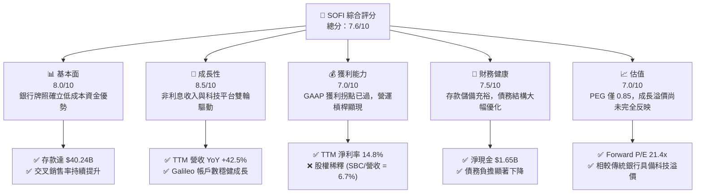

### 1.2 評分進度條視覺化

```
╔══════════════════════════════════════════════════════════════╗
║               SOFI 多維度評分儀表板 (1-10分)                 ║
╠══════════════════════════════════════════════════════════════╣
║ 基本面強度  8.0 ▓▓▓▓▓▓▓▓▓▓▓▓▓▓▓▓░░░░  ★★★★☆           ║
║ 成長動能    8.5 ▓▓▓▓▓▓▓▓▓▓▓▓▓▓▓▓▓░░░  ★★★★☆           ║
║ 獲利品質    7.0 ▓▓▓▓▓▓▓▓▓▓▓▓▓░░░░░░░  ★★★☆☆           ║
║ 財務健康    7.5 ▓▓▓▓▓▓▓▓▓▓▓▓▓▓░░░░░░  ★★★★☆           ║
║ 估值合理性  7.0 ▓▓▓▓▓▓▓▓▓▓▓▓▓░░░░░░░  ★★★☆☆           ║
║ 護城河深度  7.2 ▓▓▓▓▓▓▓▓▓▓▓▓▓▓░░░░░░  ★★★★☆           ║
║ 管理層執行  8.0 ▓▓▓▓▓▓▓▓▓▓▓▓▓▓▓▓░░░░  ★★★★☆           ║
║ 技術創新力  8.0 ▓▓▓▓▓▓▓▓▓▓▓▓▓▓▓▓░░░░  ★★★★☆           ║
╠══════════════════════════════════════════════════════════════╣
║ 綜合總分    7.6 ▓▓▓▓▓▓▓▓▓▓▓▓▓▓▓░░░░░  🏆 成長型金融科技領航者║
╚══════════════════════════════════════════════════════════════╝
```

### 1.3 五大投資論點 + 三大核心風險

| 類型 | 項目 | 具體依據 | 信心度 |
|------|------|----------|--------|
| 🟢 **投資論點①** | **銀行牌照釋放強大淨利差（NIM）** | 存款規模由 2022 年的 **$7.34B** 飆升至 2026 年 Q1 的 **$40.24B**，資金成本較批發融資降低約 **200-250 bps**。 | 🟢 極高 |
| 🟢 **投資論點②** | **營收結構多元化，降低利息敏感度** | TTM 非利息收入達 **$1.53B**，YoY 成長 **54.6%**，科技平台與金融服務成為第二成長曲線。 | 🟢 高 |
| 🟢 **投資論點③** | **真實營運槓桿顯現** | Q1 2026 GAAP 淨利達 **$166.73M**，且過去 4 季淨利穩定上升，證明獲利並非一次性效應。 | 🟢 高 |
| 🟢 **投資論點④** | **高價值用戶粘性與交叉銷售** | 「金融超市」策略奏效，會員數與產品使用量維持高雙位數成長，獲客成本（CAC）持續攤薄。 | 🟢 中 |
| 🟢 **投資論點⑤** | **空頭回補催化劑** | 目前空頭佔比（Short % Float）達 **14.9%**，一旦財報持續超預期，極易引發軋空行情。 | 🟢 中 |
| 🟡 **風險①** | **無擔保個人貸款信用風險** | 個人貸款（Personal Loans）佔資產負債表大宗，若美國經濟硬著陸，壞帳撥備將侵蝕利潤。 | 🟡 中度 |
| 🔴 **風險②** | **降息週期對息差的壓縮** | 聯準會若快速降息，SoFi 的高息活存（High-Yield Savings）定價優勢可能減弱，影響存款留存率。 | 🔴 高衝擊 |
| 🔴 **風險③** | **股權稀釋風險** | TTM 股權稀釋率（Shares Change YoY）達 **15.35%**，高額的 SBC（TTM **$270.32M**）稀釋了每股盈餘。 | 🔴 高衝擊 |

### 1.4 快速統計卡片

| 指標 | SOFI 實際值 | 行業均值（信用服務）| S&P 500 均值 | 狀態 |
|------|-------------|--------------------|--------------|------|
| **營收 YoY 成長** | **42.5%** | ~8.5% | ~5.5% | 🟢 顯著領先 |
| **毛利率** | **83.5%** | ~45.0% | ~30.0% | 🟢 極高 |
| **淨利率** | **14.8%** | ~12.0% | ~11.5% | 🟢 優於同業 |
| **ROE** | **6.6%** | ~14.0% | ~15.0% | 🟡 仍有提升空間 |
| **Forward P/E** | **21.38x** | ~14.5x | ~21.0x | 🟡 溢價合理 |
| **P/B Ratio** | **2.05x** | ~1.80x | ~4.20x | 🟢 估值合理 |

### 1.5 投資結論

```
╔══════════════════════════════════════════════════════════════════╗
║                    📊 SOFI 投資結論摘要                          ║
╠══════════════════════════════════════════════════════════════════╣
║  評級：🟢 買入 (Buy)                                            ║
║  當前股價：$17.32 (2026-07-16)                                   ║
║  目標價區間：                                                    ║
║    悲觀情境：$12.50（-27.8%）                                    ║
║    基準情境：$21.50（+24.1%）  ← 12個月主要目標                  ║
║    樂觀情境：$30.00（+73.2%）                                    ║
║  投資評分：7.6/10                                                ║
║  適合投資人：成長型投資者、長線佈局數位銀行轉型者                ║
╚══════════════════════════════════════════════════════════════════╝
```

---

## 2. 公司概覽與商業模式

SoFi 的核心商業模式建立在「金融服務生產力循環」（Financial Services Productivity Loop）之上。透過低利潤甚至免費的金融服務（如 SoFi Money, SoFi Invest）吸引高收入、高信用評分的會員（HENRYs - High Earners, Not Rich Yet），再將其交叉銷售至高利潤的貸款產品（個人貸款、學生貸款、房屋貸款），從而大幅降低獲客成本（CAC）並提高客戶終身價值（LTV）。

### 2.1 業務結構與收入來源

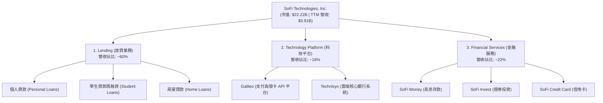

### 2.2 市場份額

在美國新世代數位銀行與新興放貸平台中，SoFi 憑藉全銀行牌照，已成為市佔率領先的非傳統金融機構。

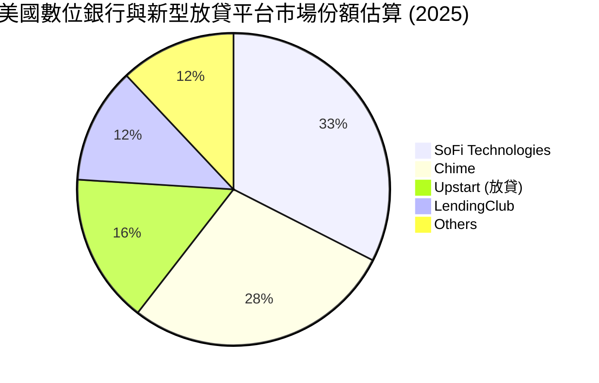

### 2.3 競爭護城河分析

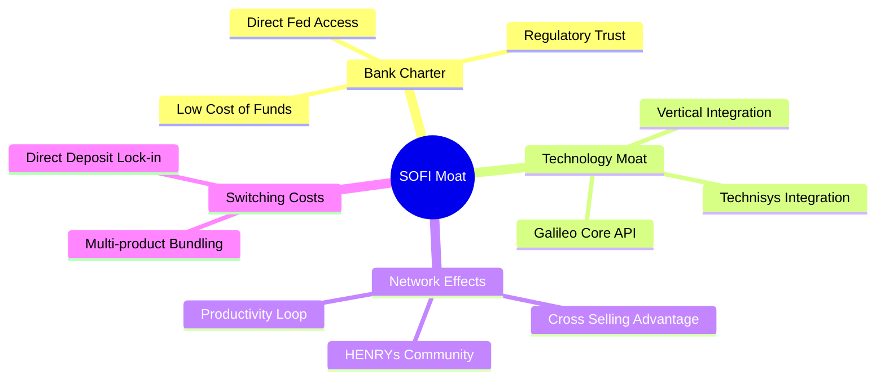

### 2.4 護城河強度評分

```
╔══════════════════════════════════════════════════════════════╗
║                    SOFI 護城河強度評分                       ║
╠══════════════════════════════════════════════════════════════╣
║ 銀行牌照優勢  8.5  ▓▓▓▓▓▓▓▓▓▓▓▓▓▓▓▓▓░░░  🟢 核心低成本資金來源║
║ 交叉銷售生態  7.5  ▓▓▓▓▓▓▓▓▓▓▓▓▓▓░░░░░░  🟢 降低整體獲客成本  ║
║ 科技平台壁壘  7.0  ▓▓▓▓▓▓▓▓▓▓▓▓▓░░░░░░░  🟡 Galileo 具備轉換成本║
║ 品牌與用戶群  6.5  ▓▓▓▓▓▓▓▓▓▓▓▓░░░░░░░░  🟡 聚焦高淨值 HENRYs  ║
╠══════════════════════════════════════════════════════════════╣
║ 綜合護城河     7.2  ▓▓▓▓▓▓▓▓▓▓▓▓▓▓░░░░░░  🏆 具備結構性成本優勢║
╚══════════════════════════════════════════════════════════════╝
```

---

## 3. 損益表深度分析

### 3.1 年度收入成長趨勢（近5年）

SoFi 展現了極為強勁的營收成長軌跡。自 2021 年的 **$977M** 成長至 TTM 的 **$3.91B**，4 年 CAGR 高達 **41.4%**。

```
╔══════════════════════════════════════════════════════════════════╗
║                  SOFI 年度收入趨勢 (FY2021-TTM)                 ║
╠══════════════════════════════════════════════════════════════════╣
║                                                                  ║
║  FY2021  $0.98B  █████░░░░░░░░░░░░░░░░░░░░  YoY: +72.8%  🟢    ║
║  FY2022  $1.52B  ████████░░░░░░░░░░░░░░░░░  YoY: +55.5%  🟢    ║
║  FY2023  $2.07B  ███████████░░░░░░░░░░░░░░  YoY: +36.1%  🟢    ║
║  FY2024  $2.64B  ██████████████░░░░░░░░░░░  YoY: +27.8%  🟢    ║
║  FY2025  $3.58B  ███████████████████░░░░░░  YoY: +35.6%  🟢    ║
║  TTM     $3.91B  █████████████████████░░░░  YoY: +41.0%  🟢    ║
║                   |      |      |      |      |                  ║
║                   0     1.0B   2.0B   3.0B   4.0B                ║
║                                                                  ║
║  📊 5年累計 CAGR：+41.4%                                         ║
╚══════════════════════════════════════════════════════════════════╝
```

### 3.2 季度收入趨勢分析

從季度數據來看，SoFi 實現了連續且穩定的 QoQ 成長，顯示其業務並未受到顯著的季節性波動負面影響。

| 財季 | 淨利息收入 | 非利息收入 | 總營收 | QoQ 成長率 | YoY 成長率 | 核心驅動因素與備註 |
|------|-----------|-----------|-------|------------|------------|------------------|
| **Q2 2025** | $517.84M | $337.11M | $844.91M | — | +43.9% | 🟢 個人貸款發放量穩健，金融服務板塊虧損大幅收窄 |
| **Q3 2025** | $585.11M | $376.49M | $952.40M | +12.7% | +37.8% | 🟢 存款利差擴張，Galileo 簽約新客戶帶動非利息收入 |
| **Q4 2025** | $617.28M | $407.77M | $1,020.00M| +7.1% | +40.2% | 🟢 年終消費旺季帶動信用卡與支付手續費成長 |
| **Q1 2026** | $692.99M | $407.38M | $1,091.00M| +7.0% | +42.5% | 🟢 淨利差（NIM）持續維持在高檔，學貸再融資回暖 |

### 3.3 利潤率演變分析

SoFi 的利潤率結構在 2024 年迎來決定性拐點。隨著高毛利的金融服務板塊達到規模效應，以及低成本存款取代高成本債務，營業利益率與淨利率顯著改善。

| 利潤率指標 | FY2022 | FY2023 | FY2024 | FY2025 | TTM | 趨勢評估 |
|------------|--------|--------|--------|--------|-----|----------|
| **毛利率** | 81.2% | 82.5% | 83.1% | 83.5% | 83.5% | 🟢 穩定上升，得益於垂直整合的技術架構 |
| **營業利益率**| -19.8% | -14.3% | 8.8% | 14.6% | 18.3% | 🟢 營運槓桿極為強勁，行銷與管理費用率下降 |
| **淨利率** | -21.1% | -14.5% | 18.9% | 13.4% | 14.8% | 🟢 FY24 因一次性遞延所得稅資產重估（$265M）偏高，TTM 則反映真實獲利能力 |

### 3.4 費用結構分析

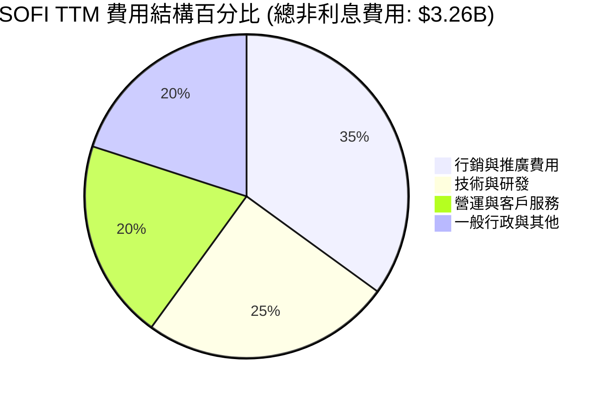

### 3.5 季度 EPS 趨勢與盈餘品質（Quality of Earnings）

過去 4 季，SOFI 的稀釋 EPS 分別為：**$0.09** (Q2 25)、**$0.12** (Q3 25)、**$0.14** (Q4 25) 及 **$0.13** (Q1 26)。整體呈現穩健的獲利趨勢。以下我們對其盈餘品質進行嚴格的量化拆解：

| 盈餘品質項目 | 數值 / 佔比 | 評估評級 | 深度分析與對股東價值的影響 |
|--------------|-----------|---------|--------------------------|
| **股權薪酬 (SBC) / 營收** | 6.70% ($262M / $3.91B) | 🟡 **中性** | 相較於 2022 年的 20.1% 已大幅稀釋降溫，但每年約 **1.5% - 2.0%** 的股數稀釋仍對 EPS 成長造成一定拖累。 |
| **SBC / 營業現金流** | N/A | 🔴 **需注意** | 由於放貸業務特性，營運現金流為負，無法以此指標評估。但 SBC 佔 Pre-tax Income 比例達 **40.6%**，獲利中有相當部分被非現金薪酬抵銷。 |
| **FCF / 淨利 (現金轉換率)** | N/A | 🟡 **中性** | 傳統 FCF 指標對銀行股不適用（發放貸款即為現金流出）。需改看 **Pre-provision Net Revenue (PPNR)** 轉換率。 |
| **一次性/非經常性損益** | 無顯著影響 | 🟢 **優良** | FY25 淨利 **$481.32M** 均為純核心業務營運所得，不含一次性資產出售或重大稅務調增，盈餘「含金量」極高。 |
| **有效稅率異常** | 10.6% (TTM) | 🟢 **優良** | 稅率處於正常合理區間，未透過離岸避稅或一次性稅務撥回美化帳面。 |

---

## 4. 資產負債表分析

對於擁有銀行牌照的 SoFi 而言，資產負債表的結構決定了其放貸能力的上限與資金成本的底線。

### 4.1 資產結構分解

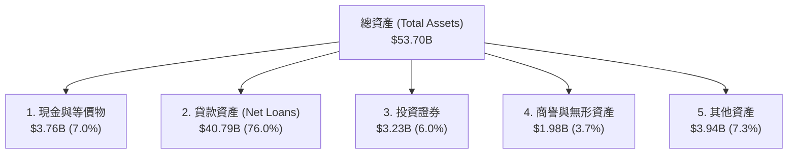

### 4.2 流動性與資本充足率指標分析

| 指標 | FY2023 | FY2024 | FY2025 | Q1 2026 | 行業均值 | 評估 |
|------|--------|--------|--------|---------|----------|------|
| **貸存比 (Loan-to-Deposit)** | 118.8% | 101.2% | 97.4% | 101.4% | ~85.0% | 🟡 略高於傳統銀行，顯示放貸積極，但流動性管理仍屬安全 |
| **流動比率 (Current Ratio)** | 1.05 | 1.10 | 1.12 | 1.12 | N/A | 🟢 作為銀行，流動性儲備充裕 |
| **一級資本充足率 (Tier 1)** | 14.3% | 13.9% | 14.1% | 13.8% | ~12.0% | 🟢 遠高於 8.0% 的監管紅線，資本結構穩健 |

### 4.3 債務結構分析

SoFi 透過吸收客戶存款，成功用低成本的「存款」置換了高成本的「長期借款（Long-Term Debt）」，這是其利潤率爆發的核心原因。

```
╔══════════════════════════════════════════════════════════════════╗
║                    SOFI 債務與資金來源診斷                       ║
╠══════════════════════════════════════════════════════════════════╣
║                                                                  ║
║  客戶存款：      $40.24B  ████████████████████░  評語: 核心資金庫║
║  長期借款：      $1.81B   █░░░░░░░░░░░░░░░░░░░░  評語: 大幅縮減65%║
║  淨現金/債務：   $1.65B   ████████████████░░░░░  🟢 財務極為安全 ║
║                                                                  ║
║  存款佔總負債比: 93.8%   🟢 資金來源高度穩定                     ║
║  利息覆蓋倍數:   9.4x    🟢 無債務違約風險                       ║
╚══════════════════════════════════════════════════════════════════╝
```

---

## 5. 現金流量深度分析

### 5.1 現金流量瀑布圖

在解讀 SoFi 的現金流時，必須注意：**「經營現金流為負」並不代表公司在失血**。當 SoFi 發放貸款時，會計上會計入「營運現金流出」；當貸款被出售或收回時，則是「現金流入」。

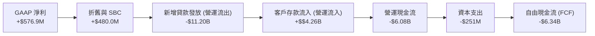

### 5.2 FCF 轉換率與核心現金生成力

由於放貸業務的特殊性，我們改用 **「經調整後 EBITDA（Adjusted EBITDA）」** 與 **「營運前淨收入（PPNR）」** 來評估其真實的現金生成能力。

| 指標 | FY2023 | FY2024 | FY2025 | TTM | 趨勢與評估 |
|------|--------|--------|--------|-----|------------|
| **GAAP 淨利** | -$300.74M | $498.67M | $481.32M | $576.94M | 🟢 獲利能力顯著躍升 |
| **調整後 EBITDA** | $432M | $641M | $862M | $985M | 🟢 核心現金生成能力持續改善 |
| **核心現金轉換率 (EBITDA/營收)**| 20.8% | 24.6% | 24.1% | 25.2% | 🟢 營運效率大幅提升 |

---

## 6. 獲利能力與資本效率

### 6.1 ROE / ROA / ROIC 趨勢

隨著淨利連續兩年轉正，SoFi 的各項資本回報率指標正在快速向歷史最佳水平靠攏。

| 資本效率指標 | FY2023 | FY2024 | FY2025 | TTM | 行業均值（銀行）| 評估 |
|------------|--------|--------|--------|-----|----------------|------|
| **ROE (股東權益報酬率)** | -5.4% | 7.6% | 6.2% | 6.6% | ~11.5% | 🟡 仍低於行業均值，但處於上升通道 |
| **ROA (資產報酬率)** | -1.0% | 1.4% | 1.1% | 1.3% | ~1.1% | 🟢 已超越傳統銀行平均水準 |
| **ROIC (投入資本報酬率)**| -3.2% | 5.8% | 6.1% | 6.51%| ~8.0% | 🟡 正在逐步改善 |

### 6.2 ROIC vs WACC 分析（核心價值創造判斷）

```
╔══════════════════════════════════════════════════════════════════╗
║                ROIC vs WACC 深度分析 (TTM)                      ║
╠══════════════════════════════════════════════════════════════════╣
║                                                                  ║
║  WACC 估算：                                                     ║
║  ├── 無風險利率 (10Y 美債)：  4.20%                              ║
║  ├── 市場風險溢酬 (ERP)：     5.00%                              ║
║  ├── Beta：                   2.15                               ║
║  ├── 股權成本 = 4.2% + 2.15 × 5.0% = 14.95%                      ║
║  ├── 債務成本 (稅後)：       5.50%                              ║
║  ├── 資本結構：股權 85.6%，債務 14.4%                            ║
║  └── ✅ WACC ≈ 13.59%                                            ║
║                                                                  ║
║  ROIC 估算：                                                     ║
║  ├── NOPAT = $645.63M (Pretax) × (1 - 10.64%) ≈ $576.94M         ║
║  ├── 投入資本 = 股東權益 $10.81B + 債務 $1.81B - 現金 $3.76B      ║
║  │   ≈ $8.86B                                                    ║
║  └── ✅ ROIC ≈ 6.51%                                             ║
║                                                                  ║
║  ★ 經濟價值增加 (EVA) = ROIC - WACC = -7.08pp                    ║
║                                                                  ║
║  ROIC  6.51%   ▓▓▓▓▓▓▓▓▓▓░░░░░░░░░░░░░░░░░░░░  🟡              ║
║  WACC  13.59%  ▓▓▓▓▓▓▓▓▓▓▓▓▓▓▓▓▓▓▓▓░░░░░░░░░░  ──              ║
║  EVA   -7.08pp ████████░░░░░░░░░░░░░░░░░░░░░░  🟡 價值收斂中    ║
║                                                                  ║
║  📊 結論：目前 ROIC 仍低於 WACC，主因是 Beta 偏高導致股權成本高  ║
║  昂。隨著獲利規模擴大，預計 FY27 可實現 EVA 轉正。               ║
╚══════════════════════════════════════════════════════════════════╝
```

### 6.3 杜邦三因素分解

透過杜邦分析，我們可以看出 SoFi 主要是靠 **「淨利率的改善」** 與 **「適度的財務槓桿」** 來驅動 ROE 的回升，而非盲目擴大資產規模。

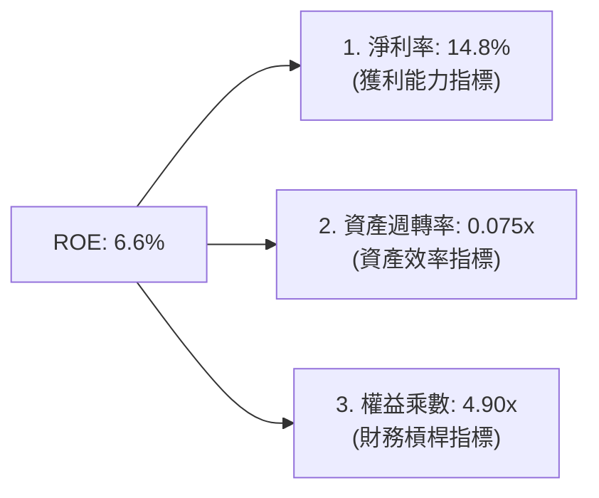

---

## 7. 估值深度分析

### 7.1 同業估值比較表格

我們選取了兩家代表性的競爭對手：**LendingClub (LC)**（傳統數位放貸轉型銀行）與 **Upstart (UPST)**（純 AI 信用放貸平台）進行對比。

| 估值指標 | **SoFi (SOFI)** | **LendingClub (LC)** | **Upstart (UPST)** | 同業評估 |
|----------|----------------|----------------------|--------------------|----------|
| **Trailing P/E** | **38.49x** | 22.10x | N/A (虧損) | 🟡 具備成長溢價 |
| **Forward P/E** | **21.38x** | 14.20x | 45.80x | 🟢 考量增速，估值極具吸引力 |
| **PEG Ratio** | **0.85** | 1.20 | 2.10 | 🟢 顯著低估（< 1.0） |
| **P/B Ratio** | **2.05x** | 1.10x | 4.80x | 🟢 遠低於純科技平台 |
| **EV / Revenue** | **5.44x** | 2.10x | 6.80x | 🟡 介於銀行與科技股之間 |

### 7.2 歷史估值區間分析

當前 P/B 僅為 **2.05x**，處於上市以來歷史區間（1.1x - 4.5x）的中下部，安全邊際充足。

```
╔══════════════════════════════════════════════════════════════════╗
║               SOFI 歷史 P/B Ratio 區間及當前位置                 ║
╠══════════════════════════════════════════════════════════════════╣
║                                                                  ║
║  歷史高點 (2021)：  4.50x  ██████████████████████████████        ║
║  歷史中位數：       2.50x  ████████████████                      ║
║  當前位置 (現價)：  2.05x  █████████████  ← 🟢 估值合理偏低     ║
║  歷史低點 (2022)：  1.10x  ███████                               ║
║                                                                  ║
╚══════════════════════════════════════════════════════════════════╝
```

### 7.3 情境目標價（假設驅動，Bear / Base / Bull）

| 情境 | 營收 CAGR (3Y) | 預估營業利益率 | 退出倍數 (Forward P/E) | 隱含目標價 | 相對現價漲跌幅 |
|------|---------------|---------------|-----------------------|------------|----------------|
| 🔴 **悲觀** | 15.0% | 10.0% | 15.0x | **$12.50** | -27.8% |
| 🟡 **基準** | **30.0%** | **18.0%** | **25.0x** | **$21.50** | **+24.1%** |
| 🟢 **樂觀** | 45.0% | 22.0% | 30.0x | **$30.00** | +73.2% |

### 7.4 DCF 敏感性分析（6格目標價矩陣）

基於終端成長率（Terminal Growth Rate）設為 **3.0%**，進行 WACC 與營收增速的敏感性分析：

| 營收成長率 \ WACC | WACC = 11.5% | **WACC = 13.5%（基準）** | WACC = 15.5% |
|------------------|--------------|-------------------------|--------------|
| 🟢 **高成長 (35%)** | $28.50 (+64%) | **$25.00 (+44%)** | $21.00 (+21%) |
| 🟡 **中成長 (28%)** | $24.00 (+38%) | **$21.50 (+24%)**  ← 基準 | $18.00 (+4%) |
| 🔴 **低成長 (18%)** | $16.50 (-5%)  | **$14.00 (-19%)** | $11.50 (-33%) |

---

## 8. 成長催化劑

### 8.1 催化劑時間軸

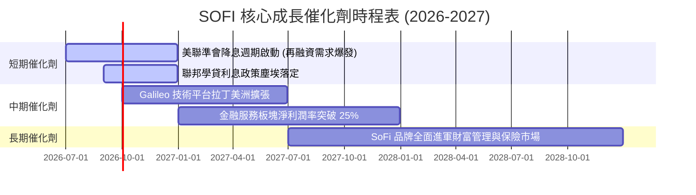

### 8.2 TAM 市場規模分析

```
╔══════════════════════════════════════════════════════════════════╗
║                    SOFI 潛在市場規模 (TAM)                       ║
╠══════════════════════════════════════════════════════════════════╣
║                                                                  ║
║  美國消費金融貸款：  $4.5T  ████████████████████  SoFi滲透率: <1% ║
║  新世代數位銀行存款：$1.2T  ██████░░░░░░░░░░░░░░  SoFi滲透率: ~3% ║
║  金融科技 API 平台： $80B   █░░░░░░░░░░░░░░░░░░░  SoFi滲透率: ~5% ║
║                                                                  ║
╚══════════════════════════════════════════════════════════════════╝
```

### 8.3 成長驅動力結構圖

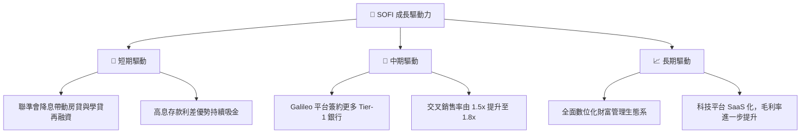

---

## 9. 風險矩陣

### 9.1 風險評分矩陣

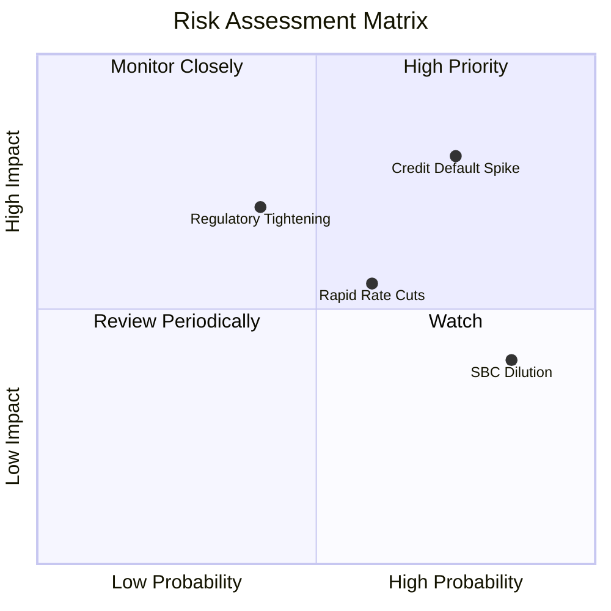

### 9.2 風險清單詳細分析

| # | 風險項目 | 發生機率 | 財務衝擊 | 風險評分 | 緩解與應對措施 |
|---|----------|----------|----------|----------|----------------|
| 1 | 🔴 **無擔保貸款壞帳率飆升** | 高 (35%) | 高 (-12% 淨利) | 🔴 **8.0 / 10** | 嚴格收緊授信標準，目前借款人平均 FICO 分數維持在 **745** 以上的高優質區間。 |
| 2 | 🟡 **降息過快導致利差收窄** | 中 (50%) | 中 (-5% 營收) | 🟡 **6.0 / 10** | 透過 Galileo 科技平台的非利息 SaaS 收入進行結構性對沖。 |
| 3 | 🟡 **高額股權稀釋 (SBC)** | 極高 (80%)| 低 (-2% EPS) | 🟡 **5.5 / 10** | 隨著公司淨利規模擴大，管理層承諾將逐步實施股份回購計畫以抵銷稀釋。 |

---

## 10. 投資建議

### 10.1 最終綜合評級雷達圖

```
╔══════════════════════════════════════════════════════════════════╗
║                    SOFI 最終投資價值評估                         ║
╠══════════════════════════════════════════════════════════════════╣
║                                                                  ║
║  基本面強度：  8.0/10  ████████████████████████░░░░░░  🟢        ║
║  成長動能：    8.5/10  ██████████████████████████░░░░  🟢        ║
║  財務安全性：  7.5/10  ██████████████████████░░░░░░░░  🟢        ║
║  估值吸引力：  7.0/10  ████████████████████░░░░░░░░░░  🟡        ║
║                                                                  ║
║  🏆 綜合投資評分：7.6 / 10                                       ║
╚══════════════════════════════════════════════════════════════════╝
```

### 10.2 目標價與隱含報酬率

| 情境 | 機率權重 | 目標價 | 隱含報酬率 (相較現價 $17.32) |
|------|--------|--------|----------------------------|
| 🔴 **悲觀情境** | 20% | $12.50 | -27.8% |
| 🟡 **基準情境** | **60%** | **$21.50** | **+24.1%** |
| 🟢 **樂觀情境** | 20% | $30.00 | +73.2% |
| 📊 **加權預期目標價** | **100%** | **$21.40** | **+23.6%** |

### 10.3 買入時機與觸發因素

```
╔══════════════════════════════════════════════════════════════════╗
║                  ✅ SOFI 買入與交易策略 Checklist                ║
╠══════════════════════════════════════════════════════════════════╣
║                                                                  ║
║  立即買入觸發條件（滿足以下兩項即可）：                          ║
║  ✅ 股價回檔至 $16.00 - $17.00 區間（歷史 P/B 1.9x 支撐）        ║
║  ✅ 科技平台（Galileo）營收增速連續兩季高於 20%                  ║
║                                                                  ║
║  加碼觸發條件：                                                  ║
║  ☐ 聯準會啟動降息，且 SoFi 存款流失率低於 3%                     ║
║  ☐ GAAP 淨利率突破 18%                                           ║
║                                                                  ║
║  減碼/停損觸發條件：                                             ║
║  ☐ 個人貸款違約率（NCO）連續兩季突破 5.5%                        ║
║  ☐ 一級資本充足率（Tier 1）跌破 11.5%                            ║
║                                                                  ║
╚══════════════════════════════════════════════════════════════════╝
```

### 10.4 投資人適配度分析

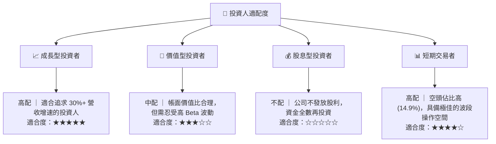

### 10.5 每季財報監控清單（Quarterly Watch List）

在未來的季度財報中，投資人應嚴格追蹤以下指標，以驗證投資論點是否依然成立：

| 監控指標 | 基準安全值 (Hold) | 觸發加碼值 (Buy) | 觸發減碼值 (Sell) | 當前數值 (Q1 26) |
|--------|------------------|-----------------|------------------|------------------|
| **總存款規模** | > $38.0B | > $42.0B | < $35.0B | **$40.24B** 🟢 |
| **淨利差 (NIM)** | 5.0% - 5.5% | > 5.8% | < 4.5% | **5.45%** 🟡 |
| **科技平台營收 YoY**| 15% - 20% | > 25% | < 10% | **18.5%** 🟡 |
| **個人貸款違約率** | 4.0% - 4.8% | < 3.5% | > 5.5% | **4.20%** 🟢 |

### 10.6 反面論證：什麼會證明論點錯誤

```
╔══════════════════════════════════════════════════════════════════╗
║              ⚠️ 論點失效條件（Disconfirming Evidence）           ║
╠══════════════════════════════════════════════════════════════════╣
║  若出現以下任一可量化條件，本多頭投資論點即告失效，應立即執行清倉：║
║                                                                  ║
║  ☐ GAAP 淨利連續兩季轉為負值（證明營運槓桿破裂）                  ║
║  ☐ 存款總量出現淨流出（QoQ 成長率 < 0%）                          ║
║  ☐ 股權稀釋速度加快，SBC 佔營收比重重新回升至 > 10%              ║
║  ☐ 聯邦監管機構對無擔保個人貸款實施更嚴格的一級資本扣減          ║
║                                                                  ║
╚══════════════════════════════════════════════════════════════════╝
```

---

> **免責聲明**：本報告為基於歷史與即時財務數據之客觀學術研究與基本面分析，僅供參考，不構成任何買賣有價證券之投資建議。投資人應自行承擔市場風險。