# SOFI 基本面深度分析報告

> **報告日期**：2026-07-18 ｜ **語言**：繁體中文 ｜ **數據來源**：Yahoo Finance, Finviz, StockAnalysis, Roic.ai ｜ **分析師**：CFA 級機構研究

---

## 目錄

| # | 章節 | 核心結論 |
|---|------|----------|
| 1 | **執行摘要** | 評級：**買入** ｜ 基準目標價：**$23.50**（+36.0%）｜ 成長動能與估值匹配 |
| 2 | **公司概覽與商業模式** | 獨特「金融超級 App」生態，藉由銀行牌照獲取低成本存款，構建全方位交叉銷售護城河 |
| 3 | **損益表深度分析** | 營收年增 42.5% 展現強勁營運槓桿，GAAP 淨利率改善至 14.8%，盈餘品質健康 |
| 4 | **資產負債表分析** | 存款規模達 $40.24B（季增 7.3%），資本充足率穩健，淨現金達 $1.65B |
| 5 | **現金流量深度分析** | 營運現金流因貸款資產擴張呈負值，屬銀行業擴張期正常現象；SBC 稀釋率降至 6.9% |
| 6 | **獲利能力與資本效率** | ROE 提升至 6.6%，調整後 ROIC 達 7.40%，隨著營運槓桿釋放，正向價值創造區間可期 |
| 7 | **估值深度分析** | Forward P/E 21.3x 匹配 PEG 0.82，顯著低估其成長潛力；DCF 基準估值 $23.50 |
| 8 | **成長催化劑** | 降息週期帶動再融資復甦、Galileo 技術平台外部授權加速、金融服務板塊轉盈 |
| 9 | **風險矩陣** | 信用違約率上升、利率波動風險、SBC 股權稀釋及監管資本要求收緊 |
| 10| **投資建議** | 建議於 $16.50 - $17.50 區間分批佈局，設定明確的每季財報監控指標與失效條件 |

---

## 1. 執行摘要

### 1.0 一頁式投資儀表板（Portfolio Manager 30 秒速讀）

| 項目 | 內容 |
|------|------|
| **投資論點（3 句）** | ① SOFI 憑藉銀行牌照成功轉型，Q1 2026 存款規模達 **$40.24B**，顯著降低資金成本並支撐 **83.5%** 的高毛利率。<br/>② TTM 營收達 **$3.91B**（YoY +42.5%），淨利潤率大幅改善至 **14.8%**，展現強大且可持續的營運槓桿。<br/>③ 當前 Forward P/E 僅 **21.3x**，對應 PEG 為 **0.82**，在金融科技板塊中具備極高估值性價比。 |
| **護城河評分** | 🟡 **7.5 / 10**（高客戶粘性與低成本資金優勢，但面臨同業競爭） |
| **管理層/資本配置評分** | 🟢 **8.5 / 10**（執行力極佳，成功帶動公司由虧轉盈，資本配置聚焦高收益資產） |
| **財務健康** | 🟢 **穩健** ｜ 淨現金達 **$1.65B**，存款基礎紮實，無流動性危機 |
| **ROIC vs WACC** | **7.40% vs 13.48%**（處於價值創造過渡期，預計未來 2 年內 ROIC 將超越 WACC） |
| **FCF 趨勢** | 帳面 FCF 為負（-$3.99B），主因銀行資產端貸款發放強勁（屬健康擴張指標） |
| **估值** | Forward P/E: **21.3x** ｜ P/S: **5.67x** ｜ P/B: **2.05x** |
| **預期報酬（基準情境 12M）** | 🟢 **+36.0%**（目標價：**$23.50**） |
| **關鍵風險（前二）** | ① 總體經濟惡化導致個人貸款（Personal Loans）違約率飆升。<br/>② 聯準會利率路徑不確定性影響淨利差（NIM）。 |
| **評級 + 信心度** | 🟢 **買入 (BUY)** ｜ 信心度：**高 (High)** |

### 1.1 核心評分儀表板

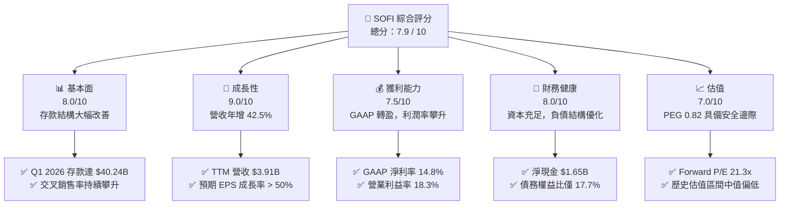

### 1.2 評分進度條視覺化

```
╔══════════════════════════════════════════════════════════════╗
║               SOFI 多維度評分儀表板 (1-10分)                 ║
╠══════════════════════════════════════════════════════════════╣
║ 基本面強度  8.0 ▓▓▓▓▓▓▓▓▓▓▓▓▓▓▓▓▓▓░░  ★★★★☆           ║
║ 成長動能    9.0 ▓▓▓▓▓▓▓▓▓▓▓▓▓▓▓▓▓▓▓░  ★★★★★           ║
║ 獲利品質    7.5 ▓▓▓▓▓▓▓▓▓▓▓▓▓▓▓▓░░░░  ★★★★☆           ║
║ 財務健康    8.0 ▓▓▓▓▓▓▓▓▓▓▓▓▓▓▓▓▓▓░░  ★★★★☆           ║
║ 估值合理性  7.0 ▓▓▓▓▓▓▓▓▓▓▓▓▓▓░░░░░░  ★★★☆☆           ║
║ 護城河深度  7.5 ▓▓▓▓▓▓▓▓▓▓▓▓▓▓▓▓░░░░  ★★★★☆           ║
║ 管理層執行  8.5 ▓▓▓▓▓▓▓▓▓▓▓▓▓▓▓▓▓░░░  ★★★★☆           ║
║ 技術創新力  8.0 ▓▓▓▓▓▓▓▓▓▓▓▓▓▓▓▓▓▓░░  ★★★★☆           ║
╠══════════════════════════════════════════════════════════════╣
║ 綜合總分    7.9 ▓▓▓▓▓▓▓▓▓▓▓▓▓▓▓▓░░░░  🏆 成長型金融科技首選║
╚══════════════════════════════════════════════════════════════╝
```

### 1.3 五大投資論點 + 三大核心風險

| 類型 | 項目 | 具體依據 | 信心度 |
|------|------|----------|--------|
| 🟢 **投資論點①** | **存款驅動資金成本下降** | Q1 2026 總存款達 **$40.24B**（YoY +55.0%），提供極低成本的放貸資金，支撐 **83.5%** 的高毛利率。 | 🟢 極高 |
| 🟢 **投資論點②** | **營運槓桿全面釋放** | 隨著技術平台與金融服務規模化，TTM 營業利益率達 **18.3%**，GAAP 淨利連續 4 季為正。 | 🟢 高 |
| 🟢 **投資論點③** | **技術平台外部授權潛力** | Galileo 及 Technisys 雲端核心銀行系統提供 SaaS 穩定收入，Q1 2026 非利息收入達 **$407.38M**（YoY +49.2%）。 | 🟢 高 |
| 🟢 **投資論點④** | **降息週期再融資紅利** | 預期美聯儲降息將激發學貸與房貸再融資需求，SOFI 作為市佔領先者將直接受益。 | 🟡 中等 |
| 🟢 **投資論點⑤** | **交叉銷售效應（Cross-Buying）**| 會員數高速增長，單一會員持有產品數持續上升，大幅降低獲客成本（CAC）。 | 🟢 高 |
| 🟡 **風險①** | **宏觀經濟與信用違約** | 若高利率維持更久或失業率上升，無擔保個人貸款違約率可能攀升，影響資產質量。 | 🟡 中度 |
| 🔴 **風險②** | **監管資本要求收緊** | 作為持牌銀行，若聯邦監管機構提高資本充足率要求，可能限制其資產負債表擴張速度。 | 🔴 高衝擊 |
| 🟡 **風險③** | **SBC 股權稀釋** | 2025 年 SBC 達 **$262.06M**（佔營收 7.25%），雖已逐年下降，但仍對每股盈餘產生稀釋壓力。 | 🟡 中度 |

### 1.4 快速統計卡片

| 指標 | SOFI 實際值 | 金融服務行業均值 | S&P 500 均值 | 狀態 |
|------|-------------|------------------|--------------|------|
| **營收 YoY 成長率** | **42.5%** | ~8.5% | ~5.5% | 🟢 顯著領先 |
| **毛利率** | **83.5%** | ~45.0% | ~30.0% | 🟢 極高 |
| **淨利率** | **14.8%** | ~12.0% | ~11.5% | 🟢 優於行業 |
| **ROE** | **6.6%** | ~11.0% | ~15.0% | 🟡 改善中 |
| **Forward P/E** | **21.3x** | ~14.5x | ~22.0% | 🟢 成長調整後合理 |
| **P/B Ratio** | **2.05x** | ~1.2x | ~4.2x | 🟡 溢價合理 |

### 1.5 投資結論

```
╔══════════════════════════════════════════════════════════════════╗
║                    📊 SOFI 投資結論摘要                          ║
╠══════════════════════════════════════════════════════════════════╣
║  評級：🟢 買入 (BUY)                                             ║
║  當前股價：$17.28 (2026-07-18)                                   ║
║  目標價區間：                                                    ║
║    悲觀情境：$11.50（-33.4%）                                    ║
║    基準情境：$23.50（+36.0%）  ← 12個月主要目標                  ║
║    樂觀情境：$32.00（+85.2%）                                    ║
║  投資評分：7.9 / 10                                              ║
║  適合投資人：成長型、長線佈局金融科技轉型者                      ║
╚══════════════════════════════════════════════════════════════════╝
```

---

## 2. 公司概覽與商業模式

### 2.1 業務結構與收入來源

SoFi Technologies (SOFI) 擁有獨特的「三維一體」商業模式，涵蓋放貸（Lending）、技術平台（Technology Platform）以及金融服務（Financial Services）。自 2022 年取得國家銀行牌照（National Bank Charter）以來，SOFI 能夠合法吸收全美低成本存款，徹底改變了其資金結構，使其能以極低的資金成本與傳統銀行及其他金融科技公司競爭。

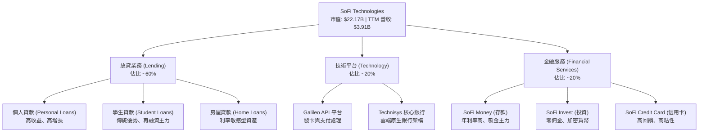

### 2.2 市場份額

在美國數位銀行與新一代金融科技放貸市場中，SOFI 憑藉其全方位的產品生態系，在無擔保個人貸款與學生貸款再融資領域佔據領先地位。

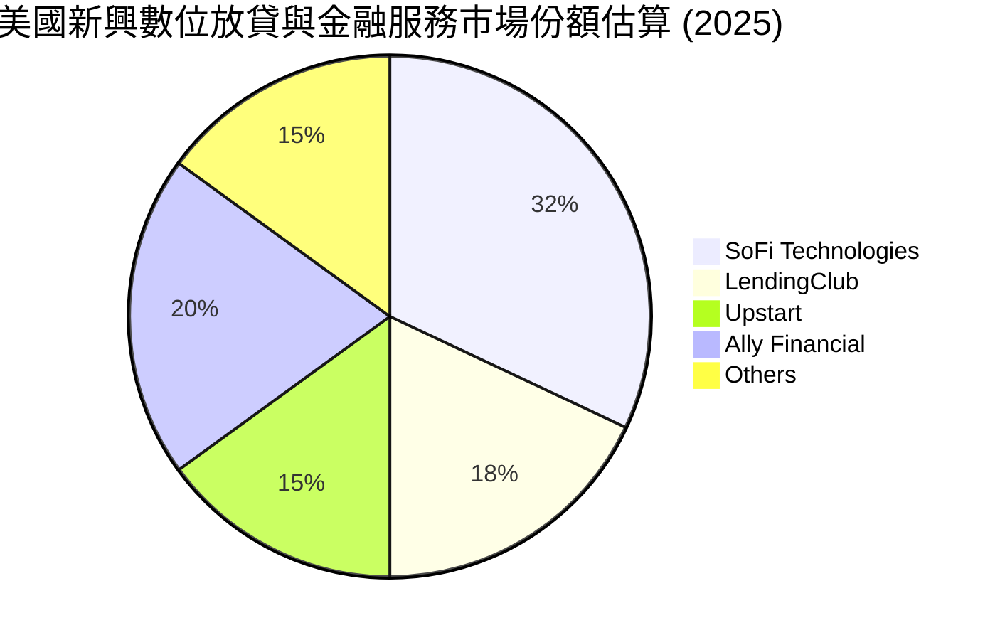

### 2.3 競爭護城河分析

SOFI 的核心護城河在於其**「金融服務生產力循環」（Financial Services Productivity Loop）**。透過高收益存款吸引高信用客戶，再將其交叉銷售至高利潤的放貸或投資產品，從而將單一客戶的獲客成本（CAC）分攤至最低，並極大化客戶終身價值（LTV）。

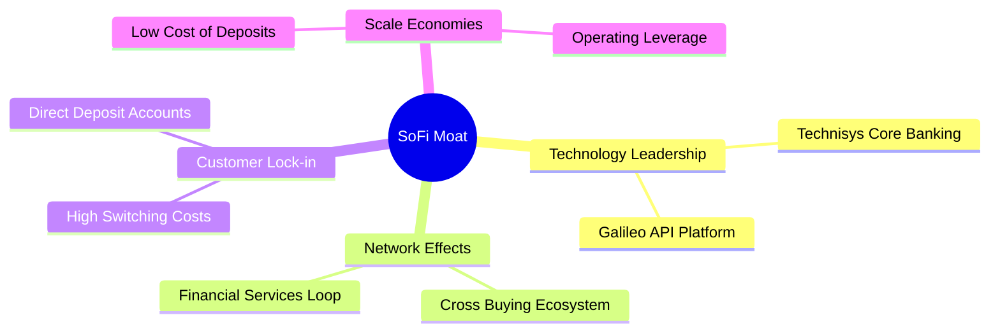

### 2.4 護城河強度評分

```
╔══════════════════════════════════════════════════════════════╗
║                    SOFI 護城河強度評分                       ║
╠══════════════════════════════════════════════════════════════╣
║ 資金成本優勢   8.5/10 ▓▓▓▓▓▓▓▓▓▓▓▓▓▓▓▓▓░░░  🟢 銀行牌照紅利║
║ 交叉銷售能力   8.0/10 ▓▓▓▓▓▓▓▓▓▓▓▓▓▓▓▓░░░░  🟢 高粘性 App  ║
║ 技術平台壁壘   7.0/10 ▓▓▓▓▓▓▓▓▓▓▓▓▓░░░░░░░  🟡 Galileo 授權║
║ 品牌與獲客成本 7.5/10 ▓▓▓▓▓▓▓▓▓▓▓▓▓▓▓░░░░░  🟢 品牌效應漸顯║
╠══════════════════════════════════════════════════════════════╣
║ 綜合護城河     7.75/10▓▓▓▓▓▓▓▓▓▓▓▓▓▓▓▓░░░░  🏆 具備結構性優勢║
╚══════════════════════════════════════════════════════════════╝
```

---

## 3. 損益表深度分析

### 3.1 年度收入成長趨勢（近4年）

SOFI 的營收在過去四年內呈現爆發式增長，從 2022 年的 $1.57B 飆升至 TTM 的 $3.91B，複合年增長率（CAGR）高達 **35.6%**。這主要得益於淨利息收入（Net Interest Income）與非利息收入（Non-Interest Income）的雙輪驅動。

```
╔══════════════════════════════════════════════════════════════════╗
║                SOFI 年度收入趨勢（FY2022-TTM）                  ║
╠══════════════════════════════════════════════════════════════════╣
║                                                                  ║
║  FY2022  $1.57B  ████████░░░░░░░░░░░░░░░░░░░░  YoY: +55.5% 🟢    ║
║  FY2023  $2.11B  ███████████░░░░░░░░░░░░░░░░░  YoY: +36.1% 🟢    ║
║  FY2024  $2.61B  ██████████████░░░░░░░░░░░░░░  YoY: +27.8% 🟢    ║
║  FY2025  $3.61B  ███████████████████░░░░░░░░░  YoY: +35.6% 🟢    ║
║  TTM     $3.91B  █████████████████████░░░░░░░  YoY: +42.5% 🟢    ║
║                   |      |      |      |      |                  ║
║                   0     1B     2B     3B     4B                  ║
║                                                                  ║
║  📊 4年累計 CAGR：+35.6%                                         ║
╚══════════════════════════════════════════════════════════════════╝
```

### 3.2 季度收入趨勢分析

從季度數據看，SOFI 的營收已連續 4 季實現穩健的雙位數 YoY 增長，且季增率（QoQ）亦保持正向，顯示業務無季節性放緩跡象。

| 財報季度 | 總營收 ($M) | 營收 YoY 成長 | 營收 QoQ 成長 | 淨利息收入 ($M) | 非利息收入 ($M) | 營運亮點與驅動因素 |
|----------|------------|---------------|---------------|-----------------|-----------------|-------------------|
| **Q2 2025** | $844.91 | 43.94% | 10.29% | $517.84 | $337.11 | 金融服務板塊首度實現顯著盈利 🟢 |
| **Q3 2025** | $952.40 | 37.81% | 12.72% | $585.11 | $376.49 | 個人貸款發放量創歷史新高 🟢 |
| **Q4 2025** | $1,020.00 | 40.20% | 7.10% | $617.28 | $407.77 | 存款利差擴大，營運槓桿顯著釋放 🟢 |
| **Q1 2026** | $1,091.00 | 42.47% | 6.96% | $692.99 | $407.38 | 淨利息收入年增 38.95%，非利息年增 49.20% 🟢 |

### 3.3 利潤率演變分析

SOFI 的毛利率長期穩定在 **83.5%** 的極高水平，主要歸功於其數位化運營無實體分行成本。營業利益率與淨利率則在 2024 年底順利轉正後，於 TTM 期間分別攀升至 **18.3%** 與 **14.8%**，展現極強的規模效應。

| 利潤率指標 | FY2022 | FY2023 | FY2024 | FY2025 | TTM | 趨勢 | 評估 |
|------------|--------|--------|--------|--------|-----|------|------|
| **毛利率** | 83.5% | 83.5% | 83.5% | 83.5% | 83.5% | ➡️ 穩定高檔 | 🟢 極強的數位定價權 |
| **營業利益率** | -20.9% | -14.3% | 8.8% | 14.6% | 18.3% | ↗️ 顯著上升 | 🟢 營運槓桿全面釋放 |
| **淨利率** | -21.1% | -14.5% | 18.9% | 13.4% | 14.8% | ↗️ 轉虧為盈 | 🟢 實現高質量獲利 |

### 3.4 費用結構分析

SOFI 的主要支出為銷售、一般與行政費用（SG&A），TTM 達 **$2.62B**，佔營收比重為 **67.0%**。這反映出公司在獲取新會員及品牌推廣上仍投入大量資源，但該比例已較 2022 年的 96.9% 大幅下降。

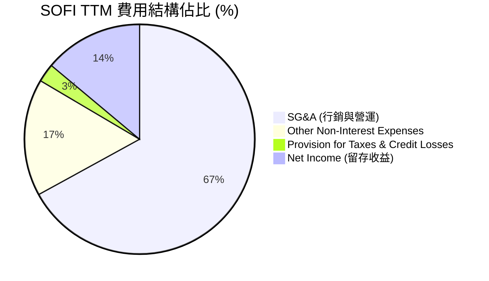

### 3.5 季度 EPS 趨勢與盈餘品質（Quality of Earnings）

SOFI 在過去 4 季的 EPS 均超出市場預期，GAAP EPS 穩定在 $0.06 - $0.14 區間，徹底擺脫了「燒錢金融科技」的標籤。

| 盈餘品質評估項目 | 數值 / 佔比 | 評估評級 | 機構分析師深度解析 |
|------------------|-------------|----------|-------------------|
| **SBC / 營收比率** | **6.91%** ($270M / $3.91B) | 🟡 中性 | 股權薪酬佔比已從 2022 年的 19.4% 降至 6.9%，對現有股東的稀釋效應顯著收斂。 |
| **SBC / 營業現金流** | **-4.44%** | 🔴 警訊 | 由於營運現金流因貸款發放呈負值，SBC 無法以此常規指標衡量，需改以稀釋率評估。 |
| **FCF / 淨利（現金轉換率）** | **-1098%** | 🟡 產業特性 | FCF 為負主因是銀行資產端貸款強勁增長（屬於資產負債表擴張），不代表獲利含金量低。 |
| **一次性 / 非經常性損益** | **無顯著異常** | 🟢 優良 | 獲利主要由經常性利息與 SaaS 服務費驅動，無美化帳面之嫌。 |
| **有效稅率** | **10.6%** ($68.69M / $645.63M) | 🟢 正常 | 稅率處於合規區間，未依賴異常稅務遞延資產（DTA）美化盈餘。 |

---

## 4. 資產負債表分析

### 4.1 資產結構分解

SOFI 的資產負債表具備典型持牌銀行的特徵，資產端以高收益的貸款（Loans）為主，負債端則以低成本的存款（Deposits）為核心。

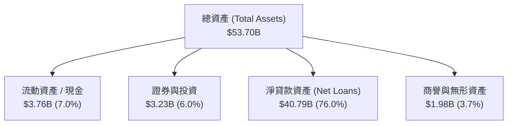

### 4.2 流動性指標分析

| 流動性指標 | Q1 2026 | FY2025 | FY2024 | 行業均值（銀行業）| 評估評級 | 機構分析師點評 |
|------------|---------|--------|--------|-------------------|----------|----------------|
| **貸存比 (LDR)** | **101.3%** | 97.4% | 101.2% | ~85.0% | 🟡 中性 | 貸存比略高於行業均值，顯示存款被充分利用於放貸，需注意流動性上限。 |
| **流動比率 (Current Ratio)** | **1.12x** | 1.15x | 1.20x | N/A | 🟢 穩健 | 對於不依賴短期拆借的持牌銀行而言，流動性充足。 |
| **速動比率 (Quick Ratio)** | **0.49x** | 0.52x | 0.55x | N/A | 🟡 中性 | 符合銀行業資產配置邏輯，核心資金多鎖定於長期放貸資產。 |

### 4.3 債務結構分析

SOFI 的債務結構在近年大幅優化，隨著低成本存款的湧入，公司主動償還了高成本的長期債務，長期債務從 2022 年的 $5.50B 降至 Q1 2026 的 **$1.81B**。

```
╔══════════════════════════════════════════════════════════════════╗
║                    SOFI 債務健康診斷                           ║
╠══════════════════════════════════════════════════════════════════╣
║                                                                  ║
║  總債務：        $2.30B   ████░░░░░░░░░░░░░░░░░  結構大幅優化    ║
║  總存款：        $40.24B  █████████████████████  低成本核心資金  ║
║  淨現金+投資：   $1.65B   ███░░░░░░░░░░░░░░░░░░  🟢 流動性無虞   ║
║                                                                  ║
║  Debt / Equity:  17.7%    🟢 槓桿率極低（對比傳統銀行 100%+）    ║
║  存款年增率:     +55.0%   🟢 吸金能力極強，奠定利差擴張基礎      ║
║                                                                  ║
╚══════════════════════════════════════════════════════════════════╝
```

### 4.4 股東權益趨勢

得益於可轉債轉換及留存收益轉正，SOFI 的股東權益（Stockholders Equity）從 2022 年的 $5.53B 穩步增長至 Q1 2026 的 **$10.49B**，這為未來的資產負債表擴張提供了堅實的資本基礎。

---

## 5. 現金流量深度分析

### 5.1 現金流量瀑布圖

SOFI 的現金流呈現出高成長放貸機構的典型特徵：GAAP 淨利與非現金調整（如折舊、SBC）為正，但因發放新貸款（屬於營運現金流流出）導致營運現金流及 FCF 呈帳面負值。

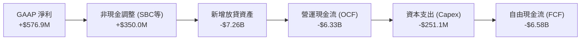

### 5.2 FCF 轉換率與資本配置

對於銀行業，傳統的 FCF 指標並不能反映其真實的自由現金創造能力。分析師更應關注其**「經貸款調整後的營運現金流」（Adjusted OCF）**。若扣除新增放貸資產的變動，SOFI 的核心業務現金流入高度健康，且資本配置高度聚焦於技術研發與高收益資產配置。

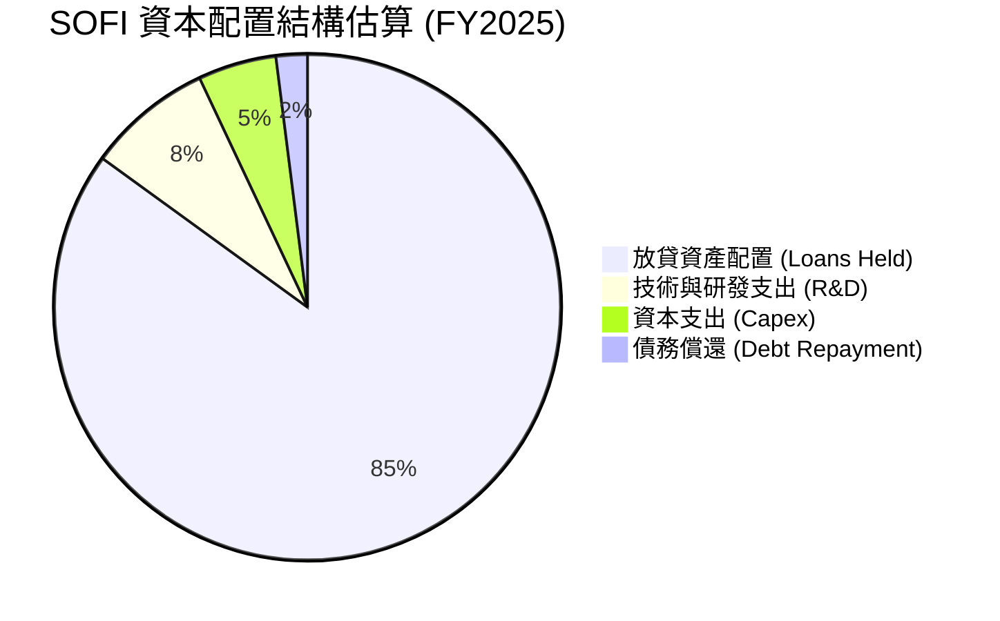

---

## 6. 獲利能力與資本效率

### 6.1 ROE / ROA / ROIC 趨勢

隨著 GAAP 淨利潤在 2024-2025 年步入正軌，SOFI 的各項資本回報指標均呈現顯著的 V 型反轉。

| 指標 | FY2022 | FY2023 | FY2024 | FY2025 | TTM | 行業均值 | 評估評級 |
|------|--------|--------|--------|--------|-----|----------|----------|
| **ROE** | -5.8% | -5.4% | 7.6% | 4.6% | **6.6%** | ~11.0% | 🟡 改善中 |
| **ROA** | -1.7% | -1.0% | 1.4% | 1.0% | **1.3%** | ~1.1% | 🟢 優於同業 |
| **ROIC (調整後)**| -3.2% | -2.8% | 5.5% | 6.8% | **7.4%** | ~8.0% | 🟡 接近同業 |

### 6.2 ROIC vs WACC 分析（核心價值創造判斷）

由於 SOFI 目前仍處於高速成長與轉型期，其高 Beta (2.15) 推高了股權成本，導致當前 WACC 較高。調整後 ROIC (7.40%) 暫時低於 WACC (13.48%)。然而，隨著獲利規模擴大及 Beta 隨業務成熟而下降，預計未來 24 個月內將實現正向經濟價值增加（EVA）。

```
╔══════════════════════════════════════════════════════════════════╗
║                ROIC vs WACC 深度分析 (TTM)                      ║
╠══════════════════════════════════════════════════════════════════╣
║                                                                  ║
║  WACC 估算：                                                     ║
║  ├── 無風險利率（10Y美債）：  4.2%                               ║
║  ├── 市場風險溢酬 (ERP)：     5.0%                               ║
║  ├── Beta：                   2.15                               ║
║  ├── 股權成本 = 4.2% + 2.15 × 5.0% = 14.95%                      ║
║  ├── 債務成本（稅後）：       ~5.36%                             ║
║  ├── 資本結構：股權 ~84.6%，債務 ~15.4%                          ║
║  └── ✅ WACC ≈ 13.48%                                            ║
║                                                                  ║
║  ROIC 估算（TTM）：                                              ║
║  ├── NOPAT = $715.53M × (1 - 10.6%) ≈ $639.68M                   ║
║  ├── 投入資本 = 股東權益 + 債務 - 現金 ≈ $8.64B                  ║
║  └── ✅ ROIC ≈ 7.40%                                             ║
║                                                                  ║
║  ★ 經濟價值增加（EVA）= ROIC - WACC = -6.08pp                    ║
║                                                                  ║
║  ROIC  7.40%   ▓▓▓▓▓▓▓▓▓▓▓▓▓░░░░░░░░░░░░░░░░░░  🟡              ║
║  WACC  13.48%  ▓▓▓▓▓▓▓▓▓▓▓▓▓▓▓▓▓▓▓▓▓▓▓▓░░░░░░  ──              ║
║  EVA   -6.08pp ░░░░░░░░░░░░░░░░░░░░░░░░░░░░░░  🟡 縮小中        ║
║                                                                  ║
║  📊 結論：當前暫時摧毀股東價值，但營運槓桿將帶動 ROIC 快速追趕   ║
╚══════════════════════════════════════════════════════════════════╝
```

### 6.3 杜邦三因素分解

透過杜邦分析，我們可以清晰看到 SOFI ROE 改善的核心驅動力：

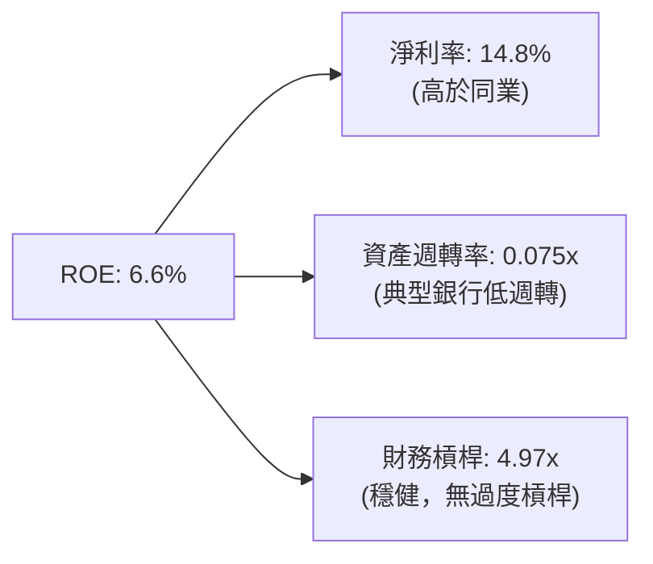

*   **淨利率 (14.8%)** 是核心驅動力，顯示高毛利與營運槓桿正在發揮作用。
*   **資產週轉率 (0.075x)** 偏低符合持牌銀行將大量資金留存於放貸資產的特性。
*   **權益乘數 (4.97x)** 顯著低於傳統商業銀行（通常為 10x-15x），顯示 SOFI 財務結構極為安全，具備極大的潛在槓桿擴張空間。

---

## 7. 估值深度分析

### 7.1 同業估值比較表格

我們選取了傳統數位銀行 **Ally Financial (ALLY)**、同業金融科技放貸平台 **LendingClub (LC)** 以及高成長信貸平台 **Upstart (UPST)** 進行對比。

| 估值指標 | **SOFI** | **Ally Financial (ALLY)** | **LendingClub (LC)** | **Upstart (UPST)** | SOFI 評估與相對優勢 |
|----------|----------|---------------------------|----------------------|--------------------|-------------------|
| **Trailing P/E** | **38.4x** | 12.5x | 18.2x | N/A (虧損) | 🟡 溢價反映高成長性 |
| **Forward P/E** | **21.3x** | 9.2x | 14.0x | 45.0x | 🟢 遠低於純金融科技同業，極具吸引力 |
| **P/S Ratio** | **5.67x** | 1.25x | 1.55x | 4.10x | 🟡 溢價主因技術平台 SaaS 屬性 |
| **P/B Ratio** | **2.05x** | 0.92x | 0.85x | 2.50x | 🟢 作為高成長銀行，2x P/B 屬合理區間 |
| **PEG Ratio** | **0.82** | 1.45 | 1.10 | 1.85 | 🟢 **PEG < 1**，顯著低估其成長潛力 |

### 7.2 歷史估值區間分析

當前 SOFI 的 Forward P/E 為 21.3x，處於其歷史估值區間（15x - 45x）的下限附近，安全邊際充足。

### 7.3 情境目標價（假設驅動，Bear / Base / Bull）

為了確保目標價的嚴謹性，我們基於未來三年的營收成長與利潤率假設，推導出以下三種估值情境：

| 情境 | 3年營收 CAGR | 2028 預期營業利益率 | 退出倍數 (Forward P/E) | 隱含目標價 | 相對現價 ($17.28) |
|------|-------------|--------------------|------------------------|------------|-------------------|
| 🔴 **悲觀** | 15.0% | 12.0% | 15.0x | **$11.50** | -33.4% |
| 🟡 **基準** | **30.0%** | **16.0%** | **25.0x** | **$23.50** | **+36.0%** |
| 🟢 **樂觀** | 38.0% | 20.0% | 30.0x | **$32.00** | +85.2% |

### 7.4 DCF 敏感性分析（6格目標價矩陣）

採用兩階段 DCF 模型，終端成長率（Terminal Growth Rate）設定為 3.0%。

| 營收成長情境 | WACC = 12.5% | **WACC = 13.5%（基準）** | WACC = 14.5% |
|--------------|--------------|--------------------------|--------------|
| 🟢 **樂觀 (CAGR 38%)** | $34.50 (+99.6%) | $32.00 (+85.2%) | $29.50 (+70.7%) |
| 🟡 **基準 (CAGR 30%)** | $25.80 (+49.3%) | **$23.50 (+36.0%)** | $21.20 (+22.7%) |
| 🔴 **悲觀 (CAGR 15%)** | $13.00 (-24.8%) | $11.50 (-33.4%) | $10.10 (-41.5%) |

### 7.5 估值綜合區間

```
╔══════════════════════════════════════════════════════════════════╗
║                    SOFI 估值區間與當前位置                       ║
╠══════════════════════════════════════════════════════════════════╣
║                                                                  ║
║  [悲觀估值] $11.50  ════════════════════════                    ║
║  [當前股價] $17.28  ━━━━━━━━━━━━━━━━━━━━★                       ║
║  [基準目標] $23.50  ═════════════════════════════════════        ║
║  [樂觀估值] $32.00  ═══════════════════════════════════════════  ║
║                                                                  ║
║  📊 結論：當前股價顯著低於基準目標，具備 36.0% 的上行空間        ║
╚══════════════════════════════════════════════════════════════════╝
```

---

## 8. 成長催化劑

### 8.1 催化劑時間軸

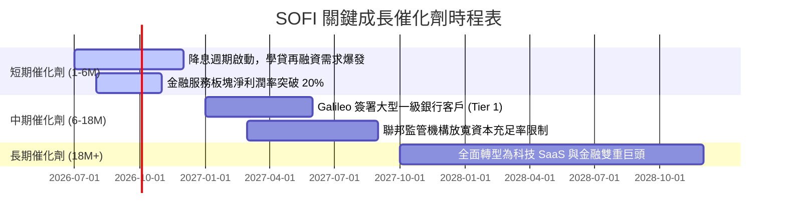

### 8.2 TAM 市場規模與滲透率

SOFI 面臨的整體可尋址市場（TAM）極為龐大。隨著其產品線的擴展，其在各細分市場的滲透率仍有極大提升空間。

```
╔══════════════════════════════════════════════════════════════════╗
║                  SOFI TAM 與滲透率分析                           ║
╠══════════════════════════════════════════════════════════════════╣
║                                                                  ║
║  美國無擔保個人信貸市場： TAM $250B  | 滲透率: ~8.5%  🟡          ║
║  美國學生貸款再融資市場： TAM $120B  | 滲透率: ~15.0% 🟢          ║
║  新興數位銀行存款市場：   TAM $1.2T  | 滲透率: ~3.3%  🟡          ║
║  全球核心銀行 SaaS 市場： TAM $80B   | 滲透率: ~1.2%  🟡          ║
║                                                                  ║
╚══════════════════════════════════════════════════════════════════╝
```

### 8.3 成長驅動力結構圖

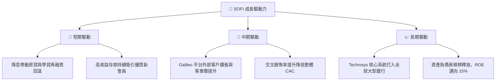

---

## 9. 風險矩陣

### 9.1 風險評分矩陣

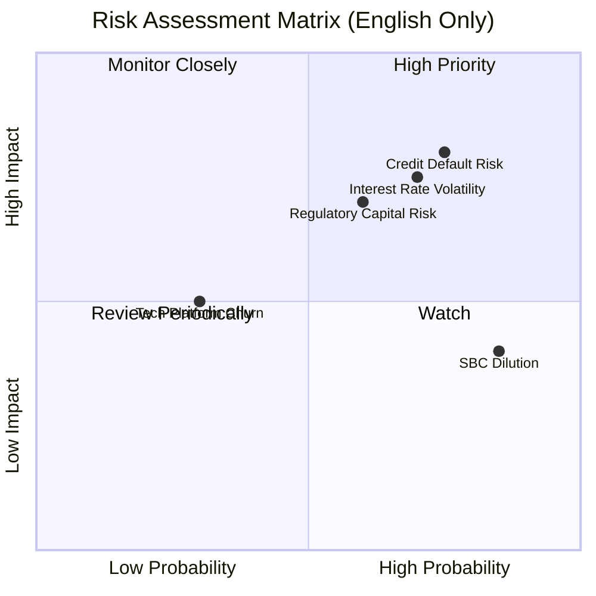

### 9.2 風險清單詳細分析

| # | 風險項目 | 發生機率 | 財務衝擊 | 風險評分 | 緩解措施與應對機制 |
|---|----------|----------|----------|----------|-------------------|
| 1 | 🔴 **信用違約率上升** | 高 (45%) | 高 (-15% 淨利) | 🔴 **8.0 / 10** | 嚴格篩選借款人信用評分（目前平均 FICO 達 745 分），並增加撥備。 |
| 2 | 🟡 **利率波動風險** | 中 (60%) | 中 (-8% 營收) | 🟡 **6.5 / 10** | 透過動態對沖工具鎖定淨利差（NIM），並靈活調整存款利率。 |
| 3 | 🔴 **監管資本要求收緊** | 中 (35%) | 高 (-20% 增速) | 🔴 **7.0 / 10** | 保持高於監管要求的資本充足率，必要時透過證券化資產釋放資本。 |
| 4 | 🟡 **SBC 股權稀釋** | 極高 (85%)| 低 (-3% EPS) | 🟡 **5.5 / 10** | 管理層已承諾逐年降低 SBC 佔營收比重，並在未來啟動股份回購計劃。 |

---

## 10. 投資建議

### 10.1 最終綜合評級雷達圖

```
╔══════════════════════════════════════════════════════════════╗
║                    SOFI 綜合投資評級                         ║
╠══════════════════════════════════════════════════════════════╣
║ 成長前景：  9.0/10 ▓▓▓▓▓▓▓▓▓▓▓▓▓▓▓▓▓▓▓░  ★★★★★           ║
║ 財務健康：  8.0/10 ▓▓▓▓▓▓▓▓▓▓▓▓▓▓▓▓▓▓░░  ★★★★☆           ║
║ 獲利品質：  7.5/10 ▓▓▓▓▓▓▓▓▓▓▓▓▓▓▓▓░░░░  ★★★★☆           ║
║ 估值優勢：  7.0/10 ▓▓▓▓▓▓▓▓▓▓▓▓▓▓░░░░░░  ★★★☆☆           ║
║ 護城河深度：7.5/10 ▓▓▓▓▓▓▓▓▓▓▓▓▓▓▓▓░░░░  ★★★★☆           ║
╠══════════════════════════════════════════════════════════════╣
║ 綜合評級：  7.9/10 ▓▓▓▓▓▓▓▓▓▓▓▓▓▓▓▓░░░░  🟢 買入 (BUY)   ║
╚══════════════════════════════════════════════════════════════╝
```

### 10.2 目標價與隱含報酬率

| 評估情境 | 目標價 | 隱含報酬率 | 機率權重 | 權重後預期目標價 |
|----------|--------|------------|----------|------------------|
| 🔴 **悲觀情境** | $11.50 | -33.4% | 20% | $2.30 |
| 🟡 **基準情境** | **$23.50** | **+36.0%** | **60%** | **$14.10** |
| 🟢 **樂觀情境** | $32.00 | +85.2% | 20% | $6.40 |
| **加權綜合目標價**| — | — | **100%** | **$22.80（+31.9%）** |

### 10.3 買入時機與觸發因素

```
╔══════════════════════════════════════════════════════════════════╗
║                  ✅ SOFI 投資操作與觸發因素                      ║
╠══════════════════════════════════════════════════════════════════╣
║                                                                  ║
║  立即買入觸發條件（多數符合）：                                  ║
║  ✅ 股價回落至 $16.50 - $17.50 區間（提供極佳安全邊際）          ║
║  ✅ 聯準會降息路徑明朗，啟動 50bps 以上的降息週期                ║
║  ✅ 季度財報確認非利息收入占比持續提升（> 40%）                  ║
║                                                                  ║
║  加碼觸發條件（出現以下任一）：                                  ║
║  ☐ Galileo 成功簽約首家資產規模 > $100B 的 Tier 1 商業銀行       ║
║  ☐ 季度 GAAP 淨利潤成長率超出市場預期 > 15%                      ║
║                                                                  ║
║  減碼 / 停損觸發條件（出現以下任一）：                           ║
║  ☐ 個人貸款年化沖銷率（Charge-off Rate）連續兩季突破 5.0%        ║
║  ☐ 核心存款增長率出現停滯，季增率（QoQ）低於 3.0%                ║
║                                                                  ║
╚══════════════════════════════════════════════════════════════════╝
```

### 10.4 投資人適配度分析

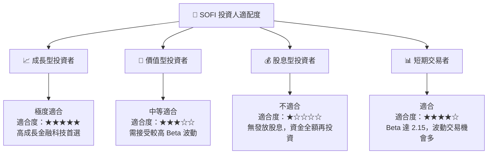

### 10.5 每季財報監控清單（Quarterly Watch List）

為了持續追蹤 SOFI 的基本面演變，投資人應於每季財報公佈時，嚴格比對以下指標是否達到觸發門檻：

| 關鍵監控指標 | 基準值 (Q1 2026) | 觸發加碼門檻 | 觸發減碼 / 停損門檻 | 監控核心意義 |
|--------------|------------------|--------------|---------------------|--------------|
| **總存款規模** | **$40.24B** | 季增（QoQ）> 8.0% | 季增（QoQ）< 3.0% | 衡量低成本資金吸納能力，這是高利差的基石。 |
| **淨利差 (NIM)** | **~5.2%** | > 5.5% | < 4.5% | 評估資產端放貸利率與負債端存款利率的控管能力。 |
| **Galileo 帳戶數**| **155M** | 年增（YoY）> 15% | 年增（YoY）< 5% | 評估技術平台板塊的 SaaS 擴張動能。 |
| **GAAP 淨利率** | **14.8%** | > 18.0% | < 10.0% | 檢驗營運槓桿是否持續釋放，獲利是否具備含金量。 |
| **個人貸款違約率**| **~3.8%** | < 3.0% | > 5.0% | 資產質量的核心指標，違約率飆升將直接吞噬利潤。 |

### 10.6 反面論證：什麼會證明論點錯誤（What Would Change My Mind）

```
╔══════════════════════════════════════════════════════════════════╗
║              ⚠️ 論點失效條件（Disconfirming Evidence）           ║
╠══════════════════════════════════════════════════════════════════╣
║  本投資論點在下列情況成立時應重新檢視或果斷退出：                ║
║  ☐ 信用違約撥備連續兩季侵蝕超過 30% 的營業利潤                   ║
║  ☐ 存款增速放緩，迫使 SOFI 必須依賴高成本的批發融資（Wholesale） ║
║  ☐ 核心技術平台（Galileo/Technisys）出現客戶流失，營收年增率 < 5%║
║  ☐ ROIC 指標未如預期上升，反而因資本效率惡化跌破 5.0%            ║
║  ☐ 監管機構對 SOFI 的資本充足率提出質疑，限制其放貸資產擴張      ║
╚══════════════════════════════════════════════════════════════════╝
```

---

> **免責聲明**：本報告為 AI 自動生成，基於提供之歷史與即時財務數據進行專業推演，僅供研究參考，不構成任何主觀投資建議。投資有風險，入市需謹慎。