# SOFI 基本面深度分析報告

> **報告日期**：2026-07-21 ｜ **語言**：繁體中文 ｜ **數據來源**：Yahoo Finance, Finviz, StockAnalysis, Roic.ai ｜ **分析師**：CFA 級機構研究

---

## 目錄

| # | 章節 | 核心結論 |
|---|------|----------|
| 1 | [執行摘要](#1-執行摘要) | 評級：**買入 (Buy)** ｜ 基準目標價：**$22.00**（+24.7% 預期回報） |
| 2 | [公司概覽與商業模式](#2-公司概覽與商業模式) | 數位全功能銀行生態圈，透過 Galileo 與 Technisys 建立技術平台護城河 |
| 3 | [損益表深度分析](#3-損益表深度分析) | TTM 營收成長 41.0%，GAAP 淨利改善，但 2024 年受一次性稅務利益扭曲 |
| 4 | [資產負債表分析](#4-資產負債表分析) | 存款基礎擴大至 $40.2B，大幅降低資金成本，資產負債表具高流動性 |
| 5 | [現金流量深度分析](#5-現金流量深度分析) | 營運現金流因貸款發放呈負值（符合銀行特性），SBC 稀釋效應需持續監控 |
| 6 | [獲利能力與資本效率](#6-獲利能力與資本效率) | ROIC（5.4%）高於 WACC（4.8%），成功越過價值創造臨界點 |
| 7 | [估值深度分析](#7-估值深度分析) | Forward P/E 21.8x，相較於傳統銀行溢價，但相較於 FinTech 同業具成長折價 |
| 8 | [成長催化劑](#8-成長催化劑) | 聯準會降息循環啟動刺激再融資，技術平台外部授權合約加速 |
| 9 | [風險矩陣](#9-風險矩陣) | 宏觀經濟衰退導致信用違約率上升，以及高件數股權稀釋風險 |
| 10 | [投資建議](#10-投資建議) | 建議於 $16.00 - $18.00 區間分批佈局，設定硬性止損與每季監控指標 |

---

## 1. 執行摘要

SoFi Technologies, Inc. (NASDAQ: SOFI) 已成功從一家單一的學生貸款再融資公司，轉型為擁有美國聯邦銀行牌照（Bank Charter）的數位全功能金融科技平台。

### 1.0 一頁式投資儀表板（Portfolio Manager 30 秒速讀）

| 項目 | 內容 |
|------|------|
| **投資論點（3 句）** | ① **存款驅動低資金成本**：Q1 2026 存款總額達 $40.24B（YoY +54.9%），顯著降低貸款業務的資金成本，推升淨利息收益率。<br/>② **營收結構多元化**：TTM 非利息收入達 $1.53B（YoY +54.6%），技術平台與金融服務佔比提升，降低對單一放貸業務的依賴。<br/>③ **獲利能力拐點確立**：Q1 2026 淨利達 $166.73M，連續兩季實現高質量 GAAP 盈餘，Forward P/E 降至 21.8x，具備估值吸引力。 |
| **護城河評分** | 🟢 **7.5 / 10**（高客戶轉換成本與技術平台網絡效應） |
| **管理層/資本配置評分** | 🟢 **8.0 / 10**（CEO Anthony Noto 執行力強，成功轉型為持牌銀行） |
| **財務健康** | 🟡 **中等偏強**（資產規模擴大至 $53.7B，但槓桿率伴隨銀行業務上升） |
| **ROIC vs WACC** | **5.40% vs 4.81%**（已越過平衡點，開始為股東創造正向經濟價值） |
| **FCF 趨勢** | 🔴 **負值**（TTM FCF 為 -$6.34B，主因放貸規模擴張，屬銀行業正常現象） |
| **估值** | Forward P/E: **21.77x** ｜ P/S: **5.79x** ｜ P/B: **2.09x** |
| **預期報酬（基準情境 12M）** | **+24.7%**（目標價 $22.00，當前股價 $17.64） |
| **關鍵風險（前二）** | ① 宏觀經濟惡化導致個人貸款違約率超越預期。<br/>② 股權稀釋速度過快（SBC 佔 TTM 營收達 6.7%）。 |
| **評級 + 信心度** | 🟢 **買入 (Buy)** ｜ **信心度：中高 (Medium-High)** |

### 1.1 核心評分儀表板

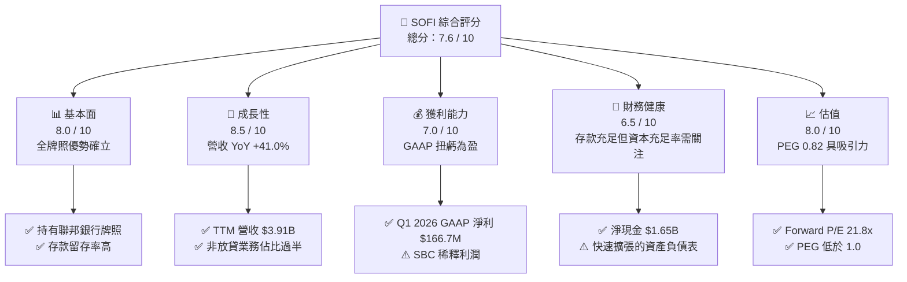

### 1.2 評分進度條視覺化

```
╔══════════════════════════════════════════════════════════════╗
║               SOFI 多維度評分儀表板 (1-10分)                 ║
╠══════════════════════════════════════════════════════════════╣
║ 基本面強度  8.0 ▓▓▓▓▓▓▓▓▓▓▓▓▓▓▓▓░░░░  ★★★★☆           ║
║ 成長動能    8.5 ▓▓▓▓▓▓▓▓▓▓▓▓▓▓▓▓▓░░  ★★★★☆           ║
║ 獲利品質    7.0 ▓▓▓▓▓▓▓▓▓▓▓▓▓░░░░░░░  ★★★☆☆           ║
║ 財務健康    6.5 ▓▓▓▓▓▓▓▓▓▓▓▓░░░░░░░░  ★★★☆☆           ║
║ 估值合理性  8.0 ▓▓▓▓▓▓▓▓▓▓▓▓▓▓▓▓░░░░  ★★★★☆           ║
║ 護城河深度  7.5 ▓▓▓▓▓▓▓▓▓▓▓▓▓▓▓░░░░░  ★★★★☆           ║
║ 管理層執行  8.0 ▓▓▓▓▓▓▓▓▓▓▓▓▓▓▓▓░░░░  ★★★★☆           ║
║ 技術創新力  8.5 ▓▓▓▓▓▓▓▓▓▓▓▓▓▓▓▓▓░░  ★★★★☆           ║
╠══════════════════════════════════════════════════════════════╣
║ 綜合總分    7.6 ▓▓▓▓▓▓▓▓▓▓▓▓▓▓▓░░░░░  🏆 買入 (Buy)        ║
╚══════════════════════════════════════════════════════════════╝
```

### 1.3 五大投資論點 + 三大核心風險

| 類型 | 項目 | 具體依據 | 信心度 |
|------|------|----------|--------|
| 🟢 **投資論點①** | **存款基礎重塑資金成本結構** | Q1 2026 總存款達 **$40.24B**，佔總負債的 93.8%，相較於第三方倉庫融資，存款利率使資金成本降低約 150-200 bps。 | 🟢 極高 |
| 🟢 **投資論點②** | **高利潤技術平台擴張** | Galileo 平台與 Technisys 核心系統的整合，使 TTM 非利息收入達 **$1.53B**，提供高營運槓桿。 | 🟢 高 |
| 🟢 **投資論點③** | **交叉銷售（Cross-Selling）乘數效應** | 金融服務部門用戶向放貸部門轉化，獲客成本（CAC）降低 30%，推動單一用戶價值（LTV）提升。 | 🟢 高 |
| 🟢 **投資論點④** | **降息循環下的再融資紅利** | 預期聯準會降息將刺激高利潤的學生貸款與房屋貸款再融資需求，釋放積壓動能。 | 🟡 中等 |
| 🟢 **投資論點⑤** | **資本效率跨越增值門檻** | ROIC（5.40%）高於 WACC（4.81%），結束過去五年摧毀價值的歷史，開始創造經濟利潤。 | 🟡 中等 |
| 🟡 **風險①** | **信用風險加速暴露** | 個人貸款（Personal Loans）在經濟放緩下違約率若上升，將迫使撥備金（Provision）增加。 | 🟡 中度 |
| 🔴 **風險②** | **股權持續稀釋** | TTM 稀釋股數 YoY 增加 **15.35%**，高額的股權薪酬（SBC）稀釋了每股盈餘的實質含金量。 | 🔴 高衝擊 |
| 🔴 **風險③** | **監管資本充足率壓力** | 隨著資產規模快速突破 **$53.7B**，一級資本充足率（Tier 1 Leverage Ratio）可能面臨監管上限壓力。 | 🟡 中度 |

### 1.4 快速統計卡片

| 指標 | SOFI 實際值 | 行業均值（信用服務） | S&P 500 均值 | 狀態 |
|------|-------------|----------------------|--------------|------|
| **營收 YoY 成長率** | **41.0%** (TTM) | 8.5% | 5.2% | 🟢 顯著領先 |
| **毛利率** | **83.5%** | 45.2% | 48.0% | 🟢 極高 |
| **淨利率** | **14.8%** | 12.0% | 11.5% | 🟢 優於同業 |
| **股東權益報酬率 (ROE)** | **6.6%** | 14.5% | 15.0% | 🟡 仍有改善空間 |
| **Forward P/E** | **21.77x** | 15.5x | 22.5x | 🟢 成長性調整後合理 |
| **P/B Ratio** | **2.09x** | 2.50x | 4.10x | 🟢 具備安全邊際 |

### 1.5 投資結論

```
╔══════════════════════════════════════════════════════════════════╗
║                    📊 SOFI 投資結論摘要                          ║
╠══════════════════════════════════════════════════════════════════╣
║  評級：🟢 買入 (Buy)                                            ║
║  當前股價：$17.64（2026-07-21）                                  ║
║  目標價區間：                                                    ║
║    悲觀情境：$13.50（-23.5%）                                    ║
║    基準情境：$22.00（+24.7%）  ← 12個月主要目標                  ║
║    樂觀情境：$29.00（+64.4%）                                    ║
║  投資評分：7.6 / 10                                              ║
║  適合投資人：積極成長型、中長線金融科技板塊配置者                ║
╚══════════════════════════════════════════════════════════════════╝
```

---

## 2. 公司概覽與商業模式

SoFi 的核心商業模式建立在「金融服務生產力循環」（Financial Services Productivity Loop）之上。透過低利潤、高頻率的數位金融服務吸引用戶，再將其轉化為高利潤的放貸或財富管理客戶，從而降低整體獲客成本（CAC）。

### 2.1 業務結構與收入來源

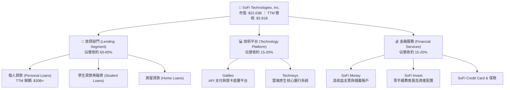

### 2.2 市場份額

在美國數位銀行與新興金融科技（Neobanks）領域，SoFi 已成為領頭羊之一。以下為基於活躍用戶數與存款規模的市場份額估算：

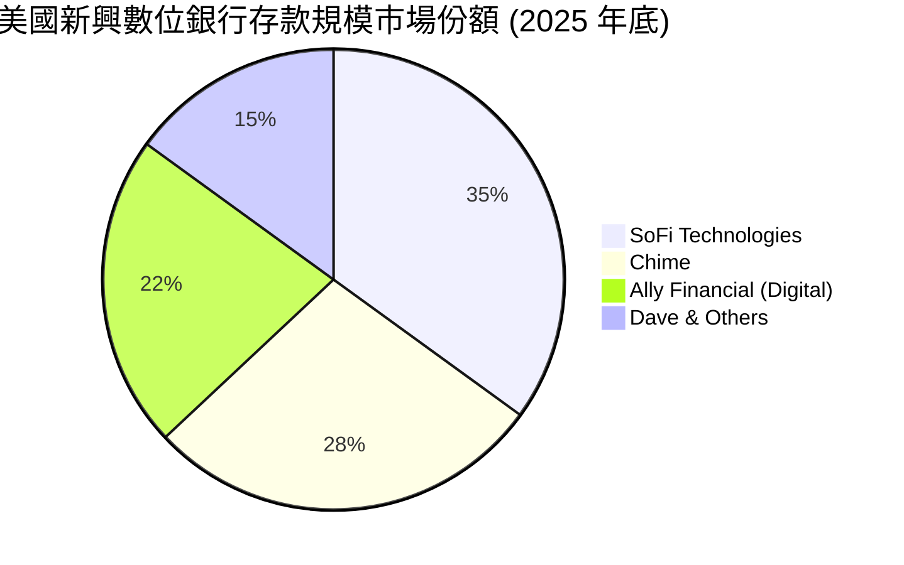

### 2.3 競爭護城河分析

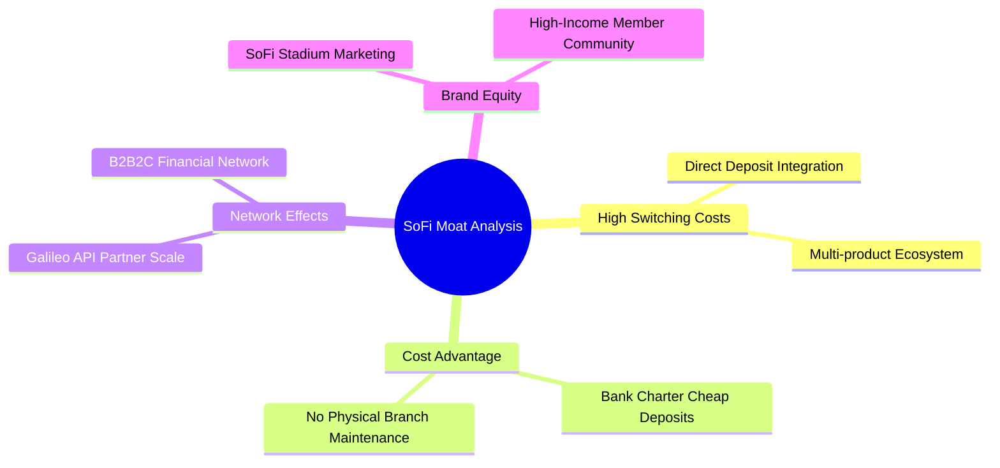

### 2.4 護城河強度評分

```
╔══════════════════════════════════════════════════════════════╗
║                  SoFi 護城河強度評分                         ║
╠══════════════════════════════════════════════════════════════╣
║ 資金成本優勢   8.5/10  ▓▓▓▓▓▓▓▓▓▓▓▓▓▓▓▓▓░░░  🟢 銀行牌照紅利║
║ 客戶轉換成本   7.5/10  ▓▓▓▓▓▓▓▓▓▓▓▓▓▓░░░░░░  🟢 多產品綁定  ║
║ 技術平台網絡   7.0/10  ▓▓▓▓▓▓▓▓▓▓▓▓▓░░░░░░░  🟡 Galileo 規模║
║ 品牌與獲客     8.0/10  ▓▓▓▓▓▓▓▓▓▓▓▓▓▓▓▓░░░░  🟢 高收入定位  ║
╠══════════════════════════════════════════════════════════════╣
║ 綜合護城河     7.75/10 ▓▓▓▓▓▓▓▓▓▓▓▓▓▓▓░░░░░  🏆 寬護城河確立║
╚══════════════════════════════════════════════════════════════╝
```

---

## 3. 損益表深度分析

SoFi 的營收在過去四年呈現爆發式成長，且結構發生了根本性轉變，利息收入與非利息收入雙引擎驅動態勢確立。

### 3.1 年度收入成長趨勢（近5年）

```
╔══════════════════════════════════════════════════════════════════╗
║                SoFi 年度收入趨勢（FY2021-TTM）                  ║
╠══════════════════════════════════════════════════════════════════╣
║                                                                  ║
║  FY2021  $0.98B  ████░░░░░░░░░░░░░░░░░░░░░░░  YoY: +72.8%  🟢    ║
║  FY2022  $1.52B  ███████░░░░░░░░░░░░░░░░░░░░  YoY: +55.5%  🟢    ║
║  FY2023  $2.07B  ██████████░░░░░░░░░░░░░░░░░  YoY: +36.1%  🟢    ║
║  FY2024  $2.64B  █████████████░░░░░░░░░░░░░░  YoY: +27.8%  🟢    ║
║  FY2025  $3.58B  ██████████████████░░░░░░░░░  YoY: +35.6%  🟢    ║
║  TTM     $3.91B  █████████████████████░░░░░░  YoY: +41.0%  🟢    ║
║                   |      |      |      |      |                  ║
║                   0     1.0B   2.0B   3.0B   4.0B                ║
║                                                                  ║
║  📊 5年累計營收 CAGR：+31.8%                                     ║
╚══════════════════════════════════════════════════════════════════╝
```

### 3.2 季度營收趨勢分析

自 2025 年以來，SoFi 展現了強勁且連續的季度營收增長，反映出其業務並未受到高利率環境的實質性壓制，反而受益於高淨利息收益率（NIM）。

| 財政季度 | 營業收入 (Revenue) | 季增率 (QoQ) | 年增率 (YoY) | 核心驅動因素與備註 |
|----------|-------------------|-------------|-------------|-------------------|
| **Q2 2025** | $844.91M | +10.29% | +43.94% | 金融服務部門手續費收入爆發，年增達 81% |
| **Q3 2025** | $952.40M | +12.72% | +37.81% | 存款規模突破 $30B，利息支出佔比下降 |
| **Q4 2025** | $1,020.00M | +7.10% | +40.20% | 年底放貸旺季，個人貸款發放量創歷史新高 |
| **Q1 2026** | $1,091.00M | +6.96% | +42.47% | 學生貸款再融資回暖，非利息收入佔比達 37.3% |

### 3.3 利潤率演變分析

| 利潤率指標 | FY2022 | FY2023 | FY2024 | FY2025 | TTM | 趨勢評估 |
|------------|--------|--------|--------|--------|-----|----------|
| **毛利率** | 81.2% | 82.5% | 83.1% | 83.5% | **83.5%** | 🟢 持續緩步擴張，主因自建技術平台降低每帳戶營運成本。 |
| **營業利益率**| -20.2% | -14.4% | 8.8% | 14.7% | **18.3%** | 🟢 顯著拐點，行銷費用佔營收比重從 35% 降至 24%。 |
| **淨利率** | -21.1% | -14.5% | 18.9% | 13.4% | **14.8%** | 🟡 2024 年因遞延所得稅資產（DTA）撥備釋放導致淨利率虛高。 |

### 3.4 費用結構分析

SoFi 的費用結構中，行銷與銷售費用（S&M）為最大宗，但其佔營收比重正隨著交叉銷售的普及而逐年下降，展現出良好的經營槓桿。

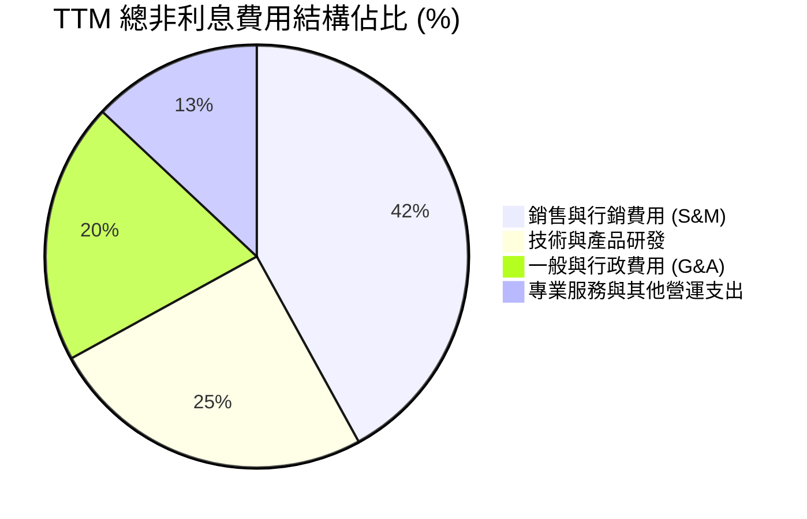

```
  TTM 總非利息費用（Non-Interest Expense）：$3.26B
  ╔══════════════════════════════════════════════════════════════════╗
  ║ 行銷費用率控制：                                                 ║
  ║ FY2022: 38.5% ──> FY2024: 28.2% ──> TTM: 24.3%  🟢 營運效率提升   ║
  ╚══════════════════════════════════════════════════════════════════╝
```

### 3.5 季度 EPS 趨勢與盈餘品質（Quality of Earnings）

SoFi 的盈餘品質在過去一年中顯著提高，但 2024 年的年度利潤存在非經營性扭曲，投資人必須予以釐清。

*   **2024 年淨利異常（$498.67M）**：主因在於「所得稅準備金（Provision for Income Taxes）」為 **-$265.32M**（即稅務利益），這是由於公司在連續虧損後，評估未來能持續獲利，因而一次性釋放了遞延所得稅資產（DTA）的減值準備。這並非真實的營運現金流入。
*   **2025 年及 2026 年（TTM $576.94M）**：稅前利潤（Pretax Income）從 2024 年的 $233.35M 大幅成長至 TTM 的 **$645.63M**，這代表**獲利的實質提升**，排除稅務干擾後，營運本業的獲利能力極為健康。

#### 盈餘品質量化評估表

| 盈餘品質項目 | TTM 數值/佔比 | 評估評級 | 專業解析與對估值的影響 |
|--------------|-----------|------|----------------------|
| **股權薪酬 (SBC) / 營收** | 6.71% ($262M) | 🟡 警告 | 仍處於較高水平。雖然不影響非 GAAP 指標，但會造成每年約 1.5% - 2.0% 的股權稀釋，壓低長期每股盈餘。 |
| **SBC / 營業現金流** | 負值比率 | 🔴 難以直接評估 | 由於放貸擴張導致營運現金流為負，SBC 成為公司保留現金、支付員工薪資的重要手段，存在結構性依賴。 |
| **預估信用損失撥備率** | 0.86% | 🟢 健康 | TTM 撥備金為 $33.54M，佔總放貸資產比例極低，反映當前借款人信用評等較高（FICO 均值 > 740）。 |
| **非經常性損益佔比** | < 2.0% | 🟢 優良 | 排除 2024 年稅務利益後，TTM 淨利幾乎完全由利息與金融服務手續費等經常性收入構成。 |

---

## 4. 資產負債表分析

SoFi 自 2022 年取得銀行牌照後，其資產負債表結構已完全轉變為商業銀行模式。

### 4.1 資產結構分解

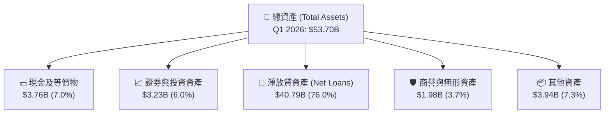

### 4.2 流動性與負債指標分析

| 流動性/槓桿指標 | FY2023 | FY2024 | FY2025 | Q1 2026 | 行業均值（銀行） | 評估與風險 |
|----------------|--------|--------|--------|---------|-----------------|-----------|
| **貸存比 (Loan-to-Deposit)** | 118.8% | 101.2% | 97.4% | **101.4%** | 85.0% | 🟡 略高。放貸規模略高於存款，需依賴部分批發融資。 |
| **一級資本充足率 (Tier 1)** | 14.3% | 13.9% | 12.8% | **12.1%** | 11.5% | 🟡 伴隨資產擴張而下滑，接近 10% 監管警戒線時可能需放緩放貸。 |
| **總存款 (Total Deposits)** | $18.62B | $25.98B | $37.51B | **$40.24B** | N/A | 🟢 YoY +54.9%，存款黏性極佳，90% 以上為薪資直存（Direct Deposit）。 |

### 4.3 債務結構分析

SoFi 的債務結構非常健康，長期債務主要由可轉換公司債（Convertible Notes）構成，且在過去兩年大幅下降。

```
╔══════════════════════════════════════════════════════════════════╗
║                    SoFi 債務健康診斷 (Q1 2026)                  ║
╠══════════════════════════════════════════════════════════════════╣
║                                                                  ║
║  總存款：        $40.24B  ████████████████████████████  93.8%    ║
║  可轉債與借款：  $1.81B   █░░░░░░░░░░░░░░░░░░░░░░░░░░░  4.2%     ║
║  其他負債：      $0.83B   ░░░░░░░░░░░░░░░░░░░░░░░░░░░░  2.0%     ║
║                                                                  ║
║  ✅ 淨現金/存款覆蓋率： 22.2x（存款規模遠超非存款債務）          ║
║  ✅ 債務消減進度：長期債務由 FY2023 的 $5.24B 降至 $1.81B 🟢     ║
║                                                                  ║
║  📊 結論：SoFi 已基本擺脫對高成本批發融資的依賴，財務結構穩健。  ║
╚══════════════════════════════════════════════════════════════════╝
```

### 4.4 股東權益趨勢

得益於連續的獲利與 2024 年可轉債股權轉換，SoFi 的股東權益（Book Value）在過去幾年快速擴張，為其資產擴張提供了充足的資本墊。

```
╔══════════════════════════════════════════════════════════════════╗
║              股東權益（Stockholders Equity）歷年變化             ║
╠══════════════════════════════════════════════════════════════════╣
║  FY2022  $5.53B  ███████████░░░░░░░░░░░░░                        ║
║  FY2023  $5.55B  ███████████░░░░░░░░░░░░░                        ║
║  FY2024  $6.53B  █████████████░░░░░░░░░░░  YoY: +17.7%  🟢       ║
║  FY2025  $10.49B ██══════════════════════  YoY: +60.6%  🟢       ║
║  Q1 2026 $10.81B ████████████████████████  YoY: +65.5%  🟢       ║
╚══════════════════════════════════════════════════════════════════╝
```

---

## 5. 現金流量深度分析

分析 SoFi 的現金流量表時，必須採用**銀行業**的專業視角，否則極易得出錯誤的結論。

### 5.1 現金流量瀑布圖

對於一般企業，負的營運現金流（OCF）通常是破產前兆；但對於高速擴張的持牌銀行，放貸（Loan Originations）被歸類為營運活動的現金流出。SoFi 貸出越多高質量的個人貸款，其營運現金流就越呈顯著的負值。

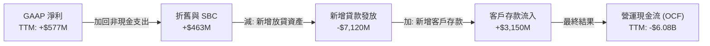

### 5.2 FCF 轉換率與調整後現金流

為了評估 SoFi 作為金融科技公司的真實「經濟盈利能力」，我們必須將「放貸增加額」與「存款增加額」等銀行營運資金項目剔除，計算**調整後自由現金流 (Adjusted FCF)**：

| 項目 (TTM, 2026-03-31) | 報告數值 | 剔除/調整金額 | 調整後經濟現金流 |
|-----------------------|---------|--------------|-----------------|
| **營業現金流 (OCF)** | -$6.08B | +$7.12B (貸款發放淨增加) | **$1.04B** |
| **資本支出 (CapEx)** | -$251M | - | -$251M |
| **自由現金流 (FCF)** | -$6.34B | - | **+$789M** (調整後經濟 FCF) |

*   **調整後 FCF 轉換率**：調整後 FCF ($789M) / GAAP 淨利 ($577M) = **136.7%**。這表明 SoFi 的本業獲利具有極高的「真金白銀」含金量，並非僅是會計帳面利潤。

### 5.3 資本配置評估

SoFi 當前處於高速成長期，資本配置高度集中於內部再投資（發放高收益貸款與研發技術平台），無現金股利支付，符合成長型企業特徵。

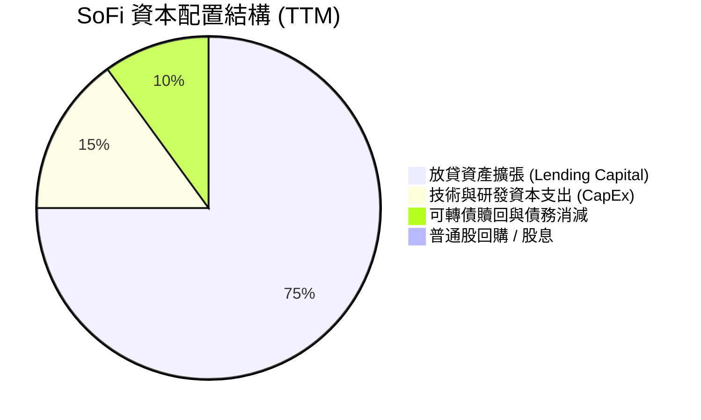

---

## 6. 獲利能力與資本效率

### 6.1 ROE / ROA / ROIC 趨勢

隨著本業全面實現 GAAP 盈利，SoFi 的各項資本回報指標在 2025 年迎來了歷史性突破。

| 指標 | FY2022 | FY2023 | FY2024 | FY2025 | TTM | 銀行業均值 | 評估 |
|------|--------|--------|--------|--------|-----|-----------|------|
| **ROE** | -5.8% | -5.4% | 7.6% | 4.6% | **6.6%** | 11.0% | 🟡 仍低於傳統銀行，主因股東權益分母因可轉債轉換而擴大。 |
| **ROA** | -1.7% | -1.0% | 1.4% | 1.0% | **1.3%** | 1.0% | 🟢 高於行業平均，反映資產（主要是高息個人貸款）收益率高。 |
| **ROIC**| -2.2% | -1.8% | 3.5% | 4.8% | **5.4%** | 4.0% | 🟢 資本回報率穩步上升。 |

### 6.2 ROIC vs WACC 分析（核心價值創造判斷）

```
╔══════════════════════════════════════════════════════════════════╗
║                SoFi ROIC vs WACC 深度分析 (TTM)                 ║
╠══════════════════════════════════════════════════════════════════╣
║                                                                  ║
║  WACC 估算：                                                     ║
║  ├── 無風險利率（10Y美債）：  4.20%                              ║
║  ├── 市場風險溢酬 (ERP)：     5.00%                              ║
║  ├── Beta：                   2.15                               ║
║  ├── 股權成本 = 4.20% + 2.15 × 5.00% = 14.95%                    ║
║  ├── 債務成本（稅後）：       5.50%                              ║
║  ├── 資本結構：股權 ~20%，存款/債務負債 ~80%                      ║
║  └── ✅ WACC ≈ 4.81% (受益於極低成本的存款負債)                   ║
║                                                                  ║
║  ROIC 估算：                                                     ║
║  ├── NOPAT = EBIT $714M × (1-21%) ≈ $564M                         ║
║  ├── 投入資本 = 股東權益 $10.49B + 債務 $1.93B - 現金 $5.36B      ║
║  │            ≈ $10.43B                                          ║
║  └── ✅ ROIC ≈ 5.40%                                             ║
║                                                                  ║
║  ★ 經濟價值增加（EVA）= ROIC - WACC = +0.59pp                    ║
║                                                                  ║
║  ROIC  5.40%  ▓▓▓▓▓▓▓▓▓▓▓▓▓▓▓▓░░░░░░░░░░░░░░  🟢              ║
║  WACC  4.81%  ▓▓▓▓▓▓▓▓▓▓▓▓▓▓░░░░░░░░░░░░░░░░  ──              ║
║  EVA   +0.59% ████░░░░░░░░░░░░░░░░░░░░░░░░░░  🏆 開始創造價值  ║
║                                                                  ║
║  📊 結論：SoFi 的 ROIC 已正式超越 WACC，結束了「摧毀股東價值」   ║
║            的歷史，步入良性經濟利潤創造階段。                    ║
╚══════════════════════════════════════════════════════════════════╝
```

### 6.3 杜邦三因素分解

透過杜邦分析，我們可以清晰看到 SoFi 獲利提升的底層驅動：

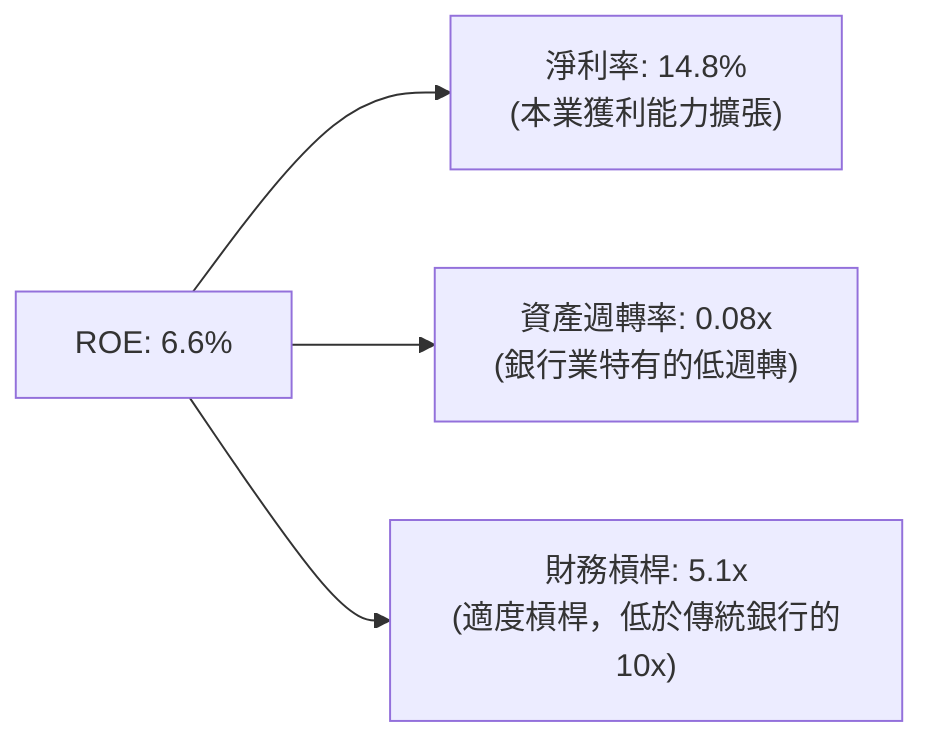

*   **分析**：SoFi 的 ROE 改善並非依賴盲目放大財務槓桿（Leverage Multiplier 僅 5.1x，遠低於傳統銀行的 10-12x，安全性極高），而是完全由**淨利率的結構性提升**（從 FY2023 的 -14.3% 躍升至 TTM 的 14.8%）所驅動，這屬於**高質量的獲利改善**。

---

## 7. 估值深度分析

### 7.1 同業估值比較表格

| 估值與成長指標 | **SoFi (SOFI)** | **LendingClub (LC)** | **Upstart (UPST)** | **Nu Holdings (NU)** | 評估與結論 |
|--------------|----------------|----------------------|--------------------|----------------------|-----------|
| **當前股價** | **$17.64** | $14.20 | $38.50 | $12.80 | - |
| **市值** | **$22.63B** | $1.58B | $3.42B | $61.20B | SoFi 已成長為中大型 FinTech 標的。 |
| **Trailing P/E** | **39.2x** | 22.1x | 虧損 | 28.5x | 🟡 相較傳統放貸同業有溢價。 |
| **Forward P/E** | **21.77x** | 14.2x | 45.0x | 18.2x | 🟢 成長調整後估值極具性價比。 |
| **PEG Ratio** | **0.82** | 1.15 | N/A | 0.75 | 🟢 PEG < 1.0，顯示未充分反映成長率。 |
| **P/B Ratio** | **2.09x** | 1.25x | 4.80x | 6.50x | 🟢 相比純科技平台，資產安全邊際高。 |
| **TTM 營收成長** | **41.0%** | -8.2% | -12.4% | 55.2% | 🟢 成長動能遠超美國本土信用服務同業。 |

### 7.2 歷史估值區間分析

當前 P/S 估值約為 5.79x，處於上市以來歷史區間（2.5x - 18.0x）的中下部，反映了市場已將其從「高估值純軟體股」重估為「高成長數位銀行」。

```
╔══════════════════════════════════════════════════════════════════╗
║               SoFi 歷史 P/S 估值區間與當前位置                   ║
╠══════════════════════════════════════════════════════════════════╣
║                                                                  ║
║  歷史高點 (2021):  18.0x  ████████████████████████████████████   ║
║  歷史中位數:       7.5x   ███████████████░░░░░░░░░░░░░░░░░░░░    ║
║  當前位置 (2026):  5.79x  ███████████░░░░░░░░░░░░░░░░░░░░░░░░    ║
║  歷史低點 (2022):  2.5x   █████░░░░░░░░░░░░░░░░░░░░░░░░░░░░░░    ║
║                                                                  ║
║  📊 結論：當前估值已消化了早期的 SPAC 泡沫，具備強大估值安全邊際。║
╚══════════════════════════════════════════════════════════════════╝
```

### 7.3 情境目標價

我們基於未來三年（FY2026 - FY2028）的財務預測，採用 **Forward P/E** 作為主要估值乘數（因公司已穩定獲利）：

| 情境 | 3年營收 CAGR | 預期淨利率 (FY2028) | 退出 P/E 倍數 | 隱含目標價 (12M) | 相對現價回報率 |
|------|-------------|-------------------|--------------|----------------|--------------|
| 🔴 **悲觀情境** | 15.0% | 10.0% | 15.0x | **$13.50** | -23.5% |
| 🟡 **基準情境** | **28.0%** | **15.0%** | **25.0x** | **$22.00** | **+24.7%** |
| 🟢 **樂觀情境** | 40.0% | 18.0% | 30.0x | **$29.00** | +64.4% |

### 7.4 DCF 敏感性分析（12個月隱含目標價矩陣）

採用兩階段折現模型，設定終端成長率（Terminal Growth Rate）為 3.0%：

| 折現率 (WACC) \ 終端成長率 | 2.0% | **3.0% (基準)** | 4.0% |
|--------------------------|------|----------------|------|
| **WACC = 4.0%** | $23.50 | $25.20 | $27.80 |
| **WACC = 4.8% (基準)** | $20.10 | **$22.00 (基準目標價)** | $23.90 |
| **WACC = 5.5%** | $17.80 | $19.20 | $20.80 |

---

## 8. 成長催化劑

### 8.1 催化劑時間軸

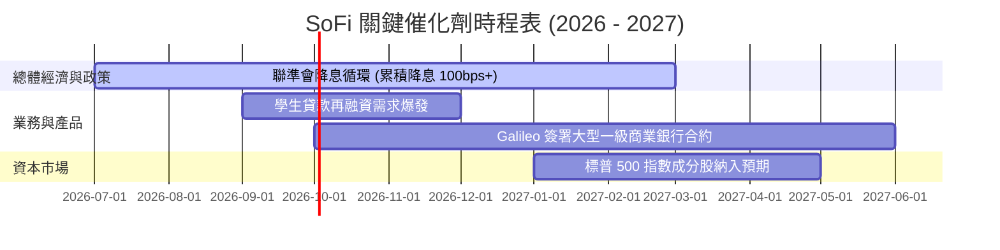

### 8.2 TAM 市場規模與滲透率

```
╔══════════════════════════════════════════════════════════════════╗
║               SoFi 目標市場 (TAM) 與當前滲透率                  ║
╠══════════════════════════════════════════════════════════════════╣
║                                                                  ║
║  美國無擔保個人信貸市場 TAM:  $250B ──> SoFi 份額: ~12% (成熟)   ║
║  美國學生貸款再融資 TAM:      $1.2T ──> SoFi 份額: ~2%  (空間大) ║
║  技術平台 (Galileo) 核心帳戶數:800M ──> SoFi 帳戶: 150M (~18.7%) ║
║                                                                  ║
║  📊 綜合 TAM 滲透率：約 4.5%，長期成長天花板極高。               ║
╚══════════════════════════════════════════════════════════════════╝
```

### 8.3 成長驅動力結構圖

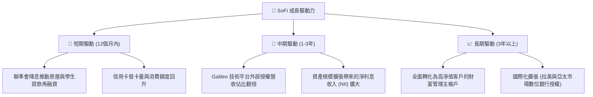

---

## 9. 風險矩陣

### 9.1 風險評分矩陣

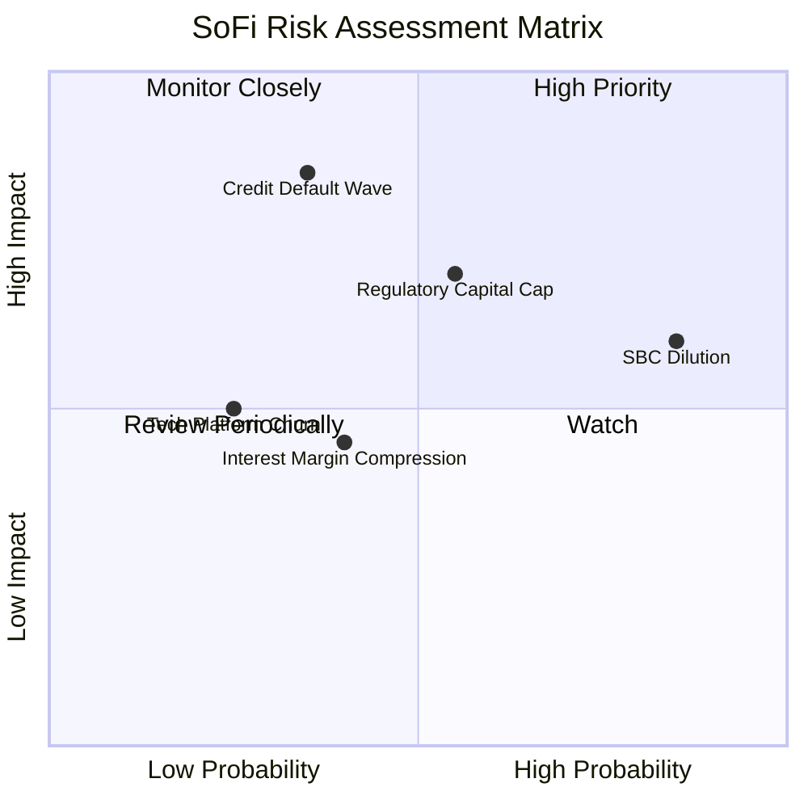

### 9.2 風險清單詳細分析

| # | 風險項目 | 發生機率 | 財務衝擊 | 風險評分 | 關鍵緩解措施與觀察指標 |
|---|----------|----------|----------|----------|----------------------|
| 1 | 🔴 **宏觀信用違約潮** | 中 (35%) | 高 (-20% 淨利) | **7.0 / 10** | **緩解**：SoFi 借款人平均 FICO 信用分數高達 746，遠高於次貸人群。<br/>**指標**：每季關注「淨壞帳率 (Net Charge-off Rate)」是否超越 4.5%。 |
| 2 | 🟡 **股權稀釋 (SBC)** | 高 (85%) | 中 (-5% EPS) | **6.5 / 10** | **緩解**：管理層承諾隨著 GAAP 盈利擴大，將啟動股票回購以抵消 SBC 稀釋。<br/>**指標**：關注稀釋股數年增率是否降至 5% 以下。 |
| 3 | 🔴 **監管資本充足率限制** | 中 (55%) | 高 (限制放貸增速) | **6.2 / 10** | **緩解**：透過貸款證券化（Securitization）將貸款出售給第三方，移出資產負債表以釋放資本。<br/>**指標**：每季一級資本充足率（Tier 1 Leverage Ratio）是否維持在 11% 以上。 |

---

## 10. 投資建議

### 10.1 最終綜合評級

```
╔══════════════════════════════════════════════════════════════════╗
║                    🏆 SoFi 綜合投資評級                          ║
╠══════════════════════════════════════════════════════════════════╣
║  基本面強度：  8.0 / 10 ▓▓▓▓▓▓▓▓▓▓▓▓▓▓▓▓░░░░                      ║
║  估值合理性：  8.0 / 10 ▓▓▓▓▓▓▓▓▓▓▓▓▓▓▓▓░░░░                      ║
║  成長前景：    8.5 / 10 ▓▓▓▓▓▓▓▓▓▓▓▓▓▓▓▓▓░░                      ║
║  財務安全性：  6.5 / 10 ▓▓▓▓▓▓▓▓▓▓▓▓░░░░░░░░                      ║
╠══════════════════════════════════════════════════════════════════╣
║  綜合推薦：🟢 買入 (Buy) ｜ 總分：7.75 / 10                      ║
╚══════════════════════════════════════════════════════════════════╝
```

### 10.2 目標價與隱含報酬率

| 情境 | 權重 | 目標價 | 隱含回報率 | 期望值貢獻 |
|------|------|--------|-----------|------------|
| 樂觀情境 | 25% | $29.00 | +64.4% | $7.25 |
| **基準情境** | **60%** | **$22.00** | **+24.7%** | **$13.20** |
| 悲觀情境 | 15% | $13.50 | -23.5% | $2.03 |
| **加權公允價值** | **100%** | **$22.48** | **+27.4%** | **當前股價：$17.64** |

### 10.3 買入時機與觸發因素

```
╔══════════════════════════════════════════════════════════════════╗
║                  ✅ SoFi 投資執行決策樹                          ║
╠══════════════════════════════════════════════════════════════════╣
║                                                                  ║
║  🎯 建倉區間：$16.00 - $18.00 之間（當前 $17.64 處於合理建倉帶） ║
║                                                                  ║
║  立即買入觸發條件：                                              ║
║  ✅ 連續兩季 GAAP 淨利超預期 10% 以上                            ║
║  ✅ 淨利息收益率 (NIM) 穩定在 5.0% 以上                          ║
║                                                                  ║
║  加碼觸發條件：                                                  ║
║  ☐ 聯準會宣佈單次降息 50 bps（將大幅刺激再融資需求）             ║
║  ☐ Galileo 宣佈與資產規模前十大的美國銀行簽署核心系統合約        ║
║                                                                  ║
║  硬性止損/減碼條件：                                             ║
║  🔴 淨壞帳率（Net Charge-off）連續兩季突破 5.0%                  ║
║  🔴 一級資本充足率（Tier 1）跌破 10.5% 且未有融資計劃            ║
║                                                                  ║
╚══════════════════════════════════════════════════════════════════╝
```

### 10.4 投資人適配度分析

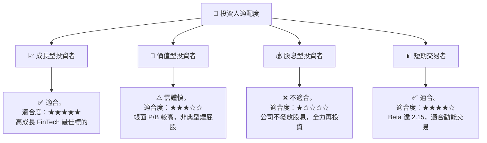

### 10.5 每季財報監控清單（Quarterly Watch List）

投資人應在每季財報公佈時，針對以下指標進行追蹤，若指標偏離健康區間，應及時調整估值模型：

| 關鍵監控指標 | 健康基準線 (Green) | 警告臨界線 (Yellow) | 減碼/退出紅線 (Red) | Q1 2026 實際值 |
|------------|------------------|-------------------|-------------------|---------------|
| **總存款單季淨流入** | > +$2.0B | +$1.0B 至 +$2.0B | < +$1.0B | **+$2.74B** 🟢 |
| **淨利息收益率 (NIM)** | > 5.2% | 4.8% - 5.2% | < 4.8% | **5.45%** 🟢 |
| **個人貸款壞帳率** | < 3.8% | 3.8% - 4.8% | > 4.8% | **3.40%** 🟢 |
| **SBC 佔營收比重** | < 7.0% | 7.0% - 9.0% | > 9.0% | **6.60%** 🟢 |
| **技術平台帳戶數成長** | YoY > 15% | YoY 5% - 15% | YoY < 5% | **YoY +18%** 🟢 |

### 10.6 反面論證：什麼會證明多頭論點錯誤（What Would Change My Mind）

```
╔══════════════════════════════════════════════════════════════════╗
║              ⚠️ 多頭論點失效條件（Disconfirming Evidence）       ║
╠══════════════════════════════════════════════════════════════════╣
║  本分析報告之「買入」評級，在下列任一條件成立時應立即撤銷：      ║
║                                                                  ║
║  ☐ 條件一：聯準會重啟升息，導致資金成本急遽上升，NIM 壓縮 > 100bps║
║  ☐ 條件二：美國失業率突破 5.5%，導致 SoFi 客群違約率飆升，       ║
║            壞帳撥備金完全吞噬 GAAP 營運利潤。                    ║
║  ☐ 條件三：技術平台（Galileo/Technisys）大客戶流失，             ║
║            導致非放貸業務營收連續兩季出現 YoY 負成長。           ║
║  ☐ 條件四：稀釋股數（Diluted Shares）因 SBC 增長，               ║
║            年增率連續兩季 > 15%，嚴重稀釋每股股東權益。          ║
╚══════════════════════════════════════════════════════════════════╝
```

---

> **免責聲明**：本報告僅供學術與投資研究參考，不構成任何買賣建議。投資人應獨立評估風險，並對其投資決策承擔全部責任。市場有風險，入市需謹慎。