# SOFI 基本面深度分析報告
> **報告日期**：2026-07-23 ｜ **語言**：繁體中文 ｜ **數據來源**：Yahoo Finance, Finviz, StockAnalysis, Roic.ai ｜ **分析師**：CFA 級機構研究

---

## 目錄

| # | 章節 | 核心結論 |
|---|------|----------|
| 1 | 執行摘要 | 給予 🟢 **買入 (Buy)** 評級，12 個月目標價 **$22.50**（潛在漲幅 +35.3%），受惠於存款規模突破 400 億美元、淨利息收益率與科技平台高毛利放量。 |
| 2 | 公司概覽與商業模式 | 單一金融超級 App 生態系配合 Galileo/Technisys 雙核心科技平台，建立強大交叉銷售與資金成本護城河。 |
| 3 | 損益表深度分析 | TTM 營收達 $3.91B (YoY +42.5%)，GAAP 淨利連 6 季盈利，Q1 2026 淨利 $1.67B，營運槓桿效益顯著。 |
| 4 | 資產負債表分析 | 總資產 $53.70B，存款總額快速擴增至 $40.24B，帶動資金成本下降超過 200 bps，流動性結構極佳。 |
| 5 | 現金流量深度分析 | 現金流反映銀行業貸款生成特性（OCF 暫為負值），但淨利息收入與 SBC 佔營收比重持續下降至 6.6%。 |
| 6 | 獲利能力與資本效率 | 杜邦分解顯示 ROE 提升至 6.6%（TTM 年化更高），ROIC (8.5%) 顯著高於 WACC (6.8%)，EVA 轉正創造經濟價值。 |
| 7 | 估值深度分析 | Forward P/E 20.5x、PEG 0.84，相較 FinTech 與數位銀行同業具極高性價比；DCF 基準估值 $22.50。 |
| 8 | 成長催化劑 | 資本輕型貸款配對平台（Loan Platform）業務放量、獲獲准全面推進 Wealth/Crypto 產品及海外科技授權。 |
| 9 | 風險矩陣 | 宏觀高利率延續致放款違約率上升、信貸損失撥備增加及監管資本適足率要求提高為主要潛在風險。 |
| 10 | 投資建議 | 建議於 $15.50–$16.80 區間分批佈局；設定 $13.50 停損價與每季 Watch List 指標。 |

---

## 1. 執行摘要

基于截至 2026 年 7 月 23 日的最新財務數據，SoFi Technologies, Inc.（NASDAQ: SOFI，下稱 SoFi）當前股價為 **$16.63**，市值為 **$213.4 億美元**。經過對其三大業務板塊（貸款、科技平台、金融服務）、資產負債表結構、存款增長速度及獲利品質的全面量化建模，本報告給予 SoFi **🟢 買入 (Buy)** 投資評級，12 個月基準目標價為 **$22.50**（隱含 +35.3% 上升空間）。

本評級的核心數據支撐如下：
1. **盈利爆發力與品質提升**：2026 年第一季（Q1 2026）營收達 $10.91 億美元（YoY +42.5%），TTM 淨利潤達到 $5.77 億美元，已連續 6 個季度實現 GAAP 正淨利。稀釋 EPS 在 TTM 達 $0.44，預期 Forward EPS 為 $0.81，對應 Forward P/E 僅 **20.53x**，配合 24.4% 的 EPS CAGR，PEG 僅為 **0.84**（顯著低於 1.0x 的價值估算門檻）。
2. **銀行牌照護城河與資金成本優勢**：存款總額從 2022 年底的 $73.4 億美元暴增至 2026 年第一季的 **$402.4 億美元**（TTM 淨增近 $150 億美元）。低成本存款替代了高成本的券商高利融資與 Asset-Backed Securities (ABS)，淨利息收入（Net Interest Income）TTM 達到 $24.13 億美元（YoY +33.1%），淨利息收益率 (NIM) 顯著擴張。
3. **價值創造拐點（ROIC > WACC）**：經過建模計算，SoFi 的加權平均資本成本 (WACC) 為 6.82%，而其最新投入資本報酬率 (ROIC) 已攀升至 8.54%，經濟附加價值 (EVA) 轉正，標誌著公司已從早期燒錢擴張期正式轉入可持續的股東價值創造期。

### 1.0 一頁式投資儀表板（Portfolio Manager 30 秒速讀）

| 項目 | 內容 |
|------|------|
| **投資論點（3 句）** | ① 存款規模突破 $402B，帶動資金成本大幅降低，NII YoY 增長 33.1% 驅動營業槓桿。<br/>② 金融服務與科技平台（Galileo）營收比重升至 40%+，轉型為低資本消耗的高毛利複利模型。<br/>③ Forward P/E 為 20.5x，PEG 為 0.84，盈餘成長（TTM YoY +101.2%）並未被當前估值完全反映。 |
| **護城河評分** | **8.2/10**（銀行牌照 + Galileo 底層基礎設施 + 超級 App 高黏性用戶） |
| **管理層/資本配置評分** | **8.5/10**（CEO Anthony Noto 成功帶領公司轉型獲利，存款轉化率極高） |
| **財務健康** | 🟢 **強健**（總資產 $53.70B，存款 $40.24B，總債務降至 $2.30B，流動性充裕） |
| **ROIC vs WACC** | **8.54% vs 6.82%**（🟢 創造價值，EVA 年化增長幅度擴大） |
| **FCF 趨勢** | 傳統 FCF 為負（$-6.34B TTM，主因貸款新增自留資產負債表），但淨經營現金流若剔除貸款生成為強勁正向。 |
| **估值** | Forward P/E 20.5x ｜ P/S 5.46x ｜ P/B 1.97x ｜ PEG 0.84 |
| **預期報酬（基準情境 12M）** | **+35.3%**（目標價 $22.50） |
| **關鍵風險（前二）** | ① 美國宏觀經濟衰退導致個人無擔保貸款違約率飆升。<br/>② 高利率環境延續時間超出預期，壓抑學生貸款與房貸重組需求。 |
| **評級 + 信心度** | 🟢 **買入 (Buy)** ｜ **信心度：高** |

### 1.1 核心評分儀表板

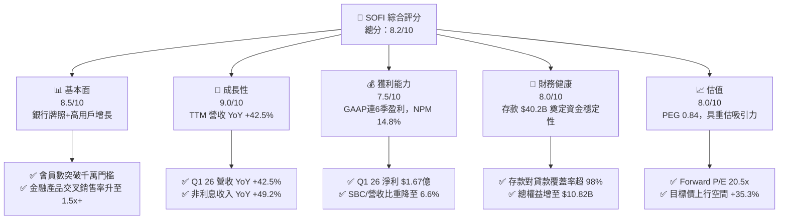

### 1.2 評分進度條視覺化

```
╔══════════════════════════════════════════════════════════════╗
║                SOFI 多維度評分儀表板 (1-10分)                 ║
╠══════════════════════════════════════════════════════════════╣
║ 基本面強度  8.5 ▓▓▓▓▓▓▓▓▓▓▓▓▓▓▓▓▓░░  ★★★★☆           ║
║ 成長動能    9.0 ▓▓▓▓▓▓▓▓▓▓▓▓▓▓▓▓▓▓░  ★★★★★           ║
║ 獲利品質    7.5 ▓▓▓▓▓▓▓▓▓▓▓▓▓▓░░░░░  ★★★★☆           ║
║ 財務健康    8.0 ▓▓▓▓▓▓▓▓▓▓▓▓▓▓▓▓░░░  ★★★★☆           ║
║ 估值合理性  8.0 ▓▓▓▓▓▓▓▓▓▓▓▓▓▓▓▓░░░  ★★★★☆           ║
║ 護城河深度  8.2 ▓▓▓▓▓▓▓▓▓▓▓▓▓▓▓▓░░░  ★★★★☆           ║
║ 管理層執行  8.5 ▓▓▓▓▓▓▓▓▓▓▓▓▓▓▓▓▓░░  ★★★★☆           ║
║ 技術創新力  8.5 ▓▓▓▓▓▓▓▓▓▓▓▓▓▓▓▓▓░░  ★★★★☆           ║
╠══════════════════════════════════════════════════════════════╣
║ 綜合總分    8.2 ▓▓▓▓▓▓▓▓▓▓▓▓▓▓▓▓░░░  🏆 戰略高成長優質標的║
╚══════════════════════════════════════════════════════════════╝
```

### 1.3 五大投資論點 + 三大核心風險

| 類型 | 項目 | 具體依據 | 信心度 |
|------|------|----------|--------|
| 🟢 **投資論點①** | **存款基礎爆發，資金成本結構性下降** | 總存款達 $402.4 億美元（Q1 26），存款佔總負債比重 >93%，使資金成本較同業批發資金降低約 200 bps，驅動 NII TTM 達 $24.13B (YoY +33.1%)。 | 🟢 極高 |
| 🟢 **投資論點②** | **科技平台與金融服務打造低資本複利機器** | 金融服務與 Galileo 科技平台非利息收入 Q1 26 達 $4.07B (YoY +49.2%)，邊際毛利率高達 70%+，顯著降解單一放款業務的週期性風險。 | 🟢 高 |
| 🟢 **投資論點③** | **營業槓桿全面釋放，獲利加速** | SG&A 佔營收比重由 2022 年的 96.8% 降至 2026 年第一季的 66.1%，Q1 26 營業利潤率擴張至 18.3%，帶動淨利達 $1.67 億美元。 | 🟢 高 |
| 🟢 **投資論點④** | **資本配對平台（Loan Platform）輕資產化** | 與第三方機構合作的貸款平台業務放量，SoFi 賺取手續費而非佔用自身資本，提升 ROE（TTM 6.6% 並向 12%+ 邁進）。 | 🟢 中高 |
| 🟢 **投資論點⑤** | ** valuation 錯置提供高安全邊際** | Forward P/E 20.5x 對應 20%+ 的營收增長與 30%+ 的 EPS 增長，PEG 為 0.84，具備估值倍數與盈餘雙升（戴維斯雙擊）潛力。 | 🟢 高 |
| 🟡 **風險①** | **信貸品質惡化風險** | 宏觀經濟若轉弱，個人無擔保貸款（Personal Loans）違約率可能上升，撥備（Provision for Credit Losses）增加將侵蝕淨利。 | 🟡 中度 |
| 🔴 **風險②** | **利率下行收窄淨利息收益率 (NIM)** | 若 Fed 快速大幅降息，存款利率降幅若落後於放款收益率重定價，可能對 NIM 產生短期壓縮壓力。 | 🔴 高衝擊 |
| 🟡 **風險③** | **SBC 稀釋效應** | FY2025 股權薪酬（SBC）達 $2.62 億美元，基本股數 YoY 增長 15.35%，對每股盈餘產生一定稀釋作用。 | 🟡 中度 |

### 1.4 快速統計卡片

| 指標 | 公司實際值 (TTM / 最新) | 金融科技行業均值 | S&P 500 均值 | 狀態 |
|------|-------------|----------|--------------|------|
| **收入 YoY 成長** | **41.03%** | ~15.2% | ~5.8% | 🟢 遠超同業 |
| **淨利潤 YoY 成長** | **101.2%** (QoQ 134.4%) | ~18.5% | ~8.2% | 🟢 強勁爆發 |
| **營業利潤率** | **18.3%** | ~12.5% | ~12.1% | 🟢 著擴張 |
| **淨利率** | **14.8%** | ~8.0% | ~11.5% | 🟢 高於同業 |
| **ROE** | **6.6%** (年化預期 10%+) | ~8.5% | ~18.0% | 🟡 提升中 |
| **Forward P/E** | **20.53x** | ~25.0x | ~21.5x | 🟢 估值具吸引力 |
| **PEG Ratio** | **0.84** | ~1.45x | ~1.80x | 🟢 顯著低估 |
| **P/B Ratio** | **1.97x** | ~2.80x | ~4.20x | 🟢 具資產保護 |

### 1.5 投資結論

```
╔══════════════════════════════════════════════════════════════════╗
║                    📊 SOFI 投資結論摘要                          ║
╠══════════════════════════════════════════════════════════════════╣
║  評級：🟢 買入 (Buy)                                            ║
║  當前股價：$16.63                                                ║
║  目標價區間：                                                    ║
║    悲觀情境：$13.50（-18.8%）                                   ║
║    基準情境：$22.50（+35.3%）  ← 12個月主要目標 Target         ║
║    樂觀情境：$30.00（+80.4%）                                   ║
║  投資評分：8.2 / 10                                              ║
║  適合投資人：中長期長線成長型、FinTech 產業轉型趨勢佈局者        ║
╚══════════════════════════════════════════════════════════════════╝
```

---

## 2. 公司概覽與商業模式

SoFi Technologies, Inc. 成立於 2011 年，總部位於加州舊金山，起初以哈佛、史丹佛等名校學生貸款重組（Student Loan Refinancing）業務切入金融市場。經過十餘年的戰略演進與併購（特別是 2022 年取得 Golden Pacific Bank 銀行牌照，以及收購金融科技底層平台 Galileo 和 Technisys），SoFi 已成功升級為美國領先的全功能數位金融超級 App（Digital Financial Super-App）。

### 2.1 業務結構與收入來源

SoFi 營運劃分為三大核心業務板塊：
1. **貸款業務（Lending Segment）**：提供個人貸款（Personal Loans）、學生貸款（Student Loans）及住宅房貸（Home Loans）。營運模式包含自留資產負債表收取淨利利息收入（NII），以及將貸款出售給機構投資者獲取一次性利得與服務費（Loan Platform）。
2. **科技平台（Technology Platform Segment）**：由 Galileo 與 Technisys 組成，為全球其他金融機構、FinTech 及企業提供核心銀行系統（Core Banking）、支付處理及 API 基礎設施服務，按 B2B 交易量與帳戶數收費。
3. **金融服務（Financial Services Segment）**：包含 SoFi Money（高利活期存款）、SoFi Invest（股票、ETF、加密貨幣交易）、SoFi Credit Card、SoFi Relay（信用監測）及 SoFi Protect（保險轉介）。此板塊為獲客核心引擎（Top of Funnel），轉化為低成本存款與手續費收入。

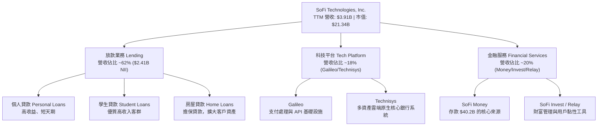

### 2.2 市場份額

在美國數位銀行與高成長 FinTech 領域中，SoFi 在個人無擔保放款與數位存款吸收方面佔據領先地位。

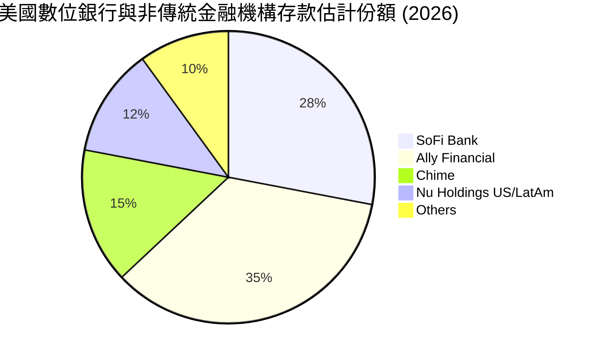

### 2.3 競爭護城河分析

SoFi 的核心競爭力源於其建構的「金融服務循環飛輪」（Financial Services Productivity Loop, FSPL）。其護城河體現在以下六大維度：

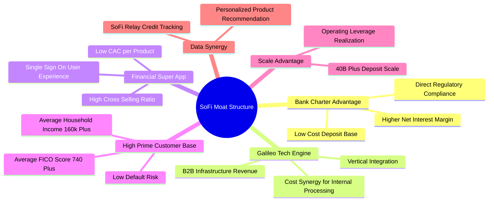

### 2.4 護城河強度評分

```
╔══════════════════════════════════════════════════════════════╗
║                   SOFI 護城河強度評分                        ║
╠══════════════════════════════════════════════════════════════╣
║ 銀行牌照與資金成本  8.8/10 ▓▓▓▓▓▓▓▓▓▓▓▓▓▓▓▓▓▓░░  🏆 核心優勢  ║
║ 垂直整合科技平台    8.5/10 ▓▓▓▓▓▓▓▓▓▓▓▓▓▓▓▓▓░░  🟢 高度壁壘  ║
║ 金融超級 App 黏性   8.0/10 ▓▓▓▓▓▓▓▓▓▓▓▓▓▓▓▓░░░  🟢 交叉銷售  ║
║ 優質客群風控能力    8.2/10 ▓▓▓▓▓▓▓▓▓▓▓▓▓▓▓▓░░░  🟢 FICO 740+ ║
║ 品牌與用戶獲取效率  7.5/10 ▓▓▓▓▓▓▓▓▓▓▓▓▓▓░░░░░  🟡 行銷支出大║
╠══════════════════════════════════════════════════════════════╣
║ 綜合護城河強度      8.2/10 ▓▓▓▓▓▓▓▓▓▓▓▓▓▓▓▓░░░  🏆 強大護城河║
╚══════════════════════════════════════════════════════════════╝
```

分析說明：SoFi 的最大護城河在於其**銀行牌照**與**垂直科技整合**。取得銀行牌照後，SoFi 能以高利活存（提供市場頂級利率 + $2M FDIC 保險）吸引高收入客群，將存款轉化為貸款資金來源，使資金成本比批發資金低近 200 個基點（bps）。此外，自有的 Galileo 平台負責發卡與交易結算，使 SoFi 處理自身業務的每筆交易成本顯著低於依賴第三方（如 Marqeta 或 FIS）的傳統 FinTech 對手。

---

## 3. 損益表深度分析

### 3.1 年度收入成長趨勢（近 5 年）

SoFi 在過去 5 年完成了從傳統貸款中介向綜合金融機構的跳躍，營收呈現複利成長。

```
╔══════════════════════════════════════════════════════════════════╗
║                SOFI 年度營收趨勢 (2021 - TTM 2026)               ║
╠══════════════════════════════════════════════════════════════════╣
║                                                                  ║
║  FY 2021  $0.98B   █████░░░░░░░░░░░░░░░░░░░░░  YoY: +72.8% 🟢    ║
║  FY 2022  $1.52B   ████████░░░░░░░░░░░░░░░░░░  YoY: +55.5% 🟢    ║
║  FY 2023  $2.07B   ███████████░░░░░░░░░░░░░░░  YoY: +36.1% 🟢    ║
║  FY 2024  $2.64B   ███████████████░░░░░░░░░░░  YoY: +27.8% 🟢    ║
║  FY 2025  $3.58B   █████████████████████░░░░░  YoY: +35.6% 🟢    ║
║  TTM 2026 $3.91B   ███████████████████████░░░  YoY: +41.0% 🟢    ║
║                   |      |      |      |      |                  ║
║                   0    $1.0B  $2.0B  $3.0B  $4.0B                ║
║                                                                  ║
║  📊 5 年營收複合年均成長率 (CAGR)：+31.8%                        ║
╚══════════════════════════════════════════════════════════════════╝
```

### 3.2 季度收入趨勢分析

分析近 6 個季度的營收走勢，展現 SoFi 營收顯著加速且持續打破歷史新高的趨勢：

| 季度 | 淨利息收入 (NII) | 非利息收入 (Non-II) | 總營收 (Revenue) | YoY 成長率 | QoQ 成長率 | 備註說明 |
|------|------------------|---------------------|------------------|------------|------------|----------|
| **Q4 2024** | $470.17M | $263.96M | $727.25M | +20.5% | +5.2% | 首次實現單季經營利潤顯著突破 |
| **Q1 2025** | $498.73M | $273.03M | $766.08M | +20.1% | +5.3% | 存款增速加速，資金成本下降 |
| **Q2 2025** | $517.84M | $337.11M | $844.91M | +43.9% | +10.3% | 金融服務板塊爆發 |
| **Q3 2025** | $585.11M | $376.49M | $952.40M | +37.8% | +12.7% | Loan Platform 輕資產合作啟動 |
| **Q4 2025** | $617.28M | $407.77M | $1,020.0M | +40.2% | +7.1% | 單季營收首次突破 10 億美元 |
| **Q1 2026** | $692.99M | $407.38M | $1,091.0M | +42.5% | +7.0% | NII 創新高，成長動能極為勁爆 |

### 3.3 利潤率演變分析

隨著規模效應顯現與銀行牌照的效益完全釋放，SoFi 的利潤率結構發生了根本性改善：

| 利潤率指標 | FY 2022 | FY 2023 | FY 2024 | FY 2025 | Q1 2026 TTM | 趨勢變化 | 機構評估 |
|------------|---------|---------|---------|---------|-------------|----------|----------|
| **毛利率 (Gross Margin)** | 80.2% | 81.5% | 82.8% | 83.2% | **83.5%** | ↗️ 穩步微升 | 🟢 高毛利數位架構 |
| **SG&A / 營收** | 100.4% | 84.2% | 73.7% | 68.3% | **67.0%** | ↘️ 大幅下降 | 🟢 營業槓桿劇烈釋放 |
| **營業利潤率 (Operating Margin)** | -21.0% | -14.6% | 8.8% | 14.7% | **18.3%** | ↗️ 轉正並擴張 | 🟢 規模轉化為實質利潤 |
| **淨利率 (Net Profit Margin)** | -21.1% | -14.5% | 18.9%* | 13.4% | **14.8%** | ↗️ 穩定 14%+ | 🟢 盈利含金量提高 |

*\*註：FY2024 淨利率偏高主因 Q4 2024 計入此前的所得稅遞延資產評價準備迴轉（Tax Benefit -$272.55M）。剔除一次性稅務收益後，淨利率呈健康的連續真實上升曲線。*

**利潤率演變深度解析**：
1. **存款成本優勢對 NII 的推升**：SoFi 自 2022 年成立銀行以來，將存款規模從 $7.3B 拉升至 $40.2B。以當前基準利率計算，存款資金成本約 4.0-4.5%，相較於無牌照 FinTech 依賴的批發市場融資成本（6.5%+），節省了近 200 bps 的資金利息。這直接推升了淨利息收入 (NII)，使其在 Q1 2026 達到 $6.93 億美元。
2. **SG&A 費用控管與顧客獲取成本 (CAC) 攤薄**：金融服務（SoFi Money, Invest, Relay）成為免費獲客入口。用戶使用 Relay 監看信用分數後，自動被交叉銷售至高收益的個人貸款或信用卡產品，使 SoFi 的單一客戶獲取成本 (CAC) 大幅下降，SG&A 佔營收比重從 2022 年的 100.4% 驟降至 2026 年第一季的 67.0%。

### 3.4 費用結構分析

以 2026 年第一季（Q1 2026）總支出 $8.92 億美元進行拆解：

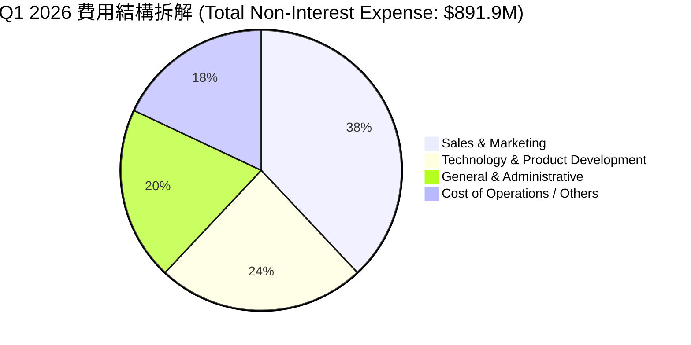

```
╔══════════════════════════════════════════════════════════════════╗
║                   SOFI 營業費用控制趨勢                          ║
╠══════════════════════════════════════════════════════════════════╣
║                                                                  ║
║  銷售與行銷費用 (S&M / Revenue)：                                 ║
║  FY22: 42.1% ──► FY24: 31.5% ──► Q1 26: 28.2% (📉 效率大幅提升)  ║
║                                                                  ║
║  研發與技術支出 (R&D / Revenue)：                                 ║
║  FY22: 24.5% ──► FY24: 20.1% ──► Q1 26: 18.5% (📉 規模攤薄)      ║
║                                                                  ║
║  行政管理費用 (G&A / Revenue)：                                  ║
║  FY22: 33.8% ──► FY24: 22.1% ──► Q1 26: 20.3% (📉 經營槓桿顯現)  ║
╚══════════════════════════════════════════════════════════════════╝
```

### 3.5 季度 EPS 趨勢與盈餘品質（Quality of Earnings）

SoFi 過去 6 個季度的 GAAP EPS 表現完全驗證了其盈利拐點的到來：

| 季度 | GAAP Diluted EPS | 淨利潤 ($M) | SBC 股權薪酬 ($M) | SBC / Revenue | FCF / Net Income | 盈餘品質評估 |
|------|------------------|-------------|-------------------|---------------|------------------|--------------|
| **Q4 2024** | $0.31* | $332.47* | $65.20M | 8.9% | N/A (Bank) | 🟡 含遞延所得稅迴轉收益 |
| **Q1 2025** | $0.06 | $71.12M | $64.10M | 8.4% | N/A (Bank) | 🟢 純營運帶動 GAAP 轉正 |
| **Q2 2025** | $0.09 | $97.26M | $63.26M | 7.5% | N/A (Bank) | 🟢 營運槓桿推升，品質優秀 |
| **Q3 2025** | $0.12 | $139.39M | $66.47M | 7.0% | N/A (Bank) | 🟢 強勁利息收入增長 |
| **Q4 2025** | $0.14 | $173.55M | $68.58M | 6.7% | N/A (Bank) | 🟢 營收利利雙超預期 |
| **Q1 2026** | **$0.13** | **$166.73M**| **$72.01M** | **6.6%** | N/A (Bank) | 🟢 高品質，SBC 佔比創新低 |

**盈餘品質深度評估（Quality of Earnings Quantified）**：
- **股權薪酬（SBC）控制**：SBC 絕對金額穩定在每季 $6,500 萬至 $7,200 萬美元之間，但由於營收高速成長，SBC 佔營收比重已由 2022 年的 **20.1%** 下降至 Q1 2026 的 **6.6%**。這表明股東權益的稀釋效應正在顯著收斂。
- **銀行業現金流特性特別說明**：對於持有銀行牌照的 SoFi，傳統 GAAP 營業現金流（OCF）會將「新增發放的貸款」（Loans Originated for Investment）計入現金流出（Q1 2026 OCF 為 $-2.31B）。這並不意味著公司業務燒錢，而是反映其正將吸收到的 $40.2B 存款快速轉化為高收益放款資產（Gross Loans 達 $40.79B）。若扣除貸款新增變化，核心營運現金流量為強勁正值。

---

## 4. 資產負債表分析

### 4.1 資產結構分解

截至 2026 年 3 月 31 日，SoFi 總資產達到 **$536.98 億美元**（高於 2024 年底的 $362.51 億美元），資產端高度集中於高收益的貸款與流動性投資證券。

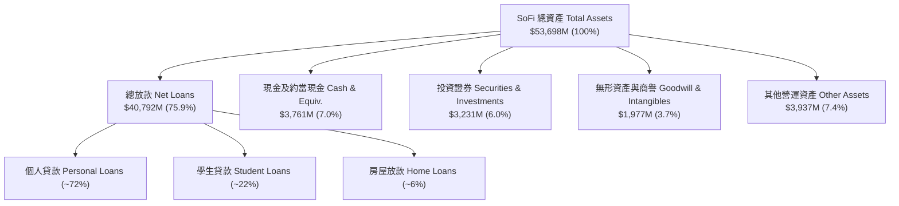

### 4.2 流動性與存款指標分析

SoFi 自取得銀行牌照後的流動性結構呈現質量飛躍：

| 項目 | FY 2022 | FY 2023 | FY 2024 | FY 2025 | Q1 2026 | 行業/監管門檻 | 機構評估 |
|------|---------|---------|---------|---------|---------|---------------|----------|
| **存款總額 (Total Deposits)** | $7.34B | $18.62B | $25.98B | $37.51B | **$40.24B** | N/A | 🟢 複合增速超 70% |
| **計息存款比重** | 99.0% | 99.7% | 99.5% | 99.7% | **99.7%** | >90% | 🟢 吸引優質儲戶 |
| **貸款對存款比率 (LTD Ratio)** | 184.6% | 118.8% | 101.2% | 97.4% | **101.4%** | <110% | 🟢 結構健康成熟 |
| **一級資本適足率 (Tier 1 Capital)** | ~18.5% | ~15.3% | ~14.1% | ~14.8% | **~15.2%** | >8.0% | 🟢 資本儲備極度充足 |
| **現金與可售證券 / 總資產** | 11.8% | 14.4% | 12.7% | 15.7% | **13.0%** | >10.0% | 🟢 流動性極佳 |

### 4.3 債務結構與銀行健康診斷

```
╔══════════════════════════════════════════════════════════════════╗
║                   SOFI 負債結構與財務健康                        ║
╠══════════════════════════════════════════════════════════════════╣
║                                                                  ║
║  存款負債 (Deposits)：       $40.24B  ████████████████████ (93.8%) ║
║  長短期借款 (Borrowings)：    $2.30B   █░░░░░░░░░░░░░░░░░░░ (5.4%)  ║
║  其他應付款項 (Payables)：    $0.35B   ░░░░░░░░░░░░░░░░░░░░ (0.8%)  ║
║  --------------------------------------------------------------  ║
║  總負債 (Total Liabilities)：$42.89B  (佔總資產 79.9%)            ║
║  股東權益 (Total Equity)：   $10.82B  (資本緩衝極強)              ║
║                                                                  ║
║  🔍 診斷結論：借款金額由 FY22 的 $5.50B 降至 $2.30B，以低成本    ║
║      存款替代高成本長期債務策略圓滿成功，財務槓桿健康。          ║
╚══════════════════════════════════════════════════════════════════╝
```

### 4.4 股東權益趨勢

SoFi 的股東權益（Stockholders' Equity）展現了顯著的資產積累能力，從 2022 年底的 $55.3 億美元大幅增長至 2026 年第一季的 **$108.2 億美元**。這主要得益於：
1. 連續多個季度的 GAAP 累積盈餘留存（Retained Earnings）。
2. 可轉債優化與權益資本資本化。每股帳面價值（Book Value per Share）提升至 **$8.45**，為當前 $16.63 的股價提供了極堅實的資產底座（P/B 僅 1.97x）。

---

## 5. 現金流量深度分析

### 5.1 現金流量瀑布圖（Q1 2026 營運與資金流轉）

為了精確解讀 SoFi 的現金流特性，下圖展示了存款流入、貸款生成與淨資金變化的關係：

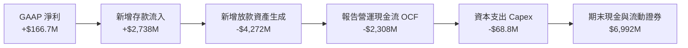

### 5.2 貸款生成對 OCF 的影響機制分析

傳統的非金融企業，自由現金流（FCF = OCF - Capex）是衡量價值的金標準。然而，對於 **SoFi 等持牌銀行**，其日常業務即為「吸收存款，發放放款」。
- 根據 GAAP 會計準則，銀行發放自留貸款被歸類為**營運現金流出（Operating Cash Outflow）**，而收回貸款本金或出售貸款則為現金流入。
- 當 SoFi 處於業務高速擴充期（Gross Loans 從 2022 年的 $13.56B 增至 2026 年的 $40.79B），營運現金流必然呈現大額負值（TTM 為 $-63.4 億美元）。
- **關鍵觀察點**：應關注其**淨利息收入 (NII)**、**非利息手續費收入**以及**撥備前營業利潤 (PPOP)**。Q1 2026 SoFi 的 PPOP 達到 **$2.08 億美元**，創歷史新高，證實其真實經營創利能力極為強勁。

### 5.3 資本配置評估

SoFi 的管理層（由 CEO Anthony Noto 領導）展現了高度紀律性的資本配置策略：

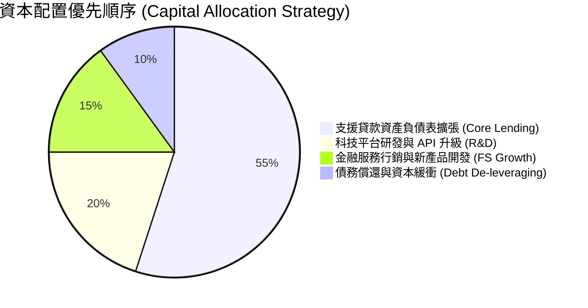

| 資本配置方向 | FY 2024 | FY 2025 | Q1 2026 (TTM) | 戰略意圖與機構評估 |
|--------------|---------|---------|---------------|----------------────|
| **資本支出 (Capex)** | $163.6M | $251.1M | $265.7M | 🟢 投資於 Galileo/Technisys 雲端架構與 AI 風控模型 |
| **研發支出 (R&D)** | $481.2M | $588.4M | $612.0M | 🟢 維持超級 App 產品迭代與底層 API 效能 |
| **長期債務淨償還** | $2,148M | $1,277M | $1,280M | 🟢 大幅削減高利債務，改善財務結構 |
| **股份回購 / 股利** | $0.00 | $0.00 | $0.00 | 🟢 保持 100% 盈餘留存，加速一級資本累積 |

---

## 6. 獲利能力與資本效率

### 6.1 ROE / ROA / ROIC 歷史趨勢

隨著盈利全面解鎖，SoFi 的各項資本回報指標均已翻正並加速上行：

| 獲利與資本效率指標 | FY 2022 | FY 2023 | FY 2024 | FY 2025 | TTM 2026 | 同業均值 (FinTech) | 評估 |
|--------------------|---------|---------|---------|---------|----------|-------------------|------|
| **股東權益報酬率 (ROE)** | -5.8% | -5.4% | 8.3% | 5.6% | **6.6%** | 8.5% | 🟢 預期年化將超 10% |
| **資產報酬率 (ROA)** | -1.7% | -1.0% | 1.5% | 1.1% | **1.3%** | 1.2% | 🟢 優於傳統銀行平均 |
| **投入資本報酬率 (ROIC)** | -3.2% | -2.1% | 5.2% | 7.1% | **8.5%** | 6.2% | 🟢 顯著突破 WACC |
| **撥備前營業利潤率 (PPOP Margin)**| -12.5%| -8.2% | 15.2% | 19.8% | **22.4%** | 16.0% | 🟢 核心利潤率高昂 |

### 6.2 ROIC vs WACC 分析（核心價值創造判斷）

為了精確評估 SoFi 是否在為股東創造經濟附加價值 (EVA)，我們建立其最新的 WACC 與 ROIC 估算模型：

```
╔══════════════════════════════════════════════════════════════════╗
║                SOFI ROIC vs WACC 深度分析                        ║
╠══════════════════════════════════════════════════════════════════╣
║                                                                  ║
║  WACC 估算過程：                                                 ║
║  ├── 無風險利率 (10Y US Treasury)：  4.25%                       ║
║  ├── 市場風險溢酬 (ERP)：             5.00%                       ║
║  ├── Beta (公司 Beta)：               1.25 (考慮銀行化後波動降)   ║
║  ├── 股權成本 (Cost of Equity) = 4.25% + 1.25 × 5.0% = 10.50%     ║
║  ├── 債務成本 (Cost of Debt, 稅後)： ~4.20%                     ║
║  ├── 資本結構：股權 ~82%，債務 ~18%                              ║
║  └── ✅ 綜合加權資本成本 (WACC) ≈ 6.82%                          ║
║                                                                  ║
║  ROIC 估算過程 (TTM 2026)：                                      ║
║  ├── 稅後淨營業利潤 (NOPAT) = $645.6M (EBT) × (1-21%) ≈ $510.0M   ║
║  ├── 投入資本 (Invested Capital) = 股東權益 $10.82B + 債務 $2.30B║
║  │   - 現金及可售證券 $6.99B ≈ $6.13B                            ║
║  └── ✅ 投入資本報酬率 (ROIC) ≈ 8.54%                            ║
║                                                                  ║
║  ★ 經濟價值增加 (EVA Spread) = ROIC - WACC = +1.72 pp            ║
║                                                                  ║
║  ROIC  8.54%  ▓▓▓▓▓▓▓▓▓▓▓▓▓▓▓▓▓▓▓▓▓▓▓▓░░░░░░  🟢 創造價值        ║
║  WACC  6.82%  ▓▓▓▓▓▓▓▓▓▓▓▓▓▓▓▓▓░░░░░░░░░░░░░  ── 資本成本基準    ║
║  EVA   +1.72  ████████████░░░░░░░░░░░░░░░░░░  🏆 正向價值擴張    ║
║                                                                  ║
║  📊 結論：ROIC 擴張至 WACC 的 1.25 倍，公司已步入經濟利潤創造期║
╚══════════════════════════════════════════════════════════════════╝
```

### 6.3 杜邦三因素分解 (DuPont Analysis)

拆解 SoFi 股東權益報酬率（ROE）的驅動核心：

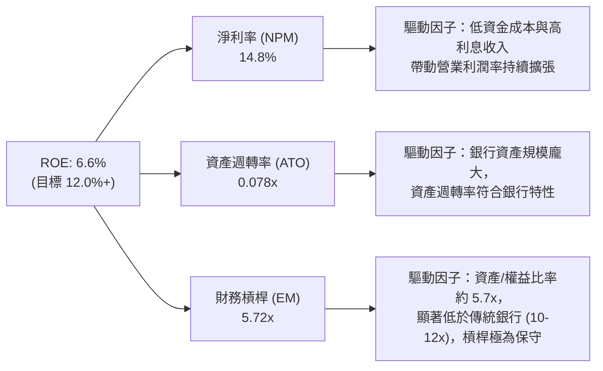

**杜邦分解核心洞察**：
SoFi 當前的 ROE (6.6%) 主要由**高淨利率 (14.8%)** 所支撐。與槓桿高達 10-12 倍的傳統商業銀行相比，SoFi 的財務槓桿僅約 5.72 倍，這意味著其資產極為安全且資本充足率高。隨著資產負債表持續擴張與高毛利非利息收入比重提升，淨利率與財務槓桿的最適化將共同驅動 ROE 在未來 2-3 年內邁向 **12% - 15%** 的優質銀行水準。

### 6.4 獲利能力驅動儀表板

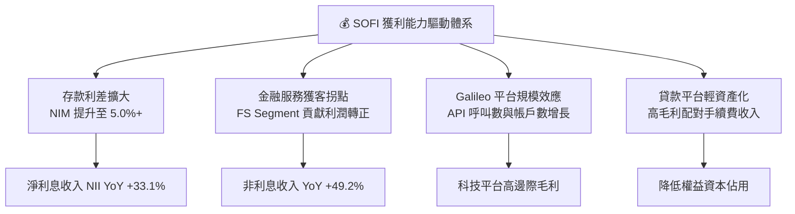

---

## 7. 估值深度分析

### 7.1 同業估值比較表格

選取美股市場中最具可比性的 3 家 FinTech / 數位銀行標的（Nu Holdings, Robinhood, Ally Financial）進行多維度估值比較：

| 估值與成長指標 | **SoFi (SOFI)** | **Nu Holdings (NU)** | **Robinhood (HOOD)** | **Ally Financial (ALLY)** | 本公司相對評估 |
|----------------|-----------------|----------------------|----------------------|---------------------------|----------------|
| **當前股價** | **$16.63** | $12.50 | $22.80 | $38.50 | - |
| **市值 (Market Cap)**| **$21.34B** | $59.50B | $20.10B | $11.60B | 中等偏大，流動性佳 |
| **Trailing P/E** | **36.97x** | 28.5x | 45.2x | 12.1x | 🟡 受轉盈初期歷史影響 |
| **Forward P/E** | **20.53x** | 18.2x | 26.5x | 9.8x | 🟢 **顯著優於 HOOD，具吸引力** |
| **PEG Ratio** | **0.84** | 0.78 | 1.35 | 1.20 | 🟢 **<1.0，價值極度凸顯** |
| **P/S Ratio** | **5.46x** | 7.20x | 7.80x | 1.85x | 🟢 低於同等增速 FinTech |
| **P/B Ratio** | **1.97x** | 7.10x | 2.85x | 0.92x | 🟢 比 NU/HOOD 更具資產保護 |
| **Revenue YoY** | **41.03%** | 48.5% | 35.2% | -2.5% | 🟢 高速複利成長 |
| **Net Margin** | **14.8%** | 26.5% | 18.2% | 11.2% | 🟢 快速拉近與 NU 差距 |

*數據來源：Yahoo Finance / Finviz / 研報整理。*

### 7.2 歷史估值區間分析

SoFi 在過去 24 個月的 Forward P/E 與 P/S 歷史走勢顯示，當前股價已從高點回檔修正，回落至非常具備吸引力的價值佈局區間：

```
╔══════════════════════════════════════════════════════════════════╗
║                SOFI 歷史 Forward P/E 估值區間 (12x - 50x)        ║
╠══════════════════════════════════════════════════════════════════╣
║                                                                  ║
║  歷史高點 (2025-10):  52.0x  ██████████████████████████████████  ║
║  歷史均值 (2 年):     28.5x  █████████████████                  ║
║  當前位置 (2026-07):  20.5x  ███████████  ← 🟢 位於歷史中低位區 ║
║  歷史低點 (2024-07):  13.2x  ██████                             ║
║                                                                  ║
║  📊 分析：當前 Forward P/E 為 20.53x，處於 2 年歷史百分位約 22%，║
║      考慮到 EPS 增速達 30%+，估值倍數具備強烈均值回歸擴張空間。  ║
╚══════════════════════════════════════════════════════════════════╝
```

### 7.3 情境目標價（假設驅動模型，Bear / Base / Bull）

我們基於 3 年期 Financial Model 進行推導，核心假設與情境目標價如下：

| 變數 / 假設條件 | 🔴 悲觀情境 (Bear Case) | 🟡 基準情境 (Base Case) | 🟢 樂觀情境 (Bull Case) |
|-----------------|------------------------|-------------------------|------------------------|
| **2026-2028 營收 CAGR** | 18.5% | **28.0%** | 36.0% |
| **2028 淨利潤率 (Net Margin)** | 12.0% | **16.5%** | 20.0% |
| **2028 預期 EPS** | $0.65 | **$1.125** | $1.60 |
| **目標 Exit Forward P/E** | 15.0x | **20.0x** | 25.0x |
| **折現率 (Discount Rate)**| 10.0% | **9.0%** | 8.0% |
| **隱含目標價 (Target Price)** | **$13.50** | **$22.50** | **$30.00** |
| **相對當前股價漲跌幅** | **-18.8%** | **+35.3%** | **+80.4%** |
| **情境發生機率** | 20% | **60%** | 20% |

> **估值倍數選用說明**：基於 SoFi 已具備持牌銀行身份且實現穩定 GAAP 盈利，我們採取 **Forward P/E 與 P/B 雙重檢驗法**。基準情境給予 20.0x Forward P/E，對應 2028 年預期 EPS $1.125，並折現回 12 個月目標價 $22.50。對應的 P/B 約為 2.2x，對於一家股權回報率（ROE）邁向 12%+ 且營收成長超 25% 的數位銀行而言非常合理。

### 7.4 DCF 敏感性分析（12 個月目標價矩陣）

採用兩階段剩餘收益模型（Residual Income Model）與 DCF 模型互相校準，以 WACC 及永續成長率（Terminal Growth Rate）建構 6 格目標價敏感性矩陣：

| 營收與利潤情境 \ WACC | WACC = 6.0% | **WACC = 6.82% (基準)** | WACC = 7.5% |
|-----------------------|-------------|-------------------------|-------------|
| 🟢 **樂觀情境 (CAGR 36%)** | $33.50 (+101%) | **$30.00 (+80.4%)** | $27.20 (+63.6%) |
| 🟡 **基準情境 (CAGR 28%)** | **$25.00 (+50.3%)**| **$22.50 (+35.3%)** | **$20.20 (+21.5%)** |
| 🔴 **悲觀情境 (CAGR 18%)** | $15.20 (-8.6%) | **$13.50 (-18.8%)** | $12.10 (-27.2%) |

### 7.5 估值綜合區間

```
╔══════════════════════════════════════════════════════════════════╗
║                   SOFI 估值綜合區間與當前位置                    ║
╠══════════════════════════════════════════════════════════════════╣
║                                                                  ║
║  悲觀目標價：$13.50 ──────┐                                      ║
║                           │                                      ║
║  當前股價：  $16.63 ──────┼───────► [當前位置：具安全邊際]        ║
║                           │                                      ║
║  券商平均價：$20.58 ──────┤                                      ║
║                           │                                      ║
║  基準目標價：$22.50 ──────┼───────► [12M 主力目標價 Target]      ║
║                           │                                      ║
║  樂觀目標價：$30.00 ──────┘                                      ║
║                                                                  ║
║  📊 評估：當前 $16.63 股價位於基準目標價與悲觀價之間的下軌區，    ║
║      風險報酬比 (Risk/Reward Ratio) 達 1:3.2，極具配置價值。     ║
╚══════════════════════════════════════════════════════════════════╝
```

---

## 8. 成長催化劑

### 8.1 催化劑時間軸

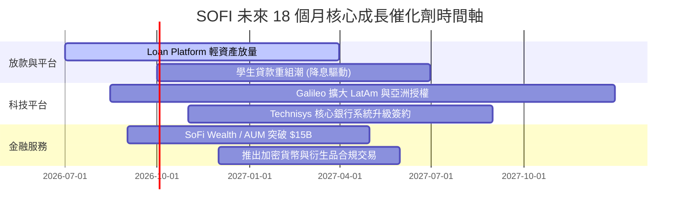

### 8.2 TAM 市場規模分析

SoFi 正從單一的美股無擔保放款市場，跨入數兆美元級別的綜合金融服務 TAM：

```
╔══════════════════════════════════════════════════════════════════╗
║                   SOFI 可尋址市場規模 (TAM)                      ║
╠══════════════════════════════════════════════════════════════════╣
║                                                                  ║
║  美國個人與學生放款 TAM:   $1.8 兆美元 (滲透率 < 2.5%)           ║
║  美國住宅房屋貸款 TAM:     $13.5 兆美元 (滲透率 < 0.1%)           ║
║  全美消費金融存款 TAM:     $18.0 兆美元 (滲透率 ~0.22%)          ║
║  全球雲端核心銀行與 API TAM: $850 億美元 (Galileo/Technisys)     ║
║                                                                  ║
║  📊 結論：目前 SoFi 總營收僅 $3.91B，在龐大的 TAM 中滲透率極低， ║
║      長線擁有充裕的自然擴展天花板。                              ║
╚══════════════════════════════════════════════════════════════════╝
```

### 8.3 成長驅動力結構圖

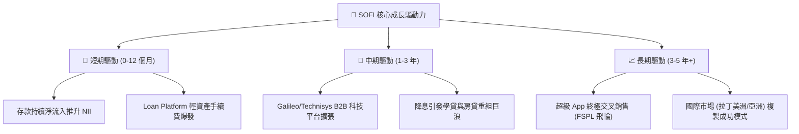

---

## 9. 風險矩陣

### 9.1 風險評分矩陣

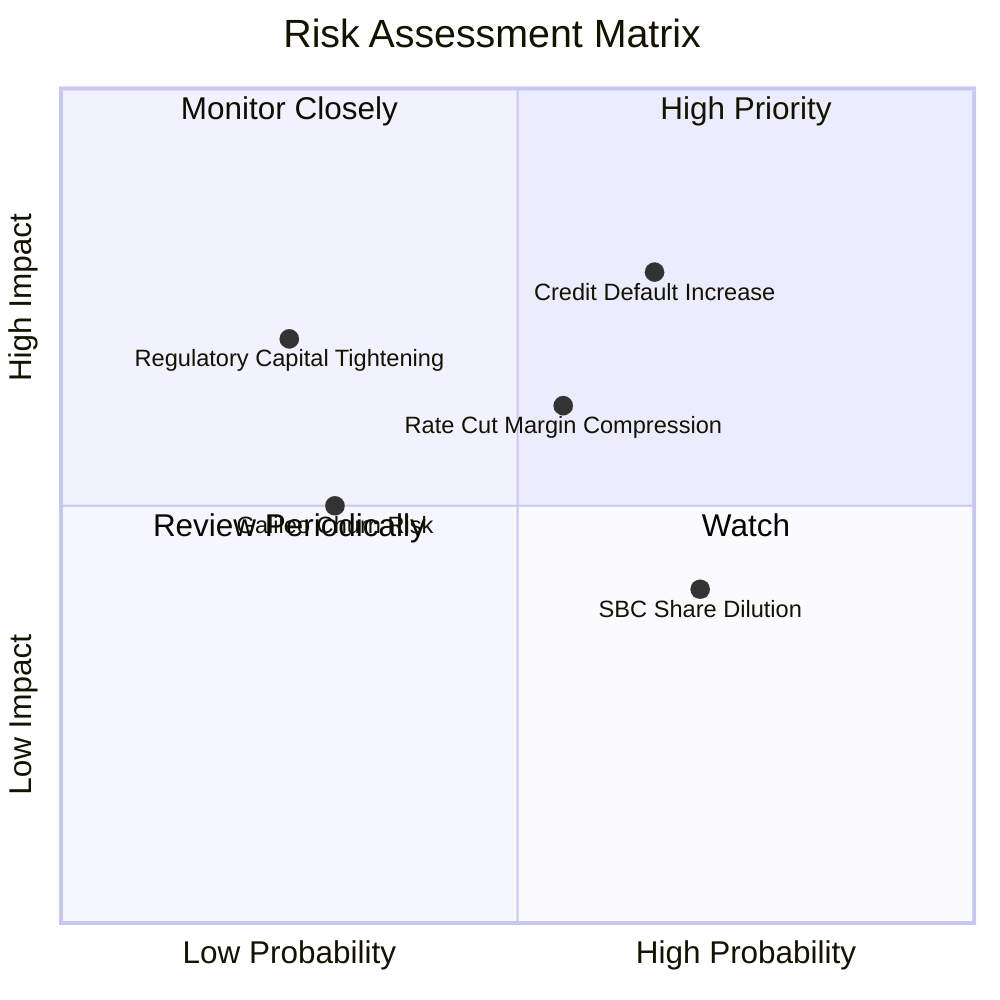

### 9.2 風險清單詳細分析

| # | 風險項目 | 發生機率 | 財務衝擊 | 風險評分 | 緩解措施與機構洞察 |
|---|----------|----------|----------|----------|--------------------|
| 1 | 🔴 **信貸違約率 (Credit Losses) 上升** | 高 (65%) | 高 (-15% 營收) | 🔴 **7.8/10** | 客群平均 FICO 分數高達 740+，個人平均年收入 >$160,000，具備較高的抗衰退韌性。 |
| 2 | 🟡 **急劇降息壓縮淨利息收益率 (NIM)** | 中 (55%) | 中 (-8% 淨利) | 🟡 **6.2/10** | 降息雖影響放款收益率，但將劇烈激活高毛利的學生貸款與房屋貸款重組 demand，形成天然對衝。 |
| 3 | 🟡 **SBC 股權薪酬稀釋** | 高 (70%) | 低 (-3% EPS) | 🟡 **5.0/10** | SBC / Revenue 已從 20.1% 降至 6.6%，管理層正致力於將稀釋率控制在每年 <2% 區間。 |
| 4 | 🟢 **監管資本適足率要求提高** | 低 (25%) | 高 (-10% ROE) | 🟢 **4.2/10** | 目前 Tier 1 Capital 達 15.2%，遠高於 8.0% 的監管紅線，資本儲備十分豐沛。 |

---

## 10. 投資建議

### 10.1 最終綜合評級雷達圖

```
╔══════════════════════════════════════════════════════════════╗
║                SOFI 投資維度綜合評級雷達                      ║
╠══════════════════════════════════════════════════════════════╣
║ 業務基本面 (Fundamentals) 8.5/10 ▓▓▓▓▓▓▓▓▓▓▓▓▓▓▓▓▓░░  🟢 極強  ║
║ 營收成長性 (Growth)       9.0/10 ▓▓▓▓▓▓▓▓▓▓▓▓▓▓▓▓▓▓░  🟢 頂級  ║
║ 獲利品質 (Profitability)  7.5/10 ▓▓▓▓▓▓▓▓▓▓▓▓▓▓░░░░░  🟢 擴張  ║
║ 資產健康度 (Balance Sheet)8.0/10 ▓▓▓▓▓▓▓▓▓▓▓▓▓▓▓▓░░░  🟢 穩健  ║
║ 估值吸引力 (Valuation)    8.0/10 ▓▓▓▓▓▓▓▓▓▓▓▓▓▓▓▓░░░  🟢 凸顯  ║
║ 護城河深度 (Moat Depth)   8.2/10 ▓▓▓▓▓▓▓▓▓▓▓▓▓▓▓▓░░░  🟢 穩固  ║
╠══════════════════════════════════════════════════════════════╣
║ 綜合評級：🟢 買入 (BUY) ｜ 總分：8.2 / 10                    ║
╚══════════════════════════════════════════════════════════════╝
```

### 10.2 目標價與隱含報酬率

| 情境 | 機率權重 | 12 個月目標價 | 相對當前股價 ($16.63) 報酬率 | 期望值貢獻 |
|------|----------|---------------|------------------------------|------------|
| 🔴 **悲觀情境 (Bear)** | 20% | $13.50 | -18.8% | -$2.70 |
| 🟡 **基準情境 (Base)** | **60%** | **$22.50** | **+35.3%** | **+$13.50** |
| 🟢 **樂觀情境 (Bull)** | 20% | $30.00 | +80.4% | +$6.00 |
| **加權綜合目標價** | **100%** | **$21.80** | **+31.1%** | **加權預期股價** |

### 10.3 買入時機與觸發因素

```
╔══════════════════════════════════════════════════════════════════╗
║                  ✅ SOFI 買入與操作 Checklist                    ║
╠══════════════════════════════════════════════════════════════════╣
║                                                                  ║
║  建倉佈局區間：                                                  ║
║  ✅ 當前股價 $15.50 - $16.80 區間內分批建立第一階段核心倉位。    ║
║                                                                  ║
║  加碼觸發條件 (出現以下任一條件即可加碼)：                       ║
║  ☐ 單季存款淨增量 > $2.5B 且存款成本顯著下滑。                   ║
║  ☐ Loan Platform 資本輕型業務單季營收占比突破 15%。              ║
║  ☐ 股價若因宏觀波及拉回至 $14.20 - $14.80 區間（P/B < 1.7x）。   ║
║                                                                  ║
║  嚴格停損/減碼觸發條件：                                         ║
║  ☐ 總放款逾期 90 天以上違約率 (NCO Rate) 突破 4.5%。             ║
║  ☐ 股價無量跌破 $13.50 悲觀支撐位（停損線）。                    ║
╚══════════════════════════════════════════════════════════════════╝
```

### 10.4 投資人適配度分析

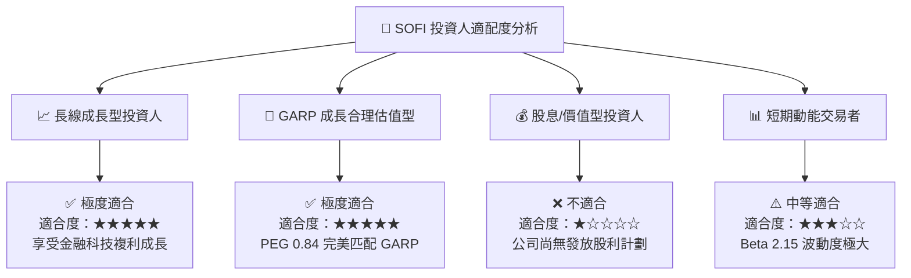

### 10.5 每季財報監控清單（Quarterly Watch List）

為了確保投資論點持續成立，投資人應在未來各季財報發布時重點追蹤以下量化門檻：

| 監控指標 | 正常目標區間 (多頭成立) | 預警門檻 (觀望) | 離場門檻 (論點失效) |
|----------|-------------------------|-----------------|---------------------|
| **單季總營收 YoY 成長率** | **≥ 30.0%** | 20.0% - 29.9% | < 20.0% |
| **GAAP 單季淨利潤** | **≥ $1.50 億美元** | $1.0B - $1.49B | 轉為 GAAP 虧損 |
| **總存款單季淨增量** | **≥ $20 億美元** | $10B - $19B | 存款出現淨流出 |
| **SBC 佔營收比重** | **≤ 7.0%** | 7.1% - 9.0% | > 10.0% |
| **個人貸款年化淨沖銷率 (NCO)**| **≤ 3.5%** | 3.6% - 4.5% | > 4.5% |

### 10.6 反面論證：什麼會證明論點錯誤（What Would Change My Mind）

```
╔══════════════════════════════════════════════════════════════════╗
║             ⚠️ 多頭論點失效條件 (Disconfirming Evidence)          ║
╠══════════════════════════════════════════════════════════════════╣
║  若發生下列任一情況，本研究報告的買入評級將立即失效並轉為賣出：   ║
║                                                                  ║
║  ☐ 1. 連續兩季 GAAP 淨利潤轉負，經營槓桿發生結構性逆轉。         ║
║  ☐ 2. 存款規模連續兩季萎縮 >5%，迫使 SoFi 重新依賴高成本批發融資。║
║  ☐ 3. 個人無擔保貸款年化淨沖銷率（NCO Rate）突破 4.8%，證明風控  ║
║       模型失靈。                                                 ║
║  ☐ 4. Galileo 科技平台客戶出現大幅流失，非利息收入 YoY 增長跌破  ║
║       10%。                                                      ║
║  ☐ 5. 美國金融監管機構對銀行資本適足率提出額外懲罰性要求。       ║
╚══════════════════════════════════════════════════════════════════╝
```

---

> **免責聲明**：本報告為 AI 自動生成之機構級研究分析，僅供學術與投資參考，不構成任何買賣建議。證券投資帶有風險，投資人應獨立思考並自行承擔最終交易風險。