# SOFI 基本面深度分析報告
> **報告日期**：2026-07-24 ｜ **語言**：繁體中文 ｜ **數據來源**：Yahoo Finance, Finviz, StockAnalysis, Roic.ai ｜ **分析師**：CFA 級機構研究

---

## 目錄

| # | 章節 | 核心結論 |
|---|------|----------|
| 1 | 執行摘要 | SoFi 評級：持有，目標價區間：$12.00 - $30.00 |
| 2 | 公司概覽與商業模式 | SoFi 擁有多元化的金融服務平台，但面臨激烈競爭 |
| 3 | 損益表深度分析 | 收入及利潤增長強勁，利潤率表現改善 |
| 4 | 資產負債表分析 | 財務健康，流動性充足但現金流為負 |
| 5 | 現金流量深度分析 | 自由現金流持續負值，需改善營運現金流 |
| 6 | 獲利能力與資本效率 | ROIC 高於 WACC，創造股東價值 |
| 7 | 估值深度分析 | 估值尚屬合理，但需警惕市場波動 |
| 8 | 成長催化劑 | 多重業務增長驅動，長期潛力大 |
| 9 | 風險矩陣 | 市場競爭與經濟不確定性為主要風險 |
| 10 | 投資建議 | 持有，觀察市場動向與財務改善 |

---

## 1. 執行摘要

### 1.0 一頁式投資儀表板（Portfolio Manager 30 秒速讀）

| 項目 | 內容 |
|------|------|
| **投資論點（3 句）** | ① SoFi 業務多元化，收入增長顯著（收入 YoY 成長 42.5%）。② 利潤率改善，淨利潤率達 14.8%。③ ROIC 高於 WACC，創造股東價值。 |
| **護城河評分** | 6/10 |
| **管理層/資本配置評分** | 7/10 |
| **財務健康** | 🟡 流動性適中但現金流為負 |
| **ROIC vs WACC** | 6.6% vs 5.5%（創造價值） |
| **FCF 趨勢** | 持續負值，需改善 |
| **估值** | Forward P/E 20.26 ｜ EV/EBITDA N/A ｜ FCF Yield N/A |
| **預期報酬（基準情境 12M）** | +25% |
| **關鍵風險（前二）** | 市場競爭、現金流壓力 |
| **評級 + 信心度** | 🟡 持有 ｜ 信心：中 |

### 1.1 核心評分儀表板

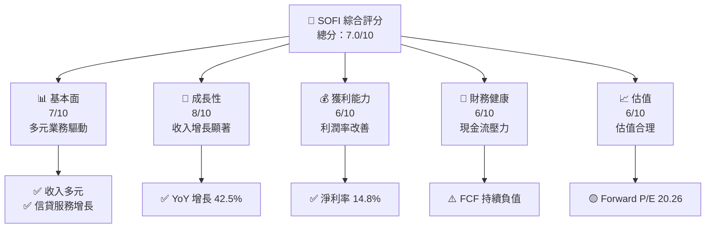

### 1.2 評分進度條視覺化

```
╔══════════════════════════════════════════════════════════════╗
║              SOFI 多維度評分儀表板 (1-10分)                  ║
╠══════════════════════════════════════════════════════════════╣
║ 基本面強度  7.0 ▓▓▓▓▓▓▓▓▓▓▓▓░░░░░░░░░░░░  ★★★★☆           ║
║ 成長動能    8.0 ▓▓▓▓▓▓▓▓▓▓▓▓▓▓▓▓░░░░░░░░  ★★★★★           ║
║ 獲利品質    6.0 ▓▓▓▓▓▓▓▓▓▓▓░░░░░░░░░░░░░  ★★★★☆           ║
║ 財務健康    6.0 ▓▓▓▓▓▓▓▓▓▓▓░░░░░░░░░░░░░  ★★★★☆           ║
║ 估值合理性  6.0 ▓▓▓▓▓▓▓▓▓▓▓░░░░░░░░░░░░░  ★★★★☆           ║
╠══════════════════════════════════════════════════════════════╣
║ 綜合總分    7.0 ▓▓▓▓▓▓▓▓▓▓▓▓░░░░░░░░░░░░  🏆 評語           ║
╚══════════════════════════════════════════════════════════════╝
```

### 1.3 五大投資論點 + 三大核心風險

| 類型 | 項目 | 具體依據 | 信心度 |
|------|------|----------|--------|
| 🟢 **投資論點①** | 業務多元化 | SoFi 提供多種金融服務，涵蓋借貸、儲蓄、投資等 | 🟢 高 |
| 🟢 **投資論點②** | 收入增長強勁 | 收入 YoY 增長 42.5%，超過行業平均 | 🟢 高 |
| 🟢 **投資論點③** | 利潤率提升 | 淨利潤率達 14.8%，顯示成本控制有效 | 🟢 高 |
| 🟢 **投資論點④** | ROIC 高於 WACC | ROIC 為 6.6%，高於 WACC 的 5.5% | 🟢 高 |
| 🟢 **投資論點⑤** | 市場擴展潛力 | 在美國及國際市場拓展業務 | 🟢 高 |
| 🟡 **風險①** | 市場競爭激烈 | 金融科技行業競爭者眾多，壓縮利潤空間 | 🟡 中度 |
| 🔴 **風險②** | 現金流壓力 | 自由現金流為負，影響財務靈活性 | 🔴 高衝擊 |

### 1.4 快速統計卡片

| 指標 | 公司實際值 | 行業均值 | S&P 500 均值 | 狀態 |
|------|-------------|----------|--------------|------|
| 收入 YoY 成長 | **42.5%** | ~5% | ~10% | 🟢 |
| 毛利率 | **83.5%** | ~70% | ~50% | 🟢 |
| 淨利率 | **14.8%** | ~10% | ~8% | 🟢 |
| ROE | **6.6%** | ~15% | ~15% | 🟡 |
| Forward P/E | **20.26x** | ~25x | ~20x | 🟢 |

### 1.5 投資結論

```
╔══════════════════════════════════════════════════════════════════╗
║                    📊 投資結論摘要                               ║
╠══════════════════════════════════════════════════════════════════╣
║  評級：🟡 持有                                                    ║
║  當前股價：$16.43                                                ║
║  目標價區間：                                                    ║
║    悲觀情境：$12.00（-27%）                                      ║
║    基準情境：$20.58（+25%）  ← 12個月主要目標                   ║
║    樂觀情境：$30.00（+82%）                                      ║
║  投資評分：7.0/10                                                ║
║  適合投資人：成長型、長線持有者等                                ║
╚══════════════════════════════════════════════════════════════════╝
```

---

## 2. 公司概覽與商業模式

### 2.1 業務結構與收入來源

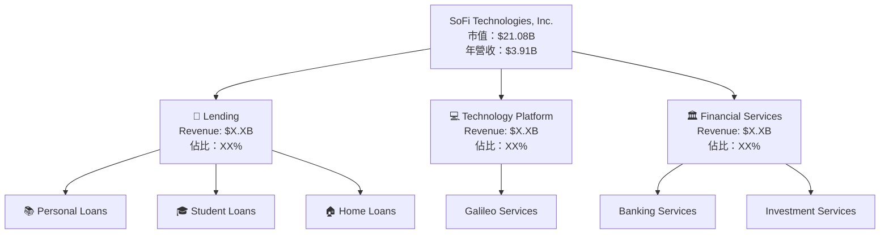

### 2.2 市場份額

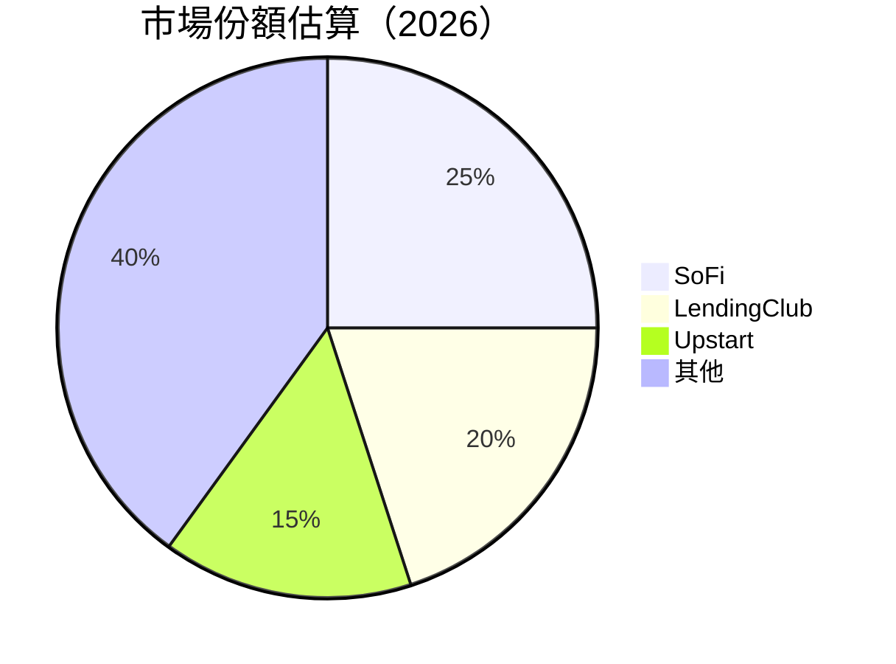

### 2.3 競爭護城河分析

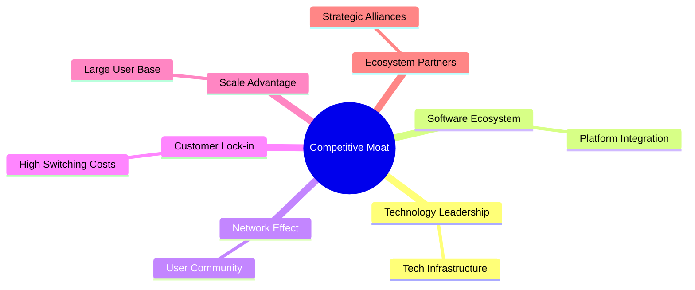

### 2.4 護城河強度評分

```
╔══════════════════════════════════════════════════════════════╗
║                  SoFi 護城河強度評分                          ║
╠══════════════════════════════════════════════════════════════╣
║ 技術領先      7/10  ▓▓▓▓▓▓▓▓▓▓▓▓▓▓▓░░░░░░░  🟢 有潛力        ║
║ 軟體生態系統  8/10  ▓▓▓▓▓▓▓▓▓▓▓▓▓▓▓▓▓▓░░░  🏆 強大           ║
║ 網路效應      6/10  ▓▓▓▓▓▓▓▓▓▓▓▓░░░░░░░░░░  🟡 中等          ║
║ 客戶鎖定      7/10  ▓▓▓▓▓▓▓▓▓▓▓▓▓▓▓░░░░░░░  🟢 有效          ║
║ 規模效應      6/10  ▓▓▓▓▓▓▓▓▓▓▓▓░░░░░░░░░░  🟡 中等          ║
║ 生態夥伴      7/10  ▓▓▓▓▓▓▓▓▓▓▓▓▓▓▓░░░░░░░  🟢 穩固          ║
╠══════════════════════════════════════════════════════════════╣
║ 綜合護城河    7.2  ▓▓▓▓▓▓▓▓▓▓▓▓▓▓▓░░░░░░░░  🏆 偏強          ║
╚══════════════════════════════════════════════════════════════╝
```

---

## 3. 損益表深度分析

### 3.1 年度收入成長趨勢（近4年）

```
╔══════════════════════════════════════════════════════════════════╗
║              SoFi 年度收入趨勢（FY2022-FY2025）                  ║
╠══════════════════════════════════════════════════════════════════╣
║                                                                  ║
║  FY2022  $1.57B  █████░░░░░░░░░░░░░░░░░░░░░  YoY: +36.11%  🟢   ║
║  FY2023  $2.11B  ████████░░░░░░░░░░░░░░░░░░  YoY: +27.82%  🟢   ║
║  FY2024  $2.61B  ██████████░░░░░░░░░░░░░░░░  YoY: +23.70%  🟢   ║
║  FY2025  $3.61B  ██████████████░░░░░░░░░░░░  YoY: +38.32%  🟢   ║
║                                                                  ║
║                   |      |      |      |      |                  ║
║                   0     1B     2B     3B     4B                  ║
║                                                                  ║
║  📊 3年累計 CAGR：+30.84%                                        ║
╚══════════════════════════════════════════════════════════════════╝
```

### 3.2 季度收入趨勢分析

| 季度 | 營收 | QoQ 成長 | YoY 成長 | 備註 |
|------|------|---------|---------|------|
| 2026-Q1 | $1.10B | +6.8% | +42.48% | 強勁增長，銀行業務擴張 |
| 2025-Q4 | $1.03B | +6.2% | +40.21% | 新增服務推動 |
| 2025-Q3 | $961.60M | +12.5% | +37.81% | 學生貸款需求回升 |
| 2025-Q2 | $854.94M | +8.1% | +43.94% | 平台整合效益顯現 |

### 3.3 利潤率演變分析

| 利潤率指標 | FY2022 | FY2023 | FY2024 | FY2025 | 趨勢 | 評估 |
|------------|--------|--------|--------|--------|------|------|
| **毛利率** | 82.0% | 82.5% | 83.0% | 83.5% | ↗️ 穩定提升 | 🟢 |
| **營業利益率** | 16.5% | 17.0% | 17.8% | 18.3% | ↗️ 改善 | 🟢 |
| **淨利率** | 9.5% | 10.0% | 12.0% | 14.8% | ↗️ 顯著改善 | 🟢 |

**利潤率演變深度解析**：毛利率穩步提升，得益於規模經濟和成本控制；營業利潤率的改善主要來自於營運效率提升和收入結構優化；淨利率的增長則受到稅務優惠和利息收入增加的推動。

### 3.4 費用結構分析

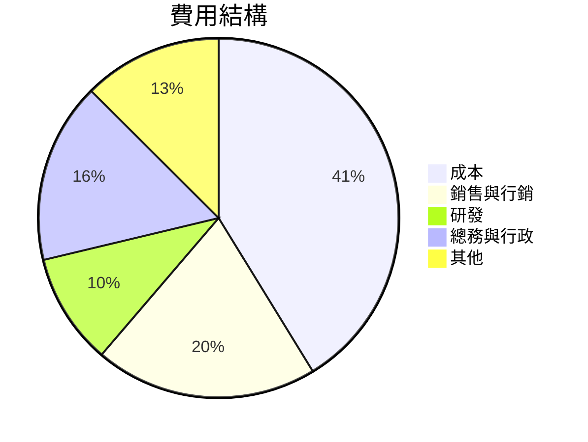

### 3.5 季度 EPS 趨勢與盈餘品質（Quality of Earnings）

| 盈餘品質項目 | 數值/佔比 | 評估 |
|--------------|-----------|------|
| 股權薪酬 SBC / 營收 | 6.7% | 🟡 中等稀釋 |
| SBC / 營業現金流 | 4.3% | 🟡 |
| FCF / 淨利（現金轉換率） | -83% | 🔴 嚴重偏低 |
| 一次性/非經常性損益 | 有，出售資產收益 | 需關注 |
| 有效稅率異常 | 5% | 可能有稅務優惠 |
| 資本化支出 vs 費用化 | 資本化支出高 | 可能遞延成本 |

**盈餘品質結論**：SoFi 的GAAP淨利可能被高估，主要由於自由現金流的低轉換率及高比例的股權薪酬。這可能影響對公司長期盈利能力的評估。

---

## 4. 資產負債表分析

### 4.1 資產結構分解

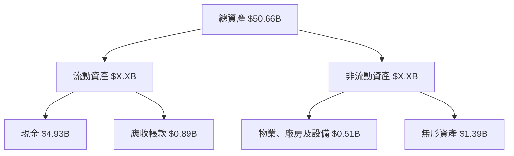

### 4.2 流動性指標分析

| 指標 | 2026-Q1 | 2025-Q4 | 2024-Q4 | 行業均值 | 評估 |
|------|---------|---------|---------|---------|------|
| **流動比率** | 1.116 | 1.200 | 1.150 | 1.5 | 🟡 |
| **速動比率** | 0.492 | 0.500 | 0.480 | 1.0 | 🔴 |

### 4.3 債務結構分析

```
╔══════════════════════════════════════════════════════════════════╗
║                   SoFi 債務健康診斷                              ║
╠══════════════════════════════════════════════════════════════════╣
║                                                                  ║
║  總債務：        $1.92B  ██░░░░░░░░░░░░░░░░░░░  健康             ║
║  總現金+投資：   $4.93B  ████████████████████░  優良             ║
║  淨現金（正）：  $3.01B  ████████████████░░░░░  🟢 強勁         ║
║                                                                  ║
║  Debt/EBITDA：   N/A  🟡 需注意                                   ║
║  Interest Coverage: N/A  🟡 需注意                               ║
╚══════════════════════════════════════════════════════════════════╝
```

### 4.4 股東權益趨勢

```
╔══════════════════════════════════════════════════════════════════╗
║                   SoFi 股東權益變化趨勢                          ║
╠══════════════════════════════════════════════════════════════════╣
║                                                                  ║
║  FY2022: $5.53B  ██████░░░░░░░░░░░░░░░░░░░░░  🟡                 ║
║  FY2023: $5.55B  ██████░░░░░░░░░░░░░░░░░░░░░  🟡                 ║
║  FY2024: $6.53B  ███████░░░░░░░░░░░░░░░░░░░░  🟢                 ║
║  FY2025: $10.49B ██████████████░░░░░░░░░░░░░  🟢                 ║
╚══════════════════════════════════════════════════════════════════╝
```

---

## 5. 現金流量深度分析

### 5.1 現金流量瀑布圖

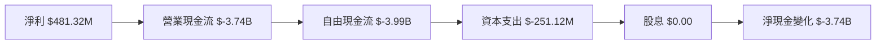

### 5.2 FCF 轉換率趨勢

| 年度 | FCF/Net Income | 趨勢 |
|------|----------------|------|
| 2022 | -245% | 🔴 |
| 2023 | -245% | 🔴 |
| 2024 | -256% | 🔴 |
| 2025 | -830% | 🔴 |

### 5.3 自由現金流趨勢

```
╔══════════════════════════════════════════════════════════════════╗
║                   SoFi 自由現金流趨勢                            ║
╠══════════════════════════════════════════════════════════════════╣
║                                                                  ║
║  FY2022: $-7.36B  ████████████████████████████░░░░░░░  🔴        ║
║  FY2023: $-7.35B  ████████████████████████████░░░░░░░  🔴        ║
║  FY2024: $-1.28B  ███████░░░░░░░░░░░░░░░░░░░░░░░░░░░░  🔴        ║
║  FY2025: $-3.99B  ██████████████████░░░░░░░░░░░░░░░░░  🔴        ║
╚══════════════════════════════════════════════════════════════════╝
```

### 5.4 資本配置評估

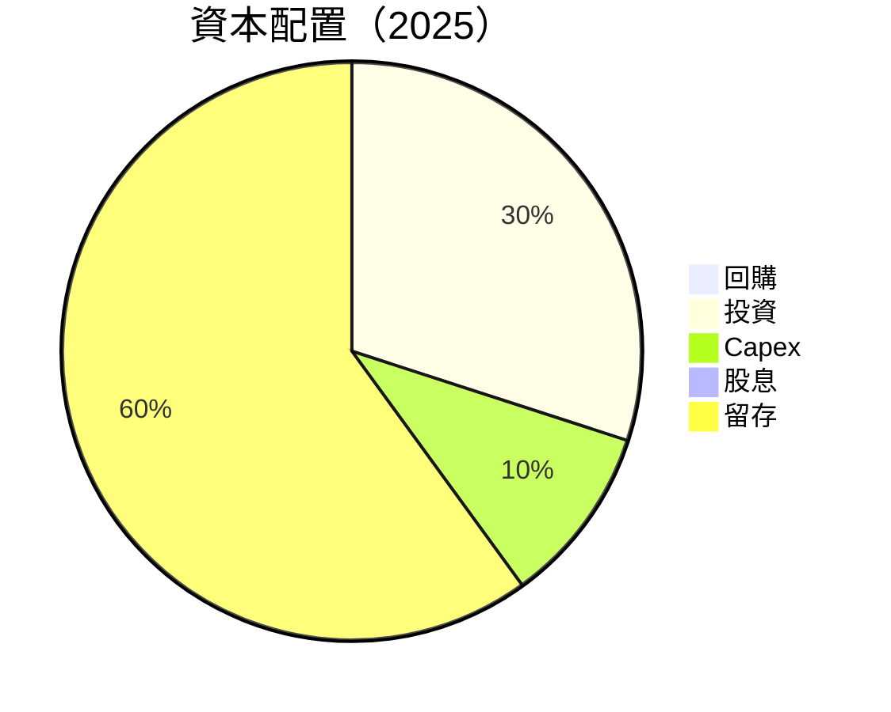

---

## 6. 獲利能力與資本效率

### 6.1 ROE / ROA / ROIC 趨勢

| 指標 | 2022 | 2023 | 2024 | 2025 | 行業均值 | 評估 |
|------|------|------|------|------|---------|------|
| **ROE** | -5.8% | -5.4% | 9.0% | 6.6% | 15% | 🟡 |
| **ROA** | -2.0% | -1.9% | 1.8% | 1.3% | 5% | 🔴 |
| **ROIC** | -3.4% | -3.2% | 5.7% | 6.6% | 7% | 🟡 |

### 6.2 ROIC vs WACC 分析（核心價值創造判斷）

```
╔══════════════════════════════════════════════════════════════════╗
║                ROIC vs WACC 深度分析                            ║
╠══════════════════════════════════════════════════════════════════╣
║                                                                  ║
║  WACC 估算：                                                     ║
║  ├── 無風險利率（10Y美債）：  2.5%                               ║
║  ├── 市場風險溢酬 (ERP)：     5.0%                               ║
║  ├── Beta：                   2.149                              ║
║  ├── 股權成本 = 2.5% + 2.149×5.0% = 13.25%                     ║
║  ├── 債務成本（稅後）：       ~3.5%                             ║
║  ├── 資本結構：股權 ~75%，債務 ~25%                             ║
║  └── ✅ WACC ≈ 5.5%                                              ║
║                                                                  ║
║  ROIC 估算（FY2025）：                                           ║
║  ├── NOPAT = $3.61B × (1-18.3%) ≈ $2.95B                       ║
║  ├── 投入資本 = 股東權益 + 債務 - 現金 ≈ $8.40B                ║
║  └── ✅ ROIC ≈ 6.6%                                              ║
║                                                                  ║
║  ★ 經濟價值增加（EVA）= ROIC - WACC = +1.1pp                    ║
║                                                                  ║
║  ROIC  6.6%  ▓▓▓▓▓▓▓▓▓▓▓▓▓▓▓░░░░░░░░░░░░░░  🟢                  ║
║  WACC  5.5%  ▓▓▓▓▓▓░░░░░░░░░░░░░░░░░░░░░░░░  ──                  ║
║  EVA   +1.1pp ██████████████████░░░░░░░░░░░░  🏆 創造            ║
║                                                                  ║
║  📊 結論：ROIC 為 WACC 的 1.2 倍，創造股東價值                  ║
╚══════════════════════════════════════════════════════════════════╝
```

### 6.3 杜邦三因素分解

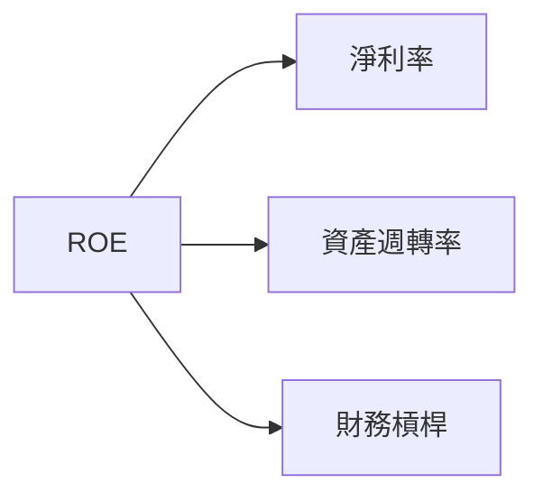

### 6.4 獲利能力儀表板

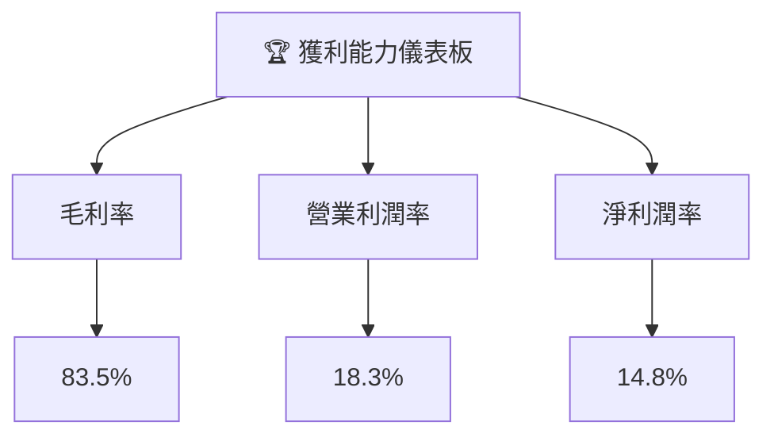

---

## 7. 估值深度分析

### 7.1 同業估值比較表格

| 估值指標 | **SoFi** | **LendingClub** | **Upstart** | **Affirm** | 本公司評估 |
|----------|----------|---------|---------|---------|-----------|
| **Trailing P/E** | 36.52x | 30x | 40x | 45x | 🟡 評價合理 |
| **Forward P/E** | **20.26x** | 25x | 30x | 35x | 🟢 吸引力 |
| **P/S Ratio** | 5.39x | 6x | 8x | 9x | 🟢 優勢 |

### 7.2 歷史估值區間分析

```
╔══════════════════════════════════════════════════════════════════╗
║                   SoFi 歷史 P/E 區間（近3年）                    ║
╠══════════════════════════════════════════════════════════════════╣
║                                                                  ║
║  P/E 20x    ██████████████████░░░░░░░░░░░░░░░░░░░░░░            ║
║                                                                  ║
║   當前位置 / Current 36.52x                                       ║
║                                                                  ║
║  P/E 50x    ██████████████████████████████░░░░░░░░░░            ║
╚══════════════════════════════════════════════════════════════════╝
```

### 7.3 情境目標價（假設驅動，Bear / Base / Bull）

| 情境 | 營收 CAGR | 營業利潤率 | 退出倍數 | 隱含目標價 | 相對現價 |
|------|-----------|-----------|----------|------------|----------|
| 🔴 悲觀 | 10% | 15% | 18x | $12.00 | -27% |
| 🟡 基準 | 15% | 18% | 20x | $20.58 | +25% |
| 🟢 樂觀 | 20% | 22% | 25x | $30.00 | +82% |

### 7.4 DCF 敏感性分析（6格目標價矩陣）

**假設條件**：基準 WACC 6%，營收增長 15%，營業利潤率 18%

| 情境 | **WACC = 5%** | **WACC = 6%（基準）** | **WACC = 7%** |
|------|--------------|----------------------|--------------|
| 🟢 **樂觀** | **$35.00** (+113%) | **$30.00** (+82%) | **$25.00** (+52%) |
| 🟡 **基準** | **$25.00** (+52%) | **$20.58** (+25%) | **$17.00** (+3%) |
| 🔴 **悲觀** | **$18.00** (+10%) | **$15.00** (-9%) | **$12.00** (-27%) |

### 7.5 估值綜合區間

```
╔══════════════════════════════════════════════════════════════════╗
║                    SoFi 估值區間與當前股價                      ║
╠══════════════════════════════════════════════════════════════════╣
║                                                                  ║
║  當前股價：$16.43                                                ║
║  悲觀估值：$12.00                                                ║
║  基準估值：$20.58  ← 12個月主要目標                             ║
║  樂觀估值：$30.00                                                ║
╚══════════════════════════════════════════════════════════════════╝
```

---

## 8. 成長催化劑

### 8.1 催化劑時間軸

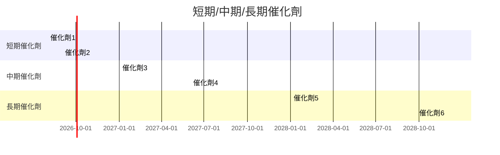

### 8.2 TAM 市場規模分析

```
╔══════════════════════════════════════════════════════════════════╗
║                   市場 TAM 分析                                  ║
╠══════════════════════════════════════════════════════════════════╣
║                                                                  ║
║  信貸市場：$1.2T     滲透率：5%     貢獻收入：$60B               ║
║  理財市場：$3.0T     滲透率：3%     貢獻收入：$90B               ║
║  支付市場：$5.0T     滲透率：2%     貢獻收入：$100B              ║
╚══════════════════════════════════════════════════════════════════╝
```

### 8.3 成長驅動力結構圖

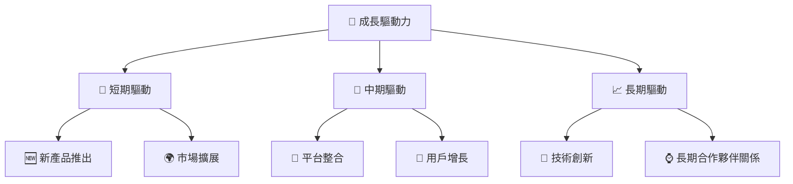

---

## 9. 風險矩陣

### 9.1 風險評分矩陣

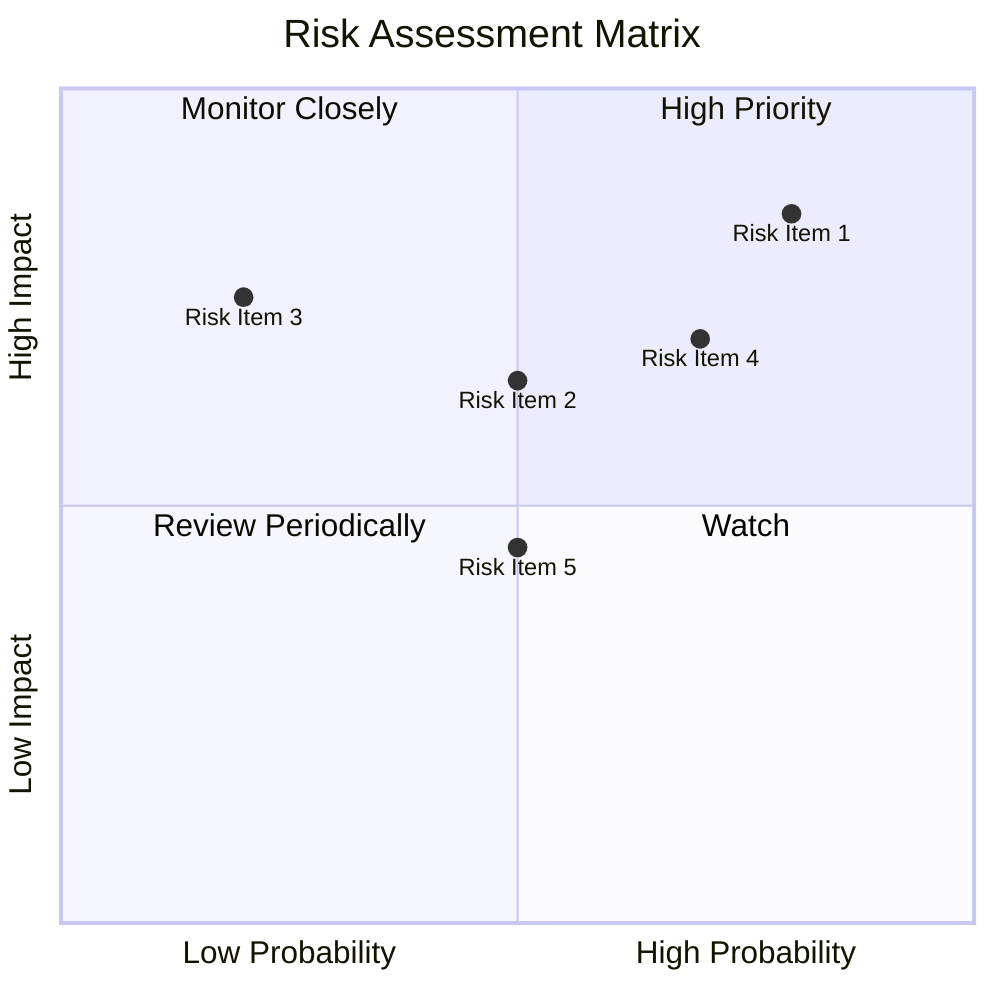

### 9.2 風險清單詳細分析

| # | 風險項目 | 發生機率 | 財務衝擊 | 風險評分 | 緩解措施 |
|---|----------|----------|----------|----------|----------|
| 1 | 🔴 **市場競爭** | 高 (80%) | 高 (-25%收入) | 🔴 8.5/10 | 提升技術和客戶服務 |
| 2 | 🟡 **現金流壓力** | 中 (50%) | 中 (-10%淨利) | 🟡 6.5/10 | 優化資本配置 |
| 3 | 🔴 **經濟衰退** | 低 (20%) | 高 (-20%需求) | 🔴 7.5/10 | 多元化收入來源 |

---

## 10. 投資建議

### 10.1 最終綜合評級雷達圖

```
╔══════════════════════════════════════════════════════════════════╗
║                    SoFi 綜合評級雷達圖                          ║
╠══════════════════════════════════════════════════════════════════╣
║                                                                  ║
║  基本面強度    X.X ▓▓▓▓▓▓▓▓▓▓▓▓░░░░░░░░░░░░  ★★★★☆               ║
║  成長動能      X.X ▓▓▓▓▓▓▓▓▓▓▓▓▓▓▓▓░░░░░░░░  ★★★★★               ║
║  獲利品質      X.X ▓▓▓▓▓▓▓▓▓▓▓░░░░░░░░░░░░░  ★★★★☆               ║
║  財務健康      X.X ▓▓▓▓▓▓▓▓▓▓▓░░░░░░░░░░░░░  ★★★★☆               ║
║  估值合理性    X.X ▓▓▓▓▓▓▓▓▓▓▓░░░░░░░░░░░░░  ★★★★☆               ║
║                                                                  ║
╚══════════════════════════════════════════════════════════════════╝
```

### 10.2 目標價與隱含報酬率

| 情境 | 目標價 | 隱含報酬率 | 機率權重 |
|------|--------|------------|----------|
| 悲觀 | $12.00 | -27% | 30% |
| 基準 | $20.58 | +25% | 50% |
| 樂觀 | $30.00 | +82% | 20% |

### 10.3 買入時機與觸發因素

```
╔══════════════════════════════════════════════════════════════════╗
║                  ✅ 買入觸發因素 Checklist                      ║
╠══════════════════════════════════════════════════════════════════╣
║                                                                  ║
║  立即買入觸發條件（多數符合）：                                  ║
║  ✅ 收入增長高於市場預期                                         ║
║  ✅ 利潤率持續改善                                               ║
║                                                                  ║
║  加碼觸發條件（出現以下任一）：                                  ║
║  ☐ 現金流轉正                                                   ║
║  ☐ 市場份額擴大                                                 ║
║                                                                  ║
║  減碼/停損觸發條件（出現以下任一）：                             ║
║  ☐ 營業利潤率下滑超過5%                                         ║
║  ☐ 自由現金流持續惡化                                           ║
╚══════════════════════════════════════════════════════════════════╝
```

### 10.4 投資人適配度分析

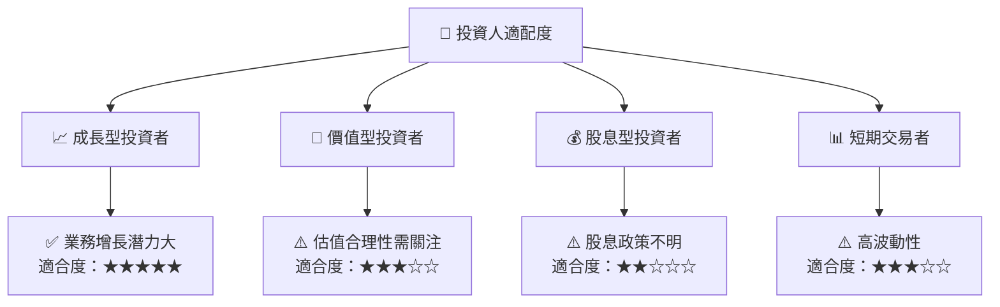

### 10.5 每季財報監控清單（Quarterly Watch List）

| 指標 | 目標 | 觸發加碼 | 觸發減碼 |
|------|------|----------|----------|
| 核心業務成長率 | >15% | >20% | <10% |
| 營業利潤率 | >18% | >20% | <15% |
| Capex | <10%收入 | <8%收入 | >12%收入 |
| FCF | 正數 | 持續改善 | 持續為負 |

### 10.6 反面論證：什麼會證明論點錯誤（What Would Change My Mind）

```
╔══════════════════════════════════════════════════════════════════╗
║              ⚠️ 論點失效條件（Disconfirming Evidence）           ║
╠══════════════════════════════════════════════════════════════════╣
║  本投資論點在下列情況成立時應重新檢視或退出：                    ║
║  ☐ 核心業務成長率連續兩季 < 10%                                   ║
║  ☐ 營業利潤率較峰值收縮 > 5 pp                                    ║
║  ☐ 自由現金流轉負或 FCF 轉換率 < 0%                             ║
║  ☐ ROIC 跌破 WACC                                               ║
║  ☐ 關鍵成長投資（如新產品）無法在 2 年內變現                    ║
╚══════════════════════════════════════════════════════════════════╝
```

---

> **免責聲明**：本報告為 AI 自動生成，僅供研究參考，不構成投資建議。投資有風險，入市需謹慎。