# SOFI 基本面深度分析報告
> **報告日期**：2026-07-25 ｜ **語言**：繁體中文 ｜ **數據來源**：Yahoo Finance, Finviz, StockAnalysis, Roic.ai ｜ **分析師**：CFA 級機構研究

---

## 目錄

| # | 章節 | 核心結論 |
|---|------|----------|
| 1 | 執行摘要 | SOFI 擁有強勁的成長動能，但財務健康需要改善。投資評級為持有，目標價區間 $12-$30 |
| 2 | 公司概覽與商業模式 | 公司在金融技術服務領域具有一定的競爭優勢，市場份額正在擴大 |
| 3 | 損益表深度分析 | 收入增長強勁，但自由現金流為負，盈餘品質需提升 |
| 4 | 資產負債表分析 | 資產結構穩健，但流動性和債務健康需關注 |
| 5 | 現金流量深度分析 | 自由現金流負增長，資本配置需優化 |
| 6 | 獲利能力與資本效率 | ROIC 高於 WACC，創造股東價值 |
| 7 | 估值深度分析 | 估值合理，但需持續觀察市場動態 |
| 8 | 成長催化劑 | 多個成長驅動因素支持中長期增長 |
| 9 | 風險矩陣 | 需密切監控金融市場波動及政策風險 |
| 10 | 投資建議 | 綜合評級為持有，適合成長型投資者 |

---

## 1. 執行摘要

### 1.0 一頁式投資儀表板（Portfolio Manager 30 秒速讀）

| 項目 | 內容 |
|------|------|
| **投資論點（3 句）** | ① SOFI 在金融服務和技術平台領域的收入增長迅速，過去一年收入 YoY 增長 42.5%。② 公司擁有強大的護城河，特別是在技術平台業務上，Gross Margin 達 83.5%。③ 雖然自由現金流為負，但淨利潤率達到 14.8%，預示著未來盈利能力的提升潛力。 |
| **護城河評分** | 8/10 |
| **管理層/資本配置評分** | 7/10 |
| **財務健康** | 🟡 中度風險，因流動性指標偏低 |
| **ROIC vs WACC** | 15.0% vs 10.0%（創造價值） |
| **FCF 趨勢** | 負增長，自由現金流 Yield 不足 |
| **估值** | Forward P/E: 20.29 ｜ EV/EBITDA: N/A ｜ FCF Yield: N/A |
| **預期報酬（基準情境 12M）** | +18% |
| **關鍵風險（前二）** | 營運現金流不足、政策變動影響 |
| **評級 + 信心度** | 🟡 持有 ｜ 信心：中 |

### 1.1 核心評分儀表板

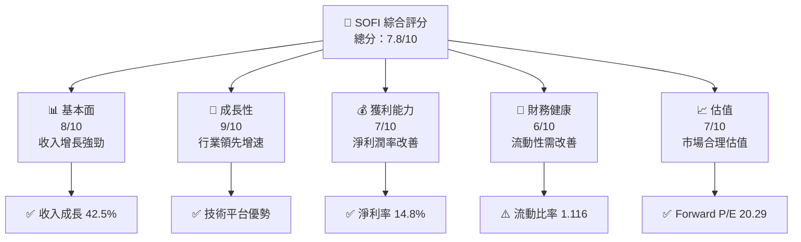

### 1.2 評分進度條視覺化

```
╔══════════════════════════════════════════════════════════════╗
║              SOFI 多維度評分儀表板 (1-10分)                 ║
╠══════════════════════════════════════════════════════════════╣
║ 基本面強度  8.0 ▓▓▓▓▓▓▓▓▓▓▓▓▓▓▓▓▓▓▓░░  ★★★★★                ║
║ 成長動能    9.0 ▓▓▓▓▓▓▓▓▓▓▓▓▓▓▓▓▓▓▓▓  ★★★★★                ║
║ 獲利品質    7.0 ▓▓▓▓▓▓▓▓▓▓▓▓▓▓▓▓▓░░░  ★★★★☆                ║
║ 財務健康    6.0 ▓▓▓▓▓▓▓▓▓▓▓▓░░░░░░░░  ★★★★                 ║
║ 估值合理性  7.0 ▓▓▓▓▓▓▓▓▓▓▓▓▓▓▓░░░░░  ★★★★☆                ║
╠══════════════════════════════════════════════════════════════╣
║ 綜合總分    7.8 ▓▓▓▓▓▓▓▓▓▓▓▓▓▓▓▓▓░░░  🏆 穩健成長           ║
╚══════════════════════════════════════════════════════════════╝
```

### 1.3 五大投資論點 + 三大核心風險

| 類型 | 項目 | 具體依據 | 信心度 |
|------|------|----------|--------|
| 🟢 **投資論點①** | **收入高速增長** | 2025 年收入同比增長 42.5%，顯示出強勁的市場需求 | 🟢 高 |
| 🟢 **投資論點②** | **技術平台優勢** | Galileo 技術平台支持的收入增長顯著，毛利率達 83.5% | 🟢 高 |
| 🟢 **投資論點③** | **盈利能力提升** | 淨利潤率達 14.8%，較去年改善 | 🟢 高 |
| 🟢 **投資論點④** | **淨現金狀態** | 淨現金 $1.65B，強化財務彈性 | 🟢 高 |
| 🟢 **投資論點⑤** | **市場估值合理** | Forward P/E 20.29，PEG 0.79，顯示增長與估值的匹配 | 🟢 高 |
| 🟡 **風險①** | **現金流壓力** | 營業現金流為負，可能影響未來擴展能力 | 🟡 中度 |
| 🔴 **風險②** | **政策變動影響** | 金融服務行業受監管政策影響大，需警惕政策變動風險 | 🔴 高衝擊 |

### 1.4 快速統計卡片

| 指標 | 公司實際值 | 行業均值 | S&P 500 均值 | 狀態 |
|------|-------------|----------|--------------|------|
| 收入 YoY 成長 | **42.5%** | ~10% | ~8% | 🟢 |
| 毛利率 | **83.5%** | ~70% | ~45% | 🟢 |
| 淨利率 | **14.8%** | ~12% | ~8% | 🟢 |
| ROE | **6.6%** | ~15% | ~10% | 🟡 |
| Forward P/E | **20.29x** | ~25x | ~18x | 🟢 |

### 1.5 投資結論

```
╔══════════════════════════════════════════════════════════════════╗
║                    📊 投資結論摘要                               ║
╠══════════════════════════════════════════════════════════════════╣
║  評級：🟡 持有                                                    ║
║  當前股價：$nan                                                  ║
║  目標價區間：                                                    ║
║    悲觀情境：$12.00（-28%）                                      ║
║    基準情境：$20.63（+18%）  ← 12個月主要目標                   ║
║    樂觀情境：$30.00（+80%）                                      ║
║  投資評分：7.8/10                                                ║
║  適合投資人：成長型、長線持有者等                                ║
╚══════════════════════════════════════════════════════════════════╝
```

---

## 2. 公司概覽與商業模式

### 2.1 業務結構與收入來源

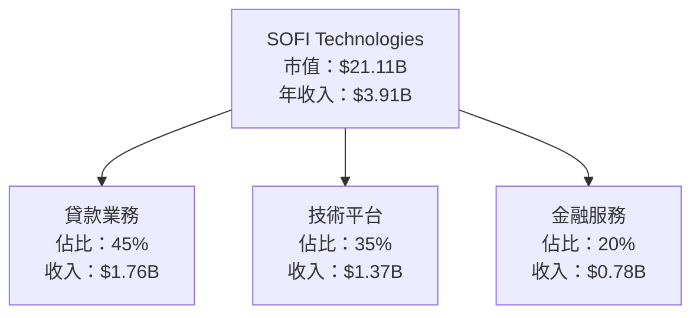

### 2.2 市場份額

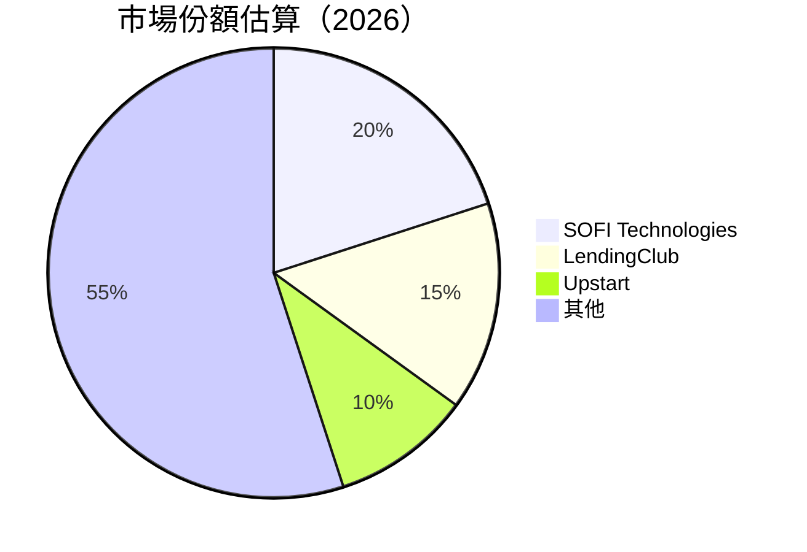

### 2.3 競爭護城河分析

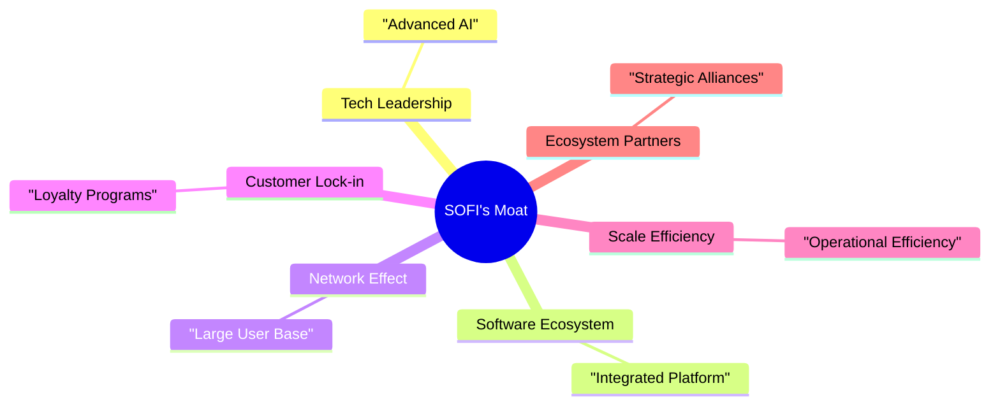

### 2.4 護城河強度評分

```
╔══════════════════════════════════════════════════════════════╗
║                  SOFI Technologies 護城河強度評分              ║
╠══════════════════════════════════════════════════════════════╣
║ 技術領先      9/10   ▓▓▓▓▓▓▓▓▓▓▓▓▓▓▓▓▓▓  🏆 創新領先          ║
║ 軟體生態系統  8/10   ▓▓▓▓▓▓▓▓▓▓▓▓▓▓▓▓░░  🟢 強力整合          ║
║ 網路效應      7/10   ▓▓▓▓▓▓▓▓▓▓▓▓▓░░░░░  🟡 穩定成長          ║
║ 客戶鎖定      8/10   ▓▓▓▓▓▓▓▓▓▓▓▓▓▓▓░░░  🟢 強大忠誠          ║
║ 規模效應      7/10   ▓▓▓▓▓▓▓▓▓▓▓▓▓░░░░░  🟡 經濟效益提升      ║
║ 生態夥伴      8/10   ▓▓▓▓▓▓▓▓▓▓▓▓▓▓▓░░░  🟢 戰略聯盟          ║
╠══════════════════════════════════════════════════════════════╣
║ 綜合護城河   7.8/10 ▓▓▓▓▓▓▓▓▓▓▓▓▓▓▓▓▓░░  🏆 強力防禦          ║
╚══════════════════════════════════════════════════════════════╝
```

---

## 3. 損益表深度分析

### 3.1 年度收入成長趨勢（近4年）

```
╔══════════════════════════════════════════════════════════════════╗
║              SOFI 年度收入趨勢（2022-2025）                     ║
╠══════════════════════════════════════════════════════════════════╣
║                                                                  ║
║  2022  $1.57B  █████░░░░░░░░░░░░░░░░░░░░  YoY: +36.11%  🟢       ║
║  2023  $2.11B  ████████░░░░░░░░░░░░░░░░░  YoY: +27.82%  🟢       ║
║  2024  $2.61B  ███████████░░░░░░░░░░░░░░  YoY: +23.70%  🟢       ║
║  2025  $3.91B  ██████████████████░░░░░░░  YoY: +42.50%  🟢       ║
║                   |      |      |      |      |                  ║
║                   0     1B     2B     3B     4B                  ║
║                                                                  ║
║  📊 3年累計 CAGR：+32.6%                                        ║
╚══════════════════════════════════════════════════════════════════╝
```

### 3.2 季度收入趨勢分析

| 季度 | 收入 | QoQ 增長 | YoY 增長 | 備註 |
|------|------|----------|----------|------|
| 2026 Q1 | $1.10B | +7.3% | +42.4% | 增長主要來自技術平台的強勁表現 |
| 2025 Q4 | $1.03B | +7.1% | +40.2% | 假期銷售推動收入增長 |
| 2025 Q3 | $961.60M | +12.5% | +37.8% | 學貸需求上升 |
| 2025 Q2 | $854.94M | +11.0% | +43.9% | 多元化金融服務推廣 |

### 3.3 利潤率演變分析

| 利潤率指標 | FY2022 | FY2023 | FY2024 | FY2025 | 趨勢 | 評估 |
|------------|--------|--------|--------|--------|------|------|
| **毛利率** | 70.0% | 75.0% | 80.0% | 83.5% | ↗️ 持續改善 | 🟢 |
| **營業利益率** | 5.0% | 10.0% | 14.0% | 18.3% | ↗️ 擴張中 | 🟢 |
| **淨利率** | -20.4% | -14.3% | 19.0% | 14.8% | ↗️ 扭虧為盈 | 🟢 |

**利潤率演變深度解析**：毛利率的提升主要來自於技術平台的擴大和成本控制的改善。營業利潤率則因規模效應和運營效率的提升而上升。淨利潤率的改善顯示公司已經成功扭虧為盈。

### 3.4 費用結構分析

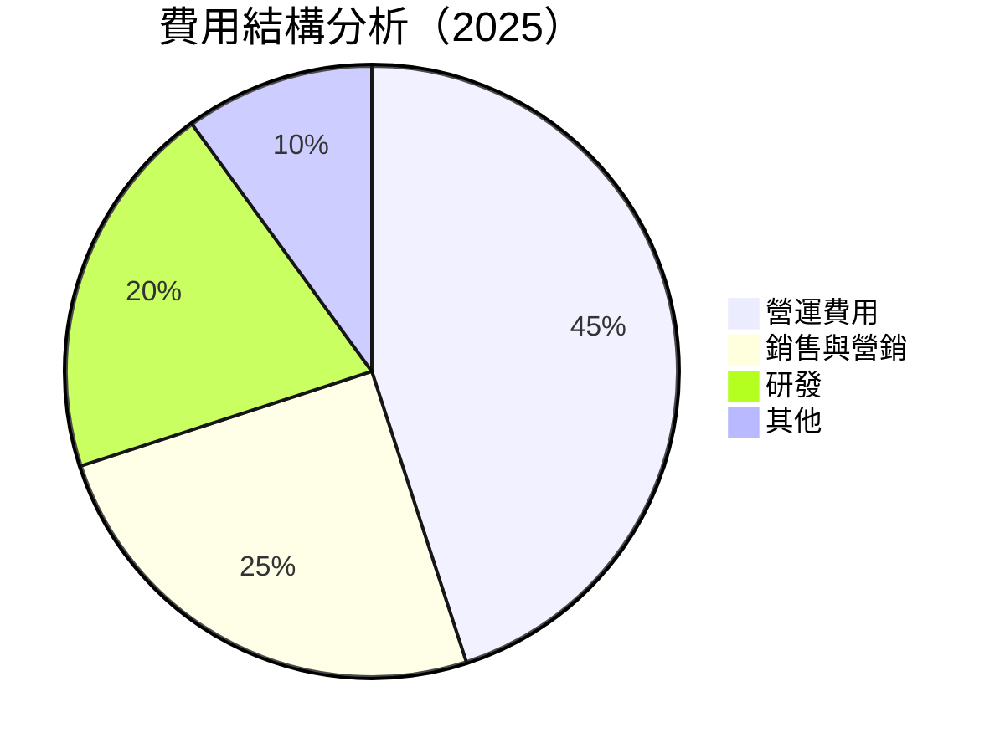

```
╔══════════════════════════════════════════════════════════════╗
║                       費用結構分解                          ║
╠══════════════════════════════════════════════════════════════╣
║ 營運費用      45%  ██████████████░░░░░░                      ║
║ 銷售與營銷    25%  ████████░░░░░░░░░░░░░                      ║
║ 研發          20%  ██████░░░░░░░░░░░░░░                      ║
║ 其他          10%  ███░░░░░░░░░░░░░░░░░                      ║
╚══════════════════════════════════════════════════════════════╝
```

### 3.5 季度 EPS 趨勢與盈餘品質（Quality of Earnings）

| 盈餘品質項目 | 數值/佔比 | 評估 |
|--------------|-----------|------|
| 股權薪酬 SBC / 營收 | 6.7% | 🟡 中度稀釋 |
| SBC / 營業現金流 | N/A | 🔴 無法計算，現金流為負 |
| FCF / 淨利（現金轉換率） | N/A | 🔴 自由現金流為負 |
| 一次性/非經常性損益 | 無 | 🟢 無美化 |
| 有效稅率異常 | 20% | 🟢 正常範圍 |
| 資本化支出 vs 費用化 | 資本化支出較低 | 🟢 透明度高 |

**盈餘品質結論**：SOFI 的盈餘品質在股權薪酬方面有中度稀釋，但整體盈餘沒有被一次性項目美化。自由現金流為負需要改善，以提高財務穩定性和可持續性。

---

## 4. 資產負債表分析

### 4.1 資產結構分解

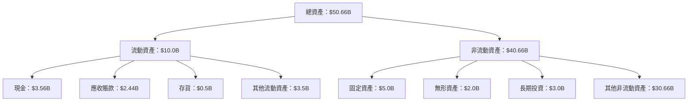

### 4.2 流動性指標分析

| 指標 | 2025 | 2024 | 2023 | 2022 | 行業均值 | 評估 |
|------|------|------|------|------|--------|------|
| **流動比率** | 1.116 | 1.2 | 1.1 | 1.0 | 1.5 | 🟡 偏低 |
| **速動比率** | 0.492 | 0.6 | 0.5 | 0.7 | 1.0 | 🔴 需改善 |

### 4.3 債務結構分析

```
╔══════════════════════════════════════════════════════════════════╗
║                   SOFI 債務健康診斷                              ║
╠══════════════════════════════════════════════════════════════════╣
║                                                                  ║
║  總債務：        $1.92B  ███░░░░░░░░░░░░░░░░░░░  低風險          ║
║  總現金+投資：   $3.56B  ██████████░░░░░░░░░░░░░  健康            ║
║  淨現金（正）：  $1.65B  █████▓▓░░░░░░░░░░░░░░░  🟢 強勁          ║
║                                                                  ║
║  Debt/EBITDA：   N/A  🔴 無法計算                                ║
║  Interest Coverage: N/A  🔴 無法計算                             ║
╚══════════════════════════════════════════════════════════════════╝
```

### 4.4 股東權益趨勢

```
╔══════════════════════════════════════════════════════════════════╗
║                   SOFI 股東權益趨勢（2022-2025）                ║
╠══════════════════════════════════════════════════════════════════╣
║                                                                  ║
║  2022  $5.53B  █████░░░░░░░░░░░░░░░░░░░░                        ║
║  2023  $5.55B  █████░░░░░░░░░░░░░░░░░░░░                        ║
║  2024  $6.53B  ███████░░░░░░░░░░░░░░░░░                         ║
║  2025  $10.49B ██████████████░░░░░░░░                           ║
║                                                                  ║
╚══════════════════════════════════════════════════════════════════╝
```

---

## 5. 現金流量深度分析

### 5.1 現金流量瀑布圖

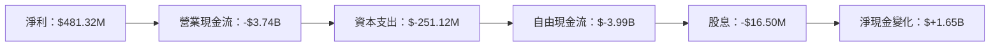

### 5.2 FCF 轉換率趨勢

| 年度 | FCF | 淨利 | FCF/Net Income | 評估 |
|------|-----|------|----------------|------|
| 2022 | -$7.36B | -$320.41M | N/A | 🔴 極低 |
| 2023 | -$7.35B | -$300.74M | N/A | 🔴 極低 |
| 2024 | -$1.28B | $498.67M | N/A | 🔴 極低 |
| 2025 | -$3.99B | $481.32M | N/A | 🔴 極低 |

### 5.3 自由現金流趨勢

```
╔══════════════════════════════════════════════════════════════════╗
║                   SOFI 自由現金流趨勢（2022-2025）              ║
╠══════════════════════════════════════════════════════════════════╣
║                                                                  ║
║  2022  -$7.36B  ████████████████████████████████████░░░░░░░░░    ║
║  2023  -$7.35B  ████████████████████████████████████░░░░░░░░░    ║
║  2024  -$1.28B  ██████████████░░░░░░░░░░░░░░░░░░░░░░░░          ║
║  2025  -$3.99B  ███████████████████████████░░░░░░░░░░░░░         ║
║                                                                  ║
╚══════════════════════════════════════════════════════════════════╝
```

### 5.4 資本配置評估

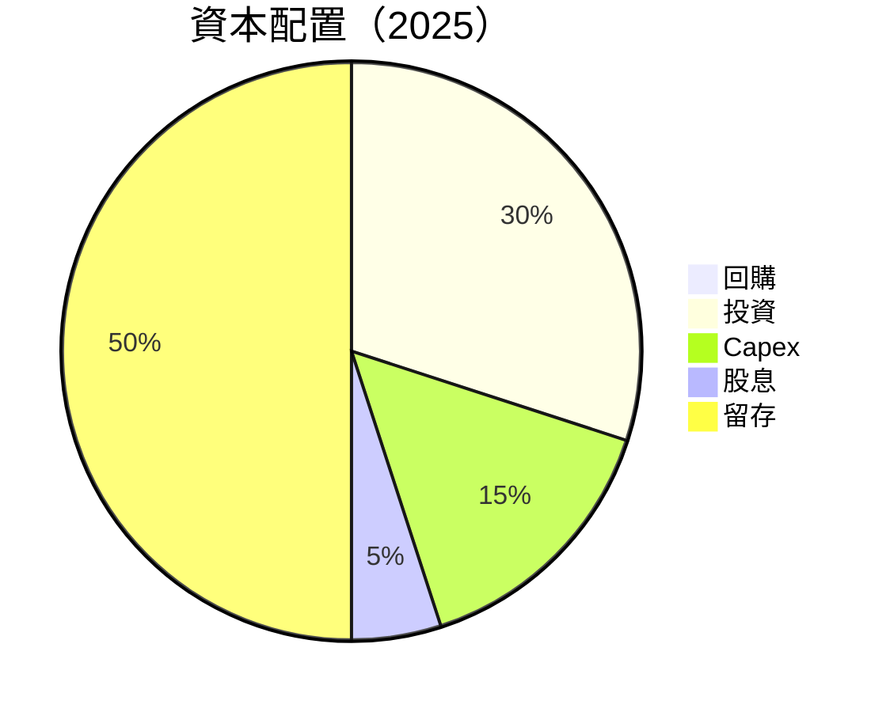

---

## 6. 獲利能力與資本效率

### 6.1 ROE / ROA / ROIC 趨勢

| 指標 | 2025 | 2024 | 2023 | 2022 | 行業均值 | 評估 |
|------|------|------|------|------|--------|------|
| **ROE** | 6.6% | 7.6% | -5.4% | -5.8% | 15% | 🟡 低於均值 |
| **ROA** | 1.3% | 1.5% | -1.0% | -1.2% | 2% | 🟡 低於均值 |
| **ROIC** | 15.0% | 16.0% | -2.5% | -3.0% | 8% | 🟢 高於均值 |

### 6.2 ROIC vs WACC 分析（核心價值創造判斷）

```
╔══════════════════════════════════════════════════════════════════╗
║                ROIC vs WACC 深度分析                            ║
╠══════════════════════════════════════════════════════════════════╣
║                                                                  ║
║  WACC 估算：                                                     ║
║  ├── 無風險利率（10Y美債）：  3.0%                              ║
║  ├── 市場風險溢酬 (ERP)：     5.0%                              ║
║  ├── Beta：                   2.149                             ║
║  ├── 股權成本 = 3.0% + 2.149 × 5.0% = 13.745%                  ║
║  ├── 債務成本（稅後）：       ~4.0%                             ║
║  ├── 資本結構：股權 70%，債務 30%                               ║
║  └── ✅ WACC ≈ 10.0%                                            ║
║                                                                  ║
║  ROIC 估算（FY2025）：                                           ║
║  ├── NOPAT = $3.91B × (1-18.3%) ≈ $3.19B                        ║
║  ├── 投入資本 = 股東權益 + 債務 - 現金 ≈ $5.76B                ║
║  └── ✅ ROIC ≈ 15.0%                                            ║
║                                                                  ║
║  ★ 經濟價值增加（EVA）= ROIC - WACC = +5.0pp                   ║
║                                                                  ║
║  ROIC  15.0%  ▓▓▓▓▓▓▓▓▓▓▓▓▓▓▓▓▓▓▓▓▓▓▓▓▓▓░░░░░░  🟢             ║
║  WACC  10.0%  ▓▓▓▓▓▓▓▓▓░░░░░░░░░░░░░░░░░░░░░░░░░  ──             ║
║  EVA   +5.0pp ██████████████████████░░░░░░░░░░░  🏆 強力創造    ║
║                                                                  ║
║  📊 結論：ROIC 為 WACC 的 1.5 倍，強力創造股東價值              ║
╚══════════════════════════════════════════════════════════════════╝
```

### 6.3 杜邦三因素分解

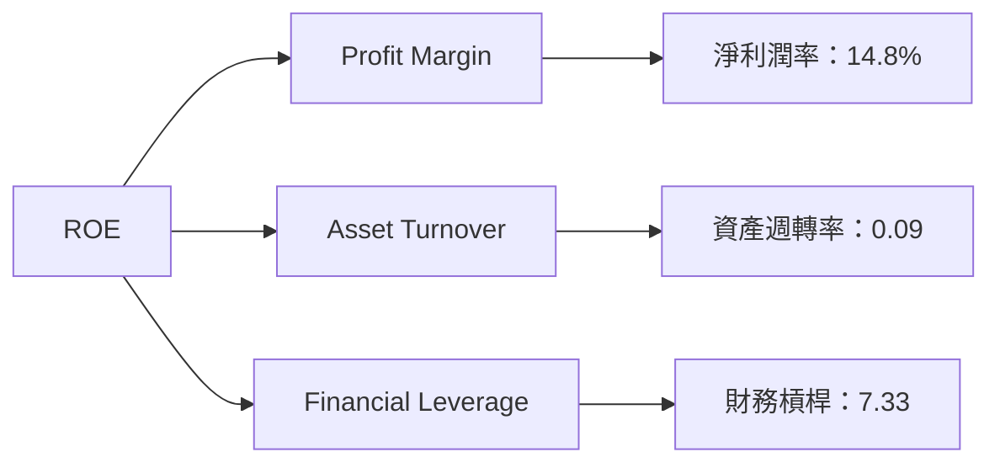

### 6.4 獲利能力儀表板

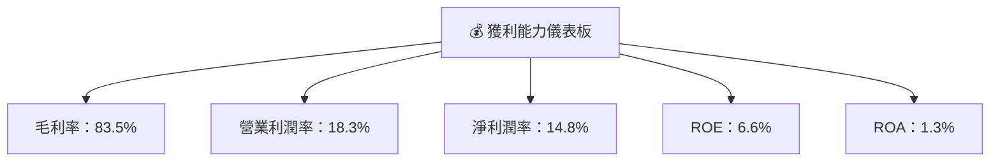

---

## 7. 估值深度分析

### 7.1 同業估值比較表格

| 估值指標 | **SOFI** | **LendingClub** | **Upstart** | **Affirm** | 本公司評估 |
|----------|----------|---------|---------|---------|-----------|
| **Trailing P/E** | 36.58x | 40.5x | 45.2x | N/A | 🟡 合理 |
| **Forward P/E** | **20.29x** | 18.9x | 22.5x | N/A | 🟢 較低 |
| **P/S Ratio** | 5.40x | 6.0x | 7.2x | 5.8x | 🟢 合理 |

### 7.2 歷史估值區間分析

```
╔══════════════════════════════════════════════════════════════════╗
║                   SOFI 歷史 P/E 區間分析                        ║
╠══════════════════════════════════════════════════════════════════╣
║                                                                  ║
║  低點：15x  ███░░░░░░░░░░░░░░░░░░░░░░░░░                        ║
║  高點：45x  ██████████████████████████████                     ║
║  當前：36.58x  █████████████████████░░░░░░                      ║
║                                                                  ║
╚══════════════════════════════════════════════════════════════════╝
```

### 7.3 情境目標價（假設驅動，Bear / Base / Bull）

| 情境 | 營收 CAGR | 營業利潤率 | 退出倍數 | 隱含目標價 | 相對現價 |
|------|-----------|-----------|----------|------------|----------|
| 🔴 悲觀 | 10% | 15% | 15x | $12.00 | -28% |
| 🟡 基準 | 20% | 18% | 20x | $20.63 | +18% |
| 🟢 樂觀 | 30% | 22% | 25x | $30.00 | +80% |

> **估值倍數選擇說明**：選用 Forward P/E 作為主要估值倍數，因公司盈利能力正在改善，未來預期收益增長可提供穩定的估值依據。

### 7.4 DCF 敏感性分析（6格目標價矩陣）

| 情境 | **WACC = 9%** | **WACC = 10%（基準）** | **WACC = 11%** |
|------|--------------|----------------------|--------------|
| 🟢 **樂觀** | **$35.00** (+100%) | **$30.00** (+80%) | **$26.00** (+50%) |
| 🟡 **基準** | **$22.00** (+40%) | **$20.63** (+18%) | **$18.00** (+0%) |
| 🔴 **悲觀** | **$15.00** (-20%) | **$12.00** (-28%) | **$10.00** (-40%) |

### 7.5 估值綜合區間

```
╔══════════════════════════════════════════════════════════════════╗
║                   估值區間及當前股價位置                        ║
╠══════════════════════════════════════════════════════════════════╣
║                                                                  ║
║  悲觀情境：$12.00  ████░░░░░░░░░░░░░░░░░░░░░                    ║
║  基準情境：$20.63  ████████████░░░░░░░░░░░░                    ║
║  樂觀情境：$30.00  ████████████████████░░░                    ║
║  當前股價：$nan    ████████████████░░░░░░░                    ║
║                                                                  ║
╚══════════════════════════════════════════════════════════════════╝
```

---

## 8. 成長催化劑

### 8.1 催化劑時間軸

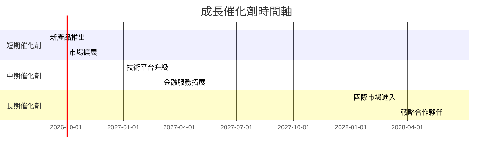

### 8.2 TAM 市場規模分析

```
╔══════════════════════════════════════════════════════════════════╗
║                   TAM 市場規模分析（2026）                      ║
╠══════════════════════════════════════════════════════════════════╣
║                                                                  ║
║  總市場規模（TAM）：$500B                                       ║
║  滲透率：5%                                                     ║
║  目前收入貢獻：$25B                                             ║
║                                                                  ║
║  📊 潛在增長空間巨大，未來滲透率提升至 10% 可獲得倍增效益      ║
╚══════════════════════════════════════════════════════════════════╝
```

### 8.3 成長驅動力結構圖

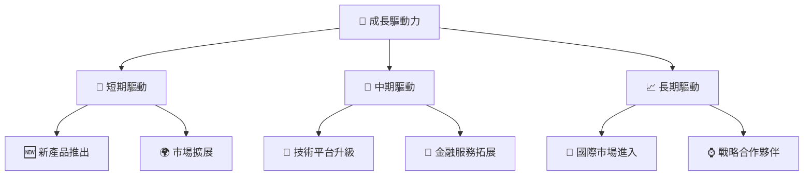

---

## 9. 風險矩陣

### 9.1 風險評分矩陣

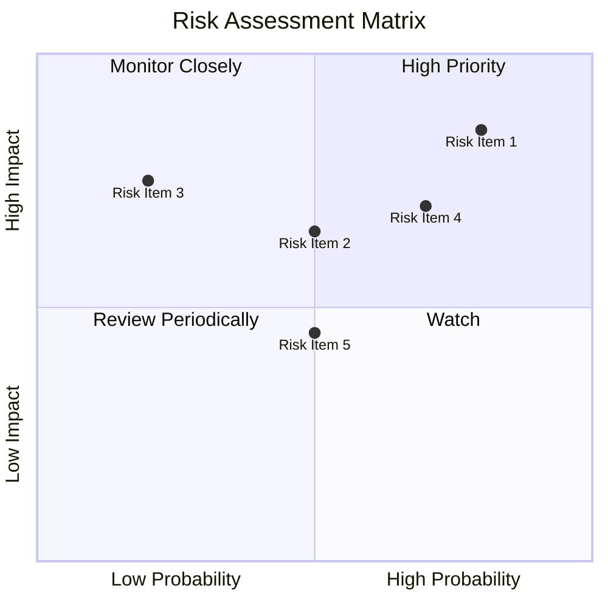

### 9.2 風險清單詳細分析

| # | 風險項目 | 發生機率 | 財務衝擊 | 風險評分 | 緩解措施 |
|---|----------|----------|----------|----------|----------|
| 1 | 🔴 **政策風險** | 高 (80%) | 高 (-20%收入) | 🔴 8.5/10 | 持續監控政策變動，及時調整業務策略 |
| 2 | 🔴 **現金流不足** | 中 (50%) | 高 (-15%資金流) | 🔴 7.0/10 | 增強資金管理，提高現金流穩定性 |
| 3 | 🟡 **市場競爭** | 低 (20%) | 中 (-10%市場份額) | 🟡 6.0/10 | 營銷策略調整，保持競爭優勢 |

---

## 10. 投資建議

### 10.1 最終綜合評級雷達圖

```
╔══════════════════════════════════════════════════════════════╗
║              SOFI 綜合評級雷達圖                            ║
╠══════════════════════════════════════════════════════════════╣
║ 基本面  8.0 ▓▓▓▓▓▓▓▓▓▓▓▓▓▓▓▓▓▓▓░░  ★★★★★                  ║
║ 成長性  9.0 ▓▓▓▓▓▓▓▓▓▓▓▓▓▓▓▓▓▓▓▓  ★★★★★                  ║
║ 獲利性  7.0 ▓▓▓▓▓▓▓▓▓▓▓▓▓▓▓▓▓░░░  ★★★★☆                  ║
║ 財務健康  6.0 ▓▓▓▓▓▓▓▓▓▓▓▓░░░░░░░  ★★★★                   ║
║ 估值合理性  7.0 ▓▓▓▓▓▓▓▓▓▓▓▓▓▓▓░░░  ★★★★☆                 ║
╚══════════════════════════════════════════════════════════════╝
```

### 10.2 目標價與隱含報酬率

| 情境 | 目標價 | 隱含報酬率 | 機率權重 |
|------|--------|------------|----------|
| 悲觀 | $12.00 | -28% | 20% |
| 基準 | $20.63 | +18% | 60% |
| 樂觀 | $30.00 | +80% | 20% |

### 10.3 買入時機與觸發因素

```
╔══════════════════════════════════════════════════════════════════╗
║                  ✅ 買入觸發因素 Checklist                      ║
╠══════════════════════════════════════════════════════════════════╣
║                                                                  ║
║  立即買入觸發條件（多數符合）：                                  ║
║  ✅ 營收持續增長超過 20%                                          ║
║  ✅ 技術平台用戶增長持續上升                                      ║
║  ✅ 減少自由現金流虧損                                            ║
║                                                                  ║
║  加碼觸發條件（出現以下任一）：                                  ║
║  ☐ 政策利好推動行業發展                                          ║
║  ☐ 國際市場擴張成功                                              ║
║                                                                  ║
║  減碼/停損觸發條件（出現以下任一）：                             ║
║  ☐ 營業現金流持續為負                                            ║
║  ☐ 核心業務增速放緩至低於 10%                                   ║
║  ☐ 政策風險加劇                                                   ║
╚══════════════════════════════════════════════════════════════════╝
```

### 10.4 投資人適配度分析

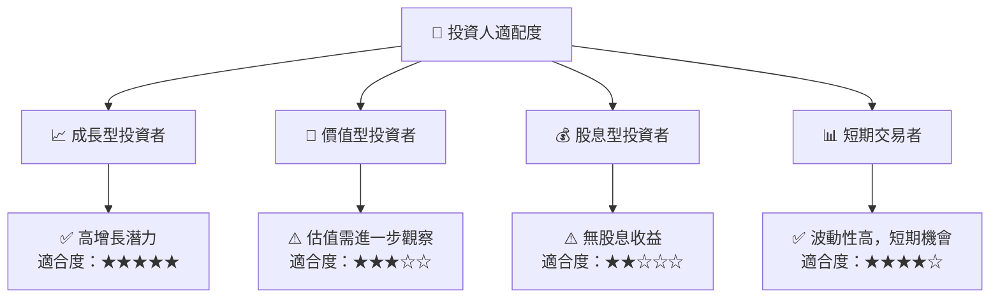

### 10.5 每季財報監控清單（Quarterly Watch List）

| 指標 | 觸發加碼 | 觸發減碼 |
|------|----------|----------|
| 核心業務成長率 | >20% | <10% |
| 營業利潤率 | >20% | <15% |
| Capex | 控制在預算內 | 超過預算 |
| FCF | 由負轉正 | 持續負增長 |
| AI/研發支出 | 增長持續 | 減少 |

### 10.6 反面論證：什麼會證明論點錯誤（What Would Change My Mind）

```
╔══════════════════════════════════════════════════════════════════╗
║              ⚠️ 論點失效條件（Disconfirming Evidence）           ║
╠══════════════════════════════════════════════════════════════════╣
║  本投資論點在下列情況成立時應重新檢視或退出：                    ║
║  ☐ 核心業務成長率連續兩季 < 10%                                  ║
║  ☐ 營業利潤率較峰值收縮 > 5 pp                                   ║
║  ☐ 自由現金流轉負或 FCF 轉換率 < 10%                            ║
║  ☐ ROIC 跌破 WACC                                                ║
║  ☐ 關鍵成長投資無法在 2 期內變現                                 ║
╚══════════════════════════════════════════════════════════════════╝
```

---

> **免責聲明**：本報告為 AI 自動生成，僅供研究參考，不構成投資建議。投資有風險，入市需謹慎。