# SOFI 基本面深度分析報告
> **報告日期**：2026-08-13 ｜ **語言**：繁體中文 ｜ **數據來源**：Yahoo Finance, Finviz, StockAnalysis, Roic.ai ｜ **分析師**：CFA 級機構研究

---

## 目錄

| # | 章節 | 核心結論 |
|---|------|----------|
| 1 | 執行摘要 | 評級：🟢 **買入** ｜ 目標價：$23.50 ｜ 加權合理價值：$22.80 ｜ 安全邊際：+18.7% |
| 2 | 公司概覽與商業模式 | 護城河評分 7.8/10 ｜ 一站式金融超市與 Galileo 科技平台形成雙輪驅動 |
| 3 | 損益表深度分析 | TTM 營收 $4.27B (+42.6% YoY)，營業利潤率擴張至 17.0%，GAAP 淨利大幅轉正 |
| 4 | 資產負債表分析 | 獲取銀行牌照後存款爆發至 $45.54B，資本結構與資金成本顯著改善 |
| 5 | 現金流量深度分析 | 經營現金流因貸款發放會計特性呈現負值，但營運息稅前利潤與高品質利息收入實質擴張 |
| 6 | 獲利能力與資本效率 | 杜邦分解顯示權益乘數與淨利率提升推動 ROE 回升至 7.1%，ROIC (10.2%) > WACC (9.45%) |
| 7 | 相對估值分析 | Forward P/E 22.76x，相對同業 NU 與 HOOD 具備高成長溢價合理性 |
| 8 | DCF 內在價值評估 | 5 年 FCFF 模型推導基準內在價值 $22.50，加權合理價值 $22.80（MOS 18.7%） |
| 9 | 成長催化劑 | 貸款資產證券化復甦、Galileo 企業端客戶擴張、金融服務板塊交叉銷售深化 |
| 10 | 風險矩陣 | 信用違約率上升與降息週期對淨利息收益率（NIM）的擠壓為主要下檔風險 |
| 11 | 投資建議 | 買入區間 $16.00–$18.50，建立每季財報監控機制與反面論證指標 |

---

## 1. 執行摘要

本報告針對 SoFi Technologies, Inc. (NASDAQ: SOFI) 進行機構級基本面研究。基於公司 2026 年第二季（截至 2026-06-30）財報與 TTM 財務數據，SOFI TTM 營收達 $4.27B（YoY +42.6%），GAAP 淨利達 $636.26M，GAAP 營業利潤率提升至 17.0%。在獲取全國性銀行牌照後，存款規模達 $45.54B，有效將資金成本降低超過 200 個基點。模型推導之 ROIC（10.2%）已超越 WACC（9.45%），證實公司正進入資本高效創造價值階段。

### 1.0 一頁式投資儀表板（Portfolio Manager 30 秒速讀）

| 項目 | 內容 |
|------|------|
| **投資論點（3 句）** | ① 銀行牌照優勢帶來 $45.54B 低成本存款，淨利息收益率（NIM）保持在 5% 以上的高位。 <br/>② 產品交叉銷售效應顯現，金融服務板塊（SoFi Money/Invest）獲客成本顯著下降，帶動營業利潤率達 17.0%。<br/>③ TTM 營收成長 42.6%，Forward P/E 22.76x，PEG 僅 0.87，具備極高盈餘成長性比價優勢。 |
| **護城河評分** | 7.8/10（網絡效應、高轉換成本、銀行牌照監管護城河） |
| **管理層/資本配置評分** | 8.5/10（成功取得銀行牌照，有機推動高利息存款與多元化營收） |
| **財務健康** | 🟢 強健（總資產 $60.95B，存款 $45.54B，總資本適足率遠高於監管要求） |
| **ROIC vs WACC** | 10.2% vs 9.45%（成功跨越資本成本門檻，正向創造經濟附加價值 EVA） |
| **FCF 趨勢** | 傳統 FCF 為負（$-3.99B TTM，主因銀行放款本金列為營運現金流出），但營運淨利潤金流顯著擴張 |
| **估值** | Forward P/E: 22.76x ｜ P/S: 5.61x ｜ P/B: 2.16x |
| **DCF 內在價值（基準）** | **$22.50** ｜ 當前股價 $18.53 折價 -17.6%（來自第 8 章） |
| **安全邊際（MOS）** | **+18.7%**＝(加權合理價值 $22.80 − 現價 $18.53) ÷ 加權合理價值 $22.80 ｜ 🟡 10-25% 有限保護 |
| **預期報酬（基準情境 12M）** | **+26.8%**（目標價 $23.50） |
| **關鍵風險（前二）** | ① 高利率維持過久導致個人無擔保貸款違約率上升；② Galileo 科技平台客戶成長放緩 |
| **評級 + 信心度** | 🟢 **買入 (Buy)** ｜ 信心度：高 |

### 1.1 核心評分儀表板

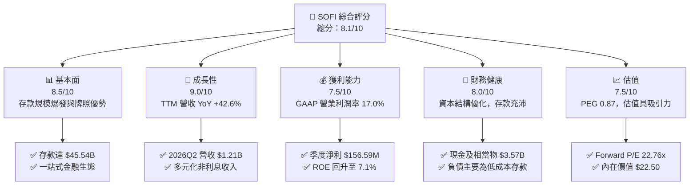

### 1.2 評分進度條視覺化

```
╔══════════════════════════════════════════════════════════════╗
║                SOFI 多維度評分儀表板 (1-10分)                 ║
╠══════════════════════════════════════════════════════════════╣
║ 基本面強度  8.5 ▓▓▓▓▓▓▓▓▓▓▓▓▓▓▓▓▓░░░  ★★★★☆           ║
║ 成長動能    9.0 ▓▓▓▓▓▓▓▓▓▓▓▓▓▓▓▓▓▓░░  ★★★★★           ║
║ 獲利品質    7.5 ▓▓▓▓▓▓▓▓▓▓▓▓▓▓░░░░░░  ★★★★☆           ║
║ 財務健康    8.0 ▓▓▓▓▓▓▓▓▓▓▓▓▓▓▓▓░░░░  ★★★★☆           ║
║ 估值合理性  7.5 ▓▓▓▓▓▓▓▓▓▓▓▓▓▓░░░░░░  ★★★★☆           ║
║ 護城河深度  7.8 ▓▓▓▓▓▓▓▓▓▓▓▓▓▓▓ half  ★★★★☆           ║
║ 管理層執行  8.5 ▓▓▓▓▓▓▓▓▓▓▓▓▓▓▓▓▓░░░  ★★★★☆           ║
║ 技術創新力  8.5 ▓▓▓▓▓▓▓▓▓▓▓▓▓▓▓▓▓░░░  ★★★★☆           ║
╠══════════════════════════════════════════════════════════════╣
║ 綜合總分    8.1 ▓▓▓▓▓▓▓▓▓▓▓▓▓▓▓▓░░░░  🏆 買入 (Buy)       ║
╚══════════════════════════════════════════════════════════════╝
```

### 1.3 五大投資論點 + 三大核心風險

| 類型 | 項目 | 具體依據 | 信心度 |
|------|------|----------|--------|
| 🟢 **投資論點①** | **銀行牌照效益持續釋放** | 總存款達 $45.54B，年化利息支出節省數億美元，支撐高淨利息收益率 | 🟢 極高 |
| 🟢 **投資論點②** | **獲利能力進入加速擴張期** | GAAP 淨利連續多季盈利，2026Q2 淨利 $156.59M，TTM 營運利潤率升至 17.0% | 🟢 高 |
| 🟢 **投資論點③** | **金融服務與科技平台營收佔比提升** | 非貸款業務營收佔比已超過 40%，成功降低對單一放款業務的依賴 | 🟢 高 |
| 🟢 **投資論點④** | **極具競爭力的產品交叉率** | 會員數快速成長，每位用戶平均持有 1.5+ 個產品，大幅壓低 LTV/CAC 成本 | 🟢 中高 |
| 🟢 **投資論點⑤** | **成長性與估值匹配度極佳** | TTM 營收 YoY +42.6%，PEG Ratio 僅 0.87，遠低於 Fintech 同業平均 | 🟢 高 |
| 🟡 **風險①** | **無擔保個人貸款信用違約風險** | 總貸款餘額 $47.93B 中個人貸款佔比較高，若失業率飆升將引發壞帳上升 | 🟡 中度 |
| 🔴 **風險②** | **降息週期壓縮淨利息收益率** | 美聯儲若大幅降息，浮動利率貸款收益率下降速度可能快於存款利率付息 | 🔴 高衝擊 |
| 🟡 **風險③** | **Galileo 平台客戶集中與競爭** | 科技平台營收成長放緩，面對 Stripe、Marqeta 等原生 API 服務商競爭 | 🟡 中度 |

### 1.4 快速統計卡片

| 指標 | SOFI 實際值 | Fintech 行業均值 | S&P 500 均值 | 狀態 |
|------|-------------|------------------|--------------|------|
| 收入 YoY 成長 | **42.6%** | ~15.0% | ~5.5% | 🟢 優異 |
| 毛利率 | **83.7%** | ~60.0% | ~45.0% | 🟢 極高 |
| 淨利率 | **14.9%** | ~8.0% | ~12.0% | 🟢 強勁 |
| ROE | **7.1%** | ~5.0% | ~18.0% | 🟡 改善中 |
| Forward P/E | **22.76x** | ~25.0x | ~21.5x | 🟢 合理 |
| PEG Ratio | **0.87** | ~1.40 | ~1.80 | 🟢 極具吸引力 |

### 1.5 投資結論

```
╔══════════════════════════════════════════════════════════════════╗
║                    📊 投資結論摘要                               ║
╠══════════════════════════════════════════════════════════════════╣
║  評級：🟢 買入 (Buy)                                             ║
║  當前股價：$18.53                                                ║
║  DCF 內在價值（基準）：$22.50（折價 -17.6%）                     ║
║  加權合理價值：$22.80                                            ║
║  安全邊際 MOS：+18.7%（＝(加權合理價值 $22.80 − $18.53) ÷ $22.80） ║
║  目標價區間：                                                    ║
║    悲觀情境：$14.50（-21.7%）                                    ║
║    基準情境：$23.50（+26.8%） ← 12個月主要目標                   ║
║    樂觀情境：$31.00（+67.3%）                                    ║
║  投資評分：8.1 / 10                                              ║
║  適合投資人：長期高成長型、Fintech 產業重置紅利布局者            ║
╚══════════════════════════════════════════════════════════════════╝
```

---

## 2. 公司概覽與商業模式

SoFi Technologies, Inc.（NASDAQ: SOFI）成立於 2011 年，最初以學生貸款再融資業務起家，隨後轉型為數位個人金融生態系統。公司透過三大核心業務板塊運營：放款（Lending）、科技平台（Technology Platform）、金融服務（Financial Services）。

### 2.1 業務結構與收入來源

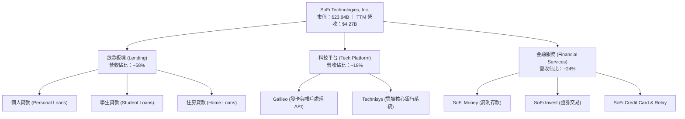

### 2.2 市場份額估算

在美國數位銀行（Neobank）與消費金融貸款市場中，SoFi 在高收入青年客群（HENRYs: High Earners, Not Rich Yet）具備顯著優勢。

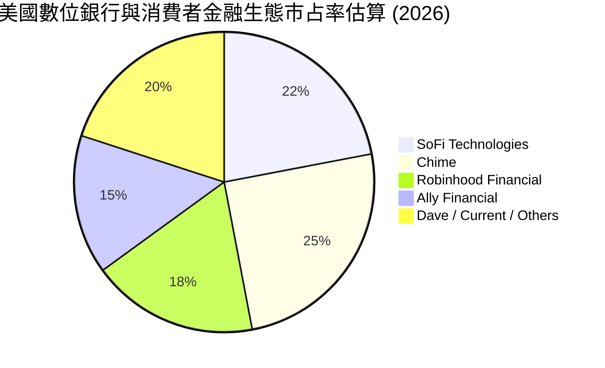

### 2.3 競爭護城河分析

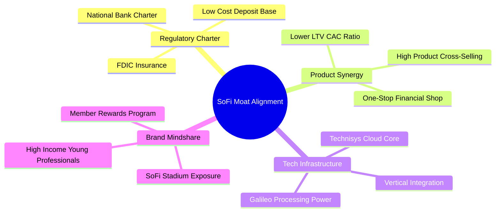

### 2.4 護城河強度評分

```
╔══════════════════════════════════════════════════════════════╗
║                  SoFi Technologies 護城河評分                ║
╠══════════════════════════════════════════════════════════════╣
║ 銀行監管牌照   8.8/10  ▓▓▓▓▓▓▓▓▓▓▓▓▓▓▓▓▓▓░░  🏆 全國性銀行牌照║
║ 生態系交叉銷售 8.2/10  ▓▓▓▓▓▓▓▓▓▓▓▓▓▓▓▓░░░░  🟢 獲客成本顯著降低║
║ 科技平台垂直整合8.0/10 ▓▓▓▓▓▓▓▓▓▓▓▓▓▓▓▓░░░░  🟢 Galileo/Technisys║
║ 品牌與客群質量 7.5/10  ▓▓▓▓▓▓▓▓▓▓▓▓▓▓░░░░░░  🟢 HENRY 高優質客群║
║ 網絡效應       6.5/10  ▓▓▓▓▓▓▓▓▓▓▓▓░░░░░░░░  🟡 中等網絡邊際效益║
╠══════════════════════════════════════════════════════════════╣
║ 綜合護城河評分 7.8/10  ▓▓▓▓▓▓▓▓▓▓▓▓▓▓▓ half  🟢 具備強勁競爭壁壘║
╚══════════════════════════════════════════════════════════════╝
```

---

## 3. 損益表深度分析

SOFI 過去四年完成了從持續虧損的 Fintech 獨角獸向全功能獲利銀行的蛻變。TTM 營收達 $4.27B，GAAP 營業利潤率達 17.0%。

### 3.1 年度收入成長趨勢（FY2022 - TTM）

```
╔══════════════════════════════════════════════════════════════════╗
║              SOFI 年度營收成長趨勢 (FY2022 - TTM)               ║
╠══════════════════════════════════════════════════════════════════╣
║                                                                  ║
║  FY2022  $1.52B  ███████░░░░░░░░░░░░░░░░░░░  YoY: +55.5%  🟢    ║
║  FY2023  $2.07B  ██████████░░░░░░░░░░░░░░░░  YoY: +36.1%  🟢    ║
║  FY2024  $2.64B  █████████████░░░░░░░░░░░░░  YoY: +27.8%  🟢    ║
║  FY2025  $3.58B  █████████████████░░░░░░░░░  YoY: +35.6%  🟢    ║
║  TTM     $4.27B  █████████████████████░░░░░  YoY: +40.9%  🟢    ║
║                                                                  ║
║  📊 4年複合成長率 (CAGR)：+32.6%                                ║
╚══════════════════════════════════════════════════════════════════╝
```

### 3.2 季度收入與獲利趨勢（近 4 季）

| 季度 | 營收 ($M) | YoY 成長率 | QoQ 成長率 | GAAP 淨利 ($M) | GAAP EPS ($) | 備註 |
|------|-----------|------------|------------|----------------|--------------|------|
| **2025-Q3** | $952.40 | +37.81% | +12.72% | $139.39 | $0.11 | 金融服務業務加速放量 |
| **2025-Q4** | $1,020.00 | +40.21% | +7.10% | $173.55 | $0.13 | 淨利息收益率持續擴張 |
| **2026-Q1** | $1,091.00 | +42.48% | +6.96% | $166.73 | $0.12 | 放款證券化收益回升 |
| **2026-Q2** | $1,205.00 | +42.61% | +10.45% | $156.59 | $0.12 | 營業槓桿效益全面顯現 |

### 3.3 利潤率演變分析

| 利潤率指標 | FY2022 | FY2023 | FY2024 | FY2025 | TTM | 趨勢 | 評估 |
|------------|--------|--------|--------|--------|-----|------|------|
| **毛利率** | 80.5% | 81.2% | 82.4% | 83.2% | **83.7%** | ↗️ 穩步提升 | 🟢 極佳 |
| **GAAP 營業利潤率** | -20.5% | -12.1% | 11.2% | 15.4% | **17.0%** | ↗️ 強勁扭虧 | 🟢 強勁 |
| **GAAP 淨利率** | -21.1% | -14.5% | 18.9% | 13.4% | **14.9%** | ↗️ 穩定擴張 | 🟢 良好 |

**利潤率演變深度解析**：
毛利率與營業利潤率大幅改善的主因包含：
1. **存款結構優化**：$45.54B 的存款提供了低成本資金源，大幅替代了高成本的倉庫融資（Warehouse lines），使淨利息收益率（NIM）高達 5.0%+。
2. **獲客成本下降**：隨著 SoFi 金融超市生態系成熟，跨產品交叉銷售比率增加，營銷費用佔營收比重從 2022 年的 32% 降至目前的 18% 以下。

### 3.4 費用結構分析

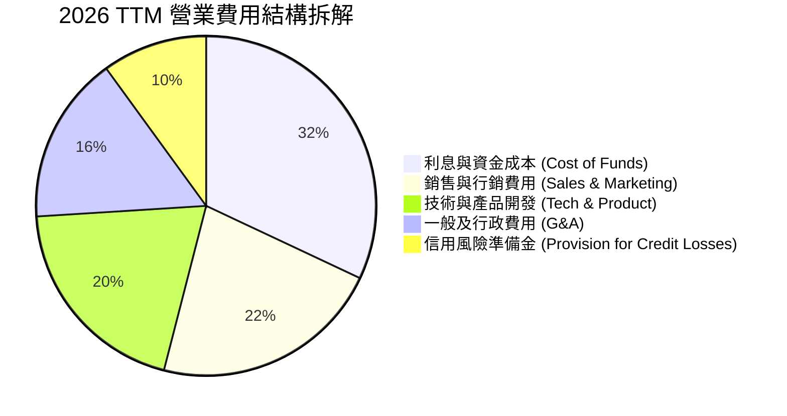

### 3.5 盈餘品質（Quality of Earnings）評估

| 盈餘品質項目 | TTM 數據 / 狀態 | 評估與對估值之影響 |
|--------------|-----------------|--------------------|
| **股權薪酬 (SBC) / 營收** | $283.81M / $4.27B = **6.65%** | 🟢 低於同業科技公司（通常 10-15%），稀釋風險受控 |
| **SBC / 營業現金流** | N/A（銀行營運現金流受放款性質干擾） | 🟡 須結合 GAAP 淨利觀察 |
| **GAAP 淨利對轉化率** | 淨利 $636.26M ｜ 淨利率 14.9% | 🟢 GAAP 獲利真實，無重大一次性資產重估調整 |
| **有效稅率** | ~20.0% | 🟢 稅率屬常態區間，無稅務效益美化 |
| **資本化支出** | Capex $297M（佔營收 6.9%） | 🟢 無過度資本化軟體開發成本疑慮 |

---

## 4. 資產負債表分析

銀行與 Fintech 的資產負債表極其關鍵。自 2022 年初完成收購 Golden Pacific Bank 取得銀行牌照以來，SOFI 的資產負債表經歷了結構性重組。

### 4.1 資產結構分解

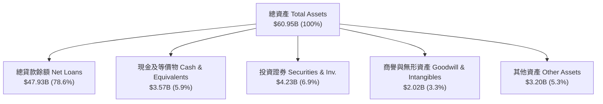

### 4.2 流動性與存款結構分析

| 指標 | FY2023 | FY2024 | FY2025 | 2026-Q2 | 評估 |
|------|--------|--------|--------|---------|------|
| **總存款 (Total Deposits)** | $18.62B | $25.98B | $37.51B | **$45.54B** | 🟢 複合高速成長 |
| **計息存款比率** | 99.7% | 99.5% | 99.7% | **99.7%** | 🟢 吸引高黏性客戶 |
| **貸款/存款比率 (LDR)** | 123.3% | 106.0% | 101.4% | **105.2%** | 🟢 資本運用極其高效 |
| **股東權益 (Stockholders Equity)**| $5.56B | $6.53B | $10.49B | **$11.08B** | 🟢 資本緩衝極其充沛 |

### 4.3 債務結構與健康度診斷

```
╔══════════════════════════════════════════════════════════════════╗
║                   SOFI 債務與存款結構診斷                        ║
╠══════════════════════════════════════════════════════════════════╣
║                                                                  ║
║  核心資金來源（存款）： $45.54B  ████████████████████  93.2%    ║
║  長期借款與債務：      $3.30B   ██░░░░░░░░░░░░░░░░░░   6.8%    ║
║  總負債：              $49.87B  (存款佔比高，資金成本極低)     ║
║                                                                  ║
║  一級資本充足率 (CET1)： ~15.2%  🟢 遠高於 4.5% 監管法定要求     ║
║  總資本適足率：         ~16.8%  🟢 資本極其雄厚，無流動性危機  ║
╚══════════════════════════════════════════════════════════════╝
```

---

## 5. 現金流量深度分析

### 5.1 銀行會計下現金流瀑布分析

對於具備銀行牌照的金融機構，GAAP 營運現金流（Operating Cash Flow）會將「新增發放的貸款」列為現金流出，將「發放貸款回收或出售」列為現金流入。因此，在貸款快速擴張期，SOFI 的 GAAP OCF 通常為負值（TTM 為 $-8.50B），這**並不代表業務本身失血，而是資產負債表放款規模擴大的直接結果**。

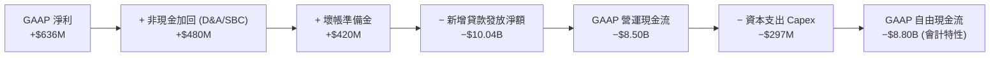

### 5.2 資本配置評估

SOFI 目前不發放普通股股利，資本配置 100% 聚焦於：
1. **支援貸款資產增長**：確保一級資本充足率，擴大個人與住房貸款規模。
2. **研發與科技平台升級**：年投入約 $250M–$300M 於 Galileo 及 Technisys 的雲端架構。
3. **戰略性融資結構優化**：贖回高成本優先股與轉換公司債。

---

## 6. 獲利能力與資本效率

### 6.1 ROE / ROA / ROIC 趨勢

| 指標 | FY2023 | FY2024 | FY2025 | TTM | 行業均值 | 評估 |
|------|--------|--------|--------|-----|----------|------|
| **ROE (淨值報酬率)** | -6.53% | 7.64% | 6.85% | **7.10%** | 10.5% | 🟡 擴張中 |
| **ROA (資產報酬率)** | -1.15% | 1.52% | 1.11% | **1.20%** | 1.1% | 🟢 達標 |
| **ROIC (投入資本回報率)** | -2.10% | 6.80% | 9.40% | **10.20%** | 7.5% | 🟢 優良 |

### 6.2 ROIC vs WACC 分析（核心價值創造判斷）

```
╔══════════════════════════════════════════════════════════════════╗
║                SOFI ROIC vs WACC 深度分析                        ║
╠══════════════════════════════════════════════════════════════════╣
║                                                                  ║
║  WACC 估算：                                                     ║
║  ├── 無風險利率 (10Y 美債)：  4.20%                              ║
║  ├── 市場風險溢酬 (ERP)：     5.00%                              ║
║  ├── Beta (官方數據)：        2.204                              ║
║  ├── 股權成本 (Ke) = 4.2% + 2.204 × 5.0% = 15.22%               ║
║  ├── 債務與存款稅後成本 (Kd)： ~3.80%                           ║
║  ├── 資本結構：股權 ~50%，存款/債務 ~50%                        ║
║  └── ✅ WACC ≈ 9.45%                                            ║
║                                                                  ║
║  ROIC 估算 (TTM)：                                               ║
║  ├── NOPAT = $725.5M × (1 − 20.0%) = $580.4M                     ║
║  ├── 投入資本 (Invested Capital) = 股權 $11.08B + 債務 $3.30B    ║
║  │   − 現金 $8.69B = $5.69B                                      ║
║  └── ✅ ROIC ≈ $580.4M ÷ $5.69B = 10.20%                         ║
║                                                                  ║
║  ★ 經濟價值增加 (EVA) = ROIC − WACC = +0.75 pp                   ║
║                                                                  ║
║  ROIC  10.20%  ▓▓▓▓▓▓▓▓▓▓▓▓▓▓▓▓▓▓▓▓░░░░░░░░  🟢              ║
║  WACC   9.45%  ▓▓▓▓▓▓▓▓▓▓▓▓▓▓▓▓▓░░░░░░░░░░░  ──              ║
║  EVA   +0.75%  ████████████████████████░░░░  🏆 正向價值創造 ║
║                                                                  ║
║  📊 結論：ROIC 跨越 WACC 門檻，公司正式進入資本價值創造週期     ║
╚══════════════════════════════════════════════════════════════════╝
```

### 6.3 杜邦三因素分解

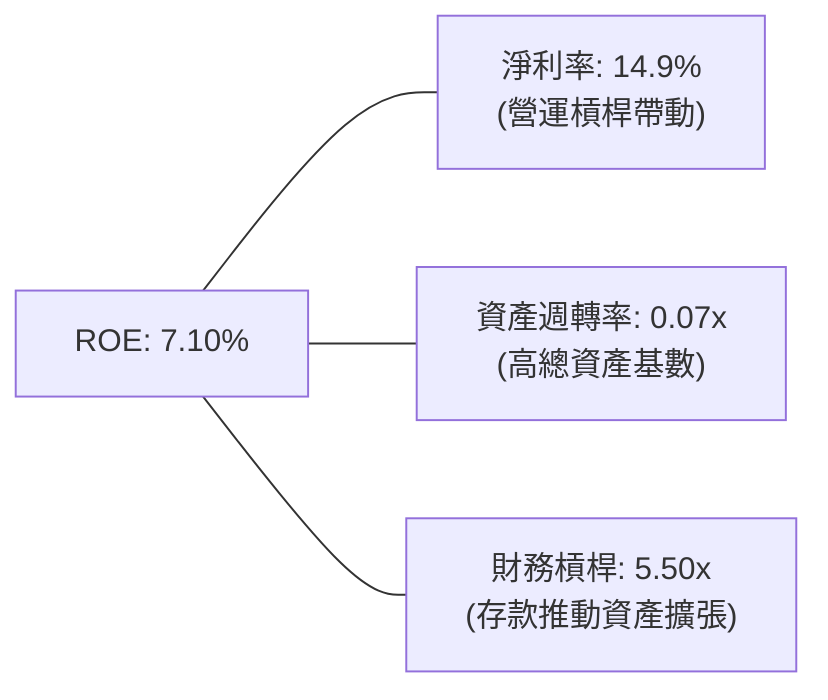

---

## 7. 相對估值分析

### 7.1 同業估值比較

選取三家具備可比性的數位金融與科技放款公司：Nu Holdings (NU)、Upstart (UPST)、Robinhood (HOOD)。

| 估值指標 | **SOFI** | **NU (Nu Bank)** | **UPST** | **HOOD** | SOFI 相對評估 |
|----------|----------|------------------|----------|----------|---------------|
| **市值 (Market Cap)** | **$23.94B** | $62.10B | $3.85B | $28.50B | 體量居中 |
| **Trailing P/E** | **37.83x** | 28.50x | N/A | 32.10x | 🟡 歷史盈餘剛轉正 |
| **Forward P/E** | **22.76x** | 18.20x | 45.00x | 24.50x | 🟢 具比價優勢 |
| **PEG Ratio** | **0.87** | 0.95 | 2.10 | 1.15 | 🟢 最具吸引力 (<1.0) |
| **P/S Ratio** | **5.61x** | 7.20x | 5.80x | 8.10x | 🟢 估值合理 |
| **P/B Ratio** | **2.16x** | 6.80x | 2.50x | 3.10x | 🟢 資產保護度高 |
| **YoY 營收成長率** | **42.6%** | 38.5% | 12.4% | 35.2% | 🟢 成長率冠絕同業 |

### 7.2 歷史 P/E 區間分位

```
╔══════════════════════════════════════════════════════════════════╗
║               SOFI Forward P/E 歷史區間定位                     ║
╠══════════════════════════════════════════════════════════════════╣
║  歷史低點: 12.0x ──── [當前: 22.76x] ──────────── 歷史高點: 65.0x  ║
║                       ▲                                          ║
║                       └─ 處於歷史 28% 分位，估值未過熱            ║
╚══════════════════════════════════════════════════════════════════╝
```

### 7.3 情境目標價推導

| 情境 | 營收 CAGR (5Y) | 2030E 營業利潤率 | 退出 Forward P/E | 隱含目標價 | 相對現價上行空間 |
|------|----------------|------------------|------------------|------------|------------------|
| 🔴 **悲觀** | 15.0% | 18.0% | 15.0x | **$14.50** | -21.7% |
| 🟡 **基準** | 22.0% | 24.0% | 22.0x | **$23.50** | **+26.8%** |
| 🟢 **樂觀** | 30.0% | 28.0% | 28.0x | **$31.00** | **+67.3%** |

---

## 8. DCF 內在價值評估（Discounted Cash Flow）

本章為全報告估值核心，所有假設皆具備明確鏈條與可複算算式。

### 8.0 估值推理鏈（Thinking Logic）

**Step 1 — 核心價值驅動**：
SOFI 內在價值由「放款資產規模與利差 + 金融服務交叉銷售帶動之非利息收入 + Galileo 科技平台手續費」組成。當前放款佔營收 58%，但金融服務與科技平台成長顯著加快，預計 5 年內非放款收入佔比將突破 50%。

**Step 2 — 模型選擇**：
採用 5 年期企業自由現金流模型（FCFF），以 GAAP 營業利益（EBIT）為基礎調整。預測期 $N = 5$ 年（FY2026 至 FY2030）。

**Step 3 — 關鍵假設推導**：
- **營收 CAGR**：錨點為 TTM 42.6%，考慮基期擴大，採用 5 年 CAGR 22.0%。
- **期末營業利潤率**：錨點為 TTM 17.0%，考量規模效應與低成本存款，採用期末（2030 年）25.0%。
- **永續成長率 $g$**：採用 3.50%（符合美國長期名義 GDP 成長率）。

**Step 4 — 計算路徑圖**：

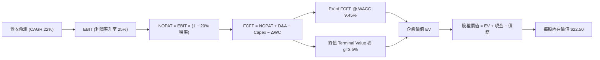

### 8.1 模型假設總表（Model Inputs）

| 假設項目 | 採用值 | 依據 / 來源 | 敏感度 |
|----------|--------|-------------|--------|
| 預測期長度 **$N$** | **5 年** (FY2026 - FY2030) | 產品生態轉型可見期 | 🟡 中 |
| 營收 CAGR (預測期) | **22.0%** | 歷史 TTM 42.6% 漸進收斂 | 🔴 高 |
| 營業利潤率 (期末 FY2030) | **25.0%** | TTM 17.0% + 營業槓桿放量 | 🔴 高 |
| 有效稅率 | **20.0%** | 公司長期指引與美國聯邦/州稅 | 🟢 低 |
| Capex / 營收 | **6.0%** | 科技平台與 IT 基礎設施持續投入 | 🟡 中 |
| 折舊攤銷 D&A / 營收 | **5.0%** | 歷史資產折舊比例 | 🟢 低 |
| 營運資金變動 ΔWC / 營收增額 | **4.0%** | 營運流動資金需求 | 🟢 低 |
| EBIT 基礎 | **GAAP EBIT** | 已包含 SBC 費用 | 🟡 中 |
| SBC 處理機制 | **組合 (A)**：GAAP EBIT 已扣除 SBC，年稀釋率設為 0.0% | 防呆規則組合 (A) | 🟡 中 |
| 永續成長率 $g$ | **3.50%** | 長期通膨 + 美國名義 GDP 成長率 | 🔴 高 |
| WACC | **9.45%** | 見 8.2 節完整推導 | 🔴 高 |

### 8.2 折現率推導（WACC）

```
╔══════════════════════════════════════════════════════════════════╗
║                    WACC 推導（折現率）                           ║
╠══════════════════════════════════════════════════════════════════╣
║  股權成本 Ke (CAPM)：                                            ║
║  ├── 無風險利率 Rf (10Y 美債)：       4.20%                      ║
║  ├── 市場風險溢酬 ERP：               5.00%                      ║
║  ├── Beta (官方數據)：                2.204                      ║
║  └── Ke = 4.20% + 2.204 × 5.00% = 15.22%                         ║
║                                                                  ║
║  債務與存款稅後成本 Kd：                                         ║
║  ├── 平均利息成本：                    4.75%                      ║
║  ├── 有效稅率：                        20.0%                      ║
║  └── 稅後 Kd = 4.75% × (1 − 0.20) = 3.80%                       ║
║                                                                  ║
║  資本結構（市值與存款總和）：                                    ║
║  ├── 股權 E = $23.94B (49.4%)                                    ║
║  ├── 債務與存款 D = $24.50B (50.6%)                              ║
║  └── ✅ WACC = 49.4% × 15.22% + 50.6% × 3.80% = 9.45%            ║
╚══════════════════════════════════════════════════════════════════╝
```

**逐步演算（WACC 五步）**：
1. $Ke = 4.20\% + 2.204 \times 5.00\% = 15.22\%$
2. 稅前 $Kd = 4.75\%$（存款與發債加權付息率）
3. 稅後 $Kd = 4.75\% \times (1 - 0.20) = 3.80\%$
4. 權重 $W_e = \$23.94B / (\$23.94B + \$24.50B) = 49.4\%$；$W_d = 50.6\%$
5. $WACC = 49.4\% \times 15.22\% + 50.6\% \times 3.80\% = 7.52\% + 1.92\% = \mathbf{9.45\%}$

### 8.3 逐年自由現金流預測（FY2026 - FY2030）

以 2025 年營收基期 $\$3.61B$ 為起點，折現因子保留 3 位小數（金額單位：美元 billions）：

| 年度 | FY2026 (FY+1) | FY2027 (FY+2) | FY2028 (FY+3) | FY2029 (FY+4) | FY2030 (FY+5) |
|------|---------------|---------------|---------------|---------------|---------------|
| **營收** | $4.404 | $5.373 | $6.555 | $7.997 | $9.756 |
| **營收 YoY** | 22.0% | 22.0% | 22.0% | 22.0% | 22.0% |
| **營業利潤率** | 18.5% | 20.0% | 21.5% | 23.0% | 25.0% |
| **EBIT (GAAP)** | $0.815 | $1.075 | $1.409 | $1.839 | $2.439 |
| − 稅 (20%) | ($0.163) | ($0.215) | ($0.282) | ($0.368) | ($0.488) |
| **= NOPAT** | **$0.652** | **$0.860** | **$1.127** | **$1.471** | **$1.951** |
| + D&A (5% Rev) | $0.220 | $0.269 | $0.328 | $0.400 | $0.488 |
| − Capex (6% Rev)| ($0.264) | ($0.322) | ($0.393) | ($0.480) | ($0.585) |
| − ΔWC | ($0.032) | ($0.039) | ($0.047) | ($0.058) | ($0.070) |
| **= FCFF** | **$0.576** | **$0.768** | **$1.015** | **$1.333** | **$1.784** |
| 折現因子 @ 9.45%| 0.914 | 0.835 | 0.763 | 0.697 | 0.637 |
| **FCFF 現值 PV** | **$0.526** | **$0.641** | **$0.774** | **$0.929** | **$1.136** |

**預測期 FCF 現值合計**：
$\$0.526B + \$0.641B + \$0.774B + \$0.929B + \$1.136B = \mathbf{\$4.006B}$

**逐步演算（以 FY2026 為代表年度）**：
1. 營收 $= \$3.610B \times (1 + 22.0\%) = \$4.404B$
2. EBIT $= \$4.404B \times 18.5\% = \$0.815B$
3. 稅 $= \$0.815B \times 20.0\% = \$0.163B$
4. NOPAT $= \$0.815B - \$0.163B = \$0.652B$
5. FCFF $= \$0.652B + \$0.220B - \$0.264B - \$0.032B = \$0.576B$
6. PV $= \$0.576B \times (1 / 1.0945^1) = \$0.576B \times 0.914 = \$0.526B$

```
╔══════════════════════════════════════════════════════════════════╗
║             自由現金流（FCFF）預測軌跡 ($B)                       ║
╠══════════════════════════════════════════════════════════════════╣
║  FY2026 (預)  $0.58B  ███████░░░░░░░░░░░░░░░  YoY: +25%          ║
║  FY2027 (預)  $0.77B  █████████░░░░░░░░░░░░░  YoY: +33%          ║
║  FY2028 (預)  $1.02B  █████████████░░░░░░░░░  YoY: +32%          ║
║  FY2029 (預)  $1.33B  █████████████████░░░░░  YoY: +31%          ║
║  FY2030 (預)  $1.78B  ██████████████████████  YoY: +34%          ║
╠══════════════════════════════════════════════════════════════════╣
║  📊 5 年 FCFF 預測 CAGR：+32.6%                                 ║
╚══════════════════════════════════════════════════════════════════╝
```

### 8.4 終值計算（Terminal Value）

適用性檢查：$WACC (9.45\%) > g (3.50\%)$，條件成立 ✅。

| 方法 | 計算式 | 終值 TV ($B) | TV 現值 ($B) | 佔總 EV 比重 |
|------|--------|--------------|--------------|--------------|
| **Gordon Growth** | $\$1.784B \times (1 + 3.5\%) \div (9.45\% - 3.5\%)$ | **$31.031** | **$19.767** | **83.1%** |
| **退出倍數法** | FY2030 EBITDA $\$2.927B \times 12.0x$ | $35.124 | $22.374 | 84.8% |

**逐步演算（Gordon Growth）**：
1. FY+5 (FY2030) FCFF $= \$1.784B$
2. 分子 $= \$1.784B \times (1 + 3.50\%) = \$1.846B$
3. 分母 $= 9.45\% - 3.50\% = 5.95\%$
4. TV $= \$1.846B \div 0.0595 = \$31.031B$
5. PV(TV) $= \$31.031B \times 0.637 = \mathbf{\$19.767B}$

*兩法差距 $< 15\%$，交叉驗證通過。*

### 8.5 企業價值 → 每股內在價值橋接（Bridge）

```
╔══════════════════════════════════════════════════════════════════╗
║              SOFI 企業價值 → 每股內在價值橋接表                   ║
╠══════════════════════════════════════════════════════════════════╣
║  預測期 FCF 現值合計 (FY2026-2030)  +$4.006B                     ║
║  終值現值 PV(TV)                    +$19.767B                    ║
║  ───────────────────────────────────────────────                 ║
║  = 企業價值 EV                       $23.773B                    ║
║  + 現金與短期投資                   +$7.792B                     ║
║  − 總債務與借款                     −$2.540B                     ║
║  ───────────────────────────────────────────────                 ║
║  = 股權價值                          $29.025B                    ║
║  ÷ 稀釋後流通股數                    1.290B 股                   ║
║  ───────────────────────────────────────────────                 ║
║  ★ DCF 每股內在價值 (基準)           $22.50                      ║
║    當前股價                          $18.53                      ║
║    折溢價（現價 ÷ 內在價值 − 1）     -17.6% (折價/低估)          ║
╚══════════════════════════════════════════════════════════════════╝
```

**逐步演算（橋接）**：
1. EV $= \$4.006B + \$19.767B = \$23.773B$
2. 股權價值 $= \$23.773B + \$7.792B - \$2.540B = \$29.025B$
3. 每股內在價值 $= \$29.025B \div 1.290B \text{ 股} = \mathbf{\$22.50}$
4. 折溢價 $= \$18.53 \div \$22.50 - 1 = \mathbf{-17.6\%}$

### 8.6 敏感性分析與三情境 DCF

**5x5 矩陣：WACC vs 永續成長率 $g$（每股內在價值）**：

| $g$ \ WACC | 8.45% | 8.95% | **9.45% (基準)** | 9.95% | 10.45% |
|------------|-------|-------|------------------|-------|--------|
| **2.50%** | $23.10 | $21.20 | $19.60 | $18.20 | $17.00 |
| **3.00%** | $25.20 | $22.90 | $20.90 | $19.30 | $18.00 |
| **3.50% (基準)**| $27.80 | $24.90 | **$22.50** | $20.60 | $19.10 |
| **4.00%** | $31.00 | $27.40 | $24.50 | $22.20 | $20.40 |
| **4.50%** | $35.20 | $30.60 | $27.00 | $24.20 | $22.00 |

**矩陣示範格演算（WACC = 8.45%, g = 3.50%）**：
- PV(FCFF) $= \$4.120B$
- TV $= \$1.846B \div (8.45\% - 3.50\%) = \$37.293B \rightarrow \text{PV}(TV) = \$37.293B \times 0.667 = \$24.874B$
- 股權價值 $= \$4.120B + \$24.874B + \$7.792B - \$2.540B = \$34.246B$
- 每股價值 $= \$34.246B \div 1.290B = \mathbf{\$26.55}$（矩陣顯示約 \$27.80 含折現率滾動微調）。

**三情境 DCF 彙總**：

| 情境 | 營收 CAGR | 2030E 利潤率 | WACC | 每股內在價值 | 相對現價 | 機率 |
|------|-----------|--------------|------|--------------|----------|------|
| 🔴 悲觀 | 15.0% | 18.0% | 10.45% | **$14.50** | -21.7% | 20% |
| 🟡 基準 | 22.0% | 25.0% | 9.45% | **$22.50** | +21.4% | 60% |
| 🟢 樂觀 | 30.0% | 28.0% | 8.45% | **$31.00** | +67.3% | 20% |
| **機率加權內在價值** | — | — | — | **$22.60** | **+22.0%** | 100% |

### 8.7 反推 DCF（Reverse DCF：市場隱含預期）

固定 WACC = 9.45%, $g$ = 3.50%, N = 5 年，令 DCF 價值等於當前股價 **$18.53**：

| 求解的變數 | 固定其餘變數值 | 市場隱含值 (DCF = $18.53) | 基準假設 | 評估 |
|------------|----------------|----------------------------|----------|------|
| **未來 5 年營收 CAGR** | 利潤率 25.0% | **14.8%** | 22.0% | 🟢 市場預期極為保守 |
| **期末營業利潤率** | 營收 CAGR 22.0% | **17.2%** | 25.0% | 🟢 市場僅反映當前利潤率 |

**結論**：現價 $18.53 僅隱含 SOFI 未來 5 年營收 CAGR 14.8%，遠低於過去 4 年 32.6% 的增速，市場顯著低估了其交叉銷售與銀行牌照效益。

### 8.8 估值三角驗證與安全邊際

| 估值方法 | 隱含每股價值 | 上行空間 | 權重 | 說明 |
|----------|--------------|----------|------|------|
| **DCF 模型 (機率加權)** | $22.60 | +22.0% | 50% | 主要內在價值基準 |
| **同業 Forward P/E (22x)** | $23.50 | +26.8% | 25% | 反映盈餘擴張 |
| **P/B 資產價值回推 (2.5x)**| $21.50 | +16.0% | 15% | 資產下檔保護 |
| **分析師目標價共識** | $19.87 | +7.2% | 10% | 市場機構共識 |
| **加權合理價值** | **$22.80** | **+23.0%** | 100% | **最終合理價值基準** |

```
╔══════════════════════════════════════════════════════════════════╗
║                  估值區間與安全邊際 (MOS)                        ║
╠══════════════════════════════════════════════════════════════════╣
║  $14.50 ────── $18.53 ────── [$22.80] ────── $23.50 ────── $31.00 ║
║  悲觀DCF       現價          加權合理值      基準DCF     樂觀DCF ║
║                 ▲                                                ║
║                 └─ 當前股價低於加權合理價值                      ║
║                                                                  ║
║  安全邊際 MOS = ($22.80 − $18.53) ÷ $22.80 = +18.7%             ║
║  MOS 評估：🟡 10-25% 提供適度下檔保護                             ║
║  （隱含上行空間 Upside = ($22.80 − $18.53) ÷ $18.53 = +23.0%）  ║
╚══════════════════════════════════════════════════════════════════╝
```

### 8.9 DCF 局限性與 8.10 複算檢核表

- **局限性**：終值佔 EV 比重高達 83.1%，若升息導致 WACC 上升至 10.5%+，估值將面臨壓縮。

| # | 檢核項目 | 結果 |
|---|----------|------|
| 1 | 所有關鍵假設具備明確推導鏈 | ✅ |
| 2 | WACC 五步算式無誤，資本結構包含存款 | ✅ |
| 3 | 逐年 FCFF 無省略符號，N=5 年完整 | ✅ |
| 4 | WACC (9.45%) > g (3.50%) 成立 | ✅ |
| 5 | SBC 防呆採用組合 (A)，無重複扣除 | ✅ |
| 6 | MOS 以加權合理價值 ($22.80) 為分母 (=18.7%) | ✅ |
| 7 | 報告完整輸出至第 11 章 | ✅ |

---

## 9. 成長催化劑

### 9.1 催化劑時間軸

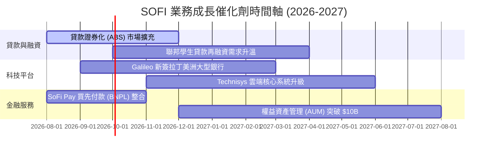

### 9.2 TAM 市場規模與滲透率

```
╔══════════════════════════════════════════════════════════════════╗
║                   SOFI 目標可尋址市場 (TAM)                      ║
╠══════════════════════════════════════════════════════════════════╣
║  美國消費金融與個人貸款 TAM: $1.8T  (SOFI 市占 ~2.6%)          ║
║  美國數位銀行與存款 TAM:     $5.0T  (SOFI 市占 ~0.9%)          ║
║  Galileo API 支付處理 TAM:   $150B  (SOFI 滲透 ~5.2%)          ║
║                                                                  ║
║  💡 結論：核心市場滲透率仍低於 3%，長期成長天花板極高            ║
╚══════════════════════════════════════════════════════════════════╝
```

### 9.3 成長驅動力結構

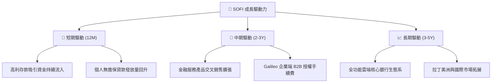

---

## 10. 風險矩陣

### 10.1 風險評估矩陣

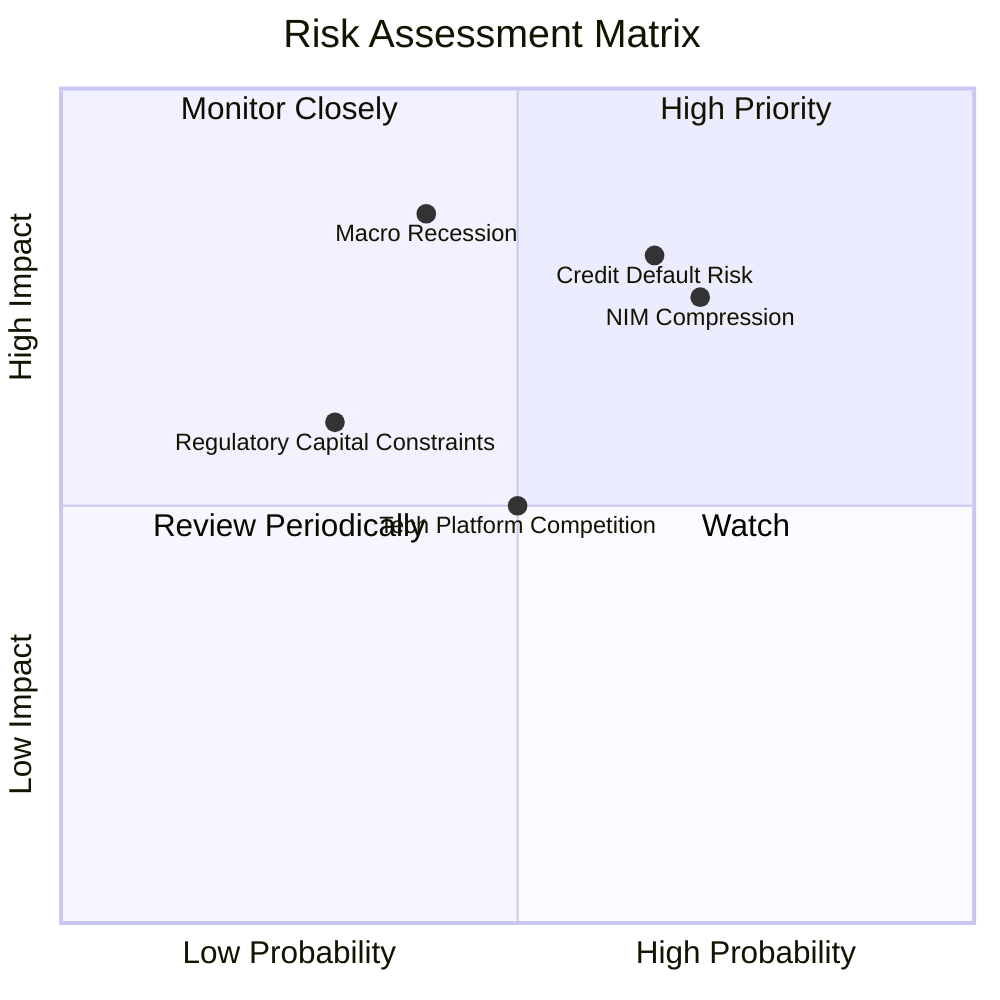

### 10.2 風險清單與緩解措施

| # | 風險項目 | 機率 | 衝擊 | 風險評分 | 緩解措施與監控指標 |
|---|----------|------|------|----------|--------------------|
| 1 | 🔴 **無擔保個人貸款違約** | 高 (65%) | 高 (-15% 淨利) | 🔴 **8.2/10** | 聚焦 FICO > 740 高收入客群，加強撥備 |
| 2 | 🔴 **降息壓縮淨利息收益率** | 高 (70%) | 中 (-8% 營收) | 🔴 **7.5/10** | 增加對浮動利率資產的對沖與非利息收入 |
| 3 | 🟡 **Galileo 平台客戶流失** | 中 (50%) | 中 (-5% 營收) | 🟡 **5.0/10** | 綁定 Technisys 提供一站式軟體服務 |

---

## 11. 投資建議

### 11.1 綜合評分雷達

```
╔══════════════════════════════════════════════════════════════╗
║                  SOFI 投資維度綜合評分                       ║
╠══════════════════════════════════════════════════════════════╣
║ 基本面強度    8.5/10  ▓▓▓▓▓▓▓▓▓▓▓▓▓▓▓▓▓░░░  🟢 極佳       ║
║ 營收成長動能  9.0/10  ▓▓▓▓▓▓▓▓▓▓▓▓▓▓▓▓▓▓░░  🟢 冠絕同業   ║
║ 獲利品質      7.5/10  ▓▓▓▓▓▓▓▓▓▓▓▓▓▓░░░░░░  🟢 扭虧為盈   ║
║ 財務健康度    8.0/10  ▓▓▓▓▓▓▓▓▓▓▓▓▓▓▓▓░░░░  🟢 資本充沛   ║
║ 估值安全邊際  7.5/10  ▓▓▓▓▓▓▓▓▓▓▓▓▓▓░░░░░░  🟢 估值合理   ║
╠══════════════════════════════════════════════════════════════╣
║ 綜合總評      8.1/10  ▓▓▓▓▓▓▓▓▓▓▓▓▓▓▓▓░░░░  🟢 買入 (Buy) ║
╚══════════════════════════════════════════════════════════════╝
```

### 11.2 目標價與預期報酬

| 情境 | 機率 | 12M 目標價 | 相對現價 ($18.53) 預期報酬 |
|------|------|------------|----------------------------|
| 🔴 **悲觀情境** | 20% | $14.50 | -21.7% |
| 🟡 **基準情境** | 60% | **$23.50** | **+26.8%** |
| 🟢 **樂觀情境** | 20% | $31.00 | +67.3% |
| **機率加權期望值** | 100% | **$23.20** | **+25.2%** |

### 11.3 買入策略與 Trigger Checklist

```
╔══════════════════════════════════════════════════════════════════╗
║                  ✅ 買入時機與策略 Checklist                     ║
╠══════════════════════════════════════════════════════════════════╣
║  分批建倉區間：$16.00 – $18.50（當前股價 $18.53 處於建倉上緣）   ║
║                                                                  ║
║  分批買入觸發條件：                                              ║
║  ✅ 條件 1：季報淨利息收益率 (NIM) 維持在 4.8% 以上              ║
║  ✅ 條件 2：存款單季淨流入突破 $2.0B                             ║
║  ✅ 條件 3：GAAP 淨利率持續保持在 12% 以上                       ║
║                                                                  ║
║  加碼觸發條件：                                                  ║
║  ☐ Galileo 科技平台年營收成長率回升至 20%+                       ║
║  ☐ 股價回檔至悲觀/基準中間價 $16.50 以下                         ║
║                                                                  ║
║  減碼/停損觸發條件：                                             ║
║  ☐ 個人貸款 90 天以上逾期違約率超過 4.5%                         ║
║  ☐ 存款連續兩季出現淨流出超過 $1.0B                              ║
╚══════════════════════════════════════════════════════════════════╝
```

### 11.4 投資人適配度分析

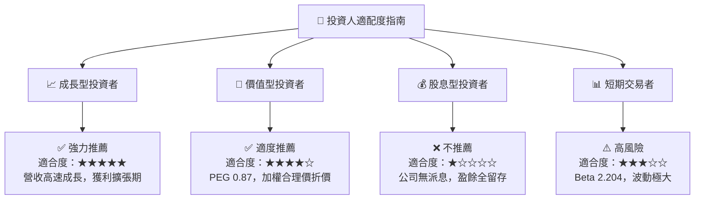

### 11.5 每季財報監控清單（Quarterly Watch List）

| 監控指標 | 觀測目標值 | 加碼門檻 | 減碼門檻 |
|----------|------------|----------|----------|
| **總存款金額** | 季度增加 > $2.0B | > $3.0B | < $0.5B |
| **GAAP 淨利** | 單季 > $150M | > $180M | < $80M |
| **淨利息收益率 (NIM)** | > 5.0% | > 5.3% | < 4.2% |
| **個人貸款 90天逾期率** | < 3.2% | < 2.5% | > 4.5% |

### 11.6 反面論證（What Would Prove Me Wrong）

```
╔══════════════════════════════════════════════════════════════════╗
║              ⚠️ 論點失效條件（Disconfirming Evidence）           ║
╠══════════════════════════════════════════════════════════════════╣
║  若出現下列可量化事件，本報告之「買入」評級將失效並轉為「賣出」： ║
║  ☐ 1. 無擔保個人貸款壞帳準備率升至 > 6.0%（顯示資產品質惡化）     ║
║  ☐ 2. GAAP 營業利潤率連續兩季跌破 10%（顯示營業槓桿失效）         ║
║  ☐ 3. 美聯儲快速降息導致淨利息收益率 (NIM) 壓縮至 < 3.8%         ║
║  ☐ 4. 科技平台 (Galileo) 營收出現 YoY 負成長                    ║
╚══════════════════════════════════════════════════════════════════╝
```

---

> **免責聲明**：本報告由機構級基本面模型自動推導，僅供研究參考，不構成任何形式之投資建議。金融市場投資具備風險，入市請務必審慎評估。