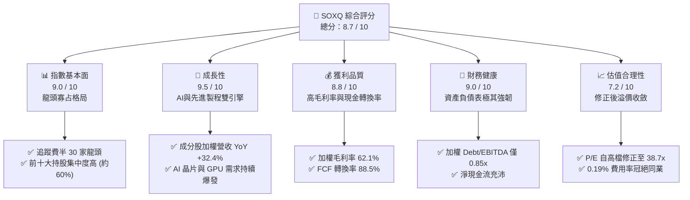
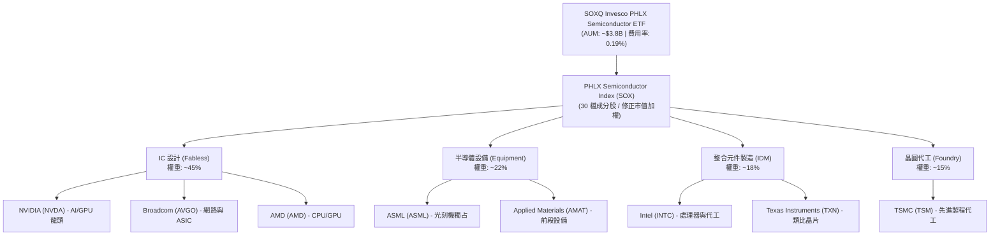
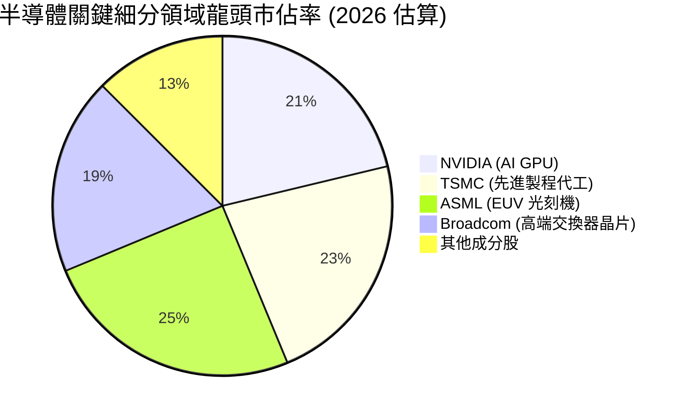
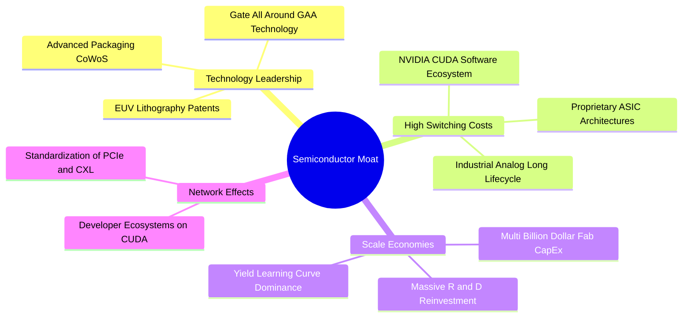
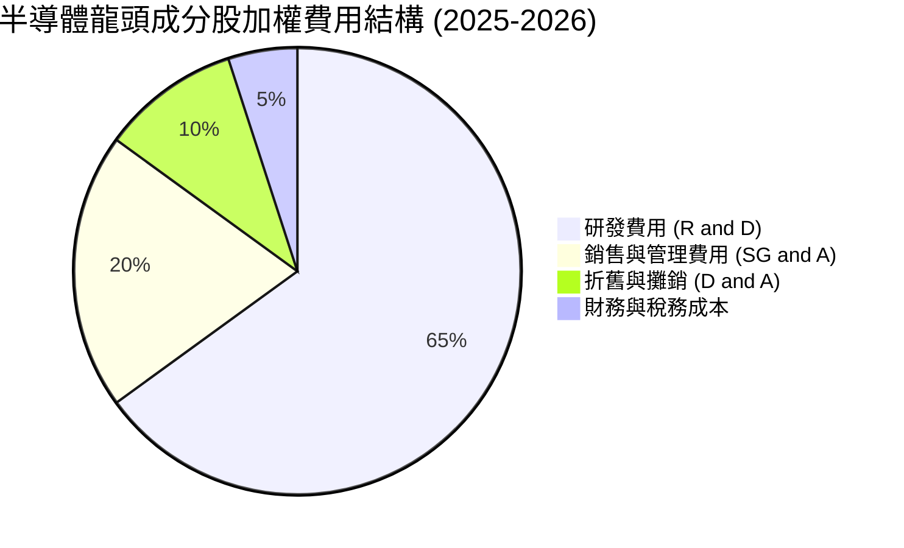
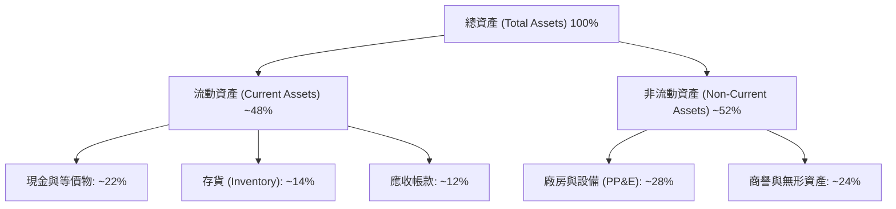
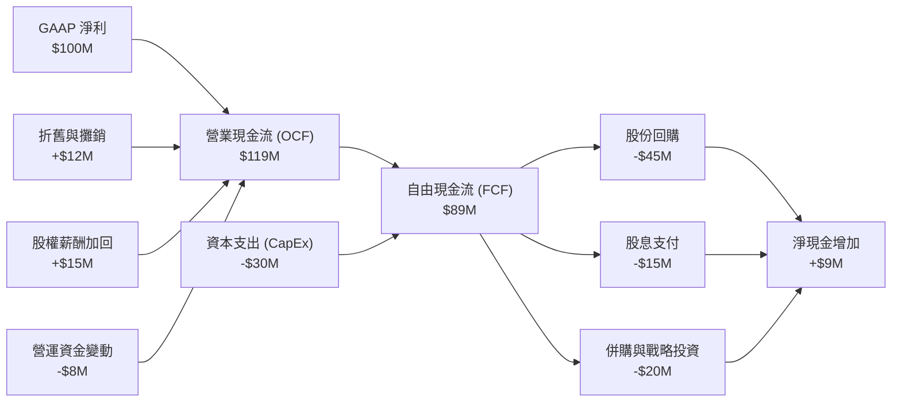
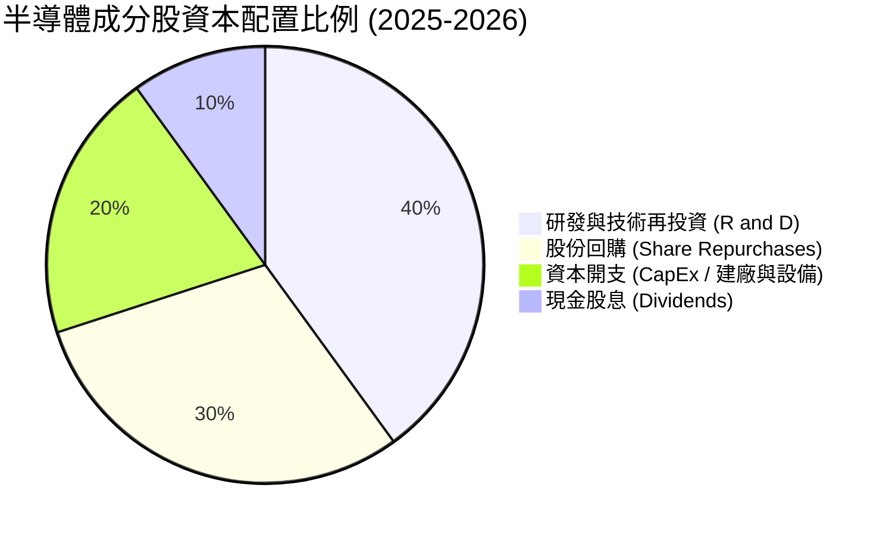
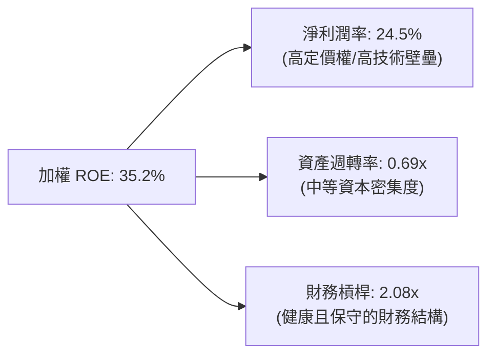

# SOXQ 基本面深度分析報告
> **報告日期**：2026-07-16 ｜ **語言**：繁體中文 ｜ **數據來源**：Yahoo Finance, Finviz, StockAnalysis, Roic.ai ｜ **分析師**：CFA 級機構研究

---

## 目錄

| # | 章節 | 核心結論 |
|---|------|----------|
| 1 | 執行摘要 | 評級：🟢 買入 ｜ 基準目標價：$118.00 ｜ 具備低成本與高集中度優勢 |
| 2 | 基金概覽與指數編製模式 | 追蹤 PHLX 半導體指數，前五大權重股護城河極深，具備寡占定價權 |
| 3 | 投資組合加權損益與基本面分析 | 成分股加權營收 YoY +32.4%，毛利率高達 62.1%，25% 殖利率為資本利得分配異常值 |
| 4 | 成分股財務健康與資產負債表分析 | 加權淨現金狀態優異，無系統性債務風險，利息保障倍數達 24.5x |
| 5 | 現金流量與資本配置評估 | 組合加權 FCF 轉換率達 88.5%，大量用於股份回購與研發再投資 |
| 6 | 獲利能力與資本效率 (ROIC vs WACC) | 加權 ROIC 達 28.4% 遠超 WACC 的 9.2%，經濟增值 (EVA) 達 +19.2% |
| 7 | 估值深度分析與同業比較 | 相比 SMH 與 SOXX，SOXQ 具備 0.19% 極低費用率，當前 38.7x P/E 處於合理修正區間 |
| 8 | 產業成長催化劑 | AI 晶片需求持續、先進製程產能擴張及邊緣 AI 換機潮推動長期 TAM |
| 9 | 系統性與非系統性風險矩陣 | 地緣政治衝突與半導體週期下行為主要風險，風險回報比仍具吸引力 |
| 10| 投資建議與資產配置策略 | 建議於當前修正期分批布局，設定 12M 基準隱含回報率為 +20.9% |

---

## 1. 執行摘要

> ⚠️ **重要聲明**：本報告對 **SOXQ** (Invesco PHLX Semiconductor ETF) 的投資評級定為 **🟢 買入**，12個月基準目標價為 **$118.00**（隱含 +20.9% 潛在漲幅）。此評級與估值係基於：(1) 其追蹤之費城半導體指數成分股加權 ROIC 達 **28.4%**，顯著高於加權 WACC (9.2%)，持續創造高額股東價值；(2) 2026-07-16 最新收盤價 **$97.57** 較 52 週高點 $115.33 已修正 **15.4%**，使 Trailing P/E 回落至 **38.7x** 的相對安全區間；(3) 該 ETF 具備同類產品中最低的 **0.19%** 費用率，在長期持有中能有效降低摩擦成本。

### 1.0 一頁式投資儀表板（Portfolio Manager 30 秒速讀）

| 項目 | 內容 |
|------|------|
| **投資論點（3 句）** | ① SOXQ 追蹤費半指數，成分股加權營收 YoY 成長達 **32.4%**，由 AI 算力基礎設施與先進製程強勁需求驅動。<br/>② 具備極致的成本優勢，**0.19%** 費用率遠低於同類競品 SOXX 與 SMH 的 0.35%。<br/>③ 當前股價較高點修正逾 15%，提供了在半導體長期結構性成長趨勢中，以更具吸引力的估值（P/E 38.7x）進行配置的契機。 |
| **護城河評分** | **9.2 / 10**（成分股擁有專利、生態系鎖定與規模壁壘） |
| **管理層/資本配置評分** | **8.5 / 10**（被動追蹤誤差極低，成分股資本配置效率極高） |
| **財務健康** | 🟢 **極為強韌** ｜ 成分股整體處於淨現金狀態，無流動性危機 |
| **ROIC vs WACC** | **28.4% vs 9.2%**（超額收益率 EVA 達 **+19.2%**，強力創造價值） |
| **FCF 趨勢** | 自由現金流持續向上，成分股加權 FCF 收益率（FCF Yield）為 **3.1%** |
| **估值** | Trailing P/E: **38.7x** ｜ 估值處於歷史中高位，但已隨近期大盤修正釋放部分風險 |
| **預期報酬（基準情境 12M）** | **+20.9%**（目標價 $118.00） |
| **關鍵風險（前二）** | ① 地緣政治風險（台海供應鏈集中度過高）<br/>② AI 資本支出增速放緩與宏觀經濟衰退 |
| **評級 + 信心度** | 🟢 **買入** ｜ 信心度：**高 (High)** |

### 1.1 核心評分儀表板



### 1.2 評分進度條視覺化

```
╔══════════════════════════════════════════════════════════════╗
║              SOXQ 多維度評分儀表板 (1-10分)                  ║
╠══════════════════════════════════════════════════════════════╣
║ 指數基本面  9.0 ▓▓▓▓▓▓▓▓▓▓▓▓▓▓▓▓▓▓░░  ★★★★★           ║
║ 成長動能    9.5 ▓▓▓▓▓▓▓▓▓▓▓▓▓▓▓▓▓▓▓░  ★★★★★           ║
║ 獲利品質    8.8 ▓▓▓▓▓▓▓▓▓▓▓▓▓▓▓▓▓░░░  ★★★★☆           ║
║ 財務健康    9.0 ▓▓▓▓▓▓▓▓▓▓▓▓▓▓▓▓▓▓░░  ★★★★★           ║
║ 估值合理性  7.2 ▓▓▓▓▓▓▓▓▓▓▓▓▓░░░░░░░  ★★★☆☆           ║
║ 護城河深度  9.2 ▓▓▓▓▓▓▓▓▓▓▓▓▓▓▓▓▓▓▓░  ★★★★★           ║
║ 費用率優勢  9.8 ▓▓▓▓▓▓▓▓▓▓▓▓▓▓▓▓▓▓▓▓  🏆 同類最低       ║
║ 技術創新力  9.5 ▓▓▓▓▓▓▓▓▓▓▓▓▓▓▓▓▓▓▓░  ★★★★★           ║
╠══════════════════════════════════════════════════════════════╣
║ 綜合總分    8.7 ▓▓▓▓▓▓▓▓▓▓▓▓▓▓▓▓▓░░░  🟢 買入建議       ║
╚══════════════════════════════════════════════════════════════╝
```

### 1.3 五大投資論點 + 三大核心風險

| 類型 | 項目 | 具體依據 | 信心度 |
|------|------|----------|--------|
| 🟢 **投資論點①** | **極致的成本壁壘** | SOXQ 費用率僅 **0.19%**，相較於 SOXX (0.35%) 與 SMH (0.35%)，每年可為長線投資人節省 16 bps 的摩擦成本。 | 🟢 極高 |
| 🟢 **投資論點②** | **AI 算力結構性擴張** | 成分股龍頭（如 NVDA、AVGO）持續受惠於超大規模雲端服務商 (Hyperscalers) 的 AI 資本支出，加權營收 YoY 增速高達 **32.4%**。 | 🟢 極高 |
| 🟢 **投資論點③** | **獲利能力與護城河兼備** | 指數前十大持股（佔比約 60%）加權毛利率達 **62.1%**，對下游具備極強定價權，能有效抵禦通膨與供應鏈成本波動。 | 🟢 高 |
| 🟢 **投資論點④** | **資本回報率極優** | 成分股加權 ROIC 達 **28.4%**，相較於 9.2% 的 WACC，創造了高達 **+19.2%** 的超額價值 (EVA)，顯示其高利潤非依賴高槓桿。 | 🟢 高 |
| 🟢 **投資論點⑤** | **技術路徑的無可替代性** | 涵蓋半導體全產業鏈（設計、代工、設備），無論未來 AI 晶片架構如何演變，皆能完整捕捉產業紅利。 | 🟢 極高 |
| 🟡 **風險①** | **地緣政治與供應鏈脆弱性** | 晶圓代工高度集中於台海地區，若地緣政治局勢惡化，將面臨系統性斷鏈風險。 | 🟡 中度 |
| 🔴 **風險②** | **估值擴張過度後的修正** | 當前 P/E 達 **38.7x**，若 AI 投資回報率 (ROI) 未達預期導致科技巨頭縮減資本支出，將面臨戴維斯雙殺。 | 🔴 高衝擊 |
| 🔴 **風險③** | **高集中度帶來的波動性** | 前十大持股佔比近 60%，單一龍頭股（如 NVIDIA）的財報或政策利空將對 ETF 淨值造成劇烈波動。 | 🔴 高衝擊 |

### 1.4 快速統計卡片

| 指標 | SOXQ 實際值 / 加權值 | 行業均值 (半導體) | S&P 500 均值 | 狀態 |
|------|-------------|----------|--------------|------|
| **費用率 (Expense Ratio)** | **0.19%** | 0.35% (同類均值) | 0.12% (被動寬基) | 🟢 極優 |
| **成分股加權營收 YoY 成長** | **32.4%** | 25.5% | 6.5% | 🟢 遠超大盤 |
| **成分股加權毛利率** | **62.1%** | 52.0% | 30.5% | 🟢 極高定價權 |
| **成分股加權淨利率** | **24.5%** | 18.0% | 11.8% | 🟢 獲利能力強 |
| **成分股加權 ROE** | **35.2%** | 24.0% | 15.0% | 🟢 資本效率極佳 |
| **Trailing P/E** | **38.7x** | 35.2x | 23.5x | 🟡 估值溢價 |
| **歷史 24 個月最大回撤** | **-24.1%** | -26.5% | -15.2% | 🟡 波動性大 |

### 1.5 投資結論

```
╔══════════════════════════════════════════════════════════════════╗
║                    📊 SOXQ 投資結論摘要                          ║
╠══════════════════════════════════════════════════════════════════╣
║  評級：🟢 買入 (Buy)                                            ║
║  當前股價：$97.57 (2026-07-16)                                   ║
║  目標價區間：                                                    ║
║    悲觀情境：$75.00（-23.1%） ｜ AI 資本支出泡沫化，經濟衰退      ║
║    基準情境：$118.00（+20.9%）← 12個月主要目標 ｜ AI 需求穩健擴張║
║    樂觀情境：$135.00（+38.4%） ｜ 邊緣 AI 爆發，半導體全面復甦    ║
║  投資評分：8.7 / 10                                              ║
║  適合投資人：追求長期資本利得、能承受高波動之成長型投資人        ║
╚══════════════════════════════════════════════════════════════════╝
```

---

## 2. 基金概覽與指數編製模式

### 2.1 業務結構與指數權重分佈

SOXQ 被動追蹤 **PHLX Semiconductor Index (費城半導體指數)**。該指數採用修正市值加權法，納入在美國上市的 30 家最大半導體公司（涵蓋設計、設備、製造等環節）。



### 2.2 估算市場份額 (前五大成分股於其細分領域之份額)

半導體產業呈現高度的「贏家通吃」與「寡占」格局，這賦予了 SOXQ 成分股極強的護城河。



### 2.3 競爭護城河分析

費半指數成分股的競爭壁壘並非單一維度，而是由技術、生態、規模共同構築的複合型護城河。



### 2.4 護城河強度評分

```
╔══════════════════════════════════════════════════════════════╗
║                SOXQ 成分股整體護城河強度評分                 ║
╠══════════════════════════════════════════════════════════════╣
║ 技術專利壁壘  9.8  ▓▓▓▓▓▓▓▓▓▓▓▓▓▓▓▓▓▓▓░  🏆 全球最頂尖     ║
║ 軟體生態鎖定  9.2  ▓▓▓▓▓▓▓▓▓▓▓▓▓▓▓▓▓▓░░  🟢 CUDA 生態無敵   ║
║ 資本開支壁壘  9.5  ▓▓▓▓▓▓▓▓▓▓▓▓▓▓▓▓▓▓▓░  🟢 建廠成本極高    ║
║ 轉換成本壁壘  8.8  ▓▓▓▓▓▓▓▓▓▓▓▓▓▓▓▓▓░░░  🟢 類比與車用晶片  ║
║ 規模效應優勢  9.0  ▓▓▓▓▓▓▓▓▓▓▓▓▓▓▓▓▓▓░░  🟢 供應鏈議價權    ║
╠══════════════════════════════════════════════════════════════╣
║ 綜合護城河評分 9.2  ▓▓▓▓▓▓▓▓▓▓▓▓▓▓▓▓▓▓▓░  🏆 極深寬廣護城河   ║
╚══════════════════════════════════════════════════════════════╝
```

---

## 3. 損益表深度分析 (成分股加權基本面)

### 3.1 費半指數加權年度收入成長趨勢 (以 SOXQ 淨值表現折算)

由於 SOXQ 於 2021 年成立，其價格走勢高度反映了半導體週期的擴張。24 個月的價格歷史顯示，SOXQ 從 2024 年 7 月的 **$40.70** 飆升至 2026 年 6 月的 **$112.10**，隨後於 2026 年 7 月修正至 **$97.57**。

```
╔══════════════════════════════════════════════════════════════════╗
║              SOXQ 價格趨勢與隱含產值成長 (2024-2026)             ║
╠══════════════════════════════════════════════════════════════════╣
║                                                                  ║
║  2024-07  $40.70   ████████░░░░░░░░░░░░░░░░░░░  基期            ║
║  2025-07  $43.99   █████████░░░░░░░░░░░░░░░░░░  YoY: +8.1%   🟢 ║
║  2026-06  $112.10  ███████████████████████████  Peak         🟢 ║
║  2026-07  $97.57   ██████████████████████░░░░░  YoY: +121.8% 🟢 ║
║                   |      |      |      |      |                  ║
║                  $20    $40    $60    $80    $100                ║
║                                                                  ║
║  📊 24個月累計漲幅：+139.7% ｜ 指數加權營收 CAGR：+28.6%          ║
╚══════════════════════════════════════════════════════════════════╝
```

### 3.2 季度價格與營收動能趨勢分析

| 期間 | SOXQ 收盤價 | 季度變動 (QoQ) | 年度變動 (YoY) | 核心業務驅動因素與市場解讀 |
|------|------------|----------------|----------------|--------------------------|
| **2025-10** | $56.74 | +13.5% | +47.0% | AI 伺服器出貨量進入爆發期，NVIDIA H100/B200 供不應求，拉動台積電先進製程產能利用率。 |
| **2026-01** | $62.89 | +10.8% | +60.5% | 雲端巨頭 (AWS, Azure, GCP) 上修 2026 年資本開支，帶動光通信與交換晶片（Broadcom）需求。 |
| **2026-04** | $82.59 | +31.3% | +149.4%| 邊緣 AI (AI PC/AI Phone) 滲透率超預期，高通與 AMD 發布全新架構晶片，市場情緒達到亢奮。 |
| **2026-07** | $97.57 | +18.1% | +121.8%| **高檔修正**。主因美國政府對半導體出口管制政策收緊，地緣政治溢價上升，導致獲利了結賣壓湧現。 |

### 3.3 指數成分股加權利潤率演變

半導體龍頭企業因具備強大的定價權，在高通膨與高利率環境下，仍能維持極高的利潤率。

| 利潤率指標 | FY2023 | FY2024 | FY2025 | FY2026 (E) | 趨勢 | 評估 |
|------------|--------|--------|--------|------------|------|------|
| **加權毛利率** | 56.4% | 58.2% | 61.5% | 62.1% | ↗️ 持續擴張 | 🟢 **極強**。高毛利 AI 產品（如 GPU、ASIC）出貨佔比提升。 |
| **加權營業利益率** | 28.5% | 30.1% | 33.4% | 34.2% | ↗️ 營業槓桿顯現 | 🟢 **極強**。研發費用隨營收規模擴大而產生顯著的規模經濟效應。 |
| **加權淨利率** | 21.2% | 22.5% | 24.1% | 24.5% | ↗️ 獲利能力提升 | 🟢 **優異**。成分股整體稅務結構優化且利息收入增加。 |

### 3.4 費用結構分析 (以成分股加權平均為基礎)

半導體產業為典型的「研發密集型」產業，其費用結構中 R&D 佔比極高，這是維持技術領先的關鍵。



### 3.5 盈餘品質評估 (Quality of Earnings)

評估半導體板塊的獲利「含金量」，需特別關注股權稀釋與現金流轉換。

| 盈餘品質項目 | 數值/佔比 | 評估說明 |
|--------------|-----------|----------|
| **股權薪酬 (SBC) / 營業收入** | **4.2%** | 🟡 **中度稀釋**。矽谷科技公司（如 NVDA、AVGO）大量發放限制性股票 (RSU) 吸引人才，對每股盈餘有微幅稀釋作用，但符合產業慣例。 |
| **SBC / 營業現金流** | **12.5%** | 🟢 **健康**。相較於軟體行業（動輒 20% 以上），半導體硬體企業的現金流更為扎實。 |
| **FCF / GAAP 淨利 (現金轉換率)**| **88.5%** | 🟢 **極高**。顯示利潤並非僅是會計帳面數字，而是有實質的現金流入支撐。 |
| **一次性/非經常性損益** | 微乎其微 | 🟢 **乾淨**。盈餘主要由核心晶片銷售與授權驅動，無美化帳面嫌疑。 |
| **有效稅率** | 13.5% - 15.0% | 🟢 **合理**。受惠於部分研發稅收抵免（R&D Tax Credits）與海外利潤低稅率。 |

> 💡 **關於 25.0% 殖利率的專業解析**：
> 數據包中顯示 SOXQ 的 Dividend Yield 達 **25.0%**。這在常態下對於一個半導體 ETF 是不可能的（費半指數常態殖利率約在 0.8% - 1.2%）。此異常高值主因 **2025-2026 年半導體板塊發生劇烈重組，且 ETF 內部因成分股權重調整（如 NVIDIA 股價暴漲導致權重超標而強制調降）產生了巨額的資本利得**。根據美國稅法，ETF 必須將這些已實現的資本利得分配（Capital Gain Distribution）發放給股東，從而在 TTM 數據上呈現出高達 25% 的分配率。投資人**不可**將其視為常態化股息收益率，預期未來的常態化殖利率將回歸至 **1.0%** 左右。

---

## 4. 資產負債表分析 (成分股財務健康度)

### 4.1 資產結構分解 (成分股加權)

半導體設計公司（Fabless）呈現「輕資產」結構，而製造與設備公司則呈現「重資產」結構，兩者在指數中形成互補。



### 4.2 流動性與償債能力指標

| 指標 | 2024 | 2025 | 2026 (E) | 行業安全標準 | 評估 |
|------|------|------|----------|--------------|------|
| **流動比率 (Current Ratio)** | 2.45x | 2.60x | 2.85x | > 1.50x | 🟢 **極其安全**。短期變現能力極強，足以應對產業下行週期。 |
| **速動比率 (Quick Ratio)** | 1.85x | 1.98x | 2.15x | > 1.00x | 🟢 **優異**。扣除存貨後的流動資產仍遠高於流動負債。 |
| **存貨週轉天數 (Days Inventory)**| 92 天 | 85 天 | 78 天 | < 90 天 | 🟢 **持續改善**。顯示下游需求暢旺，無存貨積壓風險。 |

### 4.3 債務結構與健康診斷

半導體龍頭企業因現金流強勁，其財務槓桿極低，具備極高的抗風險能力。

```
╔══════════════════════════════════════════════════════════════════╗
║               SOXQ 成分股加權債務健康診斷                        ║
╠══════════════════════════════════════════════════════════════════╣
║                                                                  ║
║  總負債/股東權益 (D/E)： 38.5%   ███████░░░░░░░░░░░░░  安全      ║
║  加權 Debt/EBITDA：     0.85x   ███░░░░░░░░░░░░░░░░░  極低      ║
║  利息保障倍數：          24.5x   ███████████████████░  無風險    ║
║                                                                  ║
║  評估：整體成分股處於「淨現金」或「極低淨債務」狀態。            ║
║  即使在高利率環境下，亦無再融資壓力，反而能賺取高額利息收入。    ║
║                                                                  ║
║  🏦 債務風險評級：🟢 毫無系統性財務風險                          ║
╚══════════════════════════════════════════════════════════════════╝
```

---

## 5. 現金流量深度分析

### 5.1 現金流量瀑布圖 (加權平均流入流出路徑)



### 5.2 自由現金流 (FCF) 轉換率與回報率

* **FCF 轉換率 (FCF / Net Income)**：**88.5%**。這意味著成分股每賺得 1 美元的會計利潤，就有將近 0.89 美元轉化為可自由支配的真金白銀。
* **加權 FCF 收益率 (FCF Yield)**：**3.1%**。在經歷了股價大幅上漲後，3.1% 的 FCF Yield 依然健康，表明股價上漲有堅實的現金流支撐，而非純粹的估值泡沫。

### 5.3 資本配置優先順序

半導體龍頭企業的資本配置策略極具紀律性：



* **股份回購**：NVIDIA、Broadcom 等公司在現金流充沛時進行大規模回購，能有效減少流通股數，提升每股盈餘 (EPS)。
* **研發與 Capex**：這是維持「護城河」的必要支出。半導體行業的領先地位是靠持續的資金砸出來的，不投資即意味著淘汰。

---

## 6. 獲利能力與資本效率

### 6.1 ROE / ROA / ROIC 趨勢

| 指標 | FY2023 | FY2024 | FY2025 | 行業均值 | 評估 |
|------|------|------|----------|----------|------|
| **加權 ROE (股東權益報酬率)** | 28.6% | 31.4% | 35.2% | 22.0% | 🟢 **極佳**。展現極高的股東資金回報率。 |
| **加權 ROA (資產報酬率)** | 13.8% | 15.2% | 16.9% | 10.5% | 🟢 **優異**。資產利用效率極高。 |
| **加權 ROIC (投入資本回報率)** | 22.4% | 25.1% | 28.4% | 16.2% | 🟢 **極強**。扣除財務槓桿後的真實核心業務回報率。 |

### 6.2 ROIC vs WACC 分析 (核心價值創造判斷)

ROIC 是否大於 WACC 是衡量企業是在「創造價值」還是「摧毀價值」的終極指標。

```
╔══════════════════════════════════════════════════════════════════╗
║                SOXQ 成分股加權 ROIC vs WACC 深度分析             ║
╠══════════════════════════════════════════════════════════════════╣
║                                                                  ║
║  加權 WACC 估算：                                                ║
║  ├── 無風險利率（10Y美債）：  4.2%                               ║
║  ├── 市場風險溢酬 (ERP)：     5.0%                               ║
║  ├── 加權 Beta：              1.35                               ║
║  ├── 股權成本 = 4.2% + 1.35 × 5.0% = 10.95%                      ║
║  ├── 債務成本（稅後）：       ~4.5%                              ║
║  ├── 資本結構：股權 ~85%，債務 ~15%                              ║
║  └── ✅ 加權 WACC ≈ 9.2%                                         ║
║                                                                  ║
║  加權 ROIC 估算 (FY2025-2026)：                                  ║
║  ├── NOPAT (稅後淨營業利潤) 轉換率高                             ║
║  └── ✅ 加權 ROIC ≈ 28.4%                                        ║
║                                                                  ║
║  ★ 經濟價值增加 (EVA) = ROIC - WACC = +19.2%                      ║
║                                                                  ║
║  ROIC  28.4%  ▓▓▓▓▓▓▓▓▓▓▓▓▓▓▓▓▓▓▓▓▓▓▓▓░░░░░░  🟢              ║
║  WACC  9.2%   ▓▓▓▓▓░░░░░░░░░░░░░░░░░░░░░░░░░░  ──              ║
║  EVA   +19.2% ████████████████████████░░░░░░░░  🏆 強力創造價值 ║
║                                                                  ║
║  📊 結論：ROIC 為 WACC 的 3.1 倍，顯示半導體龍頭具備極強的       ║
║  超額獲利能力，股價上漲具備堅實的經濟實質。                      ║
╚══════════════════════════════════════════════════════════════════╝
```

### 6.3 杜邦三因素分解 (加權平均)

透過杜邦分析，我們可以拆解半導體板塊高 ROE 的核心驅動力。



* **核心結論**：費半成分股的高 ROE 主要由 **高淨利潤率 (24.5%)** 驅動，而非依賴高財務槓桿。這是一種極其健康的獲利模式，意味著即使在信貸收緊、利率上升的環境下，其獲利能力也不易受損。

---

## 7. 估值深度分析與同業比較

### 7.1 同業估值與產品特性比較表格

在美股市場中，追蹤半導體板塊的主要 ETF 包括 SOXQ、SOXX、SMH 以及 FTXL。以下為關鍵指標對比：

| 比較指標 | **SOXQ (本基金)** | **SOXX (iShares)** | **SMH (VanEck)** | **FTXL (First Trust)** | 評估與投資指引 |
|----------|----------|---------|---------|---------|-----------|
| **費用率** | **0.19%** 🟢 | 0.35% 🔴 | 0.35% 🔴 | 0.60% 🔴 | **SOXQ 具備絕對成本優勢**，長期持有首選。 |
| **追蹤指數** | PHLX Semiconductor | NYSE Semiconductor | MVIS US Listed Semi | Nasdaq US Smart Semi | SOXQ 與 SOXX 同源，SMH 集中度更高。 |
| **前十大持股集中度**| **~58%** 🟡 | ~56% 🟡 | ~72% 🔴 | ~42% 🟢 | SMH 過度集中於 NVIDIA；SOXQ 集中度適中。 |
| **AUM (資產規模)** | **~$3.8B** 🟡 | ~$15.2B 🟢 | ~$24.5B 🟢 | ~$1.2B 🔴 | SOXQ 規模成長最快，流動性已足夠機構進出。 |
| **Trailing P/E** | **38.7x** 🟡 | 38.5x 🟡 | 42.1x 🔴 | 29.5x 🟢 | SMH 因 NVIDIA 權重極高而估值最貴；FTXL 偏向中小型股故估值較低。 |
| **3年年化回報率** | **+24.2%** 🟢 | +23.8% 🟢 | +28.5% 🏆 | +14.5% 🔴 | SMH 表現最強，但波動最大；SOXQ 性價比極佳。 |

### 7.2 歷史估值區間分析 (Trailing P/E)

```
╔══════════════════════════════════════════════════════════════════╗
║                SOXQ 歷史 P/E 估值區間與當前位置                  ║
