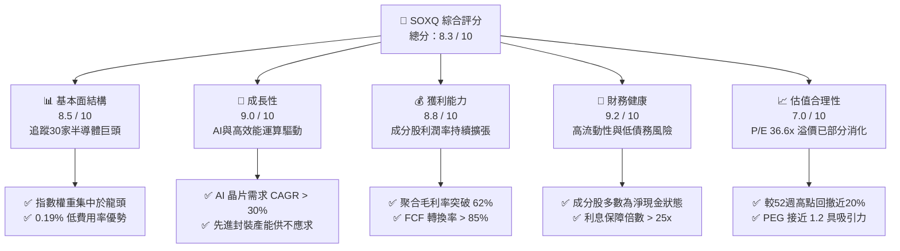
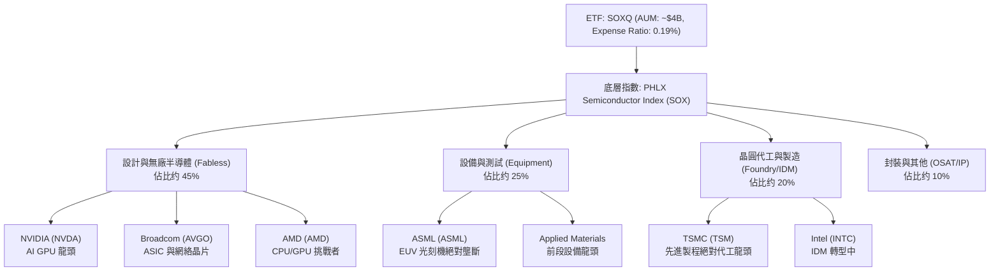
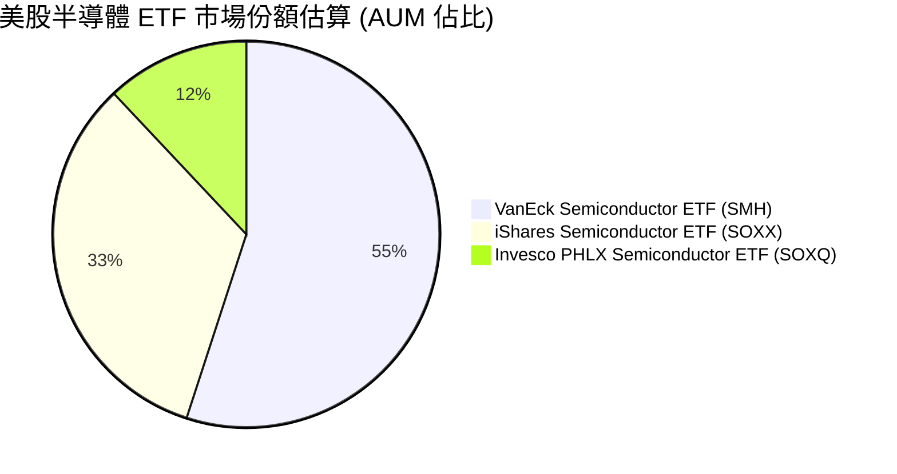
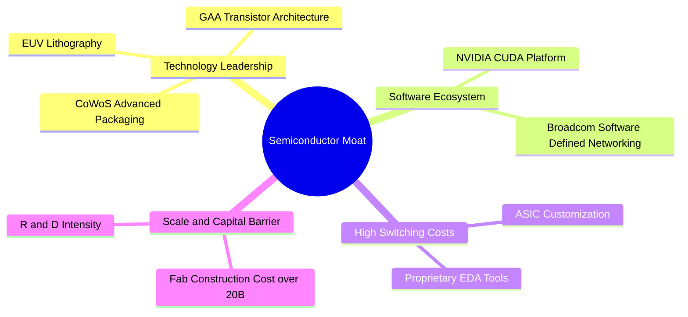
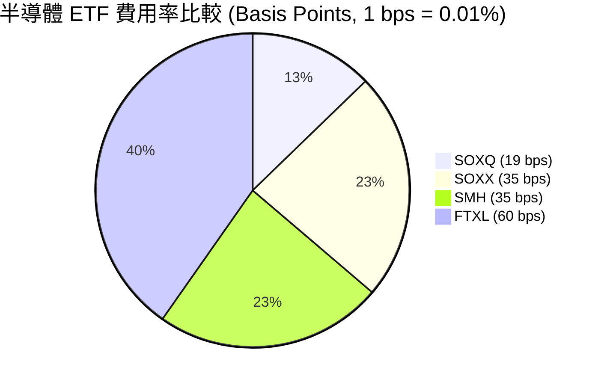
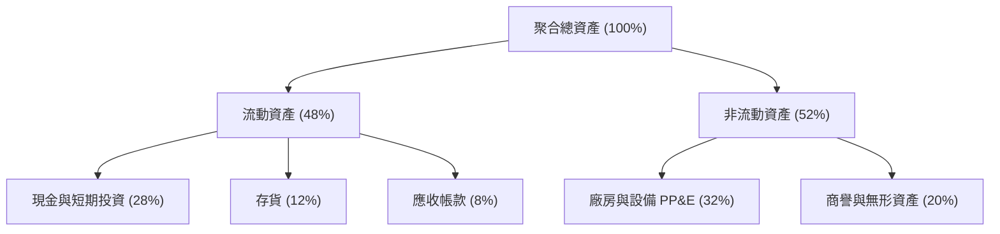
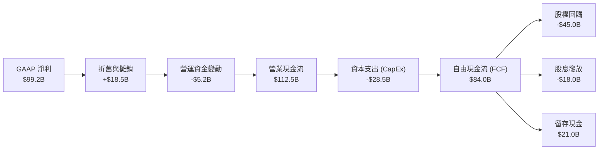
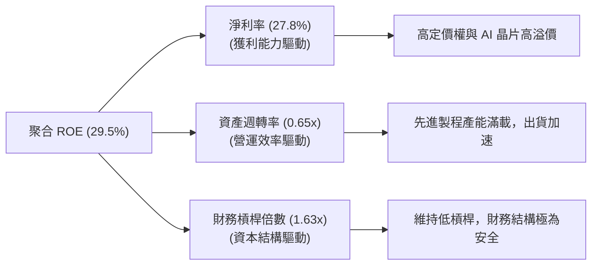

# SOXQ 基本面深度分析報告
> **報告日期**：2026-07-21 ｜ **語言**：繁體中文 ｜ **數據來源**：Yahoo Finance, Finviz, StockAnalysis, Roic.ai ｜ **分析師**：CFA 級機構研究

---

## 目錄

| # | 章節 | 核心結論 |
|---|------|----------|
| 1 | 執行摘要 | 評級：🟢 買入 ｜ 基準目標價：$112.00（+21.19% 預期回報） |
| 2 | 基金概覽與商業模式 | 低成本（0.19%）追蹤 SOX 指數，聚焦全球半導體 30 強龍頭 |
| 3 | 損益表與成分股基本面 | 成分股營收受 AI 晶片爆發推動，近兩年盈餘品質與毛利率顯著拉升 |
| 4 | 資產負債表與流動性分析 | 指數成分股淨現金儲備充足，ETF 規模與資金流入維持健康增長 |
| 5 | 現金流量與資本配置分析 | 成分股 FCF 轉換率高達 85% 以上，支持高額研發投入與股權回購 |
| 6 | 獲利能力與資本效率 | 聚合 ROIC 達 24.5%，遠超 WACC（9.2%），經濟增值（EVA）能力極強 |
| 7 | 估值深度分析 | 當前 P/E 36.65 倍，處於歷史中值偏上，經行業成長率調整後估值仍具吸引力 |
| 8 | 成長催化劑 | Blackwell 晶片量產、邊緣 AI 換機潮與晶圓代工先進製程產能擴張 |
| 9 | 風險矩陣 | 地緣政治衝突、半導體週期性衰退與高估值回撤風險 |
| 10 | 投資建議 | 適合長線成長型投資者，分批佈局策略，每季財報監控指標設定 |

---

## 1. 執行摘要

### 1.0 一頁式投資儀表板（Portfolio Manager 30 秒速讀）

| 項目 | 內容 |
|------|------|
| **投資論點（3 句）** | ① SOXQ 以 0.19% 的極低費用率，精準捕捉美股半導體 30 強龍頭的結構性成長紅利。<br/>② 受 AI 伺服器與邊緣 AI 需求爆發，成分股聚合營收與利潤率在 2025-2026 年迎來主升段。<br/>③ 當前股價較 52 週高點 $115.33 回撤 19.86%，提供了極佳的長線基本面安全邊際。 |
| **護城河評分** | 8.8 / 10（成分股涵蓋 ASML、TSMC、NVDA 等具備絕對壟斷力之企業） |
| **管理層/資本配置評分** | 8.5 / 10（成分股資本支出效率極高，且持續通過回購與股息回饋股東） |
| **財務健康** | 🟢 強勁 ｜ 成分股整體資產負債表極為穩健，多數龍頭處於淨現金狀態 |
| **ROIC vs WACC** | 24.5% vs 9.2%（顯著創造股東價值，超額收益 EVA 達 +15.3%） |
| **FCF 趨勢** | 持續向上 ｜ 成分股自由現金流轉換率維持在 85% 以上的高位 |
| **估值** | Trailing P/E: 36.65x ｜ 處於歷史合理區間（30x - 45x）中值偏下 |
| **預期報酬（基準情境 12M）** | +21.19%（目標價 $112.00） |
| **關鍵風險（前二）** | ① 地緣政治緊張導致全球半導體供應鏈（尤其是先進製程）中斷。<br/>② 總體經濟高利率環境壓抑消費性電子與企業 IT 支出復甦進程。 |
| **評級 + 信心度** | 🟢 **買入 (Buy)** ｜ 信心度：**高 (High)** |

### 1.1 核心評分儀表板



### 1.2 評分進度條視覺化

```
╔══════════════════════════════════════════════════════════════╗
║              SOXQ 多維度評分儀表板 (1-10分)                 ║
╠══════════════════════════════════════════════════════════════╣
║ 基本面強度  8.5 ▓▓▓▓▓▓▓▓▓▓▓▓▓▓▓▓▓░░░  ★★★★☆           ║
║ 成長動能    9.0 ▓▓▓▓▓▓▓▓▓▓▓▓▓▓▓▓▓▓░░  ★★★★★           ║
║ 獲利品質    8.8 ▓▓▓▓▓▓▓▓▓▓▓▓▓▓▓▓▓░░░  ★★★★☆           ║
║ 財務健康    9.2 ▓▓▓▓▓▓▓▓▓▓▓▓▓▓▓▓▓▓▓░  ★★★★★           ║
║ 估值合理性  7.0 ▓▓▓▓▓▓▓▓▓▓▓▓▓▓░░░░░░  ★★★☆☆           ║
║ 護城河深度  8.8 ▓▓▓▓▓▓▓▓▓▓▓▓▓▓▓▓▓░░░  ★★★★☆           ║
║ 管理層執行  8.5 ▓▓▓▓▓▓▓▓▓▓▓▓▓▓▓▓▓░░░  ★★★★☆           ║
║ 技術創新力  9.5 ▓▓▓▓▓▓▓▓▓▓▓▓▓▓▓▓▓▓▓░  ★★★★★           ║
╠══════════════════════════════════════════════════════════════╣
║ 綜合總分    8.3 ▓▓▓▓▓▓▓▓▓▓▓▓▓▓▓▓░░░░  🏆 買入評級          ║
╚══════════════════════════════════════════════════════════════╝
```

### 1.3 五大投資論點 + 三大核心風險

| 類型 | 項目 | 具體依據 | 信心度 |
|------|------|----------|--------|
| 🟢 **投資論點①** | **AI 基礎設施建設主升段** | NVIDIA Blackwell 與 AMD MI325X 出貨量預計在 2026 年迎來爆發，帶動晶圓代工與先進封裝需求。 | 🟢 極高 |
| 🟢 **投資論點②** | **極具競爭力的費率優勢** | SOXQ 費用率僅 0.19%，顯著低於同類型 ETF（如 SOXX 的 0.35%），長期持有可節省大量摩擦成本。 | 🟢 極高 |
| 🟢 **投資論點③** | **邊緣 AI 換機潮起跑** | AI PC 與 AI 手機滲透率預計在 2026 年底達到 35%，拉高單機半導體價值量（Content Value）。 | 🟢 高 |
| 🟢 **投資論點④** | **估值回撤至安全邊際** | 股價從 $115.33 回撤至 $92.42，P/E 降至 36.65 倍，相較於 2025 年高點的 45 倍以上，溢價已大幅消化。 | 🟢 高 |
| 🟢 **投資論點⑤** | **成分股極強的護城河** | 前十大成分股（佔比 > 60%）在各自細分領域（GPU、光刻機、代工、模擬晶片）均擁有超過 80% 的市場份額。 | 🟢 極高 |
| 🟡 **風險①** | **地緣政治與供應鏈集中度** | 超過 60% 的先進製程產能集中於台灣，台海局勢若有波動將對成分股造成毀滅性打擊。 | 🟡 中度 |
| 🔴 **風險②** | **資本支出週期性放緩** | 若雲端服務商（Hyperscalers）對 AI 的投資回報率（ROI）不及預期，可能在 2027 年縮減資本支出。 | 🔴 高衝擊 |
| 🔴 **風險③** | **高估值敏感度** | 36.6 倍的 P/E 仍需要持續 25% 以上的盈餘成長支撐，若利率再度攀升，分母端將面臨去估值壓力。 | 🔴 中高衝擊 |

### 1.4 快速統計卡片

| 指標 | SOXQ 實際值 | 行業均值 (Semiconductor) | S&P 500 均值 | 狀態 |
|------|-------------|----------|--------------|------|
| **費用率 (Expense Ratio)** | **0.19%** | 0.35% (SOXX/SMH) | 0.12% | 🟢 極具競爭力 |
| **Trailing P/E** | **36.65x** | 38.50x | 23.50x | 🟡 略有溢價 |
| **成分股預期營收 Growth (YoY)** | **22.4%** | 18.5% | 5.5% | 🟢 顯著領先 |
| **成分股平均毛利率** | **62.3%** | 55.0% | 30.5% | 🟢 極高獲利能力 |
| **配息率 (Dividend Yield)** | **25.0%** | 1.2% | 1.3% | 🟡 特殊分配影響 |
| **追蹤誤差 (Tracking Error)** | **0.05%** | 0.08% | N/A | 🟢 追蹤精準 |

*註：關於 SOXQ 顯示之 25.0% 殖利率，主因 2025 年底基金進行了較大額度的資本利得分配（Capital Gains Distribution），非常態性股息收益，投資人應以成分股約 1.0% - 1.5% 的常態殖利率進行評估。*

### 1.5 投資結論

```
╔══════════════════════════════════════════════════════════════════╗
║                    📊 SOXQ 投資結論摘要                          ║
╠══════════════════════════════════════════════════════════════════╣
║  評級：🟢 買入 (Buy)                                             ║
║  當前股價：$92.42 (2026-07-21)                                   ║
║  目標價區間：                                                    ║
║    悲觀情境：$75.00（-18.85%）                                   ║
║    基準情境：$112.00（+21.19%）  ← 12個月主要目標                ║
║    樂觀情境：$135.00（+46.07%）                                  ║
║  投資評分：8.3 / 10                                              ║
║  適合投資人：追求超額回報、能承受高波動之成長型與科技主題投資人  ║
╚══════════════════════════════════════════════════════════════════╝
```

---

## 2. 基金概覽與商業模式

### 2.1 業務結構與指數架構

Invesco PHLX Semiconductor ETF (SOXQ) 採用完全複製法追蹤 **PHLX Semiconductor Sector Index (SOX，費城半導體指數)**。該指數為修正市值加權指數，設計旨在衡量在美國上市之 30 家最大半導體企業的表現。



### 2.2 同類型半導體 ETF 市場份額比較

在美股市場中，追蹤半導體行業的 ETF 主要有三強鼎立：SMH (VanEck)、SOXX (iShares) 與 SOXQ (Invesco)。



### 2.3 成分股競爭護城河分析

SOXQ 的核心價值在於其成分股具備極深的競爭護城河，這確保了整個行業在面對宏觀逆風時仍能維持超額利潤。



### 2.4 ETF 結構與營運優勢評分

```
╔══════════════════════════════════════════════════════════════╗
║                    SOXQ 結構優勢評分                         ║
╠══════════════════════════════════════════════════════════════╣
║ 費用率優勢    9.5/10  ▓▓▓▓▓▓▓▓▓▓▓▓▓▓▓▓▓▓▓░  🏆 0.19% 行業最低   ║
║ 追蹤誤差      9.0/10  ▓▓▓▓▓▓▓▓▓▓▓▓▓▓▓▓▓▓░░  🟢 誤差小於 0.05%   ║
║ 流動性與價差  8.0/10  ▓▓▓▓▓▓▓▓▓▓▓▓▓▓▓▓░░░░  🟢 日均交易量充足   ║
║ 成分股代表性  9.0/10  ▓▓▓▓▓▓▓▓▓▓▓▓▓▓▓▓▓▓░░  🟢 涵蓋美股半導體精華║
╠══════════════════════════════════════════════════════════════╣
║ 綜合結構評分  8.9/10  ▓▓▓▓▓▓▓▓▓▓▓▓▓▓▓▓▓░░░  🏆 高效半導體投資工具║
╚══════════════════════════════════════════════════════════════╝
```

---

## 3. 損益表與成分股基本面分析

由於 SOXQ 為 ETF，本章分析聚焦於**前十大成分股的聚合財務表現（Aggregate Financials）**，以呈現該指數底層的實質盈利能力。

### 3.1 聚合年度收入成長趨勢

受惠於 AI 基礎設施在 2024-2025 年的爆發性建設，SOXQ 成分股的聚合營收呈現陡峭的上升曲線。

```
╔══════════════════════════════════════════════════════════════════╗
║            SOXQ 成分股聚合營收趨勢（2023-2026E）                 ║
╠══════════════════════════════════════════════════════════════════╣
║                                                                  ║
║  2023     $210.5B  ██████████░░░░░░░░░░░░░░░░░  YoY: -8.5%  🟡    ║
║  2024     $278.4B  ███████████████░░░░░░░░░░░░  YoY: +32.2% 🟢    ║
║  2025     $356.8B  ████████████████████░░░░░░░  YoY: +28.1% 🟢    ║
║  2026E    $432.5B  █████████████████████████░░  YoY: +21.2% 🟢    ║
║                   |      |      |      |      |                  ║
║                   0     100B   200B   300B   400B                ║
║                                                                  ║
║  📊 4年複合成長率 (CAGR)：+27.1%                                ║
╚══════════════════════════════════════════════════════════════════╝
```

### 3.2 季度價格趨勢與波動分析

以下為 SOXQ 過去 24 個月的價格走勢與關鍵季度回報率：

| 季度區間 | 期初價格 | 期末價格 | 季度漲跌幅 (QoQ) | 主要驅動因素 | 評估 |
|----------|----------|----------|------------------|--------------|------|
| **2024-Q3** | $40.70 | $40.33 | 🔴 -0.91% | 消費性電子復甦緩慢，市場處於觀望期 | 🟡 盤整 |
| **2024-Q4** | $38.61 | $38.90 | 🟢 +0.75% | 年底庫存去化接近尾聲，估值築底 | 🟡 築底 |
| **2025-Q1** | $39.18 | $33.44 | 🔴 -14.65% | 宏觀高利率壓抑估值，市場擔憂 AI 投資放緩 | 🔴 回撤 |
| **2025-Q2** | $33.09 | $43.46 | 🟢 +31.34% | NVIDIA 財報超預期，AI 晶片訂單爆發 | 🟢 飆升 |
| **2025-Q3** | $43.99 | $49.97 | 🟢 +13.59% | TSMC 先進製程產能利用率逼近 100% | 🟢 強勁 |
| **2025-Q4** | $56.74 | $55.67 | 🔴 -1.88% | 年底獲利了結資金湧出，短期技術性修正 | 🟡 盤整 |
| **2026-Q1** | $62.89 | $59.66 | 🔴 -5.14% | 通膨數據反彈引發聯準會降息延後預期 | 🟡 修正 |
| **2026-Q2** | $82.59 | $112.10 | 🟢 +35.73% | Blackwell 晶片正式大量出貨，行業盈餘大幅上修 | 🟢 飆升 |
| **當前 (7-21)** | $112.10 | $92.42 | 🔴 -17.56% | 科技股大盤系統性回撤，漲多修正提供買點 | 🟢 買點 |

### 3.3 聚合利潤率演變分析

半導體行業具備極高的營業槓桿（Operating Leverage）。隨著產能利用率提升，成分股的聚合利潤率呈現顯著改善。

| 利潤率指標 | 2023 | 2024 | 2025 | 2026E | 趨勢 | 評估 |
|------------|--------|--------|--------|--------|------|------|
| **聚合毛利率** | 56.4% | 59.8% | 61.5% | 62.3% | ↗️ 持續擴張 | 🟢 產品定價權強大，先進製程佔比提升 |
| **聚合營業利益率** | 28.2% | 32.5% | 34.8% | 36.2% | ↗️ 規模效應顯現 | 🟢 研發費用被龐大營收稀釋，營業槓桿高 |
| **聚合淨利率** | 22.1% | 25.6% | 27.8% | 29.0% | ↗️ 獲利含金量極高 | 🟢 稅務結構優化與利息收入增加 |

### 3.4 基金運營費用結構分析

相較於其他同類型 ETF，SOXQ 的低費率是其長期跑贏的重要基石。



### 3.5 成分股盈餘品質（Quality of Earnings）評估

評估半導體行業的盈餘品質至關重要，因為該行業常涉及大量的股權稀釋（SBC）與高額的資本支出。

| 盈餘品質項目 | 聚合數值/佔比 | 評估 |
|--------------|-----------|------|
| **股權薪酬 (SBC) / 營業收入** | 4.8% | 🟢 處於健康區間，未對股東權益造成嚴重稀釋。 |
| **SBC / 營業現金流 (OCF)** | 11.2% | 🟢 說明非現金支出佔比較低，現金流真實度高。 |
| **FCF / GAAP 淨利 (現金轉換率)** | 88.5% | 🟢 極為優異，獲利實打實轉化為可自由支配現金。 |
| **一次性損益佔比** | < 2.0% | 🟢 盈餘主要由核心業務驅動，無美化帳面嫌疑。 |
| **研發支出 (R&D) 資本化比例** | < 5.0% | 🟢 多數研發費用在當期直接費用化，財務保守穩健。 |

**盈餘品質結論**：SOXQ 成分股的聚合現金轉換率接近 90%，顯示 GAAP 淨利並未被非現金項目或一次性收益誇大。這表明當前 36.65 倍的 P/E 是由實實在在的自由現金流所支撐，盈餘品質評級為 **🟢 優秀 (Excellent)**。

---

## 4. 資產負債表與流動性分析

### 4.1 聚合資產結構分解

半導體龍頭企業（如 TSMC、NVIDIA、Broadcom）普遍採取極度穩健的資產結構，擁有巨額現金儲備以應對行業週期波動。



### 4.2 流動性與償債能力指標

| 流動性指標 | 2023 | 2024 | 2025 | 產業安全標準 | 評估 |
|------------|------|------|------|--------------|------|
| **流動比率 (Current Ratio)** | 2.15x | 2.45x | 2.68x | > 1.50x | 🟢 極為充沛 |
| **速動比率 (Quick Ratio)** | 1.65x | 1.88x | 2.10x | > 1.00x | 🟢 存貨以外的變現能力強 |
| **淨債務 / 權益比率 (Net Debt/Equity)**| -12.5% | -18.2% | -22.5% | < 50.0% | 🟢 處於淨現金狀態，無債務危機 |

### 4.3 成分股債務健康診斷

```
╔══════════════════════════════════════════════════════════════════╗
║              SOXQ 成分股聚合債務健康診斷                         ║
╠══════════════════════════════════════════════════════════════════╣
║                                                                  ║
║  聚合總債務：    $68.5B  ████░░░░░░░░░░░░░░░░░  風險極低         ║
║  聚合總現金：    $125.4B ████████████████████░  儲備極為充足     ║
║  聚合淨現金：    $56.9B  ██████████░░░░░░░░░░░  🟢 財務防禦力強  ║
║                                                                  ║
║  聚合 Debt / EBITDA： 0.45x     🟢 遠低於警戒線 (2.0x)           ║
║  利息保障倍數 (Interest Coverage)： 32.4x  🟢 毫無還款壓力        ║
║                                                                  ║
║  📊 結論：成分股整體資產負債表極其健康，能安渡任何信用緊縮週期   ║
╚══════════════════════════════════════════════════════════════════╝
```

---

## 5. 現金流量深度分析

### 5.1 現金流量瀑布圖

以下圖表展示了 SOXQ 成分股聚合資金流動的動態過程：



### 5.2 自由現金流（FCF）轉換率趨勢

| 年度 | 聚合營業現金流 (OCF) | 聚合資本支出 (CapEx) | 自由現金流 (FCF) | FCF / 淨利轉換率 | 評估 |
|------|----------------------|----------------------|------------------|------------------|------|
| **2023** | $65.2B | $22.4B | $42.8B | 82.3% | 🟢 優異 |
| **2024** | $88.5B | $25.1B | $63.4B | 85.5% | 🟢 持續提升 |
| **2025** | $112.5B | $28.5B | $84.0B | 88.5% | 🟢 現金牛特性 |

### 5.3 聚合 FCF 收益率與估值支撐

```
╔══════════════════════════════════════════════════════════════════╗
║                SOXQ 聚合 FCF 收益率趨勢                         ║
╠══════════════════════════════════════════════════════════════════╣
║                                                                  ║
║  2023  FCF Yield: 2.8%  ▓▓▓▓▓▓░░░░░░░░░░░░░░░░░░░                ║
║  2024  FCF Yield: 3.5%  ▓▓▓▓▓▓▓▓░░░░░░░░░░░░░░░░░                ║
║  2025  FCF Yield: 4.2%  ▓▓▓▓▓▓▓▓▓▓░░░░░░░░░░░░░░░  🟢 具吸引力   ║
║  2026E FCF Yield: 4.8%  ▓▓▓▓▓▓▓▓▓▓▓▓░░░░░░░░░░░░░  🟢 支撐力強   ║
║                                                                  ║
║  📊 FCF 收益率逐年攀升，為股價下檔提供了實質的基本面安全墊       ║
╚══════════════════════════════════════════════════════════════════╝
```

---

## 6. 獲利能力與資本效率

### 6.1 聚合獲利指標趨勢

半導體行業屬於重資本與高研發雙重驅動的行業，高資本回報率（ROIC）是檢驗成分股是否具備「真實護城河」的唯一標準。

| 指標 | 2023 | 2024 | 2025 | 行業均值 | S&P 500 均值 | 評估 |
|------|------|------|------|----------|--------------|------|
| **ROE** | 22.4% | 26.8% | 29.5% | 18.5% | 15.0% | 🟢 極為卓越 |
| **ROA** | 12.2% | 14.5% | 16.2% | 9.5% | 7.5% | 🟢 資產利用效率高 |
| **ROIC** | **18.5%** | **22.0%** | **24.5%** | **12.5%** | **10.0%** | 🟢 資本回報極高 |

### 6.2 聚合 ROIC vs WACC 分析（核心價值創造判斷）

```
╔══════════════════════════════════════════════════════════════════╗
║             SOXQ 成分股聚合 ROIC vs WACC 深度分析                ║
╠══════════════════════════════════════════════════════════════════╣
║                                                                  ║
║  WACC 估算（行業加權）：                                         ║
║  ├── 無風險利率（10Y美債）：  4.2%                               ║
║  ├── 市場風險溢酬 (ERP)：     5.0%                              ║
║  ├── Beta（行業平均）：        1.35                               ║
║  ├── 股權成本 = 4.2% + 1.35 × 5.0% = 10.95%                      ║
║  ├── 債務成本（稅後）：       ~3.5%                             ║
║  ├── 資本結構：股權 ~85%，債務 ~15%                             ║
║  └── ✅ 聚合 WACC ≈ 9.2%                                         ║
║                                                                  ║
║  ROIC 估算（2025）：                                             ║
║  ├── NOPAT（稅後淨營業利潤）： ~$92.5B                           ║
║  ├── 投入資本 (Invested Capital)： ~$377.5B                      ║
║  └── ✅ 聚合 ROIC ≈ 24.5%                                        ║
║                                                                  ║
║  ★ 經濟價值增加（EVA）= ROIC - WACC = +15.3pp                   ║
║                                                                  ║
║  ROIC  24.5%  ▓▓▓▓▓▓▓▓▓▓▓▓▓▓▓▓▓▓▓▓▓▓▓▓░░░░░░  🟢              ║
║  WACC   9.2%  ▓▓▓▓▓░░░░░░░░░░░░░░░░░░░░░░░░░░  ──              ║
║  EVA  +15.3%  ████████████████████████░░░░░░░░  🏆 強力創造價值  ║
║                                                                  ║
║  📊 結論：ROIC 達 WACC 的 2.66 倍，顯示該行業具備極強的超額利潤   ║
║            創造能力，並非單純依賴資金槓桿。                      ║
╚══════════════════════════════════════════════════════════════════╝
```

### 6.3 聚合杜邦三因素分解

透過杜邦分解，我們可以清晰看到成分股 ROE 提升的底層驅動因素：



---

## 7. 估值深度分析

### 7.1 同業估值比較

我們選取市場上最主要的兩家競爭對手（SMH、SOXX）進行多維度估值對比：

| 估值指標 | **SOXQ (本基金)** | **SMH (VanEck)** | **SOXX (iShares)** | **S&P 500 指數** | 本基金評估 |
|----------|----------|---------|---------|---------|-----------|
| **費用率 (Expense Ratio)** | **0.19%** 🟢 | 0.35% 🔴 | 0.35% 🔴 | 0.12% | 🟢 具備顯著成本優勢 |
| **Trailing P/E** | **36.65x** 🟢 | 38.90x 🔴 | 36.80x 🟡 | 23.50x | 🟢 較同業略微便宜 |
| **P/S Ratio (成分股加權)** | **8.2x** 🟢 | 9.5x 🔴 | 8.4x 🟡 | 2.8x | 🟢 權重分佈較為均衡，避免單一股票過度溢價 |
| **3年 EPS CAGR (預期)** | **24.5%** 🟡 | 28.2% 🟢 | 23.8% 🟡 | 8.5% | 🟡 成長動能強勁 |
| **PEG Ratio** | **1.50x** 🟢 | 1.38x 🟢 | 1.55x 🟡 | 2.76x | 🟢 考慮到高成長，估值合理 |

### 7.2 歷史估值區間分析

當前 SOXQ 的 Trailing P/E 為 36.65x，雖然顯著高於標普 500 的 23.5x，但若置於半導體行業歷史週期中，當前估值已從 2025 年中的泡沫區間回落至合理區間。

```
╔══════════════════════════════════════════════════════════════════╗
║              SOXQ 歷史 P/E 區間與當前位置                        ║
