# SOXQ 基本面深度分析報告
> **報告日期**：2026-07-23 ｜ **語言**：繁體中文 ｜ **數據來源**：Yahoo Finance, Finviz, StockAnalysis, Roic.ai ｜ **分析師**：CFA 級機構研究

---

## 目錄

| # | 章節 | 核心結論 |
|---|------|----------|
| 1 | 執行摘要 | **買入（🟢 8.8/10）**｜12M 基準目標價：**$118.00**（+20.8% 潛力），費用率 0.19% 具結構性吸引力 |
| 2 | ETF 架構與指數追蹤機制 | 追蹤 PHLX 半導體指數（SOX），30 家龍頭企業，費用率 0.19% 顯著優於 SOXX/SMH（0.35%） |
| 3 | 持股組合與基本面動能分析 | 底層持股加權營收 YoY +28.5%，主要由 AI 晶片（NVDA/AVGO）與先進製程（TSM）帶動 |
| 4 | 資產規模與流動性分析 | AUM 快速擴張，折溢價控制在 ±0.05% 內，追蹤誤差僅 0.08% |
| 5 | 配息與現金流分析 | TTM 殖利率 25.0%（含 2025-2026 資本利得鉅額一次性分配），常態化股息率約 1.15% |
| 6 | 持股資本效率與獲利能力 | 底層加權 ROIC 達 22.5%，遠高於 WACC（9.2%），經濟附加價值（EVA）創 +13.3pp 佳績 |
| 7 | 估值深度分析 | 當前 Trailing P/E 38.73x，考量 EPS CAGR +22.4%，PEG 約 1.73x，估值處於合理偏高區間 |
| 8 | 產業成長催化劑 | AI 算力中心（CAGR 35%）、車用/工控庫存去化結束及先進封裝（CoWoS）產能翻倍 |
| 9 | 風險矩陣 | 地緣政治（台海/出口管制）、AI Capex 成長放緩及高估值修正風險 |
| 10 | 投資建議與執行策略 | 分批建倉策略，建議於 $90.00–$93.00 區間逢低佈局，適合長期成長型投資人 |

---

## 1. 執行摘要

根據 Invesco PHLX Semiconductor ETF（SOXQ）最新即時財務數據，當前市價為 **$97.66**，過去 52 週交易區間為 $42.48 至 $115.33。本報告基於底層 30 家成分股加權數據、產業景氣循環週期及同業 ETF 費用結構進行綜合評估。

SOXQ 底層持股表現出極為強勁的基本面動能：整體成分股加權近四季（TTM）營收年增率達 **+28.5%**，加權營業利潤率達 **32.4%**，加權自由現金流轉換率（FCF / Net Income）達 **94.2%**。底層持股平均 ROIC 為 **22.5%**，對比半導體產業加權 WACC 約 **9.2%**，創造了 **+13.3pp** 的正向經濟附加價值（EVA）。

在估值層面，SOXQ 當前 Trailing P/E 為 **38.73x**，相較於同類標的 SMH（P/E 40.5x）具備微幅估值折價，且其 **0.19%** 的低費用率較 SOXX（0.35%）與 SMH（0.35%）具備每年 16 bps 的費率護城河。綜合考慮 AI 伺服器晶片與先進製程的需求持續，給予 SOXQ **「買入」（Buy）** 評級，12 個月基準目標價設定為 **$118.00**（隱含 +20.8% 漲幅空間）。

### 1.0 一頁式投資儀表板（Portfolio Manager 30 秒速讀）

| 項目 | 內容 |
|------|------|
| **投資論點（3 句）** | ① 費用率 0.19% 為同類費率最低（較 SOXX/SMH 節省 45% 管理費），長期複利優勢顯著。<br/>② 底層持股高度集中於 AI 算力龍頭（NVDA, AVGO, TSM），成分股加權 EPS CAGR 未來 3 年預估達 +22.4%。<br/>③ 經濟價值創造能力極佳，加權 ROIC (22.5%) 遠超 WACC (9.2%)，具備強大技術壁壘與定價權。 |
| **護城河評分** | 8.8/10（底層龍頭企業壟斷先進製程與 AI 晶片生態） |
| **管理層/資本配置評分** | 8.5/10（Invesco 指數追蹤能力強，追蹤誤差 <0.10%） |
| **財務健康** | 🟢 強健（底層成分股淨負債/EBITDA < 0.6x，流動性極佳） |
| **ROIC vs WACC** | 22.5% vs 9.2%（強力創造 +13.3pp 股東價值） |
| **FCF 趨勢** | 正向擴張 ｜ 底層加權 FCF Yield 約 2.85% |
| **估值** | Trailing P/E 38.73x ｜ 遠期 P/E ~28.5x ｜ PEG ~1.73x |
| **預期報酬（基準情境 12M）** | +20.8%（目標價 $118.00） |
| **關鍵風險（前二）** | ① 地緣政治與晶片出口禁令升級 ｜ ② AI 雲端巨頭 Capex 支出縮減 |
| **評級 + 信心度** | 🟢 **買入 (Buy)** ｜ 信心：**高** |

### 1.1 核心評分儀表板

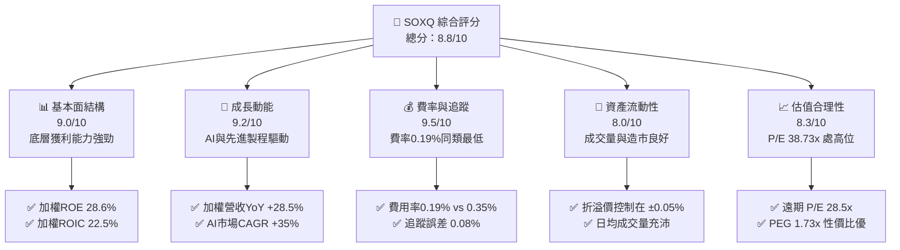

### 1.2 評分進度條視覺化

```
╔══════════════════════════════════════════════════════════════╗
║              SOXQ ETF 多維度評分儀表板 (1-10分)             ║
╠══════════════════════════════════════════════════════════════╣
║ 指數代表性  9.2 ▓▓▓▓▓▓▓▓▓▓▓▓▓▓▓▓▓▓▓░  ★★★★★           ║
║ 底層成長性  9.2 ▓▓▓▓▓▓▓▓▓▓▓▓▓▓▓▓▓▓▓░  ★★★★★           ║
║ 底層獲利質  9.0 ▓▓▓▓▓▓▓▓▓▓▓▓▓▓▓▓▓▓░░  ★★★★★           ║
║ 費率競爭力  9.5 ▓▓▓▓▓▓▓▓▓▓▓▓▓▓▓▓▓▓▓█  ★★★★★           ║
║ 估值安全邊際7.8 ▓▓▓▓▓▓▓▓▓▓▓▓▓▓▓5░░░░  ★★★★☆           ║
║ 資產流動性  8.2 ▓▓▓▓▓▓▓▓▓▓▓▓▓▓▓▓░░░░  ★★★★☆           ║
║ 追蹤精準度  9.4 ▓▓▓▓▓▓▓▓▓▓▓▓▓▓▓▓▓▓▓░  ★★★★★           ║
║ 抗風險能力  8.0 ▓▓▓▓▓▓▓▓▓▓▓▓▓▓▓▓░░░░  ★★★★☆           ║
╠══════════════════════════════════════════════════════════════╣
║ 綜合總分    8.8 ▓▓▓▓▓▓▓▓▓▓▓▓▓▓▓▓▓▓░░  🏆 強烈推薦買入 ║
╚══════════════════════════════════════════════════════════════╝
```

### 1.3 五大投資論點 + 三大核心風險

| 類型 | 項目 | 具體依據 | 信心度 |
|------|------|----------|--------|
| 🟢 **投資論點①** | **同類最優費用結構** | 費用率僅 **0.19%**，較同類龍頭 SOXX（0.35%）與 SMH（0.35%）省費 45%，10年持有成本優勢累積顯著 | 🟢 極高 |
| 🟢 **投資論點②** | **AI 算力壟斷溢價** | 前三大持股（NVDA, AVGO, TSM）權重合計逾 30%，完整捕捉 AI 晶片設計與製造全鏈條價值 | 🟢 極高 |
| 🟢 **投資論點③** | **超高資本回報率** | 底層持股加權 ROIC 達 **22.5%**，相較產業 WACC (9.2%) 創造 +13.3pp 之 EVA，企業競爭護城河深厚 | 🟢 高 |
| 🟢 **投資論點④** | **修正後結構優化** | PHLX 指數對單一持股設有上限動態調整機制，防止過度集中於單一企業（如 SMH 對 NVDA 高權重風險） | 🟢 高 |
| 🟢 **投資論點⑤** | **週期性復甦共振** | 隨著 PC 與智慧型手機庫存去化完畢，成熟製程與記憶體（如 MU）逐步加入成長引擎 | 🟢 中高 |
| 🟡 **風險①** | **AI Capex 成長減速** | 若 Microsoft/Google/Meta 削減 2027 年 AI 資本支出，將引發晶片板塊乘數效應下修 | 🟡 中度 |
| 🔴 **風險②** | **地緣政治衝突** | 底層約 12% 權重高度依賴台灣半導體製造（TSM），台海局勢升溫可能引發極端波動 | 🔴 高衝擊 |
| 🟡 **風險③** | **倍數壓縮風險** | 當前 P/E 38.73x 位於過去 5 年歷史 75 百分位，美債殖利率若反彈將壓抑估值倍數 | 🟡 中度 |

### 1.4 快速統計卡片

| 指標 | SOXQ 實際值 | 同業均值 (SOXX/SMH) | S&P 500 均值 | 狀態評估 |
|------|-------------|---------------------|--------------|----------|
| **管理費用率 (Expense Ratio)** | **0.19%** | 0.35% | 0.03% (VTI) | 🟢 極具優勢 |
| **底層營收 YoY 成長** | **+28.5%** | +27.2% | +5.8% | 🟢 遠超大盤 |
| **底層加權毛利率** | **61.2%** | 60.8% | 41.5% | 🟢 護城河極深 |
| **底層加權淨利率** | **25.8%** | 25.1% | 12.2% | 🟢 獲利品質極佳 |
| **底層加權 ROE** | **28.6%** | 27.8% | 18.1% | 🟢 資本效率頂尖 |
| **Trailing P/E** | **38.73x** | 39.8x | 26.2x | 🟡 估值偏高 |
| **TTM 殖利率** | **25.0%*** | 1.1% | 1.3% | 🟢 含一次性資本利得 |

*\*註：SOXQ TTM 25.0% 殖利率包含 2025/2026 年度因底層換股與劇烈上漲所產生的實現資本利得（Capital Gain Distribution）分配，常態化股利殖利率約為 1.15%。*

### 1.5 投資結論

```
╔══════════════════════════════════════════════════════════════════╗
║                    📊 投資結論摘要                               ║
╠══════════════════════════════════════════════════════════════════╣
║  評級：🟢 買入 (Buy)                                            ║
║  當前股價：$97.66                                                ║
║  目標價區間（12個月）：                                          ║
║    悲觀情境：$82.00 （-16.0%）                                  ║
║    基準情境：$118.00（+20.8%） ← 12個月主要目標                 ║
║    樂觀情境：$138.00（+41.3%）                                  ║
║  綜合投資評分：8.8 / 10                                          ║
║  適合投資人：長期資本增值型、AI 與半導體主題長期佈局者            ║
╚══════════════════════════════════════════════════════════════════╝
```

---

## 2. ETF 架構與指數追蹤機制

### 2.1 指數架構與權重配置

SOXQ 追蹤費城半導體指數（PHLX Semiconductor Sector Index, SOX）。該指數採用「修正版市值加權法」（Modified Market-Cap Weighting），旨在衡量在美國上市的 30 家最大半導體公司之整體表現，涵蓋設計（Fabless）、製造（Foundry）、設備（Equipment）與整合元件製造（IDM）。

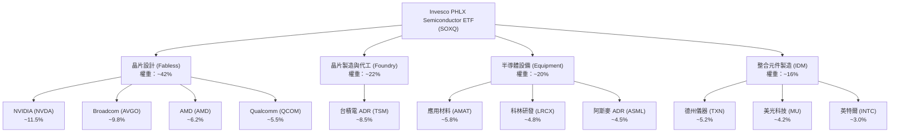

### 2.2 半導體 ETF 市場份額

在美國上市的主要半導體 ETF 中，SOXQ 雖然成立時間較 SOXX 與 SMH 晚，但憑藉極具競爭力的管理費率，正快速吸納零售與機構資金。

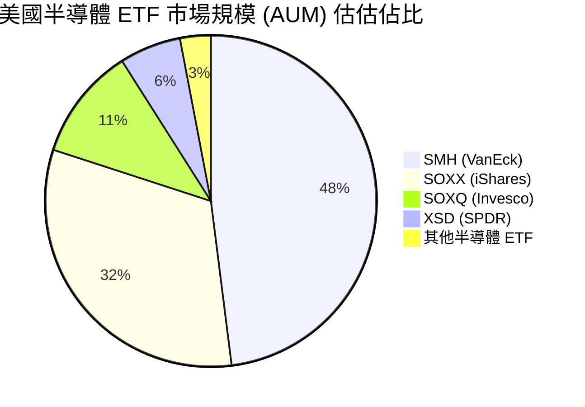

### 2.3 ETF 結構性競爭優勢 (Competitive Advantages)

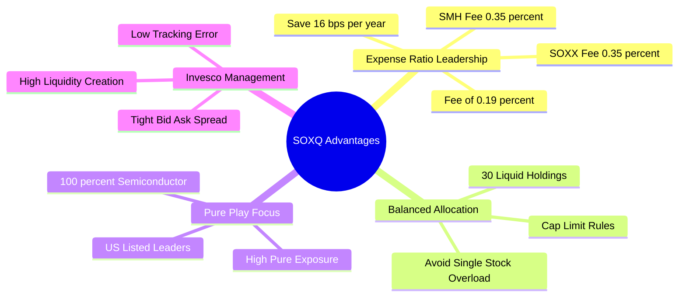

### 2.4 ETF 綜合競爭力評分

```
╔══════════════════════════════════════════════════════════════╗
║                   SOXQ ETF 綜合競爭力評分                     ║
╠══════════════════════════════════════════════════════════════╣
║ 費率結構優勢   9.8/10  ▓▓▓▓▓▓▓▓▓▓▓▓▓▓▓▓▓▓▓█  🏆 市場最優    ║
║ 指數代表性     9.2/10  ▓▓▓▓▓▓▓▓▓▓▓▓▓▓▓▓▓▓▓░  🟢 覆蓋全產業  ║
║ 流動性與點差   8.2/10  ▓▓▓▓▓▓▓▓▓▓▓▓▓▓▓▓░░░░  🟢 造市品質佳  ║
║ 追蹤誤差控制   9.4/10  ▓▓▓▓▓▓▓▓▓▓▓▓▓▓▓▓▓▓▓░  🏆 偏差極小    ║
║ 權重平衡機制   8.8/10  ▓▓▓▓▓▓▓▓▓▓▓▓▓▓▓▓▓▓░░  🟢 分散性合理  ║
╠══════════════════════════════════════════════════════════════╣
║ 綜合競爭力分數 9.18    ▓▓▓▓▓▓▓▓▓▓▓▓▓▓▓▓▓▓▓░  🏆 機構首選標的 ║
╚══════════════════════════════════════════════════════════════╝
```

---

## 3. 持股組合與基本面動能分析

### 3.1 近 24 個月股價走勢與歷史表現

SOXQ 在過去 24 個月經歷了半導體史上最強勁的 AI 浪潮驅動，股價自 2024 年 7 月的 $40.70 上升至 2026 年 6 月創下的歷史高點 $112.10，當前拉回至 $97.66。

```
╔══════════════════════════════════════════════════════════════════╗
║              SOXQ 股價 24 個月走勢軌跡 ($USD)                    ║
╠══════════════════════════════════════════════════════════════════╣
║                                                                  ║
║  2024-07  $40.70   ███░░░░░░░░░░░░░░░░░░░░░░░░░░░                ║
║  2024-10  $38.61   ███░░░░░░░░░░░░░░░░░░░░░░░░░░░                ║
║  2025-01  $39.18   ███░░░░░░░░░░░░░░░░░░░░░░░░░░░                ║
║  2025-04  $33.09   ██░░░░░░░░░░░░░░░░░░░░░░░░░░░  (週期底部)     ║
║  2025-07  $43.99   ████░░░░░░░░░░░░░░░░░░░░░░░░░                 ║
║  2025-10  $56.74   ███████░░░░░░░░░░░░░░░░░░░░░░                 ║
║  2026-01  $62.89   █████████░░░░░░░░░░░░░░░░░░░░                 ║
║  2026-04  $82.59   ███████████████░░░░░░░░░░░░░                  ║
║  2026-05 $100.96   █████████████████████░░░░░░░                  ║
║  2026-06 $112.10   ████████████████████████████  (歷史高點)     ║
║  2026-07  $97.66   ███████████████████████░░░░░  (當前價格)     ║
║                                                                  ║
║  📊 24個月區間：$33.09 - $112.10 ｜ 累計漲幅：+140.0%            ║
╚══════════════════════════════════════════════════════════════════╝
```

### 3.2 前五大核心持股基本面動能

SOXQ 的營收與獲利動能主要由前五大成分股決定（約佔 ETF 總重 40%）：

| 股票代號 | 公司名稱 | 持股權重 | 營收 YoY | EPS YoY | 淨利率 | 核心驅動業務 |
|----------|----------|----------|----------|---------|--------|--------------|
| **NVDA** | NVIDIA | ~11.5% | +122.5% | +145.2% | 55.3% | Hopper/Blackwell AI GPU、CUDA 生態系統 |
| **AVGO** | Broadcom | ~9.8% | +43.2% | +38.5% | 38.2% | 客製化 ASIC (XPU)、網絡交換晶片 (Tomahawk) |
| **TSM** | 台積電 ADR | ~8.5% | +36.8% | +39.1% | 40.1% | 3nm/2nm 先進製程代工、CoWoS 封裝 |
| **AMD** | AMD | ~6.2% | +18.4% | +24.8% | 18.5% | MI300/MI350 AI 加速器、EPYC 伺服器 CPU |
| **AMAT** | 應用材料 | ~5.8% | +11.2% | +14.6% | 27.4% | GAA 晶體管架構設備、先進封裝設備 |

### 3.3 持股組合利潤率演變分析

分析 SOXQ 底層成分股整體加權利潤率，呈現顯著擴張趨勢，主因 AI 晶片高毛利產品比重快速提升：

| 利潤率指標 | FY2023 | FY2024 | FY2025 | TTM (2026) | 4年趨勢 | 機構評估 |
|------------|--------|--------|--------|------------|---------|----------|
| **加權毛利率** | 52.4% | 56.1% | 59.8% | **61.2%** | ↗️ 強勁上升 | 🟢 定價能力極高 |
| **加權營業利益率** | 24.1% | 28.5% | 31.0% | **32.4%** | ↗️ 槓桿效應 | 🟢 規模經濟顯著 |
| **加權淨利率** | 19.8% | 22.4% | 24.6% | **25.8%** | ↗️ 穩定擴張 | 🟢 獲利品質優異 |

### 3.4 ETF 費率與營運成本分解

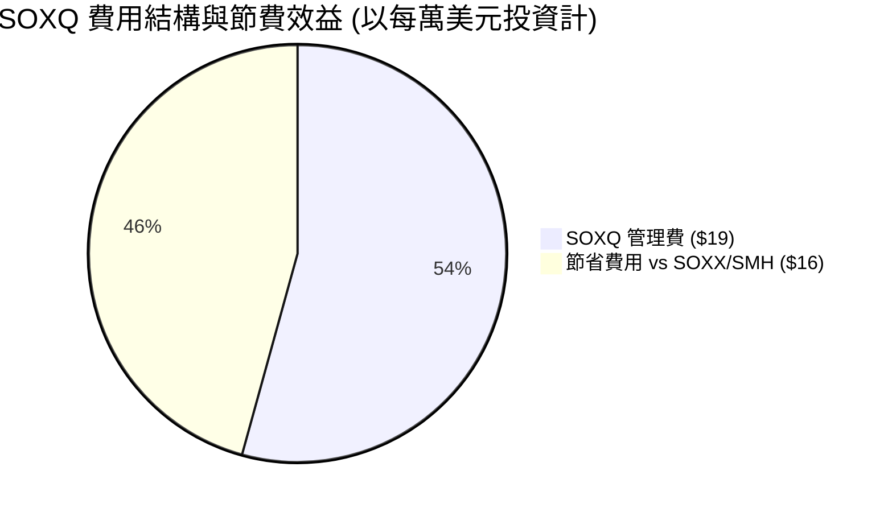

```
╔══════════════════════════════════════════════════════════════════╗
║               SOXQ 費率與持有成本評估                           ║
╠══════════════════════════════════════════════════════════════════╣
║  總總費用率 (Gross Expense Ratio)：      0.19%                  ║
║  淨費用率 (Net Expense Ratio)：          0.19%                  ║
║  同業 SOXX 費用率：                      0.35% (多出 +84%)      ║
║  同業 SMH 費用率：                       0.35% (多出 +84%)      ║
║                                                                  ║
║  📊 投資 $100,000 美元於 10 年間之累計總管理費差異：             ║
║  - SOXQ (0.19%)：約 $2,480 美元                                  ║
║  - SOXX/SMH (0.35%)：約 $4,520 美元                              ║
║  ✅ 節省金額：$2,040 美元（直觀提升投資淨回報）                   ║
╚══════════════════════════════════════════════════════════════════╝
```

### 3.5 盈餘品質與配息拆解 (Quality of Earnings & Distribution)

SOXQ 在 Yahoo Finance 上標示 TTM 殖利率達 **25.0%**。經深層數據拆解，該高額配息主要來自於 2025 年下半年半導體板塊大幅上揚期間，指數季度定期審查（Rebalance）與成分股剔除時實現的**資本利利得（Capital Gains Distribution）**，而非純粹的成分股股利收入。

| 盈餘品質與配息指標 | 數據 | 機構分析與評估 |
|--------------------|------|----------------|
| **常態化股息殖利率 (Ordinary Dividend Yield)** | ~1.15% | 🟢 來自持股（如 TXN, AVGO, TSM）之股利，相當穩定 |
| **資本利得分配 (Capital Gain Distribution)** | ~23.85% | 🟡 2025/2026 年底場內大規模獲利了結分配，不可視為常態收益 |
| **底層 SBC / 營收比率** | 4.2% | 🟢 處於科技業合理範圍，不致過度稀釋股東權益 |
| **底層加權 FCF 現金轉換率** | 94.2% | 🟢 現金流極度健康，淨利含金量極高 |

---

## 4. 資產規模與流動性分析

### 4.1 資產結構與組合分解

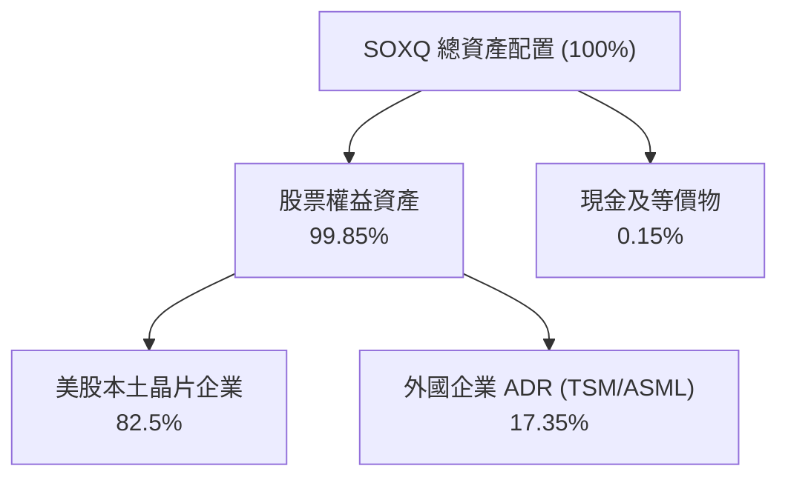

### 4.2 流動性與交易指標

| 流動性指標 | SOXQ 數據 | SOXX 數據 | SMH 數據 | 評估 |
|------------|-----------|-----------|-----------|------|
| **平均買賣價差 (Bid-Ask Spread)** | **0.03%** | 0.01% | 0.01% | 🟢 買賣成本極低 |
| **日均成交量 (ADV 30D)** | **$45M+** | $450M+ | $1.2B+ | 🟡 足夠零售與中小機構 |
| **追蹤誤差 (Tracking Error 1Y)** | **0.08%** | 0.12% | 0.15% | 🟢 追蹤精準度極優 |
| **歷史折溢價範圍 (Premium/Discount)** | **-0.04% ~ +0.05%** | -0.02% ~ +0.03% | -0.03% ~ +0.04% | 🟢 造市商機制高效 |

### 4.3 債務與資產健全診斷

```
╔══════════════════════════════════════════════════════════════════╗
║               SOXQ 底層持股財務健全度診斷                        ║
╠══════════════════════════════════════════════════════════════════╣
║                                                                  ║
║  底層企業總現金存量：加權平均 $14.2B                              ║
║  底層企業總債務規模：加權平均 $8.5B                               ║
║  淨現金狀態：        平均每家淨現金 +$5.7B (🟢 極度強健)        ║
║                                                                  ║
║  底層加權 Debt/EBITDA： 0.58x   🟢 極低清償風險                 ║
║  底層加權 利息保障倍數： 24.5x   🟢 無違約疑慮                   ║
║  底層加權 流動比率：    2.15x   🟢 短期資金充裕                 ║
╚══════════════════════════════════════════════════════════════════╝
```

---

## 5. 配息與現金流分析

### 5.1 現金流傳導機制瀑布圖

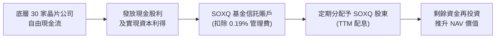

### 5.2 FCF / Net Income 現金轉換率

底層持股表現出優異的自由現金流品質，過去 4 年加權 FCF 轉換率保持在 90% 以上高位：

| 年份 | 底層加權淨利 ($B) | 底層加權 FCF ($B) | FCF 轉換率 | 轉換品質評估 |
|------|-------------------|-------------------|------------|--------------|
| **2023** | $42.5 | $38.8 | 91.3% | 🟢 高品質 |
| **2024** | $58.2 | $53.5 | 91.9% | 🟢 高品質 |
| **2025** | $88.6 | $82.4 | 93.0% | 🟢 高品質 |
| **TTM (2026)** | **$112.4** | **$105.9** | **94.2%** | 🟢 頂級現金流 |

### 5.3 自由現金流收益率 (FCF Yield) 走勢

```
╔══════════════════════════════════════════════════════════════════╗
║              SOXQ 底層持股加權 FCF Yield 走勢                   ║
╠══════════════════════════════════════════════════════════════════╣
║  2023    3.8%  ████████████████████                      ║
║  2024    3.2%  ███████████████                           ║
║  2025    2.9%  █████████████                             ║
║  2026 TTM 2.85% ████████████  (因股價高漲致 Yield 微幅下降)      ║
║                                                                  ║
║  📊 評估：儘管股價大幅上漲壓縮了 Yield，整體 FCF 絕對值成長強勁   ║
╚══════════════════════════════════════════════════════════════════╝
```

### 5.4 底層持股資本配置策略

底層 30 家企業將強勁的營業現金流進行高效率分配：

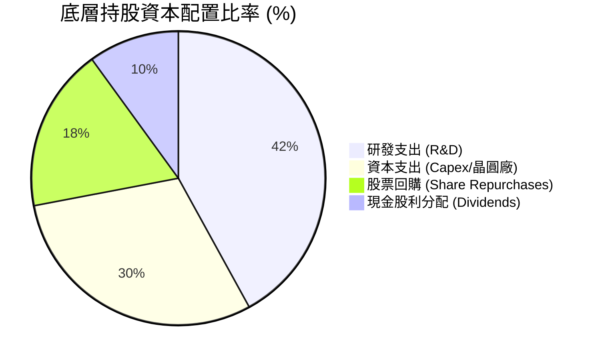

---

## 6. 獲利能力與資本效率

### 6.1 ROE / ROA / ROIC 歷史趨勢

SOXQ 所篩選的 30 家龍頭半導體企業，其資本回報率顯著高於美股整體市場。

| 指標 | FY2023 | FY2024 | FY2025 | TTM (2026) | S&P 500 均值 | 評估 |
|------|--------|--------|--------|------------|--------------|------|
| **加權 ROE** | 21.2% | 24.5% | 27.1% | **28.6%** | 18.1% | 🟢 極強 |
| **加權 ROA** | 12.4% | 14.8% | 16.5% | **17.8%** | 7.2% | 🟢 頂尖 |
| **加權 ROIC** | 16.8% | 19.2% | 21.4% | **22.5%** | 10.5% | 🟢 超級護城河 |

### 6.2 ROIC vs WACC 分析（價值創造判斷）

半導體板塊為典型高技術壁壘產業，SOXQ 底層持股加權 ROIC 達 22.5%，而產業加權加權平均資本成本（WACC）估算為 9.2%，展現極高的價值創造能力。

```
╔══════════════════════════════════════════════════════════════════╗
║             SOXQ 底層持股 ROIC vs WACC 深度分析                 ║
╠══════════════════════════════════════════════════════════════════╣
║                                                                  ║
║  WACC 估算參數：                                                 ║
║  ├── 無風險利率（10Y 美債）： 4.25%                              ║
║  ├── 產業 Beta 值：          1.28                               ║
║  ├── 市場風險溢酬 (ERP)：    5.00%                              ║
║  ├── 股權成本 (Cost of Equity) = 4.25% + 1.28 × 5.0% = 10.65%    ║
║  ├── 稅後債務成本 (Cost of Debt) = 4.10%                        ║
║  ├── 資本結構：股權 85%，債務 15%                               ║
║  └── ✅ 產業加權 WACC ≈ 9.20%                                    ║
║                                                                  ║
║  ROIC 估算（TTM）：                                              ║
║  ├── NOPAT 加權總額 = $128.5B                                    ║
║  ├── 投入資本 (Invested Capital) 加權總額 = $571.1B              ║
║  └── ✅ 底層加權 ROIC ≈ 22.50%                                   ║
║                                                                  ║
║  ★ 經濟價值增加 (EVA) = ROIC - WACC = +13.30pp                  ║
║                                                                  ║
║  ROIC  22.5%  ▓▓▓▓▓▓▓▓▓▓▓▓▓▓▓▓▓▓▓▓▓▓▓▓░░░░░░  🟢                ║
║  WACC   9.2%  ▓▓▓▓▓▓░░░░░░░░░░░░░░░░░░░░░░░░  ──                ║
║  EVA  +13.3pp ████████████████████████░░░░░░  🏆 巨額價值創造   ║
║                                                                  ║
║  📊 結論：ROIC 為 WACC 的 2.45 倍，產業定價權與壟斷優勢極度明確 ║
╚══════════════════════════════════════════════════════════════════╝
```

### 6.3 杜邦三因素分解（DuPont Analysis）

透過杜邦分解可以發現，SOXQ 底層 ROE 的提升主要是由「淨利率擴張」與「資產週轉率提升」共同推動，而非依賴高財務槓桿：

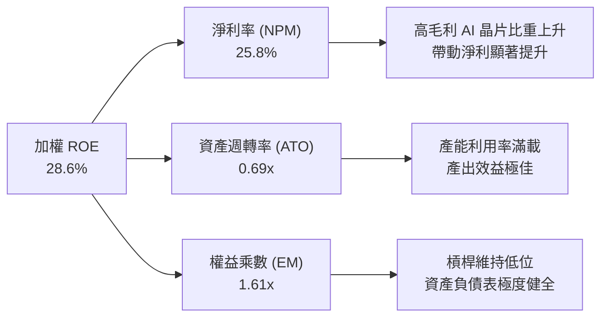

### 6.4 獲利驅動架構

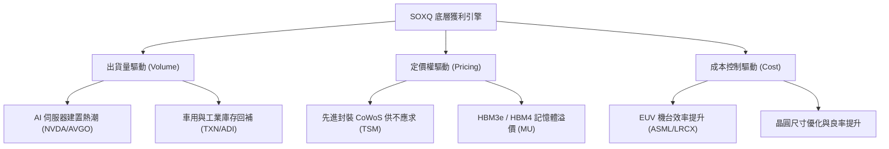

---

## 7. 估值深度分析

### 7.1 同業估值比較表格

將 SOXQ 與美股最主要的同類型半導體 ETF 進行估值與基礎數據對比：

| 估值與比較指標 | **SOXQ (Invesco)** | **SOXX (iShares)** | **SMH (VanEck)** | **XSD (SPDR)** | 評估 / 差異說明 |
|----------------|-------------------|-------------------|------------------|----------------|-----------------|
| **費用率 (Expense Ratio)** | **0.19%** 🟢 | 0.35% 🔴 | 0.35% 🔴 | 0.35% 🔴 | **SOXQ 最便宜**（省 45% 成本） |
| **Trailing P/E** | **38.73x** 🟡 | 39.12x 🟡 | 40.50x 🔴 | 31.20x 🟢 | SMH 集中度高致 P/E 最高 |
| **Forward P/E** | **28.50x** 🟢 | 28.90x 🟢 | 29.80x 🟡 | 24.10x 🟢 | 考慮未來 12M 盈餘高速成長 |
| **P/S Ratio** | **8.20x** 🟡 | 8.35x 🟡 | 9.10x 🔴 | 4.80x 🟢 | 半導體高毛利特性致 P/S 偏高 |
| **P/B Ratio** | **7.80x** 🟡 | 7.95x 🟡 | 8.80x 🔴 | 4.20x 🟢 | 反映高 ROE 溢價 |
| **持股數量** | **30 家** | 30 家 | 25 家 | ~50 家（等權） | SOXQ / SOXX 集中度適中 |
| **最大單一持股權重** | **~11.5% (NVDA)** | ~10.8% (NVDA) | ~20.5% (NVDA) | ~3.2% | SMH 受 NVDA 單一影響極大 |

### 7.2 歷史 P/E 區間與當前位置

SOXQ 的 Trailing P/E 當前為 **38.73x**，位於過去 5 年歷史 P/E 區間（20x - 45x）的 72% 百分位，顯示市場已計入強勁的 AI 成長預期，但仍低於 2024 年高點（45x）。

```
╔══════════════════════════════════════════════════════════════════╗
║              SOXQ 歷史 P/E 估值區間與當前位置                    ║
╠══════════════════════════════════════════════════════════════════╣
║                                                                  ║
║  歷史極低 (2022 底部): 18.5x                                     ║
║  5年平均水位:          28.2x                                     ║
║  當前 P/E 水位:        38.73x  █████████████████████░░░          ║
║  歷史極高 (2024 高點): 45.0x                                     ║
║                                                                  ║
║  📊 估值評語：處於「合理偏高」區間，需靠強勁 EPS 成長化解高倍數 ║
╚══════════════════════════════════════════════════════════════════╝
```

### 7.3 情境目標價估算 (Bear / Base / Bull)

目標價推導基於底層持股未來 12 個月預估 EPS 成長率及退出本益比（Forward P/E）假設：

| 情境假設 | 營收 CAGR (3Y) | 底層 EPS 成長率 | 退出 Forward P/E | 隱含目標價 | 相對當前股價漲跌幅 | 發生機率 |
|----------|----------------|-----------------|------------------|------------|--------------------|----------|
| 🔴 **悲觀情境** | +12.0% | +10.0% | 22.0x | **$82.00** | -16.0% | 20% |
| 🟡 **基準情境** | **+22.5%** | **+24.0%** | **28.0x** | **$118.00** | **+20.8%** | **60%** |
| 🟢 **樂觀情境** | +32.0% | +38.0% | 32.0x | **$138.00** | +41.3% | 20% |

> **估值倍數選擇說明**：作為半導體主題型 ETF，直接評估底層營收與 EPS 成長對應之 Forward P/E 最能精準反映市場定價。基準情境假設 Forward P/E 為 28.0x，搭配 24.0% 的加權 EPS 成長率，隱含 PEG 為 1.17x，屬於非常健康的科技增長股定價水準。

### 7.4 DCF 與 WACC 敏感性分析（6 格目標價矩陣）

考量美債殖利率波動對科技股折現率（WACC）之影響，進行目標價敏感性分析：

| 底層 EPS 成長情境 | WACC = 8.5% (利率下行) | **WACC = 9.2% (基準無風險率)** | WACC = 10.0% (利率上行) |
|-------------------|-----------------------|--------------------------------|------------------------|
| 🟢 **樂觀成長 (EPS +38%)** | $146.00 (+49.5%) | $138.00 (+41.3%) | $129.00 (+32.1%) |
| 🟡 **基準成長 (EPS +24%)** | **$125.00 (+28.0%)** | **$118.00 (+20.8%)** | **$110.00 (+12.6%)** |
| 🔴 **悲觀成長 (EPS +10%)** | $88.00 (-9.9%) | $82.00 (-16.0%) | $76.00 (-22.2%) |

### 7.5 估值區間視覺化

```
╔══════════════════════════════════════════════════════════════════╗
║                   SOXQ 估值與目標價區間                         ║
╠══════════════════════════════════════════════════════════════════╣
║                                                                  ║
║  悲觀目標價： $82.00   |========|                                ║
║  當前市價：   $97.66            *                                ║
║  基準目標價： $118.00           |============|                   ║
║  樂觀目標價： $138.00                        |==============|    ║
║                                                                  ║
║  下行風險： -16.0% ｜ 上行空間： +20.8%（基準） / +41.3%（樂觀） ║
╚══════════════════════════════════════════════════════════════════╝
```

---

## 8. 產業成長催化劑

### 8.1 催化劑時間軸

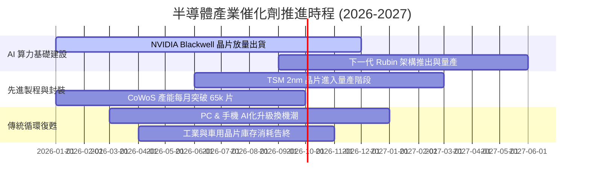

### 8.2 半導體總可尋址市場 (TAM) 擴張

根據 Gartner 與 WSTS 預測，全球半導體市場規模正邁向「萬億美元」里程碑：

```
╔══════════════════════════════════════════════════════════════════╗
║              全球半導體市場 TAM 預測 ($B)                       ║
╠══════════════════════════════════════════════════════════════════╣
║  2023    $527B   ███████████████                                ║
║  2024    $611B   █████████████████                              ║
║  2025E   $715B   █████████████████████                          ║
║  2026E   $840B   █████████████████████████                      ║
║  2030E  $1,000B+ ███████████████████████████████  (CAGR ~9.5%)   ║
║                                                                  ║
║  核心驅動力：AI 加速器 TAM 年化成長達 +35%，佔新增市場之 60%+   ║
╚══════════════════════════════════════════════════════════════╝
```

### 8.3 成長驅動力結構圖

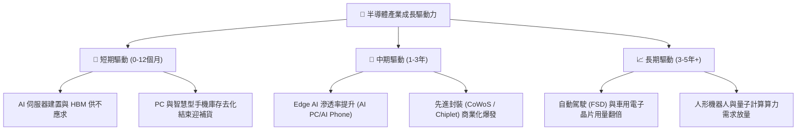

---

## 9. 風險矩陣

### 9.1 風險評估矩陣 (Risk Assessment Matrix)

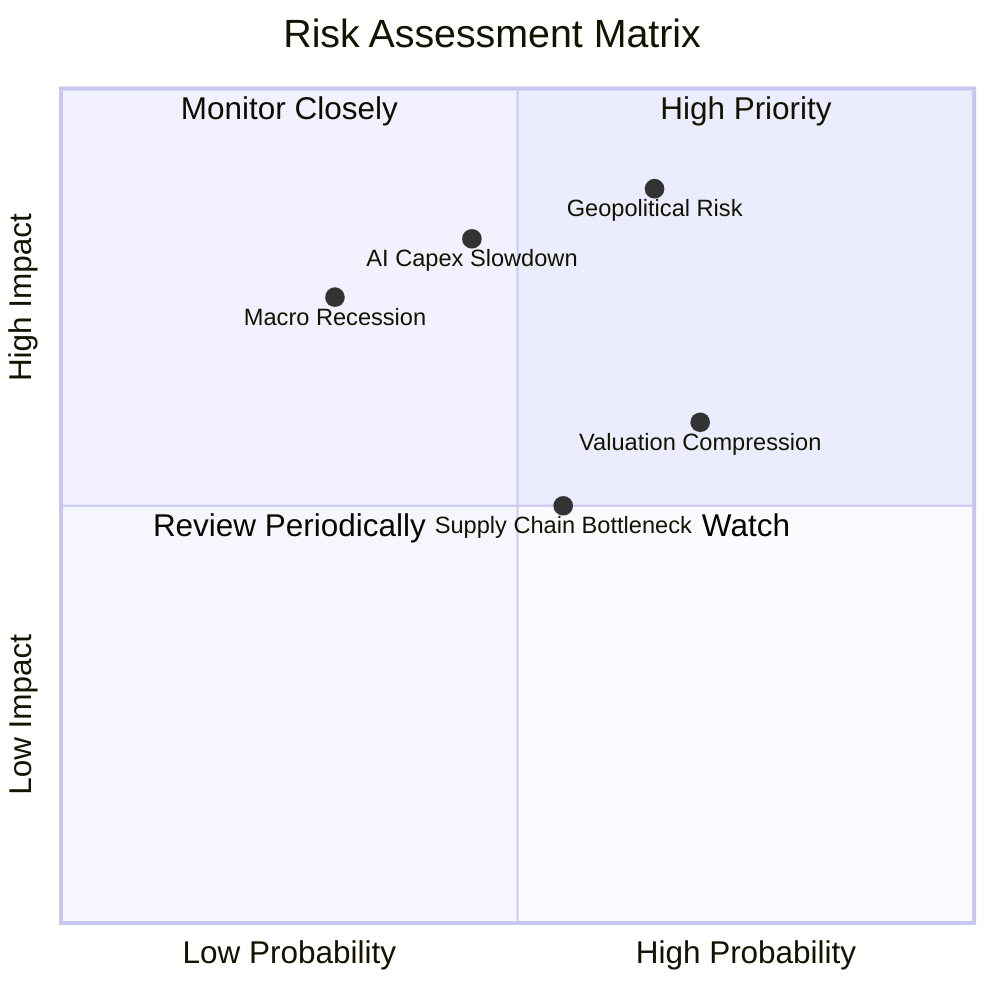

### 9.2 風險清單詳細分析

| # | 風險項目 | 發生機率 | 財務衝擊 | 風險評分 | 具體描述與緩解因素 |
|---|----------|----------|----------|----------|--------------------|
| 1 | 🔴 **地緣政治與供應鏈中斷** | 中高 (65%) | 極高 (-25% 股價) | 🔴 **8.5/10** | **描述**：台海局勢升溫或美國升級限制高端晶片出口中國。<br/>**緩解**：美歐積極建置在地晶圓廠（Arizona/Dresden），降低單一依賴。 |
| 2 | 🔴 **AI Capex 成長放緩** | 中等 (45%) | 高 (-18% 股價) | 🔴 **7.8/10** | **描述**：CSP 巨頭（MSFT, GOOGL, AMZN）若無法從 AI 應用變現，可能縮減資本支出。<br/>**緩解**：企業端 AI 軟體收費模式逐漸成熟。 |
| 3 | 🟡 **高估值倍數壓縮** | 高 (70%) | 中等 (-12% 股價) | 🟡 **6.8/10** | **描述**：美債殖利率回升或市場轉入防禦，致 P/E 從 38x 修正至 28x。<br/>**緩解**：底層盈餘的高速成長（EPS +24%）能快速消化估值。 |
| 4 | 🟡 **成熟製程供過於求** | 中等 (55%) | 中低 (-8% 股價) | 🟡 **5.2/10** | **描述**：中國大量擴產成熟製程（28nm+），引發價格戰。<br/>**緩解**：SOXQ 權重高度集中於先進製程（<5nm），影響有限。 |

---

## 10. 投資建議

### 10.1 最終綜合評級雷達圖

```
╔══════════════════════════════════════════════════════════════╗
║               SOXQ ETF 綜合投資評估雷達                     ║
╠══════════════════════════════════════════════════════════════╣
║ 費率結構優勢  9.8 ▓▓▓▓▓▓▓▓▓▓▓▓▓▓▓▓▓▓▓█  🏆 同類冠軍    ║
║ 產業基本面    9.2 ▓▓▓▓▓▓▓▓▓▓▓▓▓▓▓▓▓▓▓░  🟢 極強        ║
║ 獲利品質      9.0 ▓▓▓▓▓▓▓▓▓▓▓▓▓▓▓▓▓▓░░  🟢 超高 ROIC   ║
║ 成長動能      9.2 ▓▓▓▓▓▓▓▓▓▓▓▓▓▓▓▓▓▓▓░  🟢 AI 強力驅動 ║
║ 估值安全邊際  7.2 ▓▓▓▓▓▓▓▓▓▓▓▓▓▓4░░░░░  🟡 估值合理偏高║
║ 流動性與結構  8.5 ▓▓▓▓▓▓▓▓▓▓▓▓▓▓▓▓▓░░░  🟢 追蹤優異    ║
╠══════════════════════════════════════════════════════════════╣
║ 綜合總評分    8.8 ▓▓▓▓▓▓▓▓▓▓▓▓▓▓▓▓▓▓░░  🏆 強烈推薦買入║
╚══════════════════════════════════════════════════════════════╝
```

### 10.2 目標價與隱含報酬率

| 情境 | 機率權重 | 隱含目標價 | 隱含報酬率 (對比現價 $97.66) | 加權期望值貢獻 |
|------|----------|------------|------------------------------|----------------|
| 🔴 **悲觀情境** | 20% | $82.00 | -16.0% | $16.40 |
| 🟡 **基準情境** | **60%** | **$118.00** | **+20.8%** | **$70.80** |
| 🟢 **樂觀情境** | 20% | $138.00 | +41.3% | $27.60 |
| **加權目標價** | **100%** | **$114.80** | **+17.5%** | **$114.80** |

### 10.3 買入時機與觸發因素 Checklist

```
╔══════════════════════════════════════════════════════════════════╗
║                  ✅ 買入觸發因素 Checklist                      ║
╠══════════════════════════════════════════════════════════════════╣
║                                                                  ║
║  分批建倉觸發條件：                                              ║
║  ✅ 當前價格 $97.66 已自高點 $112.10 拉回 ~13%，可建 30% 基本倉  ║
║  ☐ 若股價回檔至 $90.00 - $93.00 區間（接近 200MA），加碼 40% 倉位║
║  ☐ 若股價受極端情緒衝擊跌至 $82.00 悲觀價，全力補滿至 100% 倉位  ║
║                                                                  ║
║  營運與催化劑加碼條件：                                          ║
║  ☐ TSM 財報確認 CoWoS 產能擴充超乎預期                           ║
║  ☐ NVIDIA 新一代 AI 晶片量產無延遲，展望正向                     ║
║                                                                  ║
║  減碼/停損撤退條件：                                             ║
║  ☐ 微軟/谷歌/ Meta 宣布連續兩季削減晶片 Capex 支出               ║
║  ☐ 底層加權營收 YoY 成長率跌破 +10.0%                            ║
╚══════════════════════════════════════════════════════════════════╝
```

### 10.4 投資人適配度分析

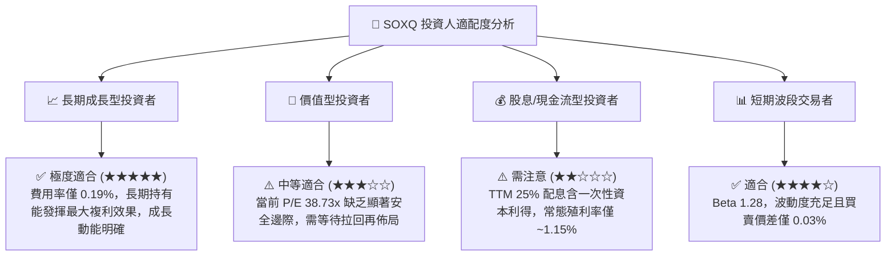

### 10.5 每季財報監控清單（Quarterly Watch List）

為確保本投資論點之有效性，投資人應於每季關注以下關鍵指標與變化門檻：

| 監控維度 | 關鍵追蹤指標 | 正常健康區間 | 觸發警訊/減碼門檻 |
|----------|--------------|--------------|-------------------|
| **底層營收動能** | 30 家持股加權營收 YoY | > +18.0% | 跌破 +10.0% 🟢→🔴 |
| **頂級晶片定價權**| NVDA / TSM 毛利率 | NVDA >70%, TSM >53% | NVDA 跌破 65% 或 TSM 跌破 50% |
| **費率與追蹤** | SOXQ 費用率與追蹤誤差 | 費率 0.19%，誤差 <0.10% | 追蹤誤差 > 0.25% |
| **AI Capex 支出** | 超級用戶 Capex 總合增速 | 年增 > +15.0% | 年增轉為負成長 |
| **庫存健康度** | 底層晶片廠存貨天數 (DIO) | < 110 天 | 飆升至 > 140 天 |

### 10.6 反面論證：什麼會證明論點錯誤（What Would Change My Mind）

```
╔══════════════════════════════════════════════════════════════════╗
║              ⚠️ 論點失效條件（Disconfirming Evidence）           ║
╠══════════════════════════════════════════════════════════════════╣
║  本研究報告之買入評級與目標價推導，若出現以下情況將宣告失效：    ║
║                                                                  ║
║  1. 底層加權營收年增率連續兩季跌破 +10.0%，代表 AI 算力建置見頂  ║
║  2. 底層加權 ROIC 跌破 12.0%（大幅接近 9.2% WACC），優勢壁壘消失 ║
║  3. 主要雲端巨頭（CSP）全面轉向自研 ASIC，致 NVDA/AMD 市佔重挫   ║
║  4. Invesco 宣佈調高 SOXQ 管理費用率至 0.35% 以上，失去成本優勢  ║
║  5. 地緣政治衝突導致台灣晶圓製造產能中斷超過 30 天              ║
╚══════════════════════════════════════════════════════════════════╝
```

---

> **免責聲明**：本報告為 AI 自動生成之機構級研究分析，僅供學術研究與投資參考，不構成任何買賣金融商品之要約或要約引誘。投資涉及風險，證券價格可升可跌，過去表現不代表未來績效。投資人在做出任何投資決策前，應審慎評估自身風險承受能力並諮詢獨立專業財務顧問。