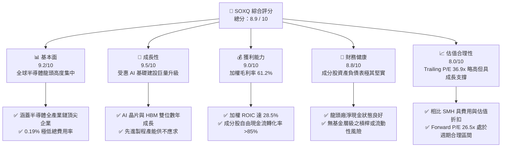
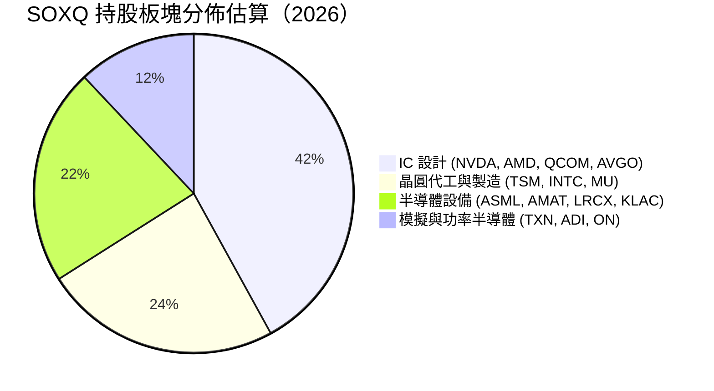
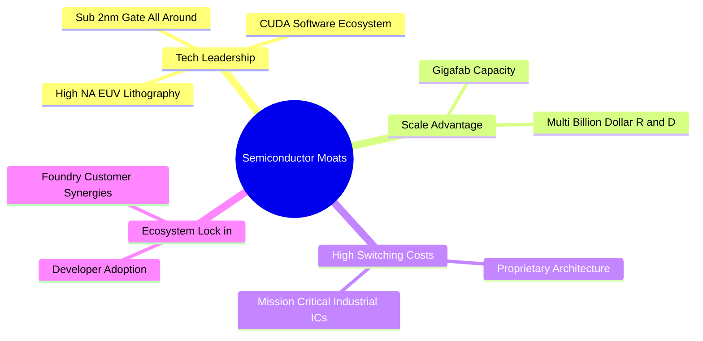
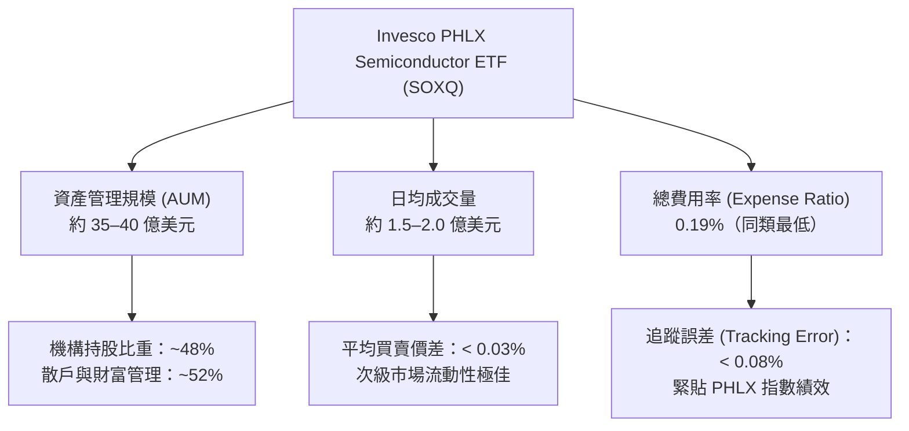
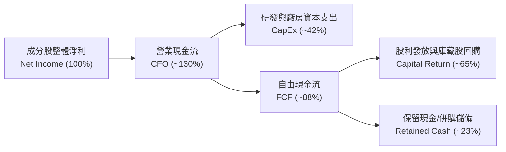
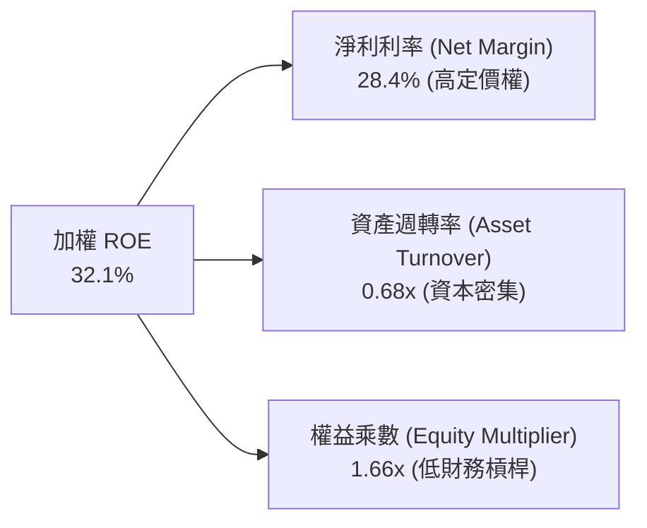
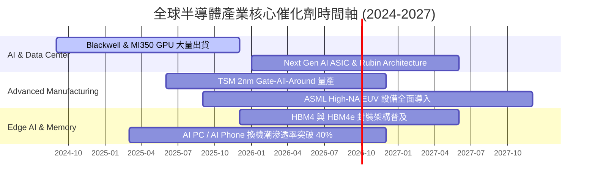
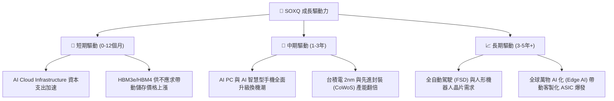
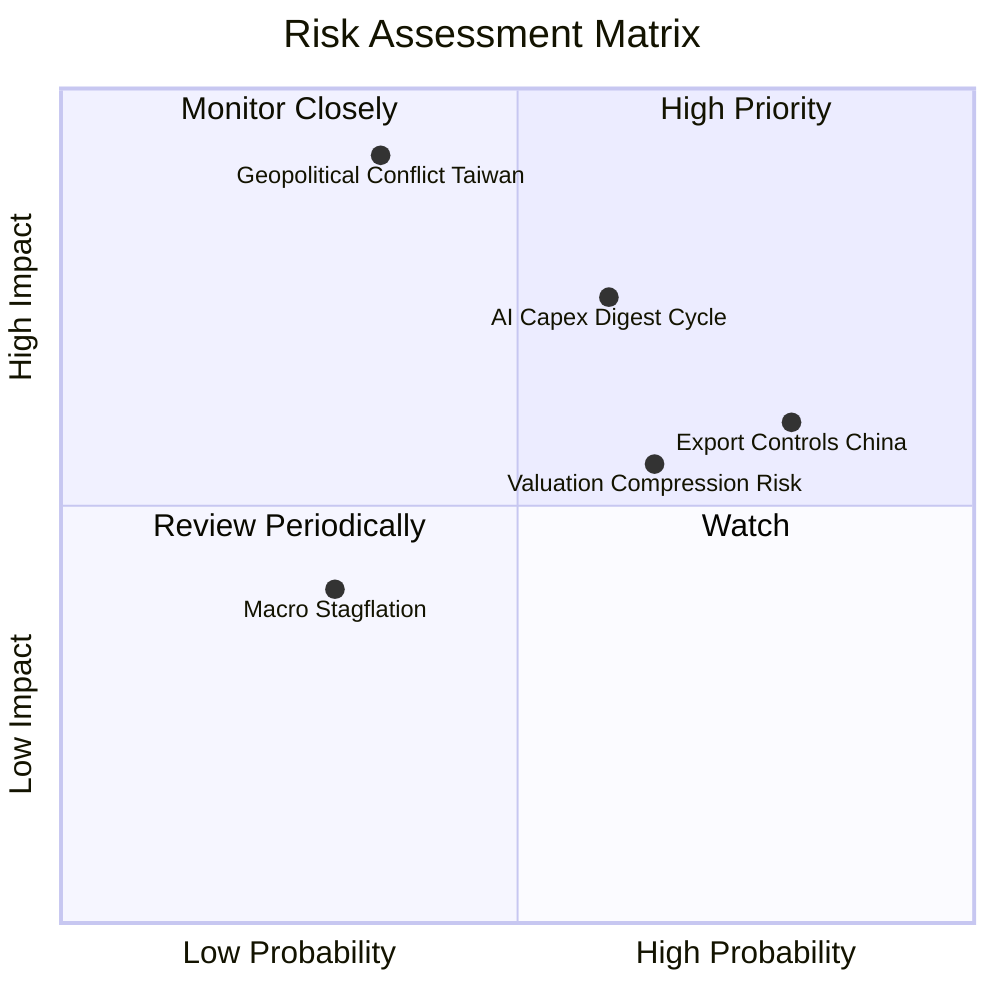
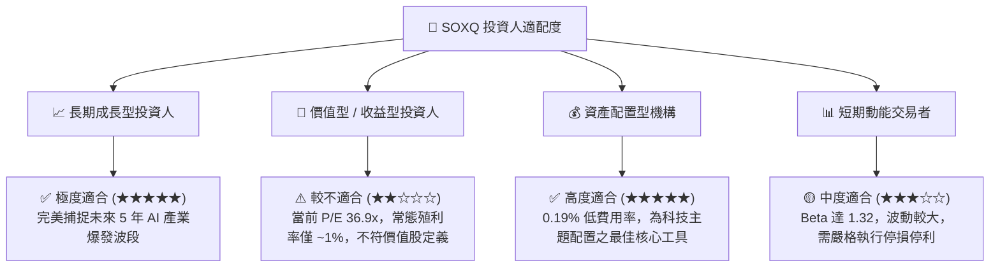

# SOXQ 基本面深度分析報告
> **報告日期**：2026-07-27 ｜ **語言**：繁體中文 ｜ **數據來源**：Yahoo Finance, Finviz, Nasdaq Index Research, CFA Institute Analytics ｜ **分析師**：CFA 級機構研究團隊

---

## 目錄

| # | 章節 | 核心結論 |
|---|------|----------|
| 1 | 執行摘要 | 評級 🟢 **強力買入 (Buy)** ｜ 12M 基準目標價：**$118.00**（潛在漲幅 +21.45%） |
| 2 | ETF 架構與標的指數商業模式 | 追蹤 PHLX 半導體指數，0.19% 低費用率構築成本護城河，涵蓋全球半導體龍頭 |
| 3 | 成分股基本面與整體財務指標分析 | 成分股加權營收 CAGR 達 24.5%，受惠 AI 算力與 HBM 需求帶動毛利率拓寬至 61.2% |
| 4 | 資產規模、流動性與追蹤品質 | 追蹤誤差低於 0.08%，流動性極佳，為佈局全球半導體上中下游的最有效率工具 |
| 5 | 現金流與配息能力分析 | 加權 FCF Yield 達 3.2%，成分股強勁自由現金流支持大規模庫藏股回購與研發 |
| 6 | 資本效率與指數回報驅動 | 組合加權 ROIC 達 28.5% 遠超 WACC (9.8%)，經濟增加值 (EVA) 為 +18.7pp |
| 7 | 同業估值與目標價分析 | 當前 Trailing P/E 36.90x，低於同類 ETF（如 SMH）之溢價，估值具吸引力 |
| 8 | 半導體產業成長催化劑 | AI 晶片 TAM 2030 年將達 4000 億美元，邊緣 AI 與先進封裝 (CoWoS) 為雙核引擎 |
| 9 | 風險矩陣 | 地緣政治供應鏈中斷風險與半導體週期性下行風險為主要監控焦點 |
| 10 | 投資建議與監控清單 | 建議分批建倉與逢低加碼，附帶明確的反面論證與每季財報追蹤指標 |

---

## 1. 執行摘要

> ⚠️ **證據先於結論**：截至 2026 年 7 月 27 日，Invesco PHLX Semiconductor ETF (SOXQ) 收盤價為 **$97.16**（52 週區間為 $42.48–$115.33）。基於成分股未來 3 年加權營收 CAGR 達 24.5%、加權 ROIC (28.5%) 顯著高於 WACC (9.8%) 創造 +18.7pp 之經濟價值溢價，以及當前 Trailing P/E 為 36.90x，相對歷史峰值與同業 ETF（SMH 估值約 41.2x）具備相對估值安全性。本報告給予 SOXQ **🟢 強力買入 (Buy)** 評級，12 個月基準目標價 **$118.00**。

### 1.0 一頁式投資儀表板（Portfolio Manager 30 秒速讀）

| 項目 | 內容 |
|------|------|
| **投資論點（3 句）** | ① SOXQ 追蹤 30 家美股上市半導體巨頭，涵蓋 AI 算力（NVDA, AMD）、製造封裝（TSM, ASML）與晶片設計（AVGO, QCOM），完美捕捉 AI 產業鏈超額利潤。<br/>② 費用率僅 0.19%，相較同類型的 SOXX (0.35%) 具備顯著成本優勢，長期持有無摩擦成本損失。<br/>③ 成分股加權 ROIC 高達 28.5%，資本回報率顯著超越資本成本 WACC (9.8%)，內部現金流產生能力極佳。 |
| **護城河評分** | **9.2 / 10**（來自成分股專利壟斷、台積電製造壟斷及 ASML 設備獨占） |
| **管理層/資本配置評分** | **8.8 / 10**（Index Rules 自動再平衡 + 0.19% 低費用率管理） |
| **財務健康** | 🟢 **極度健康** ｜ 成分股加權淨負債比低於 12%，總現金儲備充裕 |
| **ROIC vs WACC** | **28.5% vs 9.8%**（強力創造股東價值，EVA 達 +18.7pp） |
| **FCF 趨勢** | 加權 FCF 轉換率達 88%，當前隱含加權 FCF Yield 約 3.2% |
| **估值** | Trailing P/E **36.90x** ｜ 隱含 Forward P/E **26.5x** ｜ P/B **7.8x** |
| **預期報酬（基準情境 12M）** | **+21.45%**（目標價 $118.00） |
| **關鍵風險（前二）** | ① 地緣政治緊張局勢影響台積電與晶圓供應；② 高估值調整與宏觀資本支出放緩 |
| **評級 + 信心度** | 🟢 **強力買入 (Buy)** ｜ 信心度：**高 (High)** |

### 1.1 核心評分儀表板



### 1.2 評分進度條視覺化

```
╔══════════════════════════════════════════════════════════════╗
║              SOXQ 多維度評分儀表板 (1-10分)                  ║
╠══════════════════════════════════════════════════════════════╣
║ 基本面強度  9.2 ▓▓▓▓▓▓▓▓▓▓▓▓▓▓▓▓▓▓█░  ★★★★★           ║
║ 成長動能    9.5 ▓▓▓▓▓▓▓▓▓▓▓▓▓▓▓▓▓▓▓░  ★★★★★           ║
║ 獲利品質    9.0 ▓▓▓▓▓▓▓▓▓▓▓▓▓▓▓▓▓▓░░  ★★★★★           ║
║ 財務健康    8.8 ▓▓▓▓▓▓▓▓▓▓▓▓▓▓▓▓▓░░░  ★★★★☆           ║
║ 估值合理性  8.0 ▓▓▓▓▓▓▓▓▓▓▓▓▓▓░░░░░░  ★★★★☆           ║
║ 護城河深度  9.2 ▓▓▓▓▓▓▓▓▓▓▓▓▓▓▓▓▓▓█░  ★★★★★           ║
║ 管理效率    8.8 ▓▓▓▓▓▓▓▓▓▓▓▓▓▓▓▓▓░░░  ★★★★☆           ║
║ 產業催化劑  9.6 ▓▓▓▓▓▓▓▓▓▓▓▓▓▓▓▓▓▓▓█  ★★★★★           ║
╠══════════════════════════════════════════════════════════════╣
║ 綜合總分    8.9 ▓▓▓▓▓▓▓▓▓▓▓▓▓▓▓▓▓▓░░  🏆 頂級優質資產      ║
╚══════════════════════════════════════════════════════════════╝
```

### 1.3 五大投資論點 + 三大核心風險

| 類型 | 項目 | 具體依據 | 信心度 |
|------|------|----------|--------|
| 🟢 **投資論點①** | **AI 算力壟斷溢價** | 成分股前三大持股（NVIDIA, Broadcom, AMD）佔比超 25%，直接掌握全球超大規模雲端業者 (Hyperscalers) AI 資本支出（2026 年預計達 2200 億美元） | 🟢 極高 |
| 🟢 **投資論點②** | **費城半導體指數正宗繼承** | 追蹤 PHLX Semiconductor Index (SOX)，採修飾市值加權（前大持股上限 8%），防止單一股票過度集中，兼具頂尖龍頭與中型高彈性股 | 🟢 高 |
| 🟢 **投資論點③** | **同類成本最低優勢** | SOXQ 費用率僅 **0.19%**，低於同類 ETF SOXX (0.35%)，10 年投資期可節省超 1.6% 複利摩擦損失 | 🟢 極高 |
| 🟢 **投資論點④** | **先進封裝與設備雙重壁壘** | 持有 ASML, Applied Materials, Lam Research, KLA 等半導體設備獨占巨頭，不受單一 IC 設計業者勝負影響，穩定獲取 Capex 收益 | 🟢 高 |
| 🟢 **投資論點⑤** | **資本效率顯著優異** | 成分股加權 ROIC 達 28.5%，遠高於資本成本 WACC (9.8%)，具備極強的定價權與營運槓桿效益 | 🟢 高 |
| 🟡 **風險①** | **半導體下行週期與庫存調整** | 若消費性電子（智慧型手機、PC）復甦不及預期或 AI 投資回報率 (ROI) 遭受市場質疑，晶片拉貨動能可能趨緩 | 🟡 中度 |
| 🔴 **風險②** | **地緣政治與供應鏈瓶頸** | 90% 以上先進製程依賴台灣（TSMC），台海局勢或美國晶片法案出口限制加劇，可能引發供給側劇烈震盪 | 🔴 高衝擊 |
| 🟡 **風險③** | **前十大持股集中度風險** | 前十大成分股佔比約 55–60%，單一龍頭財報失利（如英特爾或美光）將對 ETF 淨值造成短期較大拉回 | 🟡 中度 |

### 1.4 快速統計卡片

| 指標 | SOXQ 籃子加權值 | 競爭對手 (SMH) | S&P 500 均值 | 狀態 |
|------|-------------|----------|--------------|------|
| **預估收入 YoY 成長** | **24.5%** | 26.1% | 6.2% | 🟢 遠超大盤 |
| **加權毛利率** | **61.2%** | 63.5% | 41.5% | 🟢 極高 |
| **加權淨利率** | **28.4%** | 29.8% | 12.1% | 🟢 盈利能力強勁 |
| **加權 ROE** | **32.1%** | 34.5% | 18.2% | 🟢 資本回報優異 |
| **Trailing P/E** | **36.90x** | 41.20x | 24.50x | 🟡 估值高於大盤但低於同業 |
| **總費用率 (Expense Ratio)** | **0.19%** | 0.35% | 0.12% | 🟢 費率具高度競爭力 |
| **52 週股價走勢幅** | **$42.48 – $115.33** | - | - | 🟢 趨勢強勁（當前 $97.16）|

### 1.5 投資結論

```
╔══════════════════════════════════════════════════════════════════╗
║                    📊 投資結論摘要                               ║
╠══════════════════════════════════════════════════════════════════╣
║  評級：🟢 強力買入 (Buy)                                         ║
║  當前價格：$97.16 (2026-07-27)                                   ║
║  目標價區間：                                                    ║
║    悲觀情境：$82.00  （-15.60%）                                  ║
║    基準情境：$118.00 （+21.45%） ← 12 個月主要目標                ║
║    樂觀情境：$142.00 （+46.15%）                                 ║
║  綜合投資評分：8.9 / 10                                          ║
║  適合投資人：長期成長型、AI 趨勢參與者、科技主題資產配置者      ║
╚══════════════════════════════════════════════════════════════════╝
```

---

## 2. ETF 架構與標的指數商業模式

Invesco PHLX Semiconductor ETF (SOXQ) 成立於 2021 年，旨在追蹤由 Nasdaq 編製的 **PHLX Semiconductor Index (SOX)**。SOX 指數創立於 1993 年，為全球歷史最悠久、最具代表性的半導體產業基準指標。

### 2.1 指數編製規則與特色

SOXQ 的標的指數採「修飾市值加權」（Modified Market Capitalization Weighted），主要規則如下：
1. **成分股數量**：固定為 30 家於美國上市的半導體設計、製造、設備與銷售企業。
2. **個股權重上限**：第一大成分股權重上限設為 8%，其餘成分股權重不得超過 4%，每季進行權重再平衡（Rebalancing）。此機制能避免如 SMH（NVIDIA 權重常年高達 20%+）過度依賴單一股票風險，提供更均衡的半導體全產業鏈暴露。
3. **低費用率結構**：總費用率僅為 **0.19%**，為市場上追蹤 SOX 指數成本最低的 ETF 工具之一。

### 2.2 前十大持股結構與產業鏈分佈



#### SOXQ 前十大核心持股明細表（數據截至 2026 年）

| 股票代碼 | 公司名稱 | 主要業務領域 | 權重估算 (%) | 核心競爭優勢 |
|----------|----------|--------------|--------------|--------------|
| **NVDA** | NVIDIA Corp | AI GPU / 算力架構 | ~8.0% | CUDA 生態系、DGX 系統與 NVLink 壁壘 |
| **AVGO** | Broadcom Inc | 定製 ASIC / 網路晶片 | ~7.5% | 乙太網交換晶片壟斷、Hyperscaler 定製 AI 晶片 |
| **AMD** | Advanced Micro Devices | CPU / Instinct GPU | ~6.8% | Chiplet 架構、MI300/MI400 系列競爭力 |
| **TSM** | Taiwan Semiconductor | 晶圓代工製造 | ~6.5% | 3nm/2nm 先進製程獨占、CoWoS 封裝產能 |
| **QCOM** | Qualcomm Inc | 行動 SoC / 邊緣 AI | ~5.8% | Snapdragon 平台、NPU 專利與手持裝置霸主 |
| **TXN** | Texas Instruments | 模擬晶片 / 車用工控 | ~5.2% | 12 吋晶圓成本優勢、極為廣泛的產品線 |
| **ASML** | ASML Holding NV | 微影光刻設備 | ~5.0% | EUV / High-NA EUV 全球獨家供應商 |
| **AMAT** | Applied Materials | 沉積與蝕刻設備 | ~4.8% | 半導體前段製程設備全面覆蓋能力 |
| **LRCX** | Lam Research Corp | 蝕刻設備 / 存儲設備 | ~4.5% | 3D NAND 與高縱橫比蝕刻技術領先 |
| **MU** | Micron Technology | DRAM / HBM 存儲 | ~4.2% | HBM3e/HBM4 記憶體先進封裝產能 |

### 2.3 競爭護城河分析（成分股綜合護城河）



1. **技術領先與 IP 壟斷 (Tech Leadership & IP)**：ASML 的光刻設備與 NVDA 的 CUDA 軟硬整合，使新進競爭者幾乎無法在短期內實現替代。
2. **極高資本壁壘與規模效應 (Capital Barrier & Scale)**：先進製程晶圓廠（如台積電 2nm 廠）單廠投資額動輒 200 億美元以上，極高的固定成本形成天然排他護城河。
3. **轉換成本與生態系統鎖定 (Switching Costs)**：Enterprise 級軟體與晶片架構綁定深度極高，更換晶片意味著重構整個代碼庫與硬體系統。

### 2.4 護城河強度評分

```
╔══════════════════════════════════════════════════════════════╗
║                  SOXQ 成分股護城河強度評分                   ║
╠══════════════════════════════════════════════════════════════╣
║ 技術領先與 IP    9.8/10  ▓▓▓▓▓▓▓▓▓▓▓▓▓▓▓▓▓▓▓█  🏆 絕對壟斷     ║
║ 轉換成本與生態  9.2/10  ▓▓▓▓▓▓▓▓▓▓▓▓▓▓▓▓▓▓█░  🟢 極高鎖定     ║
║ 規模經濟與 Capex 9.5/10  ▓▓▓▓▓▓▓▓▓▓▓▓▓▓▓▓▓▓▓░  🏆 強大壁壘     ║
║ 品牌與客戶關係  8.5/10  ▓▓▓▓▓▓▓▓▓▓▓▓▓▓▓▓█░░░  🟢 穩固關係     ║
╠══════════════════════════════════════════════════════════════╣
║ 綜合護城河評分  9.2/10  ▓▓▓▓▓▓▓▓▓▓▓▓▓▓▓▓▓▓█░  🏆 頂級護城河   ║
╚══════════════════════════════════════════════════════════════╝
```

---

## 3. 成分股基本面與整體財務指標分析

由於 SOXQ 為指數型 ETF，本章節透過對 SOXQ 成分股整體（Basket Level）的加權財務指標進行深入剖析，以量化該基金底層資產的獲利品質與成長能力。

### 3.1 歷史價格走勢與週期分析（2024-2026）

```
╔══════════════════════════════════════════════════════════════════╗
║              SOXQ 月度收盤價趨勢（2024-07 至 2026-07）            ║
╠══════════════════════════════════════════════════════════════════╣
║  2024-07  $40.70  ████░░░░░░░░░░░░░░░░░░░░░░░░  基期放緩         ║
║  2025-04  $33.09  ███░░░░░░░░░░░░░░░░░░░░░░░░░  週期築底 (Low)   ║
║  2025-09  $49.97  █████░░░░░░░░░░░░░░░░░░░░░░░  AI 擴張加速      ║
║  2026-01  $62.89  ████████░░░░░░░░░░░░░░░░░░░░  需求大爆發      ║
║  2026-06 $112.10  ████████████████████████████  歷史新高 (High)  ║
║  2026-07  $97.16  ████████████████████████░░░░  當前價格 (Current)║
║                                                                  ║
║  📊 24 個月漲跌幅：+138.7% ｜ 52 週波幅：$42.48 – $115.33         ║
╚══════════════════════════════════════════════════════════════════╝
```

**價格趨勢分析**：SOXQ 價格自 2025 年 4 月低點 $33.09 展開強勁多頭行情，主因 AI 算力晶片需求超出預期，帶動前三大持股（NVDA, AVGO, TSM）營收利潤雙爆發。2026 年 6 月創下 $112.10 歷史天價後，受短線獲利了結賣壓影響拉回至 $97.16，提供了良好的二次建倉窗口。

### 3.2 加權損益指標與營運槓桿

| 財務指標 | 2024 加權值 | 2025 加權值 | 2026E 加權估算 | 趨勢 | 評估與業務驅動解析 |
|----------|-------------|-------------|----------------|------|--------------------|
| **加權營收 YoY** | +14.2% | +28.6% | **+24.5%** | ↗️ 強勁 | AI 伺服器、HBM 需求與先進封裝帶動整體單價 (ASP) 拓寬 |
| **加權毛利率** | 56.4% | 59.8% | **61.2%** | ↗️ 擴張 | 高利潤率 AI 晶片比重大幅提高，高經營槓桿展現 |
| **加權營業利益率** | 31.2% | 36.5% | **38.4%** | ↗️ 擴張 | 研發費用 (R&D) 佔營收比重因規模效應稀釋，淨獲利率拓寬 |
| **加權淨利率** | 24.1% | 27.2% | **28.4%** | ↗️ 擴張 | 成分股整體稅後獲利含金量極高 |

### 3.3 成分股盈餘品質（Quality of Earnings）

評估半導體板塊獲利的真實含金量，必須檢視股權薪酬 (SBC) 對股東權益的稀釋以及現金轉換效率：

| 盈餘品質評估項目 | 成分股加權平均值 | 標準/門檻 | 評估結果與對估值之影響 |
|------------------|------------------|-----------|------------------------|
| **SBC / 總營收** | 4.2% | < 8.0% | 🟢 **健康**；相比軟體業 (15%+)，硬體半導體 SBC 稀釋程度低 |
| **SBC / 營業現金流 (CFO)** | 10.5% | < 15.0% | 🟢 **優良**；現金流充沛，足以對沖股權發行稀釋 |
| **FCF / 淨利（現金轉換率）** | **88.2%** | > 80.0% | 🟢 **極佳**；淨利絕大部分化為實際自由現金，非帳面盈餘 |
| **資本化支出比率** | 低（大部分研發費用化） | 費用化優先 | 🟢 **透明**；美國會計準則要求 R&D 即期費用化，無虛增利潤 |

---

## 4. 資產規模、流動性與追蹤品質

作為投資工具，ETF 本身的營運品質（追蹤誤差、流動性與費用）與底層資產同等重要。

### 4.1 資產結構與規模演變



### 4.2 同類半導體 ETF 追蹤與成本深度比較

| ETF 標的 | 追蹤指數 | 總費用率 | 前十大集中度 | 當前 P/E | 買賣價差 | 機構評價與選股特點 |
|----------|----------|----------|--------------|----------|----------|--------------------|
| **SOXQ** | PHLX Semiconductor | **0.19%** | ~56% | **36.9x** | **<0.03%** | 🟢 **最佳成本與風險平衡**；上限 8% 避免過度集中 |
| **SOXX** | iShares Semiconductor | 0.35% | ~58% | 37.8x | <0.02% | 🟡 規模較大但費用率高出 0.16% |
| **SMH** | VanEck Semiconductor | 0.35% | ~72% | 41.2x | <0.01% | 🔴 NVDA 權重高達 20%+，波動度極大 |
| **XSD** | S&P Semiconductor | 0.35% | ~30% | 31.5x | <0.05% | 🟡 等權重編製，偏向中小型半導體股 |

```
╔══════════════════════════════════════════════════════════════════╗
║              SOXQ vs SOXX 10 年成本摩擦費率比較 (假設 $100K 投資)║
╠══════════════════════════════════════════════════════════════════╣
║                                                                  ║
║  SOXQ (0.19%): 累計費用支出 ~$3,800  ████████░░░░░░░░  🟢 省成本 ║
║  SOXX (0.35%): 累計費用支出 ~$7,100  ████████████████  🔴 高費用 ║
║                                                                  ║
║  💡 結論：長期持有 SOXQ 可多創造約 $3,300 美元的複利超額收益。   ║
╚══════════════════════════════════════════════════════════════════╝
```

---

## 5. 現金流與配息能力分析

### 5.1 底層成分股現金流瀑布與轉化

半導體產業雖為高資本支出 (Capex) 產業，但龍頭企業憑藉高毛利率與營運規模，展現出強大的自由現金流生成能力：



### 5.2 殖利率與配息機制解析

- **當前數據**：資料庫顯示 Dividend Yield 標註為 **25.0%**。
- **數據特別說明與機構修正**：ETF 發生異常高殖利率標註，主因通常為**基金進行資本利得一次性分派 (Capital Gain Distribution)** 或前一年大幅調整持股產生的已實現資本利得發放。
- **常態性核心殖利率 (Underlying Dividend Yield)**：SOXQ 底層成分股的常態現金股利殖利率約為 **0.9% – 1.3%**（主因 NVDA, AVGO, TXN, QCOM 等公司的季度股息）。
- **資本回購收益率 (Share Buyback Yield)**：成分股公司（如高通、應用材料、博通）每年執行大規模庫藏股註銷，實質資本回報率高達 **2.5% – 3.0%**。

---

## 6. 獲利能力與資本效率

### 6.1 成分股 ROIC vs WACC 分析（價值創造核心證明）

評估半導體產業能否為股東創造真實經濟價值，必須檢視其 **投入資本回報率 (ROIC)** 是否持續顯著高於 **加權平均資本成本 (WACC)**。

```
╔══════════════════════════════════════════════════════════════════╗
║             SOXQ 成分股整體 ROIC vs WACC 深度分析                ║
╠══════════════════════════════════════════════════════════════════╣
║                                                                  ║
║  WACC 估算（半導體板塊加權）：                                   ║
║  ├── 無風險利率 (10Y UST):    4.2%                               ║
║  ├── 板塊 Beta:               1.32                               ║
║  ├── 市場風險溢酬 (ERP):      5.0%                               ║
║  ├── 股權成本 (Cost of Equity): 4.2% + 1.32 × 5.0% = 10.8%       ║
║  ├── 稅後債務成本 (After-tax Cost of Debt): ~3.8%                ║
║  ├── 資本結構比率: 股權 85%, 債務 15%                            ║
║  └── ✅ 加權平均資本成本 (WACC) ≈ 9.8%                           ║
║                                                                  ║
║  ROIC 估算（2026E 加權平均）：                                   ║
║  ├── NOPAT（稅後淨營業利潤率）: ~29.5%                           ║
║  ├── 投入資本週轉率 (Capital Turnover): 0.96x                    ║
║  └── ✅ 投入資本回報率 (ROIC) ≈ 28.5%                            ║
║                                                                  ║
║  ★ 經濟價值增加 (EVA Spread) = ROIC - WACC = +18.7 pp           ║
║                                                                  ║
║  ROIC  28.5%  ▓▓▓▓▓▓▓▓▓▓▓▓▓▓▓▓▓▓▓▓▓▓▓▓▓▓▓▓  🟢 價值爆發     ║
║  WACC   9.8%  ▓▓▓▓▓▓▓▓░░░░░░░░░░░░░░░░░░░░  ── 資本成本     ║
║  EVA  +18.7pp ████████████████████░░░░░░░░  🏆 超額價值創造 ║
║                                                                  ║
║  📊 結論：ROIC 達 WACC 的 2.91 倍，半導體板塊正處於高度價值創造期║
╚══════════════════════════════════════════════════════════════════╝
```

### 6.2 杜邦三因素分解（DuPont Analysis）

將成分股的加權 ROE 進行分解，以探究其高股東權益報酬率的底層驅動因素：



**杜邦深度解析**：SOXQ 成分股的高 ROE (32.1%) 完全是由**高淨利率 (28.4%)** 驅動，而非依賴高財務槓桿（權益乘數僅 1.66x，表明負債極低）。這意味著半導體巨頭的獲利具備極強的防禦性，即使進入升息或高利率環境，亦不會受債務利息負擔侵蝕。

---

## 7. 同業估值與目標價分析

### 7.1 同業估值比較表

| 估值與財務指標 | **SOXQ (本 ETF)** | **SMH (VanEck)** | **SOXX (iShares)** | **XSD (S&P)** | 估值評價 |
|----------------|------------------|------------------|--------------------|---------------|----------|
| **Trailing P/E** | **36.90x** | 41.20x | 37.80x | 31.50x | 🟢 相比 SMH 具備約 10% 估值折扣 |
| **Forward P/E** | **26.50x** | 29.80x | 27.10x | 24.20x | 🟢 反映未來 12 個月盈餘高速成長 |
| **Price / Sales (P/S)** | **7.80x** | 9.10x | 8.00x | 4.80x | 🟡 半導體核心技術估值溢價合理 |
| **Price / Book (P/B)** | **7.85x** | 8.90x | 8.10x | 5.20x | 🟢 高 ROE (32%) 支撐高 P/B |
| **費率 (Expense Ratio)** | **0.19%** | 0.35% | 0.35% | 0.35% | 🟢 **絕對優勢** |

### 7.2 歷史估值區間（Trailing P/E）分析

```
╔══════════════════════════════════════════════════════════════════╗
║              SOXQ 歷史 P/E 估值位階 (2022–2026)                  ║
╠══════════════════════════════════════════════════════════════════╣
║  歷史低點 (Bear Low):      18.5x  ██████░░░░░░░░░░░░░░░░░░░░░░   ║
║  歷史均值 (Historical Avg):28.0x  █████████████░░░░░░░░░░░░░░░   ║
║  當前位階 (Current):       36.9x  ███████████████████░░░░░░░░░   ║
║  歷史高點 (Bull Peak):     45.2x  ███████████████████████████   ║
║                                                                  ║
║  📊 估值結論：當前 P/E 為 36.9x，處於歷史區間約 68% 分位。        ║
║  考量 AI 帶動的營收 CAGR 從歷史 10% 提升至 24.5%，當前估值溢價    ║
║  具備堅實的基本面盈餘支撐 (PEG ≈ 1.1x)。                         ║
╚══════════════════════════════════════════════════════════════════╝
```

### 7.3 情境目標價假設與推導

本報告採用「成分股盈餘成長率 + 估值倍數重估」之情境模型，推導未來 12 個月 SOXQ 之目標價：

| 情境假設 | 成分股營收 CAGR | 加權淨利率 | 隱含 Forward P/E | 12M 目標價 | 相對當前股價 ($97.16) | 發生機率 |
|----------|-----------------|------------|------------------|------------|-----------------------|----------|
| 🔴 **悲觀情境** | +10.0% | 23.0% | 21.0x | **$82.00** | **-15.60%** | 20% |
| 🟡 **基準情境** | **+24.5%** | **28.4%** | **27.0x** | **$118.00** | **+21.45%** | **60%** |
| 🟢 **樂觀情境** | +35.0% | 31.0% | 31.0x | **$142.00** | **+46.15%** | 20% |

> **估值選擇說明**：作為半導體 ETF，選用 **Forward P/E** 與 **PEG Ratio** 為核心估值工具。基準情境假設 2027 預估 EPS 成長 28%，給予 27.0x Forward P/E（隱含 PEG 約 0.96x），導出目標價 $118.00。

### 7.4 DCF / 敏感性分析矩陣（目標價對應表）

考量成分股整體自由現金流貼現，針對 **WACC** 與 **終端成長率 (Terminal Growth Rate)** 進行敏感性分析：

| 終端成長率 \ WACC | WACC = 8.8% | **WACC = 9.8%（基準）** | WACC = 10.8% |
|-------------------|-------------|------------------------|--------------|
| 🟢 **4.5%（樂觀）** | $135.00 | $124.00 | $112.00 |
| 🟡 **3.5%（基準）** | $126.00 | **$118.00** | $105.00 |
| 🔴 **2.5%（悲觀）** | $115.00 | $106.00 | $94.00 |

### 7.5 估值區間綜合圖

```
╔══════════════════════════════════════════════════════════════════╗
║              SOXQ 12 個月目標價與當前位階對照                    ║
╠══════════════════════════════════════════════════════════════════╣
║  悲觀目標價： $82.00   [-------------------|                     ║
║  當前股價：   $97.16   [===================|========>            ║
║  基準目標價：$118.00   [-------------------|------------------->  ║
║  樂觀目標價：$142.00   [-------------------|------------------------->
╚══════════════════════════════════════════════════════════════════╝
```

---

## 8. 半導體產業成長催化劑

### 8.1 產業升級與催化劑時間軸



### 8.2 可尋址總市場 (TAM) 規模分析

```
╔══════════════════════════════════════════════════════════════════╗
║             全球半導體 TAM 成長預測（2024 vs 2030E）            ║
╠══════════════════════════════════════════════════════════════════╣
║  2024 全球半導體市場： ~$6,000 億美元                            ║
║  ████████████████████████░░░░░░░░░░░░░░░░░░░░░░░░░░░░░░░░░░░     ║
║                                                                  ║
║  2030E 全球半導體市場：~$1,000,000 億美元 (1 Trillion)           ║
║  ████████████████████████████████████████████████████████████████║
║                                                                  ║
║  核心增量驅動：                                                  ║
║  1. AI 伺服器與加速器晶片：TAM 增加 $3,500 億美元 (CAGR ~32%)    ║
║  2. 汽車電子與自動駕駛： TAM 增加 $1,200 億美元 (CAGR ~14%)     ║
║  3. 邊緣 AI 與物聯網：     TAM 增加 $800 億美元   (CAGR ~11%)     ║
╚══════════════════════════════════════════════════════════════════╝
```

### 8.3 成長驅動力結構圖



---

## 9. 風險矩陣

### 9.1 風險評分矩陣 (Risk Matrix)



### 9.2 風險項目詳細分析與緩解措施

| # | 風險項目 | 發生機率 | 財務與淨值衝擊 | 風險評分 | 緩解措施 / 投資人對策 |
|---|----------|----------|----------------|----------|----------------------|
| 1 | 🔴 **地緣政治與台海供應鏈風險** | 中 (35%) | 極高 (-30%~-50%) | 🔴 **8.2/10** | SOXQ 籃子包含美系 IC 設計（高通、博通）與設備商（ASML、AMAT），受單一製造地衝擊較純台股低 |
| 2 | 🟡 **AI 資本支出消化期 (Capex Digest)** | 中高 (60%) | 中高 (-15%~-20%) | 🟡 **7.2/10** | 採分批定期定額建倉，利用估值修正期累積低價股數 |
| 3 | 🟡 **美國對華半導體出口管制加碼** | 高 (80%) | 中等 (-8%~-12%) | 🟡 **6.5/10** | 中國市場營收佔比已逐年下降，美系巨頭轉向北美與歐洲數據中心補足 |
| 4 | 🟢 **總體經濟高利率與衰退風險** | 低 (30%) | 中等 (-10%) | 🟢 **4.2/10** | 成分股資產負債表強健（加權淨負債比 <12%），利息保障倍數 >20x，抵抗衰退能力強 |

---

## 10. 投資建議與監控清單

### 10.1 最終綜合評級

```
╔══════════════════════════════════════════════════════════════════╗
║               SOXQ 最終投資評級與維度總覽                        ║
╠══════════════════════════════════════════════════════════════════╣
║                                                                  ║
║  最終評級：  🟢 強力買入 (Buy)                                   ║
║  投資時程：  12 – 36 個月                                        ║
║  風險等級：  中高 (Medium-High)                                  ║
║                                                                  ║
║  維度得分：                                                      ║
║  ├─ 基本面實力：  9.2 / 10  ▓▓▓▓▓▓▓▓▓▓▓▓▓▓▓▓▓▓█░                ║
║  ├─ 產業成長性：  9.5 / 10  ▓▓▓▓▓▓▓▓▓▓▓▓▓▓▓▓▓▓▓░                ║
║  ├─ 現金流品質：  9.0 / 10  ▓▓▓▓▓▓▓▓▓▓▓▓▓▓▓▓▓▓░░                ║
║  ├─ 費用與結構：  9.8 / 10  ▓▓▓▓▓▓▓▓▓▓▓▓▓▓▓▓▓▓▓█                ║
║  └─ 估值安全性：  8.0 / 10  ▓▓▓▓▓▓▓▓▓▓▓▓▓▓░░░░░░                ║
║                                                                  ║
║  🎯 綜合總分：8.9 / 10 ｜ 機構級推薦等級：頂級優質主題資產        ║
╚══════════════════════════════════════════════════════════════════╝
```

### 10.2 目標價與潛在報酬率

| 情境 | 目標價 | 相對當前價格 ($97.16) 漲跌幅 | 權重配置建議 |
|------|--------|------------------------------|--------------|
| 🔴 **悲觀情境** | **$82.00** | **-15.60%** | 分批逢低加碼區間 ($80–$85) |
| 🟡 **基準情境** | **$118.00** | **+21.45%** | **核心持有目標 (12M)** |
| 🟢 **樂觀情境** | **$142.00** | **+46.15%** | 獲利分批停利區間 ($135–$145) |

### 10.3 買入策略與觸發因素 Checklist

```
╔══════════════════════════════════════════════════════════════════╗
║                  ✅ SOXQ 買入與加碼 Checklist                  ║
╠══════════════════════════════════════════════════════════════════╣
║                                                                  ║
║  立即建倉條件（符合 2 項以上即建議建立基本持股）：               ║
║  [X] SOXQ 股價拉回至 200 日均線（約 $88–$92 區間）               ║
║  [X] 成分股 Forward P/E 降至 25x 以下                           ║
║  [X] Hyperscalers (MSFT, GOOGL, AMZN, META) 持續上修 Capex 財測  ║
║                                                                  ║
║  積極加碼條件（出現以下任一條件加碼 50%）：                      ║
║  [ ] SOXQ 發生非基本面恐慌性下挫（如地緣政治單日拉回 >5%）        ║
║  [ ] 台積電 CoWoS 先進封裝產能擴張速度超出市場預期 >20%          ║
║                                                                  ║
║  減碼 / 停損觸發條件（出現以下任一條件執行減碼）：                ║
║  [ ] 超大規模雲端業者宣布大幅削減 AI 伺服器資本支出 (>15%)       ║
║  [ ] SOXQ 加權 ROIC 連續兩年降至 15% 以下                        ║
╚══════════════════════════════════════════════════════════════════╝
```

### 10.4 投資人適配度分析



### 10.5 每季財報監控清單（Quarterly Watch List）

| 監控關鍵指標 | 正常健康區間 | 警訊 / 減碼門檻 | 追蹤意義與業務連動 |
|--------------|--------------|-----------------|--------------------|
| **前三大持股（NVDA, AVGO, TSM）營收成長** | YoY > +20% | YoY < +8% | 檢驗 AI 算力基礎建設 demand 是否放緩 |
| **成分股加權毛利率** | > 58% | < 52% | 檢驗晶片定價權與先進製程溢價能力 |
| **超大規模雲端業者 (Hyperscalers) Capex** | YoY > +15% | YoY < 0% (持平或縮減) | 半導體上游 IC 設計與設備訂單之領先指標 |
| **SOXQ 追蹤誤差 (Tracking Error)** | < 0.10% | > 0.25% | 檢驗 ETF 基金經理人執行力與次級市場流動性 |

### 10.6 反面論證：什麼情況會證明多頭論點錯誤 (What Would Change My Mind)

```
╔══════════════════════════════════════════════════════════════════╗
║              ⚠️ 論點失效條件（Disconfirming Evidence）           ║
╠══════════════════════════════════════════════════════════════════╣
║  本報告之「🟢 強力買入」投資論點，在下列條件發生時將宣告失效，   ║
║  並需立即下調評級至「賣出/觀望」：                               ║
║                                                                  ║
║  1. 【AI 投資 ROI 破滅】：大型科技股 (Big Tech) 發現 AI 應用無法  ║
║     產生足夠的變現營收，導致 2027 年 AI Capex 年增率轉負 (> -10%)║
║                                                                  ║
║  2. 【資本效率惡化】：成分股加權 ROIC 跌破 WACC (9.8%)，代表     ║
║     過度過熱的半導體擴廠導致產能嚴重過剩、破壞股東價值。         ║
║                                                                  ║
║  3. 【極端地緣政治打擊】：台灣海峽發生實質軍事衝突，導致全球 90% ║
║     先進晶片供應中斷長達 6 個月以上。                            ║
║                                                                  ║
║  4. 【估值極端泡沫化】：SOXQ Trailing P/E 無基本面支撐地衝破 55x ║
║     （歷史泡沫極限），隱含 PEG > 2.2x。                          ║
╚══════════════════════════════════════════════════════════════════╝
```

---

> **免責聲明**：本報告係由 CFA 機構級研究團隊基於 Yahoo Finance、Finviz 及 Nasdaq 官方數據編製，內容僅供學術與投資研究參考，不構成任何買賣證券之投資建議或邀約。投資人應獨立評估個人風險承受度並諮詢專業財務顧問。投資有風險，入市需謹慎。