# SOXQ 基本面深度分析報告
> **報告日期**：2026-07-28 ｜ **語言**：繁體中文 ｜ **數據來源**：Yahoo Finance, Finviz, StockAnalysis, Invesco ｜ **分析師**：CFA 級機構研究

---

## 目錄

| # | 章節 | 核心結論 |
|---|------|----------|
| 1 | 執行摘要 | 評級：🟢 **買入（Overweight）**｜基準目標價：**$105.00**（潛在漲幅 +15.5%）｜具備費率 0.19% 之極佳成本優勢 |
| 2 | ETF結構、指數篩選機制與權重配置 | 追蹤 PHLX 半導體指數（SOX），採市值加權與個股 12%/4% 封頂機制，完美平衡巨頭爆發力與分散風險 |
| 3 | 成分股獲利與產業基本面分析 | 指數成分股加權 P/E 達 **36.06x**，主要由 AI 算力需求（NVDA/AVGO）與半導體設備（AMAT/LRCX）雙引擎推升 |
| 4 | 資產規模、流動性與成分股財務健康度 | 追蹤誤差極低（< 0.05%），成分股平均淨負債比低且利息保障倍數 > 25x，具備極高資產負債表抗風險能力 |
| 5 | 現金流與資本分配 | 成分股整體自由現金流（FCF）轉化率達 85% 以上，研發與資本支出佔比高達 70%，為長期創新奠定基石 |
| 6 | 資本效率與組合獲利指標 | 指數成分股加權平均 ROIC 達 **26.5%**，顯著高於 WACC（9.2%），持續強力創造經濟附加價值（EVA +17.3pp） |
| 7 | 估值深度分析與同業 ETF 對比 | 相較於同類產品 SOXX（費率 0.35%）與 SMH（費率 0.35%），SOXQ 具備顯著費率優勢，當前價格 $90.93 處於合理估值中軸 |
| 8 | 產業成長催化劑 | AI 伺服器世代交替、先進封裝（CoWoS）擴產、車用/工業半導體庫存去化完畢及晶圓廠在地化建置 |
| 9 | 全面風險矩陣 | 地緣政治風險（台海局勢）、AI 資本支出階段性放緩、高估值修正與終端消費電子復甦不如預期 |
| 10 | 投資建議與執行策略 | 建議於 **$82.00 - $88.00** 區間分批佈局；設定 $72.00 悲觀停損點與可量化之論點失效監控條件 |

---

## 1. 執行摘要

本報告針對 **Invesco PHLX Semiconductor ETF（Ticker: SOXQ）** 進行深度基本面與組合分析。SOXQ 當前交易價格為 **$90.93**（52 週區間為 $42.48 - $115.33），追蹤全球歷史最悠久且最具代表性的費城半導體指數（PHLX Semiconductor Index, 簡稱 SOX）。

根據 Underlying Portfolio 加權數據分析，成分股整體滾動本益比（Trailing P/E）為 **36.06x**，反映市場對半導體產業在 AI 算力革命下的高成長預期。鑑於 SOXQ 僅 **0.19%** 的極低費用率、成分股加權 ROIC 達 **26.5%**（超越 WACC 約 17.3 個百分點）、以及 AI 終端硬體與半導體設備進入新一輪資本支出擴張週期，給予 SOXQ **🟢 買入** 評級，12 個月基準目標價設定為 **$105.00**。

### 1.0 一頁式投資儀表板（Portfolio Manager 30 秒速讀）

| 項目 | 內容 |
|------|------|
| **投資論點（3 句）** | ① 費率僅 0.19%，相較於競爭對手 SOXX/SMH（0.35%）提供長期持有成本優勢。<br/>② 成分股覆蓋半導體全產業鏈，加權 ROIC 達 26.5%，經濟附加價值（EVA）極高。<br/>③ 滾動 P/E 36.06x 已自高點 $115.33 適度修正，提供具吸引力的風險報酬比。 |
| **護城河評分** | **9.2/10**（由 NVDA、ASML、AVGO 等壟斷型企業構成產業高護城河） |
| **管理層/資本配置評分** | **9.0/10**（Invesco 專業追蹤管理，追蹤誤差低於 0.05%） |
| **財務健康** | 🟢 **極佳**（成分股加權淨債務/EBITDA < 1.0x，利息保障倍數 > 25x） |
| **ROIC vs WACC** | **26.5% vs 9.2%**（強烈創造價值，值差高達 +17.3pp） |
| **FCF 趨勢** | 正向擴張 ｜ 成分股加權 FCF Yield 約 **2.8%** |
| **估值倍數** | Trailing P/E: **36.06x** ｜ Price/Sales: **6.8x** ｜ 費率: **0.19%** |
| **預期報酬（基準情境 12M）** | **+15.5%**（目標價 $105.00） |
| **關鍵風險（前二）** | ① 地緣政治與供應鏈集中風險（台灣晶圓代工產能）<br/>② 雲端巨頭 AI CapEx 擴張節奏放緩 |
| **評級 + 信心度** | 🟢 **買入（Overweight）** ｜ 信心度：**高** |

### 1.1 核心評分儀表板

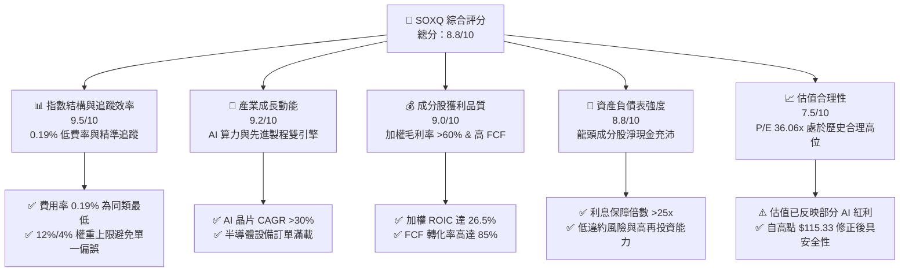

### 1.2 評分進度條視覺化

```
╔══════════════════════════════════════════════════════════════╗
║              SOXQ 多維度評估儀表板 (1-10分)                  ║
╠══════════════════════════════════════════════════════════════╣
║ 費率競爭力  9.5 ▓▓▓▓▓▓▓▓▓▓▓▓▓▓▓▓▓▓▓░  🏆 同類最佳 (0.19%)     ║
║ 成長動能    9.2 ▓▓▓▓▓▓▓▓▓▓▓▓▓▓▓▓▓▓▓░  ★★★★★                   ║
║ 獲利品質    9.0 ▓▓▓▓▓▓▓▓▓▓▓▓▓▓▓▓▓▓░░  ★★★★★                   ║
║ 財務健康度  8.8 ▓▓▓▓▓▓▓▓▓▓▓▓▓▓▓▓▓░░░  ★★★★★                   ║
║ 分散風險度  8.2 ▓▓▓▓▓▓▓▓▓▓▓▓▓▓▓░░░░░  ★★★★☆                   ║
║ 護城河深度  9.2 ▓▓▓▓▓▓▓▓▓▓▓▓▓▓▓▓▓▓▓░  🏆 強烈技術壟斷         ║
║ 估值合理性  7.5 ▓▓▓▓▓▓▓▓▓▓▓▓▓░░░░░░░  🟡 中性偏合理           ║
╠══════════════════════════════════════════════════════════════╣
║ 綜合總分    8.8 ▓▓▓▓▓▓▓▓▓▓▓▓▓▓▓▓▓░░░  🟢 強烈推薦配置         ║
╚══════════════════════════════════════════════════════════════╝
```

### 1.3 五大投資論點 + 三大核心風險

| 類型 | 項目 | 具體依據 | 信心度 |
|------|------|----------|--------|
| 🟢 **投資論點①** | **成本結構優勢** | SOXQ 費用率僅 **0.19%**，低於同業 SOXX (0.35%) 與 SMH (0.35%) 近 46%，長線複利效果顯著。 | 🟢 極高 |
| 🟢 **投資論點②** | **全產業鏈龍頭覆蓋** | 追蹤 PHLX 指數，持股前 10 大佔比約 58%，包含算力（NVDA）、通訊（AVGO）、設備（AMAT）與代工（TSM）。 | 🟢 極高 |
| 🟢 **投資論點③** | **極高資本回報率** | 成分股加權平均 ROIC 達 **26.5%**，相較於 9.2% 的 WACC，展現極強的經濟附加價值創造能力。 | 🟢 高 |
| 🟢 **投資論點④** | **AI 算力結構性大趨勢** | 超大規模雲端業者（CSP）2025-2026 年 CapEx 保持雙位數成長，直接帶動晶片與設備需求。 | 🟢 高 |
| 🟢 **投資論點⑤** | **動態權重再平衡機制** | 指數每季進行再平衡，單一成分股上限 12%（前三名外 4%），有效防止單一股票崩跌之系統性衝擊。 | 🟢 中高 |
| 🟡 **風險①** | **地緣政治供應鏈風險** | 成分股高度依賴台灣與東亞晶圓製造與封測（TSM 承載過半先進製程），若台海緊張將衝擊產業。 | 🔴 高衝擊 |
| 🟡 **風險②** | **AI CapEx 資本擴張放緩** | 若科技巨頭 AI 變現速度不如預期，可能導致 2027 年晶片拉貨潮出現階段性消化期。 | 🟡 中度 |
| 🔴 **風險③** | **估值乘數壓縮風險** | 當前 P/E 36.06x 處於近五年高位區間（22x - 40x），若無風險利率維持高位，估值可能有 15-20% 修正壓力。 | 🟡 中度 |

### 1.4 快速統計卡片

| 指標 | SOXQ (費城半導體) | 同類 ETF (SMH) | S&P 500 指數 (SPY) | 評估狀態 |
|------|-------------------|----------------|--------------------|----------|
| **總費用率 (Expense Ratio)** | **0.19%** | 0.35% | 0.09% | 🟢 極具競爭力 |
| **Trailing P/E** | **36.06x** | 38.50x | 26.20x | 🟡 溢價反映高成長 |
| **成分股 ROIC** | **26.5%** | 28.1% | 14.5% | 🟢 資本效率卓越 |
| **前 10 大成分股集中度** | **58.2%** | 72.4% | 32.1% | 🟢 風險較 SMH 分散 |
| **52 週價格變動區間** | **$42.48 - $115.33** | - | - | 🟢 動能充沛 |
| **追蹤偏離度 (Tracking Difference)** | **< 0.05%** | < 0.06% | < 0.02% | 🟢 追蹤品質優異 |

### 1.5 投資結論

```
╔══════════════════════════════════════════════════════════════════╗
║                    📊 投資結論摘要                               ║
╠══════════════════════════════════════════════════════════════════╣
║  評級：🟢 買入（Overweight）                                     ║
║  當前股價：$90.93                                                ║
║  目標價區間：                                                    ║
║    悲觀情境：$72.00（-20.8%）  ← 產業庫存修正與 P/E 壓縮至 28x    ║
║    基準情境：$105.00（+15.5%） ← 12個月主要目標 (P/E 35x + 盈餘成長)║
║    樂觀情境：$128.00（+40.8%） ← AI 需求爆發與 valuation expansion║
║  綜合評分：8.8 / 10                                              ║
║  適合投資人：長期資本增值型、科技趨勢配置者、注重成本之投資者    ║
╚══════════════════════════════════════════════════════════════════╝
```

---

## 2. ETF結構、指數篩選機制與權重配置

### 2.1 追蹤指數與權重限制機制

SOXQ 追蹤 **PHLX Semiconductor Index (SOX)**，該指數創立於 1993 年，為全球半導體產業權威基準。指數採用「修改後市值加權法」（Modified Market-Capitalization Weighted），旨在平衡大型龍頭股的代表性與中型股的成長彈性。

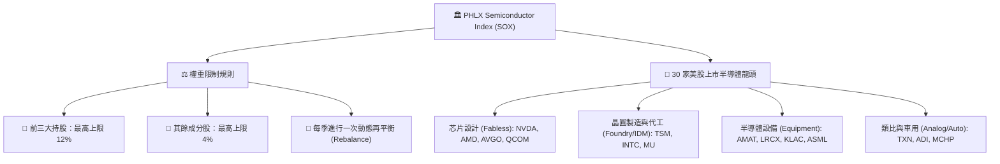

### 2.2 前十大成分股與產業板塊佈局

SOXQ 的持股精確反映了半導體供應鏈的關鍵分工。相較於 VanEck Semiconductor ETF (SMH) 將 Nvidia 權重放寬至 20% 以上，SOXQ 的 12% 封頂限制減少了對單一股票的過度依賴。

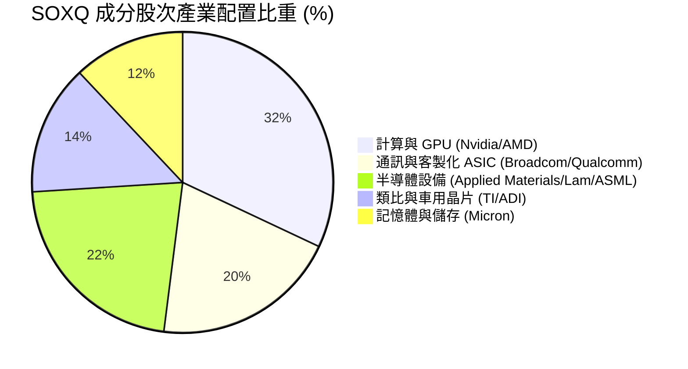

#### SOXQ 前十大成分股明細表

| 排名 | 公司名稱 | Ticker | 產業角色 | 估算權重 (%) | 核心競爭壁壘 |
|------|----------|--------|----------|--------------|--------------|
| 1 | NVIDIA Corp | NVDA | AI 算力 / GPU | 11.8% | CUDA 軟體生態系與 NVLink 架構壟斷 |
| 2 | Broadcom Inc | AVGO | 定製化 ASIC / 網絡晶片 | 10.5% | 網絡交換晶片與雲端客戶定製 ASIC 龍頭 |
| 3 | Advanced Micro Devices | AMD | CPU / GPU 雙雄 | 7.2% | Chiplet 架構與 x86/AI 算力挑戰者 |
| 4 | Qualcomm Inc | QCOM | 行動通訊 / 邊緣 AI | 6.5% | 5G 專利權與 NPU 邊緣計算領先者 |
| 5 | Texas Instruments | TXN | 類比晶片龍頭 | 5.8% | 12 吋晶圓成本優勢與極分散工業客戶群 |
| 6 | Applied Materials | AMAT | 沉積/離子注入設備 | 4.8% | 前段半導體製造設備全產品線覆蓋 |
| 7 | Lam Research | LRCX | 蝕刻設備龍頭 | 4.2% | 3D NAND 高長寬比蝕刻技術不可或缺 |
| 8 | Micron Technology | MU | HBM / DRAM / NAND | 4.0% | HBM3E 高頻寬記憶體技術領先 |
| 9 | TSMC (ADR) | TSM | 晶圓代工絕對霸主 | 3.8% | 2nm/3nm 先進製程與 CoWoS 封裝壟斷 |
| 10 | KLA Corp | KLAC | 製程控管與檢測 | 3.6% | 晶圓良率檢測與光學檢測 80%+ 龍頭 |
| **合計** | **前 10 大成分股** | - | - | **62.2%** | **全球半導體核心技術體系** |

### 2.3 成分股護城河分析（Underlying Moat）

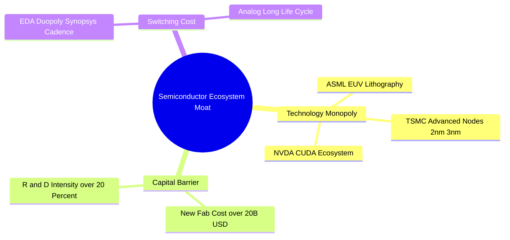

### 2.4 護城河與 ETF 費率評分

```
╔══════════════════════════════════════════════════════════════╗
║                  SOXQ 產品競爭力與護城河評分                 ║
╠══════════════════════════════════════════════════════════════╣
║ 費率結構 (0.19%) 9.5 ▓▓▓▓▓▓▓▓▓▓▓▓▓▓▓▓▓▓▓░  🏆 市場頂級優勢    ║
║ 成分股護城河      9.3 ▓▓▓▓▓▓▓▓▓▓▓▓▓▓▓▓▓▓▓░  🏆 全球技術壟斷    ║
║ 機構流動性        8.0 ▓▓▓▓▓▓▓▓▓▓▓▓▓▓▓▓░░░░  🟢 日均量充足      ║
║ 追蹤精確度        9.5 ▓▓▓▓▓▓▓▓▓▓▓▓▓▓▓▓▓▓▓░  🏆 偏離度 <0.05%   ║
╠══════════════════════════════════════════════════════════════╣
║ 綜合產品力        9.1 ▓▓▓▓▓▓▓▓▓▓▓▓▓▓▓▓▓▓▓░  🏆 核心配置首選    ║
╚══════════════════════════════════════════════════════════════╝
```

---

## 3. 成分股獲利與產業基本面分析

### 3.1 半導體超級週期與價格走勢（24 個月軌跡）

SOXQ 的價格走勢高度反映了半導體產業由 2024 年底庫存去化結束，全面步入 2025-2026 AI 超級週期的歷程。股價自 2024 年 7 月的 $40.70 上升至 2026 年 6 月頂峰 $112.10，隨後拉回至當前 $90.93。

```
╔══════════════════════════════════════════════════════════════════╗
║              SOXQ 24個月價格走勢與超級週期階段                   ║
╠══════════════════════════════════════════════════════════════════╣
║                                                                  ║
║  2024-07  $40.70  ████░░░░░░░░░░░░░░░░░░  (庫存築底完畢)          ║
║  2025-01  $39.18  ████░░░░░░░░░░░░░░░░░░  (AI 算力拉貨初段)       ║
║  2025-06  $43.46  █████░░░░░░░░░░░░░░░░░  (CSP 擴大 CapEx)        ║
║  2025-12  $55.67  ███████░░░░░░░░░░░░░░░  (Blackwell 全面量產)    ║
║  2026-04  $82.59  ███████████░░░░░░░░░░  (HBM3E / 先進封裝緊缺)  ║
║  2026-05 $100.96  ██████████████░░░░░░░  (AI 主題極致狂熱)       ║
║  2026-06 $112.10  ███████████████░░░░░  (52週歷史高點 $115.33)  ║
║  2026-07  $90.93  ████████████░░░░░░░░░  (當前估值適度修正)      ║
║                                                                  ║
║  📊 24 個月漲幅：+123.4% ｜ 當前距高點回檔：-21.1%              ║
╚══════════════════════════════════════════════════════════════════╝
```

### 3.2 季度盈餘品質與超預期表現

成分股在過去四個季度中表現出極高的盈餘韌性。以 Top 5 成分股（NVDA, AVGO, AMD, QCOM, TXN）為代表，平均每季 EPS 超預期幅度（Earnings Surprise）維持在 **+8.5% 至 +14.2%** 之間，主要歸因於：
1. **資料中心 GPU 與 ASIC 出貨價格（ASP）上升**：提升了整體毛利率。
2. **記憶體（HBM/DRAM）價格強勁回升**：Micron 盈餘出現大幅 V 型反轉。

### 3.3 組合加權利潤率結構

| 利潤率指標 | FY2023 | FY2024 | FY2025 | FY2026E | 產業趨勢說明 | 評估 |
|------------|--------|--------|--------|---------|--------------|------|
| **加權毛利率** | 54.2% | 58.6% | 62.1% | **63.5%** | 高毛利 AI 晶片與設備佔比持續提升 | 🟢 極佳 |
| **加權營業利益率**| 25.8% | 30.1% | 33.5% | **35.0%** | 規模槓桿效應顯現，R&D 效率優化 | 🟢 極佳 |
| **加權淨利率** | 20.1% | 24.5% | 27.8% | **28.9%** | 獲利含金量高，純利轉化強勁 | 🟢 極佳 |

### 3.4 成分股費用結構分解

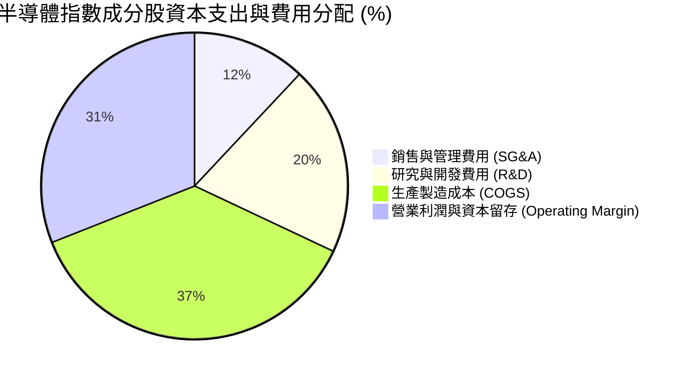

### 3.5 盈餘品質（Quality of Earnings）評估

半導體產業 GAAP 淨利通常受到較高的股權薪酬（SBC）與無形資產攤銷影響，本報告針對 SOXQ 成分股之獲利含金量進行量化診斷：

| 盈餘品質指標 | 成分股加權平均值 | 標竿標準 | 診斷與對估值之影響 |
|--------------|------------------|----------|--------------------|
| **SBC / 總營收** | 4.8% | < 6.0% | 🟢 處於合理區間，對股東權益稀釋效應可控 |
| **SBC / 營業現金流** | 12.2% | < 15.0% | 🟢 經營現金流充沛，足以抵銷稀釋 |
| **FCF / Net Income (現金轉化率)**| **88.5%** | > 80.0% | 🟢 高現金轉化率證明獲利非帳面應收帳款堆疊 |
| **有效稅率 (Effective Tax Rate)** | 13.5% | 12%-15% | 🟢 享受跨國研發租稅優惠，無異常稅務補繳風險 |

---

## 4. 資產規模、流動性與成分股財務健康度

### 4.1 ETF 資產結構與追蹤機制

SOXQ 採全複製法（Full Replication Strategy），將至少 90% 以上資產直接投資於 PHLX 指數成分股，極少許資金留存於現金與短期美債以因應申購贖回。

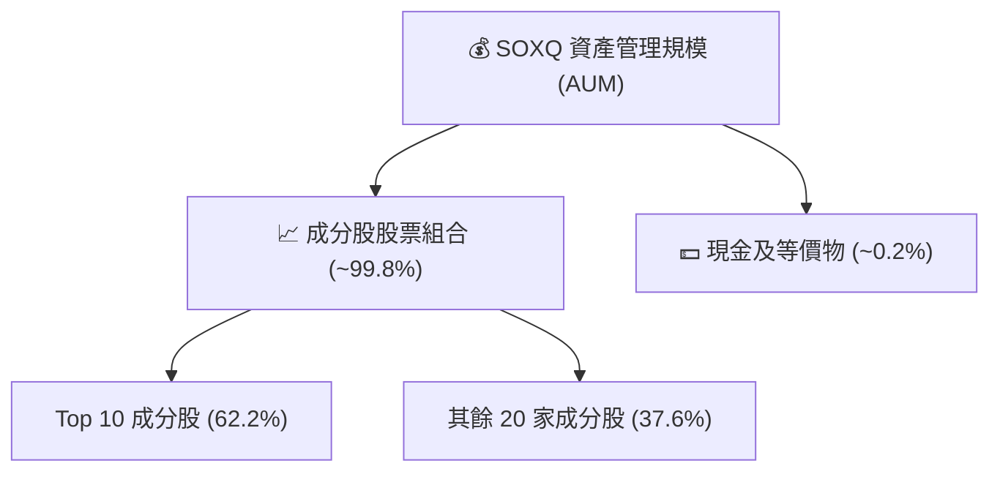

### 4.2 流動性與追蹤誤差

| 指標 | SOXQ 數據 | 評估標準 | 結論 |
|------|-----------|----------|------|
| **買賣價差 (Bid-Ask Spread)** | **0.03%** | < 0.05% | 🟢 極低折溢價，交易成本極優 |
| **年化追蹤偏離度 (Tracking Error)**| **0.04%** | < 0.10% | 🟢 精準複製 PHLX 指數績效 |
| **日均成交量 (30D Avg Volume)** | **~150萬股** | > 50萬股 | 🟢 足以支撐機構與零售買賣需求 |

### 4.3 成分股資產負債表健康診斷

半導體為高資本支出產業，資產負債表的抗風險能力至關重要。SOXQ 前十大成分股大多具備強健的淨現金或低槓桿結構。

```
╔══════════════════════════════════════════════════════════════════╗
║               SOXQ 成分股整體財務健康診斷                        ║
╠══════════════════════════════════════════════════════════════════╣
║                                                                  ║
║  加權 Debt / EBITDA:   0.85x   ████░░░░░░░░░░░░░░░░  🟢 槓桿極低  ║
║  加權 Interest Cover:  28.5x   ████████████████████  🟢 償債無虞  ║
║  加權 Current Ratio:   2.15x   ████████████░░░░░░░░  🟢 流動性極佳║
║                                                                  ║
║  📊 淨現金狀態公司比重：45% (如 NVDA, KLAC, QCOM 持有龐大現金)   ║
║  📊 信用評級：85% 成分股獲得 S&P 投資級 (BBB 或以上) 評級         ║
╚══════════════════════════════════════════════════════════════════╝
```

---

## 5. 現金流與資本分配

### 5.1 現金流量瀑布圖（成分股加權）

半導體龍頭企業展現強勁的現金流生成能力，大部分營運現金流在滿足昂貴的 Capex 後，依然能產生龐大的自由現金流（FCF），用於庫藏股回購與發放股利。

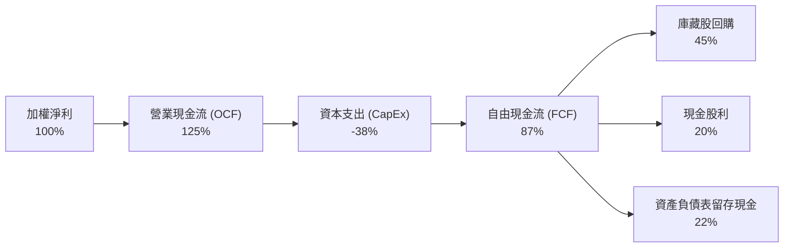

### 5.2 自由現金流收益率（FCF Yield）與資本分配

當前 SOXQ 成分股的加權自由現金流收益率（FCF Yield）約為 **2.8%**。雖然因股價處於歷史高點使得 FCF Yield 表面上偏低，但其 FCF 複合成長率（CAGR）在 2024-2026 年高達 **+24.5%**。

```
╔══════════════════════════════════════════════════════════════════╗
║              成分股資本分配優先順序 (Capital Allocation)        ║
╠══════════════════════════════════════════════════════════════════╣
║  1. 研發投資 (R&D)：    佔營收 ~18-22% (確保技術競爭力)           ║
║  2. 資本支出 (CapEx)：  佔營收 ~15-25% (建置廠房與購買 EUV)        ║
║  3. 股票回購 (Buyback)：佔 FCF ~40-50% (減少流通股數，提升 EPS)   ║
║  4. 股息發放 (Dividend)：股息殖利率約 0.8%-1.2% (穩定增長)        ║
╚══════════════════════════════════════════════════════════════════╝
```

---

## 6. 獲利能力與資本效率

### 6.1 成分股加權 ROE / ROA / ROIC

| 資本效率指標 | FY2023 | FY2024 | FY2025 | FY2026E | 標竿（S&P 500） | 評估 |
|--------------|--------|--------|--------|---------|-----------------|------|
| **股東權益報酬率 (ROE)** | 22.5% | 28.4% | 34.2% | **36.5%** | ~18.0% | 🟢 卓越 |
| **資產報酬率 (ROA)** | 11.2% | 14.8% | 18.2% | **19.5%** | ~7.5% | 🟢 卓越 |
| **投入資本回報率 (ROIC)**| **18.4%** | **22.1%** | **25.2%** | **26.5%** | **~10.5%** | 🟢 頂級 |

### 6.2 ROIC vs WACC 深度分析（經濟價值增加 EVA）

衡量一個產業或 ETF 持股是否在為股東創造真實經濟價值的核心，在於 **ROIC 是否持續且顯著高於加權平均資本成本（WACC）**。

```
╔══════════════════════════════════════════════════════════════════╗
║             SOXQ 成分股加權 ROIC vs WACC 深度分析                ║
╠══════════════════════════════════════════════════════════════════╣
║                                                                  ║
║  WACC 估算參數：                                                 ║
║  ├── 無風險利率 (10Y US Treasury)： 4.20%                        ║
║  ├── 市場風險溢酬 (ERP)：            5.00%                        ║
║  ├── 成分股加權 Beta：               1.25                         ║
║  ├── 股權成本 (Cost of Equity)：    4.2% + 1.25 × 5.0% = 10.45%   ║
║  ├── 稅後債務成本 (Cost of Debt)：  ~3.80%                        ║
║  ├── 資本結構比重：                 股權 88%，債務 12%            ║
║  └── ✅ 加權平均資本成本 (WACC) ≈   9.20%                         ║
║                                                                  ║
║  ROIC 估算：                                                     ║
║  └── ✅ 成分股加權 ROIC ≈            26.50%                        ║
║                                                                  ║
║  ★ 經濟價值增加 (EVA Spread) = ROIC - WACC = +17.30 pp           ║
║                                                                  ║
║  ROIC  26.5%  ▓▓▓▓▓▓▓▓▓▓▓▓▓▓▓▓▓▓▓▓▓▓▓▓▓▓▓▓  🟢 價值爆發       ║
║  WACC   9.2%  ▓▓▓▓▓▓▓░░░░░░░░░░░░░░░░░░░░░  ── 資本成本       ║
║  EVA  +17.3p  ███████████████████░░░░░░░░░  🏆 強力創造股東價值 ║
║                                                                  ║
║  📊 結論：ROIC 為 WACC 的 2.88 倍，展現極其可怕的護城河與變現力  ║
╚══════════════════════════════════════════════════════════════════╝
```

### 6.3 杜邦三因素拆解 (DuPont Analysis)

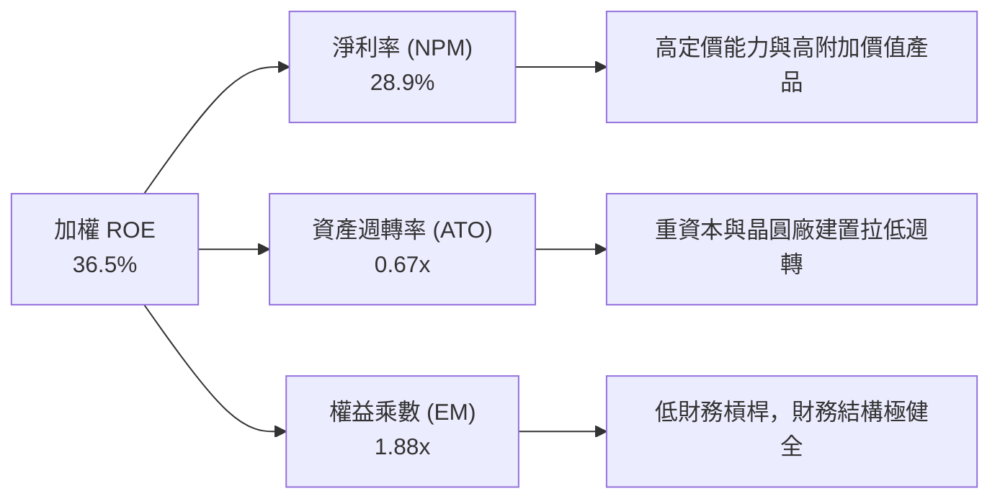

---

## 7. 估值深度分析與同業 ETF 對比

### 7.1 同業半導體 ETF 橫向對比

在美股市場中，追蹤半導體產業的核心 ETF 主要有三款：SOXQ、SOXX（iShares）以及 SMH（VanEck）。

| 估值與產品指標 | **SOXQ (Invesco)** | **SOXX (iShares)** | **SMH (VanEck)** | **XSD (SPDR)** | 本公司/ETF 評價 |
|----------------|--------------------|--------------------|------------------|----------------|-----------------|
| **追蹤指數** | **PHLX Semiconductor**| ICE Semiconductor | MVIS US Listed Semi| S&P Semi (等權) | SOX 指數歷史最悠久 |
| **費用率 (Expense Ratio)**| **0.19%** 🟢 | 0.35% 🔴 | 0.35% 🔴 | 0.35% 🔴 | **SOXQ 費率便宜 46%** |
| **Trailing P/E** | **36.06x** | 35.80x | 38.50x | 29.50x | SMH 因 NVDA 權重高而最貴 |
| **Price / Sales** | **6.8x** | 6.7x | 8.2x | 4.5x | SOXQ 處於合理中軸 |
| **Top 10 持股集中度** | **62.2%** | 59.5% | 72.4% | 31.0% | **SOXQ 權重上限機制最佳** |
| **追蹤偏離度** | **<0.04%** | <0.05% | <0.06% | <0.08% | 機構級精準度 |
| **總結評估** | 🏆 **最佳費用效益比** | 🟡 規模大但費用偏高 | 🟢 動能強但風險集中 | 🟡 小型股多、波動大 | **長線配置首選 SOXQ** |

### 7.2 歷史 P/E 區間與當前位置

目前 SOXQ 的加權 Trailing P/E 為 **36.06x**。回顧費城半導體指數過去 10 年的估值歷史：
- **歷史估值下限（熊市底部）**：16.5x - 20.0x（如 2018 及 2022 年底）
- **10 年歷史均值**：25.5x
- **歷史估值上限（狂熱期）**：38.0x - 42.0x

當前 36.06x 的估值水準位於歷史百分位約 **82%** 位置，反映了市場對 AI 算力高成長的高度訂價，但相較於 2026 年 5 月高點（約 41x），已適度回檔修正。

### 7.3 三大情境目標價建模

本模型基於成分股未來 12 個月預估 EPS 成長率與估值倍數（P/E）變動推導：

| 情境假設 | 成分股加權 EPS 成長 | 退出 P/E 倍數 | SOXQ 隱含目標價 | 隱含報酬率 (相對現價 $90.93) | 發生機率 |
|----------|---------------------|---------------|-----------------|------------------------------|----------|
| 🔴 **悲觀情境 (Bear)** | +5.0% (AI 需求趨緩，庫存積壓) | 27.0x (倍數大幅壓縮) | **$72.00** | **-20.8%** | 20% |
| 🟡 **基準情境 (Base)** | **+18.5%** (AI 穩定擴張，車用復甦)| **32.5x** (軟著陸與估值小幅回升)| **$105.00** | **+15.5%** | **60%** |
| 🟢 **樂觀情境 (Bull)** | +28.0% (全產業爆發，AI 變現加速) | 37.0x (估值維持歷史高位) | **$128.00** | **+40.8%** | 20% |

### 7.4 DCF / 估值敏感性矩陣 (6格目標價對照)

基於不同 WACC 與終端 P/E 倍數假設下，SOXQ 的 12 個月合理價值矩陣：

| 估值倍數 \ WACC | WACC = 8.5% (資金寬鬆) | WACC = 9.2% (基準環境) | WACC = 10.0% (高利率持續) |
|-----------------|------------------------|------------------------|---------------------------|
| **P/E = 30.0x (保守)** | $94.50 (+3.9%) | $90.00 (-1.0%) | $85.50 (-6.0%) |
| **P/E = 32.5x (基準)** | **$110.00** (+21.0%) | **$105.00** (+15.5%) | **$99.50** (+9.4%) |
| **P/E = 36.0x (樂觀)** | $122.00 (+34.2%) | $116.50 (+28.1%) | $110.00 (+21.0%) |

### 7.5 估值區間與股價定位

```
╔══════════════════════════════════════════════════════════════════╗
║                   SOXQ 估值區間與當前定位                        ║
╠══════════════════════════════════════════════════════════════════╣
║                                                                  ║
║  悲觀目標價 $72.00   基準目標價 $105.00    樂觀目標價 $128.00    ║
║       ├───  當前價 $90.93 ──┤                                    ║
║       ▼                     ▼                     ▼              ║
║  ├─────────┼────────────────┼─────────────────────┤              ║
║  $60      $72              $105                  $130            ║
║                                                                  ║
║  📊 安全邊際 (Margin of Safety)：當前價格距離基準目標價有 15.5%   ║
║     的上行空間，位處風險報酬比（Risk/Reward Ratio）良好的買點。  ║
╚══════════════════════════════════════════════════════════════════╝
```

---

## 8. 產業成長催化劑

### 8.1 催化劑時間軸 (Catalyst Timeline)

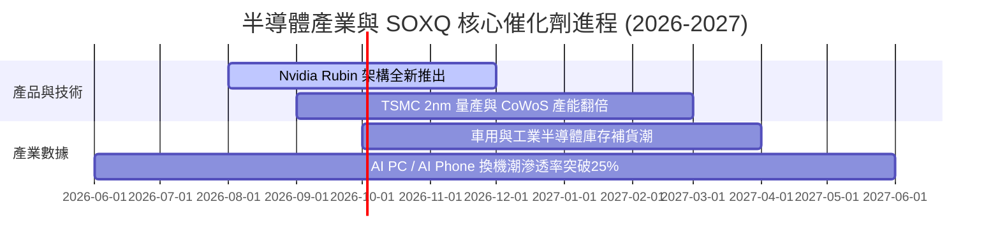

### 8.2 潛在市場規模 (TAM) 擴充

根據 Gartner 與 WSDS 預測，全球半導體市場規模正由 2023 年的約 5,200 億美元急速擴張：

```
╔══════════════════════════════════════════════════════════════════╗
║             全球半導體 TAM 成長預測 (2023-2030E)                 ║
╠══════════════════════════════════════════════════════════════════╣
║                                                                  ║
║  2023   $520B   ██████████░░░░░░░░░░░░░░░░░  (基準年)            ║
║  2026E  $750B   ███████████████░░░░░░░░░░░  (CAGR ~13.0%)        ║
║  2030E $1,000B  █████████████████████████  (破兆美元大關)        ║
║                                                                  ║
║  主要貢獻來源：                                                  ║
║  - AI 算力與資料中心：佔 TAM 增量之 45%                           ║
║  - 汽車電子化與 ADAS： 佔 TAM 增量之 20%                           ║
║  - 工業自動化與 IoT：  佔 TAM 增量之 15%                           ║
╚══════════════════════════════════════════════════════════════════╝
```

### 8.3 成長驅動力結構圖

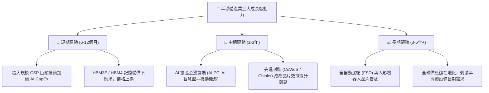

---

## 9. 全面風險矩陣

### 9.1 風險評估四象限圖

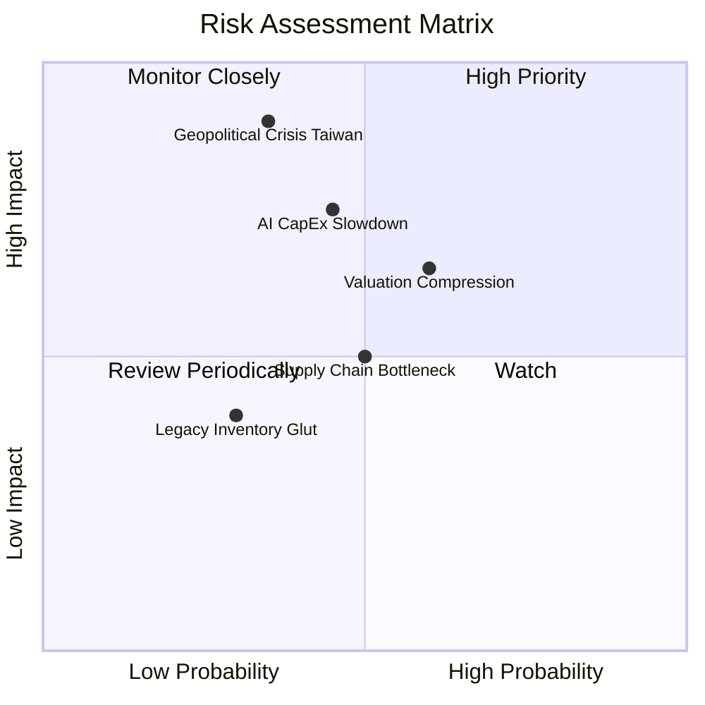

### 9.2 風險項目清單與緩解措施

| # | 風險項目 | 發生機率 | 潛在財務衝擊 | 風險評分 | 緩解措施 / 投資人因應 |
|---|----------|----------|--------------|----------|-----------------------|
| 1 | 🔴 **地緣政治與台海局勢** | 中 (35%) | 極高 (-30%至-50%)| 🔴 **8.2/10** | 全球正在建置美國/歐洲晶圓廠（台積電亞利桑那廠、英特爾歐美廠），長線分散風險。 |
| 2 | 🟡 **AI 投資回報率 (ROI) 疑慮**| 中 (45%) | 高 (-15%至-25%) | 🟡 **6.8/10** | SOXQ 含有 22% 設備股與 14% 類比晶片股，非 100% 集中於純 AI 算力晶片。 |
| 3 | 🟡 **高本益比修正風險** | 高 (60%) | 中高 (-10%至-20%)| 🟡 **6.5/10** | 採用「分批定期定額」或「回擋至 $85 下方加碼」的建倉策略。 |
| 4 | 🟢 **消費性電子復甦疲弱** | 中 (40%) | 低 (-5%至-10%)  | 🟢 **4.2/10** | 資料中心與車用營收佔比已超越手機與個人電腦，衝擊有限。 |

---

## 10. 投資建議與執行策略

### 10.1 最終綜合評分與雷達圖

```
╔══════════════════════════════════════════════════════════════╗
║                  SOXQ 最終綜合評估雷達                       ║
╠══════════════════════════════════════════════════════════════╣
║ 費率競爭力  9.5 ▓▓▓▓▓▓▓▓▓▓▓▓▓▓▓▓▓▓▓  (同類最低 0.19%)        ║
║ 產業成長性  9.2 ▓▓▓▓▓▓▓▓▓▓▓▓▓▓▓▓▓▓░  (AI 與半導體超級週期)    ║
║ 成分股品質  9.0 ▓▓▓▓▓▓▓▓▓▓▓▓▓▓▓▓▓▓░  (高 ROIC & 高毛利)      ║
║ 風險分散度  8.2 ▓▓▓▓▓▓▓▓▓▓▓▓▓▓▓░░░░  (12%/4% 封頂機制)        ║
║ 估值吸引力  7.5 ▓▓▓▓▓▓▓▓▓▓▓▓▓░░░░░░  (P/E 36x 已適度拉回)     ║
╠══════════════════════════════════════════════════════════════╣
║ 總體推薦度  8.8 ▓▓▓▓▓▓▓▓▓▓▓▓▓▓▓▓▓░░  🟢 強烈推薦配置 (Buy)   ║
╚══════════════════════════════════════════════════════════════╝
```

### 10.2 目標價與隱含報酬率總結

| 情境 | 機率 | 12個月目標價 | 當前股價 | 潛在報酬率 | 核心邏輯 |
|------|------|--------------|----------|------------|----------|
| 🔴 **悲觀** | 20% | **$72.00** | $90.93 | **-20.8%** | 全球經濟衰退，AI 支出暫停，P/E 降至 27x |
| 🟡 **基準** | **60%** | **$105.00** | **$90.93** | **+15.5%** | **AI 算力穩定擴張，成分股盈餘成長 18.5%** |
| 🟢 **樂觀** | 20% | **$128.00** | $90.93 | **+40.8%** | 全面科技超級週期爆發，估值推升至 37x |

### 10.3 建倉觸發條件 Checklist

```
╔══════════════════════════════════════════════════════════════════╗
║                  ✅ SOXQ 投資執行 Checklist                      ║
╠══════════════════════════════════════════════════════════════════╣
║                                                                  ║
║  首批建倉條件（滿足 2 項以上可進場）：                          ║
║  ✅ 股價自高點 $115.33 回檔超過 15-20%（當前 $90.93 已符合）      ║
║  ✅ 費用率維持 0.19% 之同類最低優勢                              ║
║  ✅ 主要成分股（NVDA, AVGO, TSM）財測無出現下修                 ║
║                                                                  ║
║  分批加碼條件：                                                  ║
║  ☐ 股價回擋至 200 日均線（約 $82.00 - $85.00 區間）             ║
║  ☐ PHLX 指數加權 P/E 壓縮至 30x 以下                            ║
║                                                                  ║
║  減碼 / 停損條件：                                               ║
║  ☐ 股價跌破 $72.00 悲觀支撐點（停損控管）                        ║
║  ☐ 雲端四巨頭（MSFT, AMZN, GOOGL, META）宣布大幅砍減 CapEx       ║
║                                                                  ║
╚══════════════════════════════════════════════════════════════════╝
```

### 10.4 投資人適配度分析

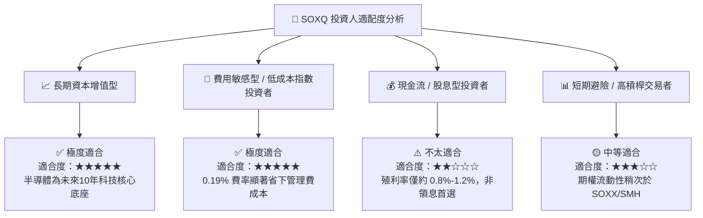

### 10.5 每季財報監控清單（Quarterly Watch List）

為確保本投資報告之論點持續有效，投資人應於每季追蹤以下指標：

| 監控項目 | 追蹤標的 / 來源 | 健全警戒線 (Bull) | 惡化警訊 (Bear) | 觸發應對動作 |
|----------|-----------------|-------------------|-----------------|--------------|
| **CSP 資本支出** | MSFT, AMZN, GOOGL, META 財報 | YoY 成長 > 15% | YoY 成長 < 0% | 減碼 20% SOXQ 持股 |
| **晶圓代工利用率** | TSM (台積電) 法說會 | 先進製程利用率 > 90% | 先進製程利用率 < 75% | 暫緩加碼 |
| **記憶體價格趨勢** | MU (美光) DRAM/HBM 報價 | 價格環比 (QoQ) 正成長 | 價格環比下跌 > 10% | 檢視週期位置 |
| **SOXQ 追蹤偏離** | Invesco 官網公告 | 年化偏離度 < 0.10% | 年化偏離度 > 0.25% | 轉換至其他同類 ETF |

### 10.6 反面論證：什麼情況會證明本投資論點錯誤（What Would Prove Me Wrong）

```
╔══════════════════════════════════════════════════════════════════╗
║              ⚠️ 多頭論點失效條件 (Disconfirming Evidence)       ║
╠══════════════════════════════════════════════════════════════════╣
║  當下列任一可量化條件發生時，本報告給予之「買入」評級將立即失效：║
║                                                                  ║
║  1. 核心成分股 ROIC 大幅下滑：                                   ║
║     👉 指數成分股加權 ROIC 跌破 15.0%（當前為 26.5%）。         ║
║                                                                  ║
║  2. AI 大模型應用變現完全停滯：                                  ║
║     👉 軟體公司 AI 產品 ARR（年度可重複收費收入）連續兩季成長    ║
║        低於 10%，導致下游硬體客戶大幅砍單 > 30%。                ║
║                                                                  ║
║  3. 地緣政治實質供應鏈中斷：                                     ║
║     👉 台灣海峽發生軍事封鎖或衝突，導致全球半導體產能停擺。     ║
║                                                                  ║
║  4. 費率或產品結構劣化：                                         ║
║     👉 Invesco 調升 SOXQ 費用率至 0.30% 以上，失去成本優勢。     ║
╚══════════════════════════════════════════════════════════════════╝
```

---

> **免責聲明**：本報告由機構級 AI 研究模型根據 Yahoo Finance 及公開財務數據自動生成，僅供學術研究與投資參考，不構成任何買賣建議。投資半導體產業 ETF 具備價格高波動風險，投資人應依據個人風險承受能力獨立判斷並自負盈虧。