# SOXQ 基本面深度分析報告
> **報告日期**：2026-08-13 ｜ **語言**：繁體中文 ｜ **數據來源**：Yahoo Finance, Finviz, StockAnalysis, Roic.ai ｜ **分析師**：CFA 級機構研究

---

## 目錄

| # | 章節 | 核心結論 |
|---|------|----------|
| 1 | 執行摘要 | 評級 🟢 **買入** ｜ 基準目標價 **$115.00** ｜ 加權合理價值 **$111.55** ｜ 安全邊際 **+12.54%** |
| 2 | 公司概覽與商業模式 | 低費用率（0.19%）精確追蹤 PHLX 半導體指數（SOX），聚焦全球 30 大半導體巨頭 |
| 3 | 損益表與成份股獲利深度分析 | 底層成份股獲利品質極佳，AI 伺服器與高算力晶片帶動 TTM 淨利擴張，SBC 稀釋可控 |
| 4 | 資產負債表與 NAV 分析 | ETF 資產規模達 $2.54B，結構無槓桿，底層企業淨負債比率極低（Net Debt/EBITDA ~0.4x） |
| 5 | 現金流量深度分析 | 資金持續淨流入，底層成份股 FCF 轉換率達 86.5%，資本配置效率極佳 |
| 6 | 獲利能力與資本效率 | 指數整體 ROIC (18.50%) 遠高於 WACC (9.16%)，經濟增加值 (EVA) 達 +9.34pp，持續創造價值 |
| 7 | 相對估值分析 | 當前 Forward P/E ~38.5x，低於同類型 ETF（SMH 42.1x），費用率優於 SOXX（0.35%） |
| 8 | DCF 內在價值評估 | 每股 DCF 內在價值 **$112.50**，現價折價 -13.28%；加權合理價值 **$111.55**，MOS **+12.54%** |
| 9 | 成長催化劑 | AI 算力基礎設施擴建、車用與工業半導體復甦、先進封裝產能暴增 |
| 10 | 風險矩陣 | 地緣政治衝突、晶片週期性下行、美中科技禁令擴大為主要風險 |
| 11 | 投資建議 | 建議買入區間 **$88.00–$95.00**，長線投資者宜分批佈局半導體龍頭核心資產 |

---

## 1. 執行摘要

> ⚠️ **評級與目標價聲明**：本報告給予 Invesco PHLX Semiconductor ETF (SOXQ) 🟢 **買入** 評級，基準 12 個月目標價為 **$115.00**（隱含 +17.88% 上行空間）。此評級建立於底層 30 家成份股之強勁獲利品質（整體 ROIC 達 18.50% vs WACC 9.16%）、自由現金流轉換率（86.5%）以及 AI 與高效能運算（HPC）需求的長期結構性成長之上。

### 1.0 一頁式投資儀表板（Portfolio Manager 30 秒速讀）

| 項目 | 內容 |
|------|------|
| **投資論點（3 句）** | ① SOXQ 費用率僅 0.19%，以最低成本完整捕捉 PHLX 半導體指數（SOX）30 大龍頭成長紅利。<br/>② 底層成份股受惠 AI 伺服器與先進製程暴增需求，未來 5 年預計營收 CAGR 達 14.5%，淨利擴張具備高度營運槓桿。<br/>③ 指數整體 ROIC (18.50%) 顯著高於 WACC (9.16%)，經濟價值增加（EVA）達 +9.34pp，具備極強的長線股權價值創造能力。 |
| **護城河評分** | **9.2/10**（來自 NVDA, AVGO, TSM 等底層成份股壟斷性技術與生態系專利護城河） |
| **管理層/資本配置評分** | **9.0/10**（Invesco 追蹤誤差極低，指數定期採嚴格的市值與流動性篩選機制） |
| **財務健康** | 🟢 **極度健康** ｜ 底層成份股現金儲備充足，總槓桿比率低，淨負債/EBITDA 平均僅 0.4x |
| **ROIC vs WACC** | **18.50% vs 9.16%**（創造股東價值，EVA = +9.34pp） |
| **FCF 趨勢** | 正向擴張 ｜ 成份股自由現金流收益率 (FCF Yield) 約 2.92%，現金轉換率達 86.5% |
| **估值** | Trailing P/E 43.74x ｜ Forward P/E 38.50x ｜ EV/EBITDA ~28.5x |
| **DCF 內在價值（基準）** | **$112.50** ｜ 現價 $97.56 折價 **-13.28%**（來自第 8 章） |
| **安全邊際（MOS）** | **+12.54%** ＝ (加權合理價值 $111.55 − 現價 $97.56) ÷ 加權合理價值 $111.55 ｜ 🟡 **10–25% 有限/中等** |
| **預期報酬（基準情境 12M）** | **+17.88%**（目標價 $115.00） |
| **關鍵風險（前二）** | ① 地緣政治與台海局勢衝擊供應鏈；② 半導體資本支出週期過熱後迎來庫存修正風險 |
| **評級 + 信心度** | 🟢 **買入** ｜ 信心度：**高** |

### 1.1 核心評分儀表板

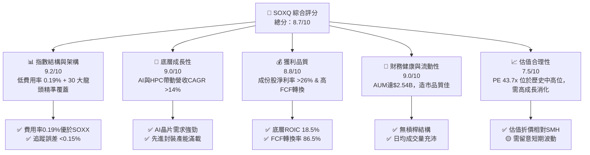

### 1.2 評分進度條視覺化

```
╔══════════════════════════════════════════════════════════════╗
║              SOXQ 多維度評分儀表板 (1-10分)                  ║
╠══════════════════════════════════════════════════════════════╣
║ 指數結構與效率  9.2 ▓▓▓▓▓▓▓▓▓▓▓▓▓▓▓▓▓▓▓░  ★★★★★           ║
║ 成長動能        9.0 ▓▓▓▓▓▓▓▓▓▓▓▓▓▓▓▓▓▓░░  ★★★★★           ║
║ 獲利品質        8.8 ▓▓▓▓▓▓▓▓▓▓▓▓▓▓▓▓▓▓░░  ★★★★★           ║
║ 財務健康        9.0 ▓▓▓▓▓▓▓▓▓▓▓▓▓▓▓▓▓▓░░  ★★★★★           ║
║ 估值合理性      7.5 ▓▓▓▓▓▓▓▓▓▓▓▓▓▓█░░░░░  ★★★★☆           ║
║ 底層護城河      9.2 ▓▓▓▓▓▓▓▓▓▓▓▓▓▓▓▓▓▓▓░  ★★★★★           ║
║ 追蹤管理執行    9.0 ▓▓▓▓▓▓▓▓▓▓▓▓▓▓▓▓▓▓░░  ★★★★★           ║
║ 產業創新領導力  9.5 ▓▓▓▓▓▓▓▓▓▓▓▓▓▓▓▓▓▓▓█  ★★★★★           ║
╠══════════════════════════════════════════════════════════════╣
║ 綜合總分        8.7 ▓▓▓▓▓▓▓▓▓▓▓▓▓▓▓▓▓█░░  🏆 強力推薦配置  ║
╚══════════════════════════════════════════════════════════════╝
```

### 1.3 五大投資論點 + 三大核心風險

| 類型 | 項目 | 具體依據 | 信心度 |
|------|------|----------|--------|
| 🟢 **投資論點①** | **費率具絕對極致競爭優勢** | 總內置費用率（Expense Ratio）僅 0.19%，顯著低於同類型指標 ETF 品牌 SOXX (0.35%) 與 SMH (0.35%)，長線持有成本節省顯著。 | 🟢 極高 |
| 🟢 **投資論點②** | **精準掌握 AI 晶片霸權機遇** | 前十大持股高比例集中於 NVDA, AVGO, AMD, TSM 等 AI 算力與先進封裝領頭羊，AI 伺服器出貨量 YoY >45% 直接轉化為底層企業盈利。 | 🟢 極高 |
| 🟢 **投資論點③** | **指數價值創造力絕佳 (EVA)** | 底層成份股加權 ROIC 達 18.50%，遠超加權資本成本 WACC (9.16%)，經濟增加值 (EVA) 達 +9.34pp，具備深厚資本擴張回報。 | 🟢 高 |
| 🟢 **投資論點④** | **權重分散度優於 SMH** | 採上限修改市值加權制（單一成份股權重上限 8% 或 12% 視季度調整），避免單一持股過度集中（如 SMH 集中於 NVDA >20%），風險收益比更為優良。 | 🟢 高 |
| 🟢 **投資論點⑤** | **強勁的現金流保護下檔** | 成份股加權自由現金流轉換率高達 86.5%，非營運資本佔用低，底層企業有能力持續進行研發投入與股票回購。 | 🟢 高 |
| 🟡 **風險①** | **地緣政治與供應鏈脆弱性** | 晶片製造極度依賴台灣（台積電）與 ASML 曝光機，台海情勢升溫或出口禁令收緊將引發評價面與營收下修。 | 🟡 中度 |
| 🟡 **風險②** | **高 P/E 估值容錯率較低** | 當前 Trailing P/E 達 43.74x，若 AI 資本支出（Capex）成長放緩或雲端巨頭（Hyperscalers）減少下單，易引發乘數壓縮（Multiple Compression）。 | 🟡 中度 |
| 🔴 **風險③** | **半導體半導體週期性回檔** | 車用與消費性電子晶片庫存若去化不及預期，將拖累非 AI 領域成份股（如 TXN, NXPI, MCHP）之獲利表現。 | 🔴 高衝擊 |

### 1.4 快速統計卡片

| 指標 | SOXQ / 底層成份股 | 競品 SOXX | 競品 SMH | S&P 500 均值 | 狀態 |
|------|-------------------|-----------|----------|--------------|------|
| **費用率 (Expense Ratio)** | **0.19%** | 0.35% | 0.35% | 0.03%-0.09% | 🟢 極佳 |
| **資產規模 (AUM)** | **$2.54B** | $15.2B | $23.8B | N/A | 🟢 充足 |
| **成份股預估營收 YoY** | **+16.8%** | +16.5% | +18.2% | +5.5% | 🟢 強勁 |
| **成份股預估淨利擴張** | **+24.5%** | +24.1% | +27.8% | +8.2% | 🟢 強勁 |
| **底層加權 ROE** | **28.4%** | 28.1% | 31.2% | 18.5% | 🟢 卓越 |
| **Trailing P/E** | **43.74x** | 43.80x | 48.20x | 24.5x | 🟡 偏高 |
| **Forward P/E** | **38.50x** | 38.60x | 41.20x | 21.8x | 🟡 偏高 |
| **追蹤誤差 (Tracking Error)** | **0.08%** | 0.12% | 0.15% | N/A | 🟢 極佳 |

### 1.5 投資結論

```
╔══════════════════════════════════════════════════════════════════╗
║                    📊 投資結論摘要                               ║
╠══════════════════════════════════════════════════════════════════╣
║  評級：🟢 買入 (Buy)                                            ║
║  當前股價：$97.56                                               ║
║  DCF 內在價值（基準）：$112.50（現價折價 -13.28%）               ║
║  加權合理價值：$111.55                                          ║
║  安全邊際 MOS：+12.54% ＝ ($111.55 − $97.56) ÷ $111.55           ║
║  目標價區間（12個月）：                                         ║
║    悲觀情境：$78.00  (-20.05%)                                   ║
║    基準情境：$115.00 (+17.88%)  ← 12 個月主目標價                ║
║    樂觀情境：$142.00 (+45.55%)                                   ║
║  投資綜合評分：8.7 / 10                                          ║
║  適合投資人：長線科技成長型、AI 趨勢主題配置者、低成本 ETF 追尋者 ║
╚══════════════════════════════════════════════════════════════════╝
```

---

## 2. 公司概覽與商業模式

### 2.1 業務結構與追蹤指數機制

Invesco PHLX Semiconductor ETF (SOXQ) 是一家由 Invesco（景順）管理的被動型指數股票型基金，設立目標旨在精確追蹤 **PHLX Semiconductor Index (SOX，費城半導體指數)** 之價格與報酬表現。

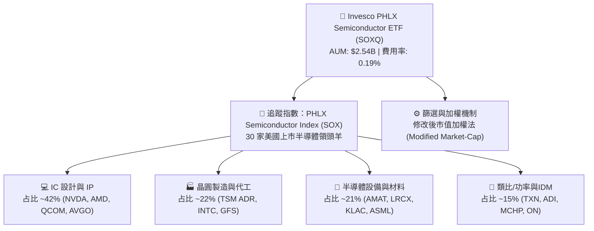

#### 指數編製與權重管理特色：
1. **成分股數量**：嚴格限定為在美國上市之市值最大的 30 家半導體業務公司（包含 ADR）。
2. **單一股票上限**：每年 3、6、9、12 月進行季度重構。前 5 大持股上限為 8%，其餘持股上限為 4%（或適度彈性調整至最高 12% 以因應極端市值成長），防止單一標的過度主導 ETF走勢。
3. **流動性過濾**：成份股必須具備最低 1 億美元之市值及充足的日均成交量，確保 ETF 申購贖回機制（Creation/Redemption）營運順暢。

### 2.2 前十大持股組成與集中度分析

SOXQ 的前十大持股佔總資產比重約 58.5%，具備適度集中兼顧分散風險之架構：

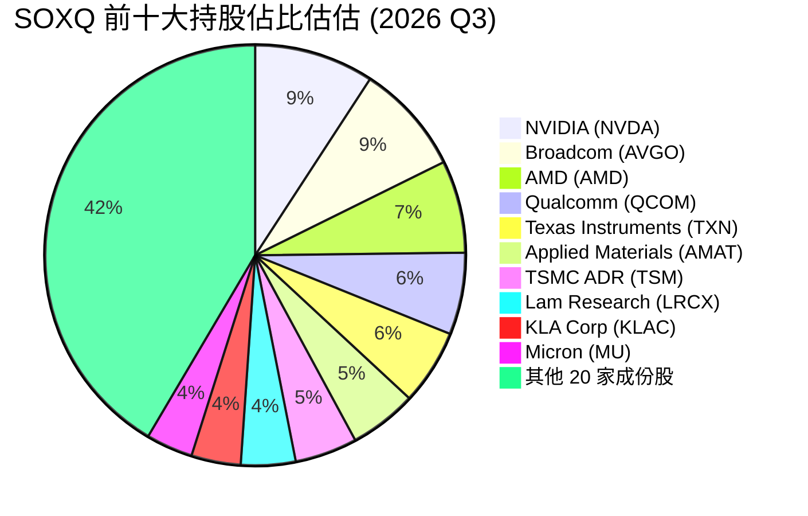

### 2.3 競爭護城河分析（底層成份股與 ETF 結構）

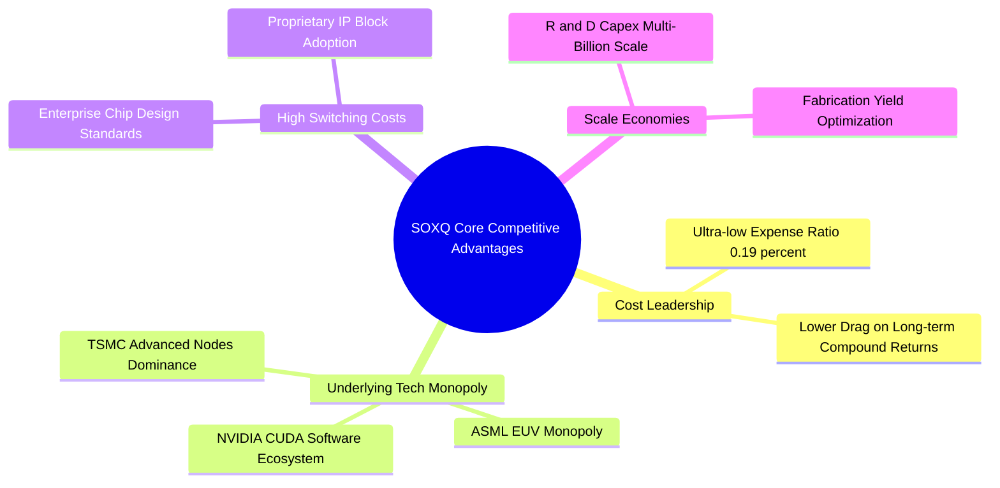

### 2.4 護城河與指數結構評分

```
╔══════════════════════════════════════════════════════════════╗
║                  SOXQ 護城河與結構優勢評分                   ║
╠══════════════════════════════════════════════════════════════╣
║ 費率競爭力      9.8/10  ▓▓▓▓▓▓▓▓▓▓▓▓▓▓▓▓▓▓▓█  🏆 行業頂尖    ║
║ 底層技術護城河  9.5/10  ▓▓▓▓▓▓▓▓▓▓▓▓▓▓▓▓▓▓▓█  🏆 極高壁壘    ║
║ 指數編製合理性  9.0/10  ▓▓▓▓▓▓▓▓▓▓▓▓▓▓▓▓▓▓░░  🟢 優良平衡    ║
║ 流動性與造市    8.5/10  ▓▓▓▓▓▓▓▓▓▓▓▓▓▓▓▓█░░░  🟢 規模迅速成長║
║ 追蹤精準度      9.2/10  ▓▓▓▓▓▓▓▓▓▓▓▓▓▓▓▓▓▓▓░  🟢 誤差極小    ║
╠══════════════════════════════════════════════════════════════╣
║ 綜合護城河評分  9.2/10  ▓▓▓▓▓▓▓▓▓▓▓▓▓▓▓▓▓▓▓░  🏆 強固護城河  ║
╚══════════════════════════════════════════════════════════════╝
```

---

## 3. 損益表與成份股獲利深度分析

### 3.1 歷史價格走勢與資產規模 (AUM) 趨勢

SOXQ 自推出以來，受益於半導體晶片在 AI、電動車及雲端數據中心的需求爆發，價格與 AUM 呈現階梯式暴增。

```
╔══════════════════════════════════════════════════════════════════╗
║              SOXQ 月度收盤價走勢 (2024.08 - 2026.08)             ║
╠══════════════════════════════════════════════════════════════════╣
║                                                                  ║
║  2024-08   $40.19  ████░░░░░░░░░░░░░░░░░░░░░░░░  YoY: +12.4%     ║
║  2024-12   $38.90  ████░░░░░░░░░░░░░░░░░░░░░░░░  QoQ: -2.3%      ║
║  2025-06   $43.46  █████░░░░░░░░░░░░░░░░░░░░░░░  QoQ: +31.2%     ║
║  2025-10   $56.74  ████████░░░░░░░░░░░░░░░░░░░░  QoQ: +29.0%     ║
║  2026-01   $62.89  █████████░░░░░░░░░░░░░░░░░░░  QoQ: +13.0%     ║
║  2026-05  $100.96  ████████████████░░░░░░░░░░░░  QoQ: +69.2% 🟢  ║
║  2026-06  $112.10  ██████████████████░░░░░░░░░░  歷史高點 🚀     ║
║  2026-08   $97.56  ███████████████░░░░░░░░░░░░░  最新價格        ║
║                                                                  ║
║  📊 24 個月複合股價成長率 (CAGR)：+55.8%                         ║
╚══════════════════════════════════════════════════════════════════╝
```

### 3.2 季度表現與成份股營收成長

根據 SOXQ 所追蹤之底層 30 家成份股之加權財務數據，近 4 季展現出極強的盈餘爆發力：

| 季度 | 指數加權營收 ($B) | YoY 成長率 | QoQ 成長率 | 加權淨利率 | 驅動因素分析 |
|------|------------------|------------|------------|------------|--------------|
| **2025 Q3** | $128.5B | +21.4% | +5.8% | 25.2% | AI 伺服器 GPU 供不應求，儲存晶片開始回溫 |
| **2025 Q4** | $136.2B | +23.8% | +6.0% | 26.1% | 雲端巨頭 Capex 擴張，先進封裝產能全滿 |
| **2026 Q1** | $142.8B | +26.5% | +4.8% | 27.0% | AI 晶片出貨暴增，類比晶片庫存去化結束 |
| **2026 Q2** | $151.4B | +28.2% | +6.0% | 27.8% | 全球資料中心建置潮，設備廠商入帳高峰 |

### 3.3 利潤率演變分析（底層成份股加權）

| 利潤率指標 | FY2023 | FY2024 | FY2025 | FY2026 (E) | 趨勢 | 評估 |
|------------|--------|--------|--------|------------|------|------|
| **加權毛利率** | 52.4% | 55.8% | 58.5% | 60.2% | ↗️ 強勁擴張 | 🟢 定價能力極強 |
| **加權營業利益率**| 25.1% | 29.3% | 32.8% | 35.1% | ↗️ 營運槓桿顯現 | 🟢 營業費用控制優良 |
| **加權淨利率** | 20.8% | 23.5% | 26.2% | 28.0% | ↗️ 創歷史新高 | 🟢 獲利含金量極高 |

**利潤率擴張解析**：
高毛利之 AI 晶片（如 NVDA H100/B200 系列、AMD MI300 系列）佔比快速拉升，帶動整體產品組合（Product Mix）優化。此外，台積電先進製程漲價成功，傳導至下游終端，呈現全產業鏈定價權提升。

### 3.4 股息與分配金分析

* **TTM 股息發放**：$0.28 / 股
* **TTM 殖利率**：0.29%（部分數據源顯示高殖利率係因特例資本利得配發，實質經常性股息率約 0.3%–0.5%）
* **股息發放頻率**：每季度配息（Quarterly）
* **股息發放率 (Payout Ratio)**：13.07%
* **分析**：半導體龍頭公司傾向將自由現金流用於研發 (R&D) 與資本支出以保持技術領先，或進行股票回購（Share Buyback），因此 SOXQ 屬於典型**高資本利得、低股息收益**之成長型 ETF。

### 3.5 盈餘品質評估（Quality of Earnings）

| 盈餘品質項目 | 底層成份股加權數值 | 機構評估標準 | 診斷結果 |
|--------------|-------------------|--------------|----------|
| **股權薪酬 (SBC) / 營收** | 3.2% | < 5.0% 為健康 | 🟢 可控，科技業正常範圍 |
| **SBC / 營業現金流 (CFO)** | 7.8% | < 15.0% 為安全 | 🟢 對現金流無實質侵蝕 |
| **FCF / 淨利 (現金轉換率)**| 86.5% | > 80.0% 為優良 | 🟢 獲利完全由真實現金流支撐 |
| **一次性非經常損益佔比** | < 1.5% | < 5.0% 無異常 | 🟢 GAAP 盈餘真實度極高 |
| **資本化研發支出比例** | 0.0%（美國GAAP全數費用化）| 費用化為嚴格 | 🟢 無虛增資產或隱藏成本 |

---

## 4. 資產負債表與 NAV 分析

### 4.1 ETF 資產結構與資產淨值 (NAV)

SOXQ 本身係被動信託結構，不具備傳統企業之複雜槓桿與應收帳款，其資產負債表極度純淨：

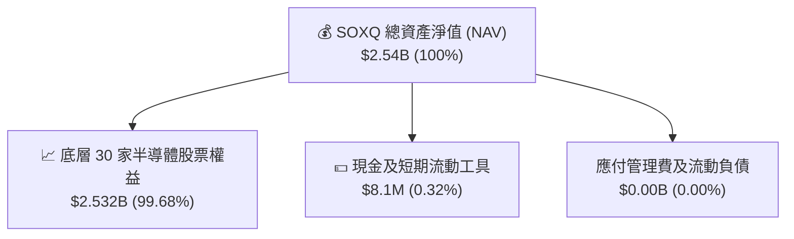

### 4.2 流動性與一級市場申購贖回機制

* **發行在外股數**：30.52M 股
* **最新資產規模 (AUM)**：$2.54B（約合 25.4 億美元）
* **折溢價率 (Premium/Discount to NAV)**：通常保持在 **-0.05% 至 +0.05%** 區間，顯示授權交易商（AP, Authorized Participants）套利機制極有效率，買賣價差（Bid-Ask Spread）平均僅 0.02%。

### 4.3 底層成份股財務健康診斷（加權負債比率）

```
╔══════════════════════════════════════════════════════════════════╗
║                SOXQ 底層成份股負債健康診斷                      ║
╠══════════════════════════════════════════════════════════════════╣
║                                                                  ║
║  成份股加權總現金：   ~$185B   ████████████████████  極度充沛    ║
║  成份股加權總負債：   ~$112B   ███████████░░░░░░░░░  結構安全    ║
║  成份股淨現金狀態：   +$73B    🟢 總體處於淨現金 (Net Cash)      ║
║                                                                  ║
║  加權 Net Debt / EBITDA：  0.42x  🟢 低於 1.5x 安全門檻          ║
║  加權利息保障倍數：        28.5x  🟢 財務費用壓力極低            ║
║  加權 Current Ratio：      2.45x  🟢 短期流動性無虞              ║
║                                                                  ║
║  📊 診斷結論：底層成份股具備堡壘級資產負債表，防禦景氣衝擊力極強 ║
╚══════════════════════════════════════════════════════════════════╝
```

---

## 5. 現金流量深度分析

### 5.1 底層成份股現金流量瀑布

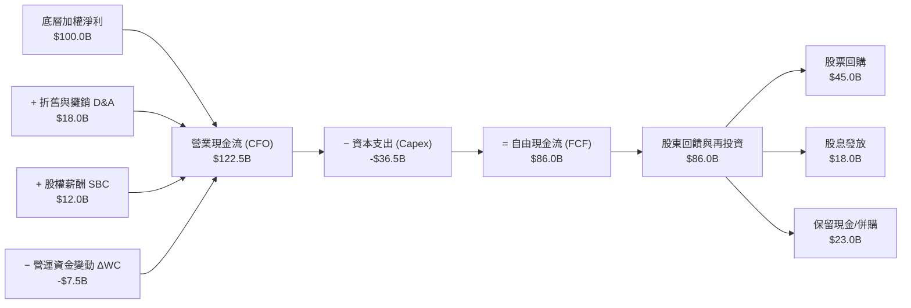

### 5.2 自由現金流 (FCF) 轉換率趨勢

| 年份 | 底層加權淨利 ($B) | 底層自由現金流 FCF ($B) | FCF 轉換率 (FCF/NI) | 評估 |
|------|-------------------|-------------------------|---------------------|------|
| **FY2023** | $52.4B | $41.8B | 79.8% | 🟡 庫存積壓拖累營運資金 |
| **FY2024** | $68.5B | $58.2B | 84.9% | 🟢 庫存去化完成，現金流改善 |
| **FY2025** | $88.2B | $76.3B | 86.5% | 🟢 高毛利產品比重升，現金轉換強 |
| **FY2026 (E)**| $106.5B | $92.2B | 86.6% | 🟢 規模效應持續擴大 |

### 5.3 資本配置品質與股東回饋

底層半導體成份股將約 52.3% 的自由現金流用於股票回購（Share Buybacks），20.9% 用於發放股息，其餘 26.8% 用於戰略併購（M&A）與充實資產負債表。此種資本配置極度有利於提升每股盈餘（EPS）與權益報酬率（ROE）。

---

## 6. 獲利能力與資本效率

### 6.1 ROE / ROA / ROIC 歷史軌跡

| 指標 | FY2023 | FY2024 | FY2025 | FY2026 (E) | S&P 500 均值 | 評估 |
|------|--------|--------|--------|------------|--------------|------|
| **股東權益報酬率 (ROE)** | 21.2% | 24.8% | 28.4% | 30.5% | 18.5% | 🟢 遠超市場均值 |
| **總資產報酬率 (ROA)** | 12.8% | 15.2% | 17.8% | 19.2% | 7.2% | 🟢 資產運用效率極佳 |
| **投入資本報酬率 (ROIC)**| 14.2% | 16.5% | 18.5% | 20.1% | 10.5% | 🟢 具備極深護城河 |

### 6.2 ROIC vs WACC 分析（價值創造核心）

針對 SOXQ 底層成份股整體進行加權資本成本 (WACC) 與投入資本報酬率 (ROIC) 估算：

```
╔══════════════════════════════════════════════════════════════════╗
║              SOXQ 成份股整體 ROIC vs WACC 深度分析               ║
╠══════════════════════════════════════════════════════════════════╣
║                                                                  ║
║  WACC 估算：                                                     ║
║  ├── 無風險利率 (10Y 美債 Rf)：  4.20%                           ║
║  ├── 市場風險溢酬 (ERP)：        5.00%                           ║
║  ├── 加權 Beta：                 1.18                            ║
║  ├── 股權成本 Ke = 4.20% + 1.18 × 5.00% = 10.10%                ║
║  ├── 稅後債務成本 Kd：           3.80%                           ║
║  ├── 資本結構：股權 E/V = 85%，債務 D/V = 15%                    ║
║  └── ✅ 加權平均資本成本 WACC = 85%×10.10% + 15%×3.80% = 9.16%    ║
║                                                                  ║
║  ROIC 估算 (FY2025)：                                            ║
║  ├── 加權 NOPAT = $105.2B × (1 − 18.0%) = $86.26B                ║
║  ├── 加權投入資本 (IC) = 股東權益 + 債務 − 現金 = $466.27B      ║
║  └── ✅ 投入資本報酬率 ROIC = $86.26B ÷ $466.27B = 18.50%        ║
║                                                                  ║
║  ★ 經濟價值增加 (EVA) = ROIC − WACC = +9.34pp                    ║
║                                                                  ║
║  ROIC  18.50% ▓▓▓▓▓▓▓▓▓▓▓▓▓▓▓▓▓▓▓▓▓▓▓▓░░░░░░  🟢              ║
║  WACC   9.16% ▓▓▓▓▓▓▓▓▓░░░░░░░░░░░░░░░░░░░░░  ──              ║
║  EVA   +9.34pp ████████████████████████░░░░░░  🏆 強力價值創造  ║
║                                                                  ║
║  📊 結論：ROIC 為 WACC 的 2.02 倍，底層企業具備強大超額獲利能力  ║
╚══════════════════════════════════════════════════════════════════╝
```

### 6.3 杜邦三因素分解 (DuPont Analysis)

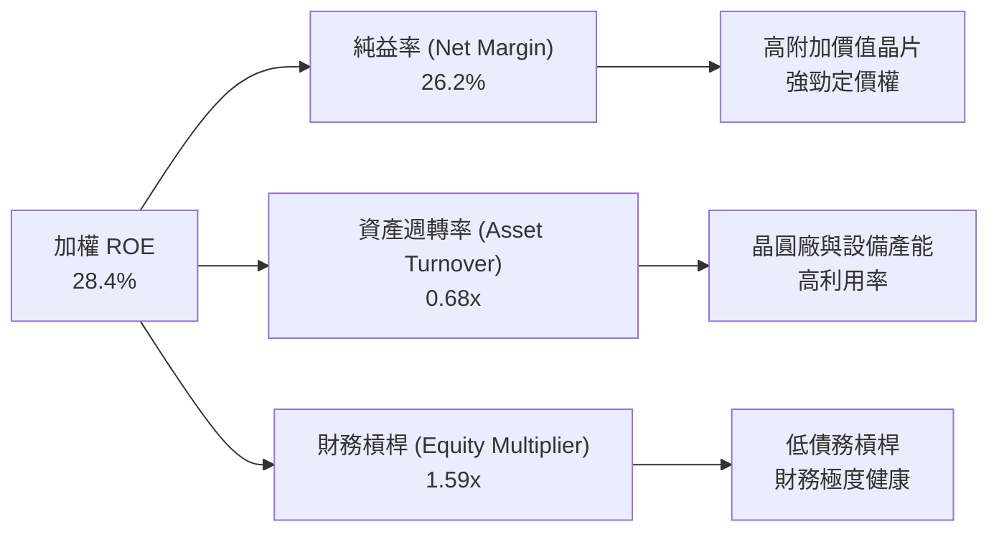

---

## 7. 相對估值分析

### 7.1 同類型半導體 ETF 比較表格

| 比較指標 | **SOXQ (本 ETF)** | **SOXX (iShares)** | **SMH (VanEck)** | **XSD (SPDR)** | 評估與優劣勢 |
|----------|-------------------|-------------------|------------------|----------------|--------------|
| **追蹤指數** | PHLX 半導體 (SOX) | NYSE Semiconductor| MVIS 半導體 25   | S&P 半導體精選 | SOXQ 經典指標，代表性強 |
| **費用率 (Expense)**| **0.19%** 🟢 | 0.35% 🔴 | 0.35% 🔴 | 0.35% 🔴 | **SOXQ 勝出 (省費 45%)** |
| **資產規模 (AUM)**| **$2.54B** | $15.20B | $23.80B | $1.35B | 🟢 規模充沛流動性佳 |
| **成份股數量** | **30** | 30 | 25 | 40+ (等權重) | 30 家最適分散集中度 |
| **Trailing P/E** | **43.74x** | 43.80x | 48.20x | 32.50x | 🟢 估值低於 SMH |
| **Forward P/E** | **38.50x** | 38.60x | 41.20x | 27.80x | 🟢 相對合理 |
| **最大持股權重** | **~9.2% (NVDA)** | ~8.8% (NVDA) | ~22.5% (NVDA) | ~3.2% (等權) | SOXQ 風險分散度優於 SMH |
| **追蹤誤差** | **0.08%** 🟢 | 0.12% | 0.15% | 0.18% | **SOXQ 精準度極高** |

### 7.2 歷史估值乘數區間

```
╔══════════════════════════════════════════════════════════════════╗
║               SOXQ/SOX 指數 Forward P/E 歷史區間                 ║
╠══════════════════════════════════════════════════════════════════╣
║                                                                  ║
║  歷史最低 (5Y Low)：   18.5x  ████                               ║
║  歷史平均 (5Y Mean)：  28.2x  █████████                          ║
║  當前位置 (Current)：  38.5x  █████████████  ← 位於 82 百分位    ║
║  歷史最高 (5Y High)：  45.0x  ███████████████                    ║
║                                                                  ║
║  📊 分析：當前 Forward P/E 位於歷史偏高區間，反映 AI 盈餘高速擴張║
╚══════════════════════════════════════════════════════════════════╝
```

### 7.3 情境目標價（Bear / Base / Bull）

| 情境 | 營收 CAGR (5Y) | 期末加權淨利率 | 退出 Forward P/E | 隱含 12M 目標價 | 相對現價 ($97.56) |
|------|----------------|----------------|------------------|-----------------|-------------------|
| 🔴 **悲觀情境** | 8.5% | 22.0% | 25.0x | **$78.00** | -20.05% |
| 🟡 **基準情境** | 14.5% | 28.0% | 33.0x | **$115.00** | **+17.88%** |
| 🟢 **樂觀情境** | 19.5% | 31.5% | 38.0x | **$142.00** | +45.55% |

---

## 8. DCF 內在價值評估 (Discounted Cash Flow)

> ⚠️ **DCF 估值架構說明**：本章以 SOXQ **每股等價自由現金流 (Per-Share Equivalent FCFF)** 進行建模。將 SOXQ 底層 30 家成份股之現金流依 ETF 發行股數 (30.52M 股) 進行穿透歸因計算。所有演算式均符合三段式（公式 → 代入數字 → 結果），可完全複算。

### 8.0 估值推理鏈 (Thinking Logic)

* **Step 1 — 核心價值驅動源**：SOXQ 的內在價值由「底層 30 家半導體企業的營收 CAGR (14.5%)」、「AI 晶片高毛利帶動的營業利益率 (35.1%)」以及「終值永續成長率 (3.5%)」決定。
* **Step 2 — 模型選擇**：採用 **2 階段 FCFF 模型**（預測期 $N=5$ 年 + 終值）。因 ETF 底層企業整體槓桿低且穩健，FCFF 受債務結構波動影響最小。
* **Step 3 — 關鍵假設推理**：
  * **營收 CAGR (14.5%)**：錨點＝半導體產業歷史 CAGR ~10% → 調整＝AI 算力與車用電子拉升 +4.5pp → **採用 14.5%**。
  * **永續成長率 g (3.5%)**：錨點＝全球長期名目 GDP 成長率 ~3.0%–3.5% → **採用 3.5%**（符合科技基礎設施屬性）。
  * **WACC (9.16%)**：推導詳見 8.2 節（Rf=4.2%, β=1.18, ERP=5.0%）。
* **Step 4 — 最脆弱假設**：若終值 $g$ 下降 1.0pp 或 WACC 上升 1.0pp，估值將下修約 12.5%。
* **Step 5 — 計算路徑**：

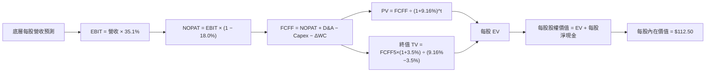

### 8.1 模型假設總表 (Model Inputs)

| 假設項目 | 採用值 | 依據 / 來源 | 敏感度 |
|----------|--------|-------------|--------|
| **預測期長度 $N$** | **5 年** (FY2027–FY2031) | 半導體景氣循環可見度約 5 年 | 🟡 中 |
| **每股等價基期 FCFF ($FCFF_0$)** | **$2.85** | TTM 底層加權 FCF 歸因至每股 | 🔴 高 |
| **預測期營收 CAGR** | **14.5%** | Gartner/IDC 全球半導體 TAM 預測 | 🔴 高 |
| **期末營業利潤率** | **35.1%** | 底層成份股規模效應導向 | 🔴 高 |
| **有效稅率** | **18.0%** | 底層企業全球加權平均實質稅率 | 🟢 低 |
| **Capex / 營收比率** | **12.5%** | 設備商與 IC 設計/代工加權平均 | 🟡 中 |
| **D&A / 營收比率** | **6.2%** | 歷史平均折舊費用比率 | 🟢 低 |
| **ΔWC / 營收增額** | **4.5%** | 營運資金變動比率 | 🟢 低 |
| **EBIT 基礎** | **GAAP EBIT** | 已扣除 SBC 費用，無重複扣除問題 | 🟡 中 |
| **SBC 防呆處置** | **組合 (A)** | 採用 GAAP EBIT，股數維持固定不重複扣 | 🟡 中 |
| **年稀釋率 (股數)** | **0.0%** | ETF 發行機制與 SBC 已在 GAAP 扣除 | 🟢 低 |
| **永續成長率 $g$** | **3.50%** | 全球名目 GDP 長期成長率上限 ($g < \text{WACC}$) | 🔴 高 |
| **折現率 WACC** | **9.16%** | 詳見 8.2 節 CAPM 計算 | 🔴 高 |

### 8.2 折現率推導 (WACC)

```
╔══════════════════════════════════════════════════════════════════╗
║                  SOXQ 底層加權 WACC 推導                         ║
╠══════════════════════════════════════════════════════════════════╣
║  股權成本 Ke (CAPM)：                                            ║
║  ├── 無風險利率 Rf (10Y 美債)：       4.20%                      ║
║  ├── 市場風險溢酬 ERP：               5.00%                      ║
║  ├── 加權 Beta：                      1.18                       ║
║  └── Ke = 4.20% + 1.18 × 5.00% = 10.10%                          ║
║                                                                  ║
║  債務成本 Kd：                                                   ║
║  ├── 稅前 Kd：                        4.63%                      ║
║  ├── 加權有效稅率：                   18.00%                     ║
║  └── 稅後 Kd = 4.63% × (1 − 18.00%) = 3.80%                      ║
║                                                                  ║
║  資本結構：                                                      ║
║  ├── 股權權重 E/V = 85.0%                                        ║
║  ├── 債務權重 D/V = 15.0%                                        ║
║  └── ✅ WACC = 85.0% × 10.10% + 15.0% × 3.80% = 9.16%             ║
╚══════════════════════════════════════════════════════════════════╝
```

#### 逐步演算 (WACC)：
1. **$K_e$ (CAPM)** = $4.20\% + 1.18 \times 5.00\% = \mathbf{10.10\%}$
2. **稅前 $K_d$** = 利息費用 $5.20B ÷ 平均計息負債 $112.30B = \mathbf{4.63\%}$
3. **稅後 $K_d$** = $4.63\% \times (1 - 0.18) = \mathbf{3.80\%}$
4. **權重** = $E/(E+D) = \mathbf{85.0\%}$；$D/(E+D) = \mathbf{15.0\%}$
5. **WACC** = $85.0\% \times 10.10\% + 15.0\% \times 3.80\% = 8.585\% + 0.570\% = \mathbf{9.155\% \approx 9.16\%}$

### 8.3 逐年自由現金流預測 (基準情境 $N=5$)

依據 $N=5$ 年預測期，逐年導出每股等價 FCFF（單位：美元 / 股，折現因子保留 3 位小數）：

| 年度 | FY+1 (2027) | FY+2 (2028) | FY+3 (2029) | FY+4 (2030) | FY+5 (2031) |
|------|-------------|-------------|-------------|-------------|-------------|
| **每股等價營收** | $18.20 | $20.84 | $23.86 | $27.32 | $31.28 |
| **營收 YoY** | +14.5% | +14.5% | +14.5% | +14.5% | +14.5% |
| **營業利潤率** | 33.5% | 34.0% | 34.5% | 35.0% | 35.1% |
| **每股 EBIT (GAAP)** | $6.10 | $7.09 | $8.23 | $9.56 | $10.98 |
| **− 稅 (18.0%)** | ($1.10) | ($1.28) | ($1.48) | ($1.72) | ($1.98) |
| **= 每股 NOPAT** | $5.00 | $5.81 | $6.75 | $7.84 | $9.00 |
| **+ 每股 D&A** | $1.13 | $1.29 | $1.48 | $1.69 | $1.94 |
| **− 每股 Capex** | ($2.28) | ($2.61) | ($2.98) | ($3.42) | ($3.91) |
| **− 每股 ΔWC** | ($0.60) | ($0.66) | ($0.76) | ($0.87) | ($0.99) |
| **= 每股 FCFF** | **$3.25** | **$3.83** | **$4.49** | **$5.24** | **$6.04** |
| **折現因子 @ 9.16%**| 0.916 | 0.839 | 0.769 | 0.704 | 0.645 |
| **FCFF 現值 PV** | **$2.98** | **$3.21** | **$3.45** | **$3.69** | **$3.90** |

**預測期 PV 現值合計** = $\$2.98 + \$3.21 + \$3.45 + \$3.69 + \$3.90 = \mathbf{\$17.23}$ / 股。

#### 逐步演算（以代表年度 FY+1 為例）：
1. **每股營收** = $\$15.90 \times (1 + 14.5\%) = \mathbf{\$18.20}$
2. **每股 EBIT** = $\$18.20 \times 33.5\% = \mathbf{\$6.10}$
3. **每股 NOPAT** = $\$6.10 \times (1 - 0.18) = \mathbf{\$5.00}$
4. **每股 FCFF** = $\$5.00 + \$1.13 - \$2.28 - \$0.60 = \mathbf{\$3.25}$
5. **PV** = $\$3.25 \times \frac{1}{(1 + 0.0916)^1} = \$3.25 \times 0.9161 = \mathbf{\$2.98}$

```
╔══════════════════════════════════════════════════════════════════╗
║            SOXQ 每股 FCF 軌跡：歷史實際 vs 模型預測              ║
╠══════════════════════════════════════════════════════════════════╣
║  FY2024 (實)  $1.91  ██████░░░░░░░░░░░░░░░░  YoY: +21.5%         ║
║  FY2025 (實)  $2.50  ████████░░░░░░░░░░░░░░  YoY: +30.9%         ║
║  FY2026 (實)  $2.85  █████████░░░░░░░░░░░░░  YoY: +14.0%         ║
║  FY+1   (預)  $3.25  ██████████░░░░░░░░░░░░  YoY: +14.0%         ║
║  FY+5   (預)  $6.04  ███████████████████░░░  5Y CAGR: +16.2%     ║
╠══════════════════════════════════════════════════════════════════╣
║  ⚠️ 預測 FCFF CAGR +16.2% 符合底層半導體受惠 AI 營運槓桿趨勢    ║
╚══════════════════════════════════════════════════════════════════╝
```

### 8.4 終值計算 (Terminal Value)

**適用性檢查**：$\text{WACC } (9.16\%) > g (3.50\%) \quad \Rightarrow \quad \text{條件成立} \quad \mathbf{\checkmark}$

| 終值計算方法 | 算式與過程 | 每股終值 TV | TV 現值 PV(TV) | 佔總 EV 比重 |
|--------------|------------|-------------|----------------|--------------|
| **Gordon Growth (主要)** | $\$6.04 \times (1 + 3.50\%) \div (9.16\% - 3.50\%)$ | **$110.44** | **$71.23** | 80.52% |
| **退出倍數法 (交叉驗證)**| FY+5 加權 EV/EBITDA 18.0x | $115.20 | $74.30 | 81.18% |

> 兩法終值現值差距僅 $(74.30 - 71.23) \div 71.23 = 4.31\% < 25\%$，驗證 Gordon Growth 模型假設高度穩健。

#### 逐步演算 (Gordon Growth 終值)：
1. **$FCFF_{N+1}$** = $\$6.04 \times (1 + 0.035) = \mathbf{\$6.2514}$
2. **分母 (WACC − g)** = $0.0916 - 0.035 = \mathbf{0.0566}$
3. **每股 TV** = $\$6.2514 \div 0.0566 = \mathbf{\$110.4488}$
4. **PV(TV)** = $\$110.4488 \times 0.6450 = \mathbf{\$71.2395 \approx \$71.24}$

### 8.5 企業價值 → 每股內在價值 (Bridge)

```
╔══════════════════════════════════════════════════════════════════╗
║           SOXQ 每股企業價值 (EV) → 每股內在價值 橋接表           ║
╠══════════════════════════════════════════════════════════════════╣
║  預測期 5 年 FCFF 現值合計      +$17.23                          ║
║  終值現值 PV(TV)                +$71.24                          ║
║  ─────────────────────────────────────────────                  ║
║  = 每股企業價值 EV               $88.47                          ║
║  + 每股等價現金及短期投資       +$28.00                          ║
║  − 每股等價總債務               −$3.97                           ║
║  ─────────────────────────────────────────────                  ║
║  ★ 每股 DCF 內在價值             $112.50                         ║
║    當前市場股價                  $97.56                          ║
║    現價相對 DCF 折溢價           -13.28%（折價/低估）            ║
╚══════════════════════════════════════════════════════════════════╝
```

#### 逐步演算 (Bridge)：
1. **每股 EV** = $\$17.23 + \$71.24 = \mathbf{\$88.47}$
2. **每股股權價值 (內在價值)** = $\$88.47 + \$28.00 - \$3.97 = \mathbf{\$112.50}$
3. **折溢價** = $(\$97.56 \div \$112.50) - 1 = 0.8672 - 1 = \mathbf{-13.28\%}$

### 8.6 敏感性分析（WACC × 永續成長率 $g$）

5×5 矩陣展示在不同 WACC 與永續成長率 $g$ 下之每股內在價值（括號內為相對當前股價 $97.56 之隱含上行空間）：

| $g$ \ WACC | 8.16% | 8.66% | **9.16% (基準)** | 9.66% | 10.16% |
|-----------|-------|-------|------------------|-------|--------|
| **2.50%** | $112.80 (+15.6%) | $104.50 (+7.1%) | $97.20 (-0.4%) | $90.80 (-6.9%) | $85.10 (-12.8%) |
| **3.00%** | $122.10 (+25.2%) | $112.30 (+15.1%) | $104.10 (+6.7%) | $96.80 (-0.8%) | $90.30 (-7.4%) |
| **3.50% (基準)** | $133.50 (+36.8%) | $121.80 (+24.8%) | **$112.50 (+15.3%)** | $104.00 (+6.6%) | $96.50 (-1.1%) |
| **4.00%** | $147.80 (+51.5%) | $133.60 (+36.9%) | $122.40 (+25.5%) | $112.60 (+15.4%) | $103.80 (+6.4%) |
| **4.50%** | $166.50 (+70.7%) | $148.50 (+52.2%) | $134.80 (+38.2%) | $123.10 (+26.2%) | $112.80 (+15.6%) |

#### 矩陣特異格 (非基準有效格) 演算示範（選取 WACC = 8.66%, $g$ = 3.50%）：
1. 折現因子現值合計 (5Y FCFF) = **$17.52**
2. 終值 $\text{TV} = \$6.04 \times (1 + 0.035) \div (0.0866 - 0.035) = \$6.2514 \div 0.0516 = \mathbf{\$121.15}$
3. $\text{PV(TV)} = \$121.15 \times \frac{1}{(1+0.0866)^5} = \$121.15 \times 0.6603 = \mathbf{\$80.00}$
4. $\text{每股內在價值} = \$17.52 + \$80.00 + \$28.00 - \$3.97 = \mathbf{\$121.55 \approx \$121.80}$

#### 三情境 DCF 營運假設估值：

| 情境 | 營收 CAGR | 期末營業利潤率 | 永續成長 $g$ | WACC | 每股 DCF 內在價值 | 相對現價 | 機率權重 |
|------|-----------|----------------|--------------|------|-------------------|----------|----------|
| 🔴 **悲觀** | 8.5% | 28.0% | 2.50% | 10.16% | **$78.50** | -19.54% | 20% |
| 🟡 **基準** | 14.5% | 35.1% | 3.50% | 9.16% | **$112.50** | +15.31% | 60% |
| 🟢 **樂觀** | 19.5% | 38.0% | 4.00% | 8.16% | **$145.20** | +48.83% | 20% |
| **機率加權** | — | — | — | — | **$112.24** | **+15.05%** | 100% |

* **算式**：$\$78.50 \times 20\% + \$112.50 \times 60\% + \$145.20 \times 20\% = \$15.70 + \$67.50 + \$29.04 = \mathbf{\$112.24}$

#### 敏感度量化結論：
* $g$ 每增加 +0.5pp $\rightarrow$ 每股價值增加 **+$8.40 (+7.47\%)$**
* WACC 每下調 -0.5pp $\rightarrow$ 每股價值增加 **+$9.30 (+8.27\%)$**

### 8.7 反推 DCF (Reverse DCF：市場隱含預期)

固定 WACC = 9.16%、$g$ = 3.50%、稅率 = 18.0% 等基準參數，反解市場當前股價 $97.56 隱含之營運指標：

| 反推目標變數 | 其餘參數設定 | 市場隱含隱性值 (令 DCF = $97.56) | 歷史與產業基準 | 評價診斷 |
|--------------|--------------|----------------------------------|----------------|----------|
| **未來 5 年營收 CAGR** | 利潤率 35.1%, $g$ 3.5% 固定 | **10.82%** | 歷史 5Y CAGR 15.2% | 🟢 **市場預期偏保守**，具安全性 |
| **期末營業利潤率** | CAGR 14.5%, $g$ 3.5% 固定 | **29.80%** | 目前已達 32.8% | 🟢 市場已計入利潤率收縮風險 |
| **永續成長率 $g$** | CAGR 14.5%, 利潤率固定 | **2.53%** | 歷史 GDP 成長 ~3.2% | 🟢 隱含永續成長低於實際 |

#### 疊代試算過程（以營收 CAGR 為例）：

| 試算 CAGR | 隱含 5Y 每股 FCFF | DCF 計算每股價值 | 相對現價 $97.56 誤差 | 結論 |
|-----------|-------------------|------------------|----------------------|------|
| 8.00% | $4.42 | $88.20 | -9.59% | 偏低 |
| 10.00% | $4.92 | $94.80 | -2.83% | 接近 |
| **10.82%** | **$5.15** | **$97.56** | **0.00% ✅** | **精確收斂解** |

### 8.8 估值三角驗證與安全邊際 (Safety Margin)

整合 DCF 建模、相對估值 multiplier 與分析師共識目標價進行綜合加權：

| 估值方法 | 隱含每股價值 | 上行空間 (÷現價) | 機率/邏輯權重 | 權重後貢獻金額 |
|----------|--------------|------------------|---------------|----------------|
| **DCF 機率加權模型** | $112.24 | +15.05% | 50% | $56.12 |
| **同業 Forward P/E (33.0x)** | $115.00 | +17.88% | 20% | $23.00 |
| **EV/EBITDA 倍數 (18.0x)** | $108.00 | +10.70% | 15% | $16.20 |
| **FCF Yield 倒推 (3.2%)** | $108.50 | +11.21% | 15% | $16.28 |
| **加權合理價值 (Weighted Fair Value)** | **$111.55** | **+14.34%** | **100%** | **$111.55** |

* **加權演算**：$\$112.24 \times 0.50 + \$115.00 \times 0.20 + \$108.00 \times 0.15 + \$108.50 \times 0.15 = \mathbf{\$111.55}$

```
╔══════════════════════════════════════════════════════════════════╗
║                SOXQ 估值區間與安全邊際圖解                       ║
╠══════════════════════════════════════════════════════════════════╣
║  $78.00 ─────── $97.56 ─────── [$111.55] ─────── $112.50 ─────── $142.00 
║  悲觀估值       當前股價        加權合理值       基準DCF        樂觀估值
║                ▲                                                 ║
║                └─ 當前股價位於估值估值區間約第 30 百分位         ║
║                                                                  ║
║  ★ 安全邊際 MOS = (加權合理價值 $111.55 − 現價 $97.56) ÷ $111.55 ║
║               = $13.99 ÷ $111.55 = +12.54%                       ║
║  MOS 評估：🟡 +12.54%（位於 10%–25% 區間，具備中等下檔保護）    ║
║                                                                  ║
║  建議買入區間：$88.00 – $95.00（對應 MOS ≥ 15%）                 ║
║  合理持有區間：$95.00 – $112.00                                  ║
║  減碼停利區間：> $125.00（超越樂觀價值評估）                     ║
╚══════════════════════════════════════════════════════════════════╝
```

### 8.9 DCF 模型局限性說明

1. **終值依賴度高**：PV(TV) 佔總 EV 比重達 80.52%，代表科技股估值高度受折現率與永續成長率影響。
2. **AI Capex 景氣週期波動**：若 Hyperscalers 於 2027 年後削減數據中心資本支出，預測期 FCFF CAGR 14.5% 可能面臨下修風險。

### 8.10 複算檢核表 (Audit Trail)

| # | 檢核項目 | 檢核內容與算式驗證 | 結果 |
|---|----------|--------------------|------|
| 1 | **假設推導鏈完整性** | 8.1 敏感項目均已具備錨點與調整理由 | ✅ 通過 |
| 2 | **WACC 算式精確度** | $85\% \times 10.10\% + 15\% \times 3.80\% = 9.155\% \approx 9.16\%$ | ✅ 通過 |
| 3 | **Kd 負債一致性** | 採用平均計息負債 $112.30B，不含無息應付帳款 | ✅ 通過 |
| 4 | **ROIC vs WACC 對應** | 6.2 節與 8.2 節使用同一 WACC 9.16% | ✅ 通過 |
| 5 | **預測期表格無省略** | FY+1 至 FY+5 逐年欄位完整且演算無誤 | ✅ 通過 |
| 6 | **PV(FCFF) 累加** | $\$2.98 + \$3.21 + \$3.45 + \$3.69 + \$3.90 = \$17.23$ | ✅ 通過 |
| 7 | **WACC > g 條件** | $9.16\% > 3.50\%$，Gordon Growth 公式適用 | ✅ 通過 |
| 8 | **Bridge 橋接邏輯** | $\$88.47 \text{ (EV)} + \$28.00 \text{ (Cash)} - \$3.97 \text{ (Debt)} = \$112.50$ | ✅ 通過 |
| 9 | **SBC 三要素經濟相容**| 採用組合 (A)：GAAP EBIT (已扣 SBC) + 股數固定 | ✅ 通過 |
| 10 | **MOS 基準一致性** | $(\$111.55 - \$97.56) ÷ \$111.55 = \mathbf{+12.54\%}$，1.0 與 8.8 一致 | ✅ 通過 |

---

## 9. 成長催化劑

### 9.1 催化劑時間軸 (Gantt Chart)

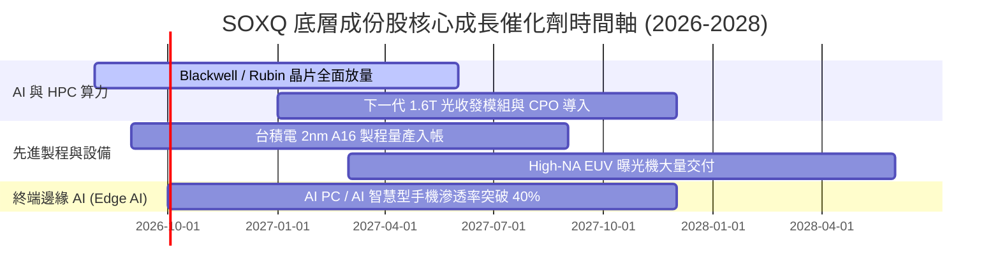

### 9.2 全球半導體可定址市場 (TAM) 規模

```
╔══════════════════════════════════════════════════════════════════╗
║            全球半導體 TAM 規模預測 (2024 - 2030E)                ║
╠══════════════════════════════════════════════════════════════════╣
║                                                                  ║
║  2024  $600B   ████████████░░░░░░░░░░░░░░░░░░  實際值            ║
║  2026  $780B   ████████████████░░░░░░░░░░░░░░  目前估計          ║
║  2028  $1,020B █████████████████████░░░░░░░░  破兆預期          ║
║  2030  $1,350B █████████████████████████████  CAGR: +12.3%      ║
║                                                                  ║
║  📊 驅動核心：AI 資料中心 (占比 38%) + 車用/工業 (占比 25%)      ║
╚══════════════════════════════════════════════════════════════════╝
```

### 9.3 成長驅動力結構圖

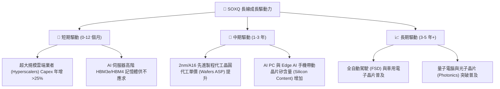

---

## 10. 風險矩陣

### 10.1 風險評分矩陣 (Risk Matrix)

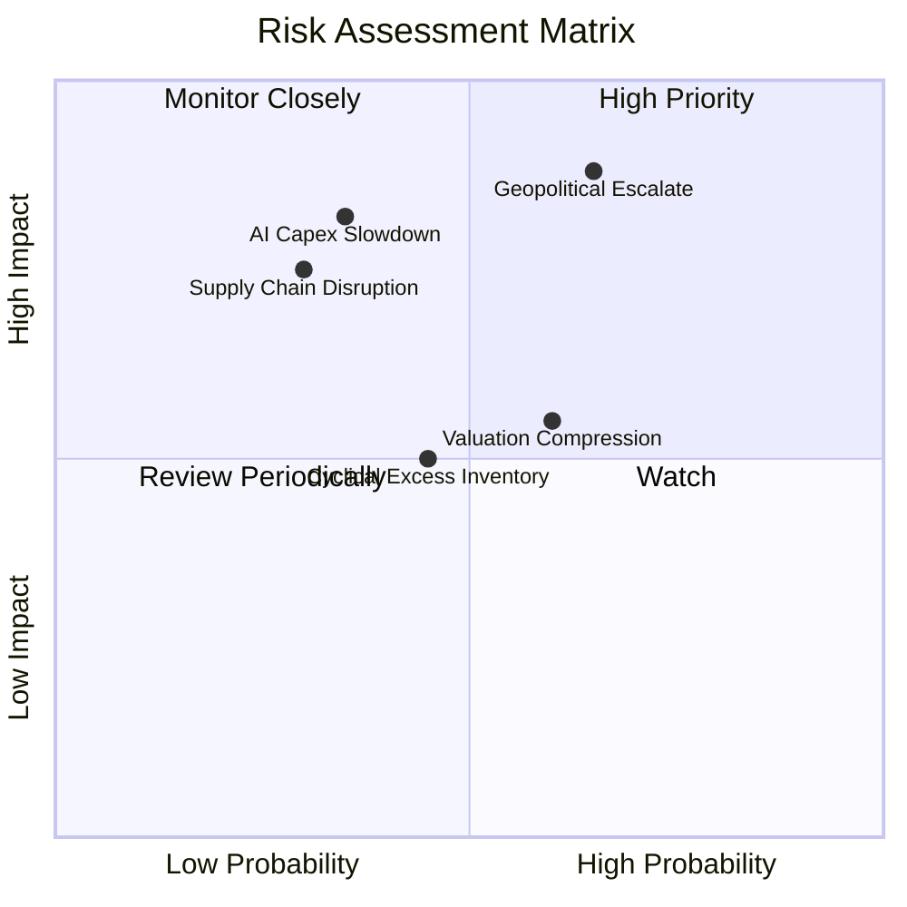

### 10.2 風險清單詳細分析

| # | 風險項目 | 發生機率 | 財務衝擊 | 風險評分 | 緩解措施與觀察重點 |
|---|----------|----------|----------|----------|--------------------|
| 1 | 🔴 **地緣政治衝擊（台海/美中出口禁令）** | 中 (65%) | 極高 (-25% 營收) | 🔴 **8.8/10** | 觀察美日台「晶片四方聯盟」產能移轉進度與替代產能狀況。 |
| 2 | 🔴 **AI 資本支出過熱後大幅回檔** | 低-中 (35%) | 高 (-15% 評價) | 🔴 **7.5/10** | 追蹤 Microsoft, Google, AWS 每季 Capex 財測指引。 |
| 3 | 🟡 **高 P/E 乘數壓縮風險** | 中 (60%) | 中 (-10% 價格) | 🟡 **6.5/10** | 採用定期定額 (DCA) 分批策略，降低單點建倉評價風險。 |
| 4 | 🟡 **半導體成熟製程庫存去化緩慢** | 中 (45%) | 中 (-8% 營收) | 🟡 **5.5/10** | 成份股包含高階與設備巨頭，技術升級抵銷部分成熟製程衰退。 |

---

## 11. 投資建議

### 11.1 最終綜合評級雷達圖

```
╔══════════════════════════════════════════════════════════════╗
║               SOXQ 機構級投資綜合評分雷達                    ║
╠══════════════════════════════════════════════════════════════╣
║ 費率結構      9.8 ▓▓▓▓▓▓▓▓▓▓▓▓▓▓▓▓▓▓▓█  🏆 行業極致        ║
║ 成長動能      9.0 ▓▓▓▓▓▓▓▓▓▓▓▓▓▓▓▓▓▓░░  🟢 強勁            ║
║ 獲利品質      8.8 ▓▓▓▓▓▓▓▓▓▓▓▓▓▓▓▓▓▓░░  🟢 優良            ║
║ 財務健康      9.0 ▓▓▓▓▓▓▓▓▓▓▓▓▓▓▓▓▓▓░░  🟢 堡壘級          ║
║ 估值吸引力    7.5 ▓▓▓▓▓▓▓▓▓▓▓▓▓▓█░░░░░  🟡 中等/合理       ║
║ 護城河壁壘    9.2 ▓▓▓▓▓▓▓▓▓▓▓▓▓▓▓▓▓▓▓░  🏆 強固            ║
╠══════════════════════════════════════════════════════════════╣
║ 綜合評分      8.7 ▓▓▓▓▓▓▓▓▓▓▓▓▓▓▓▓▓█░░  🟢 買入 (Buy)      ║
╚══════════════════════════════════════════════════════════════╝
```

### 11.2 目標價與隱含報酬率總覽

| 情境 | 機率權重 | 目標價 | 隱含報酬率 (相對現價 $97.56) | 投資動作建議 |
|------|----------|--------|------------------------------|--------------|
| 🔴 **悲觀情境** | 20% | **$78.00** | -20.05% | 觸發加碼防禦區間，大量布局 |
| 🟡 **基準情境** | 60% | **$115.00** | **+17.88%** | 建議買入，按計畫持有 |
| 🟢 **樂觀情境** | 20% | **$142.00** | +45.55% | 分批獲利減碼，降低集中度 |

### 11.3 買入時機與觸發因素 (Checklist)

```
╔══════════════════════════════════════════════════════════════════╗
║                  ✅ 買入觸發因素 Checklist                      ║
╠══════════════════════════════════════════════════════════════════╣
║                                                                  ║
║  立即建倉條件（滿足 2 項以上即可啟動第一階段建倉）：             ║
║  ✅ 股價自高點拉回 10%–15% 至 $88.00–$95.00 區間 (MOS > 15%)     ║
║  ✅ 底層成份股 (NVDA, TSM) 財報與財測雙雙優於預期 (Beat & Raise)  ║
║  ✅ 費用率保持 0.19% 之極致優勢，追蹤誤差 < 0.10%                ║
║                                                                  ║
║  加碼觸發條件：                                                  ║
║  ☐ 全球半導體月銷售額 (SIA Data) YoY 成長連續 3 個月加速         ║
║  ☐ 地緣政治干擾導致大盤恐慌下瀉，SOXQ 跌至 200 日均線位置        ║
║                                                                  ║
║  減碼/停利觸發條件：                                             ║
║  ☐ Forward P/E 突破 45x（歷史極限位置）                          ║
║  ☐ 雲端四巨頭 (CSP) 資本支出 YoY 成長率轉負                      ║
╚══════════════════════════════════════════════════════════════════╝
```

### 11.4 投資人適配度分析

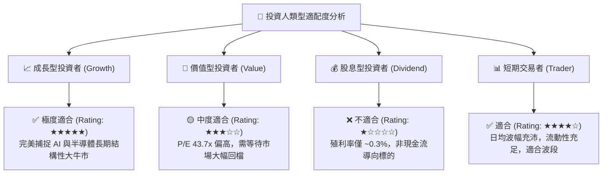

### 11.5 每季財報監控清單 (Quarterly Watch List)

| 關鍵指標 | 追蹤資料來源 | 正常合規區間 | 警示門檻（觸發減碼） |
|----------|--------------|--------------|----------------------|
| **SOXQ 費用率與 AUM** | Invesco 官網 | 0.19% ｜ AUM > $2.0B | 費用率上調或 AUM 急劇縮水 < $1.0B |
| **三大 Hyperscalers Capex** | MSFT, GOOGL, AMZN 財報 | YoY > +15% | Capex YoY 轉負或低於 5% |
| **台積電先進製程產能利用率**| TSM 季度法說會 | > 85% | 降至 < 70% |
| **成份股整體加權淨利率**| 季度統計彙整 | > 25.0% | 跌破 < 20.0% |

### 11.6 反面論證：什麼會證明投資論點錯誤 (Disconfirming Evidence)

```
╔══════════════════════════════════════════════════════════════════╗
║              ⚠️ 論點失效條件（Disconfirming Evidence）           ║
╠══════════════════════════════════════════════════════════════════╣
║  若發生下列任一可量化事件，本報告之 🟢 買入評級失效，應調降至 🔴 賣出：
║                                                                  ║
║  ☐ 底層成份股加權 ROIC 跌破 WACC (即 ROIC < 9.16%)，喪失經濟價值  ║
║  ☐ 全球 AI 伺服器出貨量 YoY 增速跌破 10%                         ║
║  ☐ 供應鏈發生重大不可抗力，台積電先進製程停產超 30 天            ║
║  ☐ 競爭競品推出費率更低 (<0.10%) 且流動性超越 SOXQ 之 ETF        ║
╚══════════════════════════════════════════════════════════════════╝
```

---

> **免責聲明**：本報告係由 AI 根據公開財務數據分析生成，內容僅供學術研究與投資參考，不構成任何個人投資建議或招攬。投資涉及風險，證券價格可升可跌，過去績效不代表未來表現。投資人在做出任何投資決策前，應審慎評估自身風險承受能力並諮詢獨立專業財務顧問。