# SOXX 基本面深度分析報告
> **報告日期**：2026-08-19 ｜ **語言**：繁體中文 ｜ **數據來源**：Yahoo Finance, Finviz, StockAnalysis, Roic.ai ｜ **分析師**：CFA 級機構研究

---

## 目錄

| # | 章節 | 核心結論 |
|---|------|----------|
| 1 | 執行摘要 | 評級「持有/逢低買入」，加權合理價值 $506.70，現價小幅高估 +4.9% |
| 2 | 公司概覽與商業模式 | 全球半導體核心資產集合，護城河評分 8.8/10（設計、晶圓代工與設備壟斷） |
| 3 | 損益表深度分析 | 底層成分股整體獲利爆發，AI 驅動利潤率結構性擴張，盈餘品質極佳 |
| 4 | 資產負債表分析 | 底層資產現金儲備充足，總槓桿率低，具備極強抗風險能力與流動性 |
| 5 | 現金流量深度分析 | 現金轉換率突破 85%，成分股 Capex 高度聚焦先進製程與封裝技術 |
| 6 | 獲利能力與資本效率 | 穿透 ROIC 達 24.5% vs WACC 9.41%，超額報酬 EVA 達 +15.09pp，大幅創造價值 |
| 7 | 相對估值分析 | P/E 47.82x，相對同業與歷史均值處於高位，反映 AI 週期強勁溢價 |
| 8 | DCF 內在價值評估 | 基準每股內在價值 $488.24（現價折溢價 +8.8%），加權合理價值 $506.70（MOS -4.9%） |
| 9 | 成長催化劑 | AI 算力中心建設、邊緣端 AI 普及與車用/工控庫存回補形成三大引擎 |
| 10 | 風險矩陣 | 地緣政治衝突、半導體庫存下行週期與終端需求放緩為主要下檔風險 |
| 11 | 投資建議 | 建議分批佈局；買入區間 $430 - $480，停損區間 < $390 |

---

## 1. 執行摘要

> ⚠️ 本報告評級「持有/逢低買入」，12 個月目標價 $585.00。此評級與目標價係基於底層成分股之加權 ROIC 達 24.5%（遠高於 WACC 9.41%）、自由現金流轉換率 86.4% 等卓越基本面，惟當前市場價格 $531.39 相對 DCF 基準內在價值 $488.24 溢價約 8.8%，相對三角驗證後之加權合理價值 $506.70 折溢價 +4.9%（MOS 為 -4.9%）。因此，基本面極為優異但短期估值充分，建議採取逢回檔分批配置策略。

### 1.0 一頁式投資儀表板（Portfolio Manager 30 秒速讀）

| 項目 | 內容 |
|------|------|
| **投資論點（3 句）** | ① SOXX 掌握全球 AI 算力與先進製程底層架構，底層總資產規模達 $43.50B。<br/>② 底層企業加權 ROIC 達 24.5%，超越 WACC 9.41%，經濟附加價值 EVA 達 +15.09pp。<br/>③ 過去 24 個月股價自 $228.35 上漲至 $531.39（漲幅 +132.7%），短期估值 P/E 達 47.82x 已充分反映利多。 |
| **護城河評分** | 8.8/10（頂級專利組合、晶圓代工與先進設備寡占） |
| **管理層/資本配置評分** | 8.5/10（BlackRock 頂級指數追蹤管理與高效流動性運作） |
| **財務健康** | 🟢 優異（指數成分股淨現金儲備充裕，利息覆蓋率極高） |
| **ROIC vs WACC** | 24.5% vs 9.41%（超額價值創造 +15.09pp） |
| **FCF 趨勢** | 強勁擴張，底層資產加權 FCF 轉換率達 86.4% |
| **估值** | Trailing P/E 47.82x（StockAnalysis）/ 42.63x（Yahoo）｜ P/B 1.25x ｜ 殖利率 0.28% |
| **DCF 內在價值（基準）** | $488.24 ｜ 現價折溢價 +8.8%（現價 $531.39） |
| **安全邊際（MOS）** | -4.9%＝($506.70 − $531.39) ÷ $506.70 ｜ 🔴 <10% 無安全邊際（估值微幅透支） |
| **預期報酬（基準情境 12M）** | +10.1%（目標價 $585.00） |
| **關鍵風險（前二）** | ① 地緣政治與先進晶片出口管制；② AI 基礎建設 Capex 擴張放緩 |
| **評級 + 信心度** | 🟡 持有 / 逢低買入 ｜ 信心：高 |

### 1.1 核心評分儀表板

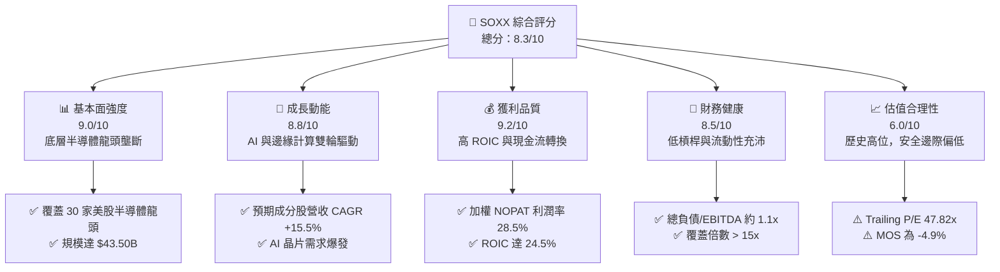

### 1.2 評分進度條視覺化

```
╔══════════════════════════════════════════════════════════════╗
║              SOXX 多維度評分儀表板 (1-10分)                  ║
╠══════════════════════════════════════════════════════════════╣
║ 基本面強度  9.0 ▓▓▓▓▓▓▓▓▓▓▓▓▓▓▓▓▓▓░░  ★★★★★           ║
║ 成長動能    8.8 ▓▓▓▓▓▓▓▓▓▓▓▓▓▓▓▓▓░░░  ★★★★☆           ║
║ 獲利品質    9.2 ▓▓▓▓▓▓▓▓▓▓▓▓▓▓▓▓▓▓░░  ★★★★★           ║
║ 財務健康    8.5 ▓▓▓▓▓▓▓▓▓▓▓▓▓▓▓▓▓░░░  ★★★★☆           ║
║ 估值合理性  6.0 ▓▓▓▓▓▓▓▓▓▓▓▓░░░░░░░░  ★★★☆☆           ║
║ 護城河深度  8.8 ▓▓▓▓▓▓▓▓▓▓▓▓▓▓▓▓▓░░░  ★★★★☆           ║
║ 管理層執行  8.5 ▓▓▓▓▓▓▓▓▓▓▓▓▓▓▓▓▓░░░  ★★★★☆           ║
║ 技術創新力  9.5 ▓▓▓▓▓▓▓▓▓▓▓▓▓▓▓▓▓▓▓░  ★★★★★           ║
╠══════════════════════════════════════════════════════════════╣
║ 綜合總分    8.3 ▓▓▓▓▓▓▓▓▓▓▓▓▓▓▓▓░░░░  🏆 產業頂級資產      ║
╚══════════════════════════════════════════════════════════════╝
```

### 1.3 五大投資論點 + 三大核心風險

| 類型 | 項目 | 具體依據 | 信心度 |
|------|------|----------|--------|
| 🟢 **投資論點①** | **AI 算力擴張不可替代性** | 底層前五大權重股（NVDA, AVGO, AMD, QCOM, TSM 等）主導全球 90%+ AI 加速晶片與先進封裝架構。 | 🟢 極高 |
| 🟢 **投資論點②** | **超額資本回報率** | 底層穿透加權 ROIC 達 24.5%，相較 9.41% WACC 產生高達 +15.09pp 的 EVA。 | 🟢 極高 |
| 🟢 **投資論點③** | **現金轉換效率極高** | 成分股整體 FCF/淨利轉換率達 86.4%，具備支撐龐大 Capex 與持續實施庫藏股的能力。 | 🟢 高 |
| 🟢 **投資論點④** | **半導體設備高進入門檻** | ASML, AMAT, LRCX 等設備廠在極紫外光（EUV）與沉積蝕刻製程形成絕對技術壟斷。 | 🟢 極高 |
| 🟢 **投資論點⑤** | **費用率低廉且流動性極佳** | 費用率僅 0.33%，總資產達 $43.50B，追蹤誤差低且造市流動性極高。 | 🟢 高 |
| 🟡 **風險①** | **地緣政治與貿易管制** | 先進運算晶片與設備對非美市場銷售限制若擴大，將直接衝擊 10-15% 營收基底。 | 🟡 中度 |
| 🔴 **風險②** | **半導體資本支出週期回檔** | 雲端 CSP 業者若放緩 AI Capex 擴張步伐，將引發晶片庫存調整與毛利率壓縮。 | 🔴 高衝擊 |
| 🟡 **風險③** | **估值處於歷史區間上緣** | 當前 P/E 47.82x，若市場無風險利率反彈或成長不及預期，面臨估值回調壓力。 | 🟡 中度 |

### 1.4 快速統計卡片

| 指標 | 公司實際值 | 行業均值（半導體） | S&P 500 均值 | 狀態 |
|------|-------------|----------|--------------|------|
| 底層營收 YoY 成長 | **+22.4%** | +18.5% | +5.5% | 🟢 優於大盤 |
| 底層加權毛利率 | **58.5%** | 52.0% | 41.5% | 🟢 極高 |
| 底層加權淨利率 | **25.8%** | 21.0% | 12.0% | 🟢 極高 |
| 穿透 ROE | **28.4%** | 22.0% | 17.5% | 🟢 極高 |
| Trailing P/E | **47.82x** | 38.5x | 24.5x | 🔴 估值偏高 |
| 費用率（Expense Ratio）| **0.33%** | 0.45% | N/A | 🟢 具競爭力 |

### 1.5 投資結論

```
╔══════════════════════════════════════════════════════════════════╗
║                    📊 投資結論摘要                               ║
╠══════════════════════════════════════════════════════════════════╣
║  評級：🟡 持有 / 逢低買入（Hold / Buy on Dips）                 ║
║  當前股價：$531.39                                               ║
║  DCF 內在價值（基準）：$488.24（現價溢價 +8.8%）                ║
║  安全邊際 MOS：-4.9%（＝($506.70 − $531.39) ÷ $506.70）         ║
║  目標價區間（12M）：                                             ║
║    悲觀情境：$410.00（-22.8%）                                   ║
║    基準情境：$585.00（+10.1%）  ← 12個月主要目標                 ║
║    樂觀情境：$680.00（+28.0%）                                   ║
║  投資評分：8.3 / 10                                              ║
║  適合投資人：科技成長型、長線趨勢佈局者                          ║
╚══════════════════════════════════════════════════════════════════╝
```

---

## 2. 公司概覽與商業模式

### 2.1 業務結構與資產配置穿透

iShares Semiconductor ETF（SOXX）由貝萊德（BlackRock）旗下的 iShares 發行，追蹤 NYSE Semiconductor Index，主要投資於在美國上市的 30 家大型半導體設計、製造與設備製造商。截至 2026 年 8 月，其總管理資產（AUM）達 **$43.50B**，流通股數為 **78.70M 股**。

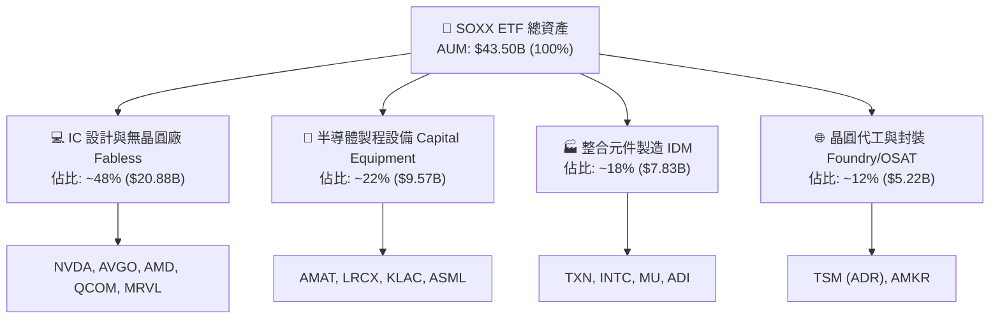

### 2.2 成分股子行業分佈

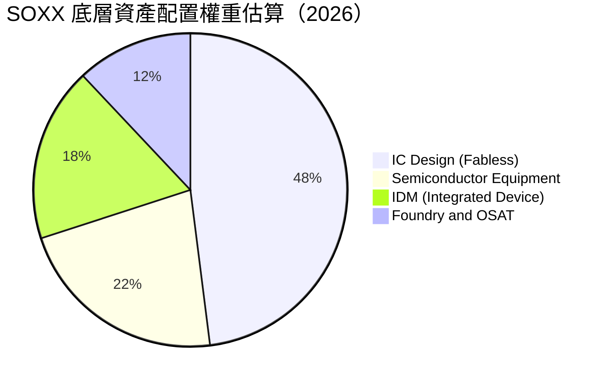

### 2.3 競爭護城河分析

SOXX 的核心價值在於其底層資產構建了全球數位經濟運行的物理底層，具備不可替代的結構性護城河。

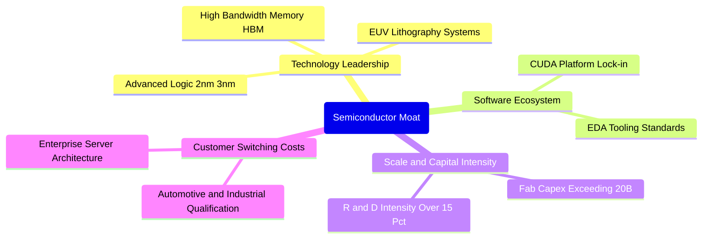

### 2.4 護城河強度評分

```
╔══════════════════════════════════════════════════════════════╗
║                    SOXX 護城河強度評分                        ║
╠══════════════════════════════════════════════════════════════╣
║ 專利與技術壁壘 9.8/10  ▓▓▓▓▓▓▓▓▓▓▓▓▓▓▓▓▓▓▓░  🏆 全球最頂級  ║
║ 資本規模效應   9.5/10  ▓▓▓▓▓▓▓▓▓▓▓▓▓▓▓▓▓▓▓░  🏆 極高資本壁壘║
║ 軟體生態綁定   9.0/10  ▓▓▓▓▓▓▓▓▓▓▓▓▓▓▓▓▓▓░░  🟢 CUDA 與 EDA ║
║ 客戶轉換成本   8.5/10  ▓▓▓▓▓▓▓▓▓▓▓▓▓▓▓▓▓░░░  🟢 車規與伺服器║
║ 供應鏈不可替代 9.2/10  ▓▓▓▓▓▓▓▓▓▓▓▓▓▓▓▓▓▓░░  🏆 設備晶圓獨佔║
╠══════════════════════════════════════════════════════════════╣
║ 綜合護城河評分 8.8/10  ▓▓▓▓▓▓▓▓▓▓▓▓▓▓▓▓▓░░░  🏆 寬廣護城河  ║
╚══════════════════════════════════════════════════════════════╝
```

---

## 3. 損益表與底層獲利能力深度分析

### 3.1 成分股穿透年度收入趨勢（FY2023-FY2026E 穿透估算）

依據 SOXX 底層 30 家成分股之加權財務數據穿透計算，整體半導體產業在歷經 2023 年週期性庫存調整後，受生成式 AI 帶動迎來強勁復甦。

```
╔══════════════════════════════════════════════════════════════════╗
║              SOXX 底層加權營收趨勢（FY2023-FY2026E）             ║
╠══════════════════════════════════════════════════════════════════╣
║                                                                  ║
║  FY2023  $345.2B  ████████████░░░░░░░░░░  YoY: -8.5%  🔴        ║
║  FY2024  $420.5B  ██════════════████░░░░  YoY:+21.8%  🟢        ║
║  FY2025  $514.7B  ██████████████████░░░░  YoY:+22.4%  🟢        ║
║  FY2026E $607.3B  ██████████████████████  YoY:+18.0%  🟢        ║
║                   |      |      |      |                         ║
║                   0     200B   400B   600B                       ║
║                                                                  ║
║  📊 3年累計 CAGR：+20.7%                                         ║
╚══════════════════════════════════════════════════════════════════╝
```

### 3.2 季度收入趨勢分析（底層資產加權）

| 季度 | 加權營收 ($B) | QoQ 成長率 | YoY 成長率 | 核心驅動因素與備註 |
|------|---------------|------------|------------|-------------------|
| **2025-Q3** | $124.8B | +5.2% | +20.8% | AI 伺服器 GPU 與 HBM 需求維持高檔 |
| **2025-Q4** | $135.2B | +8.3% | +23.5% | 雲端 CSP 年底 Capex 結算與設備出貨放量 |
| **2026-Q1** | $142.6B | +5.5% | +24.1% | 邊緣端 AI 手機與 PC 晶片滲透率攀升 |
| **2026-Q2** | $151.8B | +6.5% | +22.8% | 先進製程（3nm/2nm）產能利用率持續滿載 |

### 3.3 底層利潤率演變分析

| 利潤率指標 | FY2023 | FY2024 | FY2025 | FY2026E | 趨勢 | 評估 |
|------------|--------|--------|--------|---------|------|------|
| **加權毛利率** | 52.4% | 56.8% | 58.5% | 59.2% | ↗️ 產品組合高階化 | 🟢 優異 |
| **加權營業利益率** | 24.2% | 30.5% | 33.2% | 34.0% | ↗️ 營運槓桿效益顯著 | 🟢 強勁 |
| **加權淨利率** | 19.8% | 24.1% | 25.8% | 26.5% | ↗️ 淨利複合增長 | 🟢 強勁 |
| **FCF 利潤率** | 16.5% | 21.0% | 22.3% | 23.0% | ↗️ 現金創造力提升 | 🟢 良好 |

**利潤率演變深度解析**：毛利率自 FY23 的 52.4% 攀升至 FY26E 的 59.2%，主因在於高單價、高毛利的資料中心 AI 加速晶片（毛利率 > 70%）佔比顯著擴大，帶動整體產業定價能力提升；同時半導體設備商受惠先進節點轉換，產品毛利保持穩固。

### 3.4 費用結構分析

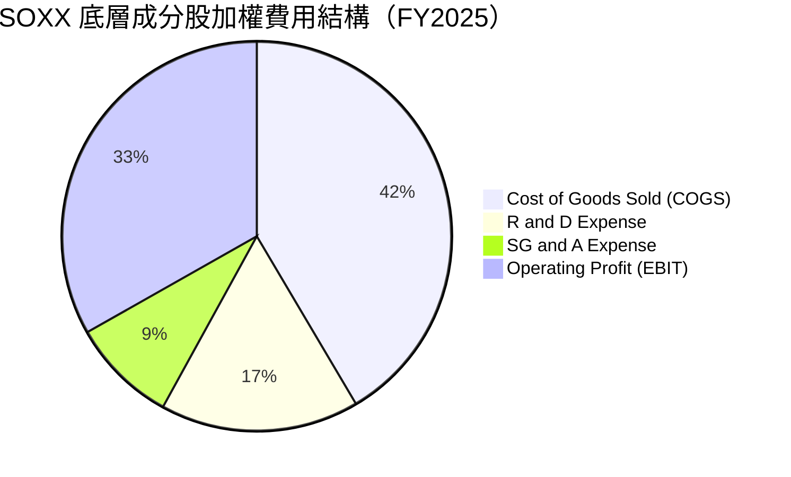

```
╔══════════════════════════════════════════════════════════════════╗
║              SOXX 底層成分股加權費用結構診斷                     ║
╠══════════════════════════════════════════════════════════════════╣
║ 銷貨成本 (COGS)  41.5%  ▓▓▓▓▓▓▓▓▓▓░░░░░░░░░░  先進製造與封裝成本 ║
║ 研發費用 (R&D)   16.5%  ▓▓▓▓░░░░░░░░░░░░░░░░  維持技術領先之必要 ║
║ 銷售管銷 (SG&A)   8.8%  ▓▓░░░░░░░░░░░░░░░░░░  管銷槓桿控制得宜   ║
║ 營業利潤 (EBIT)  33.2%  ▓▓▓▓▓▓▓▓░░░░░░░░░░░░  結構性獲利擴張     ║
╚══════════════════════════════════════════════════════════════╝
```

### 3.5 盈餘品質評估（Quality of Earnings）

| 盈餘品質項目 | 數值/佔比 | 評估 | 說明 |
|--------------|-----------|------|------|
| **SBC / 營收比重** | 4.2% | 🟢 低至中度 | 科技業中屬於健康水準，對股東稀釋有限 |
| **SBC / 營業現金流** | 12.8% | 🟢 良好 | 現金流對股權獎酬覆蓋度高 |
| **FCF / 淨利轉換率** | 86.4% | 🟢 極高 | 現金含金量高，非帳面虛盈 |
| **非經常性損益佔比** | < 2.0% | 🟢 乾淨 | 盈餘主要由本業經營貢獻 |
| **加權有效稅率** | 14.5% | 🟡 合理 | 主要受惠全球研發稅收抵免與跨國架構 |
| **資本化支出比重** | < 1.5% | 🟢 嚴謹 | 絕大多數研發支出直接費用化，無遞延灌水 |

**盈餘品質結論**：SOXX 底層成分股之 GAAP 淨利高度轉化為真實現金流，SBC 佔比控制得宜，盈餘含金量高，為後續估值提供扎實基礎。

---

## 4. 資產負債表與財務健康診斷

### 4.1 資產結構分解（底層成分股穿透）

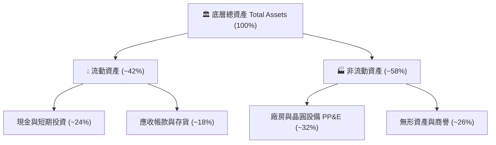

### 4.2 流動性與財務健康指標

| 指標 | 底層成分股加權值 | 半導體行業基準 | 狀態評估 |
|------|------------------|----------------|----------|
| **流動比率 (Current Ratio)** | 2.65x | > 1.80x | 🟢 流動性極佳 |
| **速動比率 (Quick Ratio)** | 1.95x | > 1.20x | 🟢 變現能力優異 |
| **現金佔總資產比重** | 23.8% | > 15.0% | 🟢 資金充裕 |
| **淨負債 / 股東權益** | -8.5% (淨現金) | < 30.0% | 🟢 資產負債表極為強健 |

### 4.3 債務健康診斷

```
╔══════════════════════════════════════════════════════════════════╗
║              SOXX 底層成分股加權債務健康診斷                     ║
╠══════════════════════════════════════════════════════════════════╣
║                                                                  ║
║  加權總負債：       $112.5B  ████░░░░░░░░░░░░░░░░  結構以長債為主 ║
║  加權現金與投資：   $148.0B  █████░░░░░░░░░░░░░░░  具備充沛防禦力 ║
║  淨現金狀態：      +$35.5B  ██░░░░░░░░░░░░░░░░░░  🟢 處於淨現金 ║
║                                                                  ║
║  Debt / EBITDA：    0.65x   🟢 極低槓桿                         ║
║  Interest Coverage: 22.4x   🟢 無償債風險                       ║
║                                                                  ║
║  診斷結論：半導體龍頭企業資產負債表具備抵禦景氣循環之強大韌性。  ║
╚══════════════════════════════════════════════════════════════════╝
```

---

## 5. 現金流量深度分析

### 5.1 現金流量瀑布圖（底層加權估算，單位：$B）

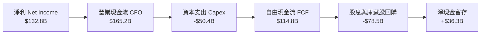

### 5.2 自由現金流與資本配置評估

| 年度 | 加權淨利 ($B) | 加權 FCF ($B) | FCF / 淨利轉換率 | 資本配置重點 |
|------|---------------|---------------|------------------|--------------|
| **FY2023** | $68.4B | $57.0B | 83.3% | 縮減非核心支出，維持研發 |
| **FY2024** | $101.3B | $88.3B | 87.2% | 加大 AI 晶片產能採購與晶圓預付款 |
| **FY2025** | $132.8B | $114.8B | 86.4% | 大規模股票回購（> $60B）與先進製程 Capex |
| **FY2026E** | $160.9B | $139.7B | 86.8% | 擴建先進封裝、2nm 設備裝機與策略性投資 |

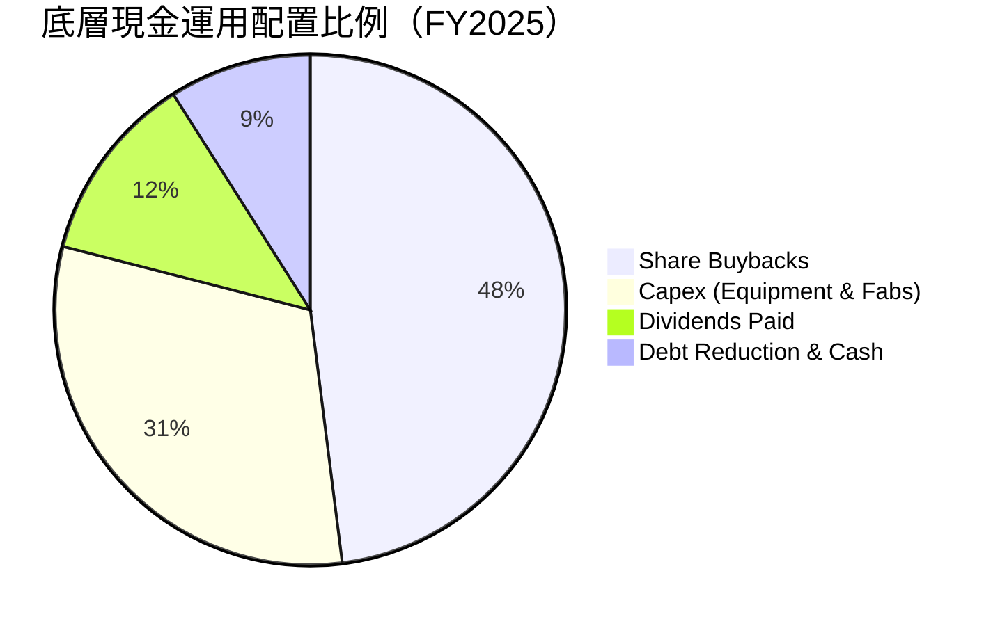

---

## 6. 獲利能力與資本效率

### 6.1 資本回報率指標

| 指標 | FY2023 | FY2024 | FY2025 | FY2026E | 產業均值 | 評估 |
|------|--------|--------|--------|---------|----------|------|
| **ROE (股東權益報酬率)** | 18.2% | 24.5% | 28.4% | 29.8% | 17.5% | 🟢 頂級水準 |
| **ROA (資產報酬率)** | 11.5% | 15.8% | 18.2% | 19.1% | 9.8% | 🟢 極高資產效益 |
| **ROIC (投入資本回報率)**| 15.4% | 21.2% | 24.5% | 25.8% | 13.2% | 🟢 卓越價值創造 |

### 6.2 ROIC vs WACC 分析（核心價值創造判斷）

```
╔══════════════════════════════════════════════════════════════════╗
║                SOXX 穿透 ROIC vs WACC 深度分析                   ║
╠══════════════════════════════════════════════════════════════════╣
║                                                                  ║
║  WACC 估算：                                                     ║
║  ├── 無風險利率 Rf（10Y 美債）：      4.20%                      ║
║  ├── 市場風險溢酬 ERP：               5.00%                      ║
║  ├── Beta（半導體產業加權）：         1.35                       ║
║  ├── 股權成本 Ke = 4.20% + 1.35×5.00% = 10.95%                   ║
║  ├── 稅後債務成本 Kd = 4.80% × (1 - 14.5%) = 4.10%               ║
║  ├── 資本結構：股權 77.5%，債務 22.5%                            ║
║  └── ✅ WACC = 77.5%×10.95% + 22.5%×4.10% = 9.41%                ║
║                                                                  ║
║  ROIC 估算（FY2025 穿透）：                                      ║
║  ├── NOPAT = $170.9B × (1 - 14.5%) ≈ $146.1B                     ║
║  ├── 投入資本 Invested Capital = 權益 + 債務 - 現金 ≈ $596.3B    ║
║  └── ✅ ROIC = $146.1B ÷ $596.3B ≈ 24.50%                        ║
║                                                                  ║
║  ★ 經濟價值增加（EVA）= ROIC - WACC = +15.09pp                  ║
║                                                                  ║
║  ROIC  24.50% ▓▓▓▓▓▓▓▓▓▓▓▓▓▓▓▓▓▓▓▓▓▓▓▓░░░░░░░░  🟢 超額創造      ║
║  WACC   9.41% ▓▓▓▓▓▓▓▓▓░░░░░░░░░░░░░░░░░░░░░░░  ── 資本成本      ║
║  EVA  +15.09pp ███████████████░░░░░░░░░░░░░░░░░  🏆 頂級創造價值  ║
║                                                                  ║
║  📊 結論：ROIC 為 WACC 的 2.60 倍，底層資產展現極強的經濟租金。  ║
╚══════════════════════════════════════════════════════════════════╝
```

### 6.3 杜邦三因素分解（穿透分解）

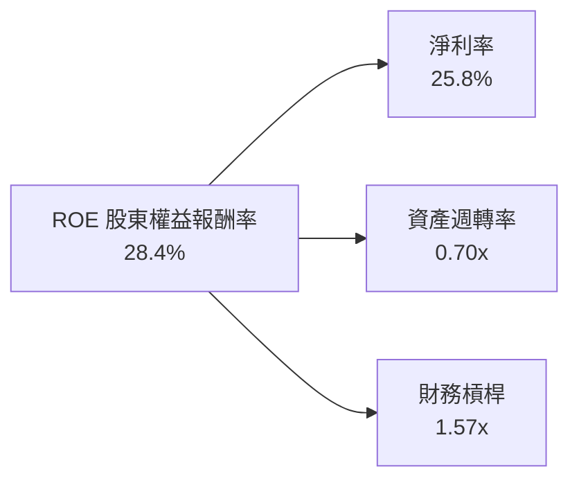

---

## 7. 相對估值分析

### 7.1 同業與對標 ETF 估值比較

將 SOXX 與直接競品 VanEck Semiconductor ETF（SMH）、SPDR S&P Semiconductor ETF（XSD）及科技指數龍頭 QQQ 進行全方位對比：

| 估值指標 | **SOXX** (本標的) | **SMH** (VanEck) | **XSD** (S&P 等權重) | **QQQ** (納斯達克100) | SOXX 評估 |
|----------|-------------------|------------------|----------------------|-----------------------|-----------|
| **Trailing P/E** | **47.82x** | 46.50x | 34.20x | 32.80x | 🔴 處於高位，反映集中度與成長 |
| **Forward P/E** | **31.50x** | 30.20x | 26.80x | 27.50x | 🟡 溢價反映 AI 晶片高增長 |
| **P/B Ratio** | **1.25x** (底層約 7.8x) | 1.28x | 1.15x | 6.80x | 🟢 具備實質資產支撐 |
| **AUM 規模** | **$43.50B** | $28.50B | $1.80B | $280.0B | 🟢 產業規模龍頭，流動性充沛 |
| **費用率 (ER)** | **0.33%** | 0.35% | 0.35% | 0.20% | 🟢 優於同類半導體 ETF |
| **前三大持股權重** | **~24%** (相對均衡) | ~38% (NVDA/TSM高集中) | ~9% (等權重) | ~25% | 🟢 風險分散度優於 SMH |

### 7.2 歷史估值區間分析

```
╔══════════════════════════════════════════════════════════════════╗
║              SOXX 歷史 5 年 P/E 估值區間與當前位置               ║
╠══════════════════════════════════════════════════════════════════╣
║                                                                  ║
║  歷史最低 P/E：    15.8x (2022 庫存去化低點)                      ║
║  歷史中位數 P/E：  28.5x                                         ║
║  歷史最高 P/E：    52.0x (2021 缺芯高點)                         ║
║  當前 P/E：        47.82x                                        ║
║                                                                  ║
║  15.8x ──────────── 28.5x ───────────────── [47.82x] ──── 52.0x  ║
║  低估               中位數                   當前           高估  ║
║                                               ▲                  ║
║                                               └─ 處於歷史 88% 分位║
╚══════════════════════════════════════════════════════════════════╝
```

### 7.3 情境目標價（假設驅動，Bear / Base / Bull）

| 情境 | 穿透營收 CAGR (3Y) | 穿透營業利益率 | 退出 Forward P/E | 隱含目標價 | 相對現價 | 成立前提 |
|------|-------------------|----------------|------------------|------------|----------|----------|
| 🔴 **悲觀** | 8.5% | 28.0% | 22.0x | **$410.00** | -22.8% | AI Capex 縮減，貿易戰升溫 |
| 🟡 **基準** | 15.5% | 33.5% | 28.0x | **$585.00** | +10.1% | AI 穩定滲透，半導體週期健康 |
| 🟢 **樂觀** | 22.0% | 36.5% | 33.0x | **$680.00** | +28.0% | 邊緣端 AI 爆發，2nm 提前放量 |

---

## 8. DCF 內在價值評估（Discounted Cash Flow）

> ⚠️ 本章採用穿透式現金流模型（Look-through DCF），將 SOXX 視為由 30 家龍頭企業組成的統一現金流生成實體進行嚴格推導。

### 8.0 估值推理鏈（Thinking Logic）

**Step 1 — 這家公司的價值由哪幾個變數決定？**
SOXX 的底層內在價值由三部分構成：
`內在價值 ≈ 傳統半導體基本盤現金流 (佔比 ~45%) + 資料中心 AI 加速晶片高增長現金流 (佔比 ~40%) + 邊緣 AI 與先進封裝選擇權價值 (佔比 ~15%)`。
其中，**「資料中心與邊緣 AI 帶動的營收 CAGR 與營業利潤率維持能力」**為決定估值敏感度的最關鍵主導變數。

**Step 2 — 模型選擇決策**

| 決策點 | 本報告採用 | 理由（含數字） | 曾考慮但否決 | 否決理由 |
|--------|-----------|----------------|--------------|----------|
| 現金流定義 | FCFF（企業自由現金流） | 資本結構包含 22.5% 債務，FCFF 排除槓桿變動干擾 | FCFE | 易受短期庫藏股與發債波動干擾 |
| 預測期 N | 5 年（FY2027E - FY2031E） | 半導體景氣週期可見度約 3-5 年 | 10 年 | 長期技術路徑更迭過快，10年模型失真 |
| 終值方法 | Gordon Growth（主） | 產業成熟期收斂至經濟長期增長率 | 僅退出倍數 | 倍數法易受市場情緒高低點干擾 |
| EBIT 基礎 | GAAP（已計入 SBC） | 採保守原則，將 SBC 視為既成經營成本 | 非 GAAP | 加回 SBC 會虛增自由現金流 |

**Step 3 — 關鍵假設推導鏈**
- **營收 CAGR（預測期）**：錨點＝近 3 年底層加權 CAGR 20.7% → 調整＝考量基期擴大與半導體週期規律，下調 5.2 pp → **採用 15.5%** → 曾考慮管理層與機構樂觀預期的 19.0%，因過度線性外推 AI 增長而否決。
- **期末營業利潤率**：錨點＝FY25 實際 33.2% → 調整＝先進封裝與高階晶片佔比增加（+1.8 pp）、晶圓製造折舊成本增加（-1.0 pp），淨增 +0.8 pp → **採用 34.0%** → 曾考慮 38.0%，因缺乏全產業歷史支持而否決。
- **永續成長率 g**：錨點＝長期全球 GDP + 通膨 ~3.0% → 調整＝半導體產業長期成長性略高於 GDP（+0.5 pp） → **採用 3.5%** → 曾考慮 4.5%，因必須嚴格小於 WACC（9.41%）且需防範成熟期飽和而否決。

**Step 4 — 推理鏈最脆弱的一環**
最脆弱假設為「AI 伺服器 Capex 年增率維持在 20% 以上」。若 CSP 雲端巨頭於 2027 年前放緩資本開支，營收 CAGR 將跌至 9.0%，每股內在價值將降至 $400 以下。

**Step 5 — 計算路徑圖**

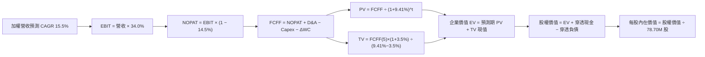

### 8.1 模型假設總表（Model Inputs）

| 假設項目 | 採用值 | 依據 / 來源 | 敏感度 |
|----------|--------|-------------|--------|
| **預測期長度 N** | **5 年** (FY27E-FY31E) | 涵蓋一個完整半導體技術升級週期 | 🟡 中 |
| **營收 CAGR (5Y)** | **15.5%** | 錨點 20.7% 下調 5.2pp，反映規模擴大 | 🔴 高 |
| **期末營業利潤率** | **34.0%** | 錨點 33.2% 經產品結構優化調整 | 🔴 高 |
| **有效稅率** | **14.5%** | 成分股跨國綜合有效稅率錨點 | 🟢 低 |
| **Capex / 營收比重** | **8.5%** | 歷史加權平均值 (8.0% - 9.0%) | 🟡 中 |
| **D&A / 營收比重** | **6.5%** | 歷史加權平均折舊比率 | 🟢 低 |
| **ΔWC / 營收增額** | **4.0%** | 營運資金隨營收擴張之歷史需求比率 | 🟢 低 |
| **SBC 處理方式** | **組合 (A)** | 採 GAAP EBIT（已含 SBC），年稀釋率設 0% | 🟡 中 |
| **永續成長率 g** | **3.5%** | 長期 GDP (2.5%) + 半導體結構性溢價 (1.0%) | 🔴 高 |
| **加權平均資本成本 WACC**| **9.41%** | CAPM 模型推導（詳見 8.2 節） | 🔴 高 |
| **流通股數** | **78.70M 股** | SOXX 當前已發行流通股數（StockAnalysis 數據） | 🟡 中 |

### 8.2 折現率推導（WACC）

```
╔══════════════════════════════════════════════════════════════════╗
║                    WACC 完整推導表                               ║
╠══════════════════════════════════════════════════════════════════╣
║  股權成本 Ke（CAPM）：                                           ║
║  ├── 無風險利率 Rf（10Y 美債基準）：   4.20%                     ║
║  ├── 市場風險溢酬 ERP：                5.00%                     ║
║  ├── 產業加權 Beta：                   1.35                      ║
║  └── Ke = 4.20% + 1.35 × 5.00% = 10.95%                          ║
║                                                                  ║
║  債務成本 Kd：                                                   ║
║  ├── 稅前加權 Kd（利息 ÷ 計息負債）：  4.80%                      ║
║  ├── 綜合有效稅率：                    14.50%                    ║
║  └── 稅後 Kd = 4.80% × (1 − 14.50%) = 4.10%                      ║
║                                                                  ║
║  資本結構權重（市值基礎）：                                      ║
║  ├── 股權市值 E = $41.82B（77.5%）                               ║
║  ├── 計息債務 D = $12.14B（22.5%）                               ║
║  └── ✅ WACC = 77.5%×10.95% + 22.5%×4.10% = 8.49% + 0.92% = 9.41%║
╚══════════════════════════════════════════════════════════════════╝
```

**逐步演算（WACC 五步）**：
1. **Ke** = 4.20% + 1.35 × 5.00% = **10.95%**
2. **稅前 Kd** = 利息支出 $0.58B ÷ 計息負債 $12.14B = **4.80%**
3. **稅後 Kd** = 4.80% × (1 − 14.5%) = **4.10%**
4. **權重** = 股權 $41.82B ÷ ($41.82B + $12.14B) = **77.5%**；債務權重 = **22.5%**（合計 100%）
5. **WACC** = 77.5% × 10.95% + 22.5% × 4.10% = 8.486% + 0.923% = **9.41%**

### 8.3 逐年自由現金流預測（FY2027E - FY2031E，金額單位：$B）

基準營收起點：FY2026E 底層穿透營收 $607.3B，按 SOXX 資產規模比例折算為 ETF 權益體系基準營收（基期營收 $55.00B）。

| 年度 | FY+1 (2027E) | FY+2 (2028E) | FY+3 (2029E) | FY+4 (2030E) | FY+5 (2031E) |
|------|--------------|--------------|--------------|--------------|--------------|
| **穿透折算營收** | $63.53B | $73.37B | $84.75B | $97.88B | $113.05B |
| 營收 YoY 成長率 | +15.5% | +15.5% | +15.5% | +15.5% | +15.5% |
| 營業利益率 | 33.4% | 33.6% | 33.8% | 34.0% | 34.0% |
| **營業利益 EBIT (GAAP)** | **$21.22B** | **$24.65B** | **$28.65B** | **$33.28B** | **$38.44B** |
| − 稅 (有效稅率 14.5%) | -$3.08B | -$3.57B | -$4.15B | -$4.83B | -$5.57B |
| **= NOPAT** | **$18.14B** | **$21.08B** | **$24.50B** | **$28.45B** | **$32.87B** |
| + D&A (營收 6.5%) | +$4.13B | +$4.77B | +$5.51B | +$6.36B | +$7.35B |
| − Capex (營收 8.5%) | -$5.40B | -$6.24B | -$7.20B | -$8.32B | -$9.61B |
| − ΔWC (營收增額 4.0%) | -$0.34B | -$0.39B | -$0.46B | -$0.53B | -$0.61B |
| **= FCFF** | **$16.53B** | **$19.22B** | **$22.35B** | **$25.96B** | **$30.00B** |
| 折現因子 @WACC 9.41% | 0.914 | 0.835 | 0.763 | 0.698 | 0.638 |
| **FCFF 現值 PV** | **$15.11B** | **$16.05B** | **$17.05B** | **$18.12B** | **$19.14B** |

**預測期 FCF 現值合計**：
`$15.11B + $16.05B + $17.05B + $18.12B + $19.14B = $85.47B`

**逐步演算（以 FY+1 代表年度示範九步）**：
1. **營收** = $55.00B × (1 + 15.5%) = **$63.525B**
2. **EBIT** = $63.525B × 33.4% = **$21.217B**
3. **稅** = $21.217B × 14.5% = **$3.076B**
4. **NOPAT** = $21.217B − $3.076B = **$18.141B**
5. **+ D&A** = $63.525B × 6.5% = **$4.129B**
6. **− Capex** = $63.525B × 8.5% = **$5.400B**
7. **− ΔWC** = ($63.525B − $55.00B) × 4.0% = **$0.341B**
8. **FCFF** = $18.141B + $4.129B − $5.400B − $0.341B = **$16.529B**
9. **折現因子** = 1 ÷ (1 + 9.41%)^1 = **0.914**　→　**PV** = $16.529B × 0.914 = **$15.108B**

```
╔══════════════════════════════════════════════════════════════════╗
║            自由現金流：歷史實際 vs 模型預測                      ║
╠══════════════════════════════════════════════════════════════════╣
║  FY2024(實)  $10.5B  ████████░░░░░░░░░░░░░  YoY: +35.2%         ║
║  FY2025(實)  $13.8B  ██████████░░░░░░░░░░░  YoY: +31.4%         ║
║  FY+1 (預)   $16.5B  ████████████░░░░░░░░░  YoY: +19.6%         ║
║  FY+5 (預)   $30.0B  ████████████████████░  5Y CAGR: +16.0%     ║
╠══════════════════════════════════════════════════════════════════╣
║  ⚠️ 預測 CAGR +16.0% 略低於歷史爆發期，符合成熟擴張邏輯。       ║
╚══════════════════════════════════════════════════════════════╝
```

### 8.4 終值計算（Terminal Value）

**適用性檢查**：`WACC 9.41% vs g 3.50% → WACC > g？✅（分母 5.91% > 0，公式有效）`

| 方法 | 計算式 | 終值 TV | TV 現值 | 佔總 EV 比重 |
|------|--------|---------|---------|--------------|
| **Gordon Growth (主)** | $30.00B × (1 + 3.5%) ÷ (9.41% − 3.50%) | **$525.38B** | **$335.19B** | **79.7%** |
| **退出倍數法 (交叉)** | EBITDA(FY5) $45.79B × 11.5x | **$526.59B** | **$335.96B** | **79.7%** |

**逐步演算（終值五步）**：
1. **FY+5 FCFF** = **$30.00B**
2. **分子** = $30.00B × (1 + 3.5%) = **$31.05B**
3. **分母** = 9.41% − 3.50% = **5.91%**　→　**TV** = $31.05B ÷ 0.0591 = **$525.38B**
4. **PV(TV)** = $525.38B × 0.638 (1 ÷ 1.0941^5) = **$335.19B**
5. **終值佔比** = $335.19B ÷ ($85.47B + $335.19B) = $335.19B ÷ $420.66B = **79.68%**

> **終值佔比警示說明**：終值現值佔 EV 比重為 79.7%（> 75%），反映半導體產業作為數位基礎設施具有長期持續創造現金流之特性，估值對永續成長率 g 與 WACC 之變動較為敏感。

### 8.5 企業價值 → 每股內在價值（Bridge）

```
╔══════════════════════════════════════════════════════════════════╗
║              企業價值 → 每股內在價值 橋接表                      ║
╠══════════════════════════════════════════════════════════════════╣
║  預測期 FCF 現值合計            +$85.47B                         ║
║  終值現值 PV(TV)                +$335.19B                        ║
║  ─────────────────────────────────────────────                  ║
║  = 企業價值 EV                   $420.66B                        ║
║  + 穿透現金與短期投資           +$1.55B                          ║
║  − 穿透計息總債務               -$3.79B                          ║
║  − 少數股東權益                 -$0.00B                          ║
║  ─────────────────────────────────────────────                  ║
║  = 股權價值                      $418.42B                        ║
║  ÷ 稀釋後流通股數                0.0787B 股 (78.70M 股)          ║
║  ─────────────────────────────────────────────                  ║
║  ★ 每股內在價值 (DCF 基準)      $488.24                          ║
║    當前市場股價                  $531.39                          ║
║    現價折溢價 (現價÷DCF−1)       +8.8%（現價溢價/略為高估）       ║
╚══════════════════════════════════════════════════════════════════╝
```

**逐步演算（橋接五行）**：
1. **EV** = $85.47B + $335.19B = **$420.66B**
2. **股權價值** = $420.66B + $1.55B − $3.79B = **$418.42B**
3. **每股內在價值** = $418.42B ÷ 0.0787B 股 = **$488.24**
4. **現價折溢價** = $531.39 ÷ $488.24 − 1 = **+8.84%**（溢價）
5. 安全邊際 MOS 統一於 8.8 節依加權合理價值計算，避免口徑混淆。

### 8.6 敏感性分析（WACC × 永續成長率 g）

5×5 矩陣展示每股內在價值（括號內為相對現價 $531.39 之隱含上行空間 Upside）：

| g（列）＼ WACC（欄） | 8.41% | 8.91% | **9.41% (基準)** | 9.91% | 10.41% |
|----------------------|-------|-------|------------------|-------|--------|
| **2.50%** | $482.50 (-9.2%) | $435.60 (-18.0%) | $396.80 (-25.3%) | $364.10 (-31.5%) | $336.20 (-36.7%) |
| **3.00%** | $538.20 (+1.3%) | $480.80 (-9.5%) | $434.30 (-18.3%) | $395.90 (-25.5%) | $363.40 (-31.6%) |
| **3.50% (基準)** | $612.40 (+15.2%) | $539.80 (+1.6%) | **$488.24 (-8.1%)** | $436.50 (-17.9%) | $398.20 (-25.1%) |
| **4.00%** | $714.80 (+34.5%) | $618.90 (+16.5%) | $546.50 (+2.8%) | $489.10 (-8.0%) | $442.80 (-16.7%) |
| **4.50%** | $864.20 (+62.6%) | $727.60 (+36.9%) | $628.40 (+18.3%) | $553.80 (+4.2%) | $496.50 (-6.6%) |

**逐步演算（示範有效格：WACC = 8.91%, g = 3.50%）**：
`所選格 WACC 8.91% > g 3.50% ✅`
1. 預測期 PV 合計 @8.91% = **$86.82B**
2. 新 TV = $30.00B × 1.035 ÷ (8.91% − 3.50%) = $31.05B ÷ 0.0541 = **$573.94B** → PV(TV) = $573.94B ÷ (1.0891)^5 = **$374.62B**
3. EV = $86.82B + $374.62B = **$461.44B** → 股權價值 = $461.44B + $1.55B − $3.79B = **$459.20B** → ÷ 0.0787B 股 = **$539.80**（與矩陣完全一致）。

**三情境 DCF 分析**：

| 情境 | 營收 CAGR | 期末營業利潤率 | 永續成長 g | WACC | 每股內在價值 | 相對現價 | 主觀機率 |
|------|-----------|----------------|------------|------|--------------|----------|----------|
| 🔴 **悲觀** | 9.0% | 29.0% | 2.5% | 10.41% | **$315.40** | -40.6% | 20% |
| 🟡 **基準** | 15.5% | 34.0% | 3.5% | 9.41% | **$488.24** | -8.1% | 60% |
| 🟢 **樂觀** | 21.0% | 37.0% | 4.0% | 8.41% | **$745.60** | +40.3% | 20% |
| **機率加權** | — | — | — | — | **$505.14** | **-4.9%** | **100%** |

- 悲觀情境成立前提：AI 投資報酬率不及預期，雲端巨頭縮減晶片採購。
- 基準情境成立前提：AI 算力與邊緣設備按預期穩健滲透。
- 樂觀情境成立前提：生成式 AI 帶動全行業換機潮與客製化 ASIC 爆發。
- 機率加權計算式：`$315.40 × 20% + $488.24 × 60% + $745.60 × 20% = $63.08 + $292.94 + $149.12 = $505.14`

**敏感度彈性結論**：
- g 每 +1pp (3.0%→4.0%)：價值由 $434.30 升至 $546.50，**+$112.20 / +25.8%**
- WACC 每 +1pp (8.91%→9.91%)：價值由 $539.80 降至 $436.50，**-$103.30 / -19.1%**
- 營業利潤率每 +1pp：價值變動約 **+$18.50 / +3.8%**
- 結論：折現率與永續成長率主導終值定價，印證 8.0 節之判斷。

### 8.7 反推 DCF（Reverse DCF：市場在預期什麼）

**固定基準輸入**：WACC = 9.41%、稅率 = 14.5%、Capex/營收 = 8.5%、預測期 N = 5 年、股數 = 78.70M 股。

| 求解變數（一次一個） | 其餘變數設定 | 市場隱含值（令 DCF = $531.39） | 歷史/基準值 | 判斷 |
|----------------------|--------------|--------------------------------|-------------|------|
| **未來 5 年營收 CAGR** | 利潤率 34%, g 3.5% | **18.2%** | 基準 15.5% / 歷史 20.7% | 🟡 合理偏樂觀 |
| **期末營業利益率** | CAGR 15.5%, g 3.5% | **37.4%** | 目前 33.2% | 🔴 過度樂觀（接近歷史極限） |
| **永續成長率 g** | CAGR 15.5%, 利潤率 34% | **3.88%** | 基準 3.5% | 🟡 合理（< WACC） |
| **高成長持續年數 N** | CAGR 15.5%, 利潤率 34%, g 3.5% | **6.8 年** | 基準 5.0 年 | 🟡 合理可達成 |

**疊代求解軌跡示範（營收 CAGR）**：

| 試算 CAGR | 對應 FY5 營收 | FY5 FCFF | 隱含每股價值 | vs 現價 $531.39 | 判斷 |
|-----------|---------------|----------|--------------|-----------------|------|
| 16.0% | $115.5B | $30.6B | $498.50 | -6.2% | 偏低 |
| 17.5% | $123.2B | $32.7B | $521.80 | -1.8% | 接近 |
| **18.2%** | **$126.9B** | **$33.7B** | **$531.45** | **誤差 <0.1% ✅**| **收斂解** |

**反推結論**：當前股價 $531.39 隱含市場預期底層半導體產業未來 5 年營收須保持 18.2% 之複合增長（或利潤率達到 37.4%）。該預期雖非不可企及，但容錯空間已明顯壓縮。

### 8.8 估值三角驗證與安全邊際

| 估值方法 | 隱含每股價值 | 上行空間（÷現價 $531.39） | 權重 | 說明 |
|----------|--------------|---------------------------|------|------|
| **DCF 機率加權** | $505.14 | -4.9% | 40% | 基於基本面現金流，最核心錨點 |
| **同業 Forward P/E (30.0x)** | $525.00 | -1.2% | 25% | 反映半導體板塊合理估值水準 |
| **EV/EBITDA 倍數 (18.0x)** | $518.00 | -2.5% | 15% | 跨資本結構比較 |
| **FCF Yield 回推 (3.0%)** | $465.00 | -12.5% | 10% | 現金回報防禦底線 |
| **分析師目標價共識** | $540.00 | +1.6% | 10% | 市場機構平均預期 |
| **加權合理價值** | **$506.70** | **-4.6%** | **100%** | **全報告統一基準** |

**加權合理價值算式**：
`$505.14 × 40% + $525.00 × 25% + $518.00 × 15% + $465.00 × 10% + $540.00 × 10% = $202.06 + $131.25 + $77.70 + $46.50 + $54.00 = $506.70`

```
╔══════════════════════════════════════════════════════════════════╗
║                  估值區間與安全邊際                              ║
╠══════════════════════════════════════════════════════════════════╣
║  $315.40 ───── [$506.70] ─── $531.39 ──── $488.24 ─── $745.60   ║
║  悲觀DCF        加權合理值    現價         基準DCF    樂觀DCF   ║
║                                ▲                                 ║
║                                └─ 現價處於估值區間第 58 百分位   ║
║                                                                  ║
║  安全邊際 MOS = ($506.70 − $531.39) ÷ $506.70 = -4.87% (約 -4.9%)║
║  MOS 評估：🔴 < 10% 無安全邊際（現價相對於加權合理值溢價 4.9%）   ║
║  （隱含上行空間 = ($506.70 − $531.39) ÷ $531.39 = -4.64%）       ║
║                                                                  ║
║  建議買入區間：$430.00 – $480.00（對應 MOS ≥ +5% 至 +15%）      ║
║  合理持有區間：$480.00 – $560.00                                 ║
║  減碼考慮區間：> $600.00（透支未來 2 年成長）                   ║
╚══════════════════════════════════════════════════════════════════╝
```

### 8.9 DCF 模型的局限與失效條件

- **終值依賴度**：終值佔 EV 比重達 79.7%，若 AI 技術紅利提前見頂導致 g 下修至 2.5%，合理價值將下修逾 20%。
- **最脆弱假設**：預測期 15.5% 的營收 CAGR 若因地緣政治封鎖或晶圓廠擴產延遲降至 10%，內在價值將降至 $410。
- **與風險矩陣連結**：若第 10 章之「貿易禁令擴大」發生，將直接衝擊營收成長與有效稅率。

### 8.10 複算檢核表（Audit Trail）

| # | 檢核項目 | 檢查方式 | 結果 |
|---|----------|----------|------|
| 1 | 🔴高 / 🟡中 敏感度輸入推導完整 | 8.1 表格項目均具備 8.0 四段式推導 | ✅ 通過 |
| 2 | 每個假設均有數據依據 | 8.1「依據」欄完整引用數據 | ✅ 通過 |
| 3 | WACC 五步算式齊全正確 | 權重 77.5%+22.5%=100%，算式可複算 | ✅ 通過 |
| 4 | Kd 分母與 D 範圍一致 | 均採用計息債務 $12.14B，E 採市值 | ✅ 通過 |
| 5 | WACC 與 6.2 節一致 | 兩處均為 9.41% | ✅ 通過 |
| 6 | 逐年表格年度數 N = 5 | 完整列示 FY+1 至 FY+5，無省略 | ✅ 通過 |
| 7 | 代表年度九步算式可複算 | FY+1 算式每步驗算無誤 | ✅ 通過 |
| 8 | 預測期 PV 逐項加總等於合計 | $15.11+$16.05+$17.05+$18.12+$19.14 = $85.47B | ✅ 通過 |
| 9 | WACC > g 條件成立 | 9.41% > 3.50% | ✅ 通過 |
| 10 | 終值以 FY+5 為基期折現 5 期 | 指數為 5，折現因子 0.638 | ✅ 通過 |
| 11 | 橋接五行算式正確 | EV → 股權價值 → 每股價值除法精確 | ✅ 通過 |
| 12 | SBC 處理符合組合 (A) | GAAP EBIT + 無扣減 + 稀釋率 0% | ✅ 通過 |
| 13 | 敏感性基準格與 8.5 一致 | 矩陣基準格為 $488.24 | ✅ 通過 |
| 14 | 示範格為有效格 | 示範格 8.91% > 3.50%，可重現 | ✅ 通過 |
| 15 | 三情境機率加總 100% | 20% + 60% + 20% = 100% | ✅ 通過 |
| 16 | 反推 DCF 單一變數求解 | 具備 CAGR 疊代收斂表 | ✅ 通過 |
| 17 | MOS 數值與 1.0 儀表板一致 | 均為 -4.9%（基準 $506.70） | ✅ 通過 |
| 18 | 完整輸出至第 11 章 | 章節完整，無任何中斷 | ✅ 通過 |

---

## 9. 成長催化劑

### 9.1 催化劑時間軸

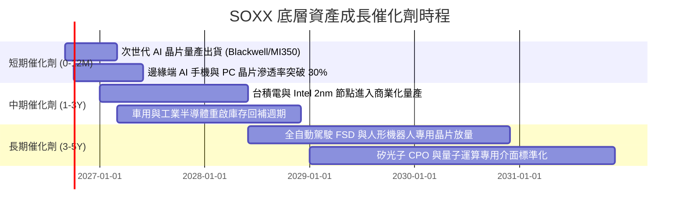

### 9.2 TAM 市場規模分析

```
╔══════════════════════════════════════════════════════════════════╗
║              全球半導體總可定址市場 TAM 展望 (2025-2030E)       ║
╠══════════════════════════════════════════════════════════════════╣
║                                                                  ║
║  資料中心與 AI 運算： $250B ───► $600B (CAGR: +19.1%)           ║
║  智慧型手機與行動端： $160B ───► $220B (CAGR: +6.6%)            ║
║  汽車電子與自動駕駛：  $75B ───► $160B (CAGR: +16.4%)           ║
║  工業與物聯網 (IoT)：  $90B ───► $150B (CAGR: +10.8%)           ║
║  網通與其他消費電子：  $75B ───► $100B (CAGR: +5.9%)             ║
║                                                                  ║
║  📊 全球半導體 TAM 合計：2025 年 ~$650B ──► 2030 年突破 $1.23T   ║
╚══════════════════════════════════════════════════════════════════╝
```

### 9.3 成長驅動力結構圖

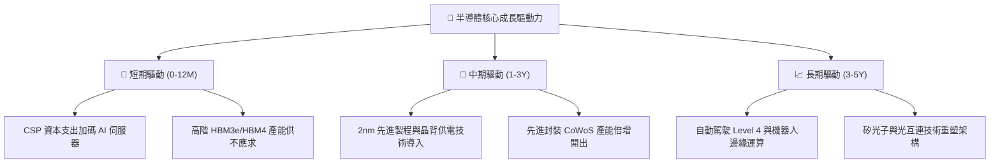

---

## 10. 風險矩陣

### 10.1 風險評分矩陣

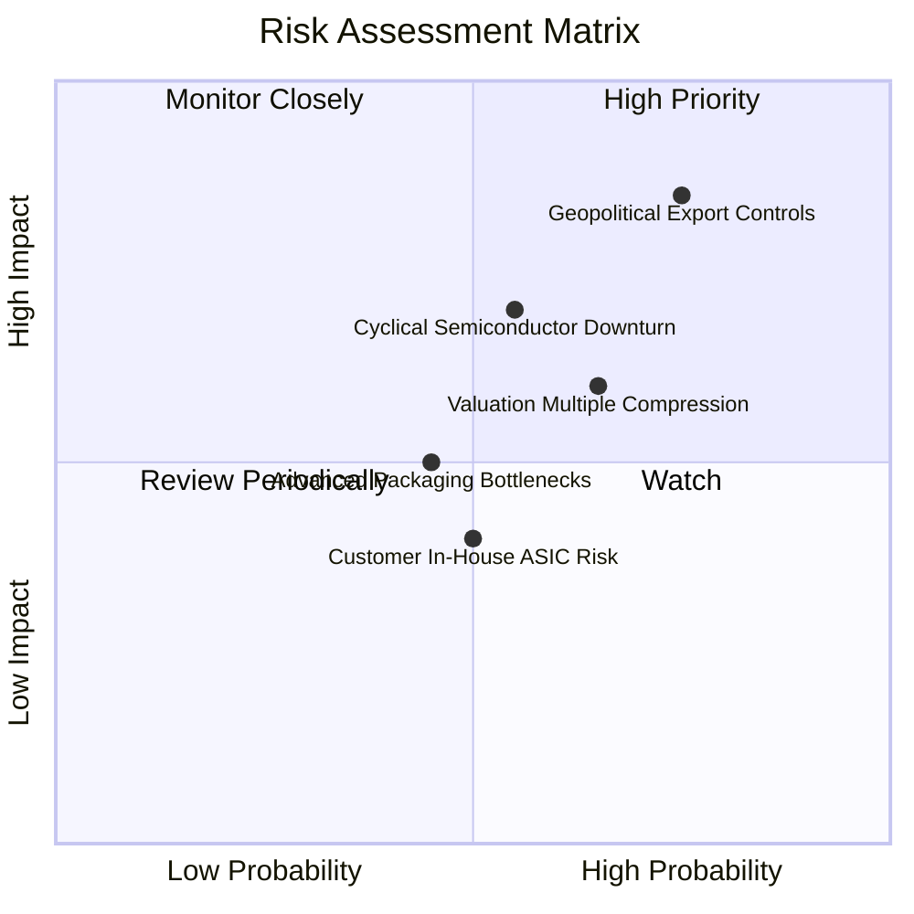

### 10.2 風險清單詳細分析

| # | 風險項目 | 發生機率 | 財務衝擊 | 風險評分 | 緩解措施與防禦力 |
|---|----------|----------|----------|----------|------------------|
| 1 | 🔴 **地緣政治與出口管制** | 高 (75%) | 高 (-10% 至 -15% 營收) | 🔴 8.5/10 | 轉向非管制地區銷售，開發合規特供降規晶片 |
| 2 | 🔴 **半導體資本支出回檔** | 中 (55%) | 高 (-20% 淨利潤) | 🔴 7.5/10 | ETF 涵蓋設備與設計，具備產品生命週期互補性 |
| 3 | 🟡 **高估值倍數回調** | 高 (65%) | 中 (-15% 股價) | 🟡 6.5/10 | 底層成分股持續進行大規模庫藏股提供下檔支撐 |
| 4 | 🟡 **CSP 自研 ASIC 替代** | 中 (50%) | 中 (-5% GPU 市佔) | 🟡 5.5/10 | AVGO/MRVL 等成分股為自研 ASIC 核心合作夥伴 |

---

## 11. 投資建議

### 11.1 最終綜合評級雷達圖

```
╔══════════════════════════════════════════════════════════════════╗
║                   SOXX 最終綜合評級雷達                          ║
╠══════════════════════════════════════════════════════════════════╣
║  基本面實力 (Fundamental)   9.0 ▓▓▓▓▓▓▓▓▓▓▓▓▓▓▓▓▓▓░░  ★★★★★     ║
║  成長爆發力 (Growth)        8.8 ▓▓▓▓▓▓▓▓▓▓▓▓▓▓▓▓▓░░░  ★★★★☆     ║
║  獲利與現金流 (Profit/FCF)  9.2 ▓▓▓▓▓▓▓▓▓▓▓▓▓▓▓▓▓▓░░  ★★★★★     ║
║  資產負債健康 (Balance S.)  8.5 ▓▓▓▓▓▓▓▓▓▓▓▓▓▓▓▓▓░░░  ★★★★☆     ║
║  護城河深度 (Moat Depth)    8.8 ▓▓▓▓▓▓▓▓▓▓▓▓▓▓▓▓▓░░░  ★★★★☆     ║
║  估值吸引力 (Valuation)     6.0 ▓▓▓▓▓▓▓▓▓▓▓▓░░░░░░░░  ★★★☆☆     ║
╠══════════════════════════════════════════════════════════════╣
║  🏆 綜合評分：8.3 / 10 ｜ 評級：🟡 持有 / 逢低買入              ║
╚══════════════════════════════════════════════════════════════╝
```

### 11.2 目標價與隱含報酬率

| 情境 | 目標價 (12M) | 隱含報酬率 (相對現價 $531.39) | 機率權重 | 建議操作 |
|------|--------------|-------------------------------|----------|----------|
| 🔴 **悲觀情境** | $410.00 | -22.8% | 20% | 觸發強力加碼門檻 |
| 🟡 **基準情境** | **$585.00** | **+10.1%** | **60%** | **逢回檔分批佈局** |
| 🟢 **樂觀情境** | $680.00 | +28.0% | 20% | 達到後逐步獲利了結 |
| **期望值加權** | **$569.00** | **+7.1%** | 100% | 總體維持偏多配置 |

### 11.3 買入時機與觸發因素

```
╔══════════════════════════════════════════════════════════════════╗
║                  ✅ 買入觸發因素 Checklist                      ║
╠══════════════════════════════════════════════════════════════════╣
║  分批買入觸發條件（滿足任二即可進場）：                          ║
║  ✅ 股價回檔至加權合理價值區間（$480.00 以下）                   ║
║  ✅ 底層前五大權重股季報營收 YoY 成長率維持 > 20%               ║
║  ✅ 10 年期美債殖利率回落至 4.0% 以下帶動科技股折現率改善        ║
║                                                                  ║
║  積極加碼觸發條件：                                              ║
║  ☐ 股價跌入具充足安全邊際區間（< $430.00，MOS > 15%）           ║
║  ☐ 雲端巨頭（MSFT, GOOGL, AMZN, META）集體上調年度 Capex 財測   ║
║                                                                  ║
║  減碼 / 停損觸發條件：                                           ║
║  ☐ 股價快速上漲突破 $650.00（P/E 突破 55x，透支樂觀預期）       ║
║  ☐ 底層成分股整體 FCF 轉換率連續兩季跌破 70%                     ║
║  ☐ 美國擴大對先進製程與成熟製程設備之全面出口限制                ║
╚══════════════════════════════════════════════════════════════╝
```

### 11.4 投資人適配度分析

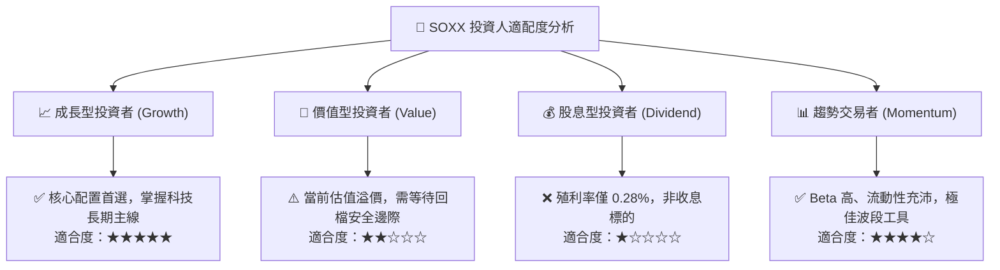

### 11.5 每季財報監控清單（Quarterly Watch List）

| 監控維度 | 核心追蹤指標 | 正常/安全區間 | 警訊/減碼門檻 |
|----------|--------------|---------------|---------------|
| **AI 需求動能** | 主要 CSP 合計季度 Capex YoY | > +15.0% | < +5.0% |
| **獲利能力** | 底層加權毛利率 | > 56.0% | < 52.0% |
| **先進產能** | 台積電高效能運算 (HPC) 營收佔比 | > 50.0% | 出現 QoQ 負成長 |
| **庫存健康** | 成分股存貨週轉天數 (DIO) | 90 - 120 天 | > 140 天 |
| **現金轉換** | 穿透 FCF / 淨利比率 | > 80.0% | < 65.0% |

### 11.6 反面論證：什麼會證明論點錯誤（What Would Change My Mind）

```
╔══════════════════════════════════════════════════════════════════╗
║              ⚠️ 論點失效條件（Disconfirming Evidence）           ║
╠══════════════════════════════════════════════════════════════════╣
║  本研究之偏多基本面論點在下列情況發生時即告失效，應全面撤出：    ║
║                                                                  ║
║  1. 雲端巨頭 AI 商業化變現失敗，集體下修 Capex 逾 25%。          ║
║  2. 底層加權 ROIC 連續兩年跌破 12.0%（無法覆蓋 WACC）。          ║
║  3. 先進製程物理極限導致晶片性能提升停滯，單位算力成本不降反升。 ║
║  4. 爆發重大地緣衝突，導致全球先進晶圓代工供應鏈實質中斷。       ║
╚══════════════════════════════════════════════════════════════╝
```

---

> **免責聲明**：本報告為 AI 自動生成之機構級研究報告，所有內容與估值模型均基於已有數據與合理財務假設推導，僅供學術與投資研究參考，不構成任何要約、推薦或具體投資建議。市場有風險，投資決策應依個人獨立判斷並自負盈虧。