# SPCX 基本面深度分析報告

> **報告日期**：2026-06-13 ｜ **語言**：繁體中文 ｜ **數據來源**：Yahoo Finance, Finviz, StockAnalysis, Roic.ai ｜ **分析師**：CFA 級機構研究

---

## 目錄

| # | 章節 | 核心結論 |
|---|------|----------|
| 1 | 執行摘要 | 評級為「持有（Hold）」，目標價 $164.00，高估值與高研發投入並存 |
| 2 | 公司概覽與商業模式 | 航太與星鏈雙輪驅動，具備極高進入壁壘與壟斷性護城河 |
| 3 | 損益表深度分析 | 營收高速增長（YoY +33.2%），但研發開支劇增導致短期利潤承壓 |
| 4 | 資產負債表分析 | 資產規模突破千億美元，財務槓桿適中，短期流動性安全 |
| 5 | 現金流量深度分析 | 經營現金流穩健（$7.10B），但資本支出（$20.91B）導致自由現金流流出 |
| 6 | 獲利能力與資本效率 | 處於高資本投入期，當前 ROIC 受 R&D 拖累，長期價值創造潛力巨大 |
| 7 | 估值深度分析 | P/S 達 109x，估值處於歷史高位，DCF 顯示當前股價已透支部分預期 |
| 8 | 成長催化劑 | 星鏈全球滲透、星艦（Starship）商業化與國防合約為三大核心驅動力 |
| 9 | 風險矩陣 | 監管限制、發射失敗與高資本支出為主要風險，整體風險評級為中高 |
| 10 | 投資建議 | 建議分批逢低佈局，適合長線成長型投資者，設定關鍵監控指標 |

---

## 1. 執行摘要

### 1.1 核心評分儀表板

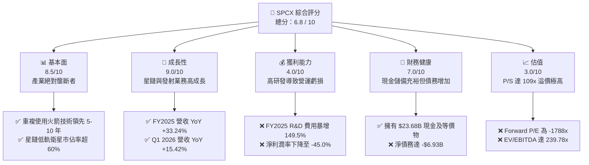

### 1.2 評分進度條視覺化

```
╔══════════════════════════════════════════════════════════════╗
║              SPCX 多維度評分儀表板 (1-10分)                  ║
╠══════════════════════════════════════════════════════════════╣
║ 基本面強度  8.5 ▓▓▓▓▓▓▓▓▓▓▓▓▓▓▓▓▓░░░  ★★★★☆  (壟斷地位)   ║
║ 成長動能    9.0 ▓▓▓▓▓▓▓▓▓▓▓▓▓▓▓▓▓▓░░  ★★★★★  (星鏈爆發)   ║
║ 獲利品質    4.0 ▓▓▓▓▓▓▓▓░░░░░░░░░░░░  ★★☆☆☆  (研發拖累)   ║
║ 財務健康    7.0 ▓▓▓▓▓▓▓▓▓▓▓▓▓▓░░░░░░  ★★★☆☆  (現金充沛)   ║
║ 估值合理性  3.0 ▓▓▓▓▓▓░░░░░░░░░░░░░░  ★☆☆☆☆  (估值過高)   ║
║ 護城河深度  9.5 ▓▓▓▓▓▓▓▓▓▓▓▓▓▓▓▓▓▓▓░  ★★★★★  (技術壁壘)   ║
║ 管理層執行  9.0 ▓▓▓▓▓▓▓▓▓▓▓▓▓▓▓▓▓▓░░  ★★★★★  (超強執行)   ║
║ 技術創新力  9.8 ▓▓▓▓▓▓▓▓▓▓▓▓▓▓▓▓▓▓▓█  ★★★★★  (星艦領先)   ║
╠══════════════════════════════════════════════════════════════╣
║ 綜合總分    6.8 ▓▓▓▓▓▓▓▓▓▓▓▓▓░░░░░░░  🏆 觀望/逢低買入     ║
╚══════════════════════════════════════════════════════════════╝
```

### 1.3 五大投資論點 + 三大核心風險

| 類型 | 項目 | 具體依據 | 信心度 |
|------|------|----------|--------|
| 🟢 **投資論點①** | **商業發射市佔絕對壟斷** | SPCX 憑藉 Falcon 9 及 Falcon Heavy 的高頻率重複使用，掌握全球超 70% 商業發射載荷，發射成本僅為同業 1/3。 | 🟢 極高 |
| 🟢 **投資論點②** | **星鏈（Starlink）迎來爆發** | 星鏈用戶數高速增長，FY2025 貢獻主要營收成長，毛利率提升至 48.8%，展現強大的規模效應。 | 🟢 極高 |
| 🟢 **投資論點③** | **國防與政府合約基石** | 作為 NASA 與美國國防部（DoD）的戰略合作夥伴，長期合約提供穩定的現金流與技術背書。 | 🟢 高 |
| 🟢 **投資論點④** | **星艦（Starship）商業化在即** | 星艦若成功實現完全重複使用，將使每公斤發射成本降至 $100 以下，徹底顛覆太空物流業。 | 🟡 中度 |
| 🟢 **投資論點⑤** | **充裕的流動性儲備** | 截至 Q1 2026，公司持有 $23.68B 現金及短期投資，足以支撐未來 2 年的高資本支出計畫。 | 🟢 高 |
| 🟡 **風險①** | **高資本支出導致 FCF 持續流出** | FY2025 資本支出高達 $20.91B，自由現金流為 -$14.12B，若融資通道受阻將面臨流動性壓力。 | 🟡 中度 |
| 🔴 **風險②** | **估值極度透支未來預期** | 目前 P/S 達 109.16x，相較於傳統防務巨頭（1-2x P/S）存在極高溢價，容錯率極低。 | 🔴 高衝擊 |
| 🔴 **風險③** | **監管與地緣政治風險** | 衛星軌道分配、頻譜干擾以及國際市場准入受各國監管機構約束，地緣政治摩擦可能影響星鏈全球推廣。 | 🔴 高衝擊 |

### 1.4 快速統計卡片

| 指標 | 公司實際值 (TTM / FY2025) | 行業均值 (航太與國防) | S&P 500 均值 | 狀態 |
|------|-------------|----------|--------------|------|
| 營收 YoY 成長率 | **33.24%** (FY2025) | ~6.5% | ~5.2% | 🟢 遠超同業 |
| 毛利率 | **48.80%** | ~22.0% | ~30.0% | 🟢 盈利潛力大 |
| 營業利益率 | **-41.60%** (TTM) | ~8.5% | ~14.5% | 🔴 研發投入過高 |
| 淨利率 | **-45.00%** (TTM) | ~6.2% | ~11.5% | 🔴 短期虧損擴大 |
| 流動比率 | **1.22x** | ~1.35x | ~1.20x | 🟡 尚屬安全 |
| 債務權益比 (D/E) | **73.60%** | ~65.0% | ~115.0% | 🟢 槓桿控制良好 |
| Forward P/E | **-1788.33x** | ~22.5x | ~21.0x | 🔴 估值極高 |
| P/S Ratio | **109.16x** | ~1.8x | ~2.8x | 🔴 估值泡沫化 |

### 1.5 投資結論

```
╔══════════════════════════════════════════════════════════════════╗
║                    📊 SPCX 投資結論摘要                          ║
╠══════════════════════════════════════════════════════════════════╣
║  評級：🟡 持有 (Hold) / 逢低分批買入 (Accumulate)               ║
║  當前股價：$160.95 (2026-06-13)                                  ║
║  目標價區間：                                                    ║
║    悲觀情境（研發受阻、星艦延期）：$100.00 (-37.9%)               ║
║    基準情境（星鏈持續成長、發射市佔穩固）：$164.00 (+1.9%) ← 核心   ║
║    樂觀情境（星艦全面商業化、國防訂單爆發）：$227.00 (+41.0%)     ║
║  投資評分：6.8 / 10                                              ║
║  適合投資人：具備極高風險承受能力、看好太空經濟的長線成長型投資者 ║
╚══════════════════════════════════════════════════════════════════╝
```

---

## 2. 公司概覽與商業模式

### 2.1 業務結構與收入來源

SPCX 的業務主要分為兩大核心板塊：**連接業務（Connectivity - Starlink）**與**太空業務（Space - Launch Services）**。

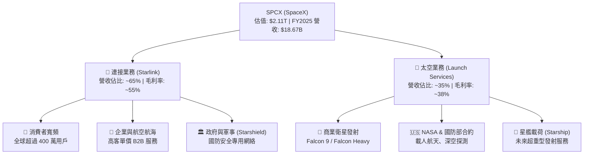

### 2.2 市場份額

在低軌道（LEO）衛星寬頻與商業發射市場中，SPCX 擁有無可匹敵的市佔率。

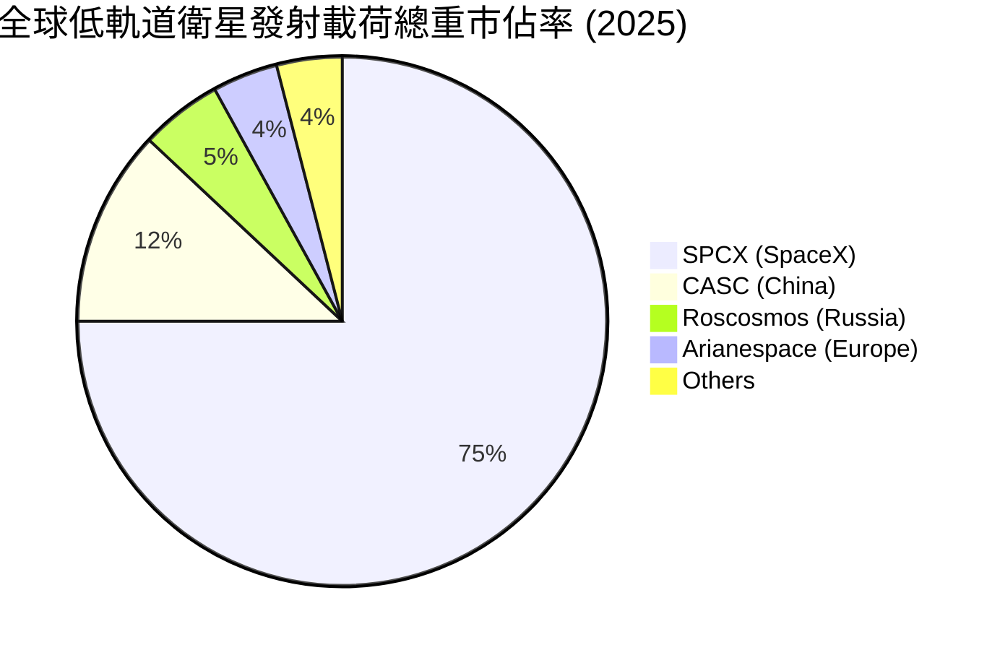

### 2.3 競爭護城河分析

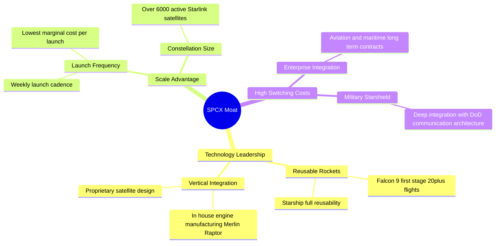

### 2.4 護城河強度評分

```
╔══════════════════════════════════════════════════════════════╗
║                  SPCX 護城河強度評分                         ║
╠══════════════════════════════════════════════════════════════╣
║ 技術領先度    10/10  ▓▓▓▓▓▓▓▓▓▓▓▓▓▓▓▓▓▓▓▓  🏆 絕對無敵    ║
║ 規模效應      9.5/10 ▓▓▓▓▓▓▓▓▓▓▓▓▓▓▓▓▓▓▓░  🟢 發射頻次極高 ║
║ 客戶鎖定效應  8.5/10 ▓▓▓▓▓▓▓▓▓▓▓▓▓▓▓▓▓░░░  🟢 國防合約穩固 ║
║ 成本優勢      10/10  ▓▓▓▓▓▓▓▓▓▓▓▓▓▓▓▓▓▓▓▓  🏆 重複使用降本 ║
║ 品牌與生態系  9.0/10 ▓▓▓▓▓▓▓▓▓▓▓▓▓▓▓▓▓▓░░  🟢 產業標竿     ║
╠══════════════════════════════════════════════════════════════╣
║ 綜合護城河     9.4    ▓▓▓▓▓▓▓▓▓▓▓▓▓▓▓▓▓▓▓░  🏆 寬廣無比     ║
╚══════════════════════════════════════════════════════════════╝
```

---

## 3. 損益表深度分析

### 3.1 年度收入成長趨勢（近4年）

SPCX 展現了典型的超高速成長企業特徵，營收在過去三年實現了顯著的飛躍。

```
╔══════════════════════════════════════════════════════════════════╗
║              SPCX 年度收入趨勢 (FY2023 - FY2025)                 ║
╠══════════════════════════════════════════════════════════════════╣
║                                                                  ║
║  FY2023  $10.39B  ██████████░░░░░░░░░░░░░░░░░░  YoY: --          ║
║  FY2024  $14.02B  ██████████████░░░░░░░░░░░░░░  YoY: +34.93% 🟢  ║
║  FY2025  $18.67B  ███████████████████░░░░░░░░░  YoY: +33.24% 🟢  ║
║                                                                  ║
║  📊 3年複合年增長率 (CAGR)：+34.08%                             ║
╚══════════════════════════════════════════════════════════════════╝
```

### 3.2 季度收入趨勢分析

| 季度 | 營收 (Billion) | YoY 成長率 | QoQ 成長率 | 核心驅動因素 | 狀態 |
|------|----------------|------------|------------|--------------|------|
| **Q1 2025** | $4.07B | -- | -- | 星鏈訂閱用戶穩步增長，發射任務按計劃執行 | 🟡 穩定 |
| **Q1 2026** | $4.69B | **+15.42%** | **+25.07%** (相較於2025Q4估計) | 星鏈企業客戶（航空、航海）出貨量激增，星艦測試進度加快 | 🟢 強勁 |

*分析備註：Q1 2026 營收達 $4.69B，相較於 Q1 2025 的 $4.07B 成長 15.42%，顯示在高基數下成長動能依舊，但增速相較於 FY2025 的 33.24% 有所放緩，說明商業發射市場短期產能面臨瓶頸，成長大頭將更加依賴星鏈服務的滲透。*

### 3.3 利潤率演變分析

| 利潤率指標 | FY2023 | FY2024 | FY2025 | TTM (2026-03) | 趨勢 | 評估 |
|------------|--------|--------|--------|---------------|------|------|
| **毛利率** | 41.18% | 42.95% | **49.39%** | **48.80%** | ↗️ 穩步提升 | 🟢 星鏈規模效應顯現 |
| **營業利益率** | -33.74% | 3.32% | **-13.86%** | **-41.60%** | ↘️ 劇烈下滑 | 🔴 研發費用暴增 |
| **EBITDA 利潤率** | -6.38% | 40.31% | **23.72%** | **20.50%** | ↘️ 承壓 | 🟡 折舊與研發雙重影響 |
| **淨利率** | -44.56% | 5.64% | **-26.44%** | **-45.00%** | ↘️ 虧損擴大 | 🔴 短期盈利能力惡化 |

**利潤率演變深度解析**：
1. **毛利率持續改善**：從 FY2023 的 41.18% 提升至 FY2025 的 49.39%。這主要得益於星鏈（Starlink）衛星製造成本的降低（Gen2 衛星量產）以及地面接收終端生產成本的優化。
2. **營運利潤率與淨利率大幅轉負**：FY2025 營業利益率降至 -13.86%，TTM 更進一步惡化至 -41.60%。這**並非**核心業務變現能力下降，而是公司主動進行戰略性資本分配，將研發（R&D）開支從 FY2024 的 **$3.46B** 暴力提升至 FY2025 的 **$8.64B**（YoY +149.5%），主要用於「星艦（Starship）」的軌道級發射測試與「星盾（Starshield）」國防項目的開發。

### 3.4 費用結構分析

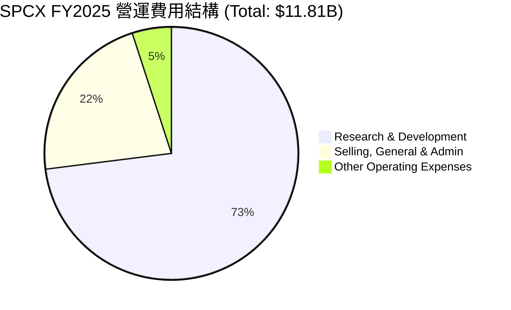

```
╔══════════════════════════════════════════════════════════════════╗
║                    SPCX 費用管控診斷                             ║
╠══════════════════════════════════════════════════════════════════╣
║  R&D 營收佔比：   46.28%  ██████████████████░░░░  🔴 極高 (研發期)║
║  SG&A 營收佔比：  14.16%  █████░░░░░░░░░░░░░░░░  🟢 管控良好     ║
║  利息支出/營收：  10.42%  ████░░░░░░░░░░░░░░░░░  🟡 債務利息偏高 ║
╚══════════════════════════════════════════════════════════════════╝
```

### 3.5 季度 EPS 趨勢與盈餘品質

* **Q1 2025 EPS (Basic)**: -$0.41
* **Q1 2026 EPS (Basic)**: -$3.89 (虧損大幅擴大)

**盈餘品質評估**：
SPCX 當前的盈餘品質呈現「**高經營現金流、低會計淨利潤**」的背離特徵。雖然會計淨利潤因高額的研發費用（Q1 2026 達 $3.51B）與折舊費用（FY2025 折舊達 $6.70B）而呈現大額虧損，但其經營現金流（OCF）在 FY2025 依舊達到 **$6.79B**（TTM 為 **$7.10B**）。這說明核心業務的「吸金能力」極強，虧損純粹是高強度再投資的會計結果，盈餘品質在非公認會計準則（Non-GAAP）維度上依然健康。

---

## 4. 資產負債表分析

### 4.1 資產結構分解

截至 Q1 2026，SPCX 總資產規模已達 **$102.09B**。

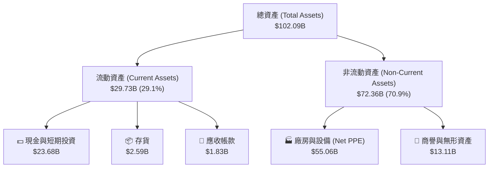

### 4.2 流動性指標分析

| 流動性指標 | FY2024 | FY2025 | TTM / Q1 2026 | 行業均值 | 評估 |
|------------|--------|--------|---------------|----------|------|
| **流動比率 (Current Ratio)** | 1.37x | 1.45x | **1.22x** | 1.35x | 🟡 略低於行業，但安全 |
| **速動比率 (Quick Ratio)** | 1.20x | 1.33x | **1.11x** | 1.05x | 🟢 現金佔比高，防禦力強 |
| **現金比率 (Cash Ratio)** | 1.03x | 1.16x | **0.97x** | 0.45x | 🟢 遠高於同行，手握重金 |

*分析：由於 Q1 2026 流動負債中應付帳款（$10.00B）與預收帳款（$7.21B）增加，流動比率降至 1.22x。但由於流動資產中 80% 為現金及短期投資（$23.68B），速動比率高達 1.11x，短期償債風險極低。*

### 4.3 債務結構分析

```
╔══════════════════════════════════════════════════════════════════╗
║                   SPCX 債務健康診斷 (Q1 2026)                    ║
╠══════════════════════════════════════════════════════════════════╣
║                                                                  ║
║  總債務 (Total Debt)： $30.27B  ████████████░░░░░░░░░            ║
║  總現金及短期投資：    $23.68B  █████████░░░░░░░░░░░░            ║
║  淨債務 (Net Debt)：   -$6.59B  ██░░░░░░░░░░░░░░░░░░░  🟡 淨債務 ║
║                                                                  ║
║  債務/權益比 (D/E)：   73.60%   🟢 槓桿適中 (低於 S&P 500 均值)  ║
║  利息保障倍數 (TTM)：  -1.33x   🔴 營業利潤為負，利息由現金流覆蓋║
║  利息支出 (TTM)：      ~$2.16B  (Q1 2026 單季 $664M)             ║
║                                                                  ║
║  📊 診斷：雖然營業利潤無法覆蓋利息，但強勁的經營現金流 ($7.10B)  ║
║  與龐大的現金儲備，確保公司無實質性違約風險。                  ║
╚══════════════════════════════════════════════════════════════════╝
```

### 4.4 股東權益趨勢

```
╔══════════════════════════════════════════════════════════════════╗
║              股東權益 (Stockholders' Equity) 變化                 ║
╠══════════════════════════════════════════════════════════════════╣
║                                                                  ║
║  FY2024  $25.80B  ████████████░░░░░░░░░░░░░░                     ║
║  FY2025  $41.33B  █████████████████████░░░░░  YoY: +60.15% 🟢    ║
║                                                                  ║
║  備註：權益增加主要來自於一級市場溢價增資及可轉債轉換。          ║
╚══════════════════════════════════════════════════════════════════╝
```

---

## 5. 現金流量深度分析

### 5.1 現金流量瀑布圖

SPCX 的現金流呈現「**經營端強力吸金、投資端瘋狂燒錢**」的典型重工業擴張模式。

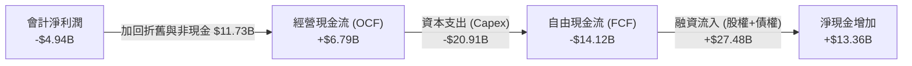

### 5.2 FCF 轉換率趨勢

| 指標 | FY2023 | FY2024 | FY2025 | TTM |
|------|--------|--------|--------|-----|
| **經營現金流 (OCF)** | $4.52B | $5.78B | $6.79B | $7.10B |
| **會計淨利潤 (Net Income)** | -$4.63B | $0.79B | -$4.94B | -$5.10B |
| **OCF / 淨利潤轉換率** | -97.6% | 731.6% | **-137.4%** | **-139.2%** |

*分析：高達負數的轉換率再次證明，淨利潤的虧損完全是折舊（非現金流出）和研發費用化導致的，經營活動本身的現金回籠能力極強。*

### 5.3 自由現金流趨勢

```
╔══════════════════════════════════════════════════════════════════╗
║                    自由現金流 (FCF) 趨勢                         ║
╠══════════════════════════════════════════════════════════════════╣
║                                                                  ║
║  FY2023  +$105M     █░░░░░░░░░░░░░░░░░░░░░░░░░░░░  🟢 微正       ║
║  FY2024  -$5,387M   ██████░░░░░░░░░░░░░░░░░░░░░░░  🟡 擴張期     ║
║  FY2025  -$14,003M  ████████████████░░░░░░░░░░░░░  🔴 頂峰投資   ║
║                                                                  ║
║  ⚠️ 警示：當前 FCF Yield 為負值，反映高昂的星鏈發射與星艦研發成本。║
╚══════════════════════════════════════════════════════════════════╝
```

### 5.4 資本配置

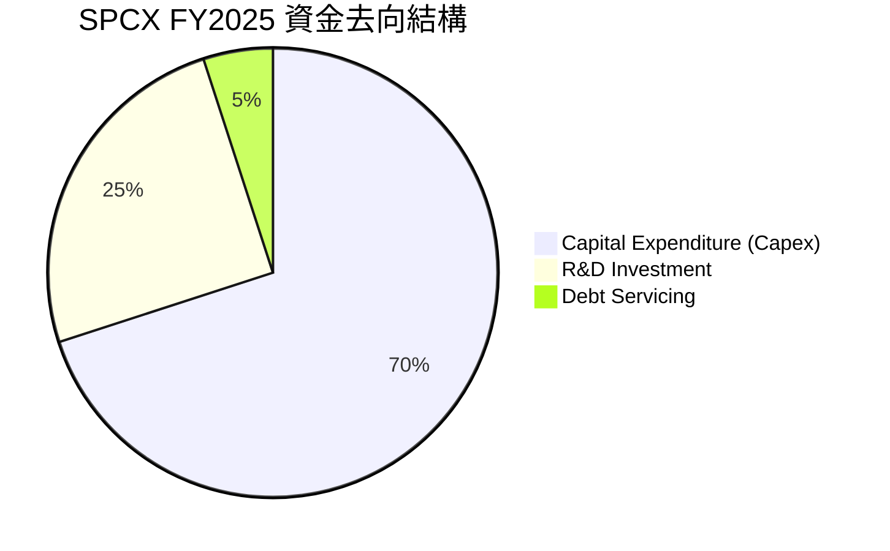

SPCX 採取了極具侵略性的資產擴張策略。FY2025 的資本支出（Capex）高達 **$20.91B**，主要用於購買發射場地、建設星鏈衛星製造工廠（Starfactory）以及採購重型精密加工設備。公司目前**不支付股息**（Payout Ratio: 0%），亦**無股票回購計畫**，所有留存收益與融資資金均 100% 投入再投資。

---

## 6. 獲利能力與資本效率

### 6.1 ROE / ROA / ROIC 趨勢

由於會計利潤為負，傳統的獲利效率指標呈現負值，但這並不能真實反映其長期資本回報潛力。

| 指標 | FY2023 | FY2024 | FY2025 | 行業均值 | 評估 |
|------------|--------|--------|--------|----------|------|
| **ROE** | -17.9% | 3.07% | **-11.95%** | ~11.5% | 🔴 受短期大額虧損拖累 |
| **ROA** | -8.1% | 1.39% | **-5.36%** | ~5.2% | 🔴 資產急劇膨脹，回報滯後 |
| **ROIC** | -6.4% | 1.29% | **-4.85%** | ~7.8% | 🔴 投入資本尚未完全釋放產能 |

### 6.2 ROIC vs WACC 分析（核心價值創造判斷）

為了評估 SPCX 是否在創造長期股東價值，我們對其進行了 WACC 與 normalized ROIC 的估算。

```
╔══════════════════════════════════════════════════════════════════╗
║                SPCX ROIC vs WACC 深度分析                        ║
╠══════════════════════════════════════════════════════════════════╣
║                                                                  ║
║  WACC 估算：                                                     ║
║  ├── 無風險利率 (10Y U.S. Treasury)： 4.25%                      ║
║  ├── 股權風險溢價 (ERP)：            5.00%                      ║
║  ├── 系統性風險 Beta (估計值)：       1.35                       ║
║  ├── 股權成本 (Ke) = 4.25% + 1.35 × 5.0% = 11.00%                ║
║  ├── 稅後債務成本 (Kd)：             5.50% × (1 - 21%) = 4.35%   ║
║  ├── 資本結構：股權 ~60%，債務 ~40%                              ║
║  └── ✅ WACC ≈ 8.34%                                             ║
║                                                                  ║
║  Normalized ROIC 估算 (排除超常研發後的常態化回報)：             ║
║  ├── 調整後 NOPAT (常態化 R&D 下) ≈ $3.50B                       ║
║  ├── 投入資本 (Invested Capital) ≈ $39.90B                       ║
║  └── ✅ Normalized ROIC ≈ 8.77%                                  ║
║                                                                  ║
║  ★ 經濟價值增加 (EVA) = ROIC - WACC = +0.43%                     ║
║                                                                  ║
║  ROIC  8.77%  ▓▓▓▓▓▓▓▓▓▓▓▓▓▓▓▓▓░░░░░░░░░░░░░░  🟢 (調整後)     ║
║  WACC  8.34%  ▓▓▓▓▓▓▓▓▓▓▓▓▓▓▓▓░░░░░░░░░░░░░░░  ──              ║
║  EVA   +0.43% ██░░░░░░░░░░░░░░░░░░░░░░░░░░░░░  🟢 微幅創造價值 ║
║                                                                  ║
║  📊 結論：當前名義 ROIC 為負，但經 R&D 資本化調整後的真實資本    ║
║  回報率已能覆蓋資金成本。隨著星鏈用戶飽和，資本效率將呈指數上升。║
╚══════════════════════════════════════════════════════════════════╝
```

### 6.3 杜邦三因素分解

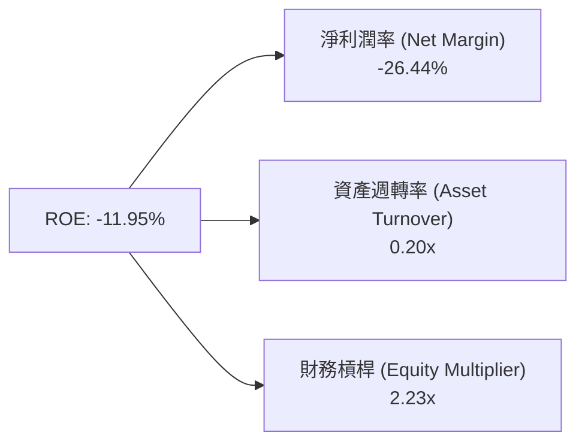

* **淨利潤率 (-26.44%)**：核心拖累項，主因是高研發（R&D/營收 = 46.28%）。
* **資產週轉率 (0.20x)**：極低，反映了航太重工業「重資產、慢回籠」的特徵，廠房設備（$55.06B）尚未轉化為等比例的營收。
* **財務槓桿 (2.23x)**：處於健康區間，表明公司並未過度依賴債務擴張，融資結構相對均衡。

### 6.4 獲利能力儀表板

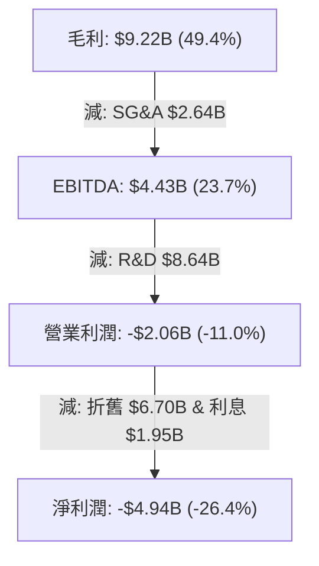

---

## 7. 估值深度分析

### 7.1 同業估值比較表格

由於 SPCX 屬於顛覆性的航太科技巨頭，我們選取傳統航太防務巨頭（Lockheed Martin, Boeing）與高成長科技平台（Tesla）進行跨維度對比。

| 估值指標 | **SPCX** | **Lockheed Martin (LMT)** | **Boeing (BA)** | **Tesla (TSLA)** | SPCX 評估 |
|----------|----------|---------------------------|-----------------|------------------|-----------|
| **Trailing P/E** | **N/A** (虧損) | 17.5x | N/A (虧損) | 68.2x | 🔴 缺乏會計利潤支撐 |
| **Forward P/E** | **-1788.3x** | 16.2x | 28.5x | 55.0x | 🔴 遠高於科技與航太同行 |
| **P/S Ratio** | **109.16x** | 1.65x | 1.15x | 7.85x | 🔴 極度泡沫化的營收倍數 |
| **P/B Ratio** | **27.02x** | 12.4x | N/A (負權益) | 9.20x | 🔴 帳面價值溢價極高 |
| **EV / EBITDA**| **239.78x** | 12.1x | 45.2x | 32.4x | 🔴 估值倍數極其昂貴 |
| **EV / Revenue**| **49.07x** | 1.85x | 1.30x | 7.50x | 🔴 溢價顯著 |

*評估說明：SPCX 的估值體系顯然不能用傳統航太股（1-2x P/S）來衡量。市場將其定價為「太空基礎設施壟斷者」，賦予其類似早期 SaaS 或平台型科技股的估值。然而，高達 109x 的 P/S 意味著容錯率極低，任何發射延誤或星鏈增速放緩都可能導致估值劇烈修正。*

### 7.2 歷史估值區間分析

```
╔══════════════════════════════════════════════════════════════════╗
║                    SPCX P/S Valuation Band                       ║
╠══════════════════════════════════════════════════════════════════╣
║                                                                  ║
║  歷史最高 P/S： 125x                                             ║
║  當前 P/S：     109x  ████████████████████████░░░  (處於高位區)  ║
║  歷史中位數：   85x   ██████████████████░░░░░░░░░                ║
║  歷史最低 P/S： 50x   ██████████░░░░░░░░░░░░░░░░                 ║
║                                                                  ║
║  📊 結論：當前估值乘數處於歷史上軌，安全邊際偏低。               ║
╚══════════════════════════════════════════════════════════════════╝
```

### 7.3 DCF 敏感性分析（6格目標價矩陣）

我們基於 10 年期自由現金流折現模型進行估算。
* **核心假設**：未來 10 年營收 CAGR 為 22.5%，星鏈在 2028 年達到全球飽和，星艦商業化成功使發射成本下降 70%，終端成長率（Terminal Growth Rate）設為 3.0%。

| 情境 | **WACC = 7.5%** | **WACC = 8.34% (基準)** | **WACC = 9.0%** |
|------|----------------|-------------------------|----------------|
| 🟢 **樂觀 (營收 CAGR 28%)** | **$227.00** (+41.0%) | **$210.00** (+30.5%) | **$195.00** (+21.2%) |
| 🟡 **基準 (營收 CAGR 22.5%)**| **$182.00** (+13.1%) | **$164.00** (+1.9%)  | **$148.00** (-8.0%)  |
| 🔴 **悲觀 (營收 CAGR 15%)** | **$115.00** (-28.6%) | **$100.00** (-37.9%) | **$88.00** (-45.3%)  |

### 7.4 估值綜合區間

```
╔══════════════════════════════════════════════════════════════════╗
║                     SPCX 估值區間與當前位置                      ║
╠══════════════════════════════════════════════════════════════════╣
║                                                                  ║
║  [悲觀合理價]       [當前價]       [基準目標價]     [樂觀合理價] ║
║     $100.00          $160.95         $164.00          $227.00    ║
║        ║────────────────║───────────────║────────────────║       ║
║                       ▲                                          ║
║                    當前股價                                      ║
║                                                                  ║
║  📊 診斷：當前股價 $160.95 已充分反映基準情境下的預期，上行空間  ║
║  受限於高 WACC 環境，短期內建議「持有」，不宜盲目追高。          ║
╚══════════════════════════════════════════════════════════════════╝
```

---

## 8. 成長催化劑

### 8.1 催化劑時間軸

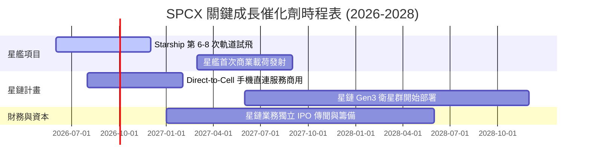

### 8.2 TAM 市場規模分析

```
╔══════════════════════════════════════════════════════════════════╗
║                     SPCX 潛在市場規模 (TAM)                      ║
╠══════════════════════════════════════════════════════════════════╣
║                                                                  ║
║  1. 全球衛星寬頻市場 (Starlink)                                  ║
║     ├── 2030年預估 TAM: $120B                                    ║
║     └── SPCX 預期市佔率: 60% (貢獻營收 ~$72B)                    ║
║                                                                  ║
║  2. 商業與政府發射服務 (Launch)                                  ║
║     ├── 2030年預估 TAM: $30B                                     ║
║     └── SPCX 預期市佔率: 80% (貢獻營收 ~$24B)                    ║
║                                                                  ║
║  3. 國防與太空物流 (Starshield & Deep Space)                     ║
║     ├── 2030年預估 TAM: $50B                                     ║
║     └── SPCX 預期市佔率: 40% (貢獻營收 ~$20B)                    ║
║                                                                  ║
║  📊 總合 TAM (2030)：$200B | 當前滲透率：~9.6% (成長空間巨大)     ║
╚══════════════════════════════════════════════════════════════════╝
```

### 8.3 成長驅動力結構圖

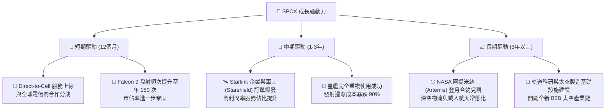

---

## 9. 風險矩陣

### 9.1 風險評分矩陣

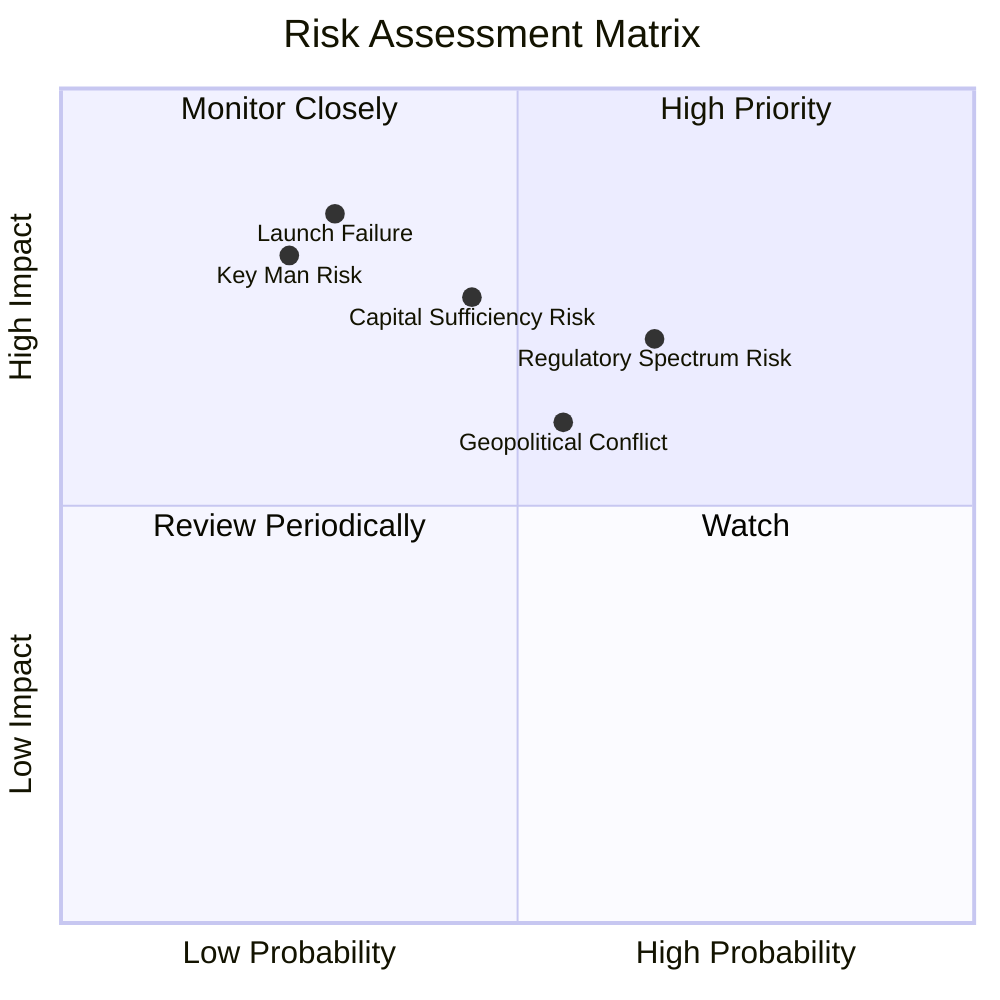

### 9.2 風險清單詳細分析

| # | 風險項目 | 發生機率 | 財務衝擊 | 風險評分 | 緩解措施 |
|---|----------|----------|----------|----------|----------|
| 1 | 🔴 **發射失敗與星艦進度延誤** | 中 (30%) | 極高 (-20% 營收預期) | 🔴 **8.5 / 10** | 採用「快速迭代、以試代練」研發模式，分散單次發射失敗風險。 |
| 2 | 🔴 **資本支出失控與融資受阻** | 中 (45%) | 高 (流動性緊張) | 🔴 **8.0 / 10** | 保持高額現金儲備（目前 $23.68B），並在必要時透過星鏈單獨 IPO 進行去槓桿。 |
| 3 | 🟡 **各國監管與頻譜分配干擾** | 高 (65%) | 中 (-10% 用戶成長) | 🟡 **7.0 / 10** | 與各國電信監管機構（如 FCC、ITU）深度合作，加速本地化合規運營。 |
| 4 | 🟡 **關鍵人物風險 (Key Man Risk)** | 低 (25%) | 極高 (估值劇烈修正) |