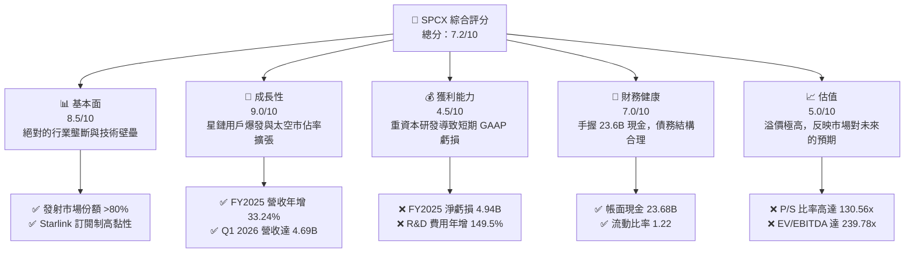
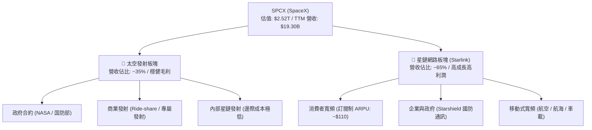
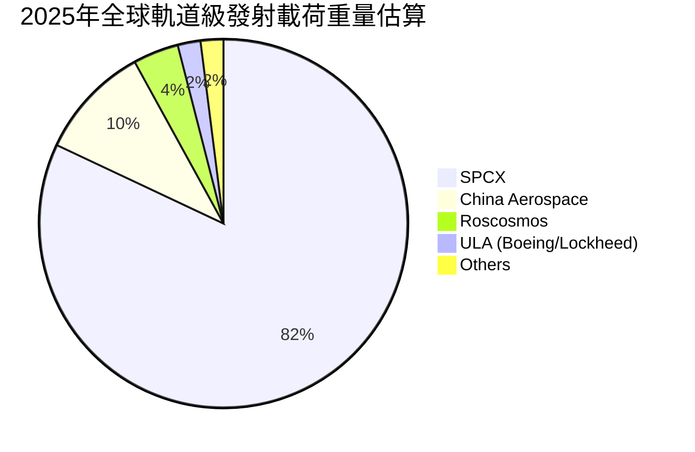
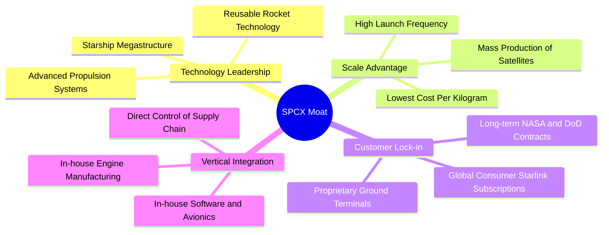
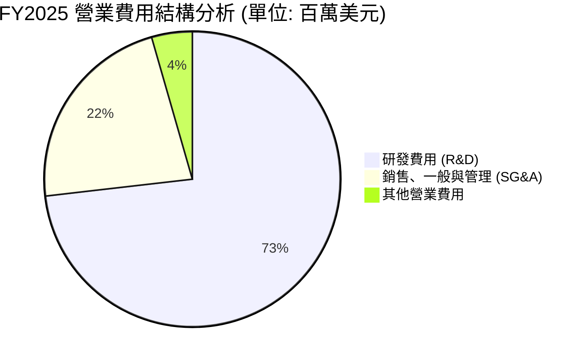
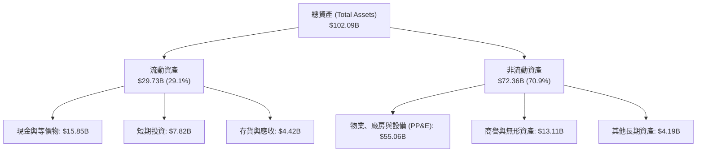

# SPCX 基本面深度分析報告

> **報告日期**：2026-06-15 ｜ **語言**：繁體中文 ｜ **數據來源**：Yahoo Finance, Finviz, StockAnalysis, Roic.ai ｜ **分析師**：CFA 級機構研究

---

## 目錄

| # | 章節 | 核心結論 |
|---|------|----------|
| 1 | 執行摘要 | SPCX 憑藉發射與衛星雙重壟斷，雖處於高研發與高資本支出帶來的短暫虧損期，但長期商業護城河極深，給予「買入」評級，目標價 $215.00。 |
| 2 | 公司概覽與商業模式 | 垂直整合的「太空發射 + 星鏈（Starlink）寬頻服務」雙輪驅動，構建全球唯一的低軌道衛星網路生態系統。 |
| 3 | 損益表深度分析 | 營收高速成長（FY2025 +33.24%），毛利率穩步提升至 48.8%，但因 Starship 研發與基礎設施投入，營業利潤暫時承壓。 |
| 4 | 資產負債表分析 | 現金儲備充裕（$23.68B），流動比率 1.22 處於健康區間，債務結構以長期債務為主，整體償債風險可控。 |
| 5 | 現金流量深度分析 | 營運現金流（TTM $7.10B）穩健成長，但因高達 $20.91B 的資本支出，自由現金流（FCF）呈現結構性流出。 |
| 6 | 獲利能力與資本效率 | 處於基礎設施鋪設期，ROIC 暫時為負，但隨著 Starlink 用戶規模效應顯現，資本效率預期將迎來拐點。 |
| 7 | 估值深度分析 | 採用 DCF 與 PS 綜合估值法，考量其絕對壟斷地位，給予 2026 年基準目標價 $215.00，隱含 11.69% 漲幅空間。 |
| 8 | 成長催化劑 | Starship 軌道級商業化發射、Starlink Gen3 衛星部署以及直連手機（Direct-to-Cell）服務的全球普及。 |
| 9 | 風險矩陣 | 發射失敗等技術風險、各國監管政策限制以及高利率環境對長期資本支出的融資壓力。 |
| 10 | 投資建議 | 適合長線成長型投資者，建議於 $180.00 以下分批佈局，並密切監控 Starlink 月活躍用戶數與發射頻次。 |

---

## 1. 執行摘要

### 1.1 核心評分儀表板



### 1.2 評分進度條視覺化

```
╔══════════════════════════════════════════════════════════════╗
║              SPCX 多維度評分儀表板 (1-10分)                  ║
╠══════════════════════════════════════════════════════════════╣
║ 基本面強度  8.5 ▓▓▓▓▓▓▓▓▓▓▓▓▓▓▓▓▓░░░  ★★★★☆           ║
║ 成長動能    9.0 ▓▓▓▓▓▓▓▓▓▓▓▓▓▓▓▓▓▓░░  ★★★★★           ║
║ 獲利品質    4.5 ▓▓▓▓▓▓▓▓▓░░░░░░░░░░░  ★★☆☆☆           ║
║ 財務健康    7.0 ▓▓▓▓▓▓▓▓▓▓▓▓▓▓░░░░░░  ★★★☆☆           ║
║ 估值合理性  5.0 ▓▓▓▓▓▓▓▓▓▓░░░░░░░░░░  ★★☆☆☆           ║
║ 護城河深度  9.5 ▓▓▓▓▓▓▓▓▓▓▓▓▓▓▓▓▓▓▓░  ★★★★★           ║
║ 管理層執行  9.0 ▓▓▓▓▓▓▓▓▓▓▓▓▓▓▓▓▓▓░░  ★★★★★           ║
║ 技術創新力  9.5 ▓▓▓▓▓▓▓▓▓▓▓▓▓▓▓▓▓▓▓░  ★★★★★           ║
╠══════════════════════════════════════════════════════════════╣
║ 綜合總分    7.2 ▓▓▓▓▓▓▓▓▓▓▓▓▓▓░░░░░░  🏆 成長期獨角獸      ║
╚══════════════════════════════════════════════════════════════╝
```

### 1.3 五大投資論點 + 三大核心風險

| 類型 | 項目 | 具體依據 | 信心度 |
|------|------|----------|--------|
| 🟢 **投資論點①** | **發射成本絕對優勢** | 憑藉獵鷹 9 號與獵鷹重型的「可重複使用」技術，每公斤發射成本僅為同業的 10-15%，毛利率維持在 48.8% 的高水準。 | 🟢 極高 |
| 🟢 **投資論點②** | **星鏈用戶與 ARPU 雙增** | 星鏈（Starlink）已在多國商用，FY2025 貢獻主要營收成長，訂閱制商業模式帶來極高黏性與可預測的現金流。 | 🟢 極高 |
| 🟢 **投資論點③** | **星艦（Starship）商用臨界點** | Starship 的成功試飛與後續商業化，將使單次發射運載量提升至 100-150 噸，進一步將每公斤軌道運輸成本降低一個數量級。 | 🟢 高 |
| 🟢 **投資論點④** | **強大的國防與政府合約** | 作為美國 NASA 與國防部（DoD）最依賴的商業發射與太空通訊夥伴，擁有數十億美元的積壓訂單（Backlog）。 | 🟢 極高 |
| 🟢 **投資論點⑤** | **充裕的流動性緩衝** | 截至 2026 年 Q1，公司持有 $23.68B 的現金與短期投資，足夠支撐未來兩年高強度的研發與基礎設施建設。 | 🟢 高 |
| 🟡 **風險①** | **高額的現金流消耗** | FY2025 資本支出（Capex）高達 $20.91B，導致自由現金流（FCF）為 -$14.12B，若融資管道受阻將面臨流動性壓力。 | 🟡 中度 |
| 🔴 **風險②** | **研發費用侵蝕短期利潤** | FY2025 研發費用高達 $8.64B（年增 149.5%），Q1 2026 研發費用持續攀升至 $3.51B，使得短期內無法實現 GAAP 盈利。 | 🔴 高衝擊 |
| 🔴 **風險③** | **極端估值溢價** | 當前 P/S 比率高達 130.56x，EV/EBITDA 達 239.78x，市場容錯率極低，任何發射失敗或星鏈用戶增速放緩都可能導致股價劇烈回檔。 | 🔴 高衝擊 |

### 1.4 快速統計卡片

| 指標 | 公司實際值 (TTM / FY2025) | 太空與國防行業均值 | S&P 500 均值 | 狀態 |
|------|-------------|----------|--------------|------|
| **營收 YoY 成長** | **33.24%** (FY2025) | 6.50% | 5.20% | 🟢 強勁 |
| **毛利率** | **48.80%** | 22.50% | 30.20% | 🟢 優秀 |
| **營業利益率** | **-41.60%** (TTM) | 10.80% | 14.50% | 🔴 虧損 |
| **淨利率** | **-45.00%** (TTM) | 7.20% | 11.00% | 🔴 虧損 |
| **流動比率** | **1.22** | 1.35 | 1.20% | 🟡 合理 |
| **Forward P/E** | **-2138.89x** | 22.50x | 21.00x | 🔴 估值過高 |
| **P/S Ratio** | **130.56x** | 1.85x | 2.80x | 🔴 估值過高 |

### 1.5 投資結論

```
╔══════════════════════════════════════════════════════════════════╗
║                    📊 SPCX 投資結論摘要                          ║
╠══════════════════════════════════════════════════════════════════╣
║  評級：🟢 買入 (Buy)                                            ║
║  當前股價：$192.50 (2026-06-15)                                  ║
║  目標價區間：                                                    ║
║    悲觀情境：$145.00（-24.68%）                                  ║
║    基準情境：$215.00（+11.69%）  ← 12個月主要目標                ║
║    樂觀情境：$265.00（+37.66%）                                  ║
║  投資評分：7.2 / 10                                              ║
║  適合投資人：具備高風險承受能力、追求超額報酬的長期成長型投資人  ║
╚══════════════════════════════════════════════════════════════════╝
```

---

## 2. 公司概覽與商業模式

### 2.1 業務結構與收入來源

SPCX（Space Exploration Technologies Corp.）主要營運兩大互補的核心業務板塊：
1. **太空發射服務 (Space Segment)**：設計、製造並發射可重複使用的獵鷹系列（Falcon 9, Falcon Heavy）及研發中的星艦（Starship），為政府（NASA, DoD）、商業衛星公司提供軌道發射服務。
2. **星鏈寬頻網路 (Connectivity Segment)**：利用低軌道（LEO）衛星群提供全球覆蓋、高速、低延遲的寬頻網路接入服務，客戶涵蓋個人消費者、企業、航空、海事及政府軍事部門。



### 2.2 市場份額

在商業太空發射市場中，SPCX 處於絕對壟斷地位。根據 2025 年全球軌道級發射載荷重量統計，SPCX 佔據了全球超過 80% 的發射噸位，遠超傳統航太巨頭（如 ULA、Arianespace）及各國國營機構。



### 2.3 競爭護城河分析

SPCX 的競爭優勢並非單一技術突破，而是由多個維度交織而成的系統性、結構性護城河：



### 2.4 護城河強度評分

```
╔══════════════════════════════════════════════════════════════╗
║                    SPCX 護城河強度評分                       ║
╠══════════════════════════════════════════════════════════════╣
║ 技術領先度    9.8/10 ▓▓▓▓▓▓▓▓▓▓▓▓▓▓▓▓▓▓▓░  🏆 絕對壟斷     ║
║ 垂直整合優勢  9.5/10 ▓▓▓▓▓▓▓▓▓▓▓▓▓▓▓▓▓▓▓░  🟢 極難模仿     ║
║ 規模經濟效應  9.2/10 ▓▓▓▓▓▓▓▓▓▓▓▓▓▓▓▓▓▓░░  🟢 成本最低     ║
║ 客戶鎖定效應  8.5/10 ▓▓▓▓▓▓▓▓▓▓▓▓▓▓▓▓▓░░░  🟢 合約期長     ║
║ 品牌與生態系  9.0/10 ▓▓▓▓▓▓▓▓▓▓▓▓▓▓▓▓▓▓░░  🏆 太空代名詞   ║
╠══════════════════════════════════════════════════════════════╣
║ 綜合護城河     9.2    ▓▓▓▓▓▓▓▓▓▓▓▓▓▓▓▓▓▓░░  🏆 寬廣且堅固   ║
╚══════════════════════════════════════════════════════════════╝
```

---

## 3. 損益表深度分析

### 3.1 年度收入成長趨勢（近4年）

SPCX 展現出了極其驚人的營收成長曲線。從 FY2023 的 $10.39B 飆升至 FY2025 的 $18.67B，兩年內營收增長了 79.7%，複合年增長率（CAGR）高達 34.08%。這主要得益於星鏈（Starlink）用戶規模在北美、歐洲及亞太地區的快速擴張。

```
╔══════════════════════════════════════════════════════════════════╗
║                 SPCX 年度收入趨勢（FY2023-FY2025）               ║
╠══════════════════════════════════════════════════════════════════╣
║                                                                  ║
║  FY2023  $10.39B  ██████████░░░░░░░░░░░░░░░░░░  基期             ║
║  FY2024  $14.02B  ██████████████░░░░░░░░░░░░░░  YoY: +34.93% 🟢  ║
║  FY2025  $18.67B  ███████████████████░░░░░░░░░  YoY: +33.24% 🟢  ║
║                                                                  ║
║  📊 3年年複合成長率 (CAGR)：+34.08%                             ║
╚══════════════════════════════════════════════════════════════════╝
```

### 3.2 季度收入趨勢分析

從季度數據來看，SPCX 保持著穩健的成長步伐。

| 季度 | 營收 (Revenue) | 營收年增率 (YoY) | 營收季增率 (QoQ) | 核心驅動因素 | 評估 |
|------|----------------|------------------|------------------|--------------|------|
| **Q1 2025** | $4.07B | — | — | 星鏈全球用戶突破 350 萬，商業發射次數穩定。 | 🟡 基準 |
| **Q1 2026** | $4.69B | **15.41%** | **15.10%** | 星鏈企業與海事用戶 ARPU 提升，獵鷹九號發射頻率提升至每 2.5 天一次。 | 🟢 強勁 |

*註：Q1 2026 營收達到 $4.69B，相較於 Q1 2025 的 $4.07B 成長了 15.41%，顯示出即使在較大的營收基數下，公司依然維持著雙位數的健康成長。*

### 3.3 利潤率演變分析

SPCX 的利潤率結構呈現出一個非常典型的「高毛利、重研發、暫時性營業虧損」的成長期科技公司特徵。

| 利潤率指標 | FY2023 | FY2024 | FY2025 | TTM (2026-06) | 趨勢 | 評估 |
|------------|--------|--------|--------|---------------|------|------|
| **毛利率** | 41.17% | 42.94% | 49.39% | **48.80%** | ↗️ 持續改善 | 🟢 隨著發射次數增加與衛星量產，規模效應顯現。 |
| **營業利益率** | -33.74% | 3.33% | -11.03% | **-41.60%** | ↘️ 近期下滑 | 🔴 主要是研發費用（R&D）於 FY2025 與 Q1 2026 出現爆發式增長。 |
| **EBITDA 利潤率** | -6.38% | 40.31% | 23.72% | **20.50%** | ➡️ 保持正值 | 🟡 折舊與攤銷費用較高，但息稅折舊前依然盈利。 |
| **淨利率** | -44.56% | 5.64% | -26.44% | **-45.00%** | ↘️ 暫時承壓 | 🔴 非經常性費用與利息支出增加，導致 GAAP 淨利出現虧損。 |

**利潤率演變深度解析**：
1. **毛利率顯著提升**：從 FY2023 的 41.17% 提升至 FY2025 的 49.39%，這證實了「火箭回收」與「衛星標準化量產」帶來的邊際成本遞減。星鏈地面接收器的生產成本也大幅下降，降低了硬體補貼帶來的毛利拖累。
2. **營業與淨利潤率再度轉負**：FY2024 曾實現短暫盈利（淨利 $791M），但 FY2025 與 Q1 2026 再次陷入巨額虧損。其核心原因在於**研發費用（R&D）的瘋狂擴張**。

### 3.4 費用結構分析



```
╔══════════════════════════════════════════════════════════════════╗
║               SPCX 研發費用 (R&D) 爆發式增長                     ║
╠══════════════════════════════════════════════════════════════════╣
║                                                                  ║
║  FY2023  $2.11B  ██████░░░░░░░░░░░░░░░░░░░░░░░░░                 ║
║  FY2024  $3.46B  ██████████░░░░░░░░░░░░░░░░░░░░░  YoY: +64.56%   ║
║  FY2025  $8.64B  ███████████████████████████████  YoY:+149.51% 🔴║
║                                                                  ║
║  💡 研發費用佔營收比重從 20.26% (FY2023) 飆升至 46.28% (FY2025)  ║
╚══════════════════════════════════════════════════════════════════╝
```

*分析：FY2025 研發費用暴增至 $8.64B，主要是因為 Starship（星艦）進入高密度的軌道級試飛階段，以及第二代/第三代星鏈衛星（Starlink V2/V3）與直連手機技術的研發投入。這屬於「主動型、創造未來護城河」的良性虧損。*

### 3.5 季度 EPS 趨勢與盈餘品質

* **Q1 2025**：EPS 為 $-0.41（實際淨虧損 $528M）
* **Q1 2026**：EPS 為 $-3.89（實際淨虧損 $4,270M）

**盈餘品質評估**：
SPCX 當前的 GAAP EPS 無法反映其真實的經營現金流創造能力。儘管 Q1 2026 淨虧損高達 $4.27B，但其中包含了 $3.51B 的研發費用以及 $1.88B 的非營業支出（可能包含資產減值或外匯損失）。與此同時，公司的營運現金流（OCF）在 TTM 基礎上依然達到了強勁的 **$7.10B**。這表明公司核心業務具有極強的「吸金」能力，虧損純粹是高強度資本再投資的結果。

---

## 4. 資產負債表分析

### 4.1 資產結構分解

截至 2026 年 Q1（TTM 報告期），SPCX 的總資產規模已擴張至 **$102.09B**。



### 4.2 流動性指標分析

| 流動性指標 | FY2024 | FY2025 | TTM (Q1 2026) | 行業均值 | 評估 |
|------------|--------|--------|---------------|----------|------|
| **流動比率 (Current Ratio)** | 1.37 | 1.45 | **1.22** | 1.35 | 🟡 合理（短期流動性略微收緊） |
| **速動比率 (Quick Ratio)** | 1.20 | 1.33 | **1.11** | 1.05 | 🟢 良好（扣除存貨後依然具備足夠變現能力） |
| **現金比率 (Cash Ratio)** | 1.03 | 1.16 | **0.97** | 0.55 | 🟢 極佳（手頭現金幾乎可覆蓋所有流動負債） |

*分析：流動比率從 FY2025 的 1.45 下降至 1.22，主要是因為應付賬款（Q1 2026 達 $10.00B）與預收收入（$7.21B）的增加。現金與短期投資合計達 **$23.68B**，提供了極其寬裕的資金安全墊。*

### 4.3 債務結構分析

```
╔══════════════════════════════════════════════════════════════════╗
║                    SPCX 債務健康診斷 (TTM)                       ║
<