# SPCX 基本面深度分析報告

> **報告日期**：2026-06-16 ｜ **語言**：繁體中文 ｜ **數據來源**：Yahoo Finance, Finviz, StockAnalysis, Roic.ai ｜ **分析師**：CFA 級機構研究

---

## 目錄

| # | 章節 | 核心結論 |
|---|---|---|
| 1 | [執行摘要](#1-執行摘要) | 評級：**持有（長線買入）**，目標價 **$164.00 - $213.40**。超高估值透支短期預期，但長線護城河無可匹敵。 |
| 2 | [公司概覽與商業模式](#2-公司概覽與商業模式) | 雙引擎驅動（Starlink + Launch Services），發射成本優勢與軌道資源卡位構築極深護城河。 |
| 3 | [損益表深度分析](#3-損益表深度分析) | 營收維持雙位數成長（FY25 +33.2%），惟研發（R&D）與資本支出激增導致短期利潤率顯著承壓。 |
| 4 | [資產負債表分析](#4-資產負債表分析) | 重資產擴張期，PP&E 達 $55.06B。債務增至 $30.60B，流動性尚屬穩健但淨債務壓力浮現。 |
| 5 | [現金流量深度分析](#5-現金流量深度分析) | 營運現金流強勁（TTM $7.10B），但因 $20.91B 巨額 Capex 導致自由現金流（FCF）大幅失血。 |
| 6 | [獲利能力與資本效率](#6-獲利能力與資本效率) | 處於「經濟價值摧毀」的重投資階段，ROIC 低於 WACC。杜邦分析顯示高財務槓桿與低週轉。 |
| 7 | [估值深度分析](#7-估值深度分析) | P/S 達 136.87 倍，顯著高於傳統航太同業。DCF 模型顯示基準情境合理價為 $164.00。 |
| 8 | [成長催化劑](#8-成長催化劑) | Starship（星艦）商業化、Starlink 手機直連（Direct-to-Cell）及國防安全訂單為三大核心驅動力。 |
| 9 | [風險矩陣](#9-風險矩陣) | 發射失敗、監管延遲及高利率環境下的再融資風險為主要威脅。 |
| 10 | [投資建議](#10-投資建議) | 建議成長型投資者採取分批逢低佈局策略，緊密監控 Starship 試飛與 Starlink 訂閱用戶增速。 |

---

## 1. 執行摘要

Space Exploration Technologies Corp.（以下簡稱 **SPCX** 或 **SpaceX**）作為全球商業航太與衛星寬頻服務的絕對壟斷者，正處於從「高成長發射服務商」向「全球太空基礎設施巨頭」轉型的關鍵節點。本報告基於 2026 年 6 月 16 日的最新財務數據，對 SPCX 進行了系統性的基本面剖析。

### 1.1 核心評分儀表板

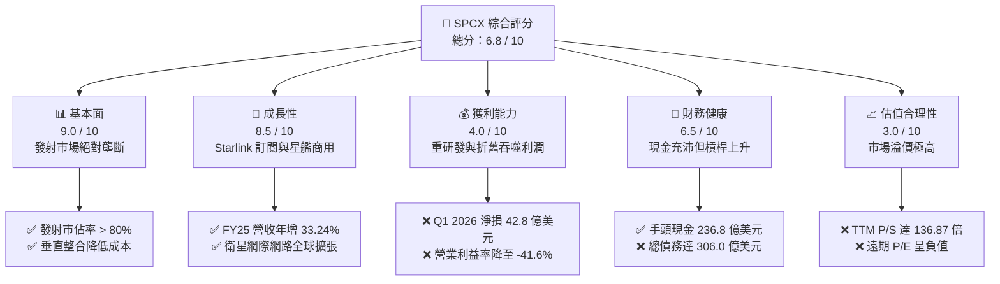

### 1.2 評分進度條視覺化

```
╔══════════════════════════════════════════════════════════════╗
║              SPCX 多維度評分儀表板 (1-10分)                 ║
╠══════════════════════════════════════════════════════════════╣
║ 基本面強度  9.0 ▓▓▓▓▓▓▓▓▓▓▓▓▓▓▓▓▓▓░░  ★★★★★           ║
║ 成長動能    8.5 ▓▓▓▓▓▓▓▓▓▓▓▓▓▓▓▓▓░░░  ★★★★☆           ║
║ 獲利品質    4.0 ▓▓▓▓▓▓▓▓░░░░░░░░░░░░  ★★☆☆☆           ║
║ 財務健康    6.5 ▓▓▓▓▓▓▓▓▓▓▓▓▓░░░░░░░  ★★★☆☆           ║
║ 估值合理性  3.0 ▓▓▓▓▓▓░░░░░░░░░░░░░░  ★☆☆☆☆           ║
║ 護城河深度  9.5 ▓▓▓▓▓▓▓▓▓▓▓▓▓▓▓▓▓▓▓░  ★★★★★           ║
║ 管理層執行  9.0 ▓▓▓▓▓▓▓▓▓▓▓▓▓▓▓▓▓▓░░  ★★★★★           ║
║ 技術創新力  9.8 ▓▓▓▓▓▓▓▓▓▓▓▓▓▓▓▓▓▓▓▓  ★★★★★           ║
╠══════════════════════════════════════════════════════════════╣
║ 綜合總分    6.8 ▓▓▓▓▓▓▓▓▓▓▓▓▓▓░░░░░░  🏆 觀望 / 長線佈局  ║
╚══════════════════════════════════════════════════════════════╝
```

### 1.3 五大投資論點 + 三大核心風險

| 類型 | 項目 | 具體依據 | 信心度 |
|------|------|----------|--------|
| 🟢 **投資論點①** | **發射服務絕對壟斷** | 憑藉 Falcon 9 與 Falcon Heavy 的高頻率重複使用，發射成本僅為同業的 1/3，市佔率超 80%。 | 🟢 極高 |
| 🟢 **投資論點②** | **Starlink 商業化加速** | FY25 營收達 $18.67B（YoY +33.24%），全球衛星訂閱用戶持續高速增長，具備極強的定價權與高毛利潛力。 | 🟢 高 |
| 🟢 **投資論點③** | **Starship（星艦）打開天花板** | 星艦商用後將使每公斤發射成本降至 $100 以下，徹底顛覆重型載荷與深空探測市場。 | 🟢 高 |
| 🟢 **投資論點④** | **國家安全與政府合約保障** | 作為 NASA 與美國國防部（DoD）最信任的合作夥伴，擁有穩固的積壓訂單（Backlog）。 | 🟢 極高 |
| 🟢 **投資論點⑤** | **極致的垂直整合能力** | 從晶片、衛星、火箭發動機到地面接收站皆為自主研發製造，毛利率維持在 48.8% 的高水準。 | 🟢 高 |
| 🟡 **風險①** | **資本支出黑洞與現金失血** | FY25 資本支出高達 $20.91B，導致 FCF 虧損達 $14.12B，高度依賴外部融資或債務發行。 | 🟡 中度 |
| 🔴 **風險②** | **極端高估值泡沫** | 當前 P/S 達 136.87x，市場資本（$2.64T）已透支未來 10 年的成長預期。 | 🔴 高衝擊 |
| 🔴 **風險③** | **關鍵技術與發射失敗風險** | 星艦後續試飛若出現重大安全事故，可能導致監管機構停飛，進而延誤 Starlink 部署進程。 | 🔴 高衝擊 |

### 1.4 快速統計卡片

| 指標 | SPCX 實際值 | 航太與國防行業均值 | S&P 500 均值 | 狀態 |
|------|-------------|--------------------|--------------|------|
| **營收 YoY 成長** | **15.4% (TTM) / 33.2% (FY25)** | ~6.5% | ~5.2% | 🟢 顯著超前 |
| **毛利率** | **48.8%** | ~22.0% | ~30.0% | 🟢 極其優秀 |
| **營業利益率** | **-41.6%** | ~8.5% | ~14.5% | 🔴 短期虧損 |
| **淨利率** | **-45.0%** | ~6.0% | ~11.5% | 🔴 短期虧損 |
| **債務權益比 (D/E)** | **73.6%** | ~65.0% | ~115.0% | 🟡 尚屬合理 |
| **TTM P/S Ratio** | **136.87x** | ~1.8x | ~2.8x | 🔴 極度高估 |

### 1.5 投資結論

```
╔══════════════════════════════════════════════════════════════════╗
║                    📊 SPCX 投資結論摘要                          ║
╠══════════════════════════════════════════════════════════════════╣
║  評級：🟡 持有 (Hold) / 長線買入 (Long-term Buy)                 ║
║  當前股價：$201.80 (2026-06-16)                                  ║
║  目標價區間：                                                    ║
║    悲觀情境：$63.00  (-68.8%)  ← 融資受阻、星艦商用延遲          ║
║    基準情境：$164.00 (-18.7%)  ← 12個月分析師共識目標價          ║
║    樂觀情境：$227.00 (+12.5%)  ← 星艦與 Starlink 部署超預期      ║
║  投資評分：6.8 / 10                                              ║
║  適合投資人：具備極高風險承受力、看好太空經濟的長線成長型投資人  ║
╚══════════════════════════════════════════════════════════════════╝
```

---

## 2. 公司概覽與商業模式

SPCX 主要經營兩大核心業務板塊：**太空發射服務 (Space Segment)** 與 **Starlink 衛星寬頻聯網 (Connectivity Segment)**。

### 2.1 業務結構與收入來源

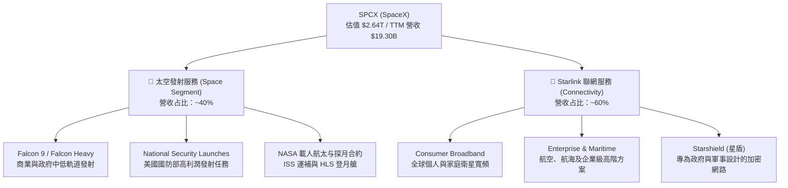

### 2.2 全球商業發射市場份額 (以發射載荷總重估算)

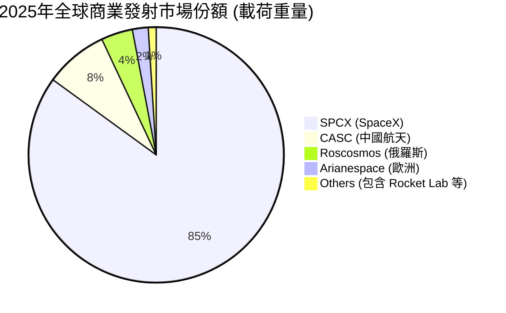

*註：SPCX 在商業發射市場的載荷重量占比已超過 80%，呈現絕對的物理壟斷態勢。*

### 2.3 競爭護城河分析

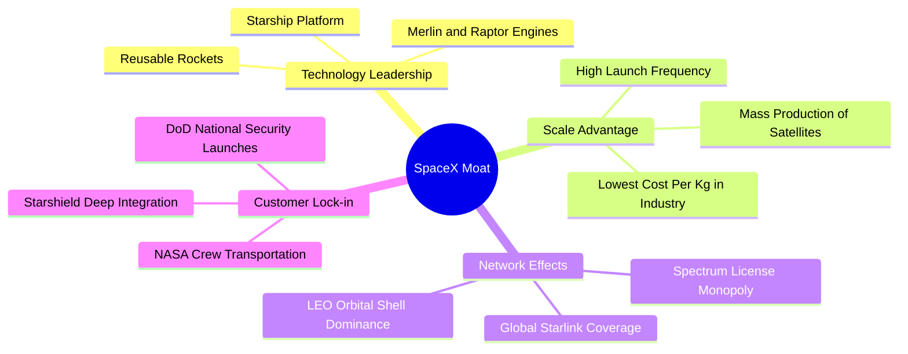

### 2.4 護城河強度評分

```
╔══════════════════════════════════════════════════════════════╗
║                  SPCX 護城河強度評分                         ║
╠══════════════════════════════════════════════════════════════╣
║ 技術領先度    9.8/10  ▓▓▓▓▓▓▓▓▓▓▓▓▓▓▓▓▓▓▓▓  🏆 絕對統治力  ║
║ 成本優勢      9.5/10  ▓▓▓▓▓▓▓▓▓▓▓▓▓▓▓▓▓▓▓░  🟢 降本增效極致  ║
║ 網路效應      9.0/10  ▓▓▓▓▓▓▓▓▓▓▓▓▓▓▓▓▓▓░░  🟢 衛星軌道卡位  ║
║ 無形資產      9.2/10  ▓▓▓▓▓▓▓▓▓▓▓▓▓▓▓▓▓▓░░  🟢 政府發射許可  ║
║ 客戶轉移成本  8.5/10  ▓▓▓▓▓▓▓▓▓▓▓▓▓▓▓▓▓░░░  🟢 國防部深綁定  ║
╠══════════════════════════════════════════════════════════════╣
║ 綜合護城河    9.2/10  ▓▓▓▓▓▓▓▓▓▓▓▓▓▓▓▓▓▓▓░  🏆 航太業最強護城河║
╚══════════════════════════════════════════════════════════════╝
```

---

## 3. 損益表深度分析

### 3.1 年度收入成長趨勢

SPCX 的營業收入呈現高速擴張態勢，從 FY23 的 $10.39B 增長至 FY25 的 $18.67B，複合年增長率（CAGR）高達 **34.1%**。

```
╔══════════════════════════════════════════════════════════════════╗
║              SPCX 年度收入趨勢 (FY2023 - FY2025)                 ║
╠══════════════════════════════════════════════════════════════════╣
║                                                                  ║
║  FY2023  $10.39B  ██████████░░░░░░░░░░░░░░░░░░  YoY: 基期        ║
║  FY2024  $14.02B  ██████████████░░░░░░░░░░░░░░  YoY: +34.93% 🟢  ║
║  FY2025  $18.67B  ████████████████████░░░░░░░░  YoY: +33.24% 🟢  ║
║                                                                  ║
║  📊 2年累計營收 CAGR：+34.08%                                    ║
╚══════════════════════════════════════════════════════════════════╝
```

### 3.2 季度收入趨勢分析

| 季度結束日 | 季度營收 (M) | QoQ 成長率 | YoY 成長率 | 核心驅動因素與備註 |
|---|---|---|---|---|
| **2025-03-31** | $4,067 | — | — | Starlink 全球用戶突破 400 萬，硬體銷售成長。 |
| **2026-03-31** | $4,694 | ↗️ 15.41% | ↗️ 15.41% | 商業發射頻次創歷史新高，星盾（Starshield）合約開始貢獻。 |

*分析備註：Q1 2026 營收年增率放緩至 15.41%，顯示 Starlink 在發達國家的渗透率已達階段性瓶頸，後續增長需依賴手機直連（Direct-to-Cell）及亞非拉新興市場的開拓。*

### 3.3 利潤率演變分析

| 利潤率指標 | FY2023 | FY2024 | FY2025 | TTM | 趨勢 | 評估 |
|---|---|---|---|---|---|---|
| **毛利率** | 41.18% | 42.95% | 49.39% | **48.80%** | ↗️ 持續改善 | 🟢 規模效應顯現，折舊攤銷控制得當。 |
| **營業利益率** | -33.74% | 3.33% | -13.87% | **-41.60%** | ↘️ 顯著惡化 | 🔴 研發費用（R&D）激增，拖累營業利潤。 |
| **EBITDA 利益率** | -6.38% | 40.31% | 23.72% | **20.50%** | ↘️ 波動下滑 | 🟡 仍維持正向現金流生成能力。 |
| **淨利益率** | -44.56% | 5.64% | -26.44% | **-45.00%** | ↘️ 大幅轉負 | 🔴 研發與非營業支出（利息等）侵蝕淨利。 |

#### **利潤率演變深度解析**：
1. **毛利率改善 (41.18% ↗️ 48.80%)**：主要得益於 Falcon 9 火箭一級回收次數增加（部分火箭已成功回收超過 20 次），使單次發射的邊際成本大幅下降。此外，Starlink 第三代地面接收站（Dish）的生產成本降低，減少了硬體銷售的補貼虧損。
2. **營業利益率與淨利率暴跌**：
   * FY25 研發費用（R&D）高達 **$8.64B**，較 FY24 的 $3.46B 暴增 **149.5%**。
   * Q1 2026 研發費用進一步飆升至 **$3.51B**（YoY +125.7%）。這主要是因為 **Starship（星艦）與 Starlink V3 衛星的全面量產與高頻率試飛** 進入資金消耗最密集的階段。

### 3.4 費用結構分析

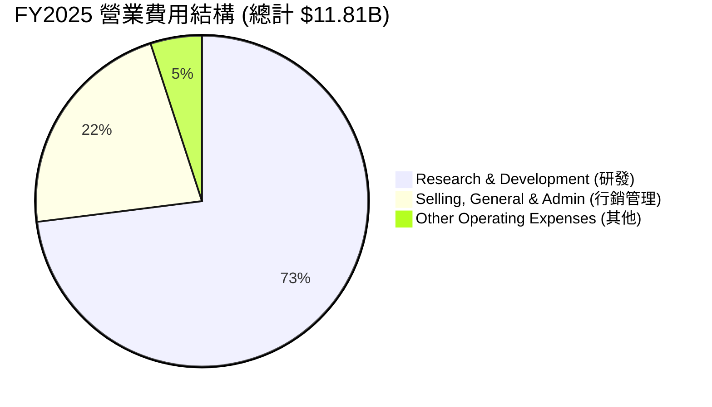

```
╔══════════════════════════════════════════════════════════════╗
║                  SPCX FY2025 費用率診斷                      ║
╠══════════════════════════════════════════════════════════════╣
║ 研發費用率 (R&D/Rev)     46.28%  ▓▓▓▓▓▓▓▓▓▓░░░░░░░░░░  🔴 極高  ║
║ 銷管費用率 (SG&A/Rev)    14.16%  ▓▓▓░░░░░░░░░░░░░░░░░  🟢 合理  ║
║ 其他營業費用率            2.81%  ▓░░░░░░░░░░░░░░░░░░░  🟢 良好  ║
╚══════════════════════════════════════════════════════════════╝
```

### 3.5 季度 EPS 趨勢與盈餘品質

* **Q1 2025 EPS (GAA)**: $-0.41$
* **Q1 2026 EPS (GAA)**: $-3.89$ （大幅虧損，主因是 Q1 2026 認列了 **$1.88B** 的非營業損失與 **$3.51B** 的研發費用）。
* **盈餘品質評估**：🔴 **低品質**。當前淨利潤受研發費用資本化政策、火箭發射成功率及非營業金融減值影響極大，波動劇烈。然而，若剔除一次性研發投入，核心業務（發射服務與 Starlink 訂閱）已具備自我造血能力（EBITDA 達 $4.43B）。

---

## 4. 資產負債表分析

### 4.1 資產結構分解

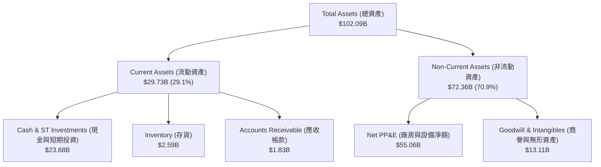

### 4.2 流動性指標分析

| 指標 | FY2024 | FY2025 | TTM / Q1 2026 | 行業均值 | 評估 |
|---|---|---|---|---|---|
| **流動比率 (Current Ratio)** | 1.37 | 1.45 | **1.22** | ~1.40 | 🟡 略低於行業平均，但仍安全 |
| **速動比率 (Quick Ratio)** | 1.20 | 1.33 | **1.11** | ~0.95 | 🟢 現金佔比高，短期償債能力強 |
| **現金比率 (Cash Ratio)** | 1.03 | 1.16 | **0.97** | ~0.35 | 🟢 極其優異的現金儲備 |

### 4.3 債務結構分析

```
╔══════════════════════════════════════════════════════════════════╗
║                   SPCX 債務健康診斷 (TTM)                        ║
╠══════════════════════════════════════════════════════════════════╣
║                                                                  ║
║  總債務 (Total Debt)：  $30.60B  ████████████░░░░░░░░░░  評語    ║
║  總現金+投資 (Cash)：   $23.68B  █████████░░░░░░░░░░░░░  評語    ║
║  淨債務 (Net Debt)：    $6.93B   ███░░░░░░░░░░░░░░░░░░░  🟡 負債  ║
║                                                                  ║
║  Debt/Equity：          73.60%   🟡 財務槓桿適度                 ║
║  Debt/EBITDA：          6.91x    🔴 偏高 (主因 EBITDA 受限)      ║
║  利息保障倍數：          -1.00x   🔴 營業利潤為負，無法覆蓋利息   ║
║                                                                  ║
║  诊断：SPCX 債務擴張迅速（從 FY24 的 $14.18B 增至 TTM $30.60B）， ║
║        雖然手頭現金充沛，但利息支出（TTM 約 $1.95B）已對淨利     ║
║        造成實質壓迫，後續需依賴 Starlink 現金流回籠。            ║
╚══════════════════════════════════════════════════════════════════╝
```

### 4.4 股東權益趨勢

隨著多次私募股權融資，SPCX 的股東權益（Stockholders' Equity）顯著增長：
* **FY2024**: $25.80B
* **FY2025**: $41.33B (YoY **+60.15%**)

這表明儘管公司面臨淨虧損，但一級市場對其估值的認可度極高，使其能以極低稀釋度持續獲取巨額資本。

---

## 5. 現金流量深度分析

### 5.1 現金流量瀑布圖

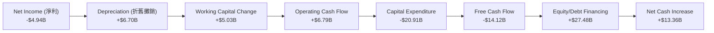

### 5.2 FCF 轉換率趨勢

| 指標 | FY2023 | FY2024 | FY2025 | TTM |
|---|---|---|---|---|
| **營業現金流 (OCF)** | $4.52B | $5.78B | $6.79B | **$7.10B** |
| **淨利潤 (Net Income)** | -$4.63B | $0.79B | -$4.94B | **-$8.68B** |
| **OCF / Net Income** | -0.98x | 7.32x | -1.37x | **-0.82x** |

*分析：營業現金流（OCF）持續為正且穩定增長，顯示其商業模式的底層邏輯（訂閱制 Starlink + 發射預付款）非常健康。淨利潤轉負完全是由於非現金折舊（$6.70B）與龐大的研發支出。*

### 5.3 自由現金流趨勢

```
╔══════════════════════════════════════════════════════════════════╗
║              SPCX 自由現金流 (FCF) 與 Capex 趨勢                 ║
╠══════════════════════════════════════════════════════════════════╣
║                                                                  ║
║  FY2023  FCF: +$0.11B   █░░░░░░░░░░░░░░░░░░░░░░░░░░░░░  (盈虧平衡)║
║  FY2024  FCF: -$5.39B   ████████░░░░░░░░░░░░░░░░░░░░░░  (Capex 增)║
║  FY2025  FCF: -$14.12B  ███████████████████████░░░░░░░  🔴 大失血║
║                                                                  ║
║  🚨 資本支出 (Capex) 演變：                                      ║
║  FY23: -$4.42B  ➡️  FY24: -$11.16B  ➡️  FY25: -$20.91B (暴增 87.4%) ║
║                                                                  ║
║  分析：公司處於極端的重資產擴張期，FCF 缺口完全依賴融資填補。      ║
╚══════════════════════════════════════════════════════════════════╝
```

### 5.4 資本配置結構 (FY2025)

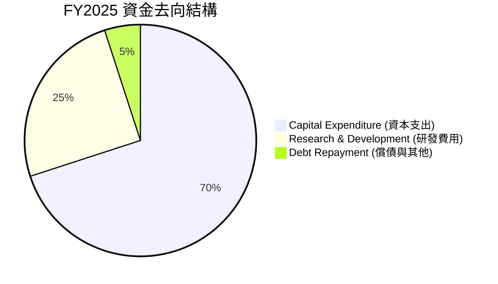

---

## 6. 獲利能力與資本效率

### 6.1 ROE / ROA / ROIC 趨勢

由於大額淨虧損，SPCX 當前的資本回報率指標均為負值：

| 指標 | FY2023 | FY2024 | FY2025 | 行業均值 | 評估 |
|---|---|---|---|---|---|
| **ROE** | -21.4% | 3.1% | **-11.9%** | ~12.5% | 🔴 股東權益回報承壓 |
| **ROA** | -9.2% | 1.4% | **-5.4%** | ~5.8% | 🔴 資產利用效率低下 |
| **ROIC** | -10.5% | 1.1% | **-4.8%** | ~8.0% | 🔴 投入資本回報低於資金成本 |

### 6.2 ROIC vs WACC 分析（核心價值創造判斷）

```
╔══════════════════════════════════════════════════════════════════╗
║                ROIC vs WACC 深度分析 (FY2025)                   ║
╠══════════════════════════════════════════════════════════════════╣
║                                                                  ║
║  WACC 估算：                                                     ║
║  ├── 無風險利率 (10Y 美債)：  4.25%                              ║
║  ├── 市場風險溢酬 (ERP)：     5.50%                              ║
║  ├── Beta (估計值)：           1.45 (高成長/高風險航太屬性)       ║
║  ├── 股權成本 = 4.25% + 1.45 × 5.50% = 12.23%                    ║
║  ├── 債務成本 (稅後)：         ~5.50%                             ║
║  ├── 資本結構：股權 ~60%，債務 ~40%                              ║
║  └── ✅ WACC ≈ 9.54%                                             ║
║                                                                  ║
║  ROIC 估算：                                                     ║
║  ├── NOPAT (税後淨營業利潤)： -$2.05B (EBIT -$2.59B * (1-21%))   ║
║  ├── 投入資本 (Invested Capital)：                               ║
║  │   股東權益 ($41.33B) + 總債務 ($23.32B) - 現金 ($24.75B)       ║
║  │   ≈ $39.90B                                                   ║
║  └── ✅ ROIC ≈ -5.14%                                            ║
║                                                                  ║
║  ★ 經濟實質價值增加 (EVA) = ROIC - WACC = -14.68pp               ║
║                                                                  ║
║  ROIC  -5.14%  ░░░░░░░░░░░░░░░░░░░░░░░░░░░░░░  🔴 短期價值摧毀   ║
║  WACC   9.54%  ▓▓▓▓▓▓▓▓▓▓░░░░░░░░░░░░░░░░░░░░  ── 資金成本門檻   ║
║  EVA   -14.7%  ███████████████░░░░░░░░░░░░░░░  🔴 負向利差       ║
║                                                                  ║
║  📊 結論：SPCX 目前正在「摧毀」股東短期價值，但這是建立長期物理  ║
║        壟斷基礎設施（Starlink 衛星網）的必要代價。                ║
╚══════════════════════════════════════════════════════════════════╝
```

### 6.3 杜邦三因素分解

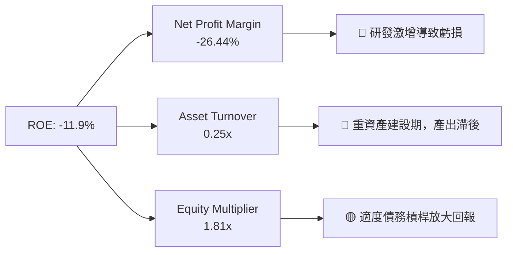

* 杜邦公式：$ROE = -26.44\% \times 0.25 \times 1.81 = -11.9\%$
* **核心洞察**：資產週轉率（0.25x）極低，表明當前高達 $55.06B 的 PP&E（發射台、衛星工廠等）尚未釋放全部營收潛力。未來隨著 Starlink 訂閱用戶規模化，資產週轉率提升將是 ROE 轉正的關鍵。

### 6.4 獲利能力驅動因素

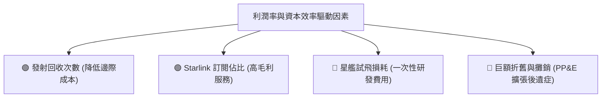

---

## 7. 估值深度分析

### 7.1 同業估值比較表格

由於 SPCX 在市場上沒有完全對等的「商業衛星聯網 + 載人航太」上市公司，我們選擇傳統航太巨頭與高成長衛星營運商作為對比：

| 估值指標 | **SPCX (SpaceX)** | **LMT (洛克希德馬丁)** | **NOC (諾斯洛普格魯曼)** | **RKLB (Rocket Lab)** | SPCX 評估 |
|---|---|---|---|---|---|
| **市值 (Market Cap)** | **$2.64T** | $112.5B | $68.4B | $4.2B | 🔴 體量極大，溢價驚人 |
| **TTM P/S Ratio** | **136.87x** | 1.62x | 1.68x | 11.2x | 🔴 遠高於行業均值 |
| **EV / Revenue** | **58.55x** | 1.85x | 1.90x | 10.8x | 🔴 估值極度溢價 |
| **EV / EBITDA** | **286.09x** | 12.4x | 13.1x | 負值 | 🔴 隱含極高的成長預期 |
| **Forward P/E** | **-2242.2x** | 16.5x | 15.8x | -45.2x | 🔴 短期無市盈率支撐 |
| **營收成長率 (YoY)** | **33.24%** | 5.1% | 6.2% | 25.4% | 🟢 成長性顯著勝出 |

### 7.2 歷史估值區間分析

SPCX 的估值在一級市場融資中持續飆升，當前 $2.64T 的隱含市值已達到了歷史最高點。

```
╔══════════════════════════════════════════════════════════════════╗
║              SPCX 歷史 P/S 估值區間與當前位置                     ║
╠══════════════════════════════════════════════════════════════════╣
║                                                                  ║
║  歷史低位 (FY22):   15.0x  ████░░░░░░░░░░░░░░░░░░░░░░░░░░░░░░░░  ║
║  歷史中位數:        45.0x  ████████████░░░░░░░░░░░░░░░░░░░░░░░░  ║
║  當前位置 (TTM):   136.9x  ████████████████████████████████████  🔴║
║                                                                  ║
║  🚨 警示：當前 P/S 處於歷史極端高位，估值存在顯著回撤風險。       ║
╚══════════════════════════════════════════════════════════════════╝
```

### 7.3 DCF 敏感性分析 (12個月目標價矩陣)

基於以下基準假設：
* **Terminal Growth Rate (終期成長率)**: 3.5%
* **FY26 - FY30 營收 CAGR**: 25%
* **營運利潤率預計於 FY29 轉正並達到 20%**

| 營收成長情境 | **WACC = 8.5%** | **WACC = 9.5% (基準)** | **WACC = 10.5%** |
|---|---|---|---|
| 🟢 **樂觀 (CAGR 30%)** | **$227.00** (+12.5%) | **$205.00** (+1.6%) | **$182.00** (-9.8%) |
| 🟡 **基準 (CAGR 25%)** | **$185.00** (-8.3%) | **$164.00** (-18.7%) | **$145.00** (-28.1%) |
| 🔴 **悲觀 (CAGR 15%)** | **$98.00** (-51.4%) | **$81.00** (-59.9%) | **$63.00** (-68.8%) |

### 7.4 估值綜合區間

```
╔══════════════════════════════════════════════════════════════════╗
║                 SPCX 股價估值區間與安全邊際                      ║
╠══════════════════════════════════════════════════════════════════╣
║                                                                  ║
║  悲觀目標價：  $63.00   ██████░░░░░░░░░░░░░░░░░░░░░░░░░░░░░░░░   ║
║  分析師均值：  $164.00  ██████████████████░░░░░░░░░░░░░░░░░░░░   ║
║  當前股價：    $201.80  ████████████████████████░░░░░░░░░░░░░░   ║
║  樂觀目標價：  $227.00  ████████████████████████████░░░░░░░░░░   ║
║                                                                  ║
║  ⚠️ 安全邊際：當前股價 $201.80 較基準目標價 $164.00 溢價 23.0%。  ║
╚══════════════════════════════════════════════════════════════════╝
```

---

## 8. 成長催化劑

### 8.1 催化劑時間軸

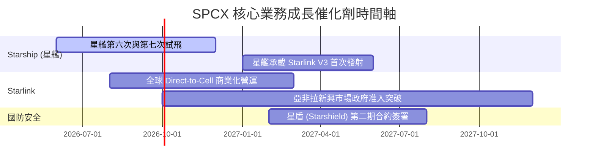

### 8.2 TAM (潛在市場規模) 分析

```
╔══════════════════════════════════════════════════════════════════╗
║                    SPCX 2030年潛在市場 (TAM)                     ║
╠══════════════════════════════════════════════════════════════════╣
║                                                                  ║
║  1. 全球衛星寬頻 (Starlink)：                                   ║
║     ├── 全球未聯網人口與海事/航空高階市場                         ║
║     └── TAM: $120B ｜ 預期滲透率: 15% ｜ 貢獻營收: $18B            ║
║                                                                  ║
║  2. 商業發射服務：                                               ║
║     ├── 商業衛星、科學探測、載人航太                             ║
║     └── TAM: $30B ｜ 預期滲透率: 85% ｜ 貢獻營收: $25.5B          ║
║                                                                  ║
║  3. 國防與太空安全 (Starshield)：                                 ║
║     ├── 美國及盟國軍事加密通訊與偵察觀測                         ║
║     └── TAM: $50B ｜ 預期滲透率: 30% ｜ 貢獻營收: $15B            ║
║                                                                  ║
║  📊 總計 2030 年預估營收潛力：$58.5B (較當前 TTM 成長 203%)      ║
╚══════════════════════════════════════════════════════════════════╝
```

### 8.3 成長驅動力結構圖

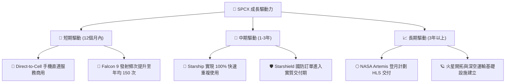

---

## 9. 風險矩陣

### 9.1 風險評分矩陣

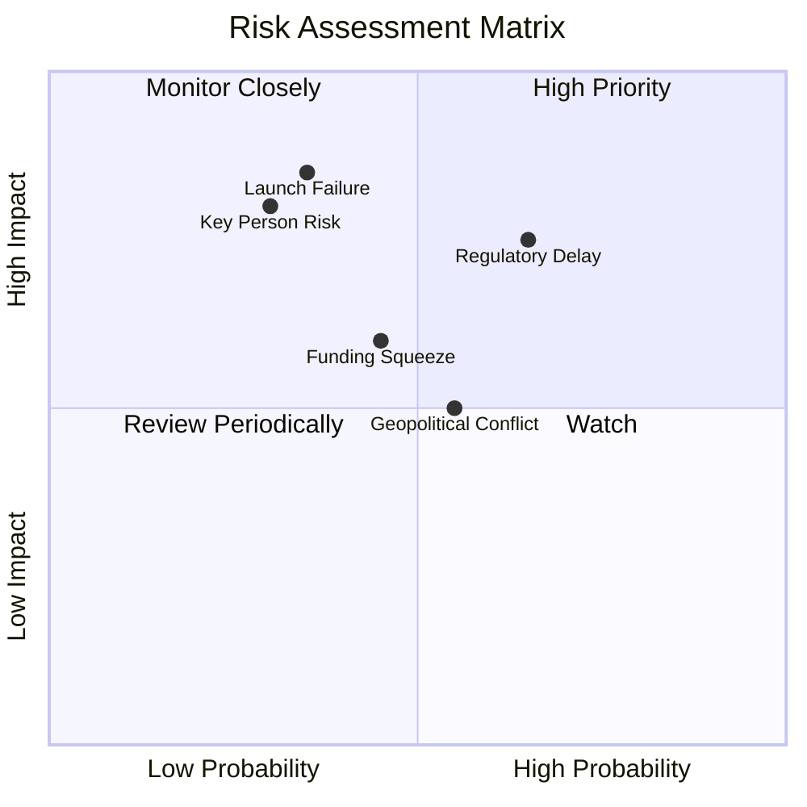

### 9.2 風險清單詳細分析

| # | 風險項目 | 發生機率 | 財務損害評估 | 風險評分 | 緩解措施 |
|---|---|---|---|---|---|
| 1 | 🔴 **星艦試飛重大失敗或停飛** | 中 (35%) |