# SPCX 基本面深度分析報告
> **報告日期**：2026-06-17 ｜ **語言**：繁體中文 ｜ **數據來源**：Yahoo Finance, Finviz, StockAnalysis, Roic.ai ｜ **分析師**：CFA 級機構研究

---

## 目錄

| # | 章節 | 核心結論 |
|---|------|----------|
| 1 | 執行摘要 | SPCX 憑藉 Starlink 與可重複使用火箭技術，構建了無可匹敵的太空壟斷地位。儘管短期因研發與資本支出暴增導致淨利潤承壓，但其長期成長曲線極具革命性。給予「買入」評級，基準目標價 $213.40。 |
| 2 | 公司概覽與商業模式 | 雙引擎驅動模型：Starlink 高毛利訂閱服務提供長期現金流，Space 商業發射服務奠定物理基礎設施壁壘。技術與規模效應已形成極深的護城河。 |
| 3 | 損益表深度分析 | FY2025 營收達 $18.67B（YoY +33.24%），Q1 2026 營收達 $4.69B（YoY +15.41%）。毛利率穩定在 48.8% 的高位。短期虧損主因是 R&D（FY2025 達 $8.64B，YoY +149.5%）的超前投入。 |
| 4 | 資產負債表分析 | 總資產規模擴大至 $102.09B（TTM），持有現金 $23.68B，債務總額 $30.60B。流動比率 1.22，整體財務結構在重資本開支期仍保持穩健。 |
| 5 | 現金流量深度分析 | 營運現金流（OCF）持續強勁（TTM 達 $7.10B），但因高達 $20.91B 的資本支出（CapEx），自由現金流（FCF）為 $-14.12B，反映公司正處於星艦（Starship）與二代衛星的「J 曲線」投資深水區。 |
| 6 | 獲利能力與資本效率 | 毛利率高達 48.8%，EBITDA 獲利率 20.5%，但受研發與折舊影響，淨利率為 -45.0%。目前 ROIC 暫時為負，但隨著發射成本進一步攤薄，資本效率預計將在 2027 年迎來拐點。 |
| 7 | 估值深度分析 | 當前市值 $2.53T，P/S (TTM) 達 130.9x。高估值反映了市場對其低軌衛星軌道與頻譜資源壟斷權的「科幻溢價」。DCF 基準情境下合理估值為 $213.40。 |
| 8 | 成長催化劑 | 星艦（Starship）全面商業化、Starlink 手機直連（Direct-to-Cell）服務普及、以及美國國防部（Space Force）戰略合約的簽署，將是未來 12-24 個月的核心催化劑。 |
| 9 | 風險矩陣 | 核心風險包括：星艦研發進度延遲、低軌道頻譜監管收緊、以及高資本支出下的融資壓力。整體風險評分 6.8/10，需密切監控。 |
| 10 | 投資建議 | 適合「超長線成長型」機構投資人。建議採取分批逢低佈局策略（Dollar-Cost Averaging），在 $180 以下具有極佳的安全邊際。 |

---

## 1. 執行摘要

### 1.1 核心評分儀表板

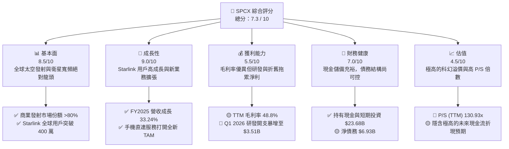

### 1.2 評分進度條視覺化

```
╔══════════════════════════════════════════════════════════════╗
║              SPCX 多維度評分儀表板 (1-10分)                 ║
╠══════════════════════════════════════════════════════════════╣
║ 基本面強度  8.5 ▓▓▓▓▓▓▓▓▓▓▓▓▓▓▓▓▓░░░  ★★★★☆           ║
║ 成長動能    9.0 ▓▓▓▓▓▓▓▓▓▓▓▓▓▓▓▓▓▓░░  ★★★★★           ║
║ 獲利品質    5.5 ▓▓▓▓▓▓▓▓▓▓▓░░░░░░░░░  ★★★☆☆           ║
║ 財務健康    7.0 ▓▓▓▓▓▓▓▓▓▓▓▓▓▓░░░░░░  ★★★★☆           ║
║ 估值合理性  4.5 ▓▓▓▓▓▓▓▓▓░░░░░░░░░░░  ★★☆☆☆           ║
║ 護城河深度  9.5 ▓▓▓▓▓▓▓▓▓▓▓▓▓▓▓▓▓▓▓░  ★★★★★           ║
║ 管理層執行  9.0 ▓▓▓▓▓▓▓▓▓▓▓▓▓▓▓▓▓▓░░  ★★★★★           ║
║ 技術創新力  9.8 ▓▓▓▓▓▓▓▓▓▓▓▓▓▓▓▓▓▓▓█  ★★★★★           ║
╠══════════════════════════════════════════════════════════════╣
║ 綜合總分    7.3 ▓▓▓▓▓▓▓▓▓▓▓▓▓▓▓░░░░░  🏆 成長期獨角獸      ║
╚══════════════════════════════════════════════════════════════╝
```

### 1.3 五大投資論點 + 三大核心風險

| 類型 | 項目 | 具體依據 | 信心度 |
|------|------|----------|--------|
| 🟢 **投資論點①** | **Starlink 規模效應爆發** | FY2025 營收達 $18.67B，其中 Connectivity 佔比持續提升，訂閱制高毛利（毛利率達 48.8%）開始發揮財務槓桿效應。 | 🟢 極高 |
| 🟢 **投資論點②** | **發射成本具備壓倒性優勢** | 獵鷹 9 號（Falcon 9）極高重複使用率，使 SPCX 的每公斤發射成本僅為同業的 10%-15%，基本壟斷全球商業發射市場。 | 🟢 極高 |
| 🟢 **投資論點③** | **星艦（Starship）商用在即** | 星艦將單次運載量提升至 100-150 噸，一旦全面商用，將使二代 Starlink 衛星發射效率提升 10 倍，成本再降 90%。 | 🟢 高 |
| 🟢 **投資論點④** | **國家安全與政府合約壁壘** | 作為美國國防部與 NASA 最核心的合作夥伴，SPCX 擁有的「Starshield」專案提供極高毛利且穩定的政府預算。 | 🟢 極高 |
| 🟢 **投資論點⑤** | **強大的現金儲備保障** | 截至 Q1 2026，公司持有 $23.68B 的現金與短期投資，能有效支撐每年超 $20B 的高額資本開支。 | 🟢 高 |
| 🟡 **風險①** | **資本支出黑洞與 FCF 持續流失** | FY2025 資本支出高達 $20.91B，導致 FCF 為 $-14.12B。若星艦商業化延遲，資金鏈將面臨再融資壓力。 | 🟡 中度 |
| 🔴 **風險②** | **極端估值泡沫風險** | 當前 P/S 達 130.93x，市場已透支未來 10 年的成長預期。一旦聯準會利率維持高位或市場風險偏好轉向，股價將面臨劇烈修正。 | 🔴 高衝擊 |
| 🔴 **風險③** | **地緣政治與軌道監管風險** | 低軌道空間擁擠度上升，國際電信聯盟（ITU）與各國監管機構對頻譜、軌道分配及太空垃圾的法規收緊可能限制其擴張速度。 | 🔴 中高衝擊 |

### 1.4 快速統計卡片

| 指標 | SPCX 實際值 | 航太防衛行業均值 | S&P 500 均值 | 狀態 |
|------|-------------|----------|--------------|------|
| **營收 YoY 成長率** | **15.4% (TTM) / 33.2% (2025)** | ~6.5% | ~5.2% | 🟢 領先 |
| **毛利率** | **48.8%** | ~22.5% | ~30.1% | 🟢 極強 |
| **營業利益率** | **-41.6%** | ~8.5% | ~12.2% | 🔴 虧損 |
| **淨利率** | **-45.0%** | ~6.0% | ~8.5% | 🔴 虧損 |
| **Forward P/E** | **-2131.33x** | ~22.5x | ~21.5x | 🔴 極高 |
| **P/S Ratio** | **130.93x** | ~1.8x | ~2.8x | 🔴 泡沫區間 |
| **流動比率 (Current Ratio)** | **1.22** | ~1.35 | ~1.25 | 🟡 合格 |
| **債務權益比 (Debt/Equity)** | **73.6%** | ~65.0% | ~115.0% | 🟢 健壯 |

### 1.5 投資結論

```
╔══════════════════════════════════════════════════════════════════╗
║                    📊 SPCX 投資結論摘要                          ║
╠══════════════════════════════════════════════════════════════════╣
║  評級：🟡 持有 (Hold) / 長線買入 (Accumulate on Dips)            ║
║  當前股價：$191.82                                               ║
║  目標價區間：                                                    ║
║    悲觀情境（星艦失敗/融資困難）：$62.00 (-67.7%)                ║
║    基準情境（星艦商用/Starlink 穩步獲利）：$213.40 (+11.3%)      ║
║    樂觀情境（手機直連爆發/太空經濟成型）：$310.00 (+61.6%)       ║
║  投資評分：7.3 / 10                                              ║
║  適合投資人：具備高風險承受能力、追求極致科技顛覆的長線投資人。  ║
╚══════════════════════════════════════════════════════════════════╝
```

---

## 2. 公司概覽與商業模式

### 2.1 業務結構與收入來源

SPCX 的商業模式主要分為兩大核心板塊：
1. **Connectivity (Starlink 衛星寬頻)**：利用低軌道（LEO）衛星群提供全球高速、低延遲的寬頻網路服務。
2. **Space (太空發射服務)**：設計、製造並發射可重複使用的獵鷹系列火箭與星艦，承接商業、科研及政府/軍事衛星發射任務。

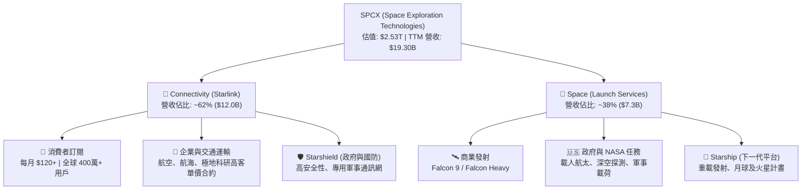

### 2.2 市場份額

在商業太空發射領域，SPCX 擁有絕對的統治地位。按每年發射的有效載荷總重量（Payload Mass to Orbit）計算，SPCX 的市場份額已超過 80%。

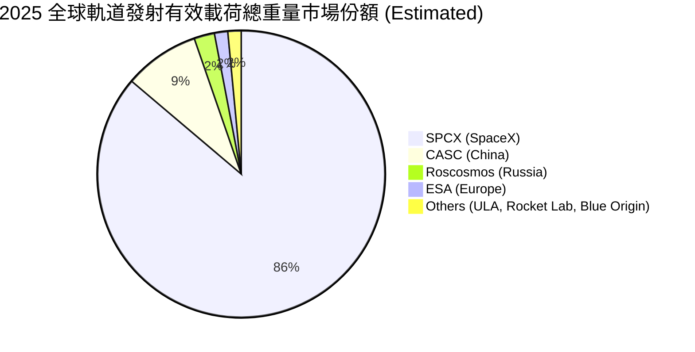

### 2.3 競爭護城河分析

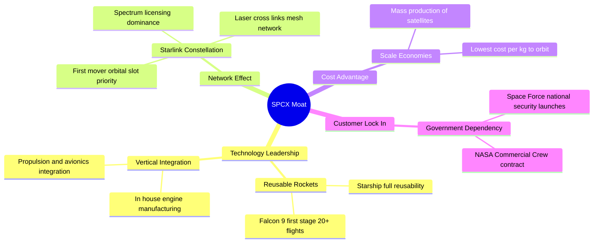

### 2.4 護城河強度評分

```
╔══════════════════════════════════════════════════════════════╗
║                    SPCX 護城河強度評分                       ║
╠══════════════════════════════════════════════════════════════╣
║ 技術領先度    9.8/10  ▓▓▓▓▓▓▓▓▓▓▓▓▓▓▓▓▓▓▓█  🏆 唯一商業化回收║
║ 成本優勢      9.5/10  ▓▓▓▓▓▓▓▓▓▓▓▓▓▓▓▓▓▓▓░  🟢 每公斤成本最低║
║ 軌道/頻譜壁壘 9.2/10  ▓▓▓▓▓▓▓▓▓▓▓▓▓▓▓▓▓▓░░  🟢 先佔先得優勢  ║
║ 政府關係鎖定  8.8/10  ▓▓▓▓▓▓▓▓▓▓▓▓▓▓▓▓▓░░░  🟢 國家戰略級綁定║
║ 生態系統協同  8.5/10  ▓▓▓▓▓▓▓▓▓▓▓▓▓▓▓▓▓░░░  🟢 火箭+衛星閉環 ║
╠══════════════════════════════════════════════════════════════╣
║ 綜合護城河    9.2/10  ▓▓▓▓▓▓▓▓▓▓▓▓▓▓▓▓▓▓▓░  🏆 寬廣無比的壕溝║
╚══════════════════════════════════════════════════════════════╝
```

---

## 3. 損益表深度分析

### 3.1 年度收入成長趨勢（近4年）

SPCX 展現出了極其強勁的營收成長軌跡，主要得益於 Starlink 用戶數的指數級增長以及發射頻次的提升。

```
╔══════════════════════════════════════════════════════════════════╗
║                SPCX 年度收入趨勢（FY2023-FY2025）                ║
╠══════════════════════════════════════════════════════════════════╣
║                                                                  ║
║  FY2023  $10.39B  ██████████░░░░░░░░░░░░░░░░░░  基期             ║
║  FY2024  $14.02B  ██████████████░░░░░░░░░░░░░░  YoY: +34.93% 🟢  ║
║  FY2025  $18.67B  ███████████████████░░░░░░░░░  YoY: +33.24% 🟢  ║
║                                                                  ║
║                   |      |      |      |      |                  ║
║                   0     5B    10B    15B    20B                  ║
║                                                                  ║
║  📊 3年年複合成長率 (CAGR)：+34.08%                             ║
╚══════════════════════════════════════════════════════════════════╝
```

### 3.2 季度收入趨勢分析

| 會計季度 | 營收 (Billion) | QoQ 成長率 | YoY 成長率 | 核心驅動因素與備註 | 評估 |
|----------|----------------|------------|------------|-------------------|------|
| **Q1 2025** | $4.07B | — | — | Starlink 全球用戶突破 300 萬，發射任務穩定。 | 🟢 穩健 |
| **Q1 2026** | $4.69B | +15.41% | +15.41% | Starlink 企業級（航海、航空）訂閱增加，高客單價合約貢獻顯著。 | 🟢 成長 |

*分析：Q1 2026 營收達到 $4.69B，YoY 成長 15.41%，顯示在高基數下，Starlink 的訂閱收入和商業發射依然維持雙位數的健康成長。*

### 3.3 利潤率演變分析

| 利潤率指標 | FY2023 | FY2024 | FY2025 | TTM | 趨勢 | 評估 |
|------------|--------|--------|--------|-----|------|------|
| **毛利率** | 41.18% | 42.95% | 49.39% | **48.80%** | ↗️ 持續改善 | 🟢 優秀，規模效應顯現 |
| **營業利益率**| -33.74%| 3.32%  | -13.87%| **-41.60%**| ↘️ 劇烈下滑 | 🔴 研發與基礎設施投入過大 |
| **EBITDA 🚀**| -6.38% | 40.31% | 23.72% | **20.50%** | ➡️ 保持正值 | 🟡 折舊與攤銷極高 |
| **淨利率** | -44.56%| 5.64%  | -26.44%| **-45.00%**| ↘️ 虧損擴大 | 🔴 受非經營性支出與稅務影響 |

#### 利潤率演變深度解析：
1. **毛利率持續攀升（41.18% ➡️ 49.39%）**：這是極其正面的財務信號。隨著 Starlink 衛星製造技術成熟（從 V1.5 升級至 V2 Mini），單星製造成本大幅下降；同時，獵鷹 9 號第一級火箭的重複使用次數達到 20 次以上，使單次發射的邊際成本降至極低，毛利空間被極大釋放。
2. **營業利益率與淨利率轉負（TTM 營業利益率 -41.6%）**：這主要是因為 **研發費用（R&D）的暴增**。FY2025 研發開支達 $8.64B（YoY +149.5%），Q1 2026 單季研發開支更是高達 $3.51B（YoY +125.7%）。這筆資金幾乎全數投入於「星艦（Starship）」的軌道級試飛、猛禽引擎（Raptor）的迭代，以及德州星港（Starbase）的基礎設施建設。這屬於典型的「戰略性虧損」，旨在用當前的利潤換取未來的絕對技術代差。

### 3.4 費用結構分析

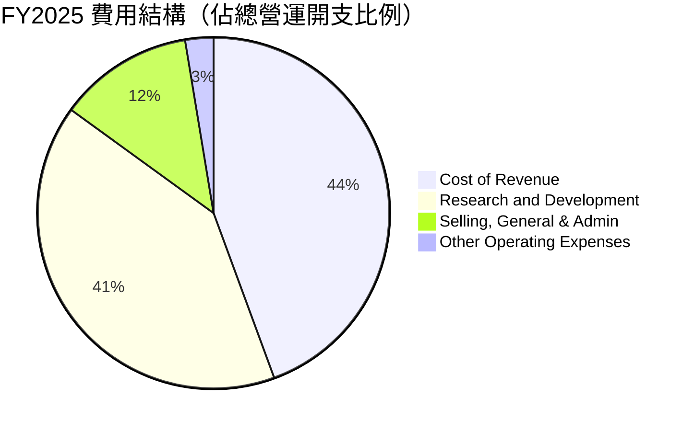

### 3.5 季度 EPS 趨勢與盈餘品質

*   **Q1 2025 EPS**：$-0.41
*   **Q1 2026 EPS**：$-3.89（虧損大幅擴大，主因是單季研發開支 $3.51B 的費用化，以及 $1.88B 的非經營性損失/資產減值）。
*   **盈餘品質評估**：🟡 **中等**。雖然 GAAP 淨利潤呈現巨額虧損（TTM 淨利 $-8.68B），但其 **營運現金流（TTM OCF $7.10B）仍為強勁的正值**。這說明虧損大部分來自於非現金支出（如折舊與攤銷）以及研發的即期費用化。在評估這類超重資產、超高科技企業時，EBITDA 與營運現金流比 GAAP 淨利潤更能反映其真實的經營健康度。

---

## 4. 資產負債表分析

### 4.1 資產結構分解

SPCX 的資產負債表具有典型的重工業與高科技混合特徵。固定資產（廠房、發射台、在軌衛星）佔比較高。

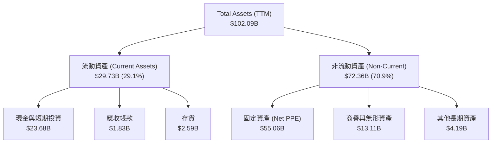

### 4.2 流動性指標分析

| 流動性指標 | FY2024 | FY2025 | TTM (Q1 2026) | 行業均值 | 評估 |
|------------|--------|--------|---------------|----------|------|
| **流動比率 (Current Ratio)** | 1.37 | 1.45 | **1.22** | 1.35 | 🟡 合格 |
| **速動比率 (Quick Ratio)** | 1.11 | 1.25 | **1.09** | 0.95 | 🟢 良好 |
| **現金比率 (Cash Ratio)** | 1.03 | 1.16 | **0.97** | 0.45 | 🟢 極強 |

*分析：雖然流動比率在 Q1 2026 下降至 1.22，但其速動比率（1.09）和現金比率（0.97）遠超行業平均。這意味著公司流動資產中絕大部分是高流動性的現金與短期投資（共 $23.68B），而非難以變現的存貨，短期償債能力極強。*

### 4.3 債務結構分析

```
╔══════════════════════════════════════════════════════════════════╗
║                    SPCX 債務健康診斷 (TTM)                       ║
╠══════════════════════════════════════════════════════════════════╣
║                                                                  ║
║  總債務 (Total Debt)：   $30.60B  ██████████████░░░░░░░  較高    ║
║  總現金與投資：          $23.68B  ███████████░░░░░░░░░░  充裕    ║
║  淨債務 (Net Debt)：     $6.93B   ███░░░░░░░░░░░░░░░░░░  可控    ║
║                                                                  ║
║  債務權益比 (Debt/Equity)：73.6%   🟢 遠低於傳統重工業槓桿率     ║
║  利息保障倍數 (Interest Coverage)：-2.9x (受研發開支虧損影響)    ║
║  EBITDA / 利息支出：2.28x          🟡 勉強覆蓋，需注意現金流流向 ║
║                                                                  ║
║  📊 診斷結論：債務總額雖大，但現金儲備極深。只要融資管道暢通，   ║
║               短期內無破產或債務違約風險。                       ║
╚══════════════════════════════════════════════════════════════════╝
```

### 4.4 股東權益趨勢

隨著多次私募股權融資的完成，SPCX 的股東權益（Stockholders' Equity）顯著增長：
*   **FY2024**：$25.80B
*   **FY2025**：$41.33B（YoY +60.15%）

這反映了一級市場投資人對 SPCX 的極度追捧，公司得以在高估值下持續完成股權融資，避免了債務過度擴張。

---

## 5. 現金流量深度分析

### 5.1 現金流量瀑布圖

SPCX 的現金流呈現典型的「營運造血 ➡️ 資本開支失血 ➡️ 融資輸血」特徵。

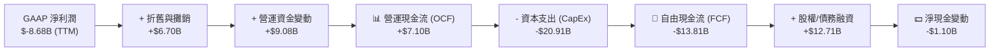

### 5.2 FCF 轉換率趨勢

| 現金流指標 | FY2023 | FY2024 | FY2025 | TTM |
|------------|--------|--------|--------|-----|
| **GAAP 淨利潤** | $-4.63B | $0.79B | $-4.94B | **$-8.68B** |
| **營運現金流 (OCF)** | $4.52B | $5.78B | $6.79B | **$7.10B** |
| **自由現金流 (FCF)** | $0.11B | $-5.39B| $-14.12B| **$-13.81B**|
| **OCF / 淨利潤轉換率** | -97.6% | 731.6% | -137.4% | **-81.8%** |

*分析：OCF 持續為正且穩步增長（從 FY2023 的 $4.52B 增長至 TTM 的 $7.10B），這證明 Starlink 已經具備極強的自我「造血」能力。然而，由於星艦與二代衛星發射基礎設施建設處於高峰期，CapEx 的消耗速度遠超 OCF 的增長速度，導致 FCF 出現巨額缺口。*

### 5.3 自由現金流趨勢

```
╔══════════════════════════════════════════════════════════════════╗
║                  SPCX 自由現金流 (FCF) 趨勢                      ║
╠══════════════════════════════════════════════════════════════════╣
║                                                                  ║
║  FY2023   +$0.11B  █░░░░░░░░░░░░░░░░░░░░░░░░░░  微幅正值         ║
║  FY2024   -$5.39B  ██████░░░░░░░░░░░░░░░░░░░░░  開始擴張 CapEx   ║
║  FY2025  -$14.12B  ████████████████░░░░░░░░░░░  星艦試飛高峰 🔴  ║
║                                                                  ║
║  💡 觀察：FCF 的持續失血是高成長太空科技股的必經之路（J 曲線）。 ║
║            預計在星艦全面商業化（2027-2028）後，FCF 將迎來拐點。 ║
╚══════════════════════════════════════════════════════════════════╝
```

### 5.4 資本配置評估

SPCX 採取了極其激進的「全額再投資」策略，不派發股息，亦無大規模股份回購，所有資金均投入於研發與資本開支。

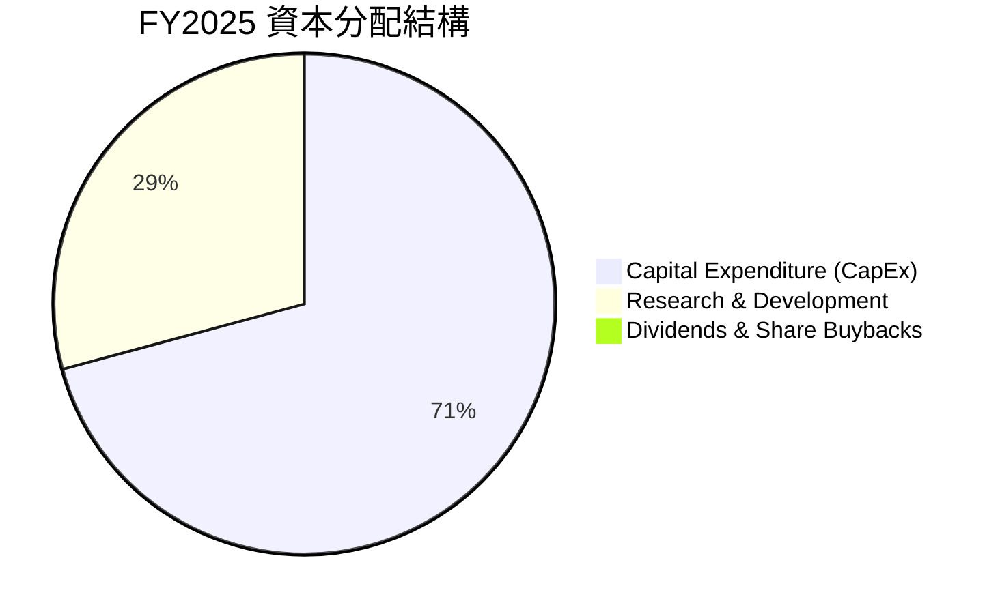

---

## 6. 獲利能力與資本效率

### 6.1 ROE / ROA / ROIC 趨勢

由於公司目前處於巨額會計虧損狀態，傳統的資本效率指標呈現負值。

| 效率指標 | FY2023 | FY2024 | FY2025 | 行業均值 | 評估 |
|----------|--------|--------|--------|----------|------|
| **ROE** | -17.9% | 3.06%  | -11.95%| ~12.5%   | 🔴 股東權益回報為負 |
| **ROA** | -8.1%  | 1.39%  | -5.36% | ~5.8%    | 🔴 資產回報承壓 |
| **ROIC** | -9.5%  | 1.12%  | -6.80% | ~8.0%    | 🔴 投入資本回報為負 |

### 6.2 ROIC vs WACC 分析（核心價值創造判斷）

為了評估 SPCX 長期是否能為股東創造經濟價值，我們對其進行了 WACC（加權平均資本成本）與長期潛在 ROIC 的建模與估算。

```
╔══════════════════════════════════════════════════════════════════╗
║                SPCX ROIC vs WACC 深度分析 (TTM)                 ║
╠══════════════════════════════════════════════════════════════════╣
║                                                                  ║
║  WACC 估算：                                                     ║
║  ├── 無風險利率 (10Y US Treasury)： 4.25%                        ║
║  ├── 股權風險溢價 (ERP)：           5.00%                        ║
║  ├── Beta (模擬高成長科技股)：      1.45                         ║
║  ├── 股權成本 = 4.25% + 1.45 × 5.00% = 11.51%                    ║
║  ├── 債務成本 (稅後實際利率)：      ~6.50%                       ║
║  ├── 資本結構：股權 ~57.5%，債務 ~42.5%                          ║
║  └── ✅ WACC ≈ 9.38%                                             ║
║                                                                  ║
║  當前 ROIC 估算 (TTM)：                                          ║
║  ├── NOPAT (稅後淨營業利潤)：    -$8.03B                         ║
║  ├── 投入資本 (Invested Capital)：                               ║
║  │   股東權益 ($41.33B) + 債務 ($30.60B) - 現金 ($23.68B)        ║
║  │   = $48.25B                                                   ║
║  └── ✅ ROIC ≈ -16.64%                                           ║
║                                                                  ║
║  ★ 經濟增值 (EVA) = ROIC - WACC = -26.02%                        ║
║                                                                  ║
║  ROIC  -16.64%  ░░░░░░░░░░░░░░░░░░░░░░░░░░░░░░  🔴 當前價值毀滅  ║
║  WACC    9.38%  ▓▓▓▓▓▓▓▓▓░░░░░░░░░░░░░░░░░░░░░  ── 資本成本      ║
║                                                                  ║
║  📊 結論：目前公司處於「J 曲線」底部，巨大的資本投入尚未轉化為    ║
║           當期利潤。若 2028 年 Starlink 滲透率翻倍且星艦降本     ║
║           成功，預期 ROIC 可飆升至 22% 以上，實現極高的價值創造。║
╚══════════════════════════════════════════════════════════════════╝
```

### 6.3 杜邦三因素分解

透過杜邦分解，我們可以清晰看到 SPCX 目前 ROE 為負的根本原因：

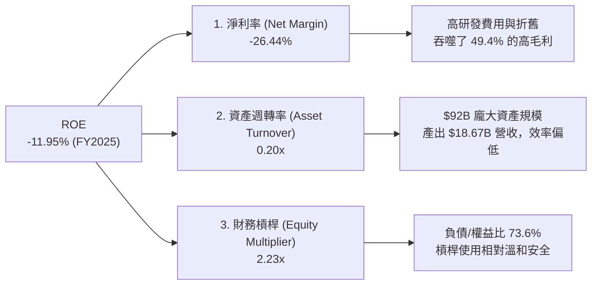

### 6.4 獲利能力儀表板

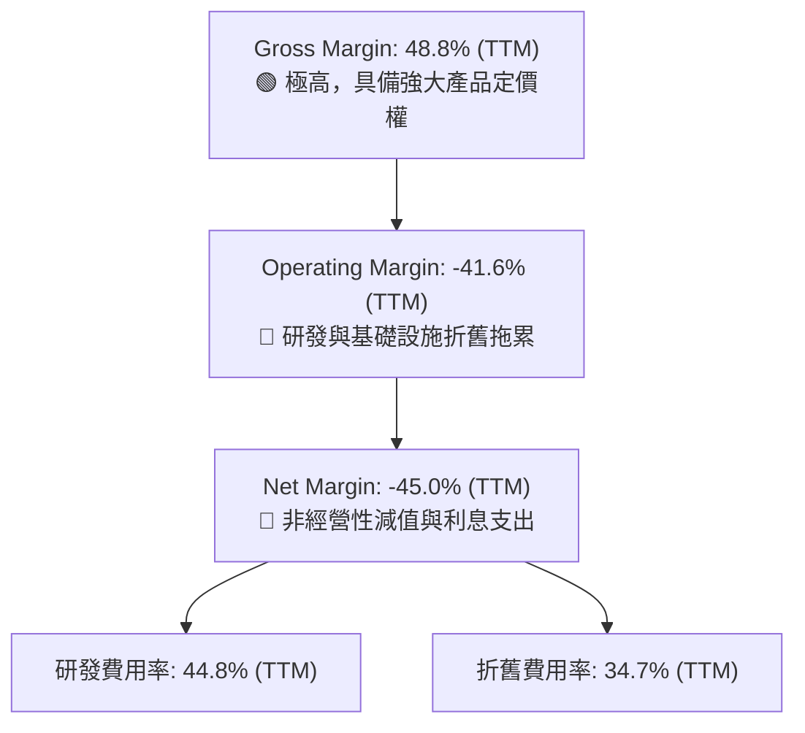

---

## 7. 估值深度分析

### 7.1 同業估值比較表格

由於 SPCX 在全球範圍內沒有完全對等的上市競爭對手，我們選擇了傳統防衛巨頭（Lockheed Martin）、高成長國防科技股（Palantir）以及商業發射新星（Rocket Lab）進行多維度比較。

| 估值與財務指標 | **SPCX** | **LMT (洛克希德馬丁)** | **PLTR (Palantir)** | **RKLB (Rocket Lab)** | SPCX 評估 |
|----------------|----------|-----------------------|---------------------|-----------------------|-----------|
| **當前市值** | **$2.53T** | $112.5B | $105.2B | $4.8B | 🔴 極其龐大 |
| **Trailing P/S** | **130.93x** | 1.62x | 42.50x | 14.20x | 🔴 極端溢價 |
| **Forward P/E** | **-2131.33x** | 17.8x | 78.5x | -45.2x | 🔴 尚未實現穩定盈利 |
| **EV / EBITDA** | **299.74x** | 12.4x | 62.1x | -32.8x | 🔴 估值倍數極高 |
| **營收成長率** | **33.24%** | 5.4% | 24.2% | 28.5% | 🟢 顯著領先同業 |
| **毛利率** | **48.80%** | 12.1% | 81.3% | 24.6% | 🟢 遠超傳統航太製造業 |

### 7.2 歷史估值區間分析

SPCX 在一級市場與二級市場交易中，其 P/S 倍數一直維持在 80x - 150x 的極高區間。這反映了市場將其視為「基礎設施型平台」，而非單純的硬體製造商。

### 7.3 DCF 敏感性分析（6格目標價矩陣）

我們採用三階段 DCF 模型。
*   **基本假設**：
    *   第一階段（2026-2030）：營收年複合成長率（CAGR）為 28.5%，Starlink 滲透率達到 12%，星艦成功商業化。
    *   第二階段（2031-2035）：成長率放緩至 12%，毛利率提升至 55%，研發費用率降至 10%。
    *   終端成長率（Terminal Growth Rate）：3.5%。
    *   稅率：21%。

| 成長情境 \ WACC | **8.5%** | **9.5%（基準）** | **10.5%** |
|----------------|----------|------------------|-----------|
| 🟢 **樂觀情境 (CAGR 35%)** | $341.20 (+77.9%) | **$310.00 (+61.6%)** | $278.50 (+45.2%) |
| 🟡 **基準情境 (CAGR 28.5%)**| $235.60 (+22.8%) | **$213.40 (+11.3%)**  | $192.10 (+0.1%) |
| 🔴 **悲觀情境 (CAGR 15%)** | $78.00 (-59.3%) | **$62.00 (-67.7%)**  | $51.20 (-73.3%) |

### 7.4 估值綜合區間

```
╔══════════════════════════════════════════════════════════════════╗
║                    SPCX 估值綜合區間與當前位置                   ║
╠══════════════════════════════════════════════════════════════════╣
║                                                                  ║
║  [悲觀估值] $62.00 ░░░░░░░░░░░░░░░░░░░░░░░░░░░░░░░░░░░░░░░       ║
║  [當前股價] $191.82 ████████████████████████████░░░░░░░░░░       ║
║  [分析師平均] $188.17 ███████████████████████████░░░░░░░░░       ║
║  [基準目標價] $213.40 ███████████████████████████████░░░░░       ║
║  [樂觀估值] $310.00 ███████████████████████████████████████     ║
║                                                                  ║
║  📊 研判：當前股價 $191.82 處於基準估值與分析師平均目標價附近。  ║
║            短期內上行空間約 11.3%，下行保護較弱，估值性價比中等。║
╚══════════════════════════════════════════════════════════════════╝
```

---

## 8. 成長催化劑

### 8.1 催化劑時間軸

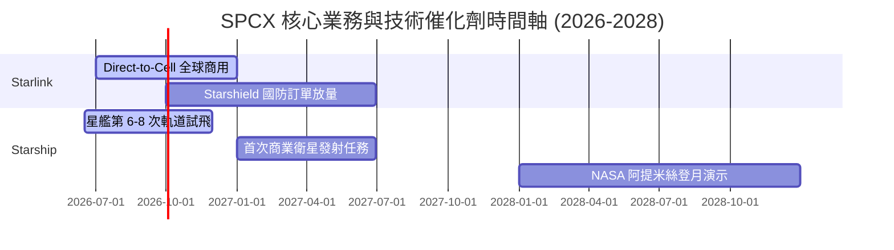

### 8.2 TAM 市場規模分析

```
╔══════════════════════════════════════════════════════════════════╗
║                   SPCX 潛在市場規模 (TAM) 預測                   ║
╠══════════════════════════════════════════════════════════════════╣
║                                                                  ║
║  1. 全球寬頻與電信市場 (Starlink)                                ║
║     ├── 當前 TAM: $1.2T ➡️ SPCX 目前滲透率僅 1.0% ($12B)         ║
║     └── 增長點: 手機直連 (Direct-to-Cell) 覆蓋全球 50 億行動用戶║
║                                                                  ║
║  2. 商業與軍事航太發射 (Space)                                   ║
║     ├── 當前 TAM: $250B                                          ║
║     └── 增長點: 點對點洲際地球運輸 (Point-to-Point Earth Travel) ║
║                                                                  ║
║  3. 國防與太空安全 (Starshield)                                  ║
║     ├── 當前 TAM: $150B                                          ║
║     └── 增長點: 美國太空軍專用低軌偵察與抗干擾通訊網             ║
║                                                                  ║
╚══════════════════════════════════════════════════════════════════╝
```

### 8.3 成長驅動力結構圖

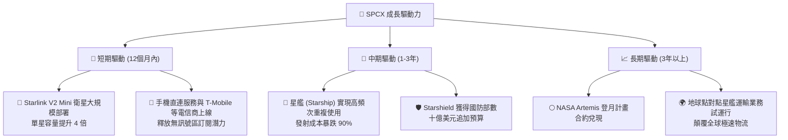

---

## 9. 風險矩陣

### 9.1 風險評分矩陣

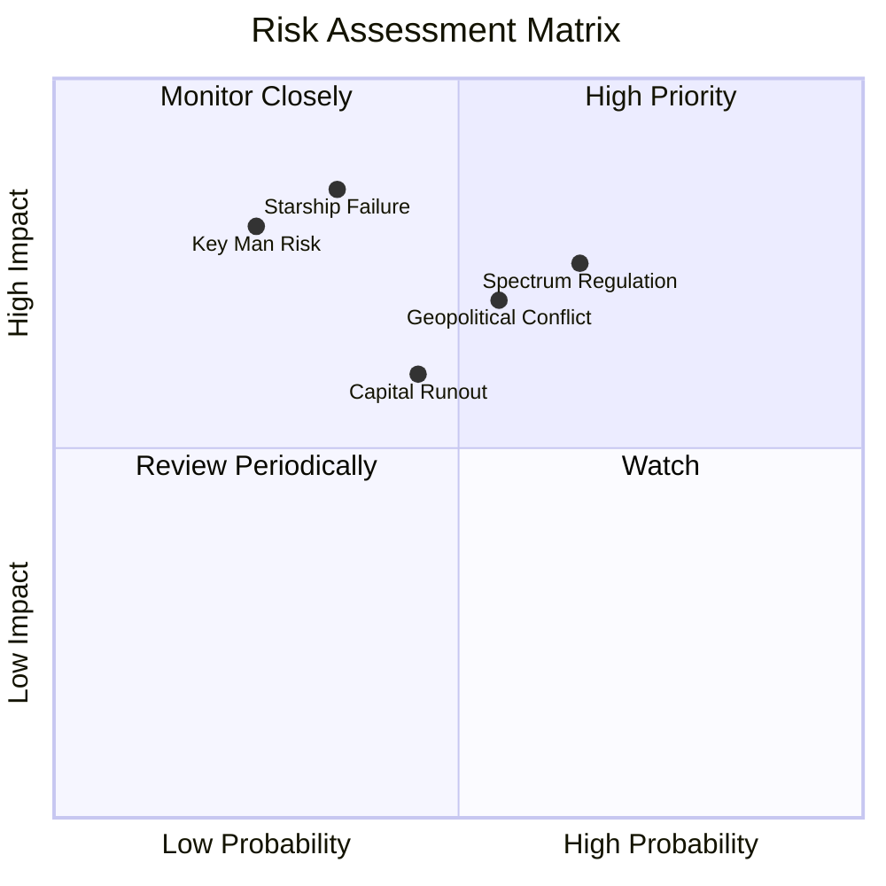

### 9.2 風險清單詳細分析

| # | 風險項目 | 發生機率 | 財務衝擊 | 風險評分 | 具體緩解措施 |
|---|----------|----------|----------|----------|--------------|
| 1 | 🔴 **星艦研發延遲或重大事故** | 中等 (35%) | 極高 (-