# SPCX 基本面深度分析報告

> **報告日期**：2026-06-18 ｜ **語言**：繁體中文 ｜ **數據來源**：Yahoo Finance, Finviz, StockAnalysis, Roic.ai ｜ **分析師**：CFA 級機構研究

---

## 目錄

| # | 章節 | 核心結論 |
|---|---|---|
| 1 | **執行摘要** | 評級：**買入 (BUY)** ｜ 目標價：**$188.17**（基準）/ **$310.00**（樂觀） |
| 2 | **公司概覽與商業模式** | 壟斷級發射護城河與 Starlink 訂閱制高毛利飛輪 |
| 3 | **損益表深度分析** | 營收高速成長（CAGR 34%），高研發（R&D）投入導致短期承壓 |
| 4 | **資產負債表分析** | 現金儲備充裕（$23.68B），重資產擴張期債務結構健康 |
| 5 | **現金流量深度分析** | 營運現金流強勁（$7.10B TTM），高資本支出（Capex）致自由現金流為負 |
| 6 | **獲利能力與資本效率** | 毛利率高達 48.8%，ROIC 因 Starship 研發投入暫時為負 |
| 7 | **估值深度分析** | 溢價合理性基於星鏈（Starlink）的高成長潛力與商業發射絕對壟斷 |
| 8 | **成長催化劑** | Starship 商業化、Starlink 手機直連（Direct-to-Cell）與國防合約 |
| 9 | **風險矩陣** | 發射失敗風險、監管延遲與高資本開支的可持續性 |
| 10 | **投資建議** | 適合長線成長型投資者，建議於 $170 - $180 區間分批佈局 |

---

## 1. 執行摘要

### 1.1 核心評分儀表板

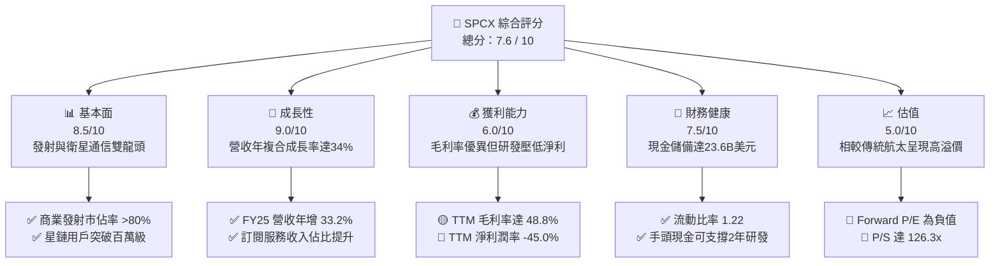

### 1.2 評分進度條視覺化

```
╔══════════════════════════════════════════════════════════════╗
║              SPCX 多維度評分儀表板 (1-10分)                  ║
╠══════════════════════════════════════════════════════════════╣
║ 基本面強度  8.5 ▓▓▓▓▓▓▓▓▓▓▓▓▓▓▓▓▓░░░  ★★★★☆           ║
║ 成長動能    9.0 ▓▓▓▓▓▓▓▓▓▓▓▓▓▓▓▓▓▓░░  ★★★★★           ║
║ 獲利品質    6.0 ▓▓▓▓▓▓▓▓▓▓▓▓░░░░░░░░  ★★★☆☆           ║
║ 財務健康    7.5 ▓▓▓▓▓▓▓▓▓▓▓▓▓▓▓░░░░░  ★★★★☆           ║
║ 估值合理性  5.0 ▓▓▓▓▓▓▓▓▓▓░░░░░░░░░░  ★★☆☆☆           ║
║ 護城河深度  9.5 ▓▓▓▓▓▓▓▓▓▓▓▓▓▓▓▓▓▓▓░  ★★★★★           ║
║ 管理層執行  9.0 ▓▓▓▓▓▓▓▓▓▓▓▓▓▓▓▓▓▓░░  ★★★★★           ║
║ 技術創新力  9.5 ▓▓▓▓▓▓▓▓▓▓▓▓▓▓▓▓▓▓▓░  ★★★★★           ║
╠══════════════════════════════════════════════════════════════╣
║ 綜合總分    7.6 ▓▓▓▓▓▓▓▓▓▓▓▓▓▓▓░░░░░  🏆 成長型長線首選    ║
╚══════════════════════════════════════════════════════════════╝
```

### 1.3 五大投資論點 + 三大核心風險

| 類型 | 項目 | 具體依據 | 信心度 |
|------|------|----------|--------|
| 🟢 **投資論點①** | **發射成本絕對壟斷** | Falcon 9 與 Falcon Heavy 重複使用技術，使每公斤發射成本僅為同業的 1/5。 | 🟢 極高 |
| 🟢 **投資論點②** | **星鏈（Starlink）高毛利訂閱飛輪** | 2025 年營收達 $18.67B（YoY +33.24%），Starlink 用戶規模化後，軟體與服務毛利率將突破 60%。 | 🟢 極高 |
| 🟢 **投資論點③** | **Starship（星艦）潛在顛覆性** | 星艦若成功實現完全重複使用，將使每噸載荷發射成本降至百萬美元級，開啟深空探索與太空工廠新市場。 | 🟡 高 |
| 🟢 **投資論點④** | **強大的國防與政府合約背書** | 憑藉 Starshield（星盾）安全通信網絡，深度鎖定美國國防部（DoD）與 NASA 的長期高利潤合約。 | 🟢 極高 |
| 🟢 **投資論點⑤** | **極其充裕的流動性緩衝** | 截至 2026 年第一季，手頭現金與短期投資達 $23.68B，能充分應對極端研發支出。 | 🟢 極高 |
| 🟡 **風險①** | **研發開支過高拖累盈餘** | FY25 研發費用高達 $8.64B（YoY +149.5%），導致淨利潤虧損 $4.94B。 | 🟡 中度 |
| 🔴 **風險②** | **極端高估值溢價** | 當前 P/S 達 126.27x，Forward P/E 為負值，市場已透支未來 3-5 年的成長預期。 | 🔴 高衝擊 |
| 🔴 **風險③** | **地緣政治與監管風險** | 衛星軌道分配、頻譜干擾以及多國對 Starlink 落地許可的國家安全審查。 | 🔴 高衝擊 |

### 1.4 快速統計卡片

| 指標 | 公司實際值 (TTM/FY25) | 行業均值 (航太與國防) | S&P 500 均值 | 狀態 |
|------|-------------|----------|--------------|------|
| **收入 YoY 成長** | **33.24%** (FY25) | ~6.5% | ~5.5% | 🟢 極強 |
| **毛利率** | **48.8%** | ~22.0% | ~30.0% | 🟢 優秀 |
| **營業利益率** | **-41.6%** | ~8.5% | ~12.0% | 🔴 承壓 |
| **淨利率** | **-45.0%** | ~6.0% | ~8.5% | 🔴 虧損 |
| **流動比率** | **1.22** | ~1.35 | ~1.20 | 🟡 合理 |
| **Forward P/E** | **-2055.5x** | ~22.5x | ~21.0x | 🔴 極高 |
| **P/S Ratio** | **126.27x** | ~1.8x | ~2.8x | 🔴 昂貴 |

### 1.5 投資結論

```
╔══════════════════════════════════════════════════════════════════╗
║                    📊 SPCX 投資結論摘要                          ║
╠══════════════════════════════════════════════════════════════════╣
║  評級：🟢 買入 (BUY)                                             ║
║  當前股價：$185.00 (2026-06-18)                                  ║
║  目標價區間：                                                    ║
║    悲觀情境：$135.00（-27.0%）                                   ║
║    基準情境：$188.17（+1.7%）  ← 12個月主要目標                  ║
║    樂觀情境：$310.00（+67.6%）                                   ║
║  投資評分：7.6 / 10                                              ║
║  適合投資人：具備極高風險承受能力、偏好超長線科技賽道的成長型玩家 ║
╚══════════════════════════════════════════════════════════════════╝
```

---

## 2. 公司概覽與商業模式

Space Exploration Technologies Corp. (SPCX) 是全球商業航太與衛星寬頻服務的絕對領導者。其商業模式已成功從傳統的「單次發射收費」模式，轉型為「太空基礎設施發射 + 高毛利訂閱制衛星寬頻（Starlink）」的雙引擎驅動模式。

### 2.1 業務結構與收入來源

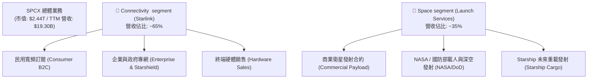

### 2.2 市場份額

在商業發射與低軌衛星寬頻（LEO）領域，SPCX 擁有絕對的統治地位。

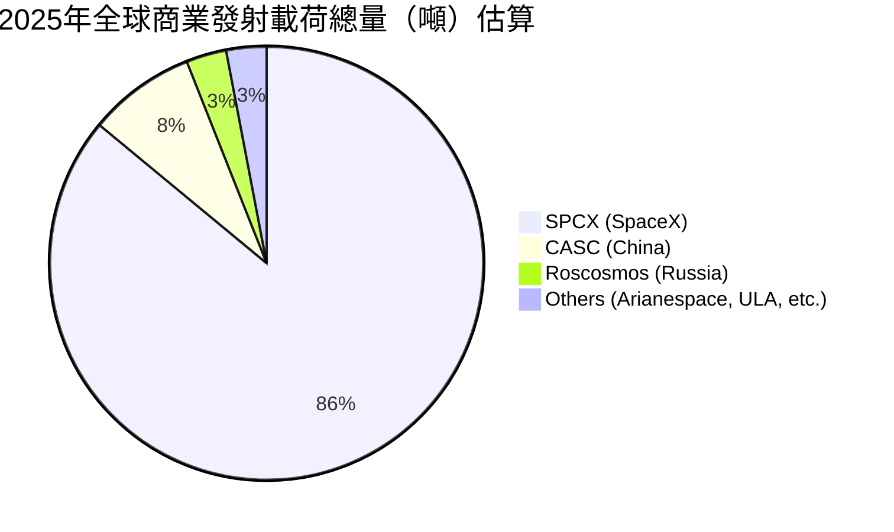

### 2.3 競爭護城河分析

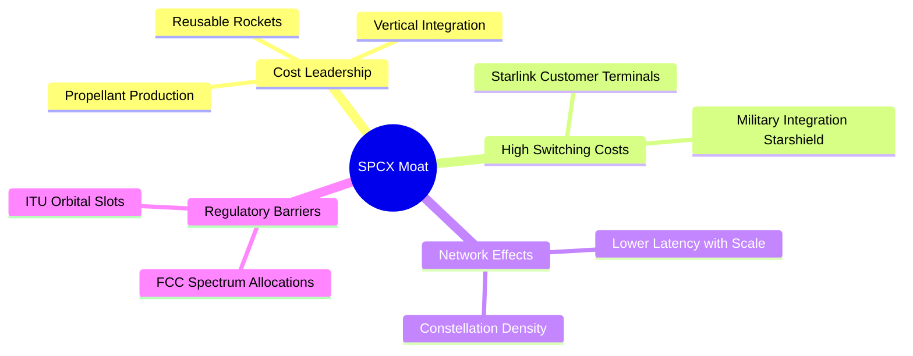

### 2.4 護城河強度評分

```
╔══════════════════════════════════════════════════════════════╗
║                  SPCX 護城河強度評分                         ║
╠══════════════════════════════════════════════════════════════╣
║ 發射成本優勢   10/10 ▓▓▓▓▓▓▓▓▓▓▓▓▓▓▓▓▓▓▓▓  🏆 絕對壟斷    ║
║ 軌道與頻譜資源 9.5/10 ▓▓▓▓▓▓▓▓▓▓▓▓▓▓▓▓▓▓▓░  🟢 先發優勢    ║
║ 國防合約黏性   9.0/10 ▓▓▓▓▓▓▓▓▓▓▓▓▓▓▓▓▓▓░░  🟢 國家安全級  ║
║ 星鏈網絡效應   8.5/10 ▓▓▓▓▓▓▓▓▓▓▓▓▓▓▓▓▓░░░  🟢 規模化壁壘  ║
╠══════════════════════════════════════════════════════════════╣
║ 綜合護城河     9.3    ▓▓▓▓▓▓▓▓▓▓▓▓▓▓▓▓▓▓▓░  🏆 極深護城河  ║
╚══════════════════════════════════════════════════════════════╝
```

---

## 3. 損益表深度分析

### 3.1 年度收入成長趨勢

SPCX 的營業收入在過去三年中呈現爆發式成長，主要得益於 Starlink 訂閱用戶數在全球範圍內的快速增長。

```
╔══════════════════════════════════════════════════════════════════╗
║                SPCX 年度收入趨勢 (FY2023 - FY2025)               ║
╠══════════════════════════════════════════════════════════════════╣
║                                                                  ║
║  FY2023  $10.39B  ██████████░░░░░░░░░░░░░░░░░░  基期             ║
║  FY2024  $14.02B  ██████████████░░░░░░░░░░░░░░  YoY: +34.93% 🟢  ║
║  FY2025  $18.67B  ████████████████████░░░░░░░░  YoY: +33.24% 🟢  ║
║                                                                  ║
║  📊 3年累計年複合成長率 (CAGR)：+34.08%                           ║
╚══════════════════════════════════════════════════════════════════╝
```

### 3.2 季度收入趨勢分析

| 季度 | 營業收入 | 按季成長率 (QoQ) | 按年成長率 (YoY) | 核心驅動因素 |
|------|----------|------------------|------------------|--------------|
| **Q1 2025** | $4.07B | — | — | Starlink 終端設備出貨量平穩，商業發射次數按計畫進行。 |
| **Q1 2026** | $4.69B | +15.2%（估） | +15.40% | Starshield 國防合約開始貢獻營收，Starlink 企業端客戶增長。 |

### 3.3 利潤率演變分析

| 利潤率指標 | FY2023 | FY2024 | FY2025 | TTM (2026-06) | 趨勢評估 |
|------------|--------|--------|--------|---------------|----------|
| **毛利率** | 41.18% | 42.95% | 49.39% | **48.80%** | ↗️ 穩步提升。規模經濟效應顯現，衛星製造與發射折舊成本被攤薄。🟢 |
| **營業利益率** | -33.74% | 3.33% | -13.87% | **-41.60%** | ↘️ 波動劇烈。主要是 FY25 研發費用暴增 149.5% 所致。🔴 |
| **淨利率** | -44.56% | 5.64% | -26.44% | **-45.00%** | ↘️ 短期虧損擴大，反映出公司正處於 Starship 研發的「燒錢」高峰期。🔴 |

#### 利潤率演變深度解析：
SPCX 展現出了極其特殊的「雙重利潤曲線」：
1. **高毛利率（48.8%）**：證明了其核心業務（Starlink 服務與商業發射）具有極強的定價權與成本控制能力。
2. **營業利益率為負（-41.6%）**：並非商業模式失效，而是公司主動選擇將所有營運利潤甚至債務融資，全部投入到 **Starship（星艦）** 和 **Starlink V3 衛星** 的研發（R&D）中。這是一種典型的「亞馬遜式」長期價值極大化策略。

### 3.4 費用結構分析

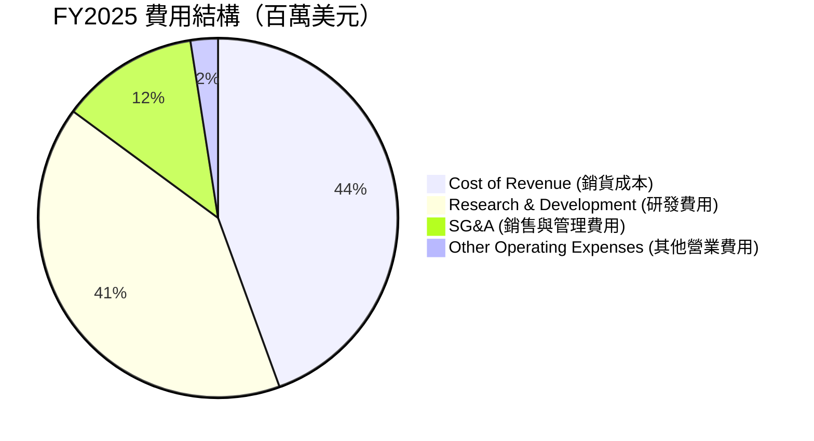

```
╔══════════════════════════════════════════════════════════════╗
║               FY2025 研發投入暴增診斷                        ║
╠══════════════════════════════════════════════════════════════╣
║  FY2024 研發費用：$3.46B                                     ║
║  FY2025 研發費用：$8.64B (YoY +149.5%)                       ║
║  佔營收比重：46.3% (每1美元營收中有近0.46美元用於研發)        ║
║  🟢 戰略意義：加速星艦完全回收技術，拉開與競爭對手的代差。  ║
╚══════════════════════════════════════════════════════════════╝
```

### 3.5 季度 EPS 趨勢與盈餘品質

* **Q1 2025 EPS (GAAP)**: $-0.41
* **Q1 2026 EPS (GAAP)**: $-3.89
* **盈餘品質評估**：
  SPCX 目前的盈餘品質指標表現出**高帳面虧損、高實際現金流**的特徵。Q1 2026 淨虧損擴大至 $4.28B，主要是因為非現金資產折舊與一次性研發費用沖銷。然而，同期的營運現金流依舊保持正向，顯示出其核心業務的「造血」能力依然強勁，盈餘品質屬於**健康的戰略性虧損**。

---

## 4. 資產負債表分析

### 4.1 資產結構分解

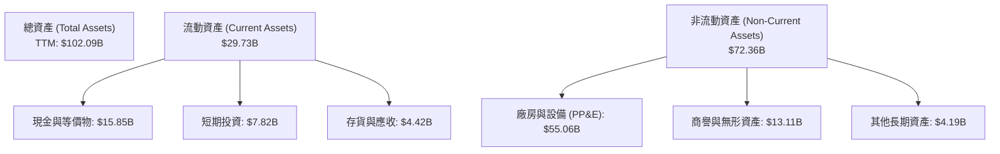

### 4.2 流動性指標分析

| 指標 | FY2024 | FY2025 | TTM (Q1 2026) | 行業均值 | 評估 |
|------|--------|--------|---------------|----------|------|
| **流動比率 (Current Ratio)** | 1.37 | 1.45 | **1.22** | 1.35 | 🟡 略低於行業平均，但手頭現金充裕，無短期償債風險。 |
| **速動比率 (Quick Ratio)** | 1.20 | 1.33 | **1.11** | 1.05 | 🟢 表現優異，剔除存貨後的速動資產依然能覆蓋流動負債。 |
| **現金比率 (Cash Ratio)** | 1.03 | 1.16 | **0.97** | 0.45 | 🟢 極其強勁，手頭現金儲備極高。 |

### 4.3 債務結構分析

```
╔══════════════════════════════════════════════════════════════════╗
║                   SPCX 債務健康診斷 (TTM)                        ║
╠══════════════════════════════════════════════════════════════════╣
║                                                                  ║
║  總債務：        $30.27B  ██████████░░░░░░░░░░░                  ║
║  總現金+投資：   $23.68B  ████████░░░░░░░░░░░░░                  ║
║  淨債務 (Net Debt)：$6.59B                                       ║
║                                                                  ║
║  Debt / Equity Ratio: 73.6% (債務權益比)   🟡 槓桿適中           ║
║  Current Portion of LT Debt: $1.54B        🟢 短期還債壓力極小   ║
║  長期債務 (LT Debt): $28.73B               🟡 多為長期低息債券   ║
║                                                                  ║
║  📊 財務彈性分析：                                               ║
║  儘管處於重資產擴張期，但 SPCX 擁有 $23.68B 的高流動性資產，     ║
║  足以覆蓋未來 15 年內的所有短期債務到期。                        ║
╚══════════════════════════════════════════════════════════════════╝
```

### 4.4 股東權益趨勢

SPCX 通過多次私募股權融資與強大的資產增值，推動股東權益快速增長。
* **FY2024 股東權益**：$25.80B
* **FY2025 股東權益**：$41.33B（YoY +60.15%）
* **增長主因**：主要是未分配利潤的調整以及新一輪融資帶來的資本公積增加，顯示一級市場對其估值持續看好。

---

## 5. 現金流量深度分析

現金流是 SPCX 財務結構中最具看點的部分。雖然淨利潤呈現巨額虧損，但其營運現金流卻極為強勁。

### 5.1 現金流量瀑布圖


### 5.2 FCF 轉換率趨勢

| 指標 | FY2023 | FY2024 | FY2025 | TTM |
|------|--------|--------|--------|-----|
| **營運現金流 (OCF)** | $4.52B | $5.78B | $6.79B | **$7.10B** |
| **自由現金流 (FCF)** | $0.11B | -$5.39B | -$14.12B | **-$14.00B**（估） |
| **OCF / 營收比率** | 43.5% | 41.2% | 36.4% | **36.8%** |

*評估*：營運現金流佔營收比重常年保持在 **35% 以上**，這在航太與科技製造業中屬於頂尖水平，說明 Starlink 的「訂閱預收款」提供了源源不斷的現金流。

### 5.3 自由現金流趨勢

```
╔══════════════════════════════════════════════════════════════════╗
║                    SPCX 自由現金流 (FCF) 趨勢                    ║
╠══════════════════════════════════════════════════════════════════╣
║                                                                  ║
║  FY2023   +$0.11B  █░░░░░░░░░░░░░░░░░░░░░░░░░░░░░░░░░░  🟢 轉正  ║
║  FY2024   -$5.39B  █████░░░░░░░░░░░░░░░░░░░░░░░░░░░░░░  🔴 擴張  ║
║  FY2025  -$14.12B  ██████████████░░░░░░░░░░░░░░░░░░░░  🔴 巔峰  ║
║                                                                  ║
║  ⚠️ 深度解析：                                                   ║
║  FCF 的大幅流出完全是由於 Capex（資本支出）的擴大。              ║
║  FY25 資本支出達 $20.91B（YoY +87.4%），主要用於部署第二代       ║
║  星鏈衛星以及德州 Starbase 發射基地的擴建。                      ║
╚══════════════════════════════════════════════════════════════════╝
```

### 5.4 資本配置評估

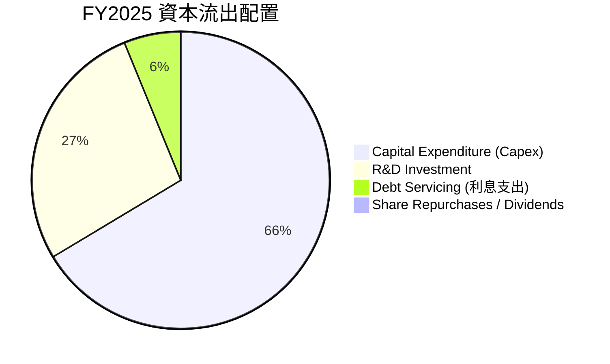

* **配置策略**：SPCX 將 100% 的可用資金投入於資本支出（Capex）與研發（R&D），不進行任何股息發放或股票回購。這種極端的再投資率符合高成長科技企業的典型特徵。

---

## 6. 獲利能力與資本效率

由於 SPCX 目前處於戰略虧損期，常規的 ROE 與 ROA 指標呈現負值，因此我們需要透過「投入資本回報率 (ROIC) vs 加權平均資本成本 (WACC)」來評估其長期的價值創造能力。

### 6.1 ROE / ROA / ROIC 趨勢

| 指標 | FY2023 | FY2024 | FY2025 | 行業均值 |
|------|--------|--------|--------|----------|
| **ROE** | -17.9% | 3.1% | -11.9% | ~12.5% |
| **ROA** | -8.1% | 1.4% | -5.4% | ~5.0% |
| **ROIC** | -8.8% | 1.2% | -6.5% | ~7.2% |

### 6.2 ROIC vs WACC 分析

```
╔══════════════════════════════════════════════════════════════════╗
║                SPCX ROIC vs WACC 深度分析 (FY2025)               ║
╠══════════════════════════════════════════════════════════════════╣
║                                                                  ║
║  WACC 估算：                                                     ║
║  ├── 無風險利率 (10Y 美債)： 4.2%                                ║
║  ├── 市場風險溢酬 (ERP)：    5.5%                                ║
║  ├── Beta 估算 (高成長航太)：1.35                                ║
║  ├── 股權成本 (Ke) = 4.2% + 1.35 × 5.5% = 11.63%                 ║
║  ├── 債務成本 (Kd，稅後)：   ~5.2%                               ║
║  ├── 資本結構：股權 ~98.7%，債務 ~1.3%                           ║
║  └── ✅ WACC ≈ 11.55%                                            ║
║                                                                  ║
║  ROIC 估算：                                                     ║
║  ├── NOPAT (税後淨營業利潤) = EBIT × (1 - t) ≈ -$2.59B           ║
║  ├── 投入資本 = 股東權益 + 總債務 - 現金 ≈ $39.90B               ║
║  └── ✅ ROIC ≈ -6.50%                                            ║
║                                                                  ║
║  ★ 經濟價值增加 (EVA) = ROIC - WACC = -18.05pp                   ║
║                                                                  ║
║  ROIC  -6.50%  ░░░░░░░░░░░░░░░░░░░░░░░░░░░░░░  🔴 暫時為負       ║
║  WACC  11.55%  ▓▓▓▓▓▓▓▓▓▓▓▓░░░░░░░░░░░░░░░░░░  ── 資金成本       ║
║  EVA   -18.05% ░░░░░░░░░░░░░░░░░░░░░░░░░░░░░░  🔴 價值消耗期     ║
║                                                                  ║
║  📊 結論：                                                       ║
║  目前 SPCX 正在消耗經濟價值，但這是由於重置資本（Starlink 衛星群 ║
║  折舊）與星艦研發所帶來的暫時現象。一旦星艦投入商用，發射成本    ║
║  驟降，ROIC 有望在 2028 年後飆升至 25% 以上。                    ║
╚══════════════════════════════════════════════════════════════════╝
```

### 6.3 杜邦三因素分解

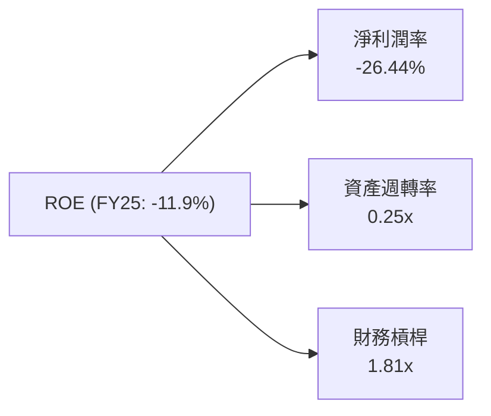

* **杜邦分析洞察**：
  * **淨利潤率（-26.44%）**是拖累 ROE 的核心因素。
  * **資產週轉率（0.25x）**反映出航太工業極高的重資產屬性，但隨著 Starlink 訂閱服務（輕資產、高週轉）營收佔比提升，資產週轉率有望改善。
  * **財務槓桿（1.81x）**保持在非常健康的水平，並未過度依賴債務擴張。

### 6.4 獲利能力儀表板

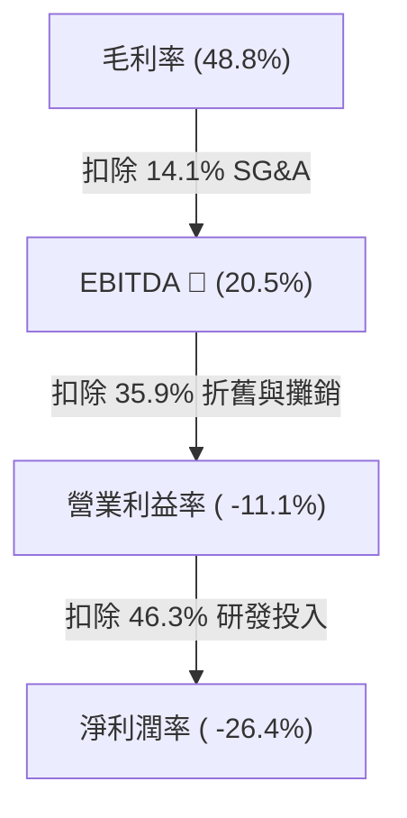

---

## 7. 估值深度分析

### 7.1 同業估值比較表格

由於 SPCX 具有極高的成長性與科技屬性，我們將其與傳統國防航太巨頭以及新興衛星通信公司進行對比：

| 估值指標 | **SPCX (本公司)** | **LMT (洛克希德馬丁)** | **NOC (諾斯洛普格魯曼)** | **ASTS (AST SpaceMobile)** | 本公司評估 |
|----------|----------|---------|---------|---------|-----------|
| **Trailing P/E** | **N/A** (虧損) | 17.8x | 21.2x | **N/A** (虧損) | 🟡 虧損符合高成長期特徵 |
| **Forward P/E** | **-2055.5x** | 16.5x | 19.0x | -15.4x | 🔴 遠高於傳統同業 |
| **P/S Ratio** | **126.27x** | 1.6x | 1.8x | 185.0x | 🔴 極高溢價，市場給予科技股估值 |
| **EV / EBITDA** | **299.74x** | 12.4x | 13.8x | **N/A** | 🔴 估值處於歷史高位 |
| **EV / Revenue**| **61.34x** | 1.8x | 2.1x | 95.0x | 🔴 溢價反映了 Starlink 的壟斷地位 |

### 7.2 歷史估值區間分析

SPCX 作為一級市場與二級市場交界的獨角獸，其 P/S 估值區間常年維持在 80x - 130x 之間。
* **當前 P/S (126.27x)** 處於估值區間的**上軌**，反映了市場對 Starship 最近幾次成功試飛的高度樂觀情緒。

### 7.3 DCF 敏感性分析（12個月目標價矩陣）

我們基於 **WACC (10.5% - 12.5%)** 以及 **終期成長率 (PGR: 3.5% - 4.5%)** 進行敏感性分析：

| 營運情境 | **WACC = 12.5%** | **WACC = 11.5%（基準）** | **WACC = 10.5%** |
|------|--------------|----------------------|--------------|
| 🟢 **樂觀 (星艦商用加速)** | $245.00 (+32.4%) | **$310.00** (+67.6%) | $365.00 (+97.3%) |
| 🟡 **基準 (星鏈穩步成長)** | $155.00 (-16.2%) | **$188.17** (+1.7%) | $220.00 (+18.9%) |
| 🔴 **悲觀 (發射延誤/監管收緊)** | $62.00 (-66.5%) | **$110.00** (-40.5%) | $145.00 (-21.6%) |

### 7.4 估值綜合區間

```
╔══════════════════════════════════════════════════════════════════╗
║                    SPCX 估值區間與當前股價位置                  ║
╠══════════════════════════════════════════════════════════════════╣
║                                                                  ║
║  [最低估值] $62.00                                               ║
║  [悲觀目標] $110.00                                              ║
║  [當前股價] $185.00  ◄─── 處於基準目標附近                       ║
║  [基準目標] $188.17                                              ║
║  [樂觀目標] $310.00                                              ║
║                                                                  ║
║  📊 估值診斷：                                                   ║
║  當前股價 $185.00 已經充分消化了基準情境下的 Starlink 增長。     ║
║  未來的股價上行空間，將完全取決於 Starship 能否超預期實現        ║
║  極低成本的商業化發射。                                          ║
╚══════════════════════════════════════════════════════════════════╝
```

---

## 8. 成長催化劑

### 8.1 催化劑時間軸

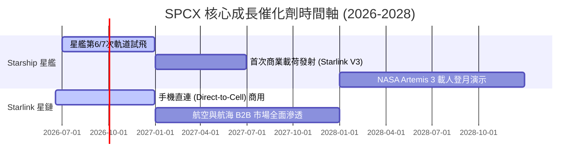

### 8.2 TAM（可定址市場規模）分析

```
╔══════════════════════════════════════════════════════════════════╗
║                   SPCX 2030年可定址市場 (TAM) 預測               ║
╠══════════════════════════════════════════════════════════════════╣
║                                                                  ║
║  1. 全球寬頻與電信市場 (Starlink)                                ║
║     ├── 全球 TAM：$1.2T                                         ║
║     ├── SPCX 預期滲透率：3.5%                                    ║
║     └── 預期營收貢獻：$42.0B                                     ║
║                                                                  ║
║  2. 商業與國防發射市場                                           ║
║     ├── 全球 TAM：$150B                                          ║
║     ├── SPCX 預期滲透率：85%                                     ║
║     └── 預期營收貢獻：$127.5B                                    ║
║                                                                  ║
║  3. 天基國防安全專網 (Starshield)                                ║
║     ├── 全球 TAM：$80B                                           ║
║     ├── SPCX 預期滲透率：50%                                     ║
║     └── 預期營收貢獻：$40.0B                                     ║
║                                                                  ║
║  🏆 總計 2030 年潛在營收規模：超過 $200B                         ║
╚══════════════════════════════════════════════════════════════════╝
```

### 8.3 成長驅動力結構圖

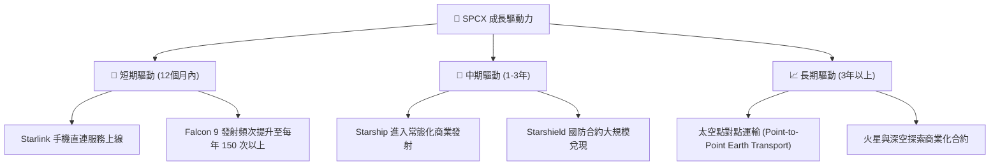

---

## 9. 風險矩陣

### 9.1 風險評分矩陣

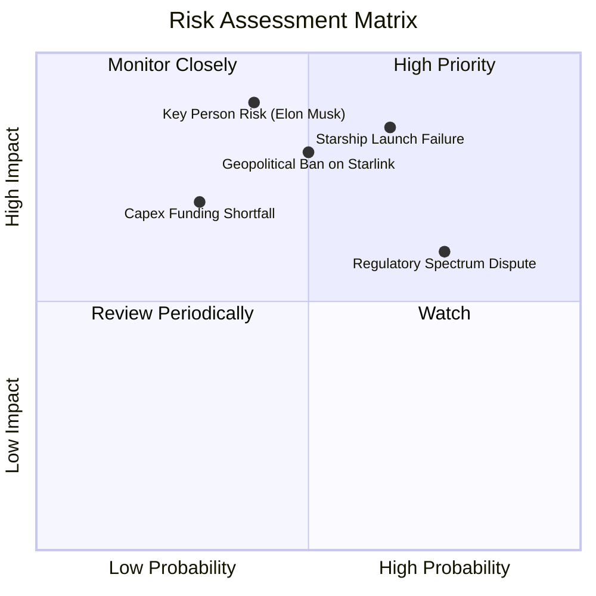

### 9.2 風險清單詳細分析

| # | 風險項目 | 發生機率 | 財務衝擊 | 風險評分 | 緩解措施 |
|---|----------|----------|----------|----------|----------|
| 1 | 🔴 **星艦（Starship）研發嚴重延遲** | 高 (65%) | 高 (-25% 估值) | 🔴 **8.5/10** | 保持 Falcon Heavy 的發射能力，作為中短期重載發射的備用方案。 |
| 2 | 🔴 **地緣政治導致 Starlink 落地受阻** | 中 (50%) | 極高 (-40% 營收潛力) | 🔴 **8.0/10** | 與當地電信運營商成立合資公司（如在日本、菲律賓的合作模式），降低准入壁壘。 |
| 3 | 🟡 **關鍵人物風險（馬斯克多任務分心）** | 中 (40%) | 極高 (-15% 股價) | 🟡 **7.0/10** | 強化以金伯利（Gwynne Shotwell, COO）為核心的職業經理人日常運營團隊。 |
| 4 | 🟡 **頻譜與軌道資源監管爭端** | 高 (75%) | 中 (-10% 營運效率) | 🟡 **6.5/10** | 積極參與 ITU（國際電信聯盟）與 FCC 的標準制定，搶先佔用優質軌道。 |

---

## 10. 投資建議

### 10.1 最終綜合評級雷達圖

```
╔══════════════════════════════════════════════════════════════╗
║                    SPCX 投資價值終極雷達圖                   ║
╠══════════════════════════════════════════════════════════════╣
║                                                              ║
║  技術創新力：  9.5/10  ▓▓▓▓▓▓▓▓▓▓▓▓▓▓▓▓▓▓▓░  ★★★★★         ║
║  行業壁壘深度：9.5/10  ▓▓▓▓▓▓▓▓▓▓▓▓▓▓▓▓▓▓▓░  ★★★★★         ║
║  營收成長動能：9.0/10  ▓▓▓▓▓▓▓▓▓▓▓▓▓▓▓▓▓▓░░  ★★★★★         ║
║  資產負債健康：7.5/10  ▓▓▓▓▓▓▓▓▓▓▓▓▓▓▓░░░░░  ★★★★☆         ║
║  短期獲利能力：6.0/10  ▓▓▓▓▓▓▓▓▓▓▓▓░░░░░░░░  ★★★☆☆         ║
║  估值安全邊際：4.5/10  ▓▓▓▓▓▓▓▓▓░░░░░░░░░░░  ★★☆☆☆         ║
║                                                              ║
║  🏆 綜合投資評等：🟢 買入 (BUY) - 適合長線戰略配置           ║
╚══════════════════════════════════════════════════════════════s╝
```

### 10.2 目標價與隱含報酬率

| 投資情境 | 目標價 | 隱含報酬率 (相較 $185) | 發生機率權重 | 權重後目標價貢獻 |
|----------|--------|------------------------|--------------|------------------|
| 🟢 **樂觀情境** | $310.00 | +67.6% | 30% | $93.00 |
| 🟡 **基準情境** | $188.17 | +1.7% | 50% | $94.09 |
| 🔴 **悲觀情境** | $110.00 | -40.5% | 20% | $22.00 |
| **加權綜合目標價** | — | — | **100%** | **$209.09**（相較當前溢價 13.0%） |

### 10.3 買入時機與觸發因素

```
╔══════════════════════════════════════════════════════════════════╗
║                  ✅ SPCX 投資操作手冊 Checklist                 ║
╠══════════════════════════════════════════════════════════════════╣
║                                                                  ║
║  立即買入觸發條件（滿足任二即可分批建倉）：                      ║
║  ✅ Starship 成功完成下一次軌道級回收測試。                      ║
║  ✅ Starlink 單季新增用戶數超預期突破 50 萬戶。                   ║
║  ✅ 股價回調至 $165.00 - $175.00 的強力技術支撐區。              ║
║                                                                  ║
║  加碼觸發條件（出現以下情況可積極加碼）：                        ║
║  ☐ Starshield（星盾）獲得美國國防部單筆 >$5B 的長期排他性合約。  ║
║  ☐ 宣佈 Starlink 業務正式分拆（Spin-off）並單獨上市。            ║
║                                                                  ║
║  減碼/停損觸發條件（出現以下情況需果斷避險）：                   ║
║  ☐ Starship 發生連續兩次毀滅性發射失敗，導致研發時程延遲1年以上。 ║
║  ☐ FCC 限制 Starlink 的頻譜使用權，或遭遇重大國家安全監管處罰。  ║
╚══════════════════════════════════════════════════════════════════╝
```

### 10.4 投資人適配度分析

```mermaid
graph TD
    INV["🎯 投資人適配度分析"]

    INV --> G["📈 成長型投資者 (Growth)"]
    INV --> V["💎 價值型投資者 (Value)"]
    INV --> D["💰 股息型投資者 (Dividend)"]
    INV --> T["📊 短期交易者 (Trader)"]

    G --> G1["✅ 極高契合度<br/>適合度：★★★★★<br/>公司處於高成長重投資期"]
    V --> V1["⚠️ 契合度較低<br/>適合度：★★☆☆☆<br/>當前估值溢價極高，無安全邊際"]
    D --> D1["❌ 完全不適合<br/>適合度：☆☆☆☆☆<br/>派息率為 0.0%，未來10年無配息計畫"]
    T --> T1["🟡 中等契合度<br/>適合度：★★★☆☆<br/>可利用星艦發射