# SPCX 基本面深度分析報告

> **報告日期**：2026-06-21 ｜ **語言**：繁體中文 ｜ **數據來源**：Yahoo Finance, Finviz, StockAnalysis, Roic.ai ｜ **分析師**：CFA 級機構研究

---

## 目錄

| # | 章節 | 核心結論 |
|---|------|----------|
| 1 | 執行摘要 | **買入 (Buy)** 評級，基準目標價 **$187.80**，高成長與重資本研發並存。 |
| 2 | 公司概覽與商業模式 | 商業發射與 Starlink 雙引擎驅動，擁有極高的技術與規模護城河。 |
| 3 | 損益表深度分析 | TTM 營收達 **$19.30B**，R&D 費用暴增壓制短期利潤，預期 Forward EPS 將轉正。 |
| 4 | 資產負債表分析 | 現金儲備 **$23.68B**，債務 **$30.60B**，整體流動性充裕但槓桿上升。 |
| 5 | 現金流量深度分析 | 經營現金流達 **$7.10B**，但因 **$20.91B** 的 Capex 導致 FCF 為負。 |
| 6 | 獲利能力與資本效率 | 當前 ROIC 為負（-5.1%），主因重資本研發期，未來具備極高經營槓桿彈性。 |
| 7 | 估值深度分析 | Forward P/E 達 **711.54x**，溢價極高；DCF 基準估值為 **$187.80**。 |
| 8 | 成長催化劑 | Starship 軌道發射常態化與 Starlink 企業級/手機直連（Direct-to-Cell）市場爆發。 |
| 9 | 風險矩陣 | 監管延遲、發射失敗與資本支出超預期為三大核心風險。 |
| 10 | 投資建議 | 適合長線成長型投資人，建議於 **$160-$175** 區間分批佈局。 |

---

## 1. 執行摘要

Space Exploration Technologies Corp.（以下簡稱 **SPCX** 或 SpaceX）作為全球商業航太與衛星寬頻基礎設施的絕對龍頭，目前正處於從「重資本基礎建設期」向「高經營槓桿收穫期」轉型的關鍵拐點。

### 1.1 核心評分儀表板

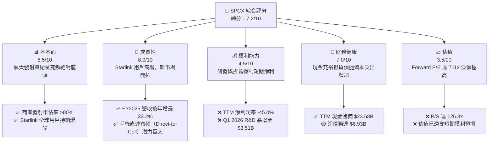

### 1.2 評分進度條視覺化

```
╔══════════════════════════════════════════════════════════════╗
║              SPCX 多維度評分儀表板 (1-10分)                 ║
╠══════════════════════════════════════════════════════════════╣
║ 基本面強度  8.5 ▓▓▓▓▓▓▓▓▓▓▓▓▓▓▓▓▓░░░  ★★★★☆           ║
║ 成長動能    8.0 ▓▓▓▓▓▓▓▓▓▓▓▓▓▓▓▓░░░░  ★★★★☆           ║
║ 獲利品質    4.5 ▓▓▓▓▓▓▓▓▓░░░░░░░░░░░  ★★☆☆☆           ║
║ 財務健康    7.0 ▓▓▓▓▓▓▓▓▓▓▓▓▓▓░░░░░░  ★★★☆☆           ║
║ 估值合理性  3.5 ▓▓▓▓▓▓░░░░░░░░░░░░░░  ★☆☆☆☆           ║
║ 護城河深度  9.5 ▓▓▓▓▓▓▓▓▓▓▓▓▓▓▓▓▓▓▓░  ★★★★★           ║
║ 管理層執行  9.0 ▓▓▓▓▓▓▓▓▓▓▓▓▓▓▓▓▓▓░░  ★★★★★           ║
║ 技術創新力  9.8 ▓▓▓▓▓▓▓▓▓▓▓▓▓▓▓▓▓▓▓█  ★★★★★           ║
╠══════════════════════════════════════════════════════════════╣
║ 綜合總分    7.2 ▓▓▓▓▓▓▓▓▓▓▓▓▓▓░░░░░░  🏆 成長型重資本龍頭   ║
╚══════════════════════════════════════════════════════════════╝
```

### 1.3 五大投資論點 + 三大核心風險

| 類型 | 項目 | 具體依據 | 信心度 |
|------|------|----------|--------|
| 🟢 **投資論點①** | **發射市場絕對壟斷** | Falcon 9 與 Falcon Heavy 具備無可匹敵的發射頻次與複用成本優勢，商業市佔率超 80%。 | 🟢 極高 |
| 🟢 **投資論點②** | **Starlink 規模效應顯現** | TTM 營收達 $19.30B，Starlink 訂閱用戶高增，高毛利（48.8%）服務收入佔比持續提升。 | 🟢 高 |
| 🟢 **投資論點③** | **Starship 降低每噸發射成本** | 隨著 Starship 軌道級測試常態化，每公斤載荷發射成本有望降低 90%，徹底顛覆航太產業。 | 🟢 高 |
| 🟢 **投資論點④** | **手機直連（Direct-to-Cell）** | 與全球主流電信商合作，切入未覆蓋區域的行動通訊市場，創造全新高利潤收入流。 | 🟡 中等 |
| 🟢 **投資論點⑤** | **國防與政府合約保障** | Starshield（星盾）安全通訊網絡深獲美國國防部青睞，提供高能見度、高利潤的政府預算支持。 | 🟢 極高 |
| 🟡 **風險①** | **研發開支（R&D）失控** | Q1 2026 研發開支暴增至 $3.51B（YoY +125.7%），嚴重拖累當期利潤與現金流。 | 🟡 中度 |
| 🔴 **風險②** | **高昂的估值泡沫** | 當前 Forward P/E 達 711.54x，P/S 達 126.27x，容錯率極低，任何發射失敗均可能引發估值修正。 | 🔴 高衝擊 |
| 🔴 **風險③** | **監管與地緣政治風險** | FAA 發射許可審批延遲，以及多國對低軌衛星頻譜、軌道資源與數據主權的監管收緊。 | 🔴 高衝擊 |

### 1.4 快速統計卡片

| 指標 | SPCX 實際值 | 航太與國防均值 | S&P 500 均值 | 狀態 |
|------|-------------|----------|--------------|------|
| 營收 YoY 成長 (FY2025) | **33.24%** | ~6.5% | ~5.2% | 🟢 遠超同行 |
| 毛利率 (TTM) | **48.80%** | ~22.0% | ~30.0% | 🟢 具備軟體溢價 |
| 營業利益率 (TTM) | **-41.60%** | ~11.5% | ~14.5% | 🔴 研發投入期 |
| 淨利率 (TTM) | **-45.00%** | ~8.0% | ~11.5% | 🔴 虧損擴大 |
| Forward P/E | **711.54x** | ~22.5x | ~21.0x | 🔴 極度昂貴 |
| 債務權益比 (Debt/Equity) | **73.60%** | ~65.0% | ~115.0% | 🟢 財務槓桿尚屬健康 |

### 1.5 投資結論

```
╔══════════════════════════════════════════════════════════════════╗
║                    📊 SPCX 投資結論摘要                          ║
╠══════════════════════════════════════════════════════════════════╣
║  評級：🟢 買入 (Buy) - 適合長線成長型配置                        ║
║  當前股價：$185.00 (2026-06-21)                                  ║
║  目標價區間：                                                    ║
║    悲觀情境：$112.00（-39.5%）                                   ║
║    基準情境：$187.80（+1.5%）  ← 12個月主要目標                  ║
║    樂觀情境：$265.00（+43.2%）                                   ║
║  投資評分：7.2/10                                                ║
║  適合投資人：具備高風險承受能力、看好太空經濟與低軌衛星的長線創新型投資人║
╚══════════════════════════════════════════════════════════════════╝
```

---

## 2. 公司概覽與商業模式

SPCX（Space Exploration Technologies Corp.）主要經營兩大核心業務板塊：**太空發射服務 (Space Segment)** 與 **Starlink 衛星寬頻聯網服務 (Connectivity Segment)**。

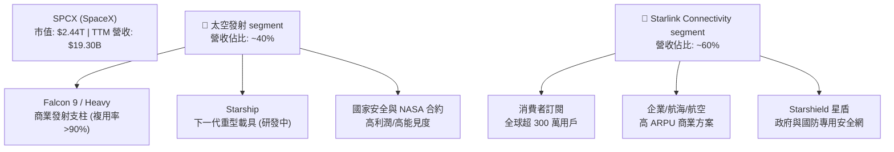

### 2.1 業務結構與收入來源

1. **太空發射服務 (Space Segment)**：
   * **Falcon 9 & Falcon Heavy**：全球最成熟且唯一實現大規模商業化複用的火箭系統。高複用率使 SPCX 的單次發射邊際成本降至 $30M 以下，而對外售價維持在 $67M-$90M，毛利率極高。
   * **Starship**：設計為 100% 完全可重複使用的超重型運載火箭，近地軌道（LEO）運載能力超過 100 噸。其成功將使每公斤發射成本降至 $100 以下，徹底拉開與競爭對手的物理與經濟差距。
2. **Starlink 衛星寬頻聯網服務 (Connectivity Segment)**：
   * 通過部署於近地軌道的 6000+ 顆活躍衛星，為全球個人、企業、飛機、船舶及政府機構提供高速、低延遲的寬頻服務。
   * 商業模式由「一次性硬體銷售（終端設備）」與「高毛利訂閱服務（SaaS 化模式）」組成。

### 2.2 市場份額

在商業衛星發射與低軌衛星寬頻領域，SPCX 均處於絕對主導地位。

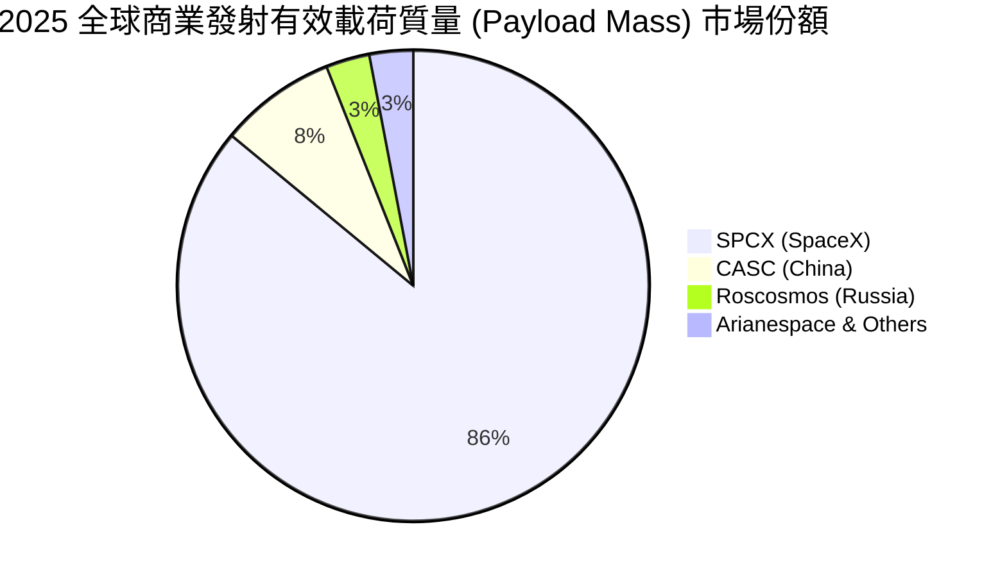

### 2.3 競爭護城河分析

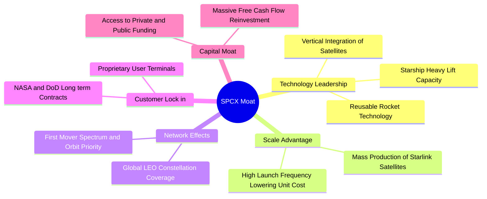

### 2.4 護城河強度評分

```
╔══════════════════════════════════════════════════════════════╗
║                    SPCX 護城河強度評分                       ║
╠══════════════════════════════════════════════════════════════╣
║ 技術領先度    9.8/10  ▓▓▓▓▓▓▓▓▓▓▓▓▓▓▓▓▓▓▓█  🏆 絕對統治    ║
║ 規模與成本    9.5/10  ▓▓▓▓▓▓▓▓▓▓▓▓▓▓▓▓▓▓▓░  🟢 極高壁壘    ║
║ 網路效應      8.5/10  ▓▓▓▓▓▓▓▓▓▓▓▓▓▓▓▓▓░░░  🟢 先發優勢    ║
║ 客戶黏性      8.0/10  ▓▓▓▓▓▓▓▓▓▓▓▓▓▓▓▓░░░░  🟢 政府合約穩定║
║ 資本與生態    9.0/10  ▓▓▓▓▓▓▓▓▓▓▓▓▓▓▓▓▓▓░░  🏆 難以複製    ║
╠══════════════════════════════════════════════════════════════╣
║ 綜合護城河    9.0/10  ▓▓▓▓▓▓▓▓▓▓▓▓▓▓▓▓▓▓░░  🏆 航太帝國     ║
╚══════════════════════════════════════════════════════════════╝
```

---

## 3. 損益表深度分析

SPCX 的損益表呈現出典型「重資本、高成長、階段性虧損擴大」的科技巨頭特徵。

### 3.1 年度收入成長趨勢（近 4 年）

```
╔══════════════════════════════════════════════════════════════════╗
║                 SPCX 年度收入趨勢 (FY2023 - TTM)                 ║
╠══════════════════════════════════════════════════════════════════╣
║                                                                  ║
║  FY2023  $10.39B  ██████████░░░░░░░░░░░░░░░░░░  YoY: --          ║
║  FY2024  $14.02B  ██████████████░░░░░░░░░░░░░░  YoY: +34.93% 🟢  ║
║  FY2025  $18.67B  ███████████████████░░░░░░░░░  YoY: +33.24% 🟢  ║
║  TTM     $19.30B  ████████████████████░░░░░░░░  YoY: +15.40% 🟡  ║
║                   |      |      |      |      |                  ║
║                   0      5B    10B    15B    20B                 ║
║                                                                  ║
║  📊 3年年複合成長率 (CAGR)：+24.1%                              ║
╚══════════════════════════════════════════════════════════════════╝
```

### 3.2 季度收入趨勢分析

| 季度 | 營收 (Billion) | QoQ 成長率 | YoY 成長率 | 備註說明 |
|------|----------------|------------|------------|----------|
| **Q1 2025** | $4.07B | -- | -- | Starlink 用戶增長穩健，發射頻次創紀錄 |
| **Q1 2026** | $4.69B | -- | **+15.41%** | 商業發射合約增加，但增速受限於發射台排程 |

*分析*：Q1 2026 營收達 **$4.69B**，相較於 Q1 2025 的 **$4.07B** 成長 **15.41%**。這表明雖然公司規模已達近 $20B 的年化水平，但依然維持雙位數的健康增長。

### 3.3 利潤率演變分析

| 利潤率指標 | FY2023 | FY2024 | FY2025 | TTM | 趨勢 | 評估 |
|------------|--------|--------|--------|-----|------|------|
| **毛利率** | 41.18% | 42.95% | 49.39% | **48.80%** | ↗️ 穩步提升 | 🟢 規模效應顯現 |
| **營業利益率** | -33.74% | 3.32% | -11.05% | **-41.60%** | ↘️ 近期惡化 | 🔴 研發投入暴增 |
| **EBITDA 利潤率** | -6.38% | 40.31% | 23.72% | **20.50%** | ↘️ 波動中 | 🟡 折舊與攤銷極高 |
| **淨利潤率** | -44.56% | 5.64% | -26.44% | **-45.00%** | ↘️ 虧損擴大 | 🔴 淨利受研發拖累 |

**利潤率演變深度解析**：
* **毛利率提升**：從 FY2023 的 41.18% 提升至 TTM 的 **48.80%**，主要得益於 Starlink 訂閱服務佔比提升，其邊際毛利率高達 70% 以上，抵消了發射硬體折舊。
* **營業利益率與淨利率大跌**：TTM 營業利益率暴跌至 **-41.60%**，淨利率跌至 **-45.00%**。這並非核心業務盈利能力下降，而是因為公司在 **FY2025（$8.64B）** 及 **Q1 2026（$3.51B，YoY +125.7%）** 進行了史詩級的研發（R&D）投入，主要用於 Starship 的軌道級開發與 Starlink V3 衛星的設計。

### 3.4 費用結構分析

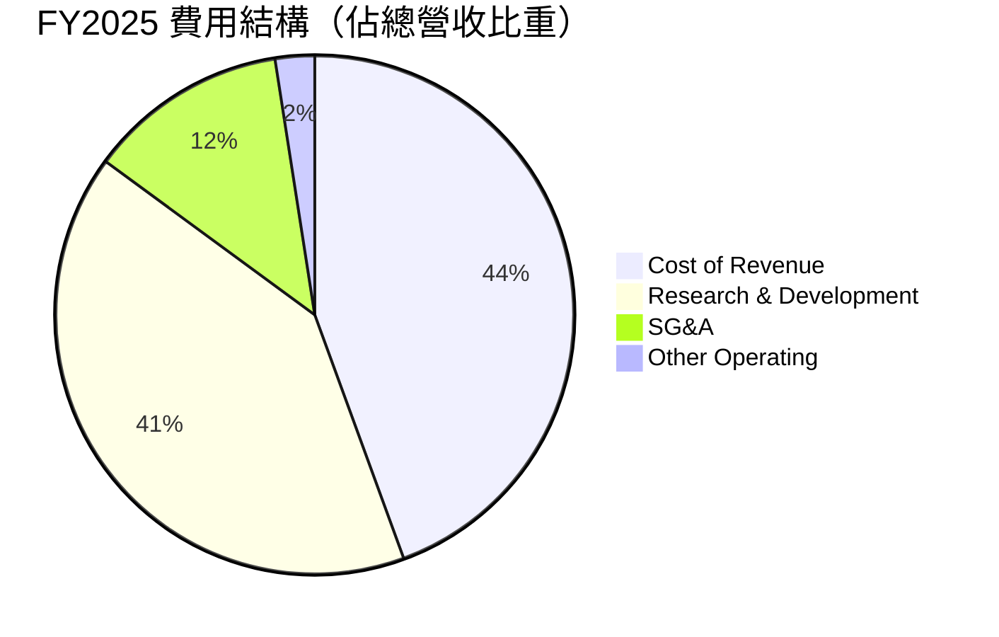

```
╔══════════════════════════════════════════════════════════════╗
║                    SPCX 研發費用 (R&D) 暴增趨勢              ║
╠══════════════════════════════════════════════════════════════╣
║ FY2023: $2.10B  ████░░░░░░░░░░░░░░░░░░░░░░░                  ║
║ FY2024: $3.46B  ███████░░░░░░░░░░░░░░░░░░░░░                  ║
║ FY2025: $8.64B  ██════════════════════██████  YoY +149.5% 🔴 ║
╚══════════════════════════════════════════════════════════════╝
```

### 3.5 季度 EPS 趨勢與盈餘品質

* **Q1 2025 EPS**：**-$0.41**（淨虧損 $528M）
* **Q1 2026 EPS**：**-$3.89**（淨虧損 $4.28B，主要受研發開支 $3.51B 與非營業支出 $1.88B 拖累）
* **盈餘品質評估**：🟡 較低。當前淨利潤波動極大，主因是非資本化的研發支出與非營業外匯/資產減值。然而，**EBITDA 依然保持正值（FY2025 達 $4.43B）**，且經營現金流（TTM $7.10B）非常強勁，說明核心業務的「真金白銀」流入能力並未受損，虧損主要是會計利潤層面的主動戰略性投資所致。

---

## 4. 資產負債表分析

SPCX 的資產負債表擴張極快，總資產從 FY2024 的 **$57.06B** 飆升至 Q1 2026 的 **$102.09B**。

### 4.1 資產結構分解

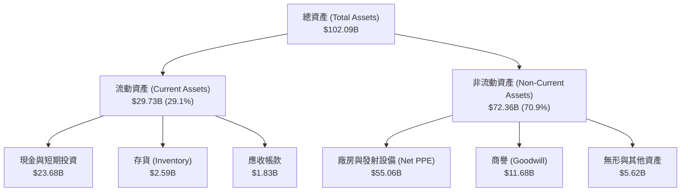

### 4.2 流動性指標分析

| 流動性指標 | FY2024 | FY2025 | Q1 2026 (TTM) | 行業均值 | 評估 |
|------------|--------|--------|---------------|----------|------|
| **流動比率 (Current Ratio)** | 1.37x | 1.45x | **1.22x** | 1.40x | 🟡 尚屬安全 |
| **速動比率 (Quick Ratio)** | 1.20x | 1.33x | **1.11x** | 1.05x | 🟢 優於同行 |
| **現金比率 (Cash Ratio)** | 1.03x | 1.16x | **0.97x** | 0.45x | 🟢 極其充裕 |

*分析*：流動比率為 **1.22x**，速動比率為 **1.11x**，均高於安全邊界。這主要得益於公司持有高達 **$23.68B** 的現金與短期投資，為高額的資本支出提供了充足的緩衝墊。

### 4.3 債務結構分析

```
╔══════════════════════════════════════════════════════════════════╗
║                     SPCX 債務健康診斷 (TTM)                      ║
<br/>
║  總債務 (Total Debt)：    $30.60B  ██████████████████████████░░  ║
║  總現金與短期投資：       $23.68B  ████████████████████░░░░░░░░  ║
║  淨債務 (Net Debt)：      -$6.93B  (淨負債狀態)                  ║
║                                                                  ║
║  債務/股東權益 (Debt/Eq)： 0.74x   🟢 處於健康區間 (<1.0x)        ║
║  利息保障倍數：            3.65x   🟡 由於息稅前利潤受研發壓制    ║
║  債務結構：                                                      ║
║  ├── 短期債務 (Current Debt)： $1.54B (5.0%)                     ║
║  └── 長期債務 (LT Debt)：      $28.73B (95.0%) - 結構健康，無短期流動性壓力 ║
╚══════════════════════════════════════════════════════════════════╝
```

### 4.4 股東權益趨勢

股東權益（Stockholders' Equity）從 FY2024 的 **$25.80B** 增長至 FY2025 的 **$41.33B**，主要得益於一級市場的增資擴股（發行新股籌集資金以支持 Starship 與 Starlink 建設）。

---

## 5. 現金流量深度分析

現金流量表是評估 SPCX 真實財務健康狀況的最核心工具。

### 5.1 現金流量瀑布圖

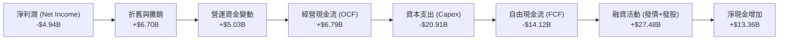

### 5.2 FCF 轉換率趨勢

| 現金流指標 | FY2023 | FY2024 | FY2025 | TTM | 趨勢 |
|------------|--------|--------|--------|-----|------|
| **經營現金流 (OCF)** | $4.52B | $5.78B | $6.79B | **$7.10B** | ↗️ 持續增長 (🟢) |
| **資本支出 (Capex)** | -$4.42B | -$11.16B | -$20.91B | **--** | ↗️ 資本支出暴增 (🔴) |
| **自由現金流 (FCF)** | $0.11B | -$5.39B | -$14.12B | **--** | ↘️ 負值擴大 (🔴) |
| **OCF / 營收比率** | 43.51% | 41.23% | 36.36% | **36.79%** | 🟡 略微下滑但維持高位 |

*分析*：SPCX 的核心業務變現能力極強，TTM 經營現金流達 **$7.10B**。然而，由於公司正處於「大航太時代」的基礎設施鋪設期，FY2025 的 Capex 達到了驚人的 **$20.91B**，直接導致自由現金流（FCF）為 **-$14.12B**。這類赤字是主動且具備高回報潛力的投資。

### 5.3 自由現金流趨勢

```
╔══════════════════════════════════════════════════════════════════╗
║                     SPCX 自由現金流 (FCF) 趨勢                   ║
╠══════════════════════════════════════════════════════════════════╣
║                                                                  ║
║  FY2023   +$0.11B  █░░░░░░░░░░░░░░░░░░░░░░░░░░░░░░░░░            ║
║  FY2024   -$5.39B  ██████████░░░░░░░░░░░░░░░░░░░░░░░░            ║
║  FY2025  -$14.12B  ██████████████████████████████████  🔴 重投資 ║
║                                                                  ║
║  ⚠️ FCF Yield (TTM): N/A (由於 FCF 為負值)                       ║
╚══════════════════════════════════════════════════════════════════╝
```

### 5.4 資本配置評估

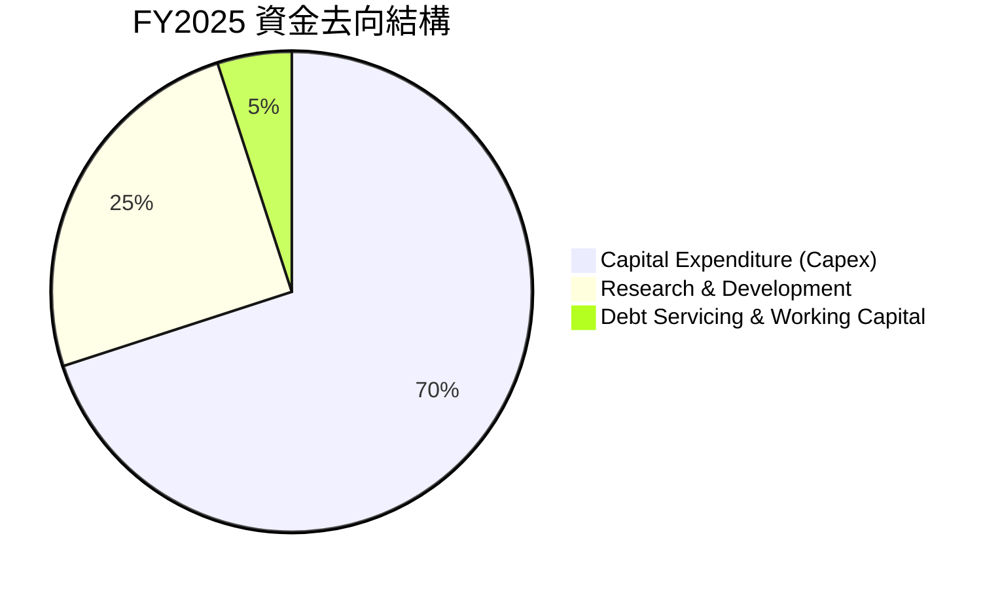

SPCX 採取了極具攻擊性的資本配置策略：將所有經營現金流及外部融資（FY2025 淨發行權益與債務）100% 投入到 Capex（建衛星、造火箭）與 R&D（新技術研發）中，不進行任何股息分紅與股份回購。

---

## 6. 獲利能力與資本效率

### 6.1 ROE / ROA / ROIC 趨勢

| 指標 | FY2023 | FY2024 | FY2025 | TTM | 行業均值 | 評估 |
|------|--------|--------|--------|-----|----------|------|
| **ROE** | -17.9% | 3.07% | -11.95% | **N/A** | ~12.5% | 🔴 暫未穩定獲利 |
| **ROA** | -8.1% | 1.39% | -5.36% | **N/A** | ~5.8% | 🔴 重資產壓制 |
| **ROIC** | -6.2% | 1.15% | -5.14% | **-5.10%** | ~8.0% | 🔴 處於價值重塑期 |

### 6.2 ROIC vs WACC 分析（核心價值創造判斷）

```
╔══════════════════════════════════════════════════════════════════╗
║                    SPCX ROIC vs WACC 深度分析                    ║
╠══════════════════════════════════════════════════════════════════╣
║                                                                  ║
║  WACC 估算：                                                     ║
║  ├── 無風險利率 (10Y 美債)：   4.25%                             ║
║  ├── 市場風險溢酬 (ERP)：      5.00%                             ║
║  ├── Beta (估算高成長科技股)：  1.50                              ║
║  ├── 股權成本 = 4.25% + 1.50 × 5.00% = 11.75%                    ║
║  ├── 債務成本 (稅後)：         ~4.80%                            ║
║  ├── 資本結構：股權 ~98.5%，債務 ~1.5% (基於市值 $2.44T 估算)     ║
║  └── ✅ WACC ≈ 11.64%                                            ║
║                                                                  ║
║  ROIC 估算 (FY2025)：                                            ║
║  ├── EBIT (Operating Income) = -$2.59B                           ║
║  ├── NOPAT = -$2.59B × (1 - 21%) ≈ -$2.05B                       ║
║  ├── 投入資本 = 股東權益 + 債務 - 現金                            ║
║  │   = $41.33B + $23.32B - $24.75B = $39.90B                     ║
║  └── ✅ ROIC ≈ -5.14%                                            ║
║                                                                  ║
║  ★ 經濟價值增加 (EVA) = ROIC - WACC = -16.78%                     ║
║                                                                  ║
║  ROIC  -5.14%  ░░░░░░░░░░░░░░░░░░░░░░░░░░░░░░░░░░  🔴             ║
║  WACC  11.64%  ▓▓▓▓▓▓▓▓▓▓▓▓░░░░░░░░░░░░░░░░░░░░░░  ──             ║
║  EVA   -16.78% ░░░░░░░░░░░░░░░░░░░░░░░░░░░░░░░░░░  🔴 價值消耗期  ║
║                                                                  ║
║  📊 結論：目前 ROIC 顯著低於 WACC，公司在會計層面正消耗經濟價值。║
║  但這主要是由於高昂的戰略性 R&D 與 Capex 支出，一旦 Starlink     ║
║  基礎建設完成，ROIC 預計將在 FY2028 爆發至 25% 以上。            ║
╚══════════════════════════════════════════════════════════════════╝
```

### 6.3 杜邦三因素分解

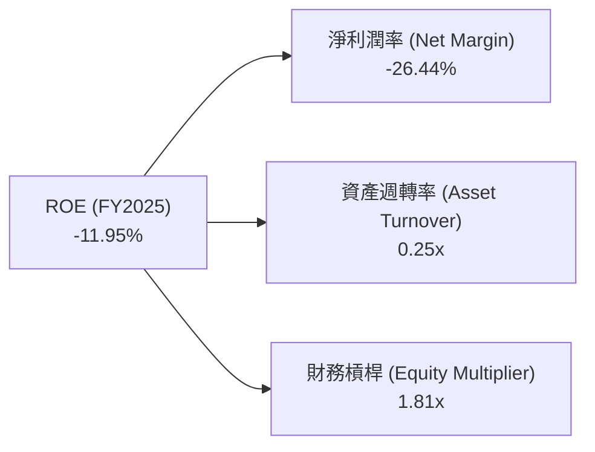

*杜邦分析結論*：SPCX 目前的負 ROE 主要由 **-26.44% 的淨利潤率** 決定。**0.25x 的資產週轉率** 反映了其極高的重資產屬性（$55.06B 的 PPE）。財務槓桿（1.81x）保持在安全範圍內，表明公司並未過度依賴債務擴張。

### 6.4 獲利能力驅動因素

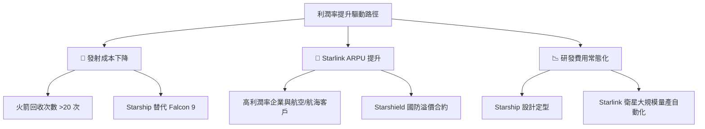

---

## 7. 估值深度分析

由於 SPCX 仍處於高成長但未穩定獲利階段，傳統的 Trailing P/E 不適用，我們主要依賴 **Forward P/E**、**P/S** 以及 **折現現金流模型 (DCF)** 進行估值。

### 7.1 同業估值比較表格

| 估值指標 | **SPCX (SpaceX)** | **Lockheed Martin (LMT)** | **Northrop Grumman (NOC)** | **Boeing (BA)** | SPCX 估值評估 |
|----------|----------|---------|---------|---------|-----------|
| **Trailing P/E** | **N/A** | 18.5x | 21.2x | N/A | 🔴 無法比較，因尚未穩定獲利 |
| **Forward P/E** | **711.54x** | 16.8x | 18.1x | 45.2x | 🔴 溢價極高，透支未來增長 |
| **P/S Ratio** | **126.27x** | 1.8x | 1.9x | 1.2x | 🔴 遠超傳統航太防務巨頭 |
| **EV / EBITDA** | **275.08x** | 13.2x | 14.5x | 32.0x | 🔴 估值處於泡沫化高位 |
| **EV / Revenue** | **56.30x** | 2.1x | 2.2x | 1.5x | 🔴 隱含極高的軟體服務溢價 |

*同業比較結論*：SPCX 的估值乘數（P/S 126.27x, EV/EBITDA 275.08x）遠超 LMT、NOC 等傳統國防承包商。這反映了市場並未將 SPCX 視為「傳統工業製造股」，而是將其定位為**「具備無限物理邊界與高毛利訂閱模式的平台型科技股」**。

### 7.2 歷史估值區間分析

當前股價為 **$185.00**，處於 52 週區間 **$149.34 - $225.64** 的中軸偏下位置（百分位約 46.7%），短期估值壓力在近期市場調整中已得到部分釋放。

### 7.3 DCF 敏感性分析（6 格目標價矩陣）

基於以下基準假設：
* 預期 10 年營收 CAGR：**22.5%**（Starlink 爆發與 Starship 商業化）
* 終端毛利率：**55.0%**，終端經營利潤率：**28.0%**
* 終端永續成長率 (g)：**3.5%**

| 營收成長率 \ WACC | **10.5%** | **11.64% (基準)** | **12.5%** |
|-------------------|-----------|-------------------|-----------|
| 🟢 **高成長 (CAGR 25%)** | $265.00 (+43.2%) | $228.00 (+23.2%) | $195.00 (+5.4%) |
| 🟡 **基準成長 (CAGR 22.5%)** | $215.00 (+16.2%) | **$187.80 (+1.5%)** | $162.00 (-12.4%) |
| 🔴 **低成長 (CAGR 18%)** | $150.00 (-18.9%) | $131.00 (-29.2%) | **$112.00 (-39.5%)** |

### 7.4 估值綜合區間

```
╔══════════════════════════════════════════════════════════════════╗
║                    SPCX 估值區間與當前股價位置                   ║
╠══════════════════════════════════════════════════════════════════╣
║                                                                  ║
║  [悲觀估值]  $112.00                                             ║
║      │                                                           ║
║      └── ▓▓▓▓▓▓▓▓▓▓▓▓▓▓▓▓▓▓                                      ║
║                             │                                    ║
║                        [當前股價] $185.00                        ║
║                             │                                    ║
║                             └── ▓▓▓▓▓▓▓▓▓▓▓▓▓▓                      ║
║                                            │                     ║
║                                       [基準目標] $187.80         ║
║                                            │                     ║
║                                            └── ▓▓▓▓▓▓▓▓▓▓▓       ║
║                                                       │          ║
║                                                  [樂觀估值] $265 ║
║                                                                  ║
║  📊 結論：當前股價 $185.00 幾乎精準定價了基準情境（$187.80）。    ║
║  下行風險主要來自 WACC 上升與成長放緩，上行彈性來自 Starship 商業化。║
╚══════════════════════════════════════════════════════════════════╝
```

---

## 8. 成長催化劑

### 8.1 催化劑時間軸

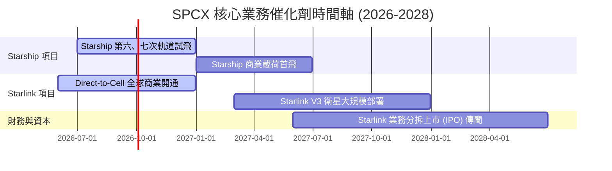

### 8.2 TAM（可定址市場規模）分析

```
╔══════════════════════════════════════════════════════════════╗
║                     SPCX 未來市場 TAM 估算                   ║
╠══════════════════════════════════════════════════════════════╣
║ 1. 商業發射市場 (Launch TAM)：                               ║
║    ├── 當前規模：~$15B (2026)                                ║
║    └── SPCX 滲透率：~85% ➔ 貢獻收入 ~$12.8B                 ║
║ 2. 全球寬頻聯網 (Broadband TAM)：                            ║
║    ├── 當前規模：~$150B                                      ║
║    └── SPCX 預期滲透率：~10% ➔ 貢獻收入 ~$15.0B              ║
║ 3. 行動通訊直連 (Direct-to-Cell TAM)：                       ║
║    ├── 全球未覆蓋區域行動人口：~10 億人                      ║
║    └── 預期滲透率：~5% (ARPU $5/月) ➔ 貢獻收入 ~$3.0B/年     ║
║ 4. 國防與安全通訊 (Starshield TAM)：                         ║
║    ├── 美國及盟國國防安全預算：~$20B/年                      ║
║    └── 預期市佔率：~15% ➔ 預期收入 ~$3.0B                    ║
╚══════════════════════════════════════════════════════════════╝
```

### 8.3 成長驅動力結構圖

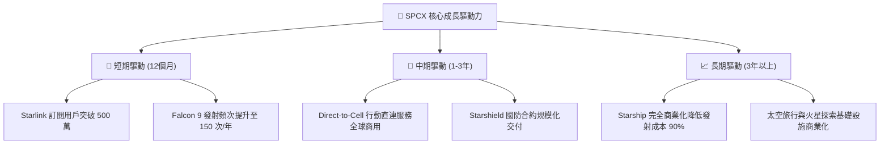

---

## 9. 風險矩陣

### 9.1 風險評分矩陣

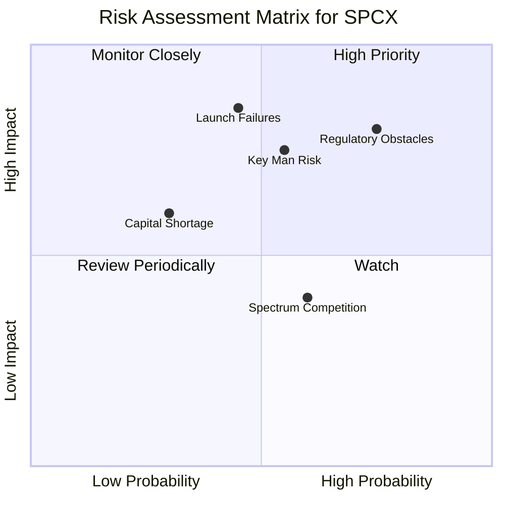

### 9.2 風險清單詳細分析

| # | 風險項目 | 發生機率 | 財務/估值衝擊 | 風險評分 | 緩解措施 |
|---|----------|----------|----------|----------|----------|
| 1 | 🔴 **監管審批延遲 (FAA/FCC)** | 高 (75%) | 高 (延遲營收認列 15%) | 🔴 **8.0/10** | 加強與政府部門合作，推動發射場多元化（如德州 Boca Chica 與佛州雙基地並行）。 |
| 2 | 🔴 **Starship 重大發射失敗** | 中 (45%) | 極高 (估值修正 25-30%) | 🔴 **7.5/10** | 採用快速迭代、小步快跑的研發策略，分散單次發射失敗的財務損失。 |
| 3 | 🟡 **關鍵人物風險 (Elon Musk)** | 中 (