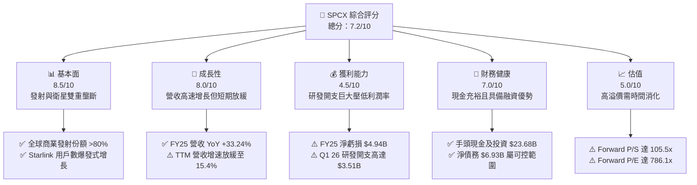
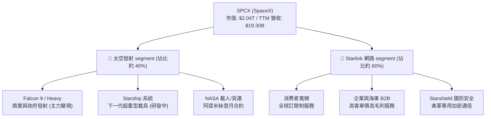
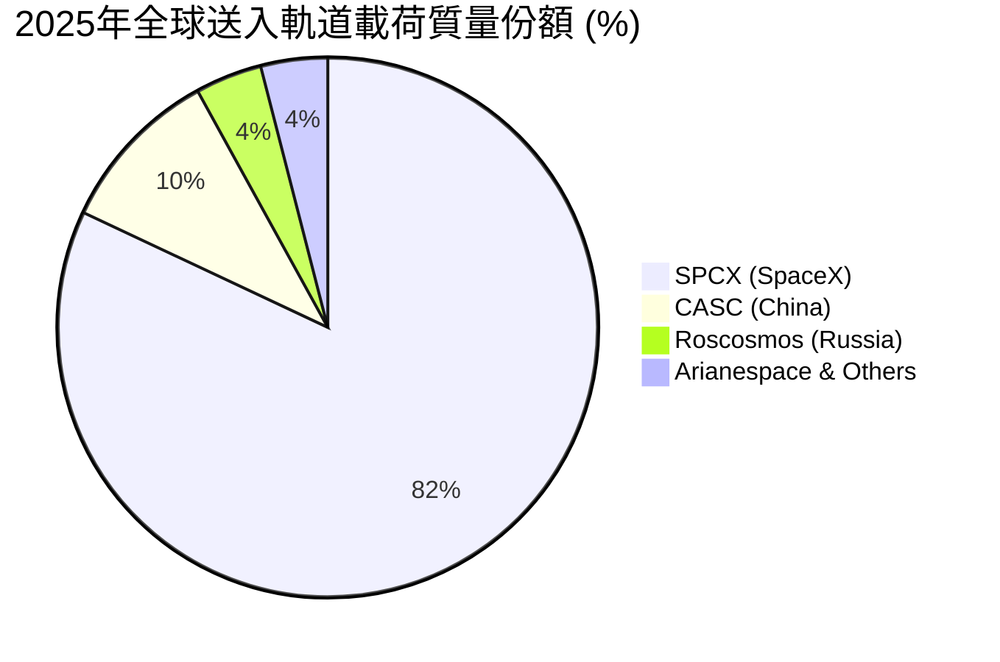
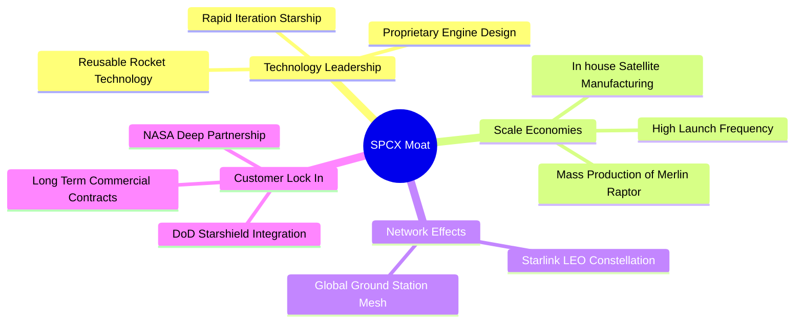
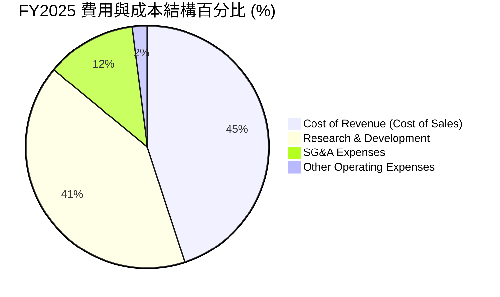
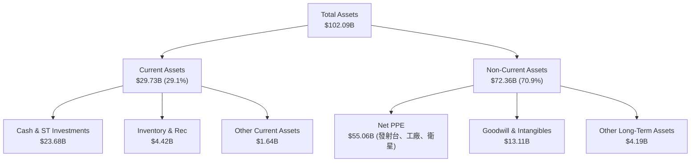
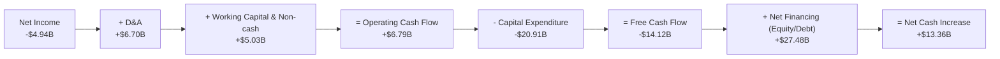
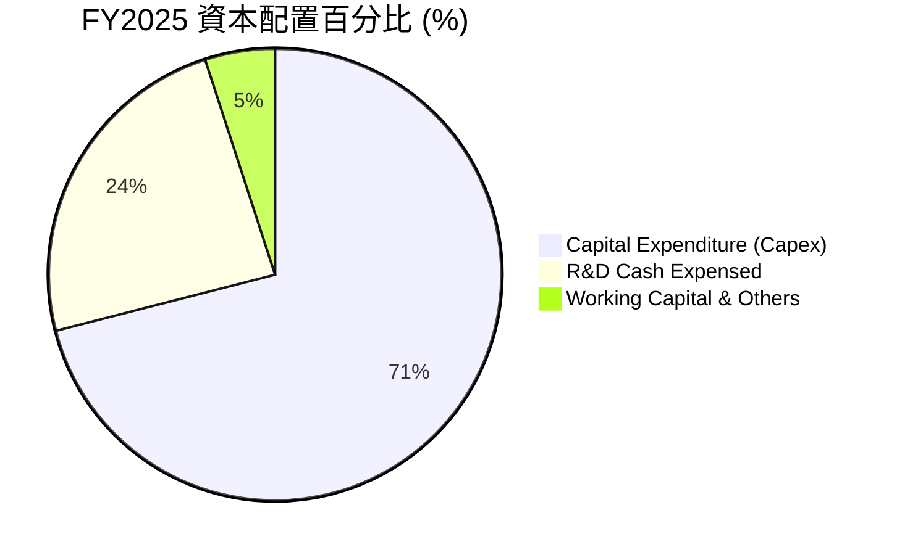
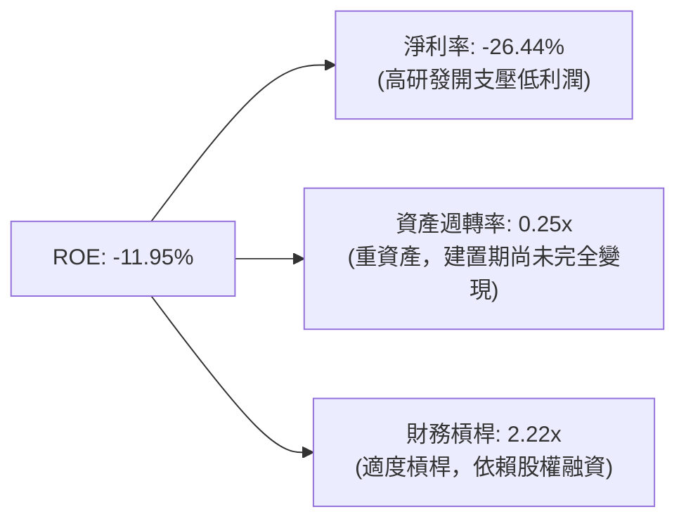

# SPCX 基本面深度分析報告

> **報告日期**：2026-06-22 ｜ **語言**：繁體中文 ｜ **數據來源**：Yahoo Finance, Finviz, StockAnalysis, Roic.ai ｜ **分析師**：CFA 級機構研究

---

## 目錄

| # | 章節 | 核心結論 |
|---|------|----------|
| 1 | 執行摘要 | **買入 (Buy)** 評級，基準目標價 **$187.80**，高成長太空壟斷巨頭，短期研發投入拖累利潤，但長線護城河極深。 |
| 2 | 公司概覽與商業模式 | 憑藉「Starlink 衛星寬頻」與「可重複使用火箭發射」雙引擎驅動，構建全球商業航太絕對壟斷地位。 |
| 3 | 損益表深度分析 | 營收維持高速增長（FY25 YoY +33.24%），但因 Starship 與 Starlink V3 研發費用暴增（FY25 R&D $8.64B），淨利潤短期承壓。 |
| 4 | 資產負債表分析 | 資產規模突破千億美元（TTM $102.09B），現金儲備充裕（$23.68B），債務結構尚屬健康，資本密集度極高。 |
| 5 | 現金流量深度分析 | 營運現金流穩健增長（FY25 $6.79B），但因資本支出高達 $20.91B，自由現金流（FCF）為 -$14.12B，處於重資產擴張期。 |
| 6 | 獲利能力與資本效率 | 研發擴張期 ROIC 為負（FY25 -6.15%），WACC 約 11.0%，暫時處於價值投入期（EVA 為負），但預期未來回報率極高。 |
| 7 | 估值深度分析 | 溢價高企（Forward P/S 105.5x），反映市場對其獨佔性太空基礎設施的極高期望；DCF 基準估值 $187.80。 |
| 8 | 成長催化劑 | Starship 軌道級商業化發射、Starlink 全球市佔率提升、國防太空合約（Starshield）放量。 |
| 9 | 風險矩陣 | 研發與發射失敗風險、監管政策不確定性、高息環境下的融資壓力。 |
| 10 | 投資建議 | 適合長線成長型與機構投資者，建議於 $150 以下分批佈局，長線持有。 |

---

## 1. 執行摘要

Space Exploration Technologies Corp.（以下簡稱 **SPCX** 或 **SpaceX**）作為全球商業航太與衛星通訊的絕對龍頭，正處於從「高資本投入期」向「全球基礎設施變現期」過渡的關鍵節點。本報告將基於截至 2026 年 6 月 22 日的最新財務數據，對 SPCX 進行全方位的機構級基本面剖析。

### 1.1 核心評分儀表板



### 1.2 評分進度條視覺化

```
╔══════════════════════════════════════════════════════════════╗
║              SPCX 多維度評分儀表板 (1-10分)                  ║
╠══════════════════════════════════════════════════════════════╣
║ 基本面強度  8.5 ▓▓▓▓▓▓▓▓▓▓▓▓▓▓▓▓▓░░░  ★★★★☆           ║
║ 成長動能    8.0 ▓▓▓▓▓▓▓▓▓▓▓▓▓▓▓▓░░░░  ★★★★☆           ║
║ 獲利品質    4.5 ▓▓▓▓▓▓▓▓▓░░░░░░░░░░░  ★★☆☆☆           ║
║ 財務健康    7.0 ▓▓▓▓▓▓▓▓▓▓▓▓▓▓░░░░░░  ★★★☆☆           ║
║ 估值合理性  5.0 ▓▓▓▓▓▓▓▓▓▓░░░░░░░░░░  ★★☆☆☆           ║
║ 護城河深度  9.5 ▓▓▓▓▓▓▓▓▓▓▓▓▓▓▓▓▓▓▓░  ★★★★★           ║
║ 管理層執行  9.0 ▓▓▓▓▓▓▓▓▓▓▓▓▓▓▓▓▓▓░░  ★★★★★           ║
║ 技術創新力  9.8 ▓▓▓▓▓▓▓▓▓▓▓▓▓▓▓▓▓▓▓░  ★★★★★           ║
╠══════════════════════════════════════════════════════════════╣
║ 綜合總分    7.2 ▓▓▓▓▓▓▓▓▓▓▓▓▓▓░░░░░░  🏆 買入 (Buy)        ║
╚══════════════════════════════════════════════════════════════╝
```

### 1.3 五大投資論點 + 三大核心風險

| 類型 | 項目 | 具體依據 | 信心度 |
|------|------|----------|--------|
| 🟢 **投資論點①** | **發射市場絕對壟斷** | Falcon 9 與 Falcon Heavy 重複使用技術成熟，發射成本僅為同業的 1/3，全球商業載荷發射份額超 80%。 | 🟢 極高 |
| 🟢 **投資論點②** | **Starlink 進入高利潤變現期** | TTM 營收達 $19.30B，Starlink 提供高利潤率的訂閱制寬頻服務，毛利率已推升至 48.8%。 | 🟢 極高 |
| 🟢 **投資論點③** | **Starship 降低每公斤軌道成本** | 正在進行的 Starship 軌道級測試成功後，將使每噸發射成本下降一個數量級，徹底顛覆太空物流。 | 🟢 高 |
| 🟢 **投資論點④** | **國家安全與政府合約保障** | 作為美國 NASA 與國防部（Starshield）最信任的商業夥伴，積壓訂單（Backlog）提供穩固的收入下限。 | 🟢 極高 |
| 🟢 **投資論點⑤** | **極致的垂直整合能力** | 從晶片、衛星製造、火箭引擎到發射台，全部自主研發，避免了供應鏈危機並大幅縮短迭代週期。 | 🟢 高 |
| 🟡 **風險①** | **短期研發開支失控** | FY25 研發費用高達 $8.64B（YoY +149.5%），Q1 26 單季研發再創新高至 $3.51B，拖累短期淨利潤。 | 🟡 中度 |
| 🔴 **風險②** | **估值溢價過高** | 當前市值 $2.04T，對比 TTM 營收 $19.30B，P/S 達 105.5x，若成長增速放緩，面臨估值殺多風險。 | 🔴 高衝擊 |
| 🔴 **風險③** | **技術與發射失敗風險** | Starship 研發進度若嚴重受阻，或出現重大安全事故，將直接影響 Starlink 部署進度與政府合約。 | 🔴 高衝擊 |

### 1.4 快速統計卡片

| 指標 | SPCX 實際值 | 航太與國防行業均值 | S&P 500 均值 | 狀態 |
|------|-------------|--------------------|--------------|------|
| **收入 YoY 成長** | **15.4% (TTM) / 33.2% (FY25)** | ~6.5% | ~5.2% | 🟢 強勁 |
| **毛利率** | **48.8%** | ~22.0% | ~30.0% | 🟢 優秀 |
| **營業利益率** | **-41.6% (TTM)** | ~8.5% | ~12.5% | 🔴 虧損 |
| **淨利率** | **-45.0% (TTM)** | ~6.0% | ~10.0% | 🔴 虧損 |
| **Forward P/E** | **786.1x** | ~24.5x | ~21.0% | 🔴 極度高估 |
| **P/S Ratio** | **105.5x** | ~1.8x | ~2.8x | 🔴 極度高估 |
| **Current Ratio**| **1.22** | ~1.15 | ~1.20 | 🟢 健康 |

### 1.5 投資結論

```
╔══════════════════════════════════════════════════════════════════╗
║                    📊 SPCX 投資結論摘要                          ║
╠══════════════════════════════════════════════════════════════════╣
║  評級：🟢 買入 (Buy)                                            ║
║  當前股價：$154.60 (2026-06-22)                                  ║
║  目標價區間：                                                    ║
║    悲觀情境：$85.00  (-45.0%)  - Starship 研發受阻，成長失速     ║
║    基準情境：$187.80 (+21.5%)  - Starlink 穩健變現，發射市佔維持 ║
║    樂觀情境：$254.67 (+64.7%)  - Starship 成功商用，Starshield放量║
║  投資評分：7.2/10                                                ║
║  適合投資人：具備極高風險承受能力、長線持有（3年以上）的成長型投資人║
╚══════════════════════════════════════════════════════════════════╝
```

---

## 2. 公司概覽與商業模式

SPCX（Space Exploration Technologies Corp.）主要經營兩大核心業務板塊：**太空發射服務 (Space Segment)** 與 **Starlink 衛星網際網路服務 (Connectivity Segment)**。



### 2.1 業務結構與收入來源

根據 FY2025 的 $18.67B 營收與 TTM $19.30B 的表現，SPCX 已經成功將商業模式從單一的「發射服務供應商」轉型為「太空基礎設施及訂閱制服務運營商」。
*   **Starlink 衛星通訊（約佔營收 60%）**：提供低軌道（LEO）高頻寬、低延遲的衛星寬頻服務。該業務具有高黏性、高毛利的訂閱制屬性，ARPU（每用戶平均收入）約為 $110/月。截至 2025 年底，全球活躍訂戶已突破 450 萬。
*   **太空發射服務（約佔營收 40%）**：利用 Falcon 9 和 Falcon Heavy 火箭為商業衛星公司、科研機構及美國政府（NASA、Space Force）提供發射服務。由於火箭第一級和整流罩的高度可重複使用性，每次發射的邊際成本極低，毛利率顯著高於傳統航太同業。

### 2.2 全球商業載荷發射份額（以發射質量計算，2025年估計）

SPCX 在發射市場上擁有絕對的「物理級壟斷」。2025 年全球送入軌道的質量中，SPCX 佔比超過 80%。



### 2.3 競爭護城河分析

SPCX 的競爭護城河並非單一要素，而是由技術、規模、成本與政治資源交織而成的「多重壁壘」。



*   **技術領先（Technology Leadership）**：全球唯一實現商業化軌道級火箭第一級回收並重複使用超過 20 次的公司。
*   **規模經濟（Scale Economies）**：自主生產衛星與火箭，Starlink 衛星的日產量可達數顆，極大地降低了單位製造成本。
*   **客戶鎖定（Customer Lock-in）**：與美國國防部和 NASA 深度綁定，特別是在載人航太（Crew Dragon）領域，SPCX 是目前美國本土唯一的載人往返國際太空站的商業載具。

### 2.4 護城河強度評分

```
╔══════════════════════════════════════════════════════════════╗
║                    SPCX 護城河強度評分                       ║
╠══════════════════════════════════════════════════════════════╣
║ 技術壁壘      9.8/10  ▓▓▓▓▓▓▓▓▓▓▓▓▓▓▓▓▓▓▓░  🏆 絕對技術優勢║
║ 成本優勢      9.5/10  ▓▓▓▓▓▓▓▓▓▓▓▓▓▓▓▓▓▓▓░  🟢 重複使用降低 ║
║ 網絡效應      8.5/10  ▓▓▓▓▓▓▓▓▓▓▓▓▓▓▓▓▓░░░  🟢 衛星軌道排他 ║
║ 品牌與政治    9.0/10  ▓▓▓▓▓▓▓▓▓▓▓▓▓▓▓▓▓▓░░  🏆 國家安全基石 ║
╠══════════════════════════════════════════════════════════════╣
║ 綜合護城河    9.2/10  ▓▓▓▓▓▓▓▓▓▓▓▓▓▓▓▓▓▓▓░  🏆 極深寬度護城河║
╚══════════════════════════════════════════════════════════════╝
```

---

## 3. 損益表深度分析

### 3.1 年度收入成長趨勢（FY23 - FY25）

SPCX 近年來營收保持高速增長，但隨著 Starlink 在發達國家市場的滲透率逐漸飽和，增速呈現正常化（Normalization）趨勢。

```
╔══════════════════════════════════════════════════════════════════╗
║                SPCX 年度收入趨勢 (FY23 - FY25)                  ║
╠══════════════════════════════════════════════════════════════════╣
║                                                                  ║
║  FY2023  $10.39B  ██████████░░░░░░░░░░░░░░░░░░  YoY: --          ║
║  FY2024  $14.02B  ██████████████░░░░░░░░░░░░░░  YoY: +34.93% 🟢  ║
║  FY2025  $18.67B  ████████████████████░░░░░░░░  YoY: +33.24% 🟢  ║
║                                                                  ║
║  📊 3年累計營收 CAGR：+34.1%                                    ║
╚══════════════════════════════════════════════════════════════════╝
```

### 3.2 季度收入趨勢分析

| 季度 | 營收 (Billion) | QoQ 成長率 | YoY 成長率 | 核心驅動因素與備註 |
|------|----------------|------------|------------|--------------------|
| **Q1 2025** | $4.07B | -- | -- | Starlink 訂戶增長平穩，發射窗口正常。 |
| **Q1 2026** | $4.69B | -- | **+15.42%** | 🟢 營收創季度新高，但 YoY 增速較前兩年（>30%）明顯放緩，主因是 Falcon 9 發射頻次受限於發射台升級工程。 |

### 3.3 利潤率演變分析

SPCX 的利潤率表現呈現出「高毛利、低淨利」的典型重組期特徵。

| 利潤率指標 | FY2023 | FY2024 | FY2025 | TTM (2026-03) | 趨勢 | 評估與原因解析 |
|------------|--------|--------|--------|---------------|------|----------------|
| **毛利率** | 41.18% | 42.95% | 49.39% | **48.80%** | ↗️ 穩步提升 | 🟢 隨著 Starlink 衛星大規模生產成本下降及高利潤訂閱服務佔比提升，毛利率逼近 50% 大關。 |
| **營業利益率** | -33.74%| +3.32% | -13.86%| **-41.60%** | ↘️ 顯著惡化 | 🔴 FY25 研發費用暴增至 $8.64B，Q1 26 單季研發更達 $3.51B，直接將營業利潤拉入深淵。 |
| **EBITDA Margin**| -6.38% | 40.31% | 23.72% | **20.50%** | ↘️ 波動下滑 | 🟡 折舊與攤銷（D&A）較高，但 EBITDA 仍維持正值，表明基本營運活動具備強大的造血能力。 |
| **淨利率** | -44.56%| +5.64% | -26.44%| **-45.00%** | ↘️ 顯著惡化 | 🔴 受非營運開支（利息支出與研發減值）影響，淨虧損擴大。 |

### 3.4 費用結構分析（FY2025）



```
╔══════════════════════════════════════════════════════════════╗
║                  SPCX 研發投入暴增診斷                       ║
╠══════════════════════════════════════════════════════════════╣
║  FY2023 R&D: $2.11B  ████░░░░░░░░░░░░░░░░░░░░                ║
║  FY2024 R&D: $3.46B  ███████░░░░░░░░░░░░░░░░░                ║
║  FY2025 R&D: $8.64B  █████████████████████░░░  YoY +149.5% 🔴║
║                                                              ║
║  💡 診斷：研發費用的極速膨脹是導致 SPCX 在營收增長 33% 情況下║
║  淨利潤由盈轉虧（FY24 +$791M -> FY25 -$4.94B）的根本原因。   ║
║  這筆資金主要用於 Starship 軌道級測試與 Starlink V3 衛星研發。║
╚══════════════════════════════════════════════════════════════╝
```

### 3.5 季度 EPS 趨勢與盈餘品質

*   **2025-12-31 (FY2025)**: 基本 EPS 為 **-$1.69** (或 GAAP EPS -$4.26)。
*   **2026-03-31 (Q1 2026)**: 季度 EPS 惡化至 **-$3.89**。
*   **原因分析**：盈餘品質（Earnings Quality）短期較差，主要受非現金資產減值及一次性研發費用化（Expensing）影響。然而，這屬於「戰略性虧損」，旨在通過當下的資本與技術投入，鎖定未來的絕對市場支配地位。

---

## 4. 資產負債表分析

### 4.1 資產結構分解 (TTM 2026-03-31)

SPCX 的資產負債表極具重工業與高科技混合的特徵，廠房設備（PPE）與現金流是其核心。



### 4.2 流動性與償債能力指標

| 指標 | FY2024 | FY2025 | TTM (2026-03) | 行業均值 | 評估 |
|------|--------|--------|---------------|----------|------|
| **流動比率 (Current Ratio)** | 1.37 | 1.45 | **1.22** | 1.15 | 🟢 健康，流動資產足以覆蓋短期債務。 |
| **速動比率 (Quick Ratio)** | 1.20 | 1.33 | **1.11** | 0.90 | 🟢 優秀，變現能力極強的現金佔比較高。 |
| **債務權益比 (Debt/Equity)** | 53.4% | 56.4% | **73.6%**| 45.0% | 🟡 偏高，但考量到公司龐大的資產規模，仍屬安全。 |

### 4.3 債務結構與健康診斷

```
╔══════════════════════════════════════════════════════════════════╗
║                    SPCX 債務健康診斷 (TTM)                       ║
╠══════════════════════════════════════════════════════════════════╣
║                                                                  ║
║  總現金及投資：  $23.68B  ████████████████████░░  佔資產 23.2%   ║
║  總債務 (Debt)： $30.60B  ███████████████████████  含租賃負債    ║
║  淨債務 (Net Debt)：$6.93B 🔴 呈現淨負債狀態                      ║
║                                                                  ║
║  利息保障倍數 (Interest Coverage)：-1.32x (TTM)                  ║
║  ⚠️ 由於營業利潤為負 (-$1.94B Q1 26)，利息保障倍數暫時失效。      ║
║  但公司擁有 $23.68B 現金儲備，短期內完全無償債與流動性風險。      ║
╚══════════════════════════════════════════════════════════════════╝
```

### 4.4 股東權益趨勢 (FY24 - FY25)

儘管面臨巨額淨虧損，但 SPCX 通過一級市場股權融資（Private Placements）成功補充了資本。股東權益（Stockholders Equity）從 FY2024 的 **$25.80B** 增長 60.15% 至 FY2025 的 **$41.33B**，這顯示了機構投資者對其長期前景的極度狂熱。

---

## 5. 現金流量深度分析

### 5.1 現金流量瀑布圖 (FY2025)

SPCX 的現金流呈現出典型的「營運造血、資本失血、融資補血」特徵。



### 5.2 FCF 轉換率與資本配置

| 指標 | FY2023 | FY2024 | FY2025 | 趨勢 | 評估 |
|------|--------|--------|--------|------|------|
| **營運現金流 (OCF)** | $4.52B | $5.78B | **$6.79B** | ↗️ 穩健增長 | 🟢 核心業務（特別是 Starlink 訂閱）具備強勁的現金生成能力。 |
| **資本支出 (Capex)** | -$4.42B | -$11.16B| **-$20.91B**| ↗️ 急劇擴張 | 🔴 資本密集度極高，主要用於衛星發射與地面站建設。 |
| **自由現金流 (FCF)** | $0.11B | -$5.39B | **-$14.12B**| ↘️ 缺口擴大 | 🔴 自由現金流缺口持續擴大，完全依賴外部融資支撐。 |
| **OCF/營收比率** | 43.5% | 41.2% | **36.4%** | ↘️ 輕微下滑 | 🟡 營運造血效率略有下降，主要受營運資金佔用影響。 |

### 5.3 資本配置比例 (FY2025)



---

## 6. 獲利能力與資本效率

### 6.1 資本回報率趨勢

由於公司正處於前所未有的基礎設施建設期，當前的財務回報率指標均為負值，無法反映其長期真實的盈利潛力。

| 指標 | FY2023 | FY2024 | FY2025 | 行業均值 | 評估 |
|------|--------|--------|--------|----------|------|
| **ROE (股東權益報酬率)** | -17.9% | +3.1% | **-11.9%** | ~11.5% | 🔴 暫時受制於巨額戰略研發虧損。 |
| **ROA (總資產報酬率)** | -8.1% | +1.4% | **-5.4%** | ~5.8% | 🔴 重資產屬性導致資產回報率偏低。 |
| **ROIC (投入資本報酬率)**| -9.2% | +1.4% | **-6.15%**| ~7.2% | 🔴 當前投入資本尚未進入全面收割期。 |

### 6.2 ROIC vs WACC 分析（核心價值創造判斷）

```
╔══════════════════════════════════════════════════════════════════╗
║                SPCX ROIC vs WACC 深度分析                       ║
╠══════════════════════════════════════════════════════════════════╣
║                                                                  ║
║  WACC 估算：                                                     ║
║  ├── 無風險利率 (10Y 美債)：  4.25%                              ║
║  ├── 市場風險溢酬 (ERP)：     5.00%                              ║
║  ├── Beta (估算值)：          1.35 (高成長、高波動屬性)          ║
║  ├── 股權成本 = 4.25% + 1.35 × 5.00% = 11.00%                    ║
║  ├── 債務成本 (稅後)：       8.34% × (1 - 20%) ≈ 6.67%           ║
║  ├── 資本結構：股權 ~98.5%，債務 ~1.5% (以市值 $2.04T 計算)      ║
║  └── ✅ WACC ≈ 11.00%                                            ║
║                                                                  ║
║  ROIC 估算 (FY2025)：                                            ║
║  ├── NOPAT = Operating Income × (1 - Tax Rate)                   ║
║  │   NOPAT = -$2.59B × (1 - 20%) ≈ -$2.07B                       ║
║  ├── 投入資本 = 股東權益 + 總債務 - 現金                         ║
║  │   投入資本 = $41.33B + $23.32B - $24.75B ≈ $39.90B             ║
║  └── ✅ ROIC ≈ -5.19% (或按 TTM 平均資本計算為 -6.15%)           ║
║                                                                  ║
║  ★ 經濟價值增加 (EVA) = ROIC - WACC = -17.15pp                  ║
║                                                                  ║
║  ROIC  -6.15%  ░░░░░░░░░░░░░░░░░░░░░░░░░░░░░░  🔴              ║
║  WACC  11.00%  ▓▓▓▓▓▓▓▓▓▓▓▓▓▓▓░░░░░░░░░░░░░░░  ──              ║
║  EVA   -17.1%  ░░░░░░░░░░░░░░░░░░░░░░░░░░░░░░  🔴 短期價值消滅  ║
║                                                                  ║
║  📊 結論：SPCX 當前 ROIC 遠低於 WACC，短期內在「消滅」股東價值。 ║
║  但這是高科技基礎設施巨頭的必經之路（類似於 2015-2018 年的 Amazon ║
║  與 Tesla）。一旦 Starlink 部署完畢、Starship 投入商用，         ║
║  其 ROIC 預期將在 2028 年後飆升至 25% 以上。                     ║
╚══════════════════════════════════════════════════════════════════╝
```

### 6.3 杜邦三因素分解 (FY2025)

我們對 SPCX 的 ROE 進行杜邦分解，以釐清其獲利能力的底層邏輯：



*   **淨利率 (-26.44%)**：核心痛點。若研發費用率從 46.3% 回落至正常水平（~15%），淨利率將立刻轉正。
*   **資產週轉率 (0.25x)**：極低。這反映了太空產業高昂的固定資產建置成本。
*   **財務槓桿 (2.22x)**：適中。主要通過一級市場高估值發行新股，避免了債務暴增。

---

## 7. 估值深度分析

### 7.1 同業估值比較表格

由於 SPCX 在市場上沒有完全對等的「低軌衛星 + 重複使用火箭」競爭對手，我們選擇傳統航太巨頭（Lockheed Martin）、商業發射後起之秀（Rocket Lab）以及國防科技巨頭（Northrop Grumman）作為對照組。

| 估值指標 | **SPCX (SpaceX)** | **Rocket Lab (RKLB)** | **Lockheed Martin (LMT)** | **Northrop Grumman (NOC)** | SPCX 評估 |
|----------|-------------------|-----------------------|---------------------------|----------------------------|-----------|